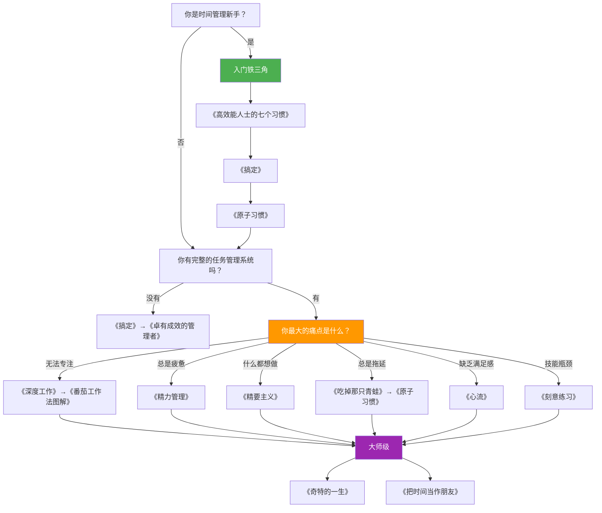

## 一、推荐书籍

时间管理领域的书籍浩如烟海，但真正值得精读的经典屈指可数。本节按照"入门→进阶→专项→大师"四个层级，精选 16 本最具实战价值的书籍，并为每本书提供**核心观点、适用场景、阅读方法、常见误区、实战转化**五个维度的深度解析。文末附有**阅读路径图**和**选书决策表**，帮助你用最少的时间找到最适合自己的书。

### 1.1 如何选书：四层阅读体系

在推荐具体书目之前，先建立一个选书框架。时间管理类书籍可以按"道法术器"四层分类：

| 层级 | 定位 | 解决的问题 | 典型书籍 |
|------|------|-----------|---------|
| **道——理念层** | 建立时间管理的世界观和价值观 | 为什么时间管理很重要？我该追求什么样的生活？ | 《高效能人士的七个习惯》《精要主义》 |
| **法——系统层** | 提供完整的管理框架和方法论 | 如何设计一套适合自己的时间管理系统？ | 《搞定》《卓有成效的管理者》 |
| **术——技巧层** | 给出具体的操作技巧和工具 | 怎样执行任务更高效？如何对抗拖延？ | 《番茄工作法图解》《吃掉那只青蛙》 |
| **器——心智层** | 深入理解底层心理机制 | 为什么我总是坚持不下去？如何进入心流状态？ | 《心流》《原子习惯》《精力管理》 |

> **关键原则**：先建立"道"的框架，再学习"法"的系统，然后用"术"填充细节，最后用"器"优化底层。很多人时间管理失败的原因，恰恰是跳过了"道"和"法"，直接去学技巧——这就像不学建筑力学就去盖房子，看起来很快，但地基不牢。

### 1.2 入门级：建立时间管理的基本认知

入门书籍的目标是**让你意识到时间管理的价值，并掌握一套最基础的操作系统**。这三本书构成了时间管理入门的"铁三角"。

---

#### 1.2.1 《高效能人士的七个习惯》——史蒂芬·柯维

**出版信息**：1989年首版，全球销量超过4000万册，被翻译成40种语言。中文版由高新勇等翻译，中国青年出版社出版。

**核心观点**：

柯维提出了"以原则为中心"的时间管理哲学，核心是七个习惯的渐进式养成：

1. **积极主动（Be Proactive）**：在刺激与回应之间，你有选择的自由。关注自己的"影响圈"而非"关注圈"——前者是你能改变的事，后者是你只能抱怨的事。
2. **以终为始（Begin with the End in Mind）**：所有事物都经历两次创造——先在头脑中构思，然后在现实中实现。写一份个人使命宣言，明确你的人生方向。
3. **要事第一（Put First Things First）**：这是时间管理的核心习惯。柯维将事务分为四个象限：
   - **第一象限**：重要且紧急（危机、截止日期）→ 立即处理
   - **第二象限**：重要不紧急（规划、学习、预防）→ 重点投入
   - **第三象限**：紧急不重要（他人的请求、某些会议）→ 委托或拒绝
   - **第四象限**：不重要不紧急（刷手机、闲聊）→ 尽量消除
4. 双赢思维、知彼解己、统合综效、不断更新——后四个习惯涉及人际关系和自我更新，但同样影响时间管理的效率。

**适用人群**：所有人，尤其是刚接触时间管理概念的初学者。

**阅读方法**：

- **第一遍**：通读全书，建立整体框架，约需 7-10 天。
- **第二遍**：精读习惯一、二、三，用笔记本记录关键概念，约需 5 天。
- **第三遍**：选择一个习惯，制定 30 天实践计划。

**实战转化**：

读完本书后，立即做以下三件事：
1. 写一份 500 字的个人使命宣言（习惯二的实践）
2. 用一周时间记录自己每天的事务，标注属于哪个象限（习惯三的实践）
3. 每天早上花 5 分钟问自己："今天最重要的三件事是什么？"

**常见误区**：

- ❌ **误区一**：把七个习惯当作清单逐条打卡。七个习惯是一个有机整体，习惯一是基础，习惯二是方向，习惯三是执行，后面四个是扩展。跳过前三个直接学后面的，就像没学走路就想跑。
- ❌ **误区二**：认为"积极主动"就是什么都要自己做。积极主动的核心是**对结果负责**，而不是拒绝帮助。该委托的事务依然要委托。
- ❌ **误区三**：写完个人使命宣言就束之高阁。使命宣言需要每季度回顾和修订，否则它只是一份漂亮的废纸。

**本书在时间管理体系中的位置**：提供"道"——时间管理的底层操作系统。它不教你具体怎么做，而是教你为什么做、做什么。

---

#### 1.2.2 《搞定：无压工作的艺术》（Getting Things Done）——戴维·艾伦

**出版信息**：2001年首版，被誉为"生产力圣经"。中文版由张静翻译，中信出版社出版。2015年出版修订版《搞定I：无压工作的艺术》。

**核心观点**：

GTD 的核心假设是：**大脑是用来产生想法的，不是用来储存想法的**。当你把所有待办事项都记在脑子里时，大脑会不断消耗认知资源去"提醒"你，导致焦虑和注意力分散。GTD 通过建立一个**可信赖的外部系统**来解放大脑。

GTD 的五个核心步骤：

1. **收集（Capture）**：把所有占据你大脑的事情都写下来——工作任务、个人承诺、灵感、担忧，不论大小。使用收件箱（物理的或数字的）统一收集。
2. **理清（Clarify）**：逐条处理收件箱中的每一条内容。问自己："这是什么？需要行动吗？"如果不需要行动，就归档、删除或放入"将来也许"清单。
3. **组织（Organize）**：需要行动的事项，按照"下一步行动"、"项目"、"日程"、"等待"四个清单分类组织。
4. **回顾（Reflect）**：每周做一次"每周回顾"（Weekly Review），清空所有收件箱，更新项目清单，审视日程表，确保系统始终可信。
5. **执行（Engage）**：根据情境、时间、精力和优先级，从清单中选择最合适的事情来做。

**GTD 的几个关键工具**：
- **两分钟原则**：如果一件事能在两分钟内完成，立刻做，不要放进清单。
- **下一步行动（Next Action）**：每个项目的推进，只需要确定"下一步物理动作"。"写报告"不是下一步行动，"打开 Word 文档，写出第一章的提纲"才是。
- **情境清单（Context List）**：按照场景组织任务，如 @电脑、@电话、@外出、@家。

**适用人群**：感觉事情太多、压力太大、大脑不够用的人；需要同时管理多个项目的专业人士。

**阅读方法**：

- **第一遍**：通读全书，理解 GTD 的整体框架和五个步骤。不要试图一次记住所有细节。
- **实践期**：读完后立即花一个周末做一次"大脑清扫"（Mind Sweep），把脑子里所有的事情都写下来，然后按照五个步骤处理。
- **第二遍**：实践两周后重读，重点关注你遇到困难的环节。

**实战转化——GTD 启动清单**：

□ 准备工具：一个收集工具（笔记本或 App）+ 几个清单（项目、下一步行动、日程、等待、将来也许）
□ 大脑清扫：花 30 分钟，写下脑子里所有未完成的事项（目标：100+ 条）
□ 逐条理清：对每条事项问"需要行动吗？"→ 两分钟原则 → 归类
□ 建立项目清单：所有需要多步才能完成的事情都列为项目，每个项目确定一个"下一步行动"
□ 设置每周回顾提醒：固定每周五下午 4 点，花 30 分钟做每周回顾

**常见误区**：

- ❌ **误区一**：试图一步到位建立完美的 GTD 系统。GTD 的精髓在于**持续迭代**，第一版系统一定会很粗糙，但只要每周回顾，它会越来越完善。
- ❌ **误区二**：把"每周回顾"当成可选项。没有每周回顾的 GTD 系统会在两到三周内崩溃——你会不再信任清单，然后重新把事情记在脑子里。
- ❌ **误区三**：过度依赖工具。GTD 是方法论，不是 App。用纸笔完全可以运行 GTD，不要花太多时间在选择和配置工具上。
- ❌ **误区四**：把所有事情都标为高优先级。GTD 不强调优先级排序，而是强调**情境匹配**——在正确的时间、正确的地点、有正确的精力时，做正确的事。

**本书在时间管理体系中的位置**：提供"法"——一套完整的个人任务管理系统。

---

#### 1.2.3 《原子习惯》（Atomic Habits）——詹姆斯·克利尔

**出版信息**：2018年首版，全球销量超过1500万册。中文版由迩东晨翻译，北京联合出版公司出版。

**核心观点**：

习惯养成不靠意志力，靠系统设计。克利尔提出了习惯养成的四步模型：

1. **让它显而易见（Make it Obvious）**：
   - 使用"习惯记分卡"盘点现有习惯
   - 使用"实施意图"：我将在[时间]于[地点]做[行为]
   - 使用"习惯叠加"：在[现有习惯]之后，我会[新习惯]

2. **让它有吸引力（Make it Attractive）**：
   - 将你想培养的习惯与你喜欢的事情绑定（诱惑捆绑）
   - 加入一个你渴望成为的那种人的社群
   - 创建"动机仪式"——在做困难的事之前，做一件你喜欢的事

3. **让它简便易行（Make it Easy）**：
   - 减少阻力：提前准备好环境（如前一晚摆好运动服）
   - 使用"两分钟规则"：任何新习惯的开始版本，都不超过两分钟
   - 使用承诺装置：提前做出不可撤回的决定

4. **让它令人愉悦（Make it Satisfying）**：
   - 即时奖励：完成习惯后给自己一个小奖励
   - 习惯追踪：可视化你的连续打卡记录
   - "绝不错过两次"规则：错过一天可以，但绝不连续错过两天

**适用人群**：想养成好习惯但总是失败的人；想戒除坏习惯的人。

**阅读方法**：

- 精读全书，约需 5-7 天。
- 每读完一个定律，立即在自己的生活中选一个习惯来实践。
- 建议同时阅读《习惯的力量》（查尔斯·都希格）作为补充。

**实战转化**：

选择一个你想养成的时间管理习惯（例如"每天早上花 10 分钟规划当天任务"），用四步模型设计：

显而易见：把笔记本放在床头柜上，旁边贴一张提醒便签
有吸引力：规划完之后奖励自己一杯喜欢的咖啡
简便易行：只写三件事，不求完美，两分钟就能完成
令人愉悦：在习惯追踪 App 上打卡，看到连续记录会很有成就感

**常见误区**：

- ❌ **误区一**：关注目标而不是系统。"我要每天早起"是目标，"我把闹钟放在房间另一端、前一晚 10 点关灯、起床后立刻洗脸"是系统。系统比目标重要。
- ❌ **误区二**：一次培养太多习惯。建议同时不超过 2-3 个新习惯，否则注意力分散，每个都坚持不下来。
- ❌ **误区三**：忽略环境设计。人的行为 70% 以上由环境触发。想减少刷手机，就把手机放到另一个房间，而不是靠意志力。

**本书在时间管理体系中的位置**：提供"器"——习惯是时间管理的基础设施，没有好的习惯，再好的系统也执行不了。

### 1.3 进阶级：构建高效的个人管理系统

进阶书籍的目标是**深化你对时间管理的理解，提供更高级的方法论和工具**。读完入门三本之后，你已经有了一套基本操作系统，现在需要升级硬件。

---

#### 1.3.1 《深度工作》（Deep Work）——卡尔·纽波特

**出版信息**：2016年首版。中文版由宋伟翻译，江西人民出版社出版。

**核心观点**：

**深度工作**是指在无干扰状态下进行的高认知需求的专业活动。它能创造新价值，提升技能，且难以复制。与之对应的是**浮浅工作**——低认知需求的、往往在干扰中完成的事务性工作。

纽波特的核心论点：在信息经济时代，两种人会越来越成功——**能够快速掌握复杂事物的人**和**能够在质量和速度方面达到精英水平的人**。这两种能力都依赖深度工作。

**深度工作的四种哲学**：

| 哲学 | 策略 | 适用人群 | 代表人物 |
|------|------|---------|---------|
| 禁欲主义 | 彻底消除浮浅工作 | 有明确且单一产出目标的人 | 尤安·格拉斯（科幻作家，无社交媒体） |
| 双模式 | 划分大块时间做深度工作，其余时间做浮浅工作 | 有季节性或项目制工作的人 | 卡尔·荣格（在塔楼中深度工作，在诊所中浮浅工作） |
| 节奏主义 | 将深度工作变成日常习惯，固定时间段执行 | 上班族、需要兼顾多种职责的人 | 沃尔特·艾萨克森（每天固定时间写作） |
| 记者主义 | 随时随地进入深度工作 | 已有深度工作基础的人 | 沃尔特·艾萨克森（在碎片时间也能写作） |

**四个核心规则**：
1. **养成习惯**：为深度工作建立固定的时间、地点和流程。
2. **拥抱无聊**：训练自己在不刺激的环境中保持专注。不要用刷手机填满每一分钟空闲。
3. **远离社交媒体**：对社交媒体做"工匠式"评估——只有当它对核心目标的正面影响远大于负面影响时才使用。
4. **消除浮浅工作**：量化每项工作的深度，为深度工作分配固定时间比例，用时间块规划每一天。

**适用人群**：知识工作者、创意工作者、程序员、写作者、研究人员。

**阅读方法**：

- 精读全书，重点阅读第二部分（规则一到规则四），约需 7 天。
- 读完后立即实施：选择一种深度工作哲学，设计你自己的深度工作日程。

**实战转化**：

第一周实验：
1. 确定你的"深度工作时间段"（建议早上 9:00-12:00，共 3 小时）
2. 在这段时间内：关闭所有通知、手机静音放抽屉、关掉邮件客户端
3. 在纸上写下你接下来 3 小时要完成的具体任务
4. 使用计时器，每 90 分钟休息 10 分钟
5. 每天结束时记录"今天深度工作了几小时"，目标：从 1 小时逐步提升到 4 小时

**常见误区**：

- ❌ **误区一**：认为深度工作就是"安静地坐着"。深度工作的核心是**高认知负荷**——你在做需要高度集中注意力的困难任务，而不是在安静环境中回复邮件。
- ❌ **误区二**：一开始就想做 4 小时深度工作。新手的深度工作耐力通常只有 1-2 小时，需要像锻炼肌肉一样逐步提升。
- ❌ **误区三**：只在"有灵感"时才做深度工作。灵感是深度工作的产物，不是前提条件。先坐下来做，灵感会来的。

---

#### 1.3.2 《精力管理》（The Power of Full Engagement）——吉姆·洛尔、托尼·施瓦茨

**出版信息**：2003年首版。中文版由付涛翻译，中国青年出版社出版。

**核心观点**：

传统时间管理关注"如何分配有限的时间"，精力管理关注"如何创造和恢复有限的精力"。洛尔和施瓦茨提出了精力的四个维度：

1. **体能精力**：身体状态——睡眠、运动、饮食、呼吸。
2. **情绪精力**：心理状态——积极情绪（自信、自控、共情）vs 消极情绪（恐惧、焦虑、愤怒）。
3. **注意力精力**：认知状态——专注力的广度和深度。
4. **意义精力**：精神状态——与个人价值观和使命感的连接程度。

核心理念是**"精力消耗-恢复"的平衡**。像运动员一样，高强度工作后必须有充分的恢复期。持续消耗不恢复，会导致精力枯竭（burnout）。

**精力管理的四个原则**：
1. 全情投入需要调动四种独立精力
2. 因为精力储量有限，必须有节奏地消耗和恢复
3. 要超越惯常极限，需要系统性地训练
4. 积极的精力仪式习惯是全情投入的保障

**适用人群**：经常感到疲惫、工作缺乏持续动力的人；面临高强度工作的专业人士；管理者和创业者。

**阅读方法**：

- 精读全书，约需 5-7 天。
- 读完后制作一张"精力审计表"，记录一周内四个维度的精力波动情况。

**实战转化——精力审计模板**：

日期：____
体能精力（1-10）：____ | 睡眠质量：____ | 运动：____ | 饮食：____
情绪精力（1-10）：____ | 主要情绪：____ | 触发事件：____
注意力精力（1-10）：____ | 深度工作时长：____ | 干扰次数：____
意义精力（1-10）：____ | 今天做的事与长期目标相关吗？____

**常见误区**：

- ❌ **误区一**：认为精力管理就是"多睡觉"。睡眠只是体能精力的一个维度，情绪、注意力和意义感同样需要管理和恢复。
- ❌ **误区二**：在"精力低谷期"硬撑。正确的做法是在低谷期做低强度的事务性工作，在高峰期做需要深度思考的核心工作。

---

#### 1.3.3 《卓有成效的管理者》——彼得·德鲁克

**出版信息**：1966年首版，管理学经典中的经典。中文版由许是祥翻译，机械工业出版社出版。

**核心观点**：

德鲁克认为"有效性"是可以学会的。他提出了五个核心习惯：

1. **掌握自己的时间**：记录时间→分析时间→管理时间。大多数人低估了自己在琐事上浪费的时间。
2. **重视贡献**：不要问"我能做什么"，要问"我能贡献什么"。
3. **用人之长**：关注人的长处而非短处，包括自己的长处。
4. **要事优先**：一次只做一件最重要的事，勇于"摆脱昨天"。
5. **有效决策**：决策不在于速度，而在于是否系统——明确问题→界定边界条件→考虑替代方案→执行→反馈。

**适用人群**：管理者、知识工作者、创业者。

**阅读方法**：

- 精读，重点阅读第二章"掌握自己的时间"——这是整本书的基石。
- 建议做一次"德鲁克式时间审计"：连续两周，每隔 15 分钟记录一次你在做什么。

**实战转化**：

德鲁克的时间审计三步法：
1. **记录**：连续两周，每 15 分钟记录一次实际在做的事（不是"计划做什么"）
2. **分析**：找出"根本不必做的事"和"可以由别人代为且效果更好的事"
3. **管理**：将节省出的时间集中用于最重要的事项

**常见误区**：

- ❌ 以为这只是一本管理学教科书。实际上，第二章关于时间管理的论述，比大多数专门的时间管理书籍都要深刻。

---

#### 1.3.4 《精要主义》（Essentialism）——格雷格·麦吉沃恩

**出版信息**：2014年首版。中文版由邵信芳翻译，浙江人民出版社出版。

**核心观点**：

精要主义不是"如何完成更多事情"，而是"如何只做正确的事情"。核心理念：**更少，但更好**。

精要主义者的思维方式：
- **探索**：区分"少数重要的事"和"多数不重要的事"
- **排除**：学会说"不"——对不重要的事情坚决拒绝
- **执行**：移除障碍，让重要的事变得毫不费力

关键概念：
- **90% 法则**：如果一件事不是明确的"Yes"，那就是"No"
- **沉默的力量**：留出思考空间，不要用日程填满每一分钟
- **缓冲器**：为不可预期的事情预留时间和资源

**适用人群**：总觉得"什么都很重要"的人；害怕拒绝别人的人；日程排得满满当当的人。

**阅读方法**：

- 精读全书，约需 5 天。
- 每读完一个部分，审视自己的日程表，删除或拒绝一件不重要的事。

**实战转化**：

本周做以下练习：
1. 列出你承诺的所有事项（工作项目、社交活动、志愿服务等）
2. 对每一项问自己："如果我现在没有承诺这件事，知道了我现在知道的一切，我还会答应吗？"
3. 对答案为"否"的事项，制定退出计划

**常见误区**：

- ❌ 把精要主义理解为"偷懒"或"少做事"。精要主义是"少做不重要的事，把精力集中到最重要的事上"——你的总产出会更高，而不是更低。

### 1.4 专项深入：针对特定痛点的深度读物

当你已经建立了时间管理系统，可能还有一些具体的痛点需要解决。这些书籍针对特定场景提供深度指导。

---

#### 1.4.1 《心流》（Flow）——米哈里·契克森米哈赖

**出版信息**：1990年首版，积极心理学奠基之作。中文版由张定绮翻译，中信出版社出版。

**核心观点**：

心流是一种**完全沉浸在某项活动中的最优体验状态**。在心流状态下：
- 时间感消失（几个小时感觉像几分钟）
- 自我意识消失（不再担心别人的评价）
- 注意力完全集中在当前任务上
- 效率和创造力达到巅峰
- 内在满足感强烈（活动本身就是奖励）

**进入心流的条件**：
1. 任务有明确的目标
2. 任务有即时的反馈
3. 技能水平与挑战难度匹配（太简单→无聊，太难→焦虑）
4. 高度专注，无外界干扰

**适用人群**：希望提升工作和学习体验质量的人；想在工作中获得更多满足感的人。

**阅读方法**：

- 选读，重点阅读第三章（心流的构成要素）和第九章（如何在日常生活中创造心流）。
- 可以跳过关于冒险运动和艺术创作的章节，除非这些与你的工作直接相关。

**实战转化**：

在你的深度工作时间段，刻意创造心流条件：
1. 明确任务目标（"完成第三章的初稿"而非"写点东西"）
2. 选择难度适中的任务（比当前能力高 10-20%）
3. 关闭所有干扰源
4. 设置一个可见的进度条（如字数统计、完成的步骤数）

---

#### 1.4.2 《清单革命》——阿图·葛文德

**出版信息**：2009年首版。中文版由王佳艺翻译，浙江人民出版社出版。

**核心观点**：

在复杂的世界中，人类的认知能力是有限的。即使是最优秀的专家，也会因为记忆疏忽、注意力分散而犯错。**清单是应对复杂性的最简单、最有效的工具**。

葛文德将清单分为两种类型：
- **执行清单（Do-Confirm）**：在关键节点暂停，确认所有步骤都已完成
- **核实清单（Read-Do）**：按照清单逐步执行，像菜谱一样

**适用人群**：需要处理复杂流程的专业人士；经常遗忘关键步骤的人。

**阅读方法**：

- 泛读全书，约需 3-4 天。
- 读完后，为你最常做的一项复杂任务（如出差准备、项目启动、每周回顾）制作一份清单。

**实战转化**：

制作一份"每周回顾清单"模板：

□ 清空所有收件箱（邮件、笔记、消息）
□ 更新项目清单：每个项目是否有下一步行动？
□ 回顾日程表：下周有哪些已安排的事项？
□ 回顾"等待"清单：需要跟谁确认什么？
□ 回顾目标：本周为目标做了什么？下周重点是什么？
□ 清理工作台：物理和数字工作环境都整理干净

---

#### 1.4.3 《刻意练习》（Peak）——安德斯·艾利克森、罗伯特·普尔

**出版信息**：2016年首版。中文版由马正飞、王正林翻译，机械工业出版社出版。

**核心观点**：

"一万小时定律"是对艾利克森研究的过度简化。**不是任何一万小时都能成为专家，只有刻意练习的一万小时才有用**。刻意练习的四个要素：

1. **明确且具体的目标**：不是"提高写作水平"，而是"每天写一篇 500 字的议论文，重点练习论据组织"
2. **专注和努力**：刻意练习应该是不舒服的——如果你感觉很轻松，说明你没有在进步
3. **即时反馈**：你需要知道自己哪里做对了、哪里做错了。可以通过老师、教练或自我对照标准来获取反馈
4. **走出舒适区**：持续挑战比当前能力稍高一点的难度

**适用人群**：希望在任何领域从新手到专家的人。

**与时间管理的关系**：时间管理本身就是一项技能，需要用刻意练习来提升。不要只是"尝试更高效"，而要具体地练习某个时间管理技能（如番茄钟的执行、GTD 的每周回顾）。

---

#### 1.4.4 《番茄工作法图解》——史蒂夫·诺特伯格

**出版信息**：2009年首版。中文版由大胖翻译，人民邮电出版社出版。

**核心观点**：

番茄工作法由弗朗西斯科·西里洛在 20 世纪 80 年代发明，核心操作如下：

1. **选择一个任务**
2. **设定 25 分钟的计时器**（一个"番茄钟"）
3. **专注工作直到计时器响起**
4. **休息 5 分钟**
5. **每完成 4 个番茄钟，休息 15-30 分钟**

诺特伯格的书对原始方法做了大量扩展，包括：
- **内部中断处理**：突然想到别的事→记在"计划外事项清单"上，继续当前番茄钟
- **外部中断处理**：有人找你→"告知→协商→回电→标记"四步法
- **活动预估**：用历史数据预估任务需要几个番茄钟
- **每日回顾**：对比预估和实际，持续改进预估能力

**适用人群**：想系统学习番茄工作法的人；容易被打断的人。

**阅读方法**：

- 快速阅读，半天可读完。
- 立即开始实践。准备一个计时器（物理的比 App 好），今天就开始做第一个番茄钟。

**实战转化——番茄钟第一天**：

08:30 写下今天要完成的任务清单
08:35 开始第一个番茄钟（25分钟）→ 完成后在任务旁画一个"×"
09:00 休息 5 分钟（离开座位，喝水）
09:05 开始第二个番茄钟
...重复...
12:00 统计上午完成了几个番茄钟，标记被打断的次数

**常见误区**：

- ❌ **误区一**：25 分钟是神圣不可改变的。25 分钟是默认值，你可以根据任务性质调整。深度写作可能需要 45-60 分钟的番茄钟，快速回复邮件可以用 15 分钟。
- ❌ **误区二**：被打断就不算了。记录打断次数比重新开始更重要。数据能帮你发现打断的模式，从而优化你的环境。

---

#### 1.4.5 《吃掉那只青蛙》（Eat That Frog!）——博恩·崔西

**出版信息**：2001年首版，已出第三版。中文版由王岑卉翻译，化学工业出版社出版。

**核心观点**：

"青蛙"指的是你最重要、最困难、最可能拖延的任务。马克·吐温说过："如果你每天早上第一件事就是吃掉一只活青蛙，那你这一天都会很顺利，因为最糟糕的事情已经过去了。"

**21 条时间管理法则中最核心的几条**：

1. **明确目标**：写下你所有的目标，按重要性排序，然后全力以赴执行第一个。
2. **每天列出清单**：前一晚写下第二天要做的 6-8 件事，按优先级编号。
3. **先做最难的**：每天先完成最重要、最困难的任务（吃青蛙）。
4. **考虑后果**：当你不知道该做什么时，问自己："做了哪件事，会对我产生最大的正面影响？"
5. **创造力回避法则**：拖延往往不是因为懒，而是因为任务太模糊。把任务分解得足够小、足够具体，直到没有"回避"的借口。

**适用人群**：严重拖延症患者；每天忙但不知道在忙什么的人。

**阅读方法**：

- 快速阅读，约需 2-3 天。
- 挑选对你最有共鸣的 3-5 条法则，明天就开始实践。

### 1.5 大师级：深度思考时间与人生

这些书不直接教你"如何管理时间"，但它们会从根本上改变你对时间的理解。

---

#### 1.5.1 《奇特的一生》——格拉宁

**出版信息**：1974年首版，传记文学。中文版由侯焕闳译，外国文学出版社出版。

**核心观点**：

柳比歇夫是苏联昆虫学家，从 26 岁开始，连续 56 年记录自己每天的**时间开销**——每件事花了多少小时多少分钟。他的"时间统计法"不是用来约束自己，而是用来**了解自己**。

柳比歇夫的时间管理核心：
- 每天记录每件事的时间开销（精确到分钟）
- 每月做小结，每年做总结
- 基于历史数据来规划未来的时间分配
- 一生发表了 70 余部学术著作，涵盖昆虫学、科学史、遗传学等多个领域

**适用人群**：对时间记录方法感兴趣的人；想知道"极致的时间管理"是什么样子的人。

**阅读方法**：

- 泛读全书，约需 3 天。
- 重点思考：柳比歇夫的方法中，哪些元素可以融入你的日常？

---

#### 1.5.2 《把时间当作朋友》——李笑来

**出版信息**：2009年首版，2016年修订。电子工业出版社出版。

**核心观点**：

时间不可管理，你能管理的只有自己。李笑来提出的核心观点：

1. **用正确的方式与时间做朋友**：接受时间的流逝，专注于"积累"而非"速成"
2. **心智的力量**：你的心智模式决定了你如何使用时间。"认为自己时间不够用"本身就是一个心智模式问题
3. **精确感知时间**：大多数人对时间的感知是不准确的——你以为一小时能做很多事，实际上一小时可能只够写 500 字
4. **学会推迟满足感**：现在的努力是为了未来的回报

**适用人群**：对时间管理有认知偏差的人（高估或低估时间的流逝）；想找一本中文原创时间管理书的人。

**阅读方法**：

- 精读全书，约需 5 天。
- 做笔记，重点记录让你"恍然大悟"的段落。

### 1.6 书目对比与阅读路径

#### 1.6.1 全书目对比表

| 书名 | 作者 | 层级 | 核心主题 | 阅读时间 | 实践难度 | 最适合解决的问题 |
|------|------|------|---------|---------|---------|----------------|
| 高效能人士的七个习惯 | 柯维 | 道 | 以原则为中心的生活 | 10天 | ★★★☆ | 不知道时间管理的意义 |
| 搞定（GTD） | 艾伦 | 法 | 完整的任务管理系统 | 10天 | ★★★★ | 事情太多，脑子不够用 |
| 原子习惯 | 克利尔 | 器 | 习惯养成的系统方法 | 7天 | ★★☆☆ | 好习惯总坚持不下来 |
| 深度工作 | 纽波特 | 术+法 | 专注力培养与保护 | 7天 | ★★★☆ | 总被打断，无法专注 |
| 精力管理 | 洛尔/施瓦茨 | 道+术 | 精力的四维管理 | 7天 | ★★★☆ | 总是感觉疲惫 |
| 卓有成效的管理者 | 德鲁克 | 道+法 | 有效性的五个习惯 | 7天 | ★★★☆ | 忙但不出成果 |
| 精要主义 | 麦吉沃恩 | 道 | 只做重要的事 | 5天 | ★★★☆ | 什么都不敢拒绝 |
| 心流 | 契克森米哈赖 | 器 | 最优体验的心理学 | 7天 | ★★★★ | 工作缺乏满足感 |
| 清单革命 | 葛文德 | 术 | 清单思维 | 3天 | ★☆☆☆ | 总是遗忘关键步骤 |
| 刻意练习 | 艾利克森 | 器+法 | 从新手到专家的路径 | 7天 | ★★★★ | 技能提升遇到瓶颈 |
| 番茄工作法图解 | 诺特伯格 | 术 | 专注力工具 | 半天 | ★☆☆☆ | 容易分心和拖延 |
| 吃掉那只青蛙 | 崔西 | 术 | 先做最难的事 | 3天 | ★★☆☆ | 拖延症严重 |
| 奇特的一生 | 格拉宁 | 器 | 时间统计法 | 3天 | ★★★★ | 想精确了解时间去向 |
| 把时间当作朋友 | 李笑来 | 道 | 与时间做朋友 | 5天 | ★★☆☆ | 对时间有认知偏差 |

#### 1.6.2 阅读路径推荐

#### 1.6.3 不同人群的阅读方案

| 你的身份 | 推荐阅读顺序 | 重点 |
|---------|------------|------|
| 大学生 | 原子习惯 → 番茄工作法 → 深度工作 | 先建立好习惯，再学专注技术 |
| 职场新人 | 七个习惯 → 搞定 → 吃掉那只青蛙 | 先建立价值观，再学任务管理 |
| 中层管理者 | 卓有成效的管理者 → 精力管理 → 精要主义 | 先学会取舍，再管理精力 |
| 创业者 | 精要主义 → 深度工作 → 精力管理 | 先聚焦，再深入，保持能量 |
| 自由职业者 | 搞定 → 番茄工作法 → 原子习惯 | 自律是自由职业的生命线 |
| 程序员/工程师 | 深度工作 → 搞定 → 刻意练习 | 深度工作能力是核心竞争力 |
| 创意工作者 | 心流 → 深度工作 → 精要主义 | 创造力需要保护和培养 |

### 1.7 阅读方法论：如何高效阅读时间管理书籍

读时间管理书籍本身也需要时间管理。以下是经过验证的高效阅读方法：

**第一步：明确目的（5 分钟）**

在翻开书之前，问自己三个问题：
1. 我读这本书想解决什么具体问题？
2. 这本书的哪个部分与我的问题最相关？
3. 我打算用多长时间读完？

**第二步：快速预览（30 分钟）**

- 看目录，标记最感兴趣的章节
- 读前言和结论（作者通常在这里总结核心观点）
- 翻阅每章的开头和结尾

**第三步：主题阅读（核心阶段）**

不要一本一本地读，而是围绕一个主题同时读 2-3 本。例如：
- 要解决"拖延"问题 → 同时读《吃掉那只青蛙》+《原子习惯》+ 相关章节
- 要解决"专注"问题 → 同时读《深度工作》+《番茄工作法图解》+《心流》

**第四步：输出倒逼输入**

每读完一本书（或一个章节），必须完成以下至少一项：
- 写一篇 500 字的读书笔记
- 制作一份思维导图
- 向别人讲一遍核心内容（费曼学习法）
- 制定一个具体的实践计划

**第五步：实践验证**

读完后的一周内，必须将至少一个方法应用到实际工作中。记录效果，对比读书时的预期。如果效果不理想，分析原因，调整后再次尝试。

### 1.8 常见阅读误区

| 误区 | 正确做法 |
|------|---------|
| 一口气读完所有推荐书目 | 根据自己的痛点选 2-3 本精读，其余按需选读 |
| 读完就放下，不做笔记 | 读一本书至少写一篇笔记 + 制定一个实践计划 |
| 试图同时实施所有方法 | 一次只实施一个方法，坚持 21 天后再添加下一个 |
| 只读不做 | 阅读和实践的时间比例应该是 3:7——30% 时间读书，70% 时间实践 |
| 追求完美系统 | 先用一个"60 分"的系统运行起来，再逐步优化到 80 分 |
| 跳过理论直接学技巧 | 没有理论支撑的技巧容易半途而废——先理解"为什么"，再学"怎么做" |
| 只读时间管理类书籍 | 心理学、认知科学、行为经济学的相关书籍同样有价值 |

### 1.9 延伸阅读：相关领域推荐

时间管理不是一个孤立的学科，以下相关领域的书籍也值得一读：

**心理学方向**：
- 《思考，快与慢》——丹尼尔·卡尼曼：理解你的两种思维系统，解释为什么你会做出不理性的决策
- 《自控力》——凯利·麦格尼格尔：基于斯坦福大学课程，科学地理解意志力

**认知科学方向**：
- 《认知天性》——彼得·布朗等：学习的科学，帮你更高效地学习新技能
- 《专注力》——丹尼尔·戈尔曼：注意力的科学，与《深度工作》互为补充

**效率工具方向**：
- 《印象笔记留给你的空间》——李参：数字时代的知识管理方法
- 《卡片笔记写作法》——申克·阿伦斯：卢曼卡片盒方法，适合需要做大量笔记的人

**哲学方向**：
- 《瓦尔登湖》——亨利·梭罗：对"简单生活"的终极追问
- 《禅与摩托车维修艺术》——罗伯特·波西格：关于"良质"（Quality）的哲学思考
