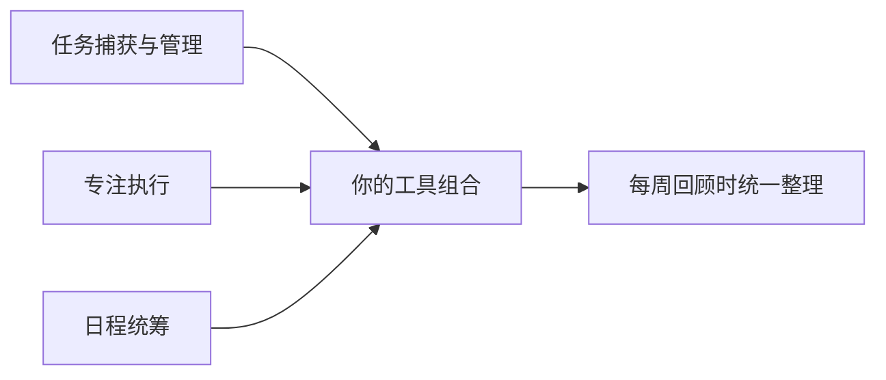
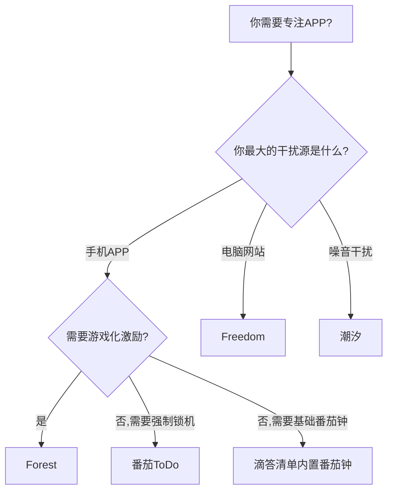

## 二、推荐APP

工具是方法论的载体。前文讲了四象限法则、番茄工作法、GTD、时间块等方法论，但如果没有趁手的工具，这些方法论就只是纸上谈兵。一款好的时间管理APP，本质上是把你选择的方法论"固化"成可执行的操作流程——你不需要每次都回忆"下一步该做什么"，工具会引导你。

本节按照时间管理的核心环节——**任务捕获→优先级排序→专注执行→习惯养成→日程统筹→知识沉淀**——分类推荐主流APP。每款工具不仅列出功能参数，还会分析它的设计哲学、适用场景、真实优缺点，以及与其他工具的组合方式。

### 2.0 选工具之前：三原则

在逐一看APP之前，先建立选择框架，避免"工具收集癖"——装了十个APP，每个只用了两天。

**原则一：先定方法，再选工具**

不同的方法论对工具有不同的要求：

| 方法论 | 核心需求 | 推荐工具类型 |
|--------|----------|--------------|
| GTD | 收集→处理→组织→回顾→执行 的完整流程 | 支持项目/上下文/标签的任务管理工具 |
| 番茄工作法 | 25分钟计时 + 休息提醒 + 专注统计 | 番茄钟APP |
| 四象限法则 | 重要-紧急矩阵视图 | 支持优先级标记的任务管理工具 |
| 时间块法 | 将一天划分为固定时间块 | 日历/时间块APP |
| 艾森豪威尔矩阵 | 二维分类决策 | 支持多维标签的任务管理工具 |

**原则二：工具越少越好**

一个合理的时间管理工具组合通常不超过3个APP：

- **最小组合**（1个APP）：滴答清单——任务+番茄钟+日历+习惯，四合一
- **推荐组合**（2-3个APP）：Todoist/滴答清单 + Forest/潮汐 + Google Calendar
- **重度组合**（4个APP）：Notion/Obsidian + Todoist + 专注APP + 日历

**原则三：迁移成本要评估**

选工具前问自己三个问题：
1. **数据可导出吗？** 如果APP倒闭或你想换工具，数据能否导出为通用格式（CSV/JSON/Markdown）？
2. **跨平台吗？** 你用几台设备？手机、平板、电脑、手表之间能否无缝同步？
3. **免费版够用吗？** 很多APP的免费版已经足够个人使用，不要为了"可能用到的功能"付费。

---

### 2.1 待办清单与任务管理类

任务管理是时间管理的基础设施。你所有需要做的事情，都应该有一个统一的"收件箱"，而不是散落在微信聊天、便签纸、脑子里。

#### Todoist

- **平台**：iOS、Android、Web、Mac、Windows、Chrome插件、Apple Watch
- **核心功能**：任务管理、项目分类、标签系统、优先级标记（P1-P4）、重复任务、协作、看板视图
- **设计哲学**：极简主义。Todoist的设计理念是"让你尽快回到现实中"——打开APP、录入任务、关闭APP、去做事。它不会用花哨的功能让你沉迷于"管理任务"本身。
- **自然语言输入**：这是Todoist的核心竞争力。输入"每周一上午9点提交周报 #工作 p1"，系统自动识别：
  - "每周一上午9点" → 重复任务，每周一09:00提醒
  - "#工作" → 归入"工作"项目
  - "p1" → 优先级1（最高）
- **Karma积分系统**：完成任务得积分，连续完成得加成，这是一种行为心理学上的"正强化"机制。虽然听起来幼稚，但实际效果显著——你会为了不断掉连续记录而坚持完成每日任务。
- **价格**：免费版支持5个项目、每个项目最多5个协作者、基础过滤器；专业版约30元/月，解锁无限项目、标签、提醒、AI助手
- **真实优缺点**：
  - ✅ 自然语言输入业界最好，上手零门槛
  - ✅ 跨平台同步极快，几乎无延迟
  - ✅ API开放，可以和各种自动化工具集成
  - ❌ 免费版限制较多（5个项目上限对重度用户不够用）
  - ❌ 中文自然语言识别不如英文准确
  - ❌ 不内置番茄钟和日历视图（需要配合其他工具）
- **适合人群**：追求效率、不喜欢复杂界面、需要跨平台同步的用户
- **GTD实操**：用Todoist实现GTD的典型配置：
  - 项目(Projects) = GTD的"项目"
  - 标签(Labels) = GTD的"上下文"（@电脑、@电话、@外出、@家里）
  - 收件箱(Inbox) = GTD的"收集箱"
  - 过滤器(Filters) = GTD的"下一步行动"视图（筛选标签为@电脑且今天到期的任务）

#### 滴答清单（TickTick）

- **平台**：iOS、Android、Web、Mac、Windows、Chrome插件、Apple Watch、iPad
- **核心功能**：任务管理、日历视图、番茄钟、习惯追踪、白噪音、看板视图、清单模板
- **设计哲学**：All-in-one。滴答清单的目标是让你只用一个APP就搞定所有时间管理需求。它把任务、日历、番茄钟、习惯追踪全部整合在一个界面里。
- **核心优势分析**：
  - **日历视图**：不仅能看到任务，还能同步Google/Outlook日历，实现"任务+日程"统一视图。这是Todoist没有的功能。
  - **内置番茄钟**：专注计时直接关联到具体任务，结束后自动记录该任务的专注时长。不需要额外开一个番茄钟APP。
  - **习惯追踪**：每日习惯打卡直接显示在任务列表上方，形成"今日任务+今日习惯"的统一看板。
  - **白噪音**：内置雨声、咖啡厅、图书馆等环境音，专注时直接播放，不需要额外的白噪音APP。
- **价格**：免费版功能已经非常丰富（任务+日历+番茄钟+习惯），高级版139元/年，解锁日历订阅、更多习惯数量、更丰富的统计
- **真实优缺点**：
  - ✅ 功能最全面，真正的一站式解决方案
  - ✅ 对中文用户极其友好，服务器在国内，同步速度快
  - ✅ 日历视图+任务的组合体验极佳
  - ✅ 价格合理，性价比高
  - ❌ 功能太多导致界面稍显复杂，学习曲线比Todoist高
  - ❌ 自然语言输入不如Todoist智能
  - ❌ 部分高级功能（如日历订阅）需要付费
- **适合人群**：希望一个APP解决所有问题的用户；中文用户首选；学生和职场人士都适用
- **与Todoist的选择决策**：

| 对比维度 | Todoist | 滴答清单 |
|----------|---------|----------|
| 界面简洁度 | ⭐⭐⭐⭐⭐ | ⭐⭐⭐⭐ |
| 功能全面性 | ⭐⭐⭐ | ⭐⭐⭐⭐⭐ |
| 自然语言输入 | ⭐⭐⭐⭐⭐ | ⭐⭐⭐ |
| 日历集成 | ⭐⭐ | ⭐⭐⭐⭐⭐ |
| 番茄钟 | ❌（需外部工具） | ✅ 内置 |
| 习惯追踪 | ❌（需外部工具） | ✅ 内置 |
| 中文体验 | ⭐⭐⭐ | ⭐⭐⭐⭐⭐ |
| 价格 | 免费版受限，付费偏贵 | 免费版够用，付费便宜 |
| 生态开放性 | ⭐⭐⭐⭐⭐（API丰富） | ⭐⭐⭐ |

**结论**：如果你在中国大陆使用，且不想折腾多个APP，滴答清单是最优选择。如果你追求极简体验，且愿意搭配其他工具，Todoist更合适。

#### Microsoft To Do

- **平台**：iOS、Android、Web、Windows、Mac
- **核心功能**：任务管理、清单分组、"我的一天"功能、共享清单、步骤（子任务）、备注、附件
- **设计哲学**：简洁免费。Microsoft To Do的前身是大名鼎鼎的Wunderlist（奇想清单），被微软收购后重新设计。它的定位是"够用就好"——不追求功能全面，而是把最核心的任务管理做到极致简洁。
- **"我的一天"功能**：这是To Do的核心设计。每天打开APP，它会建议你把今天要做的任务添加到"我的一天"。这个设计基于一个心理学原理：**当人们面对一个长长的待办清单时，反而会焦虑和拖延；而一个聚焦于"今天"的短清单，更容易让人行动起来。**
- **与Outlook集成**：如果你用Outlook收发邮件，可以将邮件直接"标记"为任务，自动出现在To Do里。这对办公场景非常实用。
- **价格**：完全免费，无任何付费功能
- **真实优缺点**：
  - ✅ 完全免费，无任何限制
  - ✅ 界面极简，零学习成本
  - ✅ 与Microsoft 365深度集成
  - ✅ 支持共享清单，适合家庭/小团队协作
  - ❌ 功能偏基础，没有标签系统、自然语言输入
  - ❌ 没有日历视图
  - ❌ 统计分析功能几乎为零
- **适合人群**：Microsoft 365用户；只需要基础任务管理的用户；预算为零的用户

#### 任务管理类APP的补充选择

除了以上三款主流工具，还有几个值得了解的选项：

**Things 3**（仅Apple平台）：苹果设计奖得主，被认为是"最漂亮的任务管理APP"。采用"GTD轻量化"设计——项目、标题、任务、检查清单四级结构，操作极其流畅。缺点是仅限Apple生态，且价格较高（iPhone版约68元，Mac版约518元，均为一次性购买）。

**OmniFocus**（仅Apple平台）：GTD重度用户的终极武器。支持透视(Perspectives)自定义视图、检视(Review)功能自动提醒你定期回顾项目、预测模式显示未来日程。缺点是学习曲线极陡峭，价格很高（订阅制约98元/月），仅限Apple生态。适合GTD深度实践者。

**Notion**（见2.5节笔记与知识管理类）：Notion可以搭建任务管理系统，但它的核心优势是灵活性而非任务管理效率。如果你需要的是"快速录入、快速完成"的任务管理，Todoist或滴答清单更好；如果你需要的是"高度自定义的项目管理系统"，Notion更合适。

---

### 2.2 番茄钟与专注类

番茄工作法的核心是"时间盒"(Timeboxing)——给任务设定一个固定时长，全身心投入，时间到了就休息。专注类APP的价值在于：**它帮你抵抗手机这个最大的注意力杀手**。

#### Forest（专注森林）

- **平台**：iOS（约25元一次性购买）、Android（免费+内购）、Chrome插件（免费）
- **核心功能**：番茄钟 + 游戏化种植
- **使用流程**：
  1. 打开Forest，设定专注时长（10-120分钟可调）
  2. 点击"种植"，屏幕显示一棵正在生长的树苗
  3. 在专注期间，如果你切换到其他APP（比如刷微博），树苗会枯萎
  4. 专注成功，树苗长成大树，加入你的森林
  5. 累积虚拟金币可以在现实中种真树（与Trees for the Future合作）
- **设计心理学分析**：Forest成功利用了三个行为心理学原理：
  - **损失厌恶**：枯萎的树比"计时器归零"更有心理冲击力
  - **即时反馈**：看着树苗成长的过程本身就是一种奖励
  - **社会认同**：你可以分享自己的森林给朋友，形成社交压力
- **真实优缺点**：
  - ✅ 游戏化设计非常成功，确实能让人放下手机
  - ✅ 环保理念增加了行为的意义感
  - ✅ 深度专注模式可以屏蔽指定APP（需授权）
  - ❌ 番茄钟功能比较基础，没有详细的专注统计
  - ❌ 不支持任务关联（无法知道每个任务的专注时长）
  - ❌ iOS版收费，Android免费版有广告
- **适合人群**：手机重度依赖者；需要"强制"放下手机的用户；喜欢游戏化激励的用户

#### 潮汐（Tide）

- **平台**：iOS、Android
- **核心功能**：专注计时 + 自然声音 + 睡眠辅助 + 冥想引导
- **设计哲学**：潮汐不是一款"番茄钟APP"，而是一款"声景体验APP"。它的核心体验是：选择一种自然声音（雨声、海浪、森林鸟鸣、咖啡厅白噪音等），然后在这种声音的包裹下进入专注状态。
- **使用场景分析**：
  - **学习/工作专注**：选择"专注"模式，设定时长，配合自然声音进入心流
  - **午休/小憩**：选择"小憩"模式，设定15-30分钟，用海浪声助眠
  - **夜间睡眠**：选择"睡眠"模式，播放持续的白噪音帮助入睡
  - **冥想**：选择"呼吸"模式，跟随呼吸引导进行正念冥想
- **价格**：基础功能免费（每天3次专注），高级版128元/年，解锁无限专注、全部声音、睡眠故事
- **真实优缺点**：
  - ✅ 声音品质极高，是同类APP中最好的
  - ✅ 界面设计精美，视觉和听觉体验统一
  - ✅ 一个APP覆盖专注、睡眠、冥想三个场景
  - ❌ 专注统计功能较弱
  - ❌ 没有任务关联功能
  - ❌ 免费版每天只能专注3次，对重度用户不够用
- **适合人群**：需要白噪音辅助专注的用户；注重生活品质的用户；有睡眠困扰的用户

#### 番茄ToDo

- **平台**：iOS、Android
- **核心功能**：番茄钟 + 待办管理 + 学习统计 + 习惯打卡 + 自习室
- **中国特色功能**：
  - **学霸模式**：开启后强制锁定手机，退出APP会发出警告声，适合需要"自虐式"自律的用户
  - **自习室**：可以看到其他人正在专注的状态，形成"大家都在学习"的氛围
  - **学习数据统计**：按科目/课程分类统计学习时长，生成学习报告，适合备考人群
  - **倒计时**：支持考试倒计时，如"距离高考还有XX天"
- **价格**：基础功能免费，高级版约98元/年
- **真实优缺点**：
  - ✅ 专为中国学生设计，功能高度贴合学习场景
  - ✅ 学霸模式的强制锁定效果强
  - ✅ 自习室的社交监督功能独特
  - ✅ 价格便宜
  - ❌ 界面设计偏"学生风"，职场人士可能觉得不够专业
  - ❌ 功能杂糅，有些功能用不上
  - ❌ iOS版体验不如Android版
- **适合人群**：中国学生群体；备考人群（考研、考公、高考）；需要强制锁机功能的用户

#### 其他专注工具

**Focus@Will**：基于神经科学研究的"专注音乐"服务。它不是简单的白噪音，而是经过特殊编排的音乐流派，声称能延长专注时长达200%-400%。价格较高（约60元/月），适合对专注音乐有需求的用户。

**Freedom**：跨平台的网站/APP屏蔽工具。它可以设定屏蔽名单（如微博、抖音、知乎），在专注期间这些网站和APP将无法访问。适合需要"物理隔离"干扰源的用户。支持Windows、Mac、iOS、Android、Chrome，年费约200元。

**专注类APP选择决策树**：

---

### 2.3 习惯追踪类

习惯是时间管理的"自动化层"——当一个行为变成习惯后，你不需要消耗意志力就能执行它。习惯追踪APP的作用是：**让习惯的形成过程可视化，让你看到自己的进步**。

#### Habitica

- **平台**：iOS、Android、Web
- **核心功能**：习惯追踪 + RPG游戏化系统
- **游戏化机制详解**：
  - **角色系统**：创建一个RPG角色，有生命值(HP)、经验值(EXP)、金币(Gold)
  - **任务类型**：习惯(Habits)、每日任务(Dailies)、待办(To-Dos)三种
  - **奖惩机制**：完成任务获得EXP和金币；未完成每日任务或点击负面习惯会扣HP；HP归零角色"死亡"（掉级掉装备）
  - **装备系统**：用金币购买装备提升角色属性
  - **宠物系统**：完成任务获得宠物蛋和食物，孵化和喂养宠物
  - **组队系统**：加入队伍一起打怪，队伍成员的完成情况会影响Boss战结果
- **设计心理学分析**：Habitica把"延迟满足"变成了"即时满足"——习惯养成的回报（健康、效率提升）通常在几周甚至几个月后才能感知到，但RPG里的经验值和装备升级是即时的。这种"替代性即时反馈"大大降低了习惯养成的心理门槛。
- **价格**：基础功能完全免费，有内购（主要是装饰性道具，不影响游戏平衡）
- **真实优缺点**：
  - ✅ 游戏化深度最高，RPG元素丰富
  - ✅ 组队系统创造了社交责任
  - ✅ 完全免费，无功能限制
  - ❌ 学习成本较高，RPG系统需要时间理解
  - ❌ 界面不够精美，像素风格不够现代
  - ❌ 如果你对RPG不感兴趣，游戏化机制反而会成为负担
  - ❌ 过度游戏化可能让人关注"升级"而非真正的习惯养成
- **适合人群**：游戏玩家；需要强游戏化激励的用户；喜欢社交监督的用户

#### Streaks

- **平台**：iOS、Apple Watch
- **核心功能**：习惯追踪，最多同时追踪24个习惯
- **设计哲学**：极简中的极简。Streaks只有一个核心指标——**连续天数(Streak)**。它的设计基于一个行为科学发现：**人们一旦建立了连续记录，就不想"断掉"。** 这种心理被称为"连续效应"(Streak Effect)。
- **Apple Watch集成**：Streaks可以自动追踪Apple Watch上的健康数据（步数、心率、站立时间等），无需手动打卡。这是它在Apple生态中的独特优势。
- **价格**：约30元（一次性购买，无订阅）
- **真实优缺点**：
  - ✅ 设计极简，打开就能打卡
  - ✅ Apple Watch自动追踪健康习惯
  - ✅ 一次性购买，无订阅
  - ✅ 2016年苹果设计奖得主
  - ❌ 仅限Apple平台，Android用户无法使用
  - ❌ 功能较基础，没有详细统计
  - ❌ 24个习惯上限可能不够用
- **适合人群**：Apple生态用户；喜欢极简设计的用户；追求"连续天数"成就感的用户

#### Loop Habit Tracker

- **平台**：仅Android
- **核心功能**：习惯追踪、频率日历、趋势图表、数据导出
- **开源优势**：Loop是完全开源的（GitHub: iSoron/uhabits），这意味着：
  - 代码公开透明，没有隐私后门
  - 可以自行编译和修改
  - 社区持续维护，不会突然停运
  - 数据完全存储在本地，不上传任何服务器
- **数据分析能力**：Loop的统计功能是同类APP中最强大的：
  - 频率日历：用颜色深浅表示习惯完成情况，一目了然
  - 趋势图表：显示习惯完成率随时间的变化趋势
  - 打卡历史：完整的每日打卡记录
  - 数据导出：支持导出为CSV格式，方便进一步分析
- **价格**：完全免费，无广告，无内购
- **真实优缺点**：
  - ✅ 完全免费开源，无任何限制
  - ✅ 数据统计功能强大
  - ✅ 隐私安全，数据本地存储
  - ✅ 无广告，界面干净
  - ❌ 仅限Android平台
  - ❌ 界面设计偏朴素，不够精美
  - ❌ 没有游戏化元素，激励性较弱
- **适合人群**：Android用户；注重隐私的用户；喜欢数据分析的用户；开源软件爱好者

#### 习惯追踪类APP对比

| 维度 | Habitica | Streaks | Loop | 滴答清单（内置） |
|------|----------|---------|------|------------------|
| 平台 | iOS/Android/Web | iOS/Watch | Android | 全平台 |
| 价格 | 免费+内购 | ~30元买断 | 免费 | 高级版139元/年 |
| 游戏化 | ⭐⭐⭐⭐⭐ | ⭐⭐ | ⭐ | ⭐ |
| 统计分析 | ⭐⭐⭐ | ⭐⭐ | ⭐⭐⭐⭐⭐ | ⭐⭐⭐ |
| 易用性 | ⭐⭐⭐ | ⭐⭐⭐⭐⭐ | ⭐⭐⭐⭐ | ⭐⭐⭐⭐ |
| 隐私安全 | ⭐⭐⭐ | ⭐⭐⭐⭐ | ⭐⭐⭐⭐⭐ | ⭐⭐⭐ |
| 最适合 | RPG爱好者 | Apple极简派 | 数据控/隐私派 | All-in-one用户 |

---

### 2.4 日程管理与日历类

日历是时间管理的"骨架"——它定义了你的时间框架。任务管理告诉你"要做什么"，日历告诉你"什么时候做"以及"有多少可用时间"。

#### Google Calendar

- **平台**：iOS、Android、Web
- **核心功能**：日程管理、多日历叠加、提醒、邀请与协作、会议预约（Appointment Slots）、目标自动安排（Goals）
- **核心优势**：
  - **多日历叠加**：可以同时显示工作日历、个人日历、家庭日历、项目日历，用颜色区分。这是Google Calendar最强大的功能之一——你可以在一个视图中看到所有生活维度的时间安排。
  - **Goals（目标）功能**：告诉Google Calendar你的目标（如"每周运动3次"），它会自动在你的空闲时间中找到合适的时间段并安排进去。如果某个时段有冲突，它会自动重新安排。
  - **与Gmail集成**：Gmail中提到时间的邮件（如"周三下午3点开会"）会自动识别并建议创建日历事件。
- **价格**：完全免费
- **真实优缺点**：
  - ✅ 完全免费，无任何限制
  - ✅ 跨平台同步优秀
  - ✅ 多日历叠加视图功能强大
  - ✅ Goals自动安排功能独特
  - ✅ 开放API，与其他工具集成方便
  - ❌ 中国大陆需要科学上网才能使用完整功能
  - ❌ 界面设计中规中矩，不够精美
  - ❌ 任务管理功能较弱（Google Tasks虽然已集成，但功能基础）
- **适合人群**：所有用户（特别是Google生态用户）；需要多日历管理的用户

#### Fantastical

- **平台**：iOS、Mac、Apple Watch、iPad
- **核心功能**：日程管理、自然语言输入、天气集成、任务管理、日历集(Calendar Sets)、会议提案
- **自然语言输入体验**：Fantastical的自然语言输入被公认为业界最佳。示例：
  - 输入"明天下午3点和John在星巴克讨论项目" → 自动创建事件：时间=明天15:00，标题="和John讨论项目"，地点="星巴克"
  - 输入"每周五下午5点健身 #个人" → 重复事件，归入"个人"日历集
  - 输入"12月25日全天 圣诞节" → 全天事件
- **日历集(Calendar Sets)**：可以创建不同的日历集组合，一键切换。例如"工作模式"只显示工作日历和项目日历，"生活模式"显示个人日历和家庭日历。
- **价格**：订阅制约40元/月或280元/年（提供14天免费试用）
- **真实优缺点**：
  - ✅ 自然语言输入体验极佳
  - ✅ 日历集切换功能实用
  - ✅ 界面设计精美
  - ✅ 天气集成（日历视图中显示天气预报）
  - ❌ 仅限Apple生态
  - ❌ 订阅制价格偏高
  - ❌ 不支持Android和Windows
- **适合人群**：Apple生态重度用户；对日历体验有高要求的用户

#### Calendars by Readdle

- **平台**：iOS、Mac
- **核心功能**：日程管理、拖拽排程、多日历支持、自然语言输入
- **拖拽排程**：Calendars的核心体验是"拖拽"——你可以在日历视图中直接拖拽事件来调整时间，操作非常直观流畅。这对于"时间块法"的实践者特别有用：你可以把任务块拖到不同的时间段，像拼图一样安排一天。
- **价格**：基础功能免费，高级版订阅制约28元/月
- **真实优缺点**：
  - ✅ 拖拽排程体验极佳
  - ✅ 视觉设计优秀
  - ✅ 基础功能免费
  - ❌ 仅限Apple平台
  - ❌ 高级功能需要订阅

#### 中国用户日历替代方案

由于Google Calendar在中国大陆的使用受限，以下是国内可用的替代方案：

**滴答清单日历**（见2.1节）：滴答清单内置的日历视图功能已经非常强大，支持任务+日程统一视图，且服务器在国内，同步速度快。

**钉钉/飞书日历**：如果你的公司使用钉钉或飞书办公，其内置日历是最好的选择——与会议、审批、任务深度集成。

**Outlook日历**：Microsoft 365用户的选择，与邮件、Teams深度集成。在中国大陆可以正常使用。

**小米/华为系统日历**：国产手机自带的日历APP通常支持农历显示、节假日提醒、与中国节假日同步等本地化功能，可以作为基础日历使用。

---

### 2.5 笔记与知识管理类

笔记和知识管理看似与"时间管理"无关，但它们是时间管理的"信息基础设施"——你需要一个地方存放项目资料、会议记录、决策依据、反思日志。没有好的知识管理，你就会反复花时间"找东西"和"回忆之前的想法"。

#### Notion

- **平台**：iOS、Android、Web、Mac、Windows
- **核心功能**：笔记、数据库、看板、日历、Wiki、协作、模板
- **在时间管理中的应用**：
  - **GTD系统**：用Notion的数据库搭建完整的GTD系统——收件箱、项目列表、下一步行动、等待清单、参考资料，全部在一个Workspace中
  - **时间管理仪表盘**：用Notion的Dashboard模板，将任务、日历、习惯追踪、周回顾整合在一个页面
  - **每周回顾模板**：创建每周回顾的标准化模板，包括本周完成、下周计划、反思总结
  - **项目管理**：用看板视图管理项目进度，用日历视图查看里程碑
- **Notion vs 专用任务管理工具**：
  - Notion的优势是**灵活性**——你可以设计任何你想要的系统
  - Notion的劣势是**速度**——创建任务的操作步骤比Todoist/滴答清单多3-5步，这在高频操作中会造成显著的时间浪费
  - 建议：用Notion做**项目管理+知识沉淀**，用Todoist/滴答清单做**日常任务管理**
- **价格**：个人使用免费（限制文件上传大小5MB），个人专业版约8美元/月
- **真实优缺点**：
  - ✅ 高度灵活，几乎可以构建任何系统
  - ✅ 模板生态丰富，有大量现成的时间管理模板
  - ✅ 协作功能强大
  - ✅ 个人使用免费
  - ❌ 操作速度较慢，不适合高频任务录入
  - ❌ 离线功能有限
  - ❌ 学习成本高，容易陷入"搭建系统"而非"使用系统"的陷阱
  - ❌ 数据存储在云端，导出格式有限

#### Obsidian

- **平台**：iOS、Android、Mac、Windows、Linux
- **核心功能**：双向链接笔记、知识图谱、插件系统、本地Markdown存储
- **在时间管理中的应用**：
  - **每日日志(Daily Note)**：Obsidian的核心插件之一。每天自动生成一个日期命名的笔记文件，你可以在这里记录当天的任务、想法、反思
  - **Periodic Notes插件**：扩展周记、月记、季度回顾、年度回顾
  - **Tasks插件**：在Markdown中用特殊语法创建任务，支持日期、优先级、重复任务，可以通过查询语法汇总所有待办任务
  - **Kanban插件**：在Obsidian中创建看板视图
  - **Calendar插件**：侧边栏显示日历，点击日期跳转到对应日记
- **核心优势：数据所有权**：
  - Obsidian的所有数据都是本地Markdown文件，你可以用任何文本编辑器打开
  - 不依赖任何云服务——即使Obsidian公司倒闭，你的数据依然完好
  - 可以用Git进行版本控制和同步
  - 隐私性极强——数据不会上传到任何服务器（除非你主动使用同步服务）
- **价格**：个人使用完全免费。同步服务（Obsidian Sync）约8美元/月；发布服务（Obsidian Publish）约16美元/月。也可以用iCloud/Dropbox/Syncthing免费同步。
- **真实优缺点**：
  - ✅ 数据完全归你所有，本地Markdown存储
  - ✅ 插件生态极其丰富
  - ✅ 双向链接构建知识网络
  - ✅ 个人使用免费
  - ✅ 性能优秀，即使上万条笔记也流畅
  - ❌ 学习曲线较陡
  - ❌ 移动端体验不如桌面端
  - ❌ 同步需要自行配置（或付费使用官方同步）
  - ❌ 视觉设计不如Notion精美
- **适合人群**：注重数据隐私的用户；Markdown爱好者；需要构建长期知识体系的用户；技术背景用户

#### Notion vs Obsidian 选择指南

| 维度 | Notion | Obsidian |
|------|--------|----------|
| 数据存储 | 云端 | 本地Markdown |
| 数据所有权 | Notion公司 | 你自己 |
| 离线使用 | 有限 | 完全支持 |
| 协作 | ⭐⭐⭐⭐⭐ | ⭐⭐ |
| 界面美观 | ⭐⭐⭐⭐⭐ | ⭐⭐⭐ |
| 灵活性 | ⭐⭐⭐⭐⭐ | ⭐⭐⭐⭐ |
| 插件生态 | ⭐⭐⭐ | ⭐⭐⭐⭐⭐ |
| 性能 | ⭐⭐⭐ | ⭐⭐⭐⭐⭐ |
| 学习成本 | 中等 | 较高 |
| 适合场景 | 团协协作、项目管理 | 个人知识管理、写作 |

---

### 2.6 自动化与集成工具

时间管理的终极境界是**自动化**——让工具帮你完成重复性操作，把精力留给真正需要思考的事情。

#### IFTTT（If This Then That）

- **平台**：Web、iOS、Android
- **核心功能**：连接不同的APP和服务，实现自动化工作流
- **时间管理相关示例**：
  - 如果在Todoist中完成了一个标记为"重要"的任务 → 自动在Google Calendar中记录完成时间
  - 如果在Forest中完成了一次专注 → 自动在Google Sheets中记录专注时长
  - 如果明天有日历事件 → 自动发送提醒到手机通知
  - 如果在GitHub上关闭了一个Issue → 自动在Todoist中勾选对应任务
- **价格**：免费版支持5个自动化规则，付费版约15元/月

#### 快捷指令（Shortcuts，仅Apple）

- **平台**：iOS、Mac
- **核心功能**：Apple设备上的自动化工具
- **时间管理相关示例**：
  - "早安模式"：一键显示今日日历、天气、待办清单
  - "专注模式"：一键开启勿扰+打开Forest+播放白噪音
  - "周回顾"：一键汇总本周完成的任务和专注时长
- **价格**：完全免费（Apple设备内置）

#### 滴答清单+日历的联动

如果你选择滴答清单作为核心工具，以下联动方式可以提升效率：
- 滴答清单日历视图同步Google Calendar/Outlook日历 → 任务+日程统一视图
- 滴答清单的Siri集成 → 语音快速添加任务
- 滴答清单的微信小程序 → 在微信中快速添加任务（适合中国用户）

---

### 2.7 工具组合推荐方案

根据不同用户类型，推荐以下工具组合：

#### 方案一：极简方案（1个APP）

**滴答清单**一个APP搞定所有。

- 任务管理：滴答清单
- 番茄钟：滴答清单内置
- 习惯追踪：滴答清单内置
- 日历：滴答清单日历视图

**适合**：不想折腾工具、希望简单高效的用户

#### 方案二：推荐方案（2-3个APP）

- **任务管理**：Todoist 或 滴答清单
- **专注执行**：Forest（游戏化）或 潮汐（声景体验）
- **日历**：Google Calendar 或 系统日历

**适合**：大多数用户

#### 方案三：深度方案（3-4个APP）

- **知识管理**：Obsidian（每日日志+知识沉淀）
- **任务管理**：Todoist（日常任务+项目管理）
- **专注执行**：Forest + Freedom（APP+网站双重屏蔽）
- **日历**：Google Calendar
- **习惯追踪**：Streaks（Apple）或 Loop（Android）

**适合**：对时间管理有深度需求的用户

#### 方案四：团队方案

- **项目管理+协作**：Notion 或 飞书文档
- **任务管理**：Todoist（团队版）或 飞书任务
- **日历**：飞书日历 或 Google Calendar
- **沟通**：飞书 或 钉钉

**适合**：团队协作场景

---

### 2.8 常见误区与纠偏

**误区一：装了APP就等于时间管理了**

APP只是工具，方法论才是核心。很多人花大量时间研究和对比各种APP，却从未认真实践过任何一种时间管理方法。这就像买了最好的跑鞋却从不出门跑步。

**纠偏**：先选定一种方法论（如GTD或番茄工作法），坚持实践两周，再根据实际需求选择工具。

**误区二：同时使用太多APP**

任务在Todoist，日历在Google Calendar，习惯在Habitica，笔记在Notion，番茄钟在Forest……信息分散在五六个地方，每天光是在APP之间切换就浪费大量时间。

**纠偏**：遵循"工具越少越好"原则。如果一个APP能解决的问题，就不要用两个。

**误区三：花太多时间"搭建系统"**

Notion和Obsidian的灵活性是一把双刃剑。很多人沉迷于搭建精美的Dashboard、设计复杂的数据库结构、调试插件配置，却忘了工具的目的是"做事"而不是"设计工具"。

**纠偏**：给自己设定一个时间限制——搭建系统不超过2小时。先用最简配置开始使用，遇到痛点再优化。

**误区四：忽略数据导出和迁移**

当你把所有数据都存在某个APP里，一旦这个APP涨价、停运、或你换了手机系统，数据迁移会非常痛苦。

**纠偏**：优先选择支持数据导出（CSV/JSON/Markdown）的工具。定期导出备份。

**误区五：追求"完美的工具"**

不存在完美的APP。每款工具都有优缺点，关键是你能否接受它的缺点，并充分利用它的优点。

**纠偏**：选定工具后，至少使用一个月再考虑更换。频繁更换工具的时间成本远大于任何工具的缺陷带来的损失。
