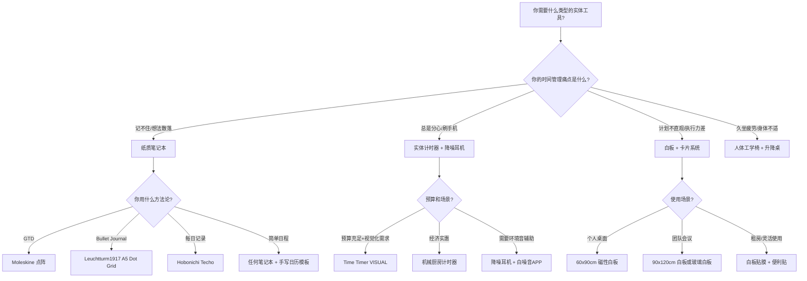
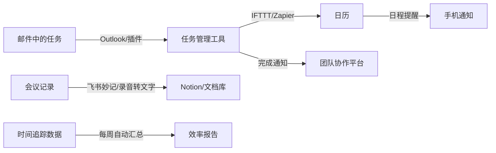

## 三、推荐工具

上一节介绍了手机和电脑上的时间管理APP，但时间管理的工具生态远不止软件。一支趁手的笔、一把符合人体工学的椅子、一个高效的浏览器插件、一套团队协作平台——这些"非APP"工具同样深刻影响着你的时间效率。本节分为三大板块：**实体工具**（看得见摸得着的）、**Web平台与浏览器工具**（在浏览器中完成工作的）、以及**工具组合实战方案**（把所有工具串联成完整的工作流）。

---

### 3.1 实体工具：纸笔、计时器与工作环境

实体工具的价值常被数字时代的用户低估。心理学研究表明，手写笔记比打字更有利于信息加工和记忆编码（Mueller & Oppenheimer, 2014, *Psychological Science*）。实体计时器不会弹出微信通知。一面白板比任何APP都直观。工具不是越"智能"越好，而是越"适合"越好。

#### 3.1.1 纸质笔记本

纸质笔记本是GTD收集箱、Bullet Journal、每日计划和每周回顾的经典载体。它的核心优势在于**零启动成本**——翻开就能写，不需要解锁、打开APP、等待同步。

**Moleskine Classic Notebook**

- **规格**：A5（13×21cm），硬壳精装，192页
- **内页选择**：点阵(Dot Grid)最适合时间管理——既有方格的结构感，又不会像横线那样限制自由排版；空白页适合画思维导图；横线页适合纯文字记录
- **用途场景**：GTD收集箱（随身携带，随时捕获想法）、每日计划（左页列任务，右页记录完成情况）、每周回顾（专门留出跨页做周总结）
- **价格**：约150-250元
- **优点**：书写手感优秀，纸张不洇墨；皮质封面耐用，越用越有质感；内页附带书签丝带和弹力绑带
- **缺点**：价格偏高；部分批次纸张偏薄，钢笔可能透页
- **替代品**：如果预算有限，国产的Kinbor笔记本（约30-60元）品质已经相当不错

**Leuchtturm1917 A5 Dot Grid**

- **规格**：A5，硬壳，251页（比Moleskine多出近60页）
- **核心优势**：内置页码和目录页——这是Bullet Journal（子弹笔记法）创始人Ryder Carroll推荐的首选笔记本。你可以在目录页快速索引重要条目，不需要翻遍整本笔记本
- **独特功能**：80gsm无酸纸（ archival quality，可保存数十年不褪色）；每本有唯一的序列号；附赠存档贴纸
- **价格**：约150-200元
- **适合人群**：Bullet Journal实践者；需要大量书写和索引的用户；追求品质的文具爱好者

**Hobonichi Techo（ほぼ日手帳）**

- **规格**：A6（每日一页）或A5（Weeks周计划版）
- **核心优势**：使用Tomoe River纸——全球最薄但不洇墨的纸张（52gsm），书写体验独一无二。每日一页的设计强制你每天做计划和回顾
- **日本手帐文化**：日本的"手帳文化"（手帐=手账=笔记本）是全球最成熟的时间管理纸笔文化。Hobonichi、Midori Traveler's Notebook、Kokuyo Campus都有深厚的用户社区
- **价格**：约200-400元（含运费）
- **适合人群**：喜欢日本手帐文化的用户；需要每日详细记录的用户

**如何选择笔记本的内页格式？**

| 内页类型 | 适合场景 | 适合方法论 | 代表产品 |
|----------|----------|------------|----------|
| 横线(Lined) | 纯文字记录、会议笔记 | 基础日程管理 | Moleskine Classic |
| 点阵(Dot Grid) | Bullet Journal、自由排版、画图 | GTD、子弹笔记法 | Leuchtturm1917 |
| 方格(Grid) | 数据表格、甘特图、精确绘图 | 项目管理、数据追踪 | Kokuyo Campus |
| 空白(Blank) | 思维导图、自由创作 | 头脑风暴、创意工作 | Midori MD |
| 一日一页(Daily) | 每日详细记录 | 晨间日记、反思日志 | Hobonichi Techo |

#### 3.1.2 计时器与专注辅助硬件

**实体番茄钟（机械厨房计时器）**

为什么推荐实体计时器而不是手机APP？原因很简单：**拿起手机是专注的最大敌人**。一项由德克萨斯大学奥斯汀分校的研究发现，即使手机处于关机状态，只要放在桌上，人的认知能力就会下降。实体计时器完全没有这个问题。

- **推荐类型**：机械式旋转计时器（不需要电池，拧到25分钟即可开始）
- **推荐型号**：Time Timer VISUAL（约200元）——它有一个红色可视区域，随着时间流逝红色区域逐渐缩小，让你"看见"时间在流逝。这种视觉化反馈比纯数字显示更有效
- **经济选择**：任何超市的机械厨房计时器即可（约20-50元），功能完全相同
- **使用技巧**：把计时器放在桌面正前方，让它成为视觉焦点。当计时器响了，必须立刻停下来休息——这是番茄工作法的铁律

**Time Timer**

Time Timer是专注类硬件中的"专业级"产品，广泛用于学校、诊所和企业：

- **视觉化时间显示**：红色磁盘随时间减少而缩小，即使远处也能一目了然
- **静音模式**：可以关闭提示音，只保留视觉提示（适合图书馆、办公室等安静环境）
- **型号选择**：
  - Time Timer MOD（小型，约200元）：桌面使用，适合个人
  - Time Timer PLUS（中型，约300元）：带提手，适合教室或会议室
  - Time Timer Dry Erase Board（白板版，约500元）：计时器+白板二合一
- **适合人群**：对时间感知不敏感的人（"时间盲"）；ADHD人群；教育工作者

**专注沙漏**

沙漏是最古老的计时工具，但在时间管理中有独特的心理学价值：

- **不可中断性**：沙漏一旦翻转就不能暂停，这迫使你做出承诺——"这30分钟我一定专注"
- **视觉冥想**：看着沙子流下有一种天然的冥想效果，帮助平复焦虑
- **推荐规格**：15分钟（短任务）和30分钟（标准番茄钟）各一个
- **价格**：约30-80元
- **注意**：沙漏精度不如电子计时器，误差约±5%，但对番茄工作法来说足够了

#### 3.1.3 可视化管理工具

**白板**

白板是团队和个人时间管理中被严重低估的工具。它的核心价值在于**把抽象的计划变成看得见的东西**——挂在墙上，每天路过都能看到，形成持续的视觉提醒。

- **磁性白板（60×90cm）**：适合个人使用。用磁贴代表任务卡片，可以像看板一样拖动任务状态（待办→进行中→完成）。价格约50-150元
- **玻璃白板（90×120cm）**：书写体验更好，易清洁，但价格较高（约300-800元）。适合有固定办公空间的用户
- **白板贴膜**：把任何墙面变成白板。价格约30-100元/㎡，适合租房用户（可撕除不留痕）
- **使用建议**：
  - **左侧**：本周目标（不超过3个）
  - **中间**：任务看板（待办/进行中/完成三列）
  - **右侧**：习惯追踪表（30天打卡格子）
  - **底部**：本周灵感和待收集的想法

**软木板（Cork Board）**

软木板适合需要"钉"东西的场景——打印出来的参考资料、灵感图片、重要提醒卡片：

- **推荐尺寸**：60×90cm（个人）或90×120cm（团队）
- **价格**：约40-120元
- **使用场景**：项目愿景板（把目标可视化）、重要联系人信息、关键截止日期提醒

**桌面便签与卡片系统**

物理卡片系统是一种轻量级的任务管理方法，特别适合不喜欢电子工具的人：

- **Kanban Cards（看板卡片）**：准备三种颜色的便利贴——黄色（待办）、蓝色（进行中）、粉色（完成）。贴在白板或桌面上，任务状态一目了然
- **Index Cards（索引卡片）**：每张卡片写一个任务。GTD的创始人David Allen早期就是用卡片系统来管理"下一步行动"。好处是可以物理排序和筛选
- **Eisenhower Matrix卡片**：在一张A3纸上画四象限，把任务卡片贴到对应的象限中。这是四象限法则最直观的物理实现

#### 3.1.4 人体工学与环境优化

你的身体状态直接影响时间利用效率。腰疼、颈椎不适、眼睛疲劳——这些问题不仅降低工作效率，还会导致频繁中断和休息。

**人体工学椅**

如果你每天坐超过4小时，一把好的人体工学椅是最值得的投资：

- **入门级**：西昊M57（约800-1000元）——可调节腰托、头枕、扶手，性价比之王
- **中端**：保友金豪B（约2000-3000元）——美国Matrex网布，坐感舒适，久坐不闷热
- **高端**：Herman Miller Aeron（约8000-12000元）——行业标杆，12年质保，被称为"椅子界的劳斯莱斯"
- **选择要点**：可调节腰托（支撑腰椎生理曲度）> 座深可调 > 扶手4D可调 > 头枕可调

**升降桌**

坐站交替是目前最被推崇的办公方式。研究表明，每坐45分钟站立15分钟可以显著降低久坐带来的健康风险：

- **入门级**：乐歌E2（约1000-1500元）——电动升降，记忆高度
- **中端**：网易严选升降桌（约1500-2000元）——桌面更大，升降更稳
- **手动选择**：如果预算有限，桌面升降台（约300-500元）可以放在现有桌子上使用
- **使用建议**：设定"坐45分钟→站15分钟"的循环，用番茄钟计时器提醒切换

**屏幕与显示器**

多显示器可以显著提升效率——微软研究院的数据显示，双显示器可以提升生产力约20-30%：

- **推荐配置**：一台27寸4K主显示器 + 一台竖屏副显示器（用于文档阅读或代码编写）
- **竖屏显示器**：把一台显示器旋转90度，特别适合阅读长文档、编写代码、浏览社交媒体信息流
- **显示器支架**：推荐乐歌或Brateck的显示器支架（约100-300元），可以灵活调节高度和角度

**降噪耳机**

降噪耳机是"专注力基础设施"——它不播放音乐，只是把环境噪音消除掉，创造一个安静的个人空间：

- **头戴式（降噪效果最好）**：
  - Sony WH-1000XM5（约2000元）：目前降噪效果最好的消费级耳机
  - Apple AirPods Max（约3800元）：Apple生态无缝切换
  - Bose QuietComfort Ultra（约2500元）：舒适度极佳，长时间佩戴无压力
- **入耳式（便携性最好）**：
  - Apple AirPods Pro 2（约1500元）：Apple用户首选
  - Sony WF-1000XM5（约1500元）：安卓用户首选
- **使用场景**：开放式办公室、咖啡厅、图书馆（即使安静也有空调/键盘声等低频噪音）
- **省钱方案**：如果不追求降噪，3M X5A隔音耳罩（约200元）+ 耳塞可以达到类似效果

**桌面整理工具**

桌面杂乱会导致注意力分散。普林斯顿大学神经科学研究所发现，视觉环境中的杂乱会同时竞争你的注意力资源：

- **显示器增高架**：把显示器抬高到视线水平，下方空间可以放键盘和小物件
- **理线器/线槽**：把桌面上的线缆整理干净（约20-50元）
- **桌面收纳盒**：文具、便签、耳机等小物件各归其位
- **原则**：桌面只保留"当前正在使用"的东西，其他全部收起来

#### 3.1.5 实体工具选择决策树

---

### 3.2 Web平台与浏览器工具

很多时间管理操作可以在浏览器中完成，不需要安装独立APP。Web平台的优势是跨操作系统（Windows/Mac/Linux都能用）、协作方便、数据自动云端备份。

#### 3.2.1 网站与注意力管理工具

互联网是时间的黑洞。一项由RescueTime的数据显示，知识工作者平均每天在"非工作相关"网站上花费2.1小时。注意力管理工具的作用是**在你和干扰源之间建立一道物理屏障**。

**Freedom**

- **平台**：iOS、Android、Mac、Windows、Chrome/Firefox/Edge插件
- **核心功能**：屏蔽指定网站和APP，支持跨设备同步屏蔽规则
- **工作原理**：在设备层面（而非浏览器层面）拦截网络请求，所以即使你换浏览器或用VPN也无法绕过。这是Freedom比其他屏蔽工具更强的根本原因
- **特色功能**：
  - **专注会话(Focus Sessions)**：预设屏蔽列表，一键启动专注模式
  - **日程安排(Scheduled Sessions)**：例如设定"工作日9:00-12:00自动屏蔽社交媒体"
  - **锁定模式(Locked Mode)**：开启后无法提前结束会话，即使重启设备也无法绕过
  - **跨设备同步**：在电脑上开始的屏蔽会话自动同步到手机
- **价格**：约40美元/年（约280元），也有终身版约100美元
- **适用场景**：需要"硬隔离"干扰源的用户；自控力较弱但愿意借助外力的用户
- **局限**：中国大陆用户可能需要配置自定义屏蔽列表（默认列表以英文网站为主）

**Cold Turkey**

- **平台**：Mac、Windows（无移动端）
- **核心功能**：网站和APP屏蔽，以"不可逆转"著称
- **与Freedom的关键区别**：Cold Turkey一旦开始锁定屏蔽会话，**在设定时间结束前完全无法解除**——重启电脑没用，卸载软件没用，改系统时间也没用。它是市面上"最狠"的屏蔽工具
- **特色功能**：
  - **冻结模式(Frozen Turkey)**：直接屏蔽整个互联网，只允许白名单中的网站（如工作邮箱、企业内网）
  - **应用屏蔽**：不仅屏蔽网站，还能屏蔽电脑上的本地应用程序（如游戏、社交软件）
  - **统计报告**：显示每天/每周被屏蔽的访问尝试次数
- **价格**：基础版免费（仅网站屏蔽），专业版约39美元（一次性购买，含应用屏蔽、统计、冻结模式）
- **适用场景**：重度网络依赖者；需要"物理隔离"才能专注的用户；学生备考期
- **局限**：无移动端；macOS版功能不如Windows版完整

**RescueTime**

- **平台**：Mac、Windows、Android、Linux
- **核心功能**：自动追踪你在电脑和手机上的时间使用情况，生成详细报告
- **工作原理**：RescueTime在后台静默运行，自动记录你使用的每个APP和网站的时长，按"高效"和"分散注意力"分类。你不需要手动记录——它帮你做时间审计
- **核心价值**：
  - **时间审计**：你可能觉得自己"一天工作8小时"，但RescueTime的真实数据可能会告诉你：高效工作只有3.5小时，其余时间在处理邮件、开会和刷网页
  - **趋势分析**：查看每周/每月的高效时间变化趋势，评估时间管理改进效果
  - **目标设定**：设定每日高效时间目标（如"每天至少4小时高效工作"），RescueTime会在达标时通知你
- **价格**：基础版免费（含基本追踪和报告），高级版约12美元/月（含网站屏蔽、详细分类、目标设定、离线时间追踪）
- **适用场景**：想了解自己时间到底花在哪里的用户；需要数据驱动的自我改进者
- **局限**：中国大陆网络环境可能影响同步；隐私敏感用户可能不愿让软件记录所有活动

**注意力管理工具对比**

| 维度 | Freedom | Cold Turkey | RescueTime |
|------|---------|-------------|------------|
| 核心功能 | 屏蔽干扰 | 强制屏蔽 | 时间追踪+分析 |
| 跨平台 | ✅ 全平台 | ❌ 仅桌面 | ✅ 桌面+Android |
| 可绕过程度 | 中等 | 极难绕过 | 不适用（追踪型） |
| 移动端 | ✅ | ❌ | ✅（仅Android） |
| 价格 | ~280元/年 | ~270元买断 | 免费/~85元/月 |
| 最适合 | 全平台屏蔽需求 | 极端自律需求 | 时间审计与分析 |

**选择建议**：如果只能选一个，推荐**Freedom**（覆盖最广）。如果你发现自己总是"绕过"屏蔽规则，换**Cold Turkey**（不可逆锁定）。如果你想先"诊断"再"治疗"，先用**RescueTime**做两周时间审计，了解问题出在哪里再有针对性地使用屏蔽工具。

#### 3.2.2 在线时间追踪平台

时间追踪不仅用于"记录"，更是时间管理改进的数据基础。没有数据，所有的时间管理建议都是空谈。

**Toggl Track**

- **平台**：Web、iOS、Android、Mac、Windows、Linux、Chrome/Firefox插件
- **核心功能**：一键计时、项目分类、标签系统、团队追踪、报告导出
- **使用方式**：点击"开始"按钮开始计时，完成后选择项目和标签。也可以手动输入时间段
- **特色功能**：
  - **一键计时器**：界面上只有一个大按钮，按下开始，再按停止。极致简单
  - **自动追踪**：Toggl Track可以在后台记录你使用的APP和网站（需开启），事后补录时间条目
  - **Pomodoro计时器**：内置番茄钟模式，每25分钟提醒休息
  - **报告与分析**：按项目、客户、标签生成饼图、柱状图、时间线报告
  - **Billable Hours**：标记可计费时间，按小时费率计算收入（适合自由职业者）
- **价格**：免费版支持5用户、基础报告；高级版约9美元/用户/月（含自动追踪、项目预算、提醒）
- **适用场景**：自由职业者（追踪可计费时间）；想了解时间分配的个人用户；小团队

**Clockify**

- **平台**：Web、iOS、Android、Mac、Windows、Linux、Chrome/Firefox插件
- **核心功能**：时间追踪、项目管理、团队追踪、报告、发票
- **与Toggl的区别**：Clockify的最大卖点是**完全免费不限用户数**——这是它与Toggl竞争的核心优势
- **特色功能**：
  - **无限用户免费**：团队使用零成本
  - **时间表(Timesheet)**：传统的周视图时间表录入模式
  - **考勤功能**：打卡/签到功能，适合需要记录出勤的团队
  - **发票生成**：根据追踪的时间自动生成客户发票
- **价格**：核心功能完全免费；高级功能（如时间审批、自定义字段）约3.99美元/用户/月
- **适用场景**：预算有限的团队；需要免费时间追踪的个人用户

**时间追踪的正确打开方式**

很多人尝试时间追踪后很快就放弃了，原因通常是：
1. **追踪太细**：试图记录每5分钟的活动，变成负担而非帮助
2. **没有分析**：记录了数据但从不看报告，数据白费
3. **追求完美**：忘记记录时焦虑，其实"大致准确"就够了

正确做法：
- **第1周**：只追踪"大块时间"（工作、学习、运动、娱乐、通勤），不做细分类
- **第2周**：回顾第1周数据，找到最大的"时间漏洞"
- **第3周起**：针对时间漏洞做改进，每周回顾一次数据
- **长期**：每月查看趋势报告，评估改进效果

#### 3.2.3 在线白板与协作画布

在线白板弥补了物理白板"不能远程协作"和"不能保存历史"的缺点。

**Miro**

- **核心功能**：无限画布、便签、模板、投票、计时器、视频通话集成
- **时间管理应用**：
  - 用看板模板做项目管理
  - 用时间线模板规划季度目标
  - 用回顾模板做团队Sprint回顾
  - 用思维导图做任务分解
- **价格**：免费版支持3个画布；高级版约8美元/月
- **适用场景**：远程团队协作；需要视觉化管理的项目

**Excalidraw**

- **核心功能**：手绘风格的在线白板，支持实时协作
- **特色**：手绘风格让图表不那么"严肃"，适合头脑风暴和快速草图
- **价格**：完全免费开源
- **适用场景**：快速草图和头脑风暴；不需要复杂模板的场景

#### 3.2.4 浏览器扩展工具

浏览器扩展的优势是**零切换成本**——你不需要打开另一个APP，直接在当前浏览器中完成操作。

**Todoist for Chrome/Firefox**

- **功能**：在浏览器工具栏快速添加任务，支持自然语言输入
- **使用场景**：浏览网页时突然想到一件事，一键添加到Todoist收件箱，不需要切换到APP

**OneTab**

- **功能**：一键将所有打开的标签页合并成一个列表
- **时间管理价值**：减少标签页焦虑（"我打开了30个标签页，关掉怕找不到"），释放内存，保持浏览器清爽
- **价格**：完全免费

**StayFocusd / LeechBlock**

- **功能**：限制你在特定网站上的每日浏览时间
- **与Freedom/Cold Turkey的区别**：这类扩展是"软限制"——你可以选择继续浏览（但会被提醒），适合自控力尚可但需要提醒的用户
- **价格**：完全免费

**Momentum**

- **功能**：将新标签页替换为个人仪表盘——显示当前时间、今日焦点任务、天气、励志名言
- **时间管理价值**：每次打开新标签页时看到今日焦点，而不是Google搜索框或一堆新闻推送
- **价格**：基础版免费

---

### 3.3 团队协作与项目管理平台

个人时间管理和团队时间管理是完全不同的挑战。在团队中，你的时间不仅属于自己——会议、协作、沟通、等待审批都会切割你的时间。团队协作平台的核心价值是**减少沟通成本，让信息透明化**。

#### 3.3.1 看板式项目管理

**Trello**

- **平台**：Web、iOS、Android、Mac、Windows
- **核心功能**：看板(Kanban Board)式任务管理
- **工作方式**：创建看板 → 添加列表（如"待办/进行中/完成"）→ 在列表中添加卡片 → 拖动卡片更新状态
- **Power-Ups（增强功能）**：
  - 日历视图：在日历上查看到期任务
  - Butler自动化：设定规则（如"卡片移到'完成'列表时自动通知经理"）
  - 时间追踪：集成第三方时间追踪插件
- **价格**：免费版支持无限个人看板、10个团队看板；高级版约5美元/用户/月
- **适合场景**：小型团队（2-10人）的简单项目管理；个人看板式任务管理；敏捷开发的Sprint看板
- **优势**：学习成本极低，5分钟上手；视觉直观，拖拽操作
- **局限**：复杂项目管理能力有限（不适合甘特图、资源分配等场景）

**Notion（Web版）**

Notion在上一节APP推荐中已有详细介绍，这里补充其Web平台的独特价值：

- **Web版优势**：Notion的Web版功能与桌面APP完全一致，无需安装；可以通过浏览器的多标签页同时打开多个Notion页面
- **团队协作**：多人实时编辑、评论、@提及、权限管理
- **时间管理模板**：Notion官方模板库有大量时间管理相关模板，包括GTD系统、OKR追踪、周报模板、会议记录模板

#### 3.3.2 综合项目管理平台

**Asana**

- **平台**：Web、iOS、Android
- **核心功能**：任务管理、项目时间线（甘特图视图）、工作流自动化、目标追踪(OKR)、工作负载管理
- **与Trello的区别**：Trello是"轻量级看板"，Asana是"重量级项目管理"。Asana适合需要：
  - 甘特图视图（时间线）来管理项目进度
  - 跨项目的任务依赖关系
  - 团队成员工作负载可视化
  - 自定义工作流（如审批流程）
- **特色功能**：
  - **时间线(Timeline)**：类似甘特图的视图，可以看到任务的时间范围和依赖关系
  - **工作负载(Workload)**：查看每个团队成员的任务量，避免"有人忙死、有人闲死"
  - **目标(Goals)**：设定公司/团队OKR，关联到具体项目和任务
  - **规则(Rules)**：自动化工作流（如"任务标记为'紧急'时自动分配给高级工程师"）
- **价格**：基础版免费（支持15用户、基础任务管理）；高级版约10.99美元/用户/月
- **适合场景**：中大型团队（10+人）的项目管理；需要甘特图和资源管理的场景

**Linear**

- **平台**：Web、Mac、Windows、iOS
- **核心功能**：专为软件开发团队设计的项目管理工具
- **设计理念**：速度。Linear的每一个操作都在毫秒级完成——创建Issue、切换视图、搜索，都比竞品快一个数量级
- **特色功能**：
  - **Cycle（冲刺周期）**：类似Sprint，自动管理开发周期
  - **自动化**：Git提交自动关联Issue状态
  - **键盘优先**：几乎可以用键盘完成所有操作
- **价格**：免费版支持无限用户（基础功能）；高级版约8美元/用户/月
- **适合场景**：软件开发团队；追求极致效率的技术团队

**Jira**

- **平台**：Web、iOS、Android
- **核心功能**：企业级项目管理和缺陷追踪
- **特色**：行业标准的敏捷开发管理工具，支持Scrum和Kanban两种方法论
- **价格**：免费版支持10用户；标准版约7.75美元/用户/月
- **适合场景**：大型软件开发团队；需要合规和审计的企业
- **局限**：配置复杂，学习曲线陡峭；对非技术团队过于"重型"

#### 3.3.3 中国本土协作平台

以下平台针对中国市场优化，服务器在国内，访问速度快，且深度集成了中国用户习惯的功能。

**飞书（Lark）**

- **核心功能**：即时通讯、文档协作、日历、项目管理、视频会议、审批流程、OKR
- **时间管理相关功能**：
  - **飞书日历**：会议预约、空闲时间查找、日程共享
  - **飞书项目**：看板+甘特图+工作流的项目管理
  - **飞书OKR**：目标管理工具，对齐团队目标
  - **飞书文档**：会议记录、项目文档、知识库
  - **飞书妙记**：会议录音自动转文字，生成会议纪要
- **价格**：基础版免费（50人以下团队）；企业版按需报价
- **优势**：一站式解决方案，减少工具切换；字节跳动内部使用的同一产品，功能成熟
- **适合场景**：中国企业的团队协作；需要"一站式"解决方案的团队

**钉钉**

- **核心功能**：即时通讯、考勤打卡、审批流程、日历、文档、视频会议、项目管理
- **时间管理相关功能**：
  - **智能考勤**：GPS/WiFi打卡，自动生成考勤报表
  - **审批流**：请假、报销、出差等流程线上化，减少"跑腿"时间
  - **日程管理**：会议邀请、日程共享、提醒
  - **钉钉待办**：基础任务管理，可以指派给他人
- **价格**：基础版免费；专业版约9800元/年（企业）
- **优势**：考勤和审批功能最完善；中小企业覆盖率最高
- **适合场景**：传统行业企业；需要考勤打卡和审批流程的团队

**飞书 vs 钉钉选择**

| 维度 | 飞书 | 钉钉 |
|------|------|------|
| 产品理念 | 创新型、扁平化 | 管理型、层级化 |
| 文档协作 | ⭐⭐⭐⭐⭐ | ⭐⭐⭐ |
| 项目管理 | ⭐⭐⭐⭐ | ⭐⭐⭐ |
| 考勤审批 | ⭐⭐⭐ | ⭐⭐⭐⭐⭐ |
| 视频会议 | ⭐⭐⭐⭐⭐ | ⭐⭐⭐⭐ |
| 适合企业 | 互联网/科技公司 | 传统行业/制造业 |
| 学习成本 | 中等 | 较低 |

**Teambition**

- **核心功能**：项目管理、任务协作、文件共享、日程管理
- **特色**：阿里巴巴出品，与阿里云、钉钉深度集成
- **价格**：基础版免费；高级版按需报价
- **适合场景**：已经在使用阿里生态的企业

#### 3.3.4 团队协作中的时间管理陷阱

工具选对了，但团队时间管理效率仍然低下？问题通常出在**协作方式**而非工具本身：

**陷阱一：会议过多**
- **症状**：每天60%以上的时间在开会，实际工作只能在会后完成
- **解决**：用日历工具统计每周会议时长，设定"无会日"（如周三全天不开会）。每次会议必须有议程、时间限制和明确的产出物

**陷阱二：即时通讯绑架注意力**
- **症状**：飞书/钉钉/微信消息不断，每隔几分钟就被打断一次
- **解决**：设定"专注时间段"（如上午9-12点），期间关闭即时通讯通知。用"状态"功能告知同事你的可用时间

**陷阱三：信息散落多处**
- **症状**：任务在Trello、文档在Google Drive、讨论在微信群、文件在邮件附件
- **解决**：统一信息入口。选择一个"主平台"（如飞书或Notion），把所有信息集中到一个地方

---

### 3.4 工具组合实战：从碎片到系统

单个工具有各自的优势，但真正的效率来自于**工具之间的协同**。以下提供三种经过验证的工具组合方案，从极简到专业，覆盖不同需求层次。

#### 3.4.1 极简方案（零成本起步）

适合刚开始实践时间管理的用户，或者预算有限的用户。

| 功能需求 | 工具选择 | 成本 |
|----------|----------|------|
| 任务管理 | Microsoft To Do | 免费 |
| 专注计时 | 机械厨房计时器 | ~30元 |
| 日程管理 | 手机系统日历 | 免费 |
| 时间追踪 | Clockify | 免费 |
| 注意力保护 | Cold Turkey（基础版） | 免费 |
| 笔记 | 纸质笔记本（任意） | ~20元 |
| **总成本** | | **约50元** |

**工作流**：
1. 每天早上打开Microsoft To Do，查看"我的一天"中的任务
2. 用机械计时器做番茄钟（25分钟专注+5分钟休息）
3. 在系统日历中安排会议和固定时间块
4. 每周用Clockify查看时间分配报告
5. 在笔记本上做每周回顾

#### 3.4.2 进阶方案（效率优先）

适合已经实践时间管理3个月以上、需要更强大功能的用户。

| 功能需求 | 工具选择 | 成本 |
|----------|----------|------|
| 任务管理 | 滴答清单（高级版） | 139元/年 |
| 专注计时 | 滴答清单内置番茄钟 | 已含 |
| 日程管理 | 滴答清单日历 + Google Calendar | 免费 |
| 时间追踪 | Toggl Track（免费版） | 免费 |
| 注意力保护 | Freedom | ~280元/年 |
| 笔记与知识 | Notion（个人免费版） | 免费 |
| 实体工具 | Leuchtturm1917 + Time Timer | ~400元（一次性） |
| **总成本** | | **约820元/年** |

**工作流**：
1. **捕获**：所有想法和任务立刻录入滴答清单收件箱
2. **处理**：每天早上花10分钟处理收件箱，分配项目、标签、截止日期
3. **执行**：用滴答清单的番茄钟专注执行，Freedom屏蔽社交媒体
4. **统筹**：在滴答清单日历中查看任务+日程的统一视图
5. **记录**：用Notion做项目文档和知识沉淀
6. **回顾**：每周日在笔记本上做手写回顾（手写比打字更有反思效果）

#### 3.4.3 专业方案（全栈配置）

适合重度时间管理实践者、自由职业者、或需要精细化管理的专业人士。

| 功能需求 | 工具选择 | 成本 |
|----------|----------|------|
| 任务管理 | Todoist（专业版） | ~360元/年 |
| 日程管理 | Fantastical | ~340元/年 |
| 笔记与知识 | Obsidian + Notion | 免费 |
| 时间追踪 | Toggl Track（高级版） | ~760元/年 |
| 注意力保护 | Freedom + RescueTime | ~640元/年 |
| 习惯追踪 | Streaks | ~30元（一次性） |
| 实体工具 | 人体工学椅 + 降噪耳机 + 白板 | ~3000-8000元（一次性） |
| **年度成本** | | **约2130元/年 + 一次性投入** |

**工作流**：
1. **捕获**：Todoist快速捕获（自然语言输入）+ Obsidian Daily Note记录想法
2. **处理**：GTD流程——收件箱→下一步行动→项目→日程
3. **执行**：Freedom屏蔽干扰 + 番茄钟专注 + 降噪耳机隔离噪音
4. **追踪**：Toggl Track自动追踪工作时间，Streaks追踪每日习惯
5. **统筹**：Fantastical管理所有日历（工作+个人+项目）
6. **沉淀**：Obsidian双向链接构建知识网络，Notion管理项目文档
7. **回顾**：每周用RescueTime数据分析效率趋势，用Todoist的"效率趋势"功能追踪完成率

#### 3.4.4 工具串联与自动化

把独立的工具连接成自动化流水线，减少手动操作的时间浪费：

**推荐的自动化连接**

**具体的自动化方案**：

1. **邮件→任务**：使用Todoist的邮件转发功能，把重要邮件转发到特定邮箱地址，自动创建任务
2. **任务→日历**：用IFTTT设置规则——当Todoist中有新任务时，自动在Google Calendar中创建对应事件
3. **完成→通知**：用Zapier设置规则——当Trello卡片移到"完成"列表时，自动在飞书中发送通知给相关人
4. **数据→报告**：用Toggl Track的每周报告自动发送到邮箱，用RescueTime的每周摘要评估效率趋势

---

### 3.5 常见误区与避坑指南

#### 误区一：工具越多越好

**症状**：手机上装了15个效率APP，每天在APP之间切换的时间比实际工作还长。

**真相**：工具的价值在于**减少认知负担**，而不是增加它。每多一个工具，就多一个"上下文切换"的成本。研究表明，上下文切换会导致每次切换损失约23分钟的专注时间（UC Irvine, Gloria Mark）。

**纠正**：严格遵守"3个工具"原则——一个任务管理、一个日程管理、一个专注辅助。其他需求要么用现有工具的附加功能解决，要么不需要解决。

#### 误区二：花大量时间"搭建系统"

**症状**：花3天在Notion里搭建了一个"完美"的时间管理系统，然后第二天就开始不按系统执行了。

**真相**：搭建系统本身是一种"高效率的拖延"——你在做一件"看起来很有生产力"的事情，但其实是在逃避真正的工作。

**纠正**：用最简单的系统开始，执行2周后再优化。一个80分的系统执行100天，远胜于一个100分的系统执行3天。

#### 误区三：只关注"效率工具"忽略"环境工具"

**症状**：花2000元买效率APP订阅，但坐在一把300元的椅子上，用着一台60Hz的显示器，戴着50元的耳机。

**真相**：环境因素（椅子、桌子、屏幕、耳机、灯光）对你工作效率的影响可能比APP更大。腰疼会让你每30分钟就要站起来活动，差的显示器会让眼睛疲劳得更快，没有降噪功能的耳罩会让你被每一个噪音打断。

**纠正**：把工具预算的30-50%分配给实体环境优化。一把好的人体工学椅可以使用5-10年，平均每年的成本比任何APP订阅都低。

#### 误区四：忽视数据导出和迁移成本

**症状**：在一个平台上积累了3年的时间管理数据，想换平台时发现数据导不出来。

**真相**：工具会过时、会涨价、会倒闭。你的数据不应该被任何一个平台"绑架"。

**纠正**：选择工具前检查：
- 是否支持CSV/JSON/Markdown导出？
- 是否有开放API？
- 社区是否有第三方迁移工具？
- 数据是否存储在本地（如Obsidian）还是云端（如Notion）？

#### 误区五：盲目追求"最新最火"的工具

**症状**：每次看到新的效率工具推荐就忍不住试用，导致频繁切换工具，历史数据分散在5个不同平台上。

**真相**：工具的价值在于**持续使用**，而不是**功能多强大**。一个你用了2年的简单工具，比一个你用了2周的强大工具，对你的帮助大得多。

**纠正**：设定"工具冷静期"——看到新工具后至少等待2周再决定是否试用。如果2周后你仍然觉得需要，再认真评估。

---

### 3.6 本节小结

工具是时间管理方法论的"执行层"。选对工具能让方法论落地，选错工具则会让方法论沦为空谈。

**选择工具的五个核心原则**：

1. **方法先行**：先确定你的时间管理方法论（GTD、番茄工作法、四象限法则等），再选择支持该方法论的工具
2. **少即是多**：3个核心工具足以覆盖90%的需求。每增加一个工具，就增加一层上下文切换成本
3. **实体不可忽视**：一支好笔、一把好椅子、一个实体计时器，其价值不亚于任何APP
4. **数据要归你**：优先选择支持数据导出、本地存储、开放API的工具
5. **先用再优化**：用最简单的系统开始执行，2周后再根据实际痛点优化工具组合

**记住**：最好的工具是你**真正会持续使用的**那个，而不是功能最强大或评价最高的那个。工具服务于人，而非人服务于工具。
