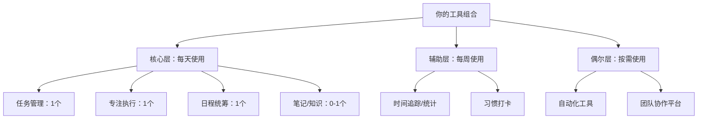
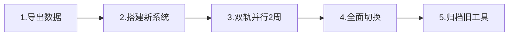
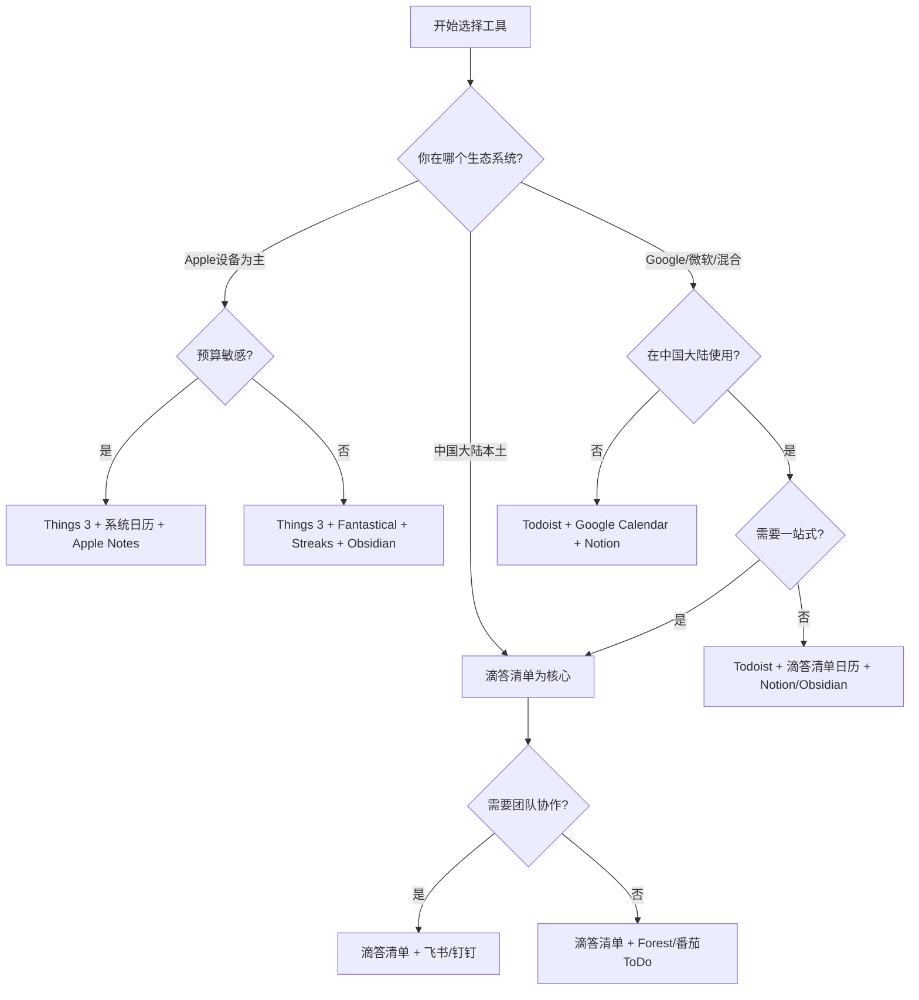

## 四、工具选择建议

前两节介绍了数十款时间管理APP和工具，信息量巨大。但工具越多，选择越难——这正是"工具选择悖论"：选项越多，决策成本越高，满意度反而越低（Barry Schwartz，《选择的悖论》）。本节要解决的核心问题是：**面对琳琅满目的工具，你应该如何做出最适合自己的选择？**

这不是一个简单的"推荐列表"。选择工具是一个涉及认知心理学、工作流设计、生态系统兼容性和个人习惯的系统性决策。以下内容将从原则、方法、场景、陷阱四个维度，帮你建立一套完整的工具选择思维框架。

---

### 4.1 工具选择的底层逻辑

#### 4.1.1 工具是方法论的载体，不是方法论本身

这是最重要但最容易被忽视的原则。很多人犯的第一个错误是：先装一堆APP，再想"我拿它来干什么"。正确顺序恰好相反——**先确定方法论，再选择承载它的工具**。

不同的方法论对工具的要求截然不同：

| 方法论 | 对工具的核心需求 | 工具选型重点 |
|--------|-----------------|-------------|
| GTD（Getting Things Done） | 收集→处理→组织→回顾→执行 的完整流程支持 | 多层项目/上下文标签/过滤器/定期回顾提醒 |
| 番茄工作法 | 精确计时 + 休息提醒 + 专注统计 | 计时器精度、干扰屏蔽、历史数据图表 |
| 四象限法则 | 重要-紧急二维分类视图 | 优先级标记、矩阵视图、拖拽排序 |
| 时间块法（Time Blocking） | 将一天划分为固定时间块 | 日历视图、拖拽排程、时间块模板 |
| Bullet Journal | 索引+日志+集子+月度/年度规划 | 笔记结构灵活性、索引功能、快速检索 |
| OKR（目标与关键成果） | 目标→关键成果→任务的层级关联 | 目标追踪、进度可视化、团队对齐 |

如果你还在犹豫选哪个方法论，建议先回顾本书"基础理论"部分。一个简单的选择路径：刚开始时间管理 → 番茄工作法（门槛最低）；工作事务繁杂 → GTD；需要管理多个项目 → 四象限 + 时间块法；追求深度反思 → Bullet Journal。

#### 4.1.2 "少即是多"的科学依据

"少即是多"不是一句鸡汤，它有坚实的认知科学基础。

**认知负荷理论（Cognitive Load Theory）** 指出，人的工作记忆容量有限——大约只能同时处理4±1个信息单元（Miller, 1956）。每增加一个工具，你的心智模型就多一个"插槽"被占用：这个工具的数据存在哪里？它和其他工具怎么配合？它的通知策略是什么？

**上下文切换成本** 更加致命。加州大学欧文分校 Gloria Mark 教授的研究表明，每次在不同任务/工具之间切换，平均需要 **23分钟** 才能恢复到之前的专注状态。如果你一天在5个APP之间切换10次，理论上你损失了近4小时的高效时间。

**实践标准**：一个合理的时间管理工具组合应控制在 **3-5个核心工具** 以内。这里的"核心工具"是指你每天都使用的、形成固定工作流的工具。偶尔使用的辅助工具（如每周看一次的统计报告网站）不计入。

#### 4.1.3 生态系统思维：为什么要考虑"生态"

选工具不是孤立决策，而是选择一个**生态系统**。所谓生态系统，是指一组工具之间能无缝共享数据、统一账号体系、跨设备同步。

**主流生态系统对比**：

| 生态系统 | 核心工具 | 优势 | 劣势 | 适合人群 |
|----------|---------|------|------|---------|
| **Apple生态** | Things 3 + Fantastical + Streaks + Apple Notes | 设计精美、跨设备无缝（iPhone/Mac/Watch/iPad）、隐私保护强 | 无Android/Windows、价格高 | 全Apple设备用户 |
| **Google生态** | Google Tasks + Google Calendar + Google Keep + Gmail | 免费、跨平台、协作方便、AI能力强 | 中国需科学上网、隐私争议 | 多平台用户、团队协作 |
| **微软生态** | Microsoft To Do + Outlook Calendar + OneNote + Teams | 免费基础功能、企业集成强（Office 365）、Outlook邮件联动 | 创新速度较慢、移动端体验一般 | Office 365用户、企业用户 |
| **中国本土生态** | 滴答清单 + 飞书/钉钉 + 印象笔记 | 国内服务器（同步快）、中文体验好、本地化功能（农历、节假日） | 国际化协作弱、部分工具封闭 | 中国大陆用户 |
| **开源/本地优先** | Obsidian + Vikunja + Logseq + Syncthing | 数据完全自控、无订阅费、高度可定制 | 需要技术能力、配置复杂 | 技术用户、隐私极客 |

**生态统一的实际收益**：

1. **数据互通**：同一生态内的工具共享数据，不需要手动导出/导入。例如在Apple生态中，Things 3的任务可以通过Siri添加，提醒通过Apple Watch推送，完成状态实时同步到所有设备。
2. **操作一致**：同一生态的工具有相似的交互逻辑和设计语言，降低学习成本。
3. **自动化联动**：同一生态内的工具更容易实现自动化。例如Google生态中，Gmail中识别到的日程可以一键添加到Google Calendar，Google Calendar的事件可以自动关联Google Meet链接。

**跨生态的现实**：现实中很少有人完全在一个生态内。更务实的做法是：选择一个**主生态**作为核心，用跨平台工具填补空白。例如：Apple用户选择Apple生态为主，但用Todoist（跨平台）做任务管理，因为Things 3的协作功能太弱；或者Google生态用户用滴答清单（国内同步快）替代Google Tasks。

#### 4.1.4 从简开始，渐进升级

时间管理工具的进化应该像学游泳——先在浅水区练习基本动作，再逐步进入深水区。

**三阶段进化模型**：

**第一阶段：起步期（第1-4周）**
- 工具数量：1-2个
- 目标：建立"每天用工具管理任务"的习惯
- 推荐：Microsoft To Do 或手机自带备忘录 + 纸质笔记本
- 关键动作：每天早上花5分钟写下今天要做的3件事，睡前花3分钟勾掉完成的

**第二阶段：实践期（第5-12周）**
- 工具数量：2-3个
- 目标：找到适合自己的方法论，用工具固化流程
- 推荐：滴答清单/Todoist + 番茄钟APP + 日历
- 关键动作：每周花15分钟回顾本周完成情况，调整下周计划

**第三阶段：优化期（第13周以后）**
- 工具数量：3-5个
- 目标：建立完整的时间管理系统，包含自动化和数据分析
- 推荐：根据具体需求从本书推荐中选择组合
- 关键动作：每月审视工具组合，删除不再使用的工具，评估是否需要升级

**为什么要从简开始？** 因为在你还没有形成时间管理习惯之前，复杂的工具只会增加摩擦。一个最简单的待办清单APP，如果能让你每天坚持使用，比一个功能强大但你三天就放弃的GTD系统有效100倍。

---

### 4.2 六维选择评估框架

面对一款时间管理工具，不要只看它的功能列表。用以下六个维度系统评估，才能做出理性决策。

#### 4.2.1 维度一：功能匹配度

**核心问题**：这款工具能否支持我选择的方法论？

功能匹配度不是"功能越多越好"，而是"我需要的功能是否足够好"。评估时关注三个层面：

- **核心功能完备性**：方法论要求的关键功能是否都有？例如实践GTD，工具必须支持项目分类、上下文标签、下一步行动视图、定期回顾提醒——缺少任何一项都会导致流程断裂。
- **核心功能深度**：功能是否只是"有"，还是"好用"？例如两款工具都有"标签"功能，但A工具支持标签层级、批量管理、智能过滤，B工具只支持简单的文字标签——差异巨大。
- **功能冗余度**：不需要的功能越多，界面越复杂，学习成本越高。如果你只需要简单的待办清单，Notion的数据库系统对你来说就是噪音。

**评估方法**：列出你选择的方法论需要的5个核心功能，逐一测试每款候选工具在这些功能上的表现，打1-5分。

#### 4.2.2 维度二：使用成本

使用成本不只是购买价格，还包括**学习成本、时间成本和心理成本**。

| 成本类型 | 说明 | 评估方法 |
|----------|------|---------|
| **金钱成本** | 购买/订阅费用 | 计算年度总拥有成本（TCO） |
| **学习成本** | 从安装到熟练使用需要多少时间 | 观看官方教程后尝试完成一个完整工作流，记录耗时 |
| **操作成本** | 每次录入/查询一个任务需要几步操作 | 从打开APP到完成一个任务的操作步骤数（越少越好） |
| **维护成本** | 需要花多少时间"管理工具本身" | 每周花在工具维护上的时间不应超过15分钟 |
| **心理成本** | 使用这款工具是否让你感到愉悦或焦虑 | 使用一周后自我评估：它是帮助你还是让你更有压力？ |
| **迁移成本** | 如果以后要换工具，数据能带走吗 | 查看官方数据导出功能和格式 |

**价格陷阱提示**：很多APP的免费版足以覆盖个人使用需求。在决定付费之前，先用免费版认真使用两周。以下工具的免费版已经非常强大：

- Microsoft To Do：完全免费，无任何限制
- Google Calendar：完全免费
- Clockify：免费不限用户数
- Loop Habit Tracker：完全免费开源
- Obsidian：个人使用完全免费
- Notion：个人使用免费（5MB文件上传限制）

#### 4.2.3 维度三：跨平台与同步

跨平台需求取决于你的设备组合。评估标准：

- **设备覆盖**：你日常使用哪些设备？工具是否覆盖所有设备？
- **同步速度**：在手机上添加的任务，多久能在电脑上看到？（理想：<5秒；可接受：<1分钟；不可接受：>5分钟）
- **离线能力**：没有网络时能否正常使用？（通勤地铁、飞机、偏远地区）
- **冲突处理**：在两台设备上同时编辑同一条任务，工具如何处理冲突？

**各平台跨平台能力排名**：

| 工具 | iOS | Android | Web | Mac | Windows | Linux | Watch | 同步速度 |
|------|-----|---------|-----|-----|---------|-------|-------|---------|
| Todoist | ✅ | ✅ | ✅ | ✅ | ✅ | ❌ | ✅ | 极快 |
| 滴答清单 | ✅ | ✅ | ✅ | ✅ | ✅ | ❌ | ✅ | 快（国内） |
| Microsoft To Do | ✅ | ✅ | ✅ | ✅ | ✅ | ❌ | ✅ | 快 |
| Things 3 | ✅ | ❌ | ❌ | ✅ | ❌ | ❌ | ✅ | 快（iCloud） |
| Obsidian | ✅ | ✅ | ❌ | ✅ | ✅ | ✅ | ❌ | 取决于同步方案 |
| Notion | ✅ | ✅ | ✅ | ✅ | ✅ | ❌ | ❌ | 中等 |

#### 4.2.4 维度四：数据所有权与可迁移性

这是一个被严重低估但极其重要的维度。你的时间管理数据——任务记录、完成历史、习惯数据、笔记——是你的**数字资产**。如果工具倒闭、大幅涨价、或你发现了更好的替代品，你的数据能带走吗？

**数据可迁移性评估标准**：

- **导出格式**：支持CSV/JSON/Markdown等通用格式？还是只能导出为私有格式？
- **导出完整性**：导出的数据是否包含所有字段（标签、备注、附件、完成时间、优先级）？
- **第三方导入**：其他主流工具是否支持直接导入这款工具的数据？
- **API开放性**：是否提供开放API，允许你通过程序批量操作数据？

**各工具数据可迁移性评估**：

| 工具 | 导出格式 | 完整性 | 第三方导入支持 | API |
|------|---------|--------|---------------|-----|
| Todoist | CSV/JSON | 高 | 广泛 | ✅ 丰富 |
| 滴答清单 | CSV | 中 | 有限 | ✅ |
| Notion | Markdown/CSV | 中 | 广泛 | ✅ |
| Obsidian | 原生Markdown | 完整（本地文件） | 不需要导入 | 本地文件系统 |
| Things 3 | Things JSON | 高 | 有限 | ✅（URL Scheme） |
| Microsoft To Do | 无原生导出 | 低 | 极有限 | 有限 |

**重要提醒**：Obsidian在这方面有天然优势——所有数据就是你电脑上的Markdown文件。即使Obsidian公司消失，你的笔记依然完好。如果你对数据所有权有强烈需求，优先考虑本地存储方案。

#### 4.2.5 维度五：长期可持续性

时间管理是一个长期实践，工具的稳定性至关重要。评估以下指标：

- **公司背景**：开发团队的规模和资金状况如何？是否有稳定的商业模式？（警惕完全免费且无明确商业模式的工具——它们可能随时关闭）
- **更新频率**：最近半年是否有功能更新和Bug修复？（可以在应用商店查看更新日志）
- **用户社区**：是否有活跃的用户社区？（Reddit、Discord、中文论坛）社区活跃意味着工具还有生命力
- **历史口碑**：是否有过重大数据丢失或安全事件？

**风险评估矩阵**：

| 风险等级 | 特征 | 代表工具 |
|----------|------|---------|
| 低风险 | 大公司产品、用户基数大、有稳定收入 | Microsoft To Do、Google Calendar、Todoist |
| 中风险 | 独立开发者但有付费模式、活跃社区 | 滴答清单、Fantastical、Streaks |
| 较高风险 | 小团队、免费模式、用户量不大 | 一些新兴APP（不具体点名） |
| 最安全 | 开源+本地存储 | Obsidian、Loop Habit Tracker、Vikunja |

#### 4.2.6 维度六：愉悦感与审美

这是一个"感性"维度，但同样重要。如果你觉得一款工具丑陋、操作别扭，你就不会坚持使用它。行为设计学研究表明，**审美可用性效应（Aesthetic-Usability Effect）** 指出：用户倾向于认为更好看的产品更好用——这种心理会直接影响你的使用频率和满意度。

不同人对审美的偏好不同：
- **极简派**：Todoist、Things 3、Streaks——界面干净、信息密度低、留白多
- **功能派**：滴答清单、Notion——信息密度高、功能入口多、自定义强
- **设计派**：Fantastical、潮汐——视觉精美、动效流畅、色彩搭配讲究

**建议**：在功能满足需求的前提下，选择你"打开就想用"的那款。每天打开一个你觉得丑陋的APP，本身就是一种心理消耗。

---

### 4.3 六维评估实战：打分决策表

把上面的六个维度整合成一张可操作的打分表。面对2-3个候选工具时，逐一打分，加权计算总分。

**评分标准**：每个维度1-5分（1=很差，3=一般，5=很好）

| 评估维度 | 权重（建议） | 工具A | 工具B | 工具C |
|----------|-------------|-------|-------|-------|
| 功能匹配度 | 30% | ? | ? | ? |
| 使用成本（反向：成本越低分越高） | 20% | ? | ? | ? |
| 跨平台与同步 | 15% | ? | ? | ? |
| 数据所有权与可迁移性 | 10% | ? | ? | ? |
| 长期可持续性 | 10% | ? | ? | ? |
| 愉悦感与审美 | 15% | ? | ? | ? |
| **加权总分** | **100%** | **?** | **?** | **?** |

**权重可调**：以上权重是通用建议，你应该根据自己的实际情况调整。例如：
- 如果你是自由职业者，跨平台和数据可迁移性的权重应该更高
- 如果你是学生，使用成本的权重应该更高
- 如果你对审美有强烈偏好，愉悦感的权重可以提到20%

**示例：一个典型的评分过程**

假设你在滴答清单和Todoist之间选择：

| 评估维度 | 权重 | 滴答清单 | Todoist |
|----------|------|---------|---------|
| 功能匹配度 | 30% | 5（日历+番茄钟+习惯全内置） | 3（需要搭配其他工具） |
| 使用成本 | 20% | 4（免费版够用，付费便宜） | 3（免费版受限，付费偏贵） |
| 跨平台与同步 | 15% | 4（全平台，国内同步快） | 5（全平台，同步极快） |
| 数据可迁移性 | 10% | 3（CSV导出，完整性一般） | 4（CSV/JSON导出，API丰富） |
| 长期可持续性 | 10% | 4（独立公司，付费模式健康） | 4（独立公司，用户基数大） |
| 愉悦感与审美 | 15% | 3（功能多但界面稍复杂） | 5（极简设计，操作流畅） |
| **加权总分** | | **4.05** | **3.70** |

这个例子说明：如果你在中国大陆使用且需要一站式解决方案，滴答清单的综合得分更高；如果你追求极简体验且愿意搭配其他工具，Todoist更合适——但需要补上番茄钟和习惯追踪的短板。

---

### 4.4 分场景推荐工具组合

前面的评估框架是"授人以渔"，这里给出"授人以鱼"的具体组合方案。注意：这些方案基于大多数用户的需求总结，你的实际情况可能需要微调。

#### 4.4.1 学生党组合（预算敏感 + 学习场景）

**核心需求**：课程任务管理、备考专注、学习时间统计

| 功能 | 推荐工具 | 费用 | 替代方案 |
|------|---------|------|---------|
| 任务管理 | 滴答清单（免费版） | 免费 | Microsoft To Do |
| 专注计时 | 番茄ToDo（免费版） | 免费 | Forest（Android免费） |
| 日程管理 | 滴答清单日历 / 手机日历 | 免费 | Google Calendar |
| 笔记 | Notion（学生免费） | 免费 | 有道云笔记 |
| 习惯打卡 | 滴答清单内置习惯 | 免费 | Loop Habit Tracker（Android） |
| **总费用** | | **0元** | |

**工作流**：
1. 开学时在滴答清单中为每门课创建项目，录入所有作业和考试日期
2. 上课前打开滴答清单，用"今日"视图查看今天需要完成的任务
3. 在番茄ToDo中开启"学霸模式"，按课程分类统计学习时长
4. 每周日晚上花10分钟回顾本周完成情况，规划下周重点
5. 考试前用番茄ToDo的倒计时功能设定"距离考试还有X天"

**中国学生特别提示**：番茄ToDo的"自习室"功能可以看到全国其他学生的学习状态，形成社交监督。滴答清单服务器在国内，同步速度远快于Todoist。

#### 4.4.2 职场人士组合（效率优先 + 办公集成）

**核心需求**：工作任务管理、会议统筹、专注深度工作

| 功能 | 推荐工具 | 费用 | 替代方案 |
|------|---------|------|---------|
| 任务管理 | Todoist（专业版） | ~360元/年 | 滴答清单高级版 |
| 专注计时 | Freedom | ~280元/年 | Forest |
| 日程管理 | Google Calendar / Outlook | 免费 | 滴答清单日历 |
| 笔记与文档 | Notion | 免费 | 飞书文档 |
| 时间追踪 | Toggl Track（免费版） | 免费 | Clockify |
| **总费用** | | **~640元/年** | |

**工作流**：
1. 所有工作任务立即录入Todoist收件箱（支持邮件转发创建任务）
2. 每天早上花10分钟处理收件箱：分配项目、设置截止日期、标记优先级
3. 上午深度工作时间启动Freedom屏蔽社交媒体
4. 用Toggl Track追踪各类工作的实际耗时（一周后你会惊讶于真实的时间分配）
5. 每周五下午用Notion写周报模板，回顾本周成果和下周计划

#### 4.4.3 自由职业者组合（灵活 + 收入追踪）

**核心需求**：多项目并行管理、可计费时间追踪、客户协作

| 功能 | 推荐工具 | 费用 | 替代方案 |
|------|---------|------|---------|
| 任务管理 | Todoist | ~360元/年 | Notion数据库 |
| 时间追踪与计费 | Toggl Track（高级版） | ~760元/年 | Clockify |
| 日程管理 | Fantastical（Apple用户） | ~280元/年 | Google Calendar |
| 笔记与知识 | Obsidian | 免费 | Notion |
| 专注 | Freedom + RescueTime | ~640元/年 | Cold Turkey |
| **总费用** | | **~2040元/年** | |

**为什么自由职业者的工具成本应该更高？** 因为自由职业者的时间直接等于收入。如果Toggl Track帮你多追踪到每天1小时的可计费时间（之前因为手动记录遗漏），按小时费率200元计算，一个月就是4000元——远超工具成本。这是典型的"投资回报率极高"的场景。

#### 4.4.4 全职父母组合（碎片化时间 + 家庭统筹）

**核心需求**：家庭日程协同、碎片时间利用、多角色切换

| 功能 | 推荐工具 | 费用 | 替代方案 |
|------|---------|------|---------|
| 家庭共享日历 | Google Calendar | 免费 | 苹果家庭共享日历 |
| 家庭共享任务 | Microsoft To Do | 免费 | 滴答清单共享清单 |
| 个人任务 | 滴答清单 | 免费 | Microsoft To Do |
| 碎片时间利用 | Forest | ~25元（iOS买断） | 番茄ToDo |
| 笔记 | 纸质笔记本 | ~30元 | 备忘录APP |
| **总费用** | | **~55元** | |

**全职父母的特殊考量**：
- **家庭共享日历是刚需**：两个人的时间必须可视化对齐，否则"我以为你接孩子""我以为你做饭"的冲突会不断发生
- **碎片时间管理**：父母的可用时间是碎片化的（孩子午睡的1小时、等兴趣班下课的30分钟），需要用番茄钟精确利用
- **简化是第一优先级**：父母的认知资源已经被孩子大量占用，工具必须极简

#### 4.4.5 中国用户专属方案（无需科学上网）

由于Google服务在中国大陆受限，以下方案全部使用国内可用的工具：

| 功能 | 推荐工具 | 费用 | 说明 |
|------|---------|------|------|
| 任务管理 | 滴答清单 | 免费/139元/年 | 国内同步最快的全能工具 |
| 日程管理 | 滴答清单日历 / 飞书日历 | 免费 | 滴答清单日历支持订阅外部日历 |
| 笔记 | 有道云笔记 / 语雀 / Notion | 免费 | Notion国内访问速度尚可 |
| 专注 | 番茄ToDo / Forest | 免费/25元 | 番茄ToDo更适合中国学生 |
| 团队协作 | 飞书 / 钉钉 | 免费 | 飞书适合创新团队，钉钉适合传统企业 |
| 习惯打卡 | 滴答清单内置 / 小日常 | 免费 | 滴答清单习惯功能够用 |

**滴答清单的"一站式"优势**：对于中国用户来说，滴答清单的综合优势最为明显——任务管理+日历视图+番茄钟+习惯追踪+白噪音，一个APP覆盖五个功能，减少工具切换成本。服务器在国内，同步速度快。免费版功能已经非常丰富。

---

### 4.5 工具试用与评估方法论

选工具不能只看评测文章，必须**亲自试用**。但试用也需要方法——很多人"试用"了三天就下结论，导致频繁更换工具。

#### 4.5.1 科学试用的四步流程

**第一步：准备工作（30分钟）**

在安装新工具之前，先做两件事：
1. **明确测试目标**：我要用这款工具解决什么问题？（不是"看看它有什么功能"）
2. **准备测试数据**：把你的实际任务列表、日程安排、笔记内容准备好，稍后要导入

**第二步：快速体验（第1天，30分钟）**

- 完成新手引导
- 录入5-10条真实任务（不是测试数据）
- 完成一个完整的工作流：创建任务→设置提醒→专注执行→勾选完成
- 记录第一印象：操作直觉吗？界面舒服吗？

**第三步：深度测试（第2-7天）**

- 在这7天内**只使用这一款工具**管理所有任务
- 测试以下场景：
  - 快速录入：从想到一件事到录入完成，需要多少秒？（理想<10秒）
  - 每日规划：打开工具到查看今日任务，需要多少秒？
  - 回顾体验：回顾过去一周的完成情况方便吗？
  - 跨设备同步：在不同设备上的体验是否一致？
- 每天记录一个"好体验"和一个"坏体验"

**第四步：决策（第8天）**

回顾过去7天的记录，回答以下问题：
1. 我愿意明天继续使用它吗？（是/否）
2. 它是否比我现在用的工具更好？（是/否/差不多）
3. 如果要换到这款工具，最大的障碍是什么？
4. 三个最打动你的优点？三个最不能接受的缺点？

如果四个问题中有两个以上答案不利，就不要切换。

#### 4.5.2 A/B对比测试法

当你在两个工具之间犹豫时，可以用一周时间做A/B对比：

- **第1-3天**：使用工具A，记录每天的任务管理效率（录入耗时、完成率、满意度1-10分）
- **第4-6天**：使用工具B，同样记录
- **第7天**：对比两组数据，结合六维评估打分

**关键原则**：对比期间不要同时使用两个工具，否则会造成数据混乱和精力分散。

---

### 4.6 工具迁移策略

换工具是不可避免的——你的时间管理需求会随着生活阶段变化。但迁移不能草率进行，否则会丢失历史数据和工作流习惯。

#### 4.6.1 迁移前的检查清单

在决定迁移之前，确认以下事项：

- [ ] **数据导出**：新工具是否支持从旧工具导入数据？手动导入需要多长时间？
- [ ] **工作流重建**：我在旧工具中建立的工作流（项目结构、标签体系、自动化规则）能否在新工具中重建？
- [ ] **学习成本**：我需要多少时间才能在新工具中达到和旧工具同等的熟练度？
- [ ] **过渡期方案**：过渡期间两个工具并行使用，数据如何保持同步？
- [ ] **回退计划**：如果新工具不适合，我能否无损回到旧工具？

#### 4.6.2 安全迁移的五步法

**第一步：导出旧工具数据**
- 在旧工具中执行完整的数据导出（通常在设置→导出中）
- 保存为通用格式（CSV或JSON），存放在本地一份、云端一份
- 如果旧工具不支持导出，截图保存关键数据

**第二步：搭建新工具系统**
- 在新工具中重建项目结构、标签体系、优先级设置
- 导入历史任务（已完成的可以不导入，只导入进行中和待办的）
- 配置通知策略、同步设置、自动化规则

**第三步：双轨并行（2周）**
- 新旧工具同时使用2周
- 每天在两个工具中各花5分钟确认数据一致
- 记录新工具中的问题和不适感

**第四步：全面切换**
- 2周后如果没有重大问题，停用旧工具
- 把过渡期间遗漏的数据补充到新工具中

**第五步：归档旧工具**
- 不要立即删除旧工具和数据
- 保留至少1个月的"冷静期"
- 确认一切正常后再注销旧工具账号

---

### 4.7 常见选择陷阱与避坑指南

#### 陷阱一：工具收集癖（Shiny Object Syndrome）

**症状**：每当看到一个新的效率工具推荐就忍不住下载试用，手机上有20个效率APP，但每个都只用了两三天。

**根因**：这是一种**虚假的生产力感**——试用新工具让你觉得自己在"提升效率"，实际上你在浪费时间。心理学上，这被称为"准备谬误"（Preparation Fallacy）——过度准备，迟迟不行动。

**解药**：制定"三月规则"——选定一套工具后，至少使用三个月再考虑更换。三个月是形成习惯的最低时长。把"试用新工具"本身当作一个任务，放进待办清单——只有在有明确不满时才去试用替代品。

#### 陷阱二：功能过度（Feature Overload）

**症状**：选择功能最多的工具，花大量时间配置各种标签、视图、自动化规则，结果系统过于复杂，日常使用反而不方便。

**根因**：高估了"系统完善"的作用，低估了"操作简洁"的价值。一个80%匹配但操作简洁的系统，比一个100%匹配但操作繁琐的系统更有效。

**解药**：**先用最简配置运行两周**，然后根据实际痛点逐步添加功能。每次添加一个功能，观察一周是否真的有帮助。如果一个功能你两周内没用过，就关掉它。

#### 陷阱三：完美主义迁移

**症状**：觉得当前工具不够好，反复在不同工具间切换，每次都花大量时间迁移数据和重建系统，但始终没有形成稳定的工作流。

**根因**：把"找到完美工具"当作目标，而不是"用工具管理时间"。这是典型的"手段目标化"——工具是手段，高效利用时间才是目标。

**解药**：接受"没有完美工具"的现实。任何工具都有缺点，关键是：**这个工具的缺点是否严重影响我的核心工作流？** 如果只是"界面不够好看""动画不够流畅"这类问题，不值得为此迁移。

#### 陷阱四：忽略数据安全

**症状**：所有任务、笔记、日程都存放在一个云端服务中，没有备份，没有导出。

**根因**：高估了云服务的可靠性，低估了数据丢失的风险。即使是大公司，也可能突然关闭某个产品（Google Reader、Google+、各种被砍掉的Google服务）。

**解药**：
- 每月导出一次完整的数据备份
- 关键笔记保持本地副本（Obsidian在这方面天然优势）
- 定期评估你依赖的工具是否有停运风险

#### 陷阱五：只选免费的

**症状**：完全不愿意为工具付费，即使免费工具明显不能满足需求。

**根因**：低估了工具对时间效率的影响。如果你的时间价值是每小时100元，一个付费工具每天帮你节省30分钟，一年就节省了约180小时（价值18000元）——付费几百元的工具成本可以忽略不计。

**解药**：用"每小时价值"来评估工具投资。计算方法：（月收入 + 月副业收入）÷ 每月工作小时数 = 你的每小时价值。如果一款工具每年节省的时间×每小时价值 > 工具年费，就值得付费。

#### 陷阱六：强迫自己用"别人推荐的最好的"

**症状**：看到某大V推荐Todoist/Obsidian/Notion，就强迫自己用，但内心觉得别扭。

**根因**：每个人的工作方式、思维习惯、审美偏好不同。"最好的工具"是相对于具体的人来说的。别人用着好的工具，不一定适合你。

**解药**：别人的推荐是缩小选择范围的起点，不是最终答案。最终决定权在你的实际体验手中。

---

### 4.8 工具组合维护与定期审视

选好工具不是终点，而是起点。你的工具组合需要像花园一样定期维护。

#### 4.8.1 月度审视清单

每月花30分钟回答以下问题：

1. **使用频率**：我过去30天是否每天都使用了核心工具？（如果没有，是工具的问题还是习惯的问题？）
2. **功能利用率**：我为哪些功能付了费但从未使用？（考虑降级或取消订阅）
3. **痛点识别**：过去一个月中，工具让你最恼火的三个瞬间是什么？（这可能是需要更换工具或调整工作流的信号）
4. **新需求**：你的工作/生活是否出现了新的场景，现有工具无法覆盖？
5. **数据备份**：你最近一次导出完整数据备份是什么时候？（超过一个月就该行动了）

#### 4.8.2 季度调整策略

每三个月做一次更深入的审视：

- **检查订阅到期**：是否有不需要续费的订阅？是否有年费即将到期需要决定是否续费的工具？
- **评估新工具**：过去三个月是否出现了值得试用的新工具？（注意"三月规则"——只有在有明确需求时才去试用）
- **简化系统**：是否有可以合并的功能？是否可以把两个工具合并为一个？
- **同步生活变化**：换了工作？开始/结束了一段关系？搬到新城市？这些生活变化可能需要调整工具组合。

#### 4.8.3 年度重评估

每年年底做一次全面重评估，问自己：

> 如果我从零开始，今天我还会选择这一套工具吗？

如果答案是"不会"，就应该认真考虑迁移。如果答案是"会"，恭喜你——你已经找到了适合自己的工具组合。

---

### 4.9 工具选择决策树

如果你读完上面所有内容还是不确定，用这张决策树来快速定位：

---

### 4.10 本节核心要点回顾

1. **先方法后工具**：先确定时间管理方法论，再选择承载它的工具。方法论是灵魂，工具是骨架。
2. **少即是多**：核心工具控制在3-5个以内。每多一个工具，就多一层认知负担和上下文切换成本。
3. **用六维框架评估**：功能匹配度、使用成本、跨平台与同步、数据所有权、长期可持续性、愉悦感——六个维度缺一不可。
4. **从简开始渐进升级**：第一阶段用最简单的工具建立习惯，第二阶段根据需求升级，第三阶段构建完整系统。
5. **科学试用再决策**：至少试用7天，只在有明确不满时才考虑更换。选定后至少使用三个月。
6. **定期审视每季度调整**：工具组合不是一成不变的，随生活变化而调整。每月30分钟审视，每季度一次深度评估。
7. **数据永远属于你**：定期备份，了解导出格式，优先选择数据开放的工具。你的数字资产比任何工具都重要。

> 最好的时间管理工具，不是功能最强大的那个，而是你愿意每天打开、坚持使用的那个。

---
