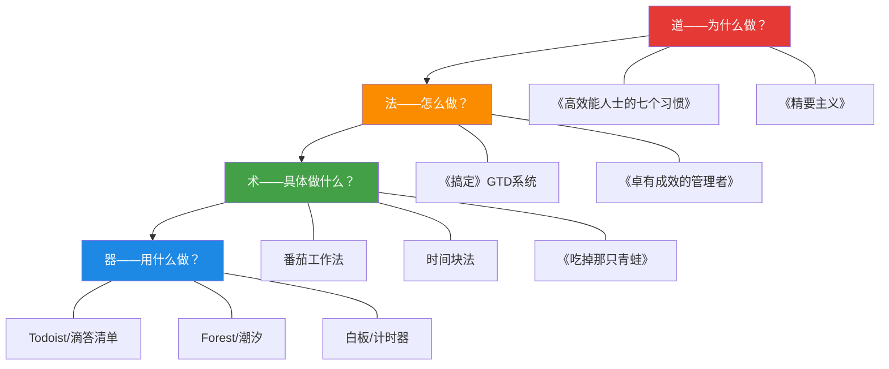
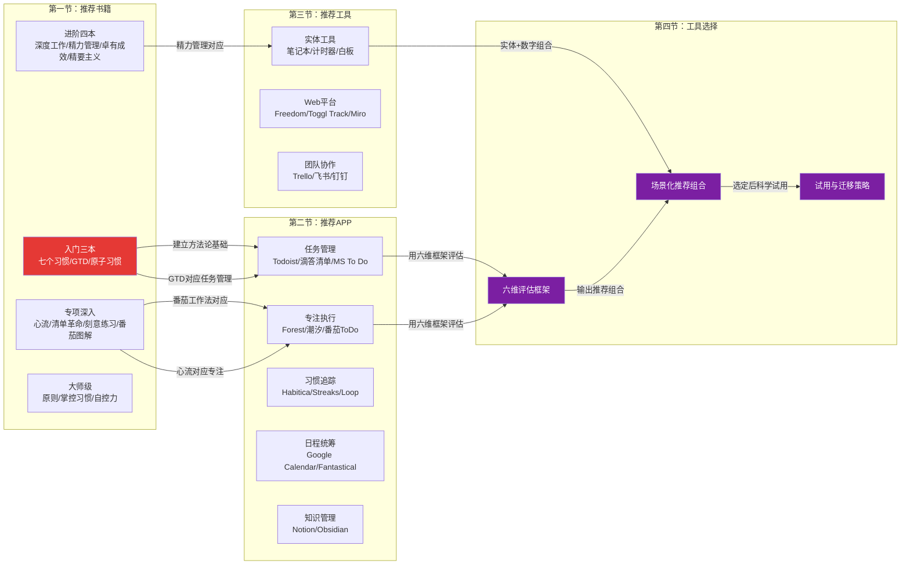

## 五、本节总结

本节用了四篇长文的篇幅，从书籍、APP、实体工具、选择方法论四个维度构建了一个完整的时间管理"工具生态图"。信息量巨大——16本书、30+款APP、20+种实体工具、6维评估框架、多种场景组合方案。面对这么多信息，最重要的不是记住每一个工具的名字，而是理解它们之间的**结构关系**和**选择逻辑**。

本节总结将做三件事：**提炼核心认知框架**、**纠正常见的工具使用误区**、**给出可执行的行动路线图**。

---

### 5.1 道法术器：贯穿全节的知识架构

前面四节的内容看似独立，实际上遵循一个统一的"道法术器"框架。理解这个框架，你就能在任何新工具出现时快速判断它是否值得投入时间。

#### 5.1.1 四层架构的完整映射

| 层级 | 核心问题 | 本节对应内容 | 典型代表 | 学习优先级 |
|------|---------|-------------|---------|-----------|
| **道** | 为什么时间管理重要？我该追求什么样的生活？ | 推荐书籍（入门级三本） | 《七个习惯》《精要主义》 | ★★★★★ 最先学 |
| **法** | 如何设计一套适合自己的管理系统？ | 推荐书籍（进阶级）+ 工具选择建议 | GTD、德鲁克时间审计 | ★★★★☆ |
| **术** | 具体怎么执行任务、对抗拖延？ | 推荐APP（番茄钟、习惯追踪） | 番茄工作法、时间块法 | ★★★☆☆ |
| **器** | 用什么工具承载这些方法？ | 推荐工具 + APP对比 | 滴答清单、Forest、白板 | ★★☆☆☆ 最后选 |

**关键洞察**：大多数人时间管理失败的原因，恰恰是跳过了"道"和"法"，直接去挑选工具。这就像一个人还没学会建筑力学，就花三个月时间纠结用什么品牌的砖头。工具是最后一层选择，不是第一层。

#### 5.1.2 道法术器的协同效应

四层不是孤立的——它们之间存在严格的依赖关系：

- **道 → 法**：没有"以终为始"的价值观（道），你就不会认真设计GTD系统（法），因为你不相信"系统化管理"本身有价值。
- **法 → 术**：没有GTD的"每周回顾"框架（法），番茄钟（术）就只是一个计时器，你不知道该用番茄钟做什么。
- **术 → 器**：不知道番茄工作法的操作细节（术），你就无法判断滴答清单的内置番茄钟和Forest哪个更适合你（器）。

反过来也成立：**器不配术则废，术不配法则散，法不配道则盲**。一个功能强大的GTD APP（器），如果你不理解番茄钟的工作原理（术），那些高级功能就是摆设；一套完善的番茄钟流程（术），如果你没有GTD系统（法）来组织任务，你只是在"计时"而非"管理"。

---

### 5.2 核心认知提炼：从四节内容中蒸馏出的七条原则

下面七条原则，是从本节四篇长文中反复出现的核心论点中提炼出来的。它们不是"建议"，而是经过认知科学和行为心理学验证的**底层规律**。

#### 原则一：先方法，后工具

这是本节出现频率最高的观点——在推荐书籍、推荐APP、工具选择建议三节中都被放在首要位置强调。

**为什么这么重要？** 因为方法论和工具之间的关系，就像菜谱和厨具的关系。一个米其林大厨用普通炒锅也能做出好菜，但一个不会做饭的人买再贵的厨具也只是占地方。时间管理同理——GTD的核心是"收集→理清→组织→回顾→执行"五步流程，这个流程用纸笔就能运行。APP只是让这个流程更方便，但不能替代流程本身。

**实操检验**：如果你无法用纸笔向别人解释你的时间管理方法论，说明你还没真正理解它——此时任何工具都帮不了你。

#### 原则二：少即是多——工具数量的科学上限

认知科学给出了明确的答案：人脑的工作记忆容量约为4±1个信息单元（Miller, 1956）。每增加一个工具，就多占用一个"心理插槽"。加上每次工具切换的上下文切换成本（Gloria Mark教授的研究显示平均需要23分钟恢复专注），过多工具的隐性成本远超你的想象。

**科学标准**：核心工具控制在3-5个以内。

| 层次 | 数量 | 用途 | 示例 |
|------|------|------|------|
| 核心层（每天用） | 3个 | 任务管理 + 专注执行 + 日程统筹 | 滴答清单 + Forest + 日历 |
| 辅助层（每周用） | 1-2个 | 统计分析、习惯回顾 | Toggl Track、RescueTime |
| 偶尔层（按需用） | 不限 | 自动化、团队协作 | IFTTT、飞书 |

#### 原则三：从简开始，渐进升级

工具选择建议一节中的"三阶段进化模型"值得反复强调：

**第一阶段（第1-4周）**：只用1-2个最简单的工具。目标不是建立完美的管理系统，而是养成"每天用工具管理任务"的习惯。Microsoft To Do或手机自带备忘录足矣。

**第二阶段（第5-12周）**：根据第一阶段的使用痛点，升级到2-3个工具，引入方法论。如果发现自己总忘记做什么→引入GTD；如果发现自己总是拖延→引入番茄钟。

**第三阶段（第13周以后）**：构建完整系统，包含自动化和数据分析。此时你已经知道自己真正需要什么，选工具不再是盲目跟风。

**为什么要从简？** 因为在你还没有形成时间管理习惯之前，复杂的工具只会增加摩擦。一个最简单的待办清单APP，如果能让你每天坚持使用，比一个功能强大但三天就放弃的GTD系统有效100倍。

#### 原则四：数据永远属于你

工具选择建议中"数据所有权与可迁移性"这一维度，被很多人忽视，但它决定了你的长期安全感。

**现实教训**：Google曾关闭Reader、Google+、Hangouts等数十款产品；Wunderlist被微软收购后停止运营；许多小型效率工具悄然关闭。如果你的全部数据都在一个平台上且没有备份，你将面临：

- **历史数据丢失**：几年的任务完成记录、习惯数据、笔记全部消失
- **工作流断裂**：你已经习惯了某个工具的操作方式，迁移意味着重新适应
- **迁移焦虑**：害怕数据丢失而不敢换工具，即使现有工具已经不适合你

**行动方案**：

1. 选择支持CSV/JSON/Markdown导出的工具
2. 每月做一次完整的数据备份
3. 优先选择本地存储方案（如Obsidian的Markdown文件）
4. 了解你正在使用的工具的数据导出格式和完整性

#### 原则五：投资工具就是投资时间

工具选择建议中"只选免费的"被列为陷阱之一，原因是它忽略了**时间成本**的计算。

**计算公式**：你的每小时价值 =（月收入 + 月副业收入）÷ 每月工作小时数。假设你的每小时价值是100元，一个付费工具每天帮你节省30分钟，一年节省约180小时（价值18,000元），而工具年费可能只有几百元。投资回报率高达几十倍。

**特别适用于自由职业者**：如果你的时间直接等于收入（按小时计费），Toggl Track帮你多追踪到每天1小时之前遗漏的可计费时间，按小时费率200元计算，一个月就是4,000元——远超工具成本。

**但注意**：付费的前提是"确实节省了时间"。很多付费功能你可能根本用不到。建议：先用免费版认真使用两周，确认痛点后再付费。

#### 原则六：工具审美不是"花瓶"——它是坚持使用的前提

工具选择建议中"愉悦感与审美"维度的科学依据是**审美可用性效应（Aesthetic-Usability Effect）**：用户倾向于认为更好看的产品更好用——这种心理会直接影响你的使用频率和满意度。

**实操意义**：如果你每天打开一个你觉得丑陋或操作别扭的APP，这本身就是一种心理消耗。在功能满足需求的前提下，选择你"打开就想用"的那款。习惯追踪类APP中，Streaks的极简设计和Forest的种植动画之所以成功，审美设计功不可没。

#### 原则七：定期审视，主动调整

工具不是"选一次管终身"。你的生活阶段、工作性质、技术环境都在变化，工具组合需要跟着变化。

**维护节奏**：

| 频率 | 动作 | 耗时 | 核心问题 |
|------|------|------|---------|
| 每月 | 使用频率检查 | 30分钟 | 过去30天是否每天都用了核心工具？ |
| 每季度 | 功能审视+新工具评估 | 1小时 | 哪些付费功能从未使用？是否有更好的替代品？ |
| 每年 | 全面重评估 | 2小时 | 如果从零开始，今天我还会选这套工具吗？ |

---

### 5.3 误区纠正：工具使用中最常见的六个陷阱

本节四篇长文中反复提到的误区，这里做一个系统性梳理。识别并避开这些陷阱，比学会任何一个工具都重要。

#### 陷阱一：工具收集癖（Shiny Object Syndrome）

**症状**：看到新的效率工具推荐就忍不住下载试用，手机上有20个效率APP，每个只用了两三天。

**根因分析**：这是一种"虚假的生产力感"——试用新工具让你觉得自己在"提升效率"，实际上你在浪费时间。心理学上，这被称为"准备谬误"（Preparation Fallacy）：过度准备，迟迟不行动。

**解药**：制定"三月规则"——选定一套工具后，至少使用三个月再考虑更换。三个月是形成习惯的最低时长。把"试用新工具"本身当作一个任务放进待办清单——只有在有明确不满时才去试用替代品。

#### 陷阱二：功能过度（Feature Overload）

**症状**：选择功能最多的工具，花大量时间配置标签、视图、自动化规则，结果系统过于复杂，日常使用反而不方便。

**根因分析**：高估了"系统完善"的作用，低估了"操作简洁"的价值。一个80%匹配但操作简洁的系统，比一个100%匹配但操作繁琐的系统更有效——因为你每天要操作几十次，每次多花10秒配置，一年就是几十小时的浪费。

**解药**：先用最简配置运行两周，然后根据实际痛点逐步添加功能。每次添加一个功能，观察一周是否真的有帮助。如果一个功能你两周内没用过，就关掉它。

#### 陷阱三：完美主义迁移

**症状**：觉得当前工具不够好，反复在不同工具间切换，每次都花大量时间迁移数据和重建系统，但始终没有形成稳定的工作流。

**根因分析**：把"找到完美工具"当作目标，而不是"用工具管理时间"。这是典型的"手段目标化"——工具是手段，高效利用时间才是目标。

**解药**：接受"没有完美工具"的现实。任何工具都有缺点，关键是：**这个工具的缺点是否严重影响我的核心工作流？** 如果只是"界面不够好看""动画不够流畅"这类问题，不值得为此迁移。

#### 陷阱四：强迫自己用"别人推荐的最好的"

**症状**：看到某大V推荐Todoist/Obsidian/Notion，就强迫自己用，但内心觉得别扭。

**根因分析**：每个人的工作方式、思维习惯、审美偏好不同。"最好的工具"是相对于具体的人来说的。推荐书籍中分析的16本书，没有人能全部精读——你需要根据自己的痛点和阶段选择。工具同理。

**解药**：别人的推荐是缩小选择范围的起点，不是最终答案。最终决定权在你的实际体验手中。参考工具选择建议中的"A/B对比测试法"，用数据而非感觉做决策。

#### 陷阱五：忽略数据安全

**症状**：所有任务、笔记、日程都存放在一个云端服务中，没有备份，没有导出。

**根因分析**：高估了云服务的可靠性，低估了数据丢失的风险。前文已经列举了多个产品停运的案例。

**解药**：每月导出一次完整的数据备份；关键笔记保持本地副本；定期评估你依赖的工具是否有停运风险。Obsidian在这方面有天然优势——所有数据就是你电脑上的Markdown文件。

#### 陷阱六：把"管理工具"当作"管理时间"

**症状**：每天花大量时间在调整工具配置、美化界面、测试新插件上，实际用来执行任务的时间反而变少了。

**根因分析**：这是一种拖延的伪装形式。你看起来在"提升效率"，实际上在逃避真正困难的工作。工具选择建议中已经明确指出：**工具维护时间每周不应超过15分钟**。

**解药**：设定"工具维护时间盒"——每周五下午花15分钟整理工具，除此之外不去动它。把省下的时间投入到真正的深度工作中。

---

### 5.4 信息全景图：本节四节内容的知识拓扑

为了帮助你建立对本节内容的全局认知，下面用一张知识拓扑图展示四节之间的逻辑关系和信息流向。

**信息流向总结**：

1. **书籍（道法）→ APP（术器）**：先通过书籍建立方法论认知，再选择对应功能的APP。GTD理论引导你选择支持项目/上下文/标签的任务管理工具；番茄工作法引导你选择专注计时APP。
2. **APP + 实体工具 → 选择框架**：面对众多选项，用六维评估框架做理性决策，而非盲目跟风。
3. **选择框架 → 场景化组合 → 科学试用 → 迁移执行**：从理论到实践的完整路径。

---

### 5.5 工具与方法论的最优配对矩阵

本节四节内容中散落着大量的"方法论-工具"配对建议，这里做一个系统性汇总，方便你快速查阅。

| 方法论 | 书籍来源 | 最佳APP配对 | 最佳实体工具配对 | 适用场景 |
|--------|---------|------------|----------------|---------|
| GTD（Getting Things Done） | 《搞定》 | Todoist / 滴答清单 | Moleskine点阵笔记本 | 事务繁杂、多项目并行 |
| 番茄工作法 | 《番茄工作法图解》 | Forest / 番茄ToDo | 机械计时器 / Time Timer | 容易分心、需要专注 |
| 四象限法则 | 《高效能人士的七个习惯》 | 滴答清单（优先级标记） | 白板+四色卡片 | 优先级混乱、什么都想做 |
| 时间块法（Time Blocking） | 《深度工作》 | Google Calendar / Fantastical | 周计划笔记本 | 需要保护深度工作时间 |
| Bullet Journal | 社区实践 | Obsidian（插件支持） | Leuchtturm1917 Dot Grid | 喜欢手写、需要深度反思 |
| 精力管理 | 《精力管理》 | 潮汐（声景+冥想） | 人体工学椅+升降桌 | 经常疲惫、效率波动大 |
| 习惯养成 | 《原子习惯》 | Streaks / Loop / Habitica | 习惯打卡表格（白板） | 想养成好习惯但总是失败 |
| OKR目标管理 | 《原则》 | Notion / 飞书OKR | 软木板（愿景板） | 有明确长期目标需要拆解 |
| 两分钟原则 | 《搞定》 | Microsoft To Do（快速添加） | 便签纸 | 小任务堆积、收件箱爆满 |
| 深度工作 | 《深度工作》 | Freedom / Cold Turkey | 降噪耳机+实体计时器 | 知识工作者、创意工作者 |

**使用方法**：先在左列找到你当前最想解决的痛点，然后按行选择对应的书籍（理解原理）、APP（日常执行）、实体工具（环境优化）。不要同时引入太多方法论——一次一个，用熟了再加。

---

### 5.6 不同阶段的行动路线图

基于本节所有内容，为三个阶段的读者提供具体可执行的行动方案。

#### 5.6.1 零基础起步（从未做过时间管理）

**第1-2周：建立意识**

1. 阅读《高效能人士的七个习惯》的习惯一、二、三（约3天），理解"要事第一"的核心理念
2. 安装一个最简单的任务管理APP（推荐Microsoft To Do或滴答清单免费版）
3. 每天早上花3分钟写下"今天最重要的3件事"，睡前花2分钟勾掉完成的

**第3-4周：引入专注**

4. 阅读《番茄工作法图解》（半天可读完）
5. 下载Forest或使用滴答清单内置番茄钟
6. 每天至少完成3个番茄钟（25分钟×3=75分钟的专注时间）

**第5-8周：建立系统**

7. 阅读《搞定》的核心章节，理解GTD五步流程
8. 做一次"大脑清扫"，把脑子里所有未完成的事写下来
9. 建立项目清单、下一步行动清单、日程表、等待清单

**第9-12周：巩固习惯**

10. 固定每周五下午做一次"每周回顾"
11. 用滴答清单或Loop的习惯追踪功能，连续打卡30天
12. 淘汰掉这两个月中没有坚持使用的工具，只保留核心的3个

#### 5.6.2 中级进阶（有基础但效率不高）

**诊断阶段（第1周）**

1. 用RescueTime或Toggl Track做一周时间审计，找到最大的"时间漏洞"
2. 对照推荐APP的对比表格，评估当前工具是否匹配你的方法论

**优化阶段（第2-4周）**

3. 如果当前工具不匹配→参考六维评估框架重新选择，按"科学试用四步流程"试用新工具
4. 引入一个你还没有使用的核心工具：降噪耳机（专注环境）、白板（可视化管理）、时间追踪工具（数据驱动改进）
5. 阅读《深度工作》，设计你的深度工作日程

**深化阶段（第5-8周）**

6. 阅读《精力管理》，制作精力审计表，找到你的精力高峰期
7. 将最重要的工作安排在精力高峰期
8. 建立"工具维护月度审视"习惯——每月花30分钟检查工具使用情况

#### 5.6.3 高级优化（系统已成型，追求极致）

**精细化（持续）**

1. 阅读《心流》，在深度工作中刻意创造心流条件
2. 阅读《刻意练习》，用刻意练习的框架提升时间管理技能本身
3. 建立自动化工作流：IFTTT/快捷指令/Zapier连接各工具

**系统化（每季度）**

4. 做工具组合的季度审视：是否有可以合并的工具？是否有更好的替代品？
5. 评估是否需要引入团队协作平台（飞书/钉钉/Trello）
6. 将你的时间管理系统方法论总结成文档，分享给同事或团队

**个性化（每半年）**

7. 根据生活阶段变化调整工具组合（换工作、搬家、家庭变化等）
8. 尝试一种新的时间管理方法论（如从GTD切换到Bullet Journal）
9. 回顾本节推荐书籍中你还没读过的书，选择最相关的2-3本精读

---

### 5.7 关键数据速查卡

本节涉及大量工具价格和功能数据，这里做一个汇总速查，方便你快速决策。

#### 核心APP价格速查

| APP名称 | 免费版功能 | 付费价格 | 核心价值 |
|---------|----------|---------|---------|
| Microsoft To Do | 完全免费无限制 | 0元 | 最简洁的零成本入门选择 |
| 滴答清单 | 任务+日历+番茄钟+习惯 | 139元/年 | 中国用户一站式首选 |
| Todoist | 5个项目限制 | ~360元/年 | 极简设计+自然语言输入 |
| Forest | Android免费/iOS约25元 | 买断制 | 游戏化专注，种真树 |
| 潮汐 | 每天3次专注 | 128元/年 | 声景品质最佳 |
| 番茄ToDo | 基础功能免费 | ~98元/年 | 中国学生专属，学霸模式 |
| Streaks | 无 | ~30元买断 | Apple生态极简习惯追踪 |
| Loop Habit Tracker | 完全免费开源 | 0元 | Android最强数据分析 |
| Notion | 个人免费（5MB限制） | ~8美元/月 | 最灵活的知识管理系统 |
| Obsidian | 个人完全免费 | 0元 | 数据所有权最强，本地Markdown |
| Toggl Track | 5用户基础报告 | ~9美元/用户/月 | 时间追踪行业标杆 |
| Clockify | 核心功能免费不限用户 | 0元 | 团队时间追踪零成本 |
| Freedom | 无 | ~280元/年 | 全平台干扰屏蔽 |
| Cold Turkey | 基础版免费 | ~270元买断 | 不可逆锁定，最难绕过 |

#### 推荐书籍阅读优先级

| 优先级 | 书名 | 阅读时间 | 核心收获 |
|--------|------|---------|---------|
| ★★★★★ | 《高效能人士的七个习惯》 | 7-10天 | 时间管理的底层操作系统 |
| ★★★★★ | 《搞定》 | 7天 | 完整的个人任务管理系统 |
| ★★★★★ | 《原子习惯》 | 5-7天 | 习惯养成的科学方法 |
| ★★★★☆ | 《深度工作》 | 7天 | 知识工作者的专注策略 |
| ★★★★☆ | 《精力管理》 | 5-7天 | 超越时间管理的能量管理 |
| ★★★★☆ | 《精要主义》 | 5天 | 学会说"不"的系统方法 |
| ★★★☆☆ | 《心流》 | 选读 | 最优体验的心理学机制 |
| ★★★☆☆ | 《番茄工作法图解》 | 半天 | 番茄钟的完整操作手册 |
| ★★★☆☆ | 《刻意练习》 | 5天 | 从新手到专家的科学路径 |
| ★★☆☆☆ | 《卓有成效的管理者》 | 5天 | 管理者的时间管理智慧 |

---

### 5.8 工具为我所用，而非我为工具所用

回顾本节的核心信息，有一句话值得反复强调：

> **工具是手的延伸，但只有会使用工具的手才能创造价值。**

这句话包含了三层含义：

**第一层：工具是手段，不是目的。** 时间管理的最终目标是让你用有限的时间做最重要的事、过更满意的生活。工具只是帮助你实现这个目标的手段。如果你花了80%的时间在"管理工具"上，只有20%的时间在"做事"，那你需要的不是更好的工具，而是放下工具，开始行动。

**第二层：先有手，才有工具的价值。** "手"代表你的方法论认知、你的习惯系统、你的自律能力。一个理解GTD精髓的人用纸笔也能高效管理时间；一个不理解时间管理原理的人，给他最强大的GTD APP也只是多了一个被遗忘的图标。

**第三层：工具应该"消失"。** 最好的工具使用状态是"无感"——你不需要思考"我要用什么工具"，工具已经融入你的工作流，像呼吸一样自然。如果一款工具让你经常感到"操作别扭"或"功能找不到"，它还没有达到这个状态——要么你需要更多学习时间，要么它确实不适合你。

---

### 5.9 过渡到下一节

本节（产品推荐）解决了"用什么"的问题。你已经知道：

- **读什么书**来建立方法论基础（16本书的分层推荐）
- **用什么APP**来执行日常时间管理（任务、专注、习惯、日程四大类）
- **用什么实体工具**来优化工作环境（笔记本、计时器、白板、人体工学）
- **怎么选工具**（六维评估框架、场景化组合、科学试用）

在下一节（具体方案）中，我们将从"工具选择"进入"实操落地"——把本节推荐的书籍中的方法论和本节推荐的工具结合起来，为你提供**可直接执行的具体方案**：每日时间管理方案、每周计划方法、每月复盘方法、项目时间管理、工作与生活平衡、习惯养成实践方案等。

简单来说：本节告诉你"用什么武器"，下一节教你"怎么打这场仗"。

---

> 读100本书不如认真实践1本书中的方法；装100个APP不如认真用好1个APP。先从今天开始——打开你手机上最简单的待办清单，写下明天最重要的3件事。这就是你时间管理旅程的第一步。
