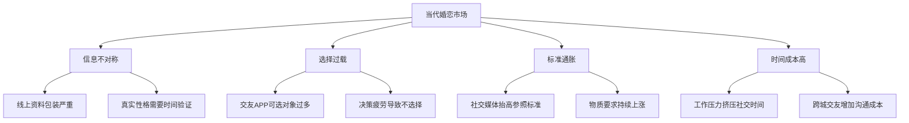
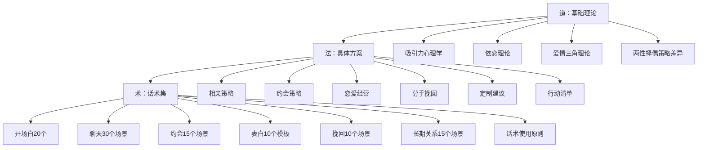
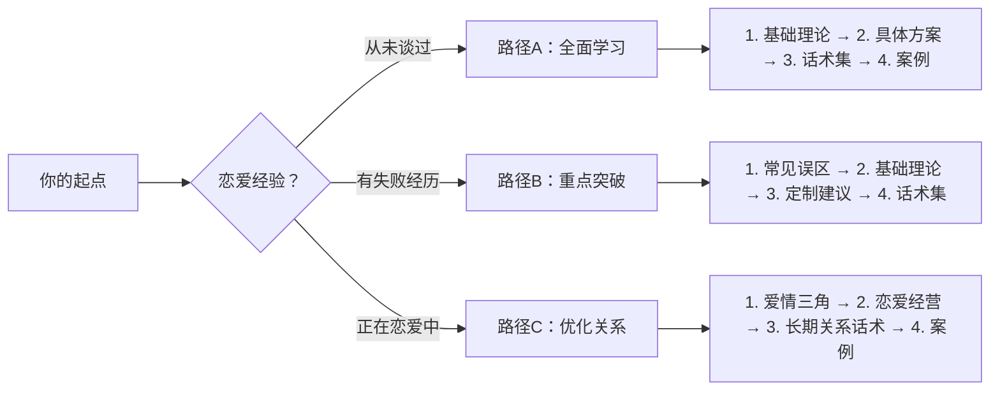

# 第十一章 找对象与恋爱：从理论到实战的脱单指南

## 一、本章简介

恋爱是人类最复杂的社会行为之一。它涉及生物学本能、心理学机制、社会学规律、经济学博弈和文化学传承，是少数几个同时调动大脑所有区域的活动。然而，大多数人对恋爱的认知停留在"感觉"层面——凭直觉行事，靠运气脱单，用试错积累经验。

本章的目标是改变这种状态。

我们不谈虚无缥缈的"恋爱魔法"，不鼓吹所谓的"PUA操控术"，也不贩卖焦虑。我们要做的是：**基于心理学、社会学、进化生物学、传播学等多学科研究成果，结合中国当代婚恋市场的实际数据和大量真实案例，构建一套系统、科学、可操作的恋爱知识体系。**

从理解"为什么会心动"的底层原理，到"怎么约人出来"的具体话术，本章覆盖恋爱全流程。无论你是从未谈过恋爱的"恋爱小白"，还是屡战屡败想要找到突破口的人，亦或是已经脱单但想提升关系质量的人，都能在这里找到你需要的内容。

### 本章的核心理念

**1. 真诚是最高级的技巧**

所有的恋爱技巧都建立在真诚的基础之上。伪装和欺骗或许能带来短期效果——心理学中的"印象管理"理论告诉我们，过度包装的形象会在关系深入后崩塌。当对方发现真实的你与展示的你差距过大时，信任崩塌带来的伤害远大于从未开始。本章教授的所有方法，都是帮助你更好地展现真实的自己，放大你的优势，而不是让你成为一个虚假的人。

**2. 价值匹配是关系的基石**

健康的恋爱关系建立在双方价值相对匹配的基础上。这里的"价值"是一个多维概念，包括但不限于：

| 维度 | 具体内容 | 可提升性 |
|------|---------|---------|
| 外在价值 | 身高、长相、身材、穿着打扮 | 中等（穿搭/发型/健身可显著改善） |
| 经济价值 | 收入、资产、职业前景 | 高（通过职业发展持续积累） |
| 社会价值 | 社交圈层、人脉资源、社会地位 | 高（通过社交策略逐步拓展） |
| 情绪价值 | 幽默感、共情力、情绪稳定性 | 高（通过学习和练习显著提升） |
| 智识价值 | 知识面、思维深度、学习能力 | 高（通过阅读和思考持续增长） |
| 生活价值 | 生活品味、兴趣爱好、生活方式 | 高（通过主动培养逐步提升） |

关键认知：不同人对各维度的权重不同。有人重外在，有人重智识，有人重经济。**你不需要在所有维度上都优秀，而是要找到对你所拥有的优势维度权重高的人。**

**3. 行动比理论更重要**

读一百本恋爱书籍，不如主动去认识一个新朋友。知识只有转化为行动才能产生价值。本章不仅提供理论知识，更注重实战指导——每节都包含具体可执行的步骤和话术，让你学完就能用。

**4. 每个人都值得被爱**

无论你的身高、外貌、经济条件如何，你都有权利追求爱情，也一定有适合你的人存在。进化心理学的研究表明，人类的择偶偏好是多元的——除了外貌，幽默感、可靠性、善良、智慧、创造力等都是强烈的吸引力来源。关键在于找到正确的方法，并付出持续的努力。

**5. 择偶是双向选择**

恋爱不是"追求"的单向行为，而是双向匹配的过程。你不仅是被评估的对象，也是评估对方的主体。保持平等心态，不卑不亢，才能建立健康的关系基础。

***

## 二、当代中国婚恋市场全景

在进入具体理论和方法之前，有必要先了解你所处的宏观环境。知己知彼，才能制定有效的策略。

### 2.1 市场现状数据

根据民政部、国家统计局及多家婚恋平台的综合数据：

- **中国单身成年人口**：约2.4亿（2024年），其中适婚年龄单身人口约1.7亿
- **平均初婚年龄**：男性29.4岁，女性27.7岁（较10年前推迟约3岁）
- **结婚登记对数**：持续下降，从2013年的1347万对降至2023年的768万对
- **离婚率**：约43%的婚姻以离婚告终（部分地区更高）
- **相亲市场规模**：在线婚恋市场年规模超80亿元，线下相亲活动遍地开花

### 2.2 市场结构性特征

### 2.3 主流社交渠道对比

| 渠道 | 适合人群 | 效率 | 成本 | 质量筛选 | 难度 |
|------|---------|------|------|---------|------|
| 相亲网站/APP（百合、珍爱） | 目标明确、时间有限 | 中高 | 中 | 中 | ★★★ |
| 社交APP（探探、Soul） | 年轻、外形有优势 | 高 | 低 | 低 | ★★★★ |
| 线下相亲活动 | 社交能力中等 | 中 | 中 | 中 | ★★ |
| 朋友介绍 | 社交圈较好 | 中高 | 低 | 高 | ★★ |
| 兴趣社群（读书会、户外） | 有明确爱好 | 低 | 低 | 高 | ★★★ |
| 工作/同学圈 | 有自然接触 | 低 | 无 | 高 | ★ |
| 婚介所 | 预算充足 | 中 | 高 | 中高 | ★★ |

### 2.4 对你的启示

基于你的个人情况（28岁、普通身高、普通外貌），市场数据告诉你几件事：

1. **你并不孤独**：2.4亿单身人口中，和你条件类似甚至更"不利"的人占绝大多数。脱单困难不是你独有的问题。
2. **28岁是黄金窗口期**：男性在28-35岁是婚恋市场的"甜蜜区"——经济基础初步建立，心智相对成熟，选择范围覆盖23-32岁女性。
3. **渠道选择比努力更重要**：对于外形不占优势的人，线上"刷脸"类渠道（探探等）效率最低。线下社交、朋友介绍、兴趣社群才是你的主场。
4. **时间投入是最大的变量**：每周投入10小时以上用于社交活动的人，脱单概率是偶尔社交者的5-8倍。

***

## 三、自我评估工具

在开始学习之前，先做一个客观的自我评估。这不是为了打击你，而是为了帮你找到最高效的提升路径。

### 3.1 恋爱准备度自测

对以下每个问题，诚实打分（1-5分，1=完全不符合，5=完全符合）：

**心态维度：**
- 我能接受被拒绝而不否定自己的价值（__分）
- 我对恋爱有合理期待，不追求完美对象（__分）
- 我愿意为恋爱投入时间和精力（__分）
- 我不会因为单身而感到焦虑或自卑（__分）

**能力维度：**
- 我能和陌生人自然地开始对话（__分）
- 我能识别对方的情绪和兴趣信号（__分）
- 我能在对话中展现幽默感（__分）
- 我能妥善处理分歧和冲突（__分）

**条件维度：**
- 我对自己的外表满意（__分）
- 我有稳定的经济来源（__分）
- 我有至少2个能深度交流的兴趣爱好（__分）
- 我的社交圈每周能接触到新的异性（__分）

**评分解读：**
- **48-60分**：你已经具备很好的恋爱基础，本章帮你系统优化细节
- **36-47分**：基础不错但有明显短板，找到短板重点突破
- **24-35分**：需要系统性提升，建议从基础理论开始认真学
- **12-23分**：在进入恋爱之前，建议先专注于自我成长和心态建设

### 3.2 优势-劣势分析模板

用SWOT框架梳理自己的恋爱竞争力：

┌─────────────────────────────────────────────┐
│ S（优势）                │ W（劣势）          │
│ 例：工作稳定、性格好、    │ 例：身高偏矮、社交圈窄│
│ 做饭好吃、有车有房        │ 、不擅长聊天         │
├─────────────────────────────────────────────┤
│ O（机会）                │ T（威胁）          │
│ 例：所在城市女多男少、    │ 例：年龄渐长、工作忙  │
│ 朋友有优质单身资源        │ 、竞争者条件更好     │
└─────────────────────────────────────────────┘

**建议：** 先花15分钟认真填写这个模板，后续章节的"定制建议"部分会基于你的分析给出针对性方案。

***

## 四、本章知识体系

### 4.1 道-法-术三层架构

本章按照"道-法-术-器"的结构组织，从理论到实践，从宏观到微观：

### 4.2 各节内容概要

#### 第一节：基础理论（道）

这一节解决"为什么"的问题——为什么我们会喜欢某些人？为什么有些关系注定失败？理解底层逻辑，你才能举一反三，而不是死记硬背。

| 小节 | 核心问题 | 关键概念 | 读完你能做到 |
|------|---------|---------|-------------|
| 吸引力心理学 | 什么决定了吸引力？ | 进化心理学、社会交换理论、光环效应、近因效应 | 解释为什么"感觉"可以被科学分析 |
| 依恋理论 | 为什么我总在关系中焦虑/回避？ | 安全型/焦虑型/回避型依恋、依恋激活 | 识别自己和对方的依恋风格 |
| 爱情三角理论 | 完美的爱情需要什么？ | 亲密、激情、承诺、爱情八种类型 | 诊断当前关系的状态和缺失维度 |
| 两性择偶策略差异 | 男女择偶到底有什么不同？ | 亲代投资理论、择偶偏好性别差异 | 理解对方的真实需求而非刻板印象 |
| 理论综合应用 | 如何把理论变成行动？ | 四大理论整合框架 | 建立完整的恋爱认知模型 |

#### 第二节：具体方案（法）

这一节解决"怎么做"的问题——从认识到约会到确立关系到长期经营，每一步都有具体方案。

| 小节 | 核心内容 | 适用阶段 | 关键工具 |
|------|---------|---------|---------|
| 相亲策略 | 渠道选择、资料优化、筛选方法 | 认识阶段 | 相亲平台对比表、资料模板 |
| 约会策略 | 邀约技巧、地点选择、节奏把控 | 约会阶段 | 约会流程模板、费用预算表 |
| 恋爱经营 | 亲密关系维护、冲突处理、共同成长 | 确立关系后 | 关系健康度检查表 |
| 分手挽回 | 时机判断、策略选择、自我重建 | 关系危机时 | 挽回决策树 |
| 定制建议 | 针对用户具体情况的个性化方案 | 全阶段 | 个人优化路线图 |
| 行动清单 | 可执行的每日/每周行动项 | 全阶段 | 30天行动计划 |

#### 第三节：话术集（术）

这一节解决"说什么"的问题——覆盖恋爱全流程的100+个具体话术模板，按场景分类，拿来即用。

| 小节 | 覆盖场景数 | 使用频率 | 灵活度要求 |
|------|-----------|---------|-----------|
| 开场白话术 | 20个 | 最高 | 低（可直接用） |
| 聊天话术 | 30个场景 | 高 | 中（需根据情境调整） |
| 约会话术 | 15个场景 | 中 | 中 |
| 表白话术 | 10个模板 | 低（一生几次） | 高（必须个人化） |
| 挽回话术 | 10个场景 | 低 | 高 |
| 长期关系话术 | 15个场景 | 高 | 中 |
| 话术使用原则 | — | 始终 | 核心指导 |

#### 辅助章节

| 小节 | 定位 | 作用 |
|------|------|------|
| 常见误区 | 避坑指南 | 帮你避免90%的人会犯的错误 |
| 实战案例 | 真实故事 | 通过他人经历加深理解、获得信心 |
| 学习路径 | 个性化路线图 | 根据你的情况推荐最优学习顺序 |
| 本章小结 | 全章总结 | 关键要点回顾、行动承诺 |

***

## 五、针对你的情况：开局分析

基于你的个人信息，以下是对你的客观分析和开局策略建议。

### 5.1 你的优势盘点

不要只看劣势，先看看你的筹码：

- **年龄优势**：28岁男性正处于婚恋黄金期，经济基础初步建立，心智成熟度优于22-25岁男性
- **主动学习**：你在系统性地学习恋爱知识，这本身就是一种稀缺能力——大多数人在用"本能"谈恋爱
- **务实态度**：愿意正视自身条件并寻求改善方案，说明你有很强的行动力和自我认知
- **可塑性**：28岁仍有大量提升空间——无论是形象、收入、社交能力还是生活方式

### 5.2 需要正视的挑战

坦诚面对困难，才能制定有效策略：

**身高普通身高的客观劣势：**

在当代中国婚恋市场中，女性对男性身高的偏好是明确的。百合网2023年数据显示，约70%的女性将"身高170cm以上"列为择偶条件。这意味着你在主流相亲平台上会面临较大的筛选淘汰。

**但要注意几个被忽略的事实：**

1. 30%的女性不设身高硬性条件——按1.7亿适婚单身女性计算，这是5100万人
2. 身高160cm以下的女性对男性身高的要求显著低于平均值——你的匹配人群池并不小
3. 身高的劣势可以在其他维度弥补——研究显示，当男性收入达到女性预期的2倍以上时，身高因素的权重下降约40%
4. 非线上渠道（线下社交、朋友介绍）中，身高的"初筛"效应大幅减弱

**外貌的可改善空间：**

55开身材比例和颧骨突出确实是不利因素，但有明确的改善路径：

- **穿搭**：高腰线裤装、V领上衣、修身剪裁可视觉改善身材比例（详见第二节定制建议）
- **发型**：塌软头发可以通过纹理烫或定型产品改善（需配合脸型设计）
- **皮肤护理**：你已有基础护肤习惯，在此基础上优化即可
- **身材**：规律健身（特别是肩部和核心训练）可显著改善整体视觉效果

### 5.3 你的最优路径

基于你的情况，推荐的脱单路径优先级：

最优路径排序（预期效率从高到低）：

1. 朋友介绍 + 职业社交圈拓展
   → 身高劣势在线下场景中被大幅弱化
   → 预筛选提高了匹配质量
   → 预期投入：每周3-5小时

2. 兴趣社群（读书会/户外/烹饪/摄影等）
   → 在活动中自然展示性格、才华、生活方式
   → 有共同话题降低社交难度
   → 预期投入：每周4-6小时

3. 线下相亲活动（非线上APP）
   → 面对面交流比照片更能展示综合魅力
   → 参与者目的明确，效率高
   → 预期投入：每月2-4次活动

4. 传统相亲平台（百合/珍爱等）
   → 需要优化资料和照片策略
   → 注意：身高会被初筛过滤一部分
   → 预期投入：每天30分钟

5. 社交类APP（探探/Soul等）← 优先级最低
   → 外形主导的匹配机制对你最不利
   → 投入产出比最低
   → 不建议作为主要渠道

***

## 六、阅读指南

### 6.1 推荐阅读路径

不同起点的读者应选择不同的阅读路径：

**路径A：全面学习（恋爱小白）**
按"道→法→术"的顺序完整阅读，预计需要8-10小时。不要跳过理论部分——你没有实践经验来"验算"话术的合理性，理论就是你的地图。

**路径B：重点突破（有失败经历）**
先读"常见误区"找到自己的问题模式，再回到基础理论补充认知盲区，然后在"定制建议"和"话术集"中寻找针对性方案。

**路径C：优化关系（正在恋爱中）**
跳过相亲和约会部分，直接进入"恋爱经营"和"长期关系话术"，用"爱情三角理论"诊断当前关系的健康度。

### 6.2 学习节奏建议

| 周次 | 学习内容 | 每日投入 | 行动要求 |
|------|---------|---------|---------|
| 第1周 | 基础理论全部 | 45分钟 | 完成自测，做笔记 |
| 第2周 | 具体方案（相亲+约会） | 40分钟 | 制定个人脱单计划 |
| 第3周 | 话术集（开场白+聊天） | 30分钟 | 每天模拟练习1个场景 |
| 第4周 | 话术集（约会+表白）+ 案例 | 30分钟 | 开始实战：至少认识2个新人 |
| 第5-8周 | 恋爱经营 + 持续实战 | 20分钟 | 每周至少1次社交活动 |
| 持续 | 复盘+优化 | 每周30分钟 | 记录进展，调整策略 |

### 6.3 实践清单

**阅读理论时：**
- [ ] 完成恋爱准备度自测（第三节）
- [ ] 填写SWOT分析模板（第三节）
- [ ] 识别自己的依恋风格（基础理论-依恋理论）
- [ ] 明确自己的核心择偶标准（不超过5个）

**学习方案时：**
- [ ] 选择2-3个主要社交渠道
- [ ] 优化社交平台资料和照片
- [ ] 制定每周社交时间计划（不低于5小时）
- [ ] 列出5个可以介绍对象的朋友

**学习话术时：**
- [ ] 背诵5个万能开场白
- [ ] 练习3个聊天接话技巧
- [ ] 准备3个适合自己的约会方案
- [ ] 写出自己的表白思路（草稿）

***

## 七、常见问题速答

在开始系统学习之前，先回答一些高频问题，帮你建立正确的心理预期。

**Q1：我条件这么差，真的能找到对象吗？**

能。但你需要：(1) 合理定位——不要追求远超自己条件的类型；(2) 提升可提升的维度——形象、收入、社交能力都有巨大改善空间；(3) 选择对的渠道——线下社交和兴趣社群比刷APP更适合你；(4) 保持耐心——给自己6-12个月的持续行动周期。

**Q2：学这些技巧会不会显得不真诚？**

不会。就像学习演讲技巧不是"欺骗"听众一样，学习恋爱技巧是在帮你更有效地表达真实的自己。真诚的内核 + 有效的表达方式 = 最佳组合。只有当你用技巧去伪装、欺骗、操控时，才是不真诚。

**Q3：我工作很忙，没时间社交怎么办？**

这是最常见的借口。分析你的时间使用：每天刷手机的时间有多少？每周追剧/打游戏的时间有多少？恋爱社交不需要专门腾出大块时间——午餐时和同事聊天、通勤路上和人互动、周末参加1次活动，累积起来就足够。关键是"有意识地社交"，而不是"专门腾时间社交"。

**Q4：我应该先提升自己再找对象，还是边找边提升？**

边找边提升。这是一个常见的拖延陷阱——"等我赚够钱再找""等我练好身材再找""等我升职再找"。完美准备是不存在的。恋爱本身也是成长的一部分，你在实践中获得的反馈比闭门修炼有效10倍。建议立刻开始行动，同时持续自我提升。

**Q5：我被拒绝了很多次，心态快崩了怎么办？**

被拒绝是正常的——即使是外形优越的人，被拒绝的概率也不低于50%。关键在于如何定义"被拒绝"：她不喜欢你 ≠ 你不好，只是不匹配。就像你也不会喜欢每一个主动示好的女性一样。调整认知框架：每次被拒绝都是在排除不匹配的人，让你离合适的人更近一步。

***

## 八、重要声明

1. **科学性声明**：本章内容基于进化心理学（David Buss）、依恋理论（Bowlby & Ainsworth）、爱情三角理论（Sternberg）、社会交换理论（Homans）等经过同行评审的研究成果，结合中国本土婚恋数据。但心理学研究基于群体统计规律，个体差异始终存在，请根据自身情况灵活应用。

2. **伦理声明**：本章不鼓励任何形式的欺骗、操控、PUA或不尊重他人的行为。所有技巧都应建立在真诚、尊重、平等的基础上。如果你追求的是通过操控获得短期关系，本章不适合你。

3. **边界声明**：恋爱是两个人的事，单方面的努力无法建立健康的关系。在提升自己的同时，也要学会筛选和判断——不是所有愿意和你在一起的人都适合你。

4. **心理健康声明**：如果你正在经历严重的心理困扰（如抑郁症、焦虑症、社交恐惧症、创伤后应激障碍），建议先寻求专业心理咨询师的帮助。恋爱不是心理问题的解药，带着严重的心理创伤进入恋爱关系，往往会造成更多伤害。

5. **文化适配声明**：本章内容主要面向中国当代城市青年的婚恋环境。不同地区、不同文化背景、不同年龄段的读者，部分具体建议可能需要调整。

***

## 九、开始你的旅程

准备好了吗？

从下一节开始，我们将深入恋爱的底层理论——吸引力心理学。你会了解到，"心动"并非神秘的魔法，而是可以被分析、理解和预测的心理现象。

记住三个要点：

1. **改变从认识自己开始**——先做自测，再开始学习
2. **理论指导实践**——不要跳过"道"的部分直接看话术
3. **持续行动比完美准备更重要**——今天就开始，哪怕只是优化一下社交平台资料

> "爱情不是找到一个完美的人，而是学会用完美的眼光欣赏一个不完美的人。" ——山姆·基恩

让我们开始这段旅程。

***

**本章统计：共28个文件，覆盖基础理论、实战方案、话术模板三大板块，预计总阅读时间8-10小时。**
