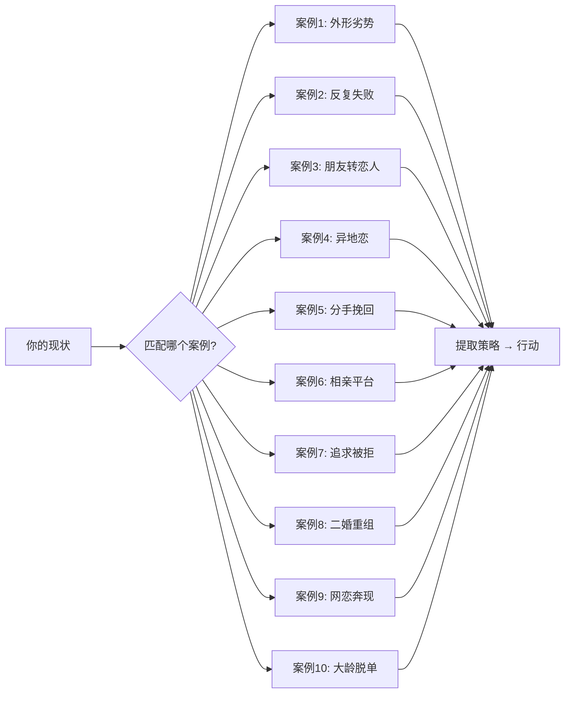
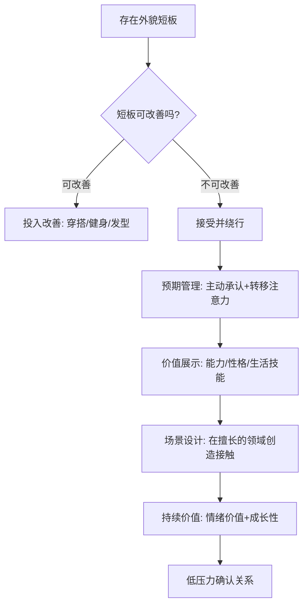
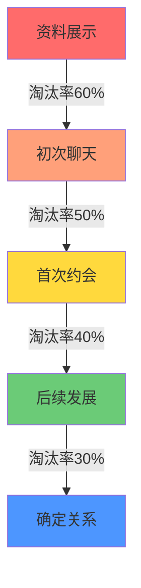
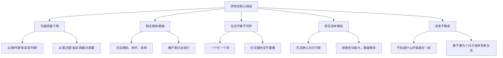
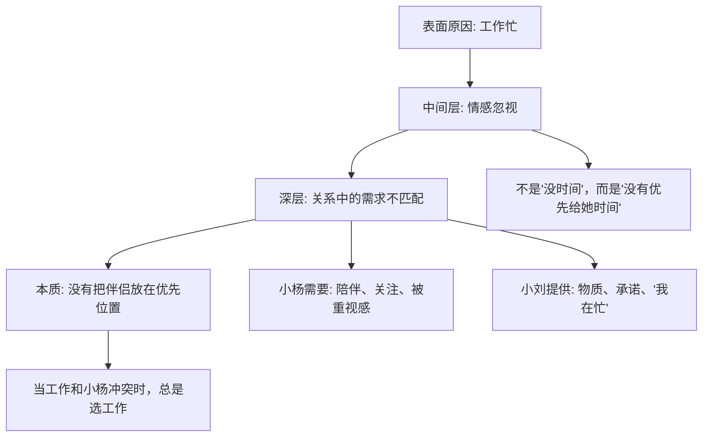
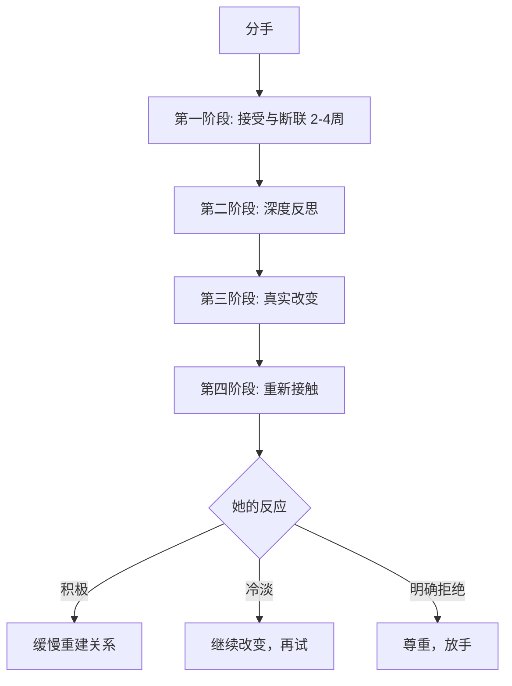
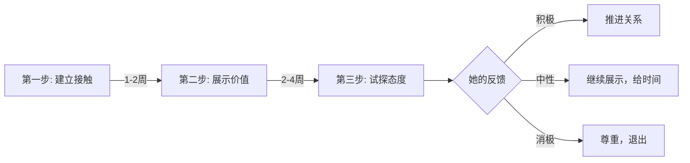
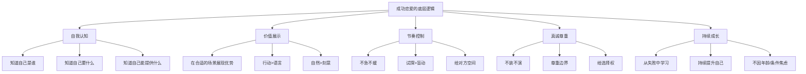

# 实战案例：真实场景深度拆解与行动指南

> "纸上得来终觉浅，绝知此事要躬行。" —— 陆游《冬夜读书示子聿》

理论学得再多，不如看一遍别人怎么做的。本章通过10个覆盖不同场景的真实案例，拆解恋爱中的典型困境、关键决策点和可复用的行动策略。每个案例不只是"讲故事"，而是提炼出**可迁移的方法论**——你可以直接套用到自己的情况中。

## 如何阅读本章

不要把这10个案例当故事集随便翻。建议按以下方式使用：

| 阅读目的 | 推荐方式 |
|---------|---------|
| 解决当前困境 | 直接跳到与你最相似的案例，重点看"策略拆解"部分 |
| 系统学习 | 按顺序读完，注意每个案例的共性规律 |
| 复盘失败经历 | 重点看"错误做法"和"如果重来"部分 |
| 为朋友提供建议 | 看"经验启示"中的可迁移原则 |

***

## 案例1：矮个子男生的成功脱单

> **核心问题**：存在明确的外貌短板时，如何通过综合价值弥补？

### 背景画像

| 维度 | 男方（小李） | 女方（小王） |
|-----|-----------|-----------|
| 年龄 | 27岁 | 25岁 |
| 身高 | 163cm | 160cm |
| 外貌 | 普通 | 中等 |
| 职业 | 程序员 | 行政人员 |
| 月收入 | 15k | 8k |
| 认识方式 | 朋友介绍 | — |

### 心理学背景：首因效应与近因效应的博弈

心理学中的**首因效应**（Primacy Effect）指出，第一印象在人际判断中占据主导地位。身高作为一眼可见的外在特征，确实会影响初次见面的评价。但心理学研究同时表明，**近因效应**（Recency Effect）会随着接触次数增加而增强——也就是说，后续的互动体验会逐渐覆盖第一印象。

小李的策略本质是：**承认第一印象的劣势，但通过加速近因效应来改写最终印象。**

### 过程拆解

**第一阶段：初次接触——"预期管理"策略**

小李没有试图隐藏身高劣势，而是通过朋友做了一个巧妙的**预期管理**。朋友提前铺垫："小李虽然不高，但人特别靠谱，工作能力很强，做饭也很好吃。"

这个铺垫做了三件事：
1. **主动承认劣势**——消除了"见面才发现被欺骗"的风险
2. **转移注意力**——把关注点从身高引导到能力、性格、生活技能
3. **建立期待**——让小王带着"想看看他到底多靠谱"的好奇心赴约

首次见面的细节执行：
- **场地选择**：选了他熟悉的餐厅，这意味着他能从容地和服务员交流、推荐菜品，展现社交能力和掌控感
- **穿着优化**：内增高鞋增加3cm，从163到166，配合修身版型的衣服优化身材比例
- **聊天节奏**：没有刻意表现，而是展现真实的幽默感和见识——这对"普通外貌"的人来说是最有效的加分项

**第二阶段：约会发展——"价值展示"的四个维度**

| 价值维度 | 具体行为 | 传递的信号 |
|---------|---------|----------|
| 细心 | 提前了解小王口味，点了她喜欢的菜 | "我关注你、在意你的感受" |
| 幽默 | 用幽默化解几次冷场 | "和我在一起不会无聊" |
| 有主见 | 主动选择餐厅和电影 | "我有决策能力，你不用操心" |
| 尊重 | 没有急于推进关系 | "我不是只图一时的，我是认真的" |

注意这四个维度的排序：细心和幽默是**日常吸引力**，有主见是**长期伴侣价值**，尊重是**安全感**。这四者缺一不可——只有幽默会变成"搞笑男"，只有尊重会变成"好人卡"。

**第三阶段：关系升温——"生活场景"的价值证明**

经过几次约会后，小李做了一个关键决策：**邀请小王到家里吃饭。**

这不是普通的"请客"，而是一个精心设计的**价值展示场景**：
- **厨艺**：亲手做一桌菜，证明"我有生活能力，不是只会敲代码的宅男"
- **居住环境**：整洁的房间传递出"我有自律能力、生活品质"
- **私密空间的安全感**：家里是一个有信任门槛的场所，邀请本身就是在说"我信任你"

同时，他分享了职业规划和学习计划——这是在展示**成长性**。女性在择偶时不仅看当前状态，更看**未来潜力**。月薪15k不算高，但如果展现出清晰的成长路径，吸引力会大幅提升。

在小王工作压力大时，他给予了理解和支持——这是**情绪价值**的核心。不试图"解决问题"，而是"陪伴和理解"，这比任何物质付出都更能建立情感连接。

**第四阶段：表白——"低压力确认"**

一个月后，小李的表白是："和你在一起的时间都很开心，我想认真地和你在一起，你愿意吗？"

这个表白的精妙之处：
- **没有戏剧化**——没有鲜花、蜡烛、公开场合，降低了拒绝的心理成本
- **没有过度承诺**——没有说"我会爱你一辈子"这种空话
- **有具体感受**——"和你在一起很开心"是真实体验，不是抽象的"我喜欢你"
- **给了选择权**——"你愿意吗"是真正的询问，不是施压

小王后来的反馈验证了整个策略的有效性："刚开始确实有点在意身高，但相处下来发现，身高真的不是最重要的。他让我感到安心、快乐，这比什么都重要。"

### 结果

恋爱一年后结婚，婚姻幸福。

### 可迁移策略

**关键教训**：
1. **身高不是决定性因素**——但你需要在其他维度有明显优势来"对冲"。只说"身高不重要"是自欺欺人，真正要做的是**让自己在其他方面足够突出**。
2. **预期管理比隐藏更有效**——主动承认劣势比被对方"发现"要好得多。前者展现自信，后者让人觉得你在欺骗。
3. **"价值展示"不等于"炫耀"**——小李展示厨艺、整洁房间、职业规划，都是在自然场景中展现的，不是刻意表演。
4. **找对人比改变自己更重要**——小王是一个"更看重内在"的人，如果你追求的是一个"只看身高"的人，再好的策略也没用。

***

## 案例2：从相亲连续失败到成功结婚

> **核心问题**：相亲总是失败，问题到底出在哪？如何系统性地提升相亲成功率？

### 背景画像

| 维度 | 男方（小张） |
|-----|-----------|
| 年龄 | 29岁 |
| 身高 | 170cm |
| 外貌 | 普通 |
| 职业 | 国企员工 |
| 月收入 | 10k |
| 问题 | 相亲20+次，全部失败 |

### 失败原因深度诊断

小张的问题不是"条件不好"，而是**在每个环节都有可以优化的空间**。我们用"漏斗模型"来分析：

| 环节 | 小张的问题 | 问题本质 |
|-----|----------|---------|
| 资料 | 证件照、简历式简介 | 没有**人味**，无法引起兴趣 |
| 聊天 | "你多大？""做什么工作？" | **面试式对话**，没有情感连接 |
| 约会 | 总是咖啡厅、聊工作家庭 | **体验单一**，无法展现真实自我 |
| 形象 | 穿着随意 | 传递"不重视"的信号 |

### 四步改进方案

**第一步：资料重做——从"简历"变成"人设"**

| 改进项 | 改前 | 改后 |
|-------|------|------|
| 头像 | 证件照，呆板无表情 | 生活照，自然微笑，户外背景 |
| 简介 | "男，29岁，国企，本科" | 有个性、有温度的自我介绍 |
| 照片墙 | 无或只有一张 | 6-9张：生活照、旅行照、社交照、兴趣照 |

**简介优化模板**（不是让你照抄，而是理解结构）：

改前写法：`男，29岁，170cm，国企员工，本科学历，有房有车。`

改后写法：`在国企做行政管理，朝九晚五的好处是下班后有大把时间做喜欢的事。周末喜欢徒步和做饭，最近在学日语，准备明年去日本自由行。性格偏内向但不闷，熟了之后话挺多的。希望找一个能一起探索生活的人。`

改后的版本为什么更好：
- **有故事**：不是列条件，而是让人"看到"你的生活
- **有画面**：徒步、做饭、学日语，每个词都能引发想象
- **有态度**："能一起探索生活"比"找一个合适的"更有吸引力
- **有温度**：让人觉得你是一个活生生的人，而不是一张表格

**第二步：聊天升级——从"面试"变成"对话"**

| 场景 | 改前（面试式） | 改后（对话式） |
|-----|-------------|-------------|
| 开场 | "你好，你多大？做什么工作？" | "你的照片是在XX拍的吗？那个地方我也去过" |
| 了解 | "家里几口人？父母做什么？" | "看你喜欢做饭，最拿手的菜是什么？" |
| 深入 | "你对另一半有什么要求？" | "如果有一个月假期，你最想去哪？" |
| 冷场 | 沉默或尬问 | "刚才想到一个有意思的事……" |

核心原则：**用开放式问题代替封闭式问题，用感受代替事实。**

封闭式："你喜欢旅游吗？" → 对方只能回答"喜欢/不喜欢"
开放式："你去过最难忘的地方是哪里？" → 对方会分享故事和感受

聊天节奏的"三步法"：
1. **倾听**：认真看对方说了什么，找到可以延伸的点
2. **回应**：先回应对方的感受，再分享自己的相关经历
3. **延伸**：从回应中抛出新的话题，保持对话流动

**第三步：约会设计——从"走流程"变成"创造体验"**

| 约会类型 | 场景 | 目的 |
|---------|------|------|
| 第一次 | 有特色的餐厅/咖啡馆 | 聊天了解，建立舒适感 |
| 第二次 | 共同参与的活动（做饭、手工、展览） | 在互动中观察性格 |
| 第三次 | 有自然接触机会的场景（散步、看电影） | 试探身体语言反馈 |
| 第四次 | 更私密的场景（家里做饭、短途出行） | 深入了解，推进关系 |

关键原则：**每次约会都要有"不同体验"，而不是复制粘贴。** 如果连续三次都是"吃饭+聊天"，对方会觉得你没有创意，约会变成义务。

**第四步：形象管理——投入产出比最高的投资**

形象不需要多帅，需要的是**干净、得体、有品味**：

| 改进项 | 具体行动 | 预算 |
|-------|---------|------|
| 发型 | 找一个好的理发师，设计适合脸型的发型 | 100-200元/次 |
| 穿搭 | 基础款为主，合身最重要 | 1000-2000元/套 |
| 鞋子 | 干净、合脚、与整体搭配 | 500-800元 |
| 配饰 | 简约手表或手链 | 200-500元 |
| 体味 | 止汗露+淡香水 | 100-300元 |

### 结果

改进后，相亲成功率大幅提升。第5次相亲遇到了现在的妻子，恋爱半年后结婚。

### 可迁移策略

1. **失败不等于"我不行"，而是"我的方法不行"**——小张的条件（170cm、国企、10k）并不差，问题出在呈现方式上。
2. **每个环节都值得优化**——从资料到聊天到约会到形象，任何一个环节的短板都可能导致失败。
3. **相亲是一个"漏斗"**——你需要在每个环节都做到"不被淘汰"，最终才能走到确定关系。
4. **"会聊天"不是天赋，是可以学习的技能**——小张的进步证明了这一点。

***

## 案例3：从五年朋友到恋人

> **核心问题**：如何打破"朋友区"，在不破坏友谊的前提下升级关系？

### 背景画像

| 维度 | 男方（小陈） | 女方（小林） |
|-----|-----------|-----------|
| 年龄 | 26岁 | 25岁 |
| 身高 | 175cm | 162cm |
| 外貌 | 帅气 | 甜美 |
| 职业 | 设计师 | 教师 |
| 月收入 | 12k | 8k |
| 关系 | 大学同学，认识5年，好朋友 | — |

### "朋友区"的心理学机制

为什么有些人会陷入"朋友区"？从依恋理论（Attachment Theory）的角度看：

- **安全型依恋**的人能够自然地表达情感需求，不容易被困在朋友区
- **焦虑型依恋**的人可能因为害怕被拒绝而不敢表白，反复在"想说又不敢说"中消耗
- **回避型依恋**的人可能用"我们是好朋友"来回避真正的亲密关系

小陈的问题更接近焦虑型——他喜欢小林，但"怕破坏友谊"，本质上是**害怕失去**。这种心态导致他在五年里一直以"好朋友"的身份存在，从未展现出"男朋友"的特质。

### 关键转机：她的空窗期

小林分手后，小陈决定行动。但**时机只是一个窗口，能不能抓住取决于行动**。

### 五步突破策略

**第一步：增加接触频率和质量**

分手后的空窗期，小林的情绪状态需要**陪伴但不是安慰**。区别在于：
- ❌ 安慰式："别难过了，他不值得"（居高临下，像长辈）
- ✅ 陪伴式："周末想去爬山吗？一起去散散心"（平等，自然）

小陈主动约小林出来，不是以"安慰者"的身份，而是以"一起做有趣事情的伙伴"的身份。

**第二步：展现"男朋友特质"而非"好朋友特质"**

五年的好朋友关系中，小陈在小林心中已经形成了固定印象。要打破这个印象，需要刻意展现**不同于好朋友的行为模式**：

| 好朋友行为 | 男朋友行为 |
|----------|----------|
| "你自己决定吧，我都行" | "我订了那家你喜欢的餐厅，周六晚上" |
| "你冷啊？多穿点" | 脱下外套给她（行动>语言） |
| "最近怎么样？" | "看你朋友圈说加班很累，给你带了咖啡" |
| 保持社交距离 | 适当的肢体接触（走路时靠近、递东西时碰手） |

**第三步：制造暧昧——"不确定感"的艺术**

暧昧的本质是**让对方不确定你是不是喜欢她**。如果完全确定，就变成了"好人卡"；如果完全不确定，就变成了"没感觉"。

暧昧的信号包括：
- **语言暧昧**："今天穿这件裙子很好看"（好朋友也会说）→"今天这件裙子……算了不说了"（欲言又止，更暧昧）
- **行为暧昧**：一起走路时靠近她，但不要刻意；看她时多停留一秒，然后自然地移开目光
- **特殊对待**：对她和对其他朋友明显不同——更关注、更用心、更主动

**第四步：试探态度——"进退有据"**

在表白前，小陈通过一些暗示试探了小林的态度：
- "如果我们以后住在一起，你觉得……"（假设性话题，看她的反应）
- "我妈问我有没有女朋友，我说有喜欢的人了"（暗示有喜欢的人，看她是否追问）
- "你有没有想过以后找什么样的？"（了解她的标准，判断自己是否符合）

如果小林的反应是回避、转移话题、或者明确说"我们是好朋友"，那就需要退一步，不要贸然表白。

**第五步：表白——真诚+尊重+退路**

确认小林也有好感后，小陈的表白是：

> "我知道你刚分手，可能不想这么快开始新感情。但我想让你知道，我对你的感觉不只是朋友。如果你愿意，我们可以试试。如果你还没准备好，我可以等。"

这个表白的结构：
1. **共情**："我知道你刚分手"——说明我了解你的处境
2. **坦诚**："我对你的感觉不只是朋友"——明确表达意图
3. **低压力**："我们可以试试"——不是"做我女朋友吧"这种强要求
4. **退路**："如果你还没准备好，我可以等"——把选择权完全交给她

### 结果

恋爱两年后结婚，婚姻幸福。

### 可迁移策略

1. **朋友区是可以突破的**——但前提是对方对你有至少"不排斥"的感觉。如果对方明确只把你当朋友，强行突破只会失去友谊。
2. **从朋友到恋人的关键是"展现不同"**——你不能用好朋友的方式去做男朋友的事。
3. **时机很重要**——空窗期是窗口，但不是唯一机会。关键是对方的情感状态是否开放。
4. **表白前一定要试探**——直接表白的风险太高，先通过暗示确认对方的态度。
5. **表白要给对方退路**——降低拒绝的心理成本，反而更容易被接受。

**警告**：不要把"等待"当成策略。如果对方明确拒绝，"我会等你"不是深情，是压力。

***

## 案例4：异地恋的成功维持

> **核心问题**：物理距离不可避免时，如何维护亲密关系的质量？

### 背景画像

| 维度 | 男方（小周） | 女方（小吴） |
|-----|-----------|-----------|
| 年龄 | 28岁 | 26岁 |
| 职业 | 工程师 | 研究生在读 |
| 月收入 | 18k | — |
| 距离 | 500公里 | — |

### 异地恋的核心挑战

异地恋不是"距离远"那么简单。它的真正挑战在于：

研究表明，异地恋分手的主要原因不是"距离"，而是**"看不到终点"**。两个人如果明确知道异地会在什么时候结束，维持关系的动力会强很多。

### 五维维护策略

**维度一：固定沟通——建立"情感锚点"**

| 沟通形式 | 频率 | 内容 | 注意事项 |
|---------|------|------|---------|
| 早安晚安 | 每天 | 简短、温暖 | 不要变成例行公事，偶尔换花样 |
| 视频通话 | 每天30分钟 | 分享今天发生的事 | 不要只说"没什么"，主动分享细节 |
| 深度对话 | 每周1次 | 感受、困惑、未来规划 | 这是维系情感深度的关键 |
| 惊喜消息 | 随机 | 突然的想念、有趣的照片 | 打破规律，保持新鲜感 |

**关键原则**：沟通频率不等于沟通质量。每天视频通话但只是"今天吃了什么"，不如每周一次深度对话。

**维度二：定期见面——创造"共同记忆"**

- **频率**：每月至少一次（经济允许的话，每两周一次更好）
- **轮流**：不要总是一个人跑，这会制造不平衡感
- **内容**：不要只是待在家里，一起做些有意义的事——探索新餐厅、短途旅行、一起做一件从未做过的事
- **仪式感**：每次见面的第一件事和最后一件事要有仪式感——比如每次都带一个小礼物，每次分别时都写一张纸条

**维度三：共同目标——给异地一个"截止日期"**

这是异地恋最重要的策略。两个人必须明确：
1. 异地会持续多久？（一年？两年？）
2. 谁会搬到谁的城市？还是去一个新城市？
3. 为此需要做什么准备？（找工作、存钱、考试等）

**没有截止日期的异地恋，就像没有终点线的马拉松——大多数人跑不下来。**

**维度四：信任建设——"透明但不监控"**

| 健康的信任 | 不健康的"信任" |
|----------|-------------|
| 主动分享今天做了什么 | 被要求报告每一个行踪 |
| "今天和同事聚餐了" | "你和谁去的？男的女的？" |
| 偶尔提到异性朋友 | 从不提异性朋友，怕对方多想 |
| 有自己的社交生活 | 放弃所有社交，只为让对方放心 |

信任不是"我不怀疑你"，而是"即使我偶尔不安，我也选择相信你"。

**维度五：线上共同活动——缩小"体验差距"**

异地恋的一个隐性问题是：两个人的生活体验完全不同步。解决方法是创造**共同体验**：

| 活动类型 | 具体方式 |
|---------|---------|
| 一起看电影 | 开视频通话，同时按下播放键 |
| 一起玩游戏 | 手游、端游都可以 |
| 一起做饭 | 视频连线，各自做同一道菜 |
| 一起学习 | 开着视频各自做自己的事 |
| 线上约会 | 打扮好，点外卖，像真的约会一样 |

### 结果

异地两年后，小吴毕业，两人在同一个城市结婚定居。

### 可迁移策略

1. **异地恋的核心是"有终点"**——如果你们没有结束异地的计划，那这段关系的维持成本会越来越高。
2. **沟通质量 > 沟通频率**——不要为了"每天视频"而视频，要确保每次沟通都有质量。
3. **信任是主动建设的**——不是"我信任你所以什么都不说"，而是"我主动让你知道我的生活"。
4. **定期见面是必须的**——线上无法完全替代线下，见面的频率直接影响关系质量。
5. **共同目标是最大的动力**——"我们什么时候能在一起"比"我好想你"更能支撑你们走下去。

***

## 案例5：挽回失败的教训

> **核心问题**：分手后想挽回，哪些做法是致命错误？正确的做法是什么？

### 背景画像

| 维度 | 男方（小刘） | 女方（小杨） |
|-----|-----------|-----------|
| 年龄 | 30岁 | 28岁 |
| 职业 | 销售 | 市场经理 |
| 月收入 | 15k | 12k |
| 恋爱时长 | 2年 | — |

### 分手的真正原因

小刘认为分手原因是"工作太忙，忽视了小杨"。但这个归因太浅了。真正的原因是：

"忽视"不是时间管理问题，而是**优先级问题**。再忙的人，如果真正在意对方，也会挤出时间——哪怕只是一个5分钟的电话、一条"今天辛苦了"的消息。

### 错误挽回行为清单

分手后，小刘做了一系列错误的事。我们逐一分析为什么这些行为是致命的：

| 错误行为 | 表面动机 | 实际效果 | 心理学解释 |
|---------|---------|---------|----------|
| 不断打电话发消息 | "让她知道我在乎" | 压力、厌烦、拉黑 | **心理抗拒理论**：被强迫接受的东西会被本能拒绝 |
| 哭着求不要分手 | "用感情打动她" | 只会让她觉得"离开是对的" | 情绪失控传递的信号是"不成熟、不安全" |
| "我会改" | "给她希望" | 毫无可信度 | 没有具体行动的承诺 = 空话 |
| 去公司等她 | "创造见面机会" | 恐惧、压力、骚扰感 | 越界行为破坏了最后的安全感 |
| "我为你付出了那么多" | "让她内疚" | 道德绑架，让人反感 | 付出是自愿的，不能变成要挟的筹码 |

**这些行为的共同本质是**：小刘在挽回的是"自己的需求"（不想失去），而不是在解决"小杨的问题"（为什么想离开）。

### 正确的挽回路径

如果时间可以倒流，正确的做法是：

**第一阶段：接受与断联（2-4周）**
- 接受分手的事实，不要试图"说服"对方
- 断联不是"冷暴力"，而是给双方冷静的空间
- 利用这段时间思考：**她为什么想离开？**

**第二阶段：深度反思**
- 不是"我哪里做得不好"这种表面问题
- 而是"我在关系中的模式是什么？"——是忽视？是控制？是不安全？
- 如果可能，找一个信任的朋友或心理咨询师聊聊

**第三阶段：真实改变**
- 不是"为了挽回她而改变"，而是"为了成为一个更好的人而改变"
- 如果问题是工作太忙，那就真的调整工作节奏
- 如果问题是不会沟通，那就学习沟通技巧
- **改变必须是真的，不是表演**——因为如果复合后你又回到原来的样子，会再次分手

**第四阶段：重新接触**
- 以朋友身份重新联系，不要一上来就"我想复合"
- 展示你的改变，但不要刻意——让她自己发现
- 如果她愿意重新开始，慢慢来，不要急于确定关系

**最重要的一点**：如果她明确拒绝复合，**尊重她的决定**。不是所有关系都能挽回，也不是所有关系都值得挽回。

### 结果

小刘最终没能挽回小杨。但通过这次经历，他反思了自己的问题，在后来的恋爱中做得更好。

### 可迁移策略

1. **挽回的第一步是"停止错误行为"**——纠缠、求情、承诺空话、跟踪、道德绑架，每一样都会让情况更糟。
2. **挽回不是"说服对方回来"，而是"让自己值得被回来"**——真正的改变比任何话术都有效。
3. **给对方空间**——断联不是放弃，而是给双方冷静的时间。
4. **如果挽回失败，也要从中成长**——这段经历会帮助你在下一段关系中做得更好。
5. **接受不是所有关系都能挽回**——学会放手，也是一种成熟。

***

## 案例6：相亲平台认识并成功结婚

> **核心问题**：线上相亲如何高效筛选、建立信任、从线上走到线下？

### 背景画像

| 维度 | 男方（小赵） | 女方（小孙） |
|-----|-----------|-----------|
| 年龄 | 31岁 | 29岁 |
| 身高 | 166cm | 155cm |
| 外貌 | 普通 | 普通 |
| 职业 | 公务员 | 会计 |
| 月收入 | 10k | 8k |
| 平台 | 百合网 | — |

### 相亲平台的"游戏规则"

很多人对相亲平台有误解，认为"在上面找对象很low"。但实际上，相亲平台是一个**高效的筛选工具**——它的价值在于帮你快速过滤掉"不在同一赛道上的人"。

**平台选择指南**：

| 平台类型 | 代表 | 适合人群 | 注意事项 |
|---------|------|---------|---------|
| 严肃婚恋 | 百合网、世纪佳缘 | 认真找结婚对象的 | 用户质量参差不齐，需要筛选 |
| 社交型 | Soul、陌陌 | 想先交朋友再发展 | 目的不一致，需要明确意图 |
| 高端定制 | 线下红娘、VIP服务 | 收入较高、时间宝贵的 | 费用高，但匹配精准 |
| 兴趣社群 | 豆瓣小组、兴趣App | 想找有共同兴趣的 | 需要主动，不是专门相亲 |

### 小赵的四步打法

**第一步：资料优化——"精准吸引"**

小赵的资料策略不是"吸引所有人"，而是"吸引对的人"：

- **照片**：自然的生活照，展现温和的笑容——不是耍帅，而是让人觉得"这个人看起来很舒服"
- **简介**：突出稳定性和生活能力——公务员的身份传递"稳定"，会做饭传递"生活能力"
- **筛选条件**：年龄27-33岁，身高150-普通身高，学历大专以上——这些条件不是"挑剔"，而是"知道自己要什么"

**第二步：聊天策略——从"筛选"到"建立连接"**

| 阶段 | 目标 | 行为 |
|-----|------|------|
| 第1-3天 | 基本了解+好感 | 不问面试问题，聊兴趣、生活、最近在看的剧 |
| 第4-7天 | 建立舒适感 | 分享日常、互相关心、偶尔语音 |
| 第7-14天 | 深入了解 | 聊价值观、对未来的规划、家庭情况 |
| 第14天后 | 约见面 | 如果聊得好，尽快从线上走到线下 |

**关键原则**：线上聊天不要超过两周。聊太久会形成"虚拟亲密感"，见面后发现不一致会更失望。

**第三步：约会节奏——"三次约会法则"**

| 约会 | 场景 | 目的 | 时长 |
|-----|------|------|------|
| 第一次 | 咖啡厅/茶馆 | 聊天了解，确认"真人与照片一致" | 1-2小时 |
| 第二次 | 一起做饭/展览 | 互动中观察性格、生活习惯 | 3-4小时 |
| 第三次 | 看电影+散步 | 有自然的身体接触机会 | 半天 |

**第四步：确定关系——简洁真诚**

约会一个月后，小赵表白："和你在一起很舒服，我想认真和你在一起，你愿意吗？"

### 结果

恋爱半年后结婚，现在有一个孩子。

### 可迁移策略

1. **平台选择要匹配你的目的**——想结婚就去严肃婚恋平台，想交朋友就去社交平台。
2. **资料的质量决定你吸引到什么人**——花一天时间优化资料，比花一个月盲目聊天更有效。
3. **线上聊天是手段，不是目的**——目标是尽快走到线下见面。
4. **"匹配比完美更重要"**——找一个和你价值观、生活方式匹配的人，比找一个"条件最好"的人更现实。
5. **真诚是最大的竞争力**——不装、不演、不夸大，做真实的自己。

***

## 案例7：从反复被拒到脱单

> **核心问题**：追求总是被拒绝，是"不会追"还是"追错了人"？

### 背景画像

| 维度 | 男方（小马） |
|-----|-----------|
| 年龄 | 25岁 |
| 身高 | 178cm |
| 外貌 | 帅气 |
| 职业 | 创业中 |
| 收入 | 不稳定 |
| 问题 | 追求多个女生都被拒绝 |

### 被拒绝的真正原因

小马的外在条件不差（178cm、帅气），但被拒绝的频率很高。通过复盘，问题出在**追求方式**而非自身价值：

| 错误模式 | 具体表现 | 对方感受 |
|---------|---------|---------|
| 过于主动 | 一开始就表现得太热情 | "这个人好可怕/好烦" |
| 缺乏耐心 | 对方还没感觉就表白 | "我们才认识多久？" |
| 过度付出 | 送贵重礼物、频繁联系 | "他在讨好我，是不是有什么目的？" |
| 没有边界 | 不尊重拒绝信号 | "这个人好恐怖，我要远离" |

心理学中有一个概念叫**"稀缺性原则"**（Scarcity Principle）——人们更珍惜难以得到的东西。小马的问题是**把自己变得太"廉价"了**：随时有空、随叫随到、无条件付出。这些行为的潜台词是"我没有自己的生活，你是我生活的全部"——这不是浪漫，是压力。

### 改进策略

**第一步：调整心态——从"我需要她"到"我欣赏她"**

| 心态 | 错误版本 | 正确版本 |
|-----|---------|---------|
| 对她的定位 | "她是我的唯一" | "她是我欣赏的人之一" |
| 对自己的定位 | "我要追到她" | "我在展示自己，看我们是否匹配" |
| 对被拒的态度 | "我不够好" | "我们不合适，下一个" |
| 对付出的理解 | "我付出越多她越感动" | "付出应该是双向的" |

**第二步：控制节奏——"三步法"**

- **第一步**：建立接触，展现基本的吸引力和有趣感
- **第二步**：通过互动展示你的价值——幽默、见识、能力、性格
- **第三步**：通过暗示和试探了解她的态度，再决定是否表白

**第三步：提升价值——让"追求"变成"相互吸引"**

小马的问题还有一个维度：收入不稳定。创业本身不是问题，但如果传递出"我现在很穷很不稳定"的信号，确实会降低吸引力。

解决方案不是"装有钱"，而是：
- 展现创业者的**激情和方向感**——"我在做一件有意义的事"
- 展现**解决问题的能力**——创业者的核心竞争力
- 保持**基本的体面**——不需要奢侈，但要干净、得体

**第四步：正确追求——"表达好感但不强求"**

正确追求的核心是：**我对你有好感，但我不会因此失去自我。**

- ❌ "我愿意为你做任何事"——没有底线
- ✅ "我很喜欢和你在一起的感觉"——表达感受，不承诺无限
- ❌ 24小时秒回消息——没有自己的生活
- ✅ 在忙的时候说"在忙，晚点回你"——有边界感

### 结果

调整策略后，小马遇到了一个欣赏他创业精神的女孩，恋爱一年后结婚。

### 可迁移策略

1. **被拒绝不是"你不好"，而是"你的方法不对"或"你们不匹配"**——区分这两者很重要。
2. **过度追求 = 自我贬值**——你的付出应该是"因为我想"而不是"为了让你喜欢我"。
3. **保持自己的生活重心**——有自己生活的人，比"随时有空"的人更有吸引力。
4. **找欣赏你的人，而不是你需要讨好的人**——匹配比征服更重要。
5. **追求是一个双向选择的过程**——你在选择她，她也在选择你。

***

## 案例8：二婚重组家庭的成功

> **核心问题**：双方都有婚史时，如何处理信任重建、孩子关系和经济安排？

### 背景画像

| 维度 | 男方（老王） | 女方（小李） |
|-----|-----------|-----------|
| 年龄 | 35岁 | 32岁 |
| 身高 | 170cm | — |
| 婚史 | 离异无孩 | 离异带5岁女儿 |
| 职业 | 企业中层 | 教师 |
| 月收入 | 20k | 8k |
| 认识方式 | 朋友介绍 | — |

### 二婚的特殊挑战

二婚不是"再来一次"那么简单，它比初婚面临更多的复杂性：

| 挑战维度 | 具体表现 | 心理机制 |
|---------|---------|---------|
| 信任创伤 | 上一段婚姻的失败会留下心理阴影 | "我上次看走眼了，这次怎么保证不会？" |
| 孩子问题 | 孩子对新成员的排斥、前任的探视权 | 孩子的安全感来源于"稳定的照顾者" |
| 社会偏见 | "二婚不如头婚"的观念 | 内化为自我怀疑 |
| 经济复杂 | 各自的财产、孩子的费用、前任的赡养 | 经济是二婚矛盾的第一大来源 |
| 前任关系 | 探视、沟通、偶尔回忆 | 边界不清会引发猜忌 |

### 老王的四步策略

**第一步：坦诚相待——"不隐瞒、不回避"**

老王和小李在关系初期就坦诚了各自的婚史和离婚原因。这不是"交底"，而是**建立信任的基础**。

坦诚的正确方式：
- ✅ "我之前结过婚，因为XX原因离婚了"——陈述事实
- ✅ "我从中学到了XX"——展现成长
- ❌ "我前任是个疯子"——推卸责任
- ❌ 不提婚史，等对方发现——隐瞒=欺骗

**第二步：慢慢融入孩子——"先当叔叔，再当家人"**

这是二婚中最关键的一步。很多二婚失败的原因就是**急于让孩子接受新成员**。

| 阶段 | 时间 | 行为 | 注意事项 |
|-----|------|------|---------|
| 认识期 | 前1-3个月 | 以"妈妈的朋友"身份出现 | 不要表现得太亲近 |
| 互动期 | 3-6个月 | 一起参加亲子活动 | 让孩子主动接近你，不要强求 |
| 信任期 | 6-12个月 | 承担一些照顾角色 | 不要试图替代亲生父亲 |
| 家人期 | 1年以上 | 自然地成为家庭一员 | 尊重孩子的情感节奏 |

**核心原则**：孩子接受你的速度，取决于**你是否尊重了她和亲生父亲的关系**。不要试图"取代"，而是"补充"。

**第三步：处理前任关系——"尊重但有边界"**

| 场景 | 正确做法 | 错误做法 |
|-----|---------|---------|
| 探视 | 支持前任的探视权 | 阻止或制造障碍 |
| 沟通 | 只聊与孩子相关的事 | 过度关心前任的生活 |
| 孩子提起前任 | "爸爸很想你，你去看他吧" | "不要提他了" |
| 前任来接孩子 | 礼貌打招呼，不卑不亢 | 刻意表现亲密或冷淡 |

**第四步：经济安排——"提前谈清楚"**

二婚的经济安排比初婚复杂得多。建议在结婚前就谈清楚：

| 议题 | 需要讨论的内容 |
|-----|-------------|
| 收入管理 | 各管各的？还是共同账户+各自零花？ |
| 孩子费用 | 谁承担孩子的教育、医疗、日常开销？ |
| 房产 | 各自的房产怎么处理？婚后买房怎么算？ |
| 遗产 | 如果一方去世，财产怎么分配？ |
| 前任赡养 | 是否需要向前任支付赡养费？ |

**建议**：这些问题最好**在婚前书面确认**，不是因为不信任，而是因为"提前说清楚"比"事后吵架"好得多。

### 结果

恋爱一年后结婚，老王和孩子相处得很好，家庭幸福。

### 可迁移策略

1. **二婚不是劣势**——经历过失败的人更懂得珍惜，更清楚自己要什么。
2. **坦诚是信任的基础**——隐瞒婚史是定时炸弹。
3. **孩子关系需要耐心**——不要急于让孩子接受你，给他们时间。
4. **前任关系要有边界**——支持探视，但不干涉。
5. **经济要提前谈清楚**——这是二婚矛盾的第一大来源，越早谈越好。

***

## 案例9：网恋奔现成功

> **核心问题**：从线上到线下，如何确保安全、管理预期、成功过渡？

### 背景画像

| 维度 | 男方（小孙） | 女方（小周） |
|-----|-----------|-----------|
| 年龄 | 24岁 | 23岁 |
| 身高 | 173cm | 160cm |
| 职业 | 程序员 | 设计师 |
| 月收入 | 13k | 10k |
| 认识方式 | Soul App | — |
| 距离 | 800公里 | — |

### 网恋的特殊风险与机遇

网恋和线下恋爱的最大区别是：**你爱上的是一个"经过编辑的人"。**

线上聊天时，每个人都有时间思考、措辞、展现最好的一面。这不是欺骗，但确实会制造一个"理想化"的形象。奔现的挑战在于：**现实中的她/他，能匹配你脑海中的想象吗？**

| 风险 | 具体表现 | 应对策略 |
|-----|---------|---------|
| 照片与真人差距 | P图、角度、滤镜 | 奔现前视频通话 |
| 性格差距 | 线上健谈，线下内向 | 给彼此适应时间 |
| 安全风险 | 对方可能是骗子 | 公共场合见面，告诉朋友 |
| 期望落差 | 现实不如想象美好 | 提前管理预期 |

### 小孙的四步策略

**第一步：网恋阶段——建立真实连接**

| 时间 | 行为 | 目的 |
|-----|------|------|
| 第1-2周 | Soul上聊天，聊共同兴趣 | 确认有共同话题 |
| 第2-4周 | 加微信，开始更私密的聊天 | 从"平台关系"升级到"私人关系" |
| 第4-6周 | 视频通话 | **确认真人，排除照骗** |
| 第6周+ | 每天视频，感情升温 | 建立真实的情感连接 |

**视频通话是网恋的"安全阀"**——它能帮你确认：
- 对方是真人，不是照骗
- 对方的真人状态是否和照片一致
- 视频中的互动感觉是否和文字聊天一致

**第二步：奔现准备——管理预期+确保安全**

| 准备事项 | 具体行动 |
|---------|---------|
| 时间 | 选择双方都有空的周末 |
| 地点 | 选择中间城市，或一方去另一方的城市 |
| 安全 | 告诉朋友/家人你的行程，保持手机有电 |
| 形象 | 自然得体，不要和照片差距太大 |
| 心理 | 接受可能的落差，不要把对方想得太完美 |

**第三步：奔现——"自然不刻意"**

小孙的奔现执行：
- 提前到达，准备了小礼物——**表达重视但不过度**
- 见面后感觉和网上一致——**说明之前的视频通话是有效的**
- 一起吃饭、逛公园——**选择轻松的活动，避免尴尬**
- 相处自然——**说明两个人在线上建立的情感连接是真实的**

**第四步：后续发展——从奔现到同居到结婚**

| 时间节点 | 事件 |
|---------|------|
| 奔现当天 | 确定恋爱关系 |
| 奔现后 | 保持异地，每月见一次面 |
| 半年后 | 小孙搬到小周的城市 |
| 一年后 | 结婚 |

**关键决策**：小孙搬到小周的城市。这个决策需要讨论：
- 谁更有能力在新城市找到好工作？
- 搬迁的成本和风险由谁承担？
- 如果不适应新城市怎么办？

### 结果

网恋奔现成功，婚姻幸福。

### 可迁移策略

1. **网恋可以成功**——但需要更多的验证步骤（视频通话、奔现、共同生活）。
2. **视频通话是必须的**——奔现前至少视频通话5次以上。
3. **奔现要选择安全地点**——公共场合、白天、告诉朋友。
4. **管理预期**——接受可能的落差，不要把对方想得太完美。
5. **要有结束异地的计划**——网恋最终要走到一起，否则只是消耗。

***

## 案例10：大龄脱单成功

> **核心问题**：年龄大了选择范围变窄，如何调整心态和策略？

### 背景画像

| 维度 | 男方（老张） | 女方（小刘） |
|-----|-----------|-----------|
| 年龄 | 38岁 | 34岁 |
| 身高 | 普通身高 | 158cm |
| 外貌 | 普通 | 中等 |
| 职业 | 个体户 | 公司职员 |
| 年收入 | 30万 | 月薪12k |
| 认识方式 | 相亲活动 | — |

### 大龄脱单的四个核心障碍

| 障碍 | 具体表现 | 心理根源 |
|-----|---------|---------|
| 选择范围缩小 | 适龄单身异性减少 | 生物钟和社会时钟的双重压力 |
| 习惯单身 | 越来越难为另一个人改变生活节奏 | 舒适区扩大，改变成本增加 |
| 社会压力 | 家人催促、同龄人已婚 | 内化为自我怀疑："我是不是有问题？" |
| 要求过高 | 既想要年轻漂亮，又想要性格好 | 对伴侣的期望与自身条件不匹配 |

### 老张的四步策略

**第一步：校准期望——"想要的"vs"匹配的"**

老张之前的问题是：38岁、普通身高、长相普通，但想找年轻漂亮的。这不是"要求高"，而是**期望与自身条件不匹配**。

校准的方法不是"降低标准"，而是**重新定义"好"的标准**：

| 之前的标准 | 调整后的标准 |
|----------|-----------|
| 年轻（25-28岁） | 年龄匹配（30-38岁） |
| 漂亮 | 舒服、顺眼 |
| 温柔 | 性格好、三观合 |
| 无要求 | 有共同话题和生活方式 |

**关键转变**：从"找一个让别人羡慕的对象"变成"找一个让自己的生活更好的伴侣"。

**第二步：扩大接触面——"量变引起质变"**

大龄脱单的一个现实是：**你需要见更多的人，才能找到匹配的那个。**

| 渠道 | 频率 | 注意事项 |
|-----|------|---------|
| 相亲活动 | 每周1次 | 不要只去一种类型，多尝试 |
| 朋友介绍 | 主动告知朋友你在找对象 | 朋友介绍的质量通常更高 |
| 线上平台 | 每天花30分钟 | 同时使用2-3个平台 |
| 兴趣社群 | 参加感兴趣的活动 | 自然认识，压力小 |

**第三步：提升自己——"投资自己是最稳的投资"**

| 提升维度 | 具体行动 | 投入 |
|---------|---------|------|
| 形象 | 学习穿搭，整理发型 | 每月1000元 |
| 兴趣 | 培养1-2个有趣的爱好 | 每周3-5小时 |
| 沟通 | 学习聊天技巧 | 阅读+练习 |
| 心态 | 接受心理咨询或阅读心理学书籍 | 按需 |

**第四步：保持积极心态——"焦虑是最大的敌人"**

年龄焦虑会带来一系列负面影响：
- 见到一个还行的人就想"差不多得了"——结果在一起后发现不合适
- 把每次失败都归因于"我年龄大了"——陷入自我否定
- 因为焦虑而表现得过于急切——吓跑对方

**正确的心态**：
- "我在找一个对的人，不是在赶一个截止日期"
- "每次失败都是一次学习，我在变得更懂自己要什么"
- "我值得被爱，不管我多大"

### 结果

参加10多次相亲活动后，老张遇到了小刘。恋爱半年后结婚。

### 可迁移策略

1. **年龄不是障碍，心态才是**——焦虑会降低你的判断力和吸引力。
2. **期望要与条件匹配**——不是"降低标准"，而是"找对方向"。
3. **扩大接触面**——大龄脱单需要更高的"样本量"。
4. **投资自己**——形象、兴趣、沟通能力，都是值得投入的方向。
5. **保持耐心**——找到对的人需要时间，不要因为焦虑而将就。

***

## 10个案例的深度总结

### 成功模式提炼

通过分析这10个案例，成功的恋爱有以下共性模式：

### 失败模式警示

| 失败模式 | 案例来源 | 核心教训 |
|---------|---------|---------|
| 追求方式错误 | 案例5（挽回失败）、案例7（被拒绝） | 方法不对，越努力越失败 |
| 不尊重边界 | 案例5（纠缠跟踪） | 越界行为会彻底摧毁关系 |
| 失去自我 | 案例7（过度付出） | 没有自我的人没有吸引力 |
| 不接受现实 | 案例5（挽回失败） | 不是所有关系都能/都该挽回 |
| 重复错误 | 所有失败案例 | 不反思的人会重复同样的错误 |

### 给你的行动清单

无论你现在处于什么阶段，以下行动是通用的：

**立即可做（今天）**：
1. 客观评估自己的条件——找一个信任的朋友帮你"画像"
2. 想清楚你要什么——不是"最好"，而是"最适合"
3. 检查你的资料/形象——有哪些可以立即优化的？

**短期行动（一周内）**：
1. 优化你的社交资料——照片、简介、照片墙
2. 学习一个聊天技巧——"倾听-回应-分享"的节奏
3. 规划下一次约会/社交活动

**中期行动（一个月内）**：
1. 投资形象管理——发型、穿搭、体味
2. 培养一个有趣的爱好——让你有更多话题和故事
3. 扩大社交圈——参加新的活动、使用新的平台

**长期坚持**：
1. 每次失败后复盘——不是"为什么又失败了"，而是"这次我学到了什么"
2. 持续提升自己——不是为了追到某个人，而是为了成为更好的自己
3. 保持真诚——不装、不演、不做违背自己价值观的事

***

**最后一句话**：恋爱不是一门精确的科学，没有万能公式。但通过学习他人的经验、反思自己的行为、持续提升自己，你可以大幅提高找到幸福的概率。**行动起来，比什么都重要。**
