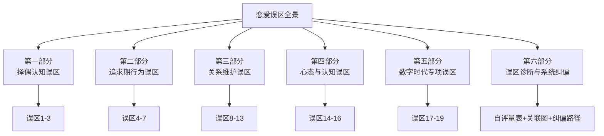
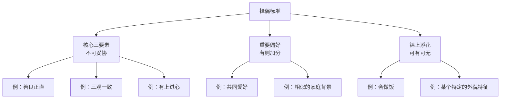
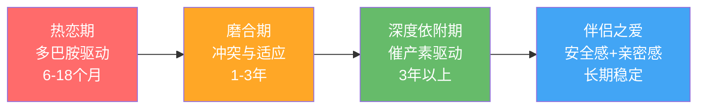
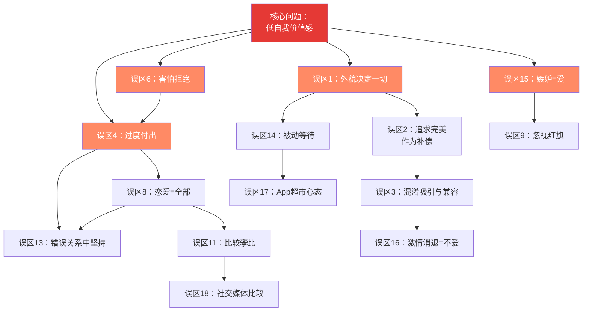

# 常见误区：恋爱中的认知陷阱与行为纠偏

> "我们不是因为犯错而失败，而是因为重复同样的错误却期待不同的结果。" —— 阿尔伯特·爱因斯坦

恋爱中的误区不是简单的"不懂道理"，而是根植于人类进化本能、童年依恋模式和社会文化编程中的系统性认知偏差。本章梳理恋爱全周期——从初始择偶、追求期、热恋期到长期关系——中最常见的认知陷阱，逐一拆解其心理机制，给出可操作的纠偏方案。

每个误区按统一框架展开：**错误认知 → 心理机制 → 真实案例 → 数据支撑 → 纠偏方案 → 自查清单**，帮助你不仅"知道错在哪"，更"明白为什么会犯这个错"以及"具体怎么改"。

---

## 第一部分：择偶认知误区

这一类误区发生在你开始寻找伴侣之前或初期，它们决定了你的"筛选标准"和"行动策略"是否合理。择偶认知偏差是最底层的错误——如果筛选逻辑本身就有问题，后续的所有努力都会事倍功半。

### 误区1：外貌决定一切

#### 错误认知

"我不够帅/不够高/不够瘦，所以注定找不到对象。"

这种想法的本质是把吸引力简化为单一维度。它让你在还没开始行动之前就自我淘汰，是一种典型的"习得性无助"——用一个不可改变的因素作为不去努力的借口。

#### 心理机制

进化心理学确实证明外貌在初始吸引力中扮演重要角色。面部对称性、腰臀比（女性）、肩腰比（男性）等身体信号在毫秒级的"第一印象"中被大脑快速评估（Buss, 2019, *Evolutionary Psychology*）。但这里有两个关键的限定条件：

1. **外貌权重随时间递减**。在短期择偶中外貌权重约40-50%，但在长期伴侣选择中降至20-30%，被性格、能力、价值观等因素超越（Li et al., 2002, *Journal of Personality and Social Psychology*）。
2. **"吸引力"是多维的**。幽默感、自信的肢体语言、声音质感、气味、社交地位、经济能力等都构成独立的吸引力维度。一个外貌6分但幽默自信的人，综合吸引力可能远超外貌8分但内向木讷的人。

更深层的认知偏差在于**聚焦错觉（Focusing Illusion）**——当你过度关注某一个维度时，你会高估它在整体中的权重。你以为外貌是决定性因素，是因为你把所有注意力都放在了外貌上，忽略了其他同样重要甚至更重要的维度。

#### 真实案例

**案例A：** 小王，27岁，身高168cm，自认为"矮"是找不到对象的根本原因。在一年的相亲中，他每次都在见面后被拒绝。深入分析后发现问题不在身高——他相亲时全程低头看手机、回答问题只用"嗯/哦/还行"、穿着皱巴巴的格子衫。改善穿搭、练习眼神接触和主动提问后，他在第三次相亲中成功牵手。

**案例B：** 婚恋平台珍爱网2023年数据显示，平台上最受欢迎的男性用户中，收入排名前20%的用户收到的主动打招呼数量是平均值的3.2倍，而外貌评分排名前20%的用户仅是平均值的2.1倍。经济能力的吸引力效应在外貌之上。

**案例C：** 心理学教授 Daniel Nettle 在《人格》一书中记录了一项追踪研究：对500对情侣进行5年跟踪，发现初始吸引力评分与5年后关系满意度的相关系数仅为0.18（弱相关），而"幽默互动频率"和"冲突解决能力"与满意度的相关系数分别达到0.52和0.61。这说明**外貌让你开始，但性格让你留下**。

#### 数据支撑

- OkCupid 对200万用户的分析发现，外貌评分在2-3分（百分制40-60分）的用户中，有68%仍然成功找到了稳定伴侣——说明"普通人外貌"远不是脱单的障碍
- 进化心理学家 David Buss 对37个文化的跨文化研究发现，在"长期伴侣偏好"排名中，"外貌吸引力"平均排在第6位，排在前面的是"善良""上进""情绪稳定""聪明""健康"
- 中国社科院2022年《婚恋观调查报告》显示，72.3%的受访者将"三观一致"列为择偶首要条件，仅11.8%将"外貌"列为首要条件

#### 纠偏方案

| 维度 | 可改变程度 | 投入产出比 | 具体行动 |
|------|-----------|-----------|---------|
| 身材 | 高 | 极高 | 规律健身3-6个月见效，改善体态比减肥更重要 |
| 穿搭 | 高 | 高 | 学习基础配色、合身剪裁，投入少效果立竿见影 |
| 发型 | 高 | 高 | 找专业理发师设计，定期打理 |
| 皮肤 | 中高 | 中 | 基础护肤（洁面+保湿+防晒），必要时看皮肤科 |
| 表情管理 | 高 | 极高 | 练习自然微笑、眼神接触，成本为零但效果显著 |
| 身高 | 不可变 | — | 通过穿搭优化视觉比例（如内增高、高腰线） |
| 气味 | 高 | 高 | 保持清洁，选一款适合自己的香水或身体乳 |
| 声音 | 中 | 中 | 练习语速控制和语调变化，避免单调平板 |

**关键认知转变**：外貌是"入场券"，但不是"通关卡"。把注意力从"我无法改变的"转移到"我可以优化的"，你会发现可操作的空间远比你以为的大。

#### 自查清单

- [ ] 你是否经常用"我太丑/太矮"来解释自己的单身状态？
- [ ] 你是否因为外貌焦虑而回避社交场合？
- [ ] 你是否在还没和对方深入交流前就假设"TA不会喜欢我"？
- [ ] 你是否把大量时间花在纠结外貌上，却很少花时间提升其他方面？

如果3项以上为"是"，你可能陷入了外貌决定论的思维陷阱。

---

### 误区2：追求"完美"的另一半

#### 错误认知

"我要找一个漂亮、温柔、聪明、有钱、有共同语言、家境好、性格好、身材好的人。"

这本质上是一种"最大化者"（Maximizer）思维——在所有选项中寻找最优解。心理学家Barry Schwartz在《选择的悖论》中证明，最大化者比"满足者"（Satisficer，找到"足够好"就停止搜索的人）更容易后悔、更不幸福、更容易陷入决策瘫痪。

#### 心理机制

1. **选择悖论（Paradox of Choice）**：选项越多，决策成本越高，决策后的满意度反而越低。当交友App让你看到上万个潜在对象时，你的大脑不是在"优中选优"，而是在"永远觉得下一个更好"。
2. **理想化偏差（Idealization Bias）**：我们脑海中"理想伴侣"的形象往往是多种美好特质的拼接——A的外貌+B的幽默+C的收入+D的温柔——但现实中这些特质很少集中在一个人身上，而且即使集中在一个人身上，这个人也有你未预见的缺点。
3. **适应性偏差（Hedonic Adaptation）**：即使你真的找到了"完美"的人，6-12个月后你也会适应这些优点，开始关注他们的缺点。
4. **最优停止理论（Optimal Stopping Theory）**：数学上已经证明，当你面对N个选项时，看完前37%的选项后，选择第一个比前面所有选项都好的人，是最优策略。这意味着你需要先"了解市场"，然后在遇到"足够好"的人时果断出手，而不是无限期地等待"最好"。

#### 真实案例

**案例A：** 32岁的金融从业者小刘，名校毕业、年薪百万、外形不错，但至今单身。他有一个30项的择偶标准Excel表格，每次相亲后都会打分。三年内他见了47个人，没有一个超过85分。心理咨询师发现，他的标准中有些是互相矛盾的——他既要求对方"事业心强、独立自主"，又要求对方"温柔体贴、以家庭为重"。当他把标准精简为"善良正直、三观一致、有成长心态"三个核心要素后，两个月内就找到了合适的伴侣。

**案例B：** 哥伦比亚大学的一项经典实验中，研究者给两组人分别展示6种和24种果酱。24种组的购买率只有3%，而6种组的购买率高达30%。恋爱同理——当你觉得"选择很多"时，你反而更难做出决定。

#### 自查清单

回答以下问题，如果你的回答中"是"超过4个，你可能陷入了"完美伴侣"陷阱：

- [ ] 你有一个超过10项的择偶标准清单？
- [ ] 你经常觉得"条件不错但总觉得差了点什么"？
- [ ] 你拒绝过多个"90分"的人，因为他们在某一项上不满分？
- [ ] 你花在筛选上的时间远超花在相处上的时间？
- [ ] 你经常想象一个"理想型"的具体形象？
- [ ] 朋友说你"眼光太高"？
- [ ] 你对已拒绝的人事后会想"其实TA也还行"？

#### 纠偏方案

**"核心三要素"法则**：

将你的择偶标准精简为三个不可妥协的核心要素。这三个要素应该是关于"人品/价值观"层面的（如善良、诚实、上进），而不是关于"条件"层面的（如身高、收入、外貌）。

**"80分法则"**：当一个人满足你的核心三要素，且综合条件达到你心目中的80分时，就应该认真投入去了解，而不是继续等待"满分选手"。

**"反向筛选"练习**：与其列出"我想要什么"，不如列出"我绝对不能接受什么"。通常"底线清单"比"愿望清单"更短、更清晰、更有效。例如：不能接受暴力倾向、不能接受成瘾行为、不能接受不诚实。只要对方不触碰底线，其他条件都可以在相处中磨合。

---

### 误区3："外貌吸引力"和"长期兼容性"混淆

#### 错误认知

"我见到她就心动了，她一定是对的人。"

这种想法混淆了两种完全不同的心理反应：**短期吸引力**（基于外貌、声音、气味等生理信号）和**长期兼容性**（基于价值观、生活习惯、冲突处理方式等深层匹配）。

#### 心理机制

神经科学研究表明，见到高吸引力对象时，大脑的腹侧被盖区（VTA）和伏隔核被激活，释放大量多巴胺——这和赌博赢钱、吃巧克力时的大脑反应相同（Fisher, 2004）。这种"一见钟情"的感觉非常强烈，但它本质上是一种生理反应，和"这个人是否适合长期相处"是两个独立的问题。

Helen Fisher的三阶段爱情模型清晰地区分了这一点：

| 阶段 | 驱动激素 | 核心感受 | 持续时间 | 与"对的人"的关系 |
|------|---------|---------|---------|----------------|
| 欲望（Lust） | 睾酮/雌激素 | 性吸引 | 数周-数月 | 无关 |
| 吸引（Attraction） | 多巴胺/去甲肾上腺素/血清素 | 痴迷、思念、精力充沛 | 6-18个月 | 部分相关 |
| 依附（Attachment） | 催产素/血管加压素 | 安全、信任、平静 | 数年-终生 | 核心指标 |

**关键洞察**：让你"心动"的人和让你"心安"的人，可能是完全不同的两类人。很多人在"心动期"做出确定关系的决定，进入"依附期"后才发现彼此根本不兼容。

#### 真实案例

**案例A：** 28岁的小周在朋友聚会上遇到了小林，一见钟情——小林170cm、长发飘飘、笑起来很好看。两人迅速确定关系。热恋期过后（约8个月），小周发现小林有严重的消费主义倾向（月光+信用卡透支）、和父母关系极度紧张（每周至少吵一次）、以及回避型依恋模式（一有冲突就消失不回消息）。这些在"心动"时完全看不到的特质，在"依附期"变成了关系的致命伤。两人在一年半后分手。

**案例B：** 心理学家 Arthur Aron 的经典实验"36个问题"证明，陌生人之间通过深度自我暴露可以在45分钟内产生强烈的亲密感——这说明**亲密感可以通过特定行为创造，不需要依赖"一见钟情"的生理反应**。

#### 数据支撑

- 美国国家卫生研究院（NIH）的一项纵向研究跟踪了3000对夫妻，发现"婚前约会时间不足6个月"的夫妻，离婚率比"约会1-2年"的夫妻高出42%
- Gottman研究所发现，预测婚姻成功率的最强指标不是"初始吸引力强度"，而是"冲突处理模式"——能用建设性方式处理冲突的夫妻，婚姻成功率达到94%
- 中国民政部2021年数据显示，闪婚（认识3个月内结婚）的离婚率是平均离婚率的2.3倍

#### 纠偏方案

1. **区分"化学反应"和"兼容性"**。心动是必要条件但不是充分条件。在被吸引的同时，有意识地评估对方的价值观、生活习惯、冲突处理方式。给自己制作一个"兼容性评估清单"，在关系推进过程中逐项验证。

2. **给自己设置一个"观察期"**。至少相处3个月、经历2-3次冲突后再做重大决定（如确定关系、同居、见家长）。冲突处理方式是预测关系质量的最强指标之一。观察的关键不是"有没有冲突"，而是"冲突后怎么处理"——冷暴力、翻旧账、人身攻击是危险信号；愿意沟通、主动修复、就事论事是健康信号。

3. **使用"压力测试"**。观察对方在压力下（如赶deadline、遇到意外、身体不适、交通堵塞）的表现，这比在精心安排的约会中看到的"表演"更真实。压力状态下的反应往往是最接近真实人格的。

4. **"未来投射"练习**：想象和这个人在一起5年后的日常生活——你们怎么分担家务？怎么处理财务分歧？怎么对待彼此的父母？如果你想象的场景让你感到恐惧或窒息，而不是温暖或安心，这就是重要的信号。

---

## 第二部分：追求期行为误区

这一类误区发生在你对某人产生兴趣后、关系确立之前。追求期的行为模式直接决定了你是否能进入恋爱关系。

### 误区4：过度付出（"舔狗"心态）

#### 错误认知

"我要对她好，不停地送礼物、发消息、嘘寒问暖，她迟早会被我感动。"

#### 心理机制

过度付出的核心问题不是"付出太多"，而是**付出破坏了关系中的平等感**。社会交换理论（Homans, 1958）指出，健康关系的基础是双方感知到的投入-回报大致平衡。当一方过度付出时：

1. **接收方感到压力**：无法等值回报会产生内疚，内疚转化为回避（"我欠他的太多了，不想面对"）。
2. **付出方价值感降低**：在进化心理学中，无条件的资源投入被潜意识解读为"低价值信号"——高价值个体不需要通过过度付出来维持关系。
3. **强化不健康模式**：付出方会陷入"沉没成本"陷阱——"我已经付出这么多了，不能放弃"——导致越陷越深。
4. **"应得感"陷阱**：过度付出者内心往往有一个隐含的交易逻辑——"我对你这么好，你理应回报我"。当回报没有到来时，会从"感动"变成"怨恨"，从"付出"变成"道德绑架"。

#### 真实案例

**典型模式复盘：**

小李喜欢同事小张。在3个月的追求中：
- 第1周：每天早上帮她带早餐 → 小张客气地说"谢谢"
- 第2周：开始每天3-5条微信消息 → 小张回复逐渐变慢
- 第1个月：送了价值2000元的生日礼物 → 小张说"你不用这样"
- 第2个月：主动帮她加班完成工作 → 小张开始刻意保持距离
- 第3个月：小李表白，被拒绝。理由："你很好，但我觉得我们不太合适。"

**分析**：小李的错误不在于"对她好"，而在于他的付出是**单方面的、不对等的、不请自来的**。他从来没有问过小张需要什么，而是按照自己的理解不断输出，最终把对方推远。

**反面教训**：小李在被拒绝后发了一条消息："我为你做了这么多，你怎么能这样对我？"——这句话暴露了他付出的真实动机：不是"我想让你开心"，而是"我想让你喜欢我"。**以获取回报为目的的"付出"，本质上是投资，不是爱。**

#### "过度付出"vs"健康关心"的区分标准

| 维度 | 健康关心 | 过度付出 |
|------|---------|---------|
| 频率 | 偶尔、自然 | 高频、刻意 |
| 对方反应 | 积极回应 | 回避/客气/压力 |
| 你的感受 | 开心、不累 | 焦虑、患得患失 |
| 是否有回报 | 双向互动 | 单向输出 |
| 你的生活 | 正常运转 | 为了对方牺牲自己的事 |
| 动机 | 想让她开心 | 想让她喜欢我 |
| 是否需要回报 | 不需要，做了就开心 | 隐含期待等值回报 |
| 对方是否请求 | 通常是对方向你表达过需要 | 你主动"创造"对方的需求 |

#### 纠偏方案

1. **"付出-回报对等"原则**：你的付出量级应该大致匹配对方的回应量级。如果对方从不主动联系你，你也不应该每天发消息。这不是"计较"，而是维护关系平衡的必要手段。

2. **"3次规则"**：如果你主动发起了3次互动（消息/邀约/帮助）而对方从未主动发起过，暂停你的主动，观察对方是否会来找你。如果对方不找你——这不是"TA太忙"或"TA不好意思"，而是TA对你没有足够的兴趣。

3. **投资自己而非投资对方**：把花在对方身上的时间和金钱，至少一半用于提升自己——健身、学习、社交、事业。一个持续成长的你，比一个不断讨好别人的你更有吸引力。

4. **问"对方需要什么"而非"我想给什么"**：真正的关心是基于对方的需求，而不是自己的想象。在表达关心之前，先问自己："这是TA需要的，还是我觉得TA应该需要的？"

---

### 误区5：急于确定关系（"表白焦虑"）

#### 错误认知

"我喜欢她，我要赶紧表白确认关系，不然她就被别人追走了。"

#### 心理机制

"表白焦虑"的核心驱动力是**对不确定性的恐惧**。人脑天生厌恶不确定性——神经科学研究表明，不确定性带来的杏仁核激活甚至比确定的坏消息更令人焦虑（Hsu et al., 2005）。于是你希望通过一个"明确的表态"来消除不确定性。

但问题在于：**过早表白不是在消除不确定性，而是在把你的焦虑转嫁给对方**。

表白本质上是一个"要求对方做决定"的行为。当关系还没有发展到自然确定的程度时，你要求对方做决定，对方大概率会给出否定答案——不是因为TA不喜欢你，而是因为TA还没有准备好做这个决定。

#### 真实案例

**过早表白的典型后果：**

大二男生小陈，在社团活动中认识了女生小林。两人加了微信，聊了5天。小陈觉得"聊得挺好的"，第6天就发了一段200字的表白消息。小林的反应从"这人不错"变成了"这也太快了吧"，之后回复明显冷淡，最终不了了之。

**对比案例：**

小赵认识了同一个社团的小周。小赵先通过群聊互动建立了基本熟悉度（2周），然后约了两次小范围的聚会（3-4人），接着单独约了看电影和吃饭（3次），期间通过微信聊天和线下互动积累了足够的信号（对方主动发消息、回复及时且有内容、接受单独约会）。在一次散步中自然地牵手，关系水到渠成。

**关键差异**：小陈试图用"表白"一步到位，而小赵用"逐步升级"让关系自然发展。后者不需要"表白"这个刻意的节点——关系是在多次互动中逐步确认的，而不是靠一次表白来决定的。

#### 表白时机评估表

在表白之前，用以下清单评估你们的关系阶段。至少满足6项才建议表白：

| # | 信号 | 是否满足 |
|---|------|---------|
| 1 | 线下单独约会至少3次 | □ |
| 2 | 对方主动联系你的频率 ≥ 你联系TA的频率 | □ |
| 3 | 聊天中对方会主动延续话题（不是总你问TA答） | □ |
| 4 | 有肢体接触（碰手臂、拍肩等）且对方不排斥 | □ |
| 5 | 对方会和你分享私人的事情（烦恼、家庭、秘密） | □ |
| 6 | 朋友/同事已经知道你们关系好 | □ |
| 7 | 对方暗示过对你的特殊对待（"只对你这样"之类） | □ |
| 8 | 你不在时对方会主动找你（如"你今天怎么没来"） | □ |

**得分评估**：0-3项 = 为时尚早，继续积累；4-5项 = 接近了，再等一等；6-8项 = 时机成熟，可以行动。

**"渐进升级"替代"一次性表白"**：

| 阶段 | 行为 | 目的 |
|------|------|------|
| 第1阶段 | 微信聊天 + 群聊互动 | 建立基本熟悉度 |
| 第2阶段 | 小范围聚会（3-5人） | 在群体中观察互动 |
| 第3阶段 | 单独约会（咖啡/散步） | 建立一对一的舒适感 |
| 第4阶段 | 有亲密感的约会（看电影/做饭） | 增加情感浓度 |
| 第5阶段 | 自然的肢体接触（牵手） | 身体语言确认关系 |
| 第6阶段 | 口头确认关系 | 在已有默契基础上确认 |

---

### 误区6：害怕被拒绝而不敢行动

#### 错误认知

"如果我被拒绝了，那就太丢脸了，还是算了。"

#### 心理机制

害怕被拒绝是一种根深蒂固的心理反应，它有进化根源——在远古部落中，被群体拒绝意味着孤立无援，几乎等于死亡（Leary, 2001, *Social Anxiety and Social Phobia*）。大脑的前扣带皮层（ACC）在经历社交拒绝时的激活模式，与经历身体疼痛时高度相似——**被拒绝真的会"痛"**（Eisenberger et al., 2003）。

但现代社会的社交环境已经完全不同了。被一个人拒绝不会让你"孤立无援"，你的生存完全不依赖于任何一个人是否喜欢你。这种"大脑的旧硬件跑新软件"的不匹配，是恐惧的真正来源。

更深层的问题是**拒绝的个人化归因**——你把"这个人不喜欢我"等同于"我不值得被喜欢"。但事实上，拒绝只说明"你和这个人不匹配"，就像钥匙和锁不匹配一样——不是钥匙"不好"，只是"不对"。

#### 数据支撑

- 研究显示，在被拒绝后的24小时内，85%的人的情绪会恢复到基线水平（Boals & Klein, 2005）
- 麻省理工学院的一项研究跟踪了200名向陌生人表白的人，被拒绝者在一周后的幸福感水平与被接受者没有显著差异
- 在婚恋市场中，平均需要接触8-12个潜在对象才能找到一个相互匹配的人——拒绝是概率游戏的常态，不是对你个人价值的否定
- 心理学家 Philip Zimbardo 的研究发现，社交焦虑者在被拒绝前预期的痛苦程度，是实际被拒绝后感受到的痛苦的2-3倍——**恐惧远大于实际伤害**

#### 真实案例

**案例A：** Jia Jiang 在 TED 演讲中分享了他"被拒绝100天"的实验经历。他故意向陌生人提出各种荒谬请求（如"能在你家后院踢球吗？""汉堡店能给我一个汉堡续杯吗？"），被拒绝了无数次。但他发现：被拒绝的感觉远没有想象中可怕，而且很多看似会被拒绝的请求居然被接受了。他说："拒绝只是一个结果，不是对你人格的审判。"

**案例B：** 一位35岁的程序员小赵，单身5年，不是没有喜欢的人，而是每次都在"要不要表白"的纠结中错过了时机。心理咨询中他发现，自己12岁时向喜欢的女生写情书被全班嘲笑的经历，在他心中形成了一个深刻的"被拒绝=被羞辱"的等式。通过认知行为疗法（CBT），他逐渐把"被拒绝"和"被羞辱"解绑，最终鼓起勇气向一位同事表白。虽然被拒绝了，但他惊讶地发现"天没有塌下来"，而且两人之后依然正常相处。

#### 纠偏方案

**"拒绝脱敏训练"**（参考Jia Jiang的《被拒绝的100天》）：

从低风险的社交请求开始，逐步提高难度，训练大脑适应"被拒绝"的感觉：

| 阶段 | 练习内容 | 风险等级 | 目标 |
|------|---------|---------|------|
| 第1周 | 向陌生人借100元 | 低 | 体验被拒绝的感觉 |
| 第2周 | 在餐厅要求"汉堡续杯" | 低 | 学会笑着面对荒谬的请求 |
| 第3周 | 向不太熟的朋友提出一个小请求 | 中 | 适应在熟人面前被拒绝 |
| 第4周 | 主动和感兴趣的人搭话 | 中 | 消除对陌生人交流的恐惧 |
| 第5周 | 邀请感兴趣的人单独约会 | 高 | 实战练习 |

**"重新定义拒绝"认知练习**：

| 旧定义 | 新定义 |
|--------|--------|
| "我被拒绝了 = 我不好" | "我被拒绝了 = 这个人和我不匹配" |
| "被拒绝很丢脸" | "被拒绝很勇敢——大多数人连尝试都不敢" |
| "被拒绝说明我不值得被爱" | "被拒绝说明我排除了一个不合适的人" |
| "我再也不要尝试了" | "每一次拒绝都让我离对的人更近一步" |

**关键心态转变**：被拒绝不是"失败"，而是"信息"。它告诉你"这个人和我不匹配"，帮你节省了时间。

---

### 误区7：聊天像"面试"或"查户口"

#### 错误认知

"我要了解她的基本信息，得把该问的都问了。"

#### 心理机制

连续提问的问题不在于"问了什么"，而在于它破坏了**对话的互惠性**（Reciprocity）。健康的对话是双向的信息交换，而面试式提问把对话变成了"单方面的信息采集"——你在索取信息但没有提供等量的个人信息，这会让对方感到不对等。

此外，直接提问（"你做什么工作？""你多大？"）激活了对方的"评估模式"——对方感觉自己在被审查，于是进入防御状态，给出的安全答案（简短、官方、不暴露个人信息）往往没有聊天价值。

**第三层问题**：面试式聊天透露出一个隐含信号——"我在评估你是否达标"。这把对方放在了"被审视"的位置，没有人喜欢被审视。

#### 对话模式对比

**面试式对话（❌）：**

> 你：你是做什么工作的？
> 她：做设计的。
> 你：哦，哪个方向的设计？
> 她：UI设计。
> 你：做了多久了？
> 她：三年。
> 你：在哪个公司？
> 她：一个互联网公司...（已经不想聊了）

**分享式对话（✅）：**

> 你：今天开了一个特别离谱的会，产品经理说要把按钮改成五彩斑斓的黑（笑）。你是做设计的吗？有没有遇到过这种需求？
> 她：哈哈太真实了，我上次也遇到过，甲方说要"高端大气上档次但也不要太贵"，我直接？
> 你：那你当时怎么解决的？
> 她：我就做了一版正常的然后做了一版离谱的让他选，他果然选了正常的（笑）
> 你：这招太高了，我下次也试试...（自然延续）

**关键区别**：分享式对话先给出自己的故事/感受，自然引出对方的回应，让对话像"打乒乓球"而不是"审讯"。

#### 纠偏方案

**"3:1法则"**：每问1个问题之前，先分享3个自己的相关内容。让对方在轻松的氛围中自然地暴露信息，而不是被直接询问。

**万能话题公式**：「观察/经历 + 感受 + 开放式提问」
- "我昨天看了一部纪录片讲深海潜水的（经历），看完有点后怕（感受），你平时会喜欢看这类探险类的东西吗？（开放提问）"

**话题层级模型**：好的聊天应该从浅到深逐层推进——

| 层级 | 内容 | 示例 | 何时使用 |
|------|------|------|---------|
| 第1层：事实 | 客观信息 | 职业、爱好、日常 | 刚认识时 |
| 第2层：观点 | 看法和偏好 | "我觉得...""我更喜欢..." | 基本熟悉后 |
| 第3层：感受 | 情感和情绪 | "那件事让我很感动""我当时很紧张" | 建立信任后 |
| 第4层：经历 | 人生故事 | 童年、转折点、遗憾 | 深度连接后 |
| 第5层：脆弱 | 恐惧、不安、秘密 | "其实我一直很害怕..." | 亲密关系中 |

**好的聊天是逐层递进的，而不是永远停留在第1层**。

---

## 第三部分：关系维护误区

这一类误区发生在恋爱关系确立之后，它们决定了关系能否长期健康地存续。

### 误区8：把恋爱当成生活的全部

#### 错误认知

"有了对象，我的人生就完整了。我所有的时间和精力都应该给TA。"

#### 心理机制

这种想法的深层根源往往是**不安全依恋模式**。Bowlby的依恋理论（详见本章基础理论部分）指出，焦虑型依恋的人会通过"过度靠近"来缓解对关系的焦虑——他们需要持续的亲密确认来感到安全。但这种"融合"行为会适得其反：

1. **个人身份消融**：当你把所有的社交、兴趣、目标都围绕伴侣建立时，你失去了独立的"自我"。一旦关系出现问题，你的整个生活都会崩塌。
2. **伴侣感到窒息**：即使是最亲密的人也需要个人空间。持续的黏着会触发对方的"回避机制"。
3. **吸引力衰减**：心理学家Esther Perel在《亲密陷阱》中指出，维持性吸引力需要一定的"距离感"。两个人完全融合后，欲望反而会消退——因为欲望需要"他者"的存在，当你完全了解一个人的每一面时，神秘感消失，欲望也随之减弱。
4. **社交资本流失**：当你为了恋爱放弃了朋友、兴趣、个人成长，你失去的不只是"自己的时间"，而是整个支撑系统。如果关系结束，你会发现身边空无一人。

#### "健康依赖"vs"不健康依赖"的区分

| 维度 | 健康依赖 | 不健康依赖 |
|------|---------|-----------|
| 社交 | 有独立的朋友圈，也有共同的朋友 | 只有对方一个社交对象 |
| 兴趣 | 保持个人爱好，也会一起做新事情 | 放弃了所有个人兴趣 |
| 情绪 | 对方是支持系统的一部分 | 对方是唯一的情绪出口 |
| 时间 | 平衡个人时间和共处时间 | 所有空闲时间都给对方 |
| 自我价值 | 自我价值感来自多个来源 | 自我价值完全取决于对方的态度 |
| 分开时 | 想对方但能正常生活 | 分开就焦虑，无法专注做其他事 |
| 决策 | 重大决定一起商量，小事自己决定 | 所有事情都需要对方参与或同意 |

#### 真实案例

**案例A：** 大学情侣小杨和小陈恋爱后形影不离。小杨退出了篮球队、减少了和室友的聚会、放弃了准备考研的计划，所有时间都和小陈在一起。一年后小陈提出分手，理由是"我感觉你没有自己的生活，这让我压力很大"。分手后小杨陷入了严重的抑郁——不是因为失去了恋人，而是因为除了这段恋爱，他的生活已经什么都不剩了。

**案例B：** 社会学家的研究发现，拥有独立社交圈和个人兴趣的夫妻，婚姻满意度比"只有彼此"的夫妻高出35%。原因很简单：**一个有自己生活的人，给伴侣带来的是"新鲜感"和"欣赏"，而不是"依赖"和"压力"**。

#### 纠偏方案

**"5-3-2时间分配法"**（适用于每周时间分配）：

- **5成**用于个人成长（工作/学习/健身/阅读）
- **3成**用于社交和其他关系（朋友/家人/同事）
- **2成**用于恋爱关系（约会/沟通/共同活动）

这个比例不是固定的，但它提醒你：**恋爱应该占你生活的20-30%，而不是80-100%**。

**"独立清单"练习**：列出5件你恋爱前喜欢做但恋爱后放弃的事情（如打篮球、画画、和朋友聚会、独自旅行、读小说），重新把它们排进你的日程。一个有自己热爱的人，本身就散发着吸引力。

---

### 误区9：忽视"红旗信号"（Red Flags）

#### 错误认知

"虽然TA有些问题，但我爱TA，我可以改变TA。"

#### 心理机制

"我可以改变TA"的想法背后有两个心理机制在起作用：

1. **投射效应**：我们倾向于把自己的善意投射到对方身上——"如果我足够好，TA就会改变"。但对方的行为模式是TA几十年人生经历塑造的，不是你能改变的。
2. **确认偏差**：一旦你爱上了一个人，你的大脑会自动过滤掉负面信息、放大正面信息。你会为对方的每一个红旗行为找到合理化的解释。
3. **"拯救者情结"**：有些人被"需要被拯救"的人吸引，因为"帮助对方"让他们感到自己有价值。这是一种用"付出"来换取"存在感"的模式，和误区4有深层关联。

#### 红旗信号分类与严重程度评估

| 严重程度 | 红旗信号 | 具体表现 | 建议 |
|---------|---------|---------|------|
| 🔴 致命 | 暴力倾向 | 动手、摔东西、威胁 | 立即离开，没有商量余地 |
| 🔴 致命 | 持续欺骗 | 重大事项上反复说谎 | 信任一旦破坏无法修复 |
| 🔴 致命 | 成瘾行为 | 酗酒/赌博/药物依赖且拒绝治疗 | 你不是TA的治疗师 |
| 🟡 严重 | 控制欲 | 查手机、限制社交、控制财务 | 沟通后无改善则离开 |
| 🟡 严重 | 情绪虐待 | 贬低、嘲讽、冷暴力、煤气灯效应 | 不要容忍"爱的名义下的伤害" |
| 🟡 严重 | 与前任纠缠 | 保持暧昧、频繁联系、隐瞒 | 需要明确表态并看到行动 |
| 🟠 关注 | 情绪管理差 | 经常发脾气、摔门、冷战 | 观察是否愿意改变 |
| 🟠 关注 | 回避承诺 | 讨论未来时总是回避 | 了解回避的原因再判断 |
| 🟠 关注 | 消费观冲突 | 月光族vs储蓄控 | 可以沟通但需要双方让步 |

**重要原则**：红色级别的红旗（🔴）没有"改善"的可能——不要给第二次机会。橙色级别的（🟠）可以沟通一次，给3个月的观察期，如果没有实质性改善，同样需要离开。

**"三个月法则"**：对于橙色红旗，给一次真诚的沟通机会。如果3个月后对方没有实质性改变（不是嘴上说改，而是行为上可见的改变），你需要接受一个事实——**这就是TA本来的样子，不是TA"还没改好"**。

#### "煤气灯效应"特别警示

煤气灯效应（Gaslighting）是一种极其隐蔽的情感操控手段，对方通过以下方式让你怀疑自己的判断力：

- "我什么时候说过这种话？你记错了吧。"
- "你太敏感了，我只是开个玩笑。"
- "你想想是不是你自己的问题？"
- "你离开我还能找到谁？"
- "你的情绪反应太夸张了。"
- "全世界就你觉得我有问题。"

**识别煤气灯效应的三个信号**：

1. 你经常怀疑自己的记忆和判断
2. 你在对方面前不敢表达真实感受
3. 你觉得自己"越来越不像自己了"

如果你经常觉得"也许真的是我想多了""也许是我太敏感了"，请警惕——这可能不是你的问题，而是对方在系统性地否定你的感受和认知。

---

### 误区10：忽视沟通，期待"心意相通"

#### 错误认知

"我们相爱，TA应该懂我。如果TA真的爱我，不需要我说TA就知道我需要什么。"

#### 心理机制

"读心术期待"（Mind-Reading Expectation）是一种常见的认知扭曲，它在认知行为疗法（CBT）中被明确归类为非理性信念。其根源可能来自：

1. **浪漫主义叙事**：电影和小说中"心有灵犀"的形象深入人心，让人误以为真正的爱就应该是"不需要语言"的。
2. **焦虑型依恋**：焦虑型依恋者把"对方能否主动察觉我的需求"当作"TA是否爱我"的测试。但这种测试注定失败——即使是最爱你的人也无法100%准确地感知你未表达的需求。
3. **表达脆弱的恐惧**：直接说出"我需要什么"意味着暴露自己的需求，这让人感到脆弱。而"让对方猜"是一种不需要暴露脆弱就能满足需求的策略——只可惜它几乎从不奏效。

#### 真实案例

**典型冲突复盘：**

小美生日那天，男友小张没有准备礼物。小美很生气但不说，而是"冷战"——不回消息、面无表情、说话带刺。小张完全不知道发生了什么，问了几次"你怎么了"得到的回答都是"没什么"。冷战持续了3天，最终小美爆发："你连我生日都不记得！"小张委屈："你又没告诉我你想要什么！"

**问题分析**：
- 小美的错误：用"冷战"代替"直接表达"，用"对方应该知道"来测试爱
- 小张的错误：对伴侣的情绪变化缺乏敏感性，问了"你怎么了"后没有深入追问
- 双方的共同错误：没有建立"定期沟通"的习惯

**深层原因**：心理学家 John Gottman 的研究发现，69%的夫妻冲突是"永久性问题"——它们源于两个人的差异（性格、习惯、价值观），而不是"谁对谁错"。这些冲突无法被"解决"，只能被"管理"。而管理的前提是——用语言表达出来。

#### 纠偏方案

**"非暴力沟通"四步法**（Marshall Rosenberg）：

当出现不满时，用以下四步表达：

1. **观察**（不带评判地描述事实）："你这周有三天加班到10点以后"
2. **感受**（表达你的情绪）："我感到有些孤单和被忽略"
3. **需要**（说明你的需求）："我需要和你有更多相处的时间"
4. **请求**（提出具体可执行的请求）："这周六我们能一起吃顿晚饭吗？"

**错误示范** vs **正确示范**：

| 场景 | 错误表达 | 正确表达 |
|------|---------|---------|
| 对方没回消息 | "你是不是不想理我了？" | "你3个小时没回消息，我有点担心，方便的话回我一下？" |
| 对方忘记纪念日 | "你心里根本没有我" | "今天是我们的纪念日，你没提，我有点失落。下次我们可以一起记住这些日子吗？" |
| 对方和异性朋友吃饭 | "你是不是喜欢TA？" | "你和XX单独吃饭，我有点不舒服。不是不信任你，但你能提前告诉我吗？" |
| 对方家务做得少 | "你就知道躺着，什么都不干" | "最近家务基本都是我在做，有点累。我们能分一下工吗？" |

**"每周15分钟"沟通仪式**：找一个固定时间（如周日晚上），用15分钟互相分享这周的感受——开心的事、不开心的事、对关系的期待。这个简单的习惯可以防微杜渐，避免小不满积累成大矛盾。

---

### 误区11：比较和攀比

#### 错误认知

"别人的男/女朋友怎么那么好？你怎么不学学人家？"

#### 心理机制

比较是人类评估自身处境的基本认知工具，但在亲密关系中，向外部比较会带来毁灭性的后果：

1. **社会比较理论**（Festinger, 1954）：人天生会通过与他人比较来评估自己。"向上比较"（和比自己好的人比）会产生不满和自卑。
2. **"展示效应"**：你在社交媒体上看到的"别人的完美关系"，是精心筛选后的展示面。你看到的是他们精心修饰的旅行照，看不到他们凌晨3点的争吵。
3. **"损失厌恶"**：Kahneman的前景理论指出，人对"失去"的敏感度是"获得"的2倍。当你说"你怎么不学学人家"时，对方感受到的不是"你想让我变得更好"，而是"你觉得我不够好"。
4. **"期望通胀"**：社交媒体放大了你对"正常关系"的期望。当你看到100个人在晒幸福时，你会误以为"幸福关系"应该是常态——但人们几乎不晒冲突，你看到的样本严重偏斜。

#### 真实案例

**案例A：** 小美经常在抖音和小红书上看到"男友每天接送上下班""恋爱纪念日惊喜""月入3万却全部上交"的帖子，然后拿这些标准要求自己的男友。男友月薪8千，工作地点离她30公里，做不到每天接送。小美觉得"别人的男友都做得到，你为什么做不到？"。这种比较不仅让男友感到被贬低，也让小美忽视了男友每天帮她做饭、从不对她发脾气、支持她考研的这些"不出镜"的好。

**案例B：** 社会心理学家研究发现，每天花2小时以上浏览社交媒体"秀恩爱"内容的人，对自己关系的满意度平均降低18%——因为他们不自觉地把自己的关系和"精心编辑后的展示面"做比较。

#### 纠偏方案

**"感恩三件事"练习**：

每天睡前写下伴侣让你感激的3件事，可以很小（"今天帮我倒了杯水""笑话说得好笑""出门前说了注意安全"）。这个练习来自积极心理学之父Martin Seligman的研究，坚持21天后，对关系的满意度平均提升23%。

**"内部比较"替代"外部比较"**：

把"别人怎么怎么样"换成"你以前怎么怎么样，现在进步了"。内部比较既不伤人，又能激励成长。

**"社交媒体节食"**：减少浏览"秀恩爱"内容的时间，或者有意识地提醒自己"这是展示面，不是全貌"。真实的幸福不需要向别人证明。

**"需求清单"练习**：与其比较"别人有什么"，不如写下"我真正需要什么"。通常你会发现，你真正需要的东西（安全感、被尊重、被倾听），远比社交媒体上展示的那些物质条件重要得多。

---

### 误区12：用"套路"代替真诚

#### 错误认知

"我要学会各种PUA技巧、恋爱套路，这样才能追到女生。"

#### 心理机制

PUA（Pick-Up Artist）产业利用了一个真实的市场缺口：大量男性缺乏社交技能训练，不知道如何与异性建立关系。PUA提供的"技巧"在表面上确实弥补了这个缺口，但其底层逻辑是**操控（Manipulation）**而非**连接（Connection）**。

套路为什么看起来"有效"？

1. **安慰剂效应**：当你"学习了一个方法"并去行动时，你的自信本身就提升了——真正起作用的不是"套路"，而是"行动"。
2. **大数法则**：PUA鼓励你大量接触异性（"量变引起质变"），这确实会提高成功率——但原因不是你的"技巧"高明，而是你尝试的次数多了。
3. **短期效应**：部分PUA技巧（如"推拉""冷读"）在短期互动中可能制造好奇心，但无法维持长期关系。

**长期代价**：

- 你学会了"表演"但失去了"真实"，进入关系后无法维持人设
- 你吸引到的是被"套路"吸引的人，而不是被"真实的你"吸引的人
- 你可能在操控中伤害他人，造成信任创伤
- 你自己的亲密关系能力没有真正提升，下次还是会依赖"新套路"
- 你会逐渐丧失"真诚表达"的能力——当你习惯了表演，你甚至不知道"真实的自己"是什么样了

#### 真实案例

**案例A：** 一位学习了PUA课程的用户在网上分享：他用"推拉"和"冷读"技巧成功吸引了一位女生，两人确定了关系。但进入恋爱后，他发现需要不断维持"高价值人设"——不能太主动、不能太坦诚、要保持"神秘感"。三个月后他感到极度疲惫，觉得"在关系中我不是我自己"。最终关系因为他无法持续表演而崩塌。他说："我追到了她，但追到的是一个爱上假象的人，而我永远不能卸下伪装。"

#### 纠偏方案

真正的"技巧"不是操控，而是**社交能力的系统提升**：

1. **非语言沟通**：眼神接触、微笑、开放的肢体语言、合适的社交距离——这些不需要"套路"，只需要练习
2. **倾听能力**：真正关注对方说了什么，而不是在心里排练你"下一步该说什么"
3. **情绪表达**：学会恰当地表达自己的感受（开心、紧张、欣赏），而不是隐藏或伪装
4. **边界意识**：尊重对方的边界，也明确自己的边界
5. **自我暴露**：适度分享自己的真实想法和经历，包括脆弱的部分——这才是建立真正亲密感的方式

**核心原则**：如果你想吸引一个"真实的人"，你自己必须是"真实的"。套路吸引套路，真诚吸引真诚。

---

### 误区13：在错误的关系中"坚持"

#### 错误认知

"我们都已经在一起这么久了，不能轻易放弃。""沉没成本太大了，分手太亏了。"

#### 心理机制

**沉没成本谬误**（Sunk Cost Fallacy）是行为经济学中最经典的认知偏差之一。你已经投入的时间、感情、金钱、精力让你不舍得离开，即使你清楚地知道这段关系已经不健康。

更深层的原因：

1. **损失厌恶**：分手意味着"失去"——失去熟悉的生活模式、失去一个陪伴者、失去"有对象"的身份——这些"失去"在心理上的重量远大于"可能获得的自由和新机会"。
2. **恐惧孤独**：很多人宁可在一段不好的关系中，也不愿意面对单身。这种恐惧有时比对关系本身的不满更强大。
3. **身份绑定**：当"XX的男/女朋友"成为你自我认知的一部分时，分手意味着你需要重新定义"我是谁"——这个过程是痛苦的。
4. **"第二次机会"幻觉**：你总觉得"也许再给TA一次机会就好了"。但如果你已经给了三次以上的机会，大概率第四次也不会有不同。

#### 真实案例

**案例A：** 小何和男友交往4年，但最近两年男友频繁出轨。每次被发现后都痛哭道歉、发誓改变，小何每次都选择原谅。她说："我们在一起4年了，这些年的感情不能说放弃就放弃。"心理咨询师问她："如果你今天才认识他，知道他会出轨两次，你还会选择和他在一起吗？"小何沉默了很久，说"不会"。——这就是沉没成本谬误的核心：**你留下的原因不是"这段关系好"，而是"已经投入了太多"**。

#### "该不该分手"的理性评估框架

当你纠结是否要继续一段关系时，问自己以下问题：

**核心评估（回答"是"越多，越应该认真考虑离开）：**

- [ ] 和TA在一起时，我经常感到不快乐？
- [ ] 我感觉自己的需求总是被忽视？
- [ ] 我们之间的冲突从未真正解决，只是被搁置？
- [ ] 我已经多次表达过不满，但对方没有改变？
- [ ] 我在这段关系中失去了自我（朋友、爱好、目标）？
- [ ] 我留在这里的主要原因是"已经在一起这么久了"？
- [ ] 想到和TA在一起5年、10年后的画面，我感到的是恐惧而非期待？
- [ ] 我的朋友/家人都劝我分手？

**如果5个以上回答"是"**，你需要非常认真地考虑这段关系是否值得继续。

**"未来推演"练习**：想象两种未来——未来A是继续留在这段关系中，按当前模式再过5年；未来B是分手后，用一年时间恢复，然后重新开始。哪个未来让你感到更安心？不要用"过去的投入"来决定"未来的方向"——**过去的投入已经沉没，未来的方向取决于你今天的选择**。

---

## 第四部分：心态与认知误区

这一类误区不涉及具体行为，而是关于你如何看待恋爱这件事本身。

### 误区14："等待真爱"的被动心态

#### 错误认知

"缘分到了自然就会遇到对的人，不需要刻意去找。"

#### 心理机制

"缘分论"和"灵魂伴侣论"都是浪漫主义叙事的产物，它们在心理学中对应的是**"命运信念"（Destiny Belief）**——相信关系要么"注定成功"要么"注定失败"。研究发现，持有命运信念的人在关系遇到第一个困难时更容易放弃，因为他们会把困难解读为"我们不是命中注定的"（Knee, 1998）。

**现实是**：遇到合适的人是"概率事件"，你需要主动增加概率：
- 你不出门，遇到新朋友的概率为0
- 你不主动社交，建立深层连接的概率极低
- 你不表达兴趣，对方知道你喜欢TA的概率接近0

**"缘分论"的隐性危害**：它给了你一个"不去行动"的道德高地——你不是在逃避，你是在"等待缘分"。这种自我欺骗让你心安理得地保持现状，但现状不会自动改变。

#### 真实案例

**案例A：** 30岁的小方，父母从25岁开始催婚。小方的标准回答是"缘分没到"。但他从不主动社交，下班后就回家打游戏，周末宅在家里，社交圈仅限于几个已婚的老同学。5年过去，他遇到的适龄单身女性数量为0——不是缘分没到，是他没有给缘分任何出现的机会。

**案例B：** 一位34岁的女性用户在社交平台分享："我等了10年的'对的人'，最后是在一次公司团建中认识了现在的老公。如果我那天请假没去，我们就不会遇到。但回想起来，让我'去团建'的决定，本身就是我主动选择'走出去'的结果。"

#### 纠偏方案

**"概率思维"替代"缘分思维"**：

| 旧思维 | 新思维 |
|--------|--------|
| "缘分到了自然就遇到了" | "我需要主动创造遇到合适的人的机会" |
| "对的人一定会出现" | "合适的人有很多，但需要我去找到其中一个" |
| "我要等TA来找我" | "主动出击才有选择权" |
| "强扭的瓜不甜" | "主动展示自己不等于强求，而是给对方了解我的机会" |

**增加概率的具体行动**：
1. 每周至少参加1次社交活动（兴趣班、运动、聚会）
2. 拓展社交圈——参加新的社群、志愿者活动、行业交流
3. 在合适的场景中主动和感兴趣的人交流
4. 使用线上交友平台作为补充渠道
5. 请朋友帮忙介绍——这不是"丢脸"，而是"高效"

**关键认知**：缘分不是"等来的"，而是"创造的"。每一个你主动走出家门的日子，都是在增加"遇到对的人"的概率。

---

### 误区15："嫉妒=爱"的危险等式

#### 错误认知

"TA如果真的爱我，就应该嫉妒我和别人来往。""我会嫉妒，说明我真的很在乎TA。"

#### 心理机制

适度的嫉妒是人类的正常情感反应——它源于对关系的珍视和对失去的恐惧。但把嫉妒当作"爱的证明"是一个危险的逻辑：

1. **嫉妒≠爱**：嫉妒的根源是**不安全感**和**占有欲**，不是爱。健康的关系建立在**信任**之上，不需要通过嫉妒来"证明"爱。
2. **嫉妒的升级**：当嫉妒被合理化为"因为爱"时，它容易升级为**控制行为**——查手机、限制社交、跟踪行踪——这些行为在心理学中被定义为**关系虐待**（Intimate Partner Violence）的一种形式。
3. **"情绪勒索"**：用嫉妒来"测试"对方，本质上是一种情绪勒索——"如果你不嫉妒，说明你不爱我"迫使对方做出特定的情感反应。

#### 真实案例

**案例A：** 一位女性在心理咨询中分享：她的男友最初因为"太在乎她"而查看她的手机，她觉得"这是爱的表现"。一年后，男友开始限制她和异性同事的正常交往，她觉得"他是太爱我了"。再后来，男友开始跟踪她的行踪、在她出门时不断打电话确认位置，她终于意识到这不是爱——这是控制。但从"查手机"到"跟踪"的升级，正是因为最初的嫉妒行为被美化为"爱"，所以后续的升级也有了"合法性"。

#### 区分"正常关注"和"病态嫉妒"

| 维度 | 正常关注 | 病态嫉妒 |
|------|---------|---------|
| 对方和异性朋友吃饭 | "玩得开心，回来告诉我" | "和谁？为什么？发照片给我看" |
| 对方手机响了 | 不在意 | "谁发的消息？给我看看" |
| 对方加班晚归 | "注意安全，给你留灯" | "真的在加班吗？和谁一起？" |
| 对方提到某个同事 | "听起来不错" | "你是不是和TA关系很好？" |
| 你的内心感受 | 信任但偶尔有点在意 | 持续焦虑、需要反复确认 |
| 你的行为 | 不需要查看对方隐私 | 需要查看手机/社交账号才能安心 |

**判断标准**：如果你需要通过"监控"对方来获得安全感，问题不在于对方是否忠诚，而在于你自己内心的不安全感。解决不安全感的方法是自我成长和心理咨询，而不是控制对方。

---

### 误区16：把"激情消退"当作"不爱了"

#### 错误认知

"我们之间没有当初那种感觉了，是不是不爱了？"

#### 心理机制

热恋期的"激情"有明确的生理基础和时间窗口。神经科学研究表明，热恋期大脑中多巴胺、去甲肾上腺素和血清素的异常水平会在12-18个月后回归正常（Marazziti et al., 1999）。这意味着：

- **激情消退是生理规律，不是"不爱了"的信号**
- 错把激情消退当"不爱了"的人，会在每段关系的12-18个月后重新开始寻找"新的激情"，陷入"热恋-倦怠-分手-热恋"的死循环

**真正的爱的演化路径**：

**关键认知**：热恋期的"心动"像烟花——绚烂但短暂。长期关系中的"心安"像壁炉——不那么刺激，但温暖而持久。很多人因为追逐烟花的绚烂而错过了壁炉的温暖。

#### 真实案例

**案例A：** 结婚5年的小刘对妻子说："我觉得我们之间不像以前那样了。以前看到你会心跳加速，现在感觉就像...家人。"妻子听到这话很受伤，觉得丈夫不再爱她了。婚姻咨询师解释：这不是"不爱"，而是爱的阶段转化了。热恋期的"心跳加速"是多巴胺驱动的生理反应，它注定会消退。但取而代之的是催产素驱动的"深度依附"——一种更平静、更安全、更持久的连接。如果能理解并接受这种转化，关系会进入更深层的亲密。

**案例B：** 心理学家研究发现，能够识别"爱情阶段转化"的夫妻，婚姻持久率比"追求永恒热恋"的夫妻高出67%。前者接受变化并投资维护，后者因为"感觉不对了"而反复寻找"新的心动"。

#### 纠偏方案

**从"激情依赖"转向"亲密感投资"**：

1. **创造共同经历**：一起尝试新事物（旅行、学习新技能、共同挑战）——研究表明，"共同经历新鲜事物"是维持关系满意度的最有效策略之一（Aron et al., 2000）。不是"重燃激情"，而是"在熟悉中创造新鲜感"。

2. **保持"仪式感"**：定期的约会之夜、纪念日、固定的亲密时刻——这些不是"形式主义"，而是有意识地维护关系的"基础设施"。Gottman研究所发现，拥有固定"约会之夜"的夫妻，关系满意度比没有的高出32%。

3. **深度对话**：每周至少有一次"深度对话"——不聊日常琐事，而是聊梦想、恐惧、感受、对未来的期待。Arthur Aron的"36个问题"实验表明，深度的自我暴露能快速增加亲密感。

4. **身体接触**：日常的身体接触（拥抱、牵手、亲吻）会持续释放催产素，维持依附感。不要因为"老夫老妻了"就减少身体接触。研究发现，每天至少6秒的拥抱可以显著提升关系满意度。

5. **"感恩表达"习惯**：每周至少3次向伴侣表达具体的感谢——不是"谢谢你"，而是"谢谢你今天帮我整理了书桌，找东西方便多了"。具体的感谢比泛泛的感谢更有力量。

---

## 第五部分：数字时代专项误区

随着交友App、社交媒体和即时通讯的普及，恋爱中出现了一批前所未有的新型误区。这些误区是数字时代的产物，它们利用了人类心理在新环境下的盲区。

### 误区17：交友App的"超市心态"

#### 错误认知

"交友App上有这么多人，我要慢慢挑，总能找到最好的那个。"

#### 心理机制

交友App把择偶变成了一种"购物体验"——左滑右滑、看照片、看简介、做筛选。这种设计机制激活了消费主义心态：

1. **"永远有更好的"错觉**：当你看到无限滚动的人头时，你的大脑会认为"选项无限"，所以"不着急做决定"。但你忽略了——对方也有无限选项。
2. **"人商品化"效应**：照片+简介的呈现方式把人简化为"商品参数"，你评估的不是"这个人"，而是"这个人的包装"。
3. **"决策疲劳"**：心理学研究表明，当人面对过多选项时，会进入"决策疲劳"状态——不是做出更好的选择，而是干脆不做选择，或者随机选择。

#### 数据支撑

- Tinder内部数据：平均每个用户需要右滑100次才能获得1次匹配，需要约5次匹配才能获得1次实际约会——也就是说，需要约500次右滑才能获得一次约会机会
- 研究发现，使用交友App超过1年但未找到稳定关系的用户中，67%表示"总觉得下一个会更好"是主要原因
- 中国社科院2023年调查显示，通过交友App认识并成功进入长期关系的比例仅为8.3%，远低于朋友介绍（31.2%）和工作/学校认识（28.7%）

#### 纠偏方案

1. **设置"投入上限"**：每天在交友App上花费不超过30分钟。超过这个时间，决策质量会显著下降。
2. **"3天法则"**：匹配后3天内如果没有任何有意义的对话，直接取消。不要维持"僵尸匹配"——那些既不说话也不取消的人，在浪费双方时间。
3. **线下优先**：把交友App当作"发现工具"，而不是"恋爱平台"。目标是尽快从线上转移到线下——线上聊天无法判断一个人的真实魅力。
4. **"质量筛选"替代"数量浏览"**：不要每天刷几百个profile，而是每天认真看10-20个，在有价值的profile上花时间阅读和思考。

---

### 误区18：社交媒体的"比较陷阱"

#### 错误认知

"别人的恋爱好甜啊，为什么我的恋爱这么平淡？"

#### 心理机制

社交媒体创造了一个**"精心编辑的现实"**。你在朋友圈、抖音、小红书上看到的"别人的恋爱"，是经过挑选的"高光时刻"——旅行照、礼物照、甜蜜互动。你没看到的是：吵架、冷战、无话可说、对未来的焦虑。

心理学家把这种现象叫做**"社交媒体比较偏差"（Social Media Comparison Bias）**——你拿自己的"全集"（包括好和坏）和别人的"精选集"（只有好）做比较，结果自然是"我过得不好"。

#### 数据支撑

- 宾夕法尼亚大学2018年的实验：将143名大学生随机分为两组，一组限制社交媒体使用为每天30分钟，另一组正常使用。3周后，限制组的孤独感和抑郁水平显著下降——说明减少社交媒体比较可以直接改善心理健康
- 研究发现，每天在社交媒体上花3小时以上的人，对自己关系的满意度比花30分钟以下的人低25%

#### 纠偏方案

1. **"真实感"提醒**：每次看到"别人的甜蜜"时，提醒自己"这是精选集，不是全貌"。
2. **"自家花园"练习**：与其羡慕别人的花，不如浇灌自己的花。把注意力从"别人的恋爱"转回"自己的恋爱"——你的关系中一定有值得珍惜的美好瞬间。
3. **定期"数字排毒"**：每周选一天完全不看社交媒体，感受一下没有"比较参照物"时，你对自己的生活有多满意。

---

### 误区19：聊天工具的"即时回复焦虑"

#### 错误认知

"TA怎么还没回我消息？是不是不在乎我了？""TA已读不回，太过分了。"

#### 心理机制

即时通讯创造了一种**"永远在线"的幻觉**——因为消息可以随时发送，你期待对方也随时回复。当对方没有及时回复时，你不会想"TA可能在忙"，而是想"TA不理我了"。

这种焦虑的根源：

1. **"读心术升级版"**：你不仅期待对方读懂你的心思，还期待对方的手机和你的心思同步。
2. **"在线状态"的认知绑架**：微信的"最后上线时间"和"已读"功能，让你把"对方在线但没回我"解读为"对方选择不理我"。但对方可能只是在开会、洗澡、或者单纯不想看手机。
3. **焦虑型依恋的放大器**：即时通讯为焦虑型依恋者提供了无限的"确认需求"的渠道——TA每时每刻都在检查对方是否回了消息，每一次"未回复"都被解读为"不被爱的证据"。

#### 纠偏方案

1. **"24小时法则"**：给自己定一个规则——发了消息后24小时内不追问、不焦虑。24小时后再判断是否需要跟进。
2. **"忙碌假设"**：当对方没有及时回复时，默认假设"TA在忙"，而不是"TA不在乎"。除非有明确的证据表明对方在故意冷落你。
3. **关闭"已读"和"在线状态"功能**：如果这些功能让你焦虑，关掉它们。你看不到对方的在线状态，对方也看不到你的——这对双方都是解脱。
4. **把注意力放回自己的生活**：发完消息后，去做你自己的事情。不要盯着屏幕等回复。一个有自己生活的人，不会因为一条消息的回复时间而焦虑。

---

## 第六部分：误区诊断与系统纠偏

### 恋爱误区自评量表

回答以下问题，评估你在恋爱中最容易陷入的误区类型。1=完全不符合，5=完全符合。

**A组：择偶认知（误区1-3）**
1. 我认为自己的外貌/条件是找不到对象的主要原因（1-5）___
2. 我有一个很长的择偶标准清单，很难删减（1-5）___
3. 我经常根据"心动感"判断一个人是否适合我（1-5）___

**B组：追求行为（误区4-7）**
4. 我追求别人时会不自觉地过度付出（1-5）___
5. 我会因为焦虑而急于确定关系（1-5）___
6. 害怕被拒绝让我不敢行动（1-5）___
7. 我不太会和异性聊天，经常冷场（1-5）___

**C组：关系维护（误区8-13）**
8. 恋爱后我会逐渐放弃自己的生活（1-5）___
9. 我容易忽视伴侣身上的"红旗信号"（1-5）___
10. 我觉得对方应该能读懂我的心思（1-5）___
11. 我会拿自己的伴侣和别人比较（1-5）___
12. 我相信"恋爱技巧/套路"比真诚更有效（1-5）___
13. 我曾在不健康的关系中待了太久（1-5）___

**D组：心态认知（误区14-16）**
14. 我倾向于等待"缘分"而不是主动出击（1-5）___
15. 我认为嫉妒是爱的表现（1-5）___
16. 激情消退时我会怀疑这段关系（1-5）___

**E组：数字时代（误区17-19）**
17. 我在交友App上总觉得"下一个会更好"（1-5）___
18. 我经常羡慕社交媒体上"别人的恋爱"（1-5）___
19. 对方没有及时回复消息时我会焦虑（1-5）___

**解读**：

| 组别 | 总分 | 解读 |
|------|------|------|
| A组（3-15分） | 12-15 | 择偶标准需要大调整 |
| | 8-11 | 有一定认知偏差，注意觉察 |
| | 3-7 | 择偶认知较健康 |
| B组（4-20分） | 16-20 | 追求行为需要系统改进 |
| | 10-15 | 有改进空间，重点关注高分项 |
| | 4-9 | 追求行为较成熟 |
| C组（6-30分） | 24-30 | 关系维护能力需要重点提升 |
| | 15-23 | 有提升空间，建议针对性改进 |
| | 6-14 | 关系维护能力较好 |
| D组（3-15分） | 12-15 | 底层心态需要调整 |
| | 8-11 | 部分心态需要修正 |
| | 3-7 | 心态较健康 |
| E组（3-15分） | 12-15 | 数字时代的认知陷阱严重影响你 |
| | 8-11 | 有一些数字时代的不良习惯 |
| | 3-7 | 对数字时代的陷阱有较好抵抗力 |

### "元认知"工具：如何发现自己正在犯错

大多数恋爱误区之所以难以纠正，是因为**你不知道自己正在犯错**。以下是三种"元认知"工具，帮助你在犯错的过程中觉察到自己：

**1. "好友视角"练习**

想象你最好的朋友遇到了和你一模一样的情况，向你求助。你会怎么建议TA？通常，你给朋友的建议比你给自己的建议更理性、更清醒。因为你在朋友的事情上是"旁观者"，而在自己的事情上是"当局者"。

**2. "身体信号"觉察**

当你陷入误区时，你的身体会发出信号：

| 误区 | 身体信号 |
|------|---------|
| 过度付出 | 付出后感到疲惫和空虚，而不是满足 |
| 害怕拒绝 | 想到表白/搭话时心跳加速、手心出汗 |
| 把恋爱当全部 | 和对方分开时感到胸闷、坐立不安 |
| 忽视红旗 | 和对方在一起时经常感到胃部不适 |
| 比较攀比 | 刷社交媒体时感到胸口发闷、心情变差 |

当你注意到这些身体信号时，停下来问自己："我现在是不是正在犯一个恋爱误区？"

**3. "模式识别"日记**

记录你的恋爱行为模式——每次追求/恋爱中的关键节点和你当时的感受。3个月后回头看，你会发现重复出现的模式。**模式的重复出现，就是误区的证据**。

### 误区之间的关联图

恋爱误区不是孤立存在的，它们之间有因果关系和强化关系。理解这个关系网络，有助于找到你最需要解决的"根因"：

**洞察**：很多恋爱误区的根源是同一个——**低自我价值感**。当你不觉得自己"够好"时，你会过度付出（试图用付出来"买"爱）、害怕拒绝（拒绝=证实你"不够好"）、被动等待（不敢主动因为怕失败）、在错误关系中坚持（觉得"离开后我也找不到更好的"）。

因此，**提升自我价值感**是纠正大多数恋爱误区的最高效路径。具体方法包括：

1. **心理咨询**：如果低自我价值感源于童年经历或创伤，专业的心理咨询（尤其是认知行为疗法CBT）是效率最高的途径
2. **技能提升**：学习新技能、取得成就——真实的"能力增长"带来的自信，比任何"自我肯定"都坚实
3. **积极社交**：和欣赏你、支持你的人在一起——正面的社交反馈是自我价值感的重要来源
4. **身体锻炼**：运动释放内啡肽，改善情绪和身体形象——它对自我价值感的提升效果在多项研究中被反复验证
5. **自我肯定练习**：每天写下3件你做得好的事情——不是"大事"，可以是"今天准时起床""帮同事解决了问题""做了一顿好吃的饭"

---

## 总结：建立健康的恋爱认知框架

### 四个核心原则

**1. 恋爱是锦上添花，不是雪中送炭**

不要指望恋爱解决你的人生问题。一个不快乐的人，恋爱后不会自动变得快乐——你只是把一个人的不快乐变成了两个人的不快乐。先把自己的生活过好，恋爱自然会来。

**2. 恋爱是双向选择，不是单方面努力**

健康的关系是两个独立的、完整的人选择在一起。你不是在"追求"一个高高在上的人，而是在"寻找"一个和你相互匹配的人。如果对方对你没有兴趣，那只是"不匹配"，不是你"不够好"。

**3. 真诚是最高级的技巧**

不需要PUA、不需要套路、不需要表演。做一个真实的、有自我价值的、尊重他人的人，比学会一百种"话术"都有效。因为真诚建立的连接是可持续的，而套路建立的连接是脆弱的。

**4. 爱是一种能力，需要学习和练习**

没有人天生就会经营关系。从错误中学习、从书籍中学习、从好的关系榜样中学习，必要时寻求专业帮助（心理咨询）。承认自己在恋爱方面需要学习，不是弱点，而是成熟的标志。

### 误区纠正的优先级建议

不是所有误区都需要同时纠正。根据关联图，最高效的纠偏顺序是：

| 优先级 | 纠正目标 | 原因 |
|--------|---------|------|
| P0 | 低自我价值感（根因） | 大多数误区的根源，纠正后其他误区自动减轻 |
| P1 | 误区6（害怕拒绝）+ 误区14（被动等待） | 行动是改变的前提，不行动一切都是空谈 |
| P2 | 误区4（过度付出）+ 误区1（外貌决定论） | 纠正后能显著改善追求期的行为模式 |
| P3 | 误区10（忽视沟通）+ 误区9（忽视红旗） | 关系确立后的核心维护能力 |
| P4 | 其他误区 | 根据自评量表的高分项针对性改进 |

### 推荐书单

| 书名 | 作者 | 核心价值 |
|------|------|---------|
| 《亲密关系》（第6版） | Rowland S. Miller | 最权威的亲密关系教科书，覆盖从吸引到分手的全周期 |
| 《依恋与亲密关系》 | Amir Levine & Rachel Heller | 用依恋理论解释你在关系中的行为模式 |
| 《爱的五种语言》 | Gary Chapman | 理解伴侣表达和接收爱的不同方式 |
| 《非暴力沟通》 | Marshall Rosenberg | 沟通方法论的圣经，解决关系中的沟通问题 |
| 《亲密陷阱》 | Esther Perel | 理解长期关系中欲望消退的机制及应对 |
| 《被拒绝的100天》 | Jia Jiang | 通过实战练习克服对拒绝的恐惧 |
| 《选择的悖论》 | Barry Schwartz | 理解"选择越多越不幸福"的心理机制 |
| 《社会性动物》 | Elliot Aronson | 理解人类社会行为的底层逻辑，包括吸引力和偏见 |

---

*下一步：进入"学习路径"章节，制定你的恋爱能力提升计划。*
