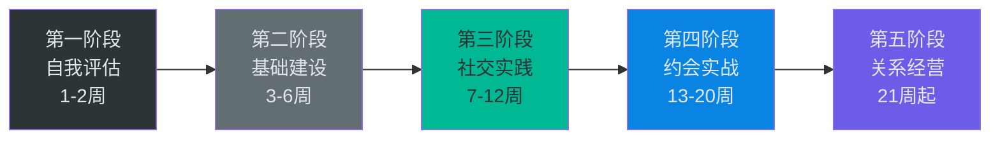
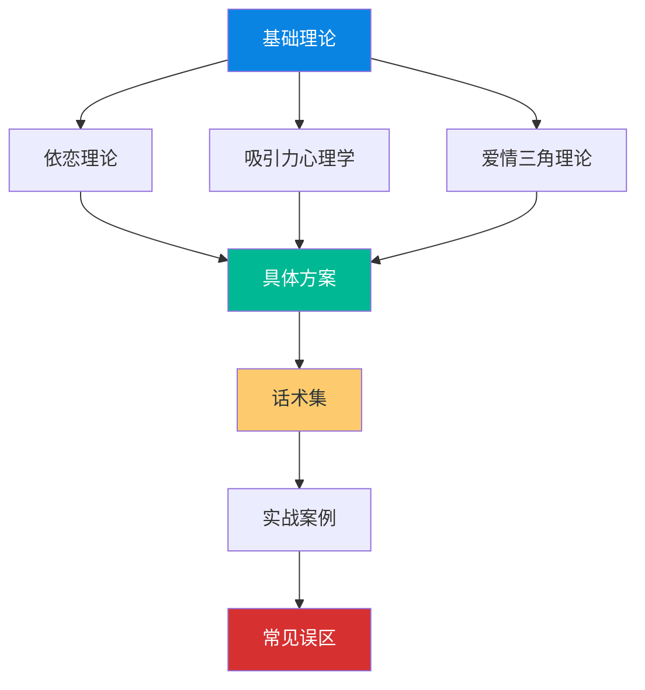
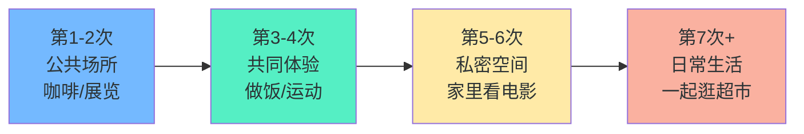
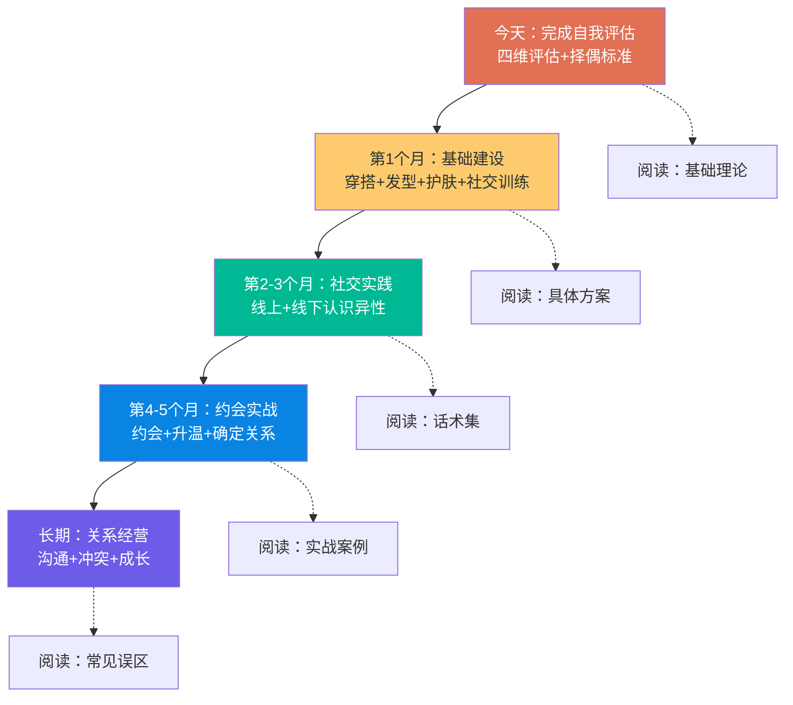

# 学习路径：从零基础到脱单的完整路线图

> "千里之行，始于足下。" ——老子《道德经》

找对象不是靠运气，而是一项可以系统学习、分步提升的技能。本节为你规划了一条从零基础到脱单的完整学习路径，包含五个阶段、具体行动、里程碑检查点和常见问题应对方案。无论你现在处于什么阶段，都可以找到适合自己的起点，按照路线图逐步前进。

---

## 一、阶段划分与总体逻辑

整个学习路径分为五个阶段，遵循"认知→提升→实践→应用→维持"的学习规律。每个阶段都有明确的目标、可量化的里程碑和具体的行动清单。

| 阶段 | 时间 | 核心主题 | 目标 | 里程碑（完成标志） |
|------|------|----------|------|-------------------|
| 第一阶段：自我评估 | 第1-2周 | 认知自我 | 了解自己的优势与短板 | 完成四维评估表，明确3个核心择偶标准 |
| 第二阶段：基础建设 | 第3-6周 | 提升自我 | 外在形象+内在能力双提升 | 形象明显改善，掌握3项以上社交技能 |
| 第三阶段：社交实践 | 第7-12周 | 扩大圈子 | 建立稳定的异性社交渠道 | 每周认识2-3个新异性，有持续聊天对象 |
| 第四阶段：约会实战 | 第13-20周 | 找到对象 | 从线上走到线下，确定关系 | 成功进入恋爱关系 |
| 第五阶段：关系经营 | 第21周起 | 维持关系 | 健康稳定的长期关系 | 建立冲突解决机制，有共同未来规划 |

**关键原则：** 不要跳阶段。每个阶段都是下一阶段的地基。自我评估不清就去社交，会浪费大量时间在错误的方向上；没有基础建设就去约会，会因为外在和能力不足而频繁受挫。

---

## 二、第一阶段：自我评估（第1-2周）

### 2.1 为什么自我评估是第一步

很多人脱单失败的根本原因不是条件差，而是**对自己没有清晰的认知**。不知道自己的优势在哪里、短板在哪里、适合什么样的人，就盲目去追、去相亲，结果要么眼高手低，要么错过真正合适的人。

自我评估的本质是：**建立一个客观的自我画像，作为后续所有行动的基准线。**

### 2.2 四维评估框架

用以下四个维度全面评估自己，每个维度给出1-10分的自评：

#### 维度一：外在条件

外在条件是第一印象的基础，决定了你"入门"的门槛。

| 评估项 | 评估内容 | 改善空间 |
|--------|----------|----------|
| 身高 | 身高是相对固定的，但可以通过穿搭（内增高、竖条纹、高腰线）视觉上优化 | 中等（视觉优化） |
| 体重/体型 | BMI是否在正常范围（18.5-24），体脂率是否合理 | 高（运动+饮食） |
| 面部 | 肤质、五官比例、气色 | 中等（护肤+作息） |
| 发型 | 是否找到适合自己脸型的发型 | 高（换发型效果立竿见影） |
| 穿搭 | 是否懂得基本的色彩搭配和版型选择 | 高（学习成本低，效果显著） |
| 体态 | 含胸驼背、走路姿态、坐姿 | 高（体态训练） |

**具体操作：** 对着镜子拍一张全身照和一张半身照，从旁观者角度审视自己。也可以问一个关系好的异性朋友："你觉得我外表上最需要改善什么？"——朋友的反馈比自我评估更准确。

#### 维度二：经济与生活

经济不是决定因素，但确实是重要的基础条件。关键不是你现在有多少钱，而是你的**经济趋势**和**消费观念**。

- **收入水平**：当前月收入处于什么区间？是否有稳定的收入来源？
- **职业前景**：你的行业/岗位未来3-5年的发展预期如何？
- **资产状况**：是否有存款、房产、车辆等资产？负债情况如何？
- **消费习惯**：是月光族还是有储蓄习惯？消费观念是否健康？
- **生活能力**：会不会做饭、打扫、基本的家务？生活是否独立？

**核心认知：** 经济条件的吸引力不在于绝对数字，而在于三个信号：（1）你有上进心和规划能力；（2）你能提供基本的安全感；（3）你的消费观与对方匹配。

#### 维度三：性格与心理

性格和心理状态决定了你在关系中的表现，是最容易被忽视但最重要的维度。

**依恋风格测试：** 依恋理论将人的依恋风格分为四种，了解自己的依恋风格有助于理解自己在关系中的行为模式。

| 依恋风格 | 核心特征 | 在关系中的表现 | 占比（约） |
|----------|----------|---------------|-----------|
| 安全型 | 信任他人，自我价值感稳定 | 能自如地亲密，也能独立 | 56% |
| 焦虑型 | 害怕被抛弃，需要频繁确认 | 容易粘人、吃醋、反复试探 | 20% |
| 回避型 | 害怕亲密，重视独立 | 容易疏远、冷淡、逃避深入 | 25% |
| 混乱型 | 渴望亲密又害怕亲密 | 行为反复无常，忽冷忽热 | 少数 |

**推荐测试：** 搜索"ECR亲密关系经历量表"（Experiences in Close Relationships），这是一个经过学术验证的依恋风格测评工具，约36道题，10分钟完成。

**其他心理评估：**
- **情绪管理能力**：你遇到压力时的反应模式是什么？是冷静分析还是情绪爆发？
- **沟通风格**：你是倾向于直接表达还是委婉暗示？遇到冲突是回避还是面对？
- **自我价值感**：你对自己的评价是偏高、偏低还是相对客观？

#### 维度四：社交能力与资源

社交能力和社交资源直接决定了你认识异性的机会大小。

| 评估项 | 低分表现 | 高分表现 |
|--------|----------|----------|
| 社交圈大小 | 只有同事和少数老同学 | 有多个不同圈子的朋友 |
| 异性接触频率 | 一周几乎不和异性说话 | 每周有多个异性互动 |
| 聊天能力 | 不知道说什么，容易冷场 | 能自然地开启和维持对话 |
| 社交主动性 | 等别人来找自己 | 主动发起社交、参加活动 |
| 社交渠道 | 只有一两个渠道 | 线上线下多渠道并行 |

### 2.3 明确择偶标准

评估完自己之后，你需要明确自己想找什么样的人。这一步的关键是**区分核心需求和加分项**。

**操作方法：三轮筛选法**

**第一轮：海选（列出所有你在意的特质）**
不加限制地写出你希望伴侣具备的所有特质，可能有20-30个。例如：外貌好看、性格温柔、收入高、会做饭、爱运动、幽默、孝顺、有上进心……

**第二轮：核心筛选（圈出5个不可妥协的）**
从列表中选出5个你认为最重要的特质。这些是"核心需求"——如果对方不具备，即使其他方面再好也不合适。

**第三轮：现实校准（对照自身条件）**
对照自己的四维评估，检查你的标准是否合理。一个核心原则：**你能提供什么，决定了你有权要求什么。** 如果你自己月入5000，要求对方月入3万就不现实；如果你自己不善社交，要求对方活泼开朗也需要你能接受互补型关系。

### 2.4 第一阶段里程碑

完成第一阶段的标志：

- [ ] 完成四维评估，每个维度都有明确的自评分数
- [ ] 完成依恋风格测试，了解自己的依恋类型
- [ ] 通过三轮筛选法，明确5个核心择偶标准
- [ ] 写出一份500字的"自我画像"——我是谁、我的优势、我的短板、我要找什么样的人

---

## 三、第二阶段：基础建设（第3-6周）

### 3.1 为什么基础建设不可跳过

很多人急于认识异性、去约会，却忽略了基础建设。这就像一个厨师不磨刀就急着做菜——不是不能做，而是效率低、效果差。

基础建设分为两大块：**外在形象优化**（让别人愿意了解你）和**内在能力提升**（让别人愿意继续了解你）。

### 3.2 外在形象优化（第3-4周）

外在形象的改善是投入产出比最高的事情。几周时间的穿搭学习和发型调整，效果可能超过几个月的其他努力。

#### 穿搭系统化学习

**基础原则：**
- **合身优先**：衣服合身比品牌重要10倍。不合身的大牌还不如合身的优衣库
- **色彩安全区**：不确定怎么搭配时，黑白灰+一个亮色点缀是最安全的选择
- **身材比例**：通过高腰线（上衣扎进裤子）、竖条纹、V领来视觉优化身材比例
- **内增高技巧**：2-3cm的内增高鞋垫可以在视觉上改善身高，且不会明显突兀

**具体行动清单：**
1. 找一个穿搭风格你喜欢的博主（B站/小红书搜"男生穿搭入门"），关注并模仿
2. 购买3-5套基础款穿搭：纯色T恤、合身牛仔裤/休闲裤、一件夹克/外套、一双干净的白色运动鞋
3. 拍照对比——穿新旧两套衣服拍照，请朋友评价哪套更好
4. 学习叠穿、配饰（手表、围巾）等进阶搭配

**预算参考：** 完全不需要买贵的。基础款穿搭3-5套预算约500-1500元，就能实现显著改善。

#### 发型设计

发型是对颜值影响最大的单项因素，没有之一。一个合适的发型可以在视觉上改变脸型、提升气质。

**操作步骤：**
1. 在小红书或抖音搜索"男生+你的脸型+发型推荐"（如"男生五角脸发型"）
2. 保存3-5个你喜欢的发型图片
3. 去理发店时直接给理发师看图片，说"我想剪类似这样的"
4. 剪完后学习日常打理方法（吹风机使用、发蜡/发泥选择）
5. 如果头发塌软，可以考虑烫发根（纹理烫/锡纸烫）增加蓬松感

**预算参考：** 普通理发店剪发30-80元，烫发100-300元。建议每3-4周修剪一次保持造型。

#### 皮肤护理

皮肤状态直接影响别人对你"干净程度"的判断。不需要复杂的护肤流程，做到以下基础三步就够了：

| 步骤 | 产品 | 价格区间 | 使用方法 |
|------|------|----------|----------|
| 洁面 | 氨基酸洗面奶（如旁氏米粹） | 20-50元 | 早晚各一次，温水打湿面部后揉搓30秒冲洗 |
| 保湿 | 清爽型乳液/面霜 | 30-80元 | 洁面后趁脸微湿时涂抹，重点涂两颊 |
| 防晒 | SPF30+防晒霜 | 30-60元 | 出门前15分钟涂抹，每2-3小时补涂 |

**针对油性皮肤的额外建议：**
- 中午可以用吸油纸按压T区（不要擦）
- 一周使用1-2次含水杨酸的清洁面膜
- 避免过度清洁——越洗越油是真实存在的

#### 身材管理

如果体重超标（BMI>24），减重是投入产出比极高的改善项。减重10斤带来的形象改善，可能比花1000块买衣服更明显。

**科学减重方案：**
- **目标**：每周减0.5-1斤（过快减重会反弹且伤身）
- **饮食**：减少精制碳水（白米饭、面条、面包），增加蛋白质（鸡胸肉、鸡蛋、鱼虾）和蔬菜
- **运动**：不需要去健身房。每天快走/慢跑30分钟+简单的力量训练（俯卧撑、深蹲、平板支撑）就能有效果
- **热量缺口**：每天减少300-500大卡摄入，一个月可以减2-4斤

### 3.3 内在能力提升（第5-6周）

外在让人愿意认识你，内在让人愿意留在你身边。

#### 社交能力训练

社交能力不是天赋，是可以通过练习提升的技能。以下是从易到难的训练阶梯：

**Level 1：基础对话能力（第5周前半）**
- 练习与陌生人进行30秒以上的非功利性对话（如和便利店收银员聊两句天气）
- 练习"开放式提问"——用"什么/怎么/为什么"开头的问题代替"是不是/对不对"
- 练习"积极倾听"——对方说完后复述要点+表达感受（如"听起来你最近挺忙的，辛苦了"）

**Level 2：异性社交能力（第5周后半）**
- 主动和身边的异性同事/同学聊日常话题（不带任何目的性）
- 学习"适度自我暴露"——分享一些个人经历和感受，而不是只聊表面话题
- 练习"读信号"——注意对方是否主动延续话题、是否有眼神接触、是否主动找你

**Level 3：吸引力构建（第6周）**
- 学习讲故事的能力——把普通经历讲得有趣（练习"起承转合"结构）
- 培养幽默感——不是讲笑话，而是对生活保持轻松的态度，偶尔自嘲
- 学习适度的"推拉"——不要一味讨好，偶尔开个玩笑、提出不同意见

#### 生活技能提升

会做饭、会收拾房间、有有趣的爱好，这些看起来是小事，但在恋爱中是重要的加分项。

**做饭：** 不需要成为大厨，学会5-10道家常菜就够了。推荐从以下菜品入门：
- 西红柿炒蛋（入门级，不可能失败）
- 可乐鸡翅（看起来厉害，实际简单）
- 蒜蓉西兰花（健康且好看）
- 红烧肉（稍有难度，但学会后杀伤力巨大）

学习渠道：B站搜"家常菜教程"，小红书搜"一人食"，下厨房APP。

**居住环境：** 干净整洁的居住环境反映一个人的生活态度。保持以下标准：
- 地面无杂物，桌面整洁
- 卫生间干净无异味
- 有基本的收纳系统（不需要豪华，整洁即可）
- 床单被套每1-2周换洗一次

**兴趣爱好：** 培养1-2个可以展示的爱好。以下爱好在社交中特别有用：

| 爱好类型 | 具体选择 | 社交价值 | 上手难度 |
|----------|----------|----------|----------|
| 运动类 | 羽毛球、游泳、跑步、健身 | 高（可一起运动，展示自律） | 中 |
| 技能类 | 吉他、摄影、烘焙 | 高（可展示、可教对方） | 中高 |
| 文艺类 | 读书、看展、电影 | 中（有话题可聊） | 低 |
| 户外类 | 徒步、露营、骑行 | 高（约会场景丰富） | 中 |

### 3.4 理论学习（贯穿全程）

在基础建设阶段，同步学习恋爱相关理论，为后续实践打下认知基础。

**本章学习顺序建议：**

1. **先读基础理论**——理解吸引力的底层机制、依恋风格的运作方式、爱情的构成要素
2. **再读具体方案**——根据自己的情况（相亲/社交/线上）选择适合的策略
3. **然后读话术集**——学习具体场景下如何说话，但不要死记硬背，理解原理更重要
4. **参考实战案例**——看别人是怎么成功的，提取可复用的模式
5. **最后读常见误区**——避免踩坑

### 3.5 第二阶段里程碑

完成第二阶段的标志：

- [ ] 至少购置了3套合身的新穿搭，并得到了正面反馈
- [ ] 换了一个适合脸型的新发型
- [ ] 建立了基础护肤习惯（洁面+保湿+防晒）
- [ ] 如果需要减重，体重有1-2斤的下降趋势
- [ ] 能和陌生人进行2-3分钟的自然对话
- [ ] 学会做5道以上的家常菜
- [ ] 读完了本章的"基础理论"部分

---

## 四、第三阶段：社交实践（第7-12周）

### 4.1 社交实践的核心目标

这个阶段的目标不是"找到对象"，而是**扩大异性接触面+练习社交技能**。把目标定在"找对象"上会让你太紧张，反而发挥不好。把目标定在"每周认识2个新异性"上，压力小得多，效果反而更好。

### 4.2 线上渠道实操（第7-8周）

#### 选择平台

不同平台的用户画像和使用方式差异很大，选择适合自己的平台比注册所有平台更重要。

| 平台 | 用户特征 | 适合人群 | 使用要点 |
|------|----------|----------|----------|
| 探探/陌陌 | 年轻用户为主，颜值导向 | 外在条件中等以上 | 照片质量是核心，前3张决定右滑率 |
| Soul | 注重灵魂匹配，外在权重低 | 内在有趣但外在一般 | 重视文字内容和兴趣匹配 |
| 世纪佳缘/百合 | 以结婚为目的，年龄偏大 | 明确要结婚的人 | 资料要详细真实，主动筛选 |
| 微信附近的人 | 随机性强，门槛低 | 有社交自信的人 | 朋友圈是你的名片 |
| 小红书 | 兴趣社交，非直接相亲 | 有共同兴趣爱好的人 | 通过评论互动自然认识 |

**建议：** 先选1-2个平台集中精力使用，不要贪多。

#### 优化个人资料

你的个人资料就是你的"广告页"，决定了别人是否愿意了解你。

**照片选择（最重要的环节）：**
- **第一张**：清晰的正面半身照，自然微笑，背景干净（不要自拍，找人帮拍）
- **第二张**：全身照，展示穿搭和身材（不要驼背）
- **第三张**：兴趣/生活照，展示你的生活状态（运动、旅行、做饭等）
- **避免**：过度美颜、集体照（不知道哪个是你）、风景照（你是来展示自己的不是展示风景的）、墨镜遮脸照

**文字资料：**
- 不要写"随缘"、"看感觉"这种等于什么都没说的话
- 写具体的内容：你的职业方向、兴趣爱好、周末一般做什么
- 展示一点幽默感："厨艺在进步中，目前西红柿炒蛋已经不糊了"
- 表达明确但不苛刻的期待："希望你是一个热爱生活的人"

#### 聊天技巧

**开场白原则：** 不要发"你好"、"在吗"、"认识一下"——这些开场白的回复率极低。好的开场白需要**与对方资料相关**。

| 开场白类型 | 示例 | 回复率（估） |
|-----------|------|-------------|
| 低效：通用型 | "你好，认识一下" | 5-10% |
| 中等：夸赞型 | "你照片拍得好好看，在哪里拍的？" | 15-25% |
| 高效：关联型 | "看到你也喜欢爬山，你去过XX山吗？" | 30-50% |

**聊天节奏：**
- 前3-5轮：轻松话题（兴趣、日常、共同点）
- 第6-10轮：稍微深入（工作、生活态度、有趣的经历）
- 适时转移到微信（一般聊2-3天后，如果互动不错就提出）
- 不要在线上聊天太久——线上聊天的目的是约出来见面，不是交网友

### 4.3 线下渠道实操（第9-10周）

线下的优势在于：能看到真人，互动更自然，更容易建立真实的好感。

#### 高效线下渠道

| 渠道 | 优势 | 操作方式 | 认识异性效率 |
|------|------|----------|-------------|
| 兴趣社团/俱乐部 | 有共同话题，接触频率高 | 加入羽毛球群、读书会、跑步团等 | 高 |
| 朋友聚会 | 有信任背书，降低防备 | 主动参加朋友组织的聚会，让朋友介绍 | 高 |
| 相亲活动 | 目标明确，效率高 | 参加线下相亲会、8分钟约会 | 中高 |
| 志愿者活动 | 展示社会责任感，自然互动 | 参加公益活动、社区服务 | 中 |
| 同城活动 | 兴趣匹配，场景自然 | 豆瓣同城活动、Meetup | 中 |

#### 线下社交技巧

**破冰方法：**
- **环境破冰**：对当前环境/活动发表评论（"这个场地布置得挺有意思的"）
- **求助破冰**：请教一个小问题（"你知道这个怎么用吗？"）
- **共同点破冰**：发现共同身份/经历（"你也是第一次来参加这种活动吗？"）

**维持对话：**
- 用"FORD"模型找话题：Family（家庭）、Occupation（职业）、Recreation（休闲）、Dreams（梦想）
- 多问开放性问题，少问封闭性问题
- 对方回答后，基于回答追问细节——这是让对话持续的关键

**要联系方式：**
- 不要突然要，先建立至少10分钟的愉快对话
- 自然过渡："今天聊得挺开心的，加个微信吧，下次有XX活动叫上你"
- 如果对方犹豫，不要强求，说"没关系"然后自然地结束对话

### 4.4 复盘与优化（第11-12周）

每两周做一次社交复盘，这是持续进步的关键。

**复盘模板：**

【社交复盘】第___周

1. 本周社交数据：
   - 新认识异性数量：___人
   - 线上聊天对象：___人
   - 线下互动次数：___次

2. 成功经验：
   - 什么话题/方式引起了对方的兴趣？
   - 哪些互动让我感觉良好？

3. 失败教训：
   - 哪些对话冷场了？为什么？
   - 被拒绝/不回复的原因可能是什么？

4. 下周改进：
   - 需要调整的策略：___
   - 需要练习的技能：___

### 4.5 第三阶段里程碑

完成第三阶段的标志：

- [ ] 在至少1个线上平台有持续的聊天对象
- [ ] 线下至少参加了3次社交活动
- [ ] 累计认识了10个以上的新异性
- [ ] 有至少1-2个互相有好感的对象
- [ ] 掌握了基本的破冰、维持对话、要联系方式的能力

---

## 五、第四阶段：约会实战（第13-20周）

### 5.1 从聊天到约会的过渡

很多人的卡点在于：线上聊得不错，但不知道怎么约出来。

**约出来的关键：**
- **时机**：聊天2-3天后，互动氛围良好时提出
- **方式**：给出具体方案，而不是模糊地说"有空出来玩"
- **正确示范**："周六下午我想去XX商场那边逛逛，你有兴趣一起吗？"
- **错误示范**："有空出来吃个饭呗"（太模糊，对方不知道怎么回应）

**如果对方拒绝：**
- "这周有事"但没有说改到什么时候 → 大概率是委婉拒绝，不要追问
- "这周有事，下周可以" → 有意向，下周再约
- "我不太喜欢XX，但我喜欢YY" → 积极信号，对方在给你替代方案

### 5.2 初次约会指南（第13-14周）

#### 约会地点选择

初次约会的地点选择直接影响约会体验。

| 推荐等级 | 地点类型 | 优势 | 注意事项 |
|----------|----------|------|----------|
| ★★★★★ | 咖啡厅/茶馆 | 安静、低成本、便于聊天 | 选择靠窗或角落的位置 |
| ★★★★★ | 逛展/逛书店 | 有话题、边走边聊不尴尬 | 提前查好展览信息 |
| ★★★★☆ | 逛街+吃饭 | 自然、有节奏感 | 餐厅提前选好，避免太吵 |
| ★★★☆☆ | 看电影 | 有共同体验 | 初次约会不推荐（几乎没有交流时间） |
| ★★☆☆☆ | 密室逃脱/剧本杀 | 互动性强 | 初次约会不推荐（压力太大，无法深入了解） |

**核心原则：** 初次约会选一个**便于聊天**的场所。你的目的是了解对方，不是"搞活动"。

#### 约会中的行为指南

**Do（应该做的）：**
- 提前10分钟到，选好位置
- 主动帮对方点单/倒水（体现细心但不过度殷勤）
- 保持眼神接触（60-70%的时间看对方）
- 认真倾听，适时追问细节
- 分享自己的故事和感受（适度自我暴露）
- 注意观察对方的舒适度（是否放松、是否主动延续话题）

**Don't（不应该做的）：**
- 不要一直看手机
- 不要吹嘘自己（展示而不是炫耀）
- 不要问太私密的问题（收入、前任细节、家庭隐私）
- 不要批评任何事物（消极评价减分极大）
- 不要急于肢体接触（初次约会保持适当距离）
- 不要AA制争论——如果邀请对方，主动买单是基本礼仪

#### 约会后的跟进

约会结束后2小时内发一条消息：

- **好的跟进**："今天聊得很开心，你推荐的那个XX我去看看。下次有机会再一起出来。"
- **糟糕的跟进**："你觉得我怎么样？"（太有压力）、"今天花了多少钱我算一下"（太计较）

**判断对方兴趣的方法：**
- 对方是否主动找话题延续聊天 → 兴趣较高
- 对方回复速度和内容长度是否和约会前一样 → 兴趣维持
- 对方是否主动提出下次见面 → 强烈兴趣信号
- 对方回复变得简短/敷衍 → 兴趣下降

### 5.3 后续约会与关系升温（第15-18周）

#### 约会形式递进

随着关系发展，约会的形式应该逐步升级：

#### 关系升温技巧

**肢体接触的递进（非常重要，需要自然不突兀）：**
1. **第一层**：并肩走路时手臂偶尔碰触
2. **第二层**：过马路时轻触对方手臂/后背提醒
3. **第三层**：递东西时手指碰触
4. **第四层**：自然地牵手（如过马路时、走在路上时）

**判断对方是否接受：**
- 对方没有躲开 → 可以继续保持
- 对方主动靠近 → 可以进一步
- 对方明显躲开/身体僵硬 → 停止，退回到上一层

**表白时机：**
- 已经约会3次以上
- 双方有明确的暧昧互动（肢体接触不排斥、聊天频率高）
- 对方对你有好奇心（主动问你的事情）
- 你们之间有独处时的舒适感

**表白方式：**
- 不需要搞大场面，真诚简单就好
- "和你在一起的时候我很开心，我想正式地问你，你愿意做我女朋友吗？"
- 不要在公共场合搞"惊喜"式表白——这会给对方压力
- 如果对方犹豫，给对方时间考虑，不要逼迫

### 5.4 第四阶段里程碑

完成第四阶段的标志：

- [ ] 至少进行了3次以上的线下约会
- [ ] 能够自然地安排约会、选择地点、推进关系
- [ ] 掌握了肢体接触的递进节奏
- [ ] 成功进入恋爱关系（或者明确了下一步的方向）

---

## 六、第五阶段：关系经营（第21周起）

### 6.1 恋爱不是终点，是新的起点

很多人误以为"找到对象就完事了"，实际上找到对象只是开始。维持一段健康的关系需要持续的投入和学习。

### 6.2 建立有效沟通模式

恋爱中80%的问题都源于沟通不畅。建立有效的沟通模式是关系经营的基础。

**日常沟通习惯：**
- 每天保持联系（不一定长聊，但让对方知道你在想TA）
- 分享生活中的小事（拍到的有趣场景、吃到的好吃的）
- 主动表达关心（"今天冷了多穿点"、"工作忙注意休息"）
- 不要只在需要对方时才联系

**深度沟通：**
- 每周安排一次"深度对话"时间（不是聊日常，而是聊感受、想法、未来）
- 学习用"我"句式表达需求："我希望你能……"而不是"你总是不……"
- 倾听时不要急于给建议——很多时候对方只是想被理解，而不是要解决方案

**沟通中的常见错误：**

| 错误模式 | 表现 | 正确做法 |
|----------|------|----------|
| 读心术 | "你应该知道我想要什么" | 直接表达需求，不要让对方猜 |
| 翻旧账 | "你上次也是这样" | 就事论事，只讨论当前问题 |
| 冷暴力 | 不说话、不回消息、冷战 | 说"我现在需要冷静一下，__分钟后我们再聊" |
| 人身攻击 | "你就是个自私的人" | 讨论行为，不攻击人格："你这样做让我感到……" |
| 比较 | "你看看别人家男朋友" | 不比较，只讨论你们之间的事 |

### 6.3 冲突处理框架

冲突不是关系的敌人，**不会处理冲突**才是。以下是一个经过验证的冲突处理框架：

**GROW模型：**
1. **G（Goal）确认目标**：我们吵架的目的是解决问题，不是分出输赢
2. **R（Reality）描述事实**：客观描述发生了什么，不加评价
3. **O（Options）寻找方案**：一起想解决方案，而不是各执己见
4. **W（Will）达成共识**：选择一个双方都能接受的方案，确定执行方式

**冲突中的"暂停机制"：**
- 当情绪升温到快要失控时，任何一方可以说"暂停"
- 暂停规则：分开冷静30分钟（不多不少），然后回来继续谈
- 暂停期间不做任何决定、不发愤怒消息、不找朋友"评理"

### 6.4 保持关系新鲜感

恋爱关系最大的敌人不是争吵，而是**平淡**。以下方法可以有效保持新鲜感：

- **定期约会**：即使在一起了，每周也要安排一次"正式约会"（不是宅在家里）
- **共同体验**：一起尝试新事物（学做一道新菜、去一个没去过的地方、一起运动）
- **独立空间**：保持各自的社交圈和个人爱好，不要变成"连体婴"
- **仪式感**：纪念日、节日要有仪式感（不需要花很多钱，用心就好）
- **成长同步**：一起读书、一起健身、一起学新技能——共同成长是最持久的吸引力

### 6.5 关系中的个人成长

**不要在恋爱中丢失自己：**
- 保持自己的社交圈和兴趣爱好
- 继续追求个人的职业和人生目标
- 不要把所有情感需求都压在伴侣身上
- 保持经济独立

**共同规划未来：**
- 认真讨论结婚时间表、生育计划、定居城市等重大问题
- 不要回避这些话题——越早讨论越好，避免走到最后才发现价值观不合
- 学会在差异中寻找共识

### 6.6 第五阶段的持续指标

关系经营没有"完成"一说，但以下指标可以衡量关系的健康程度：

- [ ] 双方都能自由表达感受而不担心被评判
- [ ] 冲突能在24小时内解决，不会演变成冷战
- [ ] 有固定的约会时间和深度对话时间
- [ ] 双方都保持了个人成长和独立空间
- [ ] 对未来有共同的规划和期待

---

## 七、各阶段常见问题深度解答

### 第一阶段常见问题

**Q：我感觉自己条件很差，没有希望怎么办？**

这不是安慰话——每个人确实都有自己的"适配对象"。问题不在于你的绝对条件有多好，而在于你是否能找到与你匹配的人。

具体来说：
- 外在条件一般 → 可以通过穿搭、发型、体态训练大幅改善，很多人换了发型+穿搭就像换了一个人
- 经济条件一般 → 展示上进心和规划能力比展示当前收入更重要。很多女性在意的是"潜力"而不是"现有"
- 社交能力弱 → 这是最容易改善的，通过本章的训练阶梯可以在8周内有明显提升

**Q：我不知道自己想要什么样的伴侣怎么办？**

这是非常正常的。大部分人在没有恋爱经验时都不知道自己要什么。解决方案：
1. 先用三轮筛选法列出你**以为**自己想要的
2. 开始社交和约会，在实践中检验
3. 约会3-5个人后，你会逐渐发现自己真正看重什么
4. 不要追求"完美对象"，追求"合适的人"

### 第二阶段常见问题

**Q：形象优化需要花很多钱吗？**

完全不需要。形象优化的核心是"合身+整洁+得体"，而不是品牌。
- 穿搭：基础款在优衣库、ZARA、HM就能买到，500-1500元搞定3-5套
- 发型：找一个靠谱的理发师比去贵的理发店更重要。可以先去一次中等价位的（50-100元），和理发师沟通好后，以后可以去便宜的地方修剪
- 护肤：氨基酸洗面奶+保湿乳+防晒霜，一个月100元以内
- 健身：不需要办健身房卡。跑步（免费）+俯卧撑深蹲（免费）就够了

**Q：我30岁了，学这些来得及吗？**

绝对来得及。恋爱技能和外在形象的改善没有年龄限制。事实上，30岁左右的人在恋爱市场上有独特的优势：
- 经济基础更稳定
- 性格更成熟
- 更清楚自己要什么
- 沟通能力通常比20出头时更强

很多男性在30-35岁找到优质伴侣，因为这个年龄段的综合条件（经济+成熟度+稳定性）对很多女性有吸引力。

### 第三阶段常见问题

**Q：我不知道怎么开始聊天怎么办？**

聊天能力是可以快速提升的，核心方法是"模仿+练习+复盘"：
1. **模仿**：看话术集中"聊天话术30个场景"，背下5-10个万能开场白
2. **练习**：每天在社交平台上发起2-3个对话，不带压力地练习
3. **复盘**：哪些话题对方回应积极？哪些话题冷场了？记录下来
4. **进阶**：从"背话术"过渡到"理解原理"——为什么这个开场白有效？因为它关联了对方资料、展示了你的特点、提出了容易回答的问题

**Q：对方不回复我怎么办？**

不回复是社交中的常态，不需要过度解读。处理方式：
- 发了消息24小时没回 → 可能忙，不追发
- 48小时没回 → 大概率不感兴趣，不再发
- 对方已读不回 → 明确不感兴趣，继续下一个人

**心态调整：** 把"被拒绝"重新定义为"筛选"。对方不回复不代表你不好，只是不匹配。你的目标是找到匹配的人，而不是让所有人都喜欢你。成功率10%意味着每认识10个人会有1个有回应——这完全正常。

### 第四阶段常见问题

**Q：约会时很紧张怎么办？**

紧张是因为你把注意力放在了"我表现得怎么样"上。解决方法：
1. **把注意力放在对方身上**：认真听对方说什么，观察对方的表情，对对方产生好奇
2. **提前准备**：准备好3-5个话题（工作趣事、最近看的电影、旅行经历），这样不会冷场
3. **接受紧张**：适度的紧张反而会让你更专注，不需要完全消除
4. **降低期望**：第一次约会的目标不是"让对方喜欢我"，而是"度过一段愉快的时间"

**Q：约会3次了还不确定关系怎么办？**

不要急。关系的确定不一定要由你来推动，可以创造条件让对方来表态：
- 在约会中增加暧昧互动（如肢体接触、更亲密的话题）
- 减少主动联系的频率——如果对方也减少联系，说明兴趣不足；如果对方反而更主动，说明在意你
- 在一次愉快的约会结束时，半认真地说："我们这样算不算在谈恋爱啊？"根据对方反应判断

### 第五阶段常见问题

**Q：恋爱后感觉变淡了怎么办？**

这是每段恋爱都会经历的"激情消退期"，通常发生在在一起3-6个月后。这不是感情出了问题，而是正常的生理和心理变化。

应对方法：
- **创造新鲜感**：一起做以前没做过的事（旅行、学新技能、挑战性活动）
- **保持个人魅力**：不要因为在一起了就放弃形象管理和个人成长
- **深化情感连接**：从"激情驱动"转变为"深度连接驱动"——分享更深层的想法、恐惧、梦想
- **给彼此空间**：适当的分离会让重聚更有感觉

**Q：我们经常吵架怎么办？**

首先要区分"建设性冲突"和"破坏性冲突"：
- **建设性冲突**：就事论事，吵完能解决问题，吵完后关系反而更好
- **破坏性冲突**：人身攻击、翻旧账、冷暴力，吵完问题没解决，关系越来越差

如果是建设性冲突 → 恭喜，这是健康关系的表现，只需要学习更好的冲突处理方式
如果是破坏性冲突 → 需要认真改变沟通模式，必要时寻求专业咨询

---

## 八、进度追踪系统

### 每日微行动（5-10分钟）

这些小行动看起来微不足道，但坚持下来会产生复利效应：

- [ ] **早上**：护肤3分钟（洁面+保湿+防晒）+ 整理穿搭
- [ ] **通勤/午休**：浏览一个恋爱相关知识点（读本章的一小节）
- [ ] **晚上**：主动发起1-2个聊天（微信/社交平台）
- [ ] **睡前**：花2分钟回顾今天的社交情况（有没有可以改进的地方）

### 每周行动（重点行动）

- [ ] **周一**：制定本周社交目标（认识几个新人、参加什么活动）
- [ ] **周三**：执行一次社交行动（参加活动/约人出来/线上互动）
- [ ] **周五**：做一次简短复盘（填写复盘模板）
- [ ] **周末**：安排一次约会或社交活动

### 每月复盘（深度反思）

每月最后一天花30分钟做一次深度复盘：

【月度复盘】____年____月

1. 本月核心数据：
   - 新认识异性：___人
   - 约会次数：___次
   - 有持续互动的对象：___人

2. 外在改善：
   - 穿搭变化：___
   - 发型/护肤变化：___
   - 体重/体态变化：___

3. 能力提升：
   - 最大的进步是：___
   - 仍然不足的是：___
   - 下月重点提升：___

4. 心态变化：
   - 本月心态最好的时刻：___
   - 本月最沮丧的时刻：___
   - 我学到了：___

5. 下月计划：
   - 核心目标：___
   - 具体行动：___
   - 需要调整的：___

---

## 九、学习资源推荐

### 书籍（按优先级排序）

| 优先级 | 书名 | 作者 | 核心价值 | 阅读建议 |
|--------|------|------|----------|----------|
| ★★★★★ | 《亲密关系》 | 罗兰·米勒 | 最权威的亲密关系心理学教材，涵盖吸引力、沟通、冲突、嫉妒等所有核心主题 | 通读一遍，重点章节（依恋、沟通、冲突）精读 |
| ★★★★★ | 《非暴力沟通》 | 马歇尔·卢森堡 | 改善所有关系的沟通方法论，学会用"观察-感受-需要-请求"四步表达 | 边读边练习，把方法用在日常对话中 |
| ★★★★☆ | 《爱的五种语言》 | 盖瑞·查普曼 | 理解人有不同的爱的表达方式（肯定的言辞、精心的时刻、接受礼物、服务的行动、身体的接触） | 了解自己和伴侣的主要爱语 |
| ★★★★☆ | 《依恋与亲密关系》 | 阿米尔·莱文 | 深入理解依恋风格如何影响恋爱行为 | 做完依恋测试后读，对照自己的行为模式 |
| ★★★☆☆ | 《男人来自火星，女人来自金星》 | 约翰·格雷 | 理解两性思维差异 | 选择性阅读，部分内容过于刻板印象 |

### 线上课程

| 平台 | 课程 | 内容 | 费用 |
|------|------|------|------|
| Coursera | "The Science of Well-Being"（耶鲁大学） | 积极心理学，包含关系幸福 | 免费旁听 |
| B站 | "社交心理学"系列 | 中文社交技巧讲解 | 免费 |
| 得到APP | 沟通类课程 | 结构化沟通方法 | 付费 |

### 实用工具

| 工具 | 用途 | 推荐指数 |
|------|------|----------|
| 小红书 | 穿搭灵感、发型参考、约会攻略 | ★★★★★ |
| B站 | 做饭教程、穿搭教程、社交技巧讲解 | ★★★★★ |
| Keep/华为运动健康 | 运动健身计划 | ★★★★☆ |
| ECR依恋风格测试 | 了解依恋类型（搜索即可找到） | ★★★★☆ |
| 下厨房APP | 学做菜 | ★★★★☆ |

---

## 十、心态建设：贯穿全程的心理支柱

### 10.1 核心心态

心态决定了你能否坚持走完这条路。以下三个心态是最核心的：

**心态一：成长型思维**
- 把"我不行"改成"我还没学会"
- 把"被拒绝"改成"不匹配"
- 把"失败"改成"反馈"
- 相信能力是可以通过努力提升的，而不是固定不变的

**心态二：长期主义**
- 脱单不是一周的事，是一个3-6个月的系统工程
- 不要因为一次约会失败就全盘否定自己
- 每天进步一点点，复利效应会给你惊喜

**心态三：自我接纳**
- 接纳自己的不完美，但不放弃变好的努力
- 你的价值不取决于有没有对象
- 先成为一个让自己满意的人，再去寻找伴侣

### 10.2 处理焦虑和挫败感

脱单过程中的焦虑和挫败是不可避免的。关键是学会处理它们，而不是被它们击倒。

**焦虑应对方法：**
1. **行动化**：焦虑时问自己"我现在能做什么？"然后去做。行动是焦虑的最好解药
2. **合理化**：把焦虑的想法写下来，然后问自己"这个想法有证据吗？最坏的情况是什么？"
3. **聚焦化**：不要想"我什么时候才能找到对象"，只想"今天我能做什么推进的事"
4. **平衡化**：不要把所有精力放在恋爱上。工作、朋友、兴趣爱好同样重要

**挫败感应对方法：**
1. **允许自己难过**：被拒绝后难过是正常的，不需要强撑"没事"
2. **限制复盘时间**：花30分钟复盘就够了，不要反复想一周
3. **寻求支持**：和信任的朋友聊聊，或者写下自己的感受
4. **记住大数法则**：在足够大的样本下，概率会站在你这边。10次失败不代表第11次也会失败

### 10.3 避免极端心态

| 极端心态 | 表现 | 纠正方式 |
|----------|------|----------|
| 过度自卑 | "我条件这么差，没人会看上我" | 列出自己的5个优点，让朋友帮你补充 |
| 过度自信 | "我条件这么好，凭什么找不到" | 问朋友"你觉得我在恋爱中有什么问题？" |
| 过度急躁 | "我要在一个月内找到对象" | 设定合理时间线，享受过程 |
| 过度消极 | "恋爱有什么意思，不找了" | 允许自己休息，但不要永久放弃 |
| 过度讨好 | "只要对方开心就行" | 你的需求同样重要，一味讨好反而会失去尊重 |

---

## 十一、总结：你的行动地图

### 五条核心原则

1. **真诚是基础**：不要伪装成不是自己的人。伪装只能维持短期，长期关系必须建立在真实之上
2. **行动是关键**：读100篇文章不如去社交1次。理论转化为行动才有价值
3. **数据驱动**：记录你的社交数据（认识人数、约会次数、反馈情况），用数据指导优化
4. **持续迭代**：每次社交后复盘，每次约会后总结，不断调整策略
5. **享受过程**：恋爱是人生最美好的体验之一。不要把它变成一个"任务"，享受认识新朋友、探索关系的过程

### 今天就行动

不要等到"准备好"——你永远不会完全准备好。今天就做一件小事：
- 完成四维评估（30分钟）
- 或者优化你的社交平台资料（20分钟）
- 或者主动和一个异性说一句话（1分钟）

**改变从今天的第一步开始。**

---

**字数统计：约8500字**
