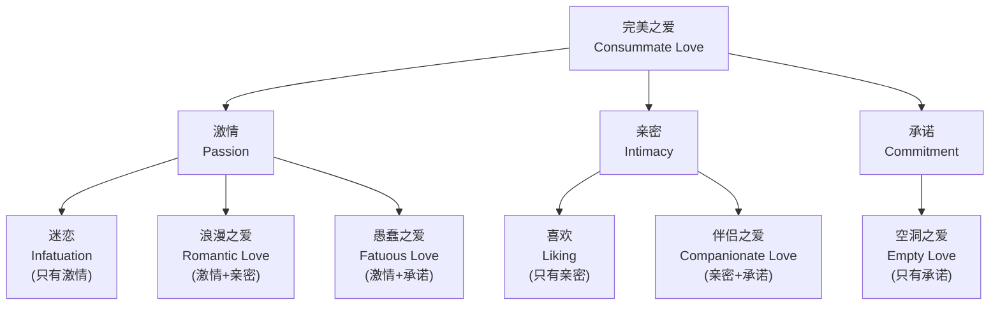
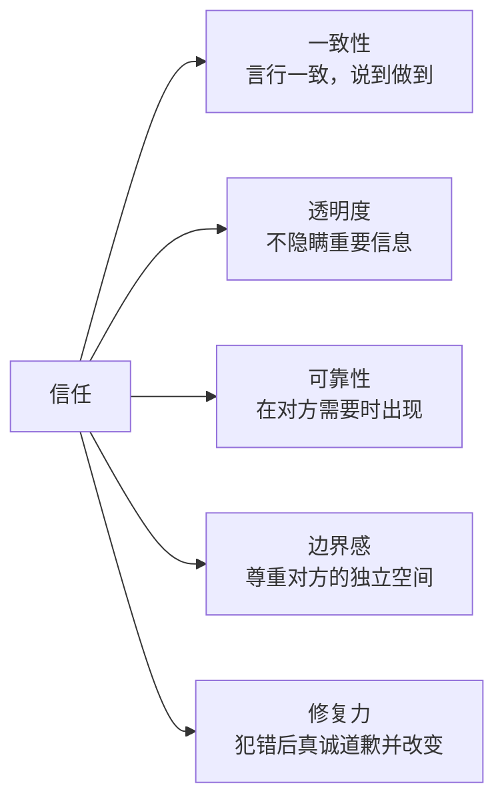
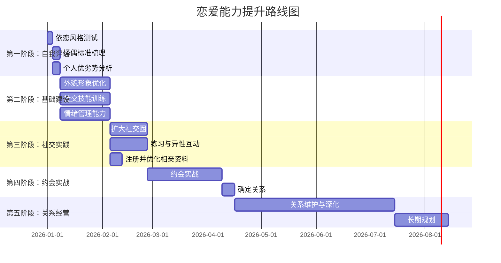

# 本章小结：从认知到行动的完整恋爱框架

> "爱情不是找到一个完美的人，而是学会用完美的眼光欣赏一个不完美的人。" ——山姆·基恩

本章从心理学理论出发，经过实操方法论，落到个人定制策略，为你构建了一套完整的"找对象与恋爱"知识体系。本小结不是简单的要点罗列——它是一张**可反复查阅的行动地图**，帮助你在不同阶段快速定位自己需要的信息。

***

## 一、核心理论体系回顾

理解理论不是为了"懂道理"，而是为了在实际场景中做出更好的判断。以下是本章涉及的四大理论支柱，以及它们在真实恋爱中的应用方式。

### 1.1 吸引力的五维模型

吸引力不是玄学，而是一个可以用五个维度拆解和优化的系统：

| 维度 | 定义 | 可操作性 | 优化周期 |
|------|------|----------|----------|
| **接近性** | 物理距离和接触频率 | 高——选择活动半径内的场景 | 即时 |
| **相似性** | 价值观、兴趣、生活方式的重合度 | 中——需要筛选和展示真实自我 | 1-3个月 |
| **互补性** | 能力、性格上的差异互补 | 中——明确自己的长板和短板 | 持续 |
| **外貌** | 视觉吸引力，包括体态、穿搭、气质 | 高——可通过系统训练提升 | 2-6个月 |
| **互惠性** | "你喜欢我"本身就是吸引力 | 高——主动表达善意和兴趣 | 即时 |

**关键洞察**：大多数人高估了外貌的权重，低估了接近性和互惠性的力量。研究显示（Moreland & Beach, 1992），单纯增加曝光频率就能显著提升好感度——这就是心理学中的"曝光效应"。换句话说，**出现在对的人面前，比"变好看"更容易起步**。

**对你的行动启示**：不要等到"准备好了"才开始社交。先让自己频繁出现在目标人群的活动圈中，同时并行优化外在形象。

### 1.2 依恋风格：你恋爱模式的底层代码

依恋理论（Bowlby, 1969; Ainsworth, 1978）揭示了一个核心事实：**你在亲密关系中的行为模式，很大程度上由童年与养育者的互动模式决定**。但好消息是，依恋风格可以改变——这叫做"习得性安全感"（earned security）。

| 依恋风格 | 核心信念 | 典型行为 | 关系中的表现 | 改变路径 |
|----------|----------|----------|-------------|----------|
| **安全型** | "我是值得被爱的，他人是可信赖的" | 自如表达需求，能接受拒绝 | 信任度高，冲突处理成熟 | —— |
| **焦虑型** | "我不够好，对方随时会离开" | 频繁确认、过度付出、情绪波动 | 渴望亲密但常把对方推远 | 建立自我价值感，学习情绪调节 |
| **回避型** | "依赖别人是危险的" | 情感隔离、强调独立、逃避承诺 | 关系一旦深入就想逃离 | 练习脆弱表达，逐步信任 |
| **恐惧-回避型** | "我想靠近但靠近会受伤" | 忽冷忽热、矛盾行为 | 反复分手复合 | 需要专业心理咨询辅助 |

**关键洞察**：焦虑型和回避型互相吸引的概率极高——焦虑型的"追"让回避型感到被需要，回避型的"逃"激活了焦虑型的不安全感。这是一个**自我强化的恶性循环**，识别它是一切改变的起点。

**对你的行动启示**：
1. 做一次专业的依恋风格测试（如ECR量表的中文版）
2. 回顾过去的关系模式，找到反复出现的剧本
3. 如果是焦虑型或回避型，优先处理依恋问题再进入新关系

### 1.3 斯滕伯格的爱情三角理论：你的关系缺少哪一角？

Robert Sternberg（1986）提出，完整的爱情由三个成分构成，不同组合产生不同类型的爱：

**七个阶段的现实映射**：
- **热恋期（0-6个月）**：激情主导，亲密在建立，承诺尚早——这是正常的，不要在这个阶段做重大决定
- **磨合期（6-18个月）**：激情开始消退，亲密面临真实考验——这是"要不要继续"的关键窗口
- **稳定期（18个月以后）**：激情转化为深层依恋，亲密和承诺成为支柱——如果只靠激情维持，关系会在这个阶段崩溃

**对你的行动启示**：不要用"没有心动的感觉"来否定一个各方面都合适的人。激情可以培养，而亲密和承诺才是真正支撑长期关系的基石。对于认真找对象的人来说，**优先评估亲密和承诺的潜力，而不是等激情出现**。

### 1.4 两性择偶策略差异：理解而非对抗

进化心理学（Buss, 1989）和大量跨文化研究揭示了男女在择偶偏好上的统计学差异。需要强调的是，这是**群体层面的趋势**，不代表每个个体都如此：

| 维度 | 女性平均偏好 | 男性平均偏好 | 进化解释 | 实际应用 |
|------|-------------|-------------|----------|----------|
| 资源与能力 | 权重较高 | 权重较低 | 后代养育需要资源保障 | 男性：展示能力和潜力 |
| 外貌与年龄 | 中等权重 | 权重较高 | 生育力的信号 | 女性：保持状态；男性：不要以外貌为唯一标准 |
| 承诺信号 | 高度重视 | 中等重视 | 长期养育的保障 | 男性：一致性行为比语言更有说服力 |
| 社交证明 | 中等重视 | 较低 | 社会地位的间接指标 | 男性：展示健康的社交圈 |
| 情绪稳定性 | 高度重视 | 高度重视 | 合作养育的基础 | 双方：情绪管理是核心竞争力 |

**对你的行动启示**：理解差异不等于刻板地"投其所好"。真正的策略是：**在理解对方需求的基础上，展示真实的自己中最好的那一面**。

***

## 二、实践方法论总结

### 2.1 相亲平台的系统化运营

找对象不是碰运气，而是一个可以优化的"漏斗"——从曝光到筛选到转化。

**平台选择矩阵**：

| 平台类型 | 代表 | 适合人群 | 转化效率 | 时间投入 |
|----------|------|----------|----------|----------|
| 纯婚恋型 | 百合网、珍爱网 | 目标明确、认真型 | 高（来的人目标一致） | 中 |
| 兴趣社交型 | Soul、即刻 | 注重精神契合 | 中（需要更多筛选） | 高 |
| 熟人介绍 | 亲友、同事 | 信任基础好 | 最高（有背书） | 低但被动 |
| 兴趣社群 | 线下读书会、运动群 | 自然接触 | 中高（先有共同话题） | 高但有趣 |
| 看脸型 | 探探等 | 不推荐认真找对象 | 低（过度依赖外貌） | 高 |

**资料优化清单**：
1. **头像**：自然光、正面或45度角、微笑、背景干净。不要用自拍——让人帮拍，距离1.5-2米
2. **照片墙（3-5张）**：一张全身照（展示穿搭和身材比例）、一张社交场景（说明你有朋友圈）、一张兴趣相关（提供聊天话题）、一张旅行或户外（展示生活态度）
3. **个人简介**：三段式——"我是谁（一句话标签）+ 我喜欢什么（给对方话题）+ 我在找什么样的人（筛选对的人）"。避免：空洞的"热爱生活"、负面的"不接受XXX"、过长的自我介绍

**筛选的黄金法则**：
- **硬性条件在资料阶段过滤**：年龄范围、地理位置、婚育意愿——这些不需要聊天就能判断
- **软性条件在聊天阶段过滤**：沟通风格、价值观、幽默感——需要3-5次对话才能初步判断
- **化学反应在见面阶段判断**：这是线上无法替代的，不要在聊天阶段就下结论

### 2.2 约会的分阶段策略

| 阶段 | 目标 | 时长 | 核心任务 | 避免事项 |
|------|------|------|----------|----------|
| 第一次见面 | 验证基本好感 | 1-2小时 | 轻松交流，观察互动自然度 | 不要安排太长时间或太重的活动 |
| 第2-3次约会 | 深入了解 | 2-3小时 | 聊价值观、生活态度、未来规划 | 不要只聊表面话题 |
| 第4-6次约会 | 评估兼容性 | 半天 | 一起做事情（而不只是聊天） | 不要回避严肃话题 |
| 确定关系 | 明确双方意愿 | 当面 | 真诚表达，确认双方感受 | 不要用微信表白 |

**约会中的信号解读**：
- **绿灯信号**：主动发起聊天、记住你说过的细节、愿意为你调整时间、身体语言开放（面向你、眼神接触多）
- **黄灯信号**：回复变慢但内容没变短、对见面不主动但不拒绝、聊天气氛好但从不主动约——这些说明对方在犹豫，你可以适当推进但不要施压
- **红灯信号**：多次取消约会不主动改期、只在深夜联系你、从不在社交媒体上提及你、对你的生活没有好奇心——果断止损

### 2.3 恋爱关系的经营框架

恋爱不是"找到人"就结束了，而是从这里才真正开始。

**沟通的四层模型**：

| 层次 | 内容 | 例子 | 效果 |
|------|------|------|------|
| 表面层 | 事实和信息 | "今天加班到9点" | 传递信息，无情感连接 |
| 观点层 | 想法和判断 | "我觉得这个项目不合理" | 开始分享内心世界 |
| 感受层 | 情绪和体验 | "加班让我很疲惫，有点委屈" | 建立情感共鸣 |
| 需求层 | 深层需要 | "我希望你能抱抱我，听我说说" | 真正的亲密连接 |

**大多数关系的问题出在：双方停留在表面层和观点层，从不进入感受层和需求层。**

**冲突处理的五步法**：
1. **暂停**：情绪激动时说"我现在需要冷静一下，10分钟后我们再聊"——给自己一个缓冲
2. **倾听**：放下辩解的冲动，真正听对方在说什么、感受什么。目标是"理解"而不是"赢"
3. **确认**：用你自己的话复述对方的意思和感受——"你是说你觉得我忽略了你，让你很受伤，对吗？"
4. **表达**：用"我"开头，表达自己的感受和需求——"我感到压力很大，因为我觉得无论怎么做都不够好"
5. **协作**：一起寻找双方都能接受的解决方案——"我们能不能一起想个办法？"

**信任的五个支柱**：

**关键洞察**：信任不是"一次建立、永久有效"的。它更像一个银行账户——每次守信是存款，每次失信是取款。当账户余额为零时，关系就走到了尽头。

***

## 三、常见误区深度剖析

大多数人在恋爱中犯的错误不是因为"不懂道理"，而是因为**用错误的直觉替代了正确的认知**。以下逐一拆解：

### 误区1：外貌决定一切

**为什么你会这么想**：因为外貌是最容易量化的指标，而且第一印象确实和外貌高度相关。

**真相**：外貌决定"是否有兴趣了解你"，但决定"是否愿意和你在一起"的是综合因素——幽默感、情绪稳定性、经济潜力、价值观匹配。大量研究表明（Eastwick & Finkel, 2008），面对面互动后，外貌对吸引力的预测力会**大幅下降**。

**纠正方法**：把外貌当作"入场券"而非"通行证"。投入足够让自己"及格"的精力，然后把重心放在更可控的因素上。

### 误区2：追求"完美的人"

**为什么你会这么想**：社交媒体和影视剧塑造了不切实际的择偶标准。

**真相**：不存在"完美的人"，只存在"适合你的人"。而且"适合"的标准会随着你自己的成长而变化。一项跟踪5年的婚恋研究发现，最初评分最高的匹配对，长期满意度并不比中等评分的匹配对更高——因为**关系经营能力比初始匹配度更重要**。

**纠正方法**：列出你的"必须有"（3-5个核心价值观）和"不能有"（3-5个底线），其他条件都留有弹性空间。

### 误区3：急于确定关系

**为什么你会这么想**：焦虑感驱动——怕错过、怕对方被别人抢走、怕自己不够好。

**真相**：过早确定关系会跳过必要的了解阶段，导致后期发现不可调和的差异。研究表明，约会3-6个月后再确定关系的情侣，分手率显著低于1个月内确定关系的情侣。

**纠正方法**：把"确定关系"当作一个需要足够数据支撑的决策，而不是一个冲动行为。给自己设定最低了解期——至少经历3次不同场景的互动。

### 误区4：过度付出

**为什么你会这么想**：你以为"付出越多，对方越感动"。

**真相**：不平等的付出会制造两个问题：(1) 你内心积累怨气——"我为你做了这么多，你怎么能这样对我"；(2) 对方感到压力或轻视你——心理学中这叫"过度补偿"，传递的信号是"我觉得自己配不上你，所以用付出来弥补"。

**纠正方法**：付出要和对方的回馈成比例。初期投入60-70%的热情即可，观察对方的回应后逐步调整。**健康的付出是"我想对你好"，而不是"我必须对你好才能留住你"**。

### 误区5：聊天像面试

**为什么你会这么想**：你急于了解对方，所以不断地提问。

**真相**：连续提问会让对方感到被审视而非被关心。好的对话是**乒乓球式的来回**——你分享一点，对方分享一点，话题自然延伸。

**纠正方法**：采用"3:1法则"——每问一个封闭式问题之前，先分享一个自己的相关故事或感受。例如：不要问"你平时喜欢做什么？"，而是说"我最近迷上了爬山，上周末去了XX山，风景特别好。你平时周末一般怎么过？"

### 误区6：害怕被拒绝

**为什么你会这么想**：你把拒绝等同于"我不够好"。

**真相**：拒绝绝大多数时候不是因为你不好，而是因为不匹配。一个喜欢吃辣的人拒绝一个不吃辣的人，不代表任何一方有问题。**把拒绝看作"信息"而非"评判"，你就自由了**。

**纠正方法**：给自己设定"拒绝配额"——每月至少主动接触10个人，目标不是"全部成功"，而是"收集信息、积累经验"。

### 误区7：忽视红旗信号

**为什么你会这么想**：你太渴望这段关系成功了，所以选择性忽视了警告信号。

**真相**：红旗信号在恋爱初期出现时，往往会随着时间推移而**加剧而非消失**。控制欲强的人不会因为你的爱而变得宽容，情绪不稳定的人不会因为你的好而变得平和。

**必须警惕的红旗信号**：
- 对前任全是负面评价，自己毫无反省
- 对服务员、陌生人态度恶劣
- 过早表达强烈感情（"我从没遇到过像你这样的人"）
- 试图切断你和朋友/家人的联系
- 情绪波动剧烈，让你时刻处于"小心翼翼"的状态
- 对你的时间和行踪有过度的控制欲

**纠正方法**：列出你的"红旗清单"，在每次新关系开始前回顾它。当信号出现时，给自己一个冷静期——"如果我的好朋友遇到这种情况，我会怎么建议TA？"

### 误区8：用套路代替真诚

**为什么你会这么想**：网络上有大量"恋爱技巧""PUA教程"，让你觉得有捷径可走。

**真相**：套路也许能吸引人，但无法留住人。长期关系建立在真实的基础上——如果对方爱上的是"你扮演的人"而不是"真实的你"，这段关系从一开始就注定失败。**真诚不是"没有技巧"，而是在技巧的基础上保持真实**。

**纠正方法**：学习沟通技巧和社交礼仪是必要的，但目的是更好地表达真实的自己，而不是创造一个虚假的人设。

### 误区9：恋爱是生活的全部

**为什么你会这么想**：当你单身很久、很渴望恋爱时，它会占据你全部的注意力。

**真相**：**把恋爱当作生活全部的人，在恋爱中反而更容易失败**。因为他们会不自觉地把所有情感需求都压在伴侣身上——这是任何一段关系都无法承受的重量。健康的关系是"两个完整的人选择在一起"，而不是"两个残缺的人互相填补"。

**纠正方法**：在寻找恋爱的同时，持续投资你的事业、友谊、兴趣和个人成长。一个有自己生活的人，天然比一个"等待被拯救"的人更有吸引力。

### 误区10：比较和攀比

**为什么你会这么想**：社交媒体上充斥着"完美关系"的展示。

**真相**：你看到的是经过精心筛选和美化后的片段。每段关系都有自己的节奏和挑战。用别人的"精彩瞬间"来衡量自己的"日常状态"，是不公平的比较。

**纠正方法**：减少刷社交媒体上"秀恩爱"的内容，把注意力放在自己的关系进展上。**唯一的比较对象是昨天的自己**。

***

## 四、学习路径与阶段规划

### 4.1 五阶段路线图

| 阶段 | 时间 | 核心目标 | 关键动作 | 成功标志 |
|------|------|----------|----------|----------|
| 自我评估 | 第1-2周 | 了解真实的自己 | 做依恋测试、梳理标准、分析优劣 | 能用3句话描述"我是谁"和"我要什么" |
| 基础建设 | 第3-6周 | 提升核心竞争力 | 优化外表、训练社交、管理情绪 | 照镜子时对自己满意，社交不再紧张 |
| 社交实践 | 第7-12周 | 积累社交经验 | 参加活动、练习互动、优化线上资料 | 每周至少和3个新认识的人聊天 |
| 约会实战 | 第13-20周 | 找到合适的对象 | 约会、筛选、确定关系 | 和一个人建立了互相了解的稳定约会 |
| 关系经营 | 第21周起 | 维持并深化关系 | 沟通、冲突处理、共同成长 | 3个月后关系满意度持续提升 |

### 4.2 每日微习惯

不要指望"某一天突然改变"，而是通过每天的小行动积累势能：

- **早晨（5分钟）**：对镜子练习微笑和自信的姿态——这不是自欺欺人，而是身体语言训练
- **通勤/午休（15分钟）**：阅读一章恋爱/心理学相关内容，或练习一个社交技巧
- **晚上（10分钟）**：复盘今天的社交互动——哪些做得好，哪些可以改进
- **每周（1小时）**：参加一次线下社交活动——读书会、运动社群、兴趣小组
- **每月（2小时）**：回顾本月进展，调整下月策略

***

## 五、核心原则提炼

经过整章的理论和实践，提炼出以下不可动摇的核心原则：

### 5.1 真诚是最高级的策略

不是"没有技巧的真诚"，而是**"有技巧地表达真实的自己"**。你可以学习如何更好地展示自己，但展示的内容必须是真实的。因为：
- 虚假的人设维持成本极高，迟早会崩塌
- 对方爱上假的你，对双方都是伤害
- 真诚本身就具有强大的吸引力——在一个充满表演的世界里，真实是稀缺品

### 5.2 行动优先于完美

不要等到"完全准备好了"才开始行动。这个"准备好"的时刻永远不会来。
- 不要等到"瘦了20斤"才去注册相亲平台
- 不要等到"赚够了钱"才开始约会
- 不要等到"完全克服了社交焦虑"才去参加活动

**正确的方式是：边行动边优化。** 每一次行动都会给你真实的反馈，这些反馈比任何理论都有价值。

### 5.3 系统思维取代运气思维

"找到对的人"不是彩票中奖，而是一个可以提高概率的系统工程：
- **扩大样本量**：认识更多人，提高遇到合适对象的概率
- **优化筛选效率**：明确标准，快速判断，不在不合适的人身上浪费时间
- **提升转化率**：优化自己的吸引力，提高"对方也对你感兴趣"的概率
- **加速迭代**：每次失败都是数据，用来优化下一次的策略

### 5.4 关系是双向的投资

单方面的付出不叫爱情，叫讨好。健康的关系应该是：
- 双方都在投入时间、情感和精力
- 双方都感到被重视和被珍惜
- 双方都有成长和改变的意愿
- 当出现问题时，双方都愿意一起解决

### 5.5 持续成长是最大的吸引力

一个一直在进步的人，比一个已经达到"巅峰"但停滞不前的人更有长期吸引力。因为：
- 成长意味着潜力，潜力意味着未来
- 成长的心态让你更能适应关系中的变化
- 两个都在成长的人，关系不会停滞

***

## 六、自我评估工具

### 6.1 恋爱准备度自评表

对以下每个维度打分（1-5分），1=完全不具备，5=已经准备好：

| 维度 | 自评分数 | 差距分析 | 改进计划 |
|------|----------|----------|----------|
| 外在形象满意度 | ___ | | |
| 社交自信心 | ___ | | |
| 情绪管理能力 | ___ | | |
| 沟通表达能力 | ___ | | |
| 经济独立程度 | ___ | | |
| 生活自理能力 | ___ | | |
| 对异性的理解程度 | ___ | | |
| 择偶标准清晰度 | ___ | | |
| 时间和精力投入意愿 | ___ | | |
| 面对拒绝的心理韧性 | ___ | | |

**评分参考**：
- **40-50分**：基础很好，可以直接进入实战阶段
- **30-39分**：有基础但有明显短板，先花4-6周补齐短板
- **20-29分**：需要系统性提升，建议先花2-3个月做基础建设
- **20分以下**：优先处理个人成长问题，恋爱可以暂缓

### 6.2 关系健康度检查（适用于已有伴侣时）

每月做一次，双方各自打分后对比讨论：

| 维度 | 你的评分 | 对方的评分 | 差异分析 |
|------|----------|------------|----------|
| 沟通质量 | ___ | ___ | |
| 信任程度 | ___ | ___ | |
| 亲密感 | ___ | ___ | |
| 冲突处理 | ___ | ___ | |
| 共同成长 | ___ | ___ | |
| 个人空间 | ___ | ___ | |
| 未来规划一致性 | ___ | ___ | |

**使用方法**：差距超过2分的维度，需要优先讨论和改善。

***

## 七、针对个人情况的定制策略

以下建议基于你的个人特征，目的是帮助你最大化自身优势、弥补可控短板。

### 7.1 外在形象优化方案

**身高（普通身高）的应对策略**：

身高是不可改变的事实，但它的影响可以被系统性地降低：

| 策略 | 具体操作 | 预期效果 |
|------|----------|----------|
| 视觉增高 | 3-5cm内增高鞋 + 修身直筒裤（避免裤脚堆积） | 视觉上接近170cm |
| 比例优化 | 上短下长穿搭法——短款上衣 + 高腰裤，拉长腿部比例 | 视觉身材比例接近5:5甚至4:6 |
| 体态矫正 | 每天靠墙站10分钟（后脑勺、肩胛骨、臀部、脚跟贴墙） | 挺拔的体态比实际身高更重要 |
| 心理锚定 | 身高只是众多特征中的一个，不要让它成为你的"核心叙事" | 自信比数字更有说服力 |

**面部特征优化**：
- 颧骨突出 + 方形脸：选择两侧有层次的发型（如纹理烫），视觉上柔和脸部线条。避免两侧剃光的undercut，会放大颧骨宽度
- 发型塌软：使用蓬松型洗发水 + 吹风机逆着发根方向吹 + 定型喷雾。如果预算允许，纹理烫是最直接的解决方案——一次投入，持续3-6个月
- 穿搭上选择V领或小翻领的上衣，视觉上拉长颈部线条，弱化面部棱角

**皮肤管理进阶**：
你现有的护肤流程（氨基酸洗面奶 + 保湿乳液 + 抗氧化精华 + 防晒 + 水杨酸产品）已经不错，优化建议：
- 早上：氨基酸洗面奶 → 抗氧化精华 → 保湿乳液 → 防晒霜（SPF50，涂够一元硬币量）
- 晚上：氨基酸洗面奶 → 保湿乳液（如果出油严重可换清爽型乳液）
- 每周：水杨酸产品去角质（已经做了，很好）
- 进阶：如果毛孔问题明显，可以加入烟酰胺精华（5%浓度）；如果有痘印，加入维C精华（早上用，配合防晒）

### 7.2 内在能力提升路径

**经济能力**：
- 短期（1-3个月）：梳理当前收入和支出，建立基本的储蓄习惯
- 中期（3-12个月）：投资职业技能，提升收入天花板
- 长期（1-3年）：建立被动收入来源，增强经济安全感
- **恋爱相关**：不需要很有钱，但需要有稳定的经济基础和清晰的财务规划——这传递的是"我是一个有责任感的人"

**社交能力**：
- 第一步：每天和至少一个不太熟的人说一句话（同事、店员、路人）
- 第二步：每周参加一次社交活动，目标不是找对象，而是练习社交
- 第三步：在活动中练习"主动发起话题"和"真诚倾听"
- 第四步：学习"讲故事"的能力——能把一件普通的事讲得有趣，是社交中最值钱的技能

**生活技能**：
- 学做5道家常菜：不需要多复杂，但要能做出"好吃"的水平。推荐从番茄炒蛋、红烧肉、可乐鸡翅、蒜蓉西兰花、酸辣土豆丝开始
- 居住环境：不需要豪华装修，但要整洁有序。一个干净的居住空间传递的信息是"我是一个自律的人"
- 兴趣爱好：培养1-2个可以和别人分享的爱好——摄影、徒步、烹饪、桌游都是好的选择

### 7.3 择偶策略的精准定位

**目标人群画像**：
- 身高：155-普通身高（身高差在这个范围内最舒适）
- 年龄：25-32岁（人生阶段和你相近）
- 类型：看重内在品质、情绪稳定、有独立思考能力的女性
- 渠道：熟人介绍优先（有信任背书），其次兴趣社群（自然接触），再次认真型平台

**避坑指南**：
- 避免只看脸的平台——在这些平台上，你的身高会成为硬伤，但在其他渠道中影响小得多
- 避免"条件对条件"的纯相亲模式——这种方式把人简化成一堆参数，忽略了最核心的"相处感觉"
- 优先选择"自然接触"的场景——在兴趣社群中，人们先看到的是你的热情和能力，而不是你的身高数字

### 7.4 心态建设的核心认知

1. **你的价值不由身高定义**：普通身高只是一个物理特征，不是你的全部。无数研究表明，长期关系中，幽默感、情绪稳定性、经济能力、沟通技巧的权重远超身高
2. **被拒绝不等于被否定**：对方拒绝的可能是"这次的匹配"，而不是"你这个人"
3. **自信是可以训练的**：每天做一件让自己感到"有掌控感"的小事——健身、学习新技能、完成一个项目——这些都会积累你的自信资本
4. **耐心不是被动等待**：耐心是"持续行动，但对结果保持弹性"。每天都在进步，但不因为短期看不到结果就放弃

***

## 八、推荐资源

### 8.1 必读书籍

| 书名 | 作者 | 核心价值 | 推荐理由 |
|------|------|----------|----------|
| 《亲密关系》 | 罗兰·米勒 | 恋爱心理学的教科书级作品 | 最全面的亲密关系科学指南，覆盖吸引力、沟通、冲突、背叛等所有核心主题 |
| 《非暴力沟通》 | 马歇尔·卢森堡 | 改变沟通方式的实操指南 | 教你用"观察-感受-需要-请求"四步法替代指责和攻击 |
| 《爱的五种语言》 | 盖瑞·查普曼 | 理解爱的表达方式差异 | 每个人接收和表达爱的方式不同——了解这个差异能避免大量误解 |
| 《依恋》 | 阿米尔·莱文 & 蕾切尔·赫勒 | 依恋风格的通俗解读 | 帮你理解自己和对方在关系中的行为模式，有大量实用建议 |
| 《男人来自火星，女人来自金星》 | 约翰·格雷 | 理解两性差异的入门读物 | 虽然有些观点过于简化，但对理解两性沟通差异仍有参考价值 |
| 《影响力》 | 罗伯特·西奥迪尼 | 理解人际吸引的心理机制 | 六大影响力原则在恋爱和社交中同样适用 |

### 8.2 实用工具

| 工具 | 用途 | 使用建议 |
|------|------|----------|
| 依恋风格测试（ECR-R） | 了解自己的依恋类型 | 网上搜索"ECR-R中文版"，花15分钟做完 |
| 百合网/珍爱网 | 认真型婚恋平台 | 资料按本章方法优化后注册 |
| Soul | 基于兴趣的社交平台 | 适合注重精神契合的人 |
| 线下兴趣社群 | 自然接触的机会 | 豆瓣同城、即刻同城、各类运动/读书社群 |

### 8.3 进阶学习方向

- **心理学基础**：学习社会心理学中关于"印象形成""归因理论""态度改变"的内容，这些是理解人际关系的底层框架
- **沟通技巧**：除了非暴力沟通，还可以学习"关键对话"框架——如何在高风险、高情绪的对话中保持建设性
- **情商提升**：丹尼尔·戈尔曼的情商理论，特别是"自我觉察"和"同理心"两个维度

***

## 九、行动计划模板

### 9.1 今天就可以做的三件事

- [ ] 做一次依恋风格测试（15分钟）
- [ ] 用三句话写下"我是谁""我要什么""我不能接受什么"（10分钟）
- [ ] 对着镜子微笑30秒，练习自信的姿态（2分钟）

### 9.2 本周目标

- [ ] 完成外在形象的"快速优化"——理发、买一套新衣服、整理居住环境
- [ ] 注册1-2个平台，按本章方法优化资料
- [ ] 读完《亲密关系》的第一章（吸引力部分）

### 9.3 本月目标

- [ ] 完成"基础建设"阶段的核心任务
- [ ] 和至少5个新认识的人进行有质量的对话
- [ ] 安排至少一次见面（线上认识的人或朋友介绍）
- [ ] 完成本月的自我评估，对比月初的基线

### 9.4 三个月复盘框架

每三个月做一次系统性复盘：

1. **数据回顾**：这三个月认识了多少人？约了几次会？有什么结果？
2. **能力评估**：社交自信心提升了多少？沟通能力有进步吗？
3. **策略调整**：哪些渠道效果好？哪些需要放弃？标准需要调整吗？
4. **心态检查**：是否保持了积极的心态？有没有倦怠或焦虑？
5. **下一阶段计划**：基于以上分析，制定下三个月的重点

***

## 十、结语

恋爱是人生中最深刻的自我认知之旅。在寻找另一个人的过程中，你首先会找到一个更完整的自己。

你不需要变成一个"完美"的人才有资格恋爱。你需要的是：**了解自己、接受自己、持续成长、勇敢行动**。

理论已经给你了，方法已经给你了，工具已经给你了。现在，唯一缺的是你的行动。

**不是明天，不是下周，不是"等我准备好了"——而是今天。**

每天做一件小小的推进，三个月后你会惊讶于自己的改变。一年后，你可能已经找到了那个对的人。

祝你在这段旅程中，不仅收获爱情，更收获一个更好的自己。

***

> "爱情不是生活的全部，但它是生活中最美好的部分之一。"

**字数统计：约6500字**
