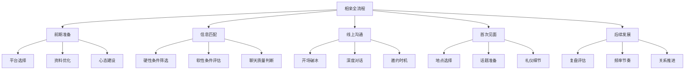
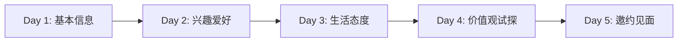
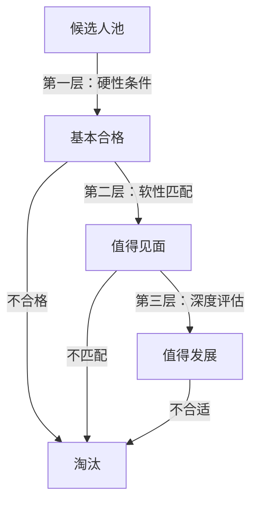

## 一、相亲策略

相亲的本质是一种**高效的信息匹配机制**——在有限的时间内，通过结构化的方式判断两个人是否有发展长期关系的可能性。与自然恋爱相比，相亲的优势在于目标明确、筛选高效；劣势在于初始信任低、容易被表面条件左右。

理解这个本质，才能在相亲过程中既不过度功利（只看条件），也不过度浪漫化（期待一见钟情）。相亲是认识人的**起点**，不是终点。

### 1.0 相亲的底层逻辑

在讨论具体策略之前，先理解相亲作为一种认识异性方式的底层逻辑，这决定了你在整个过程中的心态和决策框架。

#### 为什么相亲是高效的

从概率角度看，自然认识异性的途径（同事、朋友聚会、偶遇）存在严重的**样本偏差**——你接触到的人受限于你的社交圈、职业、活动范围。一个典型的都市白领，日常社交圈中适龄单身异性的数量通常不超过20人，其中让你有好感的可能只有2-3人，对方恰好也对你有好感的概率更低。

相亲机制通过**主动扩大样本量**来对冲这种概率劣势：

- 线上平台：一个月可以浏览数百个异性资料，深度沟通10-20人
- 线下活动：一次活动接触10-30人
- 熟人介绍：经过预筛选的高质量候选人

但高效不等于轻松。相亲需要你具备三种能力：**自我认知能力**（知道自己要什么）、**信息判断能力**（快速评估对方）、**社交表达能力**（有效展示自己）。

#### 相亲中的心理学原理

**首因效应（Primacy Effect）**：人们对最先接收到的信息印象最深刻。在相亲中，你的头像、开场白、前15分钟的见面表现，决定了对方对你的整体判断。这不是说后面不重要，而是说如果前面搞砸了，后面需要花数倍努力才能扭转。

**相似-互补原则**：研究表明，长期关系满意度与"核心价值观相似+能力互补"高度相关。相亲筛选时，应该关注价值观层面的匹配（对金钱、家庭、人生目标的态度），而非表面条件的匹配（收入、学历、身高）。

**选择过载（Choice Overload）**：心理学家Barry Schwartz在《选择的悖论》中指出，过多的选择反而会导致决策质量下降和满意度降低。在相亲平台上浏览过多资料，容易产生"下一个可能更好"的心态，导致永远在筛选而不做决定。应对策略是**设定明确的筛选标准并严格执行**，而不是无限浏览。

**曝光效应（Mere Exposure Effect）**：人们对反复接触的事物会产生好感。这就是为什么第一次见面感觉"还行"但不惊艳的人，可能在第二次、第三次见面后变得越来越有吸引力。不要仅凭一次见面就下结论。

### 1.1 相亲渠道全景

相亲渠道可以分为线上平台、线下活动、熟人介绍三大类。每种渠道有不同的适用场景和操作要点。选择渠道时需要考虑三个因素：**你的时间精力**（线上省时间但需要大量筛选，线下耗时间但信息密度高）、**你的社交能力**（内向者线上更有优势，外向者线下更容易发挥）、**你的目标明确程度**（目标越明确，越适合精准匹配的渠道）。

#### 线上婚恋平台

线上平台是目前最主流的相亲渠道。据统计，2024年中国在线婚恋市场规模超过80亿元，注册用户超过3亿人。平台的核心价值在于**扩大接触范围**——你可以在一个月内接触到过去一年都遇不到的异性数量。

**主流平台深度对比：**

| 平台 | 核心机制 | 用户画像 | 费用模式 | 优势 | 劣势 | 推荐指数 |
|------|----------|----------|----------|------|------|----------|
| 世纪佳缘 | 条件搜索+推荐 | 用户基数最大，年龄分布广 | 免费浏览+付费通信 | 选择多、覆盖面广 | 信息质量参差不齐，需大量筛选 | ★★★☆☆ |
| 百合网 | 实名认证+匹配算法 | 偏严肃婚恋，25-40岁为主 | 免费基础+会员制 | 线下门店背书，真实性较高 | 部分地区用户密度低 | ★★★★☆ |
| 珍爱网 | 红娘一对一+线下活动 | 愿意付费的认真用户 | 服务费制（较高） | 有人工筛选和撮合 | 价格高，部分红娘推销压力大 | ★★★★☆ |
| 探探 | 左滑右滑+地理位置 | 年轻用户（18-30岁） | 免费+超级喜欢 | 用户活跃，匹配快 | 偏向颜值驱动，目的混杂 | ★★☆☆☆ |
| Soul | 兴趣匹配+灵魂测试 | 注重精神交流的用户 | 免费为主 | 弱化外貌，强调内在 | 用户目的多样（不全是找对象） | ★★★☆☆ |
| 青藤之恋 | 学历认证（需学信网） | 本科及以上学历用户 | 会员制 | 用户质量高，信息真实 | 仅限高学历人群 | ★★★★☆ |
| MARRY U | 高端匹配+人工审核 | 高收入/高学历群体 | 高额服务费 | 用户质量极高 | 门槛高、费用高 | ★★★☆☆ |

**平台选择策略：**

1. **主力平台（1-2个）**：选择用户基数大、匹配机制合理的平台作为主阵地。建议百合网或珍爱网，因为这两个平台的用户婚恋目的更明确，筛选成本更低。
2. **辅助平台（1个）**：选择一个与主力平台定位不同的平台作为补充。例如主力用百合网，辅助用Soul——前者看条件匹配，后者看兴趣和性格。
3. **避免的平台**：以即时社交为主（如探探、陌陌），因为这些平台上"认真找对象"的用户比例偏低，投入产出比不高。

**付费策略：** 平台的免费功能通常足够你完成初步筛选。建议先用免费功能2-3周，确认平台用户质量和活跃度后再决定是否付费。付费时优先选择**通信功能**（如查看谁喜欢你、无限聊天），而非曝光功能（如置顶、超级曝光），因为后者带来的流量质量不可控。

**平台使用时间管理：**

| 时间段 | 操作 | 时长 |
|--------|------|------|
| 早上通勤 | 浏览新推荐，标记感兴趣的 | 10-15分钟 |
| 午休 | 回复消息，简单聊天 | 15-20分钟 |
| 晚上 | 深度聊天，安排见面 | 20-30分钟 |

每天总投入控制在**45-60分钟**。超过这个时间容易产生疲劳感和挫败感，反而降低效率。

#### 线下相亲活动

线下活动包括：婚介所组织的相亲会、单位/社区联谊、户外兴趣活动、读书会/运动社群等。

**线下活动的优势：**
- 一次活动可以接触10-30人，效率高
- 面对面交流能快速判断真实感（外貌、谈吐、气质）
- 有活动主题作为破冰话题，减少尴尬
- 观察对方在社交场景中的表现（是否大方、有礼貌、善于沟通）

**线下活动的劣势：**
- 地域限制明显
- 活动质量参差不齐
- 社恐人士压力大

**线下活动的类型与选择：**

| 活动类型 | 适合人群 | 优势 | 注意事项 |
|----------|----------|------|----------|
| 8分钟约会 | 外向、善于表达的人 | 短时间接触大量异性 | 时间太短，容易流于表面 |
| 兴趣主题聚会 | 有明确爱好的人 | 天然话题，自然破冰 | 不要只顾着做活动而忽略社交 |
| 户外运动（徒步/骑行） | 体能好、喜欢运动的人 | 长时间相处，观察真实状态 | 体力差距太大会影响体验 |
| 烹饪/手工工坊 | 细心、有耐心的人 | 合作完成任务，观察配合度 | 人数不宜太多，6-12人最佳 |
| 相亲角/婚介所 | 目标明确、时间紧迫的人 | 条件筛选精准 | 信息真实性需要额外验证 |

**参加线下活动的技巧：**
1. **提前到场**：早到10-15分钟，熟悉环境，调整状态
2. **主动社交**：不要坐在角落等别人来找你，主动加入聊天
3. **带一个朋友**：有熟人在场会放松很多，也能帮你观察
4. **目标适度**：一场活动能深入聊2-3个人就够了，不要贪多
5. **及时跟进**：活动结束后24小时内联系感兴趣的人，超过48小时基本凉了

#### 熟人介绍

熟人介绍（亲戚、朋友、同事牵线）是中国最传统也最可靠的相亲渠道。其核心优势是**信任前置**——介绍人本身就是一层信用背书。

**熟人介绍的质量取决于介绍人对你的了解程度。** 一个了解你性格、爱好、价值观的朋友，推荐的对象往往比平台算法更精准。因此，**主动经营你的"介绍人网络"**是一种高效的相亲策略：

- 告诉身边5-10个关系好的朋友，你目前在找对象，请他们帮忙留意
- 定期更新状态（比如最近换了工作、搬了城市），让介绍人有新信息可以匹配
- 对成功介绍的朋友给予感谢和反馈，维持关系

**熟人介绍的注意事项：**

1. **明确告知介绍人你的核心需求**：不要只说"帮我找个对象"，要具体——年龄范围、职业偏好、性格期望、绝对不能接受的条件。信息越具体，推荐越精准。
2. **管理介绍人的预期**：如果介绍的人不合适，礼貌地反馈原因，不要敷衍说"再看看"。长期敷衍会导致介绍人不再热心帮忙。
3. **不要拒绝所有安排**：即使某次介绍的对象你觉得不太合适，也建议见一面。介绍人看到的可能是你没注意到的匹配维度。
4. **感谢介绍人**：无论结果如何，都要表达感谢。如果是亲戚，逢年过节问候一声；如果是朋友，请吃顿饭。维持好关系，后续还会有机会。

### 1.2 个人资料优化

在相亲平台上，你的个人资料就是你的"产品包装"。数据显示，优化后的资料可以让主动打招呼的数量增加**3-5倍**。这不是教你造假，而是帮你更好地展示真实的自己。

#### 头像设计

头像是别人看到的第一个元素，直接决定了对方是否会点进你的资料。平台数据显示，**头像质量直接影响30-50%的点击率**。

**核心原则：**
- **清晰度**：至少1080×1080像素，不要用模糊或像素化的照片
- **真实感**：可以修图（调光线、去瑕疵），但不能改变五官和体型
- **亲和力**：微笑、眼神自然、姿态放松
- **质感**：背景干净、光线柔和、构图得当

**具体拍摄指南：**

| 要素 | 推荐做法 | 避免做法 |
|------|----------|----------|
| 景别 | 胸部以上或半身 | 全身照（会显得人小）、大头贴 |
| 角度 | 略微侧身15-30度，微俯拍 | 正面直拍、仰拍 |
| 表情 | 自然微笑，眼神看镜头 | 面无表情、夸张表情、嘟嘴 |
| 光线 | 自然光（窗边/户外阴天） | 顶光、侧光过强、闪光灯直射 |
| 背景 | 纯色墙、咖啡馆、书架 | 杂乱房间、厕所镜子 |
| 服装 | 纯色、合身、干净整洁 | 过于花哨、太随意（T恤+拖鞋） |

**拍摄技巧：**
- 找一面靠窗的白墙，自然光从侧面照过来
- 穿一件纯色（深蓝、灰色、白色）的合身衣服
- 请朋友用手机连拍30-50张，从中选最佳
- 后期只做基础调整：亮度、对比度、磨皮（保持自然）
- 可以用手机自带的人像模式，背景虚化效果很好

**头像测试方法：** 准备2-3张候选头像，分别在不同平台使用一周，统计每张头像带来的主动打招呼数量和匹配率。用数据说话，而不是凭感觉选。

#### 照片墙配置

除了头像，平台通常允许上传6-9张照片。照片墙的作用是**立体展示你的生活方式和性格**。

**推荐的照片组合（4-6张）：**

1. **生活场景照（1-2张）**：做饭、整理房间、遛狗、浇花——展示你有生活情趣和自理能力
2. **社交场景照（1张）**：与朋友聚餐、参加活动——展示你有正常的社交圈（注意：不要放与异性单独合影，容易引起误会）
3. **兴趣爱好照（1-2张）**：运动、旅行、读书、摄影、乐器——展示你的个人魅力和生活态度
4. **正装或工作照（1张）**：职业形象——展示你的专业性和上进心

**照片墙的节奏感：** 照片之间应该有"叙事感"——对方看完你的照片后，能大致拼出"这是一个什么样的人"。不要放6张都是自拍，也不要全是在同一个场景拍的。

**照片墙的常见错误：**
- **全是自拍**：让人觉得你没有社交生活
- **过度修图**：见面后落差太大，直接失去信任
- **照片太旧**：用3年前的照片，见面后对方觉得"货不对板"
- **照片太多人**：对方分不清哪个是你
- **照片质量参差不齐**：一张精修+五张随手拍，显得不认真

#### 个人简介撰写

个人简介是资料中最能体现个人特色的地方。好的简介应该让对方在30秒内产生"想了解更多"的冲动。

**结构公式：**

身份标签（一句话定位自己）
+ 
核心亮点（1-2个差异化优势）
+ 
生活状态（展示真实的日常）
+ 
期待方向（表达开放而非苛刻的期望）

**写法示例与对比：**

| 类型 | 示例 | 评价 |
|------|------|------|
| 差 | "热爱生活，积极向上，寻找另一半" | 空洞无物，像AI生成的 |
| 一般 | "28岁，程序员，喜欢跑步和看书" | 基本信息有了但没有记忆点 |
| 好 | "写代码的，但不宅。周末要么在公园跑步，要么在厨房研究新菜。最近在学吉他，能弹《小星星》的程度。希望遇到一个能一起探索城市角落的人。" | 有画面感、有幽默感、有具体细节 |

**写作要点：**
- **具体化**：不要说"喜欢旅行"，说"去年一个人去了青海湖，被日出震撼到了"
- **有温度**：不要像写简历，要有情感和态度
- **留钩子**：给对方留下可以接话的点（"最近在学吉他"→"学了多久了？"）
- **避免负面清单**：不要写"不接受XX""不找XX"——负面内容会大幅降低好感度
- **控制长度**：100-200字为宜，太长没人看，太短没信息量

**不同性别的写作侧重：**

| 维度 | 男性侧重 | 女性侧重 |
|------|----------|----------|
| 核心展示 | 责任感、上进心、生活能力 | 独立性、温柔、生活情趣 |
| 避免展示 | 炫富、过度自夸 | 过度强调物质条件 |
| 好的细节 | "周末会给自己做顿饭""养了一只猫" | "最近在学油画""喜欢逛菜市场" |
| 期待表达 | "希望找到能一起努力的人" | "期待遇到聊得来的人" |

#### 筛选条件设置

平台的筛选条件是一把双刃剑——设置太严会错过合适的人，设置太宽会增加筛选成本。

**推荐的筛选策略：**

| 条件 | 建议范围 | 理由 |
|------|----------|------|
| 年龄 | ±5岁（根据自身年龄调整） | 年龄差过大，生活阶段和话题差异大 |
| 身高 | 不设硬性限制 | 身高对长期关系质量影响极小 |
| 学历 | 大专及以上（或比自己低一级以内） | 学历差距过大可能导致认知差异 |
| 地域 | 同城或车程2小时以内 | 异地恋成功率极低，见面成本高 |
| 收入 | 不设限或设下限 | 收入可以变化，能力和态度更重要 |
| 婚史 | 根据个人接受度 | 这是硬性偏好，没有对错 |

**关键原则：** 筛选条件是动态的。如果第一周设置了严格条件后发现匹配人数太少，逐步放宽。优先放宽"看起来重要但实际不影响长期关系"的条件（如身高、收入），保持"真正影响相处质量"的条件（如地域、婚育意愿）。

### 1.3 线上沟通策略

从匹配到见面，中间的线上沟通阶段至关重要。这个阶段的目标不是"聊天"，而是**快速判断是否值得见面**。

#### 开场白设计

数据显示，**个性化开场白的回复率是"你好""在吗"的3-5倍**。好的开场白应该让对方觉得"这个人看了我的资料，而且有话可说"。

**开场白公式：**

[从对方资料中找到的具体细节]
+ 
[你的相关经历或看法]
+ 
[一个开放式问题]

**示例对比：**

| 开场白 | 效果分析 |
|--------|----------|
| "你好，可以认识一下吗？" | 模板化，回复率低 |
| "看了你的资料，你也喜欢跑步？" | 比上面好，但问题太封闭（只能回是/否） |
| "看到你跑了半马，太厉害了！我最近刚开始跑，5公里还喘得不行。你一般在哪里跑？" | 有赞美、有自嘲、有具体问题，回复率高 |

**开场白的注意事项：**
- 不要群发同一段话——平台可能会限流，而且如果两个匹配对象互相认识会很尴尬
- 不要一上来就问收入、房产、家庭情况——太功利
- 不要发"在干嘛"——没有任何信息量
- 如果对方资料写得很少，可以从照片入手（"看你照片里背景是XX，你去过那里吗？"）

**不同类型资料的开场策略：**

| 对方资料特点 | 开场策略 | 示例 |
|-------------|----------|------|
| 资料丰富、有详细简介 | 从简介中的具体细节切入 | "你说在学烘焙，最近做了什么？我上次烤了个面包，硬得能砸核桃" |
| 资料简单、只有基本信息 | 从照片中的场景切入 | "看你照片里背景像是在成都？我去过一次，火锅太辣了" |
| 资料有明确的兴趣标签 | 从共同兴趣切入 | "看到你也喜欢悬疑小说，最近看了《xxx》吗？" |
| 资料几乎空白 | 用轻松的方式打破沉默 | "你的资料太神秘了，让我好奇心拉满。能透露一个关于你的有趣事实吗？" |

#### 聊天节奏与深度

线上聊天的目标是在**3-5天内判断是否值得见面**。拖太久会变成"网聊"，消耗精力且容易产生不切实际的想象。

**聊天推进节奏：**

| 阶段 | 天数 | 聊天内容 | 目标 |
|------|------|----------|------|
| 基础信息交换 | 第1天 | 工作、居住地、日常安排 | 确认基本信息真实性 |
| 兴趣探索 | 第2天 | 爱好、最近在看的剧/书、喜欢的美食 | 寻找共同话题 |
| 生活态度 | 第3天 | 周末怎么过、对加班的看法、养宠物吗 | 判断生活方式是否兼容 |
| 价值观试探 | 第4天 | 对未来的规划、对家庭的看法、消费观 | 判断核心价值观是否一致 |
| 邀约 | 第5天 | 提出见面 | 线上聊天无法替代见面 |

**聊天中的关键技巧——话题延伸法：**

好的聊天不是一问一答，而是像打乒乓球一样有来有回。当对方说了一句话，你可以用"回应+分享+提问"的方式延伸：

对方："我周末一般去爬山。"

❌ 不好的回应："哦，挺好的。"（死胡同）

✅ 好的回应："爬山好啊！我上次去XX山，爬到一半腿软了😂 
你一般去哪座山？有没有推荐的新手路线？"
（回应对方→分享自己的经历→提出新问题）

**关键判断指标——什么时候该放弃聊天：**

- **回复频率**：如果对方每次回复间隔超过24小时，且没有解释原因，说明兴趣不大
- **回复质量**：如果对方只用"嗯""哈哈""还行"回复，没有主动延伸话题，说明兴趣不大
- **主动性**：如果从不主动发消息，只有你发起对话才有回应，说明兴趣不大
- **信息量**：如果聊了3天你对对方还是一无所知（对方只回答不分享），说明要么没兴趣，要么有隐瞒

**什么时候应该推进到见面：**
- 双方每天有2-3轮有质量的对话
- 对方会主动发起话题或提问
- 聊天中有自然的玩笑和互动
- 已经交换了微信或其他联系方式

#### 邀约话术

邀约是线上到线下的关键转折点。邀约的时机和方式直接影响成功率。

**邀约时机判断：**
- 聊天3-5天后，双方有了一定了解
- 对方回复积极、主动
- 你们已经找到了共同兴趣（方便选见面活动）

**邀约话术示例：**

轻松版："聊了这么多天，感觉你比我打字更有意思😂 这周末要不要出来喝杯咖啡？
我请你。"

兴趣版："你之前说喜欢日料，我知道一家新开的很不错，周六下午有空吗？"

直接版："我觉得线上聊不如见面聊，这周找个时间出来坐坐？"

**邀约注意事项：**
- **给选择题，不给开放题**：不要问"你什么时候有空"，要问"周六下午或周日中午，哪个方便？"
- **提出具体活动**：不要只说"出来坐坐"，要给出具体方案（"去XX咖啡馆""去逛XX展览"）
- **降低对方压力**：用"喝杯咖啡""吃个便饭"而不是"正式约个晚餐"
- **被拒绝时**：如果对方说"最近忙"但没有给替代时间，大概率是婉拒。礼貌回应"好的，有空再约"即可，不要追问

### 1.4 首次见面策略

第一次见面是相亲中最关键的环节。数据显示，**70%的"不合适"判断在首次见面的前15分钟就已经形成**。这15分钟的印象管理至关重要。

#### 见面地点选择

地点选择的原则是：**便于交流、便于离开、成本适中**。

| 地点类型 | 推荐度 | 适合场景 | 注意事项 |
|----------|--------|----------|----------|
| 咖啡馆 | ★★★★★ | 首次见面首选 | 选安静的角落位置，避免高峰期 |
| 茶馆 | ★★★★☆ | 偏正式的见面 | 环境通常更安静，适合聊天 |
| 公园/景点 | ★★★☆☆ | 天气好时的户外选择 | 走路时不好深入聊天 |
| 餐厅 | ★★★☆☆ | 饭点见面 | 首次见面不宜太正式，吃东西会分散注意力 |
| 电影院 | ★★☆☆☆ | 不推荐首次见面 | 两小时不说话，浪费了交流机会 |
| KTV/酒吧 | ★☆☆☆☆ | 不推荐 | 环境不适合了解对方 |

**选择地点的实操建议：**
- 选你熟悉的地方——你知道环境、知道菜单、知道洗手间在哪，会更从容
- 选交通便利的地方——双方都方便到达
- 选可以控制时长的地方——咖啡馆随时可以走，餐厅要等上菜买单
- 提前踩点或看点评——确保环境、价格、位置都合适

**进阶选择——根据对方特点选地点：**

| 对方特点 | 推荐地点 | 原因 |
|----------|----------|------|
| 文艺型 | 独立书店咖啡馆、美术馆附近 | 环境契合，容易产生共鸣 |
| 活泼型 | 有特色的餐厅、手作工坊 | 互动性强，不会无聊 |
| 安静型 | 环境好的茶馆、安静的咖啡馆 | 减少干扰，便于深入交流 |
| 运动型 | 公园散步+咖啡馆 | 先走走放松，再坐下来聊 |

#### 见面前的准备

**外在准备：**
- **着装**：干净整洁、合身得体。不需要名牌，但需要干净、熨平、搭配合理
- **个人卫生**：洗头、剪指甲、清新口气、适度香水（宁可不用也不要喷太多）
- **时间**：提前5-10分钟到。迟到是大忌，太早到又显得紧张

**着装的具体建议：**

| 性别 | 推荐 | 避免 |
|------|------|------|
| 男性 | 纯色衬衫/Polo衫+合身长裤+干净的休闲鞋 | 西装太正式、T恤+拖鞋太随意、花哨图案 |
| 女性 | 简约连衣裙/针织衫+半裙+平底或低跟鞋 | 过于暴露、太高跟的鞋（走路不方便）、浓妆 |

**核心原则：比平时稍微正式一点就好。** 如果你平时穿T恤牛仔裤，见面时穿一件干净的衬衫就够了。不要突然穿西装，那样会显得不自然。

**内在准备：**
- **话题准备**：提前想3-5个可以聊的话题（工作、兴趣、最近看的剧、旅行经历）
- **心态准备**：告诉自己"这只是一次聊天，不是面试"。把期待值降到"认识一个新朋友"，而非"找到未来伴侣"
- **退出准备**：想好如果感觉不合适，如何礼貌地结束（"我下午还有点事，今天先聊到这？"）

**话题准备清单（按优先级排序）：**

| 优先级 | 话题 | 为什么好 | 举例 |
|--------|------|----------|------|
| 高 | 对方资料中提到的内容 | 表示你认真看了资料 | "看你资料说喜欢烘焙，最近做了什么？" |
| 高 | 轻松的日常话题 | 不敏感，容易展开 | "你周末一般怎么过？" |
| 中 | 旅行和美食 | 大多数人都有兴趣 | "你去过最喜欢的城市是哪个？" |
| 中 | 最近的影视/书/综艺 | 有共同话题就多聊 | "最近有看什么好剧吗？" |
| 低 | 工作 | 可以聊但不要占太多时间 | "你是做XX的？这个行业有意思吗？" |

**绝对不要在首次见面聊的话题：**
- 收入、房产、存款（太功利）
- 前任（无论好坏都不合适）
- 政治、宗教等敏感话题（容易起冲突）
- 家庭矛盾（太沉重）
- 对相亲的抱怨（负能量）

#### 见面中的表现

**行为层面：**

| 做 | 不做 |
|------|------|
| 主动打招呼、微笑 | 进来就低头看手机 |
| 保持适度眼神交流 | 一直盯着对方看（会让人不适） |
| 身体微微前倾（表示感兴趣） | 双臂交叉抱胸（防御姿态） |
| 认真听对方说话，适时回应 | 对方说话时打断或看手机 |
| 主动买单或提出AA | 等对方买单或假装没看到账单 |
| 聊天结束后送对方到地铁/车站 | 聊完就走，不顾对方 |

**聊天内容层面：**

| 阶段 | 话题建议 | 时间占比 |
|------|----------|----------|
| 热身（0-10分钟） | 到达过程、天气、环境评价 | 15% |
| 了解（10-40分钟） | 工作、日常、兴趣爱好 | 50% |
| 深入（40-60分钟） | 生活态度、未来规划、价值观 | 30% |
| 收尾（最后5-10分钟） | 总结感受、后续安排 | 5% |

**关键技巧——提问的艺术：**

好的提问不是审问，而是引导对方自然地展示自己。

封闭式问题（避免）："你喜欢旅游吗？" → "喜欢。"（冷场）

开放式问题（推荐）："如果有一周假期，你最想去哪里？" 
→ 对方需要展开描述，你能从中了解很多信息

**值得在首次见面中了解的关键问题（不要直接问，要通过聊天自然带出来）：**
- 对工作的态度（是否稳定、是否有上进心）
- 对家庭的看法（与父母的关系、对未来家庭的期望）
- 消费观（是否月光、对金钱的态度）
- 生活习惯（作息、饮食、运动）
- 情绪管理方式（遇到压力怎么办、遇到冲突怎么处理）

**如何自然地带出敏感话题：**

| 你想了解的 | 不要这样问 | 可以这样聊 |
|-----------|-----------|-----------|
| 收入/经济状况 | "你一个月挣多少？" | "你这个行业最近怎么样？听说XX方向发展不错" |
| 家庭情况 | "你家里什么条件？" | "你平时跟家里联系多吗？过年一般怎么过？" |
| 婚育意愿 | "你打算什么时候结婚？" | "你觉得什么样的生活状态适合考虑成家？" |
| 过去的感情 | "你谈过几次恋爱？" | "你觉得在感情里最重要的是什么？" |

#### 见面后的跟进

**24小时内行动：**

1. **如果你有意向**：发一条消息，表达今天聊得很开心，可以具体提一个你们聊到的话题（"你说的那个XX，我回来查了一下，确实很有意思"）
2. **如果你没有意向**：也要发一条感谢消息（"今天谢谢你出来，聊得挺开心的。不过我感觉我们可能不太合适，祝你早日找到对的人"）。不要ghost（突然消失不回复），这是最不礼貌的做法
3. **如果你不确定**：可以再约一次。第一次见面紧张在所难免，有些人需要第二次才能展现真实的自己

**第二次见面的策略：**
- 换一个场景（第一次喝咖啡，第二次可以一起吃饭或看展览）
- 时间可以更长一些（1.5-2小时）
- 话题可以更深入（成长经历、对未来的规划）
- 观察对方在不同场景下的表现是否一致

### 1.5 相亲筛选体系

面对众多候选人，你需要一套系统化的筛选框架，避免"感觉不对"这种模糊判断导致错过好对象，或者"条件很好"这种表面判断导致进入不合适的关系。

#### 三层筛选模型

**第一层：硬性条件筛选（在线上完成）**

硬性条件是你绝对不能妥协的底线。每个人不同，但常见的硬性条件包括：

| 条件 | 说明 | 判断方式 |
|------|------|----------|
| 年龄范围 | 你接受的年龄区间 | 资料直接查看 |
| 地理位置 | 必须同城或邻近 | 资料查看+聊天确认 |
| 婚育意愿 | 是否想要孩子、要几个 | 聊天中自然带出 |
| 婚姻状态 | 未婚/离异/有孩子 | 资料查看+聊天确认 |
| 基本价值观 | 对一些核心问题的态度 | 聊天中试探 |

**注意：** 硬性条件不宜超过3-4条。条件越多，可选范围越小。

**第二层：软性条件评估（通过聊天完成）**

软性条件是可以灵活调整的，它们决定了你们的"匹配度"：

- **聊天舒适度**：和对方聊天是否自然、轻松、有来有回
- **兴趣重合度**：是否有共同话题和兴趣爱好
- **生活节奏匹配**：作息、消费习惯、社交频率是否接近
- **沟通风格兼容**：对方的表达方式是否让你舒服

**关键原则：** 软性条件不能只看表面。有些人第一次聊天很紧张，表现不出真实的自己。给2-3次聊天机会再做判断。

**第三层：深度评估（通过见面完成）**

见面后，重点评估以下几个维度：

| 维度 | 观察要点 | 权重 |
|------|----------|------|
| 真实性 | 照片与真人是否一致、言行是否一致 | 高 |
| 情绪稳定性 | 是否易怒、是否过度焦虑、情绪表达是否健康 | 高 |
| 价值观 | 对金钱、家庭、事业的态度 | 高 |
| 生活能力 | 是否有基本的自理能力、是否有稳定的生活状态 | 中 |
| 成长潜力 | 是否有上进心、是否愿意学习和改变 | 中 |
| 外在吸引力 | 是否让你有"想靠近"的感觉 | 中 |

**评估维度的权重说明：**

为什么"真实性"和"情绪稳定性"的权重最高？因为这两个维度决定了关系的**基础安全**。一个不真实的人，你永远不知道对方的哪句话是真的；一个情绪不稳定的人，日常相处会消耗大量精力。相比之下，收入、外貌等表面条件虽然直观，但对长期关系满意度的预测力远低于上述维度。

研究者John Gottman的婚姻研究发现，**情绪稳定性和冲突处理方式**是预测关系质量最强的两个因素，远超经济条件、外貌吸引力等表面指标。

#### 相亲中的"红旗"与"绿旗"

**红旗（遇到立刻警惕）：**

- 第一次聊天就过度热情（"你是我见过最特别的人"）
- 回避所有关于工作、家庭、过去的具体问题
- 频繁借钱或暗示经济困难
- 要求过早见面或过快推进关系
- 说话前后矛盾（关于年龄、职业、婚史等基本信息）
- 对前任极度贬低或极度美化
- 控制欲过强（要求你秒回消息、汇报行踪）
- 涉及赌博、传销、投资理财等敏感话题

**红旗的判断原则：** 不要因为对方条件好就忽略红旗。一个红旗可能是巧合，两个红旗就是模式，三个红旗就是定性。

**绿旗（加分项）：**

- 说话算话，答应的事会做到
- 尊重你的边界（你表示不想聊某个话题时会转移）
- 对服务人员有礼貌（这是判断人品的重要指标）
- 有稳定的朋友圈和家庭关系
- 能坦然谈论自己的缺点
- 有独立的兴趣爱好和生活

**绿旗的价值：** 绿旗比红旗更值得关注。很多人在相亲中过度关注"有没有红旗"，而忽略了"有没有绿旗"。一个没有红旗但也没有绿旗的人，可能是一个"安全但无趣"的选择；而一个有多个绿旗的人，往往是一个值得深入了解的人。

### 1.6 家庭安排的相亲应对

在中国，很多相亲是父母或亲戚安排的。这类相亲有其特殊性——你可能并不完全了解对方，介绍人可能只看条件不看性格，而且拒绝时还要顾及介绍人的面子。

#### 接受安排前的准备

1. **向介绍人了解基本信息**：年龄、工作、学历、家庭情况、为什么单身
2. **获取对方照片**：提前看一下，避免见面时的落差太大
3. **明确自己的底线**：有哪些条件是绝对不能接受的，提前告诉介绍人
4. **心理建设**：不要带着"被安排"的抵触情绪去见面，抵触情绪会影响你的表现和判断

**如何与父母沟通相亲期望：**

父母安排相亲时最常见的矛盾是**标准差异**——父母看重条件（工作稳定、家庭背景），你看重感觉（聊得来、三观合）。解决这个矛盾的关键是**找到共同语言**：

❌ 不好的沟通方式：
"你们不懂，我要找的是感觉！"
（父母会理解为"你太挑""你太理想化"）

✅ 好好的沟通方式：
"爸妈，我知道你们希望我找个条件好的，我也是。
但除了条件，我也看重性格和沟通方式。
我需要你们帮我把关条件，性格我自己来看。"
（既认可了父母的价值，又表达了自己的需求）

#### 见面中的策略

- **把介绍人的安排当作一次普通的社交**：不要想太多，就是去认识一个新朋友
- **不要因为是父母安排就降低标准**：你有权利说"不合适"
- **也不要因为是父母安排就提高标准**：带着挑刺的心态去，谁都入不了你的眼
- **注意观察对方是否也是被安排的**：如果对方也带着抵触情绪，可以坦诚聊开，反而会轻松很多

#### 拒绝的技巧

如果见面后觉得不合适，需要通过介绍人传达拒绝。关键是**既明确又体面**：

对介绍人说：
"谢谢您的安排，XX人挺好的。不过我们聊天感觉不太合适，
可能性格上不太匹配。麻烦您帮我转达一下感谢。"

不要说：
- "他/她条件不行"（伤害对方自尊）
- "我再考虑考虑"（给人虚假希望）
- "完全不行"（太生硬）

**被安排多次后的应对：** 如果父母频繁安排相亲，你需要设定边界但不能对抗：

- **设定频率上限**："妈，我每月见1-2个人可以，但每周都见我精力跟不上"
- **给父母反馈**：每次见面后简要告诉父母结果和原因，让他们了解你的标准
- **展示你的主动性**：如果你自己也在通过其他渠道找对象，告诉父母，减少他们的焦虑

### 1.7 心态管理与节奏控制

相亲是一个概率游戏。数据显示，平均需要**见10-15个人**才能找到一个值得认真交往的对象。这意味着你会经历大量的"不合适"，心态管理至关重要。

#### 常见心态问题与应对

| 心态问题 | 表现 | 应对方法 |
|----------|------|----------|
| 焦虑感 | "怎么还没找到""是不是我要求太高" | 记住：质量比速度重要。宁缺毋滥 |
| 疲惫感 | "不想再聊了""见谁都一样" | 暂停1-2周，休息后再继续 |
| 自我怀疑 | "是不是我不够好""我配不上好的" | 相亲被拒不代表你不好，只是不匹配 |
| 比较心态 | "别人都结婚了""朋友对象条件多好" | 每个人的节奏不同，比较没有意义 |
| 急于求成 | "这个人差不多就行了" | 勉强进入的关系大概率会出问题 |

**心态问题的深层原因：** 很多相亲中的心态问题，根源不在于相亲本身，而在于**自我价值感不足**。如果你把自己的价值与"是否找到对象"绑定，那么每一次拒绝都会打击你的自信。

解决方案是**建立独立于婚恋状态之外的自我价值感**：
- 保持工作的投入和成就感
- 维持自己的社交圈和兴趣爱好
- 定期运动，保持身体健康
- 记住：你是一个完整的人，不是"待售的商品"

#### 相亲频率建议

| 阶段 | 建议频率 | 理由 |
|------|----------|------|
| 刚开始（第1-2月） | 每周1-2次见面 | 广泛接触，建立参考系 |
| 中期（第3-6月） | 每1-2周1次见面 | 有了经验后更精准筛选 |
| 后期（6个月以上） | 有合适的人才见面 | 不为了相亲而相亲 |

**重要原则：** 不要把所有精力都放在相亲上。保持正常的工作、社交、兴趣爱好，相亲只是生活的一部分。

### 1.8 相亲中的安全防范

相亲场景中存在一些常见的骗局和风险，需要提前了解并做好防范。

#### 常见骗局类型

| 骗局类型 | 特征 | 防范方法 |
|----------|------|----------|
| 酒托/饭托 | 约你去特定消费场所，消费极高 | 首次见面由你选地点，不去对方指定的陌生场所 |
| 投资诈骗 | 聊天中频繁提投资、理财、加密货币 | 任何涉及金钱的请求一律拒绝 |
| 感情诈骗 | 确立关系后编造理由借钱 | 确立关系初期不发生金钱往来 |
| 虚假身份 | 年龄、职业、婚史造假 | 通过多个渠道交叉验证信息 |
| 婚托 | 婚介所安排的"托"，见一面就没下文 | 选择正规平台，警惕过于完美的人 |
| 杀猪盘 | 通过社交平台建立感情后引导投资 | 任何涉及"带你在XX平台赚钱"的一律拒绝 |

**识别"杀猪盘"的关键信号：**
1. 对方条件远好于你的预期（过于完美的资料）
2. 聊天中频繁提到"投资""理财""副业""带你赚钱"
3. 要求你下载某个特定的投资App或注册某个平台
4. 催促你快速投入资金，制造紧迫感
5. 初期会给你一些小回报建立信任，然后引导大额投入

#### 安全守则

1. **首次见面选公共场所**：咖啡馆、餐厅、商场。不要去对方家里或偏僻的地方
2. **告知朋友你的行程**：告诉一个朋友你去哪、见谁、大概几点回来
3. **不泄露过多个人信息**：首次见面不要告知家庭住址、工作单位具体地址
4. **自己安排交通**：自己去、自己回。不要让对方来接你（尤其是前几次）
5. **保护财务安全**：不借钱、不投资、不扫码、不点对方发的链接
6. **相信直觉**：如果感觉不对，随时可以离开。不需要解释，安全第一

### 1.9 从相亲到恋爱的过渡

相亲成功不是"找到人了"，而是"开始了解了"。从相亲对象到真正的情侣，需要经历一个过渡期。

#### 过渡期的关键任务

1. **增加见面频率**：从相亲时的每周一次，逐步增加到每周2-3次
2. **拓展相处场景**：不只在咖啡馆聊天，一起做饭、运动、见朋友、参加活动
3. **逐步深入话题**：从兴趣爱好到家庭背景、成长经历、内心世界
4. **观察真实状态**：看对方在疲惫、压力、冲突时的表现，而不仅是约会时的"表演状态"
5. **明确关系定义**：在合适的时机（通常1-2个月后），坦诚讨论"我们现在是什么关系"

**过渡期的场景拓展建议：**

| 场景 | 观察重点 | 建议时间 |
|------|----------|----------|
| 一起做饭 | 合作能力、生活习惯、卫生标准 | 第2-3周 |
| 一起运动 | 体能、毅力、是否愿意共同健康生活 | 第3-4周 |
| 见对方的朋友 | 社交圈质量、朋友对TA的评价 | 第4-6周 |
| 一起旅行（短途） | 应变能力、消费观、长时间相处的舒适度 | 第6-8周 |
| 遇到小矛盾 | 冲突处理方式、情绪管理、沟通能力 | 自然发生 |

**为什么要一起旅行？** 旅行是检验关系的"压力测试"。在旅途中，你们需要共同做决策（去哪吃、怎么走）、处理意外（航班延误、天气不好）、长时间相处（24小时在一起）。这些场景能暴露出日常约会中看不到的真实状态。

#### 常见的过渡期陷阱

- **过度投入**：刚认识就每天联系、频繁送礼物、把对方当作生活的全部
- **忽视红旗**：因为"条件好"而忽略对方性格上的明显问题
- **比较心态**：拿相亲对象和前任比较
- **外部压力**：因为父母催促而加速推进关系

### 1.10 相亲的复盘与迭代

每次相亲后花10分钟做一次简单复盘，可以大幅提升后续的效率。

**复盘模板：**

日期：
对方基本情况：
见面时长：
第一印象（1-10分）：
聊得最好的话题：
感觉不舒服的地方：
是否有继续了解的意愿（是/否/待定）：
这次相亲学到了什么：
下次可以改进的地方：

**复盘的进阶用法：**

经过5-10次复盘后，回顾所有记录，你会开始发现一些模式：

- **你最看重的维度是什么？** 不是你以为的那个，而是你实际拒绝人时用的那个
- **你的舒适区在哪里？** 你和什么类型的人聊得最开心
- **你的薄弱环节是什么？** 是开场白、是话题深度、还是邀约时机

这些发现比任何相亲攻略都更有价值，因为它们来自你自己的真实数据。

通过持续复盘，你会越来越清楚自己真正看重什么、什么样的人适合自己、自己在相亲中有哪些可以改进的地方。相亲能力是可以习得的，每一次"不合适"都在帮你缩小范围、逼近正确答案。

### 1.11 常见误区与纠正

| 误区 | 为什么是错的 | 正确做法 |
|------|-------------|----------|
| "条件好就行，感觉可以慢慢培养" | 核心价值观不合，再好的条件也无法弥补 | 条件是门槛，但感觉和价值观同样重要 |
| "第一次见面没心动就是不喜欢" | 首次见面紧张在所难免，心动需要时间 | 给2-3次见面机会，除非有明确的红旗 |
| "我要找一个完美的人" | 没有完美的人，只有合适的人 | 明确3-4个核心条件，其他方面保持弹性 |
| "相亲太功利了，我要自然认识" | 自然认识的渠道有限，相亲只是扩大样本 | 两种方式并行，不要把相亲当成唯一途径 |
| "我条件这么好，为什么找不到" | 条件好不等于适合，而且你的展示方式可能有问题 | 优化资料展示，反思沟通方式 |
| "对方不秒回就是不喜欢我" | 每个人的聊天习惯不同，秒回不能作为判断标准 | 关注回复质量而非速度 |
| "相亲就是看条件，不需要聊" | 条件只是筛选工具，真正决定关系质量的是沟通和价值观 | 认真对待每一次聊天和见面 |
| "我年纪大了，只能将就" | 年龄不是将就的理由，勉强进入的关系不会幸福 | 提升自己的同时保持标准 |
