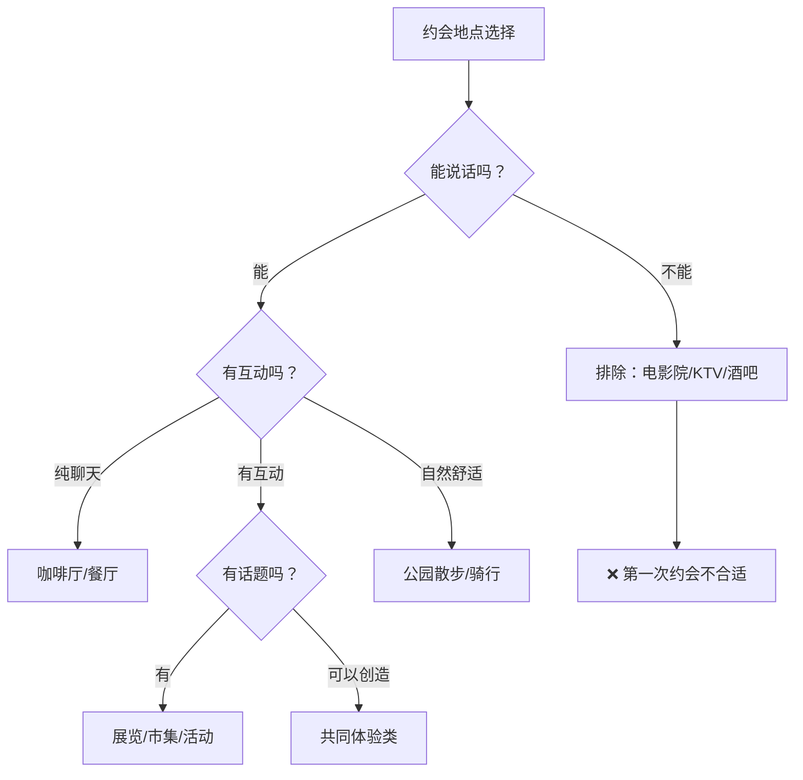
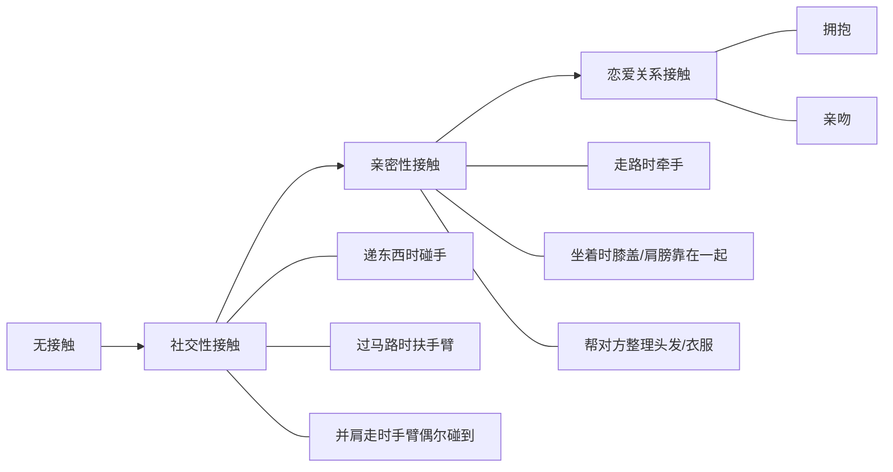

## 二、约会策略

约会不是随机事件，而是一场有策略的社交互动。好的约会策略能让你在有限的时间内最大化展示个人魅力、建立情感连接，并为后续关系发展奠定基础。本章将从第一次约会的完整筹备，到后续约会的关系推进，再到表白与关系确认，系统性地拆解约会的每一个环节。

### 2.1 约会的本质：从社交心理学理解约会

在讨论具体策略之前，先理解约会到底在做什么。约会的本质是一场**双向评估**——你在评估对方是否适合你，对方也在评估你。这个评估过程涉及三个核心维度：

| 维度 | 内容 | 权重 |
|------|------|------|
| **外在吸引力** | 外貌、穿着、体态、气质 | 30%（首次约会） |
| **内在吸引力** | 性格、价值观、幽默感、谈吐 | 40%（首次约会） |
| **互动质量** | 沟通流畅度、舒适感、化学反应 | 30%（首次约会） |

随着约会次数增加，内在吸引力和互动质量的权重会逐渐上升，外在吸引力的权重下降。这就是为什么很多人"越处越喜欢"或"越处越无感"——后续约会的权重结构变了。

**关键认知**：约会不是面试，不需要完美表现。约会的目的是**让双方都感到舒服**，在舒适的状态下自然展现真实的自己。刻意表演反而会让对方感到不真实。

### 2.2 第一次约会：完整攻略

#### 2.2.1 约会前的信息准备

第一次约会前的信息收集不是"调查"对方，而是为了找到双方的**共鸣点**，让约会过程更顺畅。

**从聊天记录中提取关键信息：**

- **兴趣爱好**：她喜欢什么？最近在追什么剧/书/游戏？——这是选约会地点和话题的核心依据
- **饮食偏好**：有没有忌口？喜欢什么菜系？——直接影响餐厅选择
- **作息习惯**：周末通常几点起？喜欢白天还是晚上活动？——决定约会时间
- **社交风格**：是外向活泼还是安静内敛？——决定约会形式（多人还是独处）
- **最近的状态**：工作忙不忙？心情如何？——决定约会强度

**实操模板——约会前信息清单：**

对方基本信息：
- 名字/昵称：
- 兴趣爱好：______（至少3个）
- 饮食偏好/忌口：
- 社交风格：外向型 / 内向型 / 混合型
- 最近关注的话题：
- 可能的雷区：

约会规划：
- 时间：
- 地点：主选______ 备选______
- 话题准备：3-5个
- 穿搭方案：

#### 2.2.2 约会地点选择的底层逻辑

选地点不是选"最好的地方"，而是选"最适合的地方"。合适的约会地点需要满足以下条件：

**第一类：经典社交型（适合内向型/初次见面）**

| 地点 | 优势 | 劣势 | 适合时长 | 预算参考 |
|------|------|------|----------|----------|
| 咖啡厅 | 安静、可控、随时可退 | 话题单一、氛围平淡 | 1-1.5小时 | 50-100元 |
| 甜品店 | 轻松、女性友好 | 不适合正餐时段 | 40分钟-1小时 | 40-80元 |
| 茶馆 | 文化氛围、安静 | 年轻人可能不感兴趣 | 1-1.5小时 | 80-150元 |

**第二类：体验互动型（适合外向型/有共同兴趣）**

| 地点 | 优势 | 劣势 | 适合时长 | 预算参考 |
|------|------|------|----------|----------|
| 展览/博物馆 | 话题丰富、文化感 | 需要双方都感兴趣 | 1.5-2小时 | 0-100元 |
| 市集/夜市 | 氛围轻松、选择多 | 人多嘈杂 | 1-2小时 | 50-150元 |
| 手作体验（陶艺/烘焙） | 互动性强、有共同产出 | 价格较高 | 1.5-2小时 | 150-300元 |
| 密室逃脱/剧本杀 | 趣味性强、能观察性格 | 第一次可能太紧张 | 1.5-2小时 | 80-200元 |

**第三类：自然户外型（适合双方都外向/有运动习惯）**

| 地点 | 优势 | 劣势 | 适合时长 | 预算参考 |
|------|------|------|----------|----------|
| 公园散步 | 免费、自然、无压力 | 天气依赖、单调 | 1-1.5小时 | 0-20元 |
| 骑行/徒步 | 运动感、共同目标 | 体力要求、出汗 | 2-3小时 | 0-50元 |
| 植物园/动物园 | 话题丰富、趣味性 | 门票+时间成本 | 2-3小时 | 50-150元 |

**绝对避免的地点：**

- **电影院**：第一次约会的核心目的是交流了解，电影院全程沉默，等于浪费了一次宝贵的沟通机会。如果对方提议看电影，可以说"看完电影可以一起去吃个饭聊聊"
- **KTV/酒吧**：太吵闹，而且酒精会模糊判断力，第一次约会需要清醒的头脑
- **家里**：太私密，会让对方感到不安全，也会传递错误信号
- **太贵的餐厅**：人均超过300元的餐厅会在第一次约会时制造压力——对方会觉得"欠你什么"，也会怀疑你的消费观念
- **对方完全不熟悉的区域**：让对方跑很远或去陌生地方，会增加焦虑感

**针对中国城市的特殊建议：**

- **一线城市**（北上广深）：商圈选择多，但要避开高峰期（周末下午2-5点商场人最多），优先选择有独立空间的店铺
- **二三线城市**：选择相对有限，可以优先选择当地特色场所（古镇、湖边、特色街区）
- **夏季**：避免长时间户外，优先选择室内有空调的地方，或者傍晚/夜间活动
- **冬季**：避免公园散步（太冷），优先选择温暖的室内场所

#### 2.2.3 形象准备：细节决定第一印象

心理学中的**首因效应**（Primacy Effect）表明，人们在最初几秒内形成的印象会持续影响后续所有互动。第一次约会的形象准备，核心原则是"得体"而非"惊艳"。

**穿搭策略：**

| 场景 | 男性建议 | 女性建议 |
|------|----------|----------|
| 咖啡厅/餐厅 | 合身衬衫或简约T恤+休闲裤+干净皮鞋/板鞋 | 简约连衣裙或上衣+半裙+平底鞋/小跟鞋 |
| 户外活动 | 运动风但不邋遢，合身卫衣+运动裤+运动鞋 | 舒适休闲风，运动鞋为主 |
| 展览/文化场所 | 偏文艺或简约，针织衫+牛仔裤+帆布鞋 | 文艺风，针织衫+半裙+平底鞋 |

**形象检查清单：**

- 头发：干净、不油腻，提前一天洗头。男性如果需要理发，提前3天以上（让发型自然过渡）
- 面部：清洁、保湿。男性修剪鼻毛和眉毛杂毛；女性妆容自然，以"看起来皮肤好"为目标
- 口腔：刷牙+牙线+漱口水，出发前再嚼一片口香糖（到地点后吐掉）
- 指甲：修剪整齐，不要有污垢
- 香水：选择淡香，在手腕内侧和耳后各点一下即可。不确定对方是否喜欢的话，宁可不用
- 鞋子：**最容易被忽视但最容易被注意到的细节**。必须干净，不要穿拖鞋
- 口袋/包：纸巾、充电宝、口香糖、少量现金（有些小店不支持移动支付）

#### 2.2.4 心理建设：调整期望与管理紧张

**紧张是正常的**——适度紧张反而能让你更专注、表现更好（心理学中的"耶克斯-多德森定律"）。但过度紧张会影响表现。

**降低压力的三个认知重构：**

1. **"这次约会的目标是愉快地度过1-2小时"**——不是"让对方喜欢我"，不是"确认关系"。把目标缩小，压力就小了
2. **"对方也紧张"**——你以为只有你紧张？对方也在担心自己的表现。这个认知能显著降低焦虑
3. **"被拒绝是正常的筛选"**——约会是一个双向筛选过程，不合适就筛掉，节省双方的时间

**约会前30分钟的实操技巧：**

- 听3首能让你放松或提升自信的歌（提前建一个"约会前"歌单）
- 做5次深呼吸（4秒吸气-7秒屏息-8秒呼气）
- 对着镜子微笑10秒钟——面部反馈会影响情绪
- 提前5-10分钟到达，熟悉环境，给自己适应的时间

#### 2.2.5 约会进行中：三段式节奏法

一次好的约会应该有清晰的节奏——开场升温、中间深入、收尾留白。

**第一阶段：破冰（前10-15分钟）**

这个阶段的核心任务是**缓解双方的紧张感**，建立基本的舒适度。

具体操作：
- 提前到达，在门口迎接或发消息告知位置
- 见面时微笑+眼神接触+自然的问候语
- 前5分钟聊最安全的话题：路上的情况、这家店你来过吗、今天天气
- 观察对方的状态：是紧张还是放松？话多还是话少？主动引导还是等你引导？

**破冰话术示例：**

"你今天这身很好看"（真诚的夸赞，具体到某个细节更好）
"路上堵不堵？我刚才走XX路还挺顺的"
"这家店我之前来过，他们家的XX特别推荐"
"你比我想象中还要____（高/活泼/爱笑）"（适度的意外感制造轻松氛围）

**第二阶段：深入交流（30-50分钟）**

这个阶段是约会的**核心**，目标是找到共鸣点，建立情感连接。

话题推进的"洋葱模型"——从外到内，层层递进：

外层（安全区）：天气、交通、环境、食物
↓
中层（生活区）：工作/学习、兴趣爱好、日常习惯、最近的生活
↓
内层（情感区）：价值观、人生经历、情感故事、对未来的期待

**关键原则：不要跳层。** 刚认识就问"你谈过几次恋爱"会吓到对方；聊了30分钟还在聊天气又显得你没有深度。正确的做法是**在当前层找到共鸣后，自然过渡到下一层**。

**话题展开技巧——"故事+感受+提问"公式：**

不要只问问题（像审讯），也不要只说自己（像演讲）。最好的模式是：

示例：
你："你平时周末一般怎么过？"（提问）
她："一般会去健身房，然后看看剧。"
你："你居然有健身习惯！我之前也办了张卡，但总是三天打鱼两天晒网。"
（故事——展示你也有生活）
"不过我发现运动完确实心情会好很多。"（感受——展示你的思考）
"你一般练什么？是那种很硬核的力量训练吗？"（提问——推进话题）

**倾听的高级技巧——"复述+情感回应+关联"：**

对方："我最近工作特别忙，天天加班到10点。"
❌ "那你挺辛苦的"（太敷衍）
❌ "大家都这样"（否定感受）
❌ "那你应该换工作啊"（给出建议但没听进去）
✅ "天天到10点？你们是什么项目在赶吗？"（复述关键信息+追问细节）
✅ "那真的很累吧，你还能坚持健身，挺厉害的"（情感回应+认可）
✅ "我之前也有段时间天天加班，后来发现是自己没做好时间管理。你是哪种情况？"（关联自己的经历+推进话题）

**必须避免的话题雷区：**

| 雷区 | 为什么危险 | 如果被问到怎么办 |
|------|-----------|----------------|
| 前任 | 无论评价好坏，都会让对方不舒服 | 简短带过"之前有过一段，不太合适就分了"，然后转移话题 |
| 收入/房产/车 | 第一次见面谈钱，功利感太强 | 幽默化解"够养活自己的"，不给具体数字 |
| 负面抱怨 | 传递负能量，让对方觉得你心态不好 | 用积极的角度重新描述，或者直接跳过 |
| 政治/宗教/女权 | 容易产生对立，第一次见面不适合 | "这个话题太深了，改天再聊" |
| 催婚/催生/年龄焦虑 | 制造压力，让约会变成面试 | 回避或用轻松的语气化解 |

**第三阶段：收尾（最后10-15分钟）**

收尾和开场一样重要。好的收尾能让对方期待下一次约会。

具体操作：
- 在愉快的话题后自然结束，不要等到冷场
- 总结今天的感受："今天聊得很开心，比我想的还要好"
- 观察对方的反应——如果对方也表达了类似感受，可以提到下次
- 买单：**如果是你邀请的，主动买单**。如果对方要AA，可以说"这次我来，下次你请"（顺便暗示了下次约会）
- 送对方到地铁站/打车点，确认对方安全离开

**收尾话术：**

"今天真的很开心，时间过得好快。"（表达正面感受）
"下次我们可以去____，你觉得呢？"（暗示下次约会）
"你到家了跟我说一声。"（表达关心）

#### 2.2.6 约会后的跟进：黄金24小时法则

约会结束后的24小时是关系推进的**黄金窗口**。超过24小时不联系，对方会怀疑你的兴趣度；立刻发长消息又显得太急切。

**约会后跟进时间线：**

| 时间点 | 行动 | 话术示例 |
|--------|------|----------|
| 约会结束后1-2小时 | 发一条简短消息确认安全 | "到家了吗？今天很开心😊" |
| 当晚睡前 | 如果对方回复积极，可以聊几句 | 延续约会中的某个话题 |
| 第二天上午 | 根据对方回复的积极程度决定是否继续 | 不要主动开启全新话题 |
| 第二天下午/晚上 | 如果一直聊得不错，可以自然地提下次约会 | "这周末你有空吗？我想去试试那家XX店" |

**判断对方兴趣度的信号：**

| 高兴趣信号 | 低兴趣信号 |
|------------|------------|
| 回复速度快（<10分钟） | 回复慢且不解释原因 |
| 主动开启新话题 | 只回复不提问 |
| 使用表情/语气词丰富 | 回复简短、冷淡 |
| 主动提到"下次" | 回避关于下次的话题 |
| 分享约会后的感受 | 客套性回应"谢谢" |

**如果对方回复冷淡怎么办？**

- 不要追问"你是不是不想继续了"
- 不要反复发消息轰炸
- 给对方1-2天的空间，然后用一个自然的话题试探（比如分享一个和约会话题相关的内容）
- 如果对方依然冷淡，大概率是兴趣不大，及时止损

### 2.3 后续约会：关系递进策略

第一次约会成功后，后续约会的核心目标是**逐步升级关系亲密度**。每一次约会都应该让你们的关系比上一次更近一步。

#### 2.3.1 约会频率的科学安排

约会频率不是越多越好。心理学研究表明，**适度的间隔**能创造期待感，而过高的频率会导致新鲜感消退和"过度曝光效应"。

**分阶段频率建议：**

| 阶段 | 约会次数 | 建议频率 | 核心目标 |
|------|----------|----------|----------|
| 试探期 | 第1-3次 | 每周1次 | 确认基本匹配度，建立舒适感 |
| 升温期 | 第4-7次 | 每周1-2次 | 深入了解，增加亲密度 |
| 确认期 | 第8-12次 | 根据双方节奏 | 确认关系，进入正式交往 |
| 稳定期 | 确认关系后 | 自然相处 | 维护和深化关系 |

**频率调整的判断标准：**

- 如果每次约会后对方都主动约下一次→频率可以提高
- 如果对方经常说"最近有点忙"→降低频率，给空间
- 如果你自己也开始觉得"又得去约会了"→说明频率太高，需要调整

#### 2.3.2 约会形式的多样化策略

后续约会如果每次都"吃饭+聊天"，会让关系陷入舒适区，缺乏新鲜感和激情。**多样化的约会形式**能让你们在不同场景下观察和了解彼此。

**约会形式分类矩阵：**

| 类型 | 具体活动 | 关系推进作用 | 适合阶段 |
|------|----------|------------|----------|
| **共同体验** | 一起做饭、烘焙、画画、陶艺、烘焙课 | 创造共同记忆，观察协作方式 | 第2-5次 |
| **户外活动** | 徒步、骑行、野餐、露营、滑雪 | 展现体力和生活态度，增加肢体接触机会 | 第3-8次 |
| **文化活动** | 看展、音乐会、话剧、读书会 | 了解审美和价值观，提供深度话题 | 第2-6次 |
| **社交融入** | 和朋友一起聚餐、桌游、KTV | 观察对方的社交能力和你朋友圈的融合度 | 第5-10次 |
| **日常陪伴** | 一起逛超市、做家务、加班后一起吃夜宵 | 进入"生活化"阶段，测试长期相处的舒适度 | 第7次以后 |
| **挑战性活动** | 密室逃脱、高空项目、竞技运动 | 在压力下观察对方的真实性格 | 第4-8次 |

**核心原则：每一次约会都应该有一个"新元素"——新的地点、新的活动、新的互动方式。** 这样你们的关系才不会停滞在"每周吃饭"的循环里。

#### 2.3.3 关系升级的信号识别与行动指南

关系升级不是"凭感觉"，而是有明确的**信号体系**。学会读懂信号，才能在正确的时机做正确的事。

**对方的升级信号（按强度排序）：**

| 信号强度 | 具体表现 | 含义 |
|----------|----------|------|
| 🟢 低 | 主动找你聊天、回复速度快 | 对你有兴趣，但还在观察 |
| 🟢 低 | 记住你说过的细节 | 在认真听你说话 |
| 🟡 中 | 愿意单独见面、接受你的邀约 | 愿意给你机会 |
| 🟡 中 | 分享私人信息（家庭、过去、烦恼） | 开始信任你 |
| 🔴 高 | 主动肢体接触（拍肩、拉手臂） | 身体上不排斥你 |
| 🔴 高 | 把你介绍给朋友/家人 | 在社交圈中认可你 |
| 🔴 高 | 主动提到"我们的关系" | 在暗示你表态 |
| 🔴 高 | 深夜主动找你聊天/关心你的行踪 | 情感依赖已经形成 |

**身体接触的升级梯度（非常重要，必须循序渐进）：**

**关键原则：**
- 每一步升级后观察对方的反应——如果对方没有退缩、没有表情变化、没有转移话题，说明可以继续
- 如果对方明显退缩或僵硬，**立刻退回到上一步**，不要追问"你是不是不喜欢"
- 不要在公共场合做太亲密的动作，第一次牵手选在人少的地方

### 2.4 表白与关系确认

#### 2.4.1 表白的本质

很多人把表白理解为"告诉对方我喜欢你"，这是错误的。**表白不是发起进攻的号角，而是胜利后签署的停战协议。**

什么意思？表白的时机应该是——你们已经相处到一定程度，双方都有默契，表白只是把这段关系**正式化**。而不是你单方面喜欢对方，然后用表白来"追"对方。

如果你在表白前不确定对方的答案，大概率说明时机还不成熟。

#### 2.4.2 表白时机的判断

**可以表白的信号（至少满足3个）：**

1. 已经单独约会5次以上
2. 双方都会主动联系对方
3. 聊天已经开始涉及私人话题和情感话题
4. 有肢体接触且对方不排斥（至少到了牵手的程度）
5. 对方在朋友面前提到过你
6. 对方暗示过对关系状态的期待（如"你是不是对每个女生都这样"）
7. 约会时对方会特意打扮、表现最好的一面

**不应该表白的情况：**

1. 约会次数不足3次——你们还不够了解彼此
2. 一直是你单方面主动——说明对方兴趣度不高
3. 对方明确说过"我们做朋友吧"——尊重对方的边界
4. 你正处于情绪低落或冲动状态——感情决定要冷静做
5. 对方刚分手不久——对方可能在寻找情感替代品，不是真的喜欢你

#### 2.4.3 表白的具体执行

**方式选择：**

| 方式 | 优点 | 缺点 | 推荐度 |
|------|------|------|--------|
| 当面表白 | 最真诚、最直接、能感受对方的真实反应 | 需要勇气、有被当面拒绝的风险 | ⭐⭐⭐⭐⭐ |
| 视频通话 | 依然能看到表情，比文字真诚 | 不如当面有仪式感 | ⭐⭐⭐ |
| 手写信 | 有诚意、可留作纪念、给对方思考时间 | 等待回复的过程煎熬 | ⭐⭐⭐⭐ |
| 文字消息 | 最安全、最不紧张 | 显得不够重视、无法看到反应 | ⭐⭐ |

**表白的场景选择：**

- 最佳：一次愉快的约会结束时，送对方到家楼下
- 次选：一个有特殊意义的地方（你们第一次见面的地方、你们共同回忆的地点）
- 避免：公共场合（商场、餐厅）、对方忙碌或心情不好的时候、通过微信轰炸

**表白话术的核心结构：**

具体感受 → 明确表态 → 给对方选择空间

✅ "和你相处这段时间，我觉得____（具体感受）。我想正式和你在一起，你愿意做我女朋友吗？"
✅ "我发现每次和你在一起都很开心，我对你的感觉不只是朋友。我想和你在一起，你怎么想？"

❌ "我喜欢你很久了"（太沉重）
❌ "你愿意嫁给我吗"（太快了）
❌ "如果你不喜欢我就当我没说"（自我贬低，给对方压力）

**表白后的应对：**

| 对方反应 | 你的行动 |
|----------|----------|
| 立刻答应 | 恭喜！进入恋爱阶段 |
| 说"我考虑一下" | 给对方空间，不要追问，等1-3天 |
| 说"我觉得我们做朋友更好" | 保持风度，说"我理解，很高兴认识你" |
| 沉默 | 给对方时间，不要催促 |
| 委婉拒绝 | 接受，不要纠缠，保持尊严 |

#### 2.4.4 被拒绝后的策略

被拒绝不是失败，是**信息**——它告诉你这个人不适合你，或者这个时机不对。

**被拒绝后的48小时行动指南：**

1. **允许自己难过**——给自己一个晚上的时间消化情绪
2. **不要反复追问原因**——对方没有义务解释
3. **不要试图挽回**——至少给自己1个月的冷静期
4. **保持正常社交**——不要因为被拒绝就封闭自己
5. **复盘这次约会经历**——不是为了自责，而是为了下次更好

### 2.5 约会中的常见误区与纠正

| 误区 | 为什么是错的 | 正确做法 |
|------|------------|----------|
| 用物质感动对方 | 买礼物、请大餐不能替代真正的吸引力 | 先建立情感连接，物质是锦上添花 |
| 过度迎合对方 | 失去自我，对方喜欢的不是真实的你 | 有自己的立场和偏好，适度表达不同意见 |
| 24小时在线回复 | 失去神秘感，显得没有自己的生活 | 有事忙就先忙，但不要故意拖延回复 |
| 约会全程看手机 | 对对方不尊重，传递"你不重要"的信号 | 手机静音放包里，除非紧急情况不看 |
| 急于确定关系 | 给对方压力，可能吓跑对方 | 享受过程，让关系自然发展 |
| 只约会不联系 | 约会之间完全不沟通，关系会冷掉 | 约会之间保持适度的线上互动 |
| 复制别人的约会方式 | 每个人都不一样，别人的成功不一定适合你 | 根据对方的性格和你们的关系阶段定制方案 |
| 害怕冲突一味退让 | 真实的关系需要磨合，回避问题只会积累矛盾 | 用温和但坚定的方式表达自己的边界 |

### 2.6 进阶：约会中的高阶技巧

#### 2.6.1 情绪价值的提供

约会的核心竞争力不是你多优秀，而是**和你在一起对方的感受**。这种感受就是"情绪价值"。

**提供情绪价值的四个层次：**

| 层次 | 表现 | 示例 |
|------|------|------|
| 安全感 | 让对方觉得你是可靠的、可预测的 | 准时到达、说到做到、情绪稳定 |
| 舒适感 | 让对方可以放松做自己 | 不评判、不催促、接纳对方的不同 |
| 愉悦感 | 让对方开心、有新鲜感 | 幽默感、偶尔的惊喜、有趣的约会安排 |
| 成长感 | 让对方觉得和你在一起变得更好 | 分享知识、鼓励对方的爱好、一起尝试新事物 |

#### 2.6.2 幽默感的培养

幽默感是约会中最有杀伤力的技能之一，但它不是"讲笑话"，而是一种**轻松看待生活的态度**。

**可培养的幽默技巧：**

- **自嘲**：适度拿自己开涮（不是自贬），展现自信和轻松
- **夸张**：把小事用夸张的方式描述（"我今天等了你三秒钟，感觉过了三年"）
- **反差**：用严肃的语气说不严肃的话（"根据我的精密计算，我们走路到餐厅需要4分37秒"）
- **谐音梗/双关**：适度使用，但不要每句话都玩梗

#### 2.6.3 约会中的故事力

好的故事能让对方对你产生深刻印象。约会中不是随便聊天，而是**有策略地讲述你的故事**。

**好故事的结构：**

场景 → 冲突/意外 → 你的行动 → 结果/感受

示例：
"去年我去西藏骑行（场景），骑到一半爆胎了，前不着村后不着店（冲突），
刚好路边有个牧民大叔，我用比划+仅会的三个藏语词跟他交流（行动），
他不仅帮我补了胎，还请我喝了酥油茶，那是我喝过最香的茶（结果）。"

**应该准备的故事类型（3-5个，根据情况选用）：**

1. 一个展现你勇气/行动力的故事
2. 一个展现你善良/同理心的故事
3. 一个好笑的糗事（自嘲型）
4. 一个展现你专业能力的故事（但不要太炫耀）
5. 一个旅行/冒险的故事

### 2.7 不同场景的约会策略速查

| 场景 | 策略要点 | 注意事项 |
|------|----------|----------|
| **相亲/介绍认识** | 第一次见面以确认基本匹配度为主，不要有太大压力 | 提前看照片、了解基本信息，见面不超过1小时 |
| **社交软件匹配** | 聊天不超过1周就要见面，线上无法建立真正的连接 | 第一次见面选公共场所，告知朋友你的行踪 |
| **同事/同学** | 利用日常接触自然升温，不要突然邀约显得突兀 | 先从群体活动开始，再过渡到单独见面 |
| **朋友的朋友** | 通过共同朋友创造接触机会，减少社交风险 | 不要让朋友传话太多，直接建立你们的沟通渠道 |
| **异地见面** | 第一次见面安排全天活动，充分利用时间 | 提前沟通好行程，留出灵活调整的空间 |

***

约会是一门实践技能，没有任何指南能替代你自己的亲身体验。读完这一章后，最重要的行动是：**放下手机，去约一次会。** 在实践中检验这些策略，根据你自己的风格和对方的反馈不断调整。每一次约会，无论成功还是失败，都是你恋爱能力的一次升级。
