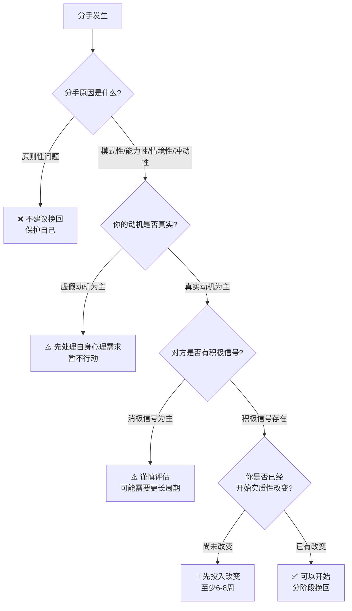
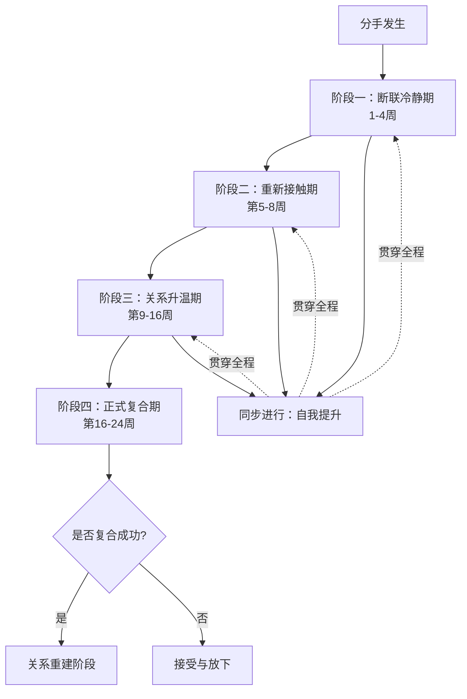

## 四、分手挽回

分手挽回是恋爱中最痛苦、最容易犯错的环节。大多数人分手后会陷入本能的情绪反应——反复联系、苦苦哀求、承诺改变——但这些本能反应恰恰是让挽回彻底失败的原因。真正有效的挽回，建立在对分手机制的深刻理解、对自身问题的诚实面对、以及一套科学的阶段性策略之上。

本节从"要不要挽回"的决策框架开始，涵盖分手类型的心理分析、分阶段挽回策略、沟通话术与禁忌、常见致命错误、复合后的关系重建，提供一套完整的行动指南。无论你是刚分手、已经在挽回过程中、还是正在考虑是否要尝试复合，都能在这里找到对应的指导。

> **关联阅读**：本节涉及依恋理论（见基础理论/02-二依恋理论）和沟通技巧（见话术集/05-五挽回话术10个场景），建议结合阅读。

### 4.1 是否应该挽回：决策框架

分手后最常见的错误是在情绪最激烈的时候做决定。悲伤、愤怒、恐惧会扭曲你的判断力，让你分不清"我还爱TA"和"我只是害怕失去"。在采取任何行动之前，你需要冷静地评估以下四个维度。

#### 4.1.1 评估分手原因的性质

分手原因是决定"该不该挽回"的第一判断标准。不同性质的分手原因，挽回的道德合理性、成功率、以及后续关系的质量完全不同。

| 分类 | 具体原因 | 挽回建议 | 理由 |
|------|---------|---------|------|
| **原则性问题** | 出轨、家暴、成瘾（赌博/酗酒/药物）、长期欺骗、涉及违法犯罪 | **不建议挽回** | 这些问题涉及人格和价值观的根本缺陷，复合后复发率极高。研究显示出轨后复合再次出轨的概率超过70%；家暴行为遵循"暴力循环"模式，复合后暴力升级的概率超过65% |
| **模式性问题** | 控制欲过强、长期冷暴力、情绪虐待、频繁PUA、极端嫉妒 | **慎重考虑** | 即使你深爱对方，也要先评估对方是否有改变的意愿和能力。单方面的改变无法修复模式性问题。如果对方否认问题存在或拒绝改变，挽回几乎不可能成功 |
| **情境性问题** | 异地距离、家庭反对、经济压力、工作忙碌导致疏远、重大生活变故（失业/疾病） | **可以尝试** | 外部压力可以通过共同面对来解决，但需要双方都愿意付出努力。关键是要有具体的解决方案，而不是空洞的承诺 |
| **能力性问题** | 沟通不畅、不懂经营、忽视情感需求、缺乏安全感、冲突处理能力差 | **值得尝试** | 这类问题可以通过学习和练习来改善，挽回同时也是自我成长的机会。心理学研究表明，沟通技能是可以后天习得的 |
| **冲动性分手** | 吵架上头、一时赌气、试探对方、受到外部刺激后冲动决定 | **可以尝试** | 冷静后双方通常都会后悔，但需要借此机会建立"不以分手要挟"的共识。如果冲动分手反复发生，需要关注更深层的关系问题 |

**关键判断原则**：如果分手原因是对方的底线触碰（原则性问题），你应该做的是尊重自己的底线，而不是想办法说服自己原谅。如果分手原因是双方可以共同改善的，挽回才具备合理性。

#### 4.1.2 评估你的真实动机

分手后的情绪状态会让很多人产生"虚假动机"——你以为你在挽回爱情，实际上你在满足其他心理需求。必须诚实面对自己。

**值得挽回的动机（真实需求）：**

- 你真正认同对方这个人的核心品质（价值观、性格、品格），而不仅仅是怀念恋爱的感觉或害怕空窗期
- 你已经识别出导致分手的具体问题，并且已经有了可行的改善方案——注意是"具体问题"和"可行方案"，而不是模糊的"我会对你更好"
- 你愿意为修复关系做出实质性改变，而不仅仅是口头承诺，并且这种改变不会损害你的核心自我
- 你尊重对方说"不"的权利，即使被拒绝也能体面退出
- 你对这段关系的期望是"和这个人共同成长"，而不是"回到从前的美好时光"

**不值得挽回的动机（虚假需求）：**

- **害怕孤独**：你不是想念TA，你只是害怕一个人。这种动机会让你在复合后继续忽视问题，因为你的核心需求不是"这个人"而是"有人陪"。检验标准：如果你现在立刻开始一段新的恋情，你还会想要挽回前任吗？如果答案是"不会"，说明你的真实需求是"有伴侣"而非"这个人"
- **不甘心**：被分手的挫败感会激发强烈的征服欲，但征服欲不是爱。复合后你很快会发现激情退去，问题依旧。不甘心的本质是自恋受损，不是情感连接
- **沉没成本谬误**：投入了太多时间、金钱、感情，所以不想放手。行为经济学告诉我们，过去的投入无法收回（沉没成本），未来的幸福才是你需要考虑的。一段关系的价值不取决于你投入了多少，而取决于它能给你带来什么
- **面子问题**：特别是被分手的一方，会觉得"被甩了"很没面子，想通过挽回来证明自己的价值。在中国文化语境下，这种心理尤为突出——周围人的议论、父母的追问都会加重这种压力。但你的价值不应该由一段关系来定义
- **习惯和依赖**：习惯了对方的存在，害怕改变。心理学中这叫做"状态依赖"——你已经适应了有伴侣的生活状态，改变会带来不确定性和焦虑。但习惯不等于爱情，依赖不等于亲密
- **害怕找不到更好的**：这是一种基于匮乏心态的判断，通常在分手后情绪低落时特别强烈。你需要相信自己值得被爱，也有能力遇到合适的人

**自测方法**：想象一个场景——对方已经开始了新的恋情，过得很幸福。你的感受是什么？如果主要是"祝福但有点遗憾"，说明你有真实的情感基础；如果是"极度痛苦、愤怒、觉得自己被抛弃了"，说明更多是依赖和不甘心。再做一个练习：写下你想要挽回对方的五个理由，然后逐一追问自己"这是关于TA的，还是关于我自己的？"如果五个理由中超过三个是关于你自己的需求，你需要先处理自己的心理需求，而不是急着挽回。

#### 4.1.3 评估对方的状态

挽回不是单方面的决定，你需要客观评估对方的感情状态和意愿。注意：这里的评估应该是基于事实的客观判断，而不是基于希望的主观解读。

**积极信号（有挽回空间）：**

- 对方没有删除你的联系方式，或删除后又加回——说明对方在理智层面没有完全切断联系的意愿
- 对方虽然态度冷淡，但仍然回复你的消息——冷淡是自我保护，不回复才是真正的拒绝
- 对方在社交媒体上发布伤感、怀旧的内容——这些可能是对你的间接信号，也可能只是情绪宣泄，不要过度解读
- 通过共同朋友打听你的情况——这几乎可以确定对方对你还有关注
- 对方仍然保留你送的礼物或两人的合照——说明对方没有在刻意清除你的痕迹
- 在偶遇时表现出紧张、不自然——说明还有情绪波动，完全不在乎的人会表现得很平静
- 对方在节日或纪念日主动联系你——时间锚点的触发说明你仍在对方的记忆中占据重要位置
- 对方回复你的消息时使用了表情符号或语气词——这意味着情绪防线在松动

**消极信号（挽回希望渺茫：**

- 对方拉黑了你所有联系方式——这是最明确的边界设定，说明对方需要完全切断与你的连接来保护自己
- 明确告知你"不要再联系我"——尊重这个表达是基本的道德底线
- 对方已经开始新的恋情且态度认真——注意区分"认真"和"反弹式恋爱"（后者会在后文详述）
- 对方表现出厌恶、鄙视的情绪（而非冷淡）——厌恶是一种比愤怒更强烈的负面情绪，意味着对方已经从"对你失望"转变为"对你的整体否定"
- 对方已经归还了所有个人物品，清理了所有共同痕迹——这是一种仪式性的"告别"
- 共同朋友告知你对方"完全不想再提起你"——说明对方已经在情感上完成了与你的切割

**重要提醒**：不要通过过度解读对方的每一个行为来给自己希望。人在分手后会经历多种情绪阶段（否认→愤怒→讨价还价→沮丧→接受），对方偶尔的情绪波动不代表想要复合。判断对方状态时，看"持续的行为模式"而不是"某一次的异常行为"。

#### 4.1.4 评估改变的可能性和意愿

这是最容易被忽视、也是最关键的一点。很多人在挽回时会说"我会改的"，但这句话几乎毫无价值——因为几乎每个人在分手后都会说这句话，而对方听过太多次了。

**真正有意义的改变需要满足三个条件：**

1. **具体化**：你清楚地知道要改什么。"我会对你更好"不是具体化，"我会在你加班时准备好晚餐，而不是抱怨你不陪我"才是具体化。写出你需要改变的3-5个具体行为，每个行为都需要描述"旧模式是什么"和"新模式是什么"

2. **可执行**：你有明确的行动计划。"我会控制脾气"不是可执行的，"当我感到愤怒时，我会先做三次深呼吸，然后用'我感到...'而不是'你怎么...'的句式来表达"才是可执行的。把改变拆解成"触发条件→旧反应→新反应"的具体公式

3. **已完成**：最好的挽回姿态是"我已经在改变"而不是"我将要改变"。如果你们分手三个月了你什么都没做，那"我会改"就是一个空头支票。改变需要时间积累——至少需要6-8周的持续实践，才能让对方相信你的改变是稳定的而非临时的

**自我评估工具**：拿出一张纸，画一个三列表格。第一列写"导致分手的具体问题"，第二列写"我为解决这个问题已经做了什么"，第三列写"取得的证据/成果"。如果第二列和第三列大部分是空的，说明你还没有准备好挽回。

#### 4.1.5 综合决策矩阵

将以上四个维度综合起来，形成一个清晰的决策框架：

### 4.2 分手的心理机制

在讲具体策略之前，你需要理解分手后双方的心理变化过程。理解这些机制，才能知道在什么时间点做什么事。盲目行动和理解原理后的行动，结果天差地别。

#### 4.2.1 提出分手一方的心理阶段

大多数主动提出分手的人，其实内心早已经历了漫长的决定过程。心理学研究发现，提分手方通常经历了以下阶段：

1. **失望积累期**（分手前数周到数月）：反复感到不满，但选择忍耐或暗示。TA可能通过"间接表达"来试图引起你的注意——比如抱怨你不够关心TA，或者提出一些你当时没有重视的需求。这个阶段，TA内心在进行一场"要不要继续"的拉锯战

2. **决策期**（分手前数天到数周）：内心已经做出了分手的决定，开始做心理准备。TA可能会突然变得平静（因为已经想清楚了），开始减少投入（不主动找你、约会敷衍），甚至开始在心理上"演练"分手后的生活

3. **提出期**（提出分手时）：表面上看起来很冷静，因为TA已经提前消化了情绪。这就是为什么很多人觉得"TA怎么一点都不难过"——不是不难过，是TA的悲伤在提出分手之前就已经开始了。提分手方的情绪周期比被分手方早了数周甚至数月

4. **解脱期**（分手后1-3周）：感到轻松和自由，因为长期的不满终于释放了。这个阶段TA可能表现得很开心、社交活跃，这对被分手方来说是最具杀伤力的——"TA竟然一点都不难过"。但实际上，这种"轻松"只是短期的情绪释放

5. **怀念期**（分手后1-3个月）：新鲜感过去，开始回忆关系中的美好部分。心理学中这叫做"积极回忆偏差"——随着时间推移，大脑会自然淡化痛苦记忆，强化美好记忆。这个阶段TA可能会开始想起你的好

6. **评估期**（分手后3-6个月）：更理性地看待这段关系，权衡得失。如果TA在这个阶段没有进入新的恋情，且你已经有了明显的变化，这可能是挽回的最佳窗口期

**关键洞察**：当你刚刚分手就去找对方挽回时，对方正处于"解脱期"，TA会觉得你打破了TA想要的平静。你需要等到"怀念期"，对方开始重新想起你的好，此时你的挽回行动才会有正面效果。这也解释了为什么"断联"是有效的——它尊重了对方的情绪周期。

#### 4.2.2 被分手一方的心理阶段

被分手的一方通常会经历类似"悲伤五阶段"（Kübler-Ross模型）的过程：

1. **震惊与否认**：不相信这是真的，试图说服自己"TA只是一时生气"。可能会反复查看聊天记录寻找"线索"，或者把对方的冷淡解读为"TA在考验我"。这个阶段通常持续数天到一周

2. **愤怒与指责**：开始感到愤怒，觉得"TA怎么能这样对我"。可能会在心里翻旧账、指责对方的种种不是。愤怒其实是悲伤的保护层——让你暂时不必面对深层的失落和伤痛

3. **讨价还价**：疯狂联系对方，承诺改变，试图说服对方回心转意。这是"挽回本能"最强烈的阶段——你的大脑在拼命寻找"只要我做了X，就能挽回TA"的公式。但本质上，这个阶段的所有行为都是恐惧驱动的

4. **沮丧与消沉**：意识到无法挽回（或挽回没有效果），陷入深度悲伤。可能伴随失眠、食欲下降、注意力不集中、对一切失去兴趣。这个阶段是最痛苦的，但也是最接近"开始放下"的阶段

5. **接受与重建**：接受现实，开始重建自己的生活。不是说不难过了，而是你能带着难过继续生活。这个阶段你开始重新找到自己的节奏和价值感

**最关键的陷阱**：大多数人在"讨价还价"阶段做出的挽回行为，效果最差但频率最高。这是因为在这一阶段，你的所有行为都被恐惧和焦虑驱动，而不是出于真正的情感和理性。你发出的每一条消息、每一个电话，本质上都是在说"求求你不要离开我"——而这种姿态只会让对方更加确认分手是正确的决定。

#### 4.2.3 依恋类型对分手反应的影响

理解你和对方的依恋类型，能帮助你预判分手后的行为模式，并据此调整策略。依恋类型不是非此即彼的标签，而是一个连续的光谱，但了解主要特征能帮助你理解自己和对方的行为。

**焦虑型依恋者**被分手后：

- 会陷入强烈的情绪风暴，反复联系、追问原因、承诺改变、甚至威胁自伤
- 内心独白："TA是不是从来就没爱过我？""一定是我做错了什么""只要我能证明我足够好，TA就会回来"
- 本能行为：查看对方的在线状态、分析对方的每一条朋友圈、通过各种渠道打探消息
- 挽回策略需要特别注意——焦虑型最需要做的恰恰是"停下来"，因为本能驱使你做的事都在破坏挽回。焦虑型需要学习"自我安抚"技术：当焦虑涌上来时，告诉自己"我现在的情绪是焦虑依恋模式在驱动，不代表现实"

**回避型依恋者**被分手后：

- 表面上看起来毫不在乎，迅速投入工作或社交来转移注意力
- 内心独白："我早就知道会这样""我不需要任何人""恋爱太麻烦了"
- 但压抑的情绪会在某个时刻集中爆发——可能是几个月后的某个深夜，突然崩溃大哭
- 挽回回避型需要更大的耐心和更长的周期。回避型最怕的是"被逼迫做决定"和"情感压迫"，所以你需要用"轻松、无压力"的方式重新接触

**安全型依恋者**被分手后：

- 能够合理处理情绪，既不压抑也不爆发，会难过但不会失去自我
- 会主动寻求社交支持，能够适度表达悲伤
- 如果分手原因可解决，安全型的挽回成功率最高，因为TA们能够理性地重新评估关系
- 安全型比较容易识别"真正的改变"和"表演性的改变"

**恐惧型依恋者**被分手后：

- 在"想挽回"和"怕受伤"之间剧烈摇摆，可能今天主动联系你，明天又完全消失
- 内心独白："我好想TA""不行，如果复合了TA又会伤害我""但如果我不挽回，我会后悔的""可是TA已经不爱我了"
- 面对恐惧型需要提供稳定的安全感，同时不要逼迫对方做决定。恐惧型需要的是"你一直都在，但不会逼我"的信号

### 4.3 分阶段挽回策略

以下是经过心理学验证的分阶段策略。每个阶段都有明确的目标、行动和禁忌。请注意，这个时间表是参考性的——每段关系的具体情况不同，你需要根据实际进展灵活调整。

#### 4.3.1 阶段一：断联冷静期（1-4周）

**核心目标**：打破负面情绪循环，让双方从"吵架模式"切换到"回忆模式"。

**为什么要断联？**

断联不是冷暴力，也不是玩心理游戏。它有三个坚实的心理学基础：

1. **情绪消退效应**：负面情绪（愤怒、失望、厌烦）需要时间来消退。心理学研究表明，强烈的负面情绪在没有新刺激的情况下，通常在2-4周内会显著减弱。具体来说，愤怒的半衰期约为2周——也就是说，两周后对方的愤怒程度大约会降到最初的50%。在对方还在生气时联系，只会刷新TA的负面情绪计时器

2. **损失厌恶效应**：人对"失去"的敏感度是"获得"的2倍（卡尼曼与特沃斯基的前景理论）。你突然从对方生活中消失，反而会激发TA对你价值的重新评估。这就是为什么很多分手后"消失"的人，反而比死缠烂打的人更有可能被想念

3. **峰终定律**：人对一段经历的记忆取决于"最强烈的时刻"和"结束时刻"（卡尼曼）。断联可以让你们关系中"最后的痛苦场景"逐渐淡化，让更早的美好记忆浮现。如果你们最后一次互动是大吵一架，那这段争吵会成为对方对你的"最近印象"——断联就是在等待这个印象褪色

4. **习惯打破效应**：对方已经习惯了"有你的生活"和"对你的负面情绪反应模式"。断联打破了这个习惯循环，迫使对方重新建构对你的认知框架。当旧的认知框架被打破时，新的、更积极的认知框架才有空间出现

**具体行动：**

- **立即停止所有主动联系**：不发消息、不打电话、不通过朋友传话、不在对方社交媒体下留言、不制造"偶遇"。把对方的聊天窗口从微信首页移除（不删除，是"不显示"），减少视觉触发
- **清理触发物**：把对方的照片、聊天记录、礼物收到一个箱子里，放到你不会每天看到的地方。不是要你丢掉，而是避免反复触发情绪。心理学研究表明，反复暴露于情感触发物会延长情绪恢复期
- **建立情绪出口**：找一个可以倾诉的朋友（但不要是共同朋友）、写日记、运动。把想对对方说的话写在一个不会发出的文档里——心理学中这叫做"表达性写作"，普林斯顿大学的研究表明，每天写15-20分钟能显著降低焦虑和抑郁水平
- **维持正常生活**：该上班上班，该社交社交。不要因为分手就让生活停滞——这既是为你自己好，也是因为后面重新联系时，你需要有"新东西"可以展示
- **开始一项新活动**：学一门新技能、加入一个新社群、开始规律运动。这不是"做给对方看"，而是真正地投资自己。当你有了新的生活重心，你对挽回的焦虑会自然降低

**断联期间的禁忌：**

- ❌ 以任何理由找对方（"我有东西落在你那"、"我看到个东西想到你"、"我需要你帮我一个忙"）
- ❌ 通过共同朋友打探对方的消息或传话
- ❌ 在朋友圈/社交媒体上发伤感内容暗示对方
- ❌ 深夜喝酒后联系对方（这是最致命的行为之一——酒精会削弱你的自控力，让你做出清醒时不会做的事）
- ❌ 突然出现在对方常去的地方
- ❌ 注册小号去关注对方的社交媒体
- ❌ 威胁自伤来获取对方回应——这不仅无法挽回关系，还可能触犯法律（骚扰、威胁等）

**断联时长的判断标准：**

| 分手类型 | 断联时长 | 判断依据 |
|---------|---------|---------|
| 冲动分手（吵架后当场说分手） | 3-7天 | 双方需要冷静但不能让对方觉得你不在乎 |
| 积累型分手（问题积累到爆发） | 2-4周 | 负面情绪需要更长时间消退 |
| 原则性分手（涉及重大信任破裂） | 4周以上 | 严重的信任伤害需要更长时间修复 |
| 对方提出"做朋友" | 2-3周 | 需要打破"朋友框架"的舒适区 |
| 对方已有新对象 | 暂不行动 | 等待或转向自我成长 |

**特殊情况：如果对方主动联系你**，可以正常回复但保持简短和友善，不要急于深入交谈。回复示例："谢谢关心，我挺好的。你也要照顾好自己。"——温暖但不越界。

**无法完全断联的情况**：如果你们是同事、同学、共同租房，无法做到完全不见面，那么采取"有限接触"策略——只在必要的工作/学习场景中保持礼貌和简短的互动，不做任何超出必要范围的私人交流。见面时保持友善但保持距离，就像对待一个不太熟的同事。

#### 4.3.2 阶段二：重新接触期（第5-8周）

**核心目标**：以零压力的方式重新进入对方的生活，恢复最低限度的社交互动。

**重新接触的前提条件**：在开始重新接触之前，确认以下条件已经满足——

1. 断联时间已经达到对应的最低标准
2. 你的情绪状态已经基本稳定（不会因为对方的冷淡回复而崩溃）
3. 你已经至少在2-3个方面有了可见的改变
4. 你对这次联系的结果做好了"任何回应都能接受"的心理准备

**重新接触的方式选择：**

| 方式 | 适用场景 | 具体操作 | 压力指数 |
|------|---------|---------|---------|
| 文字消息 | 首选，最安全 | 以"无需求"的内容开场，如分享对方可能感兴趣的文章、节日问候 | ★☆☆☆☆ |
| 社交媒体互动 | 对方活跃于社媒 | 给对方的朋友圈点赞（不要每条都赞），偶尔评论一条正面的内容 | ★★☆☆☆ |
| 共同活动 | 有共同朋友圈 | 通过朋友组织的聚会自然见面，不要单独约 | ★★☆☆☆ |
| 直接邀约 | 已有一定互动基础 | 以"顺便"的理由约见，如"我在你公司附近，要不要一起吃个午饭" | ★★★☆☆ |

**首次重新联系的话术原则：**

第一条消息的核心原则是——**看起来像是突然想起对方，而不是蓄谋已久**。你需要给对方一个"低压力的台阶"——让TA觉得回复你是轻松的、不承担任何义务的。

好的开场：

- "刚路过XX（你们以前常去的地方），想起以前的事，希望你一切都好"——温暖但无需求
- "看到这个（对方感兴趣领域的内容），第一个想到你"——展示你还在关注TA的领域，但不是在关注TA本人
- "最近怎么样？不用特意回复，只是想问个好"——直接告诉对方"你没有义务回复"，反而减轻了TA的压力
- "今天XX（共同朋友/共同关注的事）跟我说了一个有意思的事，想到你可能会感兴趣"——有内容载体，不空洞

坏的开场：

- "我想你了"——太直接，给对方压力，让对方不知道怎么回应
- "我们能不能谈谈"——太严肃，像要谈判，对方会本能地开启防御
- "我知道我以前不好，但我真的改了"——还没开始互动就谈复合，操之过急
- "你还好吗？我很担心你"——过度关心会让对方警惕，觉得你还没放下
- "我发现你删了我们的合照"——把关注点放在对方的社交媒体行为上，暴露了你在监视TA

**回应冷淡时的策略：**

对方回复冷淡（比如只回"嗯"、"还行"、"好的"）是正常的，不要因此焦虑，也不要因此加倍联系。冷淡回复≠拒绝，冷淡回复=对方还在观望。

正确的做法：

1. 回复一条友善的消息，然后主动结束对话："好的，那就好。有空再聊~"——在对方放下防备之前，每次对话你都要做"主动结束"的那个人
2. 等待3-5天后再找一个自然的话题发起联系——不要太频繁，也不要间隔太长导致热度完全冷却
3. 每次对话保持简短（5-10个来回），在气氛最好的时候主动结束——这利用了"峰终定律"，让对方对每次互动都留下好的结尾印象
4. 让对方逐渐习惯你重新出现在生活中，但不会有压力
5. 对方回复变快、字数变多、开始主动问你问题时，说明防线在松动，可以逐步增加互动频率

**这一阶段的关键心态：**

你不是在"追回TA"，你是在"让TA重新认识你"。这两者的区别在于——前者把主动权完全交给对方（TA答不答应），后者是你在展示一个更好的自己（让TA自己想回来）。你需要做一块磁铁，而不是一个追逐者。

#### 4.3.3 阶段三：关系升温期（第9-16周）

**核心目标**：从"偶尔联系"升级到"稳定互动"，重新建立情感连接。

**升温的判断标准——对方达到以下指标中的3个以上，才可以进入升温期：**

1. 对方回复你的消息速度明显变快（从几小时/几天变成几十分钟内）
2. 对方开始主动发起对话（而不仅仅是回复你）
3. 对话中出现了玩笑、表情包等轻松元素
4. 对方愿意分享自己的近况和心情
5. 对方对你展示的改变给予了正面评价（"你真的变了"）
6. 对方愿意单独和你见面
7. 对方开始回忆你们过去的美好时光
8. 对方在对话中使用了"我们"这样的词汇
9. 对方对你生活中其他异性的存在表现出关注或在意

**升温的具体策略：**

**（1）增加高质量互动**

- 从文字聊天过渡到语音通话，再过渡到视频通话——每次升级都是在测试对方的舒适度边界
- 每次互动都确保"愉快结束"——在对方情绪最高点时主动结束对话，留下正向印象。这比聊到无话可说再结束要有效得多
- 分享你的生活变化和成长，但不要刻意炫耀或表演。最好的展示是"不经意间流露"——比如你提到"最近在学摄影，周末去了一个不错的展"，而不是"你看看我现在多上进"
- 培养一些你们可以一起参与的共同兴趣——一起追一部剧、一起学一项技能、一起参加一个活动

**（2）创造独处机会**

- 以轻松的理由邀约：一起看展、看电影、参加活动、尝试新开的餐厅
- 选择对方感兴趣的场所和活动——这表明你在断联期间也在关注TA的喜好
- 第一次见面控制在1-2小时，不要太长——留下"意犹未尽"的感觉比"聊到没话说"要好
- 见面时展现你的改变，而不是谈论改变。比如你开始健身了，让对方从你的体态变化中自己发现，而不是你主动说"我开始健身了"
- 见面地点选择"新场景"——不要去你们以前常去的地方（容易触发旧的互动模式），而是选择你们从未一起去过的地方

**（3）重建情感共鸣**

- 提到你们共同的美好回忆，但以怀念的语气而非挽回的语气："上次路过那家店，想起我们那次特别搞笑的经历"——轻松、温暖、没有压力
- 对对方的生活表现出真诚的兴趣和关心——不是查户口式的追问，而是像朋友一样自然地关心
- 在对方需要帮助时提供支持，但不要过度介入——适度的支持让人感到温暖，过度的支持让人感到窒息
- 学会"共情式倾听"：当对方倾诉时，不要急着给建议或解决方案，先回应对方的情绪——"听起来你最近压力挺大的"

**（4）试探与推进**

- 通过轻微的肢体接触试探对方的反应（比如递东西时碰到手、过马路时轻扶一下对方的胳膊）——如果对方没有退缩，说明身体上的防线已经解除
- 在对话中偶尔提到"如果我们..."的假设性话题，观察对方反应——"如果我们一起去XX旅行，你觉得怎么样？"
- 如果对方对试探有积极回应，逐步增加亲密度；如果对方有退缩，立刻退回到上一个舒适的位置，不要追击
- 试探的核心原则是"给对方选择权"——你的每一次试探都应该让对方觉得"可以接受也可以拒绝，而且拒绝也不会有任何后果"

**升温期的禁忌：**

- ❌ 急于确认关系——"我们到底算什么"这类问题会把对方吓跑，升温期的目标是"让关系自然发展"，而不是"锁定关系"
- ❌ 表现出嫉妒——即使对方提到其他异性，你也要保持冷静。嫉妒只会暴露你的不安全感
- ❌ 过度付出——送贵重礼物、随叫随到会显得你在"买"关系，也会给对方造成"被绑架"的感觉
- ❌ 情绪反复——时而热情时而冷淡，让对方觉得你不稳定。一致性是建立信任的基础
- ❌ 翻旧账——不要提过去的矛盾和伤害，除非对方主动提起。你们应该面向未来而不是困在过去
- ❌ 过早介绍给家人/朋友——在关系还没有明确之前就让第三方介入，会给对方带来巨大的压力

#### 4.3.4 阶段四：正式复合期（第16-24周）

**核心目标**：在双方都做好准备的前提下，正式确认关系。

**提出复合的时机判断：**

当以下条件大部分满足时，说明时机已经成熟：

- 你们已经能够像情侣一样自然地相处——不需要刻意找话题，沉默也不尴尬
- 对方对你的肢体接触没有任何抗拒——甚至会主动发起肢体接触
- 对方开始对未来做包含你的计划（"下个月有个展览，你去不去"、"你十一假期有什么安排"）
- 你们之间已经有了新的默契和互动模式——不是回到过去的模式，而是形成了新的、更健康的模式
- 对方在朋友面前提到你时态度正面——这说明TA已经在社交层面接纳了你们的关系
- 你们的互动频率和深度已经等同于恋爱关系——可能只差一个"名分"

**提出复合的方式：**

不要搞一个"正式谈判"式的复合提案。最好的方式是让复合成为水到渠成的结果，而不是一个突然的转折点。

**方式一：自然过渡法**

在一次愉快的约会结束时，自然地说："这段时间和你在一起真的很开心，我想我们是不是可以正式重新在一起？"——简单、直接、不过度隆重。适合那些关系已经明显升温、几乎就差"捅破窗户纸"的情况。

**方式二：真诚表达法**

"我想跟你说，这段时间我认真反思了我们之前的问题，我也确实做了很多改变。但更重要的是，我发现我对你的感情从来没有变过。你愿意再给我一次机会吗？"——适合分手原因比较复杂、需要正式表态的情况。

**方式三：共同确认法**

在日常互动中，当你们的关系已经像情侣一样时，找一个合适的时机说："我们现在这样算什么关系？"让对方自己定义，比你单方面提出复合更容易被接受。适合那种自然而然地回到了恋爱状态的情况。

**方式四：书信法**

如果你不太擅长口头表达，可以写一封信。手写信在这个数字时代更有诚意和分量。信的内容应该是：回顾你们的过去（承认问题）→ 展示你的改变（具体、真实）→ 表达你对未来的期待（具体、可行）→ 把选择权交给对方。信的长度控制在一页纸以内——太长会显得你在"说服"而不是"表达"。

**复合时需要讨论的问题：**

复合不是简单地"回到过去"，而是"建立新的关系"。研究表明，直接跳过问题讨论就复合的情侣，再次分手的概率高达75%。在确认关系时，你们需要坦诚讨论以下问题：

1. **回顾过去的问题**：导致分手的根本原因是什么？双方各自的责任是什么？注意：这个讨论的目的不是追究责任，而是建立共识——"我们都认可这是导致分手的原因"

2. **新的相处规则**：遇到分歧时怎么沟通？哪些行为是底线？如何避免重蹈覆辙？把这些规则具体化——不是"我们要好好沟通"，而是"争吵升级时，各自冷静30分钟再回来讨论"

3. **预期管理**：对未来有什么期待？对这段关系有什么希望？你们对"亲密关系"的定义是否一致？比如：你觉得"每天至少聊一次天"是基本需求，对方觉得"每周联系两三次就够了"——这种差异需要提前对齐

4. **应急机制**：如果再次出现严重矛盾，怎么处理？是否需要设定一些"安全词"或规则？比如约定"任何一方说出'我们需要暂停'时，双方各自冷静24小时再讨论"

5. **关系检查机制**：定期（比如每月）花30分钟坦诚讨论"这段时间关系中满意和不满意的点"。这不是"找茬"，而是预防性维护——小问题及时处理就不会积累成大问题

### 4.4 不同分手类型的挽回策略

不同原因导致的分手，需要完全不同的策略侧重点。以下针对最常见的五种分手类型给出具体指导。

#### 4.4.1 因为缺乏安全感导致的分手

**典型表现**：一方（通常是焦虑型依恋者）频繁查手机、要求报备、因对方社交而吃醋，另一方感到窒息提出分手。这类分手的核心矛盾是"安全感需求"和"自由需求"的冲突。

**挽回策略**：

- 断联期间重点做安全感的自我建设——学习依恋理论，理解你焦虑的来源（通常来自早期的依恋经历），开始建立"自我安抚"的能力
- 推荐工具：焦虑日记。每次焦虑涌上来时，记录——触发事件是什么？你的焦虑想法是什么？客观证据支持这个想法吗？更合理的解读是什么？这是认知行为疗法（CBT）的核心技术，经过大量研究验证有效
- 重新接触时展示你变得更加独立和自信——不是"表演"独立，而是真正发展出独立的社交、兴趣和生活重心
- 在升温期建立"安全基地"——让对方感到和你在一起是轻松的，而不是被监控的。具体做法：给对方充分的个人空间、不追问对方的社交细节、信任对方的解释
- 不要承诺"我再也不会管你了"（做不到），而是承诺"我会用更健康的方式处理我的焦虑"——比如"当我感到焦虑时，我会先问自己'这个焦虑有客观依据吗'，而不是直接质问你"
- 复合后建立透明但不控制的信任机制：双方自愿分享日常（不是被要求的），遇到不安全感时直接表达感受（"我今天有点不安"）而不是采取控制行为（查手机、追问行踪）

#### 4.4.2 因为沟通问题导致的分手

**典型表现**：频繁争吵、冷战、一方觉得另一方不理解自己、长期积怨得不到解决。沟通问题几乎是所有关系问题的底层原因。

**挽回策略**：

- 断联期间系统学习非暴力沟通（NVC，马歇尔·卢森堡提出）的四个步骤：

| 步骤 | 含义 | 错误示例 | 正确示例 |
|------|------|---------|---------|
| 观察 | 描述事实，不加评判 | "你总是不理我" | "昨天我发消息给你，你8小时后才回复" |
| 感觉 | 表达你的真实感受 | "你太过分了" | "我感到被忽视和不重要" |
| 需要 | 说明你的内在需求 | "你就不能上点心吗" | "我需要感到被在乎和被关注" |
| 请求 | 提出具体可行的请求 | "你以后多关心我" | "你忙的时候能不能先告诉我一声，让我知道你安全到家了" |

- 同时学习"积极-建设性回应"（Active Constructive Responding, ACR）：当对方分享好消息时，用热情、追问细节的方式回应（"太好了！快跟我说说具体情况！"），而不是消极回应（"哦"）或忽略
- 重新接触时，在轻松的对话中自然地展示你的新沟通方式——不是"教"对方NVC，而是自己先用起来。对方会从你的表达方式中感受到变化
- 在升温期遇到小分歧时，用新方式处理，让对方看到你的变化不是说说而已。每一次成功的冲突处理都是对你的"可信度"的一次加分
- 复合后建立固定的"关系检查"机制——每周花30分钟坦诚交流感受。可以设定固定的"对话时间"，比如每周日晚上，双方轮流分享"这周我最开心的一件事"和"这周我有一个小困扰"

#### 4.4.3 因为吸引力下降导致的分手

**典型表现**：对方说"没感觉了"、"像室友不像恋人"、关系进入倦怠期。这类分手的本质是"激情"（Passion）维度的衰退——斯滕伯格爱情三角理论中，激情是维持浪漫关系的关键要素。

**挽回策略**：

- 断联期间全面提升自己——外在形象（健身、穿搭、护肤）、社交圈（扩大交友范围）、兴趣爱好（培养有吸引力的个人特质）、事业成就（展现出上进心和能力）
- 关于外在提升：不是"整容式改变"，而是"成为最好的自己"。规律运动带来的体态变化、合适的穿搭风格、良好的精神面貌——这些比你花多少钱整容都有用
- 关于内在提升：阅读、学习、旅行、培养深度兴趣——让你成为一个"有故事"、"有深度"、"有趣"的人。吸引力的本质不是外表，而是你作为一个"完整的人"的魅力
- 重新接触时让对方"重新被你吸引"——看到的是一个有新鲜感的你。变化应该是"质的飞跃"而不是"量的积累"——减了5斤不如从一个不运动的人变成一个热爱运动的人
- 升温期创造新的共同体验（而不是重复过去的约会模式）——去从未去过的地方、做从未做过的事。新鲜感是吸引力的催化剂，心理学研究表明，共同经历"新奇和略有挑战性"的活动能显著提升关系中的吸引力
- 复合后持续保持个人成长和神秘感，避免再次陷入"老夫老妻"模式。斯滕伯格指出，激情需要"不确定性"来维持——这不是说要"吊着对方"，而是要保持你作为独立个体的丰富性和成长性

#### 4.4.4 因为异地恋导致的分手

**典型表现**：距离导致的陪伴缺失、信任危机、未来规划不一致。异地恋本身就有更高的分手率——研究显示，异地恋的分手率约为40%，高于同城恋的27%。

**挽回策略**：

- 先想清楚异地的根本问题是否有解决的时间表——"谁去谁的城市？什么时候结束异地？"如果这个问题没有答案，即使挽回了也会因为同样的原因再次分手
- 在重新联系时，带着具体的解决方案而不是空洞的承诺——不是"我会想办法的"，而是"我查看了你所在城市的工作机会，我的行业有3个合适的岗位，如果关系确定，我可以开始申请"
- 升温期增加线上的高质量互动：一起看同一部电影（微信语音同步）、一起打游戏、定时视频通话（不是有一搭没一搭的聊天，而是固定的"约会时间"）
- 重要：异地互动的质量比数量重要。与其每天聊30分钟无聊的"在干嘛"，不如每周2-3次深入的、有内容的交流
- 复合后建立"见面计划"——每隔多久见一次，由谁来安排，费用如何分摊。有计划的期待比无期限的等待要健康得多
- 异地复合的特别提醒：你们需要一个"结束异地的明确时间点"。异地恋最怕的不是距离本身，而是"不知道什么时候是头"

#### 4.4.5 因为家庭反对导致的分手

**典型表现**：一方或双方的父母不支持这段关系，导致压力过大而分手。在中国文化语境下，家庭反对导致的分手比例远高于西方国家。常见的反对原因包括：经济条件、地域差异、学历差距、年龄差异、二婚/单亲家庭背景、甚至属相八字不合。

**挽回策略**：

- 先评估家庭反对的根本原因——经济条件？地域？学历？还是单纯控制欲？不同原因需要不同的应对策略
- 断联期间想办法提升被反对的核心条件：如果是因为经济条件，开始认真规划财务和职业发展；如果是因为学历，可以考虑在职深造；如果是因为地域，需要想清楚"谁去谁的城市"
- 重新联系时，带着你已经在面对/改善家庭问题的证据。但请注意：你需要面对的是对方的家庭，不是对方本人——所以这个证据需要通过对方来传递，而不是你直接去"说服"对方的父母
- 关键策略：让对方成为你的"盟友"而不是"被告"。你需要让对方相信"你值得TA为你去说服家人"，而不是让对方觉得"你在逼我跟家人对着干"
- 这类挽回可能需要更长的周期，因为涉及第三方因素。在中国文化语境下，"孝顺"是非常重要的价值观，你不能要求对方"为了你跟父母闹翻"——你需要做的是让对方的父母看到你值得被接受
- 如果对方的父母反对是出于控制欲（不是合理的担忧），这个问题的根源在对方和TA的家庭关系上，不是你能解决的——你需要评估对方是否有意愿和能力在家庭关系中建立边界

### 4.5 挽回过程中的自我管理

挽回过程中最大的敌人不是对方的冷漠，而是你自己的情绪失控。做好自我管理，既是为挽回增加成功率，也是为你自己的心理健康负责。

#### 4.5.1 情绪管理

**焦虑管理——当你想要联系对方但知道不应该联系时：**

1. 设置一个"24小时冷静规则"：任何想联系对方的冲动，都先等24小时。如果你24小时后仍然想联系，再评估是否符合当前阶段的策略
2. 把想说的话写下来（写在备忘录里，不要发出去），等24小时后再看是否还想发。你很可能会发现，24小时后再看这些话，你会庆幸自己没有发出去
3. 做一组高强度运动（跑步、游泳、力量训练），运动产生的内啡肽能有效缓解焦虑。研究表明，30分钟中等强度运动的抗焦虑效果相当于半片安定
4. 联系你的"支持者"（倾诉朋友），把情绪说出来。注意选择那些能给你"理性建议"的朋友，而不是只会说"你去找TA"的朋友
5. 使用"延迟满足"技巧：告诉自己"我可以联系TA，但不是现在，而是等我完成了这周的健身目标之后"——用一个具体的条件替代"不能联系"的禁令

**自我怀疑管理——当你觉得"我不够好"、"TA不可能回来"：**

1. 列出你在这段关系中做得好的地方（你一定有）。把它们写下来，在低落时拿出来看
2. 列出你正在做的改变和已经取得的进步。进步不需要很大，任何进步都值得被记录和肯定
3. 提醒自己：你的价值不由一段关系来定义。一个在事业上有成就、有热爱的兴趣、有真诚的朋友的人，即使没有恋爱关系也是完整和有价值的
4. 专注于你能控制的事情（自己的改变），放下你不能控制的事情（对方的态度）。斯多葛哲学的核心智慧就是"区分你能控制的和你不能控制的"

**反复管理——当你情绪反复——今天觉得放下就好，明天又觉得不能没有TA：**

1. 这是完全正常的，不要因此觉得自己"有病"。情绪的波动是失去重要关系后的自然反应，就像潮汐一样——有涨有落，但总体趋势是向好的
2. 接受情绪的波动，不要对抗它。越是抗拒"我应该放下"，情绪越会反弹。允许自己难过，然后继续做该做的事
3. 做一个"情绪日志"记录每天的状态（可以用1-10分打分），一段时间后你会发现波动在逐渐减小，整体趋势是向上的
4. 专注于长期目标（成为更好的自己），而不是短期情绪。在低落时问自己："三个月后的我，会希望现在的我做什么？"

#### 4.5.2 社交媒体策略

社交媒体是分手后的一个微妙战场。你的每一条动态都会被对方（和共同朋友）看到，也会被过度解读。在数字时代，你的线上形象就是你的"第二自我"。

**应该做的：**

- 继续正常的生活分享，但偏向积极的一面——不是"表演幸福"，而是让你真正积极的生活被看到
- 展示你的新兴趣、新技能、社交生活——但要自然，不要刻意。比如你开始学吉他了，偶尔分享一下练习的片段，而不是每天发"我在努力变好"
- 偶尔发一些你们共同感兴趣领域的内容——这会在对方心中激活"共享兴趣"的连接
- 保持更新频率的稳定（不要突然频繁发或突然消失）——频率的异常变化会被过度解读

**绝对不要做的：**

- ❌ 发伤感文字、悲伤歌曲、暗示性的内容（"有些人走了就不会再回来"、"爱一个人好难"）——这会让对方觉得你还没放下，甚至觉得你在"情感绑架"
- ❌ 发和其他异性的亲密照片（试图让对方吃醋是最蠢的策略之一）——这只会让对方觉得你不是认真的，甚至可能加速对方彻底放弃你
- ❌ 频繁在对方的朋友圈下留言——保持偶尔互动即可，不要让对方觉得你在"监视"
- ❌ 发与你实际情况不符的"表演性"内容（比如从不去健身房的人突然天天发健身照）——虚假的表演早晚会被识破，反而降低你的可信度
- ❌ 发与对方直接相关的内容（你们的合照、你们去过的地方、有特殊意义的歌）——这会让对方感到不舒服，也可能让共同朋友为难

#### 4.5.3 共同朋友圈的处理

如果有共同的朋友，你需要格外谨慎。处理不当的共同朋友关系，可能成为挽回的致命伤。

**原则：**

- 不要在共同朋友面前说对方的坏话（即使你很生气）。你说的每一句坏话，几乎确定会传到对方耳朵里，而且会经过"放大"
- 不要通过共同朋友传话、打探消息。这会让共同朋友为难，也会让对方觉得你在"搞情报战"
- 如果共同朋友主动告诉你对方的消息，礼貌地倾听但不要追问细节——"谢谢告诉我，但我希望TA过得好"是一个得体的回应
- 在共同社交场合表现得大方得体——对对方友善但不过度热情。最好的状态是"友好、自然、不刻意"
- 如果共同朋友问起你们的关系，简单说"我们都还在调整"就好——不需要解释太多，也不需要给自己或对方的行为做评判
- 如果共同朋友试图"撮合"你们或给你出主意，感谢TA的好意但保持自己的节奏——别人的好意不能替代你自己的判断

#### 4.5.4 何时寻求专业帮助

不是所有问题都能靠自己解决。以下情况建议寻求专业心理咨询：

- 你发现自己连续两周以上无法正常工作或生活（失眠、食欲严重变化、无法集中注意力）
- 你出现了自我伤害的想法或行为
- 你发现自己无法控制地做出"死缠烂打"的行为（明知道不该做但停不下来）
- 你的情绪反复持续超过2个月没有任何好转
- 你怀疑自己有焦虑症、抑郁症或其他心理问题
- 你们的关系涉及家暴、PUA等心理创伤，你需要专业的创伤处理

心理咨询不是"有病才去"，而是一种专业的支持工具。就像你感冒了会去看医生一样，心理不舒服也应该寻求专业帮助。在中国，可以通过以下渠道找到心理咨询师：三甲医院心理科、正规心理咨询平台（如简单心理、壹心理）、高校心理咨询中心（如果是在校生）。

### 4.6 挽回中的致命错误

以下错误在挽回过程中极为常见，每一个都可能让挽回彻底失败。请认真对照检查，如果发现自己正在犯这些错误，立刻停止。

#### 错误一：死缠烂打

**表现**：每天发消息、打电话、堵在对方家门口、用不同号码联系、让朋友帮忙求情、在对方公司楼下等。

**为什么致命**：这会让对方从"对你还有感情"变成"对你感到恐惧和厌烦"。更严重的是，如果对方觉得被骚扰，可能会拉黑你所有联系方式，甚至报警——在中国法律框架下，持续骚扰可能构成"跟踪"行为，这时候挽回的可能性就彻底归零了。

**心理机制**：死缠烂打的本质是"焦虑依恋模式"的极端表现——"如果我不做点什么，TA就真的要离开了"。但实际上，你做的"什么"恰恰加速了TA的离开。

**正确做法**：克制冲动，按照断联期的要求执行。如果实在忍不住，就把TA的联系方式暂时屏蔽（不是删除，是屏蔽），这样你不会看到TA的动态，也不会因为TA没回复你而焦虑。

#### 错误二：承诺式挽回

**表现**：\"我保证以后不会了\"、\"你说什么我都改\"、\"你让我做什么我就做什么\"、\"你想要什么样的我，我就变成什么样的\"。

**为什么致命**：过度承诺只会让对方觉得你不真诚——你之前做不到为什么现在就能做到？也会让对方觉得你失去自我——一个什么都可以放弃的人没有吸引力。吸引力的核心之一是"有自己的立场和原则"，当你为了挽回而放弃一切立场时，你同时放弃了让对方尊重你的基础。

**正确做法**：用行动而非语言来证明改变。在断联期间真正做出改变，重新联系时让对方自己发现你的变化。当对方说"你好像变了"的时候，比你说一万遍"我改了"都有用。

#### 错误三：道德绑架

**表现**：\"我为你付出了那么多\"、\"你怎么这么狠心\"、\"你忍心看我这么痛苦吗\"、\"我为你放弃了XX\"。

**为什么致命**：没有人有义务因为你的付出而留在你身边。道德绑架会让对方感到内疚和压迫，而内疚感只会加速TA逃离这段关系。更重要的是，道德绑架暴露了一个致命的问题——你把感情当成了一种交易（"我付出了X，你应该回报Y"），而这种交易心态本身就是关系的毒药。

**正确做法**：接受关系中的付出是双方的选择，不是交易。分手不代表你之前的付出白费了，它只是代表这段关系走到了尽头。你在关系中学到的东西、获得的成长，都是真实的收获，不会因为分手而消失。

#### 错误四：利用第三方施压

**表现**：让双方父母介入、让共同朋友帮忙说情、在对方的社交圈里制造舆论压力、通过社交媒体"暗示"让对方的朋友看到。

**为什么致命**：这会让对方感到被围攻，TA的防御机制会全面启动。更糟糕的是，如果对方是因为你的控制倾向而分手，这恰恰证实了TA的判断。在中国文化语境下，让父母介入可能会给对方带来巨大的"面子压力"和道德绑架，但这种压力下产生的"回心转意"不是真正的爱，而是一种被迫的妥协——这种关系不可能长久。

**正确做法**：挽回是两个人之间的事，不要把第三方卷进来。即使有朋友愿意帮忙，也应该婉拒——你的挽回不应该建立在外界压力之上。

#### 错误五：自我毁灭式博关注

**表现**：故意让对方知道你过得很差（不吃不喝、酗酒、自伤暗示），或者故意让对方知道你和别人暧昧。

**为什么致命**：前者会让对方觉得你情绪不稳定，增加TA的恐惧感——"如果我和TA在一起，以后吵架了TA也会这样"。后者会让对方觉得你不真诚——你到底想挽回还是想报复？甚至让对方彻底放弃你。

**正确做法**：无论你多痛苦，都不要用自我毁灭来换取对方的关注。如果你想让对方看到你，最好的方式是让对方看到一个在变好的你。自伤行为如果涉及真实的身体伤害，请立即寻求专业帮助——你的生命和健康比任何一段关系都重要。

#### 错误六：过度分析对方行为

**表现**：反复查看对方的社交媒体、分析每一条朋友圈的"潜台词"、在群聊中解读对方的每一句话、让朋友帮忙"侦查"。

**为什么致命**：过度分析会让你陷入一种"信息茧房"——你只看到你想看到的，把对方的每一个正常行为都解读为"TA还在乎我"或"TA彻底不爱我了"。这会严重影响你的判断力和情绪稳定性，让你做出错误的决定。

**正确做法**：限制自己查看对方社交媒体的频率（比如每周一次），不要在深夜或情绪低落时查看。如果发现自己停不下来，可以直接屏蔽对方的朋友圈——不是删除，是"不看TA的朋友圈"，这样你不会被随机触发。

### 4.7 案例分析

#### 案例一：因沟通问题分手后的成功挽回

**背景**：小陈（男，27岁，安全型偏焦虑）和小林（女，26岁，回避型）恋爱两年。小陈总觉得小林不够在乎自己，经常因为"你不回我消息"而争吵。小林觉得被管得太多，最终提出分手。分手时小林说了一句："我觉得和你在一起好累。"

**小陈的错误阶段**（分手后第1-2周）：疯狂发消息、道歉、承诺改、甚至去小林公司楼下等。小林从冷淡回复变成不回复，最后拉黑了小陈的微信。

**转折点**：小陈找到朋友倾诉，朋友帮他分析了问题——他一直在用自己的方式"挽回"（表达需求），而回避型的反应只会是"逃"。更深层的问题是：小陈的焦虑依恋模式让他把"对方不回应"等同于"对方不爱我"，这种认知偏差是所有冲突的根源。

**正确的挽回过程**：

- 第3-6周：完全断联。小陈开始看心理咨询师（每周一次），学习处理自己的焦虑依恋。同时开始健身（每周3次）、报名了一个摄影课程。在心理咨询中，小陈发现自己的焦虑依恋模式来源于童年时期父母的忽视——理解了这一点后，他开始学会"自我安抚"而不是"向外索取"
- 第7周：通过短信（小林只拉黑了微信）发了一条简短的消息："路过XX咖啡馆想起你，希望你一切都好。"小林没有回复。小陈没有焦虑，继续自己的生活
- 第9周：小林在朋友圈发了一条摄影展的照片。小陈评论了一句"这个展我也去了，构图很有意思"。小林回了一个赞——这是分手后小林第一次对小陈的主动互动做出回应
- 第10-12周：小陈偶尔和小林在朋友圈互动，保持轻松自然。每次互动不超过3个来回，小陈总是主动结束对话
- 第13周：小陈以"摄影群有个活动你可能会感兴趣"为由加回了小林的微信。小林通过了
- 第14-16周：重新开始偶尔聊天，小陈严格控制聊天频率（每3-5天一次，每次不超过15分钟），并且在聊天中自然展示了自己学习摄影的成果和心理咨询带来的变化。小林开始回复得更快、字数更多
- 第17周：小陈约小林一起去看摄影展。小林答应了。见面时小陈没有提任何关于复合的话题，只是自然地聊天、看展、拍照
- 第18-20周：又见了几次面，小林开始主动找小陈聊天。有一次小林说："你最近好像真的变了很多。"
- 第22周：在一次愉快的约会后，小陈自然地提出重新在一起。小林说"我需要再想想"。小陈说"好，不急"——这句话让小林感到安心，因为过去的陈一定会追问"要想多久"
- 第24周：小林主动提出复合，说："我观察了你好几个月，你确实变了。"

**关键成功因素**：小陈真正理解了回避型需要空间（而不是把空间当成"不在乎"），真正改变了自己的焦虑依恋模式（通过专业心理咨询，而不是靠意志力），并且用了足够长的时间来展示改变的稳定性。

#### 案例二：因吸引力下降分手后的失败挽回

**背景**：阿杰（男，30岁）和小雨（女，28岁）恋爱三年。恋爱后期阿杰体重增加了20斤、不修边幅、下班就打游戏、社交圈萎缩到只剩几个游戏好友。小雨多次暗示不满（"你最近是不是又胖了"、"你周末能不能不打游戏"），阿杰不以为然（"你是不是嫌我了"）。最终小雨提出分手，理由是"没感觉了，像室友"。

**阿杰的挽回过程**：

- 第1-3周：断联，阿杰开始健身。但只是机械地去健身房，没有系统地改变生活方式
- 第4-6周：重新联系，小雨态度冷淡但愿意回复。阿杰在聊天中频繁提到"我最近在健身"、"我瘦了X斤"
- 第7-10周：阿杰约小雨见面，小雨见了一次但表示"不想复合"

**失败原因分析**：

1. 阿杰的"改变"太表面化——只是健身，没有解决根本问题（缺乏上进心、没有社交生活、没有个人成长、没有独立的生活兴趣）。小雨需要的是一个"有生命力的伴侣"，不是一个"瘦了的宅男"
2. 改变的时间太短——3个月的健身无法弥补3年的吸引力流失。阿杰需要的是生活方式的根本重构，而不是一项单项的改善
3. 阿杰在见面时过于急于"展示"改变，让小雨觉得他是为了挽回才做的，而不是真正改变了生活方式。改变应该是"不经意间流露"的，而不是"摆在你面前让你看"的
4. 小雨已经对阿杰形成了"固定印象"（认知图式），短期的、单一维度的改变不足以更新这个印象。印象的更新需要多维度的、持续的、一致的变化

**教训**：吸引力的重建需要更长的时间和更全面的改变。如果你的问题是"整体生活状态的坍塌"，那么几个月的表面改变是不够的——你需要真正重建你的生活。阿杰如果能在断联期间同时做到：健身（体态）+ 学习新技能（上进心）+ 扩大社交圈（社交魅力）+ 培养独立兴趣（人格魅力），然后用6个月以上的时间来稳定这些改变，结果可能会完全不同。

#### 案例三：冲动分手的快速修复

**背景**：小张（男，25岁）和小李（女，24岁）恋爱一年。两人因为一件小事（小张忘记了小李的生日）发生激烈争吵，小李在气头上说"我们分手吧"，小张也赌气说"分就分"。两人都在气头上说了分手。

**处理过程**：

- 断联3天：两人都在生气，但随着情绪冷静下来，开始后悔
- 第4天：小张发了一条消息："生日的事是我不对，我真的很抱歉。不管怎样，你值得一个记得你生日的人。"——承认错误、没有求复合、把选择权交给对方
- 小李回复："我也有不对的地方，不应该说分手。"——双方都在台阶上
- 当天晚上两人通了电话，坦诚地讨论了这次争吵的深层原因：小李觉得小张不够重视她，小张觉得小李遇到问题就提分手让他很受伤
- 两人约定：以后任何一方都不能把"分手"当武器；遇到问题先冷静30分钟再沟通；小张把重要日期记在手机日历里设置提醒

**关键教训**：冲动分手的修复关键是速度和态度——快（不超过一周），真诚（承认自己的错误），有建设性（讨论如何避免再次发生）。但更重要的是，要借此机会建立"不以分手要挟"的共识。

### 4.8 特殊情况处理

#### 4.8.1 对方有了新对象

这是很多人面对的最痛苦的场景。但你需要区分两种情况：

**对方是"反弹式恋爱"**（Rebound Relationship）：

分手后很快（通常1-2个月内）开始的新恋情，往往是为了填补空虚和缓解分手的痛苦。心理学研究显示，反弹式恋爱的平均持续时间约为5.7个月，且失败率超过90%。这是因为反弹式恋爱的本质是"用新关系来逃避旧伤痛"，而不是真正的感情基础。

判断标准：

- 对方在分手后很快就官宣了新恋情（通常在1-2个月内）
- 新对象和对方的择偶标准差异较大——"饥不择食"的特征
- 对方在新恋情中表现得"过于幸福"——过度补偿心理，越刻意展示幸福越说明内心不安
- 新恋情进展过快（快速确定关系、快速同居等）——正常恋爱需要时间来建立信任和了解

应对策略：不要打扰，继续做好自己。不要去"揭穿"对方的反弹式恋爱——这只会让对方更加坚持。反弹式恋爱结束后，对方会重新审视自己的感情。如果那时你已经变成了更好的自己，你仍然有机会。但如果你在等待期间也发展了新的人生方向，不想挽回了，那也很好——你需要做的始终是"为自己而活"。

**对方是认真的新恋情**：

如果对方是在分手几个月后才开始的新恋情，且关系稳定、态度认真、对方确实在这段新关系中成长和幸福，那么你需要尊重这个事实。继续等待只会消耗你自己的人生。有些人注定是生命中的一段经历，而不是终点。

#### 4.8.2 异地分手的挽回

异地分手比同城分手更难挽回，因为：

- 无法通过面对面互动来重建情感连接——文字和语音无法替代眼神交流和肢体语言
- 对方在异地有自己的生活，你很难"出现"在TA的日常中
- 缺乏物理接触导致的亲密感很难通过线上弥补——研究表明，肢体接触（拥抱、牵手）会释放催产素，这是线上互动无法替代的

策略调整：

- 在断联期间就确定你是否有能力解决异地问题（调岗、搬迁、或者明确的结束异地时间表）
- 重新联系时，带着具体的"不再异地"方案——有方案比没方案的成功率至少高3倍
- 如果无法解决异地，不建议挽回——异地恋本身就极难维持，挽回了也会因为同样的原因再次分手
- 如果必须以异地形式维持，建立高质量的线上互动：固定的视频通话时间、一起看同一部电影、一起玩同一个游戏、定期寄送小礼物

#### 4.8.3 婚前分手的挽回

婚前分手（订婚后退婚、临近婚礼取消）涉及更大的社会压力和情感投入。这类挽回的特殊性在于：

- 社会压力更大——亲戚朋友都知道你们要结婚了，突然取消需要面对大量的询问和议论
- 经济投入更大——彩礼、婚礼筹备、房子装修等，可能涉及大额金钱
- 情感投入更深——已经进入了"准家庭"的心理状态，分手带来的失落感更强烈
- 家庭因素更复杂——可能涉及双方家庭的博弈和角力

这类挽回需要：

- 更长的冷静期（至少4-6周）——涉及的因素越多，需要消化的情绪就越多
- 严肃讨论导致分手的根本问题是否可以解决——不是"你觉得我们还能不能在一起"，而是"导致退婚的那个具体问题，我们有没有具体可行的解决方案"
- 必要时寻求专业的婚恋心理咨询——婚前分手通常涉及更深层的关系模式问题，专业的介入能帮助你们看清问题的本质
- 如果涉及双方家庭，需要同时处理家庭层面的沟通——但核心决策必须是你们两个人做的，不能让家庭的意志替代你们的意志
- 财务问题需要妥善处理——如果有彩礼、婚礼费用等经济纠纷，需要在复合前就达成一致

#### 4.8.4 涉及孩子的分手挽回

如果你们有孩子（无论是婚内还是婚外），分手挽回的考量会完全不同：

- 孩子的利益必须放在第一位——不要利用孩子来施压或挽回
- 即使不能复合，也要保持良好的"共同养育"关系——孩子的心理健康需要父母双方的参与
- 如果是因为育儿分歧导致的分手，需要系统地讨论育儿理念和分工——这类问题不解决，复合后一定会再次爆发
- 涉及孩子的情况下，更建议寻求家庭治疗师的专业帮助

### 4.9 复合后的关系重建

很多人以为复合就是终点，其实复合只是新的起点。研究显示，分手后复合的情侣中，约有60%会再次分手，因为导致分手的根本问题并没有真正解决。复合后的关系重建，是决定这段关系能否长久的关键。

#### 4.9.1 复合后的前30天

这是最关键的"磨合期"。你们需要：

- **保持新建立的互动模式**，不要迅速回到过去的模式。这是最常见的复合后陷阱——确认关系后松了一口气，然后不知不觉回到了旧模式。你需要有意识地保持新习惯，直到它成为自然
- **遇到小矛盾时，用新的沟通方式处理**。每一次矛盾都是一次"新关系的试运行"——如果新方式有效，关系的韧性就增强一分；如果退回旧方式，复合的基础就开始动摇
- **不要回避导致分手的问题**，而是在安全的时机坦诚讨论。复合初期可能会觉得"好不容易在一起了，不想提不开心的事"——但回避不会让问题消失，只会让它在下一次爆发时更猛烈
- **控制期望——不要期望一切都完美**，给关系时间成长。复合后的关系就像刚种下的树苗，需要时间和耐心来扎根。不要因为它没有立刻长成大树就失去信心
- **保持个人空间**——复合后最容易犯的错误是因为"害怕再次失去"而过度黏在一起。健康的亲密关系需要"在一起"和"各自独立"的平衡

#### 4.9.2 建立新的关系规则

复合后的关系需要明确的"新规则"来避免重蹈覆辙：

| 旧模式 | 新模式 | 具体做法 |
|--------|--------|---------|
| 吵架就冷战 | 建立冷静期机制 | 争吵升级时，双方各自冷静30分钟再沟通。设定一个"安全词"，说出这个词时双方必须暂停争吵 |
| 查手机/控制社交 | 信任+透明度 | 不查手机，但主动分享社交动态。信任不是"盲目的相信"，而是"给对方信任，直到有明确的理由不信任" |
| 不说需求让对方猜 | 直接表达需求 | 用"我希望..."代替"你怎么不..."。学习NVC的四步表达法 |
| 忽视纪念日和仪式感 | 定期约会和仪式 | 每周一次正式约会，重要日子有安排。仪式感不需要多贵，但需要用心 |
| 一方过度付出 | 平衡付出与接受 | 定期讨论"你最近感觉累不累"。关注关系的"能量收支平衡" |
| 遇到问题就吵 | 结构化冲突解决 | 使用"轮流发言+复述确认"的沟通方式，确保双方都被听到 |

#### 4.9.3 持续成长的机制

复合后最怕的是"好了伤疤忘了疼"。建议建立以下持续机制：

1. **月度关系回顾**：每月花1小时，坦诚讨论这段时间关系中的满意点和不满意点。可以用"玫瑰-刺-花蕊"框架：这个月关系中最好的一件事（玫瑰）、最需要改善的一件事（刺）、最期待的一件事（花蕊）

2. **年度关系规划**：每年初讨论对关系的期待和目标。包括：共同想要实现的目标（旅行、购房、学习等）、各自的成长计划、关系中需要持续关注的方面

3. **个人成长保持**：不要因为关系稳定了就停止个人成长。保持自己的社交、兴趣和事业追求。健康的亲密关系是两个独立完整的人的结合，而不是两个不完整的人的互补

4. **专业支持**：如果发现老问题又出现了，及时寻求伴侣咨询，不要等到关系再次崩溃。伴侣咨询不是"关系出了大问题才去"，而是一种关系维护的工具——就像定期体检一样

5. **感恩练习**：每周互相分享"这周你做的让我最感激的一件事"。心理学研究表明，感恩练习能显著提升关系满意度。当你习惯性地关注对方的优点和付出，关系的质量会自然提升

### 4.10 什么时候应该放手

挽回不是万能的，也不是永远正确的选择。以下情况意味着你应该接受现实、体面地放手：

1. **对方明确且反复拒绝了你**：如果对方不止一次明确表示不想复合，尊重TA的选择。继续纠缠只会让对方从"有一点愧疚"变成"庆幸分手了"。明确的拒绝不是"考验你的坚持"，而是TA真实的意愿表达

2. **分手原因是不可调和的价值观冲突**：比如一方想要孩子另一方坚决不要、一方追求稳定另一方追求自由、一方需要大量独处时间另一方需要大量陪伴时间——这些不是沟通能解决的问题，而是两种生活方式的根本不兼容

3. **你已经做了能做的一切但没有效果**：你真正改变了自己，给了足够的时间（至少4-6个月），尝试了所有合理的策略，但对方仍然没有回应。这时候继续坚持只是在消耗你自己的人生。"坚持"和"执念"的区别在于：坚持有反馈和进展，执念只是在原地打转

4. **这段关系让你变成了更差的人**：如果在挽回过程中，你变得焦虑、自卑、失去自我、甚至出现了心理健康问题——这不是爱情应该有的样子。爱情应该让你变得更好，而不是更差

5. **复合了但同样的问题反复出现**：如果你们已经复合过一次甚至多次，但每次都因为同样的原因分手——这说明你们之间有结构性的不兼容。反复的复合-分手循环对双方的心理健康都有极大的伤害

6. **对方涉及原则性问题**：家暴、出轨（且没有改变的诚意）、成瘾（且拒绝治疗）、持续的情感虐待——这些情况下，你需要保护的是自己，而不是这段关系

**放手不是失败**。放手是对自己和对方最大的尊重。有些人注定是生命中的过客，TA教会了你什么是爱、什么是需要、什么是底线——这些才是你应该带走的东西。

放下之后，给自己一段"关系空白期"——至少3个月到半年——不要急着进入下一段恋爱。利用这段时间来消化这段关系带给你的成长和教训，重新建立自己的生活重心和自我认同。当你不再"需要"恋爱来证明自己的价值时，你才真正准备好迎接一段健康的新关系。

***

> **下一节**：[五、针对用户情况的定制建议](05-五针对用户情况的定制建议/)
