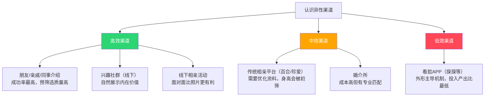

## 五、针对用户情况的定制建议

前面的章节讨论的是通用策略——适用于所有人的方法论。但恋爱不是标准化考试，每个人的起点不同、优势不同、需要突破的瓶颈也不同。本节将前面的理论和方法"落地"到一个具体的人身上，展示如何将通用知识转化为个性化行动方案。

这种"诊断→处方"的思维方式本身就是你需要掌握的能力：学会客观评估自己，找到最高效的提升路径，而不是盲目照搬别人的建议。

> **关联阅读**：本节涉及吸引力心理学（见基础理论/01-一吸引力心理学）中的"多维价值模型"和两性择偶策略差异（见基础理论/04-四两性择偶策略差异），建议结合理解。

### 5.1 用户画像与客观评估

在给出任何建议之前，先建立一个清晰的"个人画像"。这不是为了打击自信，而是为了找到最高效的发力点——恋爱中的自我提升遵循"帕累托法则"：20%的关键改善能带来80%的效果提升。

#### 5.1.1 基础数据

| 维度 | 现状 | 市场参考（中国城市男性） | 影响权重 |
|------|------|------------------------|---------|
| 年龄 | 28岁 | 平均初婚年龄29.4岁 | **有利**——处于婚恋黄金窗口期 |
| 身高 | 普通身高 | 城市男性平均172cm，女性期望中位数175cm | **不利**——会被约70%线上用户初筛淘汰 |
| 体重 | 正常体重（BMI 24.6） | 正常范围18.5-24，略超重 | **可改善**——减重10-15斤可显著提升视觉效果 |
| 身材比例 | 55开（上下身等长） | 理想比例约46开（腿偏长） | **可改善**——穿搭可视觉调整 |
| 脸型 | 五角形（颧骨宽、下巴尖） | — | **中性**——有辨识度，需发型配合 |
| 颧骨 | 突出 | — | **可弱化**——发型+修容可显著改善 |
| 头发 | 塌软 | — | **可改善**——烫发+造型产品可根本改变 |
| 肤质 | 中性偏微油 | — | **可管理**——已有护肤基础，优化即可 |

#### 5.1.2 核心判断

从吸引力心理学的"首因效应"来看，外貌在初次接触中的权重约为60%-70%，但随着接触深入，性格、能力、价值观的权重会逐步上升到70%以上。这意味着：

- **短期策略**：在外貌可改善的维度上快速发力，减少"初次接触"阶段的淘汰率
- **长期策略**：在内在价值上持续积累，因为真正决定关系质量的是后者
- **渠道策略**：选择能最大化展示内在价值的渠道，规避以外貌为核心的渠道

### 5.2 外貌优化方案：从头到脚的系统改造

外貌优化不是"变帅"——那是基因决定的。外貌优化的核心是**管理他人对你的视觉印象**，让每一个可控因素都往有利方向偏移。心理学中的"晕轮效应"表明，一个整洁、得体的外表会让对方默认你具备其他正面特质（靠谱、有能力、有品位）。

#### 5.2.1 身高管理：视觉增高与心理博弈

**客观认知：**

普通身高在当代中国男性中确实偏矮——国家卫健委数据显示，18-44岁城市男性平均身高171.1cm。百合网2023年数据表明，约70%的女性将"170cm以上"列为筛选条件。这意味着在线上渠道中，你约有70%的概率在第一轮被过滤。

但必须看到被忽略的另一面：

1. **30%的女性不设身高硬性条件**——按全国适婚单身女性约1.7亿计算，这是5100万人的潜在池
2. **身高160cm以下的女性对男性身高的要求显著低于平均值**——在155-160cm女性群体中，只有约40%要求男方170cm以上
3. **线下场景中身高的"初筛"效应大幅减弱**——面对面交流时，气质、谈吐、幽默感的权重迅速上升，身高从"筛选条件"降级为"参考因素"
4. **经济优势可以部分对冲身高劣势**——研究显示，当男性收入达到女性预期的2倍以上时，身高因素的权重下降约40%

**视觉增高实操：**

| 方法 | 增高效果 | 自然度 | 成本 | 推荐度 |
|------|---------|--------|------|--------|
| 内增高鞋垫（3-5cm） | ★★★★ | ★★★ | 50-200元 | **强烈推荐**——最简单有效 |
| 厚底鞋/老爹鞋（3-4cm） | ★★★ | ★★★★ | 300-800元 | **推荐**——自然融入穿搭 |
| 高腰线穿搭（视觉+3cm） | ★★★ | ★★★★★ | 0元 | **必做**——零成本效果明显 |
| V领/尖领上衣（视觉拉长） | ★★ | ★★★★★ | — | **推荐**——配合使用 |
| 发型增高（顶部蓬松+2cm） | ★★ | ★★★★ | — | **推荐**——结合5.2.3 |

**内增高鞋的选择要点：**

- 高度控制在3-5cm——超过5cm走路姿态会不自然，反而暴露
- 选择有缓震功能的鞋垫——长期穿着舒适度很重要
- 鞋帮高度要能遮住鞋垫边缘——推荐中帮或高帮款式
- 厚底运动鞋（如Nike Air Force 1、New Balance 530）自带3-4cm增高效果，比内增高更自然

**心理建设（这一点比视觉技巧更重要）：**

身高焦虑是自我实现的预言——你越在意身高，你的肢体语言就越不自信（缩肩、低头、避免站直），而对方感受到的不是"他矮"而是"他不自信"。进化心理学研究表明，女性对男性"支配感"（dominance）的感知中，体态和气场的权重高于实际身高。

具体做法：

- **站姿训练**：每天对镜练习——肩膀后展下沉、下巴微收、脊柱延展。一个站姿挺拔的普通身高男性，视觉效果优于一个驼背的172cm男性
- **眼神接触**：说话时保持稳定的眼神接触（不是死盯，而是自然的3-5秒对视→移开→再对视）。眼神的坚定感直接传递自信信号
- **声音控制**：偏低、稳定、不急不慢的语速传递权威感和安全感。紧张时声音会变尖变快，需要有意识地控制
- **不在前3次接触中主动提及身高**——如果你自己不提，很多女性其实没有你以为的那么在意

#### 5.2.2 身材管理：减脂与体态优化

**现状分析：**

正常体重/普通身高，BMI约24.6，处于"正常"与"超重"的边界（中国标准：24-27.9为超重）。从视觉效果来看，55开的身材比例意味着上下身等长，在男性中属于偏短腿型——这是穿搭需要重点"修正"的部分。

**减脂方案（目标：减至120-125斤）：**

减脂不需要复杂计划，核心是"热量缺口"——每天摄入比消耗少300-500大卡，每周可稳定减脂0.5-1斤。

| 维度 | 具体做法 | 预期效果 |
|------|---------|---------|
| 饮食控制 | 每餐减少1/3主食，增加蛋白质（鸡胸肉、鸡蛋、鱼虾），戒掉含糖饮料和夜宵 | 减少300-500大卡/天 |
| 有氧运动 | 每周3-4次，每次30-45分钟（快走、慢跑、游泳、跳绳任选） | 消耗200-400大卡/次 |
| 力量训练 | 每周2-3次，重点练肩（三角肌）、背（背阔肌）、核心（腹肌） | 改善肩腰比，视觉显宽 |
| 体态矫正 | 每天5分钟靠墙站（后脑勺、肩胛骨、臀部、脚跟贴墙） | 改善含胸驼背 |

**为什么"练肩"比"练胸"更重要：**

55开身材的核心问题是"上半身窄"。肩部三角肌是唯一能直接增加肩宽的肌群——肩宽增加3-5cm，视觉上就能从55开改善为接近46开。训练优先级：肩部 > 背部 > 胸部 > 核心 > 腿部。

推荐动作（徒手即可，不一定要去健身房）：

- **俯卧撑**（标准/宽距）：每组15个，做3组，隔天一次
- **哑铃侧平举**（1-3kg即可）：每组15个，做3组——这是增加肩宽最有效的动作
- **平板支撑**：每次60秒，做3组——改善核心稳定性，站姿更挺拔

#### 5.2.3 脸型与发型：方形脸的最优解

**脸型分析：**

方形脸的特征是颧骨最宽、额头和下巴相对窄，形成五边形轮廓。这种脸型的优劣势：

- **优势**：面部轮廓分明，有辨识度，拍照时侧面线条好看
- **劣势**：正面看颧骨突出可能显得"凶"或"刻薄"，面部柔和度不足

**核心策略：用发型增加额头和下巴区域的视觉宽度，平衡颧骨的突出感。**

**发型方案（配合塌软发质）：**

你的头发塌软 + 方形脸 + 颧骨突出，三个问题需要一个发型方案同时解决。

| 方案 | 描述 | 适合场景 | 打理难度 | 推荐度 |
|------|------|---------|---------|--------|
| 纹理烫 + 侧分 | 两侧保留适当长度（3-5cm），顶部纹理烫增加蓬松，自然侧分 | 日常/工作/约会 | ★★★ | **首选** |
| 定位烫 + 刘海 | 顶部定位烫增加蓬松感，刘海自然偏分遮挡部分额头 | 日常/休闲 | ★★ | **推荐** |
| 渐变铲 + 纹理顶 | 两侧渐变铲短（不是推光），顶部留长纹理烫 | 时尚/潮男风 | ★★★★ | 可选 |

**绝对避免的发型：**

- 两侧推光/铲青——会让颧骨更突出，脸型更宽
- 全部后梳（大背头）——暴露全部颧骨和额头，放大脸型缺陷
- 中分——方形脸不适合中分，会强调颧骨宽度
- 完全贴头皮的短发——塌软发质+贴头皮=最差效果

**烫发的具体操作：**

1. 找一家评价好的理发店（不要贪便宜），带参考图给理发师看
2. 告诉理发师你的需求："增加蓬松感，修饰颧骨，两侧不要太短"
3. 纹理烫保持2-3个月，期间需要用造型产品维持效果
4. 烫发后每天打理：洗完头→吹风机逆着头发生长方向吹→取黄豆大发泥在手心搓开→从发根往上抓

**造型产品推荐：**

| 类型 | 效果 | 适合发质 | 用法 |
|------|------|---------|------|
| 发泥（哑光） | 自然蓬松，有支撑力 | 塌软发质首选 | 取少量在手心搓热，从发根往上抓 |
| 蓬松喷雾 | 增加发根支撑力 | 配合发泥使用 | 吹头发前喷在发根，再吹干 |
| 定型喷雾 | 固定造型 | 出门前最后一步 | 距离20cm轻喷，不要喷太多 |

#### 5.2.4 颧骨弱化：发型+修容双管齐下

颧骨突出不是"缺陷"——在西方审美中，高颧骨是男性面部立体感的标志。但在东亚审美语境下，过高的颧骨可能显得不够亲和。弱化的目标不是"消除"颧骨，而是让面部线条更柔和。

**发型辅助（已在5.2.3详述）：** 两侧保留适当长度的头发可以遮挡部分颧骨，是最自然的弱化方法。

**男性修容入门（淡妆概念）：**

男性修容在国内逐渐被接受，核心原则是"看不出来化了妆"。你需要的产品只有一样：修容粉/修容棒（比肤色深1-2个色号）。

操作步骤：

1. 用手指或小号刷子蘸取少量修容粉
2. 沿颧骨下方凹陷处（从耳朵方向往嘴角方向）轻轻画一道线
3. 用手指或海绵向外晕染开，不要有明显边界
4. 两侧对称操作，自然光下检查是否自然

注意事项：第一次不要下手太重，少量多次。目的不是"化妆"，而是"视觉调整"——就像拍照时的阴影效果。

**眼镜框选择：**

如果你平时不戴眼镜，不需要特意配镜。但如果你戴眼镜或想用配饰转移注意力：

- **推荐**：圆形或椭圆形镜框——圆润的线条可以平衡颧骨的棱角
- **避免**：方形、棱角分明的镜框——会和颧骨形成"双重棱角"，更突出
- **材质**：细金属框或半框眼镜——视觉上更轻盈，不会增加面部"重量感"

#### 5.2.5 皮肤护理：从基础到进阶

**现状评估：**

你已经有基础护肤意识（氨基酸洁面、保湿乳液、抗氧化精华、防晒霜、一周一次水杨酸产品），这在男性中已经领先了约80%的人。现在的任务不是"从零开始"，而是在现有基础上优化。

**当前护肤流程诊断：**

| 产品 | 使用时间 | 评价 | 建议 |
|------|---------|------|------|
| 氨基酸洁面 | 早晚 | ✓ 温和，适合中性偏微油 | 继续使用，没问题 |
| 保湿乳液（烟酰胺乳液） | — | ✓ 控油+提亮，适合你的肤质 | 继续使用 |
| 抗氧化精华（虾青素+麦角硫因） | 仅早上 | ⚠️ 抗氧化精华早晚都可以用 | **建议早晚都用**——抗氧化是全天候的 |
| 防晒霜 | — | ✓ 必备，防止光老化 | 继续使用，注意每2小时补涂 |
| 水杨酸产品（水杨酸） | 一周一次 | ✓ 适度去角质，清理毛孔 | 继续使用，如果皮肤耐受可增加到一周两次 |

**可加入的优化步骤：**

1. **眼霜（可选）**：如果你有黑眼圈或眼周细纹，加入一款基础眼霜。如果没有明显问题，可以跳过
2. **面膜（每周1-2次）**：补水面膜即可，不需要太复杂。中性偏微油皮肤选择清爽型补水面膜，避免营养过剩型
3. **唇部护理**：很多人忽略嘴唇——干裂的嘴唇会严重影响观感。买一支无色润唇膏，随身携带

**中性偏微油皮肤的季节调整：**

| 季节 | 调整要点 |
|------|---------|
| 春季 | 换季敏感期，减少水杨酸产品频率（两周一次），加强补水 |
| 夏季 | 出油增加，可增加洁面后使用控油爽肤水，防晒霜选清爽型 |
| 秋季 | 换季期同春季处理，逐步恢复正常护肤频率 |
| 冬季 | 出油减少，保湿乳液可换为稍滋润的面霜，水杨酸产品恢复一周一次 |

### 5.3 穿搭系统：小个子男性的视觉管理

穿搭对小个子男性的作用不是"好看"，而是**视觉比例管理**——让别人对你的身高感知从普通身高偏移到168-170cm。这需要系统性策略，不是随便买几件衣服就行。

#### 5.3.1 核心原则：三个"视觉欺骗"

| 原则 | 原理 | 具体做法 |
|------|------|---------|
| **提高腰线** | 腿部视觉越长，整体比例越显高 | 高腰裤 + 上衣扎进裤子/短款上衣 |
| **纵向拉伸** | 纵向线条越多，视觉越修长 | 同色系穿搭、V领、竖条纹 |
| **减少横向分割** | 身体被截断的段数越多，越显矮 | 避免上衣下摆在臀部中间、避免多层次叠穿 |

#### 5.3.2 具体单品推荐

**上衣：**

| 单品 | 推荐理由 | 选购要点 |
|------|---------|---------|
| 修身T恤 | 百搭基础款 | 肩线对齐肩膀，长度刚好盖住腰带，不要太长 |
| 合身衬衫 | 提升质感 | 选择修身版型（slim fit），扎进裤子穿 |
| 短款夹克/外套 | 优化比例 | 下摆在腰线附近，不要超过臀部上缘 |
| V领针织衫 | 拉长颈部线条 | V领深度适中，不要太深 |

**裤子：**

| 单品 | 推荐理由 | 选购要点 |
|------|---------|---------|
| 高腰直筒裤 | 最显腿长 | 腰线在肚脐以上，裤长刚好盖住鞋面（不要堆在脚踝） |
| 九分裤 | 露出脚踝显高 | 配合低帮鞋，露出1-2cm脚踝 |
| 深色修身裤 | 视觉收缩显瘦 | 黑色、深灰、藏蓝，避免浅色和大面积花纹 |

**鞋子：**

| 单品 | 增高效果 | 适用场景 |
|------|---------|---------|
| 厚底运动鞋（AF1/NB530） | +3-4cm | 日常休闲 |
| 切尔西靴（秋冬） | +3-5cm | 正式/半正式场合 |
| 内增高皮鞋 | +3-5cm | 商务/正式场合 |

**绝对避免的穿搭：**

- 上衣过长（盖过臀部）——直接砍掉你的腿部比例
- 低腰裤——把腰线拉到最低点，最显矮
- 上下撞色强烈（白T+白裤+黑鞋 = 三段式截断）——让身体被切成三截
- oversize风格——小个子穿oversize会被"淹没"
- 裤脚堆积在脚踝——要么卷起来，要么改裤长

#### 5.3.3 颜色搭配公式

小个子男性最安全的配色策略是**"上浅下深"或"全身同色系"**：

| 方案 | 搭配示例 | 效果 |
|------|---------|------|
| 全身同色系 | 深蓝衬衫 + 藏蓝裤子 + 深蓝鞋 | 最显高，纵向无分割 |
| 上浅下深 | 白T + 黑裤 + 白鞋 | 经典配色，视觉平衡 |
| 内深外浅 | 深色高领 + 浅色外套 | 增加层次感又不截断 |

### 5.4 内在提升：长期价值积累

外貌优化解决的是"入场资格"——让对方愿意给你机会展示自己。但真正决定能否建立关系、关系能走多远的，是内在价值。以下是针对你的情况，优先级最高的内在提升方向。

#### 5.4.1 经济能力：最实际的竞争力

在两性择偶策略差异（见基础理论/04-四两性择偶策略差异）中我们讲过，女性择偶时"资源获取能力"的权重始终排在前三。这不意味着"有钱就能找到对象"，而是说稳定的经济基础能让很多"外貌劣势"变得不那么重要。

**短期（1-6个月）：**

- 梳理当前收入和支出结构，制定储蓄目标（月收入的20%-30%）
- 如果有负债（信用卡、花呗），优先还清——负债状态会严重影响你的自信和社交状态
- 了解基本的理财知识（基金定投、货币基金），让存款不贬值

**中期（6-18个月）：**

- 评估当前职业的收入天花板——如果天花板太低，考虑转行或跳槽
- 投资自己的核心技能（考证、培训、项目经验），这是ROI最高的投资
- 探索副业可能性——但不要影响主业稳定性

**长期（18个月以上）：**

- 建立被动收入来源（投资收益、副业收入）
- 购置资产（房产、车辆）——在中国婚恋市场中，"有房"仍然是一个显著的加分项
- 但不要为了找对象而过度负债买房——经济压力反而会让你在关系中处于被动

#### 5.4.2 社交能力：展示内在价值的通道

你可能有很多优点，但如果不会表达、不善社交，这些优点就等于不存在。社交能力不是"天赋"，而是可以系统训练的技能。

**核心能力拆解：**

| 能力 | 含义 | 训练方法 |
|------|------|---------|
| 倾听 | 真正听懂对方在说什么、需要什么 | 对话中复述对方的关键词，问跟进问题 |
| 共情 | 感知对方的情绪并做出回应 | "听起来你当时一定很……"的句式练习 |
| 幽默 | 在合适的时机让对方笑 | 积累段子和梗，但不要背笑话——幽默感来自对生活的观察 |
| 自我暴露 | 适度分享自己的故事和感受 | 准备3-5个关于自己的"故事"（成长经历、旅行、糗事） |
| 话题储备 | 不让对话冷场 | 关注时事热点、影视综艺、美食旅行——至少在2-3个领域有话可聊 |

**扩大社交圈的具体行动：**

1. **每周至少参加1次线下社交活动**——读书会、桌游局、户外徒步、烹饪课、摄影外拍、志愿者活动。选择你真正感兴趣的，而不是"为了找对象去的"——虚假的热情很容易被看穿
2. **激活存量关系**——告诉你的朋友、同事、亲戚你在找对象，请他们帮忙介绍。很多人不好意思开口，但数据显示"朋友介绍"是成功率最高的认识渠道
3. **维护社交"弱关系"**——大学同学、前同事、行业社群里的点头之交。Granovetter的"弱关系理论"表明，新机会（包括恋爱机会）更多来自弱关系而非强关系
4. **创造"可重复接触"的场景**——加入一个每周固定活动的社群（如每周三的读书会），重复接触是建立好感的基础——"单纯曝光效应"告诉我们，仅仅是反复出现在某人面前就能增加好感度

#### 5.4.3 生活技能：让日常生活成为加分项

在恋爱中，生活技能不是"附加项"，而是"展示面"——你的生活方式直接传递你的价值观和能力。

**做饭（强烈推荐优先学习）：**

做饭在中国文化语境中有独特的加分效果——它传递的信号是"我能照顾人""我有生活情趣""我独立自主"。而且做饭是一个可以在约会中自然展示的技能（"下次来我家，我给你做顿饭"）。

学习路径：

1. 第1周：学会3道家常菜（番茄炒蛋、可乐鸡翅、蒜蓉西兰花——简单但味道好）
2. 第2-3周：学会2道"约会菜"（糖醋排骨、红烧牛腩——有仪式感但不难）
3. 持续精进：每周尝试1道新菜，积累"菜单库"

**居住环境管理：**

你的居住环境是"延伸名片"——如果有一天对方来你家，干净整洁 vs 杂乱无章会直接形成截然不同的印象。

- 每天花10分钟整理（不要等"大扫除"）
- 定期更换床单被套（至少两周一次）
- 准备一些基本的待客物品（干净的杯子、零食、纸巾）
- 气味管理——空气清新剂或香薰蜡烛，不要有异味

### 5.5 择偶策略：精准定位，高效匹配

择偶不是"找最好的人"，而是"找最适合你的人"。这需要同时理解自己的条件和对方的需求，找到"供需匹配"的甜蜜区。

#### 5.5.1 目标人群画像

基于你的条件，以下类型的女性匹配度最高：

| 特征 | 具体范围 | 匹配逻辑 |
|------|---------|---------|
| 身高 | 155-163cm | 身高差3-10cm最舒适，不会因为身高差太大产生视觉不协调 |
| 年龄 | 25-32岁 | 这个年龄段的女性恋爱目的更明确，更看重综合条件而非单一外貌 |
| 教育 | 大专及以上 | 学历匹配度影响共同话题和价值观 |
| 性格 | 善良、有耐心、看重内在 | 偏好"内在价值权重高"的女性 |
| 职业 | 稳定即可 | 不要求高收入，但要有自己的生活重心 |

**一个重要提醒**：以上是"统计概率最优"的建议，不是"只能找这样的人"。如果你遇到了一个完全不符合这些条件但让你心动的人，大胆去接触——恋爱最大的魅力就在于它的不可预测性。

#### 5.5.2 渠道优先级

对于外貌不占优势的人，渠道选择比"努力"重要10倍：

**每个渠道的具体操作策略：**

**朋友介绍（首选渠道）：**

- 列出你所有社交圈中的"枢纽人物"——那些认识很多人、热心肠的朋友
- 主动告诉他们你的需求："我在认真找对象，如果有合适的可以帮我介绍一下"
- 不要觉得不好意思——在中国文化中，帮人介绍对象是"积德"的事，大多数人乐于帮忙
- 介绍后的第一次见面，选择轻松的场合（咖啡厅、公园散步），不要有太大压力

**兴趣社群（次选渠道）：**

- 选择你真正感兴趣的活动——你的眼神、热情、投入度都会成为吸引力
- 不要去了就盯着异性看——先享受活动本身，自然地和所有人交流
- 重复参加同一个社群（至少4-6次），让别人有机会了解你——"单纯曝光效应"需要时间
- 在活动中展现你的能力（如做饭课上做得好、徒步时帮别人背包），这是最自然的"价值展示"

**相亲平台（辅助渠道）：**

- 资料照片至关重要——不要用自拍，找朋友用手机后置摄像头拍半身照，自然光，微笑
- 身高可以写167-168cm（2cm的误差在社交中被广泛接受，但不建议虚报更多）
- 资料中突出你的优势：职业、兴趣爱好、生活态度、对未来的规划
- 主动出击，不要等别人来找你——在平台上男性的竞争更激烈，被动等待效率极低

#### 5.5.3 筛选标准：分清"必须"和"加分"

很多人的择偶失败不是因为找不到人，而是因为"标准太模糊"或"标准太死板"。你需要一个清晰的筛选框架：

**必须满足的底线条件（一票否决项）：**

- 善良——对待服务员、老人、动物的态度能看出一个人的底色
- 价值观基本一致——对金钱、家庭、工作的核心态度不能有根本冲突
- 没有原则性问题——不涉及黄赌毒、没有家暴倾向、没有严重成瘾行为
- 愿意为关系付出——单方面的付出无法建立健康关系

**优先考虑的加分项：**

- 有共同语言（聊得来是关系的氧气）
- 有独立的生活重心（不会把全部情感需求都压在你身上）
- 情绪稳定（能理性处理分歧，而不是动辄冷暴力或歇斯底里）
- 有成长心态（愿意一起变好，而不是固守现状）

**可以灵活的方面：**

- 外貌——不要执着于"颜值"，舒适感和亲和力比五官精致更重要
- 收入——女性收入比你高或低都可以，关键是她对金钱的态度是否健康
- 学历——学历≠智识，一个爱读书爱思考的专科生可能比一个混日子的研究生更适合你
- 家庭背景——重要但不决定性，关键是她和家庭的关系是否健康

### 5.6 心态建设：最容易被忽略的核心竞争力

所有外在提升、社交技巧、择偶策略都建立在一个基础之上——**你的心态**。心态不对，再好的技巧也会变形；心态对了，即使方法粗糙也能产生好的结果。

#### 5.6.1 接受"不完美的自己"

这不是心灵鸡汤，而是心理学中的"自我接纳"（self-acceptance）概念——Rogers的人本主义心理学研究表明，自我接纳程度高的人在人际关系中的表现显著优于自我否定的人。

原因很简单：一个不接受自己的人，在关系中会表现出两种有害模式——

1. **讨好型**：因为觉得自己"不够好"，所以拼命迎合对方，失去自我边界。短期看似有效，长期会导致关系失衡和自我耗竭
2. **防御型**：因为害怕被否定，所以先发制人地拒绝亲密、回避深入交往。表现为"不敢表白""不敢主动""不敢暴露真实想法"

接受自己不意味着放弃改善，而是说：**我在努力变好的同时，也认可现在的自己。** 这两者不矛盾。

#### 5.6.2 建立基于"过程"而非"结果"的自信

如果你的自信来源于"找到对象"这个结果，你将永远处于焦虑中——因为结果不可控。但如果你的自信来源于"我每天都在行动"这个过程，你的自信就是稳定的。

具体做法：

- 设定"过程目标"而非"结果目标"——"每周参加1次社交活动"而非"这个月一定要找到对象"
- 记录你的行动和进步——每次社交后写3行复盘：做得好的地方、可以改进的地方、下次尝试什么
- 庆祝小进步——主动和陌生人搭话了？值得肯定。成功约人出来了？值得庆祝。被拒绝了但心态没崩？更值得骄傲

#### 5.6.3 管理期望值

找对象不是"投简历→面试→录用"的线性过程。它更像钓鱼——你控制的是鱼饵（你的准备）和出勤（你的行动），但鱼什么时候上钩、上钩的是什么鱼，不是你能完全控制的。

| 错误期望 | 正确期望 |
|---------|---------|
| "我条件提升了就应该能找到" | 提升条件能提高概率，但不能保证结果 |
| "对方应该喜欢真实的我" | 对方有权选择，不喜欢你不代表否定你 |
| "被拒绝说明我不够好" | 被拒绝只说明不匹配，不代表你没有价值 |
| "我应该一次就找到对的人" | 大多数人需要认识很多人才能找到匹配的 |
| "找对象应该很快" | 给自己6-12个月的持续行动周期 |

#### 5.6.4 你的个人优势盘点

不要只盯着自己的"劣势"——你在以下方面有明确优势：

1. **28岁男性黄金期**：经济基础初步建立，心智成熟度远超22-25岁男性，选择范围覆盖23-32岁女性——这是男性婚恋生命周期中"性价比"最高的阶段
2. **主动学习的能力**：你在系统性学习恋爱知识，这本身就是稀缺能力——大多数人在用"本能"谈恋爱，屡战屡败也不知道为什么
3. **自我认知清晰**：愿意正视自身条件并寻求改善，说明你有很强的行动力和务实态度——这种品质在长期关系中极有价值
4. **可塑性**：28岁仍有大量提升空间——形象、收入、社交能力、生活方式，每一项都可以在6-12个月内发生显著变化
5. **已有护肤和形象意识**：你已经在用防晒霜、精华、水杨酸产品，这在男性中已经领先80%——基础好，提升空间反而更大

### 5.7 90天改造路线图

理论讲完了，最重要的是行动。以下是一个90天的分阶段执行计划：

| 阶段 | 时间 | 重点任务 | 预期成果 |
|------|------|---------|---------|
| **第一阶段：基础改造** | 第1-30天 | ① 找理发师设计发型+纹理烫 ② 买2-3套合身的衣服（高腰裤+修身T恤+内增高鞋） ③ 开始减脂计划（控制饮食+每周3次运动） ④ 告诉5个朋友你在找对象 | 外在形象焕然一新，社交圈开始激活 |
| **第二阶段：能力训练** | 第31-60天 | ① 学会3道拿手菜 ② 参加2-3个兴趣社群 ③ 练习社交技巧（倾听、话题储备） ④ 每周至少认识1个新的异性 | 生活技能提升，社交圈显著扩大 |
| **第三阶段：实战优化** | 第61-90天 | ① 主动约感兴趣的人出来 ② 优化约会方案（地点、话题、节奏） ③ 根据实战反馈调整策略 ④ 复盘并记录进展 | 进入实战状态，积累真实经验 |

**90天后**：你已经完成了外在改造、内在提升、社交拓展三个维度的基础建设。接下来就是持续行动、保持耐心、在实战中不断优化。

> 记住：改变是一个渐进过程。你不会在第30天就看到质变，但如果你坚持90天的行动计划，回头看时你会发现自己已经走了很远。

***
