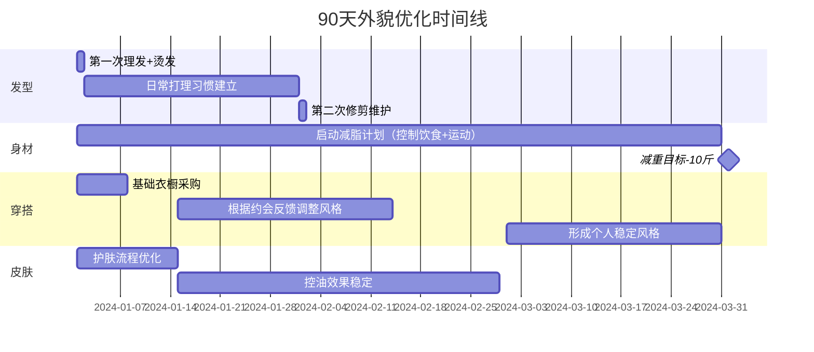

## 六、行动清单

前面五个小节讲了"是什么"和"为什么"，本节解决最关键的"怎么做"——将所有策略、技巧、方案压缩为一份可逐项执行的清单。每个行动项都附带具体操作步骤、预期效果、完成标准和常见坑点，确保你拿到就能做，做了就有效。

> **使用方法**：不要试图同时推进所有行动项。按照时间线（今天→本周→本月→三个月→长期）逐步启动，每个阶段聚焦2-3个核心任务，完成后再进入下一阶段。贪多嚼不烂是行动最大的敌人。

### 6.1 立即行动清单（今天内完成）

这三项是"零门槛启动"——不需要任何前置条件，今天就能做完，但它们的杠杆效应巨大：一张好照片能让匹配率提升3-5倍，一个完善的资料能让回复率翻倍。

#### 6.1.1 拍一张满意的照片作为头像

**为什么排在第一位：** 在所有婚恋平台上，头像是用户看到的第一个信息。百合网2023年数据表明，高质量照片的点击率是普通照片的4.7倍。你前面学到的所有外貌优化、穿搭技巧，最终都要通过一张照片来呈现。

**具体操作步骤：**

1. **选衣服**：穿纯色（深蓝/白/灰）合身的上衣，避免logo和花哨图案。领口选圆领或polo，不要穿卫衣或帽衫（显幼稚）
2. **选背景**：干净的纯色墙面（白/浅灰）、咖啡厅、图书馆书架。避免景区、车里、卫生间镜子
3. **光线**：自然光最佳。面对窗户拍摄，光线从正面打到脸上。避免顶光（显眼袋）和侧光（阴阳脸）
4. **角度**：手机放在眼睛高度，微微俯拍（约10-15度）。镜头距离1-1.5米，让朋友帮你拍，不要自拍
5. **表情**：微笑——不是大笑，不是面无表情。嘴角微微上扬，眼睛有神。拍照前想一个开心的事，表情会自然放松
6. **后期**：轻微调亮度和对比度即可。不要磨皮、不要美白、不要瘦脸。可以用Snapseed或VSCO简单调整

**完成标准：** 选出1张主图+2张辅图（全身照、生活场景照），照片清晰、光线好、表情自然。

**常见错误：**
- ❌ 用证件照——太正式，给人"面试"的感觉
- ❌ 用旅游照——对方关注的是人，不是风景
- ❌ 用集体照——对方不知道哪个是你
- ❌ 过度修图——见面时对方会有落差感，反而降低信任

#### 6.1.2 注册1-2个婚恋平台

**平台选择矩阵：**

| 平台 | 用户画像 | 匹配机制 | 费用 | 适合你的原因 |
|------|---------|---------|------|------------|
| 青藤之恋 | 25-35岁，本科以上学历为主 | 学历认证+算法推荐 | 免费基础，会员98元/月 | 用户质量高，更看重内在条件 |
| Bumble | 25-35岁，国际化用户 | 女性先开口机制 | 免费基础 | 避免"被已读不回"，筛选掉不活跃用户 |
| 世纪佳缘 | 25-40岁，覆盖广 | 传统搜索+推荐 | VIP 30元/月 | 用户基数大，机会多 |
| Soul | 20-30岁，兴趣导向 | 灵魂匹配算法 | 免费 | 先聊性格再见人，适合你展示内在优势 |

**建议组合**：一个"主力平台"（青藤之恋或世纪佳缘）+ 一个"辅助平台"（Soul或Bumble）。不要同时注册超过3个——维护精力分散，每个平台都做不好。

**注册要点：**
- 昵称：简洁有记忆点，避免"阳光男孩""孤独的人"这类俗套
- 头像：用刚拍的那张照片
- 地区：填真实城市，不要写"全国"——没有诚意
- 认证：能做的认证全做（学历、身份、工作），认证标签越多，曝光率越高

#### 6.1.3 完善个人资料

**资料优化模板：**

【关于我】
- 职业：XX行业XX岗位（具体但不敏感，如"互联网产品经理"而非"字节跳动P7"）
- 学历：XX大学XX专业（如果是985/211/海外，写出来）
- 性格：用具体事例而非形容词。例如"周末喜欢研究新菜谱，上周刚成功复刻了日式咖喱"
- 兴趣爱好：列3个具体爱好，每个附一个细节。例如"跑步（今年完成了第一个半马）""读书（最近在看《置身事内》）""做饭（拿手菜是红烧排骨）"

【期待的你】
- 不要写"希望你善良温柔"这种空话
- 写具体的生活状态："希望你也喜欢周末一起逛菜市场、偶尔来场说走就走的短途旅行"
- 不要列条件清单（身高、收入、学历）——显得功利

**完成标准：** 至少填写80%的资料字段，"关于我"部分150-200字，有3张以上照片。

---

### 6.2 本周行动清单（7天内完成）

本周的核心是"从静止到运动"——开始主动接触、开始优化外在、开始练习沟通。这三项的难度逐步递增，但每一项都有明确的收益。

#### 6.2.1 外貌形象升级

**优先级排序（按ROI从高到低）：**

1. **发型改造**（效果最显著，2小时完成）
   - 去一家评价好的理发店（美团/大众点评评分4.5以上，人均消费80-150元）
   - 带2-3张参考图给理发师看（小红书搜"男生短发 修饰颧骨"）
   - 针对你的脸型（五角形，颧骨突出）：两侧推短、顶部保留3-5cm纹理、刘海不要中分
   - 烫纹理烫（150-300元），解决头发塌的问题，维持2-3个月
   - 买一瓶发蜡或发泥（推荐杰士派灰泥，35元左右），学会日常打理

2. **基础穿搭采购**（1-2天完成）
   - 预算：800-1500元足够建立基础衣橱
   - 必买清单：

| 单品 | 规格 | 预算 | 购买渠道 |
|------|------|------|---------|
| 纯色T恤（黑/白/灰） | 合身M码，纯棉 | 50-80元/件×3 | 优衣库/网易严选 |
| 修身牛仔裤（深蓝） | 直筒微锥，不紧身 | 150-250元 | 优衣库/ZARA |
| 休闲西裤（黑色/卡其） | 修身但不紧 | 100-200元 | 优衣库 |
| 白色运动鞋 | 简洁款，无大logo | 200-400元 | 耐克/新百伦基础款 |
| 一件薄外套 | 深蓝/卡其色夹克 | 200-300元 | 优衣库/ZARA |

   - **针对55开身材比例的穿搭要点**：上衣塞进裤子里（或前塞后不塞）、裤子选高腰款、鞋底有2-3cm增高的运动鞋、避免过长的上衣

3. **皮肤护理优化**（每天5分钟）
   - 你已有基础护肤流程，在此基础上调整：
   - 早晚各一次：氨基酸洁面洁面→保湿乳液
   - 早上加抗氧化精华+防晒霜（SPF30以上，出门前15分钟涂）
   - 每周一次水杨酸产品（去角质，控油）
   - 新增：随身携带吸油纸，约会前10分钟吸一下T区

#### 6.2.2 开始主动发起对话

**本周目标**：在平台上主动给5个人发消息。

**为什么是5个**：太少（1-2个）容易因为一两个不回复就放弃；太多（20个）容易变成群发模板。5个是一个有统计意义但不费力的数字。

**第一条消息的黄金公式：**

观察她资料中的具体细节 + 你的相关经历/看法 + 开放式问题

**示例：**

| 她的资料信息 | 你的第一条消息 |
|-------------|--------------|
| "喜欢旅行，刚从云南回来" | "看你的照片是在大理拍的吧？我去年也去了，洱海的日落真的绝。你去了几天？有没有推荐的地方？" |
| "喜欢做饭" | "你资料里写的拿手菜是什么？我一直想学做川菜但总掌握不好火候" |
| 照片里有一只猫 | "你家猫是什么品种的？看起来好有性格（养猫的人品味都不错😄）" |

**绝对不要发的第一条消息：**
- ❌ "你好，可以认识一下吗？"——无聊，没有任何信息量
- ❌ "美女你好"——油腻，把她当物品
- ❌ "在吗？"——像客服开场白
- ❌ 长篇自我介绍——太正式，有压力
- ❌ 只发一个表情包——没有内容，对方不知道怎么回

#### 6.2.3 学习聊天技巧

**本周学习重点**：掌握"信息交换"节奏——不是审问，也不是自说自话。

**3:3:1法则**（每6条消息中）：
- 3条是回应她说的内容（表示你在听）
- 3条是分享你自己的信息（让她了解你）
- 1条是推进话题的问题（保持对话流动）

**实操练习**：找一个朋友做模拟对话练习（10分钟），用上面的法则练习3轮。有条件的话录下来回听，检查自己是不是"问题机器"（连续问3个以上问题不分享自己）。

---

### 6.3 本月行动清单（30天内完成）

本月是"从接触到见面"的关键跃迁。线上聊天的本质目的是线下见面——任何超过两周还没约见面的聊天，成功率会断崖式下降。

#### 6.3.1 完成第一次约会

**目标**：本月内至少完成1次线下约会。

**约会前准备清单：**

- [ ] 确认约会时间：建议周六下午2-5点（白天、公共场所、时间可控）
- [ ] 选择地点：咖啡厅（安静、可以聊天、消费可控）或商场（可以边逛边聊，降低尬聊风险）
- [ ] 穿搭预演：提前一天把要穿的衣服熨好、鞋子擦干净
- [ ] 个人卫生：洗头、刮胡子、剪指甲、喷少量淡香水（不是花露水）
- [ ] 准备3-5个聊天话题：她的兴趣爱好、最近的生活、有趣的故事（见话术集/03-三约会话术15个场景）
- [ ] 带现金或确认手机支付畅通：避免结账时尴尬

**约会中的关键原则：**

1. **提前10分钟到**——早到选好位置，展现你的靠谱
2. **前10分钟聊轻松话题**——别一上来就问"你对婚姻怎么看"
3. **注意身体语言**——保持微笑、眼神接触、身体微微前倾（表示感兴趣）
4. **不要全程AA也不要抢着买单**——自然地说"这次我来，下次你请"（暗示还会有下次）
5. **约会时长控制在1.5-2小时**——见好就收，留有余味

**约会后24小时内**：发一条消息回顾约会中的开心细节，例如"今天聊得很开心，你推荐的那本书我回去就下单了😊"

#### 6.3.2 扩大社交圈

**本月目标**：参加至少1个线下社交活动。

**活动类型选择：**

| 活动类型 | 适合你的原因 | 找活动的渠道 | 预期效果 |
|---------|------------|------------|---------|
| 兴趣小组（读书会/烹饪课/摄影） | 自然展示你的内在价值 | 豆瓣同城/小红书 | 认识3-5个新朋友 |
| 运动社群（跑团/羽毛球/健身房团课） | 展示自律和健康生活方式 | Keep/悦跑圈/大众点评 | 扩大社交圈+锻炼身体 |
| 志愿者活动 | 展示社会责任感，环境轻松 | 微信公众号/豆瓣 | 结识善良的人 |
| 行业交流会/技术沙龙 | 展示专业能力和上进心 | 活动行/Meetup | 认识同行异性 |

**社交中的关键心态**：不要把每一次社交都当作"找对象"。真正的目的是扩大朋友圈——朋友的朋友就是潜在的介绍资源。社交压力越小，表现越自然，反而越有吸引力。

#### 6.3.3 提升一项加分技能

**推荐技能：做饭**

**为什么是做饭：**
- 实用性最高——约对方来家里吃饭是关系升级的重要场景
- 展示面最广——自律（坚持学习）、细心（关注细节）、生活品质（会做饭的人不会过得太差）
- 话题性最强——"你会做饭"在任何聊天中都是加分话题

**30天速成计划：**

| 周次 | 学习内容 | 目标菜品 | 学习资源 |
|------|---------|---------|---------|
| 第1周 | 基础刀工+炒菜火候 | 番茄炒蛋、蒜蓉西兰花、可乐鸡翅 | 下厨房APP/小红书 |
| 第2周 | 炖煮+调味 | 红烧排骨、土豆炖牛腩 | B站"美食作家王刚" |
| 第3周 | 主食+汤类 | 蛋炒饭、西红柿鸡蛋汤 | 同上 |
| 第4周 | 摆盘+整桌菜 | 独立完成一桌4菜1汤 | 综合练习 |

**验收标准**：月底能独立做一桌4菜1汤，味道合格（让朋友试吃打分，7分以上过关）。

---

### 6.4 三个月行动清单（90天攻坚期）

三个月是从"入门"到"上路"的关键周期。大部分人在第一个月会因为新鲜感而充满动力，第二个月因为挫折感而懈怠，第三个月才是真正建立习惯的阶段。

#### 6.4.1 建立稳定的社交节奏

**每周社交指标：**

| 指标 | 目标值 | 说明 |
|------|-------|------|
| 平台主动发起对话 | 5-8人/周 | 不是群发，是针对性地看资料后发消息 |
| 深度聊天（超过20条消息） | 2-3人/周 | 筛选出有共同话题的人 |
| 线下见面 | 1次/2周 | 不用每周都约，保持节奏感 |
| 参加社交活动 | 1次/2周 | 线上线下并行 |

#### 6.4.2 完成外貌优化闭环

**90天改造时间线：**

**减脂计划（针对正常体重/BMI 24.6）：**

- 目标：90天减重10-15斤（到120-124斤，BMI 21.8-22.5）
- 饮食：每日摄入1800-2000大卡（用薄荷健康APP记录），蛋白质每公斤体重1.5g
- 运动：每周3-4次，每次30-45分钟
  - 有氧：跑步/游泳/跳绳（燃脂为主）
  - 力量：俯卧撑、深蹲、平板支撑（塑形为主）
- 关键：不要节食、不要追求快速减重。每周减0.5-1斤是健康速度

#### 6.4.3 建立情感认知体系

**90天阅读计划：**

| 月份 | 阅读书目 | 核心收获 |
|------|---------|---------|
| 第1月 | 《亲密关系》（罗兰·米勒） | 理解关系发展的科学规律 |
| 第2月 | 《非暴力沟通》（马歇尔·卢森堡） | 掌握表达需求的正确方式 |
| 第3月 | 《爱的五种语言》（查普曼） | 学会识别和满足伴侣的情感需求 |

**阅读方法**：每本书读完后写300字读书笔记，提炼1-2个可立即应用到实际社交中的要点。理论不落地等于没学。

---

### 6.5 长期持续行动清单

恋爱不是一次性的项目——它是需要持续投入和迭代的"终身技能"。以下行动需要长期坚持。

#### 6.5.1 每日微行动（5-10分钟）

| 行动 | 用时 | 说明 |
|------|------|------|
| 查看并回复平台消息 | 5分钟 | 不要让对方等超过24小时 |
| 发1条朋友圈/社交动态 | 2分钟 | 展示生活状态，不需要刻意，日常即可 |
| 关注1个穿搭/形象提升内容 | 3分钟 | 小红书/B站，建立审美积累 |

#### 6.5.2 每周复盘（30分钟）

**复盘模板：**

本周复盘 - 第X周

【社交数据】
- 主动发起对话：X人
- 收到回复：X人（回复率 X%）
- 深度聊天：X人
- 线下见面：X次

【做得好的】
1. （具体事件 + 为什么好）
2. ...

【需要改进的】
1. （具体问题 + 下周怎么改）
2. ...

【下周重点】
1. ...
2. ...

**复盘的关键**：不要只看"有没有找到对象"这个结果指标——那有太多不可控因素。关注过程指标：发消息的质量有没有提升、聊天的深度有没有增加、自己的自信心有没有增长。

#### 6.5.3 每月策略调整（1小时）

**月度评估维度：**

1. **渠道效果评估**：哪个平台的匹配率/回复率最高？集中精力在效果好的平台
2. **资料优化**：根据本月的互动反馈，调整照片和个人描述
3. **技能进展**：外貌、社交、内在三个维度分别评估进展
4. **心态检查**：是否出现了焦虑、自我否定、急于求成的倾向？如果有，放慢节奏
5. **策略迭代**：哪些方法有效继续做，哪些无效果断放弃

#### 6.5.4 持续学习与心态建设

**学习资源清单：**

| 资源类型 | 推荐 | 学习方式 |
|---------|------|---------|
| 本书相关章节 | 基础理论、话术集 | 定期回顾，内化为本能 |
| 心理学课程 | B站"社会心理学"公开课 | 理解人际吸引的底层逻辑 |
| 形象管理 | 小红书关注穿搭博主 | 持续积累审美 |
| 沟通技巧 | TED演讲/播客 | 学习表达的艺术 |

**心态建设核心原则：**

1. **接纳不确定性**：恋爱不是线性过程，不是"做得好就一定有结果"。接受被拒绝是正常的，不要把每次拒绝都当作对自己的否定
2. **关注成长而非结果**：衡量自己是否在进步，而不是"这个月有没有脱单"
3. **保持生活重心**：恋爱是生活的一部分，不是全部。有自己热爱的事业和兴趣的人，本身就具有吸引力
4. **设定合理预期**：从开始行动到进入稳定关系，平均需要6-12个月。不要因为一个月没有结果就放弃

---

### 6.6 行动检查总表

将所有行动项汇总为一张可勾选的检查表，按阶段追踪进度：

#### 第一阶段：启动期（第1周）

- [ ] 拍好头像照片（主图+2张辅图）
- [ ] 注册1-2个婚恋平台
- [ ] 完善个人资料（80%以上字段填写完成）
- [ ] 理发+发型改造
- [ ] 采购基础穿搭单品
- [ ] 开始护肤流程优化
- [ ] 主动给5个人发第一条消息

#### 第二阶段：适应期（第2-4周）

- [ ] 学习并练习聊天3:3:1法则
- [ ] 累计主动发起15+次对话
- [ ] 完成至少1次线下约会
- [ ] 参加1次线下社交活动
- [ ] 开始学习做饭（完成第1周课程）
- [ ] 进行第一次周复盘

#### 第三阶段：成长期（第2-3个月）

- [ ] 建立稳定的每周社交节奏
- [ ] 减重5-8斤（体脂有明显变化）
- [ ] 掌握4-6道拿手菜
- [ ] 阅读完1-2本推荐书目
- [ ] 形成稳定的个人穿搭风格
- [ ] 累计完成4+次线下约会
- [ ] 进行月度策略复盘和调整

#### 第四阶段：精进期（第4-6个月）

- [ ] 社交能力从"刻意练习"变为"自然反应"
- [ ] 减重达到目标体重（120-124斤）
- [ ] 能独立完成一桌像样的饭菜
- [ ] 在约会中能自然地引导话题和营造氛围
- [ ] 有了稳定的约会对象，或者清楚地知道自己要什么样的伴侣
- [ ] 建立了完整的复盘和迭代系统

---

### 6.7 常见行动障碍与应对

开始行动不难，持续行动才是挑战。以下是大多数人会遇到的障碍和解决方案：

#### 障碍1："我没有动力开始"

**根本原因**：把整件事想得太复杂、太庞大。

**解决方法**：用"2分钟启动法"——今天只做一件事：拍一张照片。不要想平台、不要想约会、不要想未来。拍完照片，今天的任务就完成了。明天再打开平台注册。把大事拆成不可失败的小步骤。

#### 障碍2："发了消息没人回"

**数据认知**：主动发消息的平均回复率在20%-30%。也就是说，发10条消息有2-3条回复是正常的。这不是你的问题，是平台机制决定的。

**应对策略**：
- 不要把不回复当作对自己的拒绝——对方可能没看到、可能在忙、可能不活跃
- 保持发消息的数量基数，用概率思维代替情绪思维
- 持续优化第一条消息的质量（参考6.2.2的黄金公式）

#### 障碍3："聊天聊不下去"

**根本原因**：聊天能力是技能，不是天赋。和学开车一样，需要练习。

**解决方法**：
- 回顾话术集中的聊天技巧（见话术集/02-二聊天话术30个场景）
- 把每次失败的聊天截图存下来，分析"聊死"的那个转折点在哪里
- 和朋友做模拟练习，降低实际聊天时的紧张感

#### 障碍4："约不出来"

**常见原因分析**：
- 聊天时间不够长（信任感未建立）→ 至少深度聊3-5天再约
- 约的方式太正式（"我想约你出来吃饭"有压力）→ 换成轻松的语气（"这周末那个市集看着不错，要不要一起逛逛？"）
- 没有给对方安全感→ 第一次约在白天、公共场所

#### 障碍5："坚持不下去"

**这是最普遍的障碍**，解决方法不是靠意志力，而是靠系统：

1. **设定不可谈判的最低标准**：即使状态再差，每天至少回复平台消息。不主动发新的可以，但不能断联
2. **找一个同伴**：找一个也在找对象的朋友，互相监督和分享进展
3. **记录微小进步**：哪怕只是"今天鼓起勇气跟咖啡店店员多聊了两句"，也是进步
4. **允许自己休息**：如果某一周特别疲惫，给自己放一周假，但要设定明确的复工日期

---

**最后的话**：这份清单不是让你感到压力的任务单——它是你的行动地图。不需要完美执行每一项，但需要**开始**。从今天的第一项开始，拍一张照片。就这一件事。完成后，你会发现自己已经比90%的人走得更远了——因为大多数人连第一步都没迈出。
