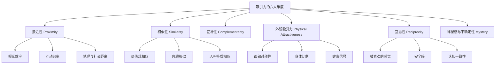
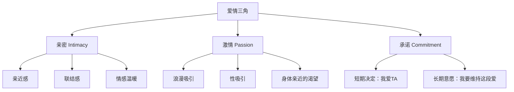
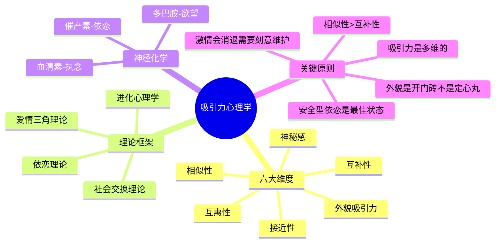

## 一、吸引力心理学

吸引力是恋爱的起点，也是贯穿整个亲密关系的核心动力。很多人把吸引力简单等同于"好看"或"有钱"，但心理学研究揭示了一个远比这复杂的系统——吸引力是生物本能、认知加工、社会环境和个体经历共同作用的产物。理解这个系统，不是为了操控别人的情感，而是为了认清规律、扬长避短，让自己成为一个真正有吸引力的人。

### 1.1 什么是吸引力？

吸引力（Interpersonal Attraction）在心理学中的定义是：**一个人对另一个人产生的、促使自己想要接近对方的积极态度和情感倾向**。这种倾向可以指向浪漫关系，也可以指向友谊或社交联结，但本章聚焦于择偶情境下的吸引力。

吸引力不是一种单一的感觉，而是多个维度同时激活的复合体验。当你被一个人吸引时，你的大脑同时在处理外貌信号、声音特质、气味信息、社会地位线索、互动中的情绪反馈等多个通道的信息。心理学家将影响吸引力的核心因素归纳为六大维度：

下面逐一展开。

#### 1.1.1 接近性（Proximity）

接近性是吸引力最基础、也最容易被忽视的因素。它的核心机制有三个：

**曝光效应（Mere Exposure Effect）**

心理学家 Robert Zajonc 在 1968 年的经典实验中发现：仅仅是反复看到某个刺激物（人脸、汉字、几何图形），就会增加对它的好感度。这个效应在人际吸引中同样成立——你和一个人见面的次数越多，就越容易对他产生好感。

关键细节：
- 曝光效应在**初期**效果最强，随着熟悉度增加会逐渐饱和
- 如果初次接触的印象是**负面的**，反复接触反而会加深厌恶感
- 曝光效应对**中性偏正面**的印象效果最好
- 线上交流（纯文字）的曝光效应远弱于面对面接触

这意味着什么？如果你对某个人的第一印象还不错，多出现在对方面前就是最简单的吸引力策略。但如果第一次见面就搞砸了，继续"刷存在感"反而适得其反。

**互动机会**

距离越近，产生互动的概率越高，互动的频率和深度也越大。Festinger、Schachter 和 Back（1950）在 MIT 学生宿舍的经典研究表明：住得越近的学生，成为朋友的概率越高，甚至"隔壁"和"隔两个门"之间的差异都很显著。

在择偶场景中，这意味着：
- 同事、同学、邻居、健身房常客、兴趣小组成员——这些"物理接近"的圈子是最大的潜在择偶池
- 纯线上社交（如交友 App）缺少物理接近性，需要额外努力来弥补

**成本考量**

人是趋利避害的动物。远距离关系需要更多的时间、精力和金钱投入，这些成本会在潜意识中降低对方的"吸引力净值"。这不是说远距离恋爱不可能，而是说它天然面临更高的门槛。

**实操建议：**
- 优先从自己的**日常社交圈**中寻找潜在对象，而不是舍近求远
- 刻意增加出现在目标圈子中的频率（报班、参加活动、换路线偶遇）
- 如果使用交友 App，尽快推进到线下见面，因为纯线上互动的吸引力天花板很低

#### 1.1.2 相似性（Similarity）

相似性是吸引力研究中**最稳健的预测因素**之一，跨越了文化、年龄和关系类型的边界。Byrne（1971）的"相似-吸引范式"（similarity-attraction paradigm）通过大量实验证明：态度越相似，吸引力越强，而且这个关系几乎是线性的。

相似性的作用机制有三层：

| 机制 | 解释 | 举例 |
|------|------|------|
| 认知验证 | 与相似的人在一起，我们的信念和选择得到确认，产生"我是对的"的安全感 | 两个都相信"工作不是人生全部"的人在一起，不会互相指责对方不上进 |
| 沟通效率 | 共享的背景知识和思维方式让沟通更顺畅，误解更少 | 同行业的人聊天不需要解释行业术语，沟通成本极低 |
| 行为预测 | 相似的人更可能有相似的需求和行为模式，让关系更可预测、更可控 | 两个都喜欢宅家的人不会因为"你为什么不出去玩"而产生冲突 |

**相似性的四个层次：**

1. **人口统计学相似性**：年龄、教育水平、收入、种族、宗教。这是最表层的相似性，但研究发现它对长期关系稳定性有显著影响——"门当户对"不是封建迷信，而是统计规律。

2. **态度和价值观相似性**：政治立场、宗教信仰、人生目标、金钱观、家庭观。这是最核心的相似性层次，也是长期关系满意度的最强预测因素。Gonzaga 等人（2007）对 eHarmony 用户的追踪研究发现，价值观相似的伴侣在三年后的关系满意度显著更高。

3. **兴趣和爱好相似性**：运动、音乐、旅行、饮食偏好。这决定了两个人在一起"能一起做什么"，对初期吸引力建设很重要，但长期来看没有价值观相似性那么关键。

4. **人格特质相似性**：大五人格（外向性、宜人性、责任心、神经质、开放性）的相似程度。研究结论比较复杂——在**宜人性**和**责任心**上相似的伴侣关系更稳定，但在**外向性**上的差异影响不大。

**一个常见的误解：** "互补才能长久"。很多人用"我内向她外向，正好互补"来合理化自己的选择。但研究数据不支持这个说法——在核心维度上的相似性远比互补性重要。互补性只在极少数特定场景下起作用（详见 1.1.3）。

**实操建议：**
- 在择偶初期，重点关注对方的**价值观**是否与你一致，而不是兴趣爱好是否相同
- 具体可以观察：对方如何谈论金钱？如何看待家庭？对工作的态度？对未来的规划？
- 不要被"表面相似"迷惑——两个都喜欢旅行的人，如果一个是为了打卡炫耀、一个是为了体验文化，那他们的"相似"其实是假象

#### 1.1.3 互补性（Complementarity）

虽然相似性是主流，但互补性在某些特定条件下确实能增强吸引力。关键是要区分"哪种互补有效，哪种互补有害"。

**有效的互补（能力与角色层面）：**

- **能力互补**：一个人擅长做饭，另一个人擅长理财，分工合作效率更高
- **角色互补**：一个人喜欢做决策，另一个人喜欢配合执行，减少权力争夺
- **社交互补**：一个人负责社交维护（约朋友、组织聚会），另一个人负责深度交流

**有害的互补（核心价值层面）：**

- 一个人节俭、另一个人挥霍——这不是互补，是冲突
- 一个人重视家庭、另一个人以事业为全部——这不是互补，是方向分歧
- 一个人情绪稳定、另一个人情绪波动大——这不是互补，是消耗

判断标准很简单：**这种差异是让两个人配合得更好，还是让两个人不断摩擦？** 如果是前者，就是有效互补；如果是后者，就是根本性不匹配。

**心理学家 Winch（1958）提出的"需求互补理论"认为：** 当一个人的特质恰好满足另一个人的核心需求时，互补性能产生强烈的吸引力。比如一个高度需要"被照顾"的人，遇到一个高度需要"照顾别人"的人，双方的需求都得到了满足。但这个理论的实证支持有限，后来的研究大多倾向于相似性更重要。

**实操建议：**
- 不要用"互补"来掩盖根本性的不匹配
- 互补性适用于"怎么做"的层面（技能、分工），不适用于"为什么做"的层面（价值观、目标）
- 最理想的关系是：**核心价值观相似，具体能力互补**

#### 1.1.4 外貌吸引力（Physical Attractiveness）

外貌在吸引力中的作用不需要回避，但也需要理性看待。

**外貌的三个心理效应：**

1. **首因效应**：初次见面时，外貌是影响第一印象的最强因素。Walster 等人（1966）在明尼苏达大学的经典"电脑舞会"实验中发现，在随机配对的舞会中，外貌吸引力是预测"是否想再次约会"的最强因素，远超人格、智力等其他因素。

2. **光环效应（Halo Effect）**：人们倾向于认为外貌有吸引力的人同时具有其他积极特质——更聪明、更善良、更有趣、更成功。Dion、Berscheid 和 Walster（1972）的研究证实了这一点，称之为"美即是好"（beautiful-is-good）刻板印象。

3. **匹配假说（Matching Hypothesis）**：人们倾向于与自己外貌吸引力水平相当的人建立关系。这并不是说每个人都能精确评估自己的吸引力，而是说长期关系中，双方的吸引力水平趋于接近——差距太大的配对在现实中较少出现，即使出现也不够稳定。

**外貌吸引力的生物学基础：**

| 特征 | 进化解释 | 性别差异 |
|------|----------|----------|
| 面部对称性 | 对称性信号发育稳定、基因质量好 | 男女都重视 |
| 皮肤光滑度 | 皮肤状态反映健康和激素水平 | 男性对女性皮肤更敏感 |
| 腰臀比（女性）| 0.7 左右的腰臀比与生育能力正相关 | 男性高度敏感 |
| 肩腰比（男性）| 宽肩窄腰信号睾酮水平和肌肉力量 | 女性适度敏感 |
| 面部成熟度 | 女性偏好略成熟的男性面部，男性偏好略年轻的女性面部 | 差异显著 |

**外貌的可控因素：**

虽然骨骼结构（面部对称性、身高）难以改变，但外貌吸引力中有大量可控因素：
- **体态与身材**：通过运动和饮食管理可以显著改善
- **穿着与风格**：合身、得体、有个人风格的穿着能大幅提升吸引力
- **发型与面部护理**：找到适合自己脸型的发型，保持皮肤清洁
- **体态语言**：站姿挺拔、眼神自信、微笑自然——这些"动态外貌"对吸引力的影响不亚于静态外貌
- **气味**：干净、清爽的气味（甚至不用香水，只是没有异味）是一个被低估的吸引力因素

**实操建议：**
- 不要因为外貌"不够好"就放弃——可控因素的改善空间远超你的想象
- 重点投资**体态、穿着、发型**这三个性价比最高的外貌维度
- 理解匹配假说：不要只盯着"远超自己水平"的对象，这会大幅降低成功率
- 外貌在初期接触中权重最高，但在关系深入后权重会下降——所以外貌是"开门砖"，不是"定心丸"

#### 1.1.5 互惠性（Reciprocity）

互惠性是吸引力中**最被低估**的因素。简单说：我们更容易被那些喜欢我们的人吸引。

互惠性的三个作用机制：

1. **自尊提升**：被人喜欢是最直接的自我价值确认。当一个人表达对你的欣赏和喜欢时，你的大脑会释放多巴胺，产生愉悦感——这种愉悦感会被"归因"到对方身上，让你觉得"和这个人在一起感觉很好"。

2. **安全感**：知道对方喜欢自己，大幅降低了被拒绝的风险。很多人在择偶中的犹豫不决，本质上是对"被拒绝"的恐惧。当互惠性信号明确时，这个恐惧被消除，人就更愿意投入。

3. **认知一致性**：人的大脑讨厌矛盾。如果我知道"对方喜欢我"，而我"不喜欢对方"，就会产生认知失调。为了减少这种不适，我可能会无意识地调整自己的态度，变得更喜欢对方。

**互惠性的微妙之处：**

- 互惠性不等于"你对我好我就喜欢你"——如果对方对你完全没有初始兴趣，你的热情表达可能被解读为"纠缠"
- 互惠性的效果在**对方已经对你有基本好感**的情况下最显著
- 表达好感的方式很重要：过度热情（每天发消息、送贵重礼物）会制造压力，适度的热情（主动聊天、偶尔关心、眼神接触）效果更好
- 不确定性会放大互惠性的效果——如果你不确定对方是否喜欢你，而对方释放了积极信号，这种"不确定性被打破"的体验会特别强烈

**实操建议：**
- 如果你对某个人有好感，**适度表达**比完全隐藏更有效
- 表达好感的方式：主动发起对话、对对方的话题表现出真诚兴趣、适当的赞美、偶尔的眼神接触
- 注意节奏：不要一次性把所有好感都倾倒出来，而是在互动中逐步释放
- 如果对方明确表示不感兴趣，互惠性策略就不再适用，尊重对方的边界

#### 1.1.6 神秘感与不确定性（Mystery & Uncertainty）

这是很多指南不会提到的第六个维度，但研究证据越来越支持它的重要性。

**不确定性效应（The Uncertainty Effect）：**

Whitchurch、Wilson 和 Gilbert（2011）在《Psychological Science》上发表的研究发现：当女性得知某个男性对自己有好感时，她们对这个男性的好感度会提升；但当她们**不确定**这个男性是否喜欢自己时，好感度提升得**更多**。

这个发现背后的机制是：不确定性会让大脑反复"反刍"关于对方的信息（"他到底喜不喜欢我？"），而这种反复思考本身就增加了对方在你心理空间中的存在感。

**神秘感的构建：**
- 不要一次性展示自己的全部——保留一些信息，让对方有持续探索的欲望
- 有自己的生活和世界——不要让对方觉得你的一切都围绕着他/她
- 偶尔出乎意料——打破对方对你的预期，制造新鲜感
- 回复消息的速度不必每次都秒回——这不是"套路"，而是保持自己生活节奏的自然表现

**警告：** 神秘感不是"装"，不是刻意制造不安全感或焦虑。健康的神秘感来自一个真正丰富、有趣的内在世界；不健康的"神秘感"来自刻意的信息隐瞒和情绪操控，后者会破坏信任基础。

### 1.2 进化心理学视角

进化心理学（Evolutionary Psychology）提供了一个宏观框架，帮助理解人类择偶偏好的深层逻辑。它的核心假设是：**人类的择偶策略是在数百万年的进化过程中被自然选择塑造的，目的是最大化基因传递的成功率。**

#### 1.2.1 亲代投资理论

生物学家 Robert Trivers（1972）提出的**亲代投资理论（Parental Investment Theory）**是理解两性择偶差异的关键框架。

核心逻辑：**在繁殖中投入更多的一方，在择偶时会更挑剔；投入较少的一方，会更倾向于争取更多的交配机会。**

在人类中：
- **女性**的亲代投资极高：9个月怀孕 + 数年哺乳 + 长期抚养，每个后代的成本巨大
- **男性**的亲代投资理论上可以很低：最低限度的基因传递只需要几分钟

这种不对称性导致了择偶策略的系统性差异。

#### 1.2.2 女性的择偶偏好

从进化角度看，女性面临的核心问题是：**如何选择一个能提供优良基因、资源和长期承诺的伴侣？**

David Buss（1989）对37个文化区域的跨文化研究发现，女性普遍更看重以下特质：

1. **资源获取能力与潜力**：不仅是当前的经济条件，更重要的是上进心、能力和前景。女性的大脑被设计为"评估潜力"而非仅仅"评估现状"。

2. **保护能力与社会地位**：在原始环境中，一个有权威和社会关系的男性更能保护家庭。现代社会中，这转化为社会地位、人脉和影响力。

3. **承诺信号**：女性特别警惕"交配后逃跑"的风险，因此会高度敏感于承诺信号——愿意花时间陪伴、愿意介绍给朋友家人、愿意为未来做规划。

4. **健康与基因质量**：面部对称性、体态匀称、皮肤状态——这些都是基因质量的外在信号。但有趣的是，女性对"外貌"的重视程度随月经周期变化：排卵期前后更偏好"男性化"的面部特征（高睾酮信号），其他时期更偏好"温和"的面部特征。

5. **情绪稳定性与宜人性**：一个情绪稳定、善于沟通、有同理心的伴侣，在长期关系中带来的合作收益远大于一个"高冷但优秀"的伴侣。

#### 1.2.3 男性的择偶偏好

男性面临的核心问题是：**如何最大化繁殖机会，同时确保后代确实是自己的？**

1. **生育能力信号**：年轻、健康、外貌吸引力——这些信号指向更高的生育能力。男性对"年轻"的偏好在跨文化研究中非常稳健（Buss, 1989），平均而言男性偏好比自己年轻2-3岁的女性。

2. **忠诚度信号**：男性的"亲子确定性"（paternity certainty）焦虑是独特的——女性100%确定孩子是自己的，男性则不能。这解释了为什么男性在历史上对"性忠诚"的要求往往更严格。

3. **温柔与照顾能力**：善于照顾孩子和家庭的女性，在进化环境中意味着更高的后代存活率。

#### 1.2.4 进化心理学的现代解读与局限

**重要提醒：进化偏好 ≠ 现代选择**

进化心理学描述的是**统计趋势**，不是个体命运。以下几点需要明确：

1. **文化塑造力极强**：现代社会中，女性的经济独立程度大幅提高，"资源获取能力"对女性择偶的影响力在下降。研究发现，在性别平等程度越高的国家，女性对外貌的重视程度越高，对经济条件的重视程度越低。

2. **个体差异大于性别差异**：虽然存在统计上的性别差异，但个体之间的差异远大于性别之间的差异。不要用"女性都……"或"男性都……"来预测具体某个人的偏好。

3. **进化偏好可以被覆盖**：人类有理性思考的能力，可以通过自我反思认识到自己的偏好来源，并做出更理性的选择。

4. **不应成为性别刻板印象的借口**：进化心理学描述"是什么"，不规定"应该怎样"。用进化论来合理化不尊重伴侣的行为（如"男人天生花心"）是对科学的滥用。

**实操建议：**
- 作为男性，理解女性对"承诺信号"和"情绪稳定性"的重视——这两点的提升空间远大于外貌和财富
- 作为女性，理解男性对"被尊重"和"被需要"的重视——适度展现对对方的欣赏和依赖
- 无论性别，都要认识到现代社会的择偶逻辑在快速变化，不要机械套用进化理论

### 1.3 依恋理论与吸引力

依恋理论（Attachment Theory）最初由 John Bowlby（1969）提出，后来被 Hazan 和 Shaver（1987）扩展到成人恋爱关系中。它是理解"你为什么总是被某一类人吸引"以及"你在关系中的行为模式"的最有力工具。

#### 1.3.1 三种依恋风格

| 依恋风格 | 核心信念 | 在关系中的表现 | 大致占比 |
|----------|----------|----------------|----------|
| 安全型 | "我是值得被爱的，别人是可以信任的" | 能自在地亲密，也能自在地独立；冲突时沟通而非逃避或爆发 | 约 56% |
| 焦虑型 | "我不够好，别人可能会离开我" | 渴望亲密但害怕被抛弃；过度关注对方的回应；容易"作"和试探 | 约 20% |
| 回避型 | "靠自己最安全，亲密是危险的" | 重视独立和自由；在关系深入时本能地退缩；压抑情感需求 | 约 25% |

（注：部分研究者将回避型进一步分为"疏离型回避"和"恐惧型回避"，后者同时渴望亲密又害怕亲密。）

#### 1.3.2 依恋风格如何影响吸引力

一个反直觉但被反复验证的发现是：**焦虑型和回避型之间存在强烈的相互吸引。**

原因在于：
- 焦虑型的"追求"行为给了回避型被需要的感觉（满足了其自尊需求）
- 回避型的"若即若离"给了焦虑型"不确定性"——恰好激活了焦虑型最敏感的"被抛弃"恐惧回路，让焦虑型更加"上瘾"
- 两个人形成了一个"追-逃"循环：焦虑型越追，回避型越逃；回避型越逃，焦虑型越追

这个循环看起来像"强烈的吸引力"，但实际上是**不安全依恋模式的互相激活**。它带来的情绪波动（忽冷忽热、患得患失）会被误认为"深爱"，因为情绪强度确实很高——但这种高强度来自焦虑，不是来自安全感和信任。

**真正的健康吸引力是什么样的？**

安全型依恋者之间的吸引力通常不会表现为"电光火石"的强烈感觉，而是表现为：舒服、信任、可预期、温暖。很多习惯了不安全依恋模式的人会觉得安全型关系"没有激情"——这本身就是一个值得反思的信号。

#### 1.3.3 识别自己的依恋风格

以下是几个快速自测问题：

**焦虑型信号：**
- 对方没回消息时，你会反复查看手机并感到焦虑吗？
- 你需要频繁的确认和保证才能感到安心吗？
- 你害怕对方"发现真实的你"后会离开吗？
- 你在关系中经常觉得自己"付出太多"？

**回避型信号：**
- 当关系变得亲密时，你会本能地想要"空间"吗？
- 你倾向于用"独立"来回避情感需求吗？
- 你觉得表达脆弱是一种"软弱"吗？
- 你在关系中经常觉得对方"太黏人"？

**安全型信号：**
- 你能坦然表达自己的需求和感受吗？
- 对方不在身边时，你能安心做自己的事吗？
- 冲突时，你倾向于沟通解决而不是冷战或爆发？
- 你相信对方的基本善意，不会过度解读对方的行为？

**实操建议：**
- 如果你发现自己是焦虑型或回避型，不必恐慌——依恋风格可以改变，这叫"习得安全"（earned security）
- 改变的途径包括：心理咨询、正念练习、与安全型伴侣的互动体验、以及有意识地识别和调整自己的自动化反应模式
- 在择偶时，优先寻找安全型的伴侣——他们能为你提供一个"安全基地"，帮助你逐步建立安全依恋模式

### 1.4 社会交换与公平理论

#### 1.4.1 社会交换理论

社会交换理论（Social Exchange Theory, Thibaut & Kelley, 1959）认为，人际关系本质上是一种**资源交换系统**。人们在关系中追求"收益最大化、成本最小化"。

**核心概念：**

- **收益（Rewards）**：从关系中获得的积极体验——情感支持、陪伴、性、经济帮助、社会地位提升、自我成长等
- **成本（Costs）**：维持关系需要付出的代价——时间、精力、金钱、自由度减少、情绪消耗、机会成本等
- **比较水平（Comparison Level, CL）**：你认为自己"理应"从关系中获得的收益水平，基于过往经验、社会参照和个人期望
- **替代比较水平（Comparison Level for Alternatives, CLalt）**：你认为从其他关系（包括单身状态）中能获得的收益水平

**关系决策的三条规则：**

收益 > CL        →  对关系感到满意
收益 > CLalt     →  倾向于维持关系
收益 < CLalt     →  可能离开关系

注意：满意和维持是两件事。一个人可能对关系不满意（收益 < CL），但因为没有更好的替代选择（收益 > CLalt）而留下来——这种关系虽然稳定，但质量不高。

#### 1.4.2 Rusbult 的投资模型

心理学家 Caryl Rusbult（1980, 1983）提出的投资模型（Investment Model）扩展了社会交换理论，指出关系承诺度由三个因素决定：

1. **满意度**：关系收益是否超过比较水平
2. **替代选择质量**：是否有更好的选择
3. **投资规模**：在关系中投入了多少（时间、情感、共同财产、共同社交圈、共同回忆）

第三个因素——投资——是关键的增量。它解释了为什么很多人在不幸福的关系中仍然不离开：已经投入了太多，离开意味着所有投资"沉没"。

#### 1.4.3 公平理论

公平理论（Equity Theory, Walster, Walster & Berscheid, 1978）补充了一个重要维度：**关系中的公平感**。

研究发现，最稳定、最满意的关系不是"收益最大化"的关系，而是**双方都觉得自己获得的与付出的大致公平**的关系。

不公平的两种形态：
- **过度获益**：你得到的比付出的多——短期爽，但长期会产生内疚感或不安感
- **不足获益**：你付出的比得到的多——产生怨恨、愤怒和疲惫感

**实操建议：**
- 提升自己的"关系价值"：让自己成为对方生活中积极的、不可替代的存在
- 关注公平感：不一定要精确计算，但要确保双方都觉得自己"大致公平"
- 不要用"沉没成本"绑架自己或对方：已经投入的不应该成为继续痛苦的理由
- 持续投资关系：共同经历、共同回忆、共同目标——这些"共享资产"是关系的粘合剂

### 1.5 Sternberg 的爱情三角理论

心理学家 Robert Sternberg（1986）提出的**爱情三角理论（Triangular Theory of Love）**是理解"吸引力如何发展为爱情"的经典框架。

#### 1.5.1 爱情的三个成分

- **亲密（Intimacy）**：情感上的亲近、联结和温暖。包括理解、支持、分享、信任、关心等。亲密是爱情的"慢变量"——需要时间积累，不会突然出现或消失。

- **激情（Passion）**：浪漫吸引、性吸引、身体亲近的渴望。激情是爱情的"快变量"——可以迅速点燃，也会逐渐消退。初期的激情主要由生理反应（多巴胺、去甲肾上腺素、苯乙胺）驱动，后期则需要亲密来维持。

- **承诺（Commitment）**：短期是"我决定爱这个人"，长期是"我决定维持这段爱"。承诺是爱情的"理性成分"——它需要在激情消退后，仍然选择留在这段关系中。

#### 1.5.2 七种爱情类型

| 爱情类型 | 亲密 | 激情 | 承诺 | 典型表现 |
|----------|------|------|------|----------|
| 喜欢 | ✓ | ✗ | ✗ | 真正的友谊，有亲密但没有浪漫 |
| 迷恋 | ✗ | ✓ | ✗ | 一见钟情、暗恋、没有深入了解的强烈吸引 |
| 空洞的爱 | ✗ | ✗ | ✓ | 只剩责任和义务的关系 |
| 浪漫之爱 | ✓ | ✓ | ✗ | 有亲密有激情，但还没有做出长期承诺 |
| 伴侣之爱 | ✓ | ✗ | ✓ | 激情消退后的长期关系，像"最好的朋友" |
| 愚昧之爱 | ✗ | ✓ | ✓ | 闪婚、激情驱动的快速承诺 |
| 完美之爱 | ✓ | ✓ | ✓ | 三个成分都充分，是最理想的爱情形态 |

**关键洞察：**

1. **完美之爱是稀缺的**：三个成分同时饱满的状态不常见，不必因为自己的关系"不够完美"而焦虑。

2. **爱情类型会变化**：关系初期通常是"浪漫之爱"（亲密+激情），随着时间推移可能变为"伴侣之爱"（亲密+承诺）。这是正常的演变，不是"爱情消失了"。

3. **激情的消退是生理规律**：多巴胺系统的适应性意味着，同一个人带来的激情刺激会随时间递减。这不是"不爱了"，而是大脑的适应机制。维持激情需要双方刻意的努力——新鲜体验、共同冒险、保持个人魅力。

4. **亲密是最稳定的成分**：如果三个成分中只能选一个来投资，选亲密。亲密是长期关系满意度的最强预测因素，也是激情消退后维持关系的核心力量。

**实操建议：**
- 初期关系：不要只依赖激情，也要开始建设亲密——深入的对话、脆弱的分享、共同经历
- 中期关系：当激情开始消退时，不要恐慌，这是正常现象。重点转向深化亲密和建立承诺
- 长期关系：刻意创造新鲜体验来"重启"激情系统，同时持续投资亲密和承诺

### 1.6 吸引力的神经化学

了解吸引力背后的神经化学机制，可以帮助你理解"为什么我会这样感觉"，以及如何用科学的方式管理自己的情绪。

#### 1.6.1 三种神经递质系统

**多巴胺系统（欲望与奖赏）：**
- 多巴胺是"想要"的化学物质，不是"喜欢"的化学物质
- 当你期待见到某个人、期待对方的消息时，多巴胺系统被激活
- 多巴胺驱动的吸引力表现为：强迫性想念、注意力集中、精力充沛、食欲下降
- 这就是为什么"心动"的感觉和"上瘾"的感觉如此相似——它们共享同一套神经回路

**催产素系统（依恋与信任）：**
- 催产素在身体接触、性行为、深度对话时大量释放
- 它促进信任感、安全感和亲密感
- 催产素驱动的吸引力表现为：平静、温暖、想靠近、想被触碰
- 这是长期关系的"粘合剂"

**血清素系统（执念与反刍）：**
- Marazziti 等人（1999）发现，热恋初期的人血清素水平与强迫症患者相似
- 低血清素导致对恋人的"反刍性思考"——反复回想、过度分析、无法控制
- 这解释了为什么热恋中的人会"满脑子都是对方"

#### 1.6.2 吸引力的时间线

- **0-3个月（热恋期）**：多巴胺和去甲肾上肾素大量释放，血清素降低。表现为精力充沛、注意力集中、睡眠减少、食欲下降。这个阶段的"爱情是盲目的"有生物学基础——大脑的判断中枢被奖赏系统压制。

- **3-18个月（过渡期）**：多巴胺水平开始下降，催产素和加压素开始增加。从"疯狂的想要"转变为"平静的依恋"。很多人在这个阶段误以为"不爱了"，实际上是爱情在转变形态。

- **18个月以后（依恋期）**：催产素和加压素主导。关系进入"安全依恋"阶段。如果亲密基础扎实，这个阶段会非常舒适和稳定；如果基础不牢，关系可能在这个阶段瓦解。

### 1.7 吸引力的常见误区

#### 误区一："有钱/帅就能吸引所有人"

**现实：** 外貌和财富确实是吸引力因素，但它们只是众多因素中的两个。一个有钱但情绪不稳定、缺乏同理心、无法进行深度对话的人，在长期关系中的吸引力会迅速下降。研究发现，在控制了其他变量后，收入对关系满意度的预测力相当有限（<5%的解释力）。

#### 误区二："对她好就能让她喜欢我"

**现实：** 好感的表达需要建立在**基本吸引力**之上。如果对方对你完全没有初始兴趣，持续的"对她好"不会创造吸引力，反而可能被解读为压力或纠缠。这就是所谓的"好人陷阱"——不是"好人"不好，而是"好人"误以为单靠好就能产生吸引力。

#### 误区三："吸引力是天生的，无法改变"

**现实：** 虽然部分吸引力因素（如面部骨骼结构、身高）确实难以改变，但大量因素是可以改变的：体态、穿着、自信程度、社交能力、幽默感、情绪稳定性、生活丰富度。一项纵向研究发现，通过系统性的社交技能训练，参与者的吸引力评分平均提升了30%以上。

#### 误区四："我需要变成对方喜欢的样子"

**现实：** 试图"变成别人"不仅不可持续，而且会降低你的吸引力——因为不真诚是最强的吸引力杀手。真正有效的是：**成为最好版本的自己**。这意味着放大你的优势，管理你的劣势，而不是假装成另一个人。

#### 误区五："强烈的吸引力 = 合适的伴侣"

**现实：** 如 1.3.2 节所述，强烈的吸引力有时来自不安全依恋模式的互相激活。"忽冷忽热"带来的高强度情绪波动会被误认为"深爱"，但它实际上可能是一种不健康的依赖模式。真正适合长期关系的吸引力应该是：舒适、信任、可预期——而不是持续的焦虑和不确定。

### 1.8 自我评估：你的吸引力画像

在了解了吸引力的理论框架后，做一个系统的自我评估，找到你的优势和提升空间。

**评估维度：**

| 维度 | 自评（1-10） | 具体行动 |
|------|-------------|----------|
| 外貌管理（穿着、发型、体态） | __ /10 | 最需要改善的一项：________ |
| 社交能力（聊天、倾听、幽默） | __ /10 | 最需要改善的一项：________ |
| 情绪稳定性（自控力、安全感） | __ /10 | 最需要改善的一项：________ |
| 生活丰富度（兴趣、事业、社交圈） | __ /10 | 最需要改善的一项：________ |
| 价值观清晰度（知道自己要什么） | __ /10 | 最需要改善的一项：________ |
| 共情能力（理解他人感受的能力） | __ /10 | 最需要改善的一项：________ |

**使用方法：**
1. 诚实评估自己的每个维度
2. 找到得分最低的2-3个维度作为优先提升方向
3. 每个维度设定一个具体的、可执行的改善计划
4. 三个月后重新评估，调整方向

### 1.9 本章总结

**核心要点回顾：**

1. **吸引力是多维的**：不要把吸引力简化为任何一个单一因素。外貌、性格、能力、价值观、社交圈、生活状态——每一个维度都在贡献吸引力。

2. **相似性是基础，互补性是点缀**：在核心价值观上寻找相似的人，在具体能力上接受互补的差异。

3. **外貌可以管理，但不是全部**：投资外貌管理的性价比很高，但不要把所有希望都押在外貌上。自信、幽默、情绪稳定性对吸引力的贡献同样巨大。

4. **理解自己的依恋风格**：你是安全型、焦虑型还是回避型？这个自我认知会帮助你理解自己在关系中的行为模式，以及为什么你会被某一类人吸引。

5. **吸引力需要维护**：初期的吸引力主要由多巴胺驱动，但长期关系需要催产素和承诺来维持。不要把"激情消退"等同于"不爱了"。

6. **成为最好版本的自己**：吸引力的终极来源不是伪装和套路，而是一个真正丰富、自信、温暖的人格。投入自我成长，吸引力是自然的副产品。

下一章，我们将探讨如何将这些理论转化为实际的择偶策略和行动方案。
