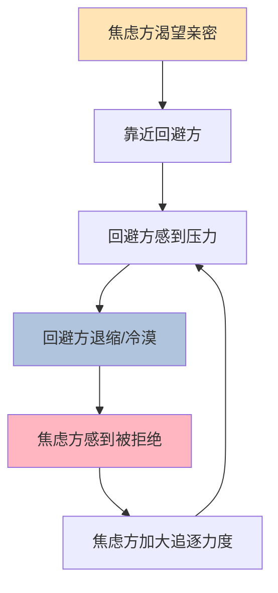

## 二、依恋理论

依恋理论是理解恋爱关系最有力的心理学框架之一。它回答了一个根本问题：**为什么我们在亲密关系中会表现出特定的模式——为什么有人粘人、有人冷漠、有人忽冷忽热？** 这些行为并非偶然，而是根植于早期依恋经历形成的内部工作模型。理解依恋理论，不仅能帮你诊断自己和对方的关系模式，还能提供改变的具体路径。

### 2.1 依恋理论的起源与发展

#### 2.1.1 Bowlby 的奠基工作

依恋理论（Attachment Theory）由英国精神分析学家约翰·鲍尔比（John Bowlby）在1950-1980年代提出。Bowlby 在伦敦塔维斯托克诊所工作时观察到，被送往寄养机构或医院的婴幼儿，即使物质需求得到满足，仍然表现出严重的心理问题。他由此得出结论：

**依恋行为是进化形成的生存机制。** 婴儿与照顾者之间的情感纽带不是副产品，而是基因编码的生存策略。在人类进化史中，与照顾者保持紧密联系的婴儿更容易存活。因此，依恋系统与饥饿、恐惧系统一样，是人类的基本动机系统。

Bowlby 提出了"内部工作模型"（Internal Working Model）这一核心概念：婴儿通过与主要照顾者（通常是母亲）的反复互动，形成了一套关于"自我是否值得被爱"和"他人是否可靠"的心理表征。这套表征一旦形成，就会成为一种"滤镜"，影响个体一生的人际关系——尤其是亲密关系。

#### 2.1.2 Ainsworth 的陌生情境实验

Mary Ainsworth 是 Bowlby 的同事和合作者，她在1960-1970年代通过著名的"陌生情境实验"（Strange Situation Procedure），将依恋从理论推进到了可观察、可分类的科学。

实验过程：让12-18个月的婴儿经历以下情境——
1. 母亲和婴儿在一个陌生房间
2. 陌生人进入
3. 母亲离开
4. 母亲返回

通过观察婴儿在母亲离开时的反应和母亲返回时的行为，Ainsworth 识别出三种依恋模式：

| 类型 | 母亲离开时 | 母亲返回时 | 核心特征 |
|------|-----------|-----------|---------|
| 安全型（B型） | 适度不安，能自我安抚 | 积极寻求接触，很快平静 | 信任母亲会回来 |
| 焦虑-矛盾型（C型） | 极度痛苦，难以安抚 | 既寻求接触又表现出愤怒/矛盾 | 不确定母亲是否会回应 |
| 回避型（A型） | 表面平静，不表达不安 | 回避或忽略母亲 | 学会了不指望回应 |

后来，Main 和 Solomon（1986）补充了第四种——**紊乱型/混乱型（D型）**，表现为缺乏一致的应对策略，行为矛盾且混乱，通常与创伤性照顾经历相关。

#### 2.1.3 Hazan & Shaver 的成人依恋研究

1987年，Cindy Hazan 和 Phillip Shaper 发表了一篇里程碑式的论文，将依恋理论从婴儿领域扩展到成人恋爱关系。他们发现：

1. 成人恋爱关系与婴儿-照顾者关系具有相同的核心特征：亲密寻求、分离焦虑、安全基地
2. 成人的恋爱风格可以像婴儿依恋一样分类为安全型、焦虑型、回避型
3. 人们报告的恋爱风格与童年经历存在显著相关

这一发现意味着：**恋爱关系在很大程度上是依恋系统的"成人版"激活。** 当你说"我想你了"、"你为什么不回我消息"、"我需要自己的空间"时，你正在表达的，是依恋系统在不同模式下的反应。

#### 2.1.4 Bartholomew 的四分类模型

1991年，Kim Bartholomew 和 Leonard Horowitz 提出了更精细的成人依恋分类。他们认为成人依恋可以用两个维度来理解：

- **自我模型（Model of Self）**：我认为自己值得被爱吗？（积极/消极）
- **他人模型（Model of Others）**：我认为他人是可靠、可回应的吗？（积极/消极）

两个维度交叉，形成四种依恋类型：

|  | 他人模型：积极 | 他人模型：消极 |
|--|--------------|--------------|
| **自我模型：积极** | 安全型（Secure） | 疏离-回避型（Dismissing-Avoidant） |
| **自我模型：消极** | 焦虑-矛盾型（Anxious-Preoccupied） | 恐惧-回避型（Fearful-Avoidant） |

这个二维模型比早期的三分类模型更精确，因为它解释了为什么同为"回避型"，疏离型和恐惧型的表现截然不同——疏离型对自己的评价是积极的（"我不需要别人"），而恐惧型对自己的评价是消极的（"我想要爱但我不配"）。

### 2.2 四种依恋类型的深度解析

#### 2.2.1 安全型依恋（Secure Attachment）

**内部工作模型：** "我是值得被爱的，他人是可以信赖的。"

安全型依恋者约占人群的50-60%。他们并非没有情绪波动或从不焦虑，而是在关系中拥有一种基本的"底层安全感"——即使伴侣暂时不在、发生冲突或遇到困难，他们相信关系是有弹性的，自己是有能力应对的。

**在恋爱不同阶段的表现：**

*暧昧/追求阶段：*
- 表达好感时自然、直接，不玩欲擒故纵
- 被拒绝后能适度难过但不会崩溃，能继续生活
- 不急于确定关系，也不刻意拖延节奏
- 能坦诚自己的感受和意图

*关系建立阶段：*
- 逐渐增加亲密感，不急于加速也不刻意保持距离
- 能讨论"我们是什么关系"而不感到尴尬
- 设立合理的边界，并尊重对方的边界
- 冲突发生时直面问题，不冷战也不爆发

*长期关系阶段：*
- 维持稳定的亲密感，不因熟悉而疏远
- 在独立和依赖之间保持健康的平衡
- 面对生活压力（经济、育儿、家庭变故）时能与伴侣协作应对
- 愿意为关系做出牺牲，但不牺牲自我核心需求

**如何识别安全型的人（具体行为指标）：**
- 回消息的频率稳定，不会忽快忽慢制造焦虑
- 说了"晚安"就真的是晚安，不会突然消失
- 吵架后会主动修复关系，不会冷战数天
- 能说出"我现在有点难过"而不是用行为发泄
- 朋友和家人的评价基本一致："这个人靠谱"
- 对前任的评价相对客观，不过度美化也不过度诋毁

**安全型并非完美：** 安全型依恋者也会犯错、也会自私、也会有情绪失控的时候。安全型的核心不是"永远正确"，而是"出了问题能修复"。他们拥有更强的情绪调节能力和关系修复意愿。

#### 2.2.2 焦虑型依恋（Anxious-Preoccupied Attachment）

**内部工作模型：** "我不够好，我需要通过获得他人的爱来证明自己的价值。"

焦虑型依恋者约占人群的20-25%。他们的核心焦虑不是"对方不爱我"，而是"我无法确定对方是否爱我"——不确定性本身就是最大的折磨。

**焦虑型的内在体验：**

对焦虑型来说，恋爱就像一场永无止境的考试，而你永远不知道自己是否及格。伴侣的每一条消息、每一个表情、每一次回复的速度，都是需要解读的"信号"。这种持续的监控状态消耗大量心理能量，导致焦虑型在关系中经常感到疲惫。

焦虑型并非"作"或"无理取闹"。他们的大脑真的在高负荷运转——杏仁核对关系威胁信号的敏感度远高于安全型，一旦检测到潜在的"被抛弃"信号，就会触发强烈的焦虑和行动冲动。

**在恋爱不同阶段的表现：**

*暧昧/追求阶段：*
- 迅速投入感情，可能在第一次约会后就开始想象未来
- 频繁查看对方是否在线、是否已读
- 过度分析对方的每一句话、每一个行为
- 可能过早表达强烈感情，吓退对方
- 被拒绝后反应强烈，可能反复联系或长时间痛苦

*关系建立阶段：*
- 渴望快速确定关系，对"暧昧期"感到极度不安
- 需要频繁的确认："你喜欢我吗？""我们在一起对吗？"
- 对伴侣与其他异性的任何互动都高度警觉
- 可能为了维持关系而放弃自己的需求和底线
- 用"测试"来确认对方的爱（如故意不回消息看对方是否着急）

*长期关系阶段：*
- 持续需要情感保证，即使关系已经很稳定
- 伴侣的任何独立行为（加班、和朋友聚会）都可能引发不安
- 在冲突中倾向于过度道歉或过度情绪化
- 可能发展出控制行为（查手机、限制社交）来缓解焦虑

**焦虑型的典型行为模式（对照自查）：**

- 发了一条消息后，每隔几分钟就看一次手机
- 对方回复慢了，脑子里立刻编出"不爱我了"的故事
- 明明生气了却说"没事"，因为害怕冲突导致分手
- 看到伴侣和异性互动就心跳加速、胃部紧缩
- 为了不让对方离开，答应自己其实不愿意的事情
- 关系中反复确认："你爱我吗？你确定吗？"
- 分手后很难走出来，可能持续数月甚至数年
- 快速进入下一段关系，无法忍受单身状态

**焦虑型的形成原因（深入机制）：**

焦虑型依恋的形成通常与"不一致的照顾"有关——照顾者有时热情回应，有时漠不关心，孩子无法预测何时能得到爱。这种不可预测性导致孩子发展出一种策略：**放大情绪信号来提高获得回应的概率。**

具体场景举例：
- 母亲心情好时对孩子百般宠爱，心情差时完全忽视——孩子学会了"我必须时刻关注妈妈的情绪，并用强烈的方式表达需求"
- 父母的爱是有条件的："你考第一名我才爱你"——孩子内化了"我必须足够好才值得被爱"
- 家庭中存在情感勒索："你不听话妈妈就不要你了"——孩子形成了"爱是随时可能被撤回的"这一信念
- 早期经历过真实的分离或丧失（父母出差、离婚、亲人去世）——"被抛弃"从假设变成了记忆

**给焦虑型的实操建议：**

*自我安抚技术（当焦虑发作时）：*

1. **STOP技术**：停下来(Stop)→深呼吸(Take a breath)→观察自己的想法(Observe)→选择理性回应而不是冲动反应(Proceed)
2. **时间延迟法**：想发消息轰炸前，强制等待30分钟。30分钟后你很可能发现情绪已经下降了一半
3. **现实检验法**：写下"我现在的想法"和"支持/反对这个想法的证据"。例如："他没回消息=他不爱我了"——支持证据：无；反对证据：他昨天说爱我、他可能在开会、他以前也回复慢过
4. **身体锚定法**：焦虑时注意力集中在身体感觉上——感受脚底与地面的接触、手掌的温度、呼吸的节奏。这能激活副交感神经系统，降低焦虑水平

*长期建设：*

1. 建立独立于恋爱关系的自我价值来源——事业、兴趣、友谊、个人成长
2. 学会区分"我需要你"和"我想要你"——前者是依赖，后者是选择
3. 选择安全型伴侣——他们的稳定性和一致性会帮你逐步重建安全感
4. 考虑心理咨询——特别是情绪聚焦疗法（EFT），专门针对依恋问题

#### 2.2.3 疏离-回避型依恋（Dismissing-Avoidant Attachment）

**内部工作模型：** "我是强大的、独立的；亲密关系是不必要的，甚至是危险的。"

疏离-回避型约占人群的20-25%。与焦虑型相反，他们通过压抑依恋需求来保护自己。他们并非没有情感，而是学会了将情感隔离在意识之外。

**回避型的内在体验：**

回避型的内心世界比表面看起来复杂得多。表面上他们自信、独立、不需要别人，但这种"独立"很多时候是一种防御机制——**因为曾经需要别人的时候没有得到回应，所以学会了"不需要"。**

回避型对亲密感有一种隐秘的恐惧。当关系变得越来越近时，他们会感到一种说不清的压迫感——不是对方做了什么，而是"太近了"本身就触发了警报。这种感觉很难用语言描述，就像恐高的人站在高处一样——你知道不会掉下去，但身体就是抗拒。

**在恋爱不同阶段的表现：**

*暧昧/追求阶段：*
- 享受追求的过程——这个阶段距离适中，不会威胁到独立性
- 擅长"表演亲密"——会说正确的话、做正确的事，但内心保持距离
- 可能在关系即将确定时突然冷淡或消失
- 更容易被"得不到的人"吸引——因为不可得性意味着安全

*关系建立阶段：*
- 当伴侣表达亲密需求时感到窒息
- 倾向于用行动（送礼物、帮忙做事）而不是语言表达感情
- 回避讨论感情话题："有什么好说的，我对你好不就行了"
- 在冲突中选择沉默或离开，而不是面对
- 可能发展出"关系中的关系"——把情感需求分散到朋友、工作、兴趣上

*长期关系阶段：*
- 维持一种"功能性亲密"——生活上的合作顺畅，但情感连接表面化
- 在伴侣最需要情感回应时（如悲伤、恐惧）最容易退缩
- 可能用"理性"来回应伴侣的情绪："你不应该这么想"
- 当伴侣离开时才意识到自己的真实感受——"失去后才懂得珍惜"

**回避型的典型行为模式（对照自查）：**

- 被问"你在想什么"时感到烦躁或不自在
- 在关系深入时产生"我需要空间"的强烈冲动
- 更愿意用文字而不是面对面表达深层感受
- 经常觉得自己"给不够"——不是不想给，是真的不知道怎么给
- 独处时感到最放松、最像自己
- 伴侣的哭泣或情绪爆发让你感到想逃跑而不是想安慰
- 对"我爱你"这句话感到不自在——说出口觉得假，听到了觉得有压力
- 可能同时维系多段浅层关系，避免任何一段变得太深

**回避型的形成原因（深入机制）：**

回避型依恋的形成通常与"情感忽视"有关——照顾者提供了物质需求，但在情感回应上持续缺席。

具体场景举例：
- 父母"很忙"——物质上从未短缺，但情感上从未在场。孩子哭闹时得到的是"别哭了"而不是拥抱
- 表达情感被惩罚或嘲笑："男孩子哭什么""这么大的人还撒娇"
- 家庭氛围压抑，不允许表达负面情绪——"不许生气""有什么好难过的"
- 照顾者自身就是回避型——从未示范过如何表达和接受亲密
- 过早独立："你要学会自己照顾自己"——孩子从中学到"依赖别人是软弱的"

**给回避型的实操建议：**

*渐进式亲密练习：*

1. **每日一分钟分享**：每天选一件今天发生的事，用感受词（开心、焦虑、失望、期待）描述给伴侣。从简单开始："今天午饭吃到了好吃的面，挺开心的"
2. **身体接触梯度**：从你舒适的身体接触距离开始，每周稍微推进一点——牵手→拥抱→依偎。不是为了对方，是为了你自己练习耐受亲密
3. **情绪词汇扩展**：回避型通常只识别"还行"和"不爽"两种情绪。尝试每天用更精细的词汇描述感受——不是"还行"，而是"满足"、"平静"、"无聊"、"淡淡的开心"
4. **需求表达练习**：每周至少一次主动向伴侣表达一个需求——"我今天想一个人待一会儿"也是需求表达。练习说出需求而不是直接行动（直接消失）

*认知重构：*

- "独立"和"亲密"不是对立的。真正的独立是有能力选择亲密，而不是被迫回避亲密
- 伴侣的亲密需求不是"黏人"——就像你的空间需求不是"冷漠"一样。两种需求都是正常的
- 表达情感不是软弱——它需要的勇气比压抑情感更多

#### 2.2.4 恐惧-回避型依恋（Fearful-Avoidant Attachment）

**内部工作模型：** "我想要爱，但爱是危险的。我不值得被爱，别人也不可靠。"

恐惧-回避型是最复杂、最痛苦的依恋类型，约占人群的5-10%。他们是焦虑型和回避型的混合体——内心同时存在对亲密的强烈渴望和强烈恐惧。

**恐惧-回避型的内在体验：**

如果说焦虑型的痛苦是"害怕被抛弃"，回避型的痛苦是"害怕失去自我"，那么恐惧-回避型的痛苦是**两者兼有**。他们像一个同时害怕水和口渴的人——靠近水想喝，靠近了又怕被淹死。

这种内在冲突导致了一种独特的"靠近-退缩"循环：孤独时渴望亲密→找到伴侣→关系变近→恐惧被激活→推开伴侣→伴侣离开→孤独→循环重启。每一次循环都强化了"我不值得被爱"和"别人不可靠"的信念，形成一个越来越紧的死结。

**在恋爱中的典型模式：**

- **关系中的"人格切换"**：有时候像焦虑型一样粘人、需要保证，有时候像回避型一样冷漠、推开对方。伴侣常常感到困惑："你到底想怎样？"
- **理想化-贬低循环**：初期把伴侣理想化（"终于找到对的人了"），然后在亲密感增加后开始贬低（"其实ta也没那么好"）——这是为了合理化自己的退缩
- **自我破坏**：在关系变好时"搞事情"——吵架、出轨、冷暴力、突然分手。因为"变好"本身就让他们不安——"好事不会持久""我不配拥有幸福"
- **对被抛弃和被困住的双重恐惧**：一方面害怕伴侣离开，另一方面害怕在关系中"被困住"

**恐惧-回避型的形成原因：**

恐惧-回避型几乎总是与早期创伤有关：
- 童年虐待（身体、情感或性虐待）——照顾者既是爱的来源又是伤害的来源
- 照顾者有精神疾病或成瘾问题——行为完全不可预测
- 经历过家庭暴力——"家"同时是安全的地方和危险的地方
- 早期被遗弃或反复更换照顾者
- 经历过重大丧失且未得到妥善处理

**给恐惧-回避型的建议：**

恐惧-回避型是最需要专业帮助的类型。自助策略有一定作用，但很难单独解决问题。建议：

1. **优先寻求专业心理咨询**——特别是创伤知情的治疗方法，如EMDR（眼动脱敏与再处理）、体感疗法（Somatic Experiencing）、内部家庭系统疗法（IFS）
2. **学习"窗口耐受"概念**——每个人都有一个情绪耐受窗口。窗口之内能正常思考和行动，窗口之外就会过度激活（焦虑爆发）或关闭（情感麻木）。目标是逐步扩大这个窗口
3. **建立"安全基地网络"**——不要只依赖一个伴侣。建立包括朋友、家人、咨询师在内的支持网络，分散依恋压力
4. **在关系中练习"慢"**——恐惧-回避型最容易被强烈的情感所吸引，而最健康的关系往往是缓慢建立的。刻意选择"感觉平淡但安全"的人，而不是"感觉强烈但动荡"的人
5. **对自己有耐心**——改变恐惧-回避型的依恋模式是一个以年为单位的过程。每一次"靠近-退缩"循环中退缩的距离比上一次少一点，就是进步

### 2.3 依恋风格的科学评估

#### 2.3.1 自我评估：ECR 量表简版

最广泛使用的成人依恋评估工具是"亲密关系经历量表"（Experiences in Close Relationships, ECR）。以下是基于 ECR 简化的核心自测维度：

**焦虑维度（1-7分，1=完全不符合，7=完全符合）：**

1. 我担心伴侣不像我爱ta那样爱我
2. 我害怕被抛弃
3. 我担心伴侣对我不像我对ta那样投入
4. 我需要伴侣反复确认ta爱我
5. 当伴侣不在我身边时，我会担心ta是否在找别人
6. 当伴侣不回应我时，我会感到焦虑

**回避维度（1-7分，1=完全不符合，7=完全符合）：**

1. 我不习惯向伴侣表达情感需求
2. 我不喜欢依赖伴侣
3. 我不喜欢伴侣依赖我
4. 我在关系中需要大量的独立空间
5. 我在伴侣表达亲密需求时感到不自在
6. 我觉得说出内心感受很困难

**计算方法：**
- 焦虑分 = 6题平均分。≥4.5 = 高焦虑倾向
- 回避分 = 6题平均分。≥4.5 = 高回避倾向
- 两个维度都低 = 安全型；焦虑高/回避低 = 焦虑型；焦虑低/回避高 = 回避型；两个都高 = 恐惧-回避型

**重要提醒：** 依恋风格是连续的光谱，不是非此即彼的标签。你在不同关系中、人生不同阶段，依恋表现可能不同。测试结果是一个起点，不是一个判决。

#### 2.3.2 行为观察法

除了问卷，你也可以通过观察自己的行为模式来判断依恋风格：

**关键场景测试——想象以下情境，观察你的第一反应：**

*场景1：伴侣一整天没有主动联系你*
- 安全型反应："可能在忙吧"→继续做自己的事
- 焦虑型反应：反复查看手机→编出各种可能的原因→忍不住主动发消息
- 回避型反应：根本没注意到→或者注意到了但觉得"挺好的，轻松"
- 恐惧-回避型反应：先是焦虑（是不是不爱我了），然后转化为愤怒/冷漠（算了无所谓）

*场景2：伴侣突然对你特别温柔体贴*
- 安全型反应：开心接受→回应同样的温暖
- 焦虑型反应：开心但也警觉→"为什么突然对我好？是不是做了什么亏心事？"
- 回避型反应：感到不自在→想找个借口独处
- 恐惧-回避型反应：开心→然后恐惧（"这种好不会持久的"）→可能开始找茬

*场景3：你和伴侣发生了激烈争吵*
- 安全型反应：情绪会波动，但能在短时间内回到对话
- 焦虑型反应：极度害怕→可能立刻道歉（即使不是自己的错）→害怕吵架=分手
- 回避型反应：沉默→走开→需要很长时间才能重新面对
- 恐惧-回避型反应：情绪爆发→说狠话→后悔→想挽回→又害怕→循环

### 2.4 依恋风格对恋爱关系的深层影响

#### 2.4.1 依恋风格组合的动态分析

不同依恋风格的人在一起会产生特定的关系动力学。理解这些模式，能帮你预判关系中的挑战并提前应对。

**安全型 + 安全型（稳定性：★★★★★）**

这是最稳定、最健康的组合。双方都能坦诚表达需求，冲突时能就事论事，修复能力强。关系像一棵树——根系稳固，能承受风雨。但这不意味着没有问题——生活压力、价值观差异、性生活不和谐等仍然需要处理，只是双方有更强的能力协作解决。

**安全型 + 焦虑型（稳定性：★★★★）**

安全型伴侣的稳定性能成为焦虑型的"情绪锚"。当焦虑型感到不安时，安全型能给出一致的回应，帮助焦虑型逐步建立安全感。但安全型也有承受极限——如果焦虑型持续不缓解，安全型可能感到疲惫。

*关键：* 焦虑方需要主动学习自我安抚，而不是把所有情绪调节工作都交给安全型伴侣。安全型伴侣不是治疗师。

**安全型 + 回避型（稳定性：★★★）**

安全型伴侣能给回避型空间，同时保持情感连接。但安全型的亲密需求也可能让回避型感到压力。如果安全型对回避型的"冷漠"感到受伤，可能逐渐变得焦虑。

*关键：* 安全方需要理解回避型的退缩不是拒绝，回避方需要学会适度走出舒适区。

**焦虑型 + 回避型——"追逃陷阱"（稳定性：★）**

这是最常见也最痛苦的组合，心理学中称为"追逃模式"（Pursue-Withdraw Pattern）。这个模式像一个不断加速的旋转木马：

**为什么这个组合如此常见？** 因为焦虑型和回避型的模式互为触发器——焦虑型的追逐恰恰是回避型最害怕的，回避型的退缩恰恰是焦虑型最恐惧的。而且，这个组合有一种"上瘾性"——间歇性的亲密和疏远制造了类似赌博的间歇强化效应，让双方都难以离开。

*打破循环的关键策略：*

对焦虑方：
- 理解对方的退缩是恐惧驱动的，不是不爱你
- 学会用"我感到..."而不是"你怎么总是..."来表达需求
- 给对方空间时做自我安抚，而不是忍耐到爆发
- 减少追逐行为——每一次追逐都会强化对方的退缩

对回避方：
- 理解对方的追逐是恐惧驱动的，不是要"控制"你
- 学会在感到压力时说"我需要一点时间，但我不是要离开"
- 主动给予小量但稳定的亲密感——一个拥抱、一句关心，成本很低但对焦虑方意义重大
- 不要用沉默惩罚对方——沉默对焦虑型的杀伤力远超你的想象

对双方：
- 建立"暂停机制"——当追逃循环启动时，双方同意暂停，各自冷静20分钟后再回来对话
- 学习对方的"依恋语言"——焦虑方需要理解回避方的爱的表达方式（行动而非语言），回避方需要理解焦虑方的确认需求是合理的
- 如果循环持续无法打破，考虑伴侣治疗——特别是情绪聚焦疗法（EFT）

**焦虑型 + 焦虑型（稳定性：★★★）**

双方都能理解对方的情感需求，可能形成非常紧密的连接。但问题在于：两个人都缺乏情绪锚，容易在焦虑中互相放大情绪。一件小事可能引发双方同时焦虑，导致情绪螺旋上升。

*关键：* 双方需要各自发展自我安抚能力，建立"谁先冷静谁先安抚"的规则。

**回避型 + 回避型（稳定性：★★★）**

表面上最"和谐"——没有人追、没有人逃。但代价是情感深度不够。两个人可能维持多年的关系却从未真正亲近。在遇到重大生活事件（失业、生病、亲人去世）时，可能因为缺乏情感支持而感到孤立无援。

*关键：* 如果双方都愿意成长，可以约定定期进行"亲密对话"——每周一次，分享内心感受，练习情感连接。

#### 2.4.2 依恋风格如何影响关系的具体方面

**沟通方式：**

| 依恋类型 | 表达需求的方式 | 处理冲突的方式 | 倾听的特点 |
|---------|-------------|-------------|----------|
| 安全型 | 直接、清晰 | 就事论事，寻求解决 | 能共情，不急于反驳 |
| 焦虑型 | 暗示、等待对方猜 | 情绪化，容易偏离主题 | 过度解读，容易感到被攻击 |
| 回避型 | 不表达或用行动暗示 | 沉默、走开、敷衍 | 表面在听，内心关闭 |
| 恐惧-回避型 | 反复无常——时而激烈时而沉默 | 爆发-后悔-再爆发 | 选择性接收，过滤掉威胁性信息 |

**性生活：**

依恋风格对亲密关系的性方面有显著影响：
- 安全型：性行为是情感连接的延伸，能坦诚讨论需求和偏好
- 焦虑型：可能用性来获取安全感和确认，对被拒绝极度敏感
- 回避型：可能将性和情感分离，在情感亲密增加时反而性欲下降
- 恐惧-回避型：性体验可能波动极大——有时极度投入，有时完全冷淡

**分手反应：**

- 安全型：难过但能正常生活，能在合理时间内走出来，从关系中学习
- 焦虑型：极度痛苦，可能持续数月甚至数年，可能反复联系前任，快速进入下一段关系
- 回避型：表面上"没事"，但可能在数月后才开始感到悲伤，用工作或其他活动回避感受
- 恐惧-回避型：在痛苦和解脱之间摇摆，可能反复分分合合

### 2.5 依恋风格的改变——"获得性安全"

#### 2.5.1 依恋风格真的能改变吗？

**答案是肯定的，但需要时间和努力。**

纵向研究表明，约30%的人在成年后改变了自己的依恋风格。这种改变通常发生在以下情境中：

1. **与安全型伴侣的长期关系**——"获得性安全"（Earned Security）概念
2. **有效的心理治疗**——特别是专注于依恋的治疗
3. **重大生活事件**——正面的（如成为父母）或负面的（如重大丧失后的重建）
4. **持续的自我觉察和刻意练习**

"获得性安全"是一个重要概念：它指的是那些童年不安全依恋、但通过后天努力发展出安全依恋模式的人。研究发现，获得性安全的人在关系满意度和心理健康方面，与"原生安全型"没有显著差异。**过去不能决定你的未来。**

#### 2.5.2 改变依恋风格的具体路径

**第一步：建立觉察（1-3个月）**

- 完成依恋风格评估，了解自己的模式
- 开始记录"依恋日记"——每次在关系中感到强烈情绪（焦虑、愤怒、想逃跑）时，记录：
  - 触发事件是什么？
  - 我的第一反应是什么？
  - 我的想法是什么？（例如："ta不爱我了""ta要控制我"）
  - 这个想法有证据支持吗？
  - 我的身体感受是什么？（心跳加速、胃部紧缩、肩膀紧绷）
- 回顾童年经历，理解这些模式的来源

**第二步：发展自我安抚能力（2-6个月）**

*焦虑型的自我安抚工具箱：*

1. **正念呼吸**：每天10分钟正念冥想。推荐App：Headspace、潮汐、小睡眠
2. **身体扫描**：焦虑时从头到脚依次感受每个部位的感觉，不做判断，只是观察
3. **安全岛想象**：闭眼想象一个让你感到完全安全的地方——可以是真实的也可以是想象的。尽可能多地调动感官——你看到什么、听到什么、闻到什么、感受到什么
4. **自我对话替换**：
   - 原始想法："ta不回消息，一定是不爱我了"
   - 替换为："ta可能在忙。即使ta真的在生我的气，也不代表不爱我了。我能处理这种情况"

*回避型的自我安抚工具箱：*

1. **身体感受锚定**：回避型的困难不是焦虑而是情感麻木。练习感受身体——运动后感受心跳、洗热水澡时感受温度、吃东西时感受味道
2. **情绪命名练习**：每天晚上花5分钟写下今天经历的3种情绪。开始可能只能写出"还行"，逐渐会发展出更精细的情绪词汇
3. **亲密耐受训练**：当感到"想逃"时，给自己设定一个时间——"我再待5分钟"。逐渐延长这个时间，就像系统脱敏一样

**第三步：在关系中练习新的模式（持续进行）**

改变依恋风格最终要在关系中完成。理论上的改变不等于实践中的改变——你需要在真实的亲密关系中反复练习新的行为。

*焦虑型的新行为练习：*

| 旧模式 | 新模式 | 具体操作 |
|-------|-------|---------|
| 对方没回消息→连续发5条 | 对方没回消息→放下手机做别的事 | 设定"发完消息后至少等2小时再发下一条"的规则 |
| 吵架→立刻道歉以避免分手 | 吵架→表达自己的感受，允许冲突存在 | 练习"我感到..."句式，而不是"对不起是我不好" |
| 需要对方时刻确认爱 | 自我确认+间歇性确认 | 写下"我值得被爱"的理由清单，焦虑时阅读 |
| 把全部精力放在关系上 | 保持自己的社交、爱好、事业 | 每周至少有2个不依赖伴侣的独立活动 |

*回避型的新行为练习：*

| 旧模式 | 新模式 | 具体操作 |
|-------|-------|---------|
| 感到压力→消失 | 感到压力→说"我需要一点时间" | 预设一个短语，在感到压力时自动使用 |
| 用行动代替语言表达爱 | 每天至少用语言表达一次感受 | "今天和你吃饭很开心"——从小事开始 |
| 回避深层对话 | 每周一次15分钟的"情感对话" | 设定时间，到点就结束，降低压力 |
| 把伴侣排在工作/朋友后面 | 有意识地优先安排伴侣时间 | 在日历中标记"伴侣时间"，像对待工作会议一样对待 |

**第四步：寻求专业帮助（推荐）**

如果自助进展缓慢或遇到瓶颈，专业心理咨询是加速改变的最有效途径。以下是几种针对依恋问题的治疗方法：

- **情绪聚焦疗法（EFT）**：专门针对伴侣关系的依恋问题，通过识别和改变关系中的负面互动循环来改善依恋安全性。大量研究支持其有效性
- **认知行为疗法（CBT）**：帮助识别和改变不合理的信念和行为模式。对焦虑型特别有效
- **EMDR（眼动脱敏与再处理）**：针对创伤记忆的治疗，对恐惧-回避型特别有帮助
- **精神动力学治疗**：通过理解早期经历对当前模式的影响来实现改变
- **内部家庭系统疗法（IFS）**：帮助理解和整合内心的不同"部分"，对恐惧-回避型的内在冲突特别有效

### 2.6 依恋理论的常见误区

#### 误区1："我是回避型，所以我不适合恋爱"

依恋风格不是命运。回避型完全可以在恋爱中获得幸福——关键是找到合适的伴侣和合适的相处方式。很多回避型在遇到安全型伴侣后，逐渐发展出了更安全的依恋模式。

#### 误区2："焦虑型和回避型不能在一起"

焦虑-回避组合确实是最具挑战性的，但不是不可能。如果双方都有觉察和改变的意愿，这个组合甚至可能成为最强的成长催化剂——因为对方恰好触发了你最需要面对的课题。

#### 误区3："安全型就不会有关系问题"

安全型也会面临沟通困难、价值观冲突、性生活不和谐、外部压力等问题。安全型的优势不是"没有问题"，而是"有更好的能力处理问题"。

#### 误区4："依恋风格是一成不变的"

依恋风格会随着人生经历、关系经历和个人成长而变化。研究显示，重大生活事件（如离婚、丧亲、成为父母）都可能改变依恋风格。更有意识的改变（通过治疗、学习、练习）效果更持久。

#### 误区5："知道了依恋风格就能解决问题"

了解依恋风格是第一步，但不是终点。从"知道"到"做到"之间有大量的练习和反复。就像知道健身原理不等于拥有好身材——你需要持续地在关系中练习新的行为模式。

#### 误区6："回避型就是渣男/渣女"

回避型的退缩行为源于恐惧而非恶意。他们不是"不在乎"，而是在乎的方式不同，表达爱的能力受到了早期经历的限制。将依恋风格道德化（"你是回避型所以你是渣"）不仅不准确，还会阻碍理解和改变。

#### 误区7："找一个安全型伴侣就能治愈我"

安全型伴侣确实有帮助，但不能替代你的自我成长。如果你把自己的治愈完全寄托在伴侣身上，实际上是在重复焦虑型的模式——"我需要别人来拯救我"。伴侣可以是你的"安全基地"，但改变的工作需要你自己完成。

### 2.7 依恋理论的实际应用

#### 2.7.1 用依恋理论选择伴侣

理解依恋理论最重要的应用之一是帮助你更明智地选择伴侣。以下是一些判断对方依恋风格的行为指标：

**安全型信号：**
- 能坦诚表达感受和需求
- 言行一致，承诺的事情会做到
- 在关系中保持稳定，不忽冷忽热
- 能设定和尊重边界
- 对前任的评价客观
- 有稳定的朋友圈和兴趣爱好

**焦虑型信号：**
- 初期就表现出强烈的感情投入
- 频繁联系，回复慢了会追问
- 需要大量确认和保证
- 容易吃醋，对你的社交圈敏感
- 情绪波动较大
- 过度迎合你的需求

**回避型信号：**
- 擅长初期的"社交表演"但难以持续
- 回避讨论感情和未来
- 经常提到需要"空间"和"自由"
- 在关系深入时突然冷淡
- 不愿介绍你给亲密的朋友和家人
- 对情感话题用幽默或理性来回避

**恐惧-回避型信号：**
- 关系节奏不稳定——有时极度热情有时极度冷淡
- 前后矛盾——今天说想你明天说需要空间
- 可能有创伤史（不是他们的问题，但你需要知道这意味着什么）
- 在关系中表现出"既想要又怕"的模式

#### 2.7.2 用依恋理论改善现有关系

如果你已经在一段关系中，依恋理论可以帮你理解和改善互动模式：

1. **识别你们的互动循环**：每对伴侣都有重复出现的负面互动模式。焦虑-回避的"追逃"只是其中最常见的一种。识别出模式的名字，就已经迈出了改变的第一步
2. **翻译对方的行为**：当伴侣的行为让你受伤时，尝试用依恋理论来"翻译"——"ta不是在攻击我，ta是在表达恐惧"
3. **表达底层需求而不是表面行为**：
   - 不要说："你为什么不回我消息！"（指责）
   - 要说："你长时间不回消息时，我会感到不安，我需要知道你是安全的"（表达感受和需求）
4. **建立"安全信号"**：和伴侣约定一些特定的小动作，作为"我在这里""我不会离开"的信号。可以是一个特定的拥抱方式、一句暗语、或者每天固定的一条消息

#### 2.7.3 中国文化语境下的依恋特点

依恋理论源于西方文化，在应用于中国文化时需要注意一些特殊性：

**家庭结构的影响：**
- 中国传统家庭中的"严父慈母"模式可能导致混合型依恋体验
- 多代同住的家庭结构可能使主要照顾者不仅限于父母
- "隔代抚养"在中国非常普遍，祖父母作为实际照顾者的依恋模式同样重要

**文化对表达的压抑：**
- 中国文化强调含蓄、内敛，情感表达受到更多限制
- "男儿有泪不轻弹"等观念可能强化回避型倾向
- "听话才是好孩子"可能导致有条件的爱更加普遍

**集体主义的影响：**
- 在集体主义文化中，"依赖他人"的含义与个人主义文化不同
- 中国人的依恋需求可能更多通过行动（做饭、买东西、帮忙解决问题）而不是语言来表达
- "面子"文化可能导致回避型更容易被强化——表达脆弱被视为"丢面子"

**实际应用建议：**
- 评估伴侣时不仅看语言表达，还要看行动模式
- 理解中国式的"爱的表达"——一碗汤、一句"多穿点"可能是回避型伴侣最深层的亲密表达
- 在改变依恋模式时，不必完全照搬西方的"说出来"模式——找到适合自己的表达方式即可

### 2.8 延伸阅读与资源

**经典著作：**
- 《依恋与亲密关系》（Attached）——Amir Levine & Rachel Heller，最通俗易懂的依恋理论入门书
- 《亲密关系》（The Science of Trust）——John Gottman，从实证研究角度解读关系动力
- 《情绪聚焦疗法》（Emotionally Focused Couple Therapy）——Sue Johnson，理解依恋如何在伴侣治疗中被应用
- 《身体从未忘记》（The Body Keeps the Score）——Bessel van der Kolk，理解创伤如何影响依恋
- 《关系的重建》（Hold Me Tight）——Sue Johnson，伴侣自助指南

**自测工具：**
- ECR-R（亲密关系经历量表修订版）——最广泛使用的成人依恋评估工具
- AAI（成人依恋访谈）——金标准评估工具，需要专业施测

**注意事项：**
- 依恋理论是一个理解关系的框架，不是诊断工具。不要用它给人贴标签
- 依恋风格是连续的光谱，大多数人在不同类型之间有浮动
- 自我评估有局限性——人在不同时期、不同关系中可能呈现不同的依恋风格
- 如果童年有严重创伤经历，建议在专业心理咨询师的指导下进行探索

***

> **本章小结：** 依恋理论揭示了我们在亲密关系中行为模式的深层根源。安全型、焦虑型、回避型、恐惧-回避型四种依恋风格，源于早期与照顾者的互动经验，塑造了我们对"自我价值"和"他人可靠性"的基本信念。好消息是，依恋风格可以通过自我觉察、刻意练习和专业帮助来改变——"获得性安全"证明了过去不能决定未来。理解依恋理论最大的价值不是给自己贴标签，而是获得一个理解自己和他人的新视角，从而在关系中做出更明智的选择和更有效的改变。
