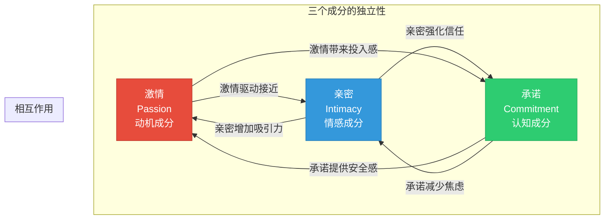
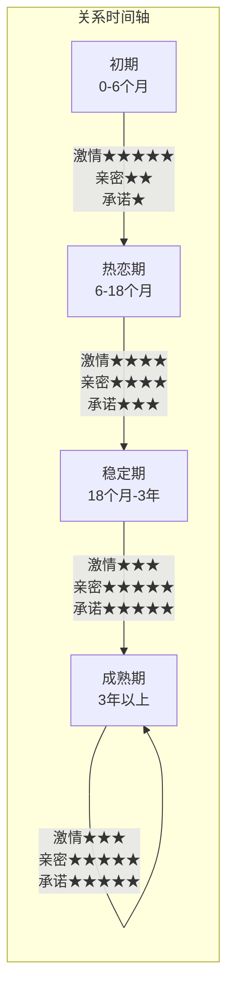
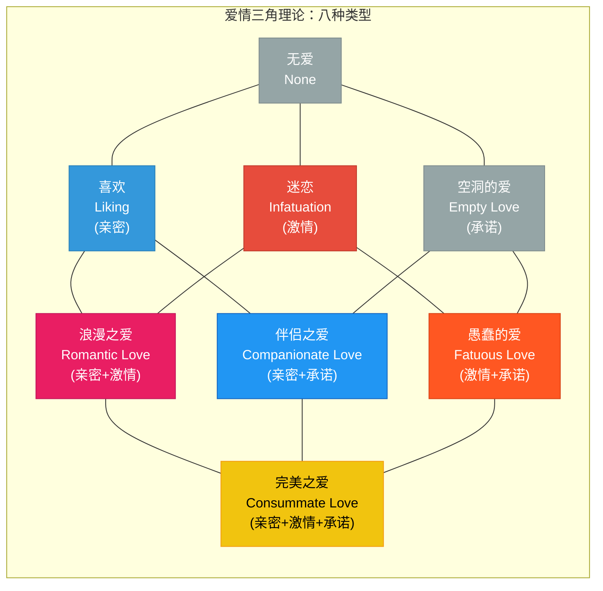
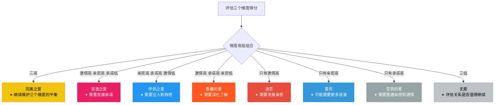
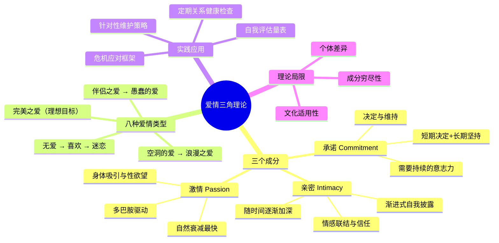

## 三、爱情三角理论

理解了吸引力如何产生（第一章）和依恋风格如何影响亲密关系（第二章）之后，一个自然的问题浮出水面：**爱情本身到底是什么？** 当你说"我爱你"的时候，你爱的究竟是什么？是心跳加速的悸动，是无话不谈的默契，还是想要共度余生的决心？

1986年，耶鲁大学心理学家罗伯特·斯腾伯格（Robert Sternberg）提出了爱情三角理论（Triangular Theory of Love），试图用一个简洁而深刻的框架回答这个问题。这个理论至今仍是亲密关系研究中被引用最广、应用最广的模型之一，它不仅能帮你理解爱情的本质，更能帮你诊断关系中的问题、找到改善方向。

### 3.1 理论的学术背景与核心命题

#### 3.1.1 为什么需要一个爱情理论

在斯腾伯格之前，心理学界对爱情的研究呈现碎片化状态。不同学者各自定义爱情的维度，概念之间缺乏统一框架。常见的困境包括：

- **定义模糊**：人们日常说的"爱"涵盖了从喜欢到痴迷到承诺的所有情感，但这些显然是不同的东西
- **测量困难**：没有统一框架，就无法系统地测量和比较不同关系中的爱情质量
- **指导乏力**：临床咨询师和普通人一样，面对"我们之间还爱不爱"的问题时缺乏结构化的分析工具

斯腾伯格的贡献在于，他从人类认知的基本结构出发，将爱情分解为三个既独立又相互作用的成分，形成了一个可以用三角形直观表示的理论模型。

#### 3.1.2 三个核心成分的严格定义

爱情三角理论的核心命题是：**所有类型的爱情都可以由三个基本成分的不同组合来解释。** 这三个成分各自有明确的心理学定义：

**激情（Passion）**

激情是爱情中驱动身体吸引和性欲望的动机成分。它的心理学本质是一种**唤醒状态**——当你见到某个人时心跳加速、瞳孔放大、注意力高度集中，这些都是交感神经系统被激活的表现。

激情的来源包括：
- **生理吸引**：外貌、体态、声音、气味等感官信号触发的本能反应
- **性欲望**：与对方发生身体亲密接触的渴望
- **心理唤醒**：新奇感、神秘感、不确定性带来的情绪波动
- **自我延伸体验**：和对方在一起时感觉自己变成了"更好的人"，这种自我概念的扩展本身就能产生强烈的愉悦感

需要特别注意的是，激情不等于性欲。激情是一个更广泛的概念，它包含了那种"被对方强烈吸引"的整体体验，性欲只是其中一个组成部分。

**亲密（Intimacy）**

亲密是爱情中产生亲近感、联结感和温暖感的情感成分。它的心理学本质是**情感卷入**——你愿意向对方展示真实的自我，包括脆弱的一面，同时感到被理解、被接纳、被支持。

亲密的核心要素包括：
- **情感分享**：愿意告诉对方自己的感受、想法、恐惧、希望
- **理解与被理解**：感到对方真正懂你，而不是只看到表面
- **接纳与被接纳**：感到对方接受真实的你，包括你的缺点
- **支持与被支持**：在困难时可以依靠对方，对方也能依靠你
- **信任**：相信对方不会利用你的脆弱来伤害你
- **情感安全**：在对方面前可以放松防御，做真实的自己

亲密的建立是一个**渐进的自我披露过程**。根据社会渗透理论（Social Penetration Theory），亲密关系的深化就像剥洋葱——从外层的公开信息（兴趣爱好、日常经历）逐步深入到核心的私密信息（童年创伤、深层恐惧、真实欲望）。每深入一层，信任就增加一分，亲密感也随之加深。

**承诺（Commitment）**

承诺是爱情中做出"爱这个人"和"维持这段关系"决定的认知成分。它的心理学本质是**决策与意志**——不仅是在某个时刻决定爱对方，更是在时间跨度上持续选择维持这段关系。

承诺包含两个层面：
- **短期层面：决定（Decision）** ——在某一刻做出"我爱这个人"的判断
- **长期层面：承诺（Commitment）** ——在时间推移中持续维持这个决定，即使面对困难、诱惑或倦怠

真正的承诺不是被迫的（"我们已经在一起这么久了"），不是恐惧驱动的（"离开TA我怕找不到更好的"），也不是功利性的（"TA条件不错，分手不划算"）。健康的承诺是基于对关系价值的主动认知——你清楚地知道这段关系对你意味着什么，并且持续选择去维护它。

#### 3.1.3 三个成分的独立性与相互作用

三个成分既相对独立，又相互影响：

三个成分的独立性意味着：
- 你可以在身体上被一个人吸引（激情），但并不感到情感亲近（无亲密）
- 你可以和一个人无话不谈（亲密），但没有性吸引（无激情）
- 你可以决定和一个人在一起（承诺），但既不感到亲近也不感到吸引

三个成分的相互作用意味着：
- 激情常常是亲密关系的**启动器**——身体吸引促使两个人花时间在一起，为亲密的建立创造机会
- 亲密反过来可以**增强激情**——当你真正了解和欣赏一个人之后，可能会发现TA比你最初以为的更有吸引力
- 承诺为亲密和激情提供**安全基地**——当关系的稳定性有保障时，人们更愿意展示脆弱（促进亲密），也更有心情享受浪漫（维持激情）

#### 3.1.4 成分随时间变化的典型模式

理解三个成分的时间动态，是将理论应用于实际关系管理的关键。

| 成分 | 初期（0-6月） | 热恋期（6-18月） | 稳定期（18月-3年） | 成熟期（3年+） |
|------|--------------|------------------|-------------------|---------------|
| **激情** | 极高，快速上升 | 高峰后开始下降 | 中等，需要主动维护 | 稳定但需要刻意注入新鲜感 |
| **亲密** | 低，刚开始了解 | 快速增长中 | 较高水平，仍在深化 | 高且稳固，深度信任 |
| **承诺** | 极低或无 | 开始形成 | 显著增加 | 稳定且内化 |

这个变化模式解释了一个常见的关系困境：**为什么热恋期的"爱情消退了"的错觉？** 实际上不是爱情消退了，而是激情成分的自然衰减被错误地等同于爱情的消失。如果此时伴侣之爱（亲密+承诺）已经建立起来，关系不仅不会变差，反而会进入一个更稳定、更深层的阶段。

### 3.2 爱情的八种类型：从无爱到完美之爱

三个成分的有无组合产生了八种爱情类型。这不是简单的理论推演，而是对现实关系中常见模式的精确描述。

#### 3.2.1 无爱（Nonlove）：三个成分都缺失

无爱是一种中性状态，不代表负面——它只是表示两个人之间既没有特别的吸引、情感亲近，也没有承诺的意愿。大多数社交关系属于这个范畴：同事、邻居、点头之交。

无爱不是一种需要被解决的问题。它是人际关系的默认状态，只有当三个成分中的至少一个被激活时，关系才会从这个状态发生转变。

#### 3.2.2 喜欢（Liking）：只有亲密

**核心特征：** 你感到和某个人亲近、温暖，可以分享感受，但没有身体吸引的冲动，也没有想要和对方建立长期伴侣关系的意愿。

**典型场景：**
- 亲密的异性朋友，你们可以聊任何话题，但从未有过"心动"的感觉
- 工作中的知心搭档，彼此信任、互相支持，但下班后各回各家
- 某些已经褪去激情但保留了深厚友情的前任关系

**喜欢的内在机制：** 喜欢的核心是信任和理解的积累。当你反复向一个人自我披露，发现对方每次都能接纳你、理解你，亲密感就会自然产生。但如果没有激情的配合，这种亲密更接近于深度友谊而非浪漫爱情。

**实践意义：** 喜欢是一个强大的基础。许多长期关系的终极形态就是伴侣之爱（亲密+承诺），它的底色就是喜欢。如果你正在寻找长期伴侣，不要低估"和这个人聊天很舒服"这个信号——它比"见到TA心跳加速"更持久、更可靠。

#### 3.2.3 迷恋（Infatuation）：只有激情

**核心特征：** 强烈的身体吸引和情绪波动，但缺乏深入了解和长期承诺的意愿。你可能整天想着对方，但如果你诚实审视，你对TA的了解其实很有限。

**典型场景：**
- 一见钟情：在某个瞬间被某个人的外表、气质或某个动作强烈吸引
- 暗恋：持续关注一个人，但从未真正接近和了解TA
- 偶像崇拜：对明星、网红产生的单向情感投射
- 短暂的肉体关系：强烈的性吸引，但事后并不想深入了解对方

**迷恋的生理机制：** 神经科学研究表明，迷恋状态与大脑中多巴胺系统的高度激活密切相关。当你看到或想到迷恋对象时，大脑的奖赏回路被强烈激活，产生类似于赌博赢钱或使用某些成瘾物质时的愉悦感。同时，血清素水平会下降，这与强迫性思维（"总是忍不住想TA"）有关。这种神经化学状态解释了为什么迷恋如此强烈，但也如此短暂——大脑不可能长期维持如此高的多巴胺激活水平。

**迷恋的陷阱：** 迷恋最大的危险在于，它容易被误认为是"真爱"。强烈的激情体验会让人产生"这就是命中注定"的错觉，从而做出冲动的决定——比如过快地进入关系、过早地做出承诺、忽视对方明显的不兼容信号。

**实践意义：** 迷恋本身没有问题，它是恋爱关系最自然的起点。关键在于：
1. **意识到迷恋的局限性** ——你现在感受到的是激情，不是完整的爱情
2. **给关系发展留出时间** ——让亲密有机会在激情消退前建立起来
3. **不要在迷恋高峰期做重大决定** ——等"激情迷雾"散去一些再考虑同居、结婚等承诺

#### 3.2.4 空洞的爱（Empty Love）：只有承诺

**核心特征：** 两个人维持着关系的形式——住在一起、有婚姻关系、共同抚养孩子——但既感受不到情感亲近，也没有身体上的吸引力。关系的动力只剩下责任、习惯、恐惧或利益计算。

**典型场景：**
- "为了孩子不离婚"的婚姻
- 长期分居或分房睡但维持表面婚姻状态的夫妻
- 双方都在关系中感到孤独，但因为"已经在一起这么久了"而不愿离开
- 出于经济利益、社会压力或家庭期望而维持的关系

**空洞之爱的形成路径：** 空洞之爱很少是一开始就如此的。它通常是关系逐渐恶化的终点——曾经的浪漫之爱或完美之爱，因为亲密感的丧失（停止沟通、情感疏远）和激情的消退（性生活减少或消失），最终只剩下承诺这个空壳。

**实践意义：** 空洞之爱并不意味着关系必须结束。斯腾伯格本人指出，空洞之爱是可以通过有意识的努力重新注入亲密和激情的。但前提是双方都有意愿去做这个工作。如果只有一方在努力，而另一方已经完全放弃，那么关系改善的可能性就很低。

**识别空洞之爱的信号：**
- 你们在一起时各自看手机的时间远多于交流的时间
- 你对TA的日常生活细节（今天做了什么、心情如何）不再好奇
- 身体接触变得机械或完全消失
- 你们的对话只限于事务性的安排（"明天谁接孩子"），不涉及感受和想法
- 你感到在这段关系中比独处时更孤独

#### 3.2.5 浪漫之爱（Romantic Love）：亲密 + 激情

**核心特征：** 既有身体上的强烈吸引，又有情感上的亲近和理解，但还没有做出长期的承诺。你们在一起很快乐，但还没有讨论过未来。

**典型场景：**
- 热恋中的情侣，彼此深爱但还没有谈论过结婚
- 发展出情感联结的"朋友变恋人"关系
- 异地恋中见面时的强烈情感体验

**浪漫之爱的独特价值：** 浪漫之爱是大多数人回忆中最美好的爱情体验。它结合了激情的兴奋和亲密的温暖，让人感到完整的被爱和被渴望。但它的脆弱之处在于缺乏承诺的锚定——当遇到困难（异地、家庭反对、重大分歧）时，没有承诺的关系容易在压力下瓦解。

**从浪漫之爱到完美之爱的路径：** 浪漫之爱要进化为完美之爱，需要的不是减少什么，而是增加承诺。这包括：
- 在对方面前展示真实的自我（包括缺点），看对方是否能接受
- 在遇到分歧时愿意沟通和妥协，而不是一拍两散
- 开始讨论关于未来的基本问题（生活城市、是否要孩子、经济规划）
- 在面对外部压力时选择站在一起

#### 3.2.6 伴侣之爱（Companionate Love）：亲密 + 承诺

**核心特征：** 深厚的情感联结和坚定的长期承诺，但激情成分已经显著减退。你们是最亲密的伙伴、最信任的盟友，但身体上的吸引和浪漫的火花不再明显。

**典型场景：**
- 结婚多年的夫妻，彼此是最重要的人，但性生活已经很少
- 经历过重大考验（疾病、失业、丧亲）后关系更加坚固的伴侣
- 一些深度的终身友谊也带有伴侣之爱的特征

**伴侣之爱的神经科学基础：** 神经影像学研究发现，长期伴侣之间的爱情激活的脑区与新恋情不同。新恋情主要激活与多巴胺奖赏相关的脑区（腹侧被盖区、尾状核），而长期伴侣之爱更多激活与依恋和宁静相关的脑区（腹侧苍白球、中缝核）。这意味着伴侣之爱不是"打了折扣的浪漫之爱"，而是一种独立的、完整的爱情体验——它的核心感受是**安全、平静和归属**，而非兴奋和悸动。

**伴侣之爱的常见误解：**
- ❌ "激情消退说明爱情消失了" → 激情减退是正常的生理适应，不等于爱的消失
- ❌ "没有激情的婚姻是不健康的" → 伴侣之爱本身是一种完整、有价值的爱的形式
- ❌ "如果我没有心跳加速的感觉，说明我不爱TA了" → 长期关系中的爱更多表现为温暖、信任和安心，而非心跳加速

**实践意义：** 伴侣之爱是大多数长期关系的最终归宿，这并不是坏事。但需要注意的是，伴侣之爱也需要维护——如果完全放任亲密感的退化（停止深度沟通、忽视情感需求），伴侣之爱可能滑向空洞之爱。

#### 3.2.7 愚蠢的爱（Fatuous Love）：激情 + 承诺

**核心特征：** 基于强烈的激情做出了长期承诺，但缺乏足够的深入了解。你可能在认识很短的时间内就决定在一起、同居甚至结婚，因为你被强烈的感觉冲昏了头脑。

**典型场景：**
- 闪婚：认识几周或几个月就结婚
- 冲动的同居：为了每天见到对方而迅速搬到一起
- 激情下的重大承诺："我们永远在一起"、"我非你不嫁/娶"（认识不过数周）
- 为了在一起而做出的重大人生改变（辞职、搬家、与家人决裂）

**愚蠢之爱的危险机制：** 愚蠢之爱的问题不在于激情——激情是美好的；也不在于承诺——承诺是必要的。问题在于**跳过了亲密的建立阶段**。亲密需要时间来发展——你需要了解对方的价值观、生活习惯、处理冲突的方式、在压力下的反应模式。这些东西无法在几周内完全了解，而缺乏这些了解就做出重大承诺，就像在没有检查地基的情况下就盖房子。

**统计数据的支持：** 多项研究表明，恋爱时间与婚姻满意度之间存在正相关。美国一项涉及3000多对夫妻的研究发现，恋爱时间少于6个月就结婚的夫妻，离婚率比恋爱1-2年再结婚的夫妻高出约20-30%。这不是说所有闪婚都会失败，而是说缺乏亲密基础的承诺面临更高的风险。

**实践意义：** 如果你正在经历强烈的激情，并且感觉想要做出承诺，给自己一个"冷静期"：
- 至少经历一次较大的分歧，看你们如何处理冲突
- 至少一起旅行一次，看你们在非日常环境中的相处模式
- 至少见过对方的家庭和核心朋友圈
- 至少讨论过关于未来的核心问题（孩子、金钱、生活方式）

#### 3.2.8 完美之爱（Consummate Love）：亲密 + 激情 + 承诺

**核心特征：** 三个成分都具备，是最完整的爱情形式。你们既有身体上的吸引，又有深层的情感联结，还有坚定的长期承诺。这是大多数人理想中的爱情。

**完美之爱的现实定位：** 斯腾伯格本人明确指出，完美之爱是一个**理想目标**，而非一个稳定状态。它不是"达到了就可以放松"的终点，而是需要**持续投入**来维持的动态平衡。就像保持身体健康需要持续的运动和饮食管理一样，保持完美之爱需要持续在三个维度上投入精力。

**完美之爱的维持挑战：**
- **激情是最容易衰减的成分**：生理适应是不可避免的，长期关系中的激情需要主动注入新鲜感
- **亲密需要持续沟通**：不要以为"我们已经很了解对方了"就可以停止深度对话——人在不断变化，亲密也需要持续更新
- **承诺在面对考验时会被动摇**：重大生活变故（失业、疾病、异地）会考验承诺的强度

**完美之爱的维持策略：**

| 成分 | 日常维护 | 周期性维护 | 危机维护 |
|------|---------|-----------|---------|
| **激情** | 保持个人形象、适度的身体接触 | 定期约会之夜、尝试新活动 | 在危机中刻意制造亲密时刻 |
| **亲密** | 每天至少15分钟无手机对话 | 每周一次深度情感分享 | 在危机中增加而非减少沟通 |
| **承诺** | 日常小事中体现对关系的重视 | 每年一次关系状态回顾 | 在危机中明确表达"我们是一体的" |

### 3.3 自我评估：你在哪种爱情中？

理论的价值在于应用。以下是一个基于爱情三角理论的自我评估框架，帮助你诊断当前关系所处的状态。

#### 3.3.1 三成分评估量表

对以下每个陈述，用1-7分评估你的同意程度（1=完全不同意，7=完全同意）：

**激情维度（评估你的激情水平）：**

| 编号 | 陈述 | 评分 |
|------|------|------|
| P1 | 见到TA时，我经常感到心跳加速或兴奋 | ___/7 |
| P2 | 我觉得TA非常有身体吸引力 | ___/7 |
| P3 | 我渴望与TA有身体上的亲密接触 | ___/7 |
| P4 | 和TA在一起时，我感到一种强烈的"被吸引"的感觉 | ___/7 |
| P5 | 我经常幻想与TA的浪漫或亲密场景 | ___/7 |

**亲密维度（评估你的亲密水平）：**

| 编号 | 陈述 | 评分 |
|------|------|------|
| I1 | 我感到TA真正理解我 | ___/7 |
| I2 | 我可以在TA面前展示真实的自己，包括脆弱的一面 | ___/7 |
| I3 | 当我遇到困难时，TA是我第一个想要倾诉的人 | ___/7 |
| I4 | 我感到被TA完全接纳，包括我的缺点 | ___/7 |
| I5 | 我非常关心TA的幸福和成长 | ___/7 |

**承诺维度（评估你的承诺水平）：**

| 编号 | 陈述 | 评分 |
|------|------|------|
| C1 | 我决定要维持和TA的关系 | ___/7 |
| C2 | 即使遇到困难，我也愿意为这段关系努力 | ___/7 |
| C3 | 我能想象和TA共度未来很多年 | ___/7 |
| C4 | 我不会轻易放弃这段关系 | ___/7 |
| C5 | 我认为这段关系对我非常重要，值得投入 | ___/7 |

**计分方式：** 将每个维度的5个题目得分相加，再除以5，得到该维度的平均分（1-7分）。

**结果解读：**

| 维度 | 低（1-3分） | 中（4-5分） | 高（6-7分） |
|------|------------|------------|------------|
| **激情** | 关系中缺乏身体吸引和浪漫感 | 有一定的吸引力但不是特别强烈 | 强烈的身体吸引和浪漫体验 |
| **亲密** | 缺乏情感联结和深度了解 | 有一定的情感分享但不够深入 | 深度的信任、理解和接纳 |
| **承诺** | 不确定是否要继续这段关系 | 有意愿维持但信心不够坚定 | 坚定地选择维持和投入这段关系 |

#### 3.3.2 关系类型判断矩阵

根据三个维度的高低组合，判断你当前的关系类型：

#### 3.3.3 常见的不均衡模式与干预方向

| 模式 | 你感受到的 | 根本原因 | 干预方向 |
|------|-----------|---------|---------|
| "我们像室友" | 缺乏浪漫，生活平淡 | 激情严重不足 | 创造新鲜共同体验，重新安排约会，关注个人形象 |
| "我们很好但没有心动感" | 安全舒适但缺少兴奋 | 亲密充足但激情不足 | 引入不确定性元素（新活动、短暂分离），保持个人独立空间 |
| "TA不了解真正的我" | 表面和谐但内心孤独 | 激情/承诺在但亲密不足 | 增加深度对话，练习脆弱性自我披露 |
| "我不确定要不要继续" | 犹豫不决，反复纠结 | 承诺不足 | 明确自己的核心需求清单，评估关系是否满足 |
| "我很爱TA但TA不回应" | 单方面的投入感 | 三成分在两人之间不对称 | 开放沟通各自的感受和需求，寻求关系咨询 |

### 3.4 理论的局限性与补充视角

任何理论都有边界，了解一个理论的局限性与了解它的价值同样重要。

#### 3.4.1 爱情三角理论的主要批评

**文化适用性问题**

斯腾伯格的理论是在西方个人主义文化背景下发展的，强调的是个体之间的情感体验。在集体主义文化中（如中国、日本、韩国），爱情的概念可能更多地包含家庭期望、社会责任和角色义务等维度。一些跨文化研究发现，在集体主义文化中，"承诺"成分的内涵可能比斯腾伯格所定义的更广——它不仅包含个人对关系的决定，还包含对双方家庭和社会网络的责任。

**成分的穷尽性问题**

有学者认为三个成分可能不足以完全覆盖爱情的复杂性。例如：
- **尊重（Respect）**：你是否尊重对方作为一个独立的人？尊重似乎不完全等同于亲密或承诺
- **共同成长（Mutual Growth）**：你们是否在关系中共同变得更好？这似乎是一个独立的维度
- **精神连接（Spiritual Connection）**：一些伴侣报告了一种超越日常情感的深层精神联结

**时间维度的处理**

批评者指出，三角理论对时间维度的处理过于简单。三个成分的变化不是线性的，也不总是同方向的。例如，激情可能在关系的某些特定节点（如伴侣展现新的能力或面貌时）重新被激活，而不是单调递减。

**个体差异的忽略**

不同的人对三个成分的需求强度不同。有些人天生对激情的需求较低（如无性恋者），对他们来说，伴侣之爱可能是最理想的状态，而非需要被"升级"到完美之爱。理论没有充分考虑到这种个体差异。

#### 3.4.2 与其他理论的互补关系

爱情三角理论不是孤立的，它与本章其他理论形成互补：

**与依恋理论的互补（衔接第二章）**

依恋理论解释了你在关系中的**行为模式**（焦虑时会追还是逃），爱情三角理论解释了你的关系**处于什么状态**（三个成分的水平如何）。两者的结合可以提供更完整的图景：
- 焦虑型依恋的人可能在激情维度上得分很高（对伴侣有强烈的渴望和需求），但在承诺维度上不稳定（频繁怀疑关系是否应该继续）
- 回避型依恋的人可能在亲密维度上得分较低（难以打开心扉），导致关系停留在浪漫之爱或迷恋的阶段，难以进化为伴侣之爱

**与吸引力研究的互补（衔接第一章）**

吸引力研究解释了关系如何**开始**（什么让人想要接近另一个人），三角理论解释了关系如何**发展和维持**（不同成分的组合构成了不同类型的爱情）。吸引力中的"相似性效应"为亲密的建立提供了基础，而"身体吸引"则是激情的核心驱动因素。

### 3.5 实践应用：用三角理论指导关系经营

#### 3.5.1 单身阶段：明确你在寻找什么

如果你正在寻找伴侣，三角理论可以帮助你更清晰地定义自己的需求：

**第一步：了解自己的成分偏好**

不同的人对三个成分的优先级不同。花时间思考：
- 对你来说，身体吸引（激情）有多重要？你能接受一个你不太觉得"心动"但其他方面很好的人吗？
- 对你来说，情感亲近（亲密）有多重要？你需要对方是你最好的朋友吗？
- 对你来说，稳定性（承诺）有多重要？你能接受一段不确定是否会走向婚姻的恋爱吗？

**第二步：警惕"只看一个成分"的陷阱**

| 陷阱 | 表现 | 风险 |
|------|------|------|
| 只看激情 | "我觉得TA不够帅/漂亮，所以不行" | 可能错过很多适合但初见不惊艳的人 |
| 只看亲密 | "TA是我最好的朋友，我们无话不谈" | 可能进入一段没有浪漫的"伪恋爱" |
| 只看承诺 | "TA条件很好，家里也很支持" | 可能进入一段缺乏感情基础的关系 |

**第三步：给关系发展留出时间**

三个成分不会同时达到高峰——激情可能在第一次见面时就爆发，亲密需要数周到数月的了解，承诺可能需要数月到数年的考验。给自己和对方足够的时间，让三个成分有机会自然发展。

#### 3.5.2 恋爱阶段：诊断和维护关系

**定期关系健康检查（建议每3个月一次）：**

1. **分别评估三个维度**（使用3.3.1的量表）
2. **对比双方的评估结果** ——差异本身不是问题，但沟通差异很重要
3. **识别最薄弱的维度** ——这是需要投入最多精力的方向
4. **制定具体的改善行动计划** ——不是"我们要多沟通"这种空话，而是"每周三晚上散步30分钟，不带手机，聊这周的感受"

**各维度的具体维护方法：**

**维持激情的实操清单：**
- 保持个人外在形象（不是为了取悦对方，而是为了保持自己的吸引力自信）
- 每月至少一次"非常规约会"——不是例行公事的吃饭看电影，而是尝试双方都没做过的事（攀岩、陶艺课、密室逃脱）
- 保持一定的个人空间和独立社交——过度黏在一起会加速激情的消退
- 偶尔给对方意外的惊喜（不需要昂贵，一个意想不到的小礼物或便条就足够）
- 在日常生活中增加非性的身体接触——牵手、拥抱、依偎，维持身体连接感

**深化亲密的实操清单：**
- 每天花至少15分钟进行"无屏幕对话"——放下手机，面对面交流
- 定期进行"36个问题"式的深度对话（心理学家Arthur Aron设计的36个逐步深入的问题，已被证明能有效增进亲密感）
- 练习"脆弱性自我披露"——主动分享一些你通常不会告诉别人的事情（恐惧、遗憾、不安全感）
- 当对方分享时，练习"反射性倾听"——不是给建议，而是先确认你理解了TA的感受
- 定期表达具体的感激——不是笼统的"谢谢你"，而是"谢谢你今天在我压力很大的时候没有催我做决定，给了我空间"

**强化承诺的实操清单：**
- 定期讨论关于未来的具体话题——不只是"我们以后会怎样"这种模糊的表达，而是具体的生活规划
- 在关系遇到困难时，明确表达"我选择和你一起面对这个问题"
- 在日常生活中通过行动（而非只是言语）体现承诺——记住对方的重要日子，在对方需要时出现在TA身边
- 共同建立一些"关系仪式"——固定的约会日、纪念日庆祝、睡前习惯等，这些仪式是承诺的可见形式

#### 3.5.3 困难阶段：用三角理论指导危机应对

当关系遇到困难时（激烈争吵、信任危机、重大生活变故），三角理论可以提供一个结构化的应对框架：

**危机应对的第一步：评估哪个成分受损了**

| 危机类型 | 主要受损成分 | 表现 |
|---------|------------|------|
| 发现对方隐瞒重要事情 | 亲密（信任被破坏） | 感到被欺骗，无法再信任对方 |
| 长期缺乏身体亲密 | 激情（身体连接断裂） | 感到被拒绝或不被渴望 |
| 对未来方向产生严重分歧 | 承诺（共同目标动摇） | 感到不确定是否要继续 |
| 对方出轨 | 三个成分都可能受损 | 最严重的综合危机 |

**危机应对的第二步：针对性修复**

- **修复亲密**：需要犯错方做出真诚的道歉和解释，同时受伤方需要表达自己的感受（而非压抑或攻击）。重建信任需要时间——不要期望一次谈话就能解决问题。
- **修复激情**：需要双方共同创造新的积极体验。在亲密关系研究中，这被称为"积极体验覆盖"——用新的美好记忆来稀释痛苦记忆的影响。
- **修复承诺**：需要明确讨论双方对关系的期望和底线，重新确认共同目标，必要时寻求专业的关系咨询师帮助。

### 3.6 深度案例分析

#### 案例一：从迷恋到完美之爱的进化

**背景：** 小张（男，27岁）在一次朋友聚会上认识了小李（女，25岁）。小张被小李的外貌和气质强烈吸引，聚会结束后主动加了微信，开始了密集的聊天。

**阶段分析：**

| 时间 | 关系状态 | 三成分水平 | 关键事件 |
|------|---------|-----------|---------|
| 第1周 | 迷恋 | 激情★★★★★ 亲密★ 承诺☆ | 聊天频繁，小张满脑子都是小李 |
| 第1个月 | 浪漫之爱（初级） | 激情★★★★★ 亲密★★★ 承诺★ | 开始约会，发现有很多共同话题 |
| 第3个月 | 浪漫之爱（成熟） | 激情★★★★ 亲密★★★★ 承诺★★ | 第一次争吵后和好，信任加深 |
| 第6个月 | 向完美之爱过渡 | 激情★★★ 亲密★★★★★ 承诺★★★★ | 认识对方家庭，讨论未来计划 |
| 第1年 | 稳定的完美之爱 | 激情★★★★ 亲密★★★★★ 承诺★★★★★ | 同居，建立共同的生活节奏 |

**关键转折点：** 第3个月的争吵是一个重要的"关系测试"。小张发现小李在压力下会变得沉默，而他自己倾向于主动沟通。这次冲突让他们更了解彼此的沟通模式，也让亲密感增加了一个新的层次——经历过冲突并成功修复的关系比从未经历过冲突的关系更坚固。

**可借鉴的经验：**
- 不要因为"只有激情"就否定一段关系——激情是起点，亲密需要时间来发展
- 冲突不一定是关系的威胁——处理得当的冲突反而是深化亲密的机会
- 激情从★★★★★降到★★★不是"爱情消退"——是正常的成分再平衡

#### 案例二：从完美之爱滑向空洞之爱

**背景：** 王先生和刘女士结婚8年，有两个孩子。他们曾经是朋友圈里的"模范夫妻"，但最近两年王先生感到关系"变了味"。

**退化过程：**

| 阶段 | 三成分变化 | 触发因素 |
|------|-----------|---------|
| 结婚初期（1-3年） | 三成分均高 | 新婚蜜月期 |
| 孩子出生后（3-5年） | 激情下降，亲密开始降低 | 精力被孩子占据，忽视了夫妻关系 |
| 事业高峰期（5-8年） | 激情很低，亲密明显降低 | 工作压力大，回家只想休息 |
| 当前状态 | 仅剩承诺 | 沟通仅限于事务性安排 |

**诊断结果：** 空洞之爱——关系只剩下承诺（为了孩子和习惯），亲密和激情都已严重退化。

**干预方案：**
1. **短期（1-3个月）——重建亲密**：每天安排15分钟的"夫妻时间"，只聊感受和想法，不聊孩子和家务。每周末找一个双方都感兴趣的话题进行深度对话。
2. **中期（3-6个月）——注入激情**：每两周安排一次"约会之夜"（请父母或保姆帮忙带孩子），尝试双方都感兴趣的新活动。重新关注个人形象和健康。
3. **长期（6个月以上）——巩固承诺**：每年进行一次"关系状态回顾"，讨论双方对关系的满意度、期望和调整方向。建立"关系仪式"（纪念日庆祝、睡前习惯等）。

### 3.7 本节要点回顾

**三个核心认知：**

1. **爱情不是单一的感受，而是三个成分的组合。** 理解这一点可以帮助你更准确地诊断关系中的问题——不是笼统的"我们之间出了问题"，而是具体的"我们的激情/亲密/承诺哪个维度需要关注"。

2. **完美之爱是目标，不是起点。** 不要期望关系一开始就同时具备三个成分，也不要因为三个成分的比例随时间变化而恐慌。爱情是一个动态系统，需要持续的维护和调整。

3. **每个成分都需要不同的维护策略。** 激情需要新鲜感和不确定性，亲密需要深度沟通和脆弱性，承诺需要一致性行为和共同目标。用错策略（比如试图通过增加承诺来修复激情问题）往往事倍功半。
