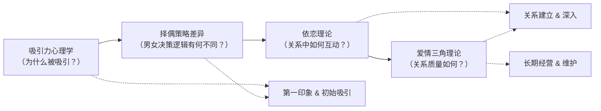
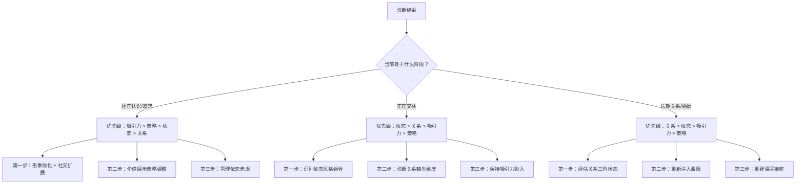
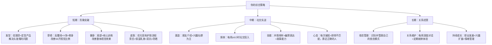

## 五、理论综合应用

前四节分别介绍了吸引力心理学、依恋理论、爱情三角理论和两性择偶策略差异。单独掌握任何一个理论都不够——真实恋爱场景从来不会只涉及一个维度。本节的核心任务是**将四大理论整合为一个可操作的综合分析框架**，让你面对任何恋爱情境时，都能系统地诊断问题、制定策略、预测风险。

### 5.1 为什么需要理论综合

#### 5.1.1 单一理论的局限

每种理论都有自己的"盲区"：

| 理论 | 核心解释力 | 盲区 |
|------|-----------|------|
| 吸引力心理学 | 解释"为什么被吸引" | 不解释"吸引之后怎么维持" |
| 依恋理论 | 解释"关系中的情绪模式" | 不解释"最初的吸引力从哪来" |
| 爱情三角理论 | 解释"关系质量的结构" | 不解释"两性策略差异如何影响互动" |
| 择偶策略差异 | 解释"男女决策逻辑的不同" | 不解释"个体依恋风格的调节作用" |

真实案例几乎总是多理论交叉的。举一个典型场景：

> 小张（焦虑型依恋）在社交活动上被小李吸引（吸引力心理学），主动追求但表现出过度需求（依恋理论预测的行为），小李感到压力后退缩（择偶策略中女性对"低成本信号"的排斥），关系尚未建立就已进入"追逐-退缩"的恶性循环（爱情三角中的亲密感无法建立）。

如果只用单一理论分析，你会得出片面的结论。只有四理论综合分析，才能看到问题的全貌。

#### 5.1.2 综合分析的思维模型

四大理论在恋爱过程中各司其职，形成一个递进式的分析链条：



**使用规则：**
- **认识阶段**：主要用吸引力心理学 + 择偶策略差异来分析
- **交往阶段**：主要用依恋理论 + 爱情三角理论来分析
- **全程**：所有理论同时作为"透镜"使用，只是权重不同

### 5.2 四维诊断框架

这是本节的核心工具。面对任何恋爱情境，你都可以用以下四个维度来系统分析。

#### 5.2.1 框架结构

四维诊断模型
├── 维度一：吸引力诊断（吸引力心理学）
│   ├── 我对TA的吸引力来自哪些因素？
│   ├── TA对我的吸引力来自哪些因素？
│   └── 吸引力是否匹配？差距在哪里？
├── 维度二：策略诊断（择偶策略差异）
│   ├── 我当前的行为符合TA的择偶筛选标准吗？
│   ├── 我是否在用"对方需要的方式"展示价值？
│   └── 市场定位是否合理？
├── 维度三：依恋诊断（依恋理论）
│   ├── 我的依恋风格如何影响当前行为？
│   ├── 对方的依恋风格是什么？
│   └── 两人的依恋风格组合会产生什么互动模式？
└── 维度四：关系诊断（爱情三角理论）
    ├── 当前关系在亲密/激情/承诺三个维度上的状态如何？
    ├── 哪个维度最薄弱？
    └── 该优先提升哪个维度？

#### 5.2.2 维度一：吸引力诊断

**诊断问题清单：**

根据吸引力心理学（第一节），吸引力由多个因素决定。逐一检查：

| 吸引力因素 | 你的自评（1-10） | 对方可能的评价（1-10） | 差距 | 可提升性 |
|-----------|----------------|---------------------|------|---------|
| 外貌吸引力 | ___ | ___ | ___ | 中（穿搭/健身/发型） |
| 相似性（三观/兴趣/背景） | ___ | ___ | ___ | 中（拓宽兴趣面） |
| 互补性（能力/性格） | ___ | ___ | ___ | 低-中 |
| 接近性（物理距离/社交圈） | ___ | ___ | ___ | 高（主动拓展社交） |
| 互惠性（表达好感） | ___ | ___ | ___ | 高（学习表达技巧） |
| 稀缺性（独特价值） | ___ | ___ | ___ | 中（发掘个人特色） |

**关键判断：** 如果你的自评和对方评价差距超过3分，说明存在**信息不对称**——要么你高估了自己，要么你没有有效地展示价值。前者需要调整认知，后者需要调整策略。

#### 5.2.3 维度二：策略诊断

根据择偶策略差异理论（第四节），男女的筛选逻辑不同。你需要回答以下问题：

**如果你是男性，追求女性：**

1. **"好基因"信号检查**：你是否在展示健康、活力、自信？（女性潜意识评估的第一个维度）
2. **"好资源"信号检查**：你是否在展示经济能力、上进心、社会地位？（长期择偶的核心维度）
3. **承诺信号检查**：你是否在传递"愿意投入"的信号？（女性筛选机制中的关键项）
4. **情绪价值检查**：你是否能提供幽默感、共情、安全感？（现代权重持续上升的维度）
5. **废物测试应对**：面对对方的"测试"行为，你是情绪崩溃还是从容应对？

**如果你是女性，评估男性：**

1. **综合价值评估**：他的经济能力、社会地位、个人魅力、外貌各打几分？
2. **承诺意愿评估**：他是否表现出长期投入的意愿，而非短期猎取？
3. **情绪稳定性评估**：他在压力和冲突中的反应如何？
4. **社交认证评估**：他的社交圈质量如何？身边人如何评价他？

#### 5.2.4 维度三：依恋诊断

根据依恋理论（第二节），每个人在关系中都有默认的情绪反应模式：

**自测：你当前的依恋表现**

对以下描述打分（1-5，1=完全不符合，5=完全符合）：

*焦虑倾向（得分越高越焦虑）：*
- 我经常担心对方不够喜欢我（___分）
- 对方没有及时回复消息时，我会感到焦虑（___分）
- 我需要频繁的确认和保证才能安心（___分）
- 我害怕被抛弃（___分）

*回避倾向（得分越高越回避）：*
- 当关系变得太亲密时，我会感到不适（___分）
- 我不喜欢过度依赖别人（___分）
- 独处比和伴侣在一起更让我放松（___分）
- 分享深层感受让我不自在（___分）

**依恋风格判定：**
- 焦虑倾向低 + 回避倾向低 = **安全型**
- 焦虑倾向高 + 回避倾向低 = **焦虑型**
- 焦虑倾向低 + 回避倾向高 = **回避型**
- 焦虑倾向高 + 回避倾向高 = **恐惧-回避型**

**依恋风格组合的风险矩阵：**

| | 安全型伴侣 | 焦虑型伴侣 | 回避型伴侣 |
|---|-----------|-----------|-----------|
| **你的安全型** | 最优组合，稳定成长 | 需要给予更多确认 | 需要尊重对方空间 |
| **你的焦虑型** | 对方能安抚你的焦虑 | 互相焦虑，情绪过山车 | 经典的"追逐-退缩"陷阱 |
| **你的回避型** | 对方能理解你的空间需求 | 你越退TA越追，恶性循环 | 两个孤岛，缺乏亲密 |

**核心洞察：** 如果你发现自己处于"焦虑型+回避型"的组合中，需要格外警惕。这不是不能成功，而是需要双方都有高度的自我认知和主动调整意愿。

#### 5.2.5 维度四：关系诊断

根据爱情三角理论（第三节），健康的关系需要亲密、激情和承诺三个维度的平衡。

**关系状态评估表：**

| 维度 | 定义 | 你的评分（1-10） | 对方可能的评分（1-10） | 期望水平 |
|------|------|-----------------|---------------------|---------|
| **亲密** | 情感联结、信任、理解、分享 | ___ | ___ | 长期关系的核心，应≥7 |
| **激情** | 性吸引、浪漫、心动、兴奋 | ___ | ___ | 初期应≥6，后期可降至4-5 |
| **承诺** | 决定在一起、规划未来、忠诚 | ___ | ___ | 长期关系应≥8 |

**关系类型判定：**

| 亲密 | 激情 | 承诺 | 关系类型 | 状态评估 |
|------|------|------|---------|---------|
| 高 | 高 | 高 | 完美之爱 | 理想状态，持续维护 |
| 高 | 低 | 高 | 伴侣之爱 | 常见于长期关系，需注入新鲜感 |
| 低 | 高 | 低 | 迷恋 | 危险区，只有激情的关系很脆弱 |
| 低 | 低 | 高 | 空洞之爱 | 仅靠承诺维持，需要重建亲密和激情 |
| 高 | 高 | 低 | 浪漫之爱 | 缺乏承诺，需要明确未来方向 |
| 低 | 高 | 高 | 愚昧之爱 | 有承诺有激情但缺乏真正了解 |
| 高 | 低 | 低 | 喜欢 | 友谊而非爱情 |
| 低 | 低 | 低 | 无爱 | 关系名存实亡 |

### 5.3 综合诊断实战：三个案例

理论只有通过案例才能真正内化。以下三个案例覆盖了恋爱中最常见的困境，每个都用四维框架完整分析。

#### 案例一：追求阶段——"为什么我总是追不到？"

**情境：** 小王，28岁，程序员，普通身高，性格内向，收入中上。喜欢同事小赵（26岁，开朗活泼，外貌中上），追求两个月，小赵态度暧昧但始终不明确。

**四维分析：**

**吸引力维度：**
- 小王的吸引力构成：经济能力（7/10）、智识价值（7/10）、外貌（4/10）、情绪价值（4/10）
- 小赵可能看重的：情绪价值（高权重）、外貌（中权重）、社交能力（中权重）
- **诊断：** 小王的高价值维度（经济、智识）在暧昧阶段展示不充分，而小赵看重的维度（情绪价值、社交能力）恰好是小王的短板

**策略维度：**
- 小王可能犯的错误：用"对她好"来展示价值（送礼物、帮忙做事），但这传递的是"好资源"信号，在暧昧阶段女性更需要"好基因"信号（自信、幽默、领导力）
- **诊断：** 价值展示策略与对方筛选机制不匹配

**依恋维度：**
- 小王可能有焦虑倾向：频繁发消息、过度解读对方回应、不敢表达明确意图
- 小赵可能是安全型或轻微回避型：对过度热情感到压力
- **诊断：** 焦虑-回避互动模式正在形成

**关系维度：**
- 亲密：3/10（停留在表面交流，未建立深层情感联结）
- 激情：2/10（没有任何浪漫元素）
- 承诺：1/10（关系未明确）
- **诊断：** 关系停留在"喜欢"阶段，缺乏推进动力

**综合处方：**

```mermaid
graph TD
    A[当前困境] --> B[提升情绪价值]
    A --> C[调整策略匹配]
    A --> D[管理依恋焦虑]
    A --> E[推进关系升级]
    
    B --> B1[学习幽默感和讲故事能力]
    B --> B2[练习共情式倾听]
    
    C --> C1[从"对她好"转向"展示自己好"]
    C --> C2[增加社交场景中的领导力展示]
    
    D --> D1[降低联系频率，每次沟通有质量]
    D --> D2[明确表达意图，而非暧昧试探]
    
    E --> E1[制造浪漫场景升级激情]
    E --> E2[直接表白或确认关系]
```

#### 案例二：交往初期——"为什么热恋期过了就吵架？"

**情境：** 小刘和小陈恋爱三个月。前两个月甜蜜无比，第三个月开始频繁争吵。小刘觉得小陈"变了"，小陈觉得小刘"管太多"。

**四维分析：**

**吸引力维度：**
- 热恋期的吸引力主要由**近因效应**和**光环效应**支撑——你只看到对方的优点
- 三个月后光环褪去，真实性格暴露，吸引力需要从"幻想型"转向"现实型"
- **诊断：** 吸引力从生理驱动转向心理驱动的转型期，阵痛正常

**策略维度：**
- 小刘（男性）可能在关系确立后降低了"展示价值"的努力——不再精心打扮、不再制造浪漫
- 小陈（女性）开始启动更深层的筛选机制——评估情绪稳定性、冲突处理能力
- **诊断：** 男方的"懈怠"触发了女方更严格的评估标准

**依恋维度：**
- 小刘可能是焦虑型：关系确立后需要更多确认，表现为"管太多"
- 小陈可能是安全型或回避型：需要个人空间
- **诊断：** 经典的需求-空间冲突

**关系维度：**
- 亲密：5/10（开始了解真实的对方，但冲突降低信任）
- 激情：从8/10降至4/10（新鲜感消退）
- 承诺：6/10（有意愿但信心动摇）
- **诊断：** "浪漫之爱"向"伴侣之爱"过渡的关键期

**综合处方：**

1. **吸引力重建**：双方都需要重新"经营"自己——保持个人成长，不要在关系中"躺平"
2. **策略调整**：男方重新展示"持续努力"的信号，女方给予正向反馈而非批评
3. **依恋协调**：焦虑方学习自我安抚，回避方学习表达需求，建立"安全基地"
4. **关系维护**：每周安排"约会时间"维护激情，每天安排"沟通时间"维护亲密

#### 案例三：长期关系——"为什么感觉像室友？"

**情境：** 老周和小林结婚三年，生活稳定但缺乏激情。两人都觉得"日子过得还行，但总觉得缺点什么"。

**四维分析：**

**吸引力维度：**
- 习惯化效应（Habituation）：大脑对反复出现的刺激降低反应——再好看的面孔，看三年也"习惯了"
- **诊断：** 吸引力的生理层面严重衰减，需要注入新鲜元素

**策略维度：**
- 双方都停止了"展示价值"——不再为对方打扮、不再制造惊喜
- **诊断：** "沉没成本"让双方觉得不需要再努力，这是危险的认知

**依恋维度：**
- 大概率双方都是安全型，关系稳定但缺乏张力
- **诊断：** 安全型依恋的优势是稳定，劣势是可能缺乏情感波动带来的"活力感"

**关系维度：**
- 亲密：7/10（相互了解深入，但交流趋向功能性）
- 激情：2/10（几乎为零）
- 承诺：9/10（非常稳定）
- **诊断：** "伴侣之爱"模式——亲密和承诺充足，激情严重不足

**综合处方：**

1. **引入新鲜体验**：共同尝试从未做过的活动（旅行、运动、学习新技能），新鲜感能重新激活吸引力
2. **恢复"追求"行为**：定期约会、制造惊喜、重新"追"对方——把对方当作"还在追求中的人"
3. **提升情感交流深度**：从"今天吃什么"升级到"你最近在想什么"，重建深层亲密
4. **管理预期**：激情不可能永远维持热恋期水平，但可以通过刻意经营维持在一个健康的基线上

### 5.4 制定个人策略：完整的规划框架

通用的"1-3-6-12个月"策略过于笼统。以下是基于四维诊断结果的**个性化策略制定方法**。

#### 5.4.1 第一步：完成自我诊断

在制定策略之前，你必须先完成上述四维诊断。没有诊断的策略是盲目的。

**诊断总结模板：**

┌─────────────────────────────────────────────────────┐
│              我的四维诊断总结                           │
├─────────────────────────────────────────────────────┤
│ 吸引力维度：                                         │
│   我的核心优势：_________________________             │
│   我的核心短板：_________________________             │
│   对方可能最看重：_______________________             │
├─────────────────────────────────────────────────────┤
│ 策略维度：                                           │
│   我当前的行为模式：_____________________             │
│   与对方筛选机制的匹配度：高/中/低                     │
│   需要调整的关键行为：___________________             │
├─────────────────────────────────────────────────────┤
│ 依恋维度：                                           │
│   我的依恋风格：_________________________             │
│   对方可能的依恋风格：___________________             │
│   我们组合的风险点：_____________________             │
├─────────────────────────────────────────────────────┤
│ 关系维度：                                           │
│   亲密评分：___/10    激情评分：___/10                │
│   承诺评分：___/10    关系类型：__________            │
│   最需要提升的维度：_____________________             │
└─────────────────────────────────────────────────────┘

#### 5.4.2 第二步：确定优先级

四维诊断可能暴露多个问题，但你不可能同时解决所有问题。**优先级排序原则：**

1. **先解决"致命短板"**：如果某个维度严重拖后腿（评分≤3），优先修复
2. **先解决"可快速改善"的**：短期内能见效的维度优先（如穿搭、社交频率）
3. **先解决"当前阶段最关键的"**：认识阶段优先吸引力，交往阶段优先依恋互动
4. **具体到用户情况的优先级建议：**



#### 5.4.3 第三步：制定分阶段行动计划

**阶段一：基础建设期（第1-4周）——"武装自己"**

这一阶段的核心是**提升自身价值和修复明显短板**，还没有进入实战。

| 行动项 | 理论依据 | 具体操作 | 预期效果 |
|--------|---------|---------|---------|
| 形象管理优化 | 吸引力心理学：外貌是第一印象的决定因素 | 发型设计、穿搭升级、皮肤护理、健身计划 | 外貌评分提升1-2分 |
| 依恋风格认知 | 依恋理论：自我认知是改变的前提 | 完成依恋自测、记录情绪反应模式、阅读依恋相关书籍 | 识别并开始管理自己的依恋模式 |
| 社交圈扩展 | 吸引力心理学：接近性原则 | 加入2-3个兴趣社群、重新激活朋友圈、每周至少1次社交活动 | 每周接触新异性数量从0提升到3-5人 |
| 情绪价值能力 | 择偶策略：现代男性情绪价值权重上升 | 学习共情倾听、练习幽默表达、提升情绪觉察力 | 社交互动质量提升 |

**阶段二：实战练习期（第5-12周）——"走出去"**

这一阶段开始实际社交和约会，重点是**积累经验、收集反馈、迭代优化**。

| 行动项 | 理论依据 | 具体操作 | 预期效果 |
|--------|---------|---------|---------|
| 主动社交实践 | 吸引力心理学：互惠性和接近性 | 每周至少主动发起3次对话（不限于心仪对象） | 降低社交焦虑，提升开场能力 |
| 约会实践 | 择偶策略：展示综合价值 | 每月至少2次约会（咖啡/展览/活动），记录每次反馈 | 理解自己的"市场反馈"，调整策略 |
| 依恋觉察练习 | 依恋理论：在真实互动中观察自己 | 记录每次社交后的情绪反应，识别焦虑/回避触发点 | 逐步提升依恋安全性 |
| 关系三角自检 | 爱情三角理论：早期关系诊断 | 如果进入约会阶段，每两周评估一次亲密/激情/承诺状态 | 及早发现关系发展的不平衡 |

**阶段三：关系深化期（第13-24周）——"建连接"**

如果在第二阶段成功建立了初步的约会关系，这一阶段的重点转向**深化情感联结和关系质量**。

| 行动项 | 理论依据 | 具体操作 | 预期效果 |
|--------|---------|---------|---------|
| 深度沟通实践 | 依恋理论：安全基地的建立 | 每周至少1次30分钟以上的深度对话（分享感受/经历/梦想） | 亲密感显著提升 |
| 激情维护 | 爱情三角：激情需要持续注入 | 定期制造新鲜体验（新餐厅/新活动/小惊喜） | 防止关系进入"室友模式" |
| 承诺表达 | 爱情三角：承诺是长期关系的锚 | 适时讨论未来规划、明确关系状态、表达长期意愿 | 建立关系的安全感 |
| 冲突处理能力建设 | 依恋理论：冲突是依恋模式的"压力测试" | 学习非暴力沟通、练习在冲突中保持情绪稳定 | 降低冲突对关系的伤害 |

#### 5.4.4 第四步：建立反馈与迭代机制

策略不是一成不变的。你需要建立一个持续反馈和调整的机制：

**每周复盘清单（15分钟）：**

1. **本周社交投入了多少时间？** 目标：≥5小时/周
2. **本周认识了几个新的人？** 目标：≥2人/周
3. **本周有没有主动发起对话或约会？** 目标：≥3次/周
4. **本周在哪个理论维度上有新的认知或突破？**
5. **下周要调整的一个具体行为是什么？**

**每月深度复盘（1小时）：**

1. 重新做一次四维诊断，对比上月评分变化
2. 分析成功和失败的社交互动，找出规律
3. 调整下月的优先级和策略
4. 是否需要调整目标定位（偏高/偏低/合理）

### 5.5 高频困境的理论解法

以下是恋爱中最常见的困境，每个都用四维理论综合解构。

#### 5.5.1 困境："我对TA有感觉，但TA对我没感觉"

**理论解构：**

- **吸引力维度**：单向吸引力说明你的价值展示与TA的筛选标准不匹配。不是你"不够好"，而是你展示的维度不是TA看重的维度
- **策略维度**：你可能在用"追求"模式（单向展示），而对方需要的是"吸引"模式（让对方主动对你产生兴趣）
- **解法**：停止"追求"，转而(1)提升对方看重的维度(2)创造自然接触机会(3)展示高价值但保持适度距离

#### 5.5.2 困境："TA说对我没感觉，但又不拒绝我的好"

**理论解构：**

- **择偶策略维度**：这可能是女性的"备选策略"——在没有更好的选择之前保留你的"好资源"信号
- **依恋维度**：也可能是回避型依恋——享受你的关注但恐惧关系深入
- **解法**：设定明确的时间边界（如1个月），如果对方仍然不明确表态，果断退出。长期停留在"暧昧"状态对你的自尊和时间都是损耗

#### 5.5.3 困境："恋爱后总觉得对方变了"

**理论解构：**

- **吸引力维度**：光环效应消退，你看到的是真实的对方而非理想化的对方
- **依恋维度**：关系深入后依恋系统被激活，焦虑型开始寻求更多确认，回避型开始需要更多空间
- **关系维度**：从激情主导的"迷恋"转向需要亲密和承诺支撑的"伴侣之爱"
- **解法**：接受"对方没变，是你的滤镜变了"这个事实。然后用依恋理论诊断互动模式，用爱情三角理论找到缺失维度，针对性改善

#### 5.5.4 困境："我不知道该不该继续"

**理论解构：**

用爱情三角理论做决策：

- 如果三个维度中有两个评分≥6：值得继续，重点补强弱项
- 如果三个维度中只有一个评分≥6：需要认真沟通，看是否有改善空间
- 如果三个维度评分都<6：考虑止损，这段关系缺乏健康的基础

#### 5.5.5 困境："每次恋爱都是同样的模式失败"

**理论解构：**

这是依恋理论的核心应用领域。反复出现的失败模式几乎总是与依恋风格有关：

- **模式A：总是被"冷淡"的人吸引** → 你可能是焦虑型，对回避型有"依恋激活"式的迷恋
- **模式B：关系一深入就想逃** → 你可能是回避型，亲密感触发了你的防御机制
- **模式C：总是付出过多然后感到被掏空** → 你可能是焦虑型，用"过度付出"来获取安全感
- **模式D：无法维持长期关系** → 可能是恐惧-回避型，同时渴望亲密又恐惧亲密

**解法：** 识别模式是第一步。第二步是通过有意识的练习和（如果需要）专业心理咨询来逐步发展"获得性安全感"（Earned Security）。

### 5.6 针对具体用户情况的综合分析

基于你的个人情况（28岁，普通身高，方形脸，头发塌，中性偏微油皮肤，55开身材比例），以下是完整的四维诊断和策略建议。

#### 5.6.1 四维诊断结果

**吸引力维度：**

| 因素 | 当前状态 | 可改善空间 | 优先级 |
|------|---------|-----------|--------|
| 外貌 | 4/10（身高偏矮、脸型和发型有短板） | 中（穿搭+发型+健身可提升至6） | 高——第一印象的门票 |
| 相似性 | 待评估（取决于目标对象的类型） | 高（拓宽兴趣面） | 中 |
| 互补性 | 可能较高（内向+技术型男性常与外向女性互补） | 低 | 低 |
| 接近性 | 取决于社交圈大小 | 高（主动拓展） | 高——没有接触机会，其他都白搭 |
| 互惠性 | 待评估 | 高（学习表达好感的技巧） | 中 |
| 稀缺性 | 需要发掘（每个人都有独特价值） | 中 | 中 |

**策略维度：**
- 当前可能的误区：用"对她好"来代替"展示自己好"
- 需要调整：从"追求者"心态转变为"高价值展示者"心态
- 市场定位：线下社交 > 相亲平台 > 社交APP

**依恋维度：**
- 需要自行完成自测（见5.2.4节）
- 重点关注：是否有焦虑倾向（在追求中表现为过度需求）

**关系维度：**
- 尚未进入关系，此维度暂不适用
- 但如果进入约会阶段，需要从一开始就注意三个维度的平衡发展

#### 5.6.2 个性化策略总表



### 5.7 理论应用的常见陷阱

在将理论应用于实践时，以下是最常犯的错误：

#### 陷阱一：把理论当"操控手册"

**错误表现：** 学了择偶策略差异后，试图用"废物测试"的知识去"反操控"对方；学了依恋理论后，用"依恋激活"去故意制造焦虑感。

**纠正：** 理论的目的是**理解**，不是**操控**。当你理解了对方的行为逻辑后，你应该做的是更好地沟通和匹配，而不是利用对方的心理弱点。任何基于操控的关系最终都会崩塌——因为信任一旦被破坏，修复成本远高于从零建立。

#### 陷阱二：过度分析导致"分析瘫痪"

**错误表现：** 每次互动后都用四维框架反复分析，纠结于"TA这句话是什么意思""TA的依恋风格是什么""我该怎么回应才最符合理论"。

**纠正：** 理论是你的"后台操作系统"，不是"前台对话脚本"。在实际互动中，放松、自然、真诚地表达自己。复盘时再用理论来分析。过度分析会让你在社交中显得不自然，反而降低吸引力。

#### 陷阱三：忽视个体差异

**错误表现：** "研究说女性平均偏好175cm以上的男性，我普通身高所以没戏了。"

**纠正：** 所有心理学研究都是**群体统计规律**，描述的是平均趋势，不是个体命运。在数以亿计的样本中，总有人不遵循"平均偏好"。你的任务是找到那个对你有吸引力的人，而不是对"所有女性"都有吸引力。

#### 陷阱四：理论之间生搬硬套

**错误表现：** 把依恋理论和爱情三角理论机械对应——"焦虑型依恋的人一定缺承诺"。

**纠正：** 四个理论描述的是不同维度的心理现象，它们之间有交集但不完全对应。一个焦虑型依恋的人可能在爱情三角的三个维度上都表现良好，只是在关系中的情绪调节方式不同。使用理论时要灵活，不要生搬硬套。

#### 陷阱五：只学理论不行动

**错误表现：** 读完了全部理论，做了详细的自我分析，制定了完美的策略——然后继续宅在家里等"缘分"。

**纠正：** 这是所有理论学习中最大的陷阱。理论的价值在于指导行动，但如果行动为零，理论就是零。每天花在学习理论上的时间不应超过花在实际行动上的时间。**最好的策略是：学一点，做一点，复盘一点，调整一点。**

### 5.8 理论综合的高阶应用

对于已经掌握基础应用的读者，以下内容帮助你将理论运用到更高层次。

#### 5.8.1 建立"恋爱直觉"：从刻意分析到自动化反应

初学者需要刻意使用四维框架来分析情境，但随着经验积累，你会发展出一种"恋爱直觉"——不需要逐条分析就能做出合理判断。

这背后的机制是**双系统理论**（Kahneman）：
- **系统1（直觉）**：快速、自动、基于经验的判断
- **系统2（分析）**：慢速、刻意、基于逻辑的推理

初学阶段，你需要用系统2来刻意分析。但随着练习，这些分析会逐渐内化为系统1的直觉反应。这就是"经验丰富的恋爱者"看起来"自然而然就知道该怎么做"的原因——他们不是凭本能，而是把理论内化成了直觉。

**培养方法：**
1. 前20次社交互动，每次事后都做四维分析
2. 20-50次互动，只在困惑时做分析
3. 50次以后，只在重大决策时做深度分析
4. 日常互动依靠已内化的直觉

#### 5.8.2 理论的迁移应用

恋爱中培养的能力可以迁移到生活的其他领域：

| 恋爱能力 | 迁移领域 | 应用场景 |
|---------|---------|---------|
| 共情倾听 | 职场沟通 | 理解同事/客户的真实需求 |
| 依恋觉察 | 亲子关系 | 与父母、未来子女的互动模式 |
| 价值展示 | 求职面试 | 展示自己与岗位的匹配度 |
| 冲突处理 | 所有人际关系 | 任何涉及分歧的场景 |
| 关系维护 | 友谊经营 | 维持长期友谊的质量 |
| 策略思维 | 商业谈判 | 理解对方的决策逻辑 |

#### 5.8.3 持续进化的知识体系

恋爱心理学不是一成不变的。以下领域值得关注和持续学习：

1. **神经科学进展**：fMRI研究正在揭示"爱情"的脑机制——多巴胺、催产素、血清素的作用
2. **大数据婚恋研究**：婚恋平台的海量数据正在验证或修正传统理论
3. **文化心理学**：中国本土的婚恋心理研究越来越丰富，比直接套用西方理论更准确
4. **AI与恋爱**：AI匹配算法、VR约会等新技术正在改变恋爱的"入口"

保持学习心态，但不要为了追求"更完美的理论"而推迟行动。**行动中的80分理论运用，胜过理论上的100分但零行动。**

### 5.9 本节核心要点

1. **四大理论必须综合使用**：任何单一理论都无法解释复杂的恋爱现象，综合分析才能看到全貌
2. **四维诊断框架是核心工具**：吸引力→策略→依恋→关系，系统诊断后才能精准施策
3. **案例分析是内化理论的最佳方式**：用真实或模拟案例反复练习四维分析
4. **个人策略必须基于诊断结果**：没有诊断的策略是盲目的，通用策略需要个性化调整
5. **反馈迭代是策略有效的关键**：制定计划→执行→复盘→调整，循环往复
6. **理论是工具不是目的**：学以致用，用以致学，在实践中不断深化理解
7. **避免理论应用的五大陷阱**：操控化、过度分析、忽视个体、生搬硬套、只学不做
8. **从刻意分析到自动化反应**：通过大量实践将理论内化为直觉

> 理论是地图，不是领土。地图帮你找到方向，但你必须亲自走过那条路。

***
