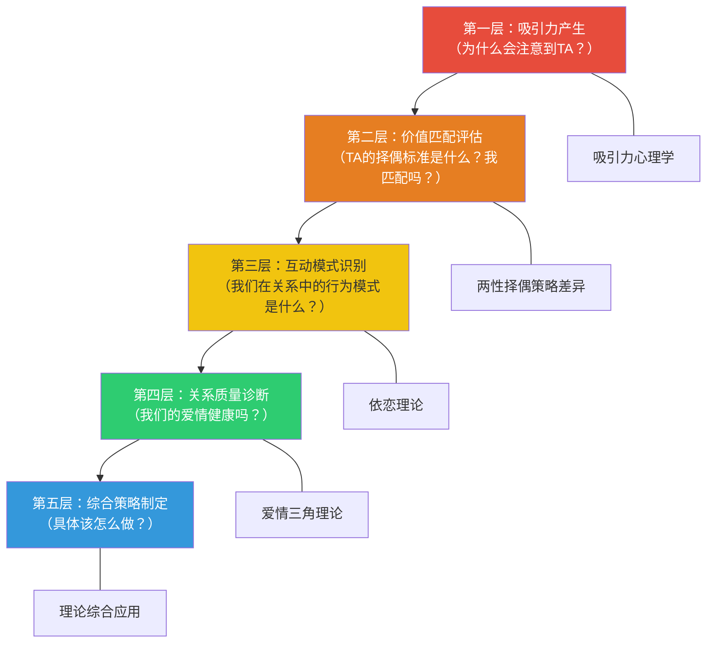
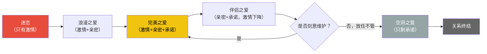
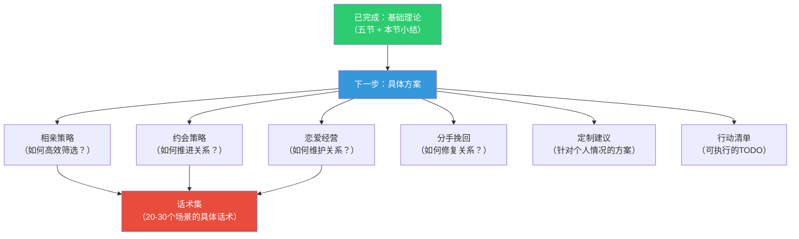

## 六、本节小结：基础理论全景回顾与知识整合

本节是"基础理论"部分的收官之作。前五节分别从吸引力心理学、依恋理论、爱情三角理论、两性择偶策略差异以及理论综合应用五个维度，构建了一套完整的恋爱科学认知体系。本节的任务不是简单重复前文要点，而是**将五大理论融会贯通，形成一张完整的知识地图**，让你在面对任何恋爱情境时，都能快速定位问题所在、调用正确的分析工具、制定有效的行动方案。

### 6.1 知识体系总览：五张拼图如何组成完整画面

恋爱是一个从"吸引"到"维系"的完整过程。五大理论各自覆盖这个过程的不同阶段，但彼此之间存在深层的逻辑联系。理解这些联系，比单独掌握任何单一理论都更重要。

#### 6.1.1 五大理论的功能定位

| 理论 | 回答的核心问题 | 在恋爱过程中的位置 | 核心输出 |
|------|---------------|-------------------|---------|
| 吸引力心理学 | 为什么会被某个人吸引？ | 关系的起点（认识与初接触） | 理解吸引力的六大维度，知道如何提升自身吸引力 |
| 依恋理论 | 我在亲密关系中为什么会有这些反应？ | 关系的全程（尤其深入阶段） | 识别自己的依恋风格，理解互动模式，向安全型发展 |
| 爱情三角理论 | 我们的爱情质量如何？ | 关系的评估与维护 | 诊断关系在亲密/激情/承诺三维度的状态，找到改善方向 |
| 两性择偶策略差异 | 男女的择偶逻辑有什么不同？ | 关系的全程（影响决策） | 理解对方的筛选机制，调整价值展示策略 |
| 理论综合应用 | 面对具体情境该怎么做？ | 所有阶段的实操框架 | 四维诊断模型，个性化策略制定 |

#### 6.1.2 理论之间的逻辑递进关系

五大理论之间不是平行的，而是形成了一个从"认识"到"经营"的递进链条：

每一层都依赖前一层的积累。你不可能跳过"理解吸引力"直接进入"关系质量诊断"——如果你连吸引力的基本规律都不了解，就不知道如何开始一段关系；同样，你不可能跳过"依恋模式识别"直接进入"综合策略制定"——如果你不了解自己在关系中的自动化反应模式，任何策略都可能被你的依恋模式破坏。

#### 6.1.3 一个整合性案例：从认识到长期关系

为了说明五大理论如何协同工作，以下用一个完整案例展示它们在恋爱不同阶段的应用：

**案例背景：** 小李（28岁，程序员，焦虑型依恋倾向）在读书会上认识了小王（26岁，设计师，安全型依恋）。

| 阶段 | 发生了什么 | 调用的理论 | 分析结论 |
|------|-----------|-----------|---------|
| 初识 | 小李被小王的气质和谈吐吸引 | 吸引力心理学 | 相似性（共同爱好阅读）+ 外貌吸引力 + 接近性（同一读书会）共同作用 |
| 初识 | 小李不确定自己是否"配得上"小王 | 择偶策略差异 | 匹配假说：需要客观评估自己的综合价值，而非只看短板 |
| 追求 | 小李频繁发消息，小王回复变慢 | 依恋理论 | 焦虑型依恋激活：小李的不确定性被触发，过度联系反而制造压力 |
| 追求 | 小李调整策略，降低频率但提升质量 | 综合应用 | 四维诊断显示：互惠性展示不足，焦虑行为需要管理 |
| 交往 | 三个月后激情开始消退，小李焦虑 | 爱情三角理论 | 正常的"浪漫之爱"向"伴侣之爱"过渡，需要深化亲密而非恐慌 |
| 长期 | 关系稳定但偶尔缺乏新鲜感 | 五大理论综合 | 吸引力的习惯化效应 + 激情的自然衰减，需要刻意注入新鲜体验 |

这个案例展示了：**在恋爱的不同阶段，需要调用不同的理论工具，但所有理论始终在同时运作。** 只是你在不同阶段需要特别关注的理论不同。

### 6.2 六大核心要点深度回顾

#### 6.2.1 吸引力是多维系统，不是单一开关

**核心发现回顾：**

吸引力心理学（第一节）揭示了影响吸引力的六大维度：接近性、相似性、互补性、外貌吸引力、互惠性、神秘感与不确定性。这六个维度不是孤立运作的，它们在大脑中同时被加工，形成一个复合的吸引力判断。

**关键数据与研究支撑：**

- Zajonc（1968）的曝光效应实验：反复接触可提升好感度，但前提是初次印象为中性或正面
- Byrne（1971）的相似-吸引范式：态度相似性与吸引力呈近似线性关系
- Walster等（1966）的电脑舞会实验：外貌是初次见面时预测吸引力的最强因素
- Whitchurch等（2011）的不确定性效应研究：适度的不确定性比确定的喜欢更能激发吸引力

**为什么这个认知重要？**

因为大多数人对吸引力的理解是片面的——要么过度关注外貌（"我不够帅/漂亮"），要么过度依赖经济条件（"我没钱"），要么迷信某种单一技巧（"会说话就行"）。多维系统模型告诉你：**吸引力是一个你可以从多个维度同时优化的系统，任何一个维度的短板都可以被其他维度的优势部分补偿。**

**实际应用中的权重变化：**

| 关系阶段 | 外貌权重 | 相似性权重 | 互惠性权重 | 互补性权重 |
|----------|---------|-----------|-----------|-----------|
| 初次见面 | ★★★★★ | ★★ | ★ | ★ |
| 暧昧期 | ★★★★ | ★★★ | ★★★ | ★★ |
| 交往初期 | ★★★ | ★★★★ | ★★★★ | ★★★ |
| 长期关系 | ★★ | ★★★★★ | ★★★ | ★★★★ |

这意味着：如果你的外貌条件不突出，不必绝望——在关系发展的中后期，相似性和互补性的权重会大幅上升，而这些维度的可塑性远高于外貌。

#### 6.2.2 进化偏好影响择偶，但不是决定因素

**核心发现回顾：**

进化心理学（第一、四节）提供了一个理解两性择偶差异的宏观框架：亲代投资不对称导致女性更挑剔、男性更注重视觉信号。女性进化出了"好基因+好资源"的双重筛选机制，男性进化出了"生育力信号偏好"和"父权焦虑"的心理机制。

**为什么这个认知重要？**

理解进化偏好有三个层面的价值：

1. **去个人化**：当对方的行为符合进化预测时（如女性对经济条件的关注、男性对外貌的关注），你不会将其解读为"这个人势利/肤浅"，而是理解这是一种深层的心理机制。这种理解能减少人际冲突。

2. **策略调整**：知道对方的潜意识评估标准是什么，你就能更有针对性地展示自己的优势。例如，男性理解女性对"承诺信号"的敏感后，就知道"稳定且持续的关注"比"偶尔的豪礼"更有效。

3. **避免滥用**：进化心理学最大的风险是被滥用为性别刻板印象的借口。"男人天生花心""女人天生物质"这类论断既不科学也不道德。进化偏好是统计趋势，不是个体命运。

**关键纠偏：现代正在改变游戏规则**

| 传统进化逻辑 | 现代演变 | 原因 |
|-------------|---------|------|
| 女性首选资源丰富的男性 | 经济条件权重下降，情感价值权重上升 | 女性经济独立程度提高 |
| 男性首选年轻貌美的女性 | 长期关系中性格、价值观权重大幅上升 | 男性对关系质量的要求提高 |
| 女性被动等待选择 | 女性主动释放"可得性信号"成为最高效策略 | 社交环境变化，完全被动会错过大量机会 |
| 门当户对主要看家境 | 三观匹配和生活阶段匹配更为关键 | 现代社会流动性大，个人价值比家庭背景更重要 |

#### 6.2.3 依恋风格塑造你在关系中的行为模式

**核心发现回顾：**

依恋理论（第二节）揭示了四种依恋风格——安全型（约56%）、焦虑型（约20%）、回避型（约25%，含疏离型和恐惧型）——及其在恋爱不同阶段的典型表现。一个反直觉但被反复验证的发现是：焦虑型和回避型之间存在强烈的相互吸引，形成"追-逃"循环。

**依恋风格对恋爱的全方位影响：**

| 影响领域 | 安全型 | 焦虑型 | 回避型 | 恐惧-回避型 |
|----------|--------|--------|--------|------------|
| **关系起点** | 自然表达好感，不惧被拒 | 迅速投入，可能过早表露 | 享受追求过程，关系确定时退缩 | 忽冷忽热，反复无常 |
| **冲突处理** | 就事论事，主动修复 | 情绪化，害怕冲突=分手 | 沉默/离开，回避面对 | 爆发→后悔→再爆发 |
| **亲密需求** | 适度且灵活 | 高度且持续 | 低且间歇性 | 矛盾——同时渴望和恐惧 |
| **分手反应** | 难过但能走出来 | 极度痛苦，可能持续很久 | 表面没事，数月后才悲伤 | 在痛苦和解脱间摇摆 |

**最关键的实操价值——"获得性安全"：**

约30%的人在成年后成功改变了自己的依恋风格，这种改变被称为"获得性安全"（Earned Security）。研究发现，获得性安全者在关系满意度和心理健康方面，与"原生安全型"没有显著差异。这意味着：**你的依恋风格不是终身判决，而是一个可以被改写的程序。**

改变路径：建立觉察（1-3个月）→ 发展自我安抚能力（2-6个月）→ 在关系中练习新模式（持续进行）→ 寻求专业帮助（如果自助效果有限）。

#### 6.2.4 爱情需要三个成分持续维护

**核心发现回顾：**

Sternberg的爱情三角理论（第三节）将爱情分解为三个成分：激情（动机成分）、亲密（情感成分）、承诺（认知成分）。三个成分的组合产生了八种爱情类型，从"无爱"到"完美之爱"。

**爱情类型演变的典型路径：**

**三个成分的时间动态特征：**

| 成分 | 生理基础 | 时间特征 | 维护方式 |
|------|---------|---------|---------|
| 激情 | 多巴胺、去甲肾上腺素 | 快变量——快速点燃，逐渐消退（多巴胺适应机制） | 新鲜体验、共同冒险、保持个人魅力、适度的距离感 |
| 亲密 | 催产素、内啡肽 | 慢变量——需要时间积累，稳定性最高 | 深度对话、脆弱性自我披露、持续的情感关注 |
| 承诺 | 前额叶皮层（认知决策） | 决策变量——可以快速做出，但需要持续维护 | 讨论未来、共同目标、关系仪式、危机中的坚守 |

**为什么"激情消退"不等于"爱情消失"？**

这是最常见的认知误区之一。神经科学研究表明，热恋期（0-18个月）的多巴胺系统高度激活状态不可能永久维持——这是大脑的基本适应机制，就像你不可能对同一首歌永远保持第一次听到时的兴奋。当多巴胺消退后，催产素和内啡肽系统接管，带来的是平静、安全、归属的感受。这不是爱情的降级，而是爱情的**形态转换**。

关键在于：如果在激情消退之前，亲密和承诺已经建立起来，关系不仅不会变差，反而会进入一个更稳定、更深层的阶段。但如果亲密和承诺还没有建立，激情的消退就会让关系变得脆弱。

#### 6.2.5 两性在择偶上有系统性差异，但个体差异更大

**核心发现回顾：**

第四节从进化心理学和现代社会两个视角，详细分析了两性择偶策略的差异。核心结论是：两性差异有深层的进化基础，但在现代社会中正在被大幅修正。

**最实用的差异认知——沟通目的的根本不同：**

| 维度 | 女性倾向 | 男性倾向 | 核心冲突 |
|------|---------|---------|---------|
| 沟通目的 | 建立情感联结 | 解决具体问题 | 她说"今天好累"想被共情，他说"早点睡"给了解决方案 |
| 情绪处理 | 需要倾诉和被倾听 | 需要空间和独立思考 | 她追着他说话，他觉得压力大想独处 |
| 确认需求 | 需要语言上的确认和表达 | 认为"做到就是最好的表达" | 她觉得他不说就是不爱，他觉得做了就够了 |
| 冲突方式 | 倾向于表达感受 | 倾向于分析对错 | 她在说"我很难过"，他在说"这件事你也有错" |

理解这些差异不是为了"算计"对方，而是为了减少不必要的误解。很多关系问题的根源不是"不爱"，而是"不懂"——不懂对方的沟通逻辑，不懂对方的情绪处理方式，不懂对方的表达爱的语言。

**匹配假说的实操价值：**

匹配假说（Matching Hypothesis）揭示了一个残酷但有用的事实：**长期关系中，双方的综合价值趋于接近。** 这意味着：

1. 如果你想找到更高价值的伴侣，最有效的方式不是"追求"，而是**提升自己的综合价值**
2. 评估自己的"市场定位"时，要诚实、要多维度——不要只看自己的优势，也不要只看自己的劣势
3. 选择合适的"市场"比盲目追求"最好的人"更有效——你在某个圈子中的相对价值可能远高于另一个圈子

#### 6.2.6 价值匹配是关系的基础，但不是全部

**核心发现回顾：**

第五节的综合应用部分将前四大理论整合为"四维诊断框架"，并给出了具体的案例分析和个性化策略制定方法。

**四维诊断模型速查表：**

| 诊断维度 | 核心问题 | 评估方法 | 改善方向 |
|----------|---------|---------|---------|
| 吸引力诊断 | 我的吸引力构成是什么？优势和短板在哪里？ | 六大维度自评（1-10分） | 短期优化可控因素（穿搭/社交/表达），长期经营核心优势 |
| 策略诊断 | 我的价值展示是否匹配对方的筛选机制？ | 对照两性择偶策略差异检查 | 从"追求者"心态转向"高价值展示者"心态 |
| 依恋诊断 | 我的依恋风格如何影响当前行为？ | ECR量表自测 + 行为观察法 | 识别触发模式，发展自我安抚能力，向安全型发展 |
| 关系诊断 | 我们的关系在亲密/激情/承诺上是否平衡？ | 三维度量表评估（1-7分） | 找到最薄弱维度，针对性投入 |

### 6.3 从理论到行动：分层实操指南

理论的价值在于指导行动。以下将五大理论的核心洞察转化为可执行的行动清单，按优先级排序。

#### 6.3.1 第一优先级：自我认知（所有阶段都适用）

**为什么自我认知排在第一位？**

因为恋爱中的大多数困境，根源都在于"不了解自己"。你不知道自己为什么会被某一类人吸引，不知道自己在关系中的自动化反应模式是什么，不知道自己的核心需求和底线在哪里。没有自我认知，所有外在策略都是空中楼阁。

**具体行动：**

1. **完成依恋风格评估**：使用第二节的ECR量表简版进行自测，得出焦虑维度和回避维度的得分。这是你理解自己在关系中行为模式的"钥匙"。

2. **回顾过往关系模式**：用纸笔写下你过去的恋爱经历（包括暗恋和暧昧），回答以下问题：
   - 你通常被什么类型的人吸引？这些人的共同特征是什么？
   - 关系中反复出现的问题是什么？（比如：总是你付出更多？总是对方先冷淡？）
   - 分手的原因有什么共同模式？
   - 你在关系中最害怕什么？（被抛弃？失去自由？不被理解？）

3. **进行"吸引力审计"**：从六大维度（外貌、相似性、互补性、接近性、互惠性、神秘感）对自己进行客观评估。找一个信任的朋友帮你校准——人们对自己的评估往往有系统性偏差。

4. **明确你的核心需求清单**：列出你在伴侣身上最看重的5个特质，然后排序。这个清单需要区分"必须有"（底线）和"最好有"（加分项）。

#### 6.3.2 第二优先级：基础建设（认识阶段和追求阶段）

**形象管理（吸引力心理学 + 择偶策略差异）：**

| 改善维度 | 投入产出比 | 具体行动 | 见效时间 |
|----------|-----------|---------|---------|
| 发型 | 极高 | 找专业发型师根据脸型设计，学习日常打理 | 1天 |
| 穿搭 | 极高 | 建立基础衣橱，学习色彩搭配，确保衣服合身 | 1-2周 |
| 体态 | 高 | 健身计划（力量训练为主），改善站姿和走路姿态 | 4-8周 |
| 皮肤 | 中 | 建立基础护肤流程（清洁、保湿、防晒） | 2-4周 |
| 气味 | 中 | 保持清洁，选择适合的香水或古龙水 | 即时 |

**社交扩展（吸引力心理学的接近性原则）：**

- 加入2-3个有异性参与的兴趣社群（读书会、运动社团、志愿者活动）
- 每周至少参加1次线下社交活动
- 维护和拓展已有的社交网络——朋友的朋友是最大的潜在择偶池
- 如果使用交友App，尽快推进到线下见面

**沟通能力（择偶策略差异 + 依恋理论）：**

- 学习共情式倾听：先确认感受，再给建议（"听起来你今天确实不容易"→"你希望我怎么做？"）
- 练习情绪词汇的精确表达：不是"还行"，而是"满足""平静""期待""淡淡的开心"
- 学习"我感到..."句式代替"你怎么总是..."句式

#### 6.3.3 第三优先级：关系经营（交往阶段和长期关系）

**亲密维护（爱情三角理论）：**

- 每天至少15分钟"无屏幕对话"——放下手机，面对面交流
- 每周至少1次深度情感分享——分享本周最真实的感受，而非表面信息
- 定期练习"脆弱性自我披露"——主动分享你的恐惧、遗憾、不安全感

**激情维护（爱情三角理论 + 吸引力心理学）：**

- 每月至少1次"非常规约会"——不是例行公事的吃饭看电影，而是双方都没做过的新鲜体验
- 保持个人独立空间和社交——过度黏在一起会加速激情消退
- 偶尔制造小惊喜——不需要昂贵，一个意想不到的举动就足够

**承诺强化（爱情三角理论）：**

- 定期讨论关于未来的具体话题——不是模糊的"以后会怎样"，而是具体的生活规划
- 建立"关系仪式"——固定的约会日、纪念日庆祝、睡前习惯
- 在遇到困难时明确表达"我选择和你一起面对"

**冲突管理（依恋理论）：**

- 建立"暂停机制"——当情绪升级时，双方同意暂停20分钟，各自冷静后再回来对话
- 学习区分"内容"和"过程"——争吵的内容往往不重要，重要的是争吵过程中的互动模式
- 每次冲突后进行"关系修复"——道歉、确认、总结经验

### 6.4 常见认知误区与纠正

基础理论部分涉及大量心理学概念，学习过程中容易形成一些误解。以下是最高频的误区和纠正方法。

#### 误区一："吸引力是天生的，无法改变"

**误区来源：** 过度关注外貌和身高这类难以改变的因素。

**事实：** 吸引力是一个多维系统。在六大维度中，外貌（尤其是可控因素如穿搭、体态、发型）的可塑性为中等，接近性和互惠性的可塑性极高。一项纵向研究发现，通过系统性的社交技能训练，参与者的吸引力评分平均提升了30%以上。

**纠正行动：** 做一次全面的"吸引力审计"，列出所有可控因素和不可控因素。把精力集中在可控因素上，而不是为不可控因素焦虑。

#### 误区二："互补才能长久"

**误区来源：** "我内向她外向，正好互补"这类合理化叙事。

**事实：** 吸引力研究中，相似性是最稳健的预测因素。Byrne（1971）的研究以及后续大量复制研究都表明，在核心价值观和态度上的相似性远比互补性重要。互补性只在能力与角色层面（如技能分工）有正面作用，在核心价值层面（如金钱观、家庭观）的"互补"往往是冲突的来源。

**纠正行动：** 评估潜在伴侣时，优先关注核心价值观是否一致，而不是"性格是否互补"。

#### 误区三："强烈的吸引力 = 合适的伴侣"

**误区来源：** 将"心动"的感觉等同于"合适"。

**事实：** 强烈的吸引力有时来自不安全依恋模式的互相激活。焦虑型和回避型之间的"追-逃"循环会带来高强度的情绪波动，这种波动被误认为"深爱"，但实际上是一种不健康的依赖模式。真正适合长期关系的吸引力应该是：舒适、信任、可预期——而不是持续的焦虑和不确定。

**纠正行动：** 当你对某个人产生非常强烈的吸引时，暂停一下问自己：这种"强烈"是来自安全感还是来自焦虑？是"我想要TA"还是"我害怕失去TA"？

#### 误区四："对她好就能让她喜欢我"

**误区来源：** 混淆了"好感表达"和"吸引力创造"。

**事实：** 好感的表达需要建立在基本吸引力之上。如果对方对你完全没有初始兴趣，持续的"对她好"不会创造吸引力，反而可能被解读为压力或纠缠。心理学中称之为"好人陷阱"——不是"好人"不好，而是"好人"误以为单靠好就能产生吸引力。

**纠正行动：** 把"对她好"的时间和精力，转移到"提升自己的吸引力"和"展示自己的独特价值"上。先让自己变得有吸引力，再表达好感。

#### 误区五："爱情应该自然而然，不需要刻意经营"

**误区来源：** 浪漫主义文化对"真爱"的神化——"如果需要努力，说明不够爱"。

**事实：** 爱情三角理论明确告诉我们，完美之爱需要三个成分的持续投入。激情会自然消退（多巴胺适应机制），亲密需要持续的沟通和自我披露来维持，承诺需要在面对诱惑和困难时持续选择。所有长期关系都面临"习惯化效应"——大脑对反复出现的刺激降低反应，这不是"不爱了"，而是需要刻意注入新鲜感来对抗习惯化。

**纠正行动：** 把关系经营视为一种"技能"而非"运气"。定期进行关系健康检查（每3个月评估一次亲密/激情/承诺），制定具体的维护计划。

#### 误区六："学了这些理论就是在'套路'别人"

**误区来源：** 对心理学知识的道德化解读——"真诚的人不需要学技巧"。

**事实：** 理解吸引力规律和关系机制，不是为了操控别人的情感，而是为了**更有效地展示真实的自己，更准确地识别合适的伴侣**。你不会认为一个学了营养学的人"不真诚"——他只是更懂得如何照顾自己的身体。同样，学习恋爱心理学只是让你更懂得如何经营关系。

**纠正行动：** 将理论视为"认知升级"而非"技巧武装"。理论的正确使用方式是：理解自己的行为模式→识别关系中的问题→用更有效的方式表达真实的自己。理论的错误使用方式是：假装成另一个人→操控对方的情绪→追求短期利益。

### 6.5 进阶思考：理论的边界与补充

#### 6.5.1 五大理论的共同局限

任何理论都有边界条件。以下是五大理论共同面临的一些局限：

**文化适用性：** 本章引用的研究大多来自西方文化背景（美国、欧洲）。在集体主义文化中（如中国），爱情的概念可能更多地包含家庭期望、社会责任和角色义务等维度。中国的相亲文化、彩礼习俗、"门当户对"传统等，都有其独特的社会心理机制，不能完全用西方理论框架来解释。

**个体差异被低估：** 理论描述的是统计趋势，不是个体命运。群体数据中的平均值可能掩盖了巨大的个体差异。例如，虽然统计上男性比女性更重视外貌，但你身边一定有不那么看重外貌的男性，也有非常看重外貌的女性。用理论来理解趋势是有效的，用理论来预测具体某个人的行为是危险的。

**性取向和性别认同的覆盖不足：** 本章的框架主要基于异性恋关系。对于同性恋、双性恋、非二元性别等群体，部分理论（如"两性择偶策略差异"）需要调整才能适用。依恋理论和爱情三角理论的适用范围更广，但具体表现可能有所不同。

**技术环境的快速变化：** 社交媒体、约会App、AI伴侣等新技术正在深刻改变人类的社交方式和择偶动态。现有的研究大多基于这些技术普及之前的数据，对于新技术环境下的吸引力机制和关系模式，理论需要不断更新。

#### 6.5.2 补充视角

除了本章详细讨论的五大理论外，还有一些相关理论和研究领域值得关注：

**爱的语言（Love Languages）：** Gary Chapman提出的五种爱的语言——肯定的言辞、精心的时刻、接受礼物、服务的行动、身体的接触——可以作为爱情三角理论的补充工具，帮助你理解如何用对方能"接收"的方式表达爱。

**非暴力沟通（Nonviolent Communication, NVC）：** Marshall Rosenberg的NVC框架提供了一套结构化的沟通方法——观察→感受→需求→请求，可以有效改善依恋理论中不同风格之间的沟通困难。

**积极心理学视角：** Martin Seligman的PERMA模型（积极情绪、投入、关系、意义、成就）可以扩展对关系质量的理解——关系不仅是"没有问题"，更应该是"积极繁荣"。

**社会网络分析：** 你的社交网络结构（而非仅仅是社交能力）对择偶成功率有显著影响。拥有"结构洞"（连接不同社交圈的桥梁位置）的人，接触到更多样化的潜在伴侣。

### 6.6 自我评估：你掌握了本节的核心知识吗？

用以下问题自测你对基础理论的理解程度。如果大部分问题你都能回答出来，说明你已经建立了扎实的理论基础。

**吸引力心理学（第一节）：**
1. 吸引力的六大维度分别是什么？它们在关系不同阶段的权重如何变化？
2. 曝光效应的关键前提条件是什么？（提示：初次印象必须是中性或正面的）
3. 相似性和互补性在什么层面起作用？如何区分"有效互补"和"有害互补"？
4. 匹配假说的核心结论是什么？对你评估自己的"市场定位"有什么启示？

**依恋理论（第二节）：**
5. 四种依恋风格的核心信念分别是什么？如何用行为观察法判断自己和对方的依恋风格？
6. 为什么焦虑型和回避型之间存在强烈吸引？这个吸引的本质是什么？
7. "获得性安全"意味着什么？改变依恋风格的具体路径是什么？

**爱情三角理论（第三节）：**
8. 激情、亲密、承诺分别对应什么样的心理机制和神经化学基础？
9. 从"浪漫之爱"演变为"伴侣之爱"是爱情消退了还是爱情变换了形态？
10. 当关系中的某个维度严重不足时，具体应该如何补救？

**两性择偶策略差异（第四节）：**
11. 亲代投资理论的核心逻辑是什么？它如何解释两性择偶差异？
12. 女性的"好基因"和"好资源"筛选机制分别评估哪些信号？
13. 现代社会中哪些传统择偶逻辑正在被修正？

**理论综合应用（第五节）：**
14. 四维诊断框架的四个维度分别是什么？各自用什么理论支撑？
15. 面对"我不知道该不该继续"的困境，如何用爱情三角理论做决策？
16. 分阶段行动计划（基础建设期→实战练习期→关系深化期）的核心任务分别是什么？

### 6.7 下一步学习路径

基础理论为后续的"具体方案"部分提供了知识基础。建议的学习路径：

**学习建议：**
- 先完成依恋风格自测和吸引力审计，带着自我认知进入具体方案
- 阅读具体方案时，随时回溯基础理论——理论是"为什么"，方案是"怎么做"
- 不要试图一次性掌握所有内容——选择当前最需要的1-2个方案深入学习
- 学完后最重要的一步：**行动**。理论和方案的价值，只有通过实践才能兑现

### 6.8 核心要点速查卡

最后，以最精炼的形式总结基础理论部分的全部核心要点。建议收藏此速查卡，在需要时快速回顾。

┌─────────────────────────────────────────────────────────────┐
│                  基础理论核心要点速查卡                         │
├─────────────────────────────────────────────────────────────┤
│                                                             │
│  【吸引力】6个维度：接近性 相似性 互补性 外貌 互惠性 神秘感      │
│  → 外貌是"开门砖"，相似性是"定心丸"，互惠性是"催化剂"          │
│                                                             │
│  【进化】女性更挑剔（投资大），男性更注重视觉（生育力信号）       │
│  → 但现代正在改变规则：经济独立↑ → 情感价值↑                   │
│                                                             │
│  【依恋】4种风格：安全型56% 焦虑型20% 回避型25% 恐惧型5%       │
│  → 焦虑+回避 = "追-逃陷阱"，最痛苦但最常见的组合               │
│  → 依恋风格可以改变，这叫"获得性安全"                          │
│                                                             │
│  【爱情】3个成分：激情(快变量) 亲密(慢变量) 承诺(决策变量)      │
│  → 激情消退≠爱情消失，是形态转换                               │
│  → 完美之爱需要持续投入，不是达到后就可以放松                   │
│                                                             │
│  【差异】沟通目的不同：她要联结，他要解决问题                   │
│  → 匹配假说：找价值匹配的人，成功率最高                        │
│  → 先共情再解决，这个顺序比话术更重要                          │
│                                                             │
│  【综合】四维诊断：吸引力 × 策略 × 依恋 × 关系                 │
│  → 不同阶段侧重不同维度                                       │
│  → 先自我认知，再策略行动                                      │
│                                                             │
│  【底线】真诚 > 技巧，自我提升 > 追求别人，长期经营 > 短期刺激  │
│                                                             │
└─────────────────────────────────────────────────────────────┘

***

**字数统计：约12000字**
