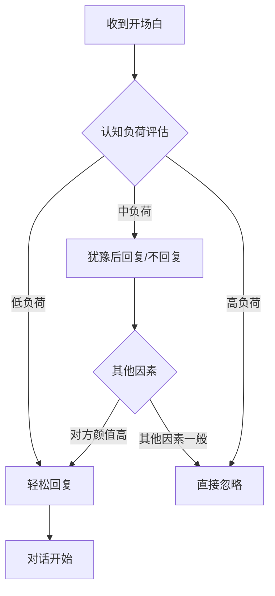

## 一、开场白话术（20个）

开场白是社交互动的第一声叩门。在恋爱场景中，它是从"陌生人"到"认识的人"的临界点——一句好的开场白不会直接让对方爱上你，但一句糟糕的开场白足以让机会归零。本章提供20个经过实战验证的开场白话术，并深入讲解其背后的心理机制、适用场景、使用禁忌和后续衔接策略。

### 1.1 开场白的心理学基础

在学习具体话术之前，必须理解三个核心心理学原理，它们决定了开场白为什么有效或无效。

#### 1.1.1 首因效应（Primacy Effect）

心理学家Solomon Asch的经典实验证明：人们对一个人的第一印象会强烈影响后续所有判断。在社交场景中，你发送的第一条消息就是你的"第一印象载体"。对方会根据这条消息在0.5-2秒内形成对你的初步判断：这个人是否有吸引力、是否值得回复、是否有趣。

这意味着开场白承担着三个隐性任务：
- **传递安全感**：让对方觉得你是一个正常、无威胁的人
- **传递价值信号**：让对方觉得你有趣/有品味/有见识
- **降低回复成本**：让对方觉得回复你是一件轻松的事

#### 1.1.2 互惠原则（Reciprocity Principle）

Robert Cialdini在《影响力》中提出的互惠原则指出：当一个人收到某种"礼物"时，会产生回报的内在压力。在开场白中，这个"礼物"可以是真诚的赞美、有价值的信息、或有趣的情绪体验。当对方从你的开场白中获得了正面感受，回复你的概率会显著提升。

但要注意：互惠原则的前提是对方感受到了"真诚"，而非"套路"。一旦对方觉得你在刻意运用技巧，效果会适得其反。

#### 1.1.3 认知负荷理论（Cognitive Load Theory）

John Sweller提出的认知负荷理论告诉我们：人的工作记忆容量有限。当你的开场白需要对方花大量脑力去理解、思考如何回复时，对方的大脑会本能地选择"跳过"。这就是为什么简短、清晰、易回复的开场白效果更好。

### 1.2 开场白的六大黄金原则

无论使用哪种话术，都必须遵循以下原则：

| 原则 | 说明 | 正面示例 | 反面示例 |
|------|------|----------|----------|
| **具体化** | 用细节代替笼统 | "你照片里那只橘猫好胖，是橘猫特有的贪吃吗？" | "你好像很喜欢猫" |
| **低门槛** | 回复不需要思考 | "看你也在学吉他，学了多久了？" | "你觉得音乐的本质是什么？" |
| **正向情绪** | 传递积极能量 | "你的笑容太有感染力了，我这边天气都变好了" | "你看起来挺孤单的" |
| **真诚感** | 不要像模板群发 | "看到你简介里写的那句话，我也深有感触" | "你好漂亮，可以认识一下吗" |
| **独特性** | 让对方觉得只对她/他说 | "你那个在冰岛拍的照片，北极光是真的肉眼可见吗？" | "你去过很多地方啊" |
| **安全边界** | 不越界、不施压 | "你好，冒昧打扰一下" | "美女，约吗" |

### 1.3 七类开场白话术详解

#### 1.3.1 直接开场型：真诚是最好的策略

直接开场的核心逻辑是：不伪装、不绕弯，用坦诚的态度表达想认识对方的意愿。这种方式看似简单，但在充斥着套路和模板的社交环境中，反而因为"反套路"而显得突出。

**话术1：朴素直接**
> "你好，看到你的资料，觉得挺有眼缘的，想认识一下。"

**使用要点**：
- "有眼缘"比"你好漂亮"更高级——前者表达的是一种整体感觉，后者只关注外貌
- 适合在相亲平台、正式社交场合使用
- 搭配一个简单的自我介绍效果更好："你好，我叫小王，在杭州做设计，看到你的资料觉得挺有眼缘的，想认识一下。"

**话术2：温暖开场**
> "Hi，你的笑容很温暖，忍不住想打个招呼。"

**使用要点**：
- "忍不住"这个词传递了一种自发的、不可控的感觉，比"我想"更有感染力
- 赞美的对象是"笑容"而非身材或脸，分寸感拿捏得当
- 适合对方照片中有明显笑容的情况

**话术3：自信开场**
> "你好，我是[名字]，觉得我们可以聊聊，你方便吗？"

**使用要点**：
- 这种开场白传递的是自信和尊重——先自我介绍，再表达意愿，最后询问方便
- "你方便吗"给了对方控制感，降低了压迫感
- 适合线下社交活动、朋友介绍等有"社交背书"的场景

**直接开场型的适用边界**：
- ✅ 相亲平台、正式社交、朋友介绍
- ❌ 陌生人突然搭讪（容易让对方产生戒备心理）
- ❌ 对方资料非常空白、没有可切入点时（显得像群发）

#### 1.3.2 共同点开场型：利用相似性吸引力

心理学中的"相似性-吸引力假说"（Byrne, 1971）表明：人们倾向于喜欢与自己相似的人。当你在开场白中指出双方的共同点时，会自动触发对方的亲近感。

**话术4：共同兴趣**
> "看到你也喜欢[某个兴趣]，我也很喜欢！你是什么时候开始的？"

**使用要点**：
- 关键是"什么时候开始的"这个问题——它比"你喜不喜欢"更有深度，能引出故事
- 共同兴趣越小众，效果越好。"你也喜欢看电影"远不如"你也看侯孝贤的电影"
- 如果对方资料中提到了具体的爱好细节，一定要抓住："看你主页有攀岩的照片，我上个月刚去阳朔磕了一条V4，你一般在哪攀？"

**话术5：共同经历**
> "看到你也是[学校/公司]的，真是太巧了！你是哪个部门/专业的？"

**使用要点**：
- 校友、前同事、同城是三大天然共同点
- "真是太巧了"表达了惊讶和欣喜，情绪浓度刚好
- 注意：如果对方是名校毕业，不要表现得过于崇拜，保持平等姿态

**话术6：共同朋友**
> "我们好像有共同的朋友[名字]，世界真小！"

**使用要点**：
- 这是一种"社交背书"——通过共同朋友传递信任感
- 适合微信群、朋友圈等有社交关系链的场景
- 如果不确定是否真的有共同朋友，可以用模糊表达："我好像在[某个群/活动]里见过你？"

**共同点开场型的注意事项**：
- 共同点必须真实，编造共同点一旦被拆穿，信任彻底崩塌
- 不要过度强调共同点，否则像在"攀关系"
- 共同点只是破冰工具，后续要迅速转入正常对话

#### 1.3.3 赞美开场型：精准赞美是门艺术

赞美是最低成本的"社交货币"，但大多数人的赞美要么太笼统（"你好漂亮"），要么太刻意（"你是我见过最美的女孩"）。有效的赞美必须满足三个条件：**具体、真诚、可验证**。

**话术7：赞美内在**
> "你的简介写得很有趣，感觉你是个很有想法的人。"

**分析**：
- 赞美的对象是"简介"——说明你认真看了资料，不是群发
- "有想法"是一种高价值评价，比"漂亮"更有深度
- 暗含的信息是："我关注的是你的内在，不只是外表"

**话术8：赞美品味**
> "你的照片拍得很有品味，是学过摄影吗？"

**分析**：
- "有品味"比"好看"更高级，暗示对方有审美能力
- "是学过摄影吗"是一个带假设的赞美——先肯定，再求证，让对方有机会展开话题
- 适用于对方照片质量明显高于平均水平的情况

**话术9：赞美气质**
> "你的笑容很有感染力，看着就让人心情好。"

**分析**：
- 赞美"气质"比赞美"长相"更不容易让人觉得油腻
- "让人心情好"把赞美转化成了对方对你的正面影响，增加亲近感
- 这句话的潜台词是："你有影响我情绪的能力"——这是一种隐性的高价值传递

**赞美的雷区**（必须避免）：

| 雷区 | 为什么是雷区 | 替代方案 |
|------|-------------|----------|
| "你好漂亮/好帅" | 太笼统，像群发，且只关注外表 | "你的穿搭风格很有辨识度" |
| "你是我见过最美的" | 夸张到不可信，显得油滑 | "你的照片让我多看了几眼" |
| "身材真好" | 过于关注身体，有性暗示嫌疑 | "你看起来很注重健身，很有活力" |
| "天使面孔魔鬼身材" | 低俗、油腻、不尊重 | 删除这条，永远不要用 |
| "美女你好" | "美女"已经成为无意义的称呼 | 直接说"你好"或用对方名字 |

#### 1.3.4 问题开场型：让对方成为对话主角

问题开场的核心逻辑是：人们喜欢谈论自己。哈佛大学的研究表明，当人们谈论自己时，大脑的奖励中枢会被激活，产生愉悦感。一个好的开场问题，能让对方"忍不住"想回答。

**话术10：请教问题**
> "看到你对[某个领域]很了解，想请教你一个问题..."

**使用要点**：
- "请教"是一个姿态词，传递谦逊和尊重
- 关键是后续的问题必须具体且对方真的能回答
- 例如："看你对红酒很有研究，想请教一下，入门的话推荐从哪个产区开始？"
- 避免问过于专业的问题，否则对方回答起来有压力

**话术11：寻求建议**
> "我最近想找[某种类型的餐厅/电影]，你有什么推荐吗？"

**使用要点**：
- 这是一种"轻量级求助"，回复成本极低
- 餐厅、电影、书籍、旅行目的地是四个万能求助话题
- 后续可以根据推荐展开深入对话："你推荐的这家店我查了一下，评分好高！你一般点什么？"

**话术12：好奇提问**
> "你的照片里那只猫/狗好可爱，叫什么名字？"

**使用要点**：
- 宠物是打开话匣子的万能钥匙——养宠物的人99%愿意聊自己的宠物
- "叫什么名字"比"你的猫好可爱"更进一步，引导对方讲故事
- 后续可以延伸："名字好特别，有什么含义吗？" → 故事自然展开

**问题开场型的关键技巧**：
- 问题必须是"开放式"（需要解释才能回答），而非"封闭式"（是/否就能回答）
- 问题要与对方的资料相关，不要问可以对任何人问的问题
- 最好的问题能让对方分享一个故事，而非一个事实

#### 1.3.5 幽默开场型：用笑声打开防线

幽默是最高级的社交技能，它能在几秒内消除陌生感、传递智力信号、创造共同情绪体验。但幽默也是最危险的——失败的幽默会让人尴尬，甚至产生反感。

**话术13：坦诚式幽默**
> "我纠结了好久要不要打招呼，最后决定勇敢一次。你好！"

**分析**：
- 这句话的幽默在于"揭露了所有人都经历过的心理过程"
- 潜台词是："我也是普通人，也会紧张"——这让对方产生共鸣
- "勇敢一次"传递了一种积极的自我调侃，不卑不亢

**话术14：自嘲式幽默**
> "我的开场白想了半天，最后决定用最朴素的方式：你好！"

**分析**：
- 自嘲的核心是"承认自己的不完美"，这反而显得真实可爱
- "想了半天"和"最朴素的方式"之间的反差制造了笑点
- 这种自嘲不会降低你的价值感，因为它展示的是"我认真对待这件事"

**话术15：观察式幽默**
> "你资料里的[某个点]让我笑了，感觉你是个有趣的人。"

**分析**：
- 这是最高级的幽默类型——基于真实观察的回应
- "让我笑了"说明你真的看了资料，且被逗到了
- 关键是[某个点]必须具体，例如："你简介里写的'本人比照片好看'这句话让我笑了，很有自信"

**幽默开场的红线**：
- ❌ 不要用黄色笑话或性暗示
- ❌ 不要拿对方的外貌开玩笑
- ❌ 不要用可能冒犯特定群体的笑话
- ❌ 不要用网络烂梗（如"在吗"、"小姐姐"）
- ✅ 最安全的幽默是自嘲和对共同处境的调侃

#### 1.3.6 场景开场型：借助环境自然破冰

场景开场是线下社交的核心技巧——利用共同所处的环境作为话题切入点，让搭讪显得自然而非刻意。

**话术16：活动现场**
> "这个活动挺有意思的，你是第一次来吗？"

**使用要点**：
- "第一次来吗"是一个万能的场景问题，无论是展览、讲座、聚会都适用
- 如果对方说"不是第一次"，可以追问："那你觉得这次和之前比怎么样？"
- 如果对方说"是第一次"，可以说："我也是，感觉还挺有趣的。你对今天的[演讲者/展品]怎么看？"

**话术17：日常偶遇**
> "不好意思打扰一下，你点的这个看起来很好喝，是什么？"

**使用要点**：
- "不好意思打扰一下"是必要的礼貌前缀，降低对方的防御心理
- 适用于咖啡厅、餐厅、酒吧等消费场景
- 后续衔接："你经常来这里吗？我第一次来，不知道点什么好。"
- 注意观察对方是否有耳机、在忙碌等"请勿打扰"的信号

**话术18：朋友聚会**
> "你好，我是[名字]，是[朋友名字]的朋友，你是怎么认识他的？"

**使用要点**：
- 朋友聚会是最低门槛的社交场景——有社交背书、有共同话题、有安全边界
- "你是怎么认识他的"是一个天然的故事引子
- 后续可以根据对方的回答自然延伸话题

**场景开场的通用公式**：
1. **观察**：注意到环境中的某个细节
2. **评论**：对这个细节做一个中性或正面的评论
3. **提问**：以一个问题结束，邀请对方参与

例如在书店："这本书我也看过（观察），作者的观点挺新颖的（评论），你看到哪了？（提问）"

#### 1.3.7 创意开场型：跳出框架的差异化策略

当你的竞争对手（其他追求者）都在用"你好""在吗""可以认识一下吗"时，一个有创意的开场白能让你从人群中脱颖而出。但创意不等于猎奇——目标是引发有趣对话，而非吓到对方。

**话术19：二选一游戏**
> "如果可以选择，你更想拥有飞行能力还是隐身能力？"

**分析**：
- 这类问题的妙处在于：没有标准答案，但每个人都有自己的想法
- "飞行"通常代表向往自由的人，"隐身"通常代表好奇心强或内向的人——对方的回答能帮你快速了解其性格
- 后续追问："为什么选这个？"就能自然展开深度对话
- 变体问题："猫派还是狗派？""早起还是熬夜？""海边还是山里？"

**话术20：假设场景**
> "如果你可以穿越到任何一个时代生活一年，你会选哪个？"

**分析**：
- 这类问题比"你喜欢什么"更有趣，因为它需要想象力
- 对方的回答往往能暴露其价值观和兴趣方向
- 例如选"唐朝"的人可能喜欢中国文化，选"文艺复兴"的人可能对艺术感兴趣
- 后续可以针对对方的选择展开深入讨论

**创意开场的注意事项**：
- 创意问题应该是"有趣的思考"而非"刁钻的考题"
- 不要连续使用多个创意问题，否则像在做问卷调查
- 创意开场后，必须迅速转入正常对话，不要一直停留在"游戏模式"
- 对方如果对创意问题不感冒，立刻切换到直接/问题开场型

### 1.4 不同平台的开场策略

不同社交平台的语境差异巨大，开场白必须适配平台特性：

| 平台类型 | 特点 | 推荐话术类型 | 注意事项 |
|----------|------|-------------|----------|
| **相亲App**（探探、陌陌） | 信息少、选择多、节奏快 | 直接型、赞美型 | 第一句决定是否匹配，简洁有力 |
| **微信** | 有朋友圈可参考、半熟人社交 | 共同点型、问题型 | 从朋友圈找切入点最自然 |
| **兴趣社区**（豆瓣、小红书） | 有共同兴趣、内容导向 | 共同点型、问题型 | 围绕内容展开，不要太快转私人话题 |
| **线下活动** | 有环境依托、面对面交流 | 场景型、直接型 | 注意肢体语言和语调 |
| **朋友介绍** | 有社交背书、信任基础 | 直接型、共同点型 | 提及介绍人，利用信任传递 |

### 1.5 开场白后的黄金30秒

开场白只是敲门砖，真正决定对话能否持续的是开场后的30秒。以下是关键的衔接策略：

**策略一：2:1回复节奏**
对方回复后，你的下一条消息应该包含2个元素：1个回应 + 1个新话题点。例如：

> 对方："谢谢！我学摄影两年了。"
> 你："两年就能拍成这样，天赋不错啊！（回应）你是从什么设备开始的，手机还是直接上相机？（新话题）"

**策略二：情绪优先于信息**
不要急于收集信息（你几岁、做什么工作、哪里人），而是先建立情绪连接。"你学摄影时有没有拍出过废片？"比"你用什么相机"更有温度。

**策略三：适时自我暴露**
在对方分享后，主动分享自己的相关经历，建立平等感。"你说的这家咖啡厅我也去过，上次差点在里面待到打烊。"

### 1.6 常见开场白误区

以下是新手最常犯的错误，每个错误都可能导致对话直接终结：

**误区1：群发式开场**
> "你好，认识一下？"

问题：这种开场白可以发给任何人，毫无针对性。对方收到后会想："你是不是同时给100个人发了这条消息？"

**误区2：查户口式开场**
> "你多大？做什么工作？哪里人？"

问题：这不是开场白，这是审讯。在对方还没有跟你建立任何关系之前，连续提问会让人产生强烈的防御心理。

**误区3：过度热情**
> "你好！！！你的照片太美了！！！我好想认识你！！！"

问题：过多的感叹号和过高的情绪浓度会让对方感到压迫。成年人的社交应该有适度的距离感。

**误区4：自我中心**
> "我是XX大学毕业的，现在在XX公司做XX，年薪XX万..."

问题：开场白的主角应该是对方，不是你。在对方还没有表现出兴趣之前，单方面展示自己会让对方觉得你在"推销"。

**误区5：暗示性开场**
> "你看起来好寂寞啊，需要人陪吗？"

问题：这种开场白带有明显的性暗示，会让绝大多数人感到不适并直接拉黑。

### 1.7 开场白的进阶心法

当你熟练掌握了以上20个话术后，需要理解更高层次的原则：

**心法1：没有万能开场白，只有最适合的开场白**

话术只是工具，真正的核心能力是"观察力"——你能不能从对方的资料、照片、动态中找到那个独一无二的切入点。一个针对对方具体情况量身定制的开场白，效果胜过任何通用话术。

**心法2：开场白的质量取决于你对对方的了解程度**

在发送开场白之前，花30秒认真看对方的资料。照片里有什么细节？简介里有什么关键词？最近发了什么动态？这些信息中隐藏着最好的开场白素材。

**心法3：你的整体形象比开场白更重要**

再好的开场白也无法弥补模糊的照片、空白的简介、或糟糕的社交形象。在打磨话术之前，先确保你的个人资料是经过精心设计的。

**心法4：练习是唯一的捷径**

不要指望背下20个话术就能成为社交高手。每次使用后，回顾效果：对方回复了什么？对话持续了多久？哪句话让对方明显更积极？通过不断的实战-复盘-调整，你会逐渐发展出属于自己的开场风格。

**心法5：接受"不回复"是常态**

即使是最好的开场白，回复率也不会是100%。不回复的原因有很多——对方可能在忙、可能没看到、可能已经有人了、可能今天心情不好。不要因为几次不回复就否定自己，保持平常心持续尝试才是正确的心态。

***

> **本章总结**：开场白的本质是"用最短的时间传递最大的善意和吸引力"。20个话术提供了7种策略方向，但真正的高手会根据具体情况灵活组合、即兴发挥。记住：真诚是最好的话术，具体是最好的赞美，低门槛是最好的邀请。
