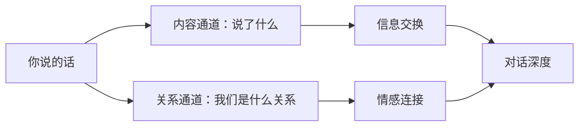
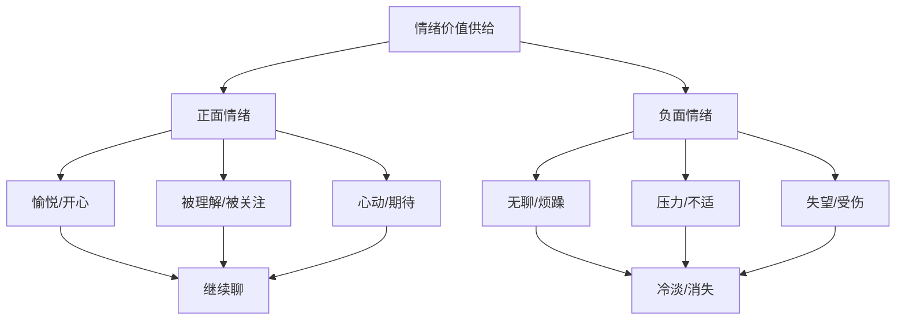
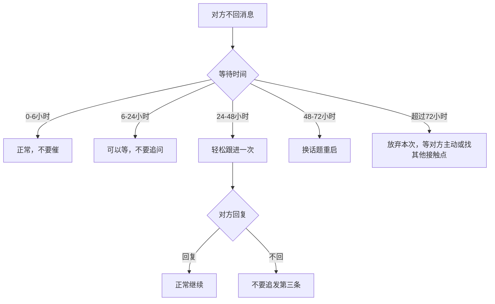
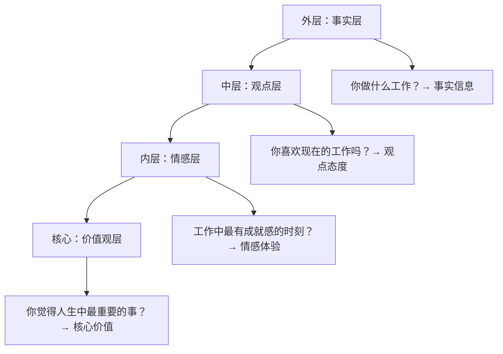
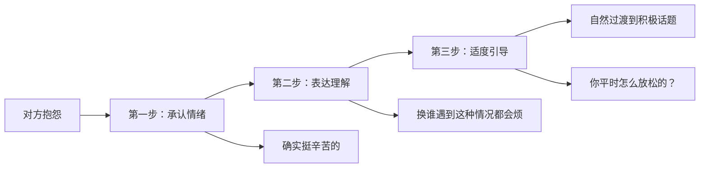
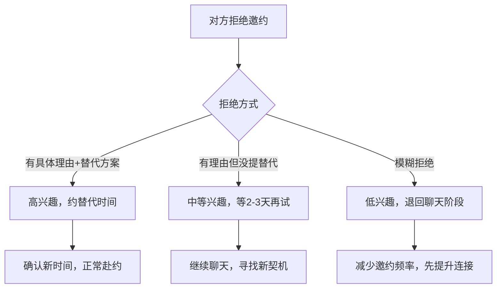
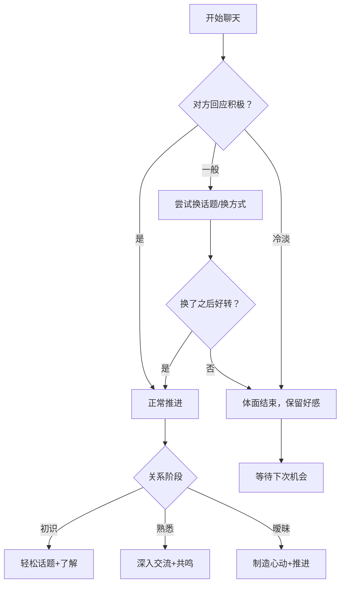

## 二、聊天话术（30个场景）

开场白决定了对方是否愿意跟你聊，而聊天话术决定了对方是否愿意继续跟你聊、跟你聊多久、以及是否愿意从"线上聊天"走向"线下见面"。本章覆盖从初识到暧昧阶段的30个高频聊天场景，每个场景提供心理分析、多版本话术、常见错误和进阶变体。

### 2.1 聊天的心理学底层逻辑

在进入具体场景之前，先建立三个核心认知，它们是所有聊天话术的底层操作系统。

#### 2.1.1 对话的双通道模型

人类的对话同时传递两个层面的信息：

**内容通道**传递的是事实和信息——你今天做了什么、你喜欢什么电影、你对某个话题的看法。**关系通道**传递的是情感和态度——你对我有没有兴趣、我们之间的距离是远是近、你是不是一个有趣的人。

初学者只关注内容通道（"聊什么话题"），高手同时经营关系通道（"用什么方式聊"）。同样一句"你在干嘛"，可以是无聊的查岗，也可以是温暖的惦记，区别在于关系通道传递了什么。

#### 2.1.2 情绪价值的供需关系

聊天的本质不是信息交换，而是情绪价值的交换。什么是情绪价值？就是你让对方在跟你聊天时产生的正面情绪——被理解的满足感、被逗笑的愉悦感、被关注的温暖感、被吸引的心动感。

**关键公式**：你提供的情绪价值 > 对方回复你所需的成本 → 对话持续。当对方觉得跟你聊天"累"（情绪价值低、回复成本高），对话就会逐渐冷淡直到消失。

#### 2.1.3 对话节奏的心理学

好的聊天不是匀速运动，而是有节奏的呼吸：

| 节奏阶段 | 心理作用 | 具体表现 | 典型时长 |
|---------|---------|---------|---------|
| **开场热身** | 降低防御、建立舒适感 | 轻松话题、日常寒暄 | 3-5条消息 |
| **深入交流** | 建立连接、增加了解 | 分享经历、交换观点 | 10-20条消息 |
| **情绪高潮** | 制造心动、加深印象 | 幽默/暧昧/深度共鸣 | 2-5条消息 |
| **收尾留钩** | 制造期待、保持联系 | 悬念/约定/不舍的语气 | 2-3条消息 |

很多人的聊天死在"没有节奏"——要么一直停在热身阶段（尬聊），要么跳过深入直接暧昧（太突兀），要么聊到自然消亡（没有收尾）。学会掌控节奏，比学100句话术更有用。

### 2.2 冷场与破冰场景（场景1-5）

这组场景处理的是对话中最常见的"卡壳"时刻。冷场不可怕，可怕的是用错误的方式处理冷场。

#### 场景1：对方回复简短——"嗯""哦""哈哈"

**问题本质**：对方的简短回复传递了两种可能的信号——(1) 确实性格内向/不善表达；(2) 对话题不感兴趣或对你还不够感兴趣。大多数人在面对简短回复时会犯两个错误：继续追问同一个话题，或者自己也开始简短回复导致对话死亡。

**话术方案A——轻松点破**：
> "你回复这么简短，我都不知道该怎么接了😂 要不我换个话题？最近有什么开心的事吗？"

**话术方案B——自嘲式化解**：
> "我发现我问的问题好像都不太对你的胃口😅 你平时喜欢聊什么？给我划个重点呗"

**话术方案C——切换赛道**：
> "看你回复这么简洁，要么是工作太忙，要么是我太无聊了哈哈。给你出个选择题：猫派还是狗派？"

**心理分析**：
- 方案A适合关系稍近一些的情况，直接指出问题但带着笑容
- 方案B用自嘲降低对方的压力，同时把"球"递给对方
- 方案C用趣味问题降低回复门槛，二选一的问题比开放式问题更容易回答

**常见错误**：

| 错误做法 | 为什么错 | 后果 |
|---------|---------|------|
| "你怎么总是嗯嗯哦哦的" | 带有指责语气 | 对方产生防御心理，可能直接不回 |
| "你是不是不想跟我聊" | 传递不安全感 | 增加对方压力，适得其反 |
| 也开始简短回复 | 被动攻击 | 双方都冷淡，对话自然死亡 |
| 连续发三四条消息轰炸 | 暴露需求感过强 | 对方觉得你很"黏"，想要逃离 |

**进阶思路**：如果对方连续多次简短回复，问题可能不在话题上，而在对方目前对你的好感度不够。此时正确策略不是"找更好的话题"，而是退一步——减少聊天频率，把精力放在提升自身吸引力上（朋友圈经营、共同活动等），等对方对你的兴趣自然提升后再恢复聊天。

#### 场景2：对方很久没回消息

**问题本质**：已读不回或长时间未读是线上聊天中最让人焦虑的情况。焦虑的根源在于"不确定性"——你不知道对方是忙、是忘了、是不想回、还是对你失去了兴趣。这种不确定性会驱动你做出错误的决策——连续追问、质问、或发送试探性消息。

**话术方案A——等待24小时后的轻松跟进**：
> "是不是最近比较忙？没关系，有空再聊～"

**话术方案B——等待48小时后的自然重启**：
> "路过一家店闻到很香的咖啡味，突然想到你说过喜欢喝咖啡☕ 最近有没有发现什么好喝的？"

**话术方案C——如果之前聊得不错，更直接的方式**：
> "好几天没你消息了，不会被外星人抓走了吧👽"

**心理分析**：

**黄金法则**：在对方没有回复的情况下，最多跟一条消息。如果第二条也不回，不要再发第三条。三条以上不回的消息 = 你在自降身价。

**常见错误**：
- "你怎么不回我？" —— 质问语气让人不舒服
- "你是不是生气了？" —— 暴露不安全感
- "在吗？""还在吗？" —— 最无效的消息
- 连续发多条消息 —— 每多发一条，你的吸引力就降低一分

#### 场景3：突然冷场不知道说什么

**问题本质**：冷场的原因通常有三种：(1) 话题自然聊完了；(2) 对方的回复让你不知道怎么接；(3) 你和对方的共同话题储备不足。冷场本身不是问题，对冷场的恐惧才是——因为恐惧会让你要么尬聊，要么沉默。

**话术方案A——游戏化破冰**：
> "突然不知道说什么了，要不我们玩个游戏？你问我一个问题，我问你一个问题，轮流来。"

**话术方案A的进阶版——真心话选择题**：
> "来玩个快问快答，我先来：如果明天突然放假一周，你的第一反应是躺家里还是出去浪？"

**话术方案B——分享当下状态**：
> "刚忙完手头的事，坐在窗边发呆，今天的晚霞特别好看[拍照]。你那边天气怎么样？"

**话术方案C——用朋友圈/状态破冰**：
> "看到你朋友圈发的那家店，看起来好赞！你是什么时候去的？值得推荐吗？"

**话术方案D——假设性问题**：
> "突然好奇，如果给你一个超能力，你想要什么？我选读心术，感觉社交会方便很多😂"

**冷场预防策略**：

| 策略 | 具体做法 | 原理 |
|------|---------|------|
| **话题库储备** | 平时留意有趣的事、热点新闻、好吃好玩的 | 有"弹药"就不会冷场 |
| **对方兴趣标签** | 记住对方提过的爱好、计划、烦恼 | 围绕对方兴趣展开话题 |
| **生活分享法** | 主动分享自己生活中的小片段 | 给对方提供可以接的话头 |
| **话题跳跃法** | 一个话题聊3-5轮后自然切换 | 避免单个话题聊死 |

#### 场景4：对方问"你在干嘛"

**问题本质**："你在干嘛"是线上聊天中最常见的开场之一，但它不是真正想知道你在做什么——它是一个"连接请求"，意思是"我想跟你聊天了"。理解了这个本质，你的回答就不应该只传递信息，还应该传递情绪和邀请。

**话术方案A——具体+反问**：
> "刚忙完一个项目，终于可以喘口气了。你呢，今天过得怎么样？"

**话术方案B——趣味回答**：
> "在想一个很严肃的问题——晚上吃什么😂 你有什么好建议吗？"

**话术方案C——制造暧昧**：
> "刚准备发消息给你，你就来了，是不是心有灵犀？"

**话术方案D——展示生活**：
> "在学做一道新菜，目前看起来像是黑暗料理…[拍照]你要不要猜猜这是什么？"

**关键原则**：无论怎么回答，都要做到两点：(1) 回答要具体而不是"没干嘛"；(2) 一定要接一个反问或话题钩子，把对话的接力棒递给对方。

**常见错误**：
- "没干嘛" —— 等于说"我不想跟你聊"
- "在忙" —— 如果你真的在忙，应该说"在忙XX，忙完找你"
- 只回答不反问 —— 对方需要再次主动发起话题，增加回复成本

#### 场景5：不知道怎么深入了解对方

**问题本质**：想了解一个人，不能像面试官一样逐条提问——"你多大？做什么工作？哪里人？"这种方式让对话变成审讯，对方会本能地提高警惕。深入了解的正确方式是：通过有趣的问题引发对方主动分享，让对方在轻松的状态下展现真实的自己。

**话术方案A——自我认知类**：
> "如果让你用三个词形容自己，你会用哪三个？"

**话术方案B——价值观探测类**：
> "你觉得一个人最重要的品质是什么？"

**话术方案C——生活方式类**：
> "你理想中的周末是怎么度过的？是宅家还是出去浪？"

**话术方案D——梦想探索类**：
> "如果钱不是问题，你最想做的事情是什么？"

**话术方案E——趣味假设类**：
> "如果穿越回古代，你觉得你会是什么身份？"

**深入提问的进阶框架——"洋葱模型"**：

**核心技巧**：不要在同一个话题层级停留太久。当对方回答了一个"事实层"的问题，你可以用"观点层"的问题来深入；当对方表达了观点，你再用"情感层"的问题来深入。这样自然地从表面走向深层，对方不会觉得被审问，反而会觉得你真的在认真听。

### 2.3 情绪共鸣与回应场景（场景6-10）

会聊天的人不是能说会道的人，而是能让对方觉得"被看见""被理解"的人。这组场景教你如何回应对方的分享，让对方觉得跟你聊天很舒服。

#### 场景6：对方分享日常琐事

**问题本质**：当对方主动分享日常（"今天加班到很晚""中午吃了个很好吃的面""刚追完一部剧"），这不是在传递信息——这是在发出连接信号。对方在说"我想让你参与我的生活"。你的回应质量直接决定了对方以后还愿不愿意跟你分享。

**话术公式：回应情绪 + 具体关注 + 引导展开**

**话术方案A——回应加班**：
> "又加班啊，你们公司是不是把加班当企业文化了😤 不过你这么拼，肯定是有目标的那种人。平时加班完都怎么犒劳自己？"

**话术方案B——回应美食**：
> "什么面这么好吃？在哪里？我需要具体地址和店名，下次去试试🍜 你是那种为了吃愿意跑很远的人吗？"

**话术方案C——回应追剧**：
> "哪部剧？我也需要新的追剧清单！你平时追剧是那种一口气刷完的类型还是慢慢看的？"

**核心原则——三级回应法**：

| 层级 | 做法 | 效果 | 示例 |
|------|------|------|------|
| **一级（敷衍）** | 只回应事实 | 对方觉得你不在意 | "哦""挺好的" |
| **二级（合格）** | 回应事实+提问 | 对方觉得你有在听 | "什么面？在哪？" |
| **三级（优秀）** | 回应情绪+关注细节+延伸话题 | 对方觉得被理解 | 上面的方案示例 |

永远追求三级回应。如果实在不知道说什么，至少做到二级——绝不能停在一级。一级回应连续出现三次以上，对方就不会再主动分享了。

#### 场景7：对方抱怨工作/生活压力

**问题本质**：当对方抱怨时，大多数人犯的第一个错误是"急于解决问题"——"你应该跟领导谈谈""你可以换个工作啊""别想太多了"。但对方抱怨的目的不是寻求解决方案，而是寻求情感认同。心理学家John Gottman的研究表明，在亲密关系中，当一方表达负面情绪时，最需要的是"情感验证"（Emotional Validation），而非建议。

**话术方案A——情感验证**：
> "听起来确实挺辛苦的。这种时候最容易觉得疲惫，你的感受完全可以理解。"

**话术方案B——共情+引导**：
> "遇到这种情况谁都会烦。你平时怎么缓解压力？有什么特别的方法吗？"

**话术方案C——轻度支持+转移注意力**：
> "辛苦了💪 忙完这一阵要不要一起出去吃顿好的？你值得犒劳一下自己。"

**话术方案D——针对具体情境**：
> "你们领导也太过分了吧…不过话说回来，能在这种环境下坚持下来的人，抗压能力肯定不是一般的强。"

**关键原则——先共情后引导**：

**常见错误**：

| 错误回应 | 对方的真实感受 |
|---------|---------------|
| "别想太多了" | "你根本不在乎我的感受" |
| "你应该这样做……" | "我又没问你意见" |
| "我比你更惨……" | "你把话题抢走了" |
| "忍忍就好了" | "你在敷衍我" |
| "那就辞职呗" | "你完全不理解我的处境" |

#### 场景8：对方分享美食照片

**问题本质**：美食照片是一个低门槛、高互动性的话题——每个人都能聊几句。但大多数人只会说"看起来好吃"，这就浪费了一个展示品味和建立连接的机会。

**话术方案A——自己做的情况**：
> "看起来好专业！你自己做的吗？[如果是] 也太厉害了吧，这是什么菜？有菜谱吗？我这种厨房杀手看了直接自闭😂"

**话术方案B——外面吃的情况**：
> "这是哪家店？坐标哪里？看起来很有食欲，你平时喜欢什么口味的？辣的还是清淡的？"

**话术方案C——制造连接**：
> "看得我都饿了！你推荐的肯定好吃，下次带我去呗？我负责买单你负责选店😂"

**进阶策略**：美食话题是绝佳的邀约铺垫。如果对方经常分享美食，你可以在聊天中自然地建立"美食搭子"的关系定位——"我发现我们口味好像很像""你推荐的店都没踩过雷"——为后续邀约（"新开了一家XX，一起去试试？"）做铺垫。

#### 场景9：对方分享旅行照片/经历

**问题本质**：旅行是自我表达的重要方式——一个人选择去哪里、怎么玩、拍什么照片，都投射着TA的价值观和审美偏好。因此，聊旅行不只是聊风景，更是了解对方内心世界的窗口。

**话术方案A——深度好奇型**：
> "这个地方好美！你是什么时候去的？有什么推荐的景点或美食？你一般旅行是做攻略派还是随心走派？"

**话术方案B——共鸣型**：
> "我一直想去这里！你这次去了几天？有什么你去了之后才知道的？就是那种不做攻略就发现不了的。"

**话术方案C——价值观探测型**：
> "看你的旅行风格，感觉你更喜欢自然风景还是城市探索？你旅行中最有记忆点的一次经历是什么？"

**话术方案D——邀约铺垫型**：
> "你的照片拍得好好看📸 看了你发的，这个地方已经被我加入清单了。下次你去旅行的时候带上我呗，我负责当行李架😂"

**关键技巧**：不要只问"去了哪里""好不好玩"这种表面问题。要问"你的感受""你的发现""你的选择"——这些问题能让对方分享更深层的自我。

#### 场景10：制造暧昧——从朋友到心动

**问题本质**：暧昧的核心不是说什么"撩人"的话，而是在普通对话中植入"我们之间有特别的感觉"这个信号。暧昧是一个渐进的过程——太慢了会变成纯友谊，太快了会吓到对方。最佳策略是"进一步退半步"——每释放一点好感信号，就观察对方的反应；对方接住了就继续，没接住就退回来。

**话术方案A——感受表达型**：
> "和你聊天总是很开心，感觉时间过得特别快。"

**话术方案B——假设型暧昧**：
> "要是我们住近一点就好了，可以经常一起吃饭。"

**话术方案C——独特性表达**：
> "你跟我想的不太一样，比我想的还要有趣。"

**话术方案D——未来植入型**：
> "我发现了一家超棒的店，已经在脑子里规划好带你去的路线了。"

**暧昧信号的层级体系**：

| 级别 | 信号类型 | 示例 | 风险等级 |
|------|---------|------|---------|
| L1 | 表达愉快 | "跟你聊天很开心" | 低 |
| L2 | 独特性表达 | "你跟别人不一样" | 低-中 |
| L3 | 未来植入 | "下次一起……" | 中 |
| L4 | 假设亲密 | "如果我们……" | 中-高 |
| L5 | 直接心动 | "我发现我好像有点喜欢你" | 高 |

**关键规则**：每次只进一级，观察对方回应。如果对方对你的L2信号有正面回应（比如也说"我也是"、发害羞表情、主动延续话题），你下次可以尝试L3。如果对方忽略、转移话题、或回应冷淡，就退回L1，等待更合适的时机。

### 2.4 日常互动场景（场景11-18）

这组场景覆盖日常聊天中最常见的互动模式。很多人在这些"简单"场景上犯错，因为觉得"这种小事不需要讲究"——但恋爱中的好感，恰恰是被这些小事一点一滴积累或消耗的。

#### 场景11：对方说"我去洗澡了"

**问题本质**：当对方说"我去洗澡了"，有三种可能：(1) 真的要去洗澡；(2) 想结束对话但不好意思直说；(3) 一种习惯性的收尾方式。无论是哪种，你的回应方式都应该是——大方、不纠缠、留有下次连接的空间。

**话术方案A——温和道别**：
> "好的，洗完早点休息，晚安～明天聊。"

**话术方案B——带点俏皮**：
> "去吧去吧，别洗着洗着睡着了😄 晚安～"

**话术方案C——制造小期待**：
> "好的，那明天给你分享一个今天发现的好东西。晚安💤"

**绝对不能做的**：
- "你真的去洗澡吗？" —— 质问让人不舒服
- "那我等你" —— 压力太大
- "洗完了记得找我" —— 暴露过强需求感
- 对方说去洗澡后继续发消息 —— 不尊重对方的边界

#### 场景12：对方说"我去忙了"

**问题本质**：跟"去洗澡"类似，但"去忙了"传递的信号更强——对方明确表示接下来一段时间不会看消息。你的回应核心是：尊重+不追问+留下积极印象。

**话术方案A——简洁大方**：
> "好，你先忙，有空再聊。"

**话术方案B——积极收尾**：
> "去吧，忙完了好好休息。加油💪"

**话术方案C——轻度暧昧**：
> "去忙吧，等你忙完请我喝奶茶，算是你冷落我的补偿😂"

**关键原则**：对方说忙的时候，不要追问"忙什么""忙到几点""忙完了找我"。对方如果想告诉你自然会说，不想说你追问只会增加压力。

#### 场景13：如何自然地邀约

**问题本质**：邀约是从线上到线下的关键转折点。很多人的邀约失败不是因为对方不想见你，而是邀约的方式让对方感到压力。好的邀约应该让对方觉得"这是一个轻松的、没有压力的提议"，而不是"这是一个需要郑重考虑的决定"。

**话术方案A——基于聊天内容的自然邀约**：
> "你说的那家面馆我查了一下，离我公司不远诶，中午一起去试试？"

**话术方案B——基于共同兴趣的邀约**：
> "最近XX（对方提过的兴趣相关活动），我正好有空，一起？"

**话术方案C——低压力的模糊邀约**：
> "有空一起出来吃个饭呀，我知道一家很不错的店。"

**话术方案D——具体的活动邀约**：
> "周六下午在XX有个市集/展览/活动，看起来挺有意思的，要不要一起去看看？"

**邀约成功率对比**：

| 邀约方式 | 成功率 | 原因 |
|---------|--------|------|
| "有空出来玩" | 低 | 太模糊，对方不知道怎么回应 |
| "周六下午去XX？" | 高 | 具体时间和地点，对方只需要说"好"或提替代方案 |
| "下周一起吃饭？" | 中 | 有具体事项但时间太宽泛 |
| "你这周末有空吗？"（单独问） | 低 | 对方不知道你要干嘛，可能本能说"没空" |

**核心公式**：具体活动 + 大致时间 + 轻松语气 = 高成功率邀约

**邀约被接受后**：立刻确认细节——"那周六下午两点，XX地铁站见？"不要让已经答应的邀约因为没有确认而变成模糊的承诺。

#### 场景14：对方拒绝邀约

**问题本质**：被拒绝是邀约的常态，不是异常。对方拒绝可能有无数原因——真的有事、还没准备好见面、约会地点不合适、心情不好——大多数原因跟你本人无关。正确处理拒绝的方式，反而能提升你在对方心中的形象。

**话术方案A——大方接受**：
> "没关系，那下次有机会再约。你最近有什么安排吗？"

**话术方案B——给对方主动权**：
> "没问题，等你哪天有空了告诉我，我们再约。"

**话术方案C——轻松化解**：
> "好吧，那这家店我就先替你尝尝，好吃的话再带你去😄"

**拒绝后的行动策略**：

**关键底线**：被拒绝后不要追问"为什么不行""那什么时候有空"，更不要表现出失望或不满。一次拒绝不等于永远拒绝，但一次不体面的反应可能真的关上大门。

#### 场景15：如何表达关心

**问题本质**：关心是建立情感连接最直接的方式，但"关心"和"过度关心"之间只有一线之隔。好的关心是"我想到你了"，坏的关心是"我在监控你"。区别在于频率、具体程度和语气。

**话术方案A——天气变化时**：
> "看天气预报明天要降温，记得多穿点，别感冒了。"

**话术方案B——对方提到过的事情**：
> "你上次说的那个面试/考试/项目，怎么样了？一切顺利吗？"

**话术方案C——节日/特殊日子**：
> "今天冬至，你们那边吃饺子还是汤圆？别忘了吃应节的食物哦。"

**话术方案D——看到相关事物时**：
> "路过一家店看到这个，想到你说过喜欢，就拍给你看看[拍照]。"

**关心的黄金频率**：

| 关系阶段 | 频率建议 | 具体表现 |
|---------|---------|---------|
| 初识期 | 每周1-2次 | 结合聊天自然带出，不刻意 |
| 聊天期 | 每2-3天一次 | 开始记住对方的细节 |
| 暧昧期 | 每天或隔天 | 关心变得更日常化 |
| 恋爱期 | 随时 | 不再需要计算频率 |

**反面教材**：每天问"吃了吗""睡了吗""到家了吗"不是关心，是查岗。真正的关心是带着具体信息的——"今天降温了"比"多穿点"更具体；"你上次说胃不舒服，今天好点了吗"比"你身体怎么样"更让人感动。

#### 场景16：对方生病了

**问题本质**：对方生病时是最需要关心的时候，也是最能展示你真心的时刻。但要注意一个关键区分：文字上的关心（"多喝水""好好休息"）价值很低，因为在对方看来谁都会说；而行动上的关心（送药、送粥、陪伴）价值很高，因为需要付出实际成本。

**话术方案A——基础关心**：
> "怎么了？严重吗？有没有去看医生？好好休息，多喝水。需要我帮你买什么吗？"

**话术方案B——如果距离允许**：
> "你住哪里？我一会儿给你送点药过去。你吃东西了吗？需要我帮你带点粥吗？"

**话术方案C——如果距离不允许**：
> "好心疼，我现在过不去，但你可以随时找我。我帮你叫个外卖送点粥？你把你地址发我。"

**话术方案D——后续跟进**：
> "今天感觉好点了吗？药按时吃了吗？如果明天还没好转一定要去医院啊。"

**关键原则**：
- 如果关系允许，能见面就见面，能打电话就打电话——生病时文字是最低效的沟通方式
- "需要我帮你做什么吗"比"你要注意身体"好一万倍——前者是行动邀请，后者是废话
- 后续跟进（第二天问"好点了吗"）比当天的一堆关心更能打动人

#### 场景17：如何自然地展示自己

**问题本质**：展示自己的价值是吸引力的核心，但"展示"和"炫耀"的区别在于——展示是自然的分享，炫耀是刻意的表演。好的自我展示应该像是对方在不经意间发现了你的闪光点，而不是你举着聚光灯照在自己身上。

**话术方案A——技能展示**：
> "今天自己做了[某道菜]，还挺成功的，下次有机会做给你尝尝。[附照片]"

**话术方案B——品味展示**：
> "最近在读[某本书]，里面有个观点特别有意思——[简述]。你平时喜欢看什么类型的书？"

**话术方案C——社交价值展示**：
> "周末和朋友去了[某个地方]，拍了张不错的照片[附照片]。你有空的时候也可以去看看，那个地方真的很舒服。"

**话术方案D——生活态度展示**：
> "刚跑完5公里，大汗淋漓的感觉真爽🏃 你平时有运动习惯吗？"

**展示的三个原则**：
1. **自然**：在聊天语境中自然带出，不要突兀地"自报家门"
2. **具体**："刚读完《三体》"比"我喜欢看书"更有说服力
3. **留钩子**：展示完要接一个问题或邀请，给对方参与的空间

**红线警告**：以下行为不是"展示"而是"减分"——晒奢侈品logo、频繁发健身自拍、每句话都提到自己的成就。真正的高价值不需要刻意证明。

#### 场景18：对方分享成就/好消息

**问题本质**：当对方分享成就（升职、考过、获奖、完成目标），这是对方在向你敞开一个"情绪高光时刻"。你的回应质量决定了对方以后是否愿意跟你分享好消息。糟糕的回应会让对方觉得"你不懂我"，好的回应会让对方觉得"跟你分享是对的"。

**话术方案A——热情赞美+好奇心**：
> "太厉害了！你是怎么做到的？一定付出了很多努力吧。"

**话术方案B——具体关注+深度探索**：
> "恭喜！这么难的考试都能过，你准备了多久？过程中有没有想放弃的时候？"

**话术方案C——共同庆祝**：
> "必须庆祝一下！你值得这个好消息🎉 下次见面请你喝一杯！"

**话术方案D——独特视角**：
> "我一直觉得你是一个很有韧性的人，这个结果证明了这一点。"

**回应层级**：

| 层级 | 回应 | 效果 |
|------|------|------|
| 敷衍 | "厉害""恭喜" | 对方觉得你不在意 |
| 合格 | "太棒了！怎么做到的？" | 对方觉得你有兴趣 |
| 优秀 | 赞美 + 具体好奇 + 未来庆祝计划 | 对方觉得你真的在为TA开心 |

**关键原则**：在对方的高光时刻，不要把话题拉回自己身上——"我也考过""我之前也……"。这一刻属于对方，让对方充分感受被认可的快乐。

### 2.5 敏感话题与危机处理场景（场景19-24）

这组场景涉及恋爱聊天中比较敏感的话题。处理得好，关系会前进一大步；处理得不好，可能直接导致关系降温。

#### 场景19：对方提到前任

**问题本质**：前任是恋爱话题中最敏感的"雷区"。对方提到前任的原因可能有很多——无意中说漏嘴、在试探你的反应、还没完全放下、或只是在分享人生经历。无论哪种原因，你的回应原则只有一个：**不追问、不比较、不评论、不表现不安**。

**话术方案A——平静接受**：
> "过去的经历都是成长的一部分。重要的是现在和未来。"

**话术方案B——轻松带过**：
> "每段经历都有它的意义吧。不过我更想知道，你现在最期待什么样的关系？"

**话术方案C——巧妙转向**：
> "听起来你经历了不少。不过我更好奇的是，你理想中的另一半是什么样的？"

**绝对不能做的**：
- "你前任是做什么的？" —— 追问细节会显得不自信
- "那你怎么不去找TA？" —— 被动攻击
- "我比TA好多了" —— 自降身价
- 表现出明显的不开心 —— 暴露不安全感
- 长篇大论地讲自己的前任 —— 制造比较的框架

#### 场景20：对方问你的感情史

**问题本质**：对方问你谈过几次恋爱、为什么分手，本质上是在做"风险评估"——TA想判断你是不是一个靠谱的、有正常恋爱能力的人。回答的核心是：诚实但有边界，展示成长而非纠结过去。

**话术方案A——简洁诚实型**：
> "之前有过两段感情，虽然没走到最后，但让我更清楚自己想要什么样的关系。你呢？"

**话术方案B——如果次数较多**：
> "说实话不算少，但认真谈的也就两三段。之前可能不太清楚自己要什么，现在知道自己想找什么样的人了。"

**话术方案C——如果是第一次恋爱**：
> "说来你可能不信，这是我第一次认真谈恋爱。之前一直觉得没遇到对的人，不想随便开始。"

**回答原则**：
1. **诚实但不详尽**：不需要交代每一段的来龙去脉
2. **展示成长**：重点放在"我从中学到了什么"，而非"对方有多差"
3. **不贬低前任**：贬低前任只会让对方觉得你分手后也会这样说TA
4. **适度反问**：回答完后可以反问对方，把对话变成双向了解

#### 场景21：幽默回应的技巧

**问题本质**：幽默是聊天中最强大的武器之一——它能化解尴尬、制造好感、传递自信。但幽默不是讲笑话，而是一种看待世界的方式。最有效的幽默是"自嘲式幽默"和"情境式幽默"，而不是"段子式幽默"。

**话术方案A——自嘲式幽默**：
> "你这么说，我都不知道该高兴还是难过了😂 就当你是夸我吧！"

**话术方案B——反转式幽默**：
> 对方："你是不是对所有女生都这样？"
> 你："不不不，我对女生可不会这样。对你嘛，比较特殊😏"

**话术方案C——夸张式幽默**：
> 对方："你做饭好吃吗？"
> 你："这么说吧，我做的泡面，连我家猫都摇头😂 不但我很擅长点外卖，你呢？"

**话术方案D——情境式幽默**：
> 对方发了张自拍
> 你："你这个角度拍的照片，我的手机屏幕突然变亮了✨"

**幽默的核心原则**：
- **自嘲优于嘲笑别人**：嘲笑自己显得自信，嘲笑别人显得刻薄
- **适度夸张优于冷笑话**：夸张制造反差，冷笑话制造尴尬
- **回应对方的话优于讲自己的段子**：情境式幽默比背段子更自然
- **不确定时不要幽默**：宁可不幽默也不要失败的幽默——失败的幽默比不幽默更尴尬

**幽默感的培养**：幽默感不是天赋，是技能。多看脱口秀、观察生活中的反差和荒谬、练习用不同角度看待同一件事——这些都是培养幽默感的方法。

#### 场景22：对方情绪低落/心情不好

**问题本质**：当对方说"心情不好"或表现出低落情绪时，你的第一反应应该是"陪伴"而不是"解决"。心理学研究表明，在情绪低落时，人们最需要的是"被看见"——有人注意到自己的情绪、理解自己的感受、不试图改变自己。

**话术方案A——开放式陪伴**：
> "感觉你今天心情不太好？如果想聊聊，我在这里听。不想说的话也没关系，我就在这。"

**话术方案B——给予空间**：
> "看你好像有心事。想说的话随时找我，不想说也没关系。给你分享一首歌吧🎵 [分享一首舒缓的歌]"

**话术方案C——如果关系较近**：
> "你这样我好心疼。怎么了？跟我说说。就算帮不了什么，至少可以当你的树洞🕳️"

**话术方案D——不直接说但用行动表达**：
> 不用说什么特别的话，但可以比平时多聊几句、发一些轻松有趣的内容、分享可爱的动物视频——用轻松的内容帮助对方转移注意力。

**回应原则**：
- **不要急于追问原因**：对方想说自然会说，不想说你追问只会增加压力
- **不要急于给建议**："你应该出去走走""你应该运动一下"——低落时听到建议只觉得烦
- **不要试图强行让对方开心**："别不开心了嘛""笑一个"——这否定了对方的情绪
- **可以表达你的存在**："我在""随时找我"——简单但有力

#### 场景23：如何表达感谢

**问题本质**：感谢不仅是礼貌，更是情感的润滑剂。在恋爱关系中，经常表达感谢的人比从不表达的人拥有更高质量的关系——这是关系心理学的基本发现。感谢的本质是"我看到了你的付出，我珍惜它"。

**话术方案A——对方帮了你**：
> "谢谢你，真的很贴心。有你帮忙，我轻松多了。"

**话术方案B——对方送了你东西**：
> "收到！好喜欢😍 你怎么知道我喜欢这个？太有心了，谢谢你。"

**话术方案C——对方陪伴了你**：
> "谢谢你今天陪我聊这么久。每次跟你聊完心情都会变好。"

**话术方案D——日常感谢**：
> "突然想跟你说声谢谢。谢谢你出现在我的生活里。"

**感谢的层级**：

| 层级 | 表达 | 效果 |
|------|------|------|
| 基础 | "谢谢" | 礼貌但普通 |
| 中等 | "谢谢你，真的帮了大忙" | 传递具体感受 |
| 高级 | "谢谢你，和你在一起总是很温暖" | 深层情感表达 |

**关键原则**：感谢要具体。"谢谢你今天的晚餐"比"谢谢你"好；"谢谢你今天的晚餐，那个糖醋排骨太好吃了"比"谢谢你今天的晚餐"更好。具体的感谢让对方知道你是真的注意到了，而不是在走流程。

#### 场景24：制造期待与悬念

**问题本质**：期待感是维持关系热度的核心燃料。当对方对下一次聊天、下一次见面有期待时，TA会更频繁地想起你。制造期待的方式是"承诺一个未完成的故事"——让对方知道还有下文，但不知道下文是什么。

**话术方案A——下次聊天的期待**：
> "今天聊得很开心，下次见面我告诉你一个秘密。"

**话术方案B——下次见面的期待**：
> "下次见面我要带你去一个地方，你绝对会喜欢的。先不告诉你是什么😏"

**话术方案C——分享日常的期待**：
> "我在做一件有意思的事，等做完了给你看成果。"

**话术方案D——学习/成长型期待**：
> "我在学[某项技能]，等我学会了第一个表演给你看。"

**期待管理的原则**：
1. **承诺了就要兑现**：如果你说了"下次告诉你"，下次一定要主动提起。放鸽子比不承诺更糟糕
2. **期待要适度**：不要过度包装导致对方期望过高，最后发现"就这？"
3. **类型多样化**：不要每次都用同一招，否则对方会觉得你在套路TA

### 2.6 社交技巧场景（场景25-30）

这组场景覆盖聊天中需要的"元技能"——话题管理、信息获取、关系推进等底层能力。

#### 场景25：对方说"随便""都行"

**问题本质**：当对方说"随便"时，可能意味着：(1) 真的无所谓；(2) 想让你做主但不好意思说；(3) 对这个话题不感兴趣。无论哪种情况，最好的应对是——承担决策责任，同时用缩小范围的方式了解对方偏好。

**话术方案A——缩小范围法**：
> "那我来选，但我需要知道你的底线——有没有绝对不吃的/不做的？"

**话术方案B——二选一法**：
> "给你两个选项：A是火锅，B是日料，你选一个？不选的话我默认选A了哈。"

**话术方案C——趣味引导法**：
> "你说随便，那要是我带你去吃昆虫宴你去不去😂 开玩笑的，你对辣的能接受吗？"

**关键原则**：面对"随便"，你要做的是"承担决策+确认底线"，而不是继续追问"你到底想吃什么"。对方说随便就是不想做决策，你继续追问只会让对方更烦。

#### 场景26：如何自然地要联系方式

**问题本质**：从社交平台转到微信，是从"公开社交"到"私域社交"的跳跃。要联系方式的核心逻辑是——给对方一个合理的、不尴尬的理由。

**话术方案A——自然过渡型**：
> "感觉我们挺聊得来的，方便加个微信吗？在上面聊天不太方便。"

**话术方案B——功能性理由型**：
> "我手机上有个很好用的[App/功能]想推荐给你，加个微信我发你？"

**话术方案C——基于共同兴趣型**：
> "你不是说喜欢[XX]吗？我微信收藏了一堆相关的[资料/推荐]，加我微信发你。"

**话术方案D——如果对方犹豫**：
> "没关系，等你觉得方便了再说。在这里聊也挺好的。"

**成功要诀**：
- 在已经聊了一段时间、双方都有正面互动之后再提，不要第一条消息就要微信
- 给出理由（"方便""有东西想分享"），不要干巴巴地说"加个微信"
- 如果对方拒绝，不要追问原因，大方退回——可能只是现在还不想给，不代表以后不给

#### 场景27：对方已读不回

**问题本质**：已读不回比不读不回更让人难受，因为你知道对方看到了但选择了不回复。但请记住：已读不回的原因极其多样——正在忙、不知道怎么回、看了忘了、话题接不下去——不一定跟你有关。

**话术方案A——轻松化解型**：
> "是不是我问的问题太无聊了？😄 换个话题，你最近在追什么剧吗？"

**话术方案B——自我调侃型**：
> "我刚才发的消息是不是自动隐身了？系统提示说已读但我的收件箱空空如也😂"

**话术方案C——提供高价值话题**：
> "刚看到一个超搞笑的视频[分享链接]，你一定要看！"

**规则**：跟"对方很久没回"一样——最多追发一条。第二条也不回就放下。不要让已读不回成为你的情绪黑洞。

#### 场景28：如何自然地结束对话

**问题本质**：很多人的聊天"死于自然消亡"——聊到没话说了就各回各家，没有收尾、没有告别、没有下次的约定。这就像一场没有结尾的电影——虽然不差，但缺少记忆点。好的结束应该做到三件事：肯定这次对话 + 说明离开原因 + 留下下次连接。

**话术方案A——标准收尾**：
> "今天聊得很开心，但我要去[具体事情]了，明天再聊？"

**话术方案B——带暧昧的收尾**：
> "今天跟你聊天又忘了时间了😂 我得去[事情]了。下次继续，你可别让我等太久哦。"

**话术方案C——制造期待的收尾**：
> "今天先到这，我还有个关于[之前话题]的新发现，明天告诉你。晚安🌙"

**话术方案D——甜蜜收尾**：
> "好了，不聊了，再聊下去我怕今晚睡不着觉了。晚安，做个好梦💤"

**结束时机的选择**：最好的结束时机是"情绪高点"——在你们聊得最开心、最投入的时候结束，而不是在聊到冷场、无话可说的时候结束。在高点结束会留下"意犹未尽"的感觉，让对方期待下一次聊天。

#### 场景29：如何保持神秘感

**问题本质**：神秘感不是故弄玄虚，而是"不一次性展示全部的自己"。心理学中的"蔡格尼克效应"（Zeigarnik Effect）证明：人们对未完成的事情记忆更深。当你每次聊天都展示一点点新的自己，对方对你的兴趣会持续更久。

**话术方案A——延迟分享型**：
> "这个说来话长，下次见面再告诉你。"

**话术方案B——暗示深度型**：
> "你可能不知道，但其实我有个隐藏技能……不过今天先保密😏"

**话术方案C——选择性分享型**：
> "我之前有个很有意思的经历，不过现在说了就没意思了。等我们更熟一点我再说。"

**话术方案D——生活片段型**：
> 发一张照片，但不解释——让对方好奇地来问你。比如一张看起来在某个特别地方的照片，配文"猜猜我在哪？"

**保持神秘感的原则**：

| 原则 | 正确做法 | 错误做法 |
|------|---------|---------|
| **渐进展示** | 每次分享一点新的 | 一次性倾倒所有信息 |
| **保留深度** | 深层故事留到后面 | 第一次聊天就把所有秘密说完 |
| **制造好奇心** | 暗示但不完全展开 | 完全不透露任何信息 |
| **真实** | 展示的都是真实的自己 | 编造虚假信息来制造神秘感 |

**注意**：神秘感不是隐瞒和欺骗。你展示的每个侧面都应该是真实的，只是选择在合适的时间展示。如果对方明确问了某个问题，诚实回答永远比故弄玄虚更好。

#### 场景30：如何面对尴尬局面

**问题本质**：聊天中难免遇到尴尬——说错话、发错消息、话题踩雷、对方的反应出乎意料。处理尴尬的能力比避免尴尬的能力更重要，因为尴尬一旦被巧妙化解，反而能成为关系的转折点。

**话术方案A——自嘲化解**：
> "好吧，我刚才说的话可以收回吗？给自己挖了个坑😂"

**话术方案B——直面尴尬**：
> "哈哈好尴尬，但我就当你没看见上一条消息吧。"

**话术方案C——转移话题**：
> "好了好了，我们跳过这个话题。你今天吃什么好吃的了？"

**话术方案D——把尴尬变成笑料**：
> "你知道吗，我刚才发完消息就想把自己的手砍了。社死现场，你笑吧😂"

**尴尬处理的心理学**：尴尬的力量来自于你对它的反应。如果你表现出尴尬和不安，对方也会感到尴尬；如果你用轻松的态度面对，对方也会觉得"没什么大不了"。这就是为什么自嘲是最有效的尴尬化解工具——它向对方传递了一个信号："我对自己很有安全感，一点小失误不会影响到我。"

### 2.7 聊天话术使用的核心原则

在掌握了30个场景的具体话术之后，最后需要理解的是贯穿所有场景的底层原则。话术是"术"，原则是"道"——术会过时，道不会。

#### 原则一：真诚是最高级的技巧

所有话术的目的不是让你"变成另一个人"，而是让你"更好地表达真实的自己"。如果一句话术让你觉得不舒服、不像自己，就不要用——勉强使用只会让你显得不自然，而不自然是最大的减分项。

#### 原则二：倾听比表达更重要

聊天高手不是"很能说"的人，而是"很能听"的人。当你认真倾听对方说了什么、记住对方的细节、在后续聊天中自然地引用对方说过的话，对方会感受到被重视——这比任何话术都有效。

#### 原则三：频率匹配原则

聊天的频率和节奏应该跟对方保持大致一致。对方秒回你也秒回，对方隔两小时回你也别秒回。对方发长消息你也适当展开，对方简短你也别写作文。这种"频率匹配"会让对方觉得你们是同一个节奏的人。

#### 原则四：给对方表达空间

很多人聊天时犯的最大错误是——自己说得太多，给对方留的空间太少。理想的对话比例是对方说60%、你说40%。当你不知道说什么的时候，最好的策略不是想新话题，而是针对对方刚说的话提一个好问题。

#### 原则五：学会"战略性撤退"

当聊天进行得不顺利——对方明显冷淡、话题接不下去、你自己的状态也不好——最明智的做法是找一个体面的理由结束对话，而不是硬聊。硬聊只会消耗好感，而战略性撤退能保留下次的机会。记住：宁可少聊、聊好，也不要多聊、聊崩。

### 2.8 场景速查表

| 场景 | 核心策略 | 关键话术 | 注意事项 |
|------|---------|---------|---------|
| 对方回复简短 | 轻松点破+换话题 | "你回复好简洁😂 给我划个重点呗" | 不要追问、不要也开始简短 |
| 对方很久没回 | 等待+轻松跟进 | "最近是不是比较忙？有空再聊～" | 最多追一条，不追发第三条 |
| 不知道聊什么 | 游戏化/分享当下 | "来玩个快问快答？" | 平时储备话题库 |
| 问"你在干嘛" | 具体回答+反问 | "刚忙完XX，你呢今天怎么样？" | 不要只说"没干嘛" |
| 深入了解对方 | 洋葱模型层层递进 | "如果用三个词形容自己？" | 不要审讯式提问 |
| 对方分享日常 | 三级回应法 | 回应情绪+具体关注+延伸 | 不能只回"挺好的" |
| 对方抱怨 | 先共情后引导 | "确实辛苦，你怎么放松的？" | 不要急于给建议 |
| 分享美食 | 赞美+收集信息+铺垫邀约 | "哪家店？我也想去试试！" | 美食是邀约好铺垫 |
| 分享旅行 | 深度好奇+价值观探测 | "你旅行是攻略派还是随心派？" | 不只问"好不好玩" |
| 制造暧昧 | 逐级递进，进一退半 | "跟你聊天感觉时间过得好快" | 每次只进一级 |
| 对方说去洗澡/忙了 | 大方道别+留期待 | "晚安～明天给你分享个好东西" | 不纠缠、不追问 |
| 邀约 | 具体活动+轻松语气 | "周六下午去XX？" | 不要模糊邀约 |
| 对方拒绝邀约 | 大方接受+留后路 | "没关系，下次再约" | 不追问原因、不表现失望 |
| 表达关心 | 具体+适度+不越界 | "明天降温，记得多穿" | 不要每天问"吃了吗" |
| 对方生病 | 行动>文字 | "我帮你买药/叫个外卖？" | 能见面就见面 |
| 展示自己 | 自然+具体+留钩子 | "做了道菜，有机会做给你尝" | 不炫耀 |
| 对方分享成就 | 热情赞美+深度好奇 | "怎么做到的？一定很努力吧" | 不把话题拉回自己 |
| 提到前任 | 不追问不比较 | "过去是成长，重要的是现在" | 不表现不安 |
| 问感情史 | 诚实+展示成长 | "有过两段，让我更清楚想要什么" | 不贬低前任 |
| 幽默回应 | 自嘲>嘲笑别人 | "给自己挖了个坑😂" | 不确定时不要硬幽默 |
| 对方情绪低落 | 陪伴>建议 | "想聊我在这里听" | 不要试图"修好"对方 |
| 表达感谢 | 具体+真诚 | "谢谢你，那个菜太好吃了" | 感谢要具体不笼统 |
| 制造期待 | 承诺未完成的故事 | "下次见面告诉你一个秘密" | 承诺了必须兑现 |
| 说"随便" | 承担决策+确认底线 | "你选A还是B？不选我默认A" | 不继续追问 |
| 要联系方式 | 合理理由+自然过渡 | "加个微信？这上面不太方便" | 被拒就大方退回 |
| 已读不回 | 轻松化解+新话题 | "换个话题，你最近追什么剧？" | 最多追一条 |
| 结束对话 | 肯定+原因+期待 | "今天很开心，明天继续聊？" | 在高点结束 |
| 保持神秘感 | 渐进展示+留悬念 | "下次见面再告诉你" | 不隐瞒、不欺骗 |
| 尴尬局面 | 自嘲化解 | "社死现场，你笑吧😂" | 轻松面对比逃避更有效 |

***

> **记住**：话术是工具，不是目的。所有的聊天技巧都服务于一个根本目标——让两个人在轻松、真诚、有趣的互动中逐渐走近彼此。当你真正关心一个人、对TA感到好奇、愿意倾听TA的故事时，你需要的话术会自然而然地出现。
