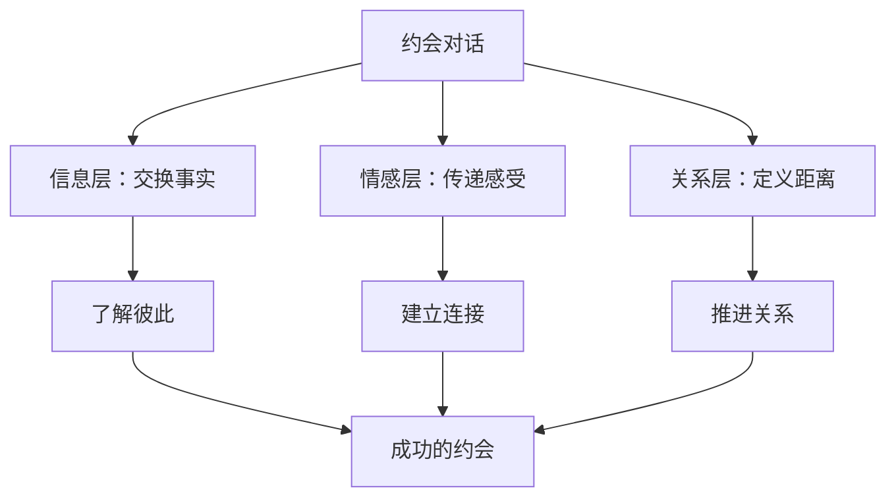
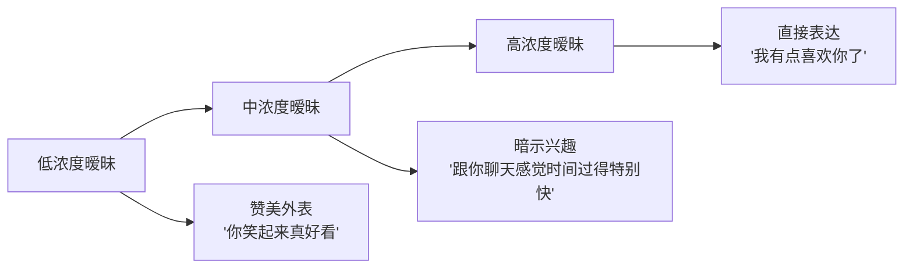
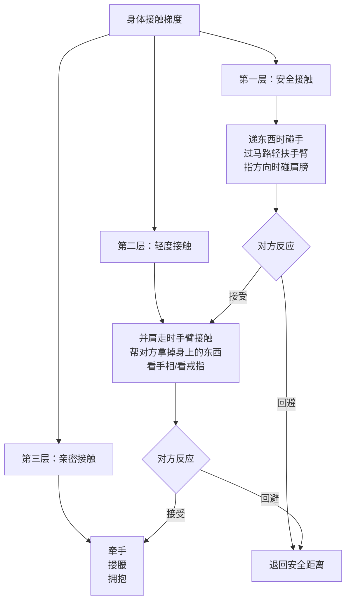
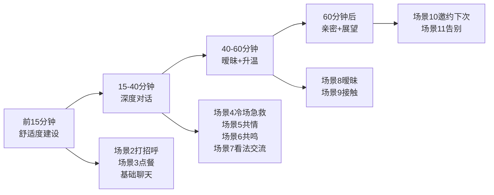

## 三、约会话术（15个场景）

聊天话术解决的是"线上怎么聊"，而约会话术解决的是"见面怎么聊"。线上聊天可以斟酌用词、查阅攻略，但面对面约会是实时的、不可撤回的——你没有30秒去编辑一条完美回复，对方能看到你的表情、听到你的语气、感受到你的紧张或从容。

这正是约会话术的价值所在：**它不是让你背台词，而是让你在关键节点有"锚点"可循**。当你知道某个场景该说什么、怎么说、为什么这么说，你就不会大脑一片空白，而是能从容地把注意力放在感受当下的互动上。

### 3.1 约会话术的底层原理

在进入15个具体场景之前，先理解约会话术背后的三个核心原理。这些原理是所有话术的"操作系统"——理解了它们，你不仅能用好这15个场景的话术，还能在遇到未覆盖的场景时自己生成合适的话术。

#### 3.1.1 约会对话的三层结构

一场成功的约会对话同时在三个层面运作：



**信息层**是对话的骨架——"你是做什么工作的""你喜欢什么电影""你老家在哪里"。大多数人的约会对话停留在这一层，变成了"查户口"式的问答。

**情感层**是对话的血肉——"我第一次尝试攀岩的时候吓得腿都软了，但站在顶端的时候觉得太值了""我奶奶做的红烧肉是我童年最温暖的记忆"。情感层让对方感受到你是一个活生生的人，而不是一份简历。

**关系层**是对话的灵魂——通过赞美、调侃、暧昧、自我暴露等信号，告诉对方"我对你有兴趣"。没有关系层的约会，两个人聊得再开心也只是"交了个朋友"。

**关键认知**：约会话术的核心不在于"说什么内容"，而在于"通过内容传递什么情感信号"。一句"你笑起来真好看"的信息量为零，但关系信号极强。

#### 3.1.2 舒适度-吸引力的动态平衡

约会中存在一个核心张力：**舒适度**和**吸引力**需要同时推进，但推进方式不同。

| 维度 | 作用 | 推进方式 | 过度表现 |
|------|------|----------|----------|
| 舒适度 | 让对方放松、信任你 | 倾听、共鸣、关心、节奏适中 | 变成"好人"，没有火花 |
| 吸引力 | 让对方对你产生兴趣 | 调侃、推拉、暧昧、自信展示 | 让对方不适、觉得轻浮 |

约会前半段（前30-40分钟）以建立舒适度为主，后半段逐步加入吸引力信号。这就像烧水——先把水加热到80度（舒适度），再加最后一把火让水沸腾（吸引力）。如果一开始就火力全猛，水还没热就蒸发了。

#### 3.1.3 非语言信号比语言更重要

加州大学洛杉矶分校的Albert Mehrabian教授的研究表明，在情感和态度的传递中，语言内容只占7%，语调占38%，肢体语言占55%。虽然这个"7-38-55法则"的具体数字在学术界有争议，但核心结论是公认的：**在面对面交流中，你怎么说比你说什么更重要**。

这意味着同一句约会话术，配合不同的语调、表情和肢体语言，效果可能天差地别。所以本章每个场景都会标注"配合方式"，而不只是给你一句话。

---

### 3.2 场景1：约会前确认

#### 3.2.1 心理分析

约会前确认看似是"确认时间地点"的行政事务，实际上它承担着三个重要功能：

1. **降低双方的不确定性焦虑**：人在面对未知时会产生焦虑，提前确认细节能有效降低这种焦虑
2. **建立"靠谱"的第一印象**：主动确认细节的人会被认为是负责任、有条理的人
3. **为约会创造"正式感"**：确认的过程本身就在告诉对方"我很重视这次约会"

很多人忽略这个环节，认为"之前不是说好了吗"，但实际上提前一天或半天的确认是约会礼仪的重要组成部分。

#### 3.2.2 话术模板

**版本A：轻松确认型（推荐首选）**

> "明天下午三点，[地点]门口见~ 你那边方便吗？如果时间或地点有变化随时告诉我。"

- **语调**：轻松自然，像跟朋友确认见面
- **语气词**：用"~"代替句号，传递轻松感
- **信号**：我有计划性，但不刻板

**版本B：体贴关怀型**

> "明天见面对吧？我看天气预报说可能有点热/下雨，你穿舒服点就行，不用特意打扮。我到了之后给你发消息。"

- **适用**：对方是第一次线下见面，可能紧张
- **信号**：我在乎你的感受，不想给你压力

**版本C：趣味互动型**

> "明天三点[地点]，不见不散哦~ 对了，你可以用一句话描述一下你明天会穿什么，这样我在人群中一眼就能找到你（其实是怕认错人尴尬😂）"

- **适用**：之前线上聊天气氛很好，想延续轻松感
- **信号**：我幽默、不端着

**版本D：明确细节型（适合位置不好找的场合）**

> "明天三点在[地点]的[具体位置，比如'南门星巴克旁边']见。我到了会穿[颜色]的衣服，你到了找不到我就直接打电话给我。"

- **适用**：约会地点复杂、人多
- **信号**：我很细心，考虑周到

#### 3.2.3 常见错误

| 错误 | 为什么有问题 | 正确做法 |
|------|-------------|----------|
| 不确认，直接赴约 | 对方可能忘了、临时有变，你到场才发现人没来 | 提前半天到一天确认 |
| 确认得太早（提前3天） | 显得过度焦虑，给对方压力 | 提前一天或半天 |
| 用命令语气："明天三点到" | 显得强势、不尊重对方 | 用商量语气："你那边方便吗？" |
| 确认时加太多新信息 | "对了明天还要不要带上XX叫上XX" | 确认时只确认已定事项，新想法提前说 |
| 确认后不等回复就消失 | 对方没看到消息，你到了白等 | 等对方回复确认，没回复就打电话 |

#### 3.2.4 对方临时改时间/地点怎么办

对方说"明天可能去不了了"或"能不能换个地方"，你的回应方式会直接影响对方对你的判断。

**正确回应**：

> "没问题，你方便的话我们改到[备选时间]？"（改时间）
> "行，你觉得哪里方便？或者我再看看别的地方。"（改地点）

**错误回应**：

> "啊？不是说好了吗？"（指责）
> "那算了吧。"（赌气）
> "随便你吧。"（冷淡）

**核心原则**：保持灵活。对方改时间不一定是因为不想见你，可能是真的有事。你的大度和配合度是加分项。

---

### 3.3 场景2：见面打招呼

#### 3.3.1 心理分析

见面的前30秒是整个约会的"定调时刻"。心理学中的**首因效应**（Primacy Effect）表明，人对一个事物的初始印象会强烈影响后续的所有判断。你见面时的表现，会像滤镜一样笼罩整场约会。

见面打招呼的难点在于：双方都带着一定程度的紧张和期待。你的一句话、一个表情、一个动作，要么缓解紧张、建立舒适，要么加剧尴尬、制造距离。

#### 3.3.2 话术模板

**版本A：赞美+关心（经典组合）**

> "嗨！比照片上还好看/精神。路上还顺利吗？"

- **为什么有效**：先用赞美打破距离感，再用关心表达体贴，两句话完成"我对你有好感+我在乎你"的双重信号
- **配合方式**：微笑，眼神接触，语调上扬

**版本B：幽默化解紧张型**

> "终于见到真人了！我刚才还在想，万一你比我高怎么办😂 玩笑玩笑，你好你好~"

- **适用**：双方线上聊得很熟，但第一次见面
- **效果**：用自嘲化解紧张，让对方笑出来就成功了

**版本C：真诚自然型**

> "嗨，你到了啊，我还怕我先到呢。今天穿得很好看。"

- **适用**：不喜欢太夸张的表达，偏内敛的人
- **特点**：不做作、不浮夸，真诚地表达认可

**版本D：场景关联型**

> "这地方你来过吗？我第一次来，刚才差点走错门哈哈。"

- **适用**：在不熟悉的场所约会
- **效果**：用自嘲破冰，同时引出一个可以聊的小话题

#### 3.3.3 肢体语言要点

| 动作 | 正确做法 | 错误做法 |
|------|----------|----------|
| 眼神 | 自然注视，偶尔移开（看3-4秒移开1秒） | 直勾勾盯着或完全不看 |
| 微笑 | 真诚的微笑（眼角有皱纹） | 僵硬的"礼貌笑" |
| 距离 | 保持1-1.5米社交距离 | 贴太近或站太远 |
| 握手/挥手 | 轻松挥手或自然握手（1-2秒） | 用力握或完全不回应 |
| 身体朝向 | 正面或侧面对对方 | 身体朝向出口 |
| 手的位置 | 自然垂放或插兜 | 双手交叉抱胸（防御姿态） |

#### 3.3.4 常见错误

1. **过度赞美**："天哪你也太漂亮了吧！你是我见过最好看的女生！"——太夸张显得不真诚，像是在表演
2. **低头看手机**：对方走过来你还在刷手机，信号是"你不如我的手机重要"
3. **紧张到沉默**：一句话不说只是傻笑，会让对方也紧张起来
4. **一见面就抱怨**："这地方好难找""今天好热啊"——第一句话是抱怨，基调就歪了
5. **过度热情**：一见面就"想死你了""终于见到你了"——关系没到那个程度会吓到对方

---

### 3.4 场景3：点餐时

#### 3.4.1 心理分析

点餐看似是一个纯功能性环节，实际上它是约会早期最重要的"微互动"之一。原因有三：

1. **点餐节奏暴露性格**：果断点餐的人通常自信果断，犹豫不决的人可能有选择困难症，反复问对方意见的人可能缺乏主见
2. **这是第一次"共同决策"**：你们需要在"吃什么"这个问题上达成共识，这是一次小型的合作演练
3. **关心的自然表达窗口**：问忌口、推荐菜品、关注对方偏好，这些都是展示体贴的自然机会

#### 3.4.2 话术模板

**版本A：关心+推荐组合（推荐）**

> "你有什么忌口吗？（等对方回答）这家的[某道菜]评价很高，要不要试试？你再看看还有什么想吃的。"

- **逻辑**：先问忌口（关心）→ 推荐菜品（主导力）→ 让对方选择（尊重）
- **配合方式**：把菜单递给对方或放到两人中间，不要自己霸占菜单

**版本B：幽默点餐型**

> "我选择困难症要犯了，你帮我选一个呗？你选什么我就吃什么，反正难吃了一起难吃😂"

- **适用**：想制造轻松氛围
- **注意**：如果对方也是选择困难症，就别用这招了

**版本C：大方主导型**

> "我对这家还挺熟的，要不我来点几个招牌，你看看有没有想加的？"

- **适用**：你确实熟悉这家餐厅，且提前做了功课
- **效果**：展示主导力和准备充分

**版本D：共同探索型（适合有特色菜单的餐厅）**

> "这个'火焰冰山'是什么东西？名字好有意思😂 要不要点一个看看？"

- **适用**：菜单上有有趣的菜名或特色菜
- **效果**：制造共同体验的话题

#### 3.4.3 点餐中的关键细节

**关于买单**：第一次约会建议男方主动买单（无论对方是否提出AA），这不是大男子主义，而是一种"我邀请你出来，我负责安排"的态度表达。但如果你是女方且希望展现独立性，可以主动提出"那下顿我请"。详见场景14。

**关于预算**：第一次约会的餐厅选择应该是"中等偏上"的水平——太便宜显得不重视，太贵会给双方压力。人均100-200元是比较安全的区间。

**关于酒精**：第一次约会可以点一杯啤酒或鸡尾酒作为社交润滑剂，但绝不要喝多。微醺可以放松气氛，喝醉会毁掉一切。

#### 3.4.4 常见错误

| 错误 | 为什么有问题 | 正确做法 |
|------|-------------|----------|
| 不问忌口就点菜 | 对方可能过敏或不吃某些东西 | 先问忌口和偏好 |
| 只点自己喜欢的 | 自私信号，不顾对方感受 | 点完自己想吃的问对方意见 |
| 对价格犹豫不决 | 显得小气或经济紧张 | 选好预算范围内的餐厅，到了果断点 |
| "随便""都行""你决定" | 丧失主导力，让对方承担决策压力 | 至少推荐1-2个选项 |
| 点太多或太少 | 太多浪费、太少尴尬 | 2人约4-5个菜（含凉菜）比较合适 |

---

### 3.5 场景4：聊天时冷场

#### 3.5.1 心理分析

冷场是约会中最让人焦虑的状况。两人大眼瞪小眼，空气突然安静，时钟滴答声仿佛被放大了10倍。但首先要建立一个认知：**冷场是正常的，不是你的错**。

两个不熟悉的人面对面交流，出现思考停顿、话题断档是再自然不过的事情。真正让冷场变致命的不是沉默本身，而是你对沉默的反应——如果你表现出焦虑、尴尬、手足无措，对方也会被感染。如果你坦然地喝口水、微微笑一下、不急着填满每一秒的空白，对方反而会觉得你很从容。

但持续的沉默确实不利于约会体验，所以你需要一个"话题急救包"。

#### 3.5.2 话术模板

**版本A：利用已知信息（最自然）**

> "对了，你之前说你很喜欢[某个话题]，我后来还专门去了解了一下，能多说说吗？"

- **前提**：线上聊天时对方提到过的兴趣
- **效果**：展示你有认真听对方说话，这是极强的好感信号

**版本B：观察环境法**

> "你看那边那个[有趣的事物]，我觉得好好笑/好奇，你觉得呢？"

- **举例**："你看那桌的小朋友在画画，画的什么我看不清哈哈"
- **效果**：把注意力转移到外部环境，自然打开新话题

**版本C：假设性提问法（话题生成器）**

> "我突然想到一个问题——如果给你一个月的假期，不用考虑钱，你最想做什么？"

- **变体**：
  - "你小时候最想长大以后做什么？跟现在一样吗？"
  - "如果可以跟任何人吃一顿饭，你选谁？"
  - "你手机里最舍不得删的一张照片是什么？"
- **效果**：假设性问题能引出对方的价值观、梦想和故事，比"你喜欢什么"有趣得多

**版本D：自我暴露法**

> "说个有点不好意思的事，我之前约会特别紧张的时候会[某个可爱的小习惯]，今天已经忍了好几次了😂"

- **效果**：自我暴露+自嘲，既打破尴尬又展示了真实感
- **注意**：暴露的内容要可爱/有趣，不要暴露真正的缺点

**版本E：反转沉默法（进阶）**

> "（安静几秒后微笑看着对方）你发现没有，咱俩安静的时候也不觉得尴尬，挺好的。"

- **效果**：把"冷场"重新定义为"舒适"，是极高级的话术
- **前提**：你确实能用从容的态度面对沉默

#### 3.5.3 话题储备清单

约会前准备5-8个备用话题，按以下分类储备：

| 类别 | 示例话题 | 作用 |
|------|----------|------|
| **旅行** | "你去过最喜欢的地方""如果只能再去一个地方" | 容易引发故事和情感 |
| **美食** | "你吃过最奇怪的东西""你的comfort food是什么" | 轻松有趣，人人有话说 |
| **童年** | "你小时候最调皮的事""你小时候的梦想" | 拉近距离，产生亲密感 |
| **如果** | "如果中了彩票""如果可以穿越到任何时代" | 展示价值观和想象力 |
| **兴趣** | "最近在追什么剧""最近学什么新东西" | 了解当下的生活状态 |
| **观点** | "你觉得[某个热点话题]怎么样" | 了解三观是否契合 |

#### 3.5.4 常见错误

1. **疯狂抛问题**：一个接一个问，像面试官。应该问一个话题，深入聊下去
2. **只聊自己**：对方刚说完你就把话题拉回自己身上。应该在对方的话题上停留
3. **聊太沉重的话题**：前几次约会不要聊前任、家庭矛盾、工作压力
4. **看手机找话题**："我看看手机上有什么新闻"——这等于告诉对方"我跟你没话聊"
5. **否认冷场**："怎么突然安静了哈哈"——说出来反而更尴尬

---

### 3.6 场景5：对方说到不开心的事

#### 3.6.1 心理分析

约会中对方可能会提到不开心的事情——工作被批评、跟朋友闹矛盾、家人身体不好、最近压力很大。这是一个关键时刻，因为你的回应方式会直接影响对方对你的情感评价。

心理学研究表明，当一个人分享负面情绪时，ta最需要的不是解决方案，而是**被看见、被理解、被接纳**。这就是为什么"你应该这样做""别想太多""没什么大不了的"这类回应虽然出发点是好的，但效果往往很差——它们跳过了情感共鸣，直接进入问题解决，让对方觉得"你不懂我"。

#### 3.6.2 话术模板

**版本A：共情确认型（最安全）**

> "听起来确实挺难的。你现在感觉好点了吗？"

- **结构**：先确认对方的感受（"确实挺难的"）→ 再关心现状（"好点了吗"）
- **配合方式**：语调放缓，表情认真，适当点头

**版本B：深度共情型**

> "我能理解那种感觉，[具体描述你理解的那个感受]，换了谁都会不舒服。"

- **举例**："我能理解那种感觉，明明很努力了但还是被否定，换了谁都会不舒服。"
- **关键**：描述对方的感受，而不是评价事情本身

**版本C：陪伴型（不急于解决问题）**

> "你愿意多说说吗？我听着。"

- **效果**：表达"我愿意听，不急着走开"
- **适用**：对方看起来想倾诉，但又不知道该不该说

**版本D：适度自我暴露型**

> "我之前也遇到过类似的情况，当时真的很难受。你是怎么处理的？"

- **注意**：简短提一下自己的经历即可，重点要转回对方身上
- **错误示范**："我之前也这样！然后我blabla说了一大堆自己的事"——变成比惨大会

#### 3.6.3 回应的三个层次

```mermaid
graph TD
    A[对方分享负面情绪] --> B{你的回应层次}
    B --> C[第一层：否定<br>"没事的""别想了"]
    B --> D[第二层：理解<br>"确实挺难的"]
    B --> E[第三层：共情+支持<br>"我能理解你的感受<br>你需要我做什么吗？"]
    C --> F[❌ 对方觉得不被理解]
    D --> G[✓ 基本合格]
    E --> H[✓✓ 对方感到被支持]
```

#### 3.6.4 常见错误

| 错误回应 | 对方的真实感受 | 正确做法 |
|----------|--------------|----------|
| "别想了，开心点" | "我的情绪被否定了" | 先确认感受，再看是否转移话题 |
| "你应该这样做……" | "我又没问你意见" | 先共情，对方主动问建议时再给 |
| "这有什么，我之前更惨" | "你在跟我比惨？" | 简短提及自己的经历，重点回到对方 |
| "那你打算怎么办" | "我也不知道怎么办，你问得我更焦虑了" | 先给情感支持，再讨论解决方案 |
| 沉默不回应 | "你根本不在乎" | 至少给一个回应，哪怕只是"嗯，我在听" |
| 急着转移话题 | "你不想听我说" | 让对方把想说的说完 |

#### 3.6.5 如何判断该共情还是该给建议

一个简单的判断标准：**对方是需要情绪支持，还是在寻求解决方案？**

- 如果对方说"好烦啊""好累啊""好难受"→ 需要共情
- 如果对方说"我该怎么办""你觉得呢""我该怎么处理"→ 可以给建议
- 如果不确定 → 先共情，然后问"你是想聊聊发泄一下，还是想听听我的看法？"

---

### 3.7 场景6：想表达共鸣

#### 3.7.1 心理分析

共鸣是人与人之间最强大的连接方式之一。当你说"我也有同感"的时候，你在告诉对方："我们是同类人。" 这种"同类感"会极大地缩短心理距离。

但表达共鸣有一个关键难点：**你必须是真诚的**。如果你说"我完全理解"但眼神游离、语气敷衍，对方能立刻感受到。反过来，即使你说的话很朴素，但你的眼神真诚、语气投入，效果反而更好。

#### 3.7.2 话术模板

**版本A：经历共鸣型**

> "我完全理解你说的那种感觉，我之前也遇到过类似的情况，当时我[简短描述]，所以特别能体会。"

- **要点**：用自己的类似经历做佐证，增加可信度
- **长度**：自己的经历控制在2-3句话，然后把话题交还给对方

**版本B：价值观共鸣型**

> "你说得太对了，我也觉得[具体复述对方的观点]，现在很多人不这样想。"

- **效果**：不只是共鸣情绪，还共鸣了价值观，这是更深层次的连接
- **举例**：对方说"我觉得工作不是生活的全部"，你回应"我特别认同，我见过太多人为了工作牺牲了健康和关系，到头来其实不值得"

**版本C：情感共鸣型**

> "你说的时候我能感受到那种[情绪词]，光听你说我都觉得[呼应的情绪]。"

- **举例**："你说的时候我能感受到那种委屈，光听你说我都觉得不公平。"
- **效果**：表达你在情感上跟对方同步了

**版本D：差异中的共鸣（进阶）**

> "我虽然没经历过你说的这个，但我能理解那种[核心感受]，我在[不同场景]中体会过类似的感觉。"

- **适用**：你没有直接的类似经历
- **效果**：诚实承认差异，但找到情感层面的共鸣点

#### 3.7.3 表达共鸣的配合信号

- **身体语言**：微微前倾（表示投入）、点头（表示认同）、与对方同步的面部表情
- **语调**：与对方的情绪匹配——对方低落时语调温和，对方兴奋时语调也跟着上扬
- **关键词复述**：重复对方使用的情绪词——对方说"真的太累了"，你回应"那种累不只是身体上的，对吧？"

---

### 3.8 场景7：对方问你的看法

#### 3.8.1 心理分析

"你怎么看？""你觉得呢？"——当对方问你看法时，这是一个需要兼顾两个目标的时刻：**表达自己的真实观点**和**尊重对方的独立判断**。

很多人在这时候犯两个极端错误：一是为了讨好对方而放弃自己的观点（"你说得对""我跟你想的一样"），二是过于强势地输出自己的观点（"我觉得就是XX，不接受反驳"）。前者让人觉得你没主见，后者让人觉得你控制欲强。

最佳策略是：**先表达观点，再邀请对方交流**。

#### 3.8.2 话术模板

**版本A：观点+邀请型（万能模板）**

> "我觉得[你的看法]。不过我也挺好奇你的想法，你是怎么看的？"

- **结构**：先亮明立场 → 再表示好奇 → 邀请对方表达
- **效果**：有主见但不固执，自信但不强势

**版本B：视角多元型（适合有争议的话题）**

> "这个话题挺有意思的，我的看法是[你的看法]，但我能理解另一种看法是[对方可能的立场]。你更倾向于哪边？"

- **效果**：展示你有思考深度，能看到问题的多面性

**版本C：故事佐证型（让观点更生动）**

> "我之前看到一个故事/数据，[简短的例子]，所以我倾向于[你的看法]。你怎么看？"

- **效果**：用故事或数据支撑观点，比空口说更有说服力

#### 3.8.3 处理观点分歧

约会中难免遇到观点不一致的情况。关键原则：**求同存异，不争论对错**。

> "嗯，我理解你的角度。我们看法不太一样，不过我觉得这种差异挺有意思的，说明我们都有在独立思考。"

**绝对不要做的事**：
- 试图说服对方改变观点
- 用"但是"否定对方（"你说的有道理，但是……"）
- 贬低对方的观点（"你怎么会这么想"）
- 冷场（因为尴尬而沉默）

**核心认知**：约会不是辩论赛。展示你的观点深度和思考能力是加分项，但为了赢一场辩论而输掉约会是绝对的亏本买卖。

---

### 3.9 场景8：想制造暧昧

#### 3.9.1 心理分析

暧昧是约会中最微妙也最关键的部分。没有暧昧的约会就像没有火花的火柴——两个人聊得很愉快，但最终只是"交了个朋友"。

暧昧的本质是**在安全范围内释放"我喜欢你"的信号**。这个信号太弱，对方感受不到；太强，对方会觉得不舒服。最理想的暧昧是让对方心率微微加速、嘴角微微上扬，产生"这个人好像对我有意思"的甜蜜猜测。

暧昧信号的投放应该遵循"梯度原则"——从低浓度到高浓度逐步升级，给对方接受或拒绝的空间。



#### 3.9.2 话术模板

**低浓度暧昧（适合约会前半段）**

> **8a**："你笑起来真好看，让我有点紧张。"
>
> **8b**："你今天穿的这个颜色很适合你。"（具体到细节的赞美比笼统的"你好好看"更有力）
>
> **8c**："跟你说话感觉特别舒服，不像跟有些人聊天那么累。"

- **信号强度**：★★☆☆☆
- **对方可接受性**：几乎所有人不会拒绝具体而真诚的赞美

**中浓度暧昧（适合约会中段，已经聊得不错）**

> **8d**："你有没有发现，我们笑点好像很一致？我在想要是以后经常一起看电影，应该不会无聊。"（"以后""经常"暗示持续关系）
>
> **8e**："你这样看着我的时候，我突然不知道该说什么了。"（表达对方对你的影响）
>
> **8f**："我之前不觉得一个人的眼睛可以这么好看，今天改变了想法。"

- **信号强度**：★★★☆☆
- **风险点**：如果对方之前没有给过任何正面信号，中浓度暧昧可能有风险

**高浓度暧昧（适合约会后半段，对方明确给出了积极信号）**

> **8g**："今天出来见你，是我这周最正确的决定。"
>
> **8h**："你再这样看着我笑，我怕我会说出一些不太理性的话。"
>
> **8i**："你信不信我现在已经开始想下次什么时候能再见到你了。"

- **信号强度**：★★★★☆
- **前提**：对方已经给出明确的积极信号（如主动延长约会、身体靠近、眼神接触增多等）

#### 3.9.3 如何判断暧昧浓度是否合适

观察对方的反应信号：

| 信号 | 含义 | 你的行动 |
|------|------|----------|
| 对方微笑、回应你的话、眼神接触增加 | 信号被接收，可以继续 | 维持当前浓度或小幅升级 |
| 对方笑但不回应、岔开话题 | 信号被收到但暂时不想升级 | 退回上一档浓度 |
| 对方表情僵硬、身体后退、沉默 | 信号过强，对方不适 | 立即停止暧昧，回到舒适对话 |

#### 3.9.4 常见错误

1. **上来就高浓度暧昧**：第一次见面就说"我喜欢你""你是我喜欢的类型"——太重了，对方会有压力
2. **用油腻的套路**："你知道你和星星有什么区别吗？星星在天上，你在我心里"——这种土味情话在约会中99%是减分项
3. **暧昧后不给空间**：一句暧昧话说完，紧接着又一句，不给对方反应和消化的时间
4. **不观察对方反应**：自顾自地暧昧，不看对方是享受还是尴尬
5. **暧昧和正式表白混为一谈**：暧昧是试探，不是表白。不要说完"你笑起来真好看"就接"做我女朋友吧"

---

### 3.10 场景9：想进行自然的身体接触

#### 3.10.1 心理分析

身体接触是关系升级的重要信号。心理学研究表明，适当的身体接触能显著增加两人之间的亲密感和好感度。但这也是最容易出错的环节——不当的身体接触会让对方感到被冒犯。

关键原则：**身体接触必须是渐进的、自然的、可拒绝的**。



#### 3.10.2 话术+动作模板

**版本A：递东西制造接触（最自然）**

> "给你。"（递手机/菜单/东西时，自然地碰一下对方的手）

- **自然度**：★★★★★
- **关键**：动作要自然，不要刻意停留，碰完就放手
- **观察**：对方是否也自然地回应，还是会迅速缩手

**版本B：关心制造接触**

> "你肩膀上有东西，别动。"（帮对方拿掉头发/灰尘/线头）

- **前提**：要真的有东西，或者非常自然地假装
- **变体**："你脸上沾了点东西"（用纸巾帮对方擦）

**版本C：引导性接触**

> "这边走。"（走路时自然地轻扶对方的后背或手臂指方向）

- **适用**：在餐厅找座位、过马路、走在拥挤的地方
- **力度**：非常轻，只是引导方向，不是推

**版本D：游戏型接触**

> "你手好凉/热啊。"（握手或碰到手时的自然评论）
>
> "来，我帮你看看手相，我瞎编的啊哈哈。"（轻轻握住对方的手）

- **适用**：气氛轻松，对方之前已经接受过低级别的身体接触
- **注意**：握的时间不要太长，看完就自然放开

#### 3.10.3 身体接触的红线

1. **第一次见面的前30分钟**不建议有任何非必要的身体接触
2. **腰部以下**的接触在确定关系前绝对不碰
3. **任何接触后如果对方有退缩反应，立即停止，不要重复尝试**
4. 不要在对方没注意的时候突然接触（比如从背后拍肩膀）
5. 不要利用"帮助"的名义强行接触（"我帮你暖暖手"然后不放）

#### 3.10.4 常见错误

- **操之过急**：第一次约会就想牵手甚至搂腰，跳过了渐进的梯度
- **接触后不观察**：碰完手之后不看对方的反应，不知道对方是接受还是反感
- **假装无意但很明显**：反复"不小心"碰到对方，对方会觉得你很刻意
- **用身体接触代替语言**：不会用话术建立情感连接，只想通过"肢体升级"推进关系

---

### 3.11 场景10：想邀约下次

#### 3.11.1 心理分析

邀约下一次约会是整个约会的"收尾关键"——如果这次约会很愉快但没有提出下一次，双方都可能在回去之后热度消退。在约会愉快的高峰时刻提出下一次邀约，成功率是最高的。

心理学中的**峰终定律**（Peak-End Rule）指出，人对一段经历的评价主要取决于高峰时刻和结束时刻的体验。在愉快的高峰时刻提出"下次我们去XX吧"，对方会把对你的正面感受和"下次约会"绑定在一起。

#### 3.11.2 话术模板

**版本A：具体邀约型（推荐）**

> "今天跟你聊天特别开心。对了，我知道一个[具体地方/活动]，下次我们一起去吧？"

- **关键**：邀约要具体——具体的地点、具体的活动、具体的时间段
- **错误示范**："下次再约"——太模糊，双方回去之后大概率不会落实

**版本B：自然衔接型**

> （聊到某个话题时）"你不是说喜欢[某个事物]吗？我知道[一个相关的地点/活动]，找个时间一起去？"

- **效果**：把邀约嵌入自然的对话中，不像"正式邀请"那么有压力
- **举例**：对方说喜欢猫→"我知道一家猫咖超棒，下次我们一起去？"

**版本C：共同计划型**

> "我发现咱俩都对[某个话题]挺感兴趣的，下次我们可以一起[具体活动]，你觉得怎么样？"

- **效果**：强调"共同兴趣"，让邀约显得合理而非突兀

**版本D：轻松暗示型（适合不确定对方态度时）**

> "今天时间过得太快了，感觉还没聊够。下次要是还有机会的话，咱们继续？"

- **效果**：试探性的邀约，给对方选择空间
- **风险**："要是还有机会"这种说法可能让对方觉得你不确定ta会答应

#### 3.11.3 如果对方没有明确答应

对方说"再说吧""看看吧""最近比较忙"，不要追问"那你什么时候有空"。正确的回应：

> "好，那你忙完了随时告诉我。"

然后在约会结束后的聊天中（场景12），找合适的时机再提一次。如果第二次仍然模糊拒绝，基本可以判断对方兴趣不大。

---

### 3.12 场景11：分别时

#### 3.12.1 心理分析

分别时刻同样是"峰终定律"在起作用。一场100分的约会如果分别时搞砸了，对方记住的可能就是那个尴尬的结尾。相反，一个温暖的分别能让整场约会的评分再上一个台阶。

分别时的核心任务是：**给这次约会画一个温暖的句号，同时为下一次见面留下期待**。

#### 3.12.2 话术模板

**版本A：感谢+关心型（经典）**

> "今天真的很开心，谢谢你陪我度过一个愉快的[下午/晚上]。回去路上注意安全，到家告诉我一声。"

- **信号**：我很享受今天的约会 + 我关心你的安全 + 我想继续保持联系
- **配合方式**：微笑，眼神真诚，如果有默契可以轻拥告别

**版本B：具体回忆型（更走心）**

> "今天特别开心，尤其是[某个具体时刻]的时候，我觉得特别有意思。期待下次见面。"

- **效果**：提到具体细节让对方知道你真的在认真体验这场约会，而不是敷衍

**版本C：轻松告别型**

> "好了，放你回去吧~ 今天笑得我脸都僵了。下次继续！"

- **适用**：约会氛围一直很轻松幽默
- **效果**：保持轻松基调，不让分别变得太正式

**版本D：含蓄期待型**

> "今天时间过得太快了，还没聊够就得走了。下次我们找个能多待一会儿的地方。"

- **效果**：表达"意犹未尽"，同时暗示想有更长的下次约会

#### 3.12.3 分别时的肢体语言

- 如果气氛很好：可以轻拥告别（持续1-2秒，轻拍后背）
- 如果还不太确定关系：微笑挥手，保持适当距离
- 如果对方主动靠近：回应对方的亲密程度，不要退缩也不要过于激进
- **绝对不要**：分别时突然变得紧张、不知道手放哪里、或者过于正式地鞠躬

---

### 3.13 场景12：约会后跟进

#### 3.13.1 心理分析

约会结束后2-4小时是"黄金跟进期"。这时候双方都还在回味约会的体验，跟进消息能强化正面感受。如果等到第二天才联系，热度可能已经消退一半。

跟进消息的目标有三个：
1. **确认安全**：关心对方是否安全到家
2. **表达感受**：让对方知道你享受了这场约会
3. **铺垫下一次**：为后续的聊天和邀约做准备

#### 3.13.2 话术模板

**版本A：到家确认型（最稳妥）**

> "你到家了吗？今天真的很开心，跟你聊天特别舒服。晚安，好梦~"

- **发送时间**：约会结束后1-2小时
- **效果**：关心+感受+晚安，完整的信息组合

**版本B：细节回忆型（更走心）**

> "刚到家~ 今天聊到[某个话题]的时候我还意犹未尽，回家路上一直在想你说的[某个观点]，确实很有道理。"

- **效果**：展示你在约会后还在回味，这是极强的好感信号

**版本C：幽默收尾型**

> "安全到家~ 今天笑太多了，我的腹肌都是你锻炼出来的😂 期待下次见面。"

- **适用**：约会全程氛围都很轻松

**版本D：照片/截图分享型**

> "到家了！对了，今天我们在[某个地方]看到的[某个东西]，我拍了一张，给你看看~"

- **效果**：用照片唤起约会的回忆，同时制造一个自然的聊天话题
- **注意**：照片要跟约会相关，不要发自拍

#### 3.13.3 跟进的节奏把控

| 时间 | 行动 | 目的 |
|------|------|------|
| 约会结束后1-2小时 | 发到家确认消息 | 关心+保持联系 |
| 第二天上午/中午 | 自然聊几句（不要长篇大论） | 维持热度 |
| 第二天到第三天 | 回忆约会中的某个话题继续聊 | 深化连接 |
| 3-5天内 | 提出下一次具体的邀约计划 | 落实下一次约会 |

#### 3.13.4 常见错误

1. **约会刚结束就发长消息**："今天真的太开心了blabla写了一大段"——太重了，适度就好
2. **等太久才联系**：超过24小时不联系，对方可能觉得你没兴趣
3. **跟进消息太机械**："到家了"三个字就完了——没有温度
4. **立刻开始聊骚**："今天好想牵你的手"——太急了，对方可能还没想好
5. **发完消息不等回复就追问**："你看到了吗？""怎么不回我？"——给对方空间

---

### 3.14 场景13：对方迟到

#### 3.14.1 心理分析

对方迟到是一个"压力测试"——不是测试对方（虽然迟到确实不太好），而是测试你面对突发情况的反应。你的反应会暴露你的情商、包容度和真实性格。

绝大多数人迟到时内心是愧疚的。如果你的反应让对方的愧疚感加倍，整个约会的基调就歪了。如果你的反应化解了对方的愧疚，让对方轻松地融入约会，对方会感激你的大度，约会的基调反而会更好。

#### 3.14.2 话术模板

**版本A：化解尴尬型（推荐）**

> "没关系，我刚好可以研究一下菜单/看看周围。你路上注意安全，不着急。"

- **效果**：把等待时间重新定义为"有用的时间"，减轻对方的愧疚
- **配合方式**：语调轻松，面带微笑，不要叹气或皱眉

**版本B：幽默型**

> "你终于来了！我刚才差点跟隔壁桌的小狗交上朋友了😂"

- **适用**：迟到时间不长（10-15分钟），对方看起来很愧疚
- **效果**：用幽默化解尴尬

**版本C：关心型**

> "没事~ 是路上堵车了吗？你先喝口水休息一下。"

- **效果**：不追究迟到原因，而是关心对方的状态
- **注意**：不要追问"你怎么迟到了"——即使你等了很久

**版本D：大度升级型（对方迟到很久，30分钟以上）**

> "没事，你能来我就很开心了。你先看看想吃什么，我都看了一圈了，给你推荐几个。"

- **效果**：大方到让对方更加愧疚，同时快速进入正常约会节奏

#### 3.14.3 常见错误

| 错误反应 | 后果 | 正确做法 |
|----------|------|----------|
| "你怎么才来" | 对方感到被指责，整场约会带着负罪感 | 轻描淡写，快速翻篇 |
| "我等了你40分钟" | 用时间长短强化对方的愧疚 | 不提具体等待时间 |
| 沉默不说话 | 对方不知道你是在生气还是无所谓 | 给一个明确的轻松回应 |
| 立刻看手机不理人 | 赌气信号，让对方更尴尬 | 正面迎接对方 |
| 反复提迟到的事 | 整场约会都在翻旧账 | 说一次就翻篇 |

---

### 3.15 场景14：想处理付款问题

#### 3.15.1 心理分析

"谁来买单"是约会中最有压力的环节之一。它涉及到文化期待、个人价值观、经济能力和关系定位等多重因素。处理得当，这是一个展示你大方和得体的机会；处理不当，可能让一场愉快的约会以尴尬收尾。

不同情况的处理方式：

| 场景 | 建议做法 | 原因 |
|------|----------|------|
| 第一次约会（男方邀请） | 男方主动全付 | 展示诚意和大方 |
| 第一次约会（女方邀请） | 女方主动全付或提出AA | 尊重邀请方 |
| 第二次约会 | 可以对方请或轮流 | 建立互惠模式 |
| 对方坚持要AA | 接受，不要反复推让 | 尊重对方的独立性 |
| 对方坚持要请客 | 感恩接受，下次回请 | 大方地接受也是社交能力 |

#### 3.15.2 话术模板

**版本A：男方主动买单型**

> （直接叫服务员买单，不声张。如果对方要给钱）"没事，这次我来，下次你请？"

- **关键**：买单的动作要自然、不犹豫、不看价格表。犹豫会暴露你对价格的在意
- **"下次你请"的作用**：既展示了大方，又暗示了下一次约会

**版本B：提出AA型**

> "我们AA吧，这样比较轻松，也省得纠结。"

- **适用**：双方都是独立性强的人，或者学生阶段经济有限
- **语气**：自然轻松，不要像是"我不想为你花钱"

**版本C：对方要抢着买单时**

> "今天说好我请的，你抢什么呀~ 下次换你。"

- **或者**："行，那今天你请，下次归我。不许再抢了啊。"

**版本D：对方坚持AA时**

> "好，那就AA。你转账还是扫码？"

- **关键**：大方接受，不要反复推让。推让3次以上会让双方都尴尬

#### 3.15.3 付款相关的注意事项

1. **提前做好预算**：选餐厅时就应该考虑到价格，不要到了买单才发现超预算
2. **不要当着对方面纠结价格**：看完账单面露难色是大忌
3. **不要用"我请你"来施压**：买单不等于"你欠我的"，更不能以此为由要求对方做什么
4. **如果经济确实紧张**：提前选择预算合适的餐厅，而不是到了买单时才尴尬。诚实比打肿脸充胖子好得多
5. **小礼物比请客更有心意**：如果实在不知道怎么处理付款问题，带一个小礼物（不贵但用心）比抢着买单更有温度

---

### 3.16 场景15：对方问你对ta的印象

#### 3.16.1 心理分析

"你觉得我怎么样？""我跟你想象中的一样吗？"——这个问题看似随意，实际上对方在寻求两样东西：**确认感**和**安全感**。

确认感是："你喜欢我吗？"安全感是："你看到的是真实的我吗？"你的回答需要同时满足这两个需求——既要表达好感，又要让对方觉得你喜欢的是真实的ta，而不是你想象中的ta。

#### 3.16.2 话术模板

**版本A：对比惊喜型（推荐）**

> "比想象中更好。跟你聊天特别舒服，感觉时间过得特别快，一看手机才发现已经[过了很久]了。"

- **结构**：比预期好（确认感）→ 具体哪里好（真实性）→ 时间飞逝的佐证（证据）
- **效果**：让对方知道你喜欢的是真实的ta，而且有具体的感受作为佐证

**版本B：细节赞美型**

> "你比我以为的更[某个具体特质]。比如刚才你说[某个具体内容]的时候，我就觉得你是一个很有[特质]的人。"

- **举例**："你比我以为的更有想法。比如刚才你说'与其焦虑不如先做起来'的时候，我就觉得你是一个很通透的人。"
- **效果**：具体到某个细节的赞美，比笼统的"你很好"有100倍的说服力

**版本C：感受描述型**

> "怎么说呢，就是跟你在一起的时候会觉得很放松，不用刻意去想该说什么。这对我来说挺难得的。"

- **效果**：表达"你让我感到舒适"，这是对一个人最高级别的赞美之一
- **真实感**：强调"对我来说挺难得的"暗示你不是跟谁都能这样

**版本D：真诚幽默型**

> "说实话？我之前还挺紧张的，但见面之后反而放松了。你比我以为的还好相处，而且[某个可爱的细节]，加分加分。"

- **效果**：承认紧张（真实感）→ 评价对方好相处（正面反馈）→ 细节加分（精确赞美）

#### 3.16.3 回答这个问题的核心原则

1. **必须正面回应**——不要说"还行吧""还可以"这种敷衍的回答
2. **必须有具体细节**——"你很好"不如"你笑起来眼睛弯弯的很好看"
3. **必须是真实的感受**——不要为了讨好而编造，虚假的赞美对方能感觉到
4. **不要过于热情**——"你是我见过最好的人"会显得不真诚
5. **不要提及负面评价**——即使对方有让你不太满意的地方，这个时刻也不是提出来的时候

---

### 3.17 约会话术的全局策略

#### 3.17.1 约会时间线与话术分布

一场成功的约会，话术的使用有节奏感。不是全程都在"表演"，而是有张有弛：



#### 3.17.2 话术使用的"度"

| 阶段 | 目标 | 话术类型 | 占比 |
|------|------|----------|------|
| 开场（0-15分钟） | 建立舒适感 | 寒暄、赞美、轻松话题 | 20% |
| 发展（15-40分钟） | 深入了解 | 故事、价值观、情感共鸣 | 40% |
| 升温（40-60分钟） | 制造暧昧 | 调侃、暧昧、身体接触 | 25% |
| 收尾（60分钟+） | 留下期待 | 邀约、告别、后续计划 | 15% |

#### 3.17.3 应急预案

约会中可能会遇到各种意外情况，提前准备好应对方案：

| 意外情况 | 应对话术 |
|----------|----------|
| 菜很难吃 | "这道菜有点意外哈哈，不过没关系，重点是跟你聊天。" |
| 遇到你的熟人 | "这是我朋友XX。XX，这是我朋友[对方名字]。"（介绍时用"朋友"） |
| 遇到对方的熟人 | 微笑打招呼，等对方介绍你。如果对方说"这是我朋友"，不要纠正 |
| 天气突变 | "看来老天爷想让我们找个室内的地方继续聊？走吧~" |
| 你的手机响了 | "不好意思我看一下——是[家人/工作]，我处理一下。"（简短处理，不要长聊） |
| 忘带钱包/手机没电 | "我手机没电了，你能先付一下吗？我转给你。"（事后立刻转账，不要赖账） |
| 对方一直看手机 | "是有什么急事吗？要不你先处理一下，不着急。"（给对方台阶下） |

---

### 3.18 从约会到关系：话术的演进

#### 3.18.1 约会次数与话术深度的关系

| 约会次数 | 话术重心 | 可以聊的话题 | 身体接触层级 |
|----------|----------|-------------|-------------|
| 第1次 | 舒适度+初步了解 | 兴趣爱好、工作日常、生活态度 | 安全接触（递东西碰手） |
| 第2次 | 深入了解+适度暧昧 | 童年故事、朋友关系、未来规划 | 轻度接触（手臂、肩膀） |
| 第3次 | 情感连接+暧昧升级 | 家庭背景、价值观、情感经历 | 中度接触（牵手） |
| 第4-5次 | 亲密感建立 | 深层恐惧、内心脆弱面、对关系的期待 | 亲密接触（拥抱、接吻） |

#### 3.18.2 最重要的底层心法

所有约会话术的最终目的不是"说出正确的话"，而是**让对方在你面前感到舒适、被尊重、被欣赏**。

如果你只记住一个原则，那就是：**真诚是最好的话术**。所有技巧和模板都只是辅助工具，真正打动人的永远是你发自内心的关注和欣赏。

正如著名关系治疗师Sue Johnson所说：

> "在亲密关系中，最重要的不是你说了什么，而是你让对方感受到了什么。"

一个真诚的微笑、一个认真的倾听、一个恰到好处的关心，胜过一千句精心设计的台词。

***
