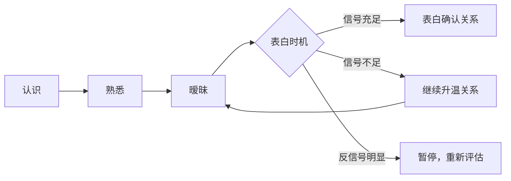
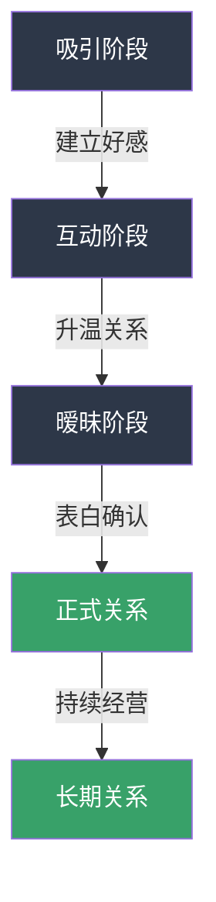

## 四、表白话术（10个模板）

表白是恋爱关系中最关键的转折点之一——它决定了两个人是从"暧昧期"进入"正式关系"，还是从"朋友"退回"陌生人"。很多人把表白当成"赌博"：要么成功，要么失败。但事实上，表白是一门可以学习的技术活。时机、方式、措辞、场景，每一个细节都会影响结果。

本章提供10个经过验证的表白模板，覆盖从直接到含蓄、从幽默到深情的全部风格。每个模板不仅给出话术本身，还分析其心理学原理、适用场景、注意事项和变体，帮助你根据自己的情况选择最合适的方式。

### 表白前的核心判断：该不该表白？

在学习具体话术之前，你必须先回答一个更根本的问题：**现在是不是表白的时机？** 很多人表白失败，不是因为话说得不好，而是因为时机不对。

#### 表白时机的"三看"判断法

| 判断维度 | 信号 | 反信号 |
|---------|------|--------|
| **看互动频率** | 每天主动聊天，回复快且内容丰富 | 经常不回消息，回复敷衍（"嗯""哦""好的"） |
| **看肢体语言** | 见面时身体朝向你，有不经意的肢体接触 | 保持距离，避免眼神接触，身体后倾 |
| **看特殊行为** | 记得你说过的小事，主动关心你的状态 | 对你的事情不感兴趣，聊天只聊表面话题 |

**关键原则：表白是"确认关系"，不是"争取机会"。** 如果你还在纠结"她/他到底喜不喜欢我"，说明时机还不成熟。表白的最佳状态是：双方都已经心知肚明，只差一个正式的确认。

#### 表白的"三不"原则

1. **不在对方情绪低落时表白**：对方刚失恋、工作压力大、家庭有变故时，你的表白会被当成"趁虚而入"或"增加负担"。
2. **不在公共场合强行表白**：用围观群众的压力逼迫对方答应，即使成功了也会埋下隐患。公开表白只适用于你们已经非常确定对方会答应的情况。
3. **不在认识初期就表白**：认识不到两周就表白，成功率极低。对方对你还不够了解，无法做出判断。

---

### 模板1：直接表白

#### 话术

> "和你在一起的时间都很开心，我发现自己越来越喜欢你。我想正式和你在一起，你愿意做我的女朋友吗？"

#### 心理学原理

直接表白利用的是"确定性偏好"——人类在做决策时，倾向于选择信息明确的选项。当你清晰地表达"我喜欢你""我想和你在一起"时，对方不需要猜测你的意图，减少了不确定性带来的焦虑。

#### 适用场景

- 关系已经比较暧昧，双方都有明显的喜欢信号
- 对方性格直爽，不喜欢弯弯绕绕
- 你们已经约会3次以上，互动频繁且质量高

#### 完整对话示例

> **场景：** 两人刚吃完晚饭，走在回家的路上。
>
> **你：** "等一下，我有话想跟你说。"（停下来，看着对方的眼睛）
>
> **对方：** "嗯？怎么了？"
>
> **你：** "和你在一起的时间都很开心，我发现自己越来越喜欢你。我想正式和你在一起，你愿意做我的女朋友吗？"

#### 话术拆解

| 部分 | 内容 | 作用 |
|------|------|------|
| 开场 | "等一下，我有话想跟你说" | 制造郑重感，让对方意识到接下来的话很重要 |
| 感受陈述 | "和你在一起的时间都很开心" | 用具体感受引入，不是空洞的"我喜欢你" |
| 情感表达 | "我发现自己越来越喜欢你" | "越来越"暗示感情是逐渐加深的，不是一时冲动 |
| 核心诉求 | "我想正式和你在一起" | "正式"两个字表明你不是玩玩，是认真的 |
| 尊重选择 | "你愿意做我的女朋友吗？" | 用问句结尾，把选择权交给对方 |

#### 注意事项

- 语气要平稳，不要因为紧张而语速过快
- 说完后给对方思考的时间，不要急着追问"你到底愿不愿意"
- 如果对方沉默，可以说"不用现在回答我，你可以想想"

---

### 模板2：温柔试探式

#### 话术

> "这段时间相处下来，我觉得你是一个很特别的人。我想认真地和你发展这段关系，你愿意给我一个机会吗？"

#### 心理学原理

这个模板的核心是"低压力请求"。与直接表白的"你愿意做我女朋友吗"相比，"给我一个机会"降低了对方的决策门槛——"机会"意味着还有回旋余地，不像"在一起"那么不可逆。这种表述方式让对方更容易说"好"。

#### 适用场景

- 关系还在发展中，你不太确定对方的态度
- 对方性格比较谨慎，做决定需要时间
- 你想表达诚意，但不想给对方太大压力

#### 完整对话示例

> **场景：** 两人在咖啡馆聊天，气氛很好。
>
> **你：** "其实我一直想跟你说……这段时间相处下来，我觉得你是一个很特别的人。"
>
> **对方：** "（微笑）是吗？"
>
> **你：** "嗯。我想认真地和你发展这段关系，你愿意给我一个机会吗？"

#### 变体

- **更含蓄版：** "我觉得我们之间好像不只是朋友，你觉得呢？"（把判断权完全交给对方）
- **更主动版：** "我很喜欢和你在一起的感觉，我想把这种感觉变成日常，你愿意吗？"

#### 注意事项

- "给我一个机会"不要说成"给我一次机会"——"一次"暗示机会可能只有一次，增加压力
- 说完后如果对方犹豫，不要追问，可以自然地转移话题，给对方消化的时间

---

### 模板3：回忆共鸣式

#### 话术

> "你还记得我们第一次去[具体地点]吗？那天[具体细节]。从那之后我就发现，每次和你在一起，时间都过得特别快。我想让这种感觉一直持续下去，你愿意吗？"

#### 心理学原理

回忆式表白利用的是"共同记忆的情感锚定效应"。当你提到两个人共同经历的具体事件时，对方会自动调取那段记忆，重新体验当时的情感。如果那段记忆是美好的，对方的情感状态会向积极方向倾斜，增加答应的概率。

#### 适用场景

- 已经约会多次，有至少2-3个共同的美好回忆
- 对方是感性类型，重视情感体验
- 你们之间有"专属回忆"（只有你们两个人知道的事）

#### 完整对话示例

> **场景：** 两人又来到第一次约会的餐厅。
>
> **你：** "你还记得我们第一次来这家店吗？那天你点了糖醋排骨，结果太辣了，你辣得眼泪都出来了，还死撑着说不辣。"
>
> **对方：** "（笑）你还记得啊！"
>
> **你：** "当然记得。从那之后我就发现，每次和你在一起，时间都过得特别快。我想让这种感觉一直持续下去，你愿意和我在一起吗？"

#### 话术拆解

| 部分 | 内容 | 作用 |
|------|------|------|
| 回忆唤醒 | "你还记得我们第一次……" | 引导对方进入共同记忆的情感场 |
| 细节补充 | "那天你点了……" | 具体细节比笼统回忆更有感染力 |
| 感受转化 | "每次和你在一起，时间都过得特别快" | 把对具体事件的感受扩展为对整个人的感受 |
| 未来展望 | "我想让这种感觉一直持续下去" | 从过去→现在→未来，时间线完整 |
| 核心请求 | "你愿意和我在一起吗？" | 明确的请求，不留模糊空间 |

#### 进阶技巧：选择"回忆锚点"

不是所有回忆都适合作为表白的锚点。选择标准：

- **正向情感**：选择开心、温暖的回忆，不要选惊险、尴尬的回忆
- **双方参与**：选择两个人都有参与感的事件，不要选你单方面观察对方的场景
- **有独特性**：选择只有你们之间才有的回忆，不要选群体活动中的事
- **有细节**：选择有具体细节可以描述的回忆，越具体越有画面感

---

### 模板4：未来蓝图式

#### 话术

> "我最近一直在想，如果未来有你在身边，会是什么样子。我想和你一起去旅行，一起做饭，一起经历很多事。我想了很久，觉得这个想法越来越强烈。你愿意和我一起吗？"

#### 心理学原理

未来式表白利用的是"心理模拟效应"——当你描述一个具体的未来场景时，对方的大脑会自动模拟那个场景，产生"身临其境"的感觉。如果模拟出来的画面是美好的，对方会产生"想要实现它"的欲望。

#### 适用场景

- 双方都比较认真，想要长期关系
- 对方是规划型人格，重视未来和目标
- 你们已经讨论过一些关于未来的话题（比如旅行计划、生活目标）

#### 完整对话示例

> **场景：** 两人在散步，聊到了未来的计划。
>
> **你：** "我最近一直在想一件事。"
>
> **对方：** "什么事？"
>
> **你：** "我在想，如果未来有你在身边，会是什么样子。我想和你一起去日本看樱花，一起在厨房里做饭（虽然我可能只会煮泡面），一起经历很多还没经历过的事。我想了很久，这个想法越来越强烈。你愿意和我一起吗？"

#### 注意事项

- 描述的未来场景要具体，不要说"我想和你一起幸福"——太空洞
- 加入一些小幽默（比如"虽然我可能只会煮泡面"），避免过于沉重
- 不要描述得太远（比如"我想和你结婚生孩子"），会让对方觉得压力太大
- 适合在你们已经有一定的感情基础后使用，否则会显得"想太多"

---

### 模板5：幽默化解式

#### 话术

> "我有个问题想问你：你愿意做我女朋友吗？如果愿意，请回答'愿意'；如果不愿意，请回答'我再想想'。"

#### 心理学原理

幽默式表白的核心是"降低威胁感"。心理学研究表明，人在面对"被拒绝的风险"时会产生防御心理，而幽默可以有效降低这种防御。当你用幽默的方式表达时，对方即使想拒绝，也不会觉得太尴尬——因为你给了她/他一个"台阶"（"我再想想"而不是"不愿意"）。

#### 适用场景

- 双方关系轻松，日常互动就充满幽默
- 对方是开朗型人格，喜欢玩笑
- 你想缓解表白的紧张气氛

#### 完整对话示例

> **场景：** 两人一起打游戏/看电影，气氛轻松。
>
> **你：** "停一下，我有个很重要的问题。"
>
> **对方：** "（好奇）什么问题？"
>
> **你：** "你愿意做我女朋友吗？如果愿意，请回答'愿意'；如果不愿意，请回答'我再想想'。"
>
> **对方：** （笑）"你这人……"

#### 变体

- **程序员版：** "if(你愿意做我女朋友) { return '愿意'; } else { return '再想想'; }"
- **选择题版：** "请选择：A.愿意 B.非常愿意 C.超级愿意"
- **反问版：** "你觉得我怎么样？如果满分10分的话……8分以上可以直接当我女朋友。"

#### 注意事项

- 幽默之后如果对方笑了但没有正面回答，你需要认真地再问一次："说真的，你愿意吗？"
- 不要全程都在开玩笑，否则对方会认为你不是认真的
- 这个模板的风险是：对方可能也用玩笑回应，导致你得不到明确答案。如果发生这种情况，找一个稍后的时间用模板1认真表白

---

### 模板6：书信/长消息式

#### 话术

> "有些话当面说不出口，所以写给你。
>
> 我喜欢你。喜欢和你聊天时的那种轻松，喜欢看你笑起来的样子，喜欢你认真做事情时的专注，喜欢你偶尔犯迷糊的可爱。
>
> 我不知道从什么时候开始，你就变成了我每天都会想到的人。早上醒来会想你今天开不开心，晚上睡前会想明天能不能见到你。
>
> 我想正式和你在一起。不是一时冲动，是认真想过的。你愿意吗？"

#### 心理学原理

书信式表白利用的是"文字的情感沉淀效应"。面对面交流时，信息是即时的、流动的，对方没有太多时间消化。而文字是静态的，对方可以反复阅读，每一次阅读都会加深情感印象。此外，写信本身就需要时间和精力，这种"投入成本"会被对方感知为"诚意"。

#### 适用场景

- 你不善于口头表达，面对面会紧张到说不出话
- 对方是文艺型人格，重视文字和情感表达
- 你想让表白更有仪式感和纪念价值
- 异地关系，见面机会有限

#### 使用方式

- **手写信**：最有诚意，但需要你的字迹至少能看。用好看的信纸，折好放进信封
- **长消息**：适合微信/QQ表白。不要发语音，文字更有力量
- **邮件**：适合文艺风格的表白，可以附上照片或音乐链接

#### 注意事项

- 不要写得太长，控制在300-500字。太长会让人失去耐心
- 不要用华丽的辞藻堆砌，真诚比文采更重要
- 写完后至少读三遍，删除所有"假大空"的句子
- 如果对方回复了但没有明确答应，不要追问，等对方主动提起

---

### 模板7：礼物+表白式

#### 话术

> "这个礼物是专门为你挑的。（递上礼物）其实我还有句话想对你说。和你认识这么久，你在我心里的位置越来越重要。我喜欢你，想和你在一起。"

#### 心理学原理

礼物+表白利用的是"互惠原则"和"仪式感效应"。收到礼物时，人体会释放多巴胺，产生愉悦感。在这种愉悦感的基础上表达情感，对方更容易产生积极回应。同时，精心挑选的礼物本身就在传递"我在意你""我了解你"的信号。

#### 适用场景

- 特殊日子（生日、情人节、纪念日）
- 你想增加表白的仪式感
- 对方是"礼物型"的爱的语言——重视物质表达

#### 礼物选择指南

| 推荐 | 不推荐 |
|------|--------|
| 对方提过想要的东西（说明你在意对方说的话） | 太贵重的礼物（会让对方有压力，觉得"欠你"） |
| 有纪念意义的小物件（你们共同回忆相关的） | 太廉价的敷衍礼物（不如不送） |
| 实用且有心意的（手写卡片+实用礼物组合） | 玫瑰花束（太俗套，除非对方明确喜欢） |
| 你亲手做的东西（蛋糕、手工、画） | 戒指（暗示太强，表白阶段为时过早） |

#### 完整对话示例

> **场景：** 对方生日，两人单独吃饭。
>
> **你：** "生日快乐！这个送给你。"
>
> **对方：** "（拆礼物）哇，你怎么知道我想要这个！"
>
> **你：** "你上次逛街的时候多看了两眼，我就记住了。其实……我还有句话想跟你说。和你认识这么久，你在我心里的位置越来越重要。我喜欢你，想和你在一起。"

#### 注意事项

- 礼物要先送，表白要后说。先让对方感受到你的用心，再表达情感
- 不要把礼物当成"换取对方答应"的筹码——"我送了你这么贵的礼物，你总该答应吧"是绝对错误的心态
- 如果对方拒绝了，不要说"那礼物还我"——这是最糟糕的反应

---

### 模板8：自然过渡式

#### 话术

> "我们认识也有一段时间了，你觉得我们是什么关系？"
>
> （等对方回答）
>
> "我觉得我们可以更进一步。我喜欢你，你愿意和我在一起吗？"

#### 心理学原理

自然过渡式的核心是"让对方先表态"。通过提问"你觉得我们是什么关系"，你把主动权交给对方，同时也在试探对方的态度。对方的回答会给你重要的信息——如果对方说"朋友啊"，你可以调整策略；如果对方害羞地说"我也不知道"，这通常是一个积极信号。

#### 适用场景

- 不确定对方的态度，想先试探
- 你们的关系处于"朋友以上、恋人未满"的状态
- 对方是比较被动的类型，需要你先开口

#### 完整对话示例

> **场景：** 两人一起散步，聊天聊到了感情话题。
>
> **你：** "我问你个问题啊。"
>
> **对方：** "嗯，你说。"
>
> **你：** "你觉得我们是什么关系？"
>
> **对方A（积极信号）：** "我也不知道……应该是很好的朋友吧？"（脸红）
>
> **你：** "我觉得我们可以更进一步。我喜欢你，你愿意和我在一起吗？"
>
> ---
>
> **对方B（中性信号）：** "朋友啊，怎么了？"
>
> **你：** "只是朋友吗？我还以为我们之间有点不一样呢。"（微笑）
>
> **对方：** "（笑）你想说什么？"
>
> **你：** "我喜欢你。你觉得我们有没有可能不只是朋友？"

#### 注意事项

- 这个模板的关键在于"等对方回答"——你问完之后不要急着自己接话，给对方时间
- 如果对方明确说"就是朋友"，不要强行表白。你可以说"好吧，那我们继续做朋友"，然后回去重新升温关系
- 这种方式适合性格外向、善于对话的人。如果你很内向，可能会因为紧张而说不出第二句

---

### 模板9：深情告白式

#### 话术

> "我不知道怎么说，但我想让你知道。
>
> 你对我来说很重要。不是那种'有你挺好、没你也行'的重要，是那种'想到你就觉得这一天都有意义'的重要。
>
> 我喜欢你。不是一时冲动，不是因为孤独，是认真想过、反复确认过的。你身上有很多东西在吸引我，你的[具体特质1]、你的[具体特质2]，还有你[具体的习惯/小动作]。
>
> 我想和你在一起，你愿意吗？"

#### 心理学原理

深情告白利用的是"具体化效应"——当你说"你很好"时，对方会觉得这是客套话；但当你说"你每次吃到好吃的东西时眼睛会发亮，我觉得特别可爱"时，对方会真正感受到"你是真的在看我、在意我"。具体的描述比笼统的赞美更有说服力。

#### 适用场景

- 感情基础深厚，你们已经认识很久
- 对方是细腻型人格，重视情感深度
- 你之前的暗示对方没有接收到，需要一次正式的表白

#### 如何填充"具体特质"

不要用"善良""温柔""漂亮"这种空泛的词。用以下方法找到具体描述：

1. **回忆你们的互动**：她/他做过什么让你印象深刻的？
2. **观察细节**：她/他有什么独特的习惯或小动作？
3. **感受差异**：她/他和别人有什么不同？

**示例：**
- ❌ "你很善良" → ✅ "你上次看到流浪猫，蹲下来喂了半小时，我觉得你心里有一块特别柔软的地方"
- ❌ "你很聪明" → ✅ "你总能在我纠结的时候给我一个清晰的思路，我特别佩服这一点"
- ❌ "你很漂亮" → ✅ "你笑起来的时候嘴角有个小弧度，我每次看到都觉得心跳加速"

#### 注意事项

- "我不知道怎么说"这个开头是真实的——很多人在表白时确实不知道怎么开口，承认这一点反而显得真诚
- 不要背诵，用自己的话自然地说出来。背诵痕迹太重会让人觉得不真实
- 如果说到一半情绪上来了（眼眶湿润、声音发抖），不要刻意压制——这是真情流露，对方会感动

---

### 模板10：极简直球式

#### 话术

> "我喜欢你。你呢？"

#### 心理学原理

极简直球式利用的是"认知负荷最小化"——当你用最少的词表达最核心的意思时，对方的注意力会100%集中在"我喜欢你"这四个字上，不会被其他信息分散。这种"冲击力"是长篇表白无法达到的。

#### 适用场景

- 双方都已经有明显感觉，只差捅破窗户纸
- 你们的关系已经非常亲密（比如每天都聊到深夜、经常单独见面）
- 你的性格就是干脆利落，不喜欢弯弯绕绕

#### 完整对话示例

> **场景：** 两人并肩走着，突然安静下来。
>
> **你：** "我喜欢你。"
>
> **对方：** （停下脚步，看着你）
>
> **你：** "你呢？"

#### 变体

- **更含蓄版：** "你有没有想过，我们之间可能不只是朋友？"
- **更直接版：** "做我女朋友吧。"
- **更温柔版：** "我喜欢你，已经很久了。"

#### 注意事项

- 极简表白对"氛围"的要求极高——你需要在一个合适的场景、合适的时间说出来，否则会显得突兀
- 这个模板不适合第一次约会就使用。你们之间需要有足够的情感积累
- 说完之后不要补充一大堆解释——"我喜欢你"本身就足够有力了。保持沉默，等对方回应

---

### 表白后的应对策略

表白不是终点，而是起点。无论结果如何，你的应对方式都会影响后续的关系走向。

#### 如果对方答应了

1. **表达开心但不要失态**：可以说"太好了，我真的很开心"，不要尖叫、蹦跳、或做出过于夸张的反应
2. **确认关系细节**：什么时候告诉朋友？怎么称呼对方？这些小问题可以之后慢慢聊，但不要完全不提
3. **保持之前的相处模式**：不要因为"在一起了"就突然改变态度——之前怎么相处的，现在继续怎么相处，在此基础上慢慢增加亲密感

#### 如果对方说"我再想想"

1. **尊重对方**：说"好的，不着急，你想好了告诉我"
2. **不要追问**：不要问"你想什么""你还犹豫什么"——这会给对方压力
3. **保持正常互动**：表白后的几天，照常聊天、照常约，不要刻意冷淡也不要刻意殷勤
4. **设定心理期限**：如果超过2周对方都没有回应，可以找一个自然的时机问一次。如果对方还是含糊其辞，大概率是婉拒

#### 如果对方拒绝了

1. **保持风度**：说"没关系，我理解。能认识你我已经很开心了"——不要纠缠、不要追问原因、不要表现出愤怒或悲伤
2. **给自己时间消化**：被拒绝后的情绪低落是正常的，给自己1-2天的时间难过，然后重新出发
3. **决定是否继续做朋友**：如果你能接受"只是朋友"的关系，可以继续保持联系；如果你做不到，暂时保持距离是更好的选择
4. **不要复盘太久**：不要反复想"如果我当时换一种方式说会不会结果不同"——表白的结果取决于对方对你的整体感觉，不取决于某一句话

---

### 表白的常见误区

| 误区 | 为什么是错的 | 正确做法 |
|------|-------------|---------|
| "只要我够真诚，她/他一定会被感动" | 感动≠心动。被表白的人可能会感动，但如果不喜欢你，感动不会变成喜欢 | 先确认对方对你有好感再表白 |
| "表白要越浪漫越好" | 过度浪漫会让对方觉得你是在"表演"，而不是在表达真实情感 | 真诚比浪漫更重要 |
| "被拒绝了就再试一次" | 第一次被拒绝后继续纠缠，只会让对方更加反感 | 被拒绝后保持距离，给彼此空间 |
| "我可以靠表白来扭转关系" | 如果对方对你没有好感，表白不会创造好感，只会让关系变得尴尬 | 先通过日常互动培养好感 |
| "群发表白消息/朋友圈表白" | 这不是浪漫，这是道德绑架 | 表白是两个人的私事 |
| "喝了酒壮胆再表白" | 酒后表白会让对方认为你不是认真的，而且你可能记不清自己说了什么 | 在清醒状态下表白 |
| "用'如果不答应我就怎样'来威胁" | 这是情感操控，不是表白 | 尊重对方的选择权 |

---

### 进阶：表白的底层逻辑

#### 表白的本质是什么？

很多人把表白看作"追求的终点"——只要表白成功，就"追到手"了。这种理解是错误的。

**表白的本质是"关系确认"。** 它的作用不是让对方喜欢你（如果对方不喜欢你，表白不会改变这一点），而是把双方已经存在的暧昧关系正式化。

用一个比喻：表白就像是给一栋已经建好的房子挂上门牌号。门牌号不会让房子变得更坚固，但它让所有人知道——这栋房子有主人了。

#### 不同表白方式的对比

| 方式 | 诚意感 | 压力度 | 适合性格 | 成功率前提 |
|------|--------|--------|---------|-----------|
| 当面直接表白 | ★★★★★ | ★★★★ | 外向、自信 | 对方已有好感 |
| 文字表白 | ★★★★ | ★★★ | 内向、细腻 | 对方重视文字 |
| 电话表白 | ★★★ | ★★★ | 异地 | 已有深厚基础 |
| 送礼+表白 | ★★★★ | ★★★ | 注重仪式感 | 对方喜欢惊喜 |
| 公开表白 | ★★★★★ | ★★★★★ | 大胆、外向 | **几乎确定对方会答应** |
| 幽默表白 | ★★★ | ★★ | 幽默型 | 对方性格开朗 |

#### 最后的话

表白没有"万能模板"——最好的表白方式，是用你最自然的方式，说出你最真实的感受。10个模板只是参考，你需要根据自己的性格、对方的性格、以及你们之间的关系状态来选择和调整。

记住：**表白失败不丢人，不敢表白才遗憾。** 无论结果如何，你敢于表达自己的感情，这本身就值得尊重。
