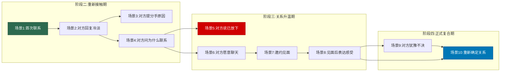

## 五、挽回话术（10个场景）

挽回是一场精密的心理博弈。你在具体方案/04-四分手挽回中已经了解了分手的心理机制、分阶段策略和依恋类型的影响——那些是"道"和"法"。本节是"术"和"器"：在每个关键场景下，你应该说什么、怎么说、以及为什么这样说。

> **前置阅读**：本节的话术建立在分阶段挽回策略之上。如果你还没有阅读具体方案/04-四分手挽回，强烈建议先读完再看本节——不了解断联期、重新接触期、关系升温期的逻辑，直接套用话术会适得其反。

### 10个场景的阶段分布

这10个场景并非随意排列，它们对应挽回过程中的四个阶段，形成一条完整的挽回沟通链路：

**核心原则**：话术不是台词背诵。每句话背后都有心理学原理，理解原理比记住台词更重要。同一个场景，不同依恋类型的前任需要不同的表达方式——如果你还没判断对方的依恋类型，先回看具体方案/04-四分手挽回中4.2.3节。

### 场景1：分手后首次联系

#### 场景定位

这是整个挽回过程中最关键、也最容易搞砸的一步。首次联系发生在断联期结束后（通常分手后2-8周），目标不是"挽回"，而是"重新出现在对方的生活中，且不引起反感"。

心理学依据：首因效应（Primacy Effect）决定了你在对方心中的"新印象"基调。第一条消息的质量直接影响后续所有互动的可能性。

#### 核心话术与分析

**话术A——轻松问候型**

> "最近怎么样？突然想起你，想问个好。"

**逐字分析**：
- "最近怎么样"——以对方为中心的问候，不是"我想你了"以自己为中心
- "突然想起你"——暗示这不是蓄谋已久（即使你是），降低对方的防御心理
- "想问个好"——明确表达意图是"问候"而非"挽回"，让对方放下戒备

**适用场景**：分手原因非原则性问题，断联时间已达标准（冲动分手3-7天，积累型2-4周）。

**话术B——内容载体型**

> "今天路过[你们以前常去的餐厅/地点]，想起那次[具体的搞笑/温暖经历]，忍不住想跟你说一声。你最近还好吗？"

**逐字分析**：
- 用一个具体的"触发事件"作为联系理由——这让你的联系显得自然而非刻意
- 提及共同回忆中的正面经历——激活对方的"积极回忆偏差"（详见具体方案/04-四分手挽回 4.2.1节）
- 以"你最近还好吗"结尾——把话题抛给对方，给TA选择是否回应的空间

**适用场景**：分手时没有大的冲突，双方有较多美好共同回忆。

**话术C——兴趣相关型**

> "看到[对方感兴趣领域的文章/新闻/活动信息]，第一个想到你。分享给你看看，不用特意回复。"

**逐字分析**：
- 内容与对方兴趣相关——表明你在断联期间仍然关注TA在乎的事物，但不是在"监视"TA本人
- "不用特意回复"——主动解除对方的回复义务，反而降低了压力。心理学中的"反向说服"：你越是不要求回应，对方越可能回应

**适用场景**：对方有明确的兴趣爱好（摄影、某类音乐、某个领域的知识），且分手前你知道这些。

**话术D——节日/特殊日期型**

> "[节日名称]快乐。虽然我们不再是那种关系了，但还是想祝你节日开心。"

**逐字分析**：
- 利用节日作为自然的联系时间点——节日问候是社会认可的正常行为，不会显得突兀
- "虽然我们不再是那种关系了"——主动承认现状，展示你接受了分手的事实
- 简短、温暖、不纠缠

**适用场景**：断联期间正好遇到节日（春节、中秋、生日等）。注意：不要为了联系而刻意等节日——如果断联期已过，不必等到下一个节日。

#### 首次联系的禁忌

| 禁忌 | 错误示例 | 为什么是错的 |
|------|---------|------------|
| 表达强烈的想念 | "我好想你""没有你的日子太难了" | 给对方施加情感压力，对方会觉得需要为你的痛苦负责 |
| 谈论复合 | "我们能不能重新开始" | 操之过急，对方还没准备好 |
| 以借口联系 | "我有东西落在你那""你能帮我看看XX吗" | 对方一眼看穿你的借口，反而降低信任 |
| 质问对方近况 | "你是不是有新对象了""你最近跟谁出去了" | 暴露你在监视对方，令人不安 |
| 深夜发消息 | 凌晨1点发"你还醒着吗" | 深夜消息暗示情绪不稳定，让人警惕 |

#### 发送后的等待策略

发出首条消息后，最考验你的是"等待"。以下是具体指导：

- **对方很快回复且态度友善**：简短回复2-3轮对话后主动结束，"好的，那就先这样，有空再聊~"。第一次对话不要太长
- **对方回复冷淡（"嗯""还行""好的"）**：正常，不要慌。参考场景2的应对话术
- **对方几小时后才回复**：对方在犹豫要不要回你，最终回复了说明TA愿意给你机会。不要追问"你怎么这么久才回"
- **对方已读不回**：等3-5天后再发一条不同类型的消息（换一个话术类别）。如果连续两条都已读不回，暂停联系，再断联1-2周后尝试
- **对方明确表示不想联系**：尊重对方。参考场景5的应对方式

---

### 场景2：对方回复冷淡

#### 场景定位

冷淡回复（"嗯""哦""还行""好的"）是重新接触期最常见的回应。这不是拒绝——冷淡回复≠不想联系，冷淡回复=对方还在观望和自我保护。完全拒绝是不回复或者明确说"别联系我"。

心理学依据：对方正在经历"认知失调"——TA内心可能有一部分想跟你联系（所以回复了），但另一部分在自我保护（所以回复很短）。你需要给TA时间来解决这个内在冲突，而不是逼TA立刻做出态度选择。

#### 核心话术与分析

**话术A——尊重退让型**

> "我知道你可能不想被打扰，我只是想确认你还好。如果你需要什么，我在这里。"

**逐字分析**：
- "我知道你可能不想被打扰"——共情对方的感受，表明你理解TA的立场
- "只是想确认你还好"——把你的联系动机定义为"关心"而非"挽回"，降低压力
- "如果你需要什么，我在这里"——把主动权完全交给对方，同时保持善意的开放姿态

**话术B——主动结束型**

> "好的，那就好。不多打扰你了，有空再聊~"

**逐字分析**：
- 简短回应，不做任何追问或纠缠
- "不多打扰你了"——主动表明你不会持续轰炸
- "有空再聊"——为下次联系埋下伏笔，但不设定具体时间

**适用场景**：对方回复了但明显不想深聊。这是最安全的回应方式。

**话术C——轻松转移型**

> "哈哈，你还是这么惜字如金。对了，[一个轻松的、对方可能感兴趣的话题]。"

**逐字分析**：
- "你还是这么惜字如金"——用轻松的方式承认对方的冷淡，化解尴尬
- 接一个新话题——给对方一个更容易回应的内容
- 语气轻松，不带抱怨或委屈

**适用场景**：分手前你们的互动风格比较轻松幽默，且分手原因非严重冲突。

#### 冷淡期的节奏控制

首次联系 ──→ 对方冷淡回复 ──→ 你友善回应+主动结束
                                    │
                          等待3-5天
                                    │
                          第二次联系（换话题类型）
                                    │
                    ┌───────────────┼───────────────┐
                    │               │               │
              回复变热情       依然冷淡         不回复
                    │               │               │
              逐步升温       继续低频联系     再断联1-2周
              (→场景6)      (3-5天一次)      后第三次尝试

**关键指标——对方防线在松动的信号**：
- 回复速度变快（从几小时变成几十分钟）
- 回复字数变多（从几个字变成一两句话）
- 开始主动问你问题（"你呢？""你最近在忙什么"）
- 使用表情符号或语气词（哈哈、嗯嗯、~）
- 回复中出现了你们之间的"内部笑话"或专属用语

如果连续3-4次联系对方都保持冷淡但有回复，不要放弃——这说明对方至少不排斥你。坚持低频（3-5天一次）、轻松、无压力的联系，给对方足够的时间来放下防备。

---

### 场景3：对方提到分手原因

#### 场景定位

这是一个转折性场景。当对方主动提起分手原因时，说明TA在"评估期"——TA在重新审视这段关系，想看你对过去问题的态度。你的回应方式直接决定TA的判断：你是一个"已经改变的人"还是"嘴上说说的人"。

心理学依据：此时对方处于"归因评估"状态——TA在分析"分手到底是谁的错"和"这个问题能不能解决"。你的态度需要同时满足两个条件：(1) 真诚地承担属于你的责任；(2) 不卑微地把所有错都揽到自己身上。

#### 核心话术与分析

**话术A——承认+改变证据型**

> "你说得对，我之前确实做得不好。这段时间我反思了很多，也在努力改变。比如[具体改变1]和[具体改变2]，虽然还不完美，但我确实在往好的方向走。"

**逐字分析**：
- "你说得对"——先肯定对方的感受，而不是急于辩解
- "确实做得不好"——主动承认错误，但用"做得不好"而不是"我是个烂人"——承认行为而非否定人格
- "比如[具体改变]"——这是关键！空洞的"我会改"毫无说服力，具体的变化才有可信度
- "还不完美"——展示谦逊和真实感，完美承诺反而让人不信任

**具体改变示例**（根据分手原因选择）：

| 分手原因 | 可以提到的具体改变 |
|---------|-----------------|
| 不够关心 | "我最近在学做饭，才体会到每天准备饭菜有多不容易" |
| 脾气暴躁 | "我看了几本关于情绪管理的书，也在练习生气时先暂停再说话" |
| 不上进 | "我最近在准备[考证/学习新技术]，已经开始[具体进展]" |
| 控制欲强 | "这段时间我想明白了一件事：安全感应该来自自己，不是控制别人" |
| 忽略感受 | "我以前总觉得'没事'就是真的没事，现在才理解需要主动去关心" |

**话术B——共情+反思型**

> "我一直记得你说过的[对方曾表达的具体不满]。当时我不以为意，现在回想起来，你那时候已经很委屈了。是我的问题。"

**逐字分析**：
- 引用对方曾经说过的话——这表明你真的在听、在反思，而不是敷衍
- "当时我不以为意"——诚实承认自己的忽视
- "你那时候已经很委屈了"——共情对方的感受，而不只是道歉
- "是我的问题"——简洁有力地承担责任

**话术C——避免过度道歉**

> "我知道我之前在[具体问题]上让你很失望。我不想说太多'对不起'——我想让你看到的是我的行动，不是我的话。"

**逐字分析**：
- 适度承认问题，但不过度卑微
- "不想说太多对不起"——展示你理解"行动比语言重要"
- 把焦点从"道歉"转向"改变"

#### 场景3的致命错误

**错误1：推卸责任**

> "但我那样做也是因为你先[XXX]"

即使对方确实有责任，这个时间点不是追究对方的时候。你需要先修复信任，后续再讨论双方的改进空间。

**错误2：过度自贬**

> "都是我的错，我就是个废物，我不配拥有你"

这种表达看似在认错，实际上是在用自我贬低来博取同情——或者更糟，是在给对方施加情感压力（"你看我都这样了，你怎么还不原谅我"）。

**错误3：空洞承诺**

> "我保证以后不会再这样了"

没有具体行动支撑的"保证"一文不值——对方听过太多次了。

**错误4：急于翻篇**

> "过去的事就让它过去吧，我们往前看"

对方需要被看到、被理解。急于翻过这一页会让对方觉得你在回避问题。

---

### 场景4：对方问你为什么联系

#### 场景定位

当对方问"你为什么突然联系我"或"你想干什么"时，这是一个测试——TA在评估你的真实意图。你的回答需要在"诚实"和"不给压力"之间找到精确的平衡点。

心理学依据：对方问这个问题时处于"防御性评估"状态——TA需要知道你的意图，才能决定要不要继续跟你互动。如果你的回答让TA觉得"你在试图挽回"，TA会立刻拉起防线；如果你的回答太含糊，TA会觉得你另有目的。

#### 核心话术与分析

**话术A——诚实+不施压型**

> "说实话，我还是放不下你。我知道之前有很多问题，但我想试试看能不能重新开始。当然，这完全取决于你的意愿，我不会给你任何压力。"

**逐字分析**：
- "说实话"——展示真诚，不做作
- "还是放不下你"——诚实地表达感情，但语气是"陈述感受"而非"哀求"
- "我知道之前有很多问题"——表明你不是在逃避问题
- "我想试试看"——"试试"比"我要"柔和得多，保留了退路
- "完全取决于你的意愿"——把选择权交给对方
- "不会给你任何压力"——承诺无压力，但关键是后续行为要兑现这个承诺

**话术B——低调坦诚型**

> "没什么特别的原因，就是想看看你过得好不好。如果打扰到了，我道歉。"

**逐字分析**：
- "没什么特别的原因"——降低对方的警惕
- "想看看你过得好不好"——以关心为出发点
- "如果打扰到了，我道歉"——展示你尊重对方的边界

**适用场景**：你们分手时间还不太长，或者对方态度明显偏向防御。

**话术C——幽默化解型**

> "因为我这个人比较念旧，路过了就想打个招呼。你放心，不是来推销保险的。"

**逐字分析**：
- 用幽默降低紧张感
- "比较念旧"——合理化你的联系动机
- "不是来推销保险的"——自嘲式幽默，让气氛轻松

**适用场景**：分手前你们互动风格轻松，且分手原因不是太严重。

#### 对方追问"你是不是想复合"的应对

如果对方直接问"你是不是想复合"，有三种情况：

**情况1：你确实想复合，且时机合适（已有一定互动基础）**

> "是的，我确实有这个想法。但我知道这不是我一个人能决定的，所以我想先从朋友做起，让你重新了解现在的我。你觉得呢？"

**情况2：你确实想复合，但时机不成熟（刚重新联系不久）**

> "说完全没有这个想法是骗你的。但我不想操之过急，我们可以先正常联系，其他的顺其自然。"

**情况3：你还不确定**

> "说实话，我还没想那么远。我只是觉得你是一个值得珍惜的人，不想就这么断了联系。"

---

### 场景5：对方说已经放下了

#### 场景定位

这是挽回过程中最痛苦的场景之一。当对方说"我已经放下了""我已经move on了"时，你需要分辨：这是TA的真实想法，还是一种自我保护？

心理学依据：对方说"放下了"可能有三种含义——(1) 真的放下了（最坏情况）；(2) 在用"放下"来保护自己不被再次伤害（TA可能还在乎，但不敢表现出来）；(3) 在测试你的反应（TA想看你是会纠缠还是会尊重）。无论哪种情况，你的最佳策略都是同一种。

#### 核心话术与分析

**话术A——尊重+留门型**

> "我理解。如果你以后改变主意，随时可以联系我。祝你幸福。"

**逐字分析**：
- "我理解"——接受对方的表态，不争辩
- "如果你以后改变主意"——不是"求你改变主意"，而是"门一直开着"
- "随时可以联系我"——把主动权交给对方
- "祝你幸福"——真诚的祝福，展示你的格局和成熟

**话术B——自省+感恩型**

> "谢谢你告诉我。这段感情教会了我很多，我不会后悔认识你。希望你一切都好。"

**逐字分析**：
- "谢谢你告诉我"——感谢对方的坦诚
- "教会了我很多"——展示你从这段关系中成长了
- "不会后悔认识你"——表达对这段经历的正面评价
- "希望你一切都好"——温暖而有尊严的告别

**适用场景**：对方态度非常明确，没有回旋余地。

**话术C——不卑不亢型**

> "好，我知道了。那就不打扰你了。保重。"

**逐字分析**：
- 简洁、干脆、不纠缠
- 不哀求、不追问、不试图说服
- 展示了最好的"高价值姿态"——你有自己的尊严和底线

#### 为什么"尊重+离开"反而是最好的挽回策略

这看起来矛盾：你想挽回，却要"离开"？原理在于：

1. **对抗心理免疫**：如果对方预期你会纠缠（大多数被挽回的人都有这个预期），你的尊重和退让打破了TA的预期，反而让TA重新审视你
2. **损失厌恶再次激活**：你干脆地接受"放下"，意味着对方真的要"失去你了"——这会触发TA重新评估你的价值
3. **展示高价值**：能体面接受拒绝的人，本身就展示了情绪成熟度和自信——这恰恰是吸引力的核心要素
4. **保留未来可能性**：你留下了"随时可以联系我"的种子。当对方在未来某个时刻感到孤独或怀念时，这颗种子可能发芽

**重要提醒**：这不是"欲擒故纵"的把戏。如果你内心并不真的能接受被拒绝，嘴上说"祝你幸福"但之后继续纠缠，效果会比纠缠更差——因为你不仅展示了不尊重，还展示了虚伪。

---

### 场景6：对方愿意聊天

#### 场景定位

当对方开始愿意跟你正常聊天（不再是冷淡的几个字，而是有内容的对话），恭喜你——重新接触期的核心目标已经达成。现在进入关系升温期的初始阶段。

关键原则：此时最容易犯的错误是因为兴奋而"加速"。你必须克制自己，保持"不温不火"的节奏。

#### 核心话术与分析

**话术A——朋友框架型**

> "谢谢你愿意理我。我们可以像朋友一样聊聊天吗？不谈过去，就聊聊现在。"

**逐字分析**：
- "谢谢你愿意理我"——表达感谢，但不过度
- "像朋友一样"——主动降低关系定位，减轻对方的社交压力
- "不谈过去，就聊聊现在"——设定对话边界，避免过早触碰敏感话题

**话术B——轻松分享型**

> "最近在学[新技能/看新剧/去新地方]，感觉打开了新世界。你最近有发现什么有意思的事吗？"

**逐字分析**：
- 分享你的生活变化——暗示你在断联期间有所成长
- "你最近有发现什么有意思的事吗"——把话题抛给对方，表达对TA生活的兴趣
- 内容轻松正面，不涉及感情话题

**话术C——共情关心型**

> "听你说最近在忙[对方提到的事]，挺辛苦的吧？要注意休息。"

**逐字分析**：
- 关注对方的生活状态
- "挺辛苦的吧"——共情而非追问
- "要注意休息"——温和的关心，不过度

#### 升温期的对话节奏管理

| 指标 | 初始阶段 | 中期阶段 | 后期阶段 |
|------|---------|---------|---------|
| 联系频率 | 每3-5天一次 | 每2-3天一次 | 每天或隔天 |
| 对话时长 | 5-10个来回 | 15-20个来回 | 自然结束 |
| 话题深度 | 日常/兴趣 | 生活/工作/感受 | 回忆/未来 |
| 主动发起 | 你为主 | 逐渐平衡 | 对方也会主动 |
| 情感表达 | 零 | 轻微 | 适度 |

**每次对话的"愉快结束"技巧**：

在对话气氛最好的时候主动结束——比如对方刚说了什么有趣的事，你们都笑了的时候：

> "哈哈今天聊得挺开心的，我先去[具体事情]了，下次再聊~"

这利用了"峰终定律"——对方对这次对话的记忆会停留在"最开心的时刻"，而不是"聊到没话说的尴尬结尾"。

---

### 场景7：想邀约见面

#### 场景定位

从线上聊天到线下见面，是关系升温的关键跃迁。见面意味着更多的信息传递（肢体语言、表情、气场），也意味着更大的压力和风险。

时机判断：在发出邀约前，确认对方已经满足以下条件中的至少3项——回复速度快、主动发起对话、对话中有玩笑、愿意分享近况、对你的改变有正面评价。

#### 核心话术与分析

**话术A——共同回忆型**

> "最近发现一家你以前很喜欢的[餐厅/咖啡厅]，想不想一起去？就当老朋友聚聚。"

**逐字分析**：
- 利用共同回忆作为邀约理由——自然、不突兀
- "你以前很喜欢的"——表明你记得对方的喜好
- "就当老朋友聚聚"——降低邀约的情感压力

**话术B——顺便邀约型**

> "我这周末要去[对方所在区域/对方感兴趣的地方]，要不要顺便一起吃个饭？"

**逐字分析**：
- "顺便"——暗示你不是专门为TA去的，降低对方的"被追求"压力
- 给对方留有"说不"的空间
- 选择对方的活动半径内——展示你在考虑对方的方便

**话术C——活动邀约型**

> "有个[展览/电影/活动]看起来挺有意思的，一个人去有点无聊，要不要一起？"

**逐字分析**：
- 以活动为中心，而不是以"见面"为中心
- "一个人去有点无聊"——自然的邀约理由
- 活动提供共同体验和话题，避免"坐下来面对面不知道聊什么"的尴尬

**话术D——新事物尝试型**

> "我一直想试试[对方可能感兴趣的新事物]，但自己不好意思去。你有兴趣吗？"

**逐字分析**：
- "自己不好意思去"——给对方一个"帮你的忙"的角色，人天然喜欢被需要
- 新事物激发好奇心，比"吃个饭"更有吸引力
- 展示你愿意尝试新事物的态度

#### 邀约被拒的应对

**对方说"最近没空"：**

> "没关系，你忙你的。等你有空了再说~"

然后不要追问"那你什么时候有空"——让对方自己主动提时间。如果对方之后主动提出新时间，说明是真的没空；如果对方再也不提，说明是在婉拒。

**对方说"还是算了吧"：**

> "好，那就不勉强了。有空再聊~"

保持轻松，不要追问原因，不要表示失望。

#### 见面前的准备

- **时间控制**：第一次见面控制在1-2小时，"意犹未尽"比"聊到无话"好得多
- **地点选择**：选你们从未一起去过的新地方——避免旧场景触发旧的互动模式
- **形象准备**：展示你的变化——不是炫耀，而是让对方自然地感受到
- **话题准备**：准备3-5个轻松话题，以防冷场。避免深谈感情、追问对方私生活
- **心态准备**：你不是去"谈判复合"的，你是去"展示新的自己"的

---

### 场景8：见面后表达感受

#### 场景定位

见面后，如果互动愉快，你需要在适当的时机表达你对这段关系的真实想法。这是从"朋友"向"恋人"过渡的关键一步。

时机选择：不要在见面过程中就急于表达——这会让整个见面变成"谈判"。最佳时机是见面结束后、对方还沉浸在愉快氛围中的时候（比如当天晚上或第二天）。

#### 核心话术与分析

**话术A——面对面表达型（见面过程中）**

> "见到你真的很开心。这段时间我一直在想我们之间的问题，我觉得我们可以做得更好。你愿意再给我一次机会吗？"

**逐字分析**：
- "见到你真的很开心"——先表达正面感受
- "一直在想我们之间的问题"——表明你在认真反思
- "我们可以做得更好"——"我们"而不是"我"——暗示这是双方共同努力
- "你愿意再给我一次机会吗"——直接但不强硬地提出请求

**适用场景**：见面气氛非常好，对方明显也很享受这次见面。

**话术B——见后微信型**

> "今天真的很开心，谢谢你愿意见我。我一直在想，如果我们都愿意努力，也许我们可以比以前更好。当然，这需要你也愿意。不着急，你慢慢想。"

**逐字分析**：
- 先感谢对方愿意见面
- "比以前更好"——展示你对未来的期望，而非回到过去
- "你也愿意"——强调这是双方的选择
- "不着急，你慢慢想"——给对方空间

**话术C——渐进暗示型**

> "今天跟你在一起的感觉，跟以前不一样了。我觉得我们都在变，变得更好了。"

**逐字分析**：
- 不直接提复合，而是暗示关系的变化
- "跟以前不一样了"——引发对方的思考
- "变得更好了"——积极正向的暗示

**适用场景**：你还不确定对方的态度，想试探一下再决定是否明确提出。

#### 见面后不要做的事

- 见面当晚就发长消息表白——让对方消化一下见面的感受
- 在朋友圈发跟对方的合照或暗示你们见面了——这是在用社交压力逼对方表态
- 见面后第二天就约下一次见面——太急了，至少间隔3-5天
- 追问对方"你觉得今天怎么样""你对我还有感觉吗"——这把愉快的见面变成了压力测试

---

### 场景9：对方犹豫不决

#### 场景定位

当你表达了想复合的意愿，对方既没有明确接受也没有明确拒绝——"让我想想""我需要时间""我还没想好"。这其实是一个相对积极的信号：如果对方完全不想复合，TA会直接拒绝；犹豫说明TA在认真考虑。

心理学依据：对方的犹豫来自"趋避冲突"（Approach-Avoidance Conflict）——想靠近你（因为感情和美好回忆），又想远离你（因为害怕再次受伤）。你需要帮TA减轻"避"的力量，而不是增强"趋"的力量。

#### 核心话术与分析

**话术A——耐心等待型**

> "我知道你需要时间考虑，我不急。你可以慢慢想，我等你。"

**逐字分析**：
- "我知道你需要时间"——理解和尊重对方的节奏
- "我不急"——缓解对方的决策压力
- "我等你"——表达承诺，但不是"我等着你给我答案"的催促

**话术B——减轻压力型**

> "你不用现在就给我答案。我们可以继续像现在这样相处，顺其自然。如果有一天你觉得可以，告诉我就好。"

**逐字分析**：
- "不用现在就给答案"——解除对方的即时决策压力
- "继续像现在这样相处"——不让犹豫影响你们现有的良性互动
- "顺其自然"——降低关系升级的门槛

**话术C——底线表达型**

> "我理解你在犹豫。我想让你知道，无论你最终的决定是什么，我都尊重。我只希望你知道，我是认真的。"

**逐字分析**：
- "无论什么决定都尊重"——展示你的情绪成熟度
- "我是认真的"——在不施压的前提下，让对方知道你的态度是认真的，不是随便说说

#### 犹豫期的正确行为

- **继续正常互动**：不要因为对方在"考虑"就减少联系或加倍联系。保持之前的频率和质量
- **不要反复追问**："你想好了吗？""你考虑得怎么样了？"——每一次追问都在增加对方的压力
- **用行动持续展示变化**：犹豫期是最好的"证明期"。对方在观察你——你的每一个行为都在影响TA的决定
- **不要施加外部压力**：不要通过朋友传话、不要在社交媒体上暗示、不要用"追你的人很多"来刺激对方
- **给自己设一个时间底线**：你可以等，但不能无限期地等。根据情况给自己设定一个合理的时间（通常1-3个月），超过这个时间如果对方仍然没有态度，你需要做一个"最后的坦诚对话"

---

### 场景10：重新确定关系

#### 场景定位

所有前期努力的最终目标。对方已经明确表示愿意重新开始——此刻你需要做的不是庆祝，而是跟对方一起建立新关系的"规则"。

心理学依据：研究表明，直接跳过问题讨论就复合的情侣，再次分手的概率高达75%。复合不是"回到过去"，而是"建立新的关系"。

#### 核心话术与分析

**话术A——感谢+承诺型**

> "谢谢你愿意再给我一次机会。我保证这次会好好珍惜，我们一起努力，好吗？"

**逐字分析**：
- "谢谢你"——表达感恩，不是觉得"理所当然"
- "再给我一次机会"——承认这是对方给予的，不是你"争取"来的
- "好好珍惜"——态度表达
- "一起努力"——"一起"而非"我会"——把复合定义为双方的事

**话术B——具体规划型**

> "谢谢你。我想跟你说，这次我不只是说'我会改'——我想跟你商量几件事：以后遇到分歧我们怎么处理、我们需要什么样的沟通方式、以及怎么做才能不让旧问题重演。你愿意跟我一起想吗？"

**逐字分析**：
- 展示你不是在"空口承诺"
- 提出具体的讨论议题——表明你认真思考过
- "你愿意跟我一起想吗"——邀请对方共同参与关系建设

**话术C——新起点型**

> "我觉得这次不是'回到从前'，而是'重新开始'。以前的问题我们都看到了，这次我们可以做得不一样。你觉得呢？"

**逐字分析**：
- "不是回到从前"——主动区分"复合"和"回到过去"
- "重新开始"——新的框架，新的规则
- "你觉得呢"——征询对方的看法

#### 复合后必须讨论的5个问题

| 议题 | 讨论内容 | 示例 |
|------|---------|------|
| 回顾过去 | 导致分手的根本原因是什么？双方的责任如何分担？ | "我们之前最大的问题是沟通方式——我太容易发火，你太容易沉默" |
| 新的规则 | 遇到分歧时怎么处理？底线在哪里？ | "以后吵架升级时，说'暂停'的人需要在2小时内回来继续谈" |
| 预期管理 | 对关系的期待是否一致？ | "我希望每天至少聊一次天，你觉得呢？" |
| 应急机制 | 再次出现严重矛盾怎么处理？ | "如果感觉问题严重了，我们约定每月做一次关系'体检'" |
| 成长计划 | 双方各自要改善什么？怎么互相支持？ | "我会继续练习情绪管理，你能不能在我发火时提醒我暂停？" |

---

### 贯穿所有场景的核心原则

无论你在哪个场景，以下原则始终适用：

**真诚 > 技巧**。所有话术的根基是真诚——如果你内心并不真的在乎对方，只是不甘心或害怕孤独，再精妙的话术也救不了你。对方能感受到你是不是发自内心的。

**行动 > 语言**。在挽回的全过程中，你的行为变化比你说了什么重要一百倍。一个开始健身、认真工作、学会倾听的你，比一百句"我改了"都有说服力。

**尊重 > 执着**。挽回的前提是对方至少有意愿跟你互动。如果对方明确拒绝，尊重TA的决定。执着超过一定限度就变成了骚扰——这条线由对方来定义，不是你。

**节奏 > 速度**。挽回不是越快越好。每个阶段都有它的意义——断联期让你和对方都冷静下来，重新接触期建立信任，升温期重建连接，复合期确认关系。跳过任何一步都会导致"地基不稳"的问题。

**改变自己 > 改变对方**。你无法控制对方的感受和决定，但你可以控制自己的成长。把精力投入到"成为更好的自己"上，无论最终是否复合，你都不会亏。

### 10个场景速查表

| 场景 | 阶段 | 核心目标 | 关键话术要素 | 避免事项 |
|------|------|---------|------------|---------|
| 1.首次联系 | 重新接触 | 零压力出现 | 轻松、自然、无需求 | 表露想念、谈复合 |
| 2.回复冷淡 | 重新接触 | 尊重+留后路 | 理解、不纠缠、主动结束 | 焦虑追问、加倍联系 |
| 3.提分手原因 | 重新接触 | 承认+展示改变 | 具体认错、有证据的变化 | 推卸、过度自贬、空承诺 |
| 4.问为什么联系 | 重新接触 | 诚实+不施压 | 坦诚但留退路 | 哀求、逼问、太含糊 |
| 5.说已放下 | 重新接触 | 尊重+保持尊严 | 接受、祝福、留门 | 争辩、纠缠、威胁 |
| 6.愿意聊天 | 关系升温 | 朋友框架+轻松互动 | 正面内容、愉快结束 | 谈感情、追问、过频 |
| 7.邀约见面 | 关系升温 | 自然+低压力 | 有理由、给退路、新地点 | 太正式、旧场景、长时 |
| 8.见面后表达 | 关系升温 | 真诚+不逼迫 | 感受+期望+给空间 | 当晚表白、追问感受 |
| 9.犹豫不决 | 正式复合 | 耐心+减轻压力 | 理解、不催、继续正常 | 反复追问、施压、冷战 |
| 10.确定关系 | 正式复合 | 感恩+建立新规则 | 感谢、具体规划、一起努力 | 回到旧模式、空承诺 |

***
