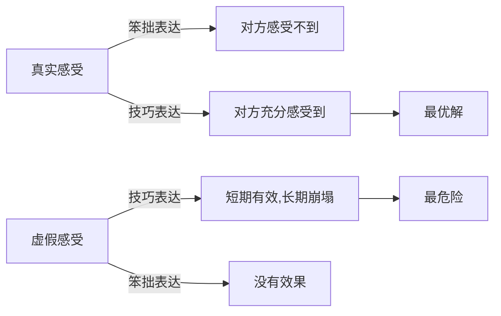
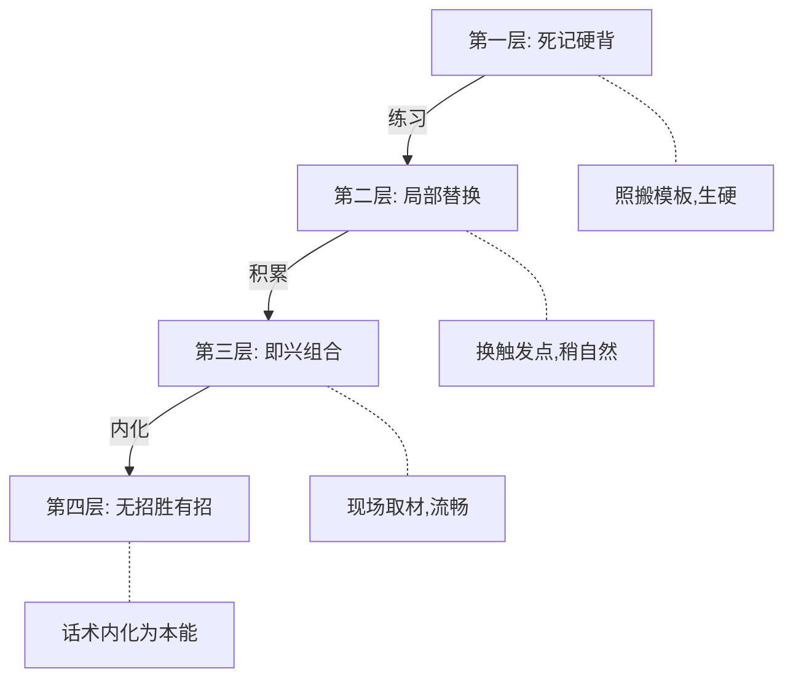
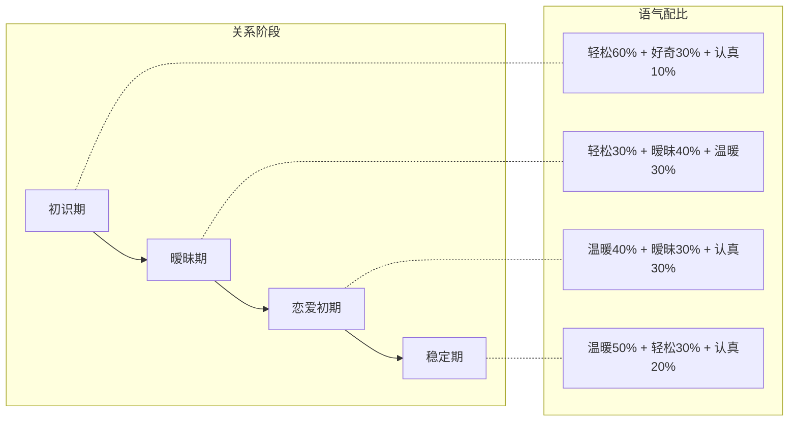
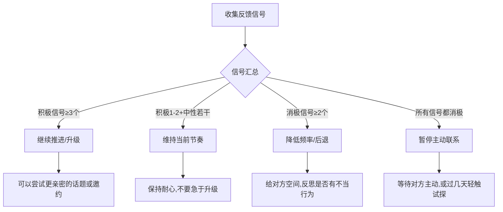
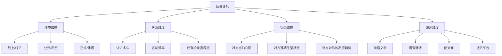
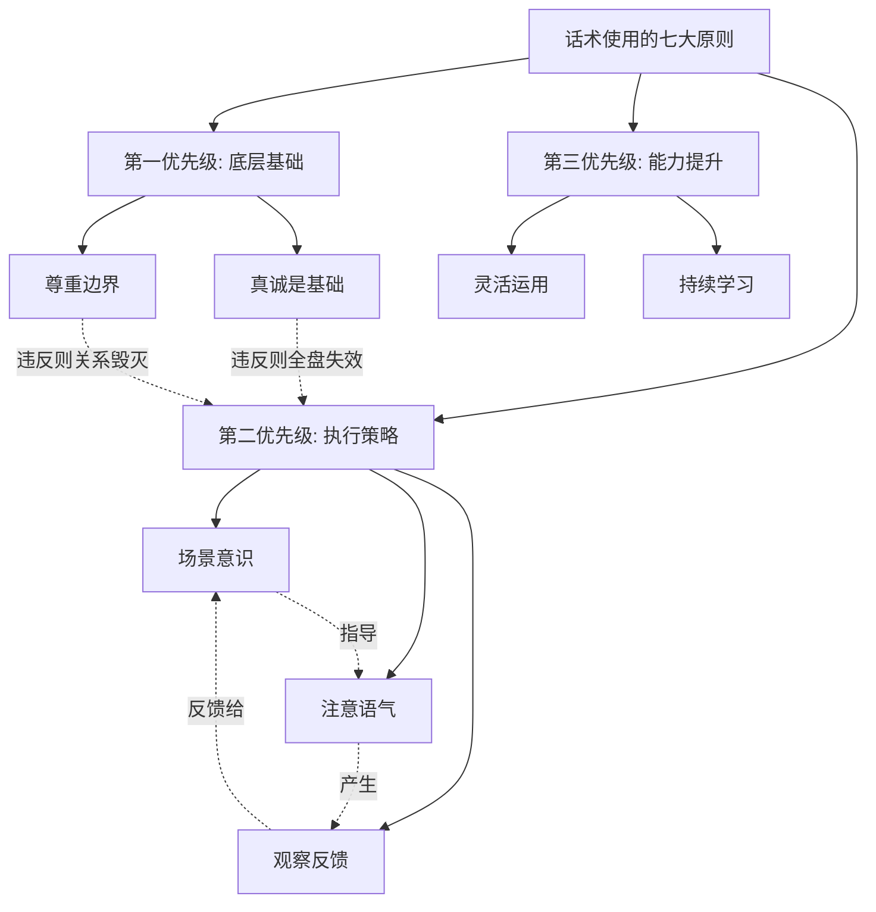
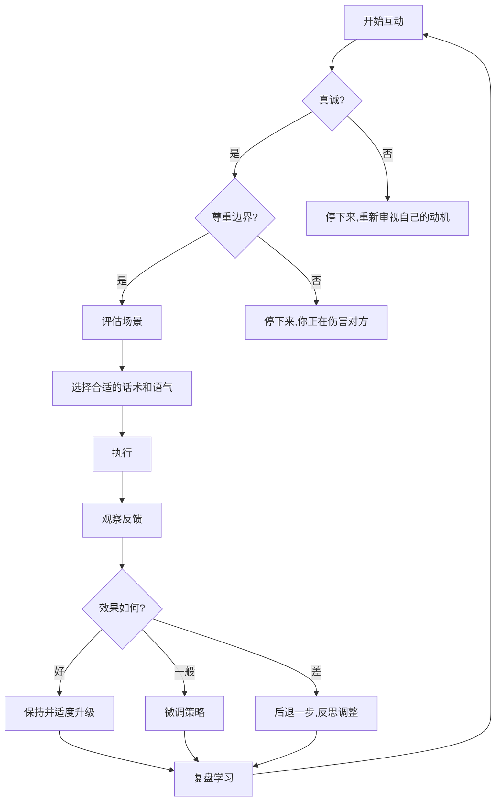

## 七、话术使用原则

前面六章提供了从开场白到长期关系的100个具体话术模板，覆盖了恋爱各个阶段的核心场景。但话术终究只是工具——同样的句子，不同的人说出来、在不同的时机说出来、用不同的方式说出来，效果可能天差地别。**掌握话术的原则，比记住话术本身更重要。** 原则是"道"，话术是"术"；道不通，术不灵。

本章从心理学原理出发，系统阐述话术使用的七大核心原则，每个原则都配有底层机制分析、正反案例对比、常见误区纠正和进阶应用方法。学完这一章，你不仅知道"说什么"，更知道"怎么说"、"何时说"、"对谁说"、"为什么这样说"。

### 7.1 真诚是基础：话术的"第一性原理"

#### 7.1.1 为什么真诚是一切的前提

心理学家 Carl Rogers 在人本主义心理学中提出：**真诚一致（Congruence）是建立深度关系的核心条件之一。** 当一个人的外在表达与内在感受一致时，对方会感知到一种"真实感"，从而产生信任。反过来，当对方感知到你的表达是"表演"或"套路"时，大脑的威胁检测系统会被激活——即使说不出哪里不对，也会本能地产生不信任。

神经科学研究进一步证实了这一点：人类大脑拥有精密的"真实性探测器"。加州大学洛杉矶分校（UCLA）的研究发现，当人们感知到他人言行不一时，大脑的前扣带回皮层（ACC）和脑岛（Insula）会被激活——这些区域负责处理"不对劲"的感觉。这意味着：**你是否真诚，对方的大脑比你想象的更能察觉。**

#### 7.1.2 真诚的三层含义

真诚不是"想说什么就说什么"——那叫口无遮拦。真诚有三个层次：

| 层次 | 含义 | 示例 |
|------|------|------|
| **第一层：不说假话** | 不编造虚假信息、不伪装身份 | 不说自己年薪百万，实际月薪五千 |
| **第二层：情感一致** | 表达的情绪与内心感受匹配 | 喜欢对方就表现出喜欢，而不是故意冷淡来"吊胃口" |
| **第三层：动机纯正** | 使用话术的目的是增进了解，而非操控 | 想了解对方的兴趣是出于好奇，而非寻找"弱点"来利用 |

大多数人理解的真诚停留在第一层，但真正打动人心的是第二层和第三层。一个嘴上说"我喜欢你"但眼神闪躲、行为矛盾的人，比一个直接说"我觉得你挺有意思"的普通人缺乏吸引力得多。

#### 7.1.3 "真诚+技巧"的黄金公式

很多人有一个误区：认为真诚和技巧是对立的。要么真诚地说笨拙的话，要么用技巧说漂亮但虚假的话。实际上，**最好的状态是：用技巧来更好地表达真诚。**

**具体操作**：

- 笨拙版："我喜欢你。"（真诚但缺乏信息量）
- 技巧版："你上次帮我整理文件的时候，我就在想，这个人怎么这么细心。从那以后我就开始注意到你很多小细节。"（同样真诚，但传达了具体的时间、事件、感受变化，信息量和感染力完全不同）

两句话都是真心话，但后者用了"场景锚定"（具体事件）和"时间线叙事"（从那以后的变化）两个技巧，让同样的真诚变得更加动人。

#### 7.1.4 什么时候"不真诚"会露馅

| 信号 | 表现 | 对方的内心感受 |
|------|------|----------------|
| 过度赞美 | 连续发三条"你好漂亮""你太美了" | "他/她是不是对谁都这样说？" |
| 言行不一 | 说"我今天一直在想你"，但一天没主动联系 | "说一套做一套" |
| 情境不符 | 刚认识两天就说"我这辈子没遇到过像你这样的人" | "这也太快了吧，不真实" |
| 复制痕迹 | 消息风格前后不一致，有时文雅有时粗俗 | "这段话像是从哪里抄来的" |

**纠正方法**：在发送每一条消息前，问自己一个问题——"如果对方当面站在我面前，我会不会说一模一样的话？"如果答案是否定的，就不要发。

---

### 7.2 灵活运用：从"背公式"到"会解题"

#### 7.2.1 为什么死记硬背话术会失败

认知心理学中有一个概念叫**负迁移（Negative Transfer）**：当学习者机械地将一个情境中的解决方案套用到另一个情境时，效果可能适得其反。话术模板是"例题"而非"标准答案"——它的价值在于教你"思路"，而不是让你"背答案"。

举一个典型的反面案例：

> 话术模板写的是："看到你朋友圈的照片，是在XX拍的吧？我也去过，那里的日落特别美。"
>
> 实际情况：对方朋友圈三天可见，最近一条是转发的工作文章。

机械套用的结果就是说出一句明显不看场合的话，对方会立刻意识到你在"用模板"。

#### 7.2.2 灵活运用的"三要素拆解法"

每一个话术模板都由三个核心要素构成：**触发点 + 核心动作 + 情绪基调**。学会拆解这三要素，你就能在任何场景中即兴组合。

| 要素 | 说明 | 可替换范围 |
|------|------|------------|
| **触发点** | 引出话题的切入点（对方的照片、动态、当时的情境） | 任何当下可观察到的细节 |
| **核心动作** | 话术的核心功能（赞美、提问、分享、邀约） | 同一功能有多种表达方式 |
| **情绪基调** | 传递的情绪（轻松、认真、幽默、温暖） | 根据对方风格和关系阶段调整 |

**示例——邀约话术的三要素拆解**：

模板："最近XX开了一家不错的咖啡店，评价很高，有兴趣一起去试试吗？"

拆解：
- 触发点：一家新店（可替换为：某个展览、一部新电影、一个活动）
- 核心动作：邀请对方一起去（可替换为：先分享体验再邀请、用求助方式邀请）
- 情绪基调：轻松随意（可替换为：期待兴奋、半开玩笑、认真正式）

即兴组合：
- 轻松版："新开的那家猫咖你去了吗？我看点评上说有只橘猫特别会接客，我想去验证一下。"
- 认真版："我一直想去看那个莫奈的展，但一个人去总差点意思。你有兴趣吗？"
- 幽默版："我朋友说新开的那家火锅店辣度分五级，他说第三级就投降了。我想去看看第五级到底是什么水平，你敢不敢一起？"

#### 7.2.3 灵活运用的四个层次

| 层次 | 特征 | 对应阶段 | 练习方法 |
|------|------|----------|----------|
| 第一层：死记硬背 | 一字不差地背诵模板 | 刚开始学习 | 反复朗读，理解每个词的用意 |
| 第二层：局部替换 | 保留框架，替换部分内容 | 有一定积累 | 每个模板练习三种替换版本 |
| 第三层：即兴组合 | 现场取材，实时组织语言 | 熟练运用 | 每次对话后复盘，尝试不同说法 |
| 第四层：无招胜有招 | 话术内化为本能反应 | 融会贯通 | 不再需要模板，自然流畅 |

**关键认知**：大多数人高估了自己到达第四层的速度。即使是社交能力很强的人，面对真正心动的对象时也会紧张、也会大脑空白。保留几个"万能模板"作为应急方案是完全合理的——这不是退步，是务实。

---

### 7.3 注意语气与语境：同一句话的"一百种说法"

#### 7.3.1 语气的心理学机制

语言学家 Albert Mehrabian 在1971年的经典研究中提出：在面对面的情感交流中，**语言内容只占信息传递的7%，语气语调占38%，肢体语言占55%**。虽然这个比例在文字交流中会有所变化（文字中内容的权重上升），但语气仍然至关重要——因为读者会在脑中自动"配音"，而他们配出的音取决于你的措辞、标点、表情符号和消息长度。

在文字交流中，"语气"通过以下信号传递：

| 信号 | 正面语气 | 负面语气 |
|------|----------|----------|
| **标点** | "好的呀~" | "好的。"（句号在年轻人语境中传递冷淡感） |
| **表情符号** | "没问题😊" | "没问题🙄" |
| **消息长度** | 详细回复 = 重视 | 只回一个"嗯" = 敷衍 |
| **回复速度** | 及时回复 = 在意 | 已读不回/很久才回 = 优先级低 |
| **措辞选择** | "特别开心" | "还行" |

#### 7.3.2 六种核心语气及其适用场景

| 语气 | 适用场景 | 示例 | 注意事项 |
|------|----------|------|----------|
| **轻松幽默** | 日常聊天、破冰、缓解尴尬 | "我怀疑你是故意出现在我的推荐里的，因为太巧了" | 不要强行搞笑，幽默感需要练习 |
| **温暖关心** | 对方心情不好、生病、压力大 | "别太拼了，身体是自己的。需要的话随时找我" | 不要过度关心变成压力 |
| **认真诚恳** | 表白、道歉、谈重要话题 | "我想认真跟你说一件事，希望你能听我说完" | 语气太重会让气氛紧张，适度即可 |
| **自信从容** | 自我介绍、展示价值 | "我对这件事有一些自己的看法，不一定对，但确实是我的真实想法" | 自信不等于自大，注意分寸 |
| **好奇探索** | 了解对方、深入对话 | "这个我第一次听说，你能多跟我讲讲吗？" | 好奇要真诚，不要变成审讯 |
| **暧昧暗示** | 暧昧期升温、试探对方态度 | "你这样说话会让我误会的哦" | 看对方反应再决定是否升级 |

#### 7.3.3 语气适配模型

不同的关系阶段和对方类型，需要不同的语气配比：

**核心原则**：语气的匹配度比语气本身的"好坏"更重要。一个性格内敛的人，突然用非常热烈的语气说话，对方会觉得不自然。最好的策略是在自己的舒适区内微调，而不是完全改变自己的说话方式。

#### 7.3.4 语气的常见致命错误

1. **"审讯式"提问**：连续问三个以上问题，没有任何自我分享——"你多大？哪里人？做什么工作的？"这不是聊天，是查户口。
2. **"客服式"回复**：每句话都很礼貌但没有温度——"好的，知道了，谢谢。"这是在处理工单，不是在谈恋爱。
3. **"领导式"语气**：习惯性下判断、给结论——"你这样不对""你应该这样做"。对方要的是倾听和共情，不是人生导师。
4. **"阴阳怪气"**：用反话表达不满——"哦，你可真忙啊""行吧，你开心就好"。这种语气极具杀伤力，任何正面的话术在它面前都会失效。

---

### 7.4 观察反馈与动态调整：做一个"会读空气"的人

#### 7.4.1 什么是"反馈信号"

在任何对话中，对方都在持续向你发送反馈信号。这些信号分为三类：

| 信号类型 | 积极信号 | 中性信号 | 消极信号 |
|----------|----------|----------|----------|
| **回复速度** | 秒回或快速回复 | 正常节奏回复 | 几小时才回或不回 |
| **回复长度** | 长消息、主动展开 | 正常长度回复 | 只回一两个字 |
| **情绪表达** | 哈哈哈哈、表情包、感叹号 | 无明显情绪 | 嗯、哦、好的、。 |
| **主动程度** | 主动提问、主动分享 | 回应但不主动发起 | 只回答不提问 |
| **话题延续** | 接住话题并延伸 | 回应但不延伸 | 跳过话题或转移 |

#### 7.4.2 反馈信号的综合研判

单独一个信号不足以判断对方态度，需要综合多个信号形成判断：

**重要提醒**：反馈信号的判断必须基于**趋势**而非**单次**。对方某次回复慢了，可能只是在忙；对方某天话少了，可能只是心情不好。不要因为一次消极信号就焦虑不安，也不要因为一次积极信号就得意忘形。看3-5次互动的整体趋势才可靠。

#### 7.4.3 动态调整的"四步循环"

观察反馈不是被动接收，而是一个主动的循环过程：

| 步骤 | 操作 | 说明 |
|------|------|------|
| **第一步：观察** | 仔细看对方的回复内容、速度、情绪 | 不带预设地接收信息 |
| **第二步：解读** | 综合多个信号判断对方当前状态 | 避免过度解读单一信号 |
| **第三步：调整** | 根据判断调整自己的话术策略 | 调整幅度不宜过大，渐进式改变 |
| **第四步：验证** | 观察调整后的效果，确认判断是否正确 | 如果效果变好，说明判断正确；反之则需要重新解读 |

这个循环在每次互动中都在运行。随着你和对方互动次数的增加，你对对方"信号系统"的理解会越来越准确，调整也会越来越精准。

#### 7.4.4 典型场景的反馈解读与应对

**场景A：你发了一段有趣的故事，对方只回了"哈哈"。**

| 解读维度 | 分析 |
|----------|------|
| 可能原因1 | 对方正在忙，来不及详细回复 |
| 可能原因2 | 故事本身不够有趣，对方礼貌回应 |
| 可能原因3 | 对方的表达习惯就是简洁 |
| 应对策略 | 不要追问"不好笑吗？"，也不要连续发更多故事。换个话题或稍后再聊，观察下一次互动的整体模式 |

**场景B：你邀约对方，对方说"最近有点忙，下次吧"。**

| 解读维度 | 分析 |
|----------|------|
| 积极解读 | 对方说了"下次"，说明没有彻底拒绝 |
| 消极解读 | "下次"是最常见的委婉拒绝方式 |
| 应对策略 | 不要追问"那什么时候有空？"，给对方一周左右的时间。如果对方主动提起见面或回复积极，说明是真忙；如果对方态度持续冷淡，可能是婉拒 |

**场景C：对方主动给你发消息，分享生活日常。**

| 解读维度 | 分析 |
|----------|------|
| 核心信号 | 主动分享是高度积极的信号，说明你在对方的"想说话的人"列表中 |
| 注意事项 | 不要因为对方主动就突然大幅提升热情度（容易吓到对方），保持和之前相近的节奏，稍微升温即可 |

---

### 7.5 持续学习与刻意练习：从新手到高手的进化路径

#### 7.5.1 为什么"知道"不等于"做到"

心理学家 K. Anders Ericsson 提出的**刻意练习（Deliberate Practice）**理论告诉我们：能力的提升不是简单地重复做某件事，而是有针对性地练习自己的薄弱环节，并获得及时反馈。很多人看了一堆话术、学了一堆技巧，在实际对话中仍然大脑空白——这不是因为他们不够聪明，而是因为从"知道"到"做到"之间需要大量的刻意练习。

从"知道"到"做到"的四个阶段（Dreyfus 技能习得模型的简化版）：

| 阶段 | 特征 | 话术领域的表现 |
|------|------|----------------|
| **新手期** | 依赖规则，不懂变通 | 照搬模板，一紧张就忘词 |
| **进阶期** | 能识别模式，开始有判断力 | 知道什么场景用什么话术，但还需要想 |
| **胜任期** | 能制定策略，灵活应变 | 能根据对方反馈即兴调整，大部分场景应对自如 |
| **精通期** | 直觉反应，不再需要思考 | 话术完全内化，自然流畅地表达 |

#### 7.5.2 刻意练习的具体方法

**方法一：对话复盘法**

每次重要对话后，花5分钟回顾：

| 复盘维度 | 问自己的问题 |
|----------|------------|
| 效果评估 | 对方的反应是积极的、中性的还是消极的？ |
| 话术分析 | 哪句话效果好？哪句话效果不好？ |
| 替代方案 | 如果可以重来，我会怎么说？ |
| 情绪觉察 | 我当时的情绪状态如何？是否影响了表达？ |

**方法二：影子练习法**

观察社交能力强的人（朋友、博主、综艺节目中的人）是如何说话的。重点观察：
- 他们如何开启话题
- 他们如何回应对方的情绪
- 他们如何处理尴尬的沉默
- 他们如何表达不同意而不引起冲突
- 他们的节奏感——什么时候说多、什么时候说少

**方法三：场景模拟法**

和朋友进行角色扮演练习，模拟以下高难度场景：
- 第一次和陌生人搭话
- 对方回复很冷淡时如何应对
- 约会被拒绝时如何优雅回应
- 吵架后如何开口修复关系

#### 7.5.3 学习资源推荐

| 类型 | 推荐内容 | 学什么 |
|------|----------|--------|
| 书籍 | 《非暴力沟通》Marshall Rosenberg | 表达需求的正确方式 |
| 书籍 | 《亲密关系》Rowland Miller | 理解关系中的心理学机制 |
| 书籍 | 《影响力》Robert Cialdini | 理解社交互动中的说服原理 |
| 书籍 | 《关键对话》Patterson等 | 处理高压力、高情绪对话 |
| 实践 | 每日主动和一个不太熟的人聊天 | 降低社交焦虑，积累实战经验 |
| 实践 | 每周记录一次"最佳对话"和"最差对话" | 建立自己的话术经验库 |

---

### 7.6 尊重边界：话术的"道德底线"

#### 7.6.1 什么是边界

边界是对方在互动中设立的隐形"围栏"——哪些话题可以聊、哪些行为可以接受、什么程度的亲密是舒适的。**好的话术拉近距离，坏的话术踩过边界。** 区别在于：前者让对方感到被理解和被尊重，后者让对方感到被冒犯或被侵犯。

边界分为以下几类：

| 边界类型 | 说明 | 越界示例 |
|----------|------|----------|
| **话题边界** | 对方不愿谈论的领域 | 追问对方的收入、前任细节、家庭隐私 |
| **时间边界** | 对方的作息和私人时间 | 凌晨两点打电话、工作时间持续发消息 |
| **身体边界** | 对方对身体接触的接受度 | 未经允许的肢体接触 |
| **情感边界** | 对方当前的情感承受能力 | 刚认识就表白、对方情绪低落时开不合时宜的玩笑 |
| **社交边界** | 对方对公开程度的接受度 | 在对方朋友圈下过于亲密地评论 |

#### 7.6.2 如何识别边界信号

大多数人在感到不舒服时不会直接说"你越界了"，而是通过以下信号间接表达：

**语言信号**：
- "哈哈，这个话题有点尴尬" → 请停止这个话题
- "我还没想好怎么说" → 不要追问
- "你怎么什么都问啊" → 你的问题太多了
- 频繁使用"嗯""哦""好吧" → 对当前话题失去兴趣

**行为信号**：
- 回复速度突然变慢 → 可能在犹豫要不要继续聊
- 不再使用表情符号 → 情绪投入下降
- 不再主动提问 → 对话变成单方面输出

#### 7.6.3 尊重边界的"三不原则"

| 原则 | 说明 | 具体操作 |
|------|------|----------|
| **不追问** | 对方不愿回答的问题，不要追问第二遍 | 对方说"不想聊这个"，立刻切换话题，不要说"就告诉我嘛" |
| **不强迫** | 对方拒绝了某个提议，不要反复施压 | 对方说"今天不想出门"，不要说"去嘛去嘛就一会儿" |
| **不道德绑架** | 不用"我为你做了XX，你连这点要求都不答应"来施压 | 帮助对方是因为你愿意，不是为了换取什么 |

#### 7.6.4 关于"PUA"的严肃讨论

必须明确指出：**本书所有话术的目的都是增进双方的理解和情感联结，而不是操控对方的情感或行为。** 任何以打压对方自尊、制造不安全感、控制对方行为为目的的"话术"，本质上都是情感操控（Emotional Manipulation），在心理学中属于**黑暗三角人格**（自恋、马基雅维利主义、精神病态）的行为特征。

识别操控性话术的三个标志：

| 标志 | 说明 | 示例 |
|------|------|------|
| **贬低对方价值** | 让对方觉得自己不够好，需要你的"认可" | "你这样的条件能找到我就不错了" |
| **制造不确定性** | 故意忽冷忽热，让对方陷入焦虑 | 热情三天后突然消失，再出现时若无其事 |
| **隔离社交圈** | 让对方减少和朋友/家人的联系 | "你朋友对你不好，只有我是真心的" |

如果发现自己或身边的人正在经历这些行为，请果断远离。**健康的关系建立在平等、尊重和真诚之上，而不是恐惧、不安和控制。**

---

### 7.7 场景意识：话术的"操作系统"

#### 7.7.1 什么是场景意识

场景意识是指在使用任何话术之前，先对当前的**环境、关系阶段、对方状态、沟通渠道**进行全面评估的能力。如果说话术是"应用程序"，场景意识就是"操作系统"——应用再好，系统不兼容也跑不起来。

场景评估的四个维度：

#### 7.7.2 四个维度的评估要点

**环境维度评估**：

| 场景 | 适合的话术 | 不适合的话术 |
|------|-----------|------------|
| 微信聊天（文字） | 简短幽默、轻松提问 | 长篇大论、过于严肃的话题 |
| 语音/电话 | 关心问候、轻松闲聊 | 复杂的情感表达（容易误读语气） |
| 面对面（安静环境） | 深度对话、认真表白 | 手机聊天风格的短句 |
| 面对面（社交场合） | 轻松互动、适度调侃 | 过于私密或严肃的话题 |
| 朋友圈/社交平台 | 适度互动、有趣评论 | 过于亲密的公开表达 |

**关系维度评估**——关系阶段与话术升级的对应关系：

| 关系阶段 | 可以使用的话术层级 | 不能操之过急的做法 |
|----------|------------------|-------------------|
| 刚认识（0-7天） | 礼貌问候、轻松话题、基本信息交换 | 过度赞美、深夜聊天、频繁联系 |
| 熟悉期（1-4周） | 分享生活、适度关心、偶尔幽默调侃 | 暧昧暗示、吃醋、过于亲密 |
| 暧昧期（1-3个月） | 暧昧暗示、深度对话、单独邀约 | 直接表白、要求对方承诺 |
| 确认关系后 | 全部话术类型均可使用 | 注意不要因为"已经在一起"就停止用心 |

**状态维度评估**：

在使用话术前，花30秒评估对方当前的状态：
- 对方刚发了一条朋友圈，内容是加班——适合关心，不适合邀约
- 对方刚和你愉快地聊了半小时——可以尝试升级话题
- 对方回复明显变慢——可能在忙或情绪下降，不要继续密集发消息

**渠道维度评估**：

不同渠道有各自的"潜规则"：

| 渠道 | 特点 | 使用话术的注意事项 |
|------|------|-------------------|
| 微信文字 | 异步、可编辑、可撤回 | 注意标点和表情的使用；长消息分段发 |
| 微信语音 | 实时性高、有语气 | 注意语速和音量；不要太长（超过30秒对方可能不听） |
| 电话 | 最直接、最有温度 | 适合重要对话；不适合闲聊（对方可能不方便） |
| 面对面 | 信息量最大（语言+表情+肢体） | 注意眼神接触和身体语言；不要一直看手机 |
| 社交平台 | 公开、有观众 | 评论和私信的亲密程度要有区分 |

#### 7.7.3 场景意识的实战示例

**场景：你想约对方周末出来。**

不考虑场景的版本：
> "周末有空吗？一起出来玩？"

考虑场景的优化版本：

| 场景变量 | 情况 | 调整策略 |
|----------|------|----------|
| 关系阶段 | 刚认识两周 | 不宜直接单独邀约，可以先组局 |
| 对方状态 | 对方最近工作很忙 | 不要施压，给对方拒绝的空间 |
| 天气/季节 | 这周末天气很好 | 可以利用天气作为自然话题切入 |

优化后：
> "这周末天气特别好，我和几个朋友准备去XX那边逛逛，你要是有空的话一起来？放松一下，最近看你一直在忙。"

这个版本的优化点：
1. 利用天气做自然话题，不突兀
2. "几个朋友"降低了单独见面的压力
3. "你要是有空的话"给了对方拒绝的余地
4. "最近看你一直在忙"显示你关注对方的状态

---

### 7.8 七原则的综合应用框架

#### 7.8.1 七大原则的优先级

七大原则不是平等的，它们有明确的优先级层次：

- **第一优先级**：真诚和尊重边界是不可逾越的底线。违反这两条，任何话术技巧都无法弥补。
- **第二优先级**：场景意识、语气和反馈观察是日常执行层面的核心能力。
- **第三优先级**：灵活运用和持续学习是长期进阶的方向。

#### 7.8.2 一次完整的话术决策过程

以一个具体场景串联七大原则：

**场景**：你和一个认识三周的对象微信聊天，对方今天回复变慢了。

| 步骤 | 原则 | 具体操作 |
|------|------|----------|
| 1. 评估场景 | 场景意识 | 对方可能在忙；你们认识三周，处于熟悉期向暧昧期过渡 |
| 2. 检查语气 | 注意语气 | 不要用质问的语气（"你怎么不回消息"），保持轻松 |
| 3. 观察反馈 | 观察反馈 | 这是第一次回复变慢，不要过度解读 |
| 4. 保持真诚 | 真诚是基础 | 不要假装不在意，也不要过度焦虑，表达真实但适度的关心 |
| 5. 尊重边界 | 尊重边界 | 对方没有义务秒回你的消息，给对方空间 |
| 6. 灵活应对 | 灵活运用 | 根据对方的回复内容（而不是回复速度）来调整策略 |
| 7. 事后复盘 | 持续学习 | 晚上回顾今天的对话，总结哪些做得好，哪些可以改进 |

最终决定发送的消息：
> "今天是不是特别忙？不用急着回，忙完了再聊就好😊"

这句话为什么好：
- 表达了关心（"是不是特别忙"）
- 减轻了对方的回复压力（"不用急着回"）
- 传递了安全感（"忙完了再聊就好"）
- 语气轻松（表情符号）
- 不追问、不施压、不焦虑

#### 7.8.3 常见"翻车"场景的综合补救

| 翻车场景 | 涉及的原则 | 补救方法 |
|----------|-----------|----------|
| 用了话术但对方反应冷淡 | 灵活运用 + 观察反馈 | 不要继续加码，后退一步，换个话题或方式 |
| 说错话让对方不开心 | 真诚 + 尊重边界 | 直接道歉，不要试图用更多话术来"掩盖" |
| 话术痕迹太明显被识破 | 真诚 + 灵活运用 | 坦诚承认"我确实不太会说话，但我想表达的意思是真的" |
| 对方的反应完全出乎意料 | 场景意识 + 观察反馈 | 先按下不表，重新评估对方的状态和关系阶段 |
| 过度紧张导致大脑空白 | 持续学习 + 灵活运用 | 用万能模板救场（"今天过得怎么样？"永远不犯错） |

---

### 7.9 话术使用的常见误区总表

在整本书的话术学习过程中，以下误区出现频率最高，汇总于此以便随时自查：

| 序号 | 误区 | 表现 | 后果 | 纠正 |
|------|------|------|------|------|
| 1 | 话术万能论 | 以为背了话术就能搞定一切 | 忽视自身成长和真诚的力量 | 话术只是辅助，真正的吸引力来自你这个人 |
| 2 | 模板依赖症 | 离开模板就不会说话 | 永远无法进入"第四层" | 逐步练习即兴表达，允许自己说"笨拙的真心话" |
| 3 | 过度分析 | 每句话都要分析半天才发 | 错过最佳回复时机，显得不自然 | 日常聊天用直觉，重要场景再仔细推敲 |
| 4 | 忽视对方信号 | 只关注自己说什么，不看对方怎么回应 | 对方越聊越冷，自己浑然不觉 | 每发送两条消息，就花10秒分析对方的最新信号 |
| 5 | 语气不匹配 | 用正式语气和轻松的人聊天 | 对方觉得你太"端着" | 观察对方的说话风格，适度靠近但不模仿 |
| 6 | 急于升级 | 刚认识就想暧昧，暧昧就想表白 | 让对方感到压力和不适 | 严格按照关系阶段逐步升温 |
| 7 | 过度道歉 | "对不起打扰了""不好意思又找你了" | 自我贬低，降低吸引力 | 直接自信地开始对话，不要先道歉 |
| 8 | 消息轰炸 | 连发五六条消息对方没回 | 制造巨大压力，适得其反 | 最多两条消息，然后等对方回复 |
| 9 | 复制粘贴感 | 发的消息和网上模板一模一样 | 对方搜索后发现原版，信任崩塌 | 永远在模板基础上加入个人化的元素 |
| 10 | 忽视自身建设 | 把所有精力放在话术上，不提升自己 | 话术再好，内核不行也撑不住 | 话术学习和个人成长要并行 |

---

### 7.10 本章小结

话术使用的七大原则可以归纳为一句话：**以真诚为核心，以尊重为底线，以场景为导向，以反馈为指南，以练习为路径，以灵活为方法，以成长为归宿。**

最后，也是最重要的一点：**话术的本质不是"操控对话"，而是"更好地表达真实的自己"。** 如果你发现自己需要一直"演"才能维持一段关系，那这段关系本身就值得重新审视。真正好的恋爱关系，是你可以在对方面前做真实的自己——笨拙也好、紧张也好、不完美也好——对方接受的就是这样一个真实的你。话术只是帮你把最好的自己更清晰地传递出去，而不是帮你伪装成另一个人。

带着这个认知，去实践吧。
