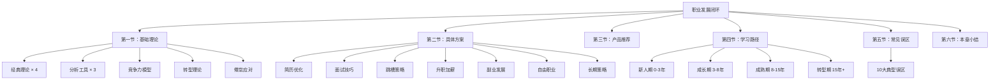
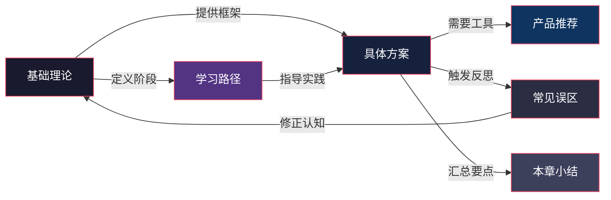

# 第十二章 职业发展——从优秀到卓越的跃迁之路

## 一、为什么这一章值得你认真读

职业发展是个人提升方案中最具现实驱动力的模块。它直接关联你的收入水平、社会地位、生活质量，以及每天醒来的那8-12个小时是否值得投入。

当今职场的底层逻辑已经发生根本变化：

- **终身雇佣制瓦解**：企业平均寿命从1960年代的60年缩短到如今的不足20年，"一份工作干到老"的时代彻底终结
- **技能半衰期缩短**：技术类岗位的核心技能半衰期约为5年，管理类岗位约为7-10年，不持续更新就等于退步
- **AI加速替代**：麦肯锡全球研究院预测，到2030年全球将有3.75亿劳动者需要转换职业类别
- **职业路径非线性**：LinkedIn数据显示，Z世代平均期望在职业生涯中经历4次以上的重大职业转变

根据LinkedIn《2025全球职场趋势报告》，超过67%的职场人表示对自己的职业发展方向感到迷茫，而那些拥有清晰职业规划的人，其薪资增长速度是无规划者的2.3倍。这意味着**职业规划不是可选项，而是决定你能走多远的核心变量**。

但现实是，大多数人在职业决策上依赖的是直觉、运气和身边有限的样本。本章的使命，就是为你提供一套经得起验证的理论框架、一整套可落地的实操方案、以及一份常见陷阱的预警清单——让你在每一个职业决策节点上，都能做出比昨天更好的选择。

## 二、本章核心框架

本章围绕**"认知→规划→行动→迭代"**的职业发展闭环，分为六个模块，共30个文件，覆盖从理论基础到实战落地的完整知识体系。

### 2.1 基础理论篇（第一节，8个文件）

这是全章的认知地基。没有理论指导的行动是盲动，没有框架支撑的决策是赌博。本节包含四大理论体系和四种实用工具：

| 主题 | 核心内容 | 解决什么问题 |
|------|---------|-------------|
| 舒伯生涯发展理论 | 五大发展阶段 + 生涯彩虹图 + 自我概念 | 我现在处于什么阶段？该做什么？ |
| 霍兰德RIASEC模型 | 六种人格类型 + 三字母代码 + 六边形模型 | 我适合什么样的工作环境？ |
| 施恩职业锚理论 | 八种职业锚类型 + 识别方法 | 我在职业中最看重什么？ |
| 克朗伯兹社会学习理论 | 四大影响因素 + "计划性机缘" | 偶然机遇如何变成职业转折？ |
| SWOT分析 | 四要素详解 + 战略矩阵组合 | 如何系统评估自己的处境？ |
| 个人商业画布 | 九大维度审视职业模式 | 如何像经营公司一样经营自己？ |
| 能力三核模型 | 知识-技能-才干三层体系 | 我的核心竞争力在哪里？ |
| CASVE决策循环 | 沟通-分析-综合-评估-执行五步法 | 面对职业选择如何科学决策？ |

此外还覆盖**职业转型理论**（何时转型、如何降低风险）和**职业倦怠应对策略**（识别信号、恢复路径），以及**职场竞争力模型**的系统构建方法。

### 2.2 具体方案篇（第二节，8个文件）

本节是全章的核心实操部分。理论再好，不落地就是空谈。8个文件覆盖职业发展中最常遇到的关键场景：

**求职阶段：**
- **简历优化**：从结构设计到内容表达的全方位优化策略，包括ATS系统适配、量化成果公式、一页纸排版技巧
- **面试技巧**：面试前的信息调研与模拟准备、面试中的STAR法则结构化表达、面试后的复盘与跟进

**职业进阶：**
- **升职加薪**：向上管理的方法论、个人价值的量化展示、薪资谈判的具体话术和时机选择
- **跳槽策略**：判断跳槽时机的信号清单、"骑驴找马"的执行框架、行业/公司/岗位三维评估模型

**多元发展：**
- **副业发展**：第二曲线的识别与验证、MVP式副业启动法、主业与副业的精力分配策略
- **自由职业转型**：从雇员到自我雇佣的完整路径，包括财务准备、客户获取、定价策略、法律合规

**长期视野：**
- **长期策略**：个人品牌的系统构建、跨周期能力组合、职业护城河的持续打造

### 2.3 产品推荐篇（第三节，6个文件）

精选职业发展领域的优质资源，按类型分层推荐，帮你少走弯路：

- **书籍推荐**：涵盖职业规划、沟通表达、领导力、商业思维等维度的经典著作
- **工具推荐**：简历制作、时间管理、知识管理、人脉维护等场景的实用工具
- **平台与社群**：求职平台、行业社群、知识付费平台的选择指南
- **认证与课程**：高性价比的职业认证和在线课程推荐
- **资源选择方法论**：如何评估和选择适合自己的学习资源，避免"囤课不学"的陷阱

### 2.4 学习路径篇（第四节，1个文件）

根据职业发展的四个关键阶段，设计差异化的学习路径和能力提升方案：

| 阶段 | 时间跨度 | 核心目标 | 关键能力 |
|------|---------|---------|---------|
| 新人期 | 0-3年 | 站稳脚跟 | 专业硬技能 + 职业素养 + 工作习惯 |
| 成长期 | 3-8年 | 建立壁垒 | 深度专业能力 + 管理/影响力 + 个人品牌 |
| 成熟期 | 8-15年 | 价值最大化 | 战略思维 + 资源整合 + 行业话语权 |
| 转型期 | 15年+ | 第二曲线 | 跨领域迁移能力 + 心态重建 + 新赛道验证 |

每个阶段都包含：阶段特征诊断、核心目标设定、能力学习优先级排序、具体学习资源推荐、以及阶段转换的关键节点提醒。

### 2.5 常见误区篇（第五节，1个文件）

识别并纠正在职业发展中最容易犯的10个典型认知错误。每个误区都按统一结构展开：误区描述→为何陷入→危害分析→纠正方法→实操建议。

涵盖的误区包括但不限于：迷信"努力就会被看到"、频繁跳槽涨薪陷阱、盲目考证、忽视软技能、拒绝向上管理、过度追求完美、错把平台当能力、忽视行业周期等。这部分的价值在于：**提前知道哪里有坑，比掉进去再爬出来成本低得多**。

### 2.6 本章小结（第六节，1个文件）

回顾全章核心要点，提炼可执行的行动清单，将分散的知识点串联成完整的职业发展行动框架。包含一份可直接使用的"职业发展自检清单"，帮助你将本章所学转化为持续的行动力。

## 三、本章的学习目标

完成本章学习后，你将具备以下能力：

**认知层（知道）：**
1. 掌握四大经典职业发展理论的底层逻辑，能够用理论框架分析自己的职业处境
2. 理解职业锚、霍兰德类型、能力三核等核心概念，并能准确识别自己的定位
3. 建立"职业发展是动态系统"的认知，摒弃线性思维和静态规划

**方法层（会用）：**
4. 熟练运用SWOT分析、个人商业画布、CASVE决策循环等工具进行职业决策
5. 掌握简历优化、面试表现、薪资谈判、向上管理等关键职场技能的方法论
6. 能够为自己制定阶段性、可量化、可调整的职业发展计划

**行动层（做到）：**
7. 在面对跳槽、转型、副业选择等重大决策时，能够系统分析而非凭直觉行事
8. 建立持续迭代的职业发展习惯——每季度复盘、每年调整方向
9. 识别并规避常见的职业发展认知陷阱，减少不必要的试错成本

## 四、知识地图：各节之间的关系

**推荐学习顺序：**

1. **先读基础理论**（第一节）→ 建立认知框架，理解"为什么要这样做"
2. **再读学习路径**（第四节）→ 确定自己当前所处阶段，明确优先级
3. **然后精读具体方案**（第二节）→ 针对当前最紧迫的场景深入学习
4. **同步参考产品推荐**（第三节）→ 为自己的学习补充工具和资源
5. **穿插阅读常见误区**（第五节）→ 在每个行动前后对照检查
6. **最后回顾本章小结**（第六节）→ 串联所有知识，形成行动清单

## 五、阅读建议

**按角色选择起点：**

| 如果你是… | 建议从这里开始 | 重点阅读 |
|-----------|--------------|---------|
| 应届毕业生/职场新人 | 第一节基础理论 | 学习路径-新人期 + 简历优化 + 面试技巧 |
| 工作3-5年、考虑跳槽 | 第二节具体方案 | 跳槽策略 + 升职加薪 + 常见误区 |
| 工作8年+、感到倦怠 | 第一节基础理论 | 职业锚识别 + 职业转型理论 + 副业发展 |
| 想发展副业/自由职业 | 第二节具体方案 | 副业发展 + 自由职业转型 + 长期策略 |
| 面临重大职业决策 | 第一节基础理论 | CASVE决策循环 + SWOT分析 + 职业锚 |

**通用建议：**

- **第一遍通读**：快速浏览全章目录和概览，建立整体认知地图，标记与自己最相关的3-5个章节
- **第二遍精读**：按标记深入学习，每读完一节，用纸笔完成对应的自我分析练习——只看不写，等于没学
- **边读边做**：每读完一个实操模块，立即在真实场景中尝试。简历优化章节读完，当天就动手改简历
- **定期回顾**：每季度用本章的框架重新审视自己的职业状态，职业规划不是一劳永逸的事

## 六、适读人群与前置知识

**本章适合：**
- 所有正在工作或即将进入职场的人，无论行业和职级
- 对当前职业状态不满意、想寻求改变但不知从何入手的人
- 面临跳槽、转行、升职、副业等具体决策的人
- 希望建立系统职业思维、不再"走一步看一步"的人

**不需要的前置知识：**
- 不需要管理学或心理学背景，所有理论都会从零讲起
- 不需要丰富的职场经验，新人期读者同样能从中获益
- 本章内容与你的具体行业无关，方法论是通用的

**与其他章节的关联：**
- 与**个人提升方案**的整体逻辑一致：职业发展是个人价值实现的核心通道
- 本章的自我分析工具（SWOT、能力三核）可与前面章节的自我认知部分互相印证
- 后续章节的持续学习和习惯养成方法，是本章长期策略的底层支撑

---

职业发展是一场马拉松，而非百米冲刺。本章提供的不是速成秘籍，而是经得起时间检验的系统方法论。它不会告诉你"选A还是选B"，但会给你一套分析框架，让你在每一个决策节点上都能做出理性、有依据、与长期目标一致的选择。

让我们开始这段从优秀到卓越的职业跃迁之旅。
