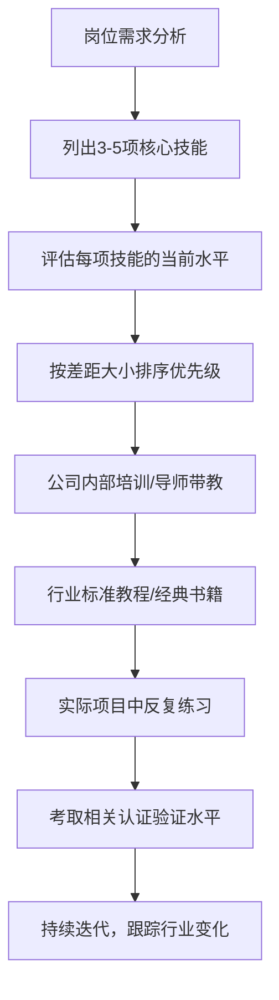
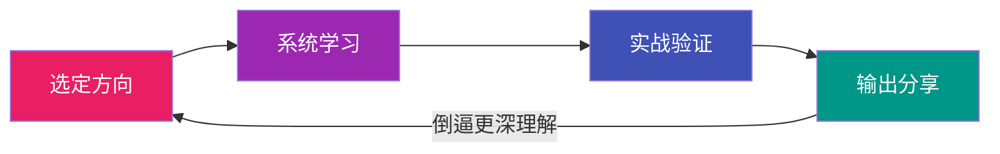
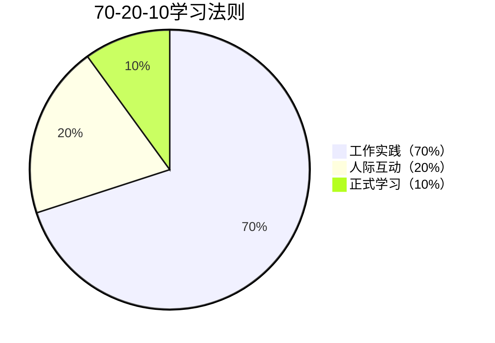
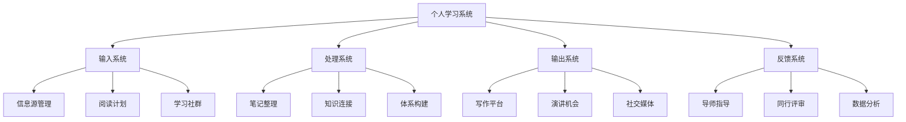
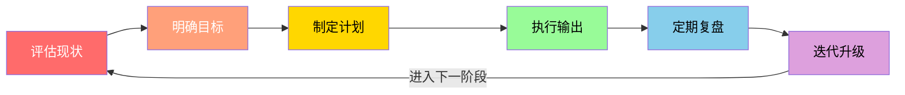

# 第四节 职业发展学习路径

## 一、引言：为什么需要阶段化学习路径

职业发展不是一条匀速上升的直线，而是一条在不同阶段需要截然不同策略的曲线。一个刚入职的新人和一个工作十年的资深人士，面对的挑战、需要的能力、以及学习的重点完全不同——用新人期的方法去应对成熟期的瓶颈，或者用资深人士的视角去指导新人期的行动，都会事倍功半。

哈佛商学院教授蒂莫西·克拉克（Timothy Clark）在《影响力阶梯》中提出，职业能力的构建遵循"技能→贡献→影响力→领导力"的递进逻辑。每个阶段的核心任务不同，学习策略也必须随之调整。麦肯锡的一项长期跟踪研究显示：那些在职业早期就建立了阶段性学习习惯的人，在15年后的收入和职位水平比随机学习者高出40%以上。

本节将根据职业发展的四个阶段——**新人期（0-3年）、成长期（3-8年）、成熟期（8-15年）、转型期（15年以上）**——设计差异化的学习路径。每个阶段都包含核心目标、关键能力矩阵、具体学习资源、可执行的行动清单，以及高频踩坑的陷阱与应对。

---

## 二、新人期：站稳脚跟（0-3年）

### 2.1 阶段特征与心理画像

新人期的本质是**从学生到职业人的身份转换**。这个阶段的核心矛盾是：你有很强的学习能力和热情，但缺乏对真实工作世界的认知。

典型心理状态包括：
- **理想落差**：大学学的理论和实际工作差距巨大，产生挫败感
- **能力焦虑**：看到前辈游刃有余，觉得自己什么都不行
- **方向迷茫**：不确定当前工作是不是自己想做的，也不知道该往哪走
- **认可渴望**：迫切希望得到领导和同事的认可，容易急于表现

这个阶段持续0-3年（有些人可能更短或更长），关键标志是：**你能在没有详细指导的情况下独立完成本职工作，并且开始对自己的职业方向有了初步判断**。

### 2.2 核心目标

| 目标 | 衡量标准 | 时间线 |
|------|---------|--------|
| 快速胜任本职工作 | 能独立完成80%的日常任务，领导不再需要逐项检查 | 6个月内 |
| 建立职业基础能力 | 形成稳定的工作习惯：时间管理、沟通表达、文档能力 | 持续培养 |
| 探索职业兴趣和方向 | 能说出自己擅长什么、喜欢什么、不适合什么 | 1-2年内 |
| 建立初步职业人脉 | 至少认识20个行业内的有效联系人（能互相帮忙的） | 2-3年内 |

### 2.3 关键能力学习路径

#### 第一优先级：硬技能（前6个月集中攻克）

**通用硬技能——职场生存的基础设施**

不管你从事什么行业，以下技能是所有工作的基础。它们不是"加分项"，而是"及格线"：

**办公三件套深度掌握**：

| 工具 | 必会功能 | 进阶功能 | 学习资源 |
|------|---------|---------|---------|
| Excel | 数据透视表、VLOOKUP/XLOOKUP、条件格式、基础图表 | 宏录制、Power Query、数据建模 | B站"ExcelHome"频道、《Excel应用大全》 |
| PPT | 母版设计、SmartArt、动画基础 | 信息图表设计、动态演示、模板搭建 | 秋叶PPT课程、《演说之禅》 |
| Word | 样式管理、目录自动生成、页眉页脚 | 长文档排版、邮件合并、修订协作 | 实际项目中反复练习即可 |

**文档能力**：很多人忽略了一个事实——职场中80%的沟通是通过文字完成的。写一封清晰的邮件、一份结构化的报告、一个逻辑自洽的方案，这些能力直接影响你的职业形象。具体要求：
- 邮件：主题明确、正文结构化（结论先行）、行动项加粗标注
- 报告：金字塔结构、数据有来源、结论有依据
- 会议纪要：记录决策、待办、责任人、截止时间

**专业硬技能——你的核心竞争力种子**

根据岗位要求，列出3-5项核心专业技能，按照以下学习路径推进：

**关键原则**：新人期的硬技能学习不要贪多，先求"专"再求"广"。把一项技能练到团队里最好，比五项技能都半瓶水要有价值得多。

#### 第二优先级：职业素养（贯穿整个新人期）

职业素养是你在职场中的"软实力操作系统"，它决定了你的硬技能能发挥多大的效能：

| 素养维度 | 具体内容 | 为什么重要 | 学习方式 |
|---------|---------|-----------|---------|
| 时间管理 | 番茄工作法、GTD、艾森豪威尔优先级矩阵、日历块管理 | 没有时间管理能力，再多的技能学习也找不到时间执行 | 《搞定》《番茄工作法图解》+ 实践21天养成习惯 |
| 沟通表达 | 邮件写作、会议发言、工作汇报、向上沟通 | 职场中"做得好"和"说得清"同样重要，很多人败在后者 | 《金字塔原理》《结构化表达》+ 每次汇报前写提纲 |
| 团队协作 | 积极参与、主动沟通、信任建立、冲突处理 | 没有人能独自完成所有工作，协作能力直接影响产出质量 | 实践 + 导师指导 + 复盘每次协作中的得失 |
| 职业形象 | 着装规范、行为举止、职业态度、守时守信 | 第一印象一旦形成很难改变，职业形象是你的"无声简历" | 观察团队中的高绩效者 + 自我调整 |
| 信息素养 | 快速搜索、筛选、整理信息的能力 | 信息过载时代，高效获取和处理信息是核心竞争力 | 学会使用高级搜索、RSS订阅、知识管理工具 |

#### 第三优先级：行业认知（6个月后开始）

当你站稳了脚跟，需要抬头看路。行业认知决定了你未来的天花板：

1. **行业全景图**：阅读3-5份行业报告（艾瑞、易观、Gartner等），了解行业规模、增长趋势、主要玩家、技术方向
2. **行业社交**：参加行业会议、沙龙、线上社群，每月至少1次。不是去"社交"，而是去"听"——听行业里的人在讨论什么问题
3. **行业KOL跟踪**：关注5-10个行业意见领袖（公众号、Twitter、LinkedIn），学习他们的思考框架而不是观点本身
4. **行业经典阅读**：每个行业都有"必读书单"，找到它并系统阅读。目标是建立行业知识的基本框架

### 2.4 新人期的行动清单

**入职第一个月**：
- [ ] 制定90天入职计划，与领导逐项对齐期望
- [ ] 找到一位职场导师（公司内部优先，外部为辅），建立每周30分钟的沟通机制
- [ ] 建立工作日志习惯——每天花10分钟记录：今天做了什么、学到了什么、遇到什么困难、明天要做什么
- [ ] 搞清楚公司的组织架构、核心业务流程、关键决策链路

**入职3-6个月**：
- [ ] 主动承担1-2个有挑战性的任务（不要只做分配给你的工作）
- [ ] 完成办公技能的系统提升（至少Excel达到高级水平）
- [ ] 开始阅读第一本行业经典书籍
- [ ] 与团队中的每位成员进行一次深入交流，了解他们的工作内容和职业路径

**入职6-12个月**：
- [ ] 建立自己的核心技能清单，评估每项技能的水平（初级/中级/高级）
- [ ] 完成第一个有完整产出的项目（从头到尾参与）
- [ ] 每月阅读1本行业/职业相关书籍
- [ ] 每季度与领导进行一次正式的职业发展对话

**入职1-3年**：
- [ ] 在1-2个专业方向上达到团队前30%的水平
- [ ] 建立初步的行业人脉网络（至少20个有效联系人）
- [ ] 开始思考：我适合走管理路线还是专业路线？
- [ ] 完成至少1次行业社群的分享或内部培训

### 2.5 新人期的常见陷阱与应对

| 陷阱 | 具体表现 | 为什么危险 | 应对方法 |
|------|---------|-----------|---------|
| 眼高手低 | 觉得基础工作"太简单"，不愿意认真做 | 基础工作是信任的来源，做不好小事的人不会被给予大事 | 把每一件小事做到极致，用结果证明自己值得更大的机会 |
| 被动等待 | 等领导安排任务，不主动寻找机会 | 职场不是学校，没有人会给你排课表 | 每周主动向领导汇报进展并询问"还有什么我能帮忙的" |
| 急于表现 | 过于急切地展示自己，反而暴露不足 | 欲速则不达，急于表现容易犯错，且给人不稳重的印象 | 先观察3个月，了解团队文化后再逐步展现能力 |
| 忽视关系 | 只关注技能提升，忽略人际关系 | 很多机会是通过人脉获得的，纯靠技术很难突破天花板 | 每周至少和1位同事共进午餐，建立真实的人际连接 |
| 频繁跳槽 | 一遇到困难就想换环境 | 错失在逆境中成长的机会，简历也不好看 | 除非遇到原则性问题，否则坚持至少2年再考虑 |
| 完美主义 | 一个任务反复修改不敢提交 | 延误进度，领导无法评估你的工作产出 | 记住"完成比完美更重要"，先交80分的版本再迭代 |

---

## 三、成长期：快速上升（3-8年）

### 3.1 阶段特征与核心矛盾

成长期是职业生涯中**投入产出比最高的阶段**。你已经有了基础能力，正站在快速上升的跑道上。这个阶段的核心矛盾是：**精力有限但机会太多——是广撒网还是深挖井？**

典型特征：
- 已经积累了基本的工作经验和专业能力，开始有"手感"
- 开始承担更多责任，可能带领小团队或负责独立模块
- 职业方向逐渐清晰，但可能在"管理"和"专业"两条路之间犹豫
- 薪资和职位开始有明显提升，但可能因为比较而产生焦虑

这个阶段的关键标志是：**你能独立负责一个完整项目或业务模块，并且开始有人向你请教专业问题**。

### 3.2 核心目标

| 目标 | 衡量标准 | 时间线 |
|------|---------|--------|
| 建立专业壁垒 | 在1-2个细分领域达到"能解决问题"的专家水平 | 3-5年 |
| 提升影响力 | 从个人贡献者转变为团队中的关键影响力节点 | 持续培养 |
| 构建个人品牌 | 在行业内有一定的知名度，被同行认可 | 3-5年 |
| 明确职业锚 | 清楚自己的长期职业方向（管理/专业/创业） | 3年内 |

### 3.3 关键能力学习路径

#### 第一优先级：专业深度（核心竞争力的根基）

成长期最重要的任务是**建立专业壁垒**。没有专业深度，你只是一个"什么都懂一点但什么都不精通"的通才，在竞争中毫无优势。

**深度学习的四步策略**：

1. **选定方向**：选择1-2个细分领域作为深耕方向。选择标准：①你有天赋或兴趣 ②市场需求大 ③竞争不是特别激烈 ④有长期增长潜力
2. **系统学习**：围绕选定方向，构建完整的知识体系。路径：行业顶级教材 → 前沿论文/报告 → 专业课程 → 与该领域的专家交流
3. **实战验证**：知识只有在实践中才能内化。主动争取与选定方向相关的项目，在真实场景中检验和深化理解
4. **输出分享**：通过写作、演讲、教学来倒逼更深的理解。能给别人讲清楚的，才是你真正掌握的

**T型人才策略的正确理解**：

很多人把T型人才简单理解为"广泛了解 + 一个专长"，但真正的T型是：
- 横向（广度）：了解与你专业相关的上下游领域，能和其他部门有效协作
- 纵向（深度）：在你的专业领域，能解决别人解决不了的问题
- 关键：深度是根基，广度是放大器。没有深度的广度只是"知道分子"

#### 第二优先级：管理与领导力（开始发展）

即使你走专业路线，管理能力也是必修课。因为：
- 专业路线的高级阶段也需要协调资源、推动项目
- 管理能力是职场晋升的通用货币
- 不具备管理能力的人很难突破中层天花板

**管理能力学习路径**：

| 阶段 | 学习内容 | 实践方式 | 推荐资源 |
|------|---------|---------|---------|
| 基础管理 | 目标设定、任务分配、进度跟踪、绩效管理 | 带1-2个新人或小型项目 | 《管理的实践》德鲁克、《高效能人士的七个习惯》 |
| 团队管理 | 团队激励、冲突处理、人才识别、文化建设 | 负责一个5-10人的团队 | 《团队协作的五大障碍》《驱动力》 |
| 向上管理 | 理解领导需求、主动汇报、管理预期、争取资源 | 每周主动汇报、学会"翻译"领导的模糊指令 | 《向上管理》《非暴力沟通》 |
| 跨部门协作 | 利益协调、冲突处理、项目推动、政治敏感度 | 主导跨部门项目 | 实践 + 复盘 + 向有经验的前辈请教 |

**领导力发展路径**（管理≠领导力，领导力是更高阶的能力）：
1. **自我领导**：情绪管理、自律、持续学习——领导不了自己的人无法领导别人
2. **影响力**：说服力、演讲能力、个人品牌——让别人愿意跟随你而不是被迫服从
3. **战略思维**：商业敏感度、全局视野、长期规划——从执行者升级为决策参与者

#### 第三优先级：商业思维（拉开差距的杠杆）

专业能力决定你的下限，商业思维决定你的上限。很多技术专家在成长期之后停滞不前，根本原因是缺乏商业思维：

**商业思维的四个维度**：

1. **商业模式理解**：你的公司如何创造价值？收入从哪里来？成本结构是什么？利润的关键驱动因素是什么？——这些问题的答案决定了你在公司中的战略位置
2. **财务基础**：不需要成为会计师，但要能读懂三张表（资产负债表、利润表、现金流量表），理解ROI、成本效益分析、盈亏平衡点等核心概念
3. **客户思维**：你做的每一件事最终都是为客户创造价值。理解用户需求、市场趋势、竞争格局，能让你的工作产出更贴近商业价值
4. **数据思维**：用数据说话，用数据决策。学会基本的数据分析方法，能从数据中发现问题和机会

推荐学习路径：《商业模式新生代》→《从零到一》→《商业的本质》杰克·韦尔奇 → 选修一门在线MBA核心课程（如Coursera上的商业基础课程）

### 3.4 成长期的行动清单

**每年必做**：
- [ ] 确定1-2个深耕的专业方向，制定年度学习计划
- [ ] 完成至少1个有影响力的核心项目（能写进简历的那种）
- [ ] 在行业会议、社区或公司内部进行至少1次专业分享
- [ ] 阅读至少12本专业/商业类书籍（平均每月1本）

**持续建设**：
- [ ] 建立个人知识管理系统（推荐Obsidian或Notion），把学到的东西结构化沉淀
- [ ] 维护个人作品集/项目档案，定期更新
- [ ] 建立行业内的人脉网络（目标：50个有效联系人）
- [ ] 开始建立个人品牌：写专业文章、做社群分享、参与开源项目

**关键决策**：
- [ ] 在3年内明确：走管理路线还是专业路线？（两者的学习路径差异很大）
- [ ] 评估是否需要读MBA/EMBA（取决于你的职业目标和经济状况）
- [ ] 主动争取管理机会（带项目、带新人），哪怕是非正式的

---

## 四、成熟期：建立壁垒（8-15年）

### 4.1 阶段特征与核心挑战

成熟期是职业生涯的**黄金收割期**，但也是**最容易陷入舒适区的阶段**。你已经在行业中站稳了脚跟，有了地位和收入，但同时也面临着职业天花板、中年危机和"被年轻人追赶"的压力。

典型特征：
- 在行业中已有一定地位和影响力，开始有人主动来"请教"
- 通常已进入管理岗位或成为高级专家
- 面临"继续深耕"和"拓展新领域"的两难选择
- 家庭责任增加，可用于学习的时间减少
- 开始感受到技术/行业变化带来的冲击

这个阶段的关键标志是：**你的名字在行业内有一定的辨识度，别人提到某个领域会想到你**。

### 4.2 核心目标

| 目标 | 衡量标准 | 时间线 |
|------|---------|--------|
| 成为行业专家 | 在领域内有话语权，被邀请参与行业标准制定或评审 | 持续建设 |
| 实现管理跃迁 | 从管理团队到管理组织/业务，掌握P&L思维 | 3-5年 |
| 建立长期护城河 | 积累不可替代的经验、人脉和品牌资产 | 持续加固 |
| 规划第二曲线 | 在主业稳定的基础上，开始探索新的增长可能 | 5年内启动 |

### 4.3 关键能力学习路径

#### 第一优先级：战略思维与商业洞察

成熟期最重要的能力跃迁是**从执行思维转向战略思维**。你不再只是完成任务，而是要判断"该做什么"和"不该做什么"。

**战略分析工具箱**：

| 工具 | 用途 | 适用场景 |
|------|------|---------|
| 波特五力模型 | 分析行业竞争格局 | 评估行业吸引力、制定竞争策略 |
| PEST分析 | 宏观环境分析 | 判断政策、经济、社会、技术趋势对业务的影响 |
| SWOT分析 | 内外部综合评估 | 制定战略方向、资源分配决策 |
| 商业模式画布 | 系统化描述商业模式 | 创新业务设计、商业模式转型 |
| 蓝海战略 | 发现无竞争市场空间 | 寻找新的增长点、差异化定位 |

**组织管理能力**：
- 组织设计：如何搭建高效的组织结构？如何设计合理的汇报关系和决策流程？
- 文化建设：如何塑造团队价值观和行为规范？如何让文化成为竞争力？
- 人才发展：如何识别高潜人才？如何设计人才梯队？如何留住核心人才？

推荐资源：《竞争战略》迈克尔·波特、《好战略，坏战略》理查德·鲁梅尔特、《第五项修炼》彼得·圣吉、《重新定义公司》谷歌前CEO施密特

#### 第二优先级：影响力与资源整合

成熟期的影响力不再局限于团队内部，而是扩展到**组织层面和行业层面**：

**高层沟通能力**：
- 董事会/高管汇报：学会用商业语言（而非技术语言）沟通，聚焦ROI和战略价值
- 投资人沟通：如果你在创业公司，需要理解投资人的思维方式和关注点
- 媒体应对：当你的行业影响力足够大时，会面临媒体采访，需要基本的媒体素养

**资源整合能力**：
- 跨组织合作：与合作伙伴、供应商、客户建立战略关系
- 行业联盟：参与或发起行业联盟，推动行业标准和最佳实践
- 战略伙伴关系：识别和建立互利共赢的战略合作关系

**个人IP打造**：
- 出书：将你的专业经验系统化为一本书，这是建立长期影响力的最佳方式之一
- 演讲：在行业峰会、论坛上发表演讲，扩大行业影响力
- 行业顾问：为其他公司或机构提供专业咨询，这既是收入来源也是影响力渠道

#### 第三优先级：传承与赋能

成熟期的一个重要转变是**从"自己做到极致"转向"帮助别人做到极致"**：

**教练与辅导**：
- 学习教练技术（ICF认证课程是行业标准），掌握GROW模型等核心工具
- 培养2-3位接班人或核心骨干，给他们足够的挑战和空间
- 建立"导师-学员"关系，系统性地传递经验

**知识管理**：
- 将隐性经验转化为显性知识：写方法论文档、建立案例库、制作培训材料
- 建立个人知识体系：用系统化的方式组织你十年来积累的知识和经验
- 推动组织知识管理：让个人知识成为组织资产

**组织影响力**：
- 推动组织变革：识别组织中的系统性问题，推动流程优化和文化变革
- 培养接班梯队：确保你的离开不会导致业务断档
- 建立制度和流程：让你的成功经验能被复制和传承

### 4.4 成熟期的行动清单

- [ ] 确定自己的核心竞争壁垒（是什么让你不可替代？），并制定加固计划
- [ ] 在行业内建立系统性的个人品牌（出书/演讲/顾问三选一启动）
- [ ] 培养至少2-3位接班人或核心骨干，给他们实战锻炼的机会
- [ ] 评估是否需要MBA/EMBA等系统学习（不是为了学历，而是为了补齐商业思维的短板）
- [ ] 建立跨行业的人脉网络（不要只在自己的行业圈子里）
- [ ] 每年花1-2周时间做"战略反思"：我的职业方向对吗？需要调整吗？
- [ ] 开始思考第二曲线：如果主业遇到天花板，我还能做什么？
- [ ] 平衡工作与家庭，关注身心健康——这个阶段最容易忽视健康

---

## 五、转型期：开启新篇（15年以上）

### 5.1 阶段特征与深层矛盾

转型期是职业生涯中最**需要智慧而不仅仅是能力**的阶段。你已经有了丰富的经验，但这些经验既是资产也是枷锁——它让你在熟悉的领域如鱼得水，但也可能让你对新事物产生抗拒。

典型特征：
- 已有丰富的职业经验和人生阅历，行业内的"老江湖"
- 可能面临职业倦怠——每天做的事情已经缺乏新鲜感和挑战
- 开始思考职业生涯的终极意义——"我这一辈子到底要做什么？"
- 身体开始发出信号，精力不再像年轻时那样充沛
- 面临"守成"（稳稳干到退休）和"创新"（开启新事业）的抉择

### 5.2 核心目标

| 目标 | 衡量标准 | 时间线 |
|------|---------|--------|
| 实现经验传承 | 你的知识和经验已经系统化地传递给了下一代 | 持续建设 |
| 探索第二曲线 | 找到并启动一个新的职业方向或事业 | 2-3年内启动 |
| 追求意义感 | 从"追求成就"转向"追求意义"，找到工作之外的人生价值 | 持续探索 |
| 规划退休生活 | 建立清晰的退休规划，包括财务、健康、社交、兴趣 | 5年内完成 |

### 5.3 关键能力学习路径

#### 第一优先级：经验传承与知识管理

你积累了15年以上的行业经验和专业知识，如果这些知识随着你的退休而消失，那将是巨大的浪费。

**系统化整理的三步法**：

1. **知识盘点**：列出你在职业生涯中积累的所有核心知识、方法论、案例和教训。按照"道法术器"的框架整理：
   - 道（底层原理）：你对行业和专业的根本理解
   - 法（方法论）：你总结的做事框架和流程
   - 术（技巧）：你在实战中积累的具体技巧和窍门
   - 器（工具）：你常用的工具、模板和资源

2. **知识显性化**：将隐性知识转化为可传播的形式：
   - 写作：出版专业书籍、技术博客、行业白皮书
   - 课程：录制在线课程、开展企业内训
   - 案例库：将你的经典案例整理成可教学的案例集
   - 方法论文档：将你的工作方法系统化为可执行的SOP

3. **知识传递**：通过多种渠道将知识传递给后辈：
   - 担任行业导师或企业教练
   - 在大学或培训机构担任客座讲师
   - 参与行业协会的知识分享活动
   - 建立个人的"知识品牌"

#### 第二优先级：第二曲线探索

查尔斯·汉迪在《第二曲线》中提出：**在第一曲线到达巅峰之前，就要开始培育第二曲线**。等到第一曲线开始下降才行动，已经太晚了。

**第二曲线的常见方向**：

| 方向 | 适合的人 | 启动方式 | 风险等级 |
|------|---------|---------|---------|
| 咨询顾问 | 有深厚行业经验、善于总结和沟通 | 兼职接项目 → 建立口碑 → 全职转型 | 低 |
| 天使投资 | 有行业判断力、有一定资金积累 | 先用小资金试水 → 学习投资方法论 → 逐步加大 | 中 |
| 创业 | 有商业敏感度、能承受不确定性 | 从副业开始 → 验证商业模式 → 时机成熟后全力投入 | 高 |
| 教育培训 | 有教学热情、善于表达和组织 | 开发课程 → 平台试讲 → 建立个人品牌 → 独立运营 | 低 |
| 内容创作 | 有独特视角、善于表达 | 写公众号/开播客 → 建立读者群 → 多元变现 | 低 |

**第二曲线的启动策略**：
- 不要辞职去创业——先用业余时间验证想法
- 从"小实验"开始——花最少的钱和时间验证市场是否买单
- 利用你已有的资源——人脉、经验、品牌都是你的杠杆
- 给自己设一个deadline——"如果1年内没有明显进展，就放弃这个方向"

#### 第三优先级：人生意义与自我实现

这个阶段的深层需求是**找到超越工作的人生意义**。很多高管在退休后陷入抑郁，就是因为他们的身份认同完全建立在工作之上。

**探索意义感的路径**：
1. **哲学阅读**：《活出生命的意义》维克多·弗兰克尔、《当下的力量》埃克哈特·托利、《人生的智慧》叔本华——帮助你建立对人生意义的深层理解
2. **社会贡献**：参与公益组织、担任青年导师、做志愿者——利他行为是幸福感的重要来源
3. **兴趣培养**：培养2-3个与工作完全无关的爱好（摄影、书法、登山、烹饪等），让你的身份认同不只建立在"职业"这一个维度上
4. **身心健康**：建立规律的运动习惯（每周3次、每次30分钟以上），关注心理健康，必要时寻求专业心理咨询

### 5.4 转型期的行动清单

- [ ] 完成个人知识体系的系统化整理（至少覆盖核心的3-5个领域）
- [ ] 确定第二曲线方向并开始小规模实验
- [ ] 建立退休后的财务规划（至少覆盖未来20年的生活开支）
- [ ] 培养2-3个与工作无关的兴趣爱好
- [ ] 参与行业导师计划，指导年轻从业者
- [ ] 关注身心健康，建立规律的运动和养生习惯
- [ ] 与家人深入沟通你的职业规划和人生愿景
- [ ] 写一封给10年后自己的信，明确你希望成为什么样的人

---

## 六、通用学习方法论（适用于所有阶段）

无论你处于职业发展的哪个阶段，以下学习方法论都适用。但要注意：**方法本身不值钱，持续执行才值钱**。

### 6.1 70-20-10学习法则

这是被全球500强企业广泛验证的学习法则（来源于创新领导力中心CCL的研究）：

- **70%来自工作实践**：承担挑战性任务、参与跨职能项目、在真实场景中解决问题。这是最有效但最被忽视的学习方式——很多人把时间花在上课和读书上，却忽略了在工作中有意识地学习
- **20%来自人际互动**：导师指导、同行交流、反馈学习。找到比你厉害的人，向他们学习。一个好的导师能让你少走3-5年弯路
- **10%来自正式学习**：课程、书籍、培训。这是最容易量化的，但效果也最容易被高估

**实操建议**：
- 每个月评估一次：我的学习时间是否遵循了70-20-10的比例？
- 如果你90%的时间在看书上课，只有10%在实践和交流，需要大幅调整
- 最好的学习是"在做中学"——接一个超出你能力范围的项目，比看10本书更有用

### 6.2 费曼学习法——检验你是否真正理解

诺贝尔物理学奖得主理查德·费曼的学习方法，核心思想是：**如果你不能用简单的语言解释一个概念，说明你并没有真正理解它**。

**四步执行法**：

1. **选择概念**：明确你要学习和理解的具体概念或知识点
2. **教授他人**：假设你要向一个完全不懂这个领域的人（比如你的奶奶）解释这个概念。用最简单的语言，不要使用专业术语
3. **发现盲区**：在解释的过程中，你一定会发现有些地方说不清楚——这就是你的知识盲区。回到原始材料，重新学习这些部分
4. **简化类比**：用生活中的类比和比喻来简化复杂概念，直到你能流畅地、不假思索地解释清楚

**进阶用法**：
- 写博客或公众号文章：把学到的东西写出来，这是一种"异步费曼"
- 在团队内部做分享：5-10分钟的小分享，逼自己把复杂事情讲简单
- 建立"概念解释库"：把每个核心概念都写一段通俗的解释，积累起来就是你的知识体系

### 6.3 刻意练习——从"会"到"精通"的唯一路径

安德斯·艾利克森在《刻意练习》中指出：**1万小时定律是错误的，真正有效的是刻意练习**。重复1万小时的低水平练习不会让你成为专家，只有有目的、有反馈的高质量练习才行。

**刻意练习的四个要素**：

| 要素 | 说明 | 常见错误 |
|------|------|---------|
| 明确目标 | 每次练习都有具体的改进目标（如"这次汇报的重点是控制时间在15分钟内"） | 目标模糊（"我要提升沟通能力"） |
| 专注投入 | 练习时全神贯注，消除干扰，进入心流状态 | 一边练习一边看手机 |
| 即时反馈 | 每次练习后立即获得反馈（导师点评、视频回放、数据指标） | 练完就结束，不做复盘 |
| 挑战边界 | 练习内容略高于当前水平，在"舒适区"边缘不断突破 | 只做已经会的事情 |

**如何在职场中应用刻意练习**：
- 每次做完一个项目，花30分钟做结构化复盘：哪些做得好？哪些可以改进？下次怎么做？
- 录制自己的演讲或汇报视频，回放分析肢体语言、逻辑结构、表达清晰度
- 找到你最薄弱的1-2个技能，集中2-3个月进行专项突破

### 6.4 输出驱动学习——用输出倒逼输入深度

学习的最高境界不是"输入了多少"，而是"输出了多少"。输出是检验学习效果的最佳方式，也是深化理解的最佳手段。

**四种输出方式及其效果**：

| 输出方式 | 适合阶段 | 效果 | 执行建议 |
|---------|---------|------|---------|
| 写作 | 所有阶段 | ★★★★★ | 每周写1篇工作反思或专业文章，哪怕只有500字 |
| 演讲 | 成长期起 | ★★★★☆ | 每季度进行1次分享（团队内部或行业社群） |
| 教学 | 成熟期起 | ★★★★★ | 指导新人或做内部培训，"教"是最好的"学" |
| 实践 | 所有阶段 | ★★★★★ | 将学到的知识立即应用到工作中，哪怕是很小的应用 |

**写作的具体方法**：
- **工作日志**：每天花10分钟记录"今天做了什么、学到什么、遇到什么问题"
- **项目复盘**：每个项目结束后写一篇结构化的复盘文章
- **专业文章**：把你在某个领域的系统思考写成文章发布到知乎/公众号/LinkedIn
- **读书笔记**：每读完一本书，写一篇500-1000字的精华提炼

---

## 七、学习资源的获取与管理

### 7.1 构建个人学习系统

学习不是随机行为，而是一个系统工程。你需要建立四个子系统：

**输入系统——控制信息质量**：
- 精选5-10个高质量信息源（RSS订阅），不要被信息洪流淹没
- 建立"阅读清单"制度：每月初规划本月要读的内容，按优先级排列
- 加入1-2个高质量学习社群（付费社群通常质量更高）

**处理系统——把信息变成知识**：
- 使用双链笔记工具（Obsidian或Roam Research）整理和连接知识
- 建立自己的知识分类体系（按照"领域→主题→知识点"的层级）
- 定期回顾和更新笔记（每月花半天时间做知识整理）

**输出系统——让知识产生价值**：
- 选择1-2个主要输出平台（公众号、知乎、LinkedIn、技术博客）
- 建立固定的输出节奏（如每周1篇文章、每月1次分享）
- 把输出当作学习的一部分，而不是额外的负担

**反馈系统——持续校准方向**：
- 找1-2位职业导师，定期交流你的学习进展和困惑
- 建立同行评审机制：让同事或朋友给你写的方案/文章提意见
- 用数据追踪你的学习效果（如文章阅读量、项目成功率、技能评估分数）

### 7.2 学习时间的保障——最大的挑战不是"学什么"而是"什么时候学"

学习时间是职业发展中最稀缺的资源。以下策略经过实践验证：

**日常学习时间**：
- **晨间学习**（推荐指数★★★★★）：早起30-60分钟用于深度学习。大脑在清晨最清醒，适合学习新知识或做创造性思考
- **通勤学习**（推荐指数★★★★☆）：利用通勤时间听播客或音频课程。注意：通勤学习适合"信息输入"类内容，不适合需要深度思考的内容
- **碎片时间**（推荐指数★★★☆☆）：利用碎片时间刷行业资讯或回复社群消息。注意不要让碎片学习占用整块时间

**深度学习时间**：
- **每周半日学习**：每周留出半天（如周五下午）进行深度学习或写作
- **每月学习日**：每月留出一天进行系统性学习（参加培训、读完一本书、做一个项目）
- **年度学习周**：每年安排1-2周参加线下培训、行业会议或集中学习

**保障学习时间的实操技巧**：
1. **在日历上锁定学习时间**：把它当作和CEO的会议一样不可取消
2. **建立学习的触发机制**：如"每天到公司后第一件事是学习30分钟"
3. **减少无效社交和信息消费**：刷短视频和社交媒体的时间就是被偷走的学习时间
4. **找到学习伙伴**：和同事或朋友约定一起学习，互相监督

---

## 八、各阶段学习重点速查表

| 维度 | 新人期（0-3年） | 成长期（3-8年） | 成熟期（8-15年） | 转型期（15年+） |
|------|---------------|----------------|-----------------|----------------|
| **核心任务** | 站稳脚跟 | 建立专业壁垒 | 建立行业影响力 | 传承与转型 |
| **学习重点** | 硬技能+职业素养 | 专业深度+管理能力 | 战略思维+资源整合 | 知识传承+第二曲线 |
| **输出方式** | 工作日志 | 专业文章+行业分享 | 出书+演讲+顾问 | 教学+写作+投资 |
| **人脉建设** | 公司内部+导师 | 行业社群+同行 | 跨行业+高层圈 | 传承网络+新领域 |
| **风险** | 频繁跳槽/眼高手低 | 方向摇摆/广而不精 | 舒适区/拒绝变化 | 职业倦怠/身份固化 |
| **关键指标** | 独立完成本职工作 | 成为团队专家 | 行业知名度 | 第二曲线启动 |

---

## 九、常见误区与纠正

**误区1："学习=上课/读书"**
- 真相：70%的学习来自工作实践。如果你每天工作8小时却觉得自己"没时间学习"，说明你没有在工作中有意识地学习
- 纠正：把每一次工作任务都当作学习机会，做完之后花10分钟复盘

**误区2："越忙越没有时间学习"**
- 真相：越忙越需要学习。忙而无学，你会陷入"低水平重复"的陷阱——用同样的方法做同样的事情，却期待不同的结果
- 纠正：哪怕每天只有15分钟，也比0分钟强。积少成多，一年就是90小时

**误区3："学了就等于会了"**
- 真相：知识只有在实践中应用了才是你的。看了100本书但一本都没用到，等于没看
- 纠正：每学到一个新知识，立刻想"我能在哪里用到它？"，然后去用

**误区4："只学自己专业领域的东西"**
- 真相：创新往往来自跨领域的知识碰撞。只关注自己的专业会让你视野狭窄
- 纠正：花20%的时间学习与专业不直接相关但可能有启发的领域（如心理学、设计思维、数据科学）

**误区5："等到需要的时候再学"**
- 真相：等到需要的时候再学，你已经落后了。学习有滞后性——今天学的知识要在6-12个月后才能产生价值
- 纠正：提前1-2年布局你未来需要的能力

**误区6："跟着热门学"**
- 真相：热门意味着竞争激烈，等你学会的时候可能已经不热门了
- 纠正：根据自己的优势和市场需求选择学习方向，而不是盲目追热点

---

## 十、总结：终身学习的行动框架

职业发展是一场终身学习的旅程。不论你现在处于哪个阶段，以下是通用的行动框架：

1. **评估现状**：诚实地评估自己当前的能力水平和所处的职业阶段
2. **明确目标**：确定未来1-3年的职业目标，以及支撑这个目标需要的能力
3. **制定计划**：把大目标拆解为季度和月度的学习计划
4. **执行输出**：按照70-20-10法则分配学习时间，坚持输出
5. **定期复盘**：每月评估学习效果，每季度调整学习方向
6. **迭代升级**：每2-3年重新评估自己的职业定位和学习策略

记住：**最好的学习时间是十年前，其次是现在**。不要等到"准备好了"才开始行动——你永远不会完全准备好。从今天开始，选择上面的一个行动项，立刻执行。

在下一节中，我们将探讨职业发展中最容易犯的10个误区，帮助你避开认知陷阱，少走弯路。
