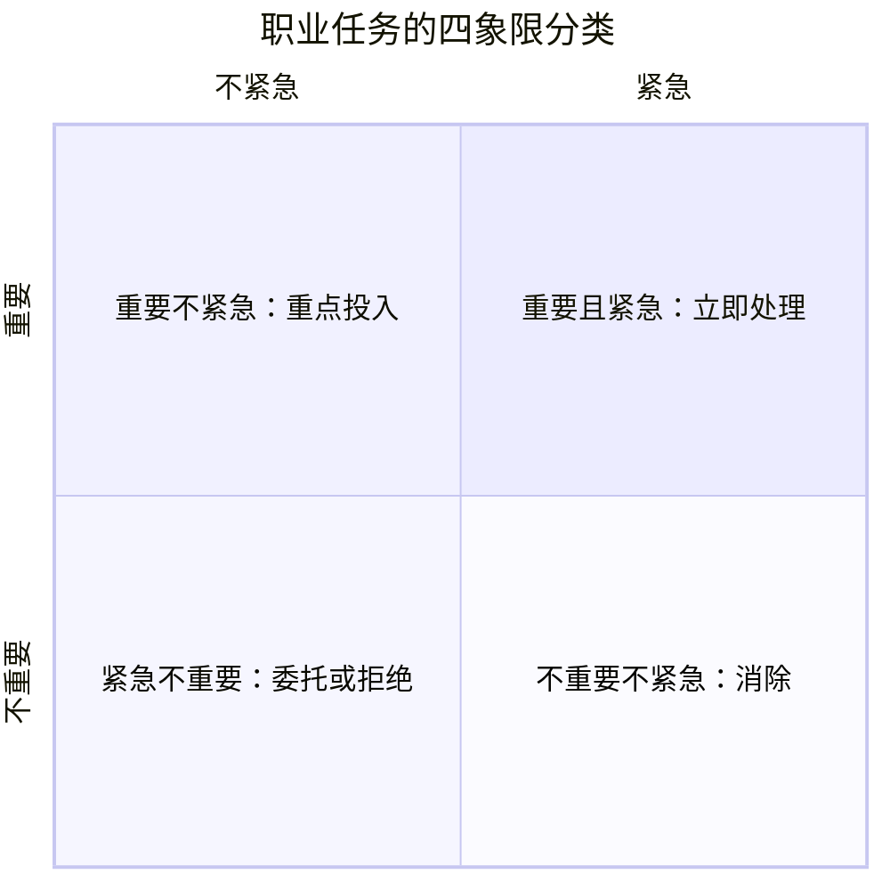
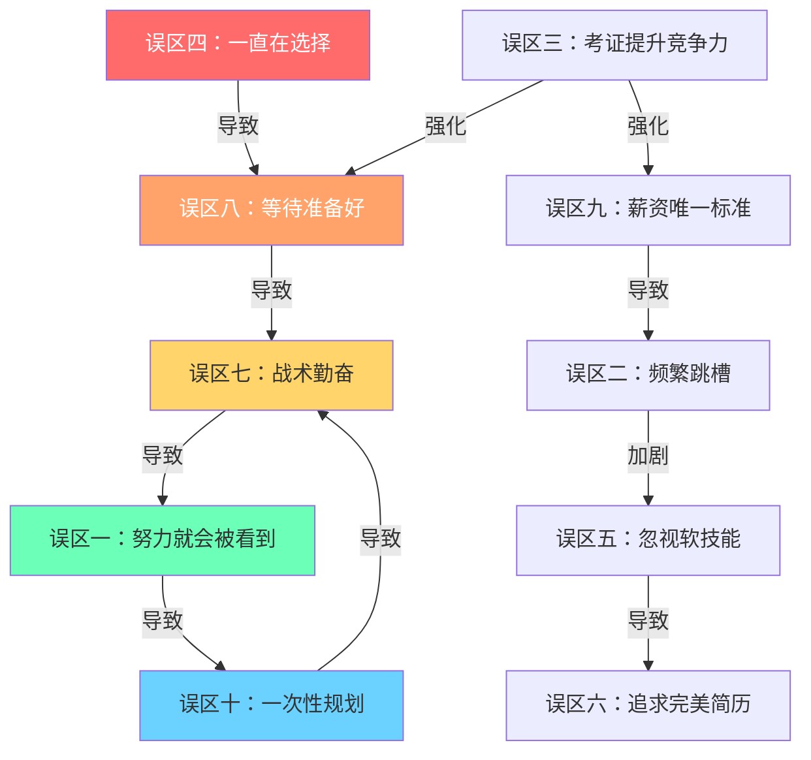

# 第五节 职业发展常见误区

## 一、引言：认知偏差比能力不足更可怕

在职业发展的道路上，比能力不足更可怕的是**认知偏差**。心理学家丹尼尔·卡尼曼在《思考，快与慢》中指出：人类大脑存在系统性的认知偏差，这些偏差不是随机错误，而是可预测的思维模式。在职业决策中，这些偏差会导致我们做出看似合理但实际有害的选择。

### 1.1 为什么职业误区如此普遍

职业误区之所以根深蒂固，有三个根本原因：

**信息不对称**：职场是一个信息高度不对称的环境。你看到的是同事的光鲜晋升，看不到的是他背后的努力、运气和资源。你听到的是"跳槽翻倍"的成功故事，听不到的是跳槽失败后降薪求职的沉默大多数。社交媒体加剧了这种不对称——幸存者偏差让我们只看到成功案例，误以为那就是常态。

**反馈延迟**：职业决策的后果往往需要数年才能显现。今天选择频繁跳槽，三年后才会发现能力积累不足；今天忽略软技能，五年后才会遇到晋升天花板。这种延迟反馈让人难以及时纠正错误。

**社会比较陷阱**：人类天生会与他人比较。在职业发展中，向上比较产生焦虑（"他都升总监了我还是P6"），向下比较产生虚假安全感（"至少我比XXX强"）。两种比较都会扭曲对自己真实处境的判断。

### 1.2 误区的代价矩阵

不同误区在不同职业阶段的代价差异巨大：

| 误区类型 | 职业早期（0-3年） | 职业中期（3-8年） | 职业后期（8年+） |
|---------|----------------|----------------|----------------|
| 认知类误区（如"努力就会被看到"） | 轻微——试错成本低 | 中等——影响晋升节奏 | 严重——错过关键窗口 |
| 行动类误区（如"等准备好了再行动"） | 中等——错失早期机会 | 严重——竞争力下降 | 致命——几乎无法逆转 |
| 选择类误区（如"薪资唯一标准"） | 轻微——可快速调整 | 中等——路径依赖形成 | 严重——转换成本极高 |
| 技能类误区（如"只看硬技能"） | 不明显 | 明显——天花板出现 | 严重——被后辈超越 |

### 1.3 自我诊断：你是否正在陷入误区

在阅读下面的10个误区之前，先做一个快速自测。对以下每个陈述，诚实地回答"是"或"否"：

1. 我认为只要把工作做好，领导自然会看到我的价值
2. 我觉得在当前公司涨薪太慢，跳槽是唯一的出路
3. 我正在或计划考一个证书来提升竞争力
4. 我经常花很长时间比较不同选择，迟迟无法做出决定
5. 我觉得只要技术/专业能力够强，其他都不重要
6. 我花了很多时间优化简历，但实际项目经验不多
7. 我每天都很忙，但说不清楚这周最重要的成果是什么
8. 我想做某件事但总觉得还没准备好
9. 选择工作时我最看重的就是薪资数字
10. 我上次认真思考职业规划是很久以前的事了

如果你回答了3个以上的"是"，说明你可能正在陷入某些误区。继续阅读，找到具体的应对方法。

***

## 二、十大常见误区深度解析

### 误区一：只要努力工作，领导自然会看到

**误区描述**：认为只要埋头苦干，做出好成绩，升职加薪自然会来。

**为什么会陷入**：从小接受的教育告诉我们"是金子总会发光"，这种朴素的信念让人觉得主动展示自己是"爱表现"或"邀功"。中国文化中"谦虚是美德"的价值观进一步强化了这种倾向——主动展示成就被视为"出风头"。

**深层机制**：这个误区背后是一个错误的因果假设——它把"被看到"当成了努力的自然结果，而实际上"被看到"是一个需要独立经营的能力。领导每天要管理多个下属、处理大量信息，他们没有义务也没有精力主动发现每个人的价值。哈佛商学院的研究表明，在组织中，**可见性（visibility）**和**能力（competence）**是两个独立的维度，两者都需要投入。

**误区的危害**：
- 你的成绩被他人"截胡"——在大型组织中，信息传递链条很长，你的成果可能被直属领导汇报时归功于团队或他自己
- 领导对你的价值认知不足——升职决策往往基于领导的"印象分"，而非客观评估
- 同样努力但善于展示的同事先获得晋升
- 长期下来产生怨气和职业倦怠——"我这么努力为什么没有回报"的挫败感会侵蚀工作热情

**真实案例**：小王和小李同年入职同一家互联网公司。小王技术扎实，默默完成了多个核心模块的开发；小李技术一般，但每周主动给领导发工作周报，在技术分享会上做演示，在跨部门会议中积极发言。两年后，小李被评为优秀员工并获得晋升，小王依然是普通员工。小王感到极度不公平，但复盘后发现：领导对小李的工作内容如数家珍，对小王的贡献却知之甚少。

**正确的做法**：

**建立汇报节奏**：每周花15分钟写一份简洁的工作周报，包含三个部分：本周完成的关键事项（2-3条）、遇到的问题和解决方案、下周计划。发送给直属领导，抄送相关同事。这不是"邀功"，而是专业的信息同步。

**量化你的贡献**：将成绩转化为可衡量的指标。不要说"优化了系统性能"，要说"将接口响应时间从800ms降低到200ms，QPS提升了3倍"。量化数据是最有说服力的展示方式。

**关键时刻主动站出来**：在重要项目启动时主动请缨，在危机时刻主动承担责任。关键时刻的一次表现，胜过平时100次默默努力。

**建立跨部门影响力**：不要只在自己团队内活动。主动参与跨部门项目，在公司级技术分享中亮相，让更多人知道你的专业能力。

**向上管理的技巧**：了解领导的关注点和压力来源，将你的工作成果与领导的目标对齐。领导关心什么，你就重点汇报什么。

**红线提醒**：展示≠吹嘘。展示是基于事实的价值呈现，吹嘘是夸大其词的自我包装。前者建立信任，后者破坏信任。如果你的展示中没有数据支撑，那就可能是吹嘘。

***

### 误区二：频繁跳槽能快速涨薪

**误区描述**：认为每1-2年跳一次槽，薪资就能快速上涨，比在一家公司慢慢涨要快得多。

**为什么会陷入**：短期来看确实如此——跳槽的薪资涨幅（20-30%）通常远高于内部调薪（5-15%）。社交媒体上"跳槽翻倍"的案例更是强化了这种认知。智联招聘的数据显示，2023年跳槽者的平均薪资涨幅为23.6%，而内部调薪平均仅为8.2%。

**数据背后的真相**：这个数据存在严重的**选择偏差**。愿意跳槽的人往往是已经有更好offer的人，而跳槽失败（降薪或平薪）的案例很少被分享。更重要的是，薪资涨幅的比较维度被简化了——它只计算了现金薪资，忽略了股权、期权、长期激励等非现金收入。在很多公司，股权激励在入职2-3年后才开始产生显著收益。

**误区的危害**：
- 简历上频繁跳槽的记录会被HR视为"不稳定"的信号——很多公司有明确的"跳槽频率红线"（如3年内超过2次）
- 每次跳槽都意味着重新适应：新的团队、新的代码/业务体系、新的上下级关系，实际的能力积累被中断
- 缺乏深度积累，专业能力停留在"能用"而非"精通"——你可能什么都做过，但什么都不精
- 中年以后，频繁跳槽的负面影响会指数级放大——35岁以上频繁跳槽的人，面试通过率显著低于同龄的稳定型候选人
- 错失在一家公司获得核心资源和深层机会的可能——很多关键岗位和项目只给"自己人"

**正确的做法**：

**跳槽前的三问自检**：
1. 这次跳槽是否实现了"升级"（职位、平台、方向至少一项提升）？
2. 我是否已经充分利用了当前平台的资源（项目经验、人脉、晋升机会）？
3. 新机会是否符合我的长期职业规划？

**建议的跳槽节奏**：
- 职业早期（0-3年）：可以2-3年跳一次，重点是快速积累多元经验
- 职业中期（3-8年）：3-5年跳一次，重点是深耕某个领域建立专业壁垒
- 职业后期（8年+）：5年以上跳一次或不跳，重点是积累行业影响力和管理经验

**薪资增长的长期主义**：在好公司深耕5年，获得的综合回报（薪资+股权+能力+人脉+行业影响力）往往超过频繁跳槽。假设两种路径的10年总收益：

| 路径 | 前5年薪资总和 | 后5年薪资总和 | 10年总收益 | 附加价值 |
|-----|-------------|-------------|----------|---------|
| 频繁跳槽（每2年一次） | 较高（涨薪快） | 中等（天花板出现） | 中等 | 人脉广但浅，能力宽但不深 |
| 深耕一家（好公司） | 中等（涨薪慢） | 较高（晋升+股权） | 较高 | 人脉深且厚，能力专且精 |

**什么情况下该跳**：公司业务持续下滑、直属领导长期PUA、薪资严重低于市场价（低于30%以上）、有更好的职业发展方向出现。这些情况下，跳槽是理性选择而非冲动行为。

***

### 误区三：考证就能提升职业竞争力

**误区描述**：认为考取更多证书就能显著提升职业竞争力和薪资水平。

**为什么会陷入**：学生思维的延续——在学校里，考试成绩是衡量能力的主要标准。进入职场后，这种思维被延续为"证书=能力"。加上培训机构的营销话术（"考过XX证书，薪资翻倍"），让人产生不切实际的期望。

**证书的真实价值评估**：

| 证书类型 | 实际价值 | 适用场景 | 典型代表 |
|---------|---------|---------|---------|
| 准入类证书 | 必须考，没有就无法从业 | 法律、医疗、会计、建筑 | 律师资格证、医师资格证、CPA |
| 高含金量认证 | 显著提升竞争力 | 特定行业高度认可 | CFA、PMP、AWS架构师 |
| 一般技能证书 | 锦上添花 | 已有核心竞争力时作为补充 | 各类培训结业证书 |
| 低含金量证书 | 几乎无价值 | 浪费时间和金钱 | 各类"花钱就能过"的认证 |

**误区的危害**：
- 花费大量时间和金钱考取与职业目标不匹配的证书——考了3个证书发现没有一个对工作有帮助
- 陷入"学习型拖延"——用备考来回避真正的职业挑战，因为学习比面对职场困难"舒适"得多
- 证书过多反而让人觉得你缺乏方向感——面试官看到简历上列了10个证书，第一反应是"这个人到底想做什么"
- 忽视了真正能提升竞争力的实战经验和软技能

**正确的做法**：

**证书选择决策树**：
1. 这个证书是我所在行业的准入门槛吗？→ 必须考
2. 这个证书在目标岗位的招聘JD中被明确要求或优先考虑吗？→ 强烈建议考
3. 这个证书的学习过程能帮我系统掌握某个重要领域的知识吗？→ 值得考
4. 以上都不是，只是觉得"多一个证总没坏处"？→ 不要考

**将证书转化为竞争力的方法**：
- 学习过程中积累的知识，立即应用到实际工作中
- 将证书相关的项目经验写入简历，而非仅列证书名称
- 在面试中展示证书背后的**理解深度**，而非仅说"我考过了"
- 建议：每个职业阶段最多考1-2个与当前方向最相关的证书

**替代策略**：与其花6个月考一个证书，不如用同样的时间做一个开源项目、写一系列技术博客、或者主导一个工作中的创新项目。这些"作品"的说服力远超任何证书。

***

### 误区四：选择比努力重要，所以一直在选择

**误区描述**：过度纠结于"选对行业""选对公司""选对岗位"，不断寻找"最优解"，却迟迟不行动。

**为什么会陷入**：信息过载时代，我们看到了太多"选对赛道一夜暴富"的案例，产生了"选择焦虑"——害怕选错，所以不断推迟选择。行为经济学中的**损失厌恶**（Loss Aversion）在此发挥关键作用：人对"选错"的恐惧是对"选对"的期望的2倍以上。这导致我们在选择时过度保守，宁可不选也不愿选错。

**选择焦虑的认知陷阱**：

**信息收集幻觉**：认为"再多了解一些就能做出更好的决定"。实际上，研究表明，在已有足够信息后，额外信息不但不能提升决策质量，反而会增加焦虑和决策瘫痪。心理学家巴里·施瓦茨在《选择的悖论》中指出：选项越多，满意度越低。

**完美选择谬误**：认为存在一个"最优解"，只要找到它就能一帆风顺。现实是：任何选择都有利有弊，没有完美的选择，只有你是否愿意为自己的选择付出努力。

**机会成本焦虑**：每次选择一个方向，就意味着放弃其他方向。这种"失去感"让人痛苦，所以人们倾向于推迟选择以避免面对失去。

**误区的危害**：
- 错失最佳的行动时机——很多机会有时间窗口，错过了就不再有
- 在纠结中浪费了本可以积累经验的时间
- 过度理想化未选择的道路——"如果当初选了XXX就好了"的幻想
- 陷入"选择—后悔—再选择"的恶性循环
- 自信心持续下降——每次无法做出决定，都在强化"我不擅长做决定"的自我认知

**正确的做法**：

**满意决策法**：诺贝尔经济学奖得主赫伯特·西蒙提出，面对复杂决策，"满意决策"（Satisficing）优于"最优化决策"（Maximizing）。具体做法：
1. 列出你最看重的3个因素（如方向、团队、薪资）
2. 设定每个因素的"可接受底线"
3. 选择第一个满足所有底线的选项
4. 停止继续比较

**设定决策时限**：给自己一个明确的决策截止日期。职业决策建议不超过2周。在截止日期前完成信息收集，截止日期当天必须做出决定。

**边行动边调整**：职业发展不是一条直线，而是"行动—反馈—调整"的迭代过程。先迈出第一步，在实践中验证和调整方向，比在原地纠结有效得多。

**可逆决策原则**：大多数职业决策都是可逆的——换行业可以、换公司可以、换岗位可以。真正不可逆的决策（如放弃某个资质、错过某个年龄窗口）非常少。认识到决策的可逆性，可以大幅降低选择焦虑。

**研究表明**：职业满意度更多来自"投入和成长"，而非"初始选择"。心理学家安杰拉·达克沃斯的研究发现，**坚毅力（Grit）**——对长期目标的持续热情和坚持——比天赋、选择或运气更能预测职业成功。

***

### 误区五：只关注硬技能，忽视软技能

**误区描述**：认为只要技术够强、专业够硬，就能在职场中无往不利。

**为什么会陷入**：硬技能容易量化和评估（代码行数、证书等级、项目数量），给人"确定性"的安全感。而软技能（沟通、领导力、情商）难以衡量，容易被忽视。技术从业者尤其容易陷入这个误区——因为技术能力是他们的舒适区，而软技能需要面对人际互动的不确定性。

**软技能的真实权重**：LinkedIn 2024年全球人才趋势报告显示，92%的招聘经理认为软技能与硬技能同等重要甚至更重要。在晋升决策中，当候选人的硬技能相当时，软技能几乎总是决定性因素。谷歌的"氧气计划"（Project Oxygen）研究发现，优秀的技术管理者最重要的特质不是技术能力，而是"是一个好教练"、"赋权团队而非微观管理"、"关心团队成员的幸福"。

**硬技能与软技能的阶段性权重**：

| 职业阶段 | 硬技能权重 | 软技能权重 | 关键软技能 |
|---------|----------|----------|----------|
| 初级（0-2年） | 80% | 20% | 基础沟通、团队协作、学习能力 |
| 中级（2-5年） | 60% | 40% | 结构化表达、项目推动、跨团队协作 |
| 高级（5-8年） | 40% | 60% | 向上管理、影响力、冲突解决、公众演讲 |
| 专家/管理（8年+） | 30% | 70% | 战略思维、团队建设、组织影响力、行业话语权 |

**误区的危害**：
- 技术能力强但无法有效沟通，导致影响力受限——你做的方案再好，如果无法清晰地表达和说服，也无法被采纳
- 难以获得管理岗位，因为管理需要的是软技能
- 团队协作中频繁冲突，影响工作效率和职业关系
- 职业发展到一定阶段后遇到明显瓶颈——这个瓶颈通常出现在从"执行者"到"影响者"的跃迁阶段

**正确做法——软技能提升路线图**：

**第一步：结构化表达（1-3个月）**
- 学习金字塔原理：结论先行、以上统下、归类分组、逻辑递进
- 练习电梯演讲：用30秒清晰表达一个复杂观点
- 每次汇报前先写提纲，确保逻辑清晰
- 推荐资源：《金字塔原理》（芭芭拉·明托）

**第二步：向上管理（3-6个月）**
- 了解领导的工作风格和沟通偏好（有的领导喜欢看数据，有的喜欢听故事）
- 主动对齐期望：在接受任务时确认"做到什么程度算成功"
- 定期同步进展，不让领导"追着你问"
- 学会"管理预期"：承诺少一点，交付多一点

**第三步：影响力扩展（6-12个月）**
- 在跨部门项目中主动承担协调角色
- 在公司内部分享你的专业知识和经验
- 建立"被需要"的专业形象——让别人遇到相关问题时第一个想到你
- 学会"向上影响"——用数据和案例说服领导支持你的方案

**第四步：领导力培养（12个月+）**
- 主动带新人，在教学中提升自己的表达和组织能力
- 在团队中推动流程改进，展现"主人翁"意识
- 学会激励他人——了解不同人的动机，用不同方式激励
- 培养战略思维——从"怎么做"提升到"做什么"和"为什么做"

**记住**：硬技能决定你的下限，软技能决定你的上限。一个技术能力80分+沟通能力90分的人，职业发展通常优于技术能力95分+沟通能力50分的人。

***

### 误区六：追求"完美简历"而非"真实能力"

**误区描述**：花大量时间在简历的措辞、排版、美化上，却忽视了真正的能力建设和项目积累。

**为什么会陷入**：求职焦虑让人把注意力集中在"包装"上，而忽略了一个残酷的事实——**简历上写的内容，面试中会全部被追问细节**。简历优化的"边际收益递减"非常快：从0分到60分（基本格式、清晰描述）可能需要1天，从60分到80分（精炼表达、突出亮点）可能需要3天，从80分到90分（完美措辞、精美排版）可能需要2周，但从90分到95分几乎不会带来任何面试通过率的提升。

**面试官的真实视角**：一位资深面试官透露："我每天看50份简历，平均每份只看30秒。我看的是：你在什么公司做过什么项目、取得了什么可量化的成果。排版好不好看完全不重要。真正让我决定给你面试的，是简历上那些具体的、有数据支撑的项目描述。"

**误区的危害**：
- 简历漂亮但经不起面试深入追问——面试官问到具体细节时支支吾吾
- 过度包装导致期望与实际能力不匹配，入职后暴露——这比没有拿到offer更糟糕
- 花在简历上的时间本可以用来提升实际能力
- 产生"简历焦虑"——反复修改却总觉得不够好

**正确的做法**：

**简历素材积累法**——功夫在平时：
1. 建立"成就日志"：每完成一个项目或取得一个成果，立即记录：背景是什么、你做了什么、结果如何（量化）
2. 使用STAR法则结构化每个成就：Situation（背景）、Task（任务）、Action（行动）、Result（结果）
3. 每个月回顾一次日志，挑选最有价值的3-5条作为简历素材

**简历优化的正确投入比例**：
- 80%的时间用于积累真实的项目经验和可量化的成果
- 15%的时间用于用STAR法则清晰地描述这些成果
- 5%的时间用于排版和格式调整

**面试准备的重心**：面试官看重的是你**做了什么**，而非你怎么描述。准备面试时，重点准备每个项目经历的"故事"——你遇到了什么问题、你如何分析、你做了什么决策、结果如何、你学到了什么。

**一个反直觉的建议**：如果你觉得简历内容不够好，最有效的做法不是花更多时间美化简历，而是花时间做一个有说服力的项目。一个GitHub上获得100+ star的项目，比任何简历措辞都更有说服力。

***

### 误区七：用战术勤奋掩盖战略懒惰

**误区描述**：每天忙忙碌碌，加班加点，但从未停下来思考"我做的事情是否真的重要"。

**为什么会陷入**：忙碌给人"充实"和"有价值"的错觉。停下来思考和规划反而让人焦虑——因为规划意味着面对不确定性。更深层的原因是：忙碌是一种"逃避机制"——当你忙于执行时，你不需要面对更困难的问题（如"我的职业方向对吗"、"我是不是在浪费时间"）。

**艾森豪威尔矩阵与职业任务分类**：

大多数人在"紧急不重要"的象限中消耗了大量时间（处理邮件、参加不必要的会议、响应他人的临时请求），而忽略了"重要不紧急"的事情（能力建设、人脉经营、职业规划、健康管理）。

**误区的危害**：
- 在低价值的事情上投入大量时间
- 方向错误导致越努力越远离目标
- 身体和精神被消耗，却看不到相应的回报
- 多年后回头看，发现"忙了很多，但没什么成长"

**正确的做法**：

**每周战略回顾（30分钟）**：
1. 列出本周完成的所有工作
2. 对每项工作评估：这件事对我的核心目标有多大贡献？（0-10分）
3. 找出得分最高的2-3项（高价值活动）
4. 找出得分最低的2-3项（低价值活动）
5. 下周增加高价值活动的时间，减少或消除低价值活动

**每月职业方向审视（2小时）**：
1. 回顾月初设定的目标，评估完成情况
2. 检查当前的工作内容是否与长期职业方向一致
3. 识别阻碍进展的瓶颈和低效环节
4. 制定下月的调整计划

**学会说"不"**：拒绝低价值的任务和无效社交。一个实用的拒绝话术："这个事情很重要，但我目前手上有X和Y两个优先级更高的任务。如果要做这个，我需要推迟其中一个，你建议推迟哪个？"

**用80/20法则聚焦**：找出20%产出80%成果的关键活动，优先投入。对职业发展来说，这20%通常包括：核心项目的深度参与、关键人脉的维护、能力建设的持续投入。

**记住**：方向比速度更重要。在错误方向上的快速前进，不如在正确方向上的稳步前行。一个每天花30分钟思考方向的人，5年后的职业发展通常远超一个每天加班但从不思考方向的人。

***

### 误区八：等待"准备好了"再行动

**误区描述**：总觉得自己还不够好、还没准备好，等再学一点、再积累一点再开始行动。

**为什么会陷入**："完美主义"和"冒充者综合征"的双重夹击。社交媒体上他人的"完美表现"更让人觉得自己不够好。研究表明，约70%的人在职业生涯中经历过冒充者综合征——感觉自己配不上当前的成就，担心被"揭穿"。这种心理让人倾向于过度准备，以获得虚假的安全感。

**完美主义的两面性**：
- **适应性完美主义**：追求高标准，但能接受不完美，以成长为导向
- **非适应性完美主义**：设定不可能的标准，因害怕失败而回避行动，以结果为导向

误区八中的完美主义属于后者——它不是在驱动你做得更好，而是在阻止你开始。

**误区的危害**：
- 永远等不到"完全准备好"的那一天——因为"准备好"的标准在不断提高
- 错失大量需要快速响应的机会——很多机会有时间窗口
- 在等待中自我怀疑加深，信心持续下降
- 别人在行动中成长，你在准备中停滞

**真实案例**：小张想转行做产品经理，但觉得自己"还没准备好"。他花了6个月学习产品知识、考了NPDP证书、读了20本产品相关的书。但当他终于"准备好"投简历时，发现市场上的产品经理岗位已经要求AI产品经验——而他完全没有。如果他在3个月前就开始边学边投，至少能积累半年的AI产品实践经验。

**正确的做法**：

**70%准备法则**：当你觉得准备了70%的时候，就可以行动了。剩下的30%在行动中学习。这个法则的依据是：知识和技能的习得遵循"70-20-10"模型——70%来自实际工作中的挑战，20%来自他人的反馈和指导，10%来自课堂和书本。你永远无法通过"准备"覆盖那70%。

**最小可行行动（MVA）**：用最小的投入开始行动，快速获得反馈。想转行？先做一个小项目试试。想创业？先用业余时间验证想法。想提升影响力？先在团队内做一次分享。不要等到"万事俱备"。

**接受"成长型不适"**：学习和成长必然伴随着不适感。如果你觉得"准备好了"，说明你做的事情在你的舒适区内，不会带来成长。真正有价值的成长发生在"学习区"——比舒适区难一点，但不至于恐慌区。

**建立"行动-反馈"循环**：
1. 快速行动（不要追求完美）
2. 收集反馈（来自实际结果和他人评价）
3. 快速调整（基于反馈改进）
4. 再次行动（带着改进后的方案）

这个循环越快越好——每一轮循环都是一次学习和成长。

**记住**：没有人是100%准备好才开始的。所有成功的人都有一个"不完美的开始"。那些你仰望的人，他们的优势不是"准备得更充分"，而是"更早开始行动"。

***

### 误区九：把薪资作为职业选择的唯一标准

**误区描述**：在选择工作或评估职业发展时，只看薪资数字，忽略成长空间、企业文化、工作内容、生活平衡等其他重要因素。

**为什么会陷入**：薪资是最容易量化和比较的指标，而且直接关系到生活质量。在社交媒体上晒薪资的文化更强化了这种倾向。行为经济学中的"锚定效应"在此发挥作用——当你看到一个高薪数字时，它会成为你评估所有其他选项的"锚点"，让你忽视其他重要因素。

**薪资的真实权重**：一项针对5000名职场人的追踪研究发现，入职时薪资排名前20%的人，5年后的职业满意度并不高于薪资排名中间40%的人。真正预测长期职业满意度的因素是：成长速度、工作意义感、人际关系质量、自主权。

**综合评估框架——五维雷达图**：

评估一个工作机会时，需要从五个维度综合考量：

| 维度 | 评估内容 | 权重建议（职业早期） | 权重建议（职业中后期） |
|-----|---------|----------------|----------------|
| 薪资福利 | 基本工资、奖金、股权、福利 | 20% | 30% |
| 成长空间 | 学习机会、晋升通道、技能提升 | 35% | 20% |
| 工作内容 | 兴趣匹配、挑战性、成就感 | 20% | 20% |
| 企业文化 | 价值观、管理风格、团队氛围 | 15% | 15% |
| 生活平衡 | 工作时间、通勤距离、灵活性 | 10% | 15% |

**误区的危害**：
- 选择了高薪但没有成长空间的工作，几年后能力停滞——然后被更便宜的年轻人替代
- 进入有毒的企业文化，身心俱疲——高薪买不到心理健康
- 从事不喜欢的工作内容，长期缺乏动力和意义感
- 为高薪牺牲健康和家庭关系，得不偿失

**正确的做法**：

**在职业早期（0-3年），成长空间 > 薪资**：这个阶段的核心目标是快速积累能力。一个薪资低20%但能让你参与核心项目、跟优秀的人学习的工作，长期价值远超高薪但做重复性工作的岗位。用一个简单的公式评估：**职业价值 = 能力增长速度 × 平台杠杆效应**。

**在职业中后期，综合平衡各维度**：当能力达到一定水平后，薪资成为重要的考量因素——因为你需要为家庭、储蓄、退休做规划。但即便如此，也不应该只看薪资数字。要计算"时薪"（总薪资 ÷ 实际工作小时数），以及"综合薪酬"（现金 + 股权 + 福利 + 学习机会的价值折算）。

**警惕"高薪陷阱"**：以下几种高薪工作需要特别警惕：
- 薪资远高于市场价但工作内容边缘化——你可能是"高价临时工"
- 薪资很高但几乎没有晋升空间——你可能是"天花板上的金丝雀"
- 薪资很高但行业在走下坡路——短期高薪换长期失业

**记住**：一份让你持续成长的工作，长期回报远超一份高薪但停滞的工作。10年后回头看，你可能会后悔没有选择成长，但不太可能后悔没有选择更高的起薪。

***

### 误区十：认为职业规划是一次性的事

**误区描述**：在某个时间点（如毕业、入职新公司）做了一次职业规划后，就把它放在抽屉里，不再更新和调整。

**为什么会陷入**：做职业规划本身需要大量思考和精力，做完后会产生"已完成任务"的轻松感。加上日常工作繁忙，很容易将规划抛之脑后。更深层的原因是：很多人把职业规划当成"作业"而非"工具"——作业做完就交，工具则需要持续使用和维护。

**职业规划的动态本质**：世界在变化，行业在变化，你也在变化。一份静态的职业规划，就像一张过期的地图——它可能曾经准确，但现在无法指导你当前的行动。麦肯锡的研究表明，过去20年间，全球约有60%的工作岗位经历了重大变革，而在未来10年，这一比例将进一步提高到80%。

**误区的危害**：
- 原有的规划可能已经与现实脱节——你还在朝一个已经不存在的目标前进
- 外部环境变化（行业趋势、技术革新、政策调整）未被纳入考虑
- 个人成长导致价值观和兴趣发生变化，但规划未同步更新
- 错失在变化中做出及时调整的机会

**正确的做法**：

**建立"活的规划"体系**——三个层次的定期更新：

**季度微调（每3个月，1小时）**：
1. 回顾上季度的目标完成情况
2. 评估当前方向是否需要微调
3. 识别下季度的重点发力方向
4. 更新行动计划

**年度大修（每年，半天到一天）**：
1. 全面审视过去一年的成长和变化
2. 重新评估长期职业目标是否需要调整
3. 分析行业趋势和市场变化
4. 制定新一年的职业发展计划
5. 更新简历和职业档案（即使不打算跳槽）

**触发式更新（重大事件发生时，立即）**：
- 行业重大变革（如AI对各行业的冲击）
- 公司重大变化（如裁员、重组、并购）
- 个人重大变化（如家庭状况改变、健康问题）
- 收到意外的职业机会

**规划的灵活性原则**：规划是导航仪，不是铁轨。它可以帮你找到方向，但不必拘泥于原定路线。好的职业规划应该具备：
- **方向性**而非路线性——指明大方向，但允许在路径上灵活调整
- **适应性**而非刚性——能够根据环境变化快速调整
- **可执行性**而非理想化——每个目标都有具体的行动步骤

**一个实用的职业规划模板**：

## 我的职业规划（动态文档）

### 长期愿景（5-10年）
- 我想成为什么样的人？
- 我想在什么领域创造价值？
- 我想要什么样的生活方式？

### 中期目标（1-3年）
- 2024-2026年的核心目标
- 需要提升的关键能力
- 需要积累的关键资源

### 短期行动（本季度）
- 具体的3-5个行动项
- 每个行动项的完成标准和时间节点
- 所需的资源和支持

### 定期回顾记录
- [日期] 回顾内容和调整决策

**记住**：最好的职业规划是"活的规划"——持续迭代、动态调整、与时俱进。一份半年没更新的规划，可能比没有规划更危险，因为它给你一种虚假的方向感。

***

## 三、误区之间的关联网络

这10个误区不是孤立存在的，它们之间存在复杂的关联和相互强化。理解这些关联，有助于你系统性地识别和纠正自己的认知偏差。

**三个常见的误区组合**：

**组合一："完美主义陷阱"**（误区四+误区八+误区三）：一直在选择→总觉得没准备好→用考证来拖延行动。这个组合让人陷入"准备-等待-再准备"的死循环。

**组合二："表面功夫组"**（误区六+误区一+误区七）：追求完美简历→忽视真实能力建设→用战术勤奋掩盖战略懒惰。这个组合让人看起来很努力，但实际进展有限。

**组合三："短视循环"**（误区九+误区二+误区五）：薪资唯一标准→频繁跳槽→忽视软技能。这个组合在短期内看起来效果不错（薪资涨了），但长期来看是自我毁灭性的。

**识别你自己的误区组合**：回顾你在第一部分的自测结果，看看你回答"是"的那些问题是否属于同一个组合。如果是，说明你可能陷入了某个系统性的认知偏差，需要从根源上调整思维方式。

***

## 四、避免误区的三个元认知原则

避免误区的根本方法，是培养**元认知能力**——即对自己思维方式的觉察和反思。以下是三个核心原则：

### 原则一：保持开放心态——承认认知盲区

**原理**：心理学中的"邓宁-克鲁格效应"指出：能力不足的人往往高估自己的能力，因为他们缺乏识别自己错误的能力。要避免误区，首先要承认自己可能存在误区。

**实操方法**：
- **建立"反对派"思维**：当做出重要职业决策时，主动花10分钟思考"如果这个决策是错的，最可能的原因是什么"
- **定期寻求外部视角**：每季度与一位行业前辈或信任的同事深入交流职业困惑。注意：选择的交流对象应该与你有不同的背景和视角，否则你只是在强化自己的偏见
- **阅读与你观点相反的内容**：如果你相信"跳槽涨薪快"，主动去读"跳槽的危害"的文章；如果你相信"技术至上"，主动去读"软技能的重要性"的文章
- **保持"初学者心态"**：即使在你擅长的领域，也要承认自己可能不了解所有方面

### 原则二：用数据和事实验证直觉

**原理**：直觉是快速但不可靠的决策机制。卡尼曼的研究表明，直觉在熟悉、有规律的环境中准确率高，但在复杂、不确定的环境中（如职业决策）准确率很低。用数据验证直觉，可以大幅降低决策错误率。

**实操方法**：
- **建立职业发展仪表盘**：记录关键指标——薪资水平（与市场对比）、技能增长（新掌握的技能数量）、人脉拓展（新增的有价值联系人）、项目成果（可量化的贡献）
- **定期做"市场调研"**：每半年浏览一次招聘网站，了解自己所在岗位的市场要求和薪资范围
- **量化你的"不可替代性"**：问自己"如果我明天离职，公司需要多久才能找到替代者？"如果答案是"很容易"，说明你的竞争力不足
- **追踪决策结果**：对过去的重大职业决策进行复盘，分析哪些决策带来了好的结果，哪些没有

### 原则三：建立反馈机制——从失败中学习

**原理**：人类天生存在"自我服务偏差"——成功时归因于自己，失败时归因于外部。这种偏差会阻止我们从失败中学习。建立结构化的反馈机制，可以帮助克服这种偏差。

**实操方法**：
- **找到职业导师（Mentor）**：一个经验丰富、愿意直言的导师，是你最好的"认知纠偏器"。理想的导师应该：在你想发展的方向上有成功经验、愿意给你真实反馈（而非只说好话）、有时间定期交流
- **建立同行学习小组**：找3-5个处于类似职业阶段的同行，每月交流一次职业困惑和经验。同行的视角往往比导师更贴近你的实际情况
- **定期复盘职业决策**：每半年回顾一次过去6个月的重大职业决策。对每个决策评估：决策过程是否合理？结果是否符合预期？如果可以重来会怎么做？
- **从失败中提取"学费"**：每次职业挫折（面试失败、项目搞砸、晋升落选），都问自己"这次经历教会了我什么"。把失败当成"学费"而非"耻辱"，才能从中真正学到东西

***

## 五、误区纠正的行动计划

知道了误区还不够，关键是采取行动纠正。以下是一个分阶段的行动计划：

### 第一阶段：认知觉醒（第1周）

**目标**：识别自己正在陷入的误区

1. 重新做第一部分的自测，诚实评估
2. 识别出你最严重的2-3个误区
3. 为每个误区写下你目前的具体表现
4. 评估每个误区对你职业发展的影响程度（1-10分）

### 第二阶段：行为改变（第2-4周）

**目标**：针对最严重的误区，开始改变行为

| 如果你的误区是... | 第一个改变行动 | 预期效果 |
|----------------|-------------|---------|
| 误区一（努力就会被看到） | 本周给领导发一份简洁的工作周报 | 建立汇报习惯的起点 |
| 误区二（频繁跳槽） | 花1小时评估当前公司的成长空间 | 避免冲动跳槽 |
| 误区三（考证提升竞争力） | 评估手头的证书，对每个打分（0-10） | 理性看待证书价值 |
| 误区四（一直在选择） | 给一个当前纠结的决策设定48小时截止日期 | 打破决策瘫痪 |
| 误区五（忽视软技能） | 本周主动做一次团队内的技术分享 | 开始软技能练习 |
| 误区六（追求完美简历） | 本周开始记录"成就日志" | 积累简历素材 |
| 误区七（战术勤奋） | 花30分钟做本周的高/低价值活动分类 | 建立战略回顾习惯 |
| 误区八（等待准备好） | 今天就迈出你一直推迟的第一步 | 打破完美主义 |
| 误区九（薪资唯一标准） | 用五维框架评估你当前的工作 | 拓宽评估维度 |
| 误区十（一次性规划） | 今天花1小时更新你的职业规划 | 建立"活的规划" |

### 第三阶段：习惯固化（第2-3个月）

**目标**：将纠正行为变成习惯

1. 每周做一次15分钟的"战略回顾"
2. 每月做一次1小时的"职业方向审视"
3. 每季度做一次"误区自测"，跟踪改进情况
4. 找到一个可以定期交流职业问题的"职业伙伴"

### 第四阶段：持续迭代（长期）

**目标**：将元认知能力内化为思维习惯

1. 在做任何重大职业决策前，先问自己"我是否正在陷入某个误区"
2. 定期更新职业规划
3. 持续投资能力建设和人脉经营
4. 保持开放心态，拥抱变化

***

**最后的提醒**：认识到误区本身就是走出误区的第一步。你已经知道了这10个常见误区以及它们之间的关联，现在要做的是——审视自己是否正在陷入其中的某一个或某几个，然后立即采取行动纠正。不要等到"准备好了"再开始（这本身就是误区八），现在就迈出第一步。
