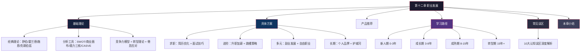
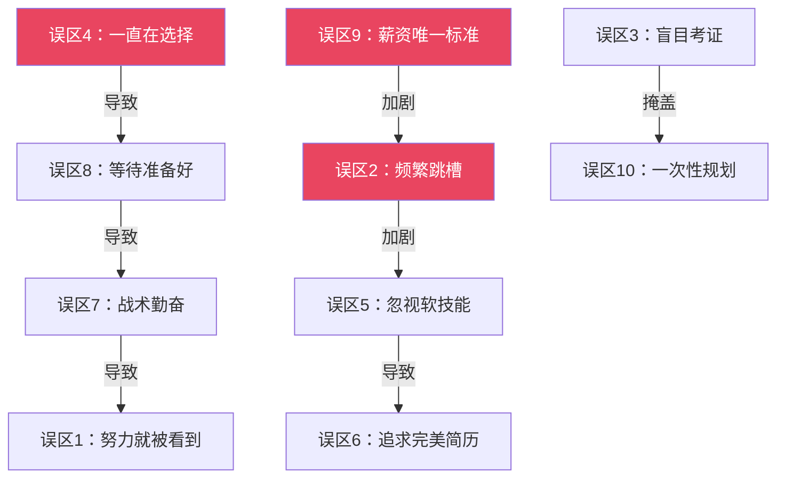
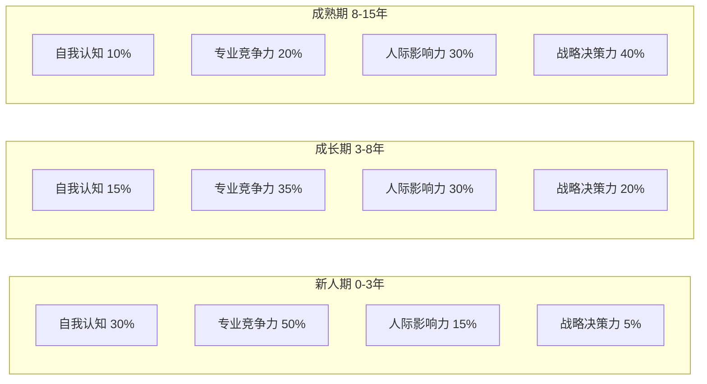

# 本章小结：从知识到行动的完整闭环

## 一、全章知识体系回顾

本章围绕"职业发展"这一核心命题，构建了"认知→规划→行动→迭代"的完整方法论体系。六个模块层层递进，从底层理论到实战方案，从阶段路径到误区纠偏，覆盖了职业发展中最常遇到的决策场景和行动挑战。

整个知识体系的底层逻辑可以用一句话概括：**先认识自己（理论），再看清环境（工具），然后制定方案（路径），在行动中迭代（复盘），并警惕认知陷阱（误区）**。

---

## 二、核心理论体系：六个必须掌握的底层框架

### 2.1 四大经典职业发展理论

| 理论 | 核心观点 | 实际应用 |
|------|---------|---------|
| 舒伯生涯发展理论 | 职业生涯分五阶段（成长→探索→建立→维持→衰退），人生有多重角色需要平衡 | 判断自己处于什么阶段，该阶段的核心任务是什么；用生涯彩虹图审视工作与生活的平衡 |
| 霍兰德RIASEC模型 | 职业选择是人格的表达，六种人格类型（现实型、研究型、艺术型、社会型、企业型、常规型）决定了适合的工作环境 | 通过测评确定自己的三字母代码，找到与人格匹配的职业方向，避免"入错行" |
| 施恩职业锚理论 | 八种职业锚（技术型、管理型、自主型、安全型、创业型、服务型、挑战型、生活方式型）揭示你"无论如何都不会放弃"的核心价值观 | 在面临跳槽、转行、升职等重大决策时，用职业锚检验选项是否符合自己的深层需求 |
| 克朗伯兹社会学习理论 | 职业发展受四因素影响（遗传、环境、学习经验、任务取向），偶然机遇可以通过"计划性机缘"变成职业转折 | 主动创造偶遇机会、对意外机遇保持开放、培养将运气转化为能力的意识 |

这四大理论不是孤立的知识点，而是一个**组合诊断工具**：用霍兰德确定方向，用施恩确认价值观，用舒伯定位阶段，用克朗伯兹拥抱不确定性。四者结合，才能形成对自己职业状态的立体认知。

### 2.2 四大实用分析工具

| 工具 | 核心功能 | 关键操作要点 |
|------|---------|-------------|
| SWOT分析 | 系统梳理优势（Strengths）、劣势（Weaknesses）、机会（Opportunities）、威胁（Threats），形成SO/WO/ST/WT四种策略组合 | 优势和劣势是内部因素（可控），机会和威胁是外部因素（需适应）；关键不是列出清单，而是形成策略组合 |
| 个人商业画布 | 从九大维度（关键合作伙伴、关键活动、关键资源、价值主张、客户关系、渠道、成本结构、收入来源、核心能力）审视自己的职业模式 | 像经营公司一样经营自己——你的"产品"是你的能力，你的"客户"是雇主或市场 |
| 能力三核模型 | 知识（可学习）、技能（可练习）、才干（需天赋+长期培养）三个层次，帮助构建分层的竞争力体系 | 知识容易被替代，技能有壁垒，才干才是真正护城河。要把精力从"多学知识"转向"打磨才干" |
| CASVE决策循环 | 沟通（Communication）→ 分析（Analysis）→ 综合（Synthesis）→ 评估（Evaluation）→ 执行（Execution）五步科学决策法 | 面对职业选择时不要凭直觉，而是按这五步走完决策流程，避免冲动决策和选择焦虑 |

### 2.3 两个关键进阶概念

**职业转型理论**回答的是"什么时候该转型"和"如何降低转型风险"。核心信号包括：持续的职业倦怠感、行业/公司系统性衰退、个人价值观与岗位严重错位。转型的关键不是"跳出去"，而是"先验证再跳"——用副业、兼职、志愿者等方式在新方向上积累经验，确认可行后再全力投入。

**职业倦怠应对**关注的是"如何识别倦怠信号"和"如何恢复"。倦怠有三个维度：情绪耗竭（感觉被掏空）、去人格化（对工作和同事产生冷漠感）、成就感降低（觉得自己的工作没有意义）。应对的核心不是"休息一下就好了"，而是从根源上调整工作内容、工作方式或工作环境。

---

## 三、实战方案核心要点：六个关键场景的方法论

### 3.1 简历优化——让HR在6秒内记住你

简历不是自我介绍，而是**价值主张的浓缩表达**。核心原则：

- **量化成果而非描述职责**：不要写"负责系统开发"，要写"主导用户系统重构，QPS从500提升到3000，支撑日活用户从10万增长到100万"
- **匹配ATS关键词**：大公司用ATS系统筛选简历，必须确保简历中包含招聘JD中的核心关键词
- **一页纸原则**：除非10年以上经验且每段经历都有高价值，否则控制在一页纸以内
- **STAR法则写成就**：每条经历按"情境（Situation）→任务（Task）→行动（Action）→结果（Result）"的结构组织

简历优化的正确投入比例：80%时间用于积累真实项目经验，15%时间用于用STAR法则清晰描述，5%时间用于排版。**功夫在平时**——建立"成就日志"，每完成一个项目立即记录成果数据。

### 3.2 面试技巧——从准备到复盘的全流程

面试是一场**有准备的信息交换**，不是临场发挥的才艺展示。

- **面试前**：研究公司业务、产品、竞品、最新动态；分析岗位JD找出3个核心能力要求；准备5-8个STAR故事覆盖这些能力；模拟面试至少3次
- **面试中**：用STAR法则结构化表达；遇到不会的问题坦诚承认并展示学习思路；注意非语言信号（眼神、坐姿、语速）；主动提问展示深度思考
- **面试后**：24小时内发感谢邮件；记录所有面试问题和自己的回答，找出改进点；无论结果如何都复盘——面试失败的复盘价值远高于面试成功的

### 3.3 升职加薪——向上管理的方法论

升职加薪的核心公式：**升职 = 业绩表现 × 可见度 × 时机**。三个要素缺一不可。

向上管理的具体操作：
1. **理解领导的需求和压力来源**——你的工作成果要与领导的目标对齐
2. **建立定期汇报节奏**——每周15分钟工作周报，包含关键成果、问题与方案、下周计划
3. **超预期交付**——承诺少一点，交付多一点，建立"说到做到"的信任
4. **关键时刻主动站出来**——重要项目启动时请缨、危机时刻承担责任，一次关键时刻的表现胜过100次默默努力

薪资谈判的时机选择：年度调薪窗口前1-2个月开始准备，用市场数据（同岗位薪资中位数）和自己的量化成果作为谈判筹码。

### 3.4 跳槽策略——理性规划每一次职业变动

跳槽应该是**升级而非平移**。每次跳槽前完成"三问自检"：
1. 这次跳槽是否实现了升级（职位、平台、方向至少一项提升）？
2. 我是否已充分利用当前平台的资源？
3. 新机会是否符合我的长期职业规划？

建议的跳槽节奏：
- 职业早期（0-3年）：2-3年跳一次，重点积累多元经验
- 职业中期（3-8年）：3-5年跳一次，重点深耕建立专业壁垒
- 职业后期（8年+）：5年以上跳一次或不跳，重点积累行业影响力

核心原则：**骑驴找马，绝不裸辞**。在当前岗位稳定的基础上寻找新机会，避免因经济压力被迫接受不理想的offer。

### 3.5 副业发展——构建职业的第二曲线

副业发展的五步法：

1. **盘点资源**：你的技能、人脉、知识、时间中，哪些可以变现？
2. **验证需求**：用最小成本验证市场是否愿意为你的能力付费（先接一两个小项目）
3. **建立作品集**：用3-5个高质量案例证明你的能力
4. **优化获客**：从熟人推荐逐步扩展到平台获客、内容获客
5. **规模化**：当副业收入稳定达到主业的30-50%时，考虑是否全职投入

选择副业方向的三个标准：与主业有协同效应（能力可复用）、有复利效应（越做越值钱）、有杠杆效应（一份时间产出多份收益）。

### 3.6 职业发展的长期策略

长期策略的核心是构建**不可替代性**。三条路径：
- **深度壁垒**：在一个细分领域做到极致，成为"遇到这个问题第一个想到的人"
- **跨界组合**：在两个或多个领域都达到80分以上，形成独特的交叉竞争力
- **个人品牌**：通过写作、演讲、开源、教学等方式，让你的名字与专业能力绑定

个人品牌的构建路径：先在团队内部建立口碑 → 在公司级平台展示 → 在行业社群输出 → 在公开平台建立影响力。每一步都需要**持续的、有质量的内容输出**，而非一次性的包装。

---

## 四、四阶段学习路径：不同起点的差异化方案

### 4.1 新人期（0-3年）：站稳脚跟

核心矛盾：有学习能力和热情，但缺乏对真实工作世界的认知。

**能力优先级**：
- 第一优先级（前6个月集中攻克）：硬技能——办公三件套深度掌握 + 专业核心技能
- 第二优先级（贯穿全程）：职业素养——时间管理、沟通表达、团队协作、职业形象
- 第三优先级（6个月后开始）：行业认知——行业全景图、行业社交、KOL跟踪

**关键行动**：入职第一个月制定90天计划并找导师；6个月内能独立完成80%日常任务；1-2年内在1-2个专业方向达到团队前30%的水平。

**必须避开的陷阱**：眼高手低（基础工作是信任来源）、被动等待（职场不是学校）、急于表现（先观察3个月再展现）、频繁跳槽（至少坚持2年）。

### 4.2 成长期（3-8年）：快速上升

核心矛盾：精力有限但机会太多——是广撒网还是深挖井？

**能力优先级**：
- 第一优先级：专业深度——选1-2个细分领域深耕，通过"选定→系统学习→实战验证→输出分享"的四步循环建立壁垒
- 第二优先级：管理与领导力——从基础管理（带新人/小项目）到向上管理、跨部门协作
- 第三优先级：商业思维——理解商业模式、掌握财务基础、建立客户思维和数据思维

**关键决策**：3年内明确走管理路线还是专业路线。两条路径的学习内容差异很大，越早确定越能集中资源。

### 4.3 成熟期（8-15年）：建立壁垒

核心矛盾：最需要突破但最容易陷入舒适区。

**能力优先级**：
- 第一优先级：战略思维——从执行者升级为决策参与者，掌握波特五力、PEST、商业模式画布等战略分析工具
- 第二优先级：影响力与资源整合——扩展到组织层面和行业层面，打造个人IP（出书/演讲/顾问）
- 第三优先级：传承与赋能——从"自己做到极致"转向"帮助别人做到极致"，培养接班梯队

### 4.4 转型期（15年以上）：开启新篇

核心矛盾：经验既是资产也是枷锁。

**能力优先级**：
- 第一优先级：经验传承——按"道法术器"框架系统化整理知识，通过写作、课程、案例库实现显性化
- 第二优先级：第二曲线——在第一曲线到达巅峰之前就开始培育（咨询顾问/天使投资/创业/教育培训/内容创作）
- 第三优先级：人生意义——从"追求成就"转向"追求意义"，培养工作之外的身份认同

---

## 五、十大误区：提前知道哪里有坑

比能力不足更可怕的是认知偏差。以下是本章深度解析的十大误区及其纠正方法：

| 编号 | 误区 | 核心危害 | 纠正方法 |
|------|------|---------|---------|
| 1 | 只要努力工作，领导自然会看到 | 可见性与能力是两个独立维度，默默努力≠被认可 | 建立每周汇报节奏；量化贡献（用数据说话）；关键时刻主动站出来 |
| 2 | 频繁跳槽能快速涨薪 | 简历不稳定、缺乏深度积累、35岁后负面影响指数级放大 | 每次跳槽前完成三问自检；按阶段控制跳槽频率；深耕好公司的综合回报超过频繁跳槽 |
| 3 | 考证就能提升竞争力 | 陷入"学习型拖延"，用备考回避真正的职业挑战 | 用决策树判断是否值得考（准入门槛？JD要求？知识体系？）；作品集比证书更有说服力 |
| 4 | 一直在选择，迟迟不行动 | 损失厌恶导致决策瘫痪，错过最佳行动时机 | 满意决策法（设底线→选第一个达标的→停止比较）；设定2周决策时限；认识决策的可逆性 |
| 5 | 只关注硬技能，忽视软技能 | 遇到晋升天花板——硬技能决定下限，软技能决定上限 | 按阶段提升：结构化表达→向上管理→影响力扩展→领导力培养 |
| 6 | 追求完美简历而非真实能力 | 简历漂亮但面试经不起追问，过度包装导致入职后暴露 | 80%时间积累真实成果，15%时间用STAR描述，5%时间排版 |
| 7 | 用战术勤奋掩盖战略懒惰 | 在低价值事务中消耗大量时间，方向错误导致越努力越远离目标 | 每周30分钟战略回顾；用80/20法则聚焦关键活动；学会说"不" |
| 8 | 等待"准备好了"再行动 | 永远等不到完全准备好，70%的技能只能在实战中获得 | 70%准备法则：准备70%就行动，剩下30%在实践中学习 |
| 9 | 把薪资作为唯一选择标准 | 选择高薪但无成长的工作，几年后能力停滞被替代 | 职业早期成长空间 > 薪资；用五维雷达图综合评估（薪资/成长/内容/文化/平衡） |
| 10 | 认为职业规划是一次性的事 | 静态规划变成过期地图，无法指导当前行动 | 建立"活的规划"：季度微调 + 年度大修 + 重大事件触发式更新 |

**误区之间的关联性**：这10个误区不是孤立的，而是相互强化的。例如："一直在选择"（误区4）导致"等待准备好"（误区8），进而导致"战术勤奋"（误区7），最终陷入"努力就会被看到"（误区1）的幻觉。识别这种链条效应，才能系统性地打破认知偏差。

---

## 六、核心能力模型：贯穿全章的底层逻辑

回顾全章内容，职业发展本质上是**四种核心能力的持续构建**：

| 能力维度 | 内涵 | 培养方式 | 贯穿章节 |
|---------|------|---------|---------|
| 自我认知能力 | 了解自己的兴趣、价值观、能力边界 | 理论工具测评（霍兰德/职业锚/SWOT）+ 实践反馈 + 定期复盘 | 基础理论全节 |
| 专业竞争力 | 在选定领域的深度和广度 | 刻意练习 + 费曼学习法 + 70-20-10法则 | 学习路径 + 具体方案 |
| 人际影响力 | 沟通、协作、向上管理、跨部门推动 | 结构化表达训练 + 实践中的反馈循环 | 具体方案 + 常见误区 |
| 战略决策力 | 在不确定环境中做出理性判断的能力 | CASVE决策循环 + 满意决策法 + 定期战略回顾 | 基础理论 + 常见误区 |

这四种能力在不同职业阶段的权重不同：

**关键洞察**：职业早期靠专业竞争力"站稳脚跟"，中期靠人际影响力"打开局面"，后期靠战略决策力"引领方向"。但自我认知是贯穿全程的底层能力——不了解自己的人，其他三种能力再强也用不对地方。

---

## 七、可复用的方法论工具箱

本章涉及的所有工具和方法，按使用场景汇总如下：

### 7.1 自我分析场景

| 场景 | 推荐工具 | 操作频率 |
|------|---------|---------|
| 了解职业兴趣 | 霍兰德RIASEC测评 | 每2-3年重测一次 |
| 确认核心价值观 | 施恩职业锚测评 | 面临重大决策时 |
| 评估当前处境 | SWOT分析 | 每季度一次 |
| 审视职业模式 | 个人商业画布 | 每半年一次 |
| 明确能力边界 | 能力三核模型 | 每季度一次 |

### 7.2 决策场景

| 场景 | 推荐工具 | 关键步骤 |
|------|---------|---------|
| 面对多个职业选项 | CASVE决策循环 | 沟通→分析→综合→评估→执行，完整走完五步 |
| 避免选择焦虑 | 满意决策法 | 设3个核心因素→设底线→选第一个达标的→停止比较 |
| 评估工作机会 | 五维雷达图 | 薪资/成长/内容/文化/平衡，按阶段调整权重 |
| 判断是否跳槽 | 三问自检 | 升级了吗？充分利用了当前平台吗？符合长期规划吗？ |

### 7.3 学习成长场景

| 场景 | 推荐方法 | 核心原则 |
|------|---------|---------|
| 学习新知识 | 费曼学习法 | 能用简单语言解释清楚的，才是真懂了 |
| 提升专业技能 | 刻意练习 | 有目的、有反馈、走出舒适区的高质量练习 |
| 分配学习时间 | 70-20-10法则 | 70%工作实践 + 20%人际互动 + 10%正式学习 |
| 建立知识体系 | 道法术器框架 | 底层原理→方法论→具体技巧→工具资源 |

### 7.4 日常执行场景

| 场景 | 推荐习惯 | 时间投入 |
|------|---------|---------|
| 展示工作价值 | 每周工作周报 | 每周15分钟 |
| 积累简历素材 | 成就日志 | 每完成项目立即记录 |
| 战略方向审视 | 每周战略回顾 | 每周30分钟 |
| 职业规划更新 | 季度微调 + 年度大修 | 每季度1小时 + 每年半天 |
| 人脉维护 | 定期与行业联系人交流 | 每月至少1次 |

---

## 八、行动清单：从读完到做到

知识只有转化为行动才有价值。以下行动清单按时间维度分层，建议根据你当前的职业阶段选择优先级最高的项目立即执行。

### 8.1 本周完成（认知校准）

- [ ] 完成霍兰德RIASEC测评，确定自己的职业兴趣三字母代码
- [ ] 完成施恩职业锚测评，识别自己的核心职业价值观
- [ ] 用SWOT框架分析自己当前的职业处境（优势/劣势/机会/威胁各写3-5条）
- [ ] 用个人商业画布审视自己的职业模式，找出最大的短板维度
- [ ] 对照十大误区做一次诚实的自我诊断（上文的10道自测题）

### 8.2 本月完成（能力建设启动）

- [ ] 根据当前职业阶段，制定3-6个月的学习计划（参考学习路径节）
- [ ] 建立"成就日志"习惯——记录每个项目/任务的量化成果
- [ ] 优化简历（即使不打算跳槽，也用STAR法则重写一遍工作经历）
- [ ] 找到一位职业导师或同行交流伙伴，建立定期沟通机制
- [ ] 选择1-2个最相关的误区，制定具体的纠正行动计划

### 8.3 本季度完成（系统规划）

- [ ] 制定或更新个人职业发展规划（长期愿景→中期目标→短期行动）
- [ ] 完成一项与职业目标相关的核心能力提升项目
- [ ] 在行业内进行一次有价值的社交或专业分享
- [ ] 评估是否需要发展副业的第二曲线，如果需要，完成需求验证
- [ ] 建立季度复盘机制：每季度最后一天花1小时回顾本季度的职业发展情况

### 8.4 持续执行（长期习惯）

- [ ] 每周15分钟工作周报 → 建立可见度
- [ ] 每周30分钟战略回顾 → 确保方向正确
- [ ] 每月1本专业/职业书籍 → 持续输入
- [ ] 每季度1次职业状态全面审视 → 动态调整
- [ ] 每年1次职业规划大修 → 更新方向

---

## 九、三个核心信念

回顾全章所有内容，职业发展的一切方法论都建立在三个核心信念之上：

### 信念一：长期主义

职业发展是一场马拉松，不是百米冲刺。短期的薪资涨幅、职级提升都不是最终目标——**真正重要的是你在10年、20年后积累了多少不可替代的能力和价值**。在好公司深耕5年的综合回报（薪资+股权+能力+人脉+行业影响力），往往超过频繁跳槽的总收益。

这意味着：在做每一个职业决策时，都要问自己"这个选择在5年后的价值是什么"，而不仅仅是"这个选择在5个月后能给我带来什么"。

### 信念二：主动创造

不要等待机会降临，而要主动创造机会。领导不会自动看到你的价值——你需要建立汇报节奏、量化贡献、在关键时刻站出来。行业不会自动发现你的能力——你需要输出分享、建立个人品牌、拓展人脉网络。

**主动创造的本质是降低信息不对称**。职场中的很多机会，不是给最有能力的人，而是给最"被看到"的人。当然，"被看到"的前提是你确实有值得被看到的东西——所以能力积累和主动展示缺一不可。

### 信念三：持续迭代

没有完美的规划，只有持续的迭代。职业发展不是"想清楚了再走"的直线路径，而是"行动→反馈→调整→再行动"的螺旋上升。每一次跳槽、每一次项目、每一次失败都是迭代的机会。

**迭代的关键是建立反馈机制**：每周回顾自己的时间投入产出比，每季度审视职业方向是否需要调整，每年更新职业规划。规划是导航仪，不是铁轨——它帮你找到方向，但不必拘泥于原定路线。

---

## 十、最后的思考

职业发展没有标准答案。每个人的起点不同、资源不同、价值观不同、人生境遇不同。本章提供的不是"唯一正确"的路径，而是一套**经得起验证的思考框架和可落地的行动工具**。

它不会告诉你"选A还是选B"，但会给你一套分析框架，让你在每一个决策节点上都能做出理性、有依据、与长期目标一致的选择。它不会承诺你"照做就能成功"，但会让你在试错的过程中减少不必要的弯路，把有限的时间和精力投入到最有价值的方向上。

最重要的一步，不是读完这4000多字，而是**合上这篇文章后，立即开始执行行动清单中的第一项**。知识的价值不在于"知道"，而在于"做到"。

从今天开始，迈出下一步。
