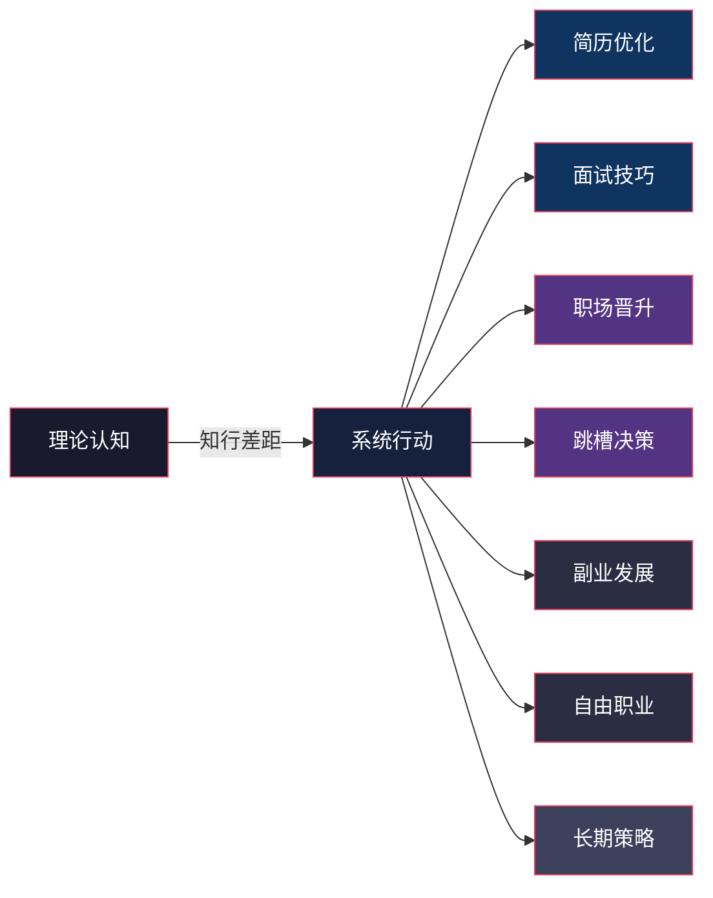
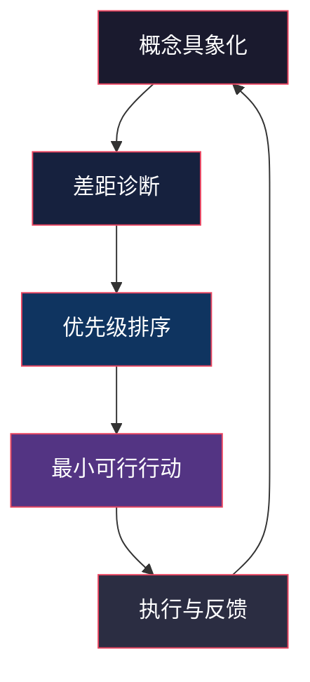
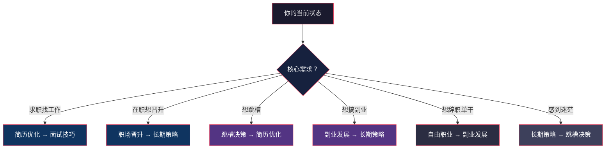

## 一、引言：从理论到行动

上一节我们系统学习了职业发展的基础理论——舒伯的生涯发展阶段论、霍兰德的RIASEC兴趣模型、施恩的职业锚理论、克朗伯兹的社会学习理论，以及SWOT分析、个人商业画布、能力三核模型和CASVE决策循环等实用工具。这些理论为你提供了认识自己、理解职业世界的认知框架。

但理论的价值，只有在转化为行动时才能兑现。本节是全章的枢纽——它将前面的理论地基连接到后面七个实操模块，帮助你建立"从知道到做到"的完整路径。

### 1.1 知行差距：为什么懂了那么多道理，依然过不好这一生

斯坦福大学组织行为学教授杰弗瑞·菲佛（Jeffrey Pfeffer）和罗伯特·萨顿（Robert Sutton）在《知行差距》（The Knowing-Doing Gap）一书中揭示了一个残酷的现实：**知识和行动之间存在巨大的鸿沟**。人们知道该做什么，和真正去做，是两件完全不同的事。

在职业发展领域，这个差距尤为明显：

| 知道 | 做到 | 差距表现 |
|------|------|---------|
| 知道应该更新简历 | 实际简历还是三年前的版本 | "等忙完这阵子再说" |
| 知道应该提升技能 | 刷了200小时短视频 | "学了也没机会用" |
| 知道应该跳槽 | 在不满意的岗位上又待了两年 | "下一份可能更差" |
| 知道应该发展副业 | 调研了半年还在调研 | "准备不够充分" |
| 知道应该建立人脉 | 只跟同部门同事吃饭 | "社交太累了" |

知行差距的根源不是懒惰，而是三个更深层的障碍：

**障碍一：行动焦虑。** 当我们面对不确定性时，大脑的杏仁核会触发恐惧反应。简历写好了投出去，意味着可能被拒绝；提出升职要求，意味着可能被否定。不行动虽然不会变好，但至少不会变差——这是一种极具诱惑力的心理陷阱。

**障碍二：完美主义瘫痪。** "等我准备好了再开始"是完美主义者最常用的拖延借口。但真相是，你永远不会完全准备好。职业发展遵循"70%原则"——当你有70%的把握时就应该行动，剩下的30%在行动中补足。

**障碍三：缺乏系统方法。** 仅靠意志力无法持续行动。你需要的是一个清晰的系统：明确的步骤、可衡量的标准、及时的反馈。这正是本节七个实操模块要提供的东西。

### 1.2 从理论到行动的转化模型

理论不会自动变成行动。你需要一个"翻译"过程，将抽象的概念转化为具体的执行步骤。以下是四个转化层级：

**第一层：概念具象化。** 把理论概念翻译成你能看到、摸到的具体事物。例如，"能力三核"不是抽象的知识-技能-才干，而是：你掌握的编程语言列表（知识）、你独立完成过的项目数量（技能）、你解决问题时下意识的思考方式（才干）。

**第二层：差距诊断。** 用理论工具评估现状与目标之间的距离。做一次完整的SWOT分析，你会发现自己最大的劣势在哪里；完成个人商业画布，你会看到职业模式中哪个环节最薄弱。

**第三层：优先级排序。** 不是所有差距都需要同时弥补。用"影响度×紧迫度"矩阵对行动项进行排序，先解决高影响高紧迫的问题。

**第四层：最小可行行动。** 每个大目标都拆解成可以今天就开始做的第一步。简历优化的第一步不是重写整份简历，而是打开文件、把最近一次项目成果记录下来。

### 1.3 本节全景：七个实战模块总览

本节包含七个核心实操模块，覆盖从求职到自由职业的完整职业生命周期。每个模块都遵循统一的结构：**理论依据→具体方法→实操步骤→模板工具→常见错误→进阶策略**。

以下是七个模块的全景概览，帮你快速判断当前最需要深入学习哪个部分：

#### 模块一：简历优化——让HR在6秒内记住你

**解决的核心问题：** 你的简历是否在投递后石沉大海？

简历是职场的"入场券"。根据领英的数据，HR平均花6-8秒扫描一份简历，而一份职位平均收到250份申请。在这场残酷的筛选中，你的简历必须在极短时间内传达三个信息：你是谁、你能做什么、你为什么适合。

本模块将教你：
- **简历的本质**：它不是经历清单，而是营销文案——你需要用"卖点思维"重写每一段经历
- **ATS系统适配**：超过75%的简历在到达HR之前被机器筛选掉，关键词布局决定生死
- **量化成果公式**：用"动词+数字+结果"的结构，把平淡的职责描述变成亮眼的成就展示
- **一页纸排版**：内容取舍的艺术——什么该留、什么该删、什么该突出
- **不同场景的简历策略**：应届生简历、转行简历、高管简历的差异化打法

**理论对接：** 能力三核模型帮你梳理简历内容，霍兰德类型帮你定位求职方向。

#### 模块二：面试技巧——从准备到复盘的全流程方法论

**解决的核心问题：** 你的面试表现是否总差"临门一脚"？

面试是一个可以系统准备的能力，而不是靠"临场发挥"的运气。麦肯锡的研究表明，经过系统面试训练的候选人，获得offer的概率比未训练者高出40%。

本模块将教你：
- **信息调研**：面试前必须完成的公司分析、岗位拆解、面试官画像
- **STAR法则**：用情境（Situation）、任务（Task）、行动（Action）、结果（Result）四步法，把任何经历变成有说服力的故事
- **高频问题应对**：自我介绍、离职原因、薪资期望、优缺点等经典问题的回答框架
- **技术面试准备**：白板编程、系统设计、案例分析等技术面的专项策略
- **行为面试应对**：如何识别面试官的"潜台词"，如何展示软技能和文化匹配度
- **面试后复盘**：每次面试都是学习机会——记录问题、分析表现、迭代改进

**理论对接：** CASVE决策循环帮你系统分析面试中的关键决策点，施恩职业锚帮你判断公司文化是否匹配。

#### 模块三：职场晋升——从执行者到领导者

**解决的核心问题：** 你是否"苦劳满满、功劳为零"？

职场晋升不是"做好本职工作就会被看到"。哈佛商学院的研究显示，决定晋升的因素中，工作表现只占30%，其余70%来自能见度、关系网络和政治敏感度。

本模块将教你：
- **向上管理**：理解上级的目标和压力，主动对齐期望，成为上级的"解决方案"而非"问题"
- **价值展示**：如何把日常工作转化为可量化的成果，如何在关键时刻"被看到"
- **影响力构建**：从个人贡献者到团队领导者的思维转变，如何在没有权力的情况下影响他人
- **薪资谈判**：谈判时机的选择、数据支撑的准备、话术设计和心理学技巧
- **晋升路径规划**：如何识别公司的隐性晋升规则，如何提前一年开始布局

**理论对接：** 职场竞争力模型帮你分析晋升所需的核心能力，舒伯生涯理论帮你判断当前阶段的晋升重点。

#### 模块四：跳槽决策——理性规划每一次职业变动

**解决的核心问题：** 你是因为"该跳"而跳，还是因为"想逃"而跳？

跳槽是职场中最容易冲动的决策之一。根据智联招聘的数据，约40%的跳槽者在入职新公司6个月内感到后悔。冲动跳槽不仅浪费时间，还可能让你的职业轨迹偏离方向。

本模块将教你：
- **跳槽信号评估**：区分"真该跳"和"只是烦"——12个客观指标帮你理性判断
- **骑驴找马策略**：在职期间如何高效求职，如何安排面试时间，如何避免被现公司发现
- **三维评估模型**：行业前景×公司质量×岗位匹配度，系统评估每一个offer
- **离职谈判**：如何优雅地离开，保留人脉和口碑，处理竞业协议和期权等复杂问题
- **入职过渡期**：新工作前90天的生存策略——如何快速融入、建立信任、展示价值

**理论对接：** 职业转型理论帮你评估转型风险，SWOT分析帮你比较现有和新机会的优劣。

#### 模块五：副业发展——构建职业的第二曲线

**解决的核心问题：** 你的收入是否只依赖单一来源？

在不确定性日益增加的时代，单一收入来源是一种高风险状态。查尔斯·汉迪（Charles Handy）的"第二曲线"理论指出：在第一条曲线到达顶峰之前，就应该开始培育第二条增长曲线。

本模块将教你：
- **副业方向选择**：基于能力三核模型，找到你最有可能变现的能力组合
- **MVP式验证**：用最小可行产品的方法快速验证副业方向，避免投入大量时间后才发现方向错误
- **时间与精力管理**：主业与副业的平衡策略，避免两头都做不好
- **副业到事业**：什么时候副业可以变成主业？如何判断"跳板时刻"？
- **税务与法律合规**：副业收入的报税要求、与现公司的合同约束、知识产权归属

**理论对接：** 克朗伯兹的"计划性机缘"理论帮你保持对副业机会的开放，个人商业画布帮你评估副业模式的可行性。

#### 模块六：自由职业——从雇员到自我雇佣

**解决的核心问题：** 你是否真的适合自由职业？

自由职业听起来很美好——自由安排时间、做自己喜欢的事、不受老板约束。但根据Freelancers Union的调查，约60%的自由职业者在第一年内因为收入不稳定、社交孤立或自我管理困难而放弃。

本模块将教你：
- **适不适合评估**：自由职业需要的四类核心能力——专业交付、客户获取、自我管理、财务规划
- **财务准备**：自由职业前需要多少"跑道资金"？如何设计收入结构降低波动风险？
- **客户获取**：从0到1的冷启动策略，如何利用现有网络和平台找到第一批客户
- **定价策略**：自由职业者的定价心理学——时薪制vs项目制vs价值定价
- **可持续发展**：如何避免成为"一个人的血汗工厂"，如何建立被动收入和产品化服务

**理论对接：** 施恩的职业锚帮你判断自由职业是否匹配你的核心价值观，职业倦怠理论帮你识别是否只是"想逃离"而非真正热爱自由职业模式。

#### 模块七：职业发展的长期策略

**解决的核心问题：** 如何在10年、20年的时间尺度上持续增值？

短期策略解决的是"下一步怎么走"，长期策略解决的是"方向对不对"。安德斯·艾利克森（Anders Ericsson）的刻意练习理论表明，持续的高水平表现来自于有目的的长期投入，而非天赋。

本模块将教你：
- **个人品牌构建**：从"默默做事"到"被看见"——如何在行业内建立专业声誉
- **跨周期能力组合**：哪些能力在AI时代不会贬值？如何构建"T型"甚至"π型"能力结构？
- **职业护城河**：网络效应、稀缺技能、行业专长——三种不同类型的护城河如何打造
- **反脆弱职业体系**：如何让职业发展不依赖于单一公司、单一行业、单一技能
- **复利思维**：哪些职业行为具有复利效应？如何让今天的努力在5年后产生倍增回报？

**理论对接：** 舒伯生涯发展理论帮你规划不同人生阶段的职业重点，职场竞争力模型帮你持续评估和升级核心能力。

### 1.4 理论-行动对照表：每个理论在实操中的应用

前面学习的理论和工具，在本节的每个模块中都会反复用到。以下是它们的对照关系，帮你建立"学以致用"的连接：

| 理论/工具 | 简历优化 | 面试技巧 | 职场晋升 | 跳槽决策 | 副业发展 | 自由职业 | 长期策略 |
|-----------|---------|---------|---------|---------|---------|---------|---------|
| 舒伯生涯理论 | — | — | ✓✓ | ✓✓ | ✓ | ✓ | ✓✓ |
| 霍兰德RIASEC | ✓✓ | ✓ | — | ✓✓ | ✓✓ | ✓✓ | ✓ |
| 施恩职业锚 | ✓ | ✓✓ | ✓✓ | ✓✓ | ✓ | ✓✓ | ✓✓ |
| 克朗伯兹理论 | — | — | ✓ | ✓ | ✓✓ | ✓ | ✓✓ |
| SWOT分析 | ✓ | ✓ | ✓✓ | ✓✓ | ✓✓ | ✓✓ | ✓✓ |
| 个人商业画布 | ✓✓ | — | ✓ | ✓ | ✓✓ | ✓✓ | ✓✓ |
| 能力三核 | ✓✓ | ✓ | ✓✓ | ✓ | ✓✓ | ✓ | ✓✓ |
| CASVE决策 | — | — | ✓ | ✓✓ | ✓ | ✓✓ | ✓ |
| 职场竞争力模型 | ✓✓ | ✓ | ✓✓ | ✓ | ✓ | ✓ | ✓✓ |
| 职业转型理论 | — | — | — | ✓✓ | ✓ | ✓✓ | ✓ |
| 职业倦怠应对 | — | — | ✓ | ✓✓ | ✓ | ✓ | ✓ |

（✓✓ = 核心应用，✓ = 有参考价值，— = 关联较弱）

### 1.5 读者定位：找到你的优先学习路径

不同职业阶段、不同处境的读者，最迫切的需求各不相同。以下是按角色划分的学习优先级建议：

**具体建议：**

- **应届毕业生（0-1年）：** 重点读简历优化和面试技巧。这两个模块的ROI最高——一次简历优化可能直接决定你拿到多少面试机会，一次面试表现的提升可能值几万块的薪资差距。
- **职场新人（1-3年）：** 重点读职场晋升和长期策略。这个阶段的关键是建立正确的职业发展观念，避免"只顾低头拉车，不抬头看路"。
- **职场骨干（3-8年）：** 根据具体需求选择。如果对现状满意，读晋升策略和长期策略；如果考虑变动，读跳槽决策；如果想探索多元收入，读副业发展。
- **中层管理者（8年+）：** 重点读长期策略和副业/自由职业。这个阶段的核心问题是"下一步往哪走"——是继续往上爬、横向发展、还是跳出体制。
- **任何阶段感到倦怠的人：** 先回到基础理论部分重新审视职业锚和倦怠应对，再根据结论选择对应的实操模块。

### 1.6 使用方法：如何从本节获得最大收益

本节的七个模块不是需要从头到尾线性阅读的教科书。它更像一本工具手册——根据你当前最紧迫的需求，直接翻到对应的模块。

**推荐的使用流程：**

**第一步：自我诊断（10分钟）。** 回答以下问题，找到你当前最大的职业痛点：

1. 你最近三个月是否在求职或考虑求职？→ 简历优化 + 面试技巧
2. 你是否在当前岗位上超过两年没有职级或薪资变化？→ 职场晋升
3. 你是否最近频繁有"不想干了"的念头？→ 跳槽决策（先判断是真该跳还是只是烦）
4. 你是否在考虑发展主业之外的收入来源？→ 副业发展
5. 你是否在认真考虑辞职做自由职业？→ 自由职业转型
6. 以上都不是，但你对职业前景感到迷茫？→ 长期策略

**第二步：精读对应模块（30-60分钟）。** 跳转到最相关的模块，完整阅读理论依据、具体方法和实操步骤。

**第三步：完成一次实操（1-3小时）。** 读完后立即动手——改简历、做面试准备笔记、写晋升行动计划。阅读不产生价值，行动才产生价值。

**第四步：建立反馈循环（持续）。** 每次行动后记录结果，每两周回顾一次进展，根据反馈调整策略。

**跨模块联动：** 七个模块之间不是孤立的。例如，准备跳槽时需要同步优化简历和练习面试技巧；发展副业时需要同步构建个人品牌（长期策略模块）；晋升受阻时可能需要评估是否该跳槽。建议在主路径之外，浏览关联模块的要点。

### 1.7 一个关键提醒：行动比完美更重要

在进入具体模块之前，有一个需要反复强调的信念：

**80%的行动 > 100%的计划。**

太多人花大量时间"研究"和"准备"，却始终不迈出第一步。他们读了10篇简历优化文章，收藏了50个面试技巧视频，对比了30个副业方向——然后什么都没做。

本节的每个模块都会给你具体的行动步骤。请在阅读后24小时内至少完成第一步。不需要完美，不需要准备齐全，只需要开始。

正如亚马逊创始人杰夫·贝佐斯所说："大多数决策都是可逆的双向门（two-way door），但人们在每个决策上花的时间却像是在处理不可逆的单向门。" 职业发展中的大多数行动——投一份简历、约一次信息访谈、开一个副业账号——都是低成本的双向门。你最大的风险不是做错，而是不做。

现在，让我们进入第一个实战模块：简历优化。

***
