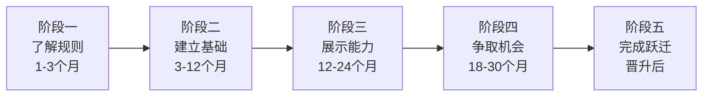
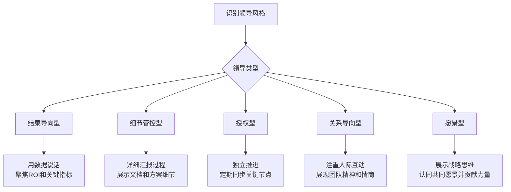
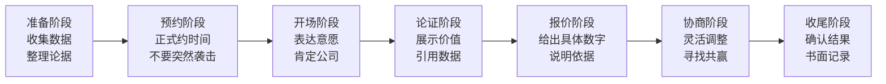

## 四、职场晋升策略：从执行者到领导者

晋升是职场中最具杠杆效应的事件——一次晋升带来的薪资涨幅（通常20%-50%）、资源调配权和职业平台的提升，往往超过在同一岗位上苦干三五年的积累。但晋升从来不是"等来的"，它是一场需要系统规划、持续经营和精准执行的战役。本章将从晋升的底层逻辑出发，完整拆解从执行者到领导者的跃迁路径。

### 4.1 理解晋升的底层逻辑

#### 4.1.1 晋升的本质：价值交换的升级

晋升的本质不是"你在公司待了多久"，也不是"你有多辛苦"，而是一次**价值交换的重新定价**：公司评估你在更高职级上能否创造更大价值，并愿意为此支付更高的对价。

用一个公式来理解：

晋升概率 = 业绩表现 × 可见度 × 准备度 × 时机匹配度

四个因素缺一不可，任何一个为零，晋升概率就为零：

| 因素 | 含义 | 常见误区 |
|------|------|---------|
| **业绩表现** | 你完成了什么？超越了多少预期？创造了什么可量化的价值？ | 误把"忙碌"当"业绩"，把"苦劳"当"功劳" |
| **可见度** | 你的成绩是否被决策者（不只直属领导）看到？ | 默默做事等领导发现，结果功劳被别人汇报 |
| **准备度** | 你是否已经在展示下一职级所需的能力？ | 只做好本职工作，从不越界展示高级能力 |
| **时机** | 公司是否有预算、晋升名额、组织调整窗口？ | 业绩很好但公司冻结HC，白等一年 |

#### 4.1.2 公司为什么给你晋升——决策者视角

从管理层的视角看，一次晋升决策涉及三个核心判断：

**判断一：此人是否已经在做更高级别的事？**
多数公司的晋升逻辑是"先证明，再认可"——你需要先在事实上承担更高职级的工作，公司才会在名义上给你对应的头衔和薪资。这不是"先有鸡还是先有蛋"的问题，答案很明确：**你先做鸡的事，公司再给你鸡的名分。**

**判断二：此人晋升后能否继续创造更大价值？**
晋升不是奖励过去的贡献，而是投资未来的潜力。决策者会评估：给你更多资源和权力后，你能否撬动更大的成果？

**判断三：不提拔此人，风险有多大？**
如果你已经是一个团队事实上的核心，不晋升你可能导致你离开、团队崩塌，那么即使你还有不足，公司也会倾向于晋升你留住人。

#### 4.1.3 晋升与加薪的区别

很多人混淆晋升和加薪，但它们的逻辑完全不同：

| 维度 | 加薪 | 晋升 |
|------|------|------|
| 本质 | 对当前贡献的价格调整 | 对角色和能力层级的重新定义 |
| 依据 | 绩效表现、市场薪资 | 能力模型、职级标准 |
| 影响范围 | 仅薪资 | 薪资、汇报关系、决策权、资源调配权 |
| 主导者 | 直属领导 + HR | 多级审批，通常需要跨部门评审 |
| 可谈判空间 | 较大 | 较小（需满足硬性标准） |

理解这个区别很重要：**你可能值得加薪但不满足晋升条件，也可能满足晋升条件但公司暂时没有名额。** 两者需要分开规划。

### 4.2 晋升的五阶段作战地图

晋升不是临场发挥，而是至少12-24个月的系统工程。以下是完整的五阶段作战地图：



#### 阶段一：了解规则（入职第1-3个月）

**目标：弄清楚游戏规则，不打无准备之仗。**

这是最容易被忽视、但回报率最高的阶段。多数人入职后急于表现，却连晋升的基本规则都没搞清楚。

**必须搞清楚的五件事：**

1. **晋升制度和评估标准**：公司是否有公开的职级体系？每个级别的能力要求是什么？评估维度（业绩、能力、价值观）的权重如何分配？
2. **晋升周期和流程**：是半年一次还是年度一次？需要哪些人审批？是否有答辩环节？需要提交什么材料？
3. **历史案例**：过去两年，团队里谁晋升了？他们做了什么？领导在公开场合表扬过什么行为？
4. **隐性规则**：是否有"最低任职时间"的硬性要求？是否有"必须带过项目"的前提条件？是否有学历、证书等门槛？
5. **领导的期望**：你的直属领导对你的角色定位是什么？他希望你在哪些方面发挥作用？

**具体行动清单：**
- 找HR要一份职级体系文档，逐条对照自己的现状
- 找1-2位近期晋升的同事，请吃顿饭聊聊（不问敏感细节，问"你觉得最关键的三件事是什么"）
- 在入职第一个月的1:1会议中，直接问领导："您觉得我在这个岗位上做好，需要重点关注哪些方面？"
- 把公司内部的晋升经验帖、论坛帖子收集起来，建立自己的"晋升情报库"

#### 阶段二：建立基础（入职第3-12个月）

**目标：在当前岗位上建立"绝对可靠"的口碑。**

晋升的前提是"当前工作已经不构成挑战"。如果你连本职工作都做得磕磕绊绊，谈晋升为时过早。

**核心任务：**

1. **交付超预期的业绩**：不只是完成KPI，而是找到超越KPI的方式。比如KPI是"完成10个项目"，你完成12个并且其中有2个是创新性的。
2. **建立信任关系**：与直属领导建立"放心"级别的信任——他交代给你的事情，不需要追问进度，不需要担心质量。
3. **理解业务全貌**：不只关注自己的一亩三分地，要理解团队的目标、部门的战略、公司的方向。
4. **积累专业口碑**：在至少一个领域成为团队里"做得最好的人"或"最懂的人"。

**关键指标——"放心测试"：**
领导在你休假时是否能安心不问？如果是，说明你已经建立了足够的信任基础。

#### 阶段三：展示能力（入职第1-2年）

**目标：主动承担超越当前职级的职责，让决策者看到你"已经在做下一职级的事"。**

这是晋升准备中最关键的阶段。你需要**有策略地越界**——不是越权，而是展示你有能力承担更大的责任。

**具体策略：**

1. **主动承担跨团队项目**：横向协作最能展示影响力和领导力。主动参与或牵头需要多团队配合的项目。
2. **带新人或带实习生**：这是最安全的"管理实践"——即使失败了，代价也很小，但成功了就是你有带人能力的有力证据。
3. **在关键会议上有存在感**：不要只是旁听。准备充分后，在部门会议、项目评审中提出有深度的观点或解决方案。
4. **输出方法论和最佳实践**：把你的经验总结成文档、培训材料、工具模板，在团队内分享。这是"影响力"的有形证据。
5. **成为某个领域的"默认负责人"**：当团队遇到某类问题时，所有人第一反应是"去找你"。

**风险提示：** 展示能力不等于抢领导的风头。核心原则是——**帮助领导成功，同时让决策者知道你在其中发挥了关键作用。**

#### 阶段四：争取机会（入职第2-3年）

**目标：正式表达晋升意愿，收集证据，推动晋升流程。**

很多人在这一阶段犯了两个错误：一是从不开口，等领导主动想起你；二是只在私下抱怨，不走正式流程。

**必须做的四件事：**

**第一件：正式表达意愿**
在1:1会议中明确告诉领导："我希望在下一次晋升窗口中争取XX级别的晋升，您觉得我需要在哪些方面再加强？"

这不是"要官"，而是**让领导知道你的目标，以便他能提前帮你规划和准备**。多数领导乐意帮助有明确目标的下属。

**第二件：建立晋升证据档案**
提前三个月开始整理以下材料：

| 材料类型 | 具体内容 | 用途 |
|---------|---------|------|
| 业绩数据 | 量化成果、对比数据、增长率 | 证明"做了什么" |
| 项目清单 | 主导/参与的关键项目及你的角色 | 证明"承担了什么" |
| 影响力证据 | 培训记录、方法论文档、跨团队协作记录 | 证明"影响了谁" |
| 反馈收集 | 同事、合作方、下属的好评邮件或评价 | 证明"别人怎么看" |
| 能力对标 | 逐条对照下一职级的能力要求，列出已达标项 | 证明"已准备好" |

**第三件：找盟友和背书人**
晋升通常需要多人评审，不只是直属领导说了算。你需要：
- **直属领导**：你的第一代言人，必须提前沟通并获得支持
- **跨部门合作方**：他们对你的评价能证明你的横向影响力
- **高级管理者**：如果有机会在高级管理者面前展示成果，务必抓住
- **HRBP**：了解晋升流程细节和时间节点

**第四件：准备晋升答辩（如果公司有此环节）**
答辩不是演讲，而是一次结构化的价值展示。核心框架：

```markdown
## 晋升答辩结构（建议15-20分钟）

1. **开场（1分钟）**：我是谁，我的目标职级
2. **核心成果（5-8分钟）**：2-3个最有代表性的项目/成果
   - 背景：为什么做？
   - 行动：我做了什么？（突出决策、创新、困难克服）
   - 结果：量化成果是什么？
   - 价值：对公司/团队的战略意义是什么？
3. **能力展示（3-5分钟）**：我具备下一职级所需的核心能力
   - 用STAR法则讲述具体案例
4. **未来规划（2-3分钟）**：晋升后我将做什么
   - 展示你已经在思考更高层级的问题
5. **Q&A（3-5分钟）**：准备好被挑战的问题
```

#### 阶段五：完成跃迁（晋升后）

**目标：快速适应新角色，在90天内建立新职级的可信度。**

晋升后的前90天是"试用期"——所有人都在观察你是否配得上这个新职级。表现不好，不仅影响你自己，还会让领导觉得"看走了眼"。

**90天行动计划：**

| 时间 | 重点任务 | 具体行动 |
|------|---------|---------|
| 第1-30天 | 了解新角色 | 与新汇报线的每个人1:1，理解他们的期望和诉求 |
| 第1-30天 | 建立关系 | 主动与同级别的管理者建立关系，了解协作模式 |
| 第30-60天 | 诊断问题 | 找到团队或业务中最需要解决的1-2个关键问题 |
| 第30-60天 | 小胜积累 | 用1-2个快速可见的成果证明你的决策力和执行力 |
| 第60-90天 | 推动改变 | 针对诊断出的关键问题，推动实质性改变 |
| 第60-90天 | 建立节奏 | 建立定期的团队会议、1:1、汇报机制 |

**特别注意：** 晋升为管理者后，最大的转变是从"自己做到"变成"让团队做到"。你不再被评价为"个人贡献者"，而是"团队成果的推动者"。如果你还在抢着自己做具体执行，说明你还没完成角色转换。

### 4.3 向上管理的艺术

向上管理是晋升中最重要的隐性技能。它不是"拍马屁"，而是**理解领导的需求，帮助领导成功，同时为自己的职业发展创造条件。**

#### 4.3.1 理解领导的需求

你的领导也是一个"职场人"，他也有KPI、压力、焦虑和目标。理解他的处境，是有效向上管理的第一步。

**领导最关心的三件事：**
1. **他的上级对他的期望是什么？** ——你的工作最终要服务于领导的目标
2. **他管辖的业务有哪些风险？** ——帮他预判和化解风险，你就成了他最需要的人
3. **他需要什么样的下属？** ——不是最聪明的，而是最让他放心的

**具体方法：**
- 仔细阅读领导在部门会议上的发言，理解他的优先级
- 观察领导在什么情况下会表扬或批评人，总结他的评价标准
- 在季度/年度目标制定时，了解领导被考核的指标是什么

#### 4.3.2 建立信任的六种行为

信任不是一朝一夕建立的，而是通过反复的一致性行为积累的。以下六种行为是建立信任的核心：

**行为一：言出必行**
答应的事情一定做到，做不到的事情提前说明。"承诺-兑现"的循环重复多次后，你就获得了"靠谱"的标签。在领导心中，"靠谱"比"聪明"重要十倍。

**行为二：超预期交付**
不只完成领导交代的事，而是多想一步、多做一步。比如领导说"帮我看看这个数据"，你不仅看了数据，还做了趋势分析，给出了建议。

**行为三：主动承担**
在团队遇到困难、需要有人站出来时，第一个举手。关键时刻的主动承担，胜过平时一百次的日常表现。

**行为四：带着方案汇报问题**
永远不要空手去见领导说"出问题了"。正确的做法是："出了XX问题，我分析了原因，有三个方案，我建议选方案B，原因是XX。您觉得呢？"

**行为五：管理预期**
承诺时留有余地，交付时超出预期。如果你预计周三能完成，就告诉领导周四——周三提前交给他，效果远好于周三交不上来。

**行为六：适度暴露弱点**
从不犯错的人让人警惕，适度暴露一些无关紧要的弱点反而能建立信任。但这需要把握度——暴露的必须是"无伤大雅的小问题"，而不是"核心能力的缺陷"。

#### 4.3.3 与不同风格领导的相处之道



| 领导风格 | 核心特征 | 沟通偏好 | 你应该做的 | 你应该避免的 |
|---------|---------|---------|-----------|------------|
| **结果导向型** | 关注数据和成果，决策快 | 简洁、直接、结论先行 | 用数据说话，汇报聚焦结果，提供选项而非问题 | 冗长的铺垫、过多的细节、只提问题不提方案 |
| **细节管控型** | 关注过程和细节，风险厌恶 | 详尽、有据可查 | 汇报详细过程，保留邮件记录，展示工作步骤 | 省略关键细节、擅自做决定、只报结果不报过程 |
| **授权型** | 给空间但期望高，看重自主性 | 简明扼要、关键节点汇报 | 独立推进，遇到重大决策再请示，定期同步进展 | 频繁请示琐碎问题、遇到困难就上交、缺乏主见 |
| **关系导向型** | 注重团队氛围和人际和谐 | 温和、协作、先建立情感连接 | 注重人际互动，展现团队精神，在公开场合支持领导 | 当众反驳、只谈工作不谈人情、忽视团队成员感受 |
| **愿景型** | 关注长期方向和战略布局 | 有高度、有格局 | 展示战略思维，认同共同愿景，把日常工作与大方向关联 | 只关注眼前任务、缺乏大局观、对新想法泼冷水 |

**关键提醒：** 领导风格不是非此即彼的，多数人是混合型。你需要在相处中不断观察和调整，找到最有效的沟通模式。

#### 4.3.4 汇报的结构化框架

汇报是向上管理的核心动作。多数人的汇报是"流水账"式——从做了什么开始，到做了什么结束。高效的汇报应该**结论先行，层层递进**。

**金字塔汇报法：**

结论/建议（第一句话）
├── 核心论据1（数据/事实）
│   └── 支撑细节
├── 核心论据2（数据/事实）
│   └── 支撑细节
└── 下一步行动（你准备怎么做）

**实际案例对比：**

> ❌ 低效汇报："领导，上周我们和客户开了个会，客户说他们觉得价格有点高，然后我们讨论了一下竞品的情况，他们说XX公司报了更低的价，然后我们说我们质量更好，最后客户说再考虑考虑……"

> ✅ 高效汇报："领导，XX客户这个单子大概率能签，但需要给5%的折扣空间。原因有三个：第一，客户已经进入最终比价阶段，我们和XX公司竞争；第二，我们的方案在技术评分上领先15分；第三，客户的决策人对我们的交付能力比较认可。建议：我准备了一个阶梯报价方案，首年给5%折扣，续签恢复原价。您看可以的话，我周四去和客户敲定。"

### 4.4 谈薪策略：科学地为自己定价

#### 4.4.1 谈薪前的准备

谈薪是一场信息战，**谁掌握的数据多，谁的议价能力就强。**

**必须准备的四份数据：**

| 数据类型 | 来源 | 具体用法 |
|---------|------|---------|
| 市场薪资中位数 | Boss直聘、看准网、脉脉、Levels.fyi、Glassdoor | 作为"外部公平性"的论据 |
| 公司内部薪资带宽 | HR公开信息、同事交流（适度）、行业打听 | 了解你能谈的上限和下限 |
| 你的可量化贡献 | 自己整理的业绩档案 | 作为"内部公平性"的论据 |
| 替代方案（BATNA） | 外部offer、创业计划、其他机会 | 作为你的底线和底气 |

**你的"薪资论据"应包含：**
- 过去一年的核心成就（用数字说话：营收增长X%、成本降低X%、效率提升X%）
- 你承担的额外职责（超出JD范围的工作）
- 市场对标数据（同岗位、同经验、同城市的薪资范围）
- 你的稀缺性（你的技能在团队中有多难替代）

#### 4.4.2 谈薪的最佳时机

时机对谈薪结果的影响巨大。在错误的时机谈薪，即使你再有理，效果也会大打折扣。

**黄金时机：**
- **年度绩效评估后**：公司已经在评估你的价值，预算已定，这是最自然的窗口
- **完成重大项目后**：成果刚出炉，领导对你的价值感受最强烈
- **公司业绩好、部门扩张期**：预算充裕，领导心情好，通过概率更高
- **收到外部offer后**：有筹码但要慎用，详见下方风险提示

**应避免的时机：**
- 公司裁员或缩减预算期间
- 领导刚被上级批评或面临压力时
- 你刚犯了重大错误之后
- 团队氛围紧张或有重大变动时

#### 4.4.3 谈薪的结构化流程



**话术模板（根据场景选择）：**

**场景一：年度调薪谈话**

> "领导，我想借这次绩效回顾的机会，和您聊聊我的薪资。过去一年，我主要做了三件事：第一，主导了XX项目，带来了XX万的营收/节省了XX%的成本；第二，建立了XX机制，团队效率提升了XX%；第三，带出了XX名新人，他们都已独立承担核心业务。根据我的市场调研，目前XX岗位在同等经验水平的薪资中位数在XX-XX之间。我希望我的薪资能调整到XX，这也更准确地反映了我对团队的贡献。"

**场景二：晋升后谈薪**

> "感谢公司对我的认可。关于新职级的薪资，我做了一些调研——行业同级别岗位的薪资范围在XX-XX之间。考虑到我在XX方面的经验和未来将承担的XX职责，我希望薪资能定在XX。当然，我也理解公司有薪资体系的标准，如果直接到位有困难，我们可以讨论一个分阶段的方案。"

**场景三：收到外部offer后的谈薪（慎用）**

> "领导，我想坦诚地和您沟通一件事。最近有猎头联系我，给到了一个XX的offer。说实话，我在这里工作得很开心，团队和业务我都非常认可。但这个薪资差距确实让我需要认真考虑。我想先和您聊聊——在公司现有体系内，是否有调整的空间？"

**风险提示：** 用外部offer谈薪是一把双刃剑。即使用了，也不要让领导觉得你在"要挟"。核心态度是"我很想留下，但差距需要弥合"。如果领导明确表示无法匹配，你要做好真的离开的准备——否则以后每次谈薪你都没有可信的筹码。

#### 4.4.4 谈薪被拒绝后的应对

被拒绝不是终点，而是获取信息的起点。

**正确反应：**
1. 冷静询问原因："能具体说说是哪些方面不够吗？是业绩还是能力维度？"
2. 了解差距："您觉得我距离XX的薪资水平，差距大概在哪里？"
3. 争取时间线："如果现在不方便，下一次调薪窗口大概是什么时候？到时候我需要做到什么程度？"
4. 争取其他补偿："薪资暂时不方便调的话，股票/期权、培训预算、弹性工作等其他方面有空间吗？"
5. 书面记录：把谈话的结论（差距点、改进方向、下次窗口）用邮件确认一遍

**错误反应：**
- 当场情绪化或表现出不满
- 以离职相威胁（除非你真的准备走）
- 从此消极怠工
- 到处抱怨公司不公

### 4.5 职场政治的智慧

职场政治是不可回避的现实。"政治"不是一个贬义词——它本质上是**组织中权力和资源分配的动态博弈**。理解并智慧地参与这个博弈，是晋升的重要能力。

#### 4.5.1 正面参与职场政治

**正面的职场政治 = 建立影响力网络 + 理解权力结构 + 战略性展示价值。**

具体做法：

**建立广泛的人际网络**
不要只和自己团队的人打交道。主动建立跨部门的关系——和其他团队的负责人、关键岗位的人、HR、行政等保持良好关系。这些关系在关键时刻（晋升评审、项目协作、信息获取）会发挥巨大作用。

**理解组织权力结构**
画一张你公司的"组织影响力图"——不是正式的组织架构图，而是实际的决策影响力图。谁是真正的决策者？谁的意见最有分量？哪些人之间有联盟关系？这张图会帮助你理解很多事情的走向。

**战略性地展示价值**
不要指望"酒香不怕巷子深"。在大公司里，你的工作不会自动被看到。你需要：
- 定期发送工作周报/月报给关键干系人
- 在跨部门会议上分享你的成果和洞察
- 主动向高层管理者汇报重大项目进展（在直属领导知情的前提下）
- 在公司内部平台上分享你的专业知识

**在关键时刻为他人提供支持**
帮助同事解决问题、在会议上支持别人的好提议、在别人遇到困难时伸出援手——这些行为会建立你的"人情账户"，在你需要支持时，这些人会成为你的盟友。

#### 4.5.2 必须避免的行为

| 行为 | 危害 | 正确做法 |
|------|------|---------|
| **拉帮结派** | 被贴上"小团体"标签，一旦派系失势你就跟着倒霉 | 保持广泛的、不排他的合作关系 |
| **背后议论** | 传话的速度远超你想象，很快当事人就知道了 | 对人有意见当面沟通，或保持沉默 |
| **抢功推过** | 一次就能毁掉你积累的所有信任 | 把功劳归团队，把责任扛自己肩上 |
| **越级汇报** | 直属领导视你为威胁，同级视你为投机者 | 通过正式渠道沟通，特殊情况提前知会直属领导 |
| **站队太早** | 组织变动时可能站错队 | 保持专业中立，用业绩说话而非关系 |
| **公开与人冲突** | 被视为"难合作"，影响晋升评审中的人际评价 | 有分歧私下沟通，公开场合保持建设性 |

#### 4.5.3 应对职场政治的常见困境

**困境一：功劳被抢**
你做了核心工作，但汇报时别人把功劳揽了。

应对策略：
- 事前预防：重要工作的关键节点，用邮件留下记录（"会议纪要"、"进展更新"）
- 事中保护：在跨部门会议上主动分享你的工作进展
- 事后补救：如果发生，私下与当事人沟通；如果不改，在适当场合（如绩效评审）用事实澄清

**困境二：被边缘化**
你感觉自己被排除在核心项目和关键决策之外。

应对策略：
- 先反思：是真的被边缘化，还是自己的敏感？有没有客观证据？
- 主动争取：找领导表达你想参与核心项目的意愿
- 创造价值：即使在边缘项目上，做出超预期的成果来重新获得关注
- 扩大影响：通过跨部门合作扩大你的影响力半径

**困境三：遭遇不公正对待**
晋升名额给了能力不如你的人。

应对策略：
- 冷静分析：对方是否在某些维度上比你强（比如可见度、人际网络、领导信任）？
- 正式反馈：找HR或更上级领导，用事实和数据表达你的疑问
- 长期视角：如果公司文化确实不公正，这本身就是一个重要的信号
- 底线思维：持续提升自己的市场价值，让自己始终有选择权

### 4.6 从执行者到管理者的关键转变

晋升为管理者是职业生涯中最大的一次角色转变。很多优秀的执行者在这个阶段折戟——不是因为他们能力不够，而是因为**他们还在用执行者的思维做管理者的工作**。

#### 4.6.1 七大核心转变

| 维度 | 执行者思维 | 管理者思维 |
|------|-----------|-----------|
| **成功标准** | 我做到了什么 | 团队做到了什么 |
| **时间分配** | 80%做执行，20%沟通 | 40%带人，30%协调，30%规划 |
| **核心技能** | 专业深度 | 影响力、沟通力、决策力 |
| **犯错态度** | 自己改就好 | 要复盘团队为什么犯错，系统性改进 |
| **汇报对象** | 只需要对直属领导负责 | 需要对上级、平级、下属同时管理 |
| **信息处理** | 消化信息，执行决策 | 筛选信息，做出决策 |
| **人际关系** | 和同事是平级关系 | 和下属是上下级关系，界限感很重要 |

#### 4.6.2 新晋管理者的90天生存指南

**第1-30天：倾听和理解**
- 与每位下属做1:1深度谈话（不少于30分钟），了解他们的工作、困惑和期望
- 不要急于改变任何事情——先理解现状为什么是这样
- 与同级别的其他管理者吃饭交流，了解团队间的协作模式和历史问题
- 搞清楚团队当前最重要的三个问题是什么

**第30-60天：建立规则**
- 明确团队的工作节奏：周会怎么开、1:1频率、项目怎么跟进
- 与每位下属确认目标和期望，达成共识
- 开始处理一两个"低垂的果实"——容易解决但长期困扰团队的问题
- 建立你自己的管理风格（不是模仿前任）

**第60-90天：推动改变**
- 针对团队的核心问题，提出系统性的解决方案并推动执行
- 如果需要调整人员（换岗、淘汰），在这个阶段开始评估
- 向上级汇报你的诊断结果和改善计划
- 建立你的"管理品牌"——你代表什么？你重视什么？你不能容忍什么？

#### 4.6.3 常见的新管理者陷阱

**陷阱一：事必躬亲**
"我做得比他们快比他们好，为什么不自己做？"——因为你的角色变了。如果你在做执行，你就没在做管理。最终结果是：你累死，下属得不到成长，团队天花板就是你的个人产能。

**陷阱二：和下属做朋友**
想和团队打成一片是好意，但过度亲密会模糊管理边界。你需要在亲和力和权威感之间找到平衡——可以一起吃饭聊天，但绩效评估时必须公正严格。

**陷阱三：害怕冲突**
新管理者最常见的问题是回避冲突——不给负面反馈、不敢批评人、对低绩效者睁一只眼闭一只眼。短期看维护了和谐，长期看伤害了整个团队的士气和公平感。

**陷阱四：只向上看**
只关注让领导满意，忽视下属的需求和成长。最终下属用脚投票离开，你带不住人，领导也会质疑你的管理能力。

### 4.7 晋升中的常见误区与纠正

| 误区 | 真相 | 纠正方法 |
|------|------|---------|
| "只要我努力工作，领导自然会看到" | 在大公司里，你的工作很可能只被直属领导看到，而直属领导不一定是晋升决策者 | 主动扩大可见度，让至少两级以上的管理者知道你的贡献 |
| "我技术最强就应该晋升我" | 技术能力强不代表管理能力强，公司晋升的是"能解决更大问题的人"，不只是"技术最好的人" | 在技术能力之外，展示你的影响力、沟通力和领导力 |
| "领导不提拔我是因为他不喜欢我" | 更可能是你没有展示出下一职级所需的能力，或者领导不知道你想晋升 | 正式表达意愿，请求领导给出明确的能力差距反馈 |
| "跳槽比晋升涨薪更快" | 短期可能如此，但频繁跳槽会让你缺乏深度积累，职业后劲不足 | 在一个平台至少完成一次晋升再考虑跳槽 |
| "晋升答辩靠口才" | 答辩只是展示窗口，真正的决定因素是你过去1-2年的实际表现 | 把功夫花在日常积累上，答辩只是最后一步 |
| "我要等到完全准备好再争取晋升" | 没有人是100%准备好的。如果你已经做到了下一职级工作的70-80%，就该争取了 | 列出下一职级的能力要求，逐条评估自己，只要大部分达标就行动 |
| "我不擅长人际关系所以晋升无望" | 人际能力是可以学习和提升的，不是天赋决定的 | 从最小的社交行为开始：主动打招呼、定期约同事吃饭、在会议上发言 |

### 4.8 不同赛道的晋升策略差异

晋升的底层逻辑通用，但不同行业和职能的具体策略有显著差异：

#### 4.8.1 技术岗（开发/算法/运维）

技术岗晋升的核心是**技术深度 × 技术影响力**。纯做执行是不够的，你需要：
- **做技术方案设计而不只是写代码**：从"接受需求写代码"升级为"设计方案评估可行性"
- **解决团队的技术难题**：成为团队遇到难题时的"最后一道防线"
- **输出技术影响力**：技术分享、代码评审的深度参与、开源贡献、专利
- **带人**：即使不走管理路线，也需要有"技术带教"的能力证明

#### 4.8.2 产品/运营岗

产品运营岗晋升的核心是**业务结果 × 方法论沉淀**：
- **用数据证明你的决策是对的**：每一个功能上线后的数据追踪和归因分析
- **从"做需求"升级到"定义需求"**：不只是执行，而是有独立的判断力
- **沉淀可复用的方法论**：把你的经验变成团队的标准化流程
- **跨部门推动能力**：产品/运营需要和开发、设计、市场、销售多线协作

#### 4.8.3 职能岗（HR/财务/法务）

职能岗晋升的核心是**专业壁垒 × 业务理解**：
- **在专业领域做到不可替代**：掌握核心专业知识和技能
- **理解业务，不只是做支持**：从"被动响应需求"升级为"主动提供专业建议"
- **量化你的价值**：用数据证明你的工作为公司节省了多少成本、规避了多少风险
- **建立专业口碑**：在行业内（不只是公司内）有专业影响力

### 4.9 晋升后的持续成长

晋升不是终点，而是新的起点。每次晋升后，你需要：

1. **重新校准你的目标**：下一个目标是什么？需要多长时间？
2. **更新你的能力模型**：新职级需要什么能力？哪些是你已经具备的？哪些需要补齐？
3. **扩展你的影响力半径**：从"团队内有影响力"扩展到"部门内有影响力"，再到"公司内有影响力"
4. **投资你的学习**：晋升后的学习投入应该增加而不是减少——管理技能、行业知识、战略思维都需要系统学习
5. **培养接班人**：你的晋升创造了你原来岗位的空缺，培养接班人是你对团队的责任，也是你能否继续晋升的关键

**最后的忠告：** 职场晋升是一场马拉松，不是百米冲刺。不要因为一次失败就否定自己，也不要因为一次成功就放松警惕。最核心的能力永远是——**持续创造价值的能力**。只要你始终在为公司、为团队、为他人创造真实的价值，晋升只是时间问题。
