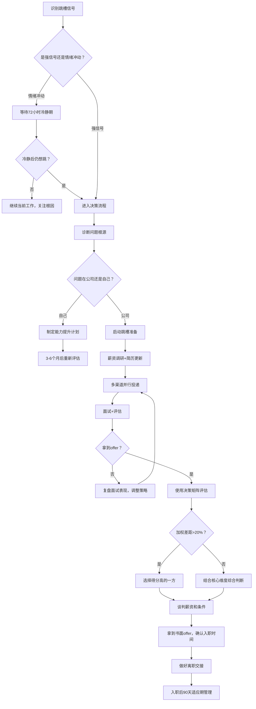

## 五、跳槽决策框架：理性规划每一次职业变动

跳槽是职业生涯中最重要的决策之一。一次成功的跳槽可以加速职业发展、大幅提升收入；一次失败的跳槽则可能浪费数年积累、甚至中断职业轨迹。本章提供一套系统化的跳槽决策框架，帮助你从信号识别、时机选择、决策评估到谈判落地，每一步都做到理性、有据、可控。

### 5.1 跳槽的本质：职业资本的再配置

跳槽不是"逃离"，而是"主动选择"。理解这个本质区别，是做出理性决策的前提。

#### 5.1.1 职业资本的四个维度

每一次跳槽，本质上是在四个维度上重新配置你的职业资本：

| 资本维度 | 含义 | 跳槽时的变化 |
|---------|------|------------|
| **能力资本** | 你的技能、经验、知识储备 | 新岗位能否让你学到新技能？旧技能是否贬值？ |
| **人脉资本** | 行业内的人脉网络、口碑 | 换环境意味着人脉重建成本 |
| **品牌资本** | 你的职业标签、行业认知 | 平台光环是否能加持你的个人品牌？ |
| **财务资本** | 薪资、期权、福利等 | 短期收益与长期回报的权衡 |

**关键洞察**：很多人跳槽只看薪资（财务资本），忽略了能力资本和品牌资本。一个能让你能力跃迁的岗位，长期价值远超眼前多出的几千块月薪。

#### 5.1.2 跳槽的两种模式

| 模式 | 特征 | 适用场景 | 风险等级 |
|------|------|---------|---------|
| **防御型跳槽** | 对当前环境不满，"逃离"为导向 | 公司裁员、领导PUA、行业衰退 | 高——容易"入坑" |
| **进攻型跳槽** | 对目标机会明确，"奔向"为导向 | 有更好的平台/岗位/方向 | 低——目标清晰可控 |

进攻型跳槽的成功率远高于防御型。本章的核心目的，就是帮你在跳槽时从防御型转向进攻型。

### 5.2 何时应该跳槽：信号识别系统

#### 5.2.1 强信号：必须认真考虑跳槽

以下信号出现两个以上，说明你当前的工作环境已经产生了系统性问题，短期内不太可能自行改善：

**信号一：薪资严重偏离市场**

当你的薪资低于市场水平30%以上，且公司没有调薪计划时，说明公司对你的价值评估与市场严重脱节。验证方法：在脉脉、offershow、levels.fyi等平台查询同岗位薪资中位数，或通过猎头获取市场行情。如果差距确实存在且公司HR明确表示无调整空间，这是一个强信号。

**信号二：成长停滞**

连续2年以上没有晋升、没有新项目、没有新技能的学习机会。判断标准：回顾过去12个月，你的简历上能新增哪些有价值的项目或技能？如果答案是"几乎没有"，说明你在原地踏步。

**信号三：价值观冲突**

直属领导的管理方式与你的工作理念严重冲突，或公司文化与你的核心价值观不匹配。价值观冲突不会随时间改善——只会加剧。这是最不可调和的信号。

**信号四：行业/公司不可逆衰退**

公司业务持续下滑、核心团队大批离职、行业受到政策性打击。注意区分"短期困难"和"不可逆衰退"：前者可能蕴含机会（如转型期的创业公司），后者需要果断撤离。

**信号五：身心健康持续受损**

长期高压导致失眠、焦虑、抑郁，或工作时间严重挤占生活（如持续996且无补偿）。健康是一切职业发展的基础，当工作开始系统性损害健康时，优先级必须调整。

**信号六：技能天花板**

你的核心技能在当前岗位上已经达到天花板，无法继续深化或拓展。这在技术岗位尤为常见——如果一个技术团队长期使用老旧技术栈、不接受新技术，你的技术能力会逐渐贬值。

#### 5.2.2 弱信号：需要观察但不必急于行动

以下情况需要关注，但不构成立即跳槽的理由：

- 最近一次绩效不理想——先分析原因，是自身问题还是环境问题
- 和某个同事有矛盾——局部人际问题可以通过沟通解决
- 某个项目失败——项目失败是常态，关键是能否从中学习
- 短期内工作压力增大——可能是临时性的项目冲刺

#### 5.2.3 反信号：不建议跳槽的情况

| 反信号 | 原因 | 建议做法 |
|--------|------|---------|
| 入职不到1年就跳 | 频繁跳槽损害职业品牌，且你可能还没看到全貌 | 除非极端情况（如公司倒闭），否则至少待满18个月 |
| 裸辞 | 没有下家、没有储蓄、没有计划，三无状态 | 骑驴找马，保持在职状态 |
| 情绪冲动 | 被领导批评后立刻想走 | 等72小时冷静期后再做决定 |
| 问题出在自己 | 频繁与人冲突、无法完成任务、适应困难 | 先解决自身问题，否则换环境也一样 |
| 年终奖将发 | 跳到新公司前3个月可能没有奖金覆盖损失 | 计算总账，除非新offer能完全覆盖 |

### 5.3 跳槽的黄金法则

#### 5.3.1 法则一：每次跳槽必须是一次"升级"

升级体现在五个维度中至少两个：

薪资升级：涨幅建议≥20%，低于10%的跳槽价值不大
职级升级：从P6到P7、从专员到经理、从工程师到架构师
平台升级：从小公司到大厂、从传统行业到互联网
行业升级：从夕阳行业到朝阳行业
能力升级：接触更大的业务规模、更复杂的技术架构

**反面案例**：小王在A公司做Java开发，薪资15K。因和领导不和跳到B公司做Java开发，薪资16K。看似涨了1K，但扣掉跳槽成本（适应期、试用期风险、年终奖损失），实际是亏的。而且一年后他的简历上多了一条"入职不到一年离职"的记录。

**正面案例**：小李在A公司做后端开发，薪资15K。她花了3个月时间系统学习大数据技术，拿到了B公司数据工程师的offer，薪资22K，职级P6。这次跳槽在薪资、能力、方向三个维度都实现了升级。

#### 5.3.2 法则二：控制跳槽频率

跳槽频率与职业阶段的关系：

| 职业阶段 | 推荐在岗时长 | 可接受跳槽频率 | 原因 |
|---------|------------|-------------|------|
| 探索期（0-3年） | 1.5-2.5年 | 每2-3年一次 | 早期需要快速试错，找到方向 |
| 成长期（3-8年） | 2-4年 | 每3-4年一次 | 需要深度积累，频繁跳不利于专业沉淀 |
| 成熟期（8-15年） | 3-5年 | 每4-5年一次 | 管理经验需要时间沉淀，短期跳无法展现领导力 |
| 专家期（15年+） | 5年以上 | 5年以上一次 | 这个阶段靠深度和口碑，频繁跳是减分项 |

**注意**：以上是"理想频率"，不是死规则。如果遇到强信号，该跳就跳，不要为了凑时间而忍耐。

#### 5.3.3 法则三：骑驴找马，绝不裸辞

裸辞的真实成本（很多人低估了）：

- **财务成本**：假设月支出8000元，裸辞后3个月找到工作，至少需要2.4万元储蓄，加上社保公积金自缴、失业期间的额外支出，实际需要准备3-4万元
- **心理成本**：没有收入来源时，焦虑感会严重影响面试表现和判断力
- **议价成本**：在职状态谈薪资和失业状态谈薪资，心态完全不同，HR也更倾向于压低"急需工作"候选人的报价
- **时间成本**：裸辞后你可能在焦虑中做出次优选择，反而浪费更多时间

**唯一的例外**：你有6个月以上的生活费储蓄、明确的学习/转型计划、且当前工作正在严重损害你的身心健康。即便如此，也要先拿到至少一个offer再离职。

#### 5.3.4 法则四：做好离职交接，维护口碑

职场圈子比你想象的小得多。尤其是垂直行业（金融、互联网、法律等），圈内人的互相打听是常态。

**离职交接清单**：

1. 完成手头项目的交接文档，包含：项目背景、技术方案、待办事项、潜在风险
2. 与接手人进行至少2次正式的知识转移会议
3. 清理个人物品和账号，交还公司资产
4. 向直属领导正式道别，表达感谢（即使你对领导有意见）
5. 不在公开场合评价前公司——好话可以说，坏话不要讲

### 5.4 跳槽的时机选择

#### 5.4.1 年度招聘节奏

中国职场的招聘有明显的季节性规律：

| 时间段 | 招聘热度 | 原因 | 适合跳槽的策略 |
|--------|---------|------|-------------|
| 1-2月 | ★★☆ | 春节前后，招聘启动期 | 适合提前投递，抢占先机 |
| 3-4月 | ★★★ | 年后跳槽潮+企业新财年预算 | 最佳窗口期之一，岗位多、竞争也多 |
| 5-6月 | ★★☆ | 年中，相对平稳 | 竞争较小，适合"捡漏" |
| 7-8月 | ★☆☆ | 暑期淡季 | 不推荐主动跳槽，除非有明确机会 |
| 9-10月 | ★★★ | 秋招+企业年底冲刺 | 最佳窗口期之一，大量岗位释放 |
| 11-12月 | ★★☆ | 年底收尾期 | 部分公司有年底招聘指标，可以关注 |

#### 5.4.2 特殊时机

以下时机需要特别判断：

**公司融资/上市后**

公司刚完成大额融资或上市后，往往会有一波组织调整。部分老员工可能因期权兑现而离开，团队面临重组。这对你可能是机会（新的晋升空间），也可能是风险（管理混乱）。观察3-6个月再做判断。

**行业政策利好期**

当某个行业获得政策支持时（如新能源、AI、芯片等），人才需求会快速上升。抓住政策红利期跳槽，不仅容易拿到offer，议价空间也更大。

**领导变动期**

直属领导离职或更换时，是一个需要谨慎判断的时机。新领导可能会带来新机会（新的方向、新的授权），也可能带来不确定性（新领导可能带自己的人）。建议观察新领导的管理风格和用人理念后再做决定。

#### 5.4.3 需要避开的时机

| 时机 | 原因 | 建议 |
|------|------|------|
| 公司裁员期 | 裁员通常有N+1或更多的补偿，跳槽意味着放弃补偿 | 等裁员补偿到手后再找新工作 |
| 年终奖发放前 | 大多数公司的年终奖在次年3-4月发放 | 除非新offer能完全覆盖损失，否则等发完再走 |
| 经济下行期 | 岗位少、竞争大、企业压薪严重 | 除非你有确定的更好机会，否则守住当前岗位 |
| 试用期期间 | 新公司刚入职就想走，简历会非常难看 | 除非遇到极端情况，否则至少待满1年 |

### 5.5 跳槽决策矩阵：量化你的选择

#### 5.5.1 决策矩阵的使用方法

不要凭"感觉"做跳槽决定。用量化的方式评估，可以过滤掉情绪干扰，看到真实的利弊对比。

**步骤一：确定评估维度和权重**

根据你当前的人生阶段和职业目标，为每个维度分配权重。例如：

- 如果你处于职业早期（0-5年），成长空间的权重应该最高
- 如果你处于成家立业期（28-35岁），薪资和工作生活平衡的权重会上升
- 如果你处于转型期，行业方向和能力提升的权重最重要

**步骤二：分别打分**

对当前工作和新机会分别打1-10分。打分时要求自己给出具体理由，不能凭感觉。

**步骤三：计算加权总分**

将每个维度的得分乘以权重，然后求和。

**步骤四：综合判断**

加权总分差距>20%时，选择得分高的一方。差距在10-20%之间，需要结合核心维度判断。差距<10%时，说明两个选择差不多，优先选更稳定的。

#### 5.5.2 决策矩阵模板

| 评估维度 | 权重（可调整） | 当前工作（1-10） | 新机会（1-10） | 当前加权 | 新机会加权 |
|---------|-------------|---------------|-------------|---------|----------|
| 薪资福利 | 20% | ？分 | ？分 | =分数×20% | =分数×20% |
| 成长空间 | 25% | ？分 | ？分 | =分数×25% | =分数×25% |
| 工作内容 | 20% | ？分 | ？分 | =分数×20% | =分数×20% |
| 企业文化 | 15% | ？分 | ？分 | =分数×15% | =分数×15% |
| 工作生活平衡 | 10% | ？分 | ？分 | =分数×10% | =分数×10% |
| 地理位置 | 10% | ？分 | ？分 | =分数×10% | =分数×10% |
| **加权总分** | 100% | | | **？分** | **？分** |

#### 5.5.3 打分参考标准

为避免主观偏差，为每个维度提供具体打分标准：

**薪资福利**：1分=远低于市场（-30%以上）；5分=市场中位数；10分=远高于市场（+50%以上）

**成长空间**：1分=完全停滞，学不到任何新东西；5分=有一定成长但缓慢；10分=快速成长，每天都在学习新技能

**工作内容**：1分=纯粹的重复性劳动，毫无挑战；5分=有挑战但缺乏新意；10分=持续有挑战性的工作，能发挥创造力

**企业文化**：1分=严重内耗、PUA文化、价值观冲突；5分=普通，没有明显好或坏；10分=高度认同，有归属感和使命感

**工作生活平衡**：1分=持续996或更严重；5分=偶尔加班但整体可控；10分=完全弹性，工作生活高度平衡

**地理位置**：1分=通勤超过2小时或需要异地；5分=通勤30-60分钟；10分=远程办公或步行可达

#### 5.5.4 真实案例演示

小张，28岁，后端开发工程师，在某中型互联网公司工作3年，收到一家大厂的offer：

| 评估维度 | 权重 | 当前工作 | 新机会（大厂） | 当前加权 | 新机会加权 |
|---------|------|---------|-------------|---------|----------|
| 薪资福利 | 20% | 6分（年薪30万） | 8分（年薪42万） | 1.2 | 1.6 |
| 成长空间 | 25% | 5分（项目单一） | 8分（大平台、新技术） | 1.25 | 2.0 |
| 工作内容 | 20% | 6分 | 7分 | 1.2 | 1.4 |
| 企业文化 | 15% | 7分（氛围不错） | 5分（大厂内卷） | 1.05 | 0.75 |
| 工作生活平衡 | 10% | 7分 | 4分（996常态化） | 0.7 | 0.4 |
| 地理位置 | 10% | 8分 | 5分（通勤更远） | 0.8 | 0.5 |
| **加权总分** | 100% | | | **6.2** | **6.65** |

加权差距：(6.65-6.2)/6.2 ≈ 7.3%，差距不大。但成长空间和薪资两项核心维度有明显提升。结合小张28岁处于职业成长期，大厂经历对简历有长期加成，建议接受offer。但需要提前做好心理准备，应对更高的工作强度。

### 5.6 如何拿到更好的offer

#### 5.6.1 信息收集：知道你值多少

在开始投递之前，先做好薪资调研：

**渠道一：招聘平台数据**

在Boss直聘、猎聘、拉勾等平台查看同类岗位的薪资范围。注意区分"标价"和"实际offer"——标价通常是上限，实际offer会低10-20%。

**渠道二：薪资透明平台**

- offershow.cn：用户自发上传的真实offer数据
- levels.fyi（外企为主）：各公司各级别薪资详情
- 脉脉职言区：虽然信息质量参差不齐，但可以参考

**渠道三：猎头和同行**

通过猎头了解目标公司的薪资范围（猎头有动力帮你拿到高薪，因为他们的佣金与你的薪资挂钩）。通过同行了解真实到手收入。注意：问薪资时要给对方台阶，比如"我想了解一下市场行情"而不是"你赚多少"。

**渠道四：行业薪酬报告**

各大招聘机构（如智联、前程无忧、猎聘）每年会发布行业薪酬报告，可以作为宏观参考。

#### 5.6.2 多渠道并行，制造竞争

**原则**：至少同时推进3-5个目标公司，创造竞争态势。

多渠道并行的好处：

- **选择权**：拿到多个offer后，你可以对比选择，而不是被动接受
- **议价力**：有竞争offer在手，谈薪资时底气更足
- **容错率**：某个面试失败不影响整体进度
- **信息优势**：通过多家公司的面试，你能更准确地了解市场行情和自身定位

**渠道组合建议**：

| 渠道 | 优势 | 劣势 | 适合场景 |
|------|------|------|---------|
| 内推 | 通过率最高，流程最快 | 需要认识目标公司的人 | 有明确目标公司时 |
| 猎头 | 省时省力，猎头帮你谈薪 | 质量参差不齐，有些猎头不专业 | 中高端岗位（年薪30万+） |
| 招聘平台 | 岗位多、选择广 | 海投效果差，精准投递费时 | 没有明确目标公司时 |
| 官网投递 | 直接高效 | 回复率较低 | 大公司校招或热门社招 |
| 行业社群 | 信息质量高 | 需要长期积累 | 有行业社群资源时 |

#### 5.6.3 面试中的定价策略

**策略一：先让对方出价**

当HR问你期望薪资时，如果可能，先了解对方的预算范围。可以说："我更关心这个岗位能提供的成长空间，薪资方面我相信贵公司有合理的体系，能否先了解一下这个岗位的薪资范围？"

**策略二：给范围不给数字**

如果必须报期望薪资，给一个范围而非精确数字。范围的下限应该是你的真实底线（可以接受的最低价），上限是你认为合理的上限（通常比底线高20-30%）。

例如：你的底线是年薪35万，合理上限是42万，那么报"35-42万"。这样给对方谈判空间，同时锚定了你的价值区间。

**策略三：谈判的是总包而非月薪**

年度总包的构成远比月薪复杂：

年度总包 = 月薪 × 月数 + 年终奖 + 绩效奖金 + 股票/期权（折算年化） + 签字费 + 各类补贴

举例：
方案A：月薪25K × 16个月 = 40万，无股票
方案B：月薪22K × 14个月 = 30.8万 + 股票4年60万（年化15万）= 45.8万

看起来方案B总包更高，但股票的实际价值取决于公司上市前景和股价波动，而方案A的40万是确定性收入。评估总包时，要区分"确定性收入"和"不确定性收入"。

**策略四：谈判的非薪资条件**

薪资谈不动时，可以从其他方面争取：

| 条件 | 谈判空间 | 价值评估 |
|------|---------|---------|
| 签字费 | 较大（很多公司有预算） | 一次性收入，直接补充跳槽损失 |
| 股票/期权 | 中等 | 长期收益，但有不确定性 |
| 弹性工作/远程 | 较大 | 省去通勤时间和成本，隐性价值高 |
| 培训/学习预算 | 较大 | 提升自身能力，长期回报高 |
| 年假天数 | 中等 | 对生活质量有直接影响 |
| 试用期薪资 | 中等 | 试用期打八折是常见做法，争取全额 |
| 搬家补贴 | 较大 | 异地跳槽时尤其重要 |

#### 5.6.4 Offer对比清单

拿到多个offer后，用以下清单做系统对比：

```markdown
## Offer对比清单

### 基础信息
- 公司名称/部门/岗位
- 职级
- 直属领导（是否面过？印象如何？）

### 薪资结构
- 月薪：基本工资 + 绩效工资
- 年薪月数：几个月的工资？
- 年终奖：保底多少？上限多少？往年实际发放情况？
- 股票/期权：数量、行权价、归属周期、上市计划
- 签字费：金额和发放条件
- 各类补贴：餐补、交通、住房、通讯

### 福利保障
- 五险一金基数：是按最低还是按实际工资缴纳？
- 补充商业保险：覆盖范围和额度
- 体检/健康福利
- 其他福利：食堂、健身房、班车等

### 工作条件
- 工作时间：标准工时还是弹性？加班频率？
- 通勤时间：单程多少分钟？
- 团队规模和构成
- 技术栈/工具链
- 试用期长度和薪资

### 发展前景
- 晋升周期和标准
- 培训和学习机会
- 行业前景
- 该岗位的核心工作内容

### 综合评估
- 1年后你可能是什么状态？
- 3年后你可能是什么状态？
- 这个经历对简历的加成有多大？
```

### 5.7 跳槽的风险管理

#### 5.7.1 新公司的"照妖镜"面试

在面试过程中，你不仅在被面试，也在面试公司。通过以下问题识别潜在风险：

**关于团队**：
- "这个岗位是新设的还是有人离职后空出来的？"（如果是后者，问清楚前任为什么离开）
- "团队目前有多少人？过去一年的人员变动情况如何？"（高离职率是危险信号）
- "汇报线是什么？"（层级过多可能意味着决策缓慢）

**关于文化**：
- "团队的工作节奏是什么样的？"（了解真实加班情况）
- "公司最近一次全员大会讨论了什么议题？"（了解公司透明度）
- "您在这家公司最满意和最不满意的是什么？"（面试官的回答能反映真实文化）

**关于业务**：
- "这个岗位所属业务线目前的增长情况如何？"
- "公司未来一年的战略重点是什么？"
- "这个岗位的KPI/OKR是什么？"

**危险信号**：面试官对这些问题回避、模糊回答、或表现出不满，都是需要警惕的信号。

#### 5.7.2 试用期的风险控制

试用期是双向选择的最后窗口。在试用期内重点观察：

| 观察维度 | 关注点 | 红线 |
|---------|--------|------|
| 实际工作内容 | 是否与面试时描述的一致？ | 严重不符（如招的是开发，做的是运维） |
| 加班文化 | 实际加班频率和强度 | 面试说"偶尔加班"，实际天天9点后下班 |
| 团队氛围 | 同事之间的协作方式 | 甩锅文化、信息不透明、勾心斗角 |
| 领导风格 | 直属领导的实际管理方式 | PUA、微观管理、承诺不兑现 |
| 业务前景 | 入职后了解的真实业务状况 | 业务明显在萎缩或方向混乱 |

**如果试用期发现严重问题**：不要硬撑。试用期内离职虽然不好看，但比在一个明显"入坑"的环境里消耗一年要好得多。关键是要想清楚如何在下一次面试中解释这段经历。

#### 5.7.3 跳槽失败的止损策略

如果你入职后发现新公司确实不适合，止损的优先级如下：

1. **入职<3个月**：如果问题严重（如薪资造假、岗位严重不符），果断离职，这段经历可以从简历中删除
2. **入职3-6个月**：评估问题是否可以沟通解决，如果不能，开始骑驴找马
3. **入职6-12个月**：除非极端情况，建议至少待满1年，否则简历会非常难看
4. **入职>1年**：用正常的跳槽流程处理，这段经历不会对简历造成太大负面影响

### 5.8 跳槽后的适应期管理

跳槽不是拿到offer就结束了。入职后的前90天，是决定这次跳槽能否成功的关键期。

#### 5.8.1 前30天：建立认知

**目标**：快速了解业务、团队、文化，建立基本的胜任感。

- 第1周：完成入职手续，认识团队成员，了解工具链和流程
- 第2周：参与团队日常工作，了解当前项目的状态和背景
- 第3-4周：独立完成1-2个小任务，建立初步的工作节奏

**关键原则**：多问、多听、少评判。不要急着"改变"什么，先理解"为什么是这样"。

#### 5.8.2 第31-60天：建立信任

**目标**：通过交付小成果，赢得团队的信任。

- 主动承接一个有挑战性的任务，展示你的能力
- 积极参与团队讨论，提出有建设性的意见
- 与直属领导进行一次正式的中期沟通，了解他对你的期望和评价

#### 5.8.3 第61-90天：建立影响力

**目标**：从"新人"转变为"值得信赖的团队成员"。

- 独立负责一个完整的项目或模块
- 开始为团队带来新的视角或方法（但注意方式，不要让人觉得你在"指手画脚"）
- 与跨部门的同事建立合作关系
- 与直属领导进行试用期总结沟通，确认转正事宜

### 5.9 常见跳槽误区与纠正

| 误区 | 真相 | 纠正方法 |
|------|------|---------|
| "跳槽涨薪最快" | 频繁跳槽的简历会让HR直接过滤，长期来看反而限制了收入天花板 | 每次跳槽间隔至少2年，确保有实质性成长 |
| "大厂一定比小公司好" | 大厂的螺丝钉效应可能限制你的全面发展，小公司可能提供更快的成长 | 根据你的职业阶段选择：早期去大厂学规范，中期去小公司带团队 |
| "涨薪30%就值得跳" | 薪资只是维度之一，如果新公司工作强度翻倍，时薪可能反而下降 | 用"时薪"而非"月薪"评估，同时考虑其他维度 |
| "新公司承诺的一定会兑现" | 口头承诺没有法律效力，入职前一定要拿到书面offer | 所有关键条件（薪资、职级、岗位）必须体现在书面offer中 |
| "跳槽可以解决所有问题" | 如果问题是自身能力不足，换公司也不能解决 | 先诊断问题根源，如果是自身问题，先提升再跳 |
| "越跳越值钱" | 市场对频繁跳槽者的容忍度在下降，尤其在经济下行期 | 保持稳定性的同时，确保每次跳槽都有明确的升级 |
| "被动等猎头联系就够了" | 好机会需要主动争取，被动等待意味着选择权在别人手里 | 主动维护人脉、关注市场、定期面试保持"手感" |

### 5.10 跳槽决策的完整流程图



### 5.11 本章小结

跳槽是一项需要系统规划的职业决策，而非冲动之举。核心要点回顾：

1. **跳槽的本质是职业资本的再配置**，不要只看薪资，要综合评估能力、人脉、品牌、财务四个维度
2. **用信号系统识别跳槽时机**，区分强信号（必须行动）、弱信号（观察等待）、反信号（不要跳）
3. **遵守四条黄金法则**：每次跳槽必须升级、控制频率、骑驴找马、做好交接
4. **用决策矩阵量化选择**，避免凭感觉做决定
5. **掌握offer谈判策略**，多渠道并行、了解总包结构、谈判非薪资条件
6. **做好风险管理**，面试时"照妖镜"、试用期观察、止损策略
7. **跳槽不是终点**，入职后90天的适应期管理同样重要

每一次跳槽，都应该是你职业生涯中深思熟虑的战略动作，而不是被动的逃避行为。
