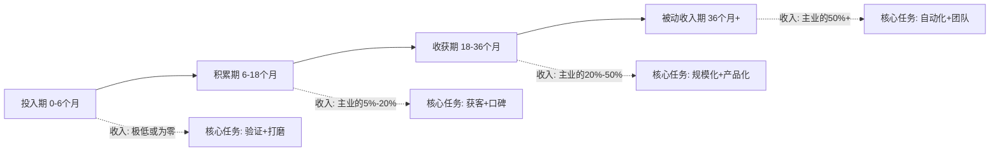
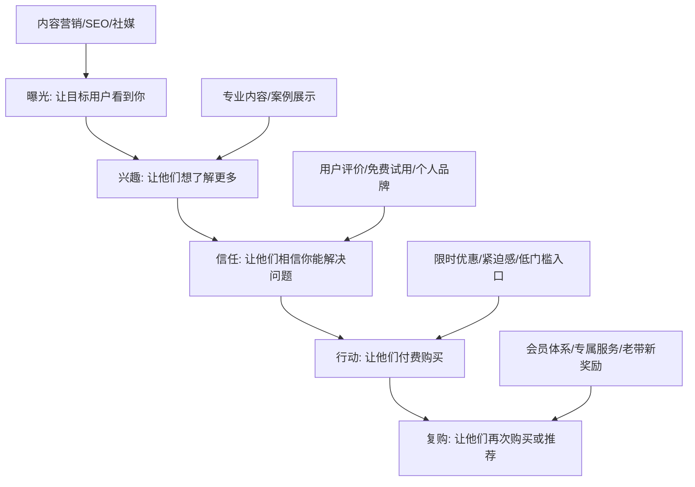
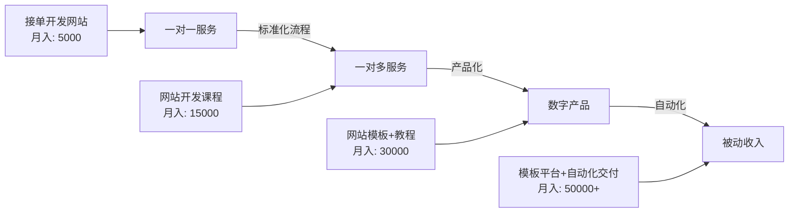
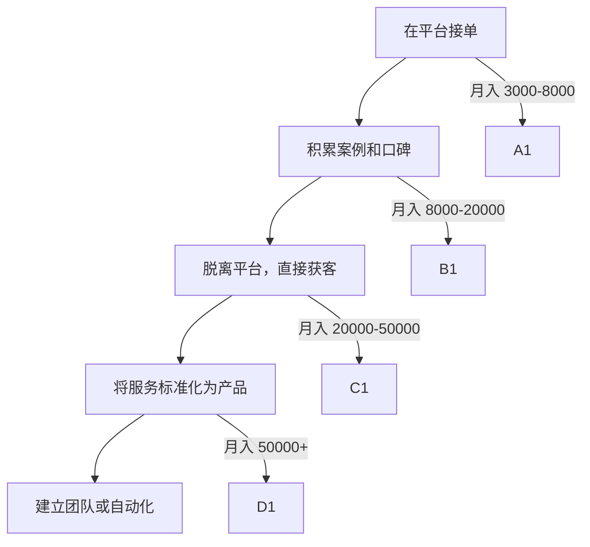

## 六、副业发展策略：构建职业的第二曲线

### 6.1 为什么需要副业：从单一收入到多元抗风险

2023年LinkedIn发布的《中国职场人副业调查报告》显示，超过60%的职场人正在从事或考虑发展副业。这个数字在2019年仅为35%。驱动这一趋势的不只是"想多赚钱"，而是一种深层的生存策略。

**单一收入的本质脆弱性**

把全部经济来源押注在一份工作上，本质上是一种"集中投资"策略。任何投资顾问都会告诉你：集中持仓的风险远高于分散配置。主业遭遇变故（裁员、公司倒闭、行业衰退）时，没有缓冲意味着立刻陷入财务危机。2022年互联网行业的裁员潮中，有副业收入的人平均能支撑6-12个月的生活开支，而仅有工资收入的人平均只能支撑2-3个月。

**副业的六重价值**

| 维度 | 价值 | 具体表现 |
|------|------|----------|
| 财务安全 | 风险对冲 | 主业收入中断时有替代来源，避免财务危机 |
| 能力拓展 | 技能多元化 | 发展主业不需要的能力，增强个人竞争力 |
| 兴趣变现 | 生活意义感 | 将爱好转化为收入，提升工作满足感 |
| 个人品牌 | 影响力建设 | 在垂直领域建立专业形象，获得更多机会 |
| 职业跳板 | 未来选择权 | 成功的副业可以演变为自由职业或创业 |
| 财务自由 | 加速积累 | 多元收入缩短实现财务自由的时间线 |

**副业发展的时间价值曲线**



> **关键认知**：副业不是"快速致富"的手段。多数成功的副业需要12-24个月才能产生可观收入。在投入期，你需要用耐心和策略来对抗"看不到回报就想放弃"的冲动。

---

### 6.2 副业的分类与选择矩阵

#### 6.2.1 六大副业类型详解

| 类型 | 核心逻辑 | 代表形式 | 启动资金 | 启动难度 | 收入上限 | 复利效应 |
|------|----------|----------|----------|----------|----------|----------|
| 技能变现型 | 用现有技能换钱 | 编程接单、设计外包、翻译、咨询 | 0-1000元 | ★★☆ | 中（受限于时间） | 中 |
| 内容创作型 | 用内容换流量，用流量换收入 | 自媒体、短视频、播客、写作 | 0-5000元 | ★★★ | 高 | 极高 |
| 知识付费型 | 把知识打包成产品 | 在线课程、训练营、电子书、模板 | 1000-10000元 | ★★★★ | 极高 | 极高 |
| 电商/贸易型 | 低买高卖的价差利润 | 跨境电商、闲鱼转卖、代购、无货源店 | 5000-50000元 | ★★★ | 高 | 中 |
| 投资理财型 | 用资金换被动收入 | 基金定投、股票、房产、数字资产 | 10000元+ | ★★☆ | 极高 | 高 |
| 社群运营型 | 用信任和关系换收入 | 付费社群、行业交流群、兴趣圈 | 0-2000元 | ★★★ | 中高 | 高 |

#### 6.2.2 副业选择的决策框架

选择副业不是拍脑袋决定，而是一个系统化的决策过程。以下是经过验证的"副业选择五维评估法"：

**维度一：技能匹配度（权重30%）**

你现有的技能越接近副业需求，启动成本越低。程序员做技术自媒体比做手工烘焙的起步速度快10倍。

自检清单：
- 这个副业需要的核心技能我具备吗？
- 我的技能水平在市场中处于什么位置（前50%？前20%？前5%？）
- 我需要多长时间补齐缺失的技能？

**维度二：时间投入可行性（权重25%）**

不同副业类型对时间的要求差异巨大：

| 副业类型 | 周均时间 | 灵活度 | 时间碎片化友好度 |
|----------|----------|--------|------------------|
| 技能接单 | 8-15小时 | 中（有交付deadline） | 低 |
| 自媒体/内容 | 5-10小时 | 高（可自主安排） | 高 |
| 知识付费 | 前期10-20小时/周，后期2-5小时/周 | 高 | 中 |
| 电商 | 5-15小时 | 低（客服、发货有时间要求） | 低 |
| 投资理财 | 2-5小时 | 极高 | 高 |
| 社群运营 | 5-10小时 | 中（需定时互动） | 中 |

**维度三：复利潜力（权重20%）**

真正值得做的副业应该有复利效应——今天的投入能在未来持续产生回报。

- **高复利**：写一本书、录制一门课程、建一个品牌账号。这些作品发布后持续产生价值。
- **中复利**：做咨询、建社群。你的经验和人脉会随时间积累，但需要持续投入时间。
- **低复利**：接外包、跑腿。做了就有钱，不做就没有，本质上还是在卖时间。

**维度四：市场天花板（权重15%）**

你需要评估这个副业的收入上限是否值得投入：

- 小众技能翻译：天花板约5000-8000元/月
- 技术自媒体（公众号+知乎）：天花板约20000-50000元/月
- 在线课程（爆款）：单课收入可达10万-100万+
- 跨境电商（成熟期）：天花板取决于品类，从几万到几百万不等

**维度五：法律合规性（权重10%）**

在开始前必须确认：

1. **劳动合同约束**：仔细阅读你的劳动合同，特别是竞业限制、保密协议、知识产权归属条款。部分公司的合同规定"工作时间内创造的知识产权归公司所有"。
2. **行业监管**：金融类副业需要相关资质（如基金销售需要基金从业资格证）。
3. **税务合规**：副业收入需要依法纳税。年收入超过一定额度需要进行个税申报。

**决策矩阵打分表**

副业选项: _______________

技能匹配度 (1-10): ___  × 0.30 = ___
时间可行性 (1-10): ___  × 0.25 = ___
复利潜力   (1-10): ___  × 0.20 = ___
市场天花板 (1-10): ___  × 0.15 = ___
合规可行性 (1-10): ___  × 0.10 = ___
                         总分: ___

建议同时评估2-3个候选副业，选择总分最高的那个启动。

---

### 6.3 副业发展的五步实操法

#### 第一步：资源盘点与能力审计

不要急着注册账号、开店、发内容。先花一个周末做彻底的自我审计。

**技能审计模板**

```markdown
## 硬技能（可直接变现的技能）
| 技能名称 | 熟练度(1-5) | 市场需求(高/中/低) | 变现路径 | 变现难度 |
|----------|-------------|-------------------|----------|----------|
| 例: Python开发 | 4 | 高 | 接单/技术博客/课程 | 低 |
|          |             |                   |          |          |

## 软技能（间接变现的能力）
| 技能名称 | 熟练度(1-5) | 可变现场景 |
|----------|-------------|-----------|
| 例: 公开演讲 | 3 | 培训讲师、播客主持 |
|          |             |           |

## 兴趣爱好（可探索的方向）
| 兴趣 | 投入时间(小时/周) | 可能的变现方式 |
|------|-------------------|---------------|
| 例: 健身 | 5 | 健身博主、私教 |
|      |                   |               |
```

**时间审计**：连续记录一周的时间使用情况，找出可以腾出给副业的"时间缝隙"。多数人会发现每周至少有10-15小时的可支配时间——通勤、午休、晚间、周末碎片。

#### 第二步：需求验证——先证明有人愿意付钱

这是最关键的一步，也是最多人跳过的一步。

**验证方法一：平台搜索法**

1. 去目标平台（淘宝、闲鱼、Fiverr、Upwork、知乎、小红书）搜索你想做的副业
2. 找到同类服务/产品的前10个卖家
3. 记录他们的：定价、销量、评价内容、客户痛点
4. 如果前10名都有稳定的销量和好评，说明市场真实存在

**验证方法二：朋友圈测试法**

在朋友圈或社群发布一条"软广告"，例如：

> "最近在研究[你的技能方向]，有没有朋友有这方面的需求？可以免费帮你做一次体验。"

如果收到3个以上的积极回应，说明需求真实存在。如果无人问津，要么是你的表达有问题，要么是需求不存在。

**验证方法三：MVP最小可行产品法**

用最低成本做出一个"样品"，投入市场测试：

- **内容类**：写3-5篇垂直领域的深度文章，发布到知乎/公众号，看自然流量和互动
- **服务类**：在闲鱼上架一项低价服务（定价为市场价的50%），看是否有人下单
- **产品类**：做一个简单的产品原型或样品，在社群里展示，看反馈

**验证的三个关键指标**：

| 指标 | 合格标准 | 不合格处理 |
|------|----------|-----------|
| 有人主动询问 | 至少3次/周 | 调整定位或渠道 |
| 有人愿意付费 | 至少1次/周 | 价格或价值主张有问题 |
| 客户主动推荐 | 至少1次/月 | 产品/服务质量需提升 |

> **常见陷阱**：不要用"我觉得市场需要"来代替验证。你的直觉可能是错的。花2-4周做需求验证，能避免浪费几个月的时间做没人要的东西。

#### 第三步：作品集与冷启动

验证通过后，进入"冷启动"阶段。核心任务是积累最初的一批案例和口碑。

**冷启动的三种策略**

**策略A：免费/低价换案例**（适合服务型副业）

前3-5个客户可以免费或半价提供服务，条件是：允许你展示案例、留下真实评价、为你推荐新客户。这不是"亏本"，而是在投资你的作品集。

**策略B：内容先行**（适合内容型副业）

先持续输出30-50篇高质量内容，建立初步的粉丝基础和专业形象。内容不需要篇篇爆款，但需要保持一致的质量和风格。

**策略C：参加平台活动**（适合电商型副业）

利用平台的新人扶持政策（如淘宝新店流量扶持、闲鱼曝光加权），在扶持期内快速积累销量和评价。

**作品集建设要点**

- 选择3-5个最能体现你能力水平的案例
- 每个案例包含：客户需求、你的方案、最终效果、客户反馈
- 用数据量化成果（"帮客户提升了30%的转化率"比"帮客户优化了网站"有力100倍）
- 定期更新，替换为更好的案例

#### 第四步：获客渠道与转化漏斗

有了案例和口碑，接下来需要系统化地获取客户。

**获客渠道矩阵**

| 渠道类型 | 代表平台 | 适合的副业类型 | 获客成本 | 转化周期 |
|----------|----------|---------------|----------|----------|
| 搜索流量 | 百度、知乎、Google | 技能服务、知识付费 | 低 | 长（1-4周） |
| 社交推荐 | 朋友圈、社群、微博 | 所有类型 | 极低 | 短（1-3天） |
| 内容平台 | 小红书、B站、抖音 | 内容创作、知识付费 | 低 | 中（1-4周） |
| 电商平台 | 淘宝、闲鱼、拼多多 | 电商、技能服务 | 中 | 短（1-3天） |
| 垂直平台 | 猪八戒、Upwork、程序员客栈 | 技能服务 | 中 | 短（1-7天） |
| 付费投放 | 信息流广告、SEM | 知识付费、电商 | 高 | 短（即时） |

**转化漏斗设计**



**从流量到成交的关键转化率基准**

- 内容到关注：3%-8%（优质内容可到15%）
- 关注到咨询：5%-15%
- 咨询到成交：20%-40%（取决于信任建立程度）
- 成交到复购：30%-60%（取决于服务体验）

如果某个环节的转化率低于基准，说明该环节存在需要优化的问题。

#### 第五步：规模化与产品化

当副业月收入稳定达到主业收入的20%-30%时，你应该开始思考规模化。

**从卖时间到卖产品的转型路径**



**产品化的四种形式**

1. **课程/教程**：把你的服务过程录制成视频课程。一次制作，反复销售。定价99-999元，一个爆款课程可以月入数万。
2. **模板/工具**：把常用的方案、模板、工具包打包销售。定价19-199元，适合标准化程度高的领域。
3. **会员/订阅**：提供持续的价值（每周内容更新、社群答疑、资源库），按月收费。定价99-299元/月，核心是留存率。
4. **自动化服务**：用工具和系统替代人工操作。例如用AI自动处理初级咨询，用SaaS工具自动交付设计模板。

**团队化的时机判断**

当你满足以下两个以上条件时，可以考虑招人：

- 副业月收入稳定超过1万元，且持续3个月以上
- 你每周在副业上花费超过20小时
- 有明确的重复性工作可以外包（客服、设计、剪辑）
- 接单量超过你的交付能力，不得不拒绝客户

---

### 6.4 副业的时间管理：在有限时间中创造最大价值

副业最大的敌人不是能力不足，而是时间不够。平衡主业和副业需要极度的时间纪律。

#### 6.4.1 时间分配原则

**原则一：主业时间神圣不可侵犯**

永远不要在工作时间做副业。这不仅是职业道德问题，更是风险控制——一旦被发现，你可能同时失去主业和副业。

**原则二：固定时间段比随机时间更有效**

人体的精力管理遵循"节律"。把副业安排在固定的时间段，你的大脑会自动进入工作状态，减少启动成本。

推荐的时间块分配方案：

| 时段 | 适合的副业活动 | 可用时间 | 效率评级 |
|------|---------------|----------|----------|
| 早起 5:30-7:00 | 深度创作（写作、编程） | 1.5小时 | ★★★★★ |
| 通勤路上 | 学习、素材收集、语音记录 | 0.5-1小时 | ★★★☆☆ |
| 午休 | 简单任务（回复消息、社媒互动） | 0.5小时 | ★★☆☆☆ |
| 晚间 20:00-22:00 | 核心副业工作 | 2小时 | ★★★★☆ |
| 周末上午 | 批量内容生产、深度项目 | 3-4小时 | ★★★★★ |

**原则三：精力管理优于时间管理**

不是所有时间都是等价的。在精力最好的时段做最有价值的事（深度创作、策略规划），在精力低谷时做机械性任务（回复消息、整理素材）。

#### 6.4.2 高效执行工具箱

**任务管理**：用"时间块"而非"待办清单"管理副业任务。待办清单告诉你"要做什么"，时间块告诉你"什么时候做"。

每周日晚上花15分钟做下周的副业计划：

```markdown
## 本周副业计划 (日期: ____)

### 周一 早起 5:30-7:00
- [ ] 写文章初稿 (预计60分钟)
- [ ] 整理素材 (预计30分钟)

### 周二 晚间 20:00-22:00
- [ ] 修改文章并发布 (预计60分钟)
- [ ] 回复用户评论 (预计30分钟)
- [ ] 规划下期内容 (预计30分钟)

### 周六 上午 8:00-12:00
- [ ] 批量录制视频 (预计180分钟)
- [ ] 剪辑并发布 (预计60分钟)
```

**精力保护策略**：

- 副业工作前进行5分钟的"仪式"（泡杯茶、整理桌面、播放固定音乐），帮助大脑切换状态
- 使用番茄工作法（25分钟专注+5分钟休息），避免疲劳导致的效率下降
- 每周至少留出1天完全不碰副业，防止倦怠

---

### 6.5 副业的风险控制与法律合规

#### 6.5.1 法律风险清单

**劳动合同审查要点**

在启动副业前，重新阅读你的劳动合同，重点关注以下条款：

1. **竞业限制条款**：是否限制你在同行业从事类似工作？竞业限制的范围、地域、期限是什么？
2. **知识产权归属**：你在工作时间之外、使用个人设备创造的成果，是否也归公司所有？
3. **兼职禁止条款**：合同是否明确禁止兼职？违反的后果是什么？
4. **保密义务**：副业是否会涉及公司商业秘密或客户信息？

> **实务建议**：如果你的合同中有模糊的条款，建议咨询劳动法律师（费用约500-2000元/次）。预防性的法律咨询远比事后的纠纷处理便宜。

**知识产权风险**

- 不要在副业中使用公司的代码、设计素材、客户名单等资源
- 不要在副业中使用公司的商标、品牌元素
- 如果你的副业作品使用了开源组件，注意遵守开源协议
- 保留所有创作过程的原始文件和时间戳，作为原创性的证据

**税务合规**

副业收入属于个人所得，需要依法纳税：

| 收入类型 | 适用税目 | 税率 | 申报方式 |
|----------|----------|------|----------|
| 兼职/劳务报酬 | 劳务报酬所得 | 20%-40%（预扣） | 支付方代扣代缴 |
| 经营所得 | 经营所得 | 5%-35% | 自行申报 |
| 稿酬所得 | 稿酬所得 | 20%（减征30%） | 支付方代扣代缴 |
| 年度汇算 | 综合所得 | 3%-45% | 次年3-6月自行办理 |

**实务建议**：当副业月收入超过5000元时，建议注册个体工商户或个人独资企业。可以享受小规模纳税人优惠政策，综合税负通常低于劳务报酬。

#### 6.5.2 时间与健康风险

**副业倦怠的预警信号**

- 每天醒来想到副业就感到疲惫
- 副业工作质量明显下降
- 开始影响主业的表现和心情
- 社交生活几乎为零
- 身体出现失眠、头痛、胃痛等症状

出现以上任何两个信号时，应该立即暂停副业1-2周，重新评估节奏。

**时间投入的安全红线**

- 每周副业时间不超过15小时（含周末）
- 每天睡眠不少于7小时
- 每周至少1天完全休息
- 每月至少2次社交活动

#### 6.5.3 财务风险控制

**启动成本控制原则**

- 任何副业的初始投入不应超过你3个月的可支配收入
- 优先选择"零成本启动"或"低成本验证"的副业
- 不要为了副业购买昂贵的设备、课程、工具——先用免费方案验证可行性
- 避免加盟类副业（通常需要高额加盟费，且回报不确定）

**副业亏损的止损线**

设定明确的止损规则：

- 连续3个月副业收入为零，且没有增长趋势→重新评估方向
- 累计投入超过1万元但未见到回报→暂停投入，分析原因
- 副业开始侵蚀主业收入（如因疲劳导致绩效下降）→减少副业投入或暂停

---

### 6.6 各类型副业的实操指南

#### 6.6.1 技能变现型副业实操

**适合人群**：拥有编程、设计、写作、翻译、咨询等专业技能的职场人。

**冷启动路径**：

1. **选定细分领域**：不要做"设计师"，要做"电商详情页设计师"或"UI动效设计师"。越细分，竞争越小，溢价越高。
2. **建立线上作品集**：使用Behance、Dribbble（设计）、GitHub（开发）、个人博客（写作/翻译）展示能力。
3. **入驻垂直平台**：
   - 设计类：猪八戒、站酷、千图网
   - 开发类：程序员客栈、码市、Upwork
   - 翻译类：有道人工翻译、Gengo、ProZ
   - 咨询类：在行、知乎付费咨询
4. **定价策略**：新手期按市场价的60%-70%定价，积累10个好评后提价到市场价水平，建立口碑后可以溢价20%-50%。

**从接单到产品的进阶路线**：



#### 6.6.2 内容创作型副业实操

**适合人群**：有表达欲望、愿意持续输出、对某个领域有深度理解的人。

**平台选择策略**：

| 平台 | 内容形式 | 变现方式 | 起步周期 | 适合领域 |
|------|----------|----------|----------|----------|
| 公众号 | 长文 | 广告、付费阅读、引流 | 3-6个月 | 深度分析、行业洞察 |
| 知乎 | 问答+文章 | 知+、付费咨询、引流 | 1-3个月 | 专业知识、经验分享 |
| 小红书 | 图文+短视频 | 品牌合作、电商引流 | 1-3个月 | 生活方式、种草 |
| B站 | 长视频 | 创作激励、广告、带货 | 3-12个月 | 教程、评测、Vlog |
| 抖音 | 短视频 | 直播带货、广告、引流 | 1-6个月 | 泛娱乐、实用技巧 |
| 播客 | 音频 | 广告、付费节目、引流 | 6-12个月 | 深度对话、行业分析 |

**内容创作的"日更or精更"策略**

- **日更模式**（适合图文平台如公众号、知乎）：每天发布1篇800-1500字的中等质量内容。优势是快速积累内容量和曝光，劣势是容易疲劳。
- **精更模式**（适合视频平台如B站）：每周发布1-2篇高质量长内容。优势是单篇影响力大，劣势是起步慢。
- **推荐策略**：新手期用日更快速试错（1-2个月），找到受欢迎的内容方向后切换为精更，追求质量和深度。

#### 6.6.3 知识付费型副业实操

**适合人群**：在某个领域有系统化知识和实战经验的人。

**知识付费产品阶梯**

从低到高，逐步建立你的产品线：

1. **免费内容**（引流品）：知乎回答、公众号文章、B站视频。目的：吸引目标用户，建立信任。
2. **低价产品**（9.9-49元）：电子书、模板包、入门课。目的：筛选付费意愿用户。
3. **中价产品**（99-299元）：系统课程、训练营。目的：提供核心价值，获取主要收入。
4. **高价产品**（999-4999元）：一对一辅导、VIP社群、年度会员。目的：服务高价值用户，获取高利润。

**课程制作的核心流程**


**课程大纲设计的"痛点-路径-成果"框架**：

- **痛点**：学员当前面临什么问题？（用学员的语言描述）
- **路径**：解决这个问题需要经历哪些步骤？（每个步骤=一个课程模块）
- **成果**：学完后学员能达到什么状态？（可量化的目标）

> **经验法则**：一门99元的在线课程，如果有1000人购买，收入就是99000元。制作一门高质量课程可能需要2-4周的集中投入，但之后的收入是持续的。这就是知识付费的魅力——用时间换产品的复利。

---

### 6.7 副业发展的常见误区与纠正

#### 误区一：什么火做什么

**症状**：看到别人做短视频赚钱就去做短视频，看到别人做跨境电商就去做跨境电商。

**问题**：追风口意味着你永远在和已经在那个领域深耕多年的人竞争。等你学会基础操作，风口可能已经过了。

**纠正**：选择与你现有技能和兴趣最匹配的副业方向，然后用12-18个月建立壁垒。真正的风口是"你的能力+市场需求"的交集。

#### 误区二：过早追求完美

**症状**：课程大纲改了10遍还没开始录制，公众号logo设计了3版还没发第一篇文章。

**问题**：完美主义是行动力的最大敌人。市场不等人，你的竞争对手已经在迭代了。

**纠正**：设定"60分就发布"的标准。先发布，再根据反馈优化。第一版一定不完美，但不发布的东西永远不会有反馈。

#### 误区三：低估冷启动期

**症状**：做了一个月，赚了不到100块钱，觉得这个方向不行，换一个。

**问题**：大多数副业需要6-12个月才能看到稳定收入。频繁更换方向意味着你永远在"冷启动"阶段。

**纠正**：给自己设定一个最短的投入期限（建议至少6个月），在期限内全力投入，不做方向性调整。6个月后再评估是否继续。

#### 误区四：忽视个人品牌建设

**症状**：只在平台接单，不经营个人账号、不输出内容、不建立影响力。

**问题**：平台上的竞争是价格战，个人品牌的价值是溢价。没有品牌，你就只是一个"编号"，客户随时可以换人。

**纠正**：从做副业的第一天起就开始建设个人品牌。定期在社交媒体分享你的专业见解、项目经验、学习心得。即使初期没人看，3-6个月后你会发现主动找上门的客户越来越多。

#### 误区五：主业副业本末倒置

**症状**：因为副业影响了主业的投入，导致绩效下降、收入减少。

**问题**：在副业收入没有稳定超过主业之前，主业才是你的经济根基。失去主业意味着失去做副业的底气和资源。

**纠正**：设定明确的"切换条件"。例如：只有当副业收入连续6个月超过主业收入时，才考虑减少主业投入或转为全职做副业。

---

### 6.8 从副业到自由职业：何时可以全职做副业

当副业发展到一定阶段，你会面临一个重要抉择：要不要辞职全职做副业？

**辞职的五个必要条件**（缺一不可）

1. **收入条件**：副业月收入连续6个月达到主业收入的1.5倍以上（1.5倍而非1倍，是因为副业收入波动更大，需要更高的安全边际）
2. **积蓄条件**：拥有至少12个月生活开支的储蓄（作为收入波动的缓冲）
3. **客户条件**：拥有至少20个稳定客户或5000+粉丝（证明你的收入不是昙花一现）
4. **系统条件**：副业已经建立了可重复的获客和交付流程（不完全依赖你个人的临场发挥）
5. **家庭条件**：获得家人或伴侣的理解和支持（全职副业的压力远大于兼职）

**过渡策略：渐进而非跳跃**

不建议直接辞职。更安全的过渡方式：

1. **阶段一（1-3个月）**：申请减少工作时间（如从全职转为4天工作制），用多出的一天投入副业
2. **阶段二（3-6个月）**：申请无薪休假或停薪留职，全职尝试副业1-3个月
3. **阶段三（确认可行后）**：正式辞职，全职投入副业/自由职业

> **底线思维**：即使辞职后副业失败了，你要确保自己能重新找到主业。保持行业人脉、持续学习、维护职业形象，这些都是你的"退路保险"。

---

### 6.9 副业发展的工具箱推荐

| 类别 | 工具 | 用途 | 价格 |
|------|------|------|------|
| 项目管理 | Notion、飞书文档 | 副业任务管理、知识库 | 免费/低价 |
| 时间管理 | 滴答清单、番茄Todo | 时间块管理、专注计时 | 免费/低价 |
| 内容创作 | Canva、剪映、稿定设计 | 海报、视频、图文制作 | 免费/低价 |
| 自媒体运营 | 新榜、西瓜数据 | 数据分析、选题参考 | 免费/付费 |
| 电商平台 | 闲鱼、拼多多、Shopify | 产品销售 | 平台佣金 |
| 知识付费 | 小鹅通、知识星球、Teachable | 课程/社群搭建 | 平台佣金/月费 |
| 收款工具 | 微信收款、支付宝商家码 | 收款 | 免费 |
| 财务管理 | 随手记、Excel | 收支记录、利润计算 | 免费 |
| AI辅助 | ChatGPT、Claude、MidJourney | 内容辅助、设计辅助 | 免费/订阅费 |

---

### 6.10 本章小结

**核心行动清单**

1. **本周**：完成技能审计和时间审计，列出2-3个候选副业方向
2. **本月**：对首选方向进行需求验证（平台搜索+朋友圈测试+MVP测试）
3. **1-3个月**：完成冷启动，积累3-5个案例和初始口碑
4. **3-6个月**：优化获客渠道，建立稳定的收入来源
5. **6-12个月**：开始产品化转型，探索从卖时间到卖产品的路径
6. **12个月+**：评估是否具备全职转型条件

**记住三个核心原则**：

- **先验证后投入**：不要凭感觉做副业，用数据和市场反馈验证方向
- **先兼职后全职**：在副业收入稳定超过主业之前，不要轻易辞职
- **先复利后规模**：优先选择有复利效应的副业方向，然后才是考虑规模化

副业不是一蹴而就的事，而是一场长期主义的修行。用耐心浇灌，用策略引导，你的"第二曲线"终将成长为主业之外的坚实支撑。
