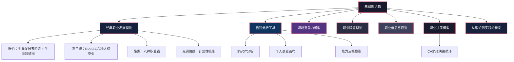
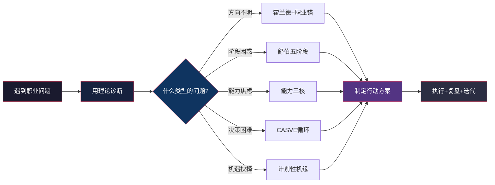

## 一、引言：为什么需要理论指导

### 1.1 一个普遍存在的困境

在职业发展的道路上，大多数人的决策模式惊人地相似：觉得当前工作没意思就跳槽，看到某个行业火就转行，听说某公司待遇好就投简历，朋友圈里谁晒了高薪就焦虑一阵。这种"跟着感觉走"的模式，本质上是一种**无框架决策**——没有分析模型，没有评估标准，没有长期视角，只有当下的情绪和碎片化的信息。

这种模式带来的后果是什么？

- **频繁的职业摇摆**：每1-2年换一次方向，每次都要从零开始积累，到头来什么都没有沉淀
- **错失发展良机**：在该深耕的时候选择了离开，在该转型的时候选择了坚守
- **越跳越差的恶性循环**：每次跳槽看似解决了眼前的不满，却积累了更大的长期问题
- **职业倦怠提前到来**：缺乏意义感和方向感，工作沦为纯粹的谋生手段

LinkedIn《2025全球职场趋势报告》的数据印证了这一点：超过67%的职场人对自己的职业发展方向感到迷茫。而另一组数据更加触目惊心——那些拥有清晰职业规划的人，其薪资增长速度是无规划者的**2.3倍**。这个差距不是来自天赋、学历或运气，而是来自**有没有一套经得起验证的思维框架**。

### 1.2 理论到底能做什么

管理学大师彼得·德鲁克说过一句被广泛引用的话："没有什么比高效地做一件根本不该做的事更徒劳的了。"这句话精准地揭示了理论的核心价值——**它帮助我们首先确认"该做什么"，然后才是"如何高效地做"**。

具体来说，一套好的职业发展理论能为你提供三样东西：

**第一，理解底层规律。**

职业发展不是随机事件，它有迹可循。为什么有些人35岁就遭遇职业危机，而有些人55岁还在上升通道？为什么有些人频繁跳槽反而越跳越好，而有些人越跳越差？这些现象背后都有规律。理论的价值在于，它把这些规律从无数个体经验中提炼出来，让你不必亲自踩遍所有的坑。

举一个具体的例子。施恩（Edgar Schein）的职业锚理论指出，大多数人在工作前5-10年逐渐发现自己的"职业锚"——也就是你无论如何都不会放弃的核心价值观和能力组合。如果你是一个"技术/职能能力型"的人，却被组织推上了管理岗位，短期看是升职，长期看却是痛苦的开始——因为你被迫离开了让你最有动力、最能发挥的领域。如果提前了解这个理论，你就能在面对"技术转管理"的机会时做出更理性的判断，而不是盲目接受。

**第二，提供分析框架。**

面对职业选择时，大多数人依赖的是直觉和情绪。而理论提供的是一套结构化的分析工具——它把一个复杂的决策拆解成可评估的维度，让你看到直觉看不到的东西。

比如，当你纠结"要不要跳槽"时，个人商业画布（Personal Business Model Canvas）会引导你从九个维度审视自己的职业模式：核心资源、关键活动、价值主张、客户群体、渠道通路、客户关系、收入来源、成本结构、合作伙伴。这九个维度覆盖了你可能忽略的大部分变量，帮你做出更全面的判断，而不是只盯着"薪资涨了多少"这一个指标。

**第三，减少试错成本。**

职场中最昂贵的资源不是金钱，而是时间。一次错误的职业选择可能浪费你3-5年，而35岁之后的3-5年尤其珍贵——它往往决定了你是走上坡路还是下坡路。理论不能保证你做出完美选择，但它能大幅降低你犯低级错误的概率。

研究表明，在职业转型中使用系统分析框架的人，转型成功率比凭直觉行事的人高出约40%，而转型周期平均缩短6-12个月。这不是因为理论有什么魔法，而是因为它迫使你思考那些你本能想回避的问题：我的核心竞争力是什么？我能承受多大的风险？我的经济缓冲够支撑多久？新方向的真实图景是什么样的（而不是你想象中的样子）？

### 1.3 理论与经验的关系

很多人对"理论"这个词有天然的抵触——"道理我都懂，但现实哪有那么简单"。这种反应可以理解，但需要厘清一个关键区分：**理论不等于教条，框架不等于公式**。

好的职业理论不是告诉你"应该怎么做"，而是给你一套**观察和思考的透镜**。就像地图不能代替你走路，但它能让你不迷路。你仍然需要根据自己的实际情况做出判断，但有了地图，你的判断会更准确、更高效。

更关键的是，理论和经验不是对立的，而是互补的：

| | 纯靠经验 | 纯靠理论 | 理论+经验 |
|---|---------|---------|----------|
| 优点 | 贴近现实，有体感 | 有全局视野，能识别规律 | 既有方向感又有落地感 |
| 缺点 | 视野受限于个人样本 | 可能脱离实际 | 需要投入学习时间 |
| 适合场景 | 简单重复的日常决策 | 重大职业决策和长期规划 | 所有职业决策 |
| 典型风险 | 以偏概全，只见树木不见森林 | 纸上谈兵，不接地气 | — |

真正的高手不是"凭感觉"做决策的人，而是**把理论内化为直觉**的人。他们看起来也是"跟着感觉走"，但那个"感觉"已经被大量理论学习和实践经验打磨过了，本质上是一种**训练有素的判断力**。

### 1.4 本节的定位与内容预览

本节（基础理论篇）是全章的认知地基。它是后续所有具体方案——简历优化、面试技巧、跳槽策略、升职加薪——的底层支撑。没有这些理论框架，后面的实操方案就只是"招式"，有了它们，你才能理解每个招式背后的"心法"。

本节将系统介绍以下内容：

每个理论和工具的介绍都将遵循统一的结构：

1. **是什么**——核心概念和原理机制
2. **为什么重要**——解决什么问题，有什么实证支持
3. **怎么用**——具体的操作步骤和应用方法
4. **有什么局限**——适用边界和常见误用
5. **与其他理论的关系**——如何组合使用

### 1.5 四大经典理论速览

为了让读者在进入详细内容之前有一个全局视野，这里先用一张对比表概括本节将要介绍的四大经典职业发展理论：

| 理论 | 提出者 | 核心观点 | 回答的核心问题 | 最适合的场景 |
|------|-------|---------|--------------|------------|
| 生涯发展理论 | 舒伯（Donald Super） | 职业发展是分阶段的，与自我概念和人生角色密切相关 | 我现在处于什么阶段？该做什么？ | 理解职业发展的全生命周期，做长期规划 |
| RIASEC模型 | 霍兰德（John Holland） | 职业选择是人格的表达，人会倾向于选择与人格匹配的环境 | 我适合什么样的工作环境？ | 职业方向选择、工作环境评估 |
| 职业锚理论 | 施恩（Edgar Schein） | 每个人都有一个不会放弃的核心价值观和能力组合 | 我在职业中最看重什么？ | 理解职业不满的根源，做出与核心价值观一致的选择 |
| 社会学习理论 | 克朗伯兹（John Krumboltz） | 职业选择受遗传、环境、学习经验和偶然机遇的综合影响 | 偶然机遇如何变成职业转折？ | 对不确定性的开放态度，利用"计划性机缘" |

这四个理论不是互相替代的关系，而是**从不同角度照亮职业发展的不同侧面**。就像你不会只用一种地图来导航——地形图告诉你海拔高低，路网图告诉你怎么走，卫星图告诉你实时状况。把它们组合起来使用，你对职业发展的理解会比只用任何一个单独理论都更完整、更深刻。

### 1.6 三种实用分析工具速览

除了四大经典理论，本节还将介绍三种高度实用的自我分析工具：

| 工具 | 核心功能 | 输出结果 | 适用场景 |
|------|---------|---------|---------|
| SWOT分析 | 系统评估自身的优势、劣势、机会和威胁 | 四象限矩阵 + 战略组合 | 职业决策、跳槽评估、年度复盘 |
| 个人商业画布 | 用商业模型思维审视个人职业模式 | 九大维度的完整职业画像 | 职业模式重构、副业规划、自由职业转型 |
| 能力三核模型 | 将能力拆解为知识、技能、才干三层 | 能力结构图 + 核心竞争力识别 | 能力盘点、求职准备、职业定位 |

这三种工具的特点是**即时可用**——不需要等读完整节内容，现在就可以拿出纸笔开始做。如果你是那种"先动手再学习"的人，建议在阅读后续详细内容之前，先花15分钟用SWOT分析做一次自我评估，带着具体问题去读理论，学习效果会好得多。

### 1.7 理论学习的正确姿势

在进入具体内容之前，有三点关于学习方法的建议：

**第一，带着问题学。**

不要把理论当作需要"背诵"的知识点，而是当作需要"使用"的工具。在开始阅读之前，先问自己三个问题：
- 我目前最大的职业困惑是什么？
- 我即将面临什么重要的职业决策？
- 我在职业中最想改善的是什么？

然后带着这些问题去读理论。当你在理论中找到答案（或者找到分析问题的框架）时，这个知识就真正属于你了。

**第二，边读边做笔记和练习。**

每个理论和工具后面都有配套的自我分析练习。只看不做，等于没学。研究表明，主动输出（写笔记、做练习、向别人讲解）的学习效果是被动输入（只看不写）的3-5倍。

建议准备一个"职业发展笔记本"（纸质或电子均可），在阅读过程中记录：
- 与自己相关的洞察
- 自我分析的练习结果
- 产生的新问题
- 准备采取的行动

**第三，不要追求一次学完。**

本节包含8个文件，信息密度较高。建议分3-4次阅读，每次读2-3个文件，留出消化和实践的时间。学习理论不是考试冲刺，而是一次认知升级——它需要时间沉淀，更需要在实际中反复验证。

### 1.8 从理论到行动：一个预览

最后，用一个简化的流程图预览一下"理论→决策→行动"的完整路径，让你知道学完这些理论之后，它们将如何落地到你的实际职业决策中：

这就是理论的终极价值——它不是让你成为一个"懂很多道理却过不好这一生"的人，而是让你在每一个职业决策节点上，都能做出**比昨天更理性、更有依据、更与长期目标一致的选择**。

接下来，我们将从第一个经典理论开始——舒伯的生涯发展理论。它将帮助你理解：你现在处于职业发展的什么阶段，这个阶段的核心任务是什么，以及如何为下一个阶段做好准备。

***

**本节核心要点回顾：**

1. 无框架决策是大多数职业困境的根源——跟着感觉走的代价远比你想象的大
2. 理论的三大价值：理解底层规律、提供分析框架、减少试错成本
3. 理论和经验不矛盾——高手是把理论内化为直觉的人
4. 四大经典理论（舒伯、霍兰德、施恩、克朗伯兹）从不同角度照亮职业发展
5. 三种实用工具（SWOT、商业画布、能力三核）可以立即开始使用
6. 学习理论的正确姿势：带着问题学、边读边做、不追求一次学完
