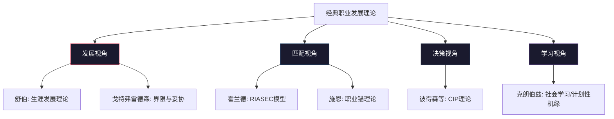
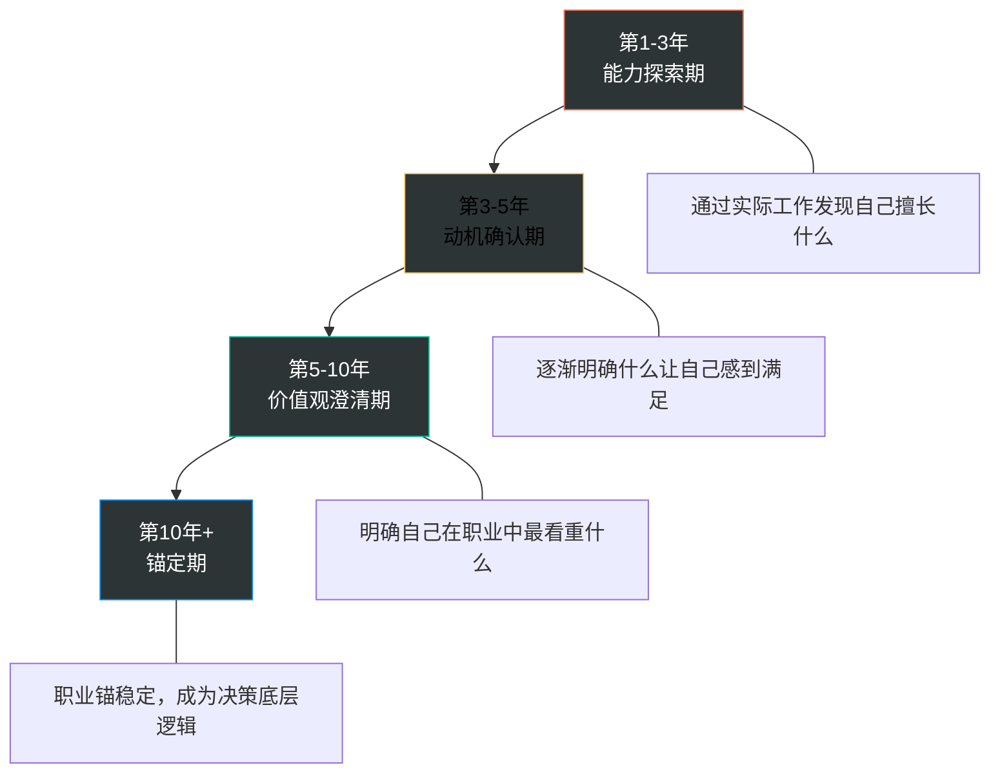
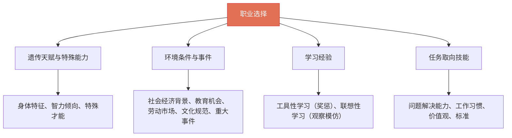
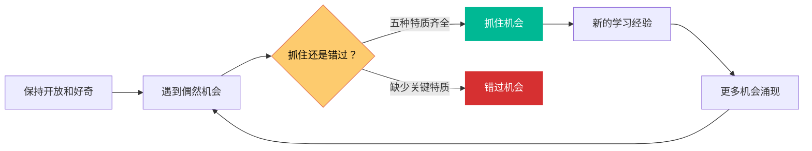
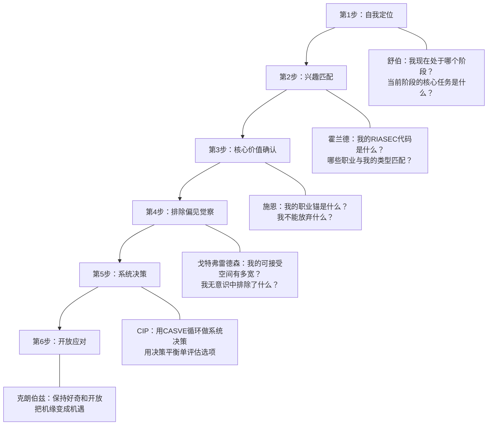

经典职业发展理论是理解"人为什么会从事某种职业""如何做出更好的职业决策"的底层逻辑框架。从1950年代至今，职业心理学家们从不同角度——发展阶段、人格匹配、核心价值观、社会学习、认知加工——构建了多个相互补充的理论体系。没有任何单一理论能完整解释职业发展的全部复杂性，但将它们整合在一起，就能形成一个强大的"理论工具箱"，帮助你在职业选择、转型、发展中做出更有依据的判断。

本章将系统梳理六大经典理论，每个理论都包含：核心原理→关键模型→实操应用→局限分析→中国本土化视角。

---

## 一、理论全景：六大经典理论概览

在深入每个理论之前，先建立一个全局视角：

| 理论 | 提出者 | 核心问题 | 关键概念 | 适用场景 |
|------|--------|----------|----------|----------|
| 生涯发展理论 | 舒伯（Super） | 职业如何随人生阶段演变？ | 生涯彩虹图、自我概念、发展阶段 | 理解人生各阶段的职业任务 |
| RIASEC模型 | 霍兰德（Holland） | 什么样的工作适合我？ | 六种人格类型、三字母代码 | 职业选择、职业兴趣评估 |
| 职业锚理论 | 施恩（Schein） | 我在职业中最看重什么？ | 八种职业锚、核心价值观 | 职业决策、职业转型方向 |
| 社会学习理论 | 克朗伯兹（Krumboltz） | 哪些因素塑造了我的职业？ | 计划性机缘、学习经验 | 接纳不确定性、把握机遇 |
| 界限与妥协理论 | 戈特弗雷德森（Gottfredson） | 为什么有些选项我从不考虑？ | 可接受空间、妥协顺序 | 理解职业选择中的自我设限 |
| 认知信息加工理论 | 彼得森等（Peterson） | 如何系统地做出职业决策？ | CASVE循环、认知金字塔 | 职业决策困难、系统决策 |

> **阅读策略**：如果你时间有限，优先阅读舒伯（理解全生命周期）和霍兰德（快速匹配职业方向），这两个理论的实用性最高。

---

## 二、舒伯的生涯发展理论（Super's Career Development Theory）

唐纳德·舒伯（Donald Super，1910-1994）是20世纪最具影响力的职业心理学家之一。他从1950年代开始，历时30余年，通过对数千名个体的纵向追踪研究，构建了生涯发展理论的完整体系。舒伯的理论之所以经久不衰，在于它不仅描述了职业发展的阶段规律，更深刻揭示了职业选择与自我概念、人生角色之间的动态关系。

与霍兰德关注"人职匹配"不同，舒伯关注的是"人在不同人生阶段如何发展职业"——这是一个动态的、终身的过程，而非一次性的匹配决策。

### 2.1 五大发展阶段

舒伯将人的一生职业发展划分为五个主要阶段，每个阶段都有特定的发展任务和核心议题。

#### 2.1.1 成长期（Growth，0-14岁）

这是职业意识萌芽的阶段。儿童通过观察、模仿和幻想，逐渐形成对职业的初步认知。这个阶段的核心任务是发展自我概念——"我是谁？""我喜欢什么？"

舒伯将成长期进一步细分为三个子阶段：

| 子阶段 | 年龄 | 核心特征 | 典型表现 |
|--------|------|----------|----------|
| 幻想期 | 4-10岁 | 以幻想和情感驱动 | 角色扮演游戏："我要当宇航员""我要当医生" |
| 兴趣期 | 11-12岁 | 以兴趣为导向 | 对某些学科或课外活动产生持续热情，如痴迷编程、沉迷画画 |
| 能力期 | 13-14岁 | 开始考虑能力匹配 | "我的数学好，是不是适合当工程师？""我体育不行，当运动员不现实" |

**为什么成人也需要关注这个阶段？**

许多人在成年后发现自己的职业选择深受童年经历影响——父母的职业、家庭的经济状况、童年的兴趣爱好，都在潜移默化中塑造着我们的职业偏好。研究表明，约60%的成年人在回顾自己的职业选择时，能追溯到童年时期的某些关键经历。

具体的影响机制包括：

- **家庭职业氛围**：父母从事的职业会成为孩子的"默认选项"。医生家庭的孩子更容易进入医疗行业，商人家庭的孩子更倾向创业。这不仅是基因遗传，更是日常耳濡目染形成的职业认知。
- **童年创伤与补偿**：有些人选择某个职业是为了弥补童年的缺失。家境贫寒的孩子可能特别追求高收入职业，缺乏关注的孩子可能选择需要大量社交的职业。
- **关键人物影响**：一位好老师、一位亲戚、甚至一个电视角色，都可能在童年种下职业的种子。许多程序员回忆说，他们的编程兴趣源于小时候看到的某部科幻电影或玩的某款游戏。

**对成人的实用启示**：回顾你的成长经历，识别那些可能在潜意识中影响你职业选择的因素。这些因素不一定是负面的——有些是真正的天赋和热情，有些则是需要觉察和审视的惯性模式。

#### 2.1.2 探索期（Exploratory，15-24岁）

这是职业探索的关键时期。个体通过学校教育、实习、兼职等方式，尝试不同的职业方向，逐步缩小选择范围。

| 子阶段 | 年龄 | 核心任务 | 关键行为 |
|--------|------|----------|----------|
| 试探期 | 15-17岁 | 广泛探索 | "广撒网"——对多种职业方向保持开放态度，参加各种社团和课外活动 |
| 过渡期 | 18-21岁 | 职业初体验 | 第一份实习或兼职往往对职业方向产生决定性影响，开始直面"学历≠能力"的现实 |
| 尝试期 | 22-24岁 | 方向验证 | 通常会经历1-2次工作变动，以确认自己的职业方向，这个阶段的试错成本最低 |

**"再探索"现象**：舒伯特别指出，职业发展不是一条直线，而是一个螺旋上升的过程。许多人在职业生涯中期重新进入探索期——这被称为"再探索"（recycling），是正常且健康的职业发展过程。30多岁转行、40多岁重返校园、50多岁开始创业，都是"再探索"的表现。

**中国语境下的探索期困境**：中国教育体系的特点使得探索期往往被压缩。高考填报志愿时，大多数学生对职业世界缺乏真实认知；大学期间又被考研、考公、就业的压力裹挟，真正用于探索的时间非常有限。这意味着很多人在进入职场后的头几年，实际上还在补"探索期"的课。这不是你的问题，是系统性的问题。

#### 2.1.3 建立期（Establishment，25-44岁）

这是职业生涯的黄金期。个体在选定的职业领域中站稳脚跟，逐步提升专业能力和职业地位。

| 子阶段 | 年龄 | 核心任务 | 典型挑战 |
|--------|------|----------|----------|
| 稳定期 | 25-30岁 | 建立职业根基 | "证明自己"——通过持续的业绩输出建立专业信誉，同时面对"理想vs现实"的落差 |
| 中年转型期 | 31-44岁 | 价值重估 | 约35-40岁经历"职业觉醒"——重新审视职业选择是否符合内心价值观，约70%的白领在此阶段经历职业倦怠 |

建立期的核心任务是"安身立命"——既要在经济上实现独立，也要在专业上建立不可替代性。这个阶段的职业决策，将深刻影响后半生的经济状况和生活质量。

**建立期的三个关键转折点**：

1. **第一次胜任感**（约27-28岁）：当你第一次独立完成一个有难度的项目，获得同事和领导的认可时，会产生"我确实适合做这个"的确认感。这个正反馈对后续5-10年的职业投入至关重要。
2. **第一次职业倦怠**（约32-35岁）：当新鲜感消退，工作变成重复劳动时，很多人会质疑"这真的是我想做的吗？"。这个阶段需要主动寻找新的挑战和意义感，否则可能陷入长期低迷。
3. **中年转型窗口**（约37-42岁）：这是一个关键的决策节点——是继续深耕当前领域，还是转向新的方向。此时的决策需要同时考虑家庭责任、经济安全和个人成长。

#### 2.1.4 维持期（Maintenance，45-64岁）

在这个阶段，个体已经积累了丰富的职业资本，核心任务转变为保持已有的职业地位，同时持续更新知识和技能以应对变化。

维持期最大的挑战是避免"守成心态"——固守已有的经验和方法，拒绝学习新事物。在技术快速迭代的时代，这种心态可能导致职业资本迅速贬值。

维持期的子阶段：

- **维持期（45-59岁）**：保持专业竞争力，同时面临来自年轻一代的竞争压力。这个阶段的策略应该是"经验+新技能"的组合——将深厚的专业经验与新技术、新方法相结合，形成年轻人难以复制的竞争优势。
- **衰退初期（60-64岁）**：职业活动开始减少，但仍保持一定的职业参与度。对于拥有丰富经验的专业人士，这个阶段可能转变为"经验输出"模式——咨询、培训、写作、指导。

#### 2.1.5 衰退期（Decline/Disengagement，65岁以上）

体力和精力逐渐下降，职业活动开始减少。这个阶段的核心任务是做好退休规划，将职业经验和智慧传承给年轻一代，同时探索退休后的生活意义。

**现代修正**：随着人均寿命的延长和退休制度的变化，舒伯的阶段模型需要适应新的现实。许多人在65岁之后仍然保持活跃的职业状态——作为顾问、导师、自媒体人或创业者。因此，"衰退期"更准确地应理解为"职业参与度降低的阶段"，而非完全退出。在中国，退休再就业、返聘、银发创业等现象越来越普遍，这个阶段正在被重新定义。

#### 2.1.6 阶段模型的局限与修正

舒伯的五阶段模型是线性且基于"正常"发展轨迹的。现实中存在多种"非常规"路径：

| 偏离模式 | 表现 | 常见原因 |
|----------|------|----------|
| 前进-后退 | 建立期后重新进入探索期 | 行业衰退、技术颠覆、个人觉醒 |
| 跳跃 | 跳过某个阶段 | 早熟、特殊机遇、家庭资源 |
| 停滞 | 长期停留在某个阶段 | 恐惧、经济压力、缺乏机会 |
| 循环 | 多次经历探索→建立→再探索 | 连续创业者、斜杠职业者 |

认识到这些"非常规"路径的存在非常重要——它帮助我们理解：如果你的职业轨迹不符合"标准时间表"，并不意味着你失败了，而是意味着你正在走一条属于自己的路。

---

### 2.2 生涯彩虹图（Life-Career Rainbow）

舒伯提出的"生涯彩虹图"是整个生涯发展理论中最直观、最实用的工具。它将人生的两个维度——时间和角色——整合在一张图上，形成一个完整的"生涯全景"。

#### 2.2.1 六种人生角色

舒伯将人生角色分为六个维度：

| 角色 | 含义 | 典型投入时期 | 角色冲突示例 |
|------|------|-------------|-------------|
| 子女 | 与父母的关系 | 全生命周期 | 成年子女的赡养责任 vs 个人职业发展 |
| 学生 | 学习与成长 | 0-25岁为主，终身学习 | 在职读书的时间精力分配 |
| 工作者 | 职业与事业 | 22-65岁为主 | 工作强度 vs 其他角色 |
| 持家者 | 家庭管理 | 25岁+为主 | 家务/育儿 vs 职业晋升 |
| 公民 | 社会参与 | 30岁+为主 | 社区参与/公益 vs 个人时间 |
| 休闲者 | 自我照顾与享受 | 全生命周期 | 休息娱乐 vs 工作压力 |

#### 2.2.2 彩虹图的核心洞见

**人生不是只有工作。** 在不同的生命阶段，各个角色的比重会发生变化：

- **20多岁**：工作者角色可能占据主导（"先立业"），学生角色仍在（在职学习），持家者角色尚轻
- **30多岁**：持家者角色的重要性上升（结婚、育儿），工作者角色仍强但面临冲突
- **40多岁**：公民角色开始凸显（社会责任、行业贡献），工作者角色可能从"冲"转向"稳"
- **50多岁**：角色开始向子女（照顾老年父母）和休闲者倾斜
- **60岁+**：休闲者和公民角色成为主角，工作者角色逐渐退出

**舒伯提出了两个关键维度**：
- **生活广度（Life-Span）**：时间维度——从出生到老年的整个人生历程
- **生活空间（Life-Space）**：角色维度——一个人在特定时期同时扮演的多种角色

生涯彩虹图将这两个维度整合在一起，帮助我们看到人生的全貌，而非只盯着工作的起伏。

#### 2.2.3 生涯彩虹图的实操方法

**第一步：绘制你的当前彩虹图**

准备一张纸，画一条水平时间轴（从你的年龄到预期退休年龄）。在时间轴上方，用不同颜色的条带表示六种角色，条带的宽度代表投入程度（1-5分）。

**第二步：诊断角色冲突**

当你感到压力和焦虑时，检查彩虹图——是否某几个角色同时处于高强度状态？比如"工作者"+"持家者"+"子女"三重角色同时满负荷，几乎不留任何空间给"休闲者"角色，这就是典型的角色过载。

**第三步：角色平衡规划**

在做年度规划时，画一张彩虹图，明确每个角色的投入比例，避免"工作者"角色过度膨胀。一个实用的检验标准是：如果"休闲者"角色的宽度为零，说明你的生活已经失衡。

**第四步：预判人生阶段转换**

在重大人生节点（结婚、生子、升职、退休）前后，主动调整彩虹图的配置。提前预判比被动应对的代价小得多。比如，计划生育时，提前半年减少工作者角色的投入，增加持家者角色的空间，比孩子出生后手忙脚乱要好得多。

**中国语境下的彩虹图冲突**：

中国职场人的彩虹图有一个显著特征——"工作者"角色的条带异常宽，几乎覆盖了整个生命阶段的大部分区域。996、007的工作文化挤压了其他所有角色的空间。同时，"子女"角色（赡养父母的责任）在独生子女一代身上尤为沉重。这导致很多中国职场人面临"角色挤兑"——不是不想做好每个角色，而是时间和精力的总量不够。

---

### 2.3 自我概念理论

舒伯理论的另一个核心贡献是"自我概念"（Self-Concept）理论。他认为，**职业选择本质上是自我概念的实现和表达**。

#### 2.3.1 自我概念的三个层次

| 层次 | 内容 | 与职业的关系 |
|------|------|-------------|
| 生理自我 | 体力、外貌、健康状况 | 影响对体力要求高的职业的选择 |
| 社会自我 | 在社会关系中的角色认知（父亲、领导、朋友） | 影响对社交需求高的职业的适应 |
| 心理自我 | 性格、兴趣、价值观、能力 | 直接决定职业满意度和投入程度 |

#### 2.3.2 自我概念的动态更新

自我概念不是静态的，它会随着人生经历而不断发展和修正。这个更新过程有两种机制：

- **同化（Assimilation）**：将新的职业经历纳入已有的自我概念中。例如："我成功完成了这个项目，证明我确实擅长这个领域"——这强化了已有的自我认知。
- **调适（Accommodation）**：当经历与已有自我概念不一致时，修正自我概念。例如："我以为我喜欢管理，但实际做管理后发现我更享受纯技术工作"——这改变了自我认知。

**自我概念与职业满意度的关系**：当工作内容与自我概念一致时，个体会感到满足和投入，这种一致性被称为"自我概念实现度"。研究显示，自我概念实现度高的个体，其职业满意度是低实现度个体的2-3倍，离职率则低40%。

**自我概念澄清练习**：

完成以下句子，每个句子写3-5个答案：
1. "作为一个工作者，我是______的人"
2. "我最擅长的工作内容是______"
3. "工作中的我，最看重______"
4. "如果工作不能给我______，我会很痛苦"
5. "我希望我的同事/领导认为我是______的人"

这些答案综合起来，就是你当前自我概念的一个缩影。

---

## 三、霍兰德职业兴趣理论（Holland's RIASEC Model）

约翰·霍兰德（John Holland，1919-2008）提出的职业兴趣理论，是目前应用最广泛的职业选择理论之一。该理论的核心观点是：**人的职业选择是人格的表达**。人们倾向于选择与自己人格类型相匹配的工作环境，在这样的环境中他们会感到最舒适、最有动力、也最容易成功。

霍兰德从1950年代开始研究职业兴趣，经过数十年的实证研究和理论迭代，最终形成了完整的RIASEC模型。该理论已被翻译成20多种语言，在全球范围内得到广泛应用。在中国，霍兰德职业兴趣测试是高校职业规划课程和企业人才测评中最常用的工具之一。

### 3.1 六种人格类型（RIASEC模型）

#### R - 现实型（Realistic）

| 维度 | 描述 |
|------|------|
| 核心特征 | 动手能力强，喜欢操作工具、机器，偏好户外活动，注重实际效果 |
| 核心驱动 | 通过实际行动创造有形成果 |
| 优势能力 | 空间感知、机械操作、体力耐力 |
| 性格特点 | 务实、直接、独立、不喜欢过多社交 |
| 典型职业 | 工程师、技术工人、建筑师、飞行员、运动员、厨师、消防员 |
| 工作环境偏好 | 有清晰的工具和设备，有明确的产出标准，不过度依赖人际交往 |

**现实型的深层心理**：现实型的人往往对"看得见摸得着"的工作有天然的亲近感。他们不是不聪明，而是更信任双手而非嘴巴。一个高级焊接技师说："每一条焊缝都是我的签名，别人一看就知道是我干的。"这种对具体成果的执着，是现实型的核心驱动力。

#### I - 研究型（Investigative）

| 维度 | 描述 |
|------|------|
| 核心特征 | 好奇心强，善于分析和思考，喜欢探索未知，追求知识 |
| 核心驱动 | 通过思考和研究解决问题 |
| 优势能力 | 逻辑推理、数学运算、批判性思维 |
| 性格特点 | 好奇、独立、内省、有时显得不善社交 |
| 典型职业 | 科学家、研究员、数据分析师、程序员、医生、大学教授 |
| 工作环境偏好 | 允许独立思考，有探索空间，有智力挑战 |

**研究型的深层心理**：研究型的人享受的不是答案本身，而是寻找答案的过程。他们可能花三天时间解决一个看似微不足道的问题，不是因为这个问题重要，而是因为解决的过程让他们感到满足。在职场中，这类人最容易在缺乏智力挑战的环境中感到窒息。

#### A - 艺术型（Artistic）

| 维度 | 描述 |
|------|------|
| 核心特征 | 创造力丰富，追求自我表达，不喜欢被规则束缚，审美敏感 |
| 核心驱动 | 通过创意和想象实现自我表达 |
| 优势能力 | 创造力、想象力、审美感知 |
| 性格特点 | 敏感、独立、非传统、有时显得情绪化 |
| 典型职业 | 设计师、作家、音乐家、导演、广告创意、摄影师 |
| 工作环境偏好 | 弹性大、规则少、鼓励创新、尊重个人风格 |

**艺术型的深层心理**：艺术型的人对"被要求按别人的方式做事"有强烈的抵触。他们在自由度高的环境中能产出惊人的创造力，在高度规范化的环境中则可能表现平平甚至痛苦。这不意味着他们不能遵守规则，而是规则需要有意义，不能是"因为一直都是这样做的"。

#### S - 社会型（Social）

| 维度 | 描述 |
|------|------|
| 核心特征 | 善于与人交往，乐于助人，有同理心，善于沟通 |
| 核心驱动 | 通过帮助他人实现价值 |
| 优势能力 | 人际沟通、同理心、团队协作 |
| 性格特点 | 友善、合作、有耐心、善于倾听 |
| 典型职业 | 教师、心理咨询师、社工、人力资源、销售、护士 |
| 工作环境偏好 | 以人为核心，有团队氛围，有明确的服务对象 |

**社会型的深层心理**：社会型的人在帮助他人成长时获得最大的满足感。一位优秀的小学班主任说："看到孩子眼睛亮起来的那一刻，比我自己考了满分还高兴。"这类人在纯粹数据驱动、缺乏人际互动的工作中会感到孤独。

#### E - 企业型（Enterprising）

| 维度 | 描述 |
|------|------|
| 核心特征 | 有领导力，善于说服和影响他人，追求权力和地位，目标导向 |
| 核心驱动 | 通过领导和影响实现目标 |
| 优势能力 | 领导力、说服力、决策力 |
| 性格特点 | 自信、果断、有野心、喜欢竞争 |
| 典型职业 | 管理者、企业家、律师、政治家、市场营销、销售管理 |
| 工作环境偏好 | 有明确的目标和激励机制，有竞争和晋升空间 |

**企业型的深层心理**：企业型的人天然被"影响力"吸引。他们不只是想做事，更想通过做事来影响和带动别人。这类人在缺乏决策权和领导机会的岗位上会感到被压制，因为他们需要看到自己的行动能产生实际的组织影响。

#### C - 常规型（Conventional）

| 维度 | 描述 |
|------|------|
| 核心特征 | 做事有条理，注重细节，喜欢有序的工作环境，遵守规则 |
| 核心驱动 | 通过规范和秩序保障效率 |
| 优势能力 | 组织能力、细节把控、数据分析 |
| 性格特点 | 认真、可靠、有耐心、喜欢结构化 |
| 典型职业 | 会计、行政、银行职员、数据录入、质量管理、档案管理 |
| 工作环境偏好 | 有明确的流程和标准，有稳定的结构，有可预期的结果 |

**常规型的深层心理**：常规型的人不是缺乏创造力，而是对"混乱"有天然的不适感。他们在稳定有序的环境中效率极高，在快速变化、规则不清的环境中则会感到焦虑。一个出色的财务主管能把公司的账目管理得井井有条，这种"把混乱变有序"的能力本身就是一种价值。

### 3.2 三字母代码与六边形模型

霍兰德理论的精妙之处在于，大多数人不是单一类型，而是三种类型的组合。通过职业兴趣测试，可以得到一个三字母代码（如"RIA"、"SEC"等），其中：

- **第一个字母**：主导类型（与自我认知最匹配）
- **第二个字母**：辅助类型
- **第三个字母**：次级类型

#### 六边形模型

六种类型之间存在亲疏关系，形成一个六边形：

        R（现实型）
       / \
      /   \
    C       I（研究型）
    |       |
    |       |
    E       A（艺术型）
     \     /
      \   /
       S（社会型）

关系规则：
- **相邻类型**（如R-I、I-A、A-S、S-E、E-C、C-R）：关系最密切，最容易兼容
- **相隔类型**（如R-A、I-S、A-E、S-C、E-I、C-A）：关系较远，但仍可能兼容
- **相对类型**（如R-S、I-E、A-C）：关系最远，兼容性最差

#### 三个关键指标

| 指标 | 含义 | 高分特征 | 低分特征 |
|------|------|----------|----------|
| 一致性（Consistency） | 三字母代码中类型之间的邻近程度 | 相邻类型组合（如RIA），职业满意度高 | 相对类型组合（如RSE），内心冲突大 |
| 分化性（Differentiation） | 六种类型得分的差异程度 | 兴趣明确，职业方向清晰 | 兴趣模糊，选择困难 |
| 身份性（Identity） | 对自身兴趣和目标的清晰程度 | 职业规划有条理 | 对职业方向困惑不解 |

#### 三字母代码解读实例

| 代码 | 类型组合 | 适合的工作特征 | 可能的职业方向 |
|------|----------|---------------|---------------|
| RIA | 现实+研究+艺术 | 需要动手+思考+创意 | 建筑设计师、工业设计师、交互设计师 |
| SEC | 社会+企业+常规 | 需要人际+领导+规范 | 人力资源管理、行政管理、社区管理 |
| IAR | 研究+艺术+现实 | 需要分析+创意+动手 | 医学影像师、科学可视化、数据可视化 |
| ESE | 企业+社会+企业 | 需要领导+人际+目标 | 销售总监、培训总监、公关总监 |
| CRS | 常规+现实+社会 | 需要规范+动手+服务 | 技术文档工程师、质量管理员、客户服务技术 |

### 3.3 霍兰德理论的实践应用

**应用一：职业选择参考**

通过霍兰德测试获得自己的三字母代码后，可以查询对应的职业列表，缩小职业选择的范围。但要注意，这只是一个起点，而非终点——测试结果反映的是你当下的兴趣状态，不是永恒的职业判决书。

**应用二：工作环境评估**

评估当前工作环境的霍兰德类型，与自己的类型进行对比。如果一个"I研究型"主导的人在"E企业型"主导的销售岗位上，长期来看必然会产生心理压力和职业倦怠。这时候，要么调整工作内容使其更匹配自己的类型（如转向数据分析、市场研究），要么考虑转换到更匹配的职业环境。

**应用三：团队配置优化**

在组建团队时，了解团队成员的霍兰德类型，可以实现更好的角色分配。一个理想的产品团队通常需要：I型（技术研究）+ A型（设计创意）+ E型（项目推进）+ S型（用户研究）+ C型（流程管理）。

**应用四：职业转换方向**

在考虑职业转换时，优先选择与自己主导类型一致的新方向，降低转型风险。同时关注第二字母类型对应的领域，这往往是你"既擅长又有兴趣"的方向。

### 3.4 霍兰德理论的局限性

| 局限 | 具体表现 | 应对策略 |
|------|----------|----------|
| 文化差异 | 基于西方文化开发，中国集体主义文化中S型可能更普遍 | 结合本土化测评工具使用 |
| 动态变化 | 人的兴趣和能力会随时间和经历变化 | 每3-5年重测一次，关注变化趋势 |
| 过度简化 | 六种类型无法涵盖所有人格特征 | 作为起点，结合其他理论综合判断 |
| 现实约束 | 理想匹配可能受经济、地域、学历制约 | 区分"理想匹配"和"现实可行" |
| 性别偏见 | 早期版本存在性别刻板印象 | 关注类型本身，忽略职业列表中的性别暗示 |
| 忽视发展因素 | 主要描述静态匹配，对发展过程关注不足 | 结合舒伯的发展理论补充使用 |

**核心原则**：霍兰德理论应该作为**参考工具**而非**决定性标准**来使用。它帮助你缩小选择范围、理解自己的偏好模式，但最终的职业决策还需要综合考虑现实条件、市场需求、个人成长空间等多个因素。

---

## 四、施恩的职业锚理论（Schein's Career Anchor Theory）

埃德加·施恩（Edgar Schein，1928-2023）是组织心理学领域的泰斗级人物，MIT斯隆管理学院荣誉教授。他在1960年代对MIT斯隆管理学院毕业生进行长达10-12年的纵向研究后，提出了"职业锚"（Career Anchor）理论。这一理论的核心价值在于：它关注的不是你"适合做什么"，而是你"不愿意放弃什么"。

### 4.1 什么是职业锚

职业锚是指一个人在面临职业选择时，无论如何都不会放弃的**核心价值观、能力和动机**的组合。它就像船锚一样，无论外部环境如何变化，都会将个人的职业选择"锚定"在某个核心方向上。

施恩发现，大多数人在职业生涯早期（通常在工作的前5-10年）逐渐发现自己的职业锚。一旦职业锚形成，它就会成为后续所有职业决策的底层逻辑。

#### 职业锚的形成过程

> **关键理解**：职业锚不是你在入职第一天就知道的，它是通过实际工作体验逐渐"浮出水面"的。很多人在工作3-5年后才开始隐约感觉到自己的职业锚，在工作8-10年后才真正确认。这个过程不能跳过——你必须通过实际体验来"发现"自己的职业锚，而不是通过"思考"来"决定"它。

### 4.2 八种职业锚类型

#### 1. 技术/职能能力型（Technical/Functional Competence）

| 维度 | 描述 |
|------|------|
| 核心驱动 | 在特定技术或专业领域达到精通 |
| 特征 | 宁愿在专业领域深耕，也不愿转向管理岗位 |
| 典型画像 | 资深程序员拒绝转管理、资深设计师专注于创作、高级研究员坚守实验室 |
| 识别信号 | "你最享受工作中的哪个部分"的回答总是与专业技能相关 |
| 常见冲突 | 当组织要求技术骨干转管理时，会产生强烈抗拒 |
| 薪资敏感度 | 中等——看重的是专业认可，薪资是专业能力的副产品 |

**深度解读**：技术/职能型的人最容易被误解为"不懂管理所以不转管理"。事实恰恰相反——他们清楚地知道自己在技术领域的价值，也清楚地知道转向管理意味着放弃自己最核心的优势。施恩的研究发现，这类人在被迫转管理后，职业满意度平均下降35%，绩效下降20%。

#### 2. 管理能力型（General Managerial Competence）

| 维度 | 描述 |
|------|------|
| 核心驱动 | 整合资源、领导团队、实现组织目标 |
| 特征 | 善于跨部门协调，追求权力和影响力 |
| 典型画像 | 从技术骨干主动转向项目管理、部门负责人 |
| 识别信号 | 在团队中自然地承担领导角色，喜欢统筹全局 |
| 所需能力 | 分析能力、人际能力、情绪管理、战略思维 |
| 晋升诉求 | 强烈——职位头衔对他们来说不是虚荣，而是能力的证明 |

**深度解读**：管理型职业锚的人有三个关键能力支柱——分析能力（看懂业务）、人际能力（带好团队）、情绪管理能力（承受压力）。缺少任何一个支柱，管理之路都会受阻。很多人以为管理型就是"会说话"，其实分析能力和情绪管理才是区分优秀管理者和平庸管理者的关键。

#### 3. 自主/独立型（Autonomy/Independence）

| 维度 | 描述 |
|------|------|
| 核心驱动 | 追求工作方式和时间的自由 |
| 特征 | 无法忍受严格的组织约束，偏好弹性工作 |
| 典型画像 | 自由职业者、创业者、远程工作者、独立顾问 |
| 识别信号 | 频繁感到被组织制度束缚，向往"自己说了算"的工作方式 |
| 常见冲突 | 在层级分明、流程严格的组织中会感到窒息 |
| 代价意识 | 清楚自由的代价——收入不稳定、需要高度自律 |

**深度解读**：自主型不是"懒散"或"不想被管"——相反，成功的自主型工作者通常比组织中的员工更加自律。他们的驱动力不是逃避约束，而是追求"按自己的方式做事"的自由。这种自由包括工作时间的自由、工作方式的自由、以及不被不认同的规则束缚的自由。

#### 4. 安全/稳定型（Security/Stability）

| 维度 | 描述 |
|------|------|
| 核心驱动 | 追求长期稳定的职业保障 |
| 特征 | 偏好大公司、国企、体制内，不愿承担过高风险 |
| 典型画像 | 公务员、事业单位员工、大型企业老员工 |
| 识别信号 | 做职业决策时"稳定性"总是排在第一位 |
| 文化因素 | 在中国文化背景下，这种类型的占比可能比西方更高（研究显示约25-30%） |
| 风险偏好 | 低——即使有更好的机会，如果风险太大也会放弃 |

**深度解读**：安全型在中国有其特殊的文化土壤。"铁饭碗"的传统观念、社会保障体系的不完善、房价高企带来的经济压力，都使得"稳定"成为很多人职业决策的首要考量。这不一定是"保守"或"缺乏野心"——在很多情况下，这是一个理性的风险管理决策。关键在于：这种选择是否出于你的真实意愿，而非外部压力。

#### 5. 创业型（Entrepreneurial Creativity）

| 维度 | 描述 |
|------|------|
| 核心驱动 | 从零到一创造新事物 |
| 特征 | 有强烈的创造欲望，愿意承担风险 |
| 典型画像 | 连续创业者、企业内部创新者、产品从零到一的人 |
| 识别信号 | 总是在想"这个可以做成一个产品/公司" |
| 风险偏好 | 高——创业失败的风险是可接受的，不做尝试的风险不可接受 |
| 发展阶段 | 可能在职业生涯的任何阶段被激活——有些人20岁就创业，有些人50岁才开始 |

**深度解读**：创业型职业锚的核心不是"想当老板"，而是"想创造一个从无到有的东西"。这种驱动力可以在创业公司中实现，也可以在大公司的创新部门、新业务线中实现。如果一个创业型的人被长期困在维护性工作中，会感到极大的挫败感。

#### 6. 服务/奉献型（Service/Dedication to a Cause）

| 维度 | 描述 |
|------|------|
| 核心驱动 | 通过工作实现某种价值观或社会使命 |
| 特征 | 工作的意义感比金钱更重要 |
| 典型画像 | 公益组织工作者、教育工作者、医疗工作者、环保人士 |
| 识别信号 | 选工作时"这件事是否有意义"是首要考量 |
| 价值冲突 | 当组织行为与个人价值观冲突时，会选择离开 |
| 收入预期 | 通常低于市场平均水平，但他们对此有清醒的认知 |

**深度解读**：服务型的人在选择职业时，会优先考虑"这件事是否对世界/社会/他人有益"。他们的职业满意度与工作意义感高度相关——如果一份工作收入很高但没有意义感，他们不会感到满足。反之，如果工作很有意义但收入偏低，他们可能能坚持很久。

#### 7. 挑战型（Pure Challenge）

| 维度 | 描述 |
|------|------|
| 核心驱动 | 不断征服困难和挑战 |
| 特征 | 在解决看似不可能的问题中获得最大满足 |
| 典型画像 | 咨询顾问、投资银行家、急诊科医生、危机管理者、竞技游戏玩家 |
| 识别信号 | 简单重复的工作让你感到无聊，困难的任务反而让你兴奋 |
| 倦怠模式 | 不是因为工作太累而倦怠，是因为工作太容易而倦怠 |
| 职业瓶颈 | 当某个领域的挑战被"解决完"时，需要寻找新的挑战 |

**深度解读**：挑战型的人与普通人对"困难"的感受截然不同。大多数人面对困难会感到焦虑和压力，而挑战型的人面对困难会感到兴奋和动力。他们的职业倦怠不是因为"太累了"，而是因为"太简单了"——当工作变成重复劳动时，他们会感到一种独特的无聊和空虚。

#### 8. 生活方式型（Lifestyle）

| 维度 | 描述 |
|------|------|
| 核心驱动 | 实现工作与生活的和谐平衡 |
| 特征 | 拒绝以牺牲生活质量为代价换取职业成功 |
| 典型画像 | 选择弹性工作制的职场人、拒绝996的从业者、选择低线城市生活的人 |
| 识别信号 | 考虑新工作时"对家庭和个人生活的影响"是关键因素 |
| 价值排序 | 健康 > 家庭 > 个人兴趣 > 职业成就 |
| 常见误解 | 常被误认为"不思进取"，实际上是对生活有更全面的规划 |

**深度解读**：生活方式型的人不是不重视职业发展，而是对"成功"有更宽泛的定义。他们认为人生的成功不只是职位和收入，还包括身体健康、家庭和谐、个人兴趣、精神满足等多个维度。在中国职场文化中，这种类型的人往往面临来自社会和家庭的压力，但他们的选择在长期来看往往带来更高的整体生活满意度。

### 4.3 职业锚的识别方法

#### 方法一：回顾关键决策法

回顾你职业生涯中的3-5个关键决策（如选择专业、选择工作、拒绝某个机会等），分析每个决策背后的核心驱动因素。反复出现的驱动因素就是你的职业锚。

操作步骤：
1. 列出你职业/教育生涯中的5个重大决策
2. 对每个决策，写下你当时考虑的所有因素
3. 将这些因素按"能力驱动""价值观驱动""动机驱动"分类
4. 找出反复出现的因素——这就是你的职业锚

#### 方法二：冲突排除法

想象以下场景——如果只能保留一样东西，你会选什么？

| 冲突对 | 选项A | 选项B | 你选？ |
|--------|-------|-------|--------|
| 薪资 vs 自由 | 年薪100万但必须坐班打卡 | 年薪60万但完全自由安排 | |
| 专业 vs 管理 | 成为顶级技术专家 | 成为部门总监 | |
| 稳定 vs 创业 | 大公司铁饭碗 | 自己创业从零开始 | |
| 挑战 vs 平衡 | 高强度高回报的工作 | 轻松稳定的生活 | |
| 意义 vs 收入 | 改变世界的公益项目 | 高薪但无聊的工作 | |
| 挑战 vs 稳定 | 攻克技术难题但行业不稳定 | 稳定但重复的工作 | |

你的选择模式会清晰地指向你的职业锚。

#### 方法三：施恩职业锚问卷

施恩本人开发了包含40个题目的职业锚评估问卷，可以从系统角度帮助识别职业锚。该问卷的核心设计原则是：每个题目都涉及两种职业锚之间的取舍，通过你的选择模式来识别主导的职业锚。

#### 方法四：日常情绪追踪法（非施恩原创，但实用）

记录两周内工作中的"高光时刻"和"低谷时刻"：

- **高光时刻**：什么时候你感到最有动力、最满足、最投入？
- **低谷时刻**：什么时候你感到最沮丧、最无聊、最想离开？

分析这些时刻的共同特征，它们会指向你的职业锚。

### 4.4 职业锚的实践意义

理解自己的职业锚，具有以下实践意义：

1. **减少职业决策的内耗**：当你清楚自己的职业锚是什么，很多看似困难的选择会变得清晰。"我到底是继续做技术还是转管理？"这个问题，如果你知道自己是技术/职能型职业锚，答案就不言自明。
2. **解释职业不满的根源**：如果你长期感到职业不满，很可能是因为当前工作与你的职业锚不匹配。比如一个生活方式型的人在996的公司里，无论薪资多高都不会感到满足。
3. **规划长期职业路径**：职业锚帮助你规划一条与核心价值观一致的职业道路，而不是随波逐流。
4. **提升职业幸福感**：研究显示，工作与职业锚一致的个体，其职业幸福感是不一致个体的1.8倍。
5. **指导职业转型**：在考虑职业转型时，确保新方向与自己的职业锚一致。一个挑战型的人如果转向维护性工作，即使薪资提高也会很快感到倦怠。

### 4.5 职业锚的组合与演变

虽然施恩强调每个人有一个"主导"职业锚，但后续研究表明，很多人实际上是2-3种职业锚的组合。常见的组合模式：

| 组合 | 特征 | 适合的方向 |
|------|------|-----------|
| 技术+挑战 | 享受技术深度+追求难题 | 算法工程师、安全研究员、架构师 |
| 管理+创业 | 领导团队+创造新事物 | 事业部负责人、内部创业者 |
| 自主+生活方式 | 工作自由+生活平衡 | 自由职业者、远程顾问 |
| 服务+技术 | 通过技术实现社会价值 | 医疗技术、教育科技、公益技术 |
| 安全+服务 | 稳定工作+有意义的事 | 教师、公务员（教育/医疗系统） |

---

## 五、克朗伯兹的社会学习理论（Krumboltz's Social Learning Theory）

约翰·克朗伯兹（John Krumboltz，1930-2019）是斯坦福大学教育学院教授。他的理论从社会学习的角度解释职业选择和发展，强调环境因素和学习经验对职业决策的影响。这个理论最大的特点是：它承认运气和机遇在职业发展中扮演的重要角色，并为此提供了积极的应对策略。

### 5.1 四大影响因素

克朗伯兹认为，职业选择受四个因素的综合影响：

**因素一：遗传天赋与特殊能力**

天生的身体特征（身高、外貌、体质）、先天的智力倾向、特殊才能（音乐、运动、数学等）。这些因素设定了职业选择的"天花板"和"地板"——它们不决定你能做什么，但会设定某些边界。比如，一个对数字极度敏感的人，在数据分析类工作中更容易取得好成绩。

**因素二：环境条件与事件**

社会经济背景、教育机会、劳动市场条件、社会文化规范、自然灾害或重大历史事件。这些因素很多是个人无法控制的——你无法选择出生在什么家庭，无法预见行业的兴衰，无法预测技术革命的到来。但了解这些因素的存在，可以帮助你更好地应对和利用环境变化。

**因素三：学习经验**

包括两种类型：
- **工具性学习**（Instrumental Learning）：通过奖励和惩罚学到的。如果你在某件事上获得了正反馈（奖励、认可、成就感），你就更可能继续做这件事；反之亦然。
- **联想性学习**（Associative Learning）：通过观察和模仿学到的。看到某个职业的人过着你羡慕的生活，你可能会对这个职业产生向往。

**因素四：任务取向技能**

通过上述三个因素的交互作用形成的综合能力，包括：问题解决能力、工作习惯、价值观、标准等。这些技能不是天生的，而是在成长过程中逐渐习得的。

### 5.2 "计划性机缘"理论（Planned Happenstance）

克朗伯兹在晚年提出了一个颠覆性的概念——"计划性机缘"（Planned Happenstance）。他认为，许多重要的职业转折并非来自精心规划，而是来自看似偶然的机遇。但这些"机缘"并非完全随机——它们只青睐那些具备特定特质的人。

#### 五种关键特质

| 特质 | 含义 | 培养方法 |
|------|------|----------|
| 好奇心 | 对新事物保持开放和探索的态度 | 每月尝试一个从未接触过的领域（课程、社交圈、活动） |
| 坚持性 | 面对挫折时不轻易放弃 | 建立"挫折日志"，记录每次挫折后的成长和收获 |
| 灵活性 | 适应变化的环境 | 主动练习"计划B思维"——每个计划都准备一个备选方案 |
| 乐观性 | 相信好事会发生 | 建立"好事日志"，每天记录一件积极的事情 |
| 冒险精神 | 愿意尝试不确定的机会 | 设定"舒适区扩展目标"——每周做一件让自己不太舒服的事 |

#### 计划性机缘的运作机制

#### 计划性机缘的实操策略

**策略一：扩展社交网络的多样性**

不要只和同行业、同背景的人交往。加入跨行业的社群，参加不同领域的活动，和不同年龄段的人交流。每一段新的社交连接都可能成为一个"机缘"的入口。

具体做法：
- 每月参加1-2个你专业领域之外的线下活动
- 在社交媒体上关注3-5个不同领域的人
- 主动和公司其他部门的同事交流
- 参加校友会、行业峰会、兴趣社群

**策略二：保持"可选项"的开放性**

不要过早地把自己"锁死"在一个方向上。当面对不确定的选择时，优先选择"打开更多可能性"的选项。

具体做法：
- 当面临"A确定但发展空间有限"和"B不确定但可能性大"的选择时，如果经济条件允许，倾向B
- 学习"可迁移技能"（沟通、写作、数据分析、项目管理），这些技能在任何行业都有价值
- 保持至少一个"边实验"——一个你在主业之外探索的小项目

**策略三：把意外变成机遇**

当计划外的事情发生时（被裁员、公司倒闭、行业衰退），不要只看到"灾难"，也看到其中隐藏的机遇。

案例：2020年疫情期间，很多线下培训师被迫停止工作。但少数培训师迅速转到线上，不仅度过了危机，还开拓了更大的市场。他们的共同特征是：在危机发生时没有陷入恐慌，而是迅速问自己——"这个变化中有什么机会？"

**策略四：培养"可控的偶然性"**

不是坐等机遇降临，而是主动创造"偶然"发生的条件：
- 投入时间学习新技能——你不知道哪个技能会在未来某个时刻派上用场
- 接受一些"边界任务"——略微超出你当前能力范围的任务，这是成长最快的区域
- 定期做"信息输入"——阅读不同领域的文章、听不同类型的播客、和不同背景的人聊天

### 5.3 社会学习理论的实践意义

**核心启示：在保持大致方向的同时，对偶然出现的机会保持开放。**

最好的职业发展策略不是严格的线性规划，而是"有方向的探索"——就像航海，你设定了目的地（大致方向），但沿途会根据风向和洋流（机遇和变化）灵活调整航线。

这并不意味着不需要规划。规划的意义在于：
1. 设定大致方向，避免完全随波逐流
2. 识别哪些机遇值得抓住，哪些不值得
3. 在抓住机遇后，有能力将它转化为实际成果

规划和机缘不是对立的——规划为机缘提供了"接收天线"，机缘为规划提供了"意外加速"。

---

## 六、戈特弗雷德森的界限与妥协理论（Gottfredson's Theory of Circumscription and Compromise）

琳达·戈特弗雷德森（Linda Gottfredson）是约翰·霍普金斯大学的职业心理学家。她的理论解释了一个其他理论很少涉及的问题：**为什么有些职业选项，我们从一开始就不会考虑？**

### 6.1 核心概念：可接受空间

戈特弗雷德森提出，每个人在选择职业时，脑海中都有一个"可接受空间"（Zone of Acceptable Alternatives）。这个空间由两条线界定：

- **上界**：社会地位太高、觉得自己"配不上"的职业——被排除
- **下界**：社会地位太低、觉得"不值得做"的职业——被排除

在可接受空间之内，人们再根据兴趣、能力等因素做最终选择。

### 6.2 四个发展阶段的排除过程

戈特弗雷德森认为，可接受空间是在童年和青少年时期逐步形成的，通过四个"排除"阶段：

| 阶段 | 年龄 | 排除标准 | 典型表现 |
|------|------|----------|----------|
| 大小和力量取向 | 3-5岁 | 职业是否需要"大人"的体力和能力 | "我长大才能当消防员" |
| 性别角色取向 | 6-8岁 | 职业是否符合性别角色期待 | "护士是女生做的""工程师是男生做的" |
| 社会评价取向 | 9-13岁 | 职业的社会声望和地位 | "扫大街的工作太低级了" |
| 内部、独特的自我取向 | 14岁+ | 职业是否符合个人兴趣和能力 | "我对这个工作没兴趣" |

### 6.3 妥协理论

当"理想职业"不可得时（因为竞争、地域、学历等现实约束），人们会做出妥协。戈特弗雷德森发现，妥协的顺序是有规律的：

**妥协的优先级（从先放弃到最后放弃）**：

1. **最先放弃**：兴趣（"虽然不太感兴趣，但先做着吧"）
2. **其次放弃**：能力匹配（"虽然不是我最擅长的，但也能做"）
3. **最后放弃**：性别角色和社会声望（这两个底线最难突破）

这个发现有重要的实践意义：

- 很多人在职业妥协中，最先放弃的是兴趣——这意味着他们可能在一份"还不错"但缺乏热情的工作中待了很久
- 社会声望和性别角色的底线最难突破——这也解释了为什么某些职业的性别比例长期失衡
- 了解自己的妥协模式，可以帮助你做出更有意识的选择，而非无意识地被环境推着走

### 6.4 中国语境下的界限与妥协

中国社会的一些特殊因素使得戈特弗雷德森的理论在中国有独特的表现：

- **社会评价取向更为强烈**：在"面子文化"的影响下，职业的社会声望在中国职业决策中的权重可能比西方更高。"体面的工作"这一概念在中国文化中有更具体的内涵。
- **性别角色刻板印象仍然显著**：虽然在改善，但"男主外女主内""女生适合做稳定工作""男生应该有事业心"等观念仍然影响着很多人的职业选择。
- **家庭期望的额外约束**：中国家庭对子女职业选择的影响力远大于西方。父母的期望会进一步缩小"可接受空间"。
- **地域因素**：一线城市的"可接受空间"更宽（职业种类多、社会包容度高），小城市的"可接受空间"更窄（选择少、社会压力大）。

### 6.5 实操应用：扩展你的可接受空间

如果你觉得自己的职业选择太受限，可能是你的"可接受空间"太窄了。扩展方法：

1. **觉察排除标准**：识别你在无意识中排除了哪些选项。问自己："我不考虑这个职业，是因为真的不适合，还是因为觉得'不好意思'/'配不上'/'不符合我的身份'？"
2. **挑战性别角色假设**：如果你因为性别原因排除了某些职业，问自己："如果性别不是问题，我会考虑吗？"
3. **重新定义"体面"**：社会声望是社会建构的，不是客观事实。一个高收入的蓝领工人和一个低收入的白领，谁更"体面"？
4. **扩大信息来源**：很多职业偏见来自信息不足。深入了解一个行业后，你可能会发现自己之前排斥的选项其实很适合你。

---

## 七、认知信息加工理论（CIP Theory）

加里·彼得森（Gary Peterson）等人在1991年提出的认知信息加工理论（Cognitive Information Processing，简称CIP），是目前最系统的"职业决策方法论"。如果说前面的理论回答了"为什么"和"是什么"，CIP回答的则是"怎么做"。

### 7.1 认知金字塔

CIP理论将职业决策所需的知识组织成一个金字塔结构：

         ┌─────────────┐
         │  元认知     │  ← 最高层：思考自己的思考
         │（自我对话、 │    "我做出这个决策的逻辑是什么？"
         │  自我觉察） │    "我的思维方式有什么偏见？"
         ├─────────────┤
         │ 自我知识    │  ← 中间层：了解自己
         │（兴趣、能力、│    "我喜欢什么？我擅长什么？"
         │  价值观）   │    "我最看重什么？"
         ├─────────────┤
         │ 职业知识    │  ← 底层：了解职业世界
         │（行业、岗位、│    "有哪些职业选择？"
         │  发展前景） │    "每种职业的具体要求是什么？"
         └─────────────┘

**为什么元认知在最顶层？**

元认知是"关于认知的认知"——即你对自己思维过程的觉察能力。它决定了你如何使用自我知识和职业知识。很多人拥有大量的自我知识和职业知识，但仍然做出糟糕的职业决策——原因是缺乏元认知能力，无法觉察自己决策过程中的思维偏见。

常见的决策偏见包括：
- **锚定效应**：被第一个听到的信息过度影响（"这个行业起薪高，所以一定好"）
- **确认偏误**：只关注支持自己预设观点的信息（"我已经决定做程序员了，所以只看程序员的好处"）
- **损失厌恶**：对失去的恐惧大于对获得的渴望（"虽然现在的工作不好，但换工作可能会更差"）
- **从众效应**：跟随大多数人的选择（"大家都去考公，我也应该考"）
- **近因效应**：过度受最近信息的影响（"最近看到程序员裁员的新闻，所以技术行业不行了"）

### 7.2 CASVE决策循环

CIP理论提供了一个系统的决策框架——CASVE循环：

| 阶段 | 英文 | 核心任务 | 具体问题 |
|------|------|----------|----------|
| 沟通 | Communication | 识别"差距"——现实与期望之间的距离 | "我对现状满意吗？""有什么问题需要解决？" |
| 分析 | Analysis | 深入了解自己和职业选项 | "我真正想要什么？""有哪些可能的方向？" |
| 综合 | Synthesis | 生成和评估备选方案 | "有哪些可能的选择？""每个选择的优劣是什么？" |
| 评估 | Valuing | 对备选方案排序和选择 | "哪个方案最符合我的价值观？""我愿意为此付出什么代价？" |
| 执行 | Execution | 将决策转化为行动计划 | "我需要做什么？""第一步是什么？""时间表是什么？" |

CASVE是一个循环，而非线性过程——在执行阶段发现问题后，可以回到沟通阶段重新开始。

#### CASVE实操案例

**场景**：一个在传统行业做了5年的市场经理，感觉职业发展遇到瓶颈。

| CASVE阶段 | 具体操作 | 产出 |
|-----------|----------|------|
| C（沟通） | 识别差距："我的职业发展停滞了。过去两年没有晋升，薪资增长缓慢，工作缺乏挑战。" | 明确问题定义 |
| A（分析） | 自我分析：兴趣（I型主导，喜欢数据分析）、能力（沟通能力强，有数据基础）、价值观（看重成长和挑战）。职业扫描：数据产品经理、增长分析师、数字化转型顾问 | 自我知识+职业知识清单 |
| S（综合） | 生成方案：①内部转岗到数字化部门 ②学习数据分析，跳槽到互联网公司做增长 ③考MBA后转型咨询 ④留在原岗位但争取新项目 | 4个备选方案 |
| V（评估） | 按价值观排序：方案②最符合兴趣和成长需求，但需要6个月学习准备；方案①最快但可能只是换汤不换药 | 选择方案②，方案①作为保底 |
| E（执行） | 制定计划：3个月内完成数据分析课程，同时做2个实战项目；第4-6个月开始投递简历，目标进入互联网行业的增长分析岗位 | 6个月行动计划 |

### 7.3 CIP理论的实操工具

**工具一：决策平衡单**

列出2-3个备选方案，从以下维度打分（1-10分）：

| 维度 | 权重 | 方案A | 方案B | 方案C |
|------|------|-------|-------|-------|
| 兴趣匹配 | ×3 | ? | ? | ? |
| 能力匹配 | ×3 | ? | ? | ? |
| 价值观匹配 | ×3 | ? | ? | ? |
| 收入前景 | ×2 | ? | ? | ? |
| 发展空间 | ×2 | ? | ? | ? |
| 生活平衡 | ×2 | ? | ? | ? |
| 风险可控 | ×1 | ? | ? | ? |
| 加权总分 | — | ? | ? | ? |

**工具二：偏见觉察检查表**

在做出重大职业决策前，逐项检查：
- [ ] 我是否被第一个信息过度影响了？（锚定效应）
- [ ] 我是否只在寻找支持我预设观点的信息？（确认偏误）
- [ ] 我是否因为害怕失去而不愿意改变？（损失厌恶）
- [ ] 我是否因为"大家都这么做"而做了这个选择？（从众效应）
- [ ] 我是否被最近的新闻/事件过度影响了？（近因效应）
- [ ] 这个决策是出于我的真实意愿，还是来自外部压力？

---

## 八、六大理论的综合应用框架

### 8.1 理论间的互补关系

这六大理论不是相互竞争的，而是从不同角度解释职业发展的不同侧面。将它们整合在一起，就形成了一个完整的职业发展认知框架：

| 你能回答的问题 | 使用的理论 |
|---------------|-----------|
| 我现在处于职业发展的哪个阶段？ | 舒伯 |
| 我的兴趣和什么样的工作匹配？ | 霍兰德 |
| 我在职业中最不能放弃什么？ | 施恩 |
| 为什么有些选项我从不考虑？ | 戈特弗雷德森 |
| 如何系统地做出职业决策？ | CIP |
| 如何应对职业中的不确定性和机遇？ | 克朗伯兹 |

### 8.2 综合应用决策流程

### 8.3 不同场景下的理论组合

| 场景 | 推荐理论组合 | 原因 |
|------|-------------|------|
| 高考填志愿 | 霍兰德 + 戈特弗雷德森 | 需要匹配兴趣，同时觉察无意识的排除 |
| 应届生找工作 | 霍兰德 + 舒伯 + 克朗伯兹 | 匹配兴趣+理解探索期特点+保持开放 |
| 工作3-5年考虑转行 | 施恩 + CIP + 克朗伯兹 | 确认职业锚+系统决策+把握机缘 |
| 中年职业倦怠 | 舒伯 + 施恩 + CIP | 理解发展阶段+重审职业锚+重新决策 |
| 退休规划 | 舒伯 + 施恩 | 理解衰退期特点+确认晚年核心价值 |
| 连续创业者 | 克朗伯兹 + 施恩 | 拥抱机缘+确认创业型职业锚 |

### 8.4 常见误区

**误区一：做一次测试就够了**

很多人的做法是做一次霍兰德测试或职业锚问卷，然后把结果当作"定论"。事实上，这些测试的结果反映的是你当下的状态，而人是发展的、变化的。建议每3-5年重测一次，关注自己的变化趋势。

**误区二：只依赖一个理论**

每个理论都有其局限性。只看霍兰德可能忽略发展阶段的差异；只看舒伯可能忽略个体的类型偏好。综合使用多个理论，才能获得更全面的视角。

**误区三：把理论当作"标准答案"**

理论是工具，不是标准答案。没有任何理论能告诉你"你必须做XX工作"。理论的价值在于提供思考框架——帮你更好地理解自己、更系统地分析选项、更有意识地做出决策。

**误区四：忽略现实约束**

理论讨论的是"理想状态"，但现实中有大量约束——经济压力、家庭责任、地域限制、学历门槛。正确的做法是：用理论确定方向，再用现实约束做调整。不要因为现实约束就完全放弃理论指导——那会让你变成"只看脚下的路，不看远方的目标"。

**误区五：过度追求"完美匹配"**

很多人花大量时间寻找"完美匹配"的工作，结果陷入了"分析瘫痪"——永远在评估，永远不行动。事实上，80%的匹配度已经足够好了。先行动起来，在实践中调整，比一直在纸面上分析要有效得多。

---

## 九、理论的局限与未来

### 9.1 六大理论共同的局限

| 局限 | 说明 |
|------|------|
| 文化偏见 | 这些理论大多基于西方（主要是美国）的研究样本，在非西方文化中的适用性需要检验 |
| 个体主义倾向 | 理论假设个体有充分的选择自由，忽略了社会结构、阶层、性别等因素的系统性影响 |
| 稳定就业假设 | 理论假设"职业"是稳定的、有明确边界的，但零工经济、远程工作、斜杠职业正在模糊这些边界 |
| 技术变革滞后 | 理论无法预见技术革命带来的职业变迁——AI时代的到来将使许多现有职业消失，同时创造全新的职业类型 |

### 9.2 适应新时代的修正方向

- **终身学习视角**：在技术快速迭代的时代，"学习"不再是人生某个阶段的任务，而是贯穿整个职业生涯的能力
- **多元身份视角**：一个人可能同时拥有多个职业身份（斜杠青年），而非单一的职业标签
- **适应性视角**：与其追求"找到对的工作"，不如培养"在任何工作中找到意义和成长"的能力
- **生态系统视角**：职业发展不是个体的事，而是嵌入在家庭、社区、行业、社会这个生态系统中的

---

## 十、本章小结

经典职业发展理论为我们提供了理解职业发展的六面镜子：

1. **舒伯**告诉我们：职业是终身发展的过程，不同阶段有不同的任务
2. **霍兰德**告诉我们：职业选择是人格的表达，找到匹配的环境很重要
3. **施恩**告诉我们：每个人都有不愿放弃的核心价值，这就是职业锚
4. **克朗伯兹**告诉我们：计划之外的机缘同样重要，保持开放和好奇
5. **戈特弗雷德森**告诉我们：我们的选择被无意识地限制着，觉察是扩展选择的第一步
6. **CIP**告诉我们：职业决策是可以系统化的，避免偏见需要元认知

这些理论不是互相排斥的，而是互相补充的。最好的做法是：根据你的具体情况，灵活组合使用这些理论，形成属于你自己的"职业发展认知框架"。

> **最后提醒**：理论是地图，不是领土。地图可以帮助你导航，但真正走路的是你自己。不要让理论束缚你，而要让理论赋能你。
