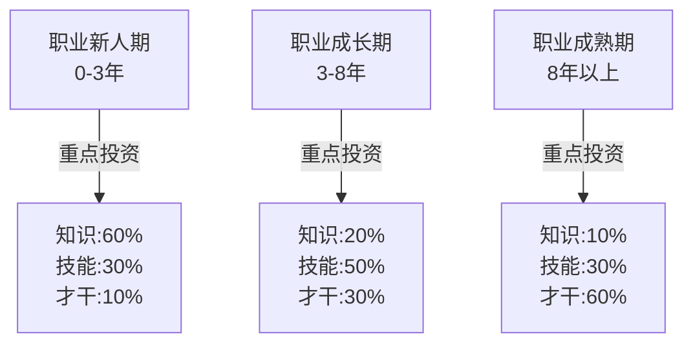
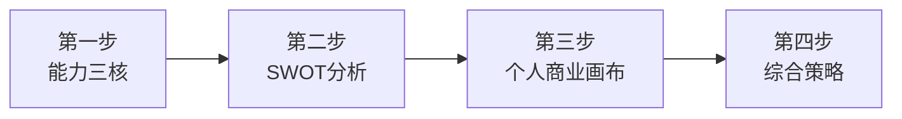

## 三、自我分析工具

认识自己是职业发展的起点，也是最难的部分。古希腊德尔斐神庙上刻着"认识你自己"（γνῶθι σεαυτόν），两千多年后这句话依然是人类面对的核心挑战。我们对自己的认知往往存在系统性偏差——高估自己的优势、低估自己的盲区、忽视环境的变化。

自我分析工具的价值不在于给你一个"标准答案"，而在于提供结构化的思考框架，帮你把模糊的自我感觉转化为清晰的、可操作的洞察。本章介绍三个互补的分析工具：SWOT分析帮你建立全局视角，个人商业画布帮你用商业模式思维审视职业，能力三核模型帮你理解能力的层次结构。三者结合使用，可以形成对自身职业发展状况的立体认知。

### 3.1 SWOT分析法在职业发展中的应用

SWOT分析原本是企业战略管理工具，由哈佛商学院的阿尔伯特·汉弗莱（Albert Humphrey）在1960-1970年代的研究中开发。但将其应用于个人职业发展，同样具有强大的分析效力。它的核心逻辑极其简单：把所有影响你职业发展的因素分为内部因素（优势和劣势）和外部因素（机会和威胁），然后通过交叉组合产生策略。

#### 3.1.1 SWOT四要素详解

**S - Strengths（优势）**

个人优势是你相对于他人更具竞争力的方面。识别优势时需要注意：优势不是"你觉得好的地方"，而是"别人认可你、并且你能持续交付价值的地方"。一个真正的能力优势需要同时满足三个条件——你擅长、别人需要、你能持续稳定地表现。

个人优势的主要类别包括：

- **专业技能**：你掌握的核心技术或专业知识。例如：Python编程能力、财务建模能力、法律文书写作能力。评估专业技能时要区分"了解"和"精通"——能看懂代码和能独立设计系统架构是两个层次。
- **软技能**：沟通能力、领导力、团队协作、问题解决能力、冲突管理、跨部门协调。软技能的评估难度高于硬技能，因为缺乏客观衡量标准。判断方法：回顾过去一年，你在哪些"需要人际互动"的任务中获得了正面反馈？
- **学历与认证**：名校背景、专业资格证书（CPA、CFA、PMP、AWS认证等）。证书的价值取决于行业认可度和时效性——一个过期的认证或一个业界不认可的证书不算优势。
- **经验积累**：行业经验、项目经验、管理经验。关键不是"工作了多少年"，而是"积累了什么样的经验"。五年重复同一类工作和五年经历不同类型的项目，含金量完全不同。
- **人脉资源**：行业人脉、校友网络、专业社群。评估人脉质量的标准：你认识的人中，有多少人在你需要时愿意花时间帮你？有多少人处于能影响你职业发展的位置？
- **个人特质**：抗压能力、学习能力、创新思维、执行力、自律性。这些特质不容易量化，但可以通过行为证据来评估——比如"学习能力强"的证据是"过去半年自学并掌握了X技能，并应用到了实际项目中"。
- **成就记录**：过往的成功案例、获奖经历、突出业绩。成就记录是最有说服力的优势证明，因为它提供了"你做到了"的客观证据。

**自我审视问题清单**：

- 别人经常因为什么来请教我？（外部视角比自我感觉更可靠）
- 我做过哪些让自己骄傲的项目或成就？（具体到什么项目、什么角色、什么结果）
- 在过去的工作中，我收到最多的正面评价是什么？（翻阅绩效评估、推荐信、同事反馈）
- 我有哪些证书或资质是别人没有的？（在同级别同事中稀缺的才算优势）
- 我在哪些方面的表现明显优于平均水平？（用数据或事实支撑，不是感觉）
- 如果要向别人推荐自己，我会强调哪三个方面？（这三个方面就是你认知中的核心优势）

**W - Weaknesses（劣势）**

个人劣势是阻碍你职业发展的短板。识别劣势比识别优势更难，因为人类天生有自我保护倾向，会下意识回避不舒适的信息。一个有效的方法是：不要问"我的劣势是什么"，而是问"过去一年，我在哪些事情上花了最多时间却没有得到好结果"。

个人劣势的主要类别包括：

- **技能短板**：缺乏某项关键技能。例如：英语口语能力不足以参加国际会议、数据分析能力薄弱无法用数据支撑决策、公众演讲恐惧导致无法在大场合展示成果。判断是否为"关键短板"的标准：这个短板是否在过去一年中实际阻碍了你的工作表现或晋升机会？
- **性格弱点**：拖延症、社交恐惧、完美主义、优柔寡断、回避冲突。注意区分"性格特点"和"性格弱点"——内向不是弱点，但因内向而回避所有社交场合导致错过信息和机会，就变成了弱点。
- **知识盲区**：对行业趋势缺乏了解、对新技术不敏感、对商业运作模式不理解。知识盲区往往最危险，因为你不知道自己不知道什么。
- **资源不足**：学历不够、缺乏行业人脉、经济基础薄弱、所在城市机会有限。资源劣势有些可以通过努力弥补（人脉），有些需要更长时间（学历），有些可能需要接受并绕过（经济基础）。
- **工作习惯**：时间管理差、注意力分散、缺乏深度工作能力、无法有效委派任务。工作习惯的劣势有累积效应——每天浪费一小时，一年就是250小时。
- **心理障碍**：冒名顶替综合征（觉得自己的成就都是运气或欺骗）、害怕失败导致不敢尝试、缺乏自信导致不敢争取机会。心理障碍是最隐蔽的劣势，因为它们往往被合理化为"谨慎""谦虚"。

**自我审视问题清单**：

- 在工作中，我经常在哪些方面遇到困难？（困难是劣势最直接的信号）
- 同事或领导对我的改进建议通常是什么？（绩效评估中的"改进领域"）
- 我回避或拖延的任务通常属于什么类型？（回避往往暗示能力不足或信心不足）
- 与同龄人相比，我在哪些方面明显落后？（找到同龄人的LinkedIn或公开资料做对比）
- 我知道但一直没有去弥补的能力短板是什么？（拖延弥补本身也是一个问题）
- 如果有一个魔法可以改变自己的一点，我会选择什么？（你最想改变的就是最大的劣势）

**O - Opportunities（机会）**

外部环境中有利于你职业发展的因素。识别机会需要保持对环境的敏感度——很多人埋头工作，错过了身边涌现的机会。机会窗口有时效性，你不抓住，别人就会抓住。

- **行业趋势**：所在行业的增长前景、新兴细分领域。例如：2023年以来大模型AI的爆发，创造了大量AI工程师、AI产品经理、AI训练师等新岗位。
- **技术变革**：AI、大数据、新能源、生物科技等带来的新机会。每一次重大技术变革都会重塑职业格局——就像移动互联网催生了产品经理、UI设计师、增长黑客等新职业。
- **政策红利**：国家政策支持的产业方向。例如：碳中和政策带动新能源行业人才需求、数字人民币试点带动区块链相关岗位、芯片自主化政策带动半导体行业薪资上涨。
- **组织变化**：公司扩张、新部门设立、领导层变动、并购重组。组织变化往往伴随着新的岗位空缺和权力结构调整，是晋升或转型的好时机。
- **市场需求**：人才缺口、薪资上涨趋势。某类人才供不应求时，入行门槛降低、薪资议价空间增大。
- **人脉机会**：行业会议、社群活动、导师资源、校友会。一次关键的人脉连接可能改变职业轨迹。
- **全球化与远程工作**：远程工作让地理限制减弱，你可以在三四线城市为一线城市甚至海外公司工作。

**T - Threats（威胁）**

外部环境中可能阻碍你职业发展的因素。威胁不同于劣势——劣势是你自身的问题，威胁来自外部环境。很多人忽视威胁，觉得"船到桥头自然直"，等到威胁变成现实时已经来不及应对。

- **行业衰退**：所在行业进入下行周期。例如：K12教育行业的政策调整、房地产行业的周期下行、传统媒体的持续萎缩。
- **技术替代**：AI可能替代部分岗位。最容易被AI替代的岗位特征：规则明确、重复性高、不需要复杂人际互动。但注意：AI更多是改变岗位而非消灭岗位——与其担心被替代，不如学会使用AI工具。
- **竞争加剧**：大量人才涌入你的领域、海归回流、跨行转型者增多。
- **组织风险**：公司裁员、部门合并、领导更换、战略调整。不要假设"公司不会裁我"——评估组织风险时，问自己：如果我明天被裁，我能在多长时间内找到同等水平的工作？
- **年龄歧视**：35岁现象、中年危机。在一些行业（特别是互联网），年龄确实是一个现实威胁。应对策略不是抱怨，而是提前规划——在35岁之前建立不可替代性或实现职业转型。
- **经济环境**：经济下行、就业市场萎缩、行业监管收紧。
- **政策变化**：行业监管政策的调整、税收政策变化、劳动法规变更。

#### 3.1.2 SWOT矩阵的战略组合

完成SWOT分析后，关键在于将四个维度组合形成策略。SWOT分析本身只是诊断，策略组合才是处方。很多人的SWOT分析做完就束之高阁，问题就在于没有走到策略制定这一步。

| 策略类型 | 组合方式 | 核心思路 | 行动导向 |
|---------|---------|---------|---------|
| **SO策略（增长型）** | 优势 × 机会 | 利用自身优势，抓住外部机会 | 最优先执行，这是你的"顺势而为" |
| **WO策略（扭转型）** | 弥补劣势 × 抓住机会 | 克服短板，以抓住外部机会 | 高优先级，投入资源补短板 |
| **ST策略（防御型）** | 优势 × 应对威胁 | 利用自身优势，化解外部威胁 | 中优先级，利用优势建立护城河 |
| **WT策略（收缩型）** | 弥补劣势 × 规避威胁 | 最小化劣势，避免外部威胁 | 最后考虑，通常是"止损"方案 |

**完整案例：一位传统制造业工程师的SWOT分析**

张工，32岁，在一家中型制造企业担任工艺工程师，工作8年。以下是他的完整SWOT分析和策略制定过程。

| 维度 | 具体内容 |
|------|---------|
| **S（优势）** | 扎实的机械工程基础；8年制造业经验，熟悉从原材料到成品的全流程；有PMP认证；主导过3个产线优化项目，平均降低15%成本；在公司内部有良好的跨部门关系 |
| **W（劣势）** | 不会编程（Python/PLC）；英语只能读不能流利说；对工业物联网和智能制造了解仅停留在概念层面；所在城市产业单一，跳槽选择有限 |
| **O（机会）** | 智能制造/工业4.0快速发展，政府出台大量补贴政策；公司正在推进数字化转型，成立了智能制造部；行业内懂数字化的工程师极度稀缺；远程工作趋势让跨城市求职成为可能 |
| **T（威胁）** | 纯传统工艺岗位数量逐年减少；新招的应届生都有智能制造相关课程背景；公司近年利润下滑，存在裁员风险；35岁年龄线临近 |

**策略组合**：

- **SO策略（增长型）**：利用已有的工程经验和项目管理能力，主动申请加入公司新成立的智能制造部。用PMP认证和项目经验作为敲门砖——部门刚成立，需要能管理项目的人，而不仅仅是会写代码的人。这是最佳路径：低风险（不换公司）、高收益（进入热门领域）。
- **WO策略（扭转策略）**：用6个月时间系统学习Python基础和工业物联网入门。推荐路径：先学Python（3个月），再学工业物联网（3个月），目标不是成为专家，而是能够理解技术团队的语言、能够做基础的数据分析。可以利用公司的数字化转型项目作为实战场景。
- **ST策略（防御型）**：利用项目管理能力和行业经验，向技术管理方向发展。即使技术迭代，管理能力是通用的。同时将8年的行业经验转化为内容输出（行业博客、知乎回答），建立个人品牌，降低对单一雇主的依赖。
- **WT策略（收缩型）**：如果公司裁员且智能制造转型不成功，凭借PMP和行业经验转向工程咨询公司或工业软件公司的实施顾问岗位。这类岗位需要"懂制造业"的人，而非"懂编程"的人。

#### 3.1.3 SWOT分析的常见错误与纠正

| 常见错误 | 为什么是错的 | 如何纠正 |
|---------|------------|---------|
| **混淆内部和外部因素** | 优势和劣势是你自身的（可控的），机会和威胁是环境的（不可控的）。把"行业不景气"写成劣势，会让你误以为是自己的问题 | 用"如果换一个行业/公司，这个因素还存在吗"来判断——还存在的是内部因素，不存在的是外部因素 |
| **过于笼统** | "沟通能力强"不是分析，是自我评价。它不提供任何可操作的信息 | 用具体场景+行为+结果来描述。例如："能在跨部门会议中用非技术语言解释技术方案，上次产品评审会成功说服了市场部接受延期方案" |
| **只报喜不报忧** | 只看到优势和机会，回避真实的短板。这不是分析，是自欺欺人 | 邀请信任的同事或导师帮你做360度评估。别人眼中的你，往往比你自己看到的更真实 |
| **分析后不行动** | SWOT的价值不在于那张矩阵图，而在于基于矩阵制定的具体策略和行动计划 | 每个象限至少产出1条具体策略，每条策略必须包含：做什么、怎么做、什么时候做、怎么衡量 |
| **一次性分析** | 内外部环境都在变化，去年的优势可能变成今天的常规能力，去年的威胁可能已经变成现实 | 每半年更新一次SWOT分析，把它变成职业发展的"定期体检" |
| **忽视组合策略** | 只罗列了四个维度的内容，没有做交叉分析 | SWOT的核心价值是SO/WO/ST/WT四种组合策略，不做组合等于白做 |

#### 3.1.4 SWOT分析的进阶技巧

**时间维度分析**：不要只分析"现在"，还要分析"三年前"和"三年后"。三年前的SWOT可以验证你的判断是否准确（当时的威胁是否真的发生了？机会是否真的被抓住了？），三年后的SWOT可以帮你做前瞻性规划。

**对标分析法**：找到你目标岗位上的标杆人物（LinkedIn上搜），把他的公开信息也做一个SWOT，然后对比你和他的差距。差距最大的地方就是你需要重点突破的方向。

**多人协作SWOT**：邀请3-5位信任的朋友/同事/导师，各自独立为你做一个SWOT分析，然后汇总对比。你会发现：别人看到的优势和你自己认为的优势可能差异巨大——这种差异本身就是宝贵的信息。

---

### 3.2 个人商业画布（Personal Business Model Canvas）

个人商业画布是将商业模式画布（Business Model Canvas）应用于个人职业发展的工具，由蒂姆·克拉克（Tim Clark）在《商业模式新生代（个人篇）》中系统提出。它帮助你像经营一家公司一样经营自己的职业生涯。

这个框架的核心洞察是：你就是一家公司。你有自己的产品（能力）、客户（雇主/客户）、渠道（如何展示价值）、收入（薪资和回报）、成本（时间和精力）。大多数人在职业发展中犯的最大错误是"只管生产（提升能力），不管营销（展示价值）"——就像一家有好产品但没有销售渠道的公司，注定会倒闭。

#### 3.2.1 九大要素详解

**1. 核心资源（Key Resources）——你拥有什么？**

核心资源是你用来创造价值的一切资产。盘点核心资源时，要全面且诚实：

| 资源类型 | 具体内容 | 评估问题 |
|---------|---------|---------|
| 知识储备 | 行业知识、产品知识、技术知识、政策法规 | 我的知识深度在同行中处于什么水平？ |
| 技能组合 | 硬技能（编程、设计、分析）+ 软技能（沟通、领导、谈判） | 我的技能组合是否稀缺？是否容易被替代？ |
| 经验资产 | 行业经验、项目经验、管理经验、成功案例 | 我的经验中有多少是"可迁移"的？ |
| 人脉网络 | 行业人脉、校友网络、专业社群、导师 | 我的人脉中有多少是"强连接"（愿意帮忙的）？ |
| 个人品牌 | 行业知名度、作品集、社交媒体影响力、口碑 | 如果有人搜索我的名字，能找到什么？ |
| 资质认证 | 学历、证书、执照 | 哪些是目标岗位的"硬门槛"？ |
| 个人特质 | 性格、价值观、驱动力、抗压力 | 哪些特质帮我成功？哪些特质阻碍了我？ |
| 资金和时间 | 可支配资金、自由时间、健康状态 | 我有多少"弹药"可以投入到职业发展中？ |

**2. 关键活动（Key Activities）——你做什么？**

关键活动是你每天花时间在做的事情。大多数人的关键活动分析会揭示一个令人不安的事实：大量时间花在了"紧急但不重要"的事情上，而真正能推动职业发展的"重要但不紧急"的事情被不断推迟。

列出你过去一周的时间分配，然后分类：

- **价值创造活动**：直接产出成果的工作（写代码、做方案、谈客户、写报告）
- **关系维护活动**：会议、汇报、社交、沟通协调
- **学习成长活动**：学习新技能、阅读行业资料、参加培训
- **行政事务活动**：填表、报销、回复邮件、处理琐事
- **低效消耗活动**：无目的刷手机、过长的会议、不必要的社交

理想的时间分配比例：价值创造60%、关系维护15%、学习成长15%、行政事务10%。如果你的实际比例偏离这个太多，就需要重新审视你的关键活动。

**3. 价值主张（Value Propositions）——你能提供什么价值？**

价值主张是个人商业画布的核心。回答一个根本问题：别人为什么要雇用我而不是其他人？

一个好的价值主张需要满足三个条件：
- **具体**：不是"我很优秀"，而是"我能用数据分析帮助产品团队提升30%的转化率"
- **差异化**：不是"我会Python"（太多人会），而是"我既懂Python又懂供应链管理，能做行业特有的数据分析"
- **可验证**：不是"我学习能力强"，而是"我3个月自学了机器学习，并在项目中实际应用"

**价值主张的提炼方法**：用以下句式完成——"我帮助[谁]解决[什么问题]，通过[什么方式]，达到[什么效果]。" 例如："我帮助中小型制造企业降低生产成本，通过工艺优化和自动化改造方案，平均降低15-20%的制造成本。"

**4. 客户细分（Customer Segments）——你为谁服务？**

你的"客户"不只是终端用户，还包括所有从你的工作中获得价值的人：

- **直接客户**：你的直属领导和团队——他们对你的日常表现有最直接的评价权
- **间接客户**：跨部门协作者、上下游合作伙伴——他们影响你的协作效率和口碑
- **最终客户**：公司的付费客户——你的工作最终要为他们创造价值
- **潜在客户**：猎头、行业同行、未来的雇主——他们是你职业发展的"外部市场"

不同客户需要不同的"价值主张"。对直属领导，你的价值是"可靠地完成任务"；对公司高层，你的价值是"推动业务增长"；对行业市场，你的价值是"独特的专业能力"。

**5. 渠道通路（Channels）——如何让别人知道你的价值？**

"酒香也怕巷子深"。很多有能力的人职业发展不理想，不是因为能力不够，而是因为没有有效展示自己的价值。

- **工作表现渠道**：项目交付、绩效评估、工作汇报——最基础但最重要
- **内容输出渠道**：技术博客、行业文章、知乎/公众号、开源项目——建立专业影响力
- **社交网络渠道**：LinkedIn、行业社群、校友会——扩大人脉触达
- **行业活动渠道**：技术大会演讲、行业论坛、研讨会——建立行业认知度
- **口碑传播渠道**：同事推荐、客户好评、导师背书——最有力的渠道

**6. 客户关系（Customer Relationships）——如何维护关系？**

与你的"客户"建立和维护关系的方式：

- **工作汇报**：定期向上级汇报进展，让他知道你在做什么、做得怎么样
- **主动沟通**：不要等领导来问你，主动同步信息、预警风险
- **持续交付价值**：关系的基础是你持续提供价值，不是社交技巧
- **建立信任**：说到做到、主动承担、对结果负责——信任是所有关系的基础
- **超出预期**：偶尔做到比承诺的更多，是建立深度信任的关键

**7. 重要伙伴（Key Partners）——谁可以帮助你？**

- **导师**：比你走得更远的前辈，能给你方向性指导和经验传承
- **同行者**：与你水平相当的同行，可以互相交流信息和资源
- **支持者**：你的直接上级、信任的同事，他们愿意在关键时刻为你说话
- **信息源**：猎头、行业分析师、社群运营者，他们能帮你获取关键信息
- **学习伙伴**：一起学习、互相督促的伙伴

**8. 收入来源（Revenue Streams）——你获得什么回报？**

不要把"收入"狭隘地理解为工资。完整的职业回报包括：

| 回报类型 | 具体内容 | 重要性 |
|---------|---------|-------|
| 财务回报 | 基本工资、奖金、股权/期权、福利 | 基础需求 |
| 成长回报 | 技能提升、视野拓展、经验积累 | 长期投资 |
| 关系回报 | 人脉积累、行业认知、导师资源 | 职业资本 |
| 品牌回报 | 个人知名度、行业口碑、作品积累 | 无形资产 |
| 心理回报 | 成就感、自主权、工作意义感、归属感 | 幸福感来源 |

年轻时应该更看重成长回报和品牌回报，因为它们在长期能带来更大的财务回报。一味追求高薪但没有成长空间的工作，是一种"职业高利贷"——用未来的可能性换取眼前的收入。

**9. 成本结构（Cost Structure）——你需要付出什么？**

- **时间成本**：工作时间、通勤时间、加班时间——时间是最稀缺的资源
- **精力成本**：脑力消耗、情绪消耗、体力消耗
- **学习成本**：培训费用、学习时间、考证费用
- **机会成本**：选择A意味着放弃B——这是最容易被忽视的成本
- **健康成本**：加班对身体的影响、压力对心理的影响、久坐对健康的影响
- **关系成本**：因为工作牺牲的陪伴家人朋友的时间

#### 3.2.2 个人商业画布实操工作坊

**准备工作**：打印一张个人商业画布模板（可以用A3纸），准备不同颜色的便利贴（黄色=当前状态、绿色=理想状态、红色=问题/差距）。用便利贴而不是直接书写，方便后续调整。

**步骤一：填写当前状态（30分钟）**

花30分钟，将自己当前的职业模式填入画布的九个模块。每个模块至少写3个便利贴。填写顺序建议：核心资源 → 关键活动 → 价值主张 → 客户细分 → 其他模块。价值主张是核心，其他模块围绕它展开。

**步骤二：诊断问题（20分钟）**

检查各模块之间的一致性，问以下问题：

- **活动-价值一致性**：我的关键活动是否能产生我的价值主张？如果我声称"数据分析能力强"但我每天花80%的时间在做报表，那关键活动和价值主张是脱节的。
- **价值-客户一致性**：我的价值主张是否满足客户的需求？如果领导需要的是"能带团队的人"而你展示的是"技术最强"，那价值主张和客户需求是错位的。
- **收入-价值匹配度**：我的收入是否与我创造的价值匹配？如果明显偏低，要么是你的价值没有被正确展示，要么是你在错误的市场（公司/行业）。
- **成本-回报合理性**：我的投入产出比合理吗？如果每天工作12小时但收入和成长都不理想，商业模式存在根本问题。

**步骤三：设计理想版本（30分钟）**

在另一张画布上，用绿色便利贴填写你3年后理想状态的职业模式。不要受限于当前条件，大胆设想。然后对比两个版本，找出差距最大的模块——那就是你需要重点突破的方向。

**步骤四：制定行动计划（20分钟）**

对比当前版本和理想版本，为每个有差距的模块制定1-3条具体行动。每条行动必须符合SMART原则——具体的（Specific）、可衡量的（Measurable）、可实现的（Achievable）、相关的（Relevant）、有时限的（Time-bound）。

**示例**：差距是"个人品牌薄弱"，行动不是"多写文章"（不具体），而是"每周发布1篇技术博客到掘金/知乎，持续3个月，目标获得1000个关注者"。

#### 3.2.3 个人商业画布的常见错误

- **把"想做的"当成"擅长的"**：核心资源模块要诚实盘点你真正拥有的，而不是你希望自己拥有的。想学Python和精通Python是两回事。
- **忽视非金钱回报**：只关注薪资而忽视成长、品牌、关系回报，会导致短期高薪但长期停滞的职业选择。
- **价值主张太泛**：如"我是一个勤奋努力的人"——这不是价值主张，这是自我介绍的废话。价值主张必须回答"你能解决什么具体问题"。
- **不更新画布**：你的职业模式不是静态的。每半年应该重新审视一次画布，看看哪些假设得到了验证、哪些需要调整。
- **只分析不行动**：画布是诊断工具，不是终点。诊断之后必须有处方（行动计划），处方之后必须有执行。

---

### 3.3 能力三核模型

能力三核模型将个人能力分为三个层次，由古典老师在《你的生命有什么可能》中系统提出。这个模型的核心价值在于：它帮你理解不同能力层次的特性和价值，从而做出更明智的能力投资决策。

#### 3.3.1 知识（Knowledge）——你知道的东西

知识是你通过学习获得的信息和认知。它是最表层的能力，也是最容易获取和最容易过时的能力。

**知识的特性**：

- **获取门槛低**：一本书、一门课程、一次培训就能获得某个领域的基础知识
- **容易过时**：技术知识的半衰期约2-5年，行业知识受市场变化影响更大
- **壁垒价值下降**：在AI时代，知识的获取越来越容易——ChatGPT可以在几秒内提供任何领域的基础知识，纯粹的知识储备正在快速贬值
- **必要但不充分**：没有知识你无法开始，但只有知识你无法脱颖而出

**知识的分类**：

| 知识类型 | 示例 | 保质期 | 壁垒价值 |
|---------|------|-------|---------|
| 基础学科知识 | 数学、物理、经济学、心理学 | 长 | 低（人人可学） |
| 行业知识 | 金融运作、医疗体系、互联网商业模式 | 中 | 中（需要行业浸入） |
| 技术知识 | 编程语言、框架、工具 | 短 | 低（更新快） |
| 隐性知识 | 行业潜规则、组织文化、谈判技巧 | 长 | 高（只能靠经验积累） |

**提升知识的方法**：阅读专业书籍和行业报告、参加培训和考证、关注行业资讯和趋势报告、与行业专家交流。重点是：不要什么都学，聚焦于与你职业目标最相关的2-3个知识领域深入学习。

#### 3.3.2 技能（Skill）——你能做的事情

技能是将知识转化为实际产出的能力。它需要通过反复练习才能获得，具有一定的壁垒性。

**技能的特性**：

- **需要练习**：技能不能通过"知道"来获得，只能通过"做到"来获得。你可以读100本游泳教材，但不下水就永远不会游泳。
- **具有迁移性**：好的技能可以跨行业迁移。例如：项目管理能力、数据分析能力、写作能力在任何行业都有用。
- **可以衡量**：技能水平有相对客观的衡量标准——你能完成什么级别的任务、达到什么质量水平。
- **复合效应**：多项技能的组合比单项技能更有价值。会写作的人很多，会写作又懂技术的人就少很多，会写作又懂技术又有行业经验的人就更稀缺了。

**关键技能清单**（按通用性排序）：

| 技能类别 | 具体技能 | 可迁移性 | AI替代风险 |
|---------|---------|---------|-----------|
| 思维技能 | 结构化思维、批判性思维、系统思维 | 极高 | 低 |
| 沟通技能 | 书面表达、口头演讲、跨部门沟通 | 极高 | 低 |
| 数据技能 | 数据分析、数据可视化、SQL | 高 | 中 |
| 技术技能 | 编程、系统设计、自动化 | 高 | 中（AI辅助而非替代） |
| 管理技能 | 项目管理、团队管理、资源协调 | 高 | 低 |
| 创意技能 | 设计思维、内容创作、品牌策划 | 中 | 低 |

**提升技能的方法**：刻意练习（在舒适区边缘反复挑战）、项目实战（真实项目是最好的训练场）、导师指导（有经验的人能帮你快速发现盲区）、复盘总结（每次做完项目都花时间回顾"什么做得好、什么可以改进"）。

**技能精进的四个阶段**：

1. **无意识无能力**：不知道自己不会（初学者的盲目自信）
2. **有意识无能力**：知道自己不会了（学习曲线中最沮丧的阶段）
3. **有意识有能力**：能做到但需要刻意努力（大多数人的瓶颈在这里）
4. **无意识有能力**：能做到且不需要刻意思考（专家级表现）

从阶段2到阶段3需要练习，从阶段3到阶段4需要大量重复和场景化练习。

#### 3.3.3 才干（Talent/Character）——你是谁

才干是你的内在特质和天赋，是最深层的能力。它决定了你在什么样的环境中能发挥最大潜力，也是最难被AI替代的能力层次。

**才干的特性**：

- **先天+后天**：才干有先天成分，但也可以通过长期修炼发展。一个人天生有创造力，但如果不给创造力提供发挥的场景和技能支撑，它也无法变成竞争优势。
- **最难改变**：改变才干需要深层的自我觉察和长期的行为调整，不像学习知识那样可以在短期内见效。
- **最深层的竞争力**：在知识和技能越来越容易获取的时代，才干成为最不可替代的竞争优势。AI可以写出结构清晰的文章，但无法拥有真正的同理心和创造力。
- **需要环境匹配**：才干只有在合适的环境中才能发挥。一个有创造力的人在高度标准化的工作中会窒息，一个有分析力的人在纯创意工作中会挣扎。

**核心才干维度**：

| 才干维度 | 表现 | 适合的角色 |
|---------|------|----------|
| 创造力 | 善于产生新想法、发现新的可能性 | 产品设计、创业、内容创作 |
| 同理心 | 能理解他人感受、感知未说出口的需求 | 管理、咨询、销售、用户研究 |
| 分析力 | 善于从复杂信息中发现模式和逻辑 | 数据分析、战略规划、研究 |
| 领导力 | 能影响和激励他人、在不确定中做决策 | 管理、创业、项目负责人 |
| 执行力 | 高效完成任务、善于把想法变成行动 | 运营、项目管理、工程 |
| 韧性 | 面对挫折能快速恢复、在压力下保持稳定 | 高压环境、创业、变革期 |
| 好奇心 | 对新事物保持探索欲、主动学习 | 创新、研究、跨领域工作 |

**才干的发现方法**：

- **回顾高峰体验**：过去让你感到"进入了心流状态"的时刻在做什么？心流状态往往暗示了你的才干所在。
- **注意他人的评价**：别人在什么场景下会说"你天生就适合做这个"？来自不同人的重复评价很有参考价值。
- **观察你的注意力**：你在空闲时间会自然而然地关注什么？你的注意力方向暗示了你的才干倾向。
- **使用专业测评工具**：盖洛普优势识别器（CliftonStrengths）、VIA性格优势测试、MBTI等可以提供参考（但不要过度依赖）。

#### 3.3.4 能力三核的实践应用

**不同职业阶段的能力投资策略**：

- **新人期（0-3年）**：优先积累知识和技能，快速上手工作。此时知识的边际收益最高——每学一个新知识都能立刻用上。知识投资60%、技能投资30%、才干觉察10%。
- **成长期（3-8年）**：在技能精进的同时，开始有意识地培养和展现才干特质。此时单纯的"知识多"已经不能形成竞争优势，必须通过技能的深度和才干的独特性来脱颖而出。知识投资20%、技能投资50%、才干投资30%。
- **成熟期（8年以上）**：才干成为核心竞争力。此时你的价值不在于"你自己能做到什么"，而在于"你能带动团队做到什么"。知识和技能可以通过团队弥补，但才干（如领导力、战略眼光、行业洞察）无法被替代。知识投资10%、技能投资30%、才干投资60%。

**能力组合策略**：

单维度的能力在今天越来越不值钱。最有竞争力的能力组合模式：

- **T型能力**：广泛的知识面 + 一个领域的深度技能。例如：懂商业、懂技术、懂设计的产品经理——广泛的知识面让他能与不同团队沟通，深度的产品技能让他能在自己的领域做到专业。适合大多数职场人的基础模型。
- **π型能力**：两个领域的深度技能。例如：技术+管理、技术+商业、设计+技术。两条"腿"让你在任何一个领域变化时都有退路。适合想要建立更强竞争力的中高级职场人。
- **梳型能力**：多个领域的中等深度技能 + 一个最深的核心技能。这是最稀缺也最有价值的能力模型——在多个领域都有足够的理解力，能在跨界场景中创造独特价值。适合想要成为复合型人才或创业的人。

**AI时代的能力投资重点**：

在AI快速发展的今天，能力投资需要特别注意：

- **知识层**：基础知识的壁垒价值在下降，但"知道什么时候用什么知识"的判断力在上升。不要再死记硬背，而要学会"知道去哪里找"和"知道怎么用"。
- **技能层**：AI能辅助但不能完全替代的技能最值得投资——结构化思维、复杂沟通、创意设计、跨领域整合。纯执行类技能（写简单代码、做基础报表）会越来越被AI工具替代。
- **才干层**：创造力、同理心、领导力、价值观——这些是AI最难模拟的能力。在所有人都能用AI写出80分的方案时，能做出90分方案的人，靠的就是才干层面的差异。

---

### 3.4 三大工具的组合使用方法

SWOT分析、个人商业画布、能力三核模型不是互相替代的关系，而是互补的。它们从不同角度审视你的职业发展状况，组合使用可以形成更完整的认知。

**推荐的分析流程**：

1. **先做能力三核**：搞清楚你有什么能力、处于什么层次、需要投资什么。这是"认识自己"的基础。
2. **再做SWOT分析**：在能力认知的基础上，加入外部环境分析（机会和威胁），形成全局视角。
3. **最后做个人商业画布**：把能力和环境整合到商业模式框架中，找到你的价值主张、目标客户、渠道策略，形成可执行的职业发展方案。

**三个工具的核心问题对照**：

| 工具 | 核心问题 | 关注维度 |
|------|---------|---------|
| 能力三核 | 我的能力结构合理吗？ | 内部——能力层次 |
| SWOT分析 | 我的处境如何？ | 内部+外部——全局分析 |
| 个人商业画布 | 我的职业模式可持续吗？ | 内部+外部——商业逻辑 |

**何时使用哪个工具**：

- **职业迷茫期**：先做能力三核，搞清楚自己擅长什么、喜欢什么。迷茫往往源于对自己不够了解。
- **重大决策期**（转行、跳槽、创业）：做SWOT分析，全面评估内外部因素，避免冲动决策。
- **职业规划期**（年度规划、三年规划）：做个人商业画布，从商业模式角度审视职业发展的可持续性。
- **定期体检**（每半年）：三个工具都做一遍，跟踪自己的变化和环境的变化。

---

### 3.5 其他常见的自我分析工具简介

除了上述三个深度工具外，还有几个常用的自我分析工具值得了解。它们各有侧重，可以根据需要选择使用。

**MBTI性格类型指标**：基于荣格的心理类型理论，将人格分为16种类型（如INTJ、ENFP等）。优点是容易理解和传播，缺点是科学性存在争议、容易形成刻板印象。适合用于初步自我探索，但不应该作为职业选择的唯一依据。

**盖洛普优势识别器（CliftonStrengths）**：基于积极心理学，识别你的前5大优势主题（如"战略思维""关系建立""执行力""影响力"）。优点是有大量实证研究支持、结果有较高的重测信度；缺点是需要付费。适合想要深入了解自己才干优势的人。

**DISC行为风格测评**：将行为风格分为D（支配）、I（影响）、S（稳健）、C（谨慎）四类。优点是简单易用、在团队沟通和管理场景中实用性强；缺点是过于简化。适合用于改善职场沟通和团队协作。

**霍兰德职业兴趣理论（RIASEC）**：将职业兴趣分为六类——现实型（R）、研究型（I）、艺术型（A）、社会型（S）、企业型（E）、常规型（C）。适合职业初期或转行时确定大方向。

**工具选择建议**：不要贪多。先用SWOT+能力三核+个人商业画布建立基本面，然后根据具体需要选择1-2个补充工具。所有测评工具都只是参考，最终的职业决策还要结合你的实际情况、价值观和直觉来综合判断。

---

### 3.6 常见误区与纠正

| 误区 | 为什么是误区 | 正确做法 |
|------|------------|---------|
| **做完分析就觉得完成了** | 分析只是起点，不是终点。没有行动计划的分析是自娱自乐 | 每次分析后必须产出具体的、有时间节点的行动计划 |
| **过度依赖测评工具** | 测评结果是参考，不是命运。MBTI说你是INTJ不代表你不能做销售 | 用多个工具交叉验证，结合实际经历和他人反馈综合判断 |
| **只分析一次就不更新了** | 你和环境都在变化，半年前的分析可能已经不准确 | 每半年重新审视一次，重大变化后立即更新 |
| **分析结果和行动脱节** | 明确知道自己的短板但不去弥补，等于不知道 | 为每个发现的短板制定具体的改进计划，并设定检查点 |
| **只关注短板，忽视优势** | 补短板能让你不失败，但发挥优势才能让你卓越 | 把80%的精力放在强化优势上，20%用于弥补关键短板 |
| **闭门造车** | 自我分析最大的敌人是盲区——你不知道自己不知道什么 | 邀请他人参与分析，获取外部视角 |
| **把工具当目的** | 工具是为了帮你想清楚问题，不是为了填满一张表或做一个漂亮的图 | 关注分析的质量和深度，而不是形式上的完整 |

---

### 3.7 本节练习

**练习一：SWOT分析（60分钟）**

1. 在一张白纸上画出四象限矩阵
2. 每个象限至少列出5个条目（不要少于5个，逼自己想深一点）
3. 每个条目用"场景+行为+结果"的方式描述，不要写空泛的形容词
4. 做完后，为每个交叉象限（SO/WO/ST/WT）至少写出1条策略
5. 每条策略写明：做什么、怎么做、什么时候开始、怎么衡量结果

**练习二：个人商业画布（90分钟）**

1. 打印或手绘个人商业画布模板
2. 用便利贴填写九个模块（每个模块至少3张便利贴）
3. 完成后做一致性诊断：活动是否支撑价值主张？价值主张是否满足客户需求？
4. 在另一张画布上设计3年后的理想版本
5. 对比两个版本，找出差距最大的3个模块，为每个模块制定1条SMART行动计划

**练习三：能力三核自评（30分钟）**

1. 列出你目前的Top 10知识领域、Top 10技能、Top 5才干特质
2. 对每一项打分：知识1-5分（1=了解，5=专家），技能1-5分（1=能做，5=精通），才干1-5分（1=偶尔展现，5=持续稳定展现）
3. 评估：你的能力投资比例是否匹配你当前的职业阶段？
4. 找出1个你最想提升的能力项，制定90天提升计划
