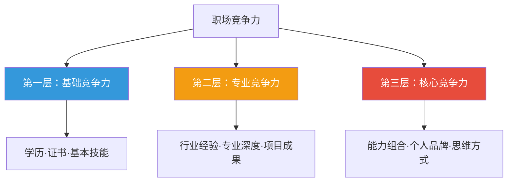
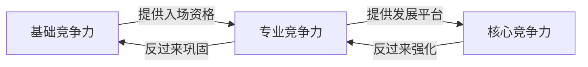
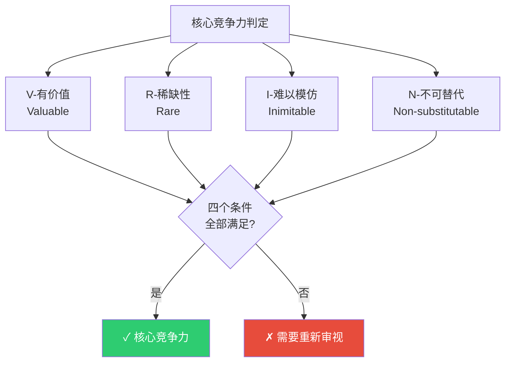
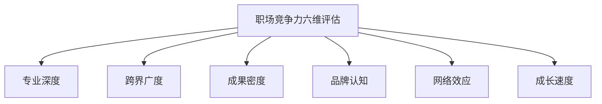
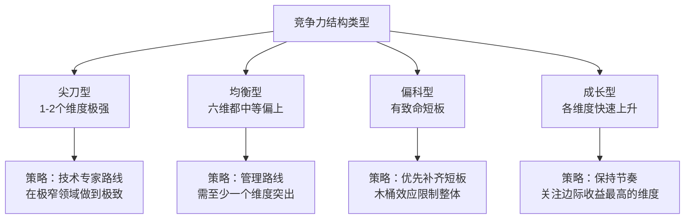
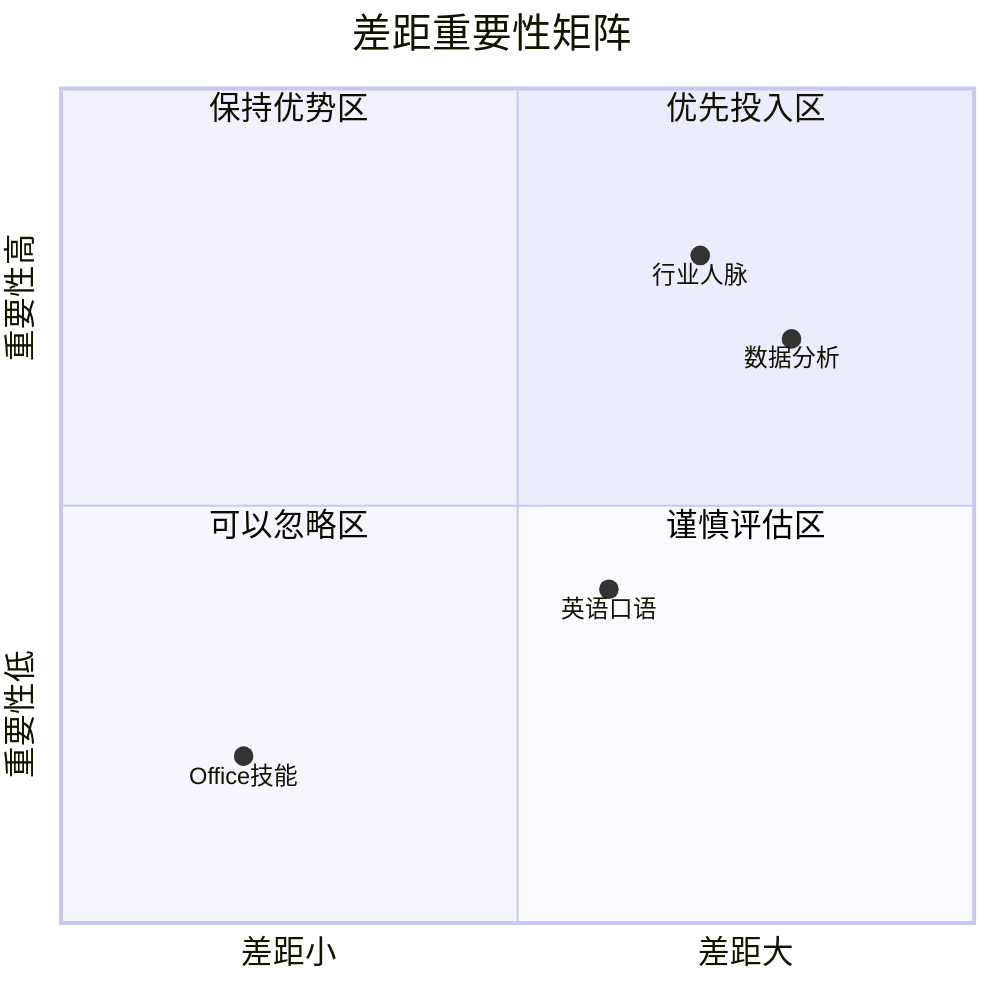
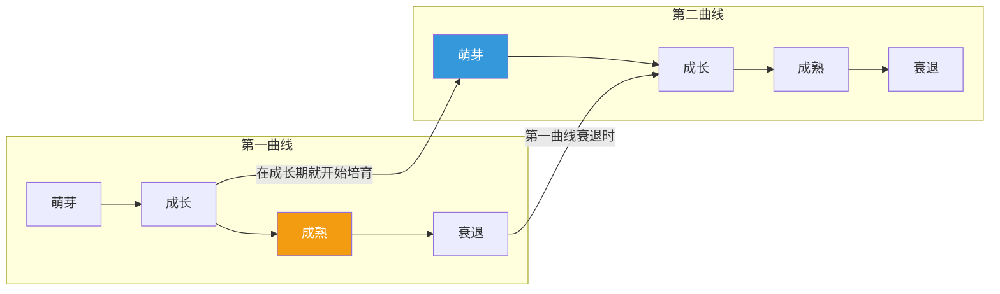
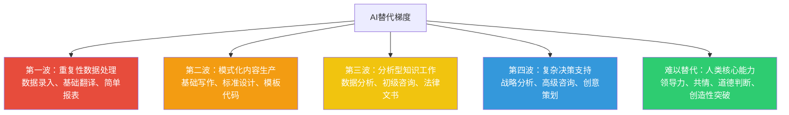

## 四、职场竞争力模型

职场竞争力不是一个模糊的概念——它有清晰的结构、可衡量的维度、可操作的提升路径。本节将系统拆解竞争力的底层逻辑，提供从诊断到提升的完整方法论，帮助你建立清晰的"竞争力地图"，知道自己在哪里、要去哪里、以及怎么到达。

为什么需要一个模型？因为大多数人对自身竞争力的判断是模糊的——"我觉得我挺厉害的"或"我觉得我不行"，这两种判断都缺乏结构化支撑。没有模型，你就不知道该优先提升什么，不知道投入的时间精力是否花在了刀刃上，也不知道自己的竞争力在市场中处于什么位置。模型的价值在于：把模糊的直觉变成可分析、可比较、可行动的框架。

**本节的学习路径**：

| 层级 | 内容 | 适合谁 |
|------|------|--------|
| 道（认知层） | 竞争力的三层结构、VRIN模型、生命周期理论 | 所有职场人——建立正确的竞争力认知 |
| 法（方法层） | 六维评估框架、差距分析法、70-20-10法则 | 有明确职业目标的人——掌握系统方法 |
| 术（实操层） | 评估模板、审计清单、刻意练习方案 | 想立刻行动的人——拿来就用 |
| 器（工具层） | 年度计划模板、对标分析表、预警机制 | 需要持续追踪的人——建立系统 |

---

### 4.1 职场竞争力的三层结构

职场竞争力可以分为三个层次，就像一座冰山——水面上的部分最容易看到，但真正决定冰山走向的是水面下的部分。

这三层之间的关系不是简单的"加法"，而是"乘法"——基础竞争力是入场门槛，专业竞争力是护城河，核心竞争力是复利引擎。一个人如果只有基础竞争力，天花板很低；如果三层都具备且相互强化，就能形成持续增长的职业飞轮。

**三层竞争力的量化感知**：假设满分100分——基础竞争力的分值范围约0-30分（决定了"能不能入场"），专业竞争力约0-40分（决定了"能站多稳"），核心竞争力约0-30分（决定了"能走多远"）。一个只有基础竞争力的人，上限30分；三层都拉满的人，可达100分。这不是精确数学，但能帮助你直觉理解为什么"只刷证书"是低效策略——你只是在30分的天花板下打转。

#### 4.1.1 第一层：基础竞争力（表层）

基础竞争力是进入职场的"入场券"——没有它，你连面试机会都拿不到；但仅有它，你随时可以被替换。

**构成要素**：

| 要素 | 说明 | 典型示例 | 市场稀缺度 | 保质期 |
|------|------|---------|-----------|--------|
| 学历背景 | 最高学历和院校层次 | 985/211本科、海外硕士 | 低——学历通胀严重，2024年全国高校毕业生达1179万 | 永久（但信号价值随年限递减） |
| 职业证书 | 行业认可的专业资质 | CPA、CFA、PMP、教师资格证、AWS认证 | 中——取决于证书的含金量和行业需求 | 2-5年（多数需要续期） |
| 基础技能 | 岗位要求的通用能力 | Office三件套、基础英语、沟通表达、AI工具使用 | 极低——几乎人人都具备 | 3-5年（工具在迭代） |
| 基本素养 | 职场通用的行为规范 | 守时、靠谱、邮件礼仪、汇报能力、时间管理 | 低——但缺失会成为明显减分项 | 永久 |

**关键特征**：

- **最容易获得**：通过短期学习、考试即可获取，周期通常在1-6个月
- **最容易被超越**：因为获取门槛低，竞争对手也能快速拥有
- **边际效用递减**：第一个硕士学位很有用，第二个的边际价值大幅下降；第一张CPA证书是门槛，第二张CFA证书的增值取决于是否需要跨领域
- **保质期有限**：技术类证书需要持续更新，否则会过时。例如PMP每3年需要积累60个PDU来续证

**常见误区**：很多职场新人把大量时间花在"考证"上，以为证书越多竞争力越强。事实上，当你的证书数量超过岗位要求后，每多一张证书带来的竞争力提升几乎为零。面试官不会因为你多了一张PMP证书就给你加薪——但你如果缺少岗位明确要求的CPA，连简历筛选都过不了。所以基础竞争力的策略是：**满足门槛即可，不要过度投入**。

一个实用的判断标准：打开你目标岗位的5条招聘JD，列出所有要求的证书和基础技能，确保自己全部覆盖。覆盖之后，把时间投入到专业竞争力的构建上。

**基础竞争力的"信号衰减"规律**：学历和证书的价值会随工作年限递减。刚毕业时，学历占简历权重的40%以上；工作5年后，降到15%左右；工作10年后，几乎不再被关注（除非是极少数要求"博士学历"的岗位）。证书同理——工作3年后，面试官更关心你"做过什么"而不是"考过什么"。这意味着：如果你已经工作5年以上，还在花大量时间提升学历或考证，投入产出比极低。

#### 4.1.2 第二层：专业竞争力（中层）

专业竞争力是在职场中站稳脚跟的"护城河"——它需要时间积累，不是花钱就能买到的，因此具有真正的壁垒价值。

**构成要素**：

| 要素 | 说明 | 积累方式 | 壁垒高度 | 典型积累周期 |
|------|------|---------|---------|------------|
| 行业认知 | 对所在行业的深度理解——产业链、竞争格局、关键玩家、隐性规则 | 至少3-5年行业浸泡 | 高——需要时间，无法速成 | 3-5年 |
| 专业深度 | 在特定领域的精通程度——不只是"会做"，而是"做得好" | 刻意练习+项目实战 | 高——从60分到90分需要大量投入 | 3-7年 |
| 项目成果 | 可量化、可验证的成功经历 | 主动承担有挑战性的项目 | 中——成果可被记录和转述 | 1-3年 |
| 方法论 | 你总结出的可复用的工作方法和框架 | 复盘+系统化思考 | 高——真正有效的方法论是稀缺的 | 3-5年 |
| 行业人脉 | 行业内认可你的专业人士网络 | 长期价值输出+社交经营 | 高——信任需要时间积累 | 5-10年 |

**关键特征**：

- **需要时间积累**：不存在"速成"路径，通常需要3-7年
- **具有壁垒**：竞争对手即使知道你的优势在哪里，也无法在短期内复制
- **可迁移性中等**：行业认知和人脉在跨行业时会部分失效，但方法论和专业深度可以迁移
- **有"半衰期"**：技术领域的专业竞争力衰减最快（3-5年），商业领域的衰减较慢（5-10年）

**专业深度的五个层次**：

| 层次 | 描述 | 典型表现 | 市场价值 | 从上一层跃迁所需时间 |
|------|------|---------|---------|-------------------|
| L1 了解 | 知道概念和基本原理 | 能看懂相关文档，能做简单任务 | 入门级薪资 | — |
| L2 应用 | 能独立完成标准任务 | 按流程做事，效率中等 | 行业中位数薪资 | 6-12个月 |
| L3 精通 | 能处理复杂问题，有方法论 | 能优化流程，能解决别人解决不了的问题 | 行业前30%薪资 | 2-3年 |
| L4 专家 | 能定义问题、设计解决方案 | 能从0到1搭建体系，能培训他人 | 行业前10%薪资 | 3-5年 |
| L5 权威 | 行业公认的顶级水平 | 能影响行业标准，能吸引人才和资源 | 行业前1%薪资/股权 | 5-10年 |

**每个层次跃迁的关键动作**：

- **L1→L2**：从"学习"转向"实操"。关键动作——找到一个真实项目，独立完成它，不要怕犯错。很多人卡在L1的原因是"一直在学，一直在准备，从来不真正动手"。
- **L2→L3**：从"做事"转向"解决问题"。关键动作——主动接手别人搞不定的难题，每次解决后写复盘，提炼方法论。L2到L3的跃迁点是"第一次独立解决了一个没人教过你怎么做的问题"。
- **L3→L4**：从"解决问题"转向"定义问题"。关键动作——开始搭建体系、培训他人、对外输出。L3到L4的跃迁点是"第一次有人因为你的方法论而提升了自己的工作效率"。
- **L4→L5**：从"定义问题"转向"定义标准"。关键动作——参与行业标准制定、出版专业著作、在顶级会议上发言。这个跃迁不是每个人都能完成的，需要天赋、机遇和持续10年以上的深耕。

**一个判断标准**：如果你的专业竞争力可以用一句话说清楚（"我是做XX的"），那它还不够深。真正的专业竞争力应该是一个复合体——"我在XX行业做了N年，主导过XX类型的项目，总结出了一套XX方法论，行业里有不少人知道我"。这种复合体需要时间沉淀，不是一份简历能概括的。

**专业竞争力的"错觉"——经验≠能力**：

很多人混淆"经验年限"和"专业深度"。在同一个岗位上做了5年，如果每年都在重复相同的工作流程，那你的专业深度可能还停留在L2水平——你有5年的"工龄"，但只有1年的"能力"。真正的专业深度来自"不断遇到新问题、解决新问题"的积累。检验方法：回顾过去一年，你遇到过几个"之前没处理过"的问题？如果答案是0，说明你在原地踏步。

#### 4.1.3 第三层：核心竞争力（深层）

核心竞争力是实现职业跃迁的"核武器"——它是多种能力的独特组合，是最难被复制、最具长期价值的部分。

**构成要素**：

| 要素 | 说明 | 为什么难以复制 | 培养路径 |
|------|------|---------------|---------|
| 独特的能力组合 | 两种或多种能力的交叉点 | 单项能力可能不突出，但组合在一起形成的"化学反应"独一无二 | 有意识地在两个以上领域深耕，寻找交叉点 |
| 个人品牌 | 别人提到某个领域时会想到你 | 品牌需要长期一致的价值输出才能建立 | 持续输出高质量内容，建立专业声誉 |
| 思维方式 | 看待问题和解决问题的独特视角 | 思维方式由长期经历塑造，无法通过培训复制 | 跨领域学习+大量案例复盘+刻意反思 |
| 判断力 | 在信息不完整时做出正确决策的能力 | 需要大量成功和失败的经验积累 | 主动承担决策责任，建立决策复盘机制 |
| 影响力 | 不依赖职位就能影响他人决策的能力 | 基于信任和专业认可，需要长期经营 | 先提供价值，再建立信任，最后形成影响 |

**关键特征**：

- **最难复制**：因为它是多种因素的复合体，竞争对手即使知道你有什么，也无法复制
- **最具长期价值**：基础竞争力会贬值，专业竞争力会过时，但核心竞争力可以跨行业、跨时代迁移
- **不可速成**：通常需要10年以上的积累
- **有"复利效应"**：随着时间推移，核心竞争力的价值不是线性增长，而是指数增长

**核心竞争力的"化学反应"案例**：

| 能力A | 能力B | 组合后的独特价值 | 代表性人物 |
|-------|-------|----------------|-----------|
| 技术深度 | 商业敏感度 | 能用技术方案驱动商业增长 | 张一鸣（算法+内容分发商业模式） |
| 数据分析 | 行业洞察 | 能从数据中发现别人看不到的商业机会 | 各行业数据驱动型高管 |
| 写作能力 | 专业知识 | 能把复杂知识变成大众能理解的内容 | 知识付费领域头部创作者 |
| 设计思维 | 技术实现 | 能做出既好看又好用的产品 | 乔布斯（审美+工程） |
| 跨文化理解 | 商业策略 | 能在不同市场制定有效策略 | 跨国企业中国区高管 |
| 心理学 | 销售能力 | 能精准把握客户心理促成成交 | 顶尖销售顾问 |
| 法律知识 | 技术理解 | 能在数据合规和技术创新之间找到平衡 | 隐私计算领域创业者 |

**如何发现自己的"化学反应"组合**：拿出一张纸，左列写下你具备的所有能力（包括看起来不相关的），右列写下你对哪些领域有持续的好奇心。然后尝试两两连线，问自己："这两种能力的交叉点，市场上有人在做吗？做得好吗？"如果答案是"没有人做"或"做得不好"，那里可能就是你的核心竞争力生长点。

#### 4.1.4 三层之间的关系

三层竞争力不是独立存在的，而是层层递进、相互支撑的关系：

**三层之间的动态关系**：

- **向上支撑**：基础竞争力为你争取到机会，机会中积累专业竞争力，专业深度达到一定水平后核心竞争力才有生长的土壤
- **向下强化**：当你有了核心竞争力（比如行业影响力），反过来会巩固你的专业地位（更多高质量项目机会），甚至降低对基础竞争力的要求（没人会问行业权威的学历）
- **层级跃迁**：每一层到上一层都有一个"跃迁点"——从基础到专业的跃迁点是"第一次独立解决复杂问题"，从专业到核心的跃迁点是"第一次被行业认可为专家"

**正确的投入策略**：在职业早期（0-3年），优先确保基础竞争力达标；在成长期（3-7年），集中精力构建专业竞争力；在成熟期（7年以上），持续打磨核心竞争力。大多数人的问题是：在早期过度投入基础竞争力（疯狂考证），在中期停止投入专业竞争力（吃老本），在晚期从未有意识地构建核心竞争力（随波逐流）。

**三层竞争力的"乘法效应"示例**：

假设A和B两人同在一个行业：

| 维度 | A（均衡发展） | B（只重基础） |
|------|-------------|-------------|
| 基础竞争力 | 7分 | 9分（刷了很多证书） |
| 专业竞争力 | 8分 | 5分（只在做基础执行） |
| 核心竞争力 | 6分 | 2分（没有有意识地构建） |
| 综合分 | 7×8×6 = 336 | 9×5×2 = 90 |

A的综合竞争力是B的3.7倍——尽管B的证书比A多。这就是为什么"只刷证书"是低效策略，"均衡发展"才是正确路径。

---

### 4.2 核心竞争力的四大特征——VRIN模型

根据杰伊·巴尼（Jay Barney）1991年在《管理学杂志》（*Journal of Management*）上提出的资源基础理论（Resource-Based View, RBV），真正持久的核心竞争力需要同时满足四个条件，合称VRIN模型。这个理论最初用于分析企业的竞争优势来源，但其逻辑完全适用于个人职业发展。

**为什么是四个条件缺一不可**：有价值但不稀缺的能力，人人都能提供，你的议价权很低；稀缺但没有价值的能力，是"屠龙之术"——没人需要；有价值且稀缺但容易模仿的能力，你的优势窗口很短——竞争对手会在1-2年内追上；只有四个条件同时满足，才能形成持久的竞争优势。

#### 4.2.1 VRIN四要素详解

**V — 有价值（Valuable）**

有价值的竞争力能帮你创造价值、抓住机会、化解威胁。判断标准很简单：这项能力是否能帮你解决别人愿意付费的问题？如果一项能力很稀缺但没有市场需求，它就不是竞争力，只是"屠龙之术"。

有价值 ≠ 你觉得有价值。很多职场人高估了自己某项能力的市场价值——"我做了10年Java开发"本身不是竞争力，"我能用Java构建支撑千万级并发的分布式系统"才是竞争力。前者是经历，后者是价值。

**检验有价值的具体方法**：
- 你的这项能力是否直接或间接地为公司创造了营收或降低了成本？
- 如果你离开公司，公司需要花多少钱/多长时间来找到替代者？
- 这项能力解决的问题，是否是你的目标客户/公司当前最关心的问题？
- 过去12个月，有多少次有人主动找你帮忙解决这类问题？如果次数很少，说明市场对这项能力的需求不高。

**价值的"场景依赖性"**：同一项能力在不同场景下价值差异巨大。Python编程在互联网公司是基本功（价值中等），在传统制造企业做数据分析可能就是"大神"级别的存在（价值极高）。所以"有价值"不是绝对的，而是相对于你的目标市场而言的。如果你觉得自己的能力有价值但市场不买单，问题可能不在能力本身，而在于你选错了市场。

**R — 稀缺性（Rare）**

稀缺性意味着拥有这种能力的人不多。注意，稀缺性是相对的——在某个行业可能不稀缺，换到另一个行业就变成稀缺。例如，Python编程能力在互联网行业非常普遍（不稀缺），但在传统制造业的供应链优化领域就非常稀缺。

一个实用的检验方法：在招聘网站上搜索你目标岗位的JD，看看要求这项能力的岗位占比有多少。如果超过80%的JD都要求这项能力，说明它不稀缺；如果只有10%的JD提到，但这些岗位的薪资明显更高，说明它稀缺且有价值。

**稀缺性的三个层次**：

| 层次 | 描述 | 示例 | 如何达到 |
|------|------|------|---------|
| 绝对稀缺 | 全市场范围内拥有此能力的人极少 | 某个新兴技术领域的首批实践者 | 在新领域早期入场，抢占先发优势 |
| 相对稀缺 | 在特定行业/地域内稀缺 | 传统行业中的AI应用专家 | 跨领域迁移——把A领域的常见能力带到B领域 |
| 组合稀缺 | 单项能力不稀缺，但特定组合稀缺 | 同时懂医学+AI+产品的人 | 有意识地在两个以上领域深耕到L3以上 |

**最高效的稀缺性策略是"组合稀缺"**——你不需要在单一维度上成为世界前1%，只需要在两个维度上都做到前25%，组合起来就是前6.25%（0.25×0.25）。这比在单一维度上从25%冲到1%要容易得多。

**I — 难以模仿（Inimitable）**

难以模仿意味着别人即使知道你有这种能力，也无法在短期内复制。难以模仿的来源有三种：

| 来源 | 说明 | 个人层面的示例 | 模仿所需时间 |
|------|------|---------------|------------|
| **路径依赖** | 能力来自独特的经历路径，而这条路径不可重来 | 你经历过公司从0到IPO的全过程，这种经验无法通过读书获得 | 5-10年（需要等下一个机会） |
| **因果模糊** | 别人看不清你的能力到底来自哪里 | 你的决策总是很准，但别人说不清是因为你的行业洞察、数据敏感度还是直觉 | 无法估算（看不到路径） |
| **社会复杂性** | 能力嵌入在复杂的社会关系中 | 你在行业内有广泛的人脉网络，这些人脉是20年积累的结果 | 10年以上（信任需要时间） |

**让能力"难以模仿"的三种实操策略**：

1. **制造路径依赖**：主动选择有"不可逆性"的职业经历——比如加入一家创业公司经历从0到1的全过程，这种经历本身就构成了壁垒，因为别人无法复制你的"时间线"。
2. **增加因果模糊性**：不要把自己的能力来源说得太清楚。如果你的竞争力来自于"行业洞察+数据敏感度+客户关系"的复合体，别人即使每样都学到70%，组合起来的效果也远不如你。
3. **构建社会复杂性**：让你的能力嵌入到复杂的社会关系网络中——比如你不仅是"技术专家"，还是"某行业协会的核心成员+多个创业公司的顾问+行业社群的意见领袖"。这种嵌入关系网络的能力极难被复制。

**N — 不可替代（Non-substitutable）**

不可替代意味着没有其他能力可以达到同样的效果。最容易被替代的能力是什么？——单一的、标准化的技能。例如，数据录入、基础翻译、简单代码编写，这些能力都有大量替代方案（包括AI工具）。

不可替代性的敌人是"够用就好"心态——当你的能力刚好满足岗位要求时，任何一个"够用"的替代者都可以取代你。只有当你的能力超出岗位要求、且超出部分难以替代时，你才真正安全。

**提升不可替代性的策略**：
1. **叠加稀缺维度**：在你的核心能力上叠加一个稀缺的辅助能力（例如：技术+行业知识）
2. **深入到"最后一公里"**：做到别人不愿意做的深度——90分到99分的差距远大于60分到90分
3. **建立系统性依赖**：让你的工作方法、流程、工具成为团队/公司的标准，替换你的成本就变成了"替换整个系统"
4. **持续进化**：保持学习，让你的能力始终领先于市场需求半步
5. **创造"不可逆成果"**：主导一个从0到1的系统搭建，成为系统架构的设计者——替换你意味着可能要推翻整个架构

**不可替代性的"冰山检验法"**：想象你明天离职，公司需要花多长时间找到替代者？如果答案是"1个月内"，你的不可替代性很低；如果答案是"3-6个月"，你有一定不可替代性；如果答案是"1年以上，且需要2-3个人来替代你的不同能力"，你的不可替代性很强。

#### 4.2.2 VRIN评估实操

用以下矩阵评估你当前的能力组合在VRIN四个维度上的得分（1-5分）：

| 维度 | 1分 | 2分 | 3分 | 4分 | 5分 | 你的得分 | 判断依据 |
|------|-----|-----|-----|-----|-----|---------|---------|
| **有价值** | 没有市场需求 | 有少量需求 | 能解决常见问题 | 能解决高价值问题 | 能解决别人解决不了的关键问题 | __/5 | 这项能力能解决什么付费问题？ |
| **稀缺性** | 几乎人人都会 | 大部分人会 | 约一半人会 | 少数人掌握 | 极少数人掌握 | __/5 | 目标市场有多少人具备？ |
| **难以模仿** | 培训1周可掌握 | 培训1月可掌握 | 需要1-3年积累 | 需要5年以上积累 | 几乎无法复制 | __/5 | 别人复制需要多长时间？ |
| **不可替代** | 有10+替代方案 | 有5-9个替代方案 | 有3-4个替代方案 | 有1-2个替代方案 | 无有效替代方案 | __/5 | 有哪些替代方案？ |

**评分解读**：

| 总分区间 | 竞争力状态 | 建议行动 |
|---------|-----------|---------|
| 16-20分 | 核心竞争力——市场稀缺且有价值 | 持续强化，同时培养下一个竞争力萌芽 |
| 12-15分 | 潜力竞争力——有基础但需补强 | 找出最弱的1-2个维度，集中突破 |
| 8-11分 | 一般竞争力——容易被替代 | 需要重新审视能力组合，找到差异化方向 |
| 4-7分 | 弱竞争力——高风险 | 紧急：要么快速提升，要么考虑转型 |

**VRIN评分的"校准陷阱"**：最常见的评分错误是给自己打高分。建议用以下方法校准——给自己的每一项打完分后，问一个了解你的同事或朋友："你觉得我在这项上是几分？"取平均值。研究表明，自我评分和他人评分的差距平均在1-2分之间，多数人倾向于给自己高估1分。

#### 4.2.3 VRIN应用案例

**案例一：普通Excel技能 vs 深度数据分析能力**

| 维度 | 普通Excel技能 | 深度数据分析能力（Excel+SQL+Python+行业知识） |
|------|-------------|----------------------------------------|
| 有价值 | 有一定价值，能提高日常工作效率 | 高价值，能驱动业务决策，直接影响营收 |
| 稀缺性 | 不稀缺，几乎每个白领都会 | 较稀缺，特别是与特定行业结合时 |
| 难以模仿 | 易模仿，短期培训即可掌握 | 难模仿，需要数学功底+编程能力+行业经验的复合 |
| 不可替代 | 容易替代，AI工具已能完成大部分操作 | 较难替代，AI能辅助但无法替代业务理解和决策判断 |
| **结论** | **不是核心竞争力** | **是核心竞争力** |

**案例二：10年医疗行业经验的复合价值**

一位在医疗器械行业工作10年的产品经理，拥有以下能力组合：
- 深厚的医疗行业知识（产业链、监管政策、医院采购流程）
- 数据分析能力（用户行为分析、市场数据分析）
- 行业人脉网络（三甲医院设备科负责人、行业协会核心成员）
- 产品方法论（医疗产品从0到1的完整经验）

这个组合满足VRIN全部四个条件：它有价值（能做出市场需要的医疗产品），稀缺（这样的人才市场供不应求），难以模仿（10年的行业浸泡无法速成），不可替代（没有其他能力组合能产生同样的效果）。

具体来看他的VRIN评分：有价值5分（医疗产品直接关系到人的生命安全，市场愿意为此付高薪），稀缺性4分（同时懂医疗行业+产品+数据的人极少），难以模仿5分（10年的行业浸泡+特定人脉网络，复制周期至少8-10年），不可替代4分（AI能辅助数据分析，但无法替代对医院采购决策链的理解）。总分18/20——这是教科书级的核心竞争力。

**案例三：技术管理者的VRIN分析**

一位从工程师成长起来的技术总监，其竞争力组合为：
- 技术判断力（能快速评估技术方案的可行性和风险）——VRIN评分18/20
- 团队管理（能搭建和管理50人以上的技术团队）——VRIN评分14/20
- 跨部门沟通（能把技术语言翻译成业务语言）——VRIN评分12/20
- 行业人脉（与多家技术供应商有深度合作关系）——VRIN评分16/20

**分析**：技术判断力和行业人脉是核心竞争力，团队管理是潜力竞争力（需要补强稀缺性和不可替代性），跨部门沟通是一般竞争力（需要找到差异化方向）。

**他的提升建议**：
- 跨部门沟通（12分→16分）：不只是"能翻译"，而是成为"技术战略和业务战略的桥梁"——参与公司的战略规划会议，输出"技术驱动业务增长"的方法论。这会让跨部门沟通从"工具性能力"升级为"战略性能力"。
- 团队管理（14分→17分）：不只是"管人"，而是"培养人"——建立技术人才培养体系，让团队成员在你的体系下快速成长。当别人提到"从你团队出来的人都是精兵强将"时，你的团队管理能力就有了稀缺性和不可替代性。

**案例四：AI时代被快速侵蚀的竞争力**

一位做了8年基础翻译的译者，2020年的VRIN评分为：

| 维度 | 2020年评分 | 2024年评分 | 变化 |
|------|-----------|-----------|------|
| 有价值 | 4分 | 2分 | AI翻译质量大幅提升，基础翻译需求骤降 |
| 稀缺性 | 3分 | 1分 | AI工具让"会翻译"变得人人可做 |
| 难以模仿 | 3分 | 1分 | 大模型微调几小时就能达到人类水平 |
| 不可替代 | 3分 | 1分 | AI翻译速度是人类的1000倍，成本几乎为零 |
| **总分** | **13分** | **5分** | **从"潜力竞争力"跌到"弱竞争力"** |

**教训**：VRIN评分不是一次性的，而是需要每年重新评估。特别是在技术快速变化的领域，曾经的核心竞争力可能在3-5年内被完全侵蚀。

---

### 4.3 竞争力的六维评估框架

VRIN模型告诉你"什么是核心竞争力"，但没有告诉你"从哪些维度评估竞争力"。这里提供一个六维评估框架，覆盖竞争力的全部关键维度：

**为什么是这六个维度**：专业深度决定你"能做多难的事"，跨界广度决定你"能解决多复杂的问题"，成果密度决定你"能证明多少"，品牌认知决定你"能被多少人看到"，网络效应决定你"能调动多少资源"，成长速度决定你"能走多快"。六个维度组合起来，覆盖了竞争力的全部关键面——从"内功"到"外显"，从"存量"到"增量"。

#### 4.3.1 六维详解与评分标准

| 维度 | 定义 | 1分（入门） | 3分（胜任） | 5分（卓越） |
|------|------|-----------|-----------|-----------|
| **专业深度** | 在核心领域的精通程度 | 了解基本概念，能完成简单任务 | 能独立处理复杂问题，有可复用的方法论 | 行业公认的专家级水平，能解决别人解决不了的问题 |
| **跨界广度** | 跨领域知识和能力的覆盖范围 | 只了解本职工作相关的内容 | 了解2-3个相关领域，能做基本的跨领域沟通 | 具备2个以上领域的深度知识，能做跨界创新 |
| **成果密度** | 单位时间内产出的高质量成果数量 | 成果稀少，多为常规性工作 | 每年有2-3个可量化的显著成果 | 持续产出高影响力成果，有标杆级案例 |
| **品牌认知** | 目标群体对你的认知程度 | 仅限团队内部知道你的存在 | 公司范围内有一定知名度，行业内有人知道你 | 行业范围内有广泛认知，主动有猎头/机会找上门 |
| **网络效应** | 人脉网络的质量和数量 | 只有直接同事关系 | 有跨公司/跨行业的专业人脉 | 有高质量的行业人脉网络，能调动多方资源 |
| **成长速度** | 能力提升的速率和加速度 | 学习速度一般，需要较长时间上手 | 学习速度快，能快速适应新环境和新要求 | 学习有加速度——每学一个新东西都能加速学下一个 |

**各维度的量化指标参考**：

| 维度 | 1分的表现 | 3分的表现 | 5分的表现 |
|------|---------|---------|---------|
| 专业深度 | 能独立完成标准化任务 | 能处理非标准问题，有方法论 | 被邀请做行业分享、写专业文章 |
| 跨界广度 | 只用本专业的工具和方法 | 能借用其他领域的方法解决本领域问题 | 主导过跨领域项目，产出创新成果 |
| 成果密度 | 每年0-1个可量化成果 | 每年2-3个可量化成果 | 每年4个以上高影响力成果 |
| 品牌认知 | LinkedIn/脉脉关注者<100 | 关注者100-1000，偶有同行互动 | 关注者1000+，猎头主动联系频率>1次/月 |
| 网络效应 | 能联系到的人<50 | 能联系到的人50-200，跨2-3家公司 | 能联系到的人200+，跨多个行业 |
| 成长速度 | 同类任务第二次做没有明显提升 | 每次做同类任务效率提升10-20% | 每季度有1个以上新能力突破 |

**各维度的权重建议**（根据职业阶段调整）：

| 维度 | 早期(0-3年) | 成长期(3-7年) | 成熟期(7-15年) | 专家期(15年+) |
|------|-----------|-------------|--------------|-------------|
| 专业深度 | 30% | 35% | 25% | 20% |
| 跨界广度 | 15% | 15% | 20% | 20% |
| 成果密度 | 20% | 20% | 20% | 15% |
| 品牌认知 | 5% | 10% | 15% | 20% |
| 网络效应 | 10% | 10% | 10% | 15% |
| 成长速度 | 20% | 10% | 10% | 10% |

**权重变化的逻辑**：早期最重要的是"学得快"（成长速度权重20%）和"打得深"（专业深度30%），因为这时候你的核心任务是快速积累。成长期专业深度的权重最高（35%），因为这时候要在核心领域建立壁垒。成熟期品牌认知和网络效应的权重上升，因为这时候"被看到"和"能调动资源"比"自己动手做"更重要。

#### 4.3.2 六维雷达图绘制

用以下方法绘制你的个人竞争力雷达图：

1. 对六个维度分别打分（1-5分）
2. 在雷达图上标出六个点，连线形成六边形
3. 六边形越"圆"（各维度越均衡），说明竞争力结构越健康
4. 有明显"凹陷"的维度就是需要优先补强的方向

**竞争力结构的四种典型模式**：

| 模式 | 特征 | 适合的发展策略 | 风险提醒 |
|------|------|---------------|---------|
| **尖刀型** | 1-2个维度极强，其他维度弱 | 适合技术专家路线——在极窄的领域做到极致 | 如果尖刀方向被技术替代（如AI），整体崩塌 |
| **均衡型** | 六个维度都中等偏上 | 适合管理路线——综合能力强，但需要至少一个维度突出 | 没有突出维度容易被"平庸化"，缺乏辨识度 |
| **偏科型** | 某个维度很强，但有致命短板 | 需要优先补齐短板——木桶效应会限制整体发展 | 短板如果不补，会在关键时刻成为"翻车点" |
| **成长型** | 各维度都处于快速上升期 | 保持当前节奏，关注哪些维度的提升边际收益最高 | 注意不要分散精力，确保核心维度优先 |

**第五种模式——"隐形冠军型"**：专业深度和成果密度都极高（4-5分），但品牌认知和网络效应很低（1-2分）。这种人能力很强，但市场价值被严重低估。典型表现是：做了很多厉害的事，但只有身边的几个人知道。这种模式最需要做的不是继续提升能力，而是开始"被看见"——写文章、做分享、维护社交档案。

#### 4.3.3 六维评估实操模板

【个人竞争力六维评估】

评估日期：____  目标岗位：____

一、逐维度评分（1-5分，必须有证据支撑）

1. 专业深度：__/5
   证据：
   - _______________________________________________
   - _______________________________________________

2. 跨界广度：__/5
   证据：
   - _______________________________________________
   - _______________________________________________

3. 成果密度：__/5
   证据：
   - _______________________________________________
   - _______________________________________________

4. 品牌认知：__/5
   证据：
   - _______________________________________________
   - _______________________________________________

5. 网络效应：__/5
   证据：
   - _______________________________________________
   - _______________________________________________

6. 成长速度：__/5
   证据：
   - _______________________________________________
   - _______________________________________________

二、结构类型判断
□ 尖刀型  □ 均衡型  □ 偏科型  □ 成长型  □ 隐形冠军型

三、优先提升方向
1. _______________（当前__分，目标__分，期限__个月）
2. _______________（当前__分，目标__分，期限__个月）

四、与上期对比
维度    上期  本期  变化
专业深度  __    __    ↑/→/↓
跨界广度  __    __    ↑/→/↓
成果密度  __    __    ↑/→/↓
品牌认知  __    __    ↑/→/↓
网络效应  __    __    ↑/→/↓
成长速度  __    __    ↑/→/↓

五、加权总分计算
维度      得分  权重  加权分
专业深度  __   __%   __
跨界广度  __   __%   __
成果密度  __   __%   __
品牌认知  __   __%   __
网络效应  __   __%   __
成长速度  __   __%   __
加权总分：__/5

---

### 4.4 能力差距分析与提升策略

知道了自己在哪里（现状评估）和要去哪里（目标岗位的能力要求），下一步就是找出差距并制定提升计划。能力差距分析不是"列个清单然后努力"那么简单——它需要系统化的方法来确保你的投入产出比最大化。

#### 4.4.1 四步差距分析法

**步骤一：确定目标岗位的能力要求**

通过以下渠道获取目标岗位的完整能力画像：

| 渠道 | 操作方法 | 获取的信息 | 信息质量 |
|------|---------|-----------|---------|
| 招聘JD分析 | 收集目标岗位的10-20条招聘JD，提取高频能力要求 | 硬性要求（必须具备）和加分项（最好具备） | 中——JD有滞后性，且存在"写高要求筛人"的情况 |
| 行业标杆分析 | 找到目标岗位上做得最好的3-5个人，研究他们的能力组合 | 顶尖人才的能力结构——你的长期目标 | 高——但需要花时间调研 |
| 导师访谈 | 找1-2个目标岗位的从业者做深度访谈 | JD上不会写的隐性要求和行业潜规则 | 最高——直接来自从业者 |
| 绩效评估标准 | 如果是内部晋升，获取目标岗位的绩效评估标准 | 公司真正看重的能力维度 | 高——直接反映公司需求 |
| 行业报告 | 阅读行业人才报告、薪酬报告 | 行业整体的能力需求趋势 | 中——宏观视角，缺乏个体针对性 |

**步骤二：评估当前能力水平**

对每项能力用1-10分评估。关键原则：不要只靠自我评估，要用"证据法"——每项评分都必须有具体事例支撑。

【能力评分证据法模板】

能力项：项目管理
自评分：6/10

支撑证据：
- 独立管理过3个5人以下的项目，按时交付 ✓
- 管理过10人以上的项目，但有延期 ✗
- 没有跨部门大型项目经验 ✗
- 没有PMP认证 ✗

→ 修正评分：5/10（去掉自恋滤镜）

**常见的自我评估偏差**：

| 偏差类型 | 表现 | 纠正方法 |
|---------|------|---------|
| 达克效应 | 能力差的人倾向于高估自己 | 用外部反馈校准——问3个同事给你打分 |
| 冒充者综合征 | 能力强的人倾向于低估自己 | 列出客观证据——成果、数据、他人评价 |
| 锚定效应 | 被某一次成功/失败过度影响 | 看长期平均表现，而非单次事件 |
| 近因效应 | 过度关注最近的表现 | 回顾过去1-2年的整体表现 |
| 幸存者偏差 | 只看到成功案例，忽视失败 | 同时列出成功和失败的案例，取平均 |

**步骤三：识别关键差距**

不是所有差距都值得花精力填补。用"差距重要性矩阵"来排序：

- **第一象限（重要性高+差距大）**：最高优先级——这是你投入产出比最高的方向
- **第二象限（重要性高+差距小）**：保持现状——不要让这些能力退化
- **第三象限（重要性低+差距小）**：可以忽略——投入的边际收益太低
- **第四象限（重要性低+差距大）**：谨慎评估——这些差距真的不重要吗？还是你低估了它？

**差距排序的实操方法**：列出所有差距后，对每个差距问三个问题：（1）这个差距是否正在阻碍我获得目标岗位？（2）弥补这个差距需要多长时间？（3）弥补后的投入产出比如何？按"阻碍程度×投入产出比"排序，得分最高的就是优先方向。

**步骤四：制定提升计划**

针对每个关键差距，制定符合SMART原则的提升计划。以下是计划模板：

【能力提升计划】

目标能力：_______________
当前水平：__/10
目标水平：__/10
提升期限：____

提升路径（由浅入深）：
1. 入门阶段（第1-2周）：_______________
   - 学习资源：_______________
   - 产出指标：_______________
2. 基础阶段（第3-6周）：_______________
   - 学习资源：_______________
   - 产出指标：_______________
3. 进阶阶段（第7-12周）：_______________
   - 学习资源：_______________
   - 产出指标：_______________

检验方式：_______________

**提升计划的"最小可验证单元"原则**：不要把目标设为"3个月后精通数据分析"——这太大了，无法验证。把目标拆成"每周完成1个数据分析小项目，输出1份分析报告"。每周你都能验证自己是否在进步，而不是等到3个月后才发现方向错了。

#### 4.4.2 能力提升的"70-20-10"法则

职场能力提升不是只靠上课和读书。根据创新领导力中心（Center for Creative Leadership, CCL）的研究，有效的能力提升遵循"70-20-10"法则：

| 比例 | 来源 | 具体方式 | 注意事项 |
|------|------|---------|---------|
| **70%** | 在岗实践 | 承担有挑战性的项目、轮岗、主动请缨做新事情 | 必须是有挑战性的任务——重复做已经会的事情不会提升能力 |
| **20%** | 向他人学习 | 寻求反馈、观察优秀同事、找导师、参加行业交流 | 关键是"有意识地观察"——不是和人吃饭聊天就叫学习 |
| **10%** | 正式学习 | 上课、读书、考证、参加培训 | 这10%是"输入"，必须配合70%的"输出"才能内化 |

最常见的错误是把100%的精力都花在10%的正式学习上——读了很多书、上了很多课、考了很多证，但从未在实际工作中刻意练习。知识不等于能力，只有通过实践内化的知识才变成能力。

**70-20-10的实操分配示例**：

假设你每周有10小时用于能力提升：

| 比例 | 时间 | 具体安排 |
|------|------|---------|
| 70%（7小时） | 在岗实践 | 用2小时优化工作流程，用3小时承担跨部门项目，用2小时做复盘和方法论总结 |
| 20%（2小时） | 向他人学习 | 用1小时与导师/同行交流，用1小时观察学习优秀同事的工作方法 |
| 10%（1小时） | 正式学习 | 用1小时阅读行业书籍或参加在线课程 |

**70-20-10的常见陷阱**：

1. **"70%变成了100%"**：有些人确实花了大量时间在工作上，但做的都是重复性任务——这不叫"在岗实践"，叫"原地踏步"。真正的70%必须是"有挑战性的、超出当前能力的"任务。
2. **"20%变成了社交"**：和同事吃饭聊天不叫"向他人学习"。真正的20%需要有目的性——带着具体问题去请教，观察优秀同事的工作方法，主动请求反馈。
3. **"10%变成了囤课"**：买了100门课但只看了3门，这不叫正式学习，叫"知识焦虑消费"。真正的10%是"学了就用"——学完一个知识点，立刻在工作中找到应用场景。

#### 4.4.3 能力提升的"刻意练习"方法

心理学家安德斯·艾利克森（Anders Ericsson）在《刻意练习》中提出了能力提升的核心原则——不是"练习1万小时"就能成为专家，而是需要"刻意练习"。

刻意练习的四个要素：

1. **明确的目标**：不是"提升沟通能力"，而是"在30分钟内完成一个结构清晰、逻辑严密的项目汇报"
2. **专注的练习**：在练习时全神贯注，不分心——研究表明，分心状态下的练习几乎没有效果
3. **即时的反馈**：每次练习后立即获取反馈——可以来自导师、同事、录像回放、或自我复盘
4. **走出舒适区**：练习的内容必须略超出你当前的能力水平——太简单不会进步，太难会挫败

**实操示例：提升"结构化表达"能力的刻意练习方案**

| 周次 | 练习内容 | 反馈方式 | 目标 |
|------|---------|---------|------|
| 第1周 | 每天用金字塔原理重写一封工作邮件 | 请同事评价是否更容易理解 | 邮件回复速度提升50% |
| 第2周 | 每次会议发言前用30秒列"结论-理由-案例"框架 | 录音回放，检查是否做到结构化 | 发言时间缩短30%，信息量不减 |
| 第3周 | 做一次15分钟的项目汇报，全程录像 | 自己回放+请2个同事给反馈 | 汇报评分达到4/5以上 |
| 第4周 | 模拟一次30分钟的述职报告 | 请领导给反馈 | 获得"逻辑清晰"的评价 |

**刻意练习 vs 普通练习**：

| 对比维度 | 普通练习 | 刻意练习 |
|---------|---------|---------|
| 目标 | 模糊（"多练练"） | 明确（"30秒内用PREP框架表达一个观点"） |
| 注意力 | 边做边想别的事 | 全神贯注，专注于当前练习的薄弱环节 |
| 反馈 | 做完就算了，没有复盘 | 每次练习后立即获取反馈并调整 |
| 难度 | 一直在舒适区重复 | 逐步增加难度，始终在"学习区" |
| 效果 | 1万小时可能还是原地踏步 | 100小时就能看到明显进步 |

**"学习区"的判断标准**：如果你做一件事的成功率在60-80%之间，说明你正好在学习区——有足够的挑战性让你进步，又不至于太难而让你放弃。成功率>80%说明太简单（舒适区），<60%说明太难（恐慌区）。每隔2-4周重新评估，随着能力提升逐步提高难度。

#### 4.4.4 从差距到成果的转化链

很多人做完差距分析后就停在"知道差距"这一步。真正的价值在于把差距转化为具体成果：

差距识别 → 学习资源选择 → 刻意练习 → 项目实践 → 成果产出 → 能力固化

每个环节的关键转化动作：

| 环节 | 关键动作 | 时间投入 | 产出物 |
|------|---------|---------|--------|
| 差距识别 | 用四步法找出关键差距 | 2-4小时 | 差距清单+优先级排序 |
| 学习资源选择 | 不要贪多，每个差距选1-2个最优质的学习资源 | 1-2小时 | 学习计划表 |
| 刻意练习 | 每天30-60分钟专注练习，持续4-8周 | 40-80小时 | 练习记录+反馈汇总 |
| 项目实践 | 找到或创造一个真实项目来应用新能力 | 40-160小时 | 项目成果 |
| 成果产出 | 把项目成果转化为可展示的"证据" | 4-8小时 | 简历更新、案例文档、分享PPT |
| 能力固化 | 定期复用新能力，形成习惯 | 持续 | 能力评分提升1-2分 |

---

### 4.5 竞争力的动态演化与生命周期

竞争力不是静态的——它有生命周期，会成长、成熟、衰退。理解竞争力的生命周期，才能在正确的时间做正确的事。

#### 4.5.1 竞争力生命周期模型

| 阶段 | 特征 | 关键策略 | 时间跨度 | 核心任务 |
|------|------|---------|---------|---------|
| **萌芽期** | 刚开始学习新技能/进入新领域，能力弱但增长快 | 快速学习，不要怕犯错，建立基础认知 | 0-6个月 | 搭建知识框架，找到学习路径 |
| **成长期** | 能力快速提升，开始产出成果 | 刻意练习，寻找高质量的项目机会，建立方法论 | 6个月-3年 | 刻意练习，积累项目经验 |
| **成熟期** | 能力稳定在高水平，成为领域专家 | 保持竞争力的同时，开始培养下一个竞争力的萌芽 | 3-10年 | 输出方法论，建立个人品牌 |
| **衰退期** | 技术过时/行业变化导致竞争力下降 | 识别衰退信号，及时启动转型或再生 | 因领域而异 | 识别信号，启动转型 |
| **再生期** | 将旧竞争力与新趋势结合，形成新的竞争力 | 利用可迁移的部分，快速切入新方向 | 6-18个月 | 找到新旧能力的结合点 |

**关键洞察**：最优秀的职业管理者不是等到竞争力衰退才开始行动，而是在成熟期就开始培育下一个竞争力。这就是查尔斯·汉迪（Charles Handy）的"第二曲线"理论在个人层面的应用——在第一条曲线到达顶点之前，就开始投入第二条曲线。

**第二曲线的启动时机**：不要等到第一曲线开始衰退才启动第二曲线。最佳时机是在第一曲线的成熟期——此时你有足够的资源（时间、资金、人脉）来投入新方向，而且第一曲线的收入还在增长，给了你试错的空间。

**第二曲线的经典案例**：

| 人物 | 第一曲线 | 启动时机 | 第二曲线 | 如何衔接 |
|------|---------|---------|---------|---------|
| 张勇 | 安达信会计师 | 第一曲线成熟期 | 阿里巴巴CEO | 财务管理能力+互联网思维 |
| 雷军 | 金山软件CEO | 第一曲线成熟期 | 小米创始人 | 软件经验+硬件+互联网模式 |
| 褚时健 | 红塔集团烟草大王 | 人生低谷期 | 橙子种植 | 管理能力+品牌经营能力迁移到农业 |

#### 4.5.2 竞争力衰退的预警信号

不要等到被淘汰才意识到竞争力在衰退。以下信号表明你的竞争力可能正在下降：

| 信号 | 具体表现 | 应对措施 | 紧急程度 |
|------|---------|---------|---------|
| 学习停滞 | 超过6个月没有学到新东西 | 每月至少投入20小时在学习上 | ⚠️ 中 |
| 成果减少 | 过去1年没有产出显著成果 | 主动寻找有挑战性的项目 | 🔴 高 |
| 人脉萎缩 | 很少认识新朋友，老朋友也在疏远 | 每月参加1-2次行业活动 | ⚠️ 中 |
| 薪资停滞 | 连续2年薪资没有增长 | 评估是公司问题还是个人竞争力问题 | 🔴 高 |
| 机会减少 | 猎头联系变少，内部晋升没有你的份 | 市场在用脚投票——认真对待这个信号 | 🔴 高 |
| 新人威胁 | 新入职的年轻同事在某些方面已经超越你 | 向他们学习，同时强化你的不可替代部分 | ⚠️ 中 |
| 行业变化 | 你所在的细分领域正在被新技术/新模式替代 | 立即启动转型评估 | 🔴🔴 紧急 |
| 动力丧失 | 对工作没有热情，每天只是"混日子" | 可能是竞争力衰退的原因，也可能是结果 | ⚠️ 中 |
| 认知固化 | 觉得"年轻人的做法不对"，不愿接受新方法 | 这是衰退期最危险的信号——意味着你开始拒绝学习 | 🔴🔴 紧急 |

**预警信号的"阈值检验法"**：不要把单一信号当作"竞争力衰退"的确诊。正确的做法是——如果同时出现3个以上信号，就需要认真审视了。如果你同时出现5个以上信号，说明竞争力可能已经在加速衰退，需要立即采取行动。

**衰退信号自查清单**（每季度做一次）：

【竞争力衰退信号自查】

□ 过去3个月没有学到任何新技能或新知识
□ 过去6个月没有产出任何可量化的成果
□ 过去1年薪资和职位没有任何变化
□ 猎头联系频率比去年同期下降50%以上
□ 新入职的年轻同事已经能做你做的事
□ 你所在的领域正在被AI或其他技术替代
□ 你对工作的热情明显下降
□ 你觉得"现在的年轻人不行"
□ 你已经很久没有在行业社群发表过观点
□ 你无法说出自己过去半年最大的进步是什么

信号计数：__/10
- 0-2个：健康状态，保持节奏
- 3-4个：黄色预警，需要调整
- 5个以上：红色预警，立即行动

#### 4.5.3 竞争力再生的三种路径

当竞争力进入衰退期时，有三种再生路径：

| 路径 | 描述 | 适用场景 | 风险 | 周期 |
|------|------|---------|------|------|
| **纵向深化** | 在原有领域继续深入，做到更精更深 | 行业本身没有衰退，只是你的深度不够 | 低——在熟悉领域深耕 | 1-2年 |
| **横向迁移** | 将能力迁移到相邻领域 | 原有领域在衰退，但核心能力可迁移 | 中——需要学习新领域知识 | 1-3年 |
| **跨界重构** | 将多种能力重新组合，进入全新领域 | 原有领域严重衰退，需要彻底转型 | 高——不确定性大 | 2-5年 |

**选择再生路径的决策框架**：

1. **先问"行业是否在衰退"**：如果行业本身健康，只是你在衰退→选纵向深化；如果行业在衰退→选横向迁移或跨界重构
2. **再问"核心能力可迁移吗"**：如果你的方法论、判断力、人脉在相邻领域也有价值→选横向迁移；如果完全不相关→选跨界重构
3. **最后问"你的风险承受力"**：风险承受力低→选纵向深化；中等→选横向迁移；高→选跨界重构

**竞争力再生的"种子策略"**：不要等衰退了才开始再生。在成熟期就开始播"种子"——每周花3-5小时探索一个新方向，不求立刻出成果，只求"试水"。这样当第一曲线开始衰退时，你的第二曲线已经有了萌芽，转型的痛苦会小很多。

---

### 4.6 AI时代的竞争力重构

2023年以来，生成式AI的爆发正在重塑职场竞争力的底层逻辑。很多过去被认为是"铁饭碗"的竞争力正在快速贬值，而新的竞争力维度正在崛起。理解这个变化，才能在AI时代保持竞争力。

#### 4.6.1 AI对不同层次竞争力的冲击

| 竞争力层次 | AI冲击程度 | 受冲击的能力 | 不受冲击的能力 |
|-----------|-----------|------------|--------------|
| 基础竞争力 | **极高** | 信息检索、基础写作、简单翻译、数据录入、基础代码编写 | 学历的信号价值（暂时）、人际互动基本素养 |
| 专业竞争力 | **中等** | 模式化分析、标准化报告、初级设计、简单法律文书 | 复杂问题定义、跨领域整合、客户关系管理 |
| 核心竞争力 | **低** | 几乎不受冲击 | 判断力、创造力、领导力、同理心、战略思维 |

**AI冲击的"替代梯度"**：AI不是均匀替代所有工作，而是沿着一个梯度逐步推进：

**AI替代的"70%法则"**：AI能替代一项工作中"可标准化"的部分（通常占60-80%），但无法替代"需要人类判断"的部分（通常占20-40%）。这意味着：如果你的工作内容80%以上是可标准化的，你在AI时代的竞争力会大幅缩水；如果你的工作中40%以上需要人类判断（创意、共情、决策、协调），你的竞争力不仅不会缩水，反而可能因为AI提升了效率而增值。

#### 4.6.2 AI时代竞争力的新公式

传统公式：竞争力 = 知识量 × 技能熟练度

AI时代公式：**竞争力 = 问题定义能力 × AI工具驾驭能力 × 人类独特价值**

三个变量分别对应：

1. **问题定义能力**：AI能回答问题，但不能替你发现问题。在信息过载的时代，"问对问题"比"找到答案"更重要。谁能在复杂环境中精准定义问题，谁就掌握了竞争力的起点。

2. **AI工具驾驭能力**：不是"会用ChatGPT"就叫AI能力。真正的AI驾驭能力包括：
   - 知道什么任务适合交给AI、什么任务必须自己做
   - 能写出精准的提示词（Prompt），让AI输出高质量结果
   - 能判断AI输出的质量并进行修正（而非盲目信任）
   - 能将AI工具嵌入到工作流程中提效，而不是偶尔用用
   - 了解不同AI工具的边界和适用场景

3. **人类独特价值**：AI无法替代的能力——深度共情、复杂谈判、创造性思维、道德判断、跨文化沟通、在不确定性中做决策。这些能力在AI时代不仅不会贬值，反而会因为AI接管了"可以标准化"的工作而变得更加稀缺和有价值。

**AI工具驾驭能力的五个层次**：

| 层次 | 描述 | 典型表现 | 竞争力加成 |
|------|------|---------|-----------|
| L1 会用 | 能用AI工具完成基本任务 | 用ChatGPT写邮件、翻译 | +5% |
| L2 熟练 | 能用AI工具提升日常效率30%以上 | 用AI辅助做PPT、写代码、做数据分析 | +15% |
| L3 精通 | 能把AI工具嵌入工作流程 | 建立了AI辅助的工作流，效率提升100%以上 | +30% |
| L4 创新 | 能用AI工具做之前做不到的事 | 用AI做竞品分析、用户画像、自动化运营 | +50% |
| L5 引领 | 能推动团队/公司层面的AI应用 | 设计团队的AI工作流，培训团队使用AI | +80% |

#### 4.6.3 AI时代的能力升级路径

| 你的现状 | AI冲击风险 | 升级方向 | 具体行动 |
|---------|-----------|---------|---------|
| 信息处理型（靠整理和分析信息吃饭） | 极高 | 转向"信息判断型"——从"找到信息"转向"判断信息的价值" | 学习批判性思维，培养行业洞察力，成为"信息策展人" |
| 技术执行型（靠标准化技术操作吃饭） | 高 | 转向"技术决策型"——从"会做"转向"知道该不该做、怎么做得更好" | 学习系统设计、架构思维、技术选型能力 |
| 关系维护型（靠客户关系和人脉吃饭） | 中 | 增加"数据分析+AI工具"能力，提升服务的专业深度 | 学习基础数据分析，用AI辅助客户服务 |
| 创意产出型（靠创意和设计吃饭） | 中 | 强化"策略思维"和"品牌叙事"，从"出方案"转向"定方向" | 学习商业策略、品牌管理、用户心理 |

**AI时代的"免疫策略"**：不要试图"和AI比速度"——你永远比不过。正确的策略是：

1. **向上走**：从执行层走向决策层——AI能执行，但不能对结果负责
2. **向深走**：深入到AI做不好的领域——需要深度行业理解、复杂人际关系、创造性思维
3. **向广走**：成为AI工具的驾驭者——不是被AI替代的人，而是用AI替代别人的人

#### 4.6.4 AI原住民 vs AI移民

不同年龄段的职场人面对AI的态度和能力不同：

| 类型 | 特征 | 优势 | 劣势 | 策略 |
|------|------|------|------|------|
| **AI原住民**（25岁以下） | 从小接触AI工具，天然会用 | 对新工具接受度高，学习速度快 | 缺乏行业深度，容易过度依赖AI | 用AI加速积累，但必须建立"不依赖AI"的核心判断力 |
| **AI移民**（25-40岁） | 工作中逐步接触AI，主动学习 | 有行业深度+正在学习AI工具 | 需要额外时间学习AI，可能有心理抗拒 | 把AI当作"能力放大器"，用行业经验+AI工具创造组合优势 |
| **AI观望者**（40岁以上） | 对AI持观望态度，使用较少 | 有丰富的行业经验和人脉 | 可能被AI原住民在效率上超越 | 聚焦AI无法替代的能力（判断力、人脉、领导力），同时保持基本的AI使用能力 |

**"AI+X"的竞争力公式**：AI时代最有价值的人不是"AI专家"，而是"AI+行业专家"。一个懂AI的医生比一个不懂医学的AI工程师更有价值——因为AI能力可以外包或快速学习，但行业深度需要多年积累。找到你的"AI+X"组合，就是找到AI时代的竞争力支点。

---

### 4.7 竞争力构建的常见误区

#### 误区一：把经历当能力

"我做了10年XX"不等于"我在XX方面有10年的竞争力"。如果你做了10年但每年都在重复同样的工作，你的竞争力只有1年的水平乘以10的年限——这不是10年经验，是1年经验重复了10次。真正的竞争力来自"不断挑战新难度"的积累，而不是"在同一难度上重复"的时间。

**纠正方法**：每半年问自己——"过去半年我在哪方面有了明显的进步？"如果答不出来，说明你在原地踏步。更具体的检验：把你现在的简历和半年前的简历对比，如果核心内容没有变化，说明你没有成长。

**"经历→能力"的转化公式**：经历 × 反思深度 × 挑战难度 = 能力。没有反思的经历只是"发生了的事"，没有挑战的反思只是"纸上谈兵"。三个因子缺任何一个，转化率都会大幅下降。

#### 误区二：追求全面发展

"短板理论"在职业发展中是错误的。一个各项能力都是6分的人，竞争力远不如一个有两项9分、其余4分的人。因为市场奖励的是"突出优势"，而不是"没有短板"。你不需要什么都会，你需要在某些方面特别强。

**纠正方法**：找到你最有潜力做到9分的1-2个方向，集中80%的精力去突破。其余能力维持在"不拖后腿"的水平即可。一个实用的检验：如果别人提起你时，说不出你最擅长什么，说明你还没有形成突出优势。

**例外情况**：管理岗位确实需要更均衡的能力结构，但即使是管理者也需要有1-2个突出维度（比如战略思维、团队激励）来形成辨识度。

**"T型人才"的正确理解**：所谓T型人才，是"一竖一横"——一竖代表专业深度（在1-2个领域做到极致），一横代表跨界广度（了解多个相关领域的基础知识）。很多人把T型理解反了——花大量时间拓展"横"，却没有在"竖"上做到足够深。正确的顺序是：先把"竖"做到足够深（L3以上），再拓展"横"。

#### 误区三：闷头苦干不展示

"酒香也怕巷子深"——如果你的能力没有被看到，它在市场中的价值就是零。很多能力很强的人因为不善于展示自己，在职业发展中反而不如能力一般但善于展示的人。这不是在教你"吹牛"，而是在强调：**被看到是竞争力的必要条件**。

**纠正方法**：建立"成果可视化"的习惯——每完成一个项目，花15分钟记录做了什么、结果如何、有什么可复用的经验。定期在团队内部分享，在行业社群输出内容。具体来说：
- 每月写一篇工作复盘，发在团队知识库
- 每季度在部门内做一次技术/业务分享
- 每年在行业会议或社群做一次公开输出
- 维护一个专业的LinkedIn/脉脉档案，定期更新

**"展示"的三个层次**：

| 层次 | 具体做法 | 影响范围 | 投入产出比 |
|------|---------|---------|-----------|
| 团队内展示 | 项目复盘、周报、团队分享 | 直接领导和同事 | 高——直接影响绩效评估和晋升 |
| 公司内展示 | 跨部门分享、内部培训、公司级项目 | 公司管理层 | 中高——影响内部转岗和晋升机会 |
| 行业展示 | 行业文章、公开演讲、社交媒体 | 整个行业 | 中——影响猎头、跳槽、个人品牌 |

#### 误区四：忽视软实力的价值

技术能力决定你的下限，软实力决定你的上限。很多技术出身的职场人在技术层面已经接近天花板，但因为缺乏沟通、影响力、领导力等软实力，无法实现进一步的晋升。越是到职业发展的高级阶段，软实力的重要性就越大。

**纠正方法**：在技术能力达到"胜任"水平后，有意识地投资软实力——主动做跨部门协调、争取公开演讲的机会、练习结构化表达、学习向上管理。具体的时间分配建议：技术能力70分以上后，把30%的能力提升时间分配给软实力。

**软实力的"隐藏天花板"效应**：很多技术专家在L3（精通）到L4（专家）之间卡住了，不是因为技术不够强，而是因为缺乏以下软实力：
- **定义问题的能力**：L4要求你能"定义问题"，这需要与业务方深度沟通
- **说服他人的能力**：L4要求你能"设计方案并推动落地"，这需要影响力
- **培养他人的能力**：L4要求你能"培训他人"，这需要教学和表达能力

#### 误区五：用战术勤奋掩盖战略懒惰

每天加班到深夜、周末也在学习、参加各种培训——看起来很努力，但如果方向不对，越努力越偏离目标。竞争力的构建不是"投入时间越多越好"，而是"在正确的方向上投入时间"。

**纠正方法**：每季度花2小时做一次"竞争力审计"——审视自己的投入方向是否正确，哪些投入的边际收益在下降，哪些新方向值得开始投入。一个简单的检验：过去3个月你学的东西，有多少已经在实际工作中用到了？如果低于30%，说明你的学习方向有问题。

**"战略懒惰"的三个典型表现**：
1. **跟随惯性**：一直在做"顺手的事"而不是"重要的事"
2. **回避困难**：把时间花在"容易出成果"的小事上，回避"投入大但价值高"的大事
3. **过度准备**：一直在"准备"，永远觉得"还不够ready"，从不真正开始

#### 误区六：忽略行业趋势的影响

很多职场人只埋头做自己的事情，不关注行业正在发生什么变化。等到变化影响到自己时才发现为时已晚。柯达的工程师技术能力一流，但胶片行业消失了，技术再好也没用。

**纠正方法**：每月花3小时关注行业动态——读行业报告、参加行业活动、关注行业KOL。关键不是"知道发生了什么"，而是"判断这些变化对我意味着什么"。具体做法：
- 订阅3-5个行业信息源（公众号、Newsletter、播客）
- 每季度参加1次行业活动（线上或线下）
- 每年做1次行业趋势分析，评估对自己职业的影响

**"趋势敏感度"的培养方法**：不是"看新闻"就够了，而是要学会"从信息中提取信号"。具体练习：每周从你关注的信息源中选出3条信息，问自己：（1）这个变化对我所在的行业意味着什么？（2）如果这个趋势持续3年，我的竞争力会受到什么影响？（3）我现在应该做什么准备？

#### 误区七：把平台能力当成个人能力

在大平台工作的人容易犯一个错误：把平台的资源、品牌、流程带来的成果当成自己的能力。"我在BAT主导了一个千万级用户的产品"——这里有多少是你的能力，有多少是平台的光环？如果你离开平台还能做出同样的成果，那才是你的能力。

**纠正方法**：定期做一个思想实验——"如果我现在离开公司，我的能力在市场上值多少钱？"如果答案让你不安，说明你需要减少对平台的依赖，建立更多个人层面的能力。

**"平台溢价"的估算方法**：找到在小公司/创业公司做类似岗位的人，对比你们的薪资差距。如果差距超过50%，说明你的薪资中有相当一部分是"平台溢价"——不是你的能力值这个价，是你的公司值这个价。当公司光环褪去时，溢价也会随之消失。

#### 误区八：只关注"硬技能"，忽视"软资产"

很多职场人只关注可量化的硬技能（编程、设计、数据分析），忽视了同样重要但难以量化的软资产（声誉、信任、人脉、判断力）。在职业发展的高级阶段，软资产的价值往往超过硬技能——因为硬技能可以学习，软资产只能积累。

**纠正方法**：有意识地投资软资产——每次合作都做到超出预期（建立信任），主动帮助他人（积累人脉），保持专业和诚信（建立声誉）。这些投入短期内看不到回报，但长期来看是回报率最高的投资。

**软资产的"复利效应"**：硬技能的价值增长是线性的（每多学一项技能，价值增加一个固定值），软资产的价值增长是指数的（声誉、信任、人脉会相互强化，形成正反馈循环）。一个在行业里有良好声誉的人，获得好机会的概率是普通人的5-10倍——不是因为他的硬技能强10倍，而是因为他的软资产创造了"机会吸引机会"的飞轮效应。

---

### 4.8 竞争力评估的实操工具

#### 4.8.1 个人竞争力审计清单

每季度做一次完整的竞争力审计，用以下清单逐一检查：

【季度竞争力审计】    日期：____

一、基础竞争力检查
□ 最高学历是否满足目标岗位要求？
□ 核心证书是否在有效期内？
□ 基础技能（英语、Office、沟通）是否有退化？
□ 新的基础要求出现（如AI工具使用）？
□ 基础竞争力评分：__ /10（对比上季度__）

二、专业竞争力检查
□ 过去3个月学到了哪些新的专业知识？
□ 是否有新的项目成果可以写进简历？
□ 方法论是否有更新或迭代？
□ 行业人脉是否有扩展？
□ 专业深度评分：__ /10（对比上季度__）

三、核心竞争力检查
□ VRIN评估是否仍然成立？有没有被AI或其他因素侵蚀？
□ 个人品牌是否有新的进展？
□ 判断力是否在提升？有没有做出重要决策？
□ 跨界能力是否有新的发展？
□ 核心竞争力评分：__ /10（对比上季度__）

四、六维评估
□ 专业深度：__/5（上期__）
□ 跨界广度：__/5（上期__）
□ 成果密度：__/5（上期__）
□ 品牌认知：__/5（上期__）
□ 网络效应：__/5（上期__）
□ 成长速度：__/5（上期__）

五、竞争力趋势判断
□ 整体竞争力：上升 / 持平 / 下降
□ 最大风险点：_______________
□ 下季度优先投入方向：_______________
□ 行业趋势对自己的影响评估：_______________

六、预警检查
□ 连续1个月没有学习新东西？ 是/否
□ 连续1个季度没有产出新成果？ 是/否
□ 薪资连续1年没有增长？ 是/否
□ 猎头联系明显减少？ 是/否
→ 如果有任何一项"是"，立即制定应对计划

#### 4.8.2 竞争力对标分析模板

找到你目标岗位上的3个标杆人物，用以下模板进行对标分析：

| 维度 | 标杆A | 标杆B | 标杆C | 我 | 差距 |
|------|-------|-------|-------|---|------|
| 专业深度 | | | | | |
| 跨界广度 | | | | | |
| 成果密度 | | | | | |
| 品牌认知 | | | | | |
| 网络效应 | | | | | |
| 成长速度 | | | | | |

**使用方法**：
1. 通过LinkedIn、行业文章、公开演讲等渠道了解标杆人物
2. 对每个维度打分（1-5分）
3. 找出你与标杆之间差距最大的2-3个维度
4. 分析标杆在这些维度上做了什么（他们的路径、方法、关键转折点）
5. 制定你自己的缩小差距计划

**标杆选择的"三不原则"**：
1. **不选太远的标杆**：如果你是L2水平，不要直接对标L5的行业权威——差距太大反而让你失去动力。选L3-L4水平的标杆更现实。
2. **不选只有一个的标杆**：只对标一个人容易陷入"模仿"而非"学习"。选3个不同背景的标杆，提取共性规律。
3. **不选信息不透明的标杆**：如果你无法了解标杆的成长路径和方法论，对标分析就变成了"猜测"而非"学习"。

#### 4.8.3 竞争力市场定价工具

了解自己的竞争力在市场中的实际价值，是校准发展方向的重要参考：

**方法一：薪酬对标法**
1. 在招聘网站搜索目标岗位的薪资范围
2. 用你的六维评分与岗位要求做对比
3. 如果你的评分高于岗位要求，你可能被低估了
4. 如果你的评分低于岗位要求，你需要提升后再谈薪

**方法二：猎头反馈法**
1. 更新LinkedIn/脉脉档案，保持"开放机会"状态
2. 记录猎头联系你的频率和岗位级别
3. 如果联系频率下降或岗位级别降低，说明市场对你的估值在下降

**方法三：同行比较法**
1. 找5个与你同年入职、同行业的同行
2. 对比你们的职业发展轨迹（职位、薪资、影响力）
3. 找出差距最大的维度，分析原因

**方法四：自由职业定价法**（适用于有独立服务能力的人）
1. 在自由职业平台（Upwork、猪八戒等）注册
2. 尝试接1-2个小项目，测试市场对你能力的定价
3. 如果客户愿意按你的报价付费，说明市场认可你的价值
4. 与你的全职时薪对比——如果自由职业定价更高，说明你可能被低估了

#### 4.8.4 竞争力竞争对手分析

竞争力是相对的——你不仅要了解自己，还要了解你的竞争对手。以下是竞争对手分析框架：

【竞争力竞争对手分析】

目标岗位/目标市场：_______________

一、识别主要竞争对手（3-5人）
1. _______________（关系：同行/同事/求职竞争者）
2. _______________
3. _______________

二、逐个分析
竞争对手1：_______________
- 核心优势（他们比我强在哪）：_______________
- 核心劣势（他们比我弱在哪）：_______________
- 他们的竞争力策略（专精型/均衡型/跨界型）：_______________
- 我能从他们身上学到什么：_______________

三、竞争格局判断
- 我的差异化优势是什么：_______________
- 市场上最稀缺的能力是什么：_______________
- 我需要补强的方向是：_______________

---

### 4.9 不同职业阶段的竞争力构建策略

#### 4.9.1 职业早期（0-3年）：建立基础，发现方向

| 优先级 | 目标 | 具体行动 | 常见陷阱 |
|--------|------|---------|---------|
| 1 | 基础竞争力达标 | 确保学历、证书、基础技能满足行业要求 | 花太多时间考证而忽视实践 |
| 2 | 初步建立专业竞争力 | 在1-2个方向上开始深度积累 | 方向太多，什么都学一点但都不深入 |
| 3 | 探索核心竞争力的方向 | 尝试不同工作内容，发现自己真正擅长和热爱的事 | 过早给自己下定论，错失探索机会 |

**这个阶段的关键心态**：不要急于"定型"——你的首要任务是探索和积累，而不是规划。很多成功人士在职业早期都走过弯路，这些弯路恰恰是他们后来形成独特竞争力的基础。

**早期阶段的竞争力投资回报率**：

| 投资方向 | 投入周期 | 回报周期 | ROI |
|---------|---------|---------|-----|
| 基础技能（Office、英语、AI工具） | 1-3个月 | 立即 | 高（但天花板低） |
| 专业技能（编程、设计、财务等） | 6-12个月 | 6-12个月 | 高 |
| 行业认知 | 1-3年 | 2-3年 | 中高 |
| 人脉积累 | 持续 | 3-5年 | 最高（但延迟最大） |
| 个人品牌 | 1-2年 | 2-3年 | 高 |

**早期阶段的"三件必做之事"**：
1. **找到一个能教你的人**：不需要是正式的"导师"，但需要一个比你经验丰富5年以上、愿意指点你的人。他的一句话可能帮你省掉半年的弯路。
2. **做成一件值得说的事**：不需要很大，但要足够具体、有量化结果。比如"优化了一个流程，效率提升了30%"——这比"参与了很多项目"有价值100倍。
3. **开始记录和复盘**：每周花30分钟记录本周学到的东西和遇到的问题。半年后回头看，你会惊讶于自己的成长轨迹。

#### 4.9.2 职业成长期（3-7年）：深度积累，形成壁垒

| 优先级 | 目标 | 具体行动 | 常见陷阱 |
|--------|------|---------|---------|
| 1 | 专业竞争力达到行业前列 | 在核心领域做到公司/团队内最好 | 满足于"比上不足比下有余" |
| 2 | 开始构建核心竞争力 | 能力组合开始成型，方法论开始输出 | 只关注技术能力，忽视软实力和品牌 |
| 3 | 建立个人品牌 | 在行业社群输出内容，参加行业活动 | 把"不善于社交"当作借口 |

**这个阶段的关键心态**：深度比广度重要。宁可在一个领域做到前10%，也不要什么都"还不错"。市场奖励的是专业深度，不是知识广度。

**成长期的关键决策点**：

| 决策 | 选项A | 选项B | 决策框架 |
|------|-------|-------|---------|
| 专精 vs 通才 | 深耕一个方向做到极致 | 拓展多个方向成为通才 | 看你的目标岗位——技术专家选A，管理路线选B |
| 大公司 vs 小公司 | 大平台积累体系化经验和品牌背书 | 小公司快速成长和全面锻炼 | 看你缺什么——缺体系去大公司，缺成长去小公司 |
| 稳定 vs 冒险 | 在现有岗位稳步提升 | 跳槽/创业/转行 | 看你的风险承受力和机会成本 |
| 深度 vs 广度 | 继续在专业上深挖 | 开始拓展跨界能力 | 看你的专业深度是否已经到了L4——没到继续深挖 |

**成长期的"里程碑检验法"**：在3-7年这个阶段，每18个月检查一次以下里程碑是否达成：
- 专业深度是否从L2提升到了L3？
- 是否有了1-2个可量化的核心成果？
- 是否形成了自己的方法论（哪怕只是初步的）？
- 行业内是否有人知道你的名字？
- 猎头联系你的频率是否在上升？

如果以上5项中有3项以上答案为"否"，说明你的竞争力构建可能偏离了方向。

#### 4.9.3 职业成熟期（7-15年）：整合升级，跃迁突破

| 优先级 | 目标 | 具体行动 | 常见陷阱 |
|--------|------|---------|---------|
| 1 | 核心竞争力成型 | 形成独特的、难以复制的能力组合 | 过于依赖过去的成功模式，不愿更新 |
| 2 | 行业影响力 | 从"做事的人"变成"定义事情的人" | 把"管理"当作唯一出路，忽视专家路线 |
| 3 | 培养下一个竞争力 | 在现有竞争力成熟时，开始培育新的能力 | 吃老本，不储备下一个增长曲线 |

**这个阶段的关键心态**：从"做更多的事"转向"做更少但更重要的事"。你的时间应该花在只有你能做的事情上，其他事情应该委托或放弃。

**成熟期的"杠杆思维"**：

| 杠杆类型 | 描述 | 示例 |
|---------|------|------|
| 人才杠杆 | 通过带团队放大个人价值 | 培养出3-5个独当一面的下属 |
| 平台杠杆 | 借助公司/行业平台放大影响力 | 在行业会议上发言，写行业专栏 |
| 知识杠杆 | 将经验沉淀为可复用的方法论/工具 | 开发内部培训课程，写专业书籍 |
| 资本杠杆 | 通过投资/股权放大财务回报 | 参与早期项目，获取股权收益 |

**成熟期的"衰退预防清单"**：

| 检查项 | 健康状态 | 危险状态 |
|--------|---------|---------|
| 学习习惯 | 每月至少投入15小时在学习新事物上 | "我已经是专家了，不需要再学" |
| 决策风格 | 愿意听取不同意见，定期更新认知 | "我做了这么多年，经验比数据靠谱" |
| 人脉管理 | 每季度认识3-5个新的行业人士 | "我的人脉已经够用了" |
| 职业规划 | 有明确的3-5年规划，含第二曲线 | "走一步看一步" |
| 心态 | 对新事物保持好奇和开放 | "现在的年轻人/新技术不行" |

#### 4.9.4 职业专家期（15年+）：杠杆放大，价值输出

| 优先级 | 目标 | 具体行动 | 常见陷阱 |
|--------|------|---------|---------|
| 1 | 成为行业标杆 | 判断力、审美、格局成为核心竞争力 | 固守过时的知识体系，拒绝更新 |
| 2 | 杠杆放大 | 通过团队、平台、资本放大个人价值 | 事必躬亲，不善于借力 |
| 3 | 知识传承 | 培养接班人，输出方法论，建立长期影响力 | 把核心知识锁在自己脑中，不输出 |

**专家期的"三圈模型"**：

| 圈层 | 描述 | 你的时间分配 |
|------|------|------------|
| 核心圈 | 只有你能做的事情——战略判断、关键决策、危机处理 | 40% |
| 协作圈 | 你能做得最好，但别人也能做的事情——指导、审核、协调 | 30% |
| 委托圈 | 别人做得和你一样好甚至更好的事情——日常执行、常规管理 | 30%（应该逐步降到10%） |

**从"个人贡献者"到"行业影响者"的跃迁路径**：

个人贡献者 → 团队领导者 → 领域专家 → 行业影响者
    ↓              ↓            ↓            ↓
 做好自己的事  带团队做事   定义做什么事  影响行业做什么事
    ↓              ↓            ↓            ↓
 个人竞争力    团队竞争力   组织竞争力    行业竞争力

每个阶段的跃迁都需要突破一个关键瓶颈：
- 个人贡献者→团队领导者：突破"只有自己做才放心"的心态
- 团队领导者→领域专家：突破"只关注执行"的惯性，开始思考"为什么做"
- 领域专家→行业影响者：突破"只在自己公司有影响力"的局限，把影响力扩展到整个行业

---

### 4.10 竞争力构建的年度行动框架

将竞争力构建落实到可执行的年度计划中：

【年度竞争力构建计划】

一、年度竞争力目标
主要目标：_______________
（例：在数据分析领域从"胜任"提升到"优秀"）

二、季度里程碑
Q1：_______________（完成什么学习/获得什么成果）
Q2：_______________
Q3：_______________
Q4：_______________

三、月度投入分配
- 在岗实践（70%）：每周投入___小时在有挑战性的工作上
- 向他人学习（20%）：每月___次导师/同行交流
- 正式学习（10%）：每月___小时课程/阅读

四、检验标准
- 季度成果：每季度产出1个可量化的成果
- 半年评估：用六维框架做一次完整评估
- 年终审计：对比年初和年末的VRIN评分

五、预警机制
- 连续1个月没有学习新东西 → 触发预警
- 连续1个季度没有产出新成果 → 触发预警
- 薪资连续1年没有增长 → 触发竞争力审计

**年度计划的"回头看"机制**：每个季度末花1小时做一次"计划回顾"——检查季度里程碑是否达成，分析未达成的原因，调整下一季度的计划。最怕的不是计划没完成，而是计划没完成却不知道为什么。

**竞争力构建的"时间预算"示例**：

假设你每天有1.5小时（工作日）和3小时（周末）用于竞争力构建，每周合计13.5小时：

| 时间段 | 投入方向 | 具体内容 | 每周时长 |
|--------|---------|---------|---------|
| 工作日早晨（30min） | 正式学习 | 阅读行业资讯/专业书籍 | 2.5小时 |
| 工作日午休（20min） | 品牌建设 | 写一段行业观点发社交媒体 | 1.7小时 |
| 工作日晚上（1h） | 刻意练习 | 针对性地练习某项能力 | 5小时 |
| 周末上午（2h） | 项目实践 | 做个人项目或复盘工作项目 | 2小时 |
| 周末下午（1h） | 人脉经营 | 约同行交流/参加社群活动 | 1小时 |
| 每月1次（2h） | 竞争力审计 | 做月度竞争力检查 | 0.5小时 |
| **合计** | | | **~12.7小时** |

---

### 4.11 竞争力与薪资的关系

竞争力最终要体现在市场价值上——也就是你的薪资。理解竞争力与薪资的关系，才能更有效地管理自己的职业发展。

#### 4.11.1 薪资的决定因素

薪资不是由你的能力单独决定的，而是由多个因素共同作用：

| 因素 | 权重 | 说明 |
|------|------|------|
| 能力水平 | 30% | 你能做什么、做得多好 |
| 市场供需 | 25% | 你这种能力在市场上有多少人需要、多少人供给 |
| 公司支付能力 | 20% | 你所在公司/行业的盈利水平 |
| 谈判能力 | 15% | 你能否有效地展示自己的价值并争取合理回报 |
| 时机 | 10% | 入职时机、行业周期、经济环境 |

**薪资的"市场供需杠杆"**：同样是Python编程能力，在AI大模型公司和在传统企业的薪资差距可能达到2-3倍——不是你的能力变了，而是市场对这项能力的需求量变了。所以"选择什么市场"比"提升多少能力"对薪资的影响更大。

#### 4.11.2 提升薪资的五条路径

| 路径 | 描述 | 适用场景 | 风险 |
|------|------|---------|------|
| **提升能力** | 通过提升竞争力获得更高的市场定价 | 长期策略 | 低——最稳健的路径 |
| **切换赛道** | 从低薪行业/岗位转到高薪行业/岗位 | 能力可迁移时 | 中——需要适应新环境 |
| **提升谈判** | 学会更好地展示和争取自己的价值 | 能力被低估时 | 低——但需要证据支撑 |
| **切换公司** | 通过跳槽获得薪资涨幅（通常15-30%） | 在当前公司薪资已到天花板 | 中——频繁跳槽有风险 |
| **创造杠杆** | 通过股权、副业、投资等方式放大收入 | 有一定积累后 | 高——不确定性大 |

**路径选择的决策树**：

你的薪资低于市场水平吗？
├── 是 → 你的能力是否满足更高薪岗位的要求？
│   ├── 是 → 路径3（提升谈判）或 路径4（切换公司）
│   └── 否 → 路径1（提升能力），同步评估路径2（切换赛道）
└── 否 → 你想要更高的收入增长吗？
    ├── 是 → 路径5（创造杠杆）或 路径2（切换到更高天花板的赛道）
    └── 否 → 保持现状，持续投资核心竞争力

#### 4.11.3 薪资谈判中的竞争力展示

在薪资谈判中，你需要把竞争力转化为对方能理解的语言：

| 谈判要点 | 错误说法 | 正确说法 |
|---------|---------|---------|
| 专业深度 | "我有10年经验" | "我主导过3个从0到1的产品，累计营收超过5000万" |
| 稀缺性 | "这个领域很难的" | "全市场具备这种复合能力的人不超过100个" |
| 不可替代 | "我走了你们很难找到人" | "我搭建的系统和方法论需要6个月以上的交接期" |
| 未来价值 | "我以后会更厉害" | "我计划在入职后6个月内完成XX，预计能带来XX的增量" |

**薪资谈判的"三步准备法"**：

**第一步：建立"价值证据包"**

在谈判前准备好以下材料：
1. **成果清单**：过去2-3年最重要的5个成果，每个都要有量化数据
2. **市场数据**：目标岗位的薪资范围（从3个以上渠道获取）
3. **差异化说明**：你和普通候选人有什么不同——你的VRIN优势是什么
4. **未来规划**：入职后你打算做什么、能做到什么

**第二步：设定"三个价位"**

| 价位 | 含义 | 设定方法 |
|------|------|---------|
| 底线价 | 低于这个数就不接受 | 市场中位数×0.9（保底） |
| 目标价 | 你真正想要的薪资 | 市场中位数×1.1-1.2（合理溢价） |
| 锚定价 | 谈判时先报的价 | 市场中位数×1.3-1.5（给谈判留空间） |

**第三步：谈判话术脚本**

**开场**（定基调）：
> "非常感谢给我这个机会。在讨论薪资之前，我想先确认一下我们对这个岗位的期待是一致的。我的理解是这个岗位需要解决XX问题，带来XX价值——对吗？"

**报价**（锚定高位）：
> "基于我对这个岗位的理解，以及我过去在XX方面积累的经验和成果（简述1-2个核心成果），我期望的薪资范围是XX到XX。"

**回应压价**（用数据说话）：
> "我理解公司的预算考虑。不过我提供的价值不仅仅是'一个能做XX的人'——我能带来的独特价值在于（简述VRIN优势），这在市场上是比较稀缺的。从长期来看，我能创造的价值远超这个薪资差距。"

**收尾**（留余地）：
> "如果薪资方面有困难，我们也可以讨论其他方面——比如股权、期权、弹性工作、培训预算、职级等。"

**谈判中的"沉默战术"**：报价之后，保持沉默。很多人报完价后因为紧张而主动降价——这是最致命的错误。报完价后，让对方先反应。沉默是你的朋友，不是你的敌人。

---

### 4.12 竞争力构建的心理建设

竞争力构建是一场长跑，心态管理同样重要。

#### 4.12.1 克服"比较焦虑"

看到同龄人比自己发展好，容易产生焦虑。但比较本身是不公平的——每个人的起点、资源、机遇都不同。

**正确的比较方式**：
- **和自己比**：你今年比去年进步了多少？这才是有意义的比较
- **看趋势不看时点**：你的竞争力是在上升还是下降？上升中的6分比下降中的8分更有价值
- **看完整轨迹**：别人现在的成就可能建立在你看不到的付出上

**"比较焦虑"的认知重构**：

| 焦虑想法 | 理性重构 |
|---------|---------|
| "他比我年轻就已经是总监了" | "他的路径和我不同，我的优势在于XX领域的深度积累" |
| "她收入是我的两倍" | "她在高薪行业，我在成长型行业——我的行业未来3年的增长空间更大" |
| "同龄人都在创业了，我还在打工" | "创业的成功率不到10%，我在积累的行业经验和人脉是未来创业的基础" |
| "我觉得自己不够好" | "感觉不等于事实——列出我过去1年的具体成果来校准" |

**"向上比较"的正确用法**：不要笼统地和"成功人士"比较，而是找到一个具体的人，分析他比你强在哪个具体维度，然后把那个维度纳入你的提升计划。焦虑→分析→行动，这是"向上比较"的正向转化链。

#### 4.12.2 处理"平台期"

竞争力提升不是匀速的——会有快速进步的阶段，也会有看似停滞的平台期。平台期是正常的，它通常意味着你正在从一个能力层级向下一个层级跃迁。

**平台期的应对策略**：
1. 不要怀疑自己的方向——平台期不等于方向错误
2. 检查练习方法——可能是练习方式需要调整
3. 寻求外部反馈——让别人帮你看到你没注意到的进步
4. 适当休息——有时候离开一段时间再回来会有新的突破

**平台期的"微突破"策略**：

平台期最大的敌人是"什么都不做"。即使看不到大的进步，也要保持"微突破"的节奏：

| 微突破类型 | 具体做法 | 频率 |
|---------|---------|------|
| 换一个角度 | 用不同的方法做同一件事 | 每周1次 |
| 向下教别人 | 教别人是最好的学习方式——你会发现自己的知识盲区 | 每月2次 |
| 跨界输入 | 读一本完全不相关的领域的书/课程 | 每月1次 |
| 提高难度 | 把练习难度提高10-20% | 每2周1次 |

#### 4.12.3 建立"长期主义"心态

竞争力的构建需要时间——不是几天、几周，而是几年、十几年。急于求成的心态是最大的敌人。

**长期主义的核心原则**：
- 选择"难但正确"的事，而不是"容易但无效"的事
- 接受短期看不到回报，相信复利效应
- 持续投入，不因暂时的挫折而放弃
- 关注过程而非结果——过程对了，结果自然会来

**长期主义的"复利曲线"**：

竞争力的增长曲线不是线性的，而是指数的——前期增长缓慢（投入多、回报少），中期开始加速（投入和回报开始匹配），后期指数增长（复利效应显现）。

竞争力
  ^
  |                                    ___________
  |                                 __/
  |                              __/
  |                           __/
  |                        __/
  |                    ___/
  |                ___/
  |           ____/
  |      ____/
  | ____/
  |/________________________> 时间
    0-3年    3-7年    7-15年   15年+
   (投入期)  (积累期)  (收获期)  (爆发期)

大多数人在0-3年的"投入期"就放弃了——因为这时候"投入>>回报"，感觉很不划算。但如果你能坚持到7年以上，复利效应就会开始显现——你的经验、人脉、品牌、方法论开始相互强化，形成"竞争力飞轮"。

**"复利效应"的自我验证**：问自己一个问题——"如果我在当前方向上再坚持3年，我的竞争力会是现在的多少倍？"如果答案是"1.5倍以下"，说明你可能在原地踏步，需要调整方向；如果答案是"2-3倍"，说明你走在正确的道路上，坚持下去。

#### 4.12.4 处理"能力焦虑"

在信息爆炸的时代，看到别人学了新技能、拿了新证书、做了新项目，很容易产生"我落后了"的焦虑。这种焦虑如果不加管理，会导致"什么都学一点、什么都不深"的恶性循环。

**能力焦虑的"二八法则"**：你80%的竞争力来自20%的核心能力。与其焦虑于"还有太多东西没学"，不如问自己："哪2-3项能力是我最应该投入的？"然后屏蔽其他噪音，专注于这2-3项。

**"信息断舍离"**：
1. 取消关注让你焦虑的公众号/博主
2. 退出没有实际价值的行业群
3. 停止囤课——学完现有的再买新的
4. 每周只关注1-2个与你核心能力相关的信息源

#### 4.12.5 建立"反脆弱"的职业结构

纳西姆·塔勒布（Nassim Taleb）的"反脆弱"概念同样适用于职业发展——不仅要"抗打击"，还要能"从打击中获益"。

**反脆弱职业结构的三个支柱**：

| 支柱 | 描述 | 具体做法 |
|------|------|---------|
| 多元收入 | 不只依赖单一收入来源 | 主业+副业/投资/咨询等 |
| 可迁移能力 | 不只依赖单一行业或公司 | 培养跨行业通用能力（管理、沟通、分析） |
| 强大人脉 | 不只依赖单一社交圈 | 维护跨行业、跨层级的人脉网络 |

当你的职业结构具备反脆弱性时，任何一次"打击"（被裁员、行业衰退、公司倒闭）不仅不会击垮你，反而会成为你成长的契机——因为你有足够的弹性来吸收冲击，并从中找到新的机会。

---

竞争力的构建是一场长跑，不是百米冲刺。与其追求"快速提升竞争力"，不如建立一个可持续的竞争力构建系统——定期评估、持续投入、及时调整方向。真正有竞争力的人不是某一天突然变得很强，而是每一天都在变强一点点，持续足够长的时间后，差距就变成了不可逾越的鸿沟。

最后送一句话：**竞争力的本质不是"你比别人强多少"，而是"你能为别人创造多少独特的价值"。** 当你把注意力从"超越别人"转向"创造价值"时，竞争力的增长会自然发生——因为你解决的问题越难、越多、越独特，你的竞争力就越强、越持久、越不可替代。
