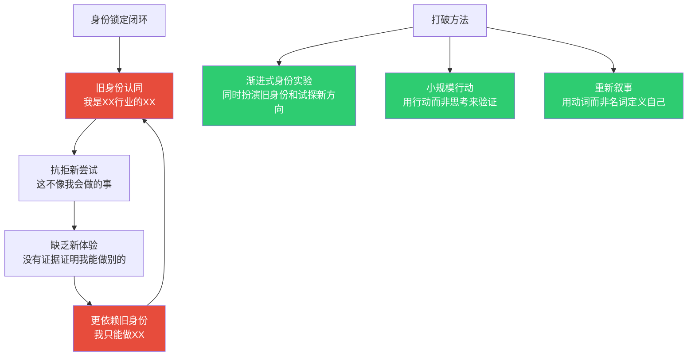
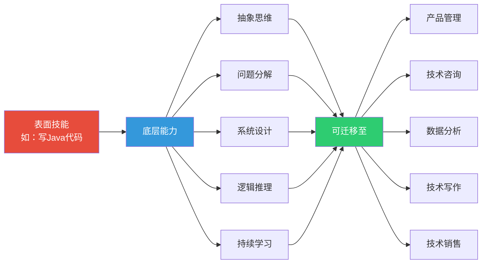
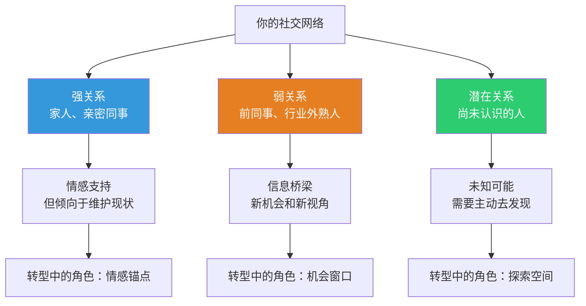
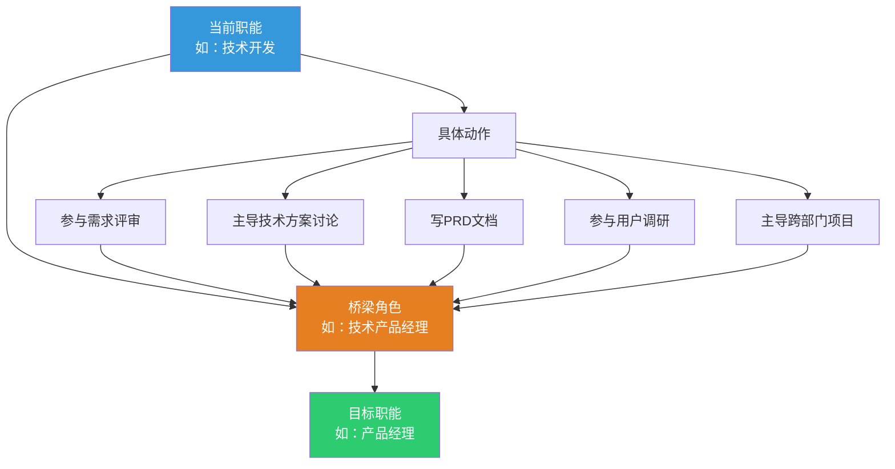
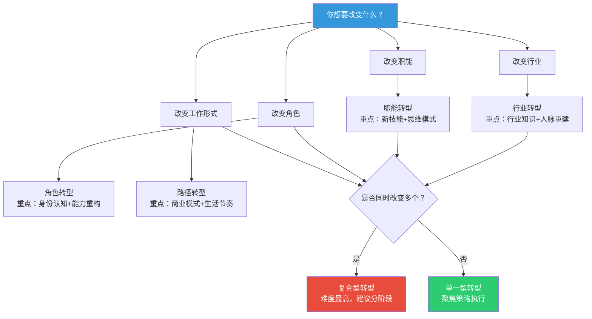

## 五、职业转型理论

职业转型不是"换个工作"那么简单——它涉及身份认知的重塑、能力结构的重组、社会关系的重构，以及心理状态的调适。一个成功的转型需要理论指导、方法支撑和系统执行。本节将从转型的本质出发，建立一套完整的认知框架：先理解转型有哪些类型和底层逻辑，再掌握经过验证的转型方法论，最后学会识别和管理转型过程中的风险。

**本节的学习路径**：

| 层级 | 内容 | 适合谁 |
|------|------|--------|
| 道（认知层） | 转型的底层逻辑、身份锁定机制、沉没成本效应 | 所有正在考虑转型的人——建立正确的转型认知 |
| 法（方法层） | 伊瓦拉五步框架、布里奇斯三阶段、职业资本理论、机会识别矩阵 | 有明确转型意向的人——掌握经过验证的方法论 |
| 术（实操层） | 准备度评估、能力盘点模板、财务规划、转型路线图 | 准备启动转型的人——拿来就用的工具 |
| 器（工具层） | 决策矩阵、风险评估表、转型日志模板、叙事框架 | 正在转型中的人——持续追踪和调优 |

为什么需要"理论"？因为大多数人对职业转型的理解是直觉式的——"干得不开心就换"、"听说那个行业赚钱就去"、"实在受不了就辞职"。这种直觉式转型的成功率极低。中国人力资源服务平台BOSS直聘2024年的调研数据显示，有系统规划的职业转型成功率约为67%，而冲动式转型的成功率仅为23%。理论的价值在于：把一个充满不确定性的大决策，拆解成一系列可分析、可验证、可调整的小步骤。

---

### 5.1 职业转型的底层逻辑：为什么转型如此困难

在讨论"怎么转型"之前，先理解"为什么转型难"。职业转型之所以困难，不是因为缺乏信息或机会，而是因为它触及了人类心理和社会结构的深层机制。

#### 5.1.1 身份认同的惯性

社会学家Herminia Ibarra（伊瓦拉）在其研究中发现，职业转型最大的障碍不是技能差距，而是**身份锁定（Identity Lock-in）**。当别人问"你是做什么的"，你会自然地回答"我是程序员"、"我是销售"、"我是设计师"——这个回答不只是一个标签，它是你自我认同的核心组成部分。

身份锁定有三个层面：

| 层面 | 表现 | 转型阻力 |
|------|------|----------|
| **自我认知** | "我就是这样的人" | 抗拒尝试与现有身份不符的活动 |
| **他人期待** | "你不是做这个的吗" | 周围人的质疑和不解 |
| **社会标签** | 简历、LinkedIn、行业圈子 | 转型后"说不清楚自己是谁" |

这三层锁定形成一个闭环：你因为身份认同而不敢尝试新方向→因为没有尝试而无法建立新身份→因为没有新身份而更加依赖旧身份。打破这个闭环，是职业转型的第一要务。



身份锁定的神经科学基础：认知神经科学研究发现，当人们面对与自我概念不一致的信息时，大脑的前扣带皮层（ACC）会激活冲突监测机制，产生不适感。这意味着身份锁定不仅是一个心理现象，还有明确的神经生理基础——你的大脑在"保护"你远离身份威胁。理解这一点很重要：转型时的不适感不是你"意志薄弱"，而是大脑的正常反应。你需要做的不是"克服"不适感，而是"管理"它——通过渐进式暴露（gradual exposure）让大脑逐步适应新的自我概念。

**身份锁定的五个具体信号**（自查清单）：

1. 当朋友介绍你时，你是否只能用当前职位标签来定义自己？
2. 当你看到新领域的工作描述时，第一反应是"这不是我能做的"？
3. 你的社交圈是否几乎全部来自同一个行业？
4. 你是否很难想象自己做一份完全不同的工作？
5. 你是否害怕在简历上出现"不相关"的经历？

如果以上5个问题中有3个以上回答"是"，你正处于身份锁定状态，需要主动采取干预措施。

#### 5.1.2 沉没成本效应

心理学家Daniel Kahneman（卡尼曼）的前景理论揭示了人类对损失的敏感度约为收益的2倍——这在职业领域表现为：你投入了5年时间建立的专业地位、10年积累的行业人脉、已经到手的薪资水平和职级，这些"沉没成本"会让你极度不愿意放弃。

但这里有一个认知陷阱：**你真正害怕失去的，往往不是实际会失去的**。研究表明，职业转型者在转型后1年内，约有68%的人报告"实际损失比预期小得多"，而约有35%的人报告"获得了预期之外的意外收益"。

沉没成本效应的三层放大机制：

1. **时间投入的光环效应**：你在某个领域投入的时间越长，就越倾向于高估该领域的价值——"我花了10年才做到这个位置，它一定很值钱"。但实际上，市场对你的定价取决于当下的供需关系，而非你的历史投入。一家互联网公司的技术总监年薪80万，不代表他的能力"值"80万——如果这个行业供过于求，市场愿意付的价格可能只有40万。

2. **社会比较的锚定效应**：你的薪资期望往往锚定在现有水平上，"降薪"在心理上等同于"降级"。但如果你重新定义"收入"——把职业满意度、成长空间、工作自由度、健康损耗都纳入考量——会发现总收入可能反而增加了。一个年薪30万但每天工作12小时、压力巨大、健康下滑的岗位，其"真实时薪"和"生命质量调整后的收入"可能远低于一个年薪22万但朝九晚五、有成长空间的岗位。

3. **机会成本的隐性特征**：留在原岗位的"机会成本"是不可见的——你永远不会知道如果不转型你会错过什么。而转型的"损失"是可见的——降薪、从头学、被质疑。人类天然对可见损失更敏感。

**认知重构练习——"投资组合"思维**：

把你的职业生涯想象成一个投资组合。你不是一个"从零开始"的投资者，而是一个"调仓"的投资者——卖出不再看好的资产（旧方向），买入更有潜力的资产（新方向）。关键不是"亏了多少"，而是"未来的回报预期如何"。

具体操作步骤：

1. 列出你当前职业中所有"资产"（技能、人脉、成果、声誉）
2. 评估每项资产的"未来价值趋势"——是在增值、持平、还是贬值？
3. 识别哪些资产可以在新方向中继续使用（可迁移资产）
4. 计算"调仓成本"——转型需要额外投入多少时间和资源
5. 对比"持有旧资产的预期回报"和"切换到新资产的预期回报"

#### 5.1.3 能力迁移的认知盲区

大多数人严重低估了自己能力的可迁移性。你以为"我会写代码"是一个窄技能，但实际上它背后是一整套可迁移的能力体系：抽象思维、问题分解、系统设计、逻辑推理、持续学习——这些能力在产品管理、技术咨询、数据分析、甚至投资分析中都有巨大价值。



可迁移能力的三个层级：

| 层级 | 说明 | 示例 | 迁移难度 |
|------|------|------|----------|
| **元认知能力** | 学习如何学习、反思、自我调节 | 批判性思维、元学习、自我复盘、模式识别 | 极低——几乎在任何领域都有价值 |
| **通用职业能力** | 在多数工作中都需要的能力 | 沟通、项目管理、数据分析、写作、演示、谈判 | 低——需要少量领域适配 |
| **专业能力** | 特定领域的深度技能 | Java编程、财务建模、法律合规、供应链管理 | 中-高——需要重新定义应用场景 |

**关键洞察**：能力迁移的最大障碍不是"能力本身不可迁移"，而是"你不知道如何用新领域的语言来描述你的能力"。一个Java工程师的能力，在产品经理的语境下叫"技术理解力"和"系统思维"，在投资分析师的语境下叫"技术尽职调查能力"和"架构评估能力"。学会"翻译"自己的能力，是转型成功的关键一步。

**能力翻译的实操方法——"三层翻译法"**：

1. **第一层：描述你做了什么**（用动词，不用名词）
   - 不要说"我是后端开发"，要说"我设计和构建处理百万级请求的数据系统"
2. **第二层：提取底层能力**
   - "处理百万级请求"→ 高并发系统设计能力、性能优化能力、复杂问题分解能力
3. **第三层：映射到目标领域的语言**
   - 技术咨询语境："我有大规模分布式系统的架构设计和优化经验"
   - 产品管理语境："我理解复杂系统的技术约束，能做出技术可行的产品决策"
   - 投资分析语境："我能评估技术团队的架构能力和系统复杂度"

#### 5.1.4 社会网络的锁定效应

社会学家Mark Granovetter的"弱关系理论"（The Strength of Weak Ties）揭示了一个反直觉的事实：对你职业发展最有价值的信息，往往来自"弱关系"（不常联系的熟人），而非"强关系"（亲密的朋友和家人）。原因是：强关系的信息和你的信息高度重叠，而弱关系能带来你社交圈之外的新机会和新视角。

职业转型面临的社会网络困境：
- 你的强关系（家人、亲密同事）倾向于"维护现状"——他们了解你现在的身份，害怕你改变后关系会变
- 你的弱关系（行业外的熟人、前同事、社交活动认识的人）才是新机会的来源
- 但当你处于转型期时，你的注意力往往集中在强关系的支持（或反对）上，忽视了弱关系的价值

**社会网络的"转型杠杆"模型**：



**行动建议**：转型前6个月，有意识地"激活"你的弱关系网络——参加跨行业活动、加入新领域的社群、与5年以上没联系的老朋友重新建立联系。每一条弱关系都可能成为你转型的"桥头堡"。

具体的弱关系激活策略：

| 策略 | 具体操作 | 预期效果 |
|------|---------|---------|
| **LinkedIn主动连接** | 每周向目标行业的5个人发送个性化连接请求 | 3个月后新增50-75个行业弱关系 |
| **跨行业社群** | 加入2-3个目标行业的微信群/知识星球/Discord | 持续接触行业信息流和人脉 |
| **行业活动** | 每月参加1次行业会议/沙龙/线上分享 | 积累面对面接触的真实关系 |
| **内容输出** | 在公众号/知乎/小红书分享新领域的学习心得 | 吸引同频的人主动连接你 |
| **旧关系重启** | 联系3-5位已转行的老朋友/前同事 | 获取一手转型经验和内部信息 |

理解这四个底层机制，你就能理解为什么转型需要系统方法，而不是"想好了就去做"。

---

### 5.2 职业转型的四种类型与决策矩阵

职业转型不是一个单一概念。不同类型的转型，需要完全不同的策略、时间和资源投入。先搞清楚你要做的是哪种转型，才能选对方法。

#### 5.2.1 四种转型类型详解

**类型一：行业转型（Industry Transition）**

从一个行业转到另一个行业，但保留类似的职业职能。例如：从制造业的财务经理转到互联网公司的财务经理，从传统零售的市场总监转到新消费品牌的市场总监。

- **核心挑战**：行业知识和人脉需要重建，但专业技能可以迁移
- **难度等级**：中等（★★★☆☆）
- **典型周期**：3-12个月
- **成功率**：较高——专业技能的可迁移性是最大优势
- **关键策略**：识别行业的"通用语言"（财务、HR、运营等职能在不同行业的核心逻辑相似），重点补充行业特有知识（商业模式、监管环境、关键指标）

行业转型的核心动作：
1. **行业研究报告**：花2-3周深度研究目标行业的头部报告（如艾瑞、36氪、CB Insights、Wind资讯），建立行业认知框架。具体做法：找3-5份行业年度报告，提炼出行业规模、增长趋势、竞争格局、关键成功因素四个维度
2. **关键指标翻译**：把你在旧行业的核心KPI翻译成新行业的对应指标——例如，制造业关注"良品率"和"库存周转率"，互联网关注"DAU"和"LTV"，但背后的管理逻辑相通。制作一张"指标对照表"放在手边
3. **行业黑话速成**：每个行业都有自己的"行话"，花1-2个月密集接触行业内容（播客、公众号、论坛），让自己能用新行业的语言思考和表达。判断标准：当行业同行用术语交流时，你能跟上80%以上

**行业转型的"翻译能力"建设路线图**：

| 阶段 | 时间 | 目标 | 具体行动 |
|------|------|------|---------|
| **入门期** | 第1-2周 | 了解行业全貌 | 阅读3份行业年度报告，关注5个行业头部公众号 |
| **语言期** | 第3-4周 | 掌握行业术语 | 加入2个行业社群，每天花30分钟阅读行业讨论 |
| **框架期** | 第5-8周 | 建立行业认知框架 | 参加1次行业会议，做3次信息访谈 |
| **内化期** | 第9-12周 | 用行业语言思考 | 写2-3篇行业观察文章，参与行业讨论 |

**类型二：职能转型（Functional Transition）**

在同一行业内，从一个职能转到另一个职能。例如：从技术开发转到产品经理，从市场营销转到人力资源，从财务分析转到战略规划。

- **核心挑战**：需要学习全新的专业技能和思维方式
- **难度等级**：中等（★★★☆☆）
- **典型周期**：6-18个月
- **成功率**：中等——取决于新旧职能之间的能力重叠度
- **关键策略**：利用行业知识优势，先在当前岗位上寻找跨职能的机会（如技术人员参与产品评审、参加需求讨论），建立"桥梁角色"

职能转型的"桥梁策略"详解：



**桥梁策略的执行细节**：

很多人知道要"找桥梁角色"，但不知道怎么在现有岗位上创造机会。以下是具体方法：

1. **主动揽活法**：观察你当前团队中有哪些跨职能的工作没人愿意做——比如技术人员都不想写技术文档，你可以主动承担，而技术文档写作本身就是技术写作/产品文档的桥梁
2. **项目借力法**：当公司有跨部门项目时，主动申请加入。即使你的正式职能不变，项目中的实际工作内容已经在向新职能靠拢
3. **内部转岗法**：先在当前公司内部申请转岗——这是成本最低的职能转型方式，因为你已经了解公司文化、业务和人脉，只需要学习新职能
4. **兼职副业法**：利用业余时间在新职能方向接小项目——比如开发人员利用周末接产品咨询的活，或者帮朋友的公司做产品设计

**类型三：角色转型（Role Transition）**

从一种角色转变为另一种角色。典型的包括：执行者→管理者、管理者→创业者、专家→综合管理者、被雇佣者→自由职业者。

- **核心挑战**：需要根本性的思维模式转变，不仅是技能问题
- **难度等级**：高（★★★★☆）
- **典型周期**：12-36个月
- **成功率**：中等偏低——研究表明，首次晋升为管理者的人中约有60%在第一年遇到严重困难
- **关键策略**：系统学习新角色的底层逻辑（管理者的"通过他人完成工作"思维 vs 执行者的"自己动手"思维），找到转型导师

角色转型中最常见的三个陷阱：

1. **专家陷阱**：技术专家成为管理者后，遇到下属解决不了的问题，第一反应是"我来"。这会让你成为团队的瓶颈，而不是团队的赋能者。解法：把"我来做"换成"我来教你"或"我来帮你找到资源"。具体操作：当你想"亲自上手"时，先问自己三个问题——"这件事只有我能做吗？"、"如果我做了，下属能学到什么？"、"我的时间投入在这里的机会成本是什么？"

2. **人情陷阱**：从同事变成上级后，很难对原来的同事"动真格"——不好意思批评、不好意思分配脏活累活、不好意思做绩效评估。解法：上任第一周就和团队做一次"角色重新定义"对话，明确"从今天起我们的关系变了，但我的目标是帮助你们成功"。

3. **完美陷阱**：新角色的前6个月你几乎什么都不精通，这种"啥都不如以前"的感觉极其痛苦。解法：接受"60分及格"标准——在新角色的前6个月，做到60分就是成功。你的价值不在于"比前任做得更好"，而在于"带来新的视角和可能性"。

**执行者→管理者的思维模式转变对照表**：

| 维度 | 执行者思维 | 管理者思维 |
|------|----------|----------|
| 核心任务 | 自己把事情做好 | 通过团队把事情做好 |
| 时间分配 | 80%做事，20%沟通 | 30%做事，50%沟通，20%思考 |
| 成就来源 | 自己完成的产出 | 团队完成的产出 |
| 能力重点 | 专业深度 | 人员激励、资源分配、战略思考 |
| 反馈周期 | 即时——代码跑通了就知道对不对 | 延迟——团队效果需要数周才能看到 |
| 失败定义 | 个人做错了 | 团队没做好，但责任在我 |

**类型四：路径转型（Path Transition）**

改变工作的形式和模式，但不一定改变行业或职能。包括：全职→自由职业、全职→创业、朝九晚五→远程工作、高薪职位→社会企业等。

- **核心挑战**：需要改变工作方式、生活节奏和收入模式
- **难度等级**：高（★★★★☆）
- **典型周期**：6-24个月
- **成功率**：变异大——充分准备者成功率高，冲动转型者失败率高
- **关键策略**：先兼职尝试，逐步过渡

路径转型——全职到自由职业的详细路线图：

| 阶段 | 时间 | 关键动作 | 收入目标 |
|------|------|---------|---------|
| **副业验证期** | 第1-6月 | 在职期间用业余时间接2-3个小项目，验证市场对你的需求 | 副业收入≥主业收入的20% |
| **收入并行期** | 第7-12月 | 逐步扩大副业规模，建立稳定客户来源 | 副业收入≥主业收入的50% |
| **切换准备期** | 第13-15月 | 积累6个月生活费缓冲，建立个人品牌 | 副业收入≥主业收入的80% |
| **正式切换期** | 第16-18月 | 辞职，全职投入自由职业 | 自由职业收入≥原主业收入 |

**自由职业的"隐性成本"清单**（很多人只看到了收入，忽略了成本）：

| 成本类型 | 具体项目 | 月均支出（参考） |
|---------|---------|---------------|
| **社保公积金** | 五险一金需自行缴纳（含公司部分） | 2000-5000元（因城市而异） |
| **商业保险** | 补充医疗险、意外险、重疾险 | 300-800元 |
| **办公成本** | 共享办公空间、设备、软件订阅 | 500-2000元 |
| **获客成本** | 人脉维护、内容营销、平台抽成 | 收入的10-20% |
| **税务成本** | 个人所得税（无公司抵扣） | 因收入而异 |
| **隐性福利损失** | 带薪年假、团建、节日福利、培训预算 | 难以量化但真实存在 |

#### 5.2.2 转型决策矩阵

如何判断你当前面临的转型属于哪种类型？使用这个决策矩阵：



> **重要提醒**：复合型转型（同时改变行业+职能，如"从制造业的技术人员转到互联网公司做产品经理"）的难度呈指数级增长，而非线性增长。建议将复合型转型拆解为多个阶段，逐步推进。

**复合型转型的拆解策略**：

如果你面临的是复合型转型，不要试图一步到位。以下是推荐的拆解路径：

| 复合型转型 | 推荐拆解 | 分阶段策略 |
|-----------|---------|----------|
| 行业+职能 | 先行业转型，再职能转型 | 第一步：同职能换行业（如制造业财务→互联网财务）；第二步：同行业换职能（如互联网财务→互联网产品） |
| 职能+角色 | 先职能转型，再角色转型 | 第一步：换职能但保持执行者角色；第二步：在新职能上晋升为管理者 |
| 行业+路径 | 先行业转型，再路径转型 | 第一步：同职能换行业并稳定下来；第二步：从全职转为自由职业/创业 |

#### 5.2.3 转型类型对比表

| 维度 | 行业转型 | 职能转型 | 角色转型 | 路径转型 |
|------|---------|---------|---------|---------|
| 改变什么 | 行业背景 | 专业职能 | 工作角色 | 工作形式 |
| 保留什么 | 专业技能 | 行业知识 | 行业+职能 | 内容+技能 |
| 核心投入 | 行业学习 | 技能重塑 | 思维转变 | 模式构建 |
| 典型周期 | 3-12月 | 6-18月 | 12-36月 | 6-24月 |
| 收入影响 | 降10-30% | 降15-40% | 降0-50% | 变异大 |
| 最大风险 | 行业判断失误 | 能力不匹配 | 角色适应失败 | 收入不稳定 |
| 最佳切入 | 内部转岗 | 项目制过渡 | 导师带教 | 兼职试水 |

#### 5.2.4 不同人生阶段的转型策略

转型不是一个"统一配方"——不同年龄阶段面临不同的约束和机会，需要差异化的策略。

| 年龄段 | 优势 | 劣势 | 推荐转型类型 | 核心策略 |
|--------|------|------|------------|---------|
| **22-28岁** | 试错成本低、学习能力强、无家庭负担 | 资源少、人脉浅、职业资本不足 | 职能转型、路径转型 | 多尝试，3年内找到方向，重点是探索而非稳定 |
| **29-35岁** | 有一定积累、能力可迁移、精力充沛 | 开始有家庭压力、"沉没成本"心理增强 | 行业转型、职能转型 | 用"桥梁策略"降低风险，充分利用可迁移能力 |
| **36-45岁** | 经验深厚、人脉广泛、判断力强 | 年龄焦虑、收入期望高、家庭责任重 | 角色转型、行业转型 | 发挥经验优势，向管理/咨询/创业方向转型 |
| **46-55岁** | 行业专家地位、丰富的人脉网络 | 体力下降、新技术学习慢、组织惯性大 | 路径转型、角色转型 | 向"经验变现"方向转型——顾问、培训、写作、投资 |
| **55岁以上** | 自由度高、经济压力减轻 | 市场偏见、健康约束 | 路径转型 | 社会企业、公益、知识传承、兴趣驱动的第二事业 |

**关键洞察**：年轻时的转型优势是"试错成本低"，中年时的转型优势是"可迁移资本多"，年长时的转型优势是"经验和判断力"。不存在"最好的转型年龄"，只有"最适合你当前阶段的转型策略"。

---

### 5.3 经典转型方法论

#### 5.3.1 伊瓦拉的"先做后想"转型模型

Herminia Ibarra（伊瓦拉）是INSEAD商学院教授，她在对39位职业转型者进行了长达两年的跟踪研究后，在《转行：发现一个未知的自己》（Working Identity）一书中提出了一个颠覆性的发现：**传统的"先想清楚再行动"的转型策略是错误的，成功的转型者是"先行动后想清楚"**。

传统认知是：自我反思→确定方向→制定计划→执行转型。但伊瓦拉发现，真实世界的成功转型路径是：尝试多种可能→从尝试中获得新认知→逐步形成新的职业身份→最终实现转型。

这个发现的底层逻辑是：职业身份不是"想出来的"，而是"做出来的"。你无法通过单纯的思考和分析来确定"我适合做什么"，因为你对自己的认知本身就被当前的身份所局限。只有通过实际行动——去做、去体验、去感受——你才能真正了解新的可能性是否适合你。

**伊瓦拉研究的核心数据**：
- 研究样本：39位中年职业转型者，涵盖从投资银行家到艺术家、从律师到企业家等多种转型路径
- 追踪周期：平均2年
- 核心发现：成功转型者平均尝试了3-5个"可能的自我"后才找到最终方向
- 失败模式：试图在行动前就想清楚所有事情的人，转型失败率是"先行动后思考"者的2.3倍

伊瓦拉的五步框架：

```mermaid
graph TD
    A[第一步：自我探索<br/>广泛尝试，不急于定方向] --> B[第二步：过渡实验<br/>小规模试错，降低风险]
    B --> C[第三步：身份重塑<br/>重新定义"我是谁"]
    C --> D[第四步：关系重构<br/>建立新领域的人脉和支持]
    D --> E[第五步：正式跨越<br/>条件成熟时果断行动]
    E --> F[新职业身份确立]
    style A fill:#3498db,color:#fff
    style B fill:#9b59b6,color:#fff
    style C fill:#e67e22,color:#fff
    style D fill:#2ecc71,color:#fff
    style E fill:#e74c3c,color:#fff
```

**第一步：自我探索（Self-Exploration）**

这一阶段的核心原则是"广泛探索，延迟承诺"。不要急于确定方向，而是给自己6-12个月的探索期。

具体做法：
- **信息访谈**：找5-10位你感兴趣领域的人，进行30分钟的深度对话。不是问"你觉得我适合做这个吗"，而是问"你一天的工作是什么样的"、"这个行业最大的挑战是什么"、"什么样的人在这个领域做得好"
- **体验式探索**：通过兼职、志愿者、项目合作、线上社群参与等方式，实际体验新领域的工作内容。体验的重点不是"我能不能做"，而是"我做这件事时的感受是什么"
- **能力盘点**：系统梳理自己的可迁移技能（参见5.6.2节可迁移能力识别框架），识别哪些能力在新领域有直接价值，哪些需要补充
- **兴趣与价值观澄清**：使用Schein的职业锚理论（参见"经典职业发展理论"章节），明确自己在职业中最看重什么

信息访谈的具体操作指南：

很多转型者知道要"做信息访谈"，但不知道怎么开口、怎么问、怎么跟进。以下是具体流程：

1. **找人**：LinkedIn搜索目标行业+关键词，或通过朋友的朋友介绍。也可通过在行、知乎等平台找到付费咨询对象。每周联系3-5人，接受率约30-40%。如果接受率低于20%，说明你的开场白或渠道需要调整
2. **开场白模板**："您好，我是XX，目前在做XX，正在探索向XX方向转型的可能性。您在这个领域有丰富的经验，能否占用您20-30分钟，聊聊您在这个行业的工作体验？"
3. **核心问题清单**（按优先级排列）：
   - "您一天/一周的典型工作是什么样的？"
   - "这个岗位/行业最看重什么能力？"
   - "新进入这个领域的人最常犯什么错误？"
   - "如果我从现在开始准备，您建议我先做什么？"
   - "您认识的人中，有没有成功从XX方向转过来的？"
4. **跟进**：访谈后24小时内发感谢消息，3个月后更新你的进展。保持弱关系的活跃度
5. **记录与复盘**：每次访谈后记录3个关键发现，10次访谈后做一次综合分析，找出共同的模式和矛盾点

**第二步：过渡实验（Transition Experiments）**

这一阶段的核心原则是"小步试错，控制风险"。在不放弃当前工作的前提下，进行小规模的新方向尝试。

具体做法：
- **项目制尝试**：在新领域接一个小项目或任务，用2-4周时间完成，观察自己的感受和表现
- **课程与认证**：参加新领域的核心课程或认证考试，既是学习也是验证——如果你连学习都坚持不下来，可能说明兴趣不够
- **社群参与**：加入新领域的专业社群、行业协会、线上论坛，感受这个群体的文化和氛围
- **"平行身份"建设**：开始在社交媒体上分享新领域的见解，建立一个"正在探索新方向"的平行身份

过渡实验的设计原则：

好的过渡实验应该满足四个条件：
1. **低风险**：失败了不会影响你的主业和生活
2. **高信息量**：即使失败，也能让你学到关于新方向的重要信息
3. **可衡量**：有明确的"成功标准"——不是模糊的"感觉不错"，而是具体的"完成了XX项目"或"获得了XX反馈"
4. **可重复**：如果第一次效果不好，你可以调整参数再试一次

实验设计模板：

| 实验名称 | 时间投入 | 成功标准 | 失败的收获 | 是否继续 |
|---------|---------|---------|-----------|---------|
| 在XX平台接一个XX项目 | 20小时 | 项目完成且客户满意 | 了解了XX领域的真实需求 | 是/否/调整方向 |
| 参加XX认证考试 | 40小时 | 通过考试 | 验证了自己对XX领域的学习兴趣 | 是/否/调整方向 |
| 在XX社群活跃参与1个月 | 10小时 | 获得3位以上有意义的联系 | 了解了社群的文化和氛围 | 是/否/调整方向 |

**第三步：自我重新定义（Self-Redefinition）**

经过前两个阶段的探索和尝试，你对新方向已经有了基于实际体验（而非想象）的认知。这一阶段的任务是：重新定义自己的职业身份。

具体做法：
- **重写职业故事**：练习用一段话描述"我是谁"——不再是"我是XX公司的XX职位"，而是融合了旧经验和新方向的叙事。例如："我是一个有10年技术背景的产品人，擅长用技术思维解决产品问题"
- **更新外部标签**：更新LinkedIn简介、简历、个人网站，让外部世界看到你的新身份
- **建立新身份的"证据"**：收集转型初期的成果——项目案例、文章、证书、推荐信，这些是新身份的"背书"

**"电梯演讲"模板**（30秒介绍自己）：

> "我是[名字]，过去[X]年在[旧领域]做[旧职能]，积累了[核心能力]。现在我在[新方向]领域[正在做什么/已经做了什么]，特别关注[细分方向]。我独特的视角是[旧经验给新方向带来的差异化价值]。"

示例：
> "我是李明，过去8年在制造业做供应链管理，积累了复杂系统的优化经验。现在我在探索数据产品方向，已经完成了3个数据分析项目。我独特的视角是——我理解大规模物理供应链中的数据痛点，这是纯互联网背景的人很难具备的。"

**身份叙事的三个版本**——适应不同场景：

| 场景 | 时长 | 重点 | 使用频率 |
|------|------|------|---------|
| **电梯版** | 30秒 | 一句话定义新身份 | 每日——社交场合、新认识的人 |
| **面试版** | 2分钟 | 完整转型逻辑（旧→新） | 按需——面试、合作洽谈 |
| **深度版** | 10分钟 | 详细转型故事+成果展示 | 偶尔——重要人脉、导师对话 |

**第四步：关系网络重建（Network Renewal）**

职业转型不仅是个人的事，也是关系网络的事。你周围的人会影响你的选择、支持你的行动、或阻碍你的改变。

具体做法：
- **找到"桥梁人物"**：那些既有你旧领域的经验、又了解新领域的人，他们能理解你的处境并给出针对性建议
- **建立新领域的支持圈**：找到3-5位新领域的同行或前辈，建立定期交流的关系
- **寻找转型伙伴**：和同样在转型的人组成互助小组，分享经验、互相监督
- **逐步调整旧关系**：不是"抛弃"旧领域的人脉，而是重新定义关系的性质——从"同行"变为"老朋友"

关系网络重建的"3-5-10法则"：
- **3位核心导师**：在新领域比你资深5-10年的人，每月至少交流1次
- **5位同行伙伴**：和你处于类似阶段的转型者，每两周交流1次（互助小组）
- **10位弱关系**：新领域的从业者，通过社群活动、行业会议等保持联系

**第五步：正式跨越（Making the Leap）**

当以下三个条件中的至少两个满足时，可以考虑正式转型：
1. 新方向已经通过实际项目验证了可行性
2. 新领域已经建立了至少一个稳定的支持关系（导师、合作伙伴、早期客户）
3. 财务上有至少6个月的缓冲期

具体做法：
- **设定"不可逆转点"**：明确什么情况下会放弃转型（如"如果12个月内没有达到XX目标"），给自己一个退出机制
- **制定过渡计划**：不是"裸辞后从零开始"，而是在职期间完成大部分准备工作，找到合适的时机切换
- **做好心理准备**：接受转型初期的"不适感"——回到新手状态、收入可能下降、需要重新证明自己
- **选择"跳板"而非"悬崖"**：最好的转型时机是拿到新方向的offer或有了稳定的新方向收入来源后再离职，而不是"裸辞后海投"

#### 5.3.2 布里奇斯的转变三阶段模型

William Bridges（布里奇斯）在《转变》（Transitions）一书中区分了"变化"（change）和"转变"（transition）：**变化是外部事件（换工作、搬家），转变是内心过程（适应新身份、建立新习惯）**。变化可以瞬间完成，转变需要时间。

布里奇斯的三阶段模型揭示了转型过程中必然经历的心理历程：

| 阶段 | 特征 | 典型感受 | 持续时间 |
|------|------|---------|---------|
| **结束期（Endings）** | 告别旧身份、旧习惯、旧关系 | 失落、迷茫、焦虑、偶尔解脱 | 1-3个月 |
| **中立地带（Neutral Zone）** | 旧身份已结束，新身份未建立 | 混乱、自我怀疑、孤独、但也可能有创造力 | 3-12个月 |
| **新开始（New Beginnings）** | 新身份逐渐稳定，新习惯形成 | 逐渐适应、新的活力、新的意义感 | 持续进行 |


**结束期的深度应对**：

结束期不仅仅是"离开旧工作"，它涉及对旧身份的全面告别。这个阶段容易被忽视——很多人觉得"辞职了就结束了"，但实际上，情感上的告别需要时间和仪式。

结束期的四个告别维度：
1. **能力告别**：承认你在旧领域建立的专业权威暂时"用不上了"——这不意味着它没有价值，而是需要换一种方式使用
2. **关系告别**：与旧领域的同事、合作伙伴重新定义关系——从"每天见面的同事"变为"偶尔联系的朋友"
3. **习惯告别**：旧的工作节奏、思维模式、决策方式需要有意识地"放下"
4. **叙事告别**：对"我的职业故事"做一次完整的回顾和总结，为旧身份画一个句号

**结束期的具体行动**：
- 写一封"告别信"给旧的自己（不需要发给任何人，给自己看）
- 和3-5位旧领域的关键人物做一次"关系重新定义"对话
- 整理旧工作中的成就清单，作为对旧身份的"表彰"
- 给自己放一个短假（哪怕是3天），用物理空间的变化象征心理空间的变化

**中立地带是最危险也最有价值的阶段**。危险在于：这个阶段你会经历最大程度的自我怀疑和方向迷失，很多人在这个阶段放弃转型，回到旧轨道。价值在于：中立地带是创造力和洞察力最旺盛的时期——旧的框架已经被打破，新的框架尚未建立，正是"一切皆有可能"的窗口期。

应对中立地带的关键策略：
- **保持日常结构**：即使方向不确定，也要保持规律的作息、运动、社交，用结构对抗混乱
- **允许"不知道"**：不需要立即有答案，给自己探索和试错的空间
- **记录感受和洞察**：写日记、做复盘，中立地带的很多洞察在事后看来极其珍贵
- **寻找"同行者"**：和同样处于转型期的人交流，减少孤独感
- **保持身体健康**：中立地带的压力容易导致失眠、暴饮暴食或食欲不振。保持每周3次以上的运动，不是为了"健康"，而是为了维持大脑的正常运作

中立地带的"三不原则"：
1. **不做重大决策**：这个阶段的判断力受情绪影响较大，避免在这个阶段做买房、结婚等重大人生决策
2. **不急于定性**：不要急于给自己贴"失败者"或"迷茫者"的标签，这是正常的过渡状态
3. **不比较**：不和"留在原岗位的自己"或"已经成功转型的人"比较，每个人的节奏不同

**新开始阶段的注意事项**：

新开始不是"转型完成"的标志，而是"新身份建设"的起点。这个阶段的核心任务是：巩固新身份、建立新习惯、扩大新领域的影响力。

新开始阶段的三个"陷阱"：
1. **冒充者综合征**：觉得"我不配"、"我是假的"——解法是：列出你已经取得的具体成果，用事实反驳感受。如果这个感觉持续超过3个月，找一位信任的导师聊聊
2. **急于证明自己**：过度加班、过度承诺——解法是：设定可持续的工作节奏，长期表现比短期爆发更重要。给自己设定"每天最多工作X小时"的硬性上限
3. **忽视旧经验的价值**：觉得"以前的都不算了"——解法是：有意识地将旧经验融入新角色，创造差异化优势。你最大的竞争力不是"和新人一样"，而是"比新人多了旧经验"

#### 5.3.3 职业资本理论：用"可迁移资产"降低转型成本

Cal Newport（卡尔·纽波特）在《优秀到不能被忽视》（So Good They Can't Ignore You）中提出了"职业资本"（Career Capital）的概念：你的职业价值来自于你积累的稀缺且有价值的技能和经验，而不是来自于"追随热情"。

这个理论对职业转型的启示是：**转型不是从零开始，而是重新配置你已有的职业资本**。

职业资本的四种形式：

| 资本类型 | 定义 | 可迁移性 | 积累方式 |
|---------|------|---------|---------|
| **技能资本** | 稀缺的专业技能 | 中-高 | 刻意练习、项目实践、持续学习 |
| **成果资本** | 可证明的项目成果和业绩 | 高 | 主动承担有挑战性的项目，用数据量化成果 |
| **人脉资本** | 有价值的职业关系 | 中 | 持续提供价值、建立信任、参加行业活动 |
| **声誉资本** | 行业内的知名度和口碑 | 中-低 | 内容输出、公开演讲、成果展示 |

**四种资本的"可迁移性"详细分析**：

- **技能资本**的迁移难度取决于技能的抽象程度。"会用Excel做数据透视表"是低抽象度技能，迁移性弱；"能从复杂数据中提取业务洞察"是高抽象度技能，迁移性强。提升迁移性的方法：把你的技能从"工具层"提升到"方法层"再到"思维层"
- **成果资本**是最容易迁移的——一个"主导了从0到1的产品上线并实现月活50万"的案例，不管在哪个行业都有说服力。关键是用通用语言描述成果，而不是行业术语
- **人脉资本**的迁移性取决于你的关系网络是否多元化。如果你的人脉全在同一行业同一职能，迁移性就很低；如果包含跨行业、跨职能的关系，迁移性就很高
- **声誉资本**的迁移性最低——你在A行业的知名度在B行业可能一文不值。但有一些"元声誉"是可以迁移的：比如"写过畅销书"、"做过TED演讲"、"带过百人团队"——这些在任何行业都是背书

转型时的职业资本策略：
1. **盘点**：列出你拥有的所有职业资本，评估每项资本在新方向的价值
2. **优先迁移**：先用高可迁移性的资本（技能、成果）建立在新领域的立足点
3. **补充缺口**：识别新方向要求但你缺乏的资本，制定针对性的补充计划
4. **重新包装**：将旧领域的资本用新领域的语言重新表述（如"技术架构能力"→"系统性思维"）

职业资本盘点工作表：

| 资本项目 | 来自哪个领域 | 新方向价值（1-10） | 如何重新包装 | 何时使用 |
|---------|------------|------------------|------------|---------|
| 示例：微服务架构设计经验 | 互联网后端开发 | 8 | "复杂系统设计能力"——适用于技术咨询、架构评审 | 技术咨询面试、提案展示 |
| 示例：10人团队管理经验 | 制造业生产线管理 | 7 | "规模化团队运营能力"——适用于任何管理岗 | 管理岗位面试、创业团队搭建 |
| 示例：年度预算管理 | 财务部门 | 6 | "资源分配与优化能力"——适用于项目管理、运营管理 | 任何需要预算意识的岗位 |
| （填写你自己的） | | | | |

#### 5.3.4 克朗伯茨的计划性偶发理论

斯坦福大学教授John Krumboltz（克朗伯茨）提出了"计划性偶发理论"（Planned Happenstance Theory），这一理论对传统"规划型"职业发展提出了有力补充：**很多成功的职业转型不是规划出来的，而是"意外"发生的——但这些"意外"是可以主动创造和利用的**。

克朗伯茨识别了五个帮助人们从"意外事件"中获益的核心技能：

| 技能 | 定义 | 在转型中的应用 |
|------|------|--------------|
| **好奇心** | 主动探索新事物的倾向 | 对新领域保持开放，即使它不在你的"计划"中 |
| **坚持性** | 面对挫折不轻易放弃 | 转型中遇到困难时继续尝试，而非退回旧轨道 |
| **灵活性** | 根据新信息调整方向 | 转型计划不是"圣旨"，根据实际反馈灵活调整 |
| **乐观性** | 相信事情会变好 | 转型中的低谷期，相信"这只是暂时的" |
| **冒险性** | 愿意承担可控的风险 | 愿意尝试不确定的机会，而非只走"安全"的路 |

**计划性偶发的实操方法**：

1. **扩大暴露面**：增加接触新机会的概率——参加行业会议、加入跨领域社群、学习看似"无用"的技能。你不知道哪个"意外"会成为转折点。具体做法：每月参加1次与当前工作无关的活动
2. **降低反应阈值**：当一个意料之外的机会出现时，不要立刻说"这不适合我"——给自己48小时的考虑期，至少做一个初步的可行性分析
3. **建立"意外日志"**：每周记录1-2个"意外发现"——一个新认识的人、一个新了解的行业、一个新发现的机会。3个月后回顾，你往往会发现模式
4. **做"桥接尝试"**：当一个意外机会出现但你还无法全职投入时，先做一个小实验——参加一次活动、做一个小项目、和相关的人聊一次

**计划性偶发的三个真实案例**：

**案例一：从机械工程师到工业AI架构师**

张工是一位有10年经验的机械工程师，一直想转行但不知道转什么。2022年，他偶然参加了一个朋友组织的"AI+制造业"沙龙，第一次了解到工业AI这个领域。他被这个方向吸引，开始利用业余时间学习机器学习基础，并在公司内部推动了一个"AI质检"试点项目。这个"意外"的机会让他找到了一个完美结合旧经验（制造业）和新方向（AI）的领域。18个月后，他成功转型为一家工业AI公司的解决方案架构师。

**案例二：从HR到职业发展博主**

王琳做了8年的HR，主要负责招聘和培训。2023年疫情期间，她所在的公司裁员，她在朋友圈写了一篇"被裁后的72小时"，意外获得了10万+的阅读量。这次"意外"让她发现自己在职业发展方面的写作能力有市场价值。她开始在小红书和公众号系统输出职业发展内容，6个月后积累了5万粉丝，开始接企业内训和1对1咨询。如今她是一名全职的职业发展顾问，收入是原来HR薪资的1.5倍。

**案例三：从会计到数据分析师**

李华是一名资深会计，工作中经常需要用Excel处理大量数据。2024年，公司引入了一套BI系统，他是唯一一个愿意主动学习的人。在学习BI的过程中，他发现自己对数据分析有浓厚兴趣，开始自学Python和SQL。一位前同事跳槽到一家电商公司后，推荐他去做数据分析的兼职项目。这个"意外"的推荐让他确认了转型方向。8个月后，他正式转行为数据分析师，薪资反而提升了20%。

**案例中的共同模式**：

| 案例 | "意外"事件 | 转折点行动 | 关键能力 |
|------|----------|----------|---------|
| 张工 | 参加AI沙龙 | 在公司内部推动AI试点 | 好奇心+坚持性 |
| 王琳 | 被裁后写文章走红 | 持续输出职业发展内容 | 灵活性+乐观性 |
| 李华 | 公司引入BI系统 | 主动学习+接受兼职推荐 | 好奇心+冒险性 |

这三个案例的共同点：不是"计划好了转型"，而是"在意外出现时抓住了机会"。但他们的"抓"不是被动的——是之前积累的能力和开放的心态让他们能够识别和利用这些机会。

---

### 5.4 转型准备度评估：你真的准备好了吗

在启动转型之前，需要从五个维度评估自己的准备程度。这不是"够不够格"的判断，而是"哪里需要补强"的诊断。

#### 5.4.1 五维准备度评估模型

**维度一：动机清晰度（Motivation Clarity）**

| 评估问题 | 评分标准 |
|---------|---------|
| 你能用一句话说清楚为什么要转型吗？ | 5分=清晰具体，1分=模糊笼统 |
| 你的转型动力是"逃离"还是"追求"？ | 5分=追求新机会，1分=逃离当前痛苦 |
| 如果转型后收入下降30%，你仍然愿意吗？ | 5分=完全接受，1分=完全不能接受 |
| 你对新方向的了解是基于实际体验还是想象？ | 5分=深度体验过，1分=只看过文章 |

> **关键判断**：如果"逃离"动机得分远高于"追求"动机，先解决当前环境的问题（如与上级沟通、调岗、休假），再考虑转型。逃离式转型往往会在新环境中重现同样的问题。

**"逃离"vs"追求"的深度辨别**：

| "逃离"式动机 | "追求"式动机 |
|-------------|-------------|
| "我受不了现在的领导" | "我对XX领域有强烈的好奇心" |
| "这个行业没有前途了" | "我看到了XX领域的巨大机会" |
| "工作太累了想换个轻松的" | "我想做更有挑战/意义的事情" |
| "同事关系太差了" | "我想要一种不同的工作方式" |
| "收入太低了" | "我想在XX方向创造更大的价值" |

逃离式动机不一定是错的，但它需要"升级"——从"逃离XX"升级为"追求YY"。如果你只能说出"我不想做什么"而说不出"我想做什么"，说明探索还不够充分。

**动机"升级"的三步法**：
1. 写下你想逃离的3件事
2. 对每件事写下它的"反面"——比如"不想加班太多"→"想要有时间的生活"
3. 将"反面"转化为正向目标——"想要有时间的生活"→"找到一份时间灵活、效率导向的工作"

**维度二：能力准备度（Capability Readiness）**

| 评估问题 | 评分标准 |
|---------|---------|
| 你已具备新方向要求的核心技能吗？ | 5分=全部具备，1分=几乎都不具备 |
| 你有可证明的成果来支撑新方向吗？ | 5分=有多个案例，1分=没有 |
| 你的可迁移技能在新方向有明确价值吗？ | 5分=直接可用，1分=需要大量补充 |
| 你有明确的学习计划来弥补能力差距吗？ | 5分=详细且可执行，1分=没有计划 |

**维度三：财务准备度（Financial Readiness）**

| 评估问题 | 评分标准 |
|---------|---------|
| 你有多少个月的财务缓冲？ | 5分=12个月+，1分=不到1个月 |
| 你的家庭开支中有多大比例是刚性的？ | 5分=刚性开支低，1分=几乎全是刚性开支 |
| 你有备用的收入来源吗？ | 5分=有多个，1分=完全没有 |
| 转型期间你能接受的最大收入降幅是多少？ | 5分=降50%可接受，1分=不能接受任何降幅 |

**维度四：社会支持度（Social Support）**

| 评估问题 | 评分标准 |
|---------|---------|
| 家人是否理解和支持你的转型计划？ | 5分=全力支持，1分=强烈反对 |
| 你在新领域有可信赖的导师或引路人吗？ | 5分=有且活跃，1分=没有 |
| 你有正在转型的同行伙伴吗？ | 5分=有互助小组，1分=独自行动 |
| 你的旧领域人脉是否能在转型中提供帮助？ | 5分=有明确的支持，1分=没有 |

**维度五：心理准备度（Psychological Readiness）**

| 评估问题 | 评分标准 |
|---------|---------|
| 你能接受"从新手开始"的现实吗？ | 5分=完全接受，1分=无法接受 |
| 你能承受转型初期的不确定性和焦虑吗？ | 5分=有信心应对，1分=非常焦虑 |
| 如果转型失败，你有Plan B吗？ | 5分=有明确的退出策略，1分=没有 |
| 你对转型的时间预期是否现实？ | 5分=预期1-2年见效，1分=预期立刻见效 |

**总分解读**：
- **80-100分**：准备充分，可以启动转型
- **60-79分**：基本准备就绪，建议在2-3个月内补齐短板后启动
- **40-59分**：准备不足，建议用3-6个月系统准备
- **20-39分**：差距较大，建议暂缓转型，先解决关键短板

**如何使用评估结果**：不是看总分，而是看**最低分的维度**——那个维度就是你转型的"木桶短板"。例如，如果你能力得分80分、动机得分75分、但财务得分只有30分，那么你的首要任务不是学新技能，而是建立财务缓冲。

---

### 5.5 转型过程中的风险管理

转型必然伴随风险，但风险不等于危险——有准备的风险是"可控的不确定性"，没准备的风险才是"失控的赌博"。

#### 5.5.1 五大核心风险及应对策略

**风险一：收入断崖（Income Cliff）**

这是转型中最现实、也最让人恐惧的风险。转型意味着你从一个"熟练工"变成"新手"，市场对你的定价自然会下降。

应对策略矩阵：

| 策略 | 适用场景 | 操作方法 | 预期效果 |
|------|---------|---------|---------|
| **6个月缓冲金** | 所有转型 | 在转型前攒够6个月生活费 | 消除生存焦虑 |
| **渐进式过渡** | 有在职条件时 | 先兼职试水，收入稳定后再全职切换 | 收入断崖缩小到1-2个月 |
| **旧技能变现** | 技术/专业类转型 | 在转型期间继续用旧技能接项目 | 维持基本收入 |
| **生活成本压缩** | 财务紧张时 | 砍掉非必要开支，降低生活成本基数 | 减少缓冲金需求 |
| **家庭财务规划** | 有家庭负担时 | 与配偶共同制定转型期预算 | 避免家庭财务冲突 |

**收入断崖的"缓冲带"设计**：

不要等到"辞职那天"才开始考虑财务问题。理想的财务准备分三步走：

1. **第一步：计算跑道**（转型前6个月）
   - 月刚性开支 = 房贷/房租 + 餐饮 + 保险 + 交通 + 子女教育 + 必要储蓄
   - 跑道长度 = 可动用储蓄 ÷ 月刚性开支
   - 目标：跑道长度 ≥ 8个月（单一转型）或 ≥ 14个月（复合型转型）

2. **第二步：压缩开支**（转型前3个月）
   - 砍掉前20%的非必要开支（订阅服务、冲动消费、不必要的社交应酬）
   - 建立转型期专属预算——每月固定金额，不允许超支
   - 具体操作：导出过去3个月的银行流水，按支出类别分类，标记"必要"和"可选"

3. **第三步：建立收入桥**（转型开始时）
   - 过渡期收入 = 旧技能兼职（30-40%）+ 新方向初期收入（10-20%）+ 被动收入（如有）+ 储蓄消耗
   - 目标：逐步降低储蓄消耗比例，提高新方向收入比例

**中国转型者需要特别注意的财务细节**：

| 项目 | 注意事项 | 操作建议 |
|------|---------|---------|
| **社保** | 辞职后社保断缴影响医疗报销、购房资格（部分城市）、落户积分 | 通过灵活就业社保或社保代缴公司续保，月费约1500-3000元 |
| **公积金** | 离职后公积金封存，无法用于还贷 | 确保账户余额充足，或提前办理公积金冲还贷 |
| **个税** | 多源收入（主业+副业+兼职）的个税计算方式不同 | 了解综合所得税率表，必要时咨询税务师 |
| **竞业限制** | 部分行业（互联网、金融）有竞业限制条款 | 离职前仔细审查劳动合同中的竞业条款 |

**风险二：能力鸿沟（Capability Gap）**

你对新方向的能力要求可能存在两种误判：高估自己的可迁移能力（"我做了10年销售，做产品还不是手到擒来"），或低估新方向的专业深度（"产品经理不就是画画原型吗"）。

应对策略：
- **能力差距分析**：列出新方向的5-8项核心能力，逐一评估自己的水平（1-10分），识别差距最大的3项
- **MVP式学习**：不追求"学完再做"，而是"边做边学"——先接一个小项目，在实战中发现真正的能力缺口
- **找"能力标尺"**：找一位新方向的资深从业者，让他评估你的能力水平，给出针对性的提升建议
- **设定学习里程碑**：将能力提升拆解为可衡量的阶段性目标，每月复盘

能力差距分析模板：

| 新方向要求的能力 | 重要程度（1-10） | 我的当前水平（1-10） | 差距 | 学习计划 |
|----------------|----------------|-------------------|------|---------|
| 示例：用户研究 | 9 | 4 | 5 | 完成"用户研究实战"课程，主导1次用户访谈 |
| 示例：数据驱动决策 | 8 | 6 | 2 | 学习SQL进阶，完成3个数据分析项目 |
| 示例：跨部门沟通 | 7 | 8 | -1 | 已具备，无需额外投入 |
| （填写你自己的） | | | | |

**能力差距弥补的"优先级矩阵"**：

| | 重要程度高 | 重要程度低 |
|---|----------|----------|
| **差距大** | 🔴 最优先——立即开始学习和实践 | 🟡 次优先——利用碎片时间学习 |
| **差距小** | 🟢 快速补充——短期集中突击 | ⚪ 暂不处理——保持现有水平即可 |

**风险三：社会支持断裂（Social Disconnection）**

转型会让你暂时处于两个圈子的"夹缝"中——旧领域的同行不理解你为什么离开，新领域的人还不把你当自己人。这种"社会漂浮"状态会带来孤独感和自我怀疑。

应对策略：
- **主动建立"转型支持圈"**：找到3-5位正在转型或已经转型成功的人，组成互助小组。可以通过豆瓣小组、知乎圈子、微信社群等找到同路人
- **找到"桥梁人物"**：那些经历过类似转型的人，他们的经验和理解是无价的
- **保持旧关系但调整期待**：不需要"断舍离"旧人脉，但要理解他们可能无法在专业上支持你的新方向
- **加入新领域社群**：通过行业活动、线上社群、课程同学等渠道，建立新领域的关系网

**风险四：身份危机（Identity Crisis）**

"我不再是XX了，但我也还不是YY"——这种身份真空状态是转型中最深层的心理挑战。William Bridges称之为"中立地带"，Herminia Ibarra称之为"身份实验期"。

应对策略：
- **接受"过渡态"的身份**：你不需要立刻成为"新的人"，给自己一个"正在转型中的XX"的过渡身份。这个过渡身份是合法的、有价值的、暂时的
- **构建"转型叙事"**：练习用一段话讲述你的转型故事——为什么转型、正在做什么、已经取得了什么进展（详见5.9.2节）
- **小成就积累**：在新方向上取得一些小成果（完成一个课程、发表一篇文章、做一个小项目），用成果支撑新身份
- **减少身份比较**：不要拿自己的"转型初期"和别人的"成熟期"比较

**风险五：决策后悔（Decision Regret）**

转型后发现"这不是我想要的"——这种可能性确实存在。但研究表明，人们对"没做的事"的后悔远大于对"做过的事"的后悔。

应对策略：
- **设定评估节点**：在转型开始时就设定3个月、6个月、12个月的评估节点，明确评估标准
- **保留回退路径**：不是"破釜沉舟"，而是"架好桥梁再过河"——确保你能在必要时回到旧轨道
- **区分"不适感"和"不适合"**：转型初期的不适感是正常的，不代表方向错了；但如果持续6个月以上仍然感到强烈的抗拒和痛苦，需要重新评估
- **记录转型日志**：定期记录你的感受、收获、困惑，用数据而非直觉来判断转型进展

"不适感"vs"不适合"判断清单：

| 信号 | "不适感"（正常的） | "不适合"（需要警惕的） |
|------|-------------------|---------------------|
| 工作内容 | 需要学习新东西，感到吃力 | 对核心工作内容持续感到无聊或抗拒 |
| 人际关系 | 还没建立深度关系，感到孤独 | 与新领域的人价值观持续冲突 |
| 成就感 | 偶尔有"做对了"的感觉 | 6个月以上没有任何正向反馈 |
| 身体反应 | 偶尔焦虑，整体精力还行 | 持续失眠、食欲下降、身体不适 |
| 内心声音 | "我需要更多时间" | "我真的不想做这个" |

---

### 5.6 转型实战框架：从诊断到执行

#### 5.6.1 转型路线图模板

将转型过程拆解为四个阶段，每个阶段有明确的目标、行动和产出：

| 阶段 | 时间 | 核心目标 | 关键行动 | 产出 |
|------|------|---------|---------|------|
| **诊断期** | 第1-2月 | 明确转型方向 | 能力盘点、信息访谈、市场调研 | 转型方向确认书 |
| **准备期** | 第3-6月 | 补齐关键能力缺口 | 学习、项目实践、建立新人脉 | 核心技能证书/作品 |
| **过渡期** | 第7-12月 | 验证新方向可行性 | 兼职项目、试用期、小规模实践 | 可展示的成果案例 |
| **跨越期** | 第13-18月 | 正式完成转型 | 求职/签约/开业，全职投入新方向 | 新身份确立 |

每个阶段的详细行动清单：

**诊断期（第1-2月）周任务表**：

| 周 | 关键任务 | 产出 |
|---|---------|------|
| 第1周 | 完成五维准备度评估；列出3-5个感兴趣的新方向 | 评估报告；候选方向清单 |
| 第2周 | 对每个候选方向做初步市场调研（行业规模、增长趋势、薪资水平） | 行业概况表 |
| 第3-4周 | 对Top 2方向各做3次信息访谈 | 访谈记录；方向对比分析 |
| 第5-6周 | 对Top 1方向做1次体验式探索（兼职项目、课程试听、社群参与） | 体验报告 |
| 第7-8周 | 综合所有信息，做出方向决策，制定后续计划 | 转型方向确认书 |

**准备期（第3-6月）月任务表**：

| 月 | 关键任务 | 产出 |
|---|---------|------|
| 第3月 | 识别3项最关键的能力差距，制定学习计划 | 能力差距分析表；学习计划 |
| 第4月 | 完成核心课程/认证学习的50%；开始第一个实践项目 | 学习进度；项目启动 |
| 第5月 | 完成核心课程/认证；完成第一个实践项目 | 证书；项目成果 |
| 第6月 | 开始第二个实践项目；建立新领域的3-5个核心联系人 | 项目进展；人脉清单 |

**过渡期（第7-12月）里程碑**：

| 里程碑 | 时间 | 验证标准 |
|--------|------|---------|
| 首次兼职收入 | 第7-8月 | 在新方向上获得了第一笔收入（无论金额） |
| 能力可雇佣验证 | 第9-10月 | 获得新方向的面试机会或项目邀约 |
| 收入稳定性验证 | 第11-12月 | 新方向月收入达到原收入的30%以上 |
| 社会认可验证 | 第12月 | 有人主动向你付费或推荐你在新方向的服务 |

#### 5.6.2 可迁移能力识别框架

如何系统地识别自己的可迁移能力？使用"STAR→新场景"映射法：

1. **列出过去3年最有成就感的5个项目**
2. **对每个项目用STAR法拆解**：Situation（背景）→ Task（任务）→ Action（行动）→ Result（结果）
3. **从Action中提取底层能力**：你在每个项目中具体做了什么？用了什么能力？
4. **映射到新方向**：这些能力在新方向的哪些场景中需要？

示例：

| STAR项目 | 底层能力 | 新方向映射 |
|---------|---------|-----------|
| 主导公司ERP系统上线 | 项目管理、跨部门协调、需求分析 | 产品经理：需求分析、跨团队协作 |
| 设计并实现了微服务架构 | 系统设计、抽象思维、技术选型 | 技术咨询：架构评估、技术方案设计 |
| 带领5人团队完成季度目标 | 目标管理、人员激励、冲突解决 | 团队管理：任何管理岗位 |
| 发表了3篇行业技术文章 | 技术写作、知识提炼、影响力 | 技术自媒体、企业培训 |

**可迁移能力的"三问检验法"**：

对每一项你认为可迁移的能力，问自己三个问题：
1. **这项能力的"使用者"是谁？** ——如果答案是"只有我当前的公司"，迁移性很低；如果答案是"任何公司都需要"，迁移性很高
2. **这项能力能用数据证明吗？** ——能用数据证明的能力（如"提升了30%的效率"）比模糊描述的能力（如"提升了团队效率"）更容易迁移
3. **我能在30秒内向一个外行解释这项能力的价值吗？** ——如果能，说明这项能力足够通用；如果不能，需要用更通用的语言重新表述

#### 5.6.3 转型财务规划框架

财务规划是转型成功的基础保障。以下是转型期财务规划的核心步骤：

**第一步：计算"跑道长度"**
- 列出每月刚性开支（房租/房贷、餐饮、保险、交通、子女教育）
- 列出每月弹性开支（娱乐、购物、旅行）
- 跑道长度 = 储蓄总额 ÷ 每月刚性开支
- 用Excel或记账APP导出过去6个月的支出数据，取平均值

**第二步：制定"安全线"**
- 最低安全线：储蓄 ≥ 6个月刚性开支（单一转型）
- 舒适安全线：储蓄 ≥ 12个月刚性开支（复合型转型或有家庭负担）
- 如果有房贷：安全线要额外增加3-6个月的还款额

**第三步：设计"收入桥"**
- 转型期间的收入来源组合：旧技能兼职（30%）+ 新方向初期收入（20%）+ 被动收入（如有）（10%）+ 储蓄消耗（40%）
- 目标：将储蓄消耗比例逐步降低，新方向收入比例逐步提高

**第四步：设定"止损线"**
- 如果转型第12个月，新方向收入仍未达到原收入的50%，启动应急方案
- 应急方案选项：回到旧领域（保留回退路径）、调整转型方向（缩小差距）、接受更长的过渡期（但需要补充财务缓冲）

#### 5.6.4 转型过程中的薪资谈判策略

转型者面临的最大薪资挑战是：**你在旧领域的高薪可能成为新领域的"锚点"，导致你要么开价过高被拒，要么自我贬低接受过低薪资**。

转型期薪资谈判的四条原则：

1. **做市场调研**：在谈薪资之前，用BOSS直聘、猎聘、脉脉、看准网等平台了解目标岗位的薪资范围。关注"分位值"而非"平均值"——转型者通常从P25-P50开始，而非P50-P75
2. **强调可迁移价值**：不要说"我在上一家公司拿XX"，而是说"我能为你们带来的价值是XX"——用你的独特优势（跨领域视角、复合能力）来支撑薪资要求。具体的差异化话术："我在XX领域的经验让我能从不同角度看这个问题，这是纯XX背景的人不容易做到的"
3. **谈判总包而非月薪**：如果月薪难以达到预期，可以谈签字费、绩效奖金、股票期权、培训预算、弹性工作、远程办公等
4. **设定"可接受底线"和"理想目标"**：可接受底线 = 你的最低生存需求 × 1.2，理想目标 = 市场中位数 × 1.1。在两者之间谈判

**转型者的薪资谈判话术模板**：

| 场景 | 话术示例 |
|------|---------|
| 被问"你期望薪资是多少" | "基于我对市场的了解和我能带来的价值，我期望的薪资范围是XX-XX。当然，我也很看重成长空间和长期发展机会" |
| 被质疑"你没有相关经验" | "虽然我的正式经验在XX领域，但我已经独立完成了XX个项目，取得了XX成果。我相信我的学习能力和跨领域视角能快速创造价值" |
| 被问"你愿意降薪吗" | "我理解转型期的市场定价会有所不同。我的底线是XX（生存需求），但我更看重的是这个方向的成长性。如果公司愿意在XX方面（培训/期权/弹性工作）提供支持，薪资可以灵活讨论" |

#### 5.6.5 转型日志模板

转型过程中，定期记录和回顾是最重要的自我管理工具。以下是每周填写一次的转型日志模板：

```markdown
## 转型日志 - 第X周（日期）

### 本周进展
- 完成了什么：
- 学到了什么：
- 建立了什么新联系：

### 本周感受
- 情绪状态：（1-10分）
- 最有成就感的事：
- 最有挫败感的事：

### 下周计划
- 核心任务：
- 需要联系的人：
- 需要学习的内容：

### 信心指数
- 对转型方向的信心：（1-10分）
- 对自己能力的信心：（1-10分）
- 与上周相比：（上升/持平/下降）

### 觉察与洞察
- 本周最大的收获/发现：
- 本周最让我意外的发现：
- 如果重新来过，我会做不同的选择吗？
```

**日志的"回看"节奏**：
- 每周：填写日志，5分钟
- 每月：回顾4周的日志，找趋势，15分钟
- 每季度：回顾3个月的日志，做中期评估，1小时
- 关键节点：信心指数连续3周下降时，触发一次深度复盘

---

### 5.7 中国语境下的职业转型特殊性

职业转型在中国有其独特的文化和社会背景因素，照搬西方理论可能导致水土不服。

#### 5.7.1 年龄焦虑的破解

"35岁危机"在中国职场是一个真实的焦虑源。但数据表明，35岁以上的转型者在以下领域有明显优势：
- **咨询/顾问类**：行业经验是核心竞争力
- **培训/教育类**：实战经验比学历更有说服力
- **创业/自雇类**：人脉、判断力、抗压能力随年龄增长
- **管理类岗位**：领导力需要时间积累

破解年龄焦虑的关键不是"假装年轻"，而是"发挥年龄优势"——把经验、人脉、判断力转化为新方向的竞争壁垒。

年龄优势转化矩阵：

| 你的年龄优势 | 转化方式 | 目标方向 |
|------------|---------|---------|
| 10年+行业经验 | 成为行业顾问、写出深度行业分析 | 咨询、自媒体、行业研究 |
| 大量行业人脉 | 做资源对接、行业社群运营 | 商务拓展、社群经济、FA |
| 带过几十人的团队 | 做管理咨询、企业教练 | 管理咨询、企业培训 |
| 经历过多次行业周期 | 做投资分析、风险评估 | 投资、战略规划 |
| 解决过无数技术问题 | 做技术培训、技术写作 | 技术教育、技术出版 |

**"35岁危机"的理性分析**：

"35岁危机"被过度渲染了。真实情况是：
- 35岁危机主要存在于互联网行业的技术岗位和部分快节奏行业——它不是"所有行业"的普遍现象
- 35岁以上的人在很多行业（医疗、法律、金融、教育、咨询）反而是"黄金年龄"
- 真正的问题不是年龄本身，而是"35岁时你的职业资本是否在增长"——如果你35岁时还在做25岁就能做的工作，那确实有危机；如果你35岁时积累了10年的稀缺能力，那反而是壁垒

#### 5.7.2 体制内外的转型差异

| 维度 | 体制内→体制外 | 体制外→体制内 |
|------|-------------|-------------|
| 核心挑战 | 适应快节奏、市场化思维 | 适应慢节奏、关系型文化 |
| 能力落差 | 商业敏感度、结果导向 | 政策理解、流程合规 |
| 薪资变化 | 可能先降后升 | 通常下降但福利补偿 |
| 心态调适 | 从"稳定"到"不确定" | 从"自由"到"约束" |

体制内→体制外的具体转型路径：

1. **第一步：建立"市场化"能力**（在职期间，6-12个月）
   - 学习市场化思维：读商业案例、参加行业峰会、关注行业媒体
   - 补充硬技能：根据目标方向学习具体的工具和方法
   - 建立行业人脉：参加行业社群、做信息访谈

2. **第二步：小规模试水**（在职期间，3-6个月）
   - 接兼职项目或咨询case
   - 在行业平台上发表专业内容
   - 参与目标公司的短期项目或合作

3. **第三步：正式切换**（条件成熟时）
   - 确保财务缓冲 ≥ 12个月（体制内收入结构特殊，转型初期收入下降可能更明显）
   - 利用体制内积累的"信任资本"和"资源网络"——这些在市场化环境中极其稀缺

体制外→体制内的注意事项：
- 不要用"市场化效率"来否定体制内的做事方式——你需要先理解体制的运行逻辑
- 体制内的"能力"更多体现在"推动力"而非"执行力"——如何在复杂组织中推动事情落地
- 薪资谈判的逻辑完全不同——体制内的薪资结构更复杂（基本工资+绩效+福利+隐性收益），不要只看月薪数字

#### 5.7.3 副业试水的中国式路径

在中国，"在职期间副业试水"是风险最低的转型策略，但需要注意：
- **合规性**：检查劳动合同中的竞业限制和兼职条款。部分公司（尤其是互联网大厂）对副业有严格限制，违反可能导致劳动纠纷
- **时间管理**：副业不能影响主业表现，否则两头落空。建议每天投入1-2小时，周末投入4-6小时，总计每周不超过15小时
- **平台选择**：利用国内的副业平台进行低成本试水
- **税务合规**：副业收入需要依法纳税，年收入超过12万需要做个税汇算清缴，避免法律风险
- **知识产权**：确认副业产出的知识产权归属——部分公司的劳动合同规定"工作时间内或利用公司资源创造的知识产权归公司所有"

副业试水的"最小可行产品"策略：

| 副业形式 | 启动成本 | 时间投入 | 收入天花板 | 适合阶段 | 平台 |
|---------|---------|---------|----------|---------|------|
| 知识付费 | 0元 | 5-10小时/周 | 中等 | 探索期 | 知乎、得到、知识星球 |
| 技术接单 | 0元 | 10-20小时/周 | 中-高 | 验证期 | 程序员客栈、猪八戒、电鸭 |
| 自媒体 | 0-5000元 | 5-15小时/周 | 高（但慢） | 长期建设 | 小红书、B站、抖音、公众号 |
| 在线教育 | 0-10000元 | 20-40小时（一次性） | 中等 | 成熟期 | 网易云课堂、腾讯课堂、极客时间 |
| 咨询服务 | 0元 | 按项目 | 高 | 专业积累期 | 在行、企业咨询 |

#### 5.7.4 AI时代的职业转型新范式

2024-2026年，大语言模型和生成式AI正在深度重塑职业格局。AI不仅是"工具"，更是职业转型的"催化剂"和"加速器"。

**AI对职业转型的四重影响**：

| 影响维度 | 具体表现 | 对转型者的启示 |
|---------|---------|--------------|
| **加速能力迁移** | AI降低了跨领域的入门门槛——不会写代码也能用Cursor做数据分析，不会设计也能用Midjourney出图 | 转型的"能力鸿沟"在缩小，但"判断力差距"在扩大。会用AI的人和不会用的人之间的差距在拉大 |
| **创造新岗位** | AI提示工程师、AI产品经理、AI伦理顾问、AI培训师、AI+行业解决方案等新岗位涌现 | 关注"AI+你的旧经验"的交叉领域——你的行业经验+AI技能 = 稀缺组合 |
| **淘汰低价值岗位** | 重复性、规则性的工作被AI替代加速——翻译、基础客服、初级编程、基础设计等 | 转型方向应远离"可自动化"的领域，靠近"需要人类判断"的领域 |
| **改变学习方式** | AI辅助学习大幅降低了技能获取的时间成本——用ChatGPT学习新领域、用AI生成学习计划和练习题 | 利用AI工具加速新技能的学习，但不能替代深度实践——AI可以教你知识，但不能帮你积累经验 |

**AI时代转型者的"人机协作"策略**：

1. **用AI做"能力加速器"**：学习新领域的知识时，用AI做你的"24小时导师"——随时提问、生成练习、解释概念。但要配合真实项目实践来巩固
2. **用AI做"能力放大器"**：在新方向上，用AI工具放大你的产出能力——写代码用Cursor/Copilot，写文案用Claude，做设计用Midjourney，做数据用Python+AI
3. **关注"AI无法替代"的能力**：创造力、共情力、复杂判断、跨领域整合、人际信任、领导力——这些是人类的核心壁垒，也是转型时最值得投资的方向
4. **成为"AI原生"从业者**：不要把AI当"辅助工具"，而要当"基础能力"。在新方向上，你是"会用AI做XX的人"，而不是"做XX的人（恰好会用AI）"

**AI时代的"最安全"转型方向**（不容易被AI替代的领域）：

| 方向 | 为什么安全 | 适合什么背景的人 |
|------|----------|----------------|
| 心理咨询/教练 | 需要深度共情和人际连接 | 有HR、教育、社工背景 |
| 策略/管理咨询 | 需要复杂情境判断和客户信任 | 有行业深度经验的人 |
| 高端销售/BD | 需要关系建立和谈判能力 | 有销售、市场背景 |
| 创意/内容策划 | AI可以生成内容但难以策划"爆款" | 有媒体、营销背景 |
| 技术架构/AI工程 | 设计AI系统本身的能力 | 有技术背景 |
| 教育/培训 | 因材施教和激励是AI做不到的 | 有教育、培训背景 |
| 医疗/护理 | 需要人体判断和情感关怀 | 有医学背景 |

---

### 5.8 职业转型的常见误区

#### 误区一："想清楚了再行动"

**真相**：你永远无法通过纯粹的思考来"想清楚"。伊瓦拉的研究明确表明，成功的转型者是"边做边想"的——通过行动获得新认知，通过新认知调整方向，通过调整方向优化行动。等待"想清楚"往往意味着永远不开始。

**纠正方法**：设定一个"探索截止日期"（如3个月内），在此之前进行至少3次实际的新方向体验（信息访谈、兼职项目、课程学习），然后基于实际体验做出判断。

#### 误区二："转型就是从零开始"

**真相**：转型不是清零重启，而是重新配置已有的职业资本。你在旧领域积累的技能、经验、人脉、声誉，在新领域都有不同程度的价值。把转型理解为"从零开始"会让你过度焦虑，也会让你忽视自己的优势。

**纠正方法**：使用5.6.2节的可迁移能力识别框架，系统盘点你的职业资本，找到在新方向中的价值映射。

#### 误区三："跟着热情走就对了"

**真相**：Cal Newport的研究表明，"追随热情"是危险的职业建议。热情往往是能力的结果而非原因——你擅长一件事，才会对它产生热情。在没有足够职业资本的情况下"追随热情"，很可能会陷入"有热情但没市场"的困境。

**纠正方法**：先通过职业资本积累建立稀缺能力，再在能力基础上培养热情。热情应该是"做出来的"，不是"想出来的"。

#### 误区四："转型越快越好"

**真相**：研究表明，平均成功转型周期为18-24个月。过快的转型（如"裸辞后立刻全职投入新方向"）往往伴随着更高的失败率和更大的心理落差。给转型足够的时间，是尊重转型规律的表现。

**纠正方法**：制定现实的时间表，接受"渐进式转型"的节奏。将18个月拆解为6个季度，每个季度设定具体目标和评估标准。

#### 误区五："转型必须彻底"

**真相**：很多成功的转型者保留了旧领域的一部分（如保留旧领域的顾问身份、保留旧领域的副业收入、保留旧领域的人脉关系）。这种"不彻底"的转型不是妥协，而是风险管理——它为你保留了回退路径，也让你在过渡期有稳定的收入和身份支撑。

**纠正方法**：不要追求"一步到位"的彻底转型，而是设计一个渐进的过渡方案，允许自己在新旧身份之间有一个"重叠期"。

#### 误区六："只有年轻人能转型"

**真相**：LinkedIn 2022年的数据显示，35-44岁年龄段的职业转型者，其转型成功率（72%）实际上高于25-34岁年龄段（61%）。原因是：年长者通常有更清晰的自我认知、更丰富的可迁移资本、更强的抗压能力。年龄不是转型的障碍，"用年龄当借口"才是。

**纠正方法**：停止用年龄作为不行动的借口，转而分析你这个年龄段的独特优势，并找到最能发挥这些优势的转型方向。

#### 误区七："我需要一个完美的转型计划"

**真相**：过度追求"完美计划"是另一种形式的拖延。在转型的早期阶段，你需要的不是一个精确到每一天的计划，而是一个大致的方向和第一小步。计划会随着你的探索和学习不断调整——这是正常的，不是"计划失败"。

**纠正方法**：采用"敏捷转型"思维——先做最小可行计划（1个月的计划），执行后复盘调整，再做下一个月的计划。每个计划周期不超过1个月。

#### 误区八："失败了就完了"

**真相**：这个误区让很多人在转型遇到第一个挫折时就放弃。实际上，转型失败的"成本"远没有你想象的那么高——你获得的跨领域经验、新技能、新人脉、对自我的更深理解，都是可迁移的"资产"。最坏的情况不是"转型失败"，而是"在原地不动"。

**纠正方法**：在转型开始前就设定"退出标准"——不是"什么都不做就放弃"，而是"在什么具体条件下我会调整方向"。把每一次尝试都看作一次"高价值实验"。

---

### 5.9 进阶：转型心理学与深度策略

#### 5.9.1 转型中的认知重构

职业转型本质上是一个认知重构的过程。你需要更新一系列底层信念：

| 旧信念 | 新信念 | 重构方法 |
|--------|--------|---------|
| "我是XX" | "我是一个做过XX的人" | 将身份从名词变为动词 |
| "我没有新方向的经验" | "我有可迁移的能力和学习能力" | 重新定义"经验"的边界 |
| "转型意味着失败" | "转型是主动进化" | 重新定义"成功"的含义 |
| "别人会怎么看我" | "我在为自己的人生负责" | 区分"他人评价"和"自我价值" |
| "我太老了/太晚了" | "我有足够的积累来支撑转型" | 用数据反驳恐惧 |

认知重构的实操方法——"信念检验法"：

每当你感到恐惧或焦虑时，用以下四个问题检验你的信念：

1. **这个信念有证据支持吗？** 列出支持和反对的证据
2. **最坏的情况是什么？它发生的概率有多大？** 通常最坏情况的概率远低于你的恐惧
3. **如果最坏情况发生，我能应对吗？** 大多数情况下答案是"能"
4. **如果我不转型，5年后我会怎样？** 用"不行动的代价"来平衡"行动的风险"

#### 5.9.2 转型叙事的力量

心理学家Dan McAdams的研究表明，人通过"叙事"来构建身份认同。你的"转型故事"不仅影响别人对你的理解，更影响你对自己的认知。

构建转型叙事的四要素：
1. **起源**：什么触发了转型的想法？（一个事件、一次反思、一个机会）
2. **挣扎**：转型过程中遇到了什么困难？你如何应对？
3. **转折**：什么关键事件或认知让你坚定了转型方向？
4. **意义**：转型对你的人生意味着什么？你从中学到了什么？

一个好的转型叙事不是"我逃离了糟糕的过去"，而是"我主动选择了更好的未来"。

转型叙事的三个版本——适应不同场景：

| 场景 | 时长 | 重点 | 示例 |
|------|------|------|------|
| **电梯版**（30秒） | 1-2句话 | 你是谁、你正在做什么 | "我从技术开发转向产品管理，用技术视角做产品决策" |
| **面试版**（2分钟） | 完整故事 | 起源+转折+价值 | "我在技术领域工作了8年，发现自己最兴奋的不是写代码，而是理解用户需求并把它转化为产品方案..." |
| **深度版**（10分钟） | 详细故事 | 四要素全部包含 | 用于和导师、合作伙伴、重要人脉的深度对话 |

**转型叙事的"反模式"**（要避免的叙事方式）：

| 反模式 | 问题 | 更好的表述 |
|--------|------|----------|
| "我被逼无奈才转型" | 暗示被动和无奈 | "我选择在这个时机主动求变" |
| "以前的工作太糟糕了" | 负面情绪，让人不舒服 | "以前的经历让我更清楚自己想要什么" |
| "我什么都不懂，从零开始" | 自我贬低 | "我带着XX年的经验，正在学习XX" |
| "我还没想好具体做什么" | 模糊，缺乏方向感 | "我正在探索XX和XX两个方向" |

#### 5.9.3 系统性机会识别

转型不仅是"找一个新工作"，更是"发现一个系统性机会"。什么是系统性机会？它满足三个条件：
1. **趋势性**：这个方向在未来5-10年会持续增长
2. **匹配性**：你的能力组合在这个方向有稀缺价值
3. **时机性**：进入的时机恰到好处（不是太早也不是太晚）

识别系统性机会的方法：
- **宏观分析**：关注国家政策、技术趋势、人口结构变化带来的结构性机会。例如：双碳政策→新能源岗位，老龄化→银发经济，AI浪潮→AI+行业应用
- **中观分析**：研究目标行业的增长数据、融资情况、人才供需。关注行业头部公司的招聘趋势和薪资变化
- **微观分析**：与目标行业的人深度交流，了解行业内部的真实痛点和机会。不要只看光鲜的公开信息，要了解"行业里的人都在抱怨什么"

机会评估矩阵：

| 评估维度 | 问题 | 权重 |
|---------|------|------|
| **市场增长** | 这个方向未来5年的年均增长率是多少？ | 25% |
| **人才缺口** | 供不应求还是供过于求？ | 25% |
| **能力匹配** | 我的能力在这个方向有多少可迁移性？ | 20% |
| **进入壁垒** | 需要多长时间才能达到"可雇佣"水平？ | 15% |
| **收入预期** | 3年后的收入能达到什么水平？ | 15% |

**2024-2026年中国市场值得关注的结构性机会**：

| 趋势 | 驱动因素 | 新兴岗位 | 适合什么背景的人转型 |
|------|---------|---------|-------------------|
| AI+行业应用 | 大模型落地、企业数智化转型 | AI应用工程师、AI产品经理、AI培训师 | 有行业经验+愿意学AI的人 |
| 新能源/碳中和 | 双碳政策、能源结构转型 | 碳交易分析师、新能源工程师、ESG咨询 | 有能源、化工、金融背景 |
| 银发经济 | 老龄化加速、养老需求增长 | 养老产品经理、健康管理师、适老化设计师 | 有医疗、服务、产品背景 |
| 跨境电商 | 中国制造出海、RCEP红利 | 跨境电商运营、海外社媒营销、供应链管理 | 有外贸、电商、营销背景 |
| 数据合规 | 数据安全法、个人信息保护法 | 数据合规官、隐私工程师、安全审计 | 有法律、IT、审计背景 |

#### 5.9.4 转型中的心理韧性建设

心理韧性（Psychological Resilience）是转型成功的"隐形能力"——它不会出现在任何JD中，但决定了你在转型低谷期能否坚持下来。

心理韧性的四个核心组成部分：

| 组件 | 定义 | 建设方法 |
|------|------|---------|
| **情绪调节** | 在压力下保持情绪稳定 | 正念冥想、规律运动、充足睡眠、减少社交媒体使用 |
| **认知灵活性** | 从多个角度看问题 | 每次遇到困难时，列出至少3种可能的解释 |
| **社会连接** | 有可以依赖的人际关系 | 主动维护转型支持圈，定期与导师交流 |
| **意义感** | 知道自己为什么在做这件事 | 写下你的转型使命宣言，每月回顾 |

**情绪调节的具体工具**：

1. **"5-4-3-2-1"落地技巧**（当焦虑感袭来时）：
   - 说出5个你看到的东西
   - 说出4个你能触摸到的东西
   - 说出3个你能听到的声音
   - 说出2个你能闻到的气味
   - 说出1个你能尝到的味道
   - 这个技巧通过激活感官系统来中断焦虑的思维循环。原理是：焦虑源于对未来的过度思考，而感官体验把你的注意力拉回当下

2. **"最坏情况演练"**（当恐惧感笼罩时）：
   - 写下你最害怕的结果
   - 评估它发生的概率（通常是5-15%）
   - 写下如果它真的发生，你会怎么应对
   - 你会发现：大多数"最坏情况"都不是世界末日

3. **"成就清单"**（当自我怀疑蔓延时）：
   - 列出你过去5年克服的3个重大挑战
   - 回顾你已经为转型做的准备工作
   - 你已经比"什么都不做"的人领先了无数步

4. **"10-10-10法则"**（当做决策犹豫时）：
   - 这个决定在10分钟后对我有什么影响？
   - 这个决定在10个月后对我有什么影响？
   - 这个决定在10年后对我有什么影响？
   - 大多数短期的不适感在10年后完全不重要

5. **规律运动**（最被低估的心理韧性工具）：
   - 每周3-4次、每次30分钟以上的有氧运动
   - 运动不是为了"身体健康"，而是因为运动能显著降低焦虑水平、提升情绪稳定性、增强决策能力
   - 转型期间最容易砍掉的就是运动时间——但这是最不应该砍的

#### 5.9.5 转型失败后的"重启策略"

不是每一次转型都会成功。但"转型失败"不等于"人生失败"——它是一次高价值的学习经历。关键是：如何从失败中提取信息，为下一次尝试做更好的准备。

转型失败后的四步重启法：

| 步骤 | 时间 | 核心任务 | 产出 |
|------|------|---------|------|
| **情绪修复期** | 第1-2周 | 允许自己失落，但不过度自责 | 情绪恢复到可理性思考的水平 |
| **复盘分析期** | 第3-4周 | 客观分析失败原因——是方向问题、方法问题、还是时机问题 | 失败原因分析报告 |
| **资产盘点期** | 第5-6周 | 从失败的转型中提取可迁移的经验、技能、人脉 | 转型"遗产"清单 |
| **重启规划期** | 第7-8周 | 基于复盘结论，制定新的行动计划（可能是同一方向的调整版，也可能是全新方向） | 新的转型计划 |

失败原因的三种分类及应对：

| 失败类型 | 特征 | 应对策略 |
|---------|------|---------|
| **方向错误** | 你发现自己真的不喜欢/不适合新方向 | 换方向，用之前的探索经验缩小范围 |
| **方法错误** | 方向没错，但准备不足、时机不对、策略有误 | 调整方法，保持方向，增加准备时间 |
| **外部因素** | 行业下行、公司裁员、家庭变故等不可控因素 | 等待时机，利用间歇期继续积累，条件恢复后重新启动 |

**转型失败的"遗产提取"清单**：

即使转型"失败"了，你也不是一无所获。以下是你可以从任何一次转型尝试中提取的"遗产"：

| 遗产类型 | 具体内容 | 如何使用 |
|---------|---------|---------|
| **新技能** | 在转型过程中学到的任何新技能 | 更新简历，作为下一次转型的资本 |
| **新认知** | 对自己、对行业、对职业的更深理解 | 避免重蹈覆辙，缩小下一次的探索范围 |
| **新人脉** | 在新领域建立的任何关系 | 保持联系，未来可能成为机会来源 |
| **心理资本** | 你已经经历过一次转型——下一次不会更害怕了 | 提升心理韧性，降低下一次转型的启动成本 |
| **故事资本** | 你的转型故事本身就是有价值的 | 在面试、写作、分享中使用，展示你的勇气和学习能力 |

---

### 5.10 本节核心要点总结

1. **转型的最大障碍是身份锁定，不是技能差距**——先打破"我是XX"的身份惯性，才能看到新的可能性
2. **"先做后想"比"先想后做"更有效**——通过小规模尝试获得真实体验，而不是通过空想做出判断
3. **转型不是从零开始，而是重新配置职业资本**——盘点你的可迁移能力、成果、人脉和声誉
4. **四种转型类型需要完全不同的策略**——先判断你是行业转型、职能转型、角色转型还是路径转型
5. **五维准备度评估帮你找到短板**——动机、能力、财务、社会支持、心理，哪个维度最薄弱就优先补强
6. **给转型足够的时间**——平均成功转型周期18-24个月，过快的转型往往失败率更高
7. **转型叙事不仅影响别人，更影响自己**——用"主动进化"替代"逃离困境"的叙事框架
8. **中国语境下的特殊考量**——年龄焦虑、体制差异、副业试水，需要本土化的应对策略
9. **AI时代加速了能力迁移**——利用AI工具降低跨领域入门门槛，但"人类判断力"的价值在提升
10. **转型失败不是终点**——复盘、提取资产、调整方向，每一次尝试都在积累"转型能力"本身

> **最后一句话**：职业转型本质上是一种"可控的自我进化"。它不需要勇气（勇气是冲动的），它需要的是**系统性**——用理论指导认知，用方法管理风险，用工具追踪进度，用韧性穿越低谷。当你把转型从"一次性大冒险"变成"一系列小实验"，成功率会大幅提升。记住：你不是一个"从零开始"的冒险者，而是一个"带着十年经验重新出发"的进化者。
