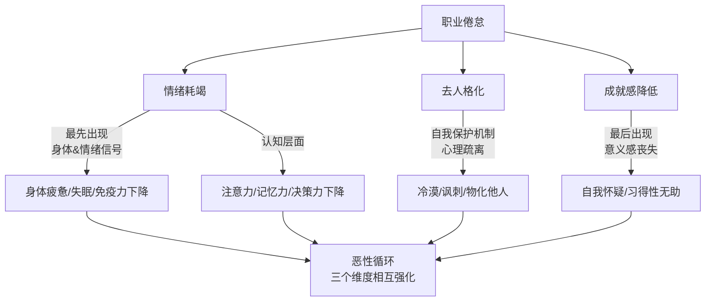
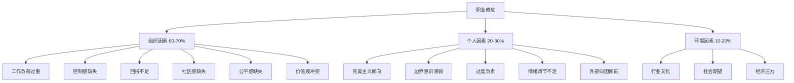
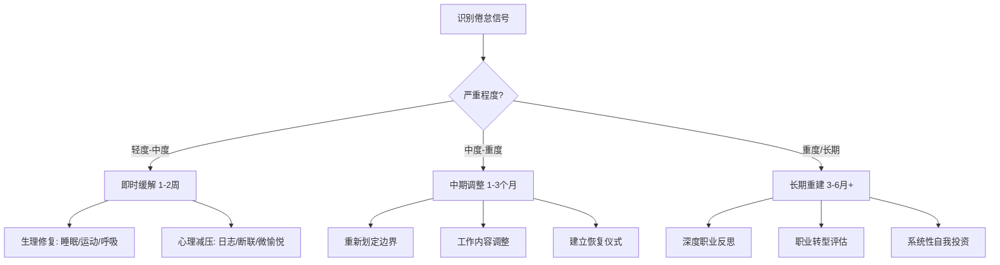
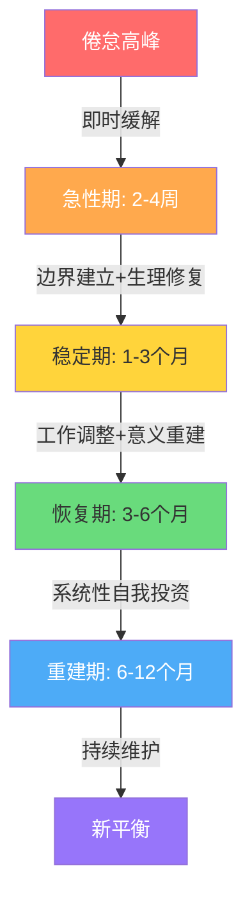

## 六、职业倦怠与应对

职业倦怠不是"矫情"，不是"抗压能力差"，而是一种有明确神经生理基础的慢性应激综合征。2019年世界卫生组织将其正式纳入《国际疾病分类》（ICD-11，编码QD85），定义为"由于长期的工作场所压力未得到成功管理而导致的综合征"。这一里程碑式的归类意味着：职业倦怠不再只是心理学概念，而是被全球医学界认可的健康问题。

在中国，智联招聘2023年《中国职场人倦怠调查报告》显示，**超过64%的受访者表示正在经历中度以上职业倦怠**，其中互联网、金融、教育行业位居前三。996工作制、内卷文化、35岁危机焦虑共同构成了中国职场人特有的倦怠温床。

### 6.1 职业倦怠的科学机制

要有效应对倦怠，首先要理解它在身体里究竟发生了什么。倦怠不是主观感受，而是有可测量的生理变化作为基础。

#### 6.1.1 HPA轴与皮质醇

人体面对压力时，下丘脑-垂体-肾上腺轴（HPA轴）被激活，释放皮质醇（cortisol）。短期内皮质醇帮助我们集中注意力、提升反应速度——这是进化赋予我们的"战或逃"机制。但当压力持续数月甚至数年，HPA轴会出现两种异常：

- **皮质醇持续偏高**：身体长期处于应激状态，导致免疫抑制、记忆力下降、腹部脂肪堆积。2019年发表在《Psychoneuroendocrinology》上的一项元分析发现，倦怠个体的皮质醇觉醒反应（CAR）显著低于健康对照组，差值达到0.3个标准差
- **HPA轴钝化**：皮质醇分泌反而降低，身体进入"耗竭"状态——对什么都提不起劲，这正是倦怠期的典型生理表现。类比来说，就像一个长期踩油门的发动机突然熄火

**可测量的生理指标**：如果你有条件做体检，以下指标可以作为倦怠的客观参考——晨起皮质醇水平（低于正常范围可能提示HPA轴钝化）、糖化血红蛋白（长期压力会升高）、白细胞计数（免疫抑制表现）、甲状腺功能（TSH异常与慢性疲劳相关）。

#### 6.1.2 多巴胺奖赏系统失调

倦怠不仅仅是"累了"，更深层的问题是大脑奖赏系统的失活。多巴胺（dopamine）是驱动动机和快感体验的关键神经递质。长期处于付出-回报失衡的状态下，大脑会逐渐降低对工作相关刺激的多巴胺响应——这就是为什么倦怠者会觉得"什么都不想做"，而不是"想做但没力气"。

具体机制如下：

1. **预期奖赏衰减**：大脑的腹侧被盖区（VTA）不再对工作成就产生足够的多巴胺信号。以前完成一个项目会感到满足，现在完成十个也毫无感觉
2. **基线多巴胺下降**：受体下调导致多巴胺基线水平降低，日常活动的愉悦感减弱。不只是工作——吃饭、社交、娱乐都变得"没意思"
3. **动机回路中断**：前额叶到纹状体的动机通路效率降低，即使理性上知道该做什么，身体就是"启动不了"

这个机制解释了为什么倦怠者常常被误解为"懒"——他们不是缺乏意志力，而是大脑的动机系统在物理层面出了故障。理解这一点对自我接纳和他人理解都至关重要。

#### 6.1.3 前额叶功能下降

长期压力还会损害前额叶皮层（prefrontal cortex）的功能，这个区域负责决策、计划、情绪调节和创造力。倦怠状态下的人会出现：

- **决策困难**：连午饭吃什么都要纠结很久——因为前额叶的执行功能资源已被慢性压力耗尽
- **注意力涣散**：开会时无法集中超过10分钟，频繁切换任务但什么都做不完
- **情绪调节变差**：容易暴怒或莫名想哭，杏仁核（情绪中枢）的反应阈值降低，前额叶的"刹车"功能减弱
- **创造力枯竭**：遇到问题只想用最熟悉的方式，大脑进入"节能模式"拒绝高耗能的创新思考
- **工作记忆下降**：刚看过的东西转头就忘，同时处理多项任务的能力大幅降低

神经影像学研究（Golkar et al., 2014, PLOS ONE）发现，倦怠者的杏仁核体积增大、前额叶灰质密度降低——这些是可测量的结构性变化，不是"想开点"就能解决的。

#### 6.1.4 默认模式网络（DMN）异常

默认模式网络是大脑在"休息"时仍然活跃的神经网络，负责自我反思、记忆整合和未来规划。健康的DMN活动让人能够"放空"、进行内省和恢复。倦怠者的DMN活动模式出现异常：

- **反刍思维增强**：DMN与负面自我评价相关的脑区过度活跃，导致下班后仍然反复想工作的事，越想越焦虑
- **恢复性休息失效**：即使身体在休息，大脑仍然处于高消耗状态，这就是为什么倦怠者常常觉得"怎么休息都不够"
- **创造力下降**：DMN是灵感和创意的神经基础，其功能受损直接影响创新思维

这一发现解释了一个关键现象：倦怠者的疲劳不仅是体力上的，更是神经层面的——他们的大脑失去了真正"关机休息"的能力。

#### 6.1.5 倦怠 vs 抑郁 vs 普通疲劳

很多人混淆这三个概念，但它们有本质区别：

| 维度 | 普通疲劳 | 职业倦怠 | 抑郁症 |
|------|----------|----------|--------|
| 持续时间 | 短期，休息可恢复 | 数月至数年 | 持续两周以上 |
| 触发因素 | 具体事件/项目 | 工作相关 | 可无明确诱因 |
| 影响范围 | 主要影响工作状态 | 工作+生活社交 | 波及生活所有层面 |
| 兴趣丧失 | 仅限当前任务 | 主要针对工作相关 | 对所有事物丧失兴趣 |
| 自我评价 | 正常 | 工作能力方面降低 | 全面贬低自我价值 |
| 生理指标 | 皮质醇正常 | 皮质醇异常波动 | 神经递质失衡 |
| 恢复方式 | 休息即可 | 需要系统性调整 | 通常需要专业治疗 |
| 自杀风险 | 无 | 低 | 显著升高 |
| 核心情绪 | 疲惫 | 空虚+愤世嫉俗 | 绝望+无价值感 |

**关键判断标准**：如果休假两周后感觉完全恢复了，大概率是疲劳；如果休假时感觉好转但复工后迅速恶化，很可能是倦怠；如果休假也无法缓解且对一切失去兴趣，建议尽快寻求专业心理评估。

**特别警示**：倦怠和抑郁可以共病（comorbidity）。研究显示约30%的重度倦怠者同时满足抑郁症诊断标准。如果你发现自己有持续的自我伤害想法、严重的睡眠障碍（早醒且无法再入睡）、或体重在短期内剧烈变化（一个月内增减5%以上），请立即寻求专业帮助，不要自行判断。

### 6.2 职业倦怠的三维模型

心理学家克里斯蒂娜·马斯拉赫（Christina Maslach）开发了目前全球最广泛使用的职业倦怠评估框架——马斯拉赫倦怠量表（Maslach Burnout Inventory, MBI）。该模型将倦怠分为三个维度，每个维度都是一个从低到高的连续谱。

#### 6.2.1 情绪耗竭（Emotional Exhaustion）

这是倦怠最核心、最先出现的维度。表现为：

- **身体层面**：持续性疲劳，早上起床就像没睡过一样；免疫力下降，感冒反复发作；肌肉紧张，尤其肩颈和下背部；消化系统紊乱（胃痛、腹泻、食欲异常）
- **情绪层面**：对工作提不起精神，上班如上坟；容易烦躁、焦虑，情绪波动大；感到被掏空，像一个"行走的空壳"；莫名想哭或情绪麻木交替出现
- **认知层面**：注意力无法集中，工作效率大幅下降；记忆力减退，经常忘记约定和截止日期；阅读同一段文字三遍仍不理解意思
- **行为层面**：拖延增多，对工作投入明显减少；频繁请假或迟到；下班后只想"瘫着"；咖啡因和酒精摄入量增加

**自我检测问题**：过去一个月内，你是否经常感到"我被工作压得喘不过气"？是否觉得"每天早上起床去上班都是一种折磨"？

#### 6.2.2 去人格化（Depersonalization）

也叫"犬儒主义"，是情绪耗竭后的自我保护机制——通过心理疏离来减少情感消耗：

- 对同事、客户、服务对象变得冷漠，用"那群人"来称呼他们
- 用讽刺、挖苦的态度对待工作和他人
- 将人视为"工单号"、"需求单"、"case"，而非有情感的个体
- 不再关心工作成果对他人的影响
- 社交上退缩，回避团队活动和交流
- 在社交媒体上频繁发表愤世嫉俗的言论

**在不同职业中的表现**：

| 职业 | 去人格化的典型表现 | 隐蔽程度 |
|------|-------------------|----------|
| 医护人员 | 对患者丧失同情心，机械化执行操作，避免与患者眼神接触 | 中 |
| 教师 | 对学生不再有耐心，认为"教不好是他们自己的问题"，减少课外互动 | 中 |
| 程序员 | 对产品和用户需求嗤之以鼻，"产品经理又在拍脑袋"，代码质量下降 | 高（常被误认为"技术态度"） |
| 管理者 | 对下属冷漠，把人当作"资源"而非"团队成员"，只关心KPI不关心人 | 高（常被美化为"结果导向"） |
| 客服/销售 | 对客户投诉麻木，内心OS"又来一个"，回应机械敷衍 | 低 |
| 设计师 | 放弃追求极致，"能用就行"，对作品不再有自豪感 | 中 |

**自我检测问题**：你是否开始觉得"这些人真烦"？是否觉得"反正说了也没用，不如不管"？

#### 6.2.3 个人成就感降低（Reduced Personal Accomplishment）

前两个维度是"多了不该有的"，这个维度是"少了该有的"：

- 觉得自己的工作毫无价值和意义
- 怀疑自己的专业能力和职业选择
- 无论多努力都看不到成果，产生习得性无助
- 开始羡慕其他行业或他人的工作
- "我做这些到底有什么用？"成为内心常驻疑问
- 回避挑战性任务，只做最低限度的工作
- 对职业发展失去规划意愿，"走一步看一步"

**自我检测问题**：你是否觉得"我在这份工作上什么也没学到"？是否怀疑"我是不是入错了行"？

### 6.3 职业倦怠的成因：系统性分析

倦怠从来不是单一因素造成的，而是组织环境与个人特质的交互作用。重要的是认识到：**约60-70%的倦怠成因来自组织系统，而非个人**。把倦怠归咎于个人"抗压能力差"，本身就是一种有害的误区。

#### 6.3.1 组织层面六大因素

马斯拉赫提出了著名的"人员-工作不匹配"（Person-Job Mismatch）模型，包含六个关键维度：

**（1）工作负荷过重**
- 量的过重：工作量超出正常范围，持续加班成为常态
- 质的过重：工作难度超出能力范围，持续处于"勉强撑住"的状态
- 时间压力：截止日期不合理，永远在"救火"
- 认知过载：需要同时处理的信息流超出大脑带宽，会议、消息、邮件、群聊同时轰炸
- 典型场景：一个人干三个人的活，领导还觉得你"效率有待提高"

**（2）控制感缺失**
- 对工作方式、节奏、方法没有自主权
- 微观管理（micromanagement）严重，每一步都要审批
- 有责任无权力——事情做砸了是你的锅，做好了是领导的功劳
- 无法参与影响自己的决策（如排班、项目分配、工具选择）
- 典型场景：技术方案被不懂技术的领导否决，要求按他的"直觉"来

**（3）回报不足**
- 薪资低于市场水平，加薪无望
- 精神层面的回报缺失——做得好没人说，做不好全知道
- 成长回报不足——学不到新东西，晋升通道堵死
- 缺乏可见性——你的贡献被上级或系统"吞掉"了
- 典型场景：连续两年绩效优秀但薪资冻结，公司还在宣扬"共克时艰"

**（4）社区感缺失**
- 同事之间缺乏信任和支持，只有竞争关系
- 团队内部沟通不畅，信息孤岛
- 远程办公加剧了孤立感，"同事"变成了头像和文字
- 缺乏有效的冲突解决机制，矛盾积累
- 典型场景：出了问题没人帮忙，所有人都在"甩锅"

**（5）公平感缺失**
- 绩效评估不透明，"会哭的孩子有奶吃"
- 资源分配不均，某些人/部门总能获得优先权
- 晋升靠关系而非能力
- 双重标准——对不同人适用不同规则
- 典型场景：同岗不同薪，干得多的反而拿得少

**（6）价值观冲突**
- 公司宣扬的价值观与实际行为不一致（"说一套做一套"）
- 个人道德底线与工作要求冲突
- 产品/服务与个人信念背道而驰
- 组织变革方向与个人职业愿景不符
- 典型场景：公司宣称"用户至上"，实际为了KPI不惜损害用户利益

#### 6.3.2 个人层面风险因素

**完美主义倾向**：不是追求卓越的"适应性完美主义"，而是"非适应性完美主义"——设定不可能的标准，犯错后反复自我批评，总觉得"还不够好"。研究显示，非适应性完美主义者的倦怠风险是普通人的2.3倍（Hill & Curran, 2016, Personality and Social Psychology Review）。区分标准：适应性完美主义让你享受过程，非适应性完美主义让你恐惧失败。

**边界意识薄弱**：无法在工作与生活之间划清界限。下班后秒回消息、周末处理工作、休假时心里惦记项目——长期处于"半工作半休息"的低效状态，既没有好好工作也没有好好休息。

**过度负责（Over-responsibility）**：把不属于自己的责任扛在肩上，觉得"这个事情只有我能做"，不愿委托他人。短期内可能产出很高，但长期必然耗竭。这种模式往往与童年经历相关——如果从小被要求"懂事"、"照顾家人"，成年后更容易在工作中过度负责。

**缺乏情绪调节能力**：面对负面情绪只能"忍着"或"扛着"，缺乏有效的疏导渠道。男性尤其容易陷入这种模式——社会期待让他们觉得"不应该脆弱"。情绪不会消失，只会在身体里积累，最终以失眠、胃痛、头痛等躯体化症状爆发。

**外部归因倾向**：总觉得自己是受害者，一切问题都是外部环境造成的。这种心态虽然短期内保护了自尊，但长期会让人陷入无力感——既然都是外部的错，那自己什么也做不了。

**高敏感特质（HSP）**：约15-20%的人群具有高敏感特质（Elaine Aron的研究），他们对外界刺激的感知更细腻、情绪反应更强烈。高敏感者在高压工作环境中更容易被过度刺激，倦怠风险比普通人群高出约40%。但高敏感也意味着更强的共情力和创造力——关键是在合适的环境中发挥优势。

#### 6.3.3 中国职场特有因素

- **996/007文化**：长时间工作被美化为"奋斗"，休息被视为"不上进"。《劳动法》明确规定每日工作不超过8小时、每周不超过44小时，但现实中这一规定形同虚设
- **35岁危机焦虑**：35岁还没到管理层就面临被优化的恐惧，导致过度内卷。这种焦虑被企业有意无意地利用，形成对年轻员工的隐性压榨
- **内卷竞争**：同事之间不是合作而是零和博弈，加班不是为了产出而是为了"表态"。"表演式加班"——领导不走我不走，走了一起走
- **职场PUA**：通过否定你的价值来维持控制，"你离开这里什么也不是"、"年轻人不要太计较"、"我们是一个大家庭"
- **社会比较压力**：同学、同龄人、朋友圈的攀比加剧了"不够成功"的焦虑。看到别人晒加班、晒晋升、晒薪资，自己的倦怠感反而加重——"别人都能坚持，为什么我不行？"
- **代际冲突**：70/80后领导的管理风格与95/00后员工的价值观存在深层冲突。老一代信奉"吃苦是福"，新一代追求"工作生活平衡"，这种冲突本身就是倦怠的催化剂
- **编制与稳定性焦虑**：在体制内，倦怠者面临"想走不敢走"的困境——编制意味着稳定，放弃编制意味着失去社会身份认同

### 6.4 行业差异化倦怠模式

不同行业有各自独特的倦怠触发因素和表现模式，了解你所在行业的倦怠特征有助于精准识别和应对。

#### 6.4.1 互联网/科技行业

**核心倦怠源**：高强度迭代节奏、持续的技术更新压力、OKR/KPI驱动的量化焦虑、扁平化管理下的隐性加班。

**典型特征**：
- "大小周"文化导致连续工作12天
- 技术债务积累带来的持续焦虑——"我知道该重构，但永远排不上日程"
- on-call轮班制度打破正常作息
- 35岁"高龄程序员"焦虑形成提前倦怠

**行业特有应对**：
- 建立个人技术投资节奏：每周固定4小时学习新技术，而非在项目压力下被动追赶
- 学会区分"紧急"和"重要"：不是所有线上告警都需要立即处理
- 用自动化工具替代重复性运维工作，减少on-call期间的焦虑

#### 6.4.2 金融行业

**核心倦怠源**：高风险高回报的极端压力、合规与业绩的内在冲突、长时间高强度工作（投行分析师平均每周工作80-100小时）。

**典型特征**：
- 周期性高压——季报、年报期间几乎无法休息
- 决策失误的后果严重，导致过度谨慎和决策疲劳
- 薪资虽然高但"时薪"并不突出，付出-回报感知失衡
- 行业下行期的裁员恐惧加剧内卷

#### 6.4.3 教育行业

**核心倦怠源**：高情感劳动（emotional labor）、行政负担挤占教学时间、家校关系紧张、职称评定压力。

**典型特征**：
- 教学本身只占工作量的40-50%，其余被填表、迎检、会议占据
- "好老师"标准不断变化，疲于跟上政策和考核
- 对学生的情感投入长期得不到对等回报
- 疫情后线上教学与线下教学双轨运行加剧负担

#### 6.4.4 医疗行业

**核心倦怠源**：生死压力、超长值班、医患关系紧张、制度性疲劳。

**典型特征**：
- 连续值班24-36小时后仍需完成文书工作
- 患者死亡带来的情感冲击被要求"快速处理，继续工作"
- 医患矛盾导致防御性医疗——"多开检查少担责"
- WHO将医疗行业列为全球倦怠率最高的行业之一，部分研究显示倦怠率高达50-70%

#### 6.4.5 远程办公/自由职业

**核心倦怠源**：工作与生活边界物理性消失、社交孤立、自律消耗、收入不稳定性焦虑。

**典型特征**：
- "在家办公"变成"在家加班"——没有明确的上下班界限
- 缺乏同事社交导致孤独感持续积累
- 自由职业者面临"不工作就没有收入"的压力，无法真正休息
- 家人不理解"在家"为什么不能做家务/带孩子
- 视频会议疲劳（Zoom fatigue）——持续的眼神接触和自我审视消耗大量心理能量

### 6.5 数字化倦怠：信息时代的特殊挑战

在智能手机和即时通讯工具普及的今天，一种新型倦怠正在蔓延——数字化倦怠。它不仅来源于工作本身，更来源于技术对工作边界的彻底侵蚀。

#### 6.5.1 信息过载

- **持续通知轰炸**：平均每12分钟被一次通知打断，而被打断后需要23分钟才能恢复到原来的专注水平（UC Irvine研究）
- **多平台切换成本**：微信、钉钉、飞书、邮件、Slack……每个平台都是一个信息入口，频繁切换消耗大量认知资源
- **FOMO（错失恐惧）**：害怕错过重要消息，导致不断查看手机的强迫性行为
- **信息质量下降**：大量信息涌入但真正有价值的很少，"沙里淘金"本身就很耗能

#### 6.5.2 即时响应文化

- "消息已读不回"被默认为不礼貌，形成隐性的即时回复压力
- 非工作时间的工作消息将心理边界彻底模糊化
- 群聊中的@所有人制造虚假紧急感
- 时区差异导致跨国团队需要在非正常时间响应

#### 6.5.3 应对数字化倦怠的具体策略

**信息管理**：
- 每天设定2-3个固定的"消息处理窗口"（如10:00、14:00、17:00），其余时间关闭通知
- 按优先级分层：紧急电话 > 重要消息 > 一般消息 > 社交通知。紧急通道始终开放，其他批量处理
- 定期清理不必要的群聊和订阅，减少信息噪声

**工具层面**：
- 使用专注模式/勿扰模式，配合番茄工作法（25分钟专注+5分钟休息）
- 将多个聊天工具整合到一个平台管理（如Beeper、Franz）
- 设置自动回复模板："我将在[时间]回复您"
- 使用屏幕使用时间监控工具（如iOS自带的屏幕使用时间），设定每日上限

**心理层面**：
- 认识到"离线"不是不礼貌——它是一种健康的工作习惯
- 接受"不是所有消息都需要立即回复"的事实
- 每周安排至少一次完全无屏幕的时间（半天以上）

### 6.6 自我诊断：你处于倦怠的哪个阶段

以下是一个基于MBI模型简化后的自评量表。请根据过去一个月的真实感受打分（1=从不，2=偶尔，3=有时，4=经常，5=总是）：

#### 情绪耗竭维度
1. 下班后感到筋疲力尽
2. 早上想到要去上班就感到疲惫
3. 一整天都在和工作做斗争
4. 工作让我感到身心俱疲
5. 我觉得自己已经到了极限

#### 去人格化维度
1. 我对工作中接触的人变得越来越冷漠
2. 我担心这份工作让我变得麻木
3. 我对同事和客户越来越没有耐心
4. 我觉得自己的付出不被理解和珍惜
5. 我不再关心工作中发生了什么

#### 个人成就感维度（反向计分）
1. 我能有效地解决工作中的问题（R）
2. 我觉得自己在做有价值的贡献（R）
3. 我对工作保持热情和活力（R）
4. 我觉得自己擅长这份工作（R）
5. 我在工作中能感受到快乐（R）

**评分解读**：

| 总分范围 | 状态 | 建议 |
|----------|------|------|
| 15-30分 | 健康状态 | 保持当前节奏，定期自检 |
| 31-45分 | 轻度倦怠倾向 | 关注信号，开始预防性调整 |
| 46-60分 | 中度倦怠 | 需要主动干预，调整工作模式 |
| 61-75分 | 重度倦怠 | 强烈建议寻求专业帮助，考虑职业调整 |

**进阶评估工具**：
- **MBI量表**（Maslach Burnout Inventory）：全球最权威的职业倦怠评估工具，22个条目，三个维度分别计分，可在Mind Garden官网购买
- **哥本哈根倦怠量表**（CBI）：免费可用，5个维度，侧重心理疲劳和个人倦怠
- **中国版职业倦怠量表**（MBI-GS中文版）：由李永鑫教授团队修订，更适合中国文化语境，包含情感耗竭、玩世不恭和成就感低落三个分量表
- **OLBI量表**（Oldenburg Burnout Inventory）：从"耗竭"和"脱离"两个维度评估，将倦怠视为连续谱而非分类

> **注意**：此量表仅为自检参考工具，不能替代专业心理评估。如果得分较高且持续超过一个月，建议咨询专业心理咨询师或精神科医生。

### 6.7 分阶段应对策略

倦怠的应对不是一招制胜，而是需要根据严重程度采取不同层级的策略。

#### 6.7.1 第一阶段：即时缓解（1-2周）

当倦怠信号已经亮起红灯，你需要先"止血"：

**生理层面的紧急修复**：
- **睡眠优先**：设定固定的就寝时间，睡前1小时不看屏幕，目标7-8小时。倦怠状态下的大脑最需要的是深度睡眠来修复神经通路。如果入睡困难，尝试"军事睡眠法"：放松面部所有肌肉→松肩→松臂→深呼吸→10秒内清空大脑
- **运动启动**：不需要高强度，每天30分钟快走就足以提升血清素和内啡肽水平。关键不是运动量，而是规律性。研究显示每周150分钟中等强度运动的抗抑郁效果与药物相当（Blumenthal et al., 2007）
- **呼吸练习**：4-7-8呼吸法（吸气4秒、屏息7秒、呼气8秒）可以快速降低皮质醇水平，每天做3-4轮，每轮4个循环。另一个有效的变体是"生理叹息"（double inhale + long exhale），斯坦福Andrew Huberman实验室的研究显示，仅5分钟就能显著降低焦虑
- **营养支持**：倦怠状态下容易暴饮暴食或食欲不振。确保摄入足够的Omega-3脂肪酸（深海鱼、核桃）、维生素B族（全谷物、绿叶蔬菜）和镁（坚果、黑巧克力），这些营养素对神经系统恢复至关重要

**心理层面的紧急减压**：
- **情绪日志**：每天花10分钟写下三件事——今天让我感到压力的事、我对此的情绪反应、我能控制和不能控制的部分。把情绪从"脑子里循环"转移到"纸上"。认知行为疗法（CBT）的核心就是"写下来→看清它→重新评估"
- **数字断联**：每天至少有1小时完全不看手机和电脑。不是"静音放在旁边"，而是物理隔离——放到另一个房间。研究显示，即使手机关机放在视线范围内，认知表现也会下降（Ward et al., 2017, Journal of the Association for Consumer Research）
- **微小愉悦**：刻意安排一件让自己开心的小事——一杯好咖啡、一首喜欢的歌、10分钟晒太阳。倦怠状态下人会停止给自己制造快乐，需要刻意为之。建立一个"愉悦清单"——列出20件不需要花钱、30分钟内能完成的让自己开心的事

#### 6.7.2 第二阶段：中期调整（1-3个月）

止血之后，需要找到并处理根源问题：

**重新划定边界**：

边界不是一堵冷冰冰的墙，而是一扇带锁的门——你可以选择什么时候打开。具体操作：

- 明确工作时间窗口，例如"9:00-19:00是我的工作时间，其余时间不处理工作事务"
- 学会用"建设性拒绝"替代简单的"不行"。以下是具体话术模板：

| 场景 | 不推荐 | 推荐话术 |
|------|--------|----------|
| 领导临时加任务 | "做不了" / 默默接受 | "这个任务我可以做，但需要推迟XX的交付时间，您更希望优先做哪个？" |
| 下班后消息轰炸 | 不回 / 立刻回 | 设置自动回复："我将在明天工作时间内回复您" |
| 同事推卸责任 | "这不是我的事" | "我可以协助，但主导方还是需要你来推进。我们找个时间一起梳理一下分工？" |
| 被要求参加无意义会议 | 默默参加 | "这个会议我的参与必要性不大，我能否看会议纪要了解结论？" |
| 跨部门临时需求 | 照单全收 | "这个需求我需要先评估一下优先级，和我的直属领导确认后再给你时间表" |

- 下班后的工作消息可以设置自动回复："我将在明天工作时间内回复您"

**工作内容调整**：
- 梳理当前工作中的能量消耗者（energy drainer）和能量补充者（energy booster）
- 用"能量审计表"记录一周内每项工作对自己的能量影响（+5到-5打分），找出最大的消耗源
- 尝试与领导沟通，调整工作分配——增加后者比例，减少前者比例
- 如果可能，主动申请能让自己有"心流"体验的项目
- 将重复性工作尽量自动化或模板化——脚本、模板、快捷指令都是你的"数字员工"

**建立恢复仪式**：

恢复不是一次性的，而是需要嵌入日常的仪式化习惯：

- **每日仪式**：起床后15分钟不看手机，做简单的拉伸或冥想；睡前写下"今天完成的三件事"（不是"待办清单"，而是"已完成清单"——重新训练大脑关注成就而非不足）
- **每周仪式**：一个完全不工作的半天，做任何让自己开心的事；一次运动或户外活动；一次不带目的地散步（不戴耳机，不看手机，只是走）
- **每月仪式**：一次独处时间，反思职业方向和内心状态；一次与朋友/家人的深度交流（不是聊工作，而是聊生活、聊感受）

#### 6.7.3 第三阶段：长期重建（3-6个月及以上）

如果前两个阶段没有明显改善，说明问题可能更深层：

**深度职业反思**：
- 用"能量-意义"矩阵评估当前工作：

|  | 有意义 | 无意义 |
|--|--------|--------|
| **高能量** | 核心优势区（增加投入） | 兴趣探索区（深入了解） |
| **低能量** | 价值贡献区（学会委托） | 倦怠重灾区（果断减少） |

- 回答以下关键问题：
  - 如果不用担心收入，我最想做什么？
  - 工作中哪些时刻让我感到"活着"？
  - 我的核心价值观是什么？当前工作与之匹配度如何？
  - 五年后我希望过什么样的生活？
  - 如果我的孩子（或最好的朋友）在我的处境中，我会给他什么建议？

**职业转型评估**：
- 如果倦怠根源是行业/岗位本身，而非当前公司，可能需要考虑转型
- 转型不一定是"一步到位"的跳崖式改变，可以是渐进式过渡（详见本章第七节"职业转型理论"）
- 先用副业、兼职、志愿工作等方式"试水"新方向，降低转型风险
- 使用"转型可行性评估表"：市场需求×个人优势×兴趣热情÷转型成本，得分最高的方向优先尝试

**系统性自我投资**：
- 建立"心理免疫系统"：规律运动（每周3次以上）、正念冥想（每天10分钟）、充足睡眠（7-8小时）
- 培养至少一个与工作无关的兴趣爱好——它提供的是"意义感"的另一个来源
- 建立个人支持网络：职业导师、同龄互助小组、专业心理咨询师
- 投资个人品牌建设——即使留在当前行业，一个清晰的个人品牌也能提供更多的职业选择权

### 6.8 正念与冥想：倦怠恢复的科学工具

正念冥想不是玄学，而是有大量神经科学证据支持的压力管理工具。2014年发表在《JAMA Internal Medicine》上的元分析（涵盖47项RCT研究、3515名参与者）显示，正念冥想对焦虑、抑郁和疼痛的改善效果与抗抑郁药物相当。

#### 6.8.1 为什么正念对倦怠有效

正念冥想直接针对倦怠的神经机制：
- 降低杏仁核的过度激活——减少情绪反应性
- 增强前额叶皮层的灰质密度——恢复执行功能和情绪调节
- 降低皮质醇基线水平——缓解HPA轴过度激活
- 改善默认模式网络功能——减少反刍思维，增强真正休息的能力

#### 6.8.2 入门正念练习（每天10分钟）

**呼吸觉察练习**（最适合新手）：
1. 找一个安静的地方坐下，脊柱自然挺直，双手放在膝盖上
2. 闭上眼睛或目光低垂看向前方1米处
3. 将注意力放在呼吸上——感受空气从鼻腔进入，胸腔和腹部微微隆起，然后空气从鼻腔呼出
4. 念头出现时（一定会出现），不要责怪自己，温柔地将注意力拉回呼吸
5. 每次"走神→拉回"就是一次"大脑俯卧撑"，这正是训练的核心
6. 从每天5分钟开始，逐步增加到10-15分钟

**身体扫描练习**（适合睡前/休息时）：
1. 平躺或坐在舒适位置
2. 从脚趾开始，逐步向上移动注意力：脚趾→脚掌→脚踝→小腿→膝盖→大腿→臀部→腹部→胸口→肩膀→手臂→手掌→脖子→面部→头顶
3. 在每个部位停留2-3次呼吸，感受该部位的感觉——紧张？温暖？麻木？
4. 不试图改变任何感觉，只是"看到"它
5. 全程约15-20分钟

#### 6.8.3 推荐的冥想应用

| 应用 | 特点 | 适合人群 | 价格 |
|------|------|----------|------|
| 潮汐 | 中文界面，自然声音，简洁无广告 | 冥想入门者 | 基础免费 |
| 小睡眠 | 助眠+冥想，场景丰富 | 有睡眠问题的倦怠者 | 基础免费 |
| Headspace | 系统化课程，动画引导 | 喜欢结构化学习的人 | 付费（有免费试用） |
| Calm | 自然场景，明星引导 | 偏好轻松氛围的人 | 付费（有免费试用） |
| Insight Timer | 全球最大免费冥想社区 | 有一定基础想探索的人 | 大量免费内容 |

#### 6.8.4 将正念融入日常工作

正念不一定要"坐着冥想"，以下是可以在工作中实践的微正念：

- **3-3-3法则**：感到压力时，说出你看到的3样东西、听到的3种声音、活动身体的3个部位。这个简单的练习能在30秒内将你从焦虑中拉回当下
- **单任务练习**：吃饭时只吃饭，不看手机。走路时只走路，不戴耳机。专注做一件事本身就是正念
- **STOP技术**：Stop（停下来）→ Take a breath（深呼吸）→ Observe（观察自己的感受和想法）→ Proceed（有意识地继续）。每次切换任务时做一次，只需30秒
- **感恩时刻**：每天工作结束后，写下一件今天值得感恩的小事。研究显示，持续8周的感恩练习可以显著提升主观幸福感和工作满意度

### 6.9 组织视角：如果你是管理者

如果你是一位团队管理者，团队成员的倦怠不仅是个人问题，更是团队效能的预警信号。研究显示，**一个倦怠的员工会通过情绪传染影响周围3-5个同事**（Bakker et al., 2005, European Journal of Work and Organizational Psychology）。

#### 6.9.1 预防性措施

- **工作量审计**：每季度对团队工作量做一次真实评估，确保人均负荷在合理范围内（建议不超过80%满负荷，留出20%的缓冲空间应对突发情况）
- **定期一对一**：与每个团队成员每两周进行一次15-30分钟的一对一交流，不只聊工作进度，也关注他们的状态和需求。关键问题："最近有什么事情让你觉得特别消耗？"、"你觉得自己在哪方面没有得到足够的支持？"
- **透明化决策**：绩效评估标准、晋升机制、资源分配逻辑尽可能透明
- **认可文化**：及时、具体地认可员工的贡献，不要等到年终才想起来。"认可"的公式：具体行为+产生的影响+表达感谢。例如："你上周主动帮新人梳理了文档结构，让他们的上手时间缩短了一半，这对团队效率的提升非常有价值，谢谢你"
- **心理安全**：创造一个允许犯错、允许说"不"、允许表达不满的团队文化。Google的Project Aristotle研究发现，心理安全是高效团队的第一要素

#### 6.9.2 干预性措施

- 当发现团队成员出现倦怠信号时，主动发起对话："我注意到你最近状态不太好，有什么我可以帮忙的吗？"——注意语气是关心而非评判
- 提供灵活的工作安排——居家办公、弹性工时、项目选择权
- 如果是工作内容导致的倦怠，协助调整岗位或职责
- 建立团队内部的互助机制，避免"各自为政"
- 引入"EAP（Employee Assistance Program）"员工帮助计划，为员工提供免费的心理咨询渠道
- 对于已经严重倦怠的成员，协助其申请带薪休假，而非等到离职才反应

#### 6.9.3 管理者的自我觉察

管理者本身也是倦怠高危人群——你既要承受上级的压力，又要照顾下属的状态。以下信号提示你可能也在倦怠中：

- 你开始觉得"管人太麻烦了"
- 你越来越频繁地对下属发火或冷处理
- 你回避一对一沟通，觉得"没什么好聊的"
- 你把管理视为负担而非责任
- 你在考虑"是不是回去做技术/业务更好"

出现这些信号时，不要硬扛——你也有权利寻求支持。

### 6.10 职业倦怠与职业转型的关系

倦怠并不总是意味着"这份工作不好"，但它确实是一个重要的信号——需要认真审视当前的职业路径。

#### 6.10.1 何时应该留下并调整

- 倦怠主要源于可改变的工作条件（负荷、边界、支持），而非工作本身
- 你仍然认同这个行业的核心价值
- 当前公司有调整空间（换团队、换项目、换岗位）
- 倦怠信号在休假后能明显缓解
- 你还没有探索过其他可能的调整方式（如内部转岗、减少工时、远程办公）

#### 6.10.2 何时应该考虑离开

- 倦怠源于组织文化本身（PUA、过度内卷、价值观冲突）
- 你对这个行业本身已经失去兴趣
- 身体和心理健康持续恶化，调整无效
- 已经影响到家庭关系和个人生活
- 你发现自己在用"沉没成本"说服自己留下——"都干了这么多年了"
- 公司的调整承诺反复落空

#### 6.10.3 离开前的准备清单

在冲动裸辞之前，确保以下条件至少满足三项：

- [ ] 有6个月以上的生活费储备（包括社保续缴方案）
- [ ] 已经明确想要尝试的新方向
- [ ] 至少和3位在目标领域工作的人深聊过（不是泛泛了解，而是了解日常工作的具体体验）
- [ ] 通过副业或项目初步验证了新方向的可行性
- [ ] 家庭/伴侣支持你的决定
- [ ] 已经安排好离职后的过渡期计划（不是"先休息再说"）
- [ ] 了解清楚社保、公积金、个税等衔接事项
- [ ] 建立了至少一个在目标领域的行业人脉

### 6.11 职业倦怠中的亲密关系与家庭影响

倦怠不是孤立的个人事件——它会像涟漪一样扩散到你最亲密的关系中。研究显示，工作倦怠与婚姻/亲密关系满意度呈显著负相关（Bakker & Demerouti, 2013），倦怠者的伴侣也更容易出现心理困扰，这被称为"交叉倦怠"（crossover burnout）。

#### 6.11.1 倦怠对亲密关系的影响

- **情感疏离**：情绪耗竭后，你已经没有多余的情感能量留给伴侣。回到家只想"瘫着"，不想交流、不想亲密、不想处理任何需要情感投入的事情
- **易怒与冲突增加**：前额叶功能下降导致情绪调节变差，对伴侣的小问题反应过激——"你能不能别在这个时候烦我？"
- **性欲下降**：慢性压力抑制性激素分泌，倦怠者的性生活质量普遍下降
- **角色混乱**：工作中的去人格化模式被不自觉地带回家——用"效率"和"KPI"的思维看待家庭关系

#### 6.11.2 如何保护亲密关系

- **主动沟通**：不要等伴侣来"猜"你的状态。直接告诉TA："我最近工作压力很大，可能情绪不太好，这不是因为你"——这个简单的说明能避免大量误解
- **设定"无工作话题"时间**：每天至少有30分钟完全不聊工作，聊生活、聊感受、聊有趣的事
- **共同活动**：倦怠状态下人倾向于独处，但适度的共同活动（散步、做饭、看电影）反而能补充能量——关键选择不需要"社交能量"的轻松活动
- **伴侣支持模式**：如果伴侣处于倦怠中，最好的支持是"陪伴"而非"建议"——"我在这里"比"你应该……"有用得多
- **家庭日程安排**：在周末留出专属家庭时间，保护这个时间不受工作侵入

#### 6.11.3 有孩子的倦怠者

- 倦怠状态下的育儿会加剧负罪感——"我已经没有精力陪孩子了"
- 孩子对父母的情绪状态非常敏感，即使你没有"表现出来"，他们也能感受到
- 降低自我标准：不是每天高质量陪伴2小时才算"好父母"，15分钟全身心的互动比2小时心不在焉的陪伴更有价值
- 寻求家庭支持网络——伴侣、父母、朋友的帮助不是"偷懒"，是"战略性恢复"

### 6.12 你的法定权益：中国劳动法保护

倦怠不只是心理问题，很多时候它源于劳动权益被侵害。了解你的法定权利是自我保护的第一步。

#### 6.12.1 工时与加班

《中华人民共和国劳动法》明确规定：
- 每日工作时间不超过**8小时**，每周不超过**44小时**（第36条）
- 加班一般每日不超过**1小时**，特殊情况不超过**3小时**，每月不超过**36小时**（第41条）
- 工作日加班支付**150%**工资，休息日加班**200%**，法定假日**300%**（第44条）
- 用人单位不得强迫或变相强迫劳动者加班（第43条）

**实操建议**：保留加班证据——打卡记录、工作群消息截图、邮件发送时间。如果公司系统性违反工时规定，可以向当地劳动监察部门投诉或申请劳动仲裁。

#### 6.12.2 带薪休假

- 工作满1年：**5天**年假；满10年：**10天**；满20年：**15天**（《职工带薪年休假条例》）
- 未休年假应按日工资的**300%**补偿
- 婚假、产假、病假等均有法定保障

**重要提醒**：年假是法定权利，不是"公司福利"。如果公司以"没有年假"或"不允许休年假"为由拒绝你的休假申请，这是违法行为。

#### 6.12.3 职业病与工伤认定

- 如果倦怠导致了可诊断的身心疾病（如抑郁症、焦虑症），且与工作条件有直接因果关系，理论上可以申请职业病鉴定
- 中国目前尚未将"职业倦怠"纳入法定职业病目录，但如果工作环境导致了严重的心理创伤（如职场霸凌），可以通过工伤认定途径寻求保护
- 实际操作中，通过司法途径认定"过劳"相关的权益侵害仍然困难，但保留证据、寻求法律咨询是必要的第一步

### 6.13 真实案例分析

#### 案例一：互联网产品经理小王

**背景**：28岁，在某大厂做产品经理三年，最近一年感觉越来越不对劲。每天加班到10点是常态，周末也经常被拉去开会。最让他痛苦的是，辛辛苦苦做的需求上线后效果不好，领导只看数据不听解释。

**倦怠过程**：
- 第1-6个月：开始觉得"怎么加班越来越多"，但觉得"忍忍就过去了"
- 第7-12个月：对产品失去热情，开会时开始走神，跟开发沟通越来越没耐心
- 第13-18个月：出现失眠、胃痛，周末什么都不想做，开始频繁考虑辞职

**转折点**：一次体检发现中度脂肪肝和高血压，医生说"你才28岁，不应该这样"。这成为他的"唤醒时刻"。

**应对过程**：
1. 先请了一周年假，彻底断联休息
2. 回来后跟领导做了一次深度沟通，明确了工作边界——核心工作时间9:30-19:00，非紧急情况不加班
3. 开始每天运动30分钟，周末学习投资理财（为自己培养工作外的掌控感）
4. 三个月后评估，发现大厂文化本身不适合自己，开始准备跳槽到一家中型公司
5. 半年后跳槽成功，薪资略有下降但工作时间减少了40%，重新找回了对产品的热情

**关键教训**：小王的倦怠60%来自组织因素（过度加班、缺乏认可），30%来自个人因素（不懂拒绝、边界模糊），10%来自行业文化。单纯调整个人状态（比如运动、冥想）只能缓解症状，改变环境才能治本。

#### 案例二：中学教师李老师

**背景**：35岁，教语文12年，曾经是学校最受欢迎的老师之一。近两三年越来越提不起劲，觉得"教来教去都一样"。

**倦怠过程**：教学变成流水线作业，备课用旧教案改改就用，对学生的问题越来越没有耐心。期中考试成绩排名让她焦虑，但又觉得"排名有什么意义"。

**应对过程**：
1. 参加了一个教师工作坊，接触到"项目制学习"（PBL）的教学理念
2. 在自己班级试验PBL教学法，学生反响热烈，重新找到了教学的乐趣
3. 开始在公众号分享教学心得，获得了外部认可
4. 两年后成为学校的教学创新带头人

**关键教训**：有些倦怠不是因为"做错了什么"，而是因为"一直在用同一种方式做"。引入新的方法论和视角，可以在不换工作的情况下打破倦怠循环。

#### 案例三：远程工作的自由设计师小陈

**背景**：30岁，从大厂辞职后做了三年自由UI设计师。收入不稳定但自由度高。近两年逐渐感觉"在家比在公司还累"。

**倦怠过程**：工作和生活完全混在一起——早上睁眼就开始回消息，凌晨还在赶稿。没有同事可以交流，所有决策（报价、排期、客户沟通）都要自己扛。收入高峰期拼命接单不敢休息，低谷期焦虑到失眠。

**应对过程**：
1. 加入了一个自由职业者社群，每周线上交流一次，打破了孤立感
2. 建立了严格的工作时间表：10:00-18:00工作，其余时间不看工作消息
3. 租了一个共享办公空间（每周3天），重建"通勤"仪式感
4. 制定了"收入缓冲池"策略：好的月份存30%，用于覆盖差的月份，减少经济焦虑
5. 开始系统性提升单价而非接更多单——从"以量取胜"转向"以质取胜"

**关键教训**：自由职业的倦怠不同于传统职场倦怠——它更多来源于边界消失和孤立感。解决方案的关键是"主动建立结构"——时间结构、社交结构、收入结构。

#### 案例四：医疗行业护士小林

**背景**：26岁，三甲医院ICU护士，工作四年。每天面对生死，三班倒导致生物钟紊乱，医患关系让她身心俱疲。

**倦怠过程**：刚开始工作时充满使命感，一年后开始做噩梦（梦到患者出事），两年后对患者的痛苦开始麻木，三年后考虑辞职但不知道能做什么——"除了护理，我什么都不会"。

**应对过程**：
1. 接受了医院提供的EAP心理咨询，学会了处理"替代性创伤"（vicarious trauma）
2. 加入了护士互助小组，定期分享工作中的情感冲击
3. 开始学习护理管理方向的课程，为职业转型做准备
4. 半年后转到门诊部门，虽然薪资略有下降但作息恢复正常
5. 利用专业知识开始做健康科普内容创作，找到了新的意义感来源

**关键教训**：医护行业的倦怠往往伴随"道德伤害"（moral injury）——当你被迫做出违背职业信念的行为时（如因资源不足无法提供最佳护理），这种伤害比单纯的工作压力更深。处理道德伤害需要专门的方法，普通的减压技巧不够。

### 6.14 常见误区与纠正

#### 误区一："休息一下就好了"

**真相**：休假可以缓解疲劳，但无法治愈倦怠。如果倦怠的根源是工作负荷过重、缺乏自主权或价值观冲突，休假回来只会让你更痛苦——因为从自由回到牢笼的落差感会更强烈。你需要的不是"休息"，而是"改变"。

**正确做法**：休假期间不做"什么都不想"的消极休息，而是进行"有目的的恢复"——运动、社交、创作、自然体验。同时利用这段时间清晰地思考："回去之后，我需要改变什么？"

#### 误区二："是我抗压能力太差"

**真相**：倦怠不是个人弱点，而是系统性问题的信号。把倦怠归咎于个人，就像把船漏水怪乘客不会游泳一样荒谬。全球范围内，倦怠率在各行各业持续上升——这不是因为全世界的人突然都变脆弱了，而是工作环境在系统性地恶化。

**正确做法**：停止自我批评，开始分析："哪些是系统性问题，哪些是我可以改变的？"把精力放在后者上，接受前者你无法独自改变的事实。

#### 误区三："换一份工作就能解决"

**真相**：如果问题在于你的工作模式（不懂拒绝、过度负责、缺乏边界），换到哪里都会重蹈覆辙。在跳槽之前，先审视自己的工作习惯和心态是否需要调整。

**正确做法**：在考虑跳槽前，先给自己3个月时间尝试改变工作方式。如果改变后仍然无法好转，说明确实是环境问题，可以放心跳槽；如果改变后有所缓解，说明自己有调整空间。

#### 误区四："忙说明被需要，是好事"

**真相**：被需要和被消耗是两回事。如果你的忙碌是"被动的"——被别人的需求推着走，而非主动选择——那不是被需要，是被榨取。真正的被需要应该伴随相应的尊重、回报和成长空间。

**正确做法**：每周复盘一次——"本周我花时间最多的三件事是什么？它们是我主动选择的，还是被推着做的？"主动权的回归是打破"被忙碌"的关键。

#### 误区五："只有工作能力不行的人才会倦怠"

**真相**：恰恰相反，研究显示高成就者和高责任感的人更容易倦怠——因为他们投入更多，消耗也更大。倦怠不是能力问题，是投入-回报失衡问题。许多公司最优秀的员工反而最先倦怠，因为他们是被依赖最多、被剥削最严重的人。

**正确做法**：把"我很累"重新理解为"我投入了很多"，这不是需要羞耻的事。然后问自己："我投入的这些，得到了对等的回报吗？"

#### 误区六："心理咨询是'有病'的人才去的"

**真相**：心理咨询是一种专业支持工具，就像体检一样。你不需要"生病"才能去看心理咨询师。定期的心理咨询可以帮助你更早地识别问题、更有效地处理压力、更清晰地做出职业决策。

**正确做法**：把心理咨询视为"心理健身"而非"心理治疗"。许多成功的企业家和职业运动员都有固定的心理咨询师——不是因为他们有问题，而是因为他们重视心理状态的维护。

#### 误区七："年轻人吃点苦是应该的"

**真相**：适当的磨练有助于成长，但过度的压力只会造成创伤。"吃苦"本身不是目的，有意义的挑战和成长才是。如果"吃苦"的结果不是能力提升而是身心损耗，那就不是"磨练"而是"消耗"。

**正确做法**：评估你正在吃的"苦"是否在为你积累有价值的能力和经验。如果不是，果断止损。你的健康和时间是最宝贵的资源，不要浪费在无意义的消耗上。

### 6.15 进阶内容：倦怠恢复的时间线与里程碑

倦怠的恢复不是线性的，而是一个螺旋上升的过程。了解这个过程有助于设定合理预期，避免"怎么还没好"的二次焦虑。

**各阶段特征与预期**：

- **急性期**（2-4周）：最痛苦的阶段，可能伴随身体症状（失眠、胃痛、头痛）。目标是"稳住"，不求好转，只求不再恶化。这个阶段最重要的是——不要做重大决定（辞职、分手、搬家），因为你的判断力已经受损
- **稳定期**（1-3个月）：开始感受到边界建立的效果，工作压力有所减轻，但情绪仍然不稳定，容易反复。"好三天坏两天"是正常的，不要因为反复而否定进展
- **恢复期**（3-6个月）：开始重新找到工作的节奏和意义，偶尔还会感到疲惫但可以自我调节。开始有能力思考长期规划而非只关注眼前
- **重建期**（6-12个月）：建立新的工作模式和生活习惯，对倦怠的触发因素有了清晰认知。可以开始尝试新的挑战，但仍需保持警觉
- **新平衡**：不是回到"倦怠前的状态"（那种状态本身就有问题），而是建立了一个更可持续的工作-生活平衡。你对压力信号更敏感，边界意识更强，应对策略更成熟

**恢复中的常见陷阱**：
- **"好了伤疤忘了疼"**：感觉好转后立刻恢复旧模式，很快再次倦怠。解决方案：将新的边界和习惯制度化，而非仅靠意志力维持
- **恢复焦虑**：觉得"我已经好几个月了怎么还没完全好"。解决方案：接受恢复是非线性的，记录每周的状态变化（而非每天），看到长期趋势
- **身份困惑**：倦怠期间你可能重新定义了"我是谁"，恢复后这个新身份需要时间去稳定。不要急于给自己下结论

**重要提醒**：每个人的时间线不同，以上只是参考范围。强迫自己"按时间表恢复"本身就是一种压力。给自己足够的耐心。

### 6.16 推荐资源

#### 自我评估工具
- **MBI量表**（Maslach Burnout Inventory）：全球最权威的职业倦怠评估工具，可在Mind Garden官网购买
- **哥本哈根倦怠量表**（CBI）：免费可用，侧重心理疲劳维度
- **中国版职业倦怠量表**：由李永鑫教授团队修订，更适合中国文化语境

#### 书籍推荐
- 《倦怠：关于如何停止过度消耗自己》（[德] 鲍里斯·格鲁姆），系统讲解倦怠的成因和恢复方法
- 《精力管理》（[美] 吉姆·洛尔/托尼·施瓦茨），从精力而非时间角度管理职业生涯
- 《被讨厌的勇气》（[日] 岸见一郎/古贺史健），帮助建立课题分离的边界意识
- 《心流》（[美] 米哈里·契克森米哈赖），重新理解"好的工作状态"是什么样的
- 《正念的奇迹》（[越] 一行禅师），最易上手的正念入门读物
- 《过劳时代》（[日] 森冈孝二），从社会经济学角度理解"为什么我们越来越忙"

#### 专业支持
- 中国心理援助热线：400-161-9995
- 北京心理危机研究与干预中心：010-82951332
- 全国24小时心理危机干预热线：400-161-9995
- 壹心理平台：在线心理咨询预约
- 简单心理平台：专业心理咨询师匹配
- 各地三甲医院心理科/精神科：可开具诊断证明，部分费用纳入医保

#### 实用工具App
- **Forest专注森林**：用种树游戏化的方式帮助专注，减少手机依赖
- **潮汐**：白噪音+冥想+专注，中文界面，适合国内用户
- **Day One / 日记类App**：情绪日志记录工具，追踪长期情绪变化趋势
- **蜗牛睡眠**：监测睡眠质量，识别睡眠问题
- **Keep / 薄荷健康**：运动和营养管理，支持倦怠恢复的生理基础

***

> **本节核心观点**：职业倦怠不是你的错，但恢复是你的责任。识别信号、理解机制、采取行动——从今天开始，每天为自己做一件"恢复性"的小事。你不需要等到崩溃才开始改变。倦怠是一个信号，不是终点。它在告诉你：旧的模式已经不可持续了，是时候建立新的平衡了。
