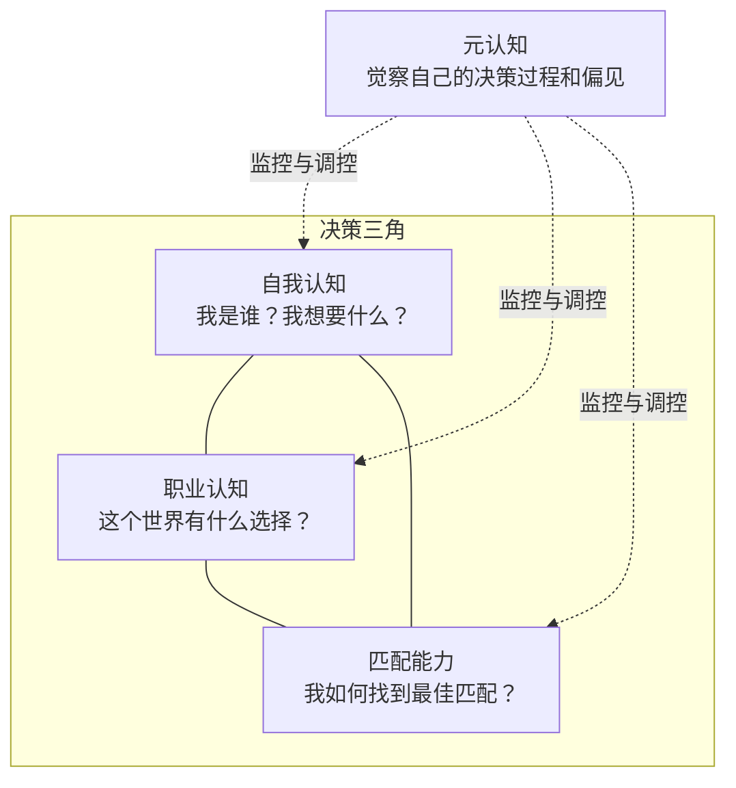
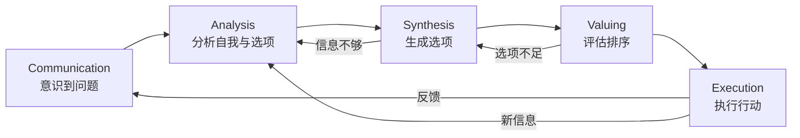
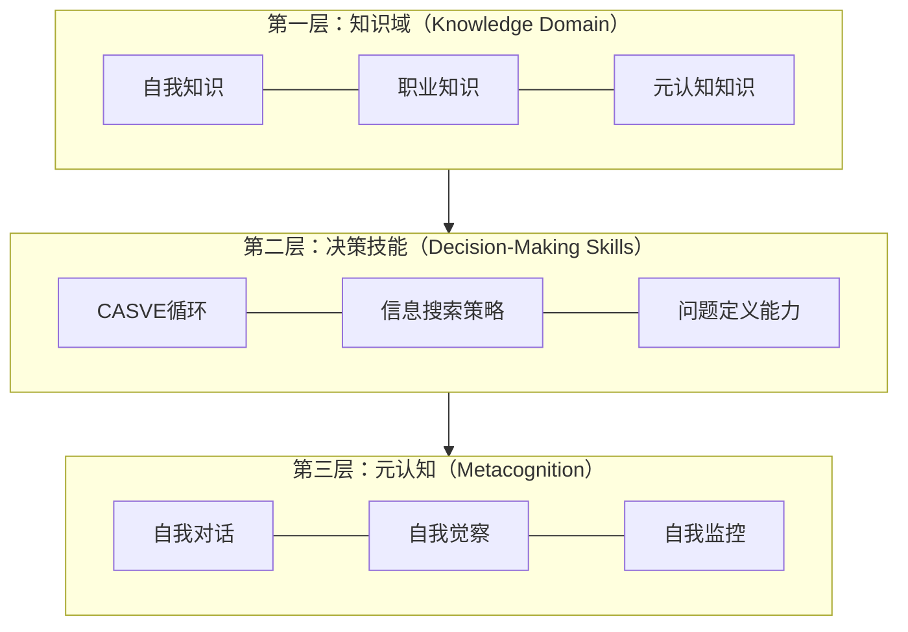
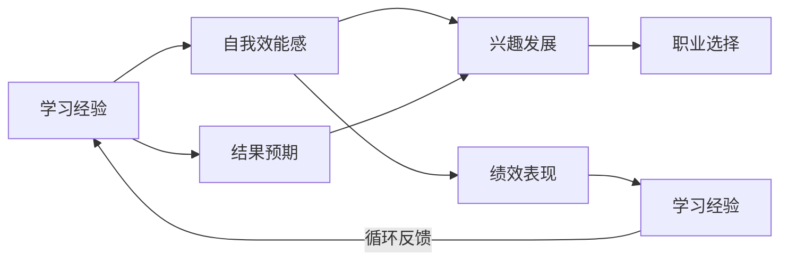
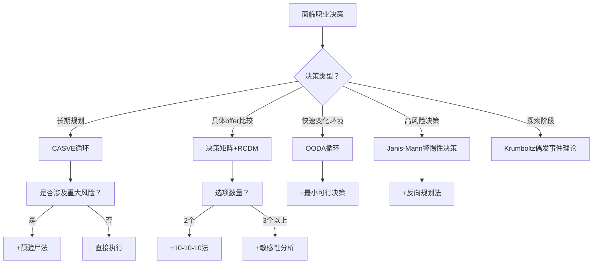

## 七、职业决策模型

职业决策是人生中最重要的决策之一——它决定了你每天清醒时间的大部分在哪里度过，影响你的收入、社交圈、心理状态，甚至寿命。研究表明，职业满意度与整体生活满意度的相关系数高达0.7以上（Bowling et al., 2010）。然而大多数人做职业决策的方式是极其草率的：要么随大流，要么凭直觉，要么被短期利益绑架。

本章介绍经过学术验证的职业决策模型，帮助你用系统化的方法做出高质量的职业选择。这些模型不是互相排斥的——不同场景下适合不同的模型，真正的高手是能在多个模型之间灵活切换的。

### 7.1 职业决策的理论基础

#### 7.1.1 为什么需要决策模型

人类的决策系统天生存在大量缺陷。诺贝尔经济学奖得主丹尼尔·卡尼曼（Daniel Kahneman）将人类思维分为两个系统：

| 系统 | 特征 | 优势 | 劣势 |
|------|------|------|------|
| 系统1（快思考） | 自动化、直觉、无意识 | 速度快、节省精力 | 容易受偏见影响、忽视概率 |
| 系统2（慢思考） | 刻意、理性、有意识 | 逻辑严密、考虑全面 | 耗费精力、容易疲劳 |

职业决策的复杂性在于：它既涉及可量化的因素（薪资、通勤时间），也涉及难以量化的因素（价值观匹配、成长潜力、团队氛围）。单纯的系统1容易被情绪绑架，单纯的系统2容易陷入分析瘫痪。好的决策模型就是帮你协调两个系统——用系统2的框架来引导系统1的直觉，同时避免系统2的过度分析。

#### 7.1.2 职业决策的核心要素

无论使用哪种模型，高质量的职业决策都需要三个核心要素：

- **自我认知**：你的兴趣、能力、价值观、性格特质、风险偏好
- **职业认知**：行业趋势、岗位要求、发展路径、收入天花板、工作真实体验
- **匹配能力**：将自我特征与职业要求进行系统化匹配的能力
- **元认知**：对自己决策过程的觉察——知道自己在用什么标准、受什么偏见影响

大多数人只关注前两个，但真正决定决策质量的是后两个。一个有自我觉察能力的人，即使对行业了解不深，也能做出不错的决策；而一个信息丰富但缺乏元认知的人，可能在分析瘫痪中浪费大量时间。

### 7.2 CASVE决策循环：认知信息加工的核心模型

CASVE模型由美国职业心理学家盖瑞·彼得森（Gary Peterson）等人在认知信息加工理论（CIP）框架下提出，发表于《职业发展与决策的信息加工方法》（1991）。这是目前学术界最被广泛引用的职业决策模型之一。

#### 7.2.1 五个阶段详解

**C — Communication（沟通）：意识到存在职业问题**

这是决策的起点。很多人卡在"温水煮青蛙"的状态里——对现状不满，但又没有明确的问题意识。沟通阶段的核心任务是：
- 识别"理想状态"与"现实状态"之间的差距
- 将模糊的不满转化为清晰的问题陈述
- 判断这个问题是否紧迫到需要行动

典型信号：反复出现的厌倦感、同龄人晋升带来的焦虑、对周日晚上的恐惧、对当前工作价值的质疑。

**实操方法：写下你的"职业不满清单"**
1. 我目前的工作让我最不舒服的三个点是什么？
2. 如果三年后还在做同样的事，我会感觉如何？
3. 我在什么时刻会感到"我不应该在这里"？
4. 这种不满是暂时的还是结构性的？
5. 如果不改变，最坏的结果是什么？
6. 我的不满是针对"这份工作"还是"这个职业方向"？

区分暂时性不满和结构性不满非常关键。暂时性不满通常由具体事件触发（一次糟糕的会议、一个难相处的上司），问题解决后不满会消退。结构性不满源于职业方向本身与你的核心需求不匹配，换个公司也无法解决。

**A — Analysis（分析）：深入了解自我和职业选项**

这是最耗时但最重要的阶段。分析分为三个维度：

| 维度 | 分析内容 | 工具/方法 | 时间投入 |
|------|----------|-----------|----------|
| 自我分析 | 兴趣、能力、价值观、性格、风险偏好 | 霍兰德测试、盖洛普优势识别、MBTI、价值观卡片排序 | 2-4周 |
| 职业分析 | 行业前景、岗位要求、收入天花板、成长路径、真实工作体验 | 行业报告、职业访谈、LinkedIn调研、脉脉/看准网评价 | 3-6周 |
| 匹配分析 | 自我特征与职业要求的吻合度、文化匹配、生活节奏匹配 | 信息访谈、实习体验、项目尝试、兼职试水 | 4-8周 |

**自我分析的三个层次：**

第一层是显性特征——你的学历、技能、工作经验、证书。这些是简历上能看到的，也是最容易评估的。

第二层是隐性特征——你的认知风格（喜欢抽象还是具体）、工作偏好（独立还是协作）、能量来源（独处充电还是社交充电）、对不确定性的容忍度。这些需要通过专业测评和深度自我反思来发现。

第三层是核心价值观——你最看重什么（自由、安全、成就、关系、意义、影响力）。价值观是决策的底层操作系统，它决定了你在关键时刻会如何取舍。很多人职业不幸福的根本原因不是能力不够，而是选择了一个与核心价值观冲突的方向。

**职业信息获取的优先级：**

信息质量从高到低排序：
1. 亲身体验（实习、兼职、项目合作）—— 直接感受
2. 深度访谈（在该岗位工作3年以上的人）—— 第一手视角
3. 社区观察（加入行业社群、参加行业会议）—— 间接感受
4. 网络评价（脉脉、看准网、Glassdoor）—— 筛选后参考
5. 行业报告（艾瑞、易观、麦肯锡报告）—— 宏观趋势
6. 自媒体内容（公众号、知乎、B站）—— 需要交叉验证

关键原则：不要只做纸面分析。对某个职业的了解，30分钟的信息访谈比3小时的网上搜索更有价值。信息访谈的核心问题：(1) 你一天的典型工作是什么样的？(2) 这份工作最让你痛苦的是什么？(3) 如果重新选择，你还会做这个吗？为什么？

**S — Synthesis（综合）：生成和扩展选项**

大多数人犯的错误是选项太少——只在"继续做现在的"和"跳槽到另一家"之间选择。综合阶段要求：
- 头脑风暴至少10个可能的职业方向
- 不急于评判，先把所有可能列出来
- 包含"看起来不太可能但很有趣"的选项
- 考虑组合方案（比如主业+副业、过渡方案）

**扩展选项的四个视角：**

1. **相近迁移**：你的核心能力还能用在哪些相近领域？（产品经理→用户研究员、增长运营、数据分析师）
2. **能力迁移**：你的底层能力（沟通、分析、项目管理）能支撑哪些不同领域？
3. **兴趣探索**：你一直想尝试但没有行动的方向是什么？
4. **逆向思考**：如果你知道自己不会失败，你会选择什么？

**V — Valuing（评估）：对选项进行价值排序**

评估不是简单地列优缺点。你需要：
1. 确定评估维度（收入、成长性、兴趣匹配、生活质量、社会价值、稳定性等）
2. 给每个维度赋权重（反映你的核心价值观，总和为100）
3. 对每个选项在每个维度上打分（1-10）
4. 计算加权总分
5. **关键步骤**：感受排名第一的选项——如果你对"最优解"感到不安，说明你的权重设定可能有问题，或者有潜意识层面的因素未被考虑

**权重校准技巧：** 如果你不确定某个维度的权重，做这个练习——想象你拿到了两份offer，A在薪资上完美但成长空间为零，B薪资一般但成长空间巨大。你更倾向于哪一个？这个倾向性测试能帮你校准真实的权重分配。

**E — Execution（执行）：制定行动计划**

CASVE的执行阶段强调具体化：
- 明确下一步行动（不是"找新工作"，而是"本周联系3位目标行业从业者进行信息访谈"）
- 设定时间线（"在6个月内完成转行准备"）
- 预设检查点（"每月评估一次进展，如果3个月没有实质进展则调整策略"）
- 准备退路方案（如果主要方案失败，B计划是什么）

#### 7.2.2 CASVE的循环特性

CASVE最关键的设计是它不是线性的，而是**循环的**。执行后会产生新的反馈，可能让你重新回到任何一个阶段：

这种循环设计反映了一个现实：职业决策很少一次到位。你可能在执行过程中发现新的信息，需要重新分析；也可能在评估阶段发现现有选项都不满意，需要回到综合阶段生成更多选项。

CASVE的循环特性还有一个重要启示：**不要追求一次完美的决策**。第一次循环可能只达到70分的决策质量，但通过执行反馈和再次循环，第二次能达到85分，第三次能达到90分以上。接受"渐进优化"比追求"一步到位"更现实。

#### 7.2.3 CASVE的局限性

CASVE模型假设决策者是理性的、信息是可获取的、时间是充裕的。但在现实中：
- 很多职业决策有时间压力（offer deadline只有几天）
- 信息永远是不完整的（你无法完全了解一份新工作的实际体验）
- 情绪会干扰理性分析（刚被裁员时做的决策与冷静时不同）
- 个人认知能力有限（不是每个人都能准确评估自己的优劣势）

因此，CASVE适合作为长期职业规划的框架，但对于紧急决策，需要结合其他模型。对于自我认知能力较弱的人，可以先借助职业咨询师完成分析阶段。

### 7.3 认知信息加工理论（CIP）金字塔模型

CIP理论由Peterson、Sampson和Reardon于1991年提出，是职业心理学领域最具影响力的理论框架之一。它不仅包含CASVE循环，还提出了一个完整的决策能力金字塔。

#### 7.3.1 金字塔的三层结构

**第一层：知识域（Knowledge Domain）**

知识域分为两部分：

*自我知识*包括：
- 兴趣：你在做什么事情时会忘记时间？（心流体验）
- 能力：你做什么比大多数人做得好？（优势识别）
- 价值观：你最不能妥协的是什么？（核心需求）
- 性格：你在什么环境中能量最高？（工作偏好）

*职业知识*包括：
- 行业结构：这个行业有哪些主要玩家？商业模式是什么？未来5年的趋势如何？
- 岗位要求：这个岗位需要什么技能？学历？经验？软实力？
- 发展路径：从入门到资深的典型路径是什么？天花板在哪里？
- 真实体验：从业者的一天是什么样的？最大的挑战是什么？

大多数人只关注这一层——"告诉我什么职业适合我"。但知识只是决策的原材料，不等于决策能力。

**第二层：决策技能（Decision-Specific Skills）**

决策技能是运用知识解决问题的能力。核心工具就是CASVE循环。除了CASVE，还包括：
- 信息搜索策略：知道去哪里找、找什么、怎么判断信息质量
- 问题定义能力：将模糊的不满转化为清晰的决策问题
- 选项生成能力：突破常规框架，生成多样化的选项
- 评估与排序能力：在多维度、多选项之间做出理性权衡

**第三层：元认知（Metacognition）**

元认知是CIP金字塔的顶层，也是最容易被忽视的部分。它指的是"关于思考的思考"——你能否觉察自己的决策过程，识别其中的偏差，并主动调控。

元认知包含三个核心能力：
- **自我对话（Self-talk）**：在决策过程中，你能对自己说什么？"我现在是不是被沉没成本影响了？""我是不是在回避一个不舒服但必要的选择？"
- **自我觉察（Self-awareness）**：你知道自己的决策风格是什么吗？你是偏向风险规避还是风险偏好？你是容易被情绪驱动还是过度理性？
- **自我监控（Self-monitoring）**：你能实时观察自己的决策过程吗？你知道自己在哪个阶段卡住了吗？

**为什么元认知是顶层？**

举个例子：两个同样优秀的工程师面临转管理的决策。A信息充分（知道管理岗位的要求、收入、挑战），也有不错的决策技能（能用决策矩阵分析），但他没有意识到自己其实是一个深度技术爱好者，真正的心流来自写代码而不是带人。他的元认知不足导致他用理性分析做出了一个让自己后悔的决定。B的信息可能没那么充分，但他有很强的自我觉察——他知道自己的核心需求是"创造"而非"管理"，即使管理岗收入更高，他也选择留在技术路线。

#### 7.3.2 如何提升元认知能力

元认知不是天生的，可以通过刻意练习提升：

1. **决策日志**：每次做重要决策后，记录你的思考过程、使用的信息、感受到的情绪。3个月后回顾，你会发现自己反复出现的决策模式。
2. **偏差检查清单**：在做决策前，对照常见认知偏差清单（本章7.6节），逐一检查自己是否中招。
3. **第三方视角**：想象你最好的朋友面临同样的选择，你会给什么建议？然后比较这个建议和你自己的选择。
4. **定期复盘**：每季度回顾一次过去三个月的职业决策，分析哪些做得好、哪些可以改进。

### 7.4 其他经典职业决策模型

#### 7.4.1 Janis-Mann冲突决策模型

心理学家Irving Janis和Leon Mann提出的决策模型特别适合面对高风险、高不确定性决策的情况。他们的核心概念是**决策冲突**——当你面对的选择都有明显代价时产生的心理压力。

模型识别了五种应对模式：

| 模式 | 特征 | 典型表现 | 心理机制 |
|------|------|----------|----------|
| 无冲突坚持 | 忽略风险，维持现状 | "现在的工作挺好的，不用想那么多" | 确认偏差+现状偏差 |
| 无冲突改变 | 忽略新选项的风险 | "新公司给的钱多，去了再说" | 光环效应+损失厌恶转移 |
| 防御性回避 | 拖延、推卸责任 | "等过了这阵再说"、"让我爸妈决定" | 心理防御机制 |
| 过度警惕 | 慌张决策、草率行动 | 焦虑驱动的冲动跳槽 | 杏仁核劫持 |
| 警惕性决策 | 系统评估、理性选择 | CASVE模型的执行方式 | 前额叶皮层主导 |

只有**警惕性决策**（vigilant decision making）是高质量的决策模式。它要求：
1. 充分搜索相关信息——不遗漏重要信息源
2. 不偏不倚地评估信息——不因为偏好而过滤信息
3. 深入思考每个选项的代价——不回避负面结果
4. 制定应急计划——为每个选项准备Plan B
5. 追踪执行效果——决策不是终点，而是起点

**Janis-Mann模型的诊断价值：**

这个模型最大的价值不是教你"怎么做决策"，而是帮你诊断"你现在处于哪种模式"。当你面临职业决策时，先问自己："我现在是哪种模式？"

- 如果你发现自己在说"现在挺好的不用变"，你可能处于"无冲突坚持"
- 如果你发现自己在说"管他呢先去了再说"，你可能处于"无冲突改变"
- 如果你发现自己在说"不想了太烦了"，你可能处于"防御性回避"
- 如果你发现自己在慌忙投简历、仓促做决定，你可能处于"过度警惕"

觉察到自己的模式后，有意识地切换到警惕性决策模式。

#### 7.4.2 Krumboltz计划性偶发事件理论

斯坦福大学教授John Krumboltz的理论颠覆了传统职业规划的逻辑。他认为，**大多数人的职业发展不是按照计划发生的，而是由偶然事件驱动的**——一次意外的实习机会、一个偶然认识的人、一场突如其来的裁员。

统计数据支持这一观点：研究表明，约70-80%的人报告自己的职业道路受到了意外事件的显著影响（Bright et al., 2005）。这意味着传统的"设定目标→制定计划→执行计划"的线性模型在描述职业发展时是不完整的。

但这不意味着规划无用。Krumboltz的洞见是：你可以提升自己从偶然事件中获益的能力。他提出了五个关键技能：

1. **好奇心（Curiosity）**：持续探索新的学习机会，不把自己局限在已知领域。实操方法：每周花2小时探索一个与工作无关的领域。
2. **坚持性（Persistence）**：面对挫折时不轻易放弃，但也知道何时该转向。关键区分：坚持目标但灵活方法，而不是坚持方法而忽略目标。
3. **灵活性（Flexibility）**：能够适应变化的环境和条件。实操方法：主动把自己放在不熟悉的环境中（新项目、新角色、新领域）。
4. **乐观性（Optimism）**：将困难视为机会而非威胁，相信自己能从任何经历中获益。实操方法：每个挫折后写"收获清单"——这件事让我学到了什么？给了我什么新机会？
5. **冒险性（Risk Taking）**：愿意尝试不确定但有潜力的方向。实操方法：设定"冒险预算"——每个月给自己一次尝试新事物的机会。

**实操建议：提升"偶发事件捕获率"**
每月目标：
- 参加1个新领域的活动或社群
- 与1个不同行业的人深入交流
- 学习1个与当前工作无关的新技能
- 读1本不在自己舒适区内的书
- 主动承担1个超出当前能力范围的项目

关键习惯：
- 随时记录有意思的想法、人、机会
- 对意外事件保持开放态度（"这是个机会"而非"这不在计划内"）
- 维护一个"弱关系"网络（前同事、行业活动认识的人、校友）

弱关系理论（Mark Granovetter, 1973）表明，最有可能带来新工作机会的不是你的亲密朋友（强关系），而是你不太熟的熟人（弱关系）——因为强关系的圈子重叠度高，信息冗余；弱关系则能为你打开新的信息通道。

#### 7.4.3 Happenstance学习理论的决策框架

这是Krumboltz理论的升级版，强调职业决策不是一个点，而是一条线。核心观点：

- **不做永久性决策**：把职业选择看作"实验"而非"承诺"。这降低了决策的心理压力，也保留了灵活性。
- **从每次经历中提取学习价值**：即使是"失败"的职业经历也有学习价值。一次不成功的创业经历教会你的东西，可能比三年按部就班的工作更多。
- **保持选项开放**：不要过早关闭可能性。在职业生涯早期尤其如此——你还不知道自己不知道什么。

**Happenstance框架的三个行动原则：**

1. **行动优先于规划**：在不确定的情况下，行动产生的信息比思考产生的信息更有价值。不是说不要规划，而是说行动本身就是最好的规划工具。
2. **失败是数据**：把每一次"失败"看作实验数据，而非个人价值的否定。关键问题是"我从中学到了什么"，而不是"我是不是不行"。
3. **主动制造机会**：机会不是等来的，是创造出来的。通过拓展社交圈、尝试新领域、承担新挑战，你增加了"偶发事件"发生的概率。

#### 7.4.4 社会认知职业理论（SCCT）

由Robert Lent、Steven Brown和Gail Hackett提出的社会认知职业理论，基于班杜拉（Albert Bandura）的自我效能理论，强调三个核心变量对职业决策的影响：

**自我效能感（Self-Efficacy）**：你是否相信自己能够成功完成某项职业任务。这不是你实际的能力，而是你对能力的信念。研究表明，自我效能感对职业选择的影响甚至超过实际能力——两个能力相同的人，自我效能感更高的那个更可能选择有挑战性的方向，并且更容易成功。

**结果预期（Outcome Expectations）**：你预期某个职业选择会带来什么结果。这包括物质结果（收入、福利）和社会心理结果（成就感、认可、人际关系）。结果预期受到个人经验、观察学习和社会文化因素的影响。

**个人目标（Personal Goals）**：你决定从事什么活动、投入多少努力。目标受到自我效能感和结果预期的双重影响——你不太会去追求你觉得自己做不到的事情，也不太会去追求你认为不会带来好结果的事情。

**SCCT的实操意义：**

如果你在职业决策中感到犹豫不决，SCCT提供了一个诊断框架——你的犹豫来自哪里？

- 如果是**自我效能感不足**（"我觉得自己做不了"），你需要的是小步成功积累——从你能做到的事情开始，逐步扩大能力圈。
- 如果是**结果预期悲观**（"我觉得做了也不会有好结果"），你需要的是信息收集——找到在这个方向上成功的人，了解他们的真实经历。
- 如果是**目标模糊**（"我不知道自己想要什么"），你需要的是探索行动——通过尝试来发现自己。

#### 7.4.5 理性职业决策模型（RCDM）

理性职业决策模型（Rational Career Decision-Making Model）是工程化程度最高的决策框架，适合那些喜欢结构化、可量化方法的人。

**RCDM的六个步骤：**

1. **问题定义**：用一句话描述你要做的决策。格式："我应该在A、B、C三个选项中选择哪一个？"
2. **信息收集**：列出每个选项的关键事实（不要观点，要事实）。
3. **标准确定**：列出评估维度和权重。权重总和必须为100。
4. **方案评估**：每个选项在每个维度上打分（1-10）。
5. **计算与排序**：计算加权总分，排列优先级。
6. **敏感性测试**：检查结论是否稳健——如果你把某个维度的权重调整20%，排名会变化吗？如果排名变化很大，说明你需要更仔细地确定那个维度的权重。

**RCDM与CASVE的对比：**

| 维度 | RCDM | CASVE |
|------|------|-------|
| 适用场景 | 信息充分的明确选项比较 | 模糊不满到明确行动的全过程 |
| 理性程度 | 高度理性，量化为主 | 理性+直觉结合 |
| 灵活性 | 低，按步骤执行 | 高，支持循环迭代 |
| 优势 | 结果可复现、可解释 | 适应性强、覆盖全流程 |
| 劣势 | 忽视直觉和情感因素 | 步骤不够具体 |

### 7.5 理性决策与直觉决策的平衡

#### 7.5.1 两种决策模式的科学基础

传统的职业决策理论强调理性分析——列出所有选项、评估优劣、选择最优解。但现代研究表明，过度的理性分析反而可能导致"选择瘫痪"（analysis paralysis）。

心理学家格尔德·吉仁泽（Gerd Gigerenzer）在其著作《直觉：我们为什么无法看穿一切》中提出的"快速节俭启发式"理论指出：在信息不完整、选项众多的情况下，基于直觉的"满意决策"往往优于追求最优的"最优化决策"。

吉仁泽的经典实验：让两组人预测德国城市哪个人口更多。第一组人只知道城市名称，第二组人知道城市名称和大量统计数据。结果第一组人的准确率反而更高——因为他们使用了"识别启发式"（如果我听说过这个城市，它可能更大），而第二组人被过多的信息干扰了判断。

神经科学家安东尼奥·达马西奥（Antonio Damasio）的"躯体标记假说"进一步揭示了直觉的生理机制：当我们面对曾经经历过的决策场景时，大脑会自动产生情绪信号（"躯体标记"），帮助我们快速做出判断。这种"直觉"不是神秘的，而是大脑对过往经验的高速处理。

这意味着：你的直觉质量取决于你的经验质量。在你有丰富经验的领域，直觉是可靠的；在你没有经验的领域，直觉可能是误导性的。

#### 7.5.2 什么时候用理性，什么时候用直觉

| 决策场景 | 推荐方法 | 原因 |
|----------|----------|------|
| 比较两个确定的offer | 理性分析 | 信息充分，可以量化比较 |
| 选择长期发展方向 | 直觉+价值观 | 未来充满不确定性，无法穷举分析 |
| 是否接受内部转岗 | 直觉为主 | 内部信息你已经通过日常接触了解了 |
| 跨行业跳槽 | 理性为主 | 信息不对称大，需要系统调研 |
| 创业还是就业 | 直觉+理性结合 | 涉及个人价值观和风险偏好 |
| 是否接受降薪换取成长 | 直觉+价值观 | 短期理性说不，长期可能说是 |
| 在两个相似机会间选择 | 直觉 | 理性分析难以区分时，相信你的"感觉" |
| 选择一个全新的领域 | 理性+调研 | 缺乏经验基础，直觉不可靠 |

**决策方法选择的判断标准：**

1. **你在这个领域有多少直接经验？** 经验多→直觉可靠；经验少→依赖理性分析
2. **信息是否充分且可比较？** 信息充分→理性分析更优；信息不足→直觉+价值观
3. **决策涉及价值观还是事实？** 价值观→直觉；事实→理性
4. **时间压力有多大？** 时间充裕→两者结合；时间紧迫→直觉为主

#### 7.5.3 "10-10-10"决策法

苏西·韦尔奇（Suzy Welch）提出的决策框架，特别适合在理性和直觉之间找到平衡：

面对一个决策时，问自己三个问题：
- **10分钟后**：我对这个决定会有什么感受？（即时情绪反应）
- **10个月后**：我会怎么看这个决定？（中期评估）
- **10年后**：这个决定会如何影响我的人生？（长期影响）

这个方法的价值在于：它强迫你从即时情绪（10分钟）中抽离，用更长的时间尺度来审视决策，同时保留了"感受"这个直觉维度。

**10-10-10的进阶用法：**

为每个时间维度分别写3-5句话。写完后你会发现：有些让你10分钟后很难受的决定，10年后看来是最好的选择。比如辞职创业，10分钟后你可能感到恐惧和不确定，但10年后你可能庆幸当初的勇气。反过来，有些10分钟后让你开心的决定，10年后可能让你后悔。比如为了安逸选择一份没有挑战的工作。

#### 7.5.4 整合决策法：理性框架+直觉校验

最高效的职业决策方法是将理性分析和直觉判断整合起来：

步骤一：用理性框架缩小选项范围
  → 用决策矩阵或CASVE流程，将10个选项缩小到2-3个

步骤二：用直觉做最终选择
  → 在2-3个理性评估分数接近的选项中，选择"让你感到兴奋"的那个

步骤三：用预验尸法检验直觉选择
  → 假设这个选择失败了，分析原因，看是否有致命风险

步骤四：用10-10-10法做时间维度检验
  → 确认这个选择在长期内也是合理的

### 7.6 结构化决策工具

#### 7.6.1 决策矩阵（Decision Matrix）

当你需要在多个选项之间做理性比较时，决策矩阵是最实用的工具：

**步骤：**
1. 列出所有可选方案（行）
2. 列出所有评估维度（列）
3. 为每个维度分配权重（1-10，反映重要程度）
4. 对每个选项在每个维度上打分（1-10）
5. 计算加权总分
6. 做敏感性分析（调整权重看排名是否变化）

**示例：选择工作机会**

| 维度 | 权重 | 选项A（大厂） | 选项B（创业公司） | 选项C（外企） |
|------|------|-------------|----------------|-------------|
| 薪资收入 | 8 | 9 (72) | 6 (48) | 8 (64) |
| 成长空间 | 9 | 6 (54) | 9 (81) | 7 (63) |
| 工作生活平衡 | 7 | 4 (28) | 3 (21) | 9 (63) |
| 兴趣匹配 | 10 | 7 (70) | 9 (90) | 6 (60) |
| 团队氛围 | 6 | 7 (42) | 8 (48) | 7 (42) |
| 行业前景 | 8 | 8 (64) | 7 (56) | 6 (48) |
| **加权总分** | | **330** | **344** | **340** |

注意：分数差距小于5%时，说明这几个选项在你的价值体系下差异不大，此时可以交给直觉做最终选择。

**决策矩阵的常见错误：**

1. **维度遗漏**：遗漏了重要维度（比如通勤时间、公司文化、直属领导风格）。解决方法：先头脑风暴所有维度，再筛选最重要的5-8个。
2. **权重失真**：嘴上说"工作生活平衡很重要"，但权重只给了3分。解决方法：用配对比较法——逐一比较两个维度，确定哪个更重要。
3. **分数膨胀**：所有选项的所有维度都打8-10分，区分度不足。解决方法：强制排名——先确定每个维度上哪个选项最好（10分），哪个最差（1分），其他选项在两者之间。
4. **忽略交互效应**：两个维度单独看都不重要，但组合起来可能很关键。解决方法：创建复合维度（比如"成长空间×行业前景"）。

#### 7.6.2 反向规划法

传统规划是"从现在到未来"，反向规划是"从未来到现在"：

步骤：
1. 想象10年后你最理想的一天是什么样的（具体到几点起床、做什么工作、和谁在一起、住在哪里、收入水平）
2. 要实现这种生活，5年后你需要达到什么位置？（什么角色、什么收入、什么技能、什么人脉）
3. 要达到那个位置，3年后你需要具备什么条件？（什么经验、什么成绩、什么关系）
4. 要满足那些条件，1年后你需要完成什么？（什么项目、什么证书、什么跳槽）
5. 要在1年内完成，现在你应该做什么？（本周的第一个行动是什么）

反向规划的优势在于：它避免了"走一步看一步"的短视，让你从终极目标倒推当前行动。

**反向规划的注意事项：**

1. **不要太精确**：10年后的世界变化太大，精确规划不现实。重点是方向，不是细节。
2. **定期修订**：每6-12个月重新做一次反向规划，因为你的目标和环境都在变化。
3. **留有弹性**：中间节点应该是方向性的（"成为B端产品专家"），而不是刚性的（"在XX公司做到总监"）。
4. **考虑多条路径**：到达同一个5年目标可能有多条路径，不要过早锁定唯一通道。

#### 7.6.3 预验尸法（Pre-mortem）

心理学家加里·克莱因（Gary Klein）提出的决策质量提升方法。在做出决策之前，假设你的决策已经失败了，然后回溯分析失败的原因：

假设我选择加入创业公司（选项B），一年后这个决定失败了。
失败的原因可能是什么？

1. 公司倒闭，我失业了
2. 股权稀释，承诺的收益没有兑现
3. 加班严重，健康出问题
4. 创始人理念不合，频繁冲突
5. 行业风口过了，公司没找到商业模式

针对每个风险，我的应对方案是什么？
1. 保持6个月以上的紧急备用金
2. 要求书面承诺，了解股权结构
3. 设定健康底线（每周至少运动3次，睡眠7小时）
4. 入职前与创始人深度交流，了解管理风格
5. 选择有实际收入（而非纯烧钱）的公司

预验尸法的价值在于：它让你在乐观情绪中保持清醒，提前识别风险并制定应对方案。

**预验尸法的操作要点：**

1. **独立完成**：先自己想，不要在群体讨论中做——群体讨论中人们倾向于附和乐观的看法。
2. **写下至少5个失败原因**：强迫自己想到第5个，因为前2-3个通常是显而易见的，后面的才是深层风险。
3. **区分可控和不可控风险**：可控风险（加班严重）可以设定应对方案；不可控风险（行业政策变化）需要设定退出标准。
4. **计算最坏结果的承受能力**：如果最坏结果（比如失业6个月）你无法承受，这个选项的风险就太大了——无论它的收益有多高。

#### 7.6.4 OODA循环

OODA循环由美国空军战略家约翰·博伊德（John Boyd）提出，原本用于军事决策，但被广泛应用于商业和个人决策：

- **Observe（观察）**：收集环境信息，不带预设地观察
- **Orient（定向）**：基于你的经验、知识和价值观，对信息进行解读
- **Decide（决策）**：基于定向的结果做出选择
- **Act（行动）**：执行决策

OODA循环的关键优势是**速度**——它强调快速迭代而非一次完美。在快速变化的职业环境中（比如互联网行业），OODA循环比CASVE更适合——因为行业变化太快，过长的分析周期反而会让你错过机会。

**OODA在职业决策中的应用：**

场景：你发现了一个新兴领域（比如AI Agent开发）很感兴趣

Observe：这个领域的市场规模、人才需求、薪资水平、技术门槛
Orient：结合自己的技术背景，判断自己能切入的角度
Decide：决定花2周时间深入学习一个AI Agent框架
Act：立即开始学习，2周后评估是否继续深入

如果评估结果积极 → 开始第二个OODA循环（尝试做一个小项目）
如果评估结果消极 → 回到Observe，探索其他切入点或方向

### 7.7 中国语境下的特殊决策因素

中国的就业环境和职业文化有其独特性，决策模型需要考虑这些本土因素。

#### 7.7.1 体制内vs体制外的选择

这是中国独有的重大职业决策。体制内（公务员、事业单位、国企）和体制外（民企、外企、创业）各有截然不同的特点：

| 维度 | 体制内 | 体制外 |
|------|--------|--------|
| 稳定性 | 高，几乎不会被裁员 | 低，受经济周期影响大 |
| 收入天花板 | 较低，涨薪缓慢 | 较高，尤其互联网/金融 |
| 成长速度 | 慢，论资排辈 | 快，能力导向 |
| 工作强度 | 通常较低，但因岗位而异 | 通常较高，996常见 |
| 人际关系 | 复杂，需要大量社交技巧 | 相对简单，但也有办公室政治 |
| 社会地位 | 高（尤其在二三线城市） | 取决于公司和个人成就 |
| 退出成本 | 高，沉没成本大 | 低，跳槽频繁是常态 |

**决策建议：**

体制内适合的人群特征：高度重视稳定性和安全感、擅长人际交往、对收入增长的期望不是特别高、在二三线城市生活、有家庭责任需要可预期的时间安排。

体制外适合的人群特征：愿意承受不确定性换取更高回报、技术或业务能力强、对创新和变化有热情、在一线城市发展、对自主性要求高。

最糟糕的选择是：因为"大家都考公"而进体制，或者因为"互联网薪资高"而盲目进入互联网——这两个决策都不符合你的核心需求。

#### 7.7.2 一线城市vs新一线/二线城市

| 维度 | 一线城市（北上广深） | 新一线/二线城市 |
|------|---------------------|----------------|
| 机会密度 | 最高，尤其新兴行业 | 较高，但行业集中度不同 |
| 生活成本 | 极高，房价是主要压力 | 适中，生活质量可能更高 |
| 薪资水平 | 最高 | 约一线的60-80% |
| 人脉积累 | 行业精英集中 | 本地资源容易获取 |
| 竞争强度 | 极高 | 适中 |
| 长期定居 | 落户难、买房难 | 相对容易 |

#### 7.7.3 年龄焦虑与职业天花板

中国的就业市场存在显著的年龄歧视——"35岁危机"不是空穴来风。在做职业决策时，需要考虑：

- **技术路线**：35岁后需要转向架构师、技术专家或管理方向
- **管理路线**：35岁前最好有带团队的经验
- **体制内**：年龄限制相对宽松，35岁后跳槽难度大但稳定
- **创业**：年龄不是主要限制，但需要足够的资源积累

**应对策略：** 从28-30岁开始就要有意识地构建不可替代性——要么是深度技术能力，要么是行业资源网络，要么是管理能力。不要等到35岁才开始思考这个问题。

### 7.8 职业决策的常见认知陷阱

决策心理学研究表明，人类的决策系统存在大量可预测的偏差。以下是职业决策中最常见的陷阱：

#### 7.8.1 沉没成本谬误（Sunk Cost Fallacy）

**定义**：因为已经投入了很多时间和精力，所以不愿意放弃一条错误的道路。

**典型场景**：
- "我已经学了4年法律，不做律师太可惜了"——即使你对法律毫无热情
- "我在这家公司已经待了8年，现在走之前的积累都白费了"——即使这家公司已经没有成长空间
- "我已经考了CPA，一定要用上"——即使你真正想做的是产品管理

**深层机制**：沉没成本谬误的背后是"损失厌恶"——放弃已投入的东西感觉像"损失"，而人类对损失的敏感度是收益的2倍。

**纠正方法**：
1. 问自己——"如果我今天是从零开始，没有任何过去的投入，我会选择这条路吗？"如果答案是否定的，那过去的投入不应该影响你的决策。
2. 计算"继续投入"的机会成本——如果把接下来的时间和精力投入到另一个方向，收益会如何？
3. 重新定义"沉没成本"——4年法律训练不是"浪费"，它给了你逻辑思维、文字表达、案例分析的能力，这些在很多领域都有用。

#### 7.8.2 确认偏差（Confirmation Bias）

**定义**：只关注支持自己已有想法的信息，忽略反对的证据。

**典型场景**：
- 想去某家公司，就只看正面评价，忽略差评
- 想留在当前公司，就只关注公司的好消息
- 对某个行业有偏见，只收集支持这个偏见的信息

**纠正方法**：
1. 主动寻找反面证据。如果你倾向于选项A，强迫自己花相同的时间去研究"为什么不应该选A"。
2. 找一个持不同观点的人讨论。最好是曾经做过你正在考虑的选择、但结果不好的人。
3. 使用"魔鬼代言人"技巧——在纸上写出反对你当前倾向的3个最强理由。

#### 7.8.3 从众效应（Bandwagon Effect）

**定义**：因为别人都在做某个选择，所以自己也跟随。

**典型场景**：
- "大家都在考公，我也去考"
- "我的同学都去了互联网大厂，我也应该去"
- "现在AI很火，我要转行做AI"

**深层机制**：从众效应的进化根源是——在原始环境中，跟随大多数人通常是安全的。但在现代职业选择中，"大多数人的选择"不一定适合你。

**纠正方法**：
1. 区分"别人的选择"和"适合我的选择"。别人的选择基于别人的价值观、能力、风险偏好，这些可能与你完全不同。
2. 问自己："如果没有人知道我做了这个选择，我还会做吗？"——如果答案是否，你可能是在为别人做选择。
3. 思考热门选项的代价——当所有人都涌向一个方向时，竞争会加剧，回报率会下降。

#### 7.8.4 损失厌恶（Loss Aversion）

**定义**：对失去的恐惧大于对获得的渴望。诺贝尔经济学奖得主丹尼尔·卡尼曼的研究表明，失去100元带来的痛苦大约是获得100元带来的快乐的2倍。

**典型场景**：
- 不敢跳槽，因为害怕失去现在的稳定
- 不敢降薪换方向，即使新方向的成长空间更大
- 不敢创业，因为害怕失去现有的收入

**纠正方法**：
1. 把"可能失去的"和"可能获得的"放在同一个框架里比较。
2. 计算"不行动"的隐性成本——如果继续待在原地，3年后你会失去什么？
3. 使用"后悔最小化框架"（贝佐斯框架）——想象80岁的自己回顾人生，哪个选择更可能让你后悔？

#### 7.8.5 过度自信偏差（Overconfidence Bias）

**定义**：高估自己的能力和对未来的预测能力。

**典型场景**：
- "我去了新公司一定能快速晋升"
- "这个行业肯定还有5年红利"
- "我创业一定能成功"

**纠正方法**：
1. 用"参考类别预测"（reference class forecasting）——看看同样条件下，其他人的真实结果是什么。比如，同行业转行者的平均适应期是多久？同类型创业的成功率是多少？
2. 使用"置信区间"思维——不是"我需要6个月就能适应"，而是"我有80%的信心在3-12个月内适应"。
3. 主动寻找反例——找3个与你条件相似但失败了的人，分析他们失败的原因。

#### 7.8.6 现状偏差（Status Quo Bias）

**定义**：倾向于维持现状，即使改变可能带来更好的结果。

**典型场景**：
- "现在的工作虽然不好，但至少熟悉"
- "换工作太麻烦了，还是算了"
- "再等等看吧"——等了三年

**纠正方法**：
1. 把"维持现状"也当作一个选项来评估，而不是默认选项。
2. 给现状打分时，想象你已经离开了现在的公司，再评估"回去"的吸引力。
3. 设定"现状截止日期"——如果到某个日期你的核心不满没有改善，就必须采取行动。

#### 7.8.7 锚定效应（Anchoring Effect）

**定义**：过度依赖第一个接触到的信息。

**典型场景**：
- 第一份工作的薪资成为后续谈判的"锚点"
- 第一次听到的行业信息决定了你的行业判断
- 某个人的职业路径成为你规划的参照系

**纠正方法**：
1. 主动引入多个"锚点"。收集不同行业、不同路径的信息，避免被单一信息源主导决策。
2. 在薪资谈判前，先调查市场薪资水平（看准网、脉脉、猎聘报告），用数据而非第一印象来设定期望。
3. 广泛了解不同人的职业路径，而不是只以一个人为参照。

#### 7.8.8 光环效应（Halo Effect）

**定义**：因为某个突出的优点，而忽略其他方面的缺陷。

**典型场景**：
- "这家公司的薪资很高，其他方面应该也不错"——忽略了加班文化
- "这个老板很有名，跟他一定有前途"——忽略了管理风格可能不适合你
- "这个行业很热门，一定很好"——忽略了竞争已经白热化

**纠正方法**：
1. 强制自己列出每个选项的3个缺点。
2. 分开评估不同的维度——薪资归薪资，文化归文化，成长归成长。
3. 如果你发现自己对某个选项"只有好印象没有坏印象"，这本身就是危险信号——说明你还没有深入了解。

### 7.9 高风险决策的特殊策略

#### 7.9.1 可逆性评估

在做任何职业决策之前，先评估它的可逆性：

| 可逆性 | 典型决策 | 策略 | 分析深度 |
|--------|----------|------|----------|
| 高可逆 | 同行业换公司、学习新技能 | 快速决策，边做边调整 | 低（1-2周） |
| 中可逆 | 换行业、降薪换方向 | 中等时间决策，做好准备工作 | 中（1-3个月） |
| 低可逆 | 创业、移民、选择专业 | 充分分析，多方验证，给自己留退路 | 高（3-6个月） |

对于高可逆的决策，过度分析是浪费时间。对于低可逆的决策，草率行动是冒险。关键是根据可逆性匹配分析深度。

**判断可逆性的关键问题：**
1. 如果这个选择是错的，我需要多久才能纠正？
2. 纠正的代价有多大（时间、金钱、机会成本）？
3. 我能保留多少"撤退资本"（存款、技能、人脉）？

#### 7.9.2 "两扇门"策略

当面临两个截然不同的选项时（比如"继续做技术"还是"转管理"），不要试图在两者之间找到完美的中间路线。策略是：

1. 先选择一扇门，全力投入至少1-2年
2. 在这期间积累可迁移的能力和资源
3. 如果发现选错了，用积累的能力和资源转身走另一扇门

这个策略的核心洞见是：**不选择也是一种选择**——而且往往是最差的选择，因为你在犹豫中浪费了时间，却没有积累任何一方的经验。

**两扇门策略的注意事项：**
- 不要只盯着门，也要看门后面的路——选项A的第一年是什么样的？选项B呢？
- 在门上开窗——选择一扇门的同时，做一些另一扇门的准备。选择技术路线的同时，可以参加一些管理培训。
- 设定"转向标准"——什么情况下你会考虑换一扇门？提前设定标准，避免在情绪低谷时做冲动决定。

#### 7.9.3 最小可行决策（Minimum Viable Decision）

借鉴精益创业的MVP概念，把大决策拆解成小实验：

大决策："要不要转行做产品经理？"

拆解为小实验：
1. 读一本产品经理的书，看是否感兴趣（1周）
2. 参加一个产品相关的线上课程（2周）
3. 找一位产品经理做信息访谈（1天）
4. 在现有工作中尝试承担一些产品相关的任务（1个月）
5. 参加一个产品黑客松（2天）
6. 尝试做一个小产品（1个月）

每个实验后评估：
- 我是否享受这个过程？
- 我是否有天赋？
- 这个领域的实际工作是否符合我的想象？

如果前3个实验的评估都是积极的 → 继续深入
如果前3个实验中有2个是消极的 → 重新考虑方向

最小可行决策的核心思想：**不要在没有信息的情况下做大的决策，用小的实验来获取信息**。每个小实验的成本很低，但能提供非常有价值的第一手信息。

#### 7.9.4 设定决策截止日期

无限制的分析会导致决策瘫痪。为每个决策设定一个合理的截止日期：

| 决策类型 | 建议截止日期 |
|----------|-------------|
| 是否接受一个具体的offer | offer有效期（通常1-2周） |
| 是否跳槽 | 1-3个月 |
| 是否转行 | 3-6个月 |
| 是否创业 | 6-12个月 |
| 是否读MBA/深造 | 与申请周期同步 |

截止日期的设定原则：收集了"足够"的信息就应该做决定，而不是"全部"的信息。"足够"的标准是——你能对每个选项的前3个优缺点进行具体描述。

### 7.10 不同人生阶段的决策策略

#### 7.10.1 早期职业（0-5年）

这个阶段的核心任务是**探索**——通过尝试不同方向来建立自我认知。适合的模型是Krumboltz的计划性偶发事件理论，核心策略是：

- 优先选择能快速学习和接触多领域的平台
- 不要过早专业化——你的第一个方向很可能不是最终方向
- 把每份工作当作学习机会，而非终身承诺
- 重视能力积累而非薪资最大化——前5年的薪资差距远不如能力差距重要
- 建立"探索预算"——每年至少尝试一个新领域或新项目

**早期职业的常见陷阱：**
1. 第一份工作定义了整个职业生涯——错。第一份工作是学习和探索的起点，不是终点。
2. 必须尽早确定方向——错。适度的迷茫是正常的，过早锁定方向可能错过更适合的选择。
3. 薪资是最重要的考量——错。前3年，学习速度和能力成长比薪资重要10倍。

#### 7.10.2 中期职业（5-15年）

这个阶段的核心任务是**聚焦**——在探索之后找到自己的核心竞争力。适合的模型是CASVE决策循环，核心策略是：

- 基于前期探索结果，选择一个方向深耕
- 建立个人品牌和行业人脉——让机会来找你
- 开始考虑工作与生活的平衡——你的精力和时间开始变得稀缺
- 定期用决策矩阵评估当前路径
- 开始构建"不可替代性"——你的独特价值是什么？

**中期职业的关键决策点：**
1. **专家路线还是管理路线？** 这是中期职业最常见也最重要的分叉。不是每个人适合做管理——如果你的技术热情远大于管理热情，强行转管理会两头不讨好。
2. **深耕当前领域还是横向扩展？** 取决于行业的纵深空间。如果领域天花板明显，横向扩展更明智。
3. **大公司还是小公司？** 大公司给你品牌和体系，小公司给你能力和自由度。中期职业通常需要两者都体验过。

#### 7.10.3 后期职业（15年以上）

这个阶段的核心任务是**传承与转型**——在保持竞争力的同时思考长期价值。适合的模型是Janis-Mann的警惕性决策，核心策略是：

- 评估是否需要二次转型——你所在行业的变化速度有多快？
- 考虑从执行者向导师/顾问的角色转换
- 建立被动收入或知识资产——减少对"出卖时间"的依赖
- 关注职业的意义感和遗产——你想留下什么？

### 7.11 决策模型选择指南

面对不同的职业决策场景，选择合适的模型至关重要：

**快速选择指南：**

| 你的状态 | 推荐模型 | 理由 |
|----------|----------|------|
| "我不知道自己想要什么" | CIP金字塔 + 探索行动 | 需要先建立自我认知 |
| "我知道想要什么但不知道怎么到达" | CASVE + 反向规划 | 需要系统路径规划 |
| "我在几个具体选项间犹豫" | 决策矩阵 + 预验尸法 | 需要结构化比较和风险评估 |
| "我刚被裁员/行业剧变" | Janis-Mann + OODA | 需要避免恐慌决策，快速迭代 |
| "我想探索新方向" | Krumboltz + 最小可行决策 | 需要低成本实验 |
| "我在考虑创业" | 反向规划 + 预验尸法 + 可逆性评估 | 高风险决策需要多重检验 |

### 7.12 群体决策与家庭因素

职业决策往往不是纯粹个人的事——它受到家庭、伴侣、社会期望的影响。

#### 7.12.1 处理家庭期望与个人意愿的冲突

这是中国职场人面临的一个普遍问题——父母希望你考公务员、找稳定工作，但你可能想去创业或做自由职业。

**处理框架：**

1. **理解父母的底层需求**：他们说"考公务员"，底层需求通常是"稳定"和"有保障"。理解了底层需求，你就能提出替代方案来满足这些需求，而不是直接对抗。

2. **用数据说话**：不要用情绪对抗情绪。如果你想创业，准备好数据——市场分析、财务计划、退路方案。让父母看到你不是"头脑发热"。

3. **设定实验期**：与其争论"要不要"，不如设定一个实验期。"给我两年时间尝试这个方向，如果两年后没有达到XX标准，我会调整方向。"

4. **保留安全网**：即使你不打算走父母期望的路，保留一个安全网（比如存款、可回退的资格）能让家人安心，也给自己留了退路。

#### 7.12.2 双职工家庭的职业协同

如果伴侣也有职业，职业决策需要协同考虑：

- **地理约束**：两个人的工作是否需要在同一城市？
- **时间约束**：如果一方需要996，另一方是否需要承担更多家庭责任？
- **收入互补**：一方追求高收入高风险，另一方保持稳定收入？还是两人都追求稳定？
- **成长阶段同步**：如果一方正处于事业关键期（比如创业初期），另一方是否需要暂时让步？

**实操建议：** 每年做一次"家庭职业规划会议"，两个人一起回顾各自的职业发展，讨论未来1-2年的计划，协商可能的冲突和让步。

### 7.13 实战案例

#### 7.13.1 案例一：用CASVE模型做完整的职业决策

**背景**：小王，28岁，互联网公司产品经理，工作3年，对当前工作感到倦怠，但不确定是应该跳槽、转行还是内部转岗。

**阶段一：Communication**
小王写下自己的职业不满清单：
- 产品决策经常被高层推翻，缺乏话语权
- 所在业务线增长停滞，看不到未来
- 加班严重，个人生活被挤压
- 对自己做的产品没有热情
- 但喜欢产品思维本身，享受解决问题的过程

问题定义：不是"不喜欢产品经理这个职业"，而是"在当前环境中无法发挥产品能力"。

**阶段二：Analysis**
- 自我分析：核心优势是用户洞察和数据分析；价值观排序为成长>收入>稳定性>生活质量
- 环境分析：当前公司业务天花板明显；行业整体增速放缓；但B端产品仍有大量机会
- 匹配分析：适合做有挑战性的B端产品，或者在有创业精神的团队做产品负责人

**阶段三：Synthesis**
生成8个选项：
1. 留在当前公司，争取内部转岗到新业务线
2. 跳槽到同行业的大公司做高级产品经理
3. 跳槽到B端创业公司做产品负责人
4. 转行做投资（利用行业认知）
5. 转行做咨询（利用分析能力）
6. 辞职读MBA
7. 辞职做自由职业/独立开发者
8. 先在当前公司再积累1年，同时准备创业

**阶段四：Valuing**
用决策矩阵评估，权重基于小王的价值排序：
- 成长空间（权重10）：选项3得分最高（9），选项2最低（5）
- 收入（权重7）：选项2最高（9），选项7最低（4）
- 兴趣匹配（权重9）：选项3和7最高（9），选项4最低（5）
- 风险可控性（权重6）：选项1最低风险（9），选项7最高风险（3）

加权总分排名：选项3 > 选项8 > 选项2 > 选项1

小王对排名第一的选项3（B端创业公司产品负责人）感到兴奋但有顾虑——风险较大。使用预验尸法分析了主要风险后，决定：
- 先做选项8（继续积累+准备），同时积极寻找合适的选项3机会
- 设定6个月期限：如果6个月内没有找到满意的创业公司机会，执行选项2

**阶段五：Execution**
- 本月：更新简历，启动B端产品经理的社交网络建设
- 1-3月：参加3个B端产品社群，进行5次信息访谈
- 3-6月：面试3-5家B端创业公司，评估团队和产品方向
- 6月检查点：如果没有合适机会，启动大厂跳槽流程

这个案例展示了一个真实的决策过程——不是在所有选项中找到"完美解"，而是通过系统分析缩小范围，用直觉做最终判断，用行动计划落地执行，用检查点控制风险。

#### 7.13.2 案例二：用最小可行决策探索转行

**背景**：小李，30岁，传统行业工程师，想转行做数据分析师，但不确定自己是否适合。

**最小可行决策路径：**

实验1（1周）：学习Python基础，完成一个简单的数据分析练习
  → 结果：感觉有趣，但比想象中难
  → 评估：继续

实验2（2周）：在Kaggle上完成一个入门竞赛
  → 结果：排名中等，但享受数据清洗和可视化的部分
  → 评估：继续，但发现自己需要加强统计基础

实验3（1天）：找一位数据分析师做信息访谈
  → 结果：了解到实际工作中80%时间在清洗数据，只有20%在做分析建模
  → 评估：这个比例我可以接受

实验4（1个月）：在现有工作中，主动承担了一个数据分析项目
  → 结果：项目受到认可，但发现自己更擅长业务理解而非算法
  → 评估：方向调整——更适合"业务数据分析师"而非"算法数据分析师"

实验5（2天）：参加一个数据分析的线下Meetup
  → 结果：认识了几位业务数据分析师，确认了自己的方向
  → 评估：方向确认，准备正式转行

5个实验总计约2个月，投入成本很低（主要是时间），但提供了大量第一手信息。如果直接辞职去读一个6个月的数据分析培训课程，成本会高很多倍，而且不一定能发现"业务分析 vs 算法分析"这个关键区分。

#### 7.13.3 案例三：用OODA循环应对行业剧变

**背景**：老张，35岁，传统媒体编辑，行业急剧萎缩，需要快速转型。

**第一个OODA循环（1个月）：**
- Observe：内容行业正在从图文向短视频迁移；企业内容营销需求增长
- Orient：我的写作和选题能力可以迁移到短视频脚本和内容策划
- Decide：学习短视频制作基础，尝试在现有工作中加入短视频内容
- Act：自学剪辑1周，做了一个短视频选题方案给领导

**第二个OODA循环（1个月）：**
- Observe：领导支持了我的方案，短视频内容的数据比图文好3倍
- Orient：我的优势是内容策划而非拍摄剪辑，应该定位为"内容策划人"
- Decide：系统学习内容营销知识，尝试接一些外部内容策划的兼职
- Act：在周末完成了2个品牌的短视频策划案

**第三个OODA循环（3个月）：**
- Observe：外部项目反馈良好，但甲方预算有限；企业端需求更大
- Orient：应该转向企业内容营销方向，而非个人自媒体
- Decide：正式跳槽到一家内容营销公司
- Act：用前两个循环的项目作为作品集，3个月内拿到了满意的offer

老张用6个月完成了从传统媒体到内容营销的转型，每一步都是小实验+快速反馈+调整方向，而不是一步到位的大跳跃。

### 7.14 职业决策的常见误区

**误区一："我需要找到完美的职业"**

世界上没有完美的职业。每个选择都有代价。正确的思路是：找到一个"足够好"的选择，然后通过自己的努力让它变得更好。心理学家巴里·施瓦茨（Barry Schwartz）在《选择的悖论》中区分了两种决策风格：
- **最优化者（Maximizer）**：追求最优解，花大量时间比较所有选项
- **满足者（Satisficer）**：找到满足基本标准的选项就行动

研究发现，满足者的职业满意度反而高于最优化者。因为最优化者总在想"是否还有更好的"，而满足者把精力放在了"把当前选择做到最好"上。

更关键的是：最优化者花了更多时间做决策，但对自己的决策更不满意。这意味着更多的分析不一定带来更好的结果——超过某个点后，更多的分析只是增加了焦虑。

**误区二："我应该一次想清楚再行动"**

职业决策是一个迭代过程，不是一次性的分析。更好的策略是：快速做出一个"足够好"的决定，然后在行动中收集信息、调整方向。这与敏捷开发的"快速迭代、持续改进"理念是一致的。

"一次想清楚"的另一个问题是：你不可能在没有经验的情况下想清楚。很多职业决策需要亲身体验才能做出——你不知道自己是否喜欢做产品经理，直到你真正做过产品经理相关的工作。

**误区三："别人的经验可以直接复制"**

每个人的背景、能力、价值观、风险偏好都不同。别人的成功路径不一定适合你，别人的失败教训也不一定在你身上重演。他人的经验应该作为参考数据点，而非决策模板。

更危险的是"幸存者偏差"——你看到的成功案例是经过筛选的，大量使用同样方法但失败了的人不会被报道。一个成功创业者的经验，可能有100个用同样方法失败了的人。

**误区四："分析越多，决策越好"**

研究表明，对于复杂的、涉及价值观的决策（比如职业选择），适度分析后用直觉做最终选择，往往优于过度分析。心理学家蒂莫西·威尔逊（Timothy Wilson）的实验发现，对于涉及主观偏好的选择，想太多反而会降低满意度。

Wilson的实验中，被要求详细分析自己偏好的果酱选择者，事后满意度低于凭直觉选择的人。原因是：过度分析让人关注了不重要的维度，忽略了整体感受。

**误区五："这次决策决定了一切"**

很少有职业决策是不可逆的。即使是最重大的决策（比如转行、创业），通常也有调整的空间。把每一次决策看作一次实验，降低对"完美决策"的执念，反而能让你做出更好的选择。

**误区六："我必须独自做出决策"**

很多人把职业决策看作一个必须独立完成的任务。但实际上，高质量的决策往往需要外部输入：
- **职业咨询师**：能帮你识别盲点和偏见，提供结构化的思考框架
- **行业前辈**：能提供第一手的行业信息和职业路径建议
- **同龄人**：能提供不同视角和情感支持
- **伴侣/家人**：能帮你考虑个人生活维度

关键是区分"寻求建议"和"推卸决策"——你可以听取别人的意见，但最终的决策必须是自己的。

### 7.15 本章工具箱

以下是本章介绍的所有工具和模型的速查表：

| 工具/模型 | 适用场景 | 核心步骤 | 时间投入 |
|-----------|----------|----------|----------|
| CASVE循环 | 从不满到行动的全过程 | 沟通→分析→综合→评估→执行 | 数周到数月 |
| CIP金字塔 | 理解决策能力结构 | 自我认知→决策技能→元认知 | 贯穿始终 |
| 决策矩阵 | 多选项量化比较 | 列选项→列维度→赋权重→打分→计算 | 1-2天 |
| 预验尸法 | 检验决策风险 | 假设失败→倒推原因→制定应对 | 半天 |
| 反向规划法 | 从目标倒推行动 | 10年愿景→5年→3年→1年→现在 | 1-2天 |
| 10-10-10法 | 理性与直觉的平衡 | 10分钟感受→10个月→10年 | 30分钟 |
| OODA循环 | 快速变化环境 | 观察→定向→决策→行动 | 持续迭代 |
| 最小可行决策 | 探索新方向 | 拆解为小实验→逐一验证 | 数周到数月 |
| 可逆性评估 | 判断分析深度 | 评估可逆性→匹配分析深度 | 1小时 |
| 认知偏差检查 | 避免决策陷阱 | 逐一对照偏差清单检查 | 每次决策前 |

**决策日志模板：**

日期：________
决策内容：________________________
使用的模型/工具：________________
收集的信息源：____________________
我的核心价值观排序：________________
初步倾向：________________________
预验尸分析（如果选择失败，原因是什么）：
  1. ________________________________
  2. ________________________________
  3. ________________________________
10-10-10检验：
  10分钟后感受：____________________
  10个月后预期：____________________
  10年后影响：______________________
最终决定：________________________
执行计划（下一步行动+时间）：________
检查点（什么时候评估进展）：________

***

**本章小结**：职业决策不是玄学，而是一门可以学习和练习的技能。CASVE提供系统框架，认知偏差清单帮你避免陷阱，决策矩阵和预验尸法提供具体工具。面对不同场景灵活选择模型——长期规划用CASVE，紧急决策用OODA，探索阶段用最小可行决策。最重要的是：不要等到"想清楚"才行动——在行动中想清楚，才是职业决策的正确姿势。建立决策日志的习惯，持续提升元认知能力，你会发现自己做职业决策的质量越来越高。
