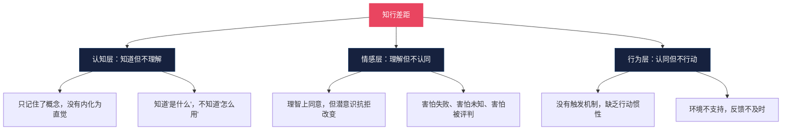
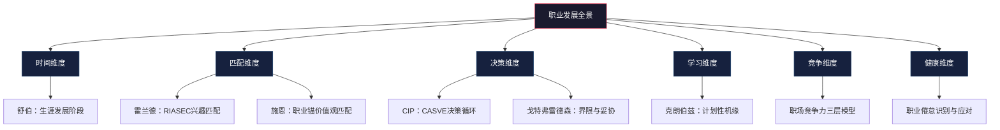
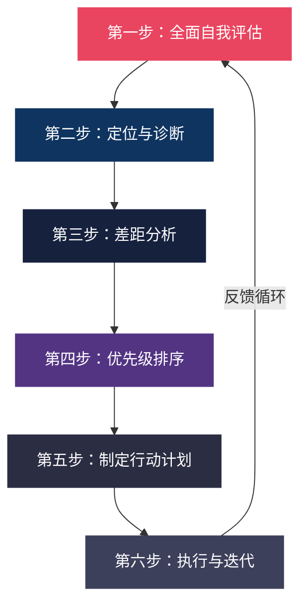
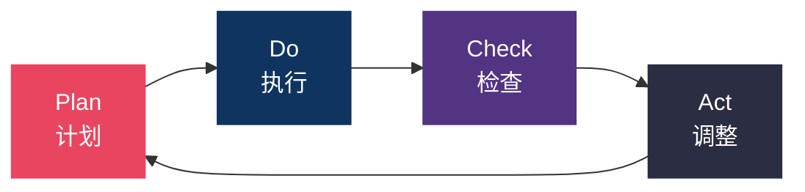
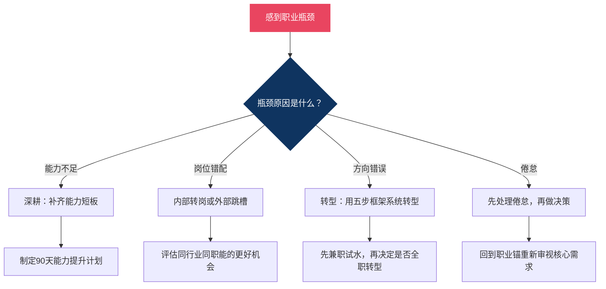
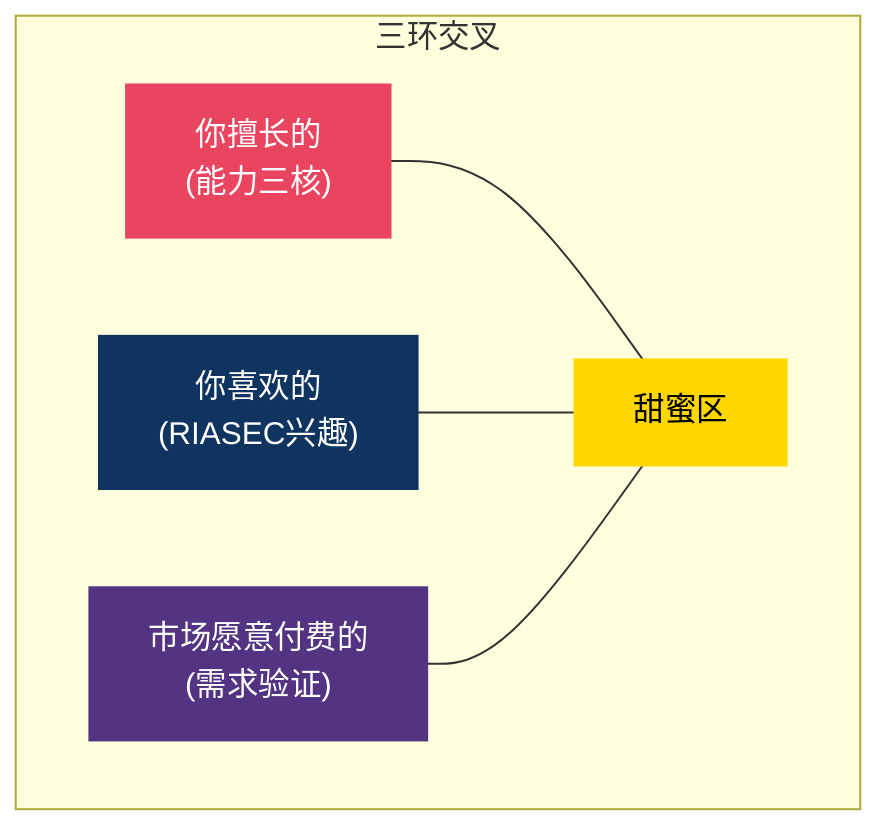
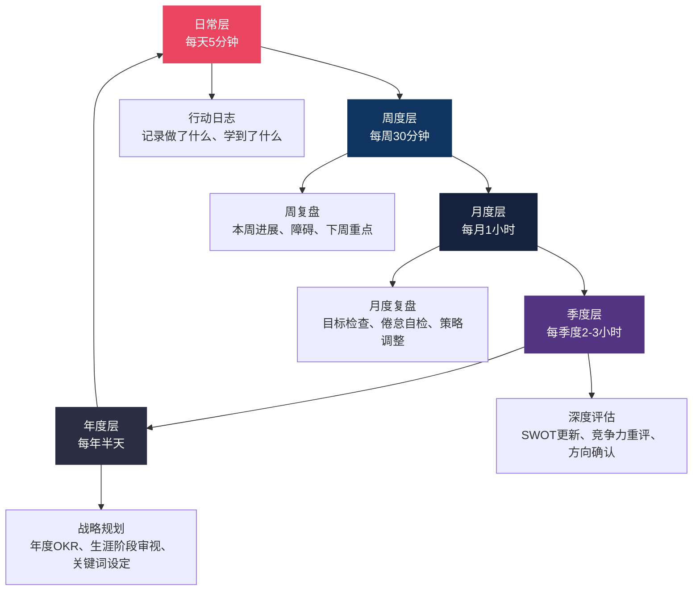
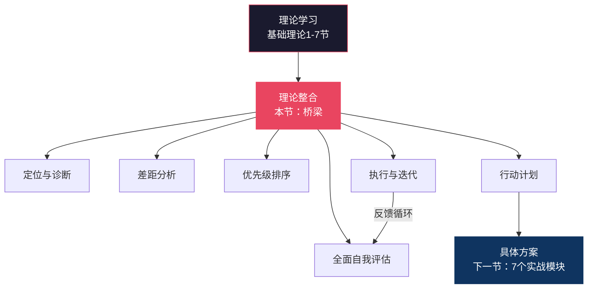

## 八、从理论到实践的桥梁

前面七节系统介绍了职业发展的理论体系——从舒伯的生涯发展阶段到霍兰德的兴趣匹配，从施恩的职业锚到克朗伯兹的计划性机缘，从SWOT分析到CASVE决策循环，从职场竞争力模型到职业倦怠应对。这些理论构成了一个完整的认知框架，帮你理解"职业发展是怎么回事"。

但理论本身不产生价值。一个熟读所有职业发展理论的人，如果从未将任何一个理论付诸行动，他的职业处境不会有任何改变。本节的核心任务是：**把散落的理论珠子串成一条可执行的项链**，提供一套系统化的方法，让你把"我知道"变成"我在做"。

### 为什么"理论→实践"的转化如此困难

在进入方法论之前，先理解一个事实：从知道到做到之间存在系统性的障碍，这不是你个人的问题，而是人类认知和行为的普遍规律。

**知行差距的三层根源：**



| 障碍类型 | 典型表现 | 本质原因 | 解决方向 |
|---------|---------|---------|---------|
| 认知模糊 | "霍兰德六种类型我都记不全" | 信息编码不深，停留在短期记忆 | 通过实操加深理解，用自己的话复述 |
| 情感抗拒 | "我知道该转型，但就是迈不出那步" | 损失厌恶——害怕失去现有的确定性 | 降低试错成本，用"小实验"替代"大决策" |
| 行为惯性 | "每天都说要行动，每天都在拖延" | 缺乏触发点和执行环境 | 设计触发机制，改造执行环境 |
| 反馈缺失 | "做了但不知道有没有用" | 结果滞后，无法即时验证 | 建立可衡量的中间指标 |
| 环境阻力 | "想学新东西但身边人都在混" | 社会比较和同伴压力 | 主动构建支持性环境 |

**认知科学视角：为什么大脑天然抗拒"知行合一"**

诺贝尔经济学奖得主丹尼尔·卡尼曼在《思考，快与慢》中提出的"双系统理论"可以精确解释知行差距的生理基础：

- **系统1（快思考）**：自动化、无意识、低能耗。你的日常职业行为——打开电脑先刷社交媒体、遇到困难任务先拖延、开会时保持沉默——都是系统1在驱动。系统1喜欢确定性和舒适区。
- **系统2（慢思考）**：有意识、高能耗、需要努力。制定职业规划、学习新技能、主动拓展人脉——这些都是系统2的任务。系统2需要主动调用，而大脑天生倾向于节省能量。

当你读完一节职业发展理论时，信息进入了系统2——你理解了、认同了、甚至记住了。但当你要把理论付诸行动时，需要的是系统1的自动化执行——而这恰恰是理论没有训练过的。这就是为什么"知道"和"做到"之间存在鸿沟：知道是系统2的事，做到需要系统1的配合。

**习惯回路理论（查尔斯·杜希格，《习惯的力量》）揭示了破解之道：**

每个习惯都由三个要素组成——触发信号（Cue）→ 行动程序（Routine）→ 奖励反馈（Reward）。如果你只是"知道"了一个理论但没有建立对应的习惯回路，这个知识就不会自动转化为行为。

**实操：用习惯回路嵌入理论**

以"每周做一次复盘"为例，设计习惯回路：

| 要素 | 设计 | 原因 |
|------|------|------|
| 触发信号 | 每周五下午5:00的手机闹钟 + 关闭工作电脑的动作 | 时间+行为双触发，比单一触发更可靠 |
| 行动程序 | 打开复盘模板，花15分钟填写本周四个问题 | 程序具体到"打开什么→写什么"，消除决策成本 |
| 奖励反馈 | 填完后允许自己喝一杯喜欢的饮料，或在日历上画一个✓ | 即时奖励弥补了职业发展反馈的滞后性 |

理解了这些障碍和机制，你就会明白：本节提供的不只是"步骤"，而是一套包含认知重构、情感准备、行为设计、反馈机制、环境改造的完整系统。

---

### 8.1 理论整合：为什么单一理论不够用

任何单一职业发展理论都只能解释职业发展的某个侧面。这就像只用一把尺子测量一个复杂的三维物体——你得到的数据永远是片面的。

**六大理论的互补关系：**



**举一个具体例子：** 假设你正在考虑从技术岗位转到产品经理。

| 你问的问题 | 需要调用的理论 | 回答的内容 |
|-----------|--------------|-----------|
| 我现在处于职业发展的什么阶段？ | 舒伯生涯理论 | 判断你是在探索期、建立期还是转型期，不同阶段的转型策略完全不同 |
| 我的兴趣类型适合做产品吗？ | 霍兰德RIASEC | 对比技术岗和产品岗的兴趣匹配度，判断是真正兴趣还是逃避现状 |
| 产品经理能满足我的核心需求吗？ | 施恩职业锚 | 如果你的职业锚是"技术/职能型"，转管理可能带来长期不满 |
| 我该怎么系统地做出这个决策？ | CASVE决策循环 | 五步法帮你避免冲动决策，确保考虑了所有关键因素 |
| 转型过程中会遇到什么障碍？ | 戈特弗雷德森界限理论 | 识别你可能自我设限的地方，比如"我学文科的做不了产品" |
| 怎么为这次转型创造机会？ | 克朗伯兹计划性机缘 | 主动制造"偶然"机会，比如参加产品社群、接产品相关的副业项目 |
| 我现在的能力储备够吗？ | 职场竞争力模型+能力三核 | 诊断差距，制定有针对性的能力提升计划 |
| 转型期间如何保持状态？ | 职业倦怠理论 | 识别转型期特有的压力信号，防止在焦虑中做出错误决策 |

**核心洞察：** 理论的价值不在于单独使用，而在于组合使用。当你面对一个具体的职业问题时，需要从多个理论角度审视它，就像医生诊断疾病需要结合多种检查手段一样——验血、影像、问诊各提供不同维度的信息，综合起来才能做出准确诊断。

**理论组合的三个层次：**

1. **单点调用**：遇到具体问题时，直接调用最相关的理论。例如"不知道选什么工作"→霍兰德。适合处理简单、明确的问题。
2. **多点交叉**：用2-3个理论从不同角度审视同一个问题。例如"该不该跳槽"同时用SWOT（现状评估）、职业锚（需求验证）、竞争力模型（市场价值评估）。适合处理中等复杂度的决策。
3. **系统整合**：用本节的六步框架，将所有相关理论编织成一个完整的行动方案。适合处理重大职业转折点（转行、创业、人生规划）。

大多数日常职业问题用"单点调用"就够了；重大决策用"多点交叉"；人生转折点用"系统整合"。不要每件事都启动完整框架，那会导致过度分析。

---

### 8.2 理论工具全景对照表

下表是本章所有理论和工具的速查手册，帮你快速定位"遇到什么问题该用什么工具"：

| 理论/工具 | 回答的核心问题 | 最佳使用时机 | 输入（你需要准备什么） | 输出（你得到什么） |
|----------|--------------|------------|-------------------|----------------|
| 舒伯生涯发展理论 | 我处于职业发展的哪个阶段？ | 年度规划、人生重大节点、感到迷茫时 | 你的年龄、工作年限、当前角色 | 阶段定位、当前发展任务、下一阶段准备事项 |
| 霍兰德RIASEC | 什么类型的工作最适合我？ | 职业选择、方向探索、考虑转行时 | 对六种活动类型的偏好判断 | 三字母代码、匹配职业清单、兴趣-职业差距分析 |
| 施恩职业锚 | 我在职业中最看重什么？ | 职业决策、价值观澄清、选择offer时 | 回顾过往职业决策的驱动因素 | 主导职业锚类型、核心需求清单、决策过滤器 |
| 克朗伯兹计划性机缘 | 如何为意外机会做好准备？ | 感到职业停滞、希望拓宽可能性时 | 你的好奇心领域、愿意尝试的新事物 | 机缘行动计划、新探索清单、学习经验记录 |
| SWOT分析 | 我的现状如何？有哪些策略？ | 定期审视（建议每季度一次）、重大决策前 | 对自身优劣势和外部机会威胁的诚实评估 | 四象限矩阵、SO/WO/ST/WT四类策略 |
| 个人商业画布 | 我的职业模式是否健康？ | 年度审视、考虑转型、收入结构调整时 | 九个维度的现状填写 | 职业模式全景图、薄弱环节识别、优化方向 |
| 能力三核 | 我的能力结构是否合理？ | 制定学习计划、准备晋升、简历优化时 | 你的知识、技能、才干清单 | 能力结构图、短板识别、学习优先级 |
| 职场竞争力模型 | 我的核心竞争力是什么？ | 差距分析、薪资谈判、评估市场价值时 | 你的三层竞争力自评 | 竞争力定位、提升路径、时间投入规划 |
| CASVE决策循环 | 如何系统地做出职业决策？ | 面临重大职业选择时 | 你面临的具体职业问题 | 结构化决策过程、选项评估、行动计划 |
| 职业转型框架 | 如何安全地实现职业转型？ | 考虑转行、转岗、转变工作模式时 | 转型目标、现有资源、风险承受力 | 转型路线图、风险评估、过渡计划 |
| 职业倦怠评估 | 我是否处于倦怠状态？ | 定期自检（建议每月一次）、状态异常时 | 你的情绪、行为、认知状态 | 倦怠程度评估、成因分析、应对策略 |
| 戈特弗雷德森界限理论 | 我在哪些地方自我设限了？ | 感到"不可能"、"我做不到"时 | 你认为自己不适合或做不了的事 | 可渗透的界限清单、限制性信念识别 |

**使用建议：** 把这张表打印出来或存在手机备忘录里。当你感到困惑或面临决策时，先看表找到对应的工具，然后按工具的要求输入信息、获取输出。工具是为人服务的，不要被工具绑架——如果你觉得某个工具对你的具体情况不适用，大胆跳过它。

---

### 8.3 六步实操框架：从理论到行动的完整路径

理论不会自动变成行动。你需要一个结构化的"翻译"过程。以下是将本章所有理论整合为个人行动方案的六步框架：



#### 第一步：全面自我评估（用时：2-3小时）

这是整个流程的地基。你需要用三个工具从不同角度认识自己，形成立体的自我认知。

**工具一：霍兰德RIASEC自测**

不需要去做正式的心理测试（虽然也可以），关键是理解六种类型的本质，然后诚实地评估自己的偏好：

| 类型 | 核心特征 | 典型活动 | 自问 |
|------|---------|---------|------|
| R-现实型 | 动手操作、解决具体问题 | 编程、维修、实验、户外工作 | 我是否享受用双手或工具创造东西？ |
| I-研究型 | 分析、探索、求知 | 数据分析、科学研究、战略思考 | 我是否经常追问"为什么"并享受找到答案的过程？ |
| A-艺术型 | 创造、表达、创新 | 设计、写作、音乐、创意策划 | 我是否在创意表达中获得最大满足感？ |
| S-社会型 | 帮助、教导、服务他人 | 教学、咨询、HR、社工 | 我是否在帮助他人成长时感到最有价值？ |
| E-企业型 | 领导、说服、组织 | 管理、销售、创业、谈判 | 我是否享受影响他人和推动事情发生？ |
| C-常规型 | 组织、规范、精确执行 | 财务、审计、项目管理、流程优化 | 我是否在有序和精确中感到安心？ |

**实操：** 写下你工作和生活中最喜欢的5件事和最讨厌的5件事，然后分别标注它们属于哪种RIASEC类型。出现频率最高的2-3个类型就是你的核心代码。

**更精确的判断方法：** 除了"喜欢/讨厌"，还可以从三个信号交叉验证：

1. **心流信号**：做哪些事情时你会忘记时间？心流状态出现的场景往往指向你的核心兴趣类型。
2. **自发信号**：空闲时间你主动选择做什么？不需要别人安排、不需要外部激励就去做的事情，最能反映真实兴趣。
3. **学习信号**：你愿意在哪些领域主动投入学习时间？注意是"愿意"而不是"需要"——被迫学的不算。

当三个信号指向同一类型时，你可以非常确信那就是你的核心兴趣。当信号矛盾时，可能意味着你处于兴趣探索阶段，或者不同生活领域激活了不同的兴趣类型。

**工具二：施恩职业锚自评**

职业锚不是你"想成为什么"，而是你"在职业选择中反复表现出来的核心驱动"。回顾你过去所有重要的职业决策（包括选择专业、选择公司、拒绝offer、离职原因），找出反复出现的模式：

| 职业锚 | 核心驱动力 | 自问 |
|--------|----------|------|
| 技术/职能型 | 在专业领域做到极致 | "如果晋升意味着离开技术一线，我愿意吗？" |
| 管理型 | 统筹资源、带领团队达成目标 | "我是否天然地在团队中承担领导角色？" |
| 自主/独立型 | 按自己的方式工作，不受约束 | "被严格管控的工作环境是否让我窒息？" |
| 安全/稳定型 | 可预测的职业路径和稳定的收入 | "我是否优先考虑稳定而非高薪？" |
| 创业/创造型 | 从零到一创造新事物 | "我是否经常有'我要自己做一个'的冲动？" |
| 服务/奉献型 | 通过工作实现某种价值观或使命 | "工作的意义感是否比薪资更重要？" |
| 挑战型 | 不断征服困难和难题 | "我是否在解决棘手问题时最兴奋？" |
| 生活方式型 | 工作与生活的平衡 | "我是否愿意为了生活质量放弃更高的职位？" |

**实操：** 对八个职业锚按1-10打分。得分最高的1-2个是你的主导职业锚。注意：不是你"希望自己是"哪种，而是你"事实上是"哪种——用过去的决策验证，而不是用愿望打分。

**职业锚的"决策回溯法"：** 如果你不确定自己的职业锚，试试这个方法——列出你人生中所有重要的职业相关决策（至少5个），包括：

- 选择大学专业时，你为什么选了这个而不是那个？
- 第一份工作你为什么选了这家公司？为什么离开？
- 你拒绝过哪些机会？为什么拒绝？
- 你在工作中最愤怒/最委屈的时刻是什么？（被压抑的职业锚往往通过负面情绪暴露）
- 你在工作中最有成就感的时刻是什么？

把这些决策和事件放在一起，寻找反复出现的驱动力。那个驱动力就是你的职业锚。

**工具三：SWOT全景扫描**

用SWOT分析建立对自己职业现状的全局认知。关键是要诚实、具体、有证据支撑：

┌─────────────────────────────┬─────────────────────────────┐
│       S-优势                │       W-劣势                │
│       (内部积极因素)         │       (内部消极因素)         │
│                             │                             │
│  1. _____                   │  1. _____                   │
│  证据：_____                │  证据：_____                │
│  2. _____                   │  2. _____                   │
│  证据：_____                │  证据：_____                │
│  3. _____                   │  3. _____                   │
│  证据：_____                │  证据：_____                │
├─────────────────────────────┼─────────────────────────────┤
│       O-机会                │       T-威胁                │
│       (外部积极因素)         │       (外部消极因素)         │
│                             │                             │
│  1. _____                   │  1. _____                   │
│  来源：_____                │  来源：_____                │
│  2. _____                   │  2. _____                   │
│  来源：_____                │  来源：_____                │
│  3. _____                   │  3. _____                   │
│  来源：_____                │  来源：_____                │
└─────────────────────────────┴─────────────────────────────┘

**SWOT的"证据链"原则：** 每一条优势、劣势、机会、威胁都必须附带具体证据。不是"我沟通能力强"，而是"我在XX项目中负责跨部门协调，成功推动了三个部门在两周内达成共识（证据：项目总结、领导评价）"。没有证据的自评只是自我感觉，不是真正的自我认知。

**常见错误：**

| 错误类型 | 错误示例 | 正确做法 |
|---------|---------|---------|
| 把态度当优势 | "我工作很努力" | 态度不是优势，能力才是。改为："我能在48小时内完成通常需要一周的报告" |
| 把门槛当优势 | "我是985硕士" | 如果同岗位人人都是985硕士，这不算优势。改为："我在XX领域发表了3篇论文" |
| 忽略威胁 | 只看到机会看不到风险 | 行业政策变化、技术替代风险、竞争对手动态都要纳入 |
| 范围太大 | "中国互联网行业在增长" | 缩小到"我所在的城市+细分领域+岗位级别的供需情况" |
| 静态分析 | 只看当前，不看趋势 | 优势可能变成劣势（"我精通jQuery"在前端已不是优势），威胁可能变成机会 |

**额外工具：个人能力清单（能力三核的前置步骤）**

在进入第二步之前，花30分钟列一张完整的个人能力清单。这张清单是后续差距分析的基础：

【知识层】我知道什么？
  领域1：_____（深度：入门/熟练/精通/专家）
  领域2：_____（深度：入门/熟练/精通/专家）
  领域3：_____（深度：入门/熟练/精通/专家）

【技能层】我能做什么？
  硬技能1：_____（水平：能做/做得好/做得又快又好/能教别人）
  硬技能2：_____（水平：能做/做得好/做得又快又好/能教别人）
  软技能1：_____（水平：偶尔做到/稳定做到/能在压力下做到/能帮助别人做到）
  软技能2：_____（水平：偶尔做到/稳定做到/能在压力下做到/能帮助别人做到）

【才干层】我自然而然会怎样？
  思维模式：_____（例如：总能找到简化流程的方法）
  行为模式：_____（例如：自然地成为团队中的协调者）
  情感模式：_____（例如：在混乱中保持冷静）

#### 第二步：定位与诊断（用时：1-2小时）

有了自我评估的数据后，你需要用舒伯的生涯发展理论和职场竞争力模型进行定位。

**生涯阶段定位：**

根据舒伯的理论，不同阶段的核心任务不同。先确认你当前处于哪个阶段，再判断你是否在按该阶段的节奏发展：

| 阶段 | 年龄范围 | 核心任务 | 关键问题 | 没完成任务的后果 |
|------|---------|---------|---------|---------------|
| 探索期 | 15-24岁 | 广泛尝试、缩小范围 | "我对什么感兴趣？我擅长什么？" | 后期频繁跳槽、方向迷茫 |
| 建立期-尝试 | 25-34岁 | 在选定领域站稳脚跟 | "这个方向适合我吗？我要不要调整？" | 35岁还没形成核心竞争力 |
| 建立期-稳定 | 35-44岁 | 深耕专业、积累优势 | "我如何在领域内建立不可替代性？" | 被年轻人追上，中年危机提前 |
| 维持期 | 45-64岁 | 保持竞争力、传授经验 | "我如何保持价值输出？如何培养后辈？" | 过早被边缘化 |
| 衰退期 | 65岁+ | 角色转换、价值传承 | "我如何把积累的经验转化为新的价值形式？" | 退休后失去价值感和社交网络 |

**注意：** 年龄只是参考，实际阶段取决于你的职业经历。一个30岁转行的人，在新领域处于"探索期"；一个28岁已经带队的人，在管理维度处于"建立期"。很多人同时在不同维度处于不同阶段——你在技术维度可能是"建立期-稳定"，但在管理维度可能是"探索期"。

**2020年代的阶段重定义：** 舒伯的理论诞生于20世纪中叶，当时的职业路径相对线性——毕业→入职→晋升→退休。当今职场的特征是：远程工作降低了地理限制、AI正在重塑多个行业的核心技能需求、零工经济和斜杠职业打破了"一人一岗"的范式、终身雇佣制已基本消亡。这意味着：

- **探索期可能贯穿整个职业生涯**：不是探索一次就定终身，每隔5-8年可能需要重新探索
- **建立期的"稳定"定义在变化**：不是在一家公司做到退休，而是在一个领域建立持续的价值输出能力
- **"衰退期"可以被重新定义**：退休不是终点，而是角色转换——从全职工作转为顾问、导师、自由职业者

**自我诊断清单：**

对照你当前阶段的核心任务，逐条检查：

- [ ] 我清楚自己当前阶段的核心发展任务是什么
- [ ] 我正在有意识地完成这个阶段的任务（而不是被动地"过日子"）
- [ ] 我为下一阶段的过渡做了准备（或至少意识到了需要准备什么）
- [ ] 我的节奏和同阶段的优秀从业者大致相当（不过快也不过慢）
- [ ] 我没有在重复上一阶段的任务（例如35岁还在做探索期该做的事）

如果有3项以上未勾选，说明你在生涯发展节奏上存在滞后，需要在后续步骤中重点调整。

**竞争力诊断：**

用职场竞争力三层模型评估你目前的竞争力水平：

| 层级 | 内容 | 评估标准 | 你的自评 |
|------|------|---------|---------|
| 第一层：基础竞争力 | 学历、证书、基本技能 | 是否达到岗位的"门槛要求"？ | □达标 □不足 |
| 第二层：专业竞争力 | 行业经验、专业深度、项目成果 | 你在同岗位中处于什么水平？ | □前20% □中上 □中等 □偏下 |
| 第三层：核心竞争力 | 能力组合、个人品牌、思维方式 | 你有什么是别人难以复制的？ | □清晰 □模糊 □没有 |

**如何获取客观反馈：**

自评最大的问题是盲区——你不知道自己不知道什么。用以下方法交叉验证：

1. **信任的人反馈**：找3-5个了解你工作的人（同事、领导、合作伙伴），问两个问题："你觉得我最强的能力是什么？"和"你觉得我最大的提升空间在哪里？"
2. **市场反馈**：在招聘网站搜索你的目标岗位，逐条对比岗位要求。缺什么、有什么，一目了然。
3. **成果反馈**：过去一年你产出了什么具体成果？成果是最好的竞争力证明——没有成果支撑的"能力"只是自我想象。
4. **数据反馈**：如果你的工作有可量化的指标（代码提交量、销售额、客户满意度分数、项目交付准时率），用数据说话比自我感觉可靠得多。

**"电梯测试"练习：** 想象你在电梯里遇到一个理想的雇主/客户，只有30秒的时间介绍自己。你能清晰地说出"我是谁、我做什么、我有什么独特价值"吗？如果你说不出一个简洁有力的个人价值陈述（Personal Value Proposition），说明你对自己的竞争力认知还不够清晰。试着写一句话：**"我帮助[目标群体]解决[核心问题]，通过[独特方法/能力]，实现[具体价值/成果]。"**

#### 第三步：差距分析（用时：1小时）

差距分析的核心公式：

**差距 = 目标状态 - 当前状态**

用能力三核模型拆解差距的三个层面：

| 能力层面 | 定义 | 差距分析方法 | 提升难度 | 典型提升周期 |
|---------|------|------------|---------|------------|
| 知识（Knowledge） | 你知道的信息和理论 | 你是否掌握了目标岗位/领域所需的专业知识？ | 低——可以通过学习快速补充 | 1-3个月 |
| 技能（Skill） | 你能做到的操作和行为 | 你是否具备目标岗位/领域所需的核心技能？ | 中——需要刻意练习和实践 | 3-12个月 |
| 才干（Talent） | 你下意识的思维和行为模式 | 你的才干是否与目标岗位/领域匹配？ | 高——才干难以培养，但可以找到发挥才干的正确位置 | 难以量化，重在匹配 |

**实操：** 拿出一张纸，分三列写下：

目标岗位/领域需要的          我目前拥有的          差距
──────────────────          ─────────────          ────
知识：
  1. _____                    1. _____              _____
  2. _____                    2. _____              _____

技能：
  1. _____                    1. _____              _____
  2. _____                    2. _____              _____

才干：
  1. _____                    1. _____              _____
  2. _____                    2. _____              _____

**差距分析的"三层追问法"：**

对于每一项差距，追问三个问题：

1. **这个差距真实存在吗？** 也许你以为需要某个证书，但其实你的经验已经替代了证书的信号功能。
2. **这个差距重要吗？** 也许你的英语口语确实不如海归同事，但如果你的工作95%用中文完成，这个差距的影响很小。
3. **这个差距可弥补吗？** 有些差距是可以通过学习弥补的（知识差距），有些需要时间积累（技能差距），有些可能根本无法弥补但可以绕过（才干不匹配→换个匹配的岗位）。

不要试图弥补所有差距。找到那些"真实存在、影响重大、可被弥补"的差距，集中精力攻克它们。

**差距分类矩阵：**

| | 可弥补 | 难弥补 |
|--|-------|-------|
| **影响大** | **优先攻克**：投入时间学习/练习，这是最高ROI的投入 | **策略绕过**：找搭档互补、换赛道、调整目标 |
| **影响小** | **顺手提升**：在做其他事的过程中附带提升 | **接受现状**：承认这是你的短板，把精力放在更有价值的地方 |

**AI时代的能力差距特殊考量：** 2020年代，能力差距的分析必须加入一个新维度——"AI可替代性"。如果你的核心差距恰好是AI正在快速掌握的领域（如基础文案写作、简单数据分析、初级代码编写），那么弥补这个差距的优先级可能需要重新评估。与其花6个月提升一个即将被AI大幅降低门槛的技能，不如花同样的时间掌握"与AI协作"的能力——这才是真正难以被替代的竞争力。

#### 第四步：优先级排序（用时：30分钟）

不是所有差距都需要同时弥补。你需要一个排序框架来决定先做什么。

**影响度×紧迫度矩阵：**

| | 高紧迫 | 低紧迫 |
|--|--------|--------|
| **高影响** | **立即行动**：这些是你的当务之急。例如：即将面试却不会STAR法则、即将到期的证书考试 | **重点规划**：这些决定了你的长期发展。例如：建立个人品牌、培养领导力、拓展行业人脉 |
| **低影响** | **快速处理**：花最少时间解决，不值得投入大量精力。例如：更新LinkedIn头像、回复非关键邮件 | **暂不投入**：当前阶段不需要关注。例如：学一门与当前方向无关的技能 |

**排序原则：**

1. **基础先于进阶**：如果基础竞争力不达标（学历、证书、基本技能），先补基础，不要急着追求核心竞争力。地基不牢的大厦会塌。
2. **能力先于机会**：先把能力提升到位，再去找机会。没有能力的机会是陷阱——你接不住，反而会暴露短板。
3. **可迁移优先**：优先发展在多个岗位和行业都有价值的能力（沟通、项目管理、数据分析、结构化思维），而非过度专精某一狭窄领域。可迁移能力是职业安全网的核心组成部分。
4. **70%原则**：当某个能力达到70%的水平时，就可以开始行动了。等达到100%再行动，你可能已经错过了最佳时机。职场不是考试，没有"满分"这回事——很多能力只有在实践中才能真正提升。
5. **瓶颈优先**：找到制约你整体发展的最大瓶颈，优先突破它。木桶效应在职业发展的早期阶段是成立的——最短的那块板决定了你能装多少水。但到了中后期，长板理论更适用——你最强的那个能力决定了你的高度。

**优先级排序实操模板：**

我的差距清单（按优先级排序）：

P0 - 立即行动（本周内开始）：
  1. _____ → 具体行动：_____ → 预计完成：_____
  2. _____ → 具体行动：_____ → 预计完成：_____

P1 - 重点规划（本月内启动）：
  1. _____ → 计划方案：_____ → 里程碑：_____
  2. _____ → 计划方案：_____ → 里程碑：_____

P2 - 持续关注（本季度内推进）：
  1. _____ → 方向性计划：_____

P3 - 暂时搁置：
  1. _____ → 搁置原因：_____ → 重新评估时间：_____

#### 第五步：制定行动计划（用时：1-2小时）

这是整个流程中最关键的一步——把差距转化为可执行的行动。

**个人商业画布法：**

用个人商业画布的九个维度审视你的职业模式，确保行动计划覆盖所有关键环节：

| 维度 | 核心问题 | 行动计划示例 |
|------|---------|------------|
| 核心资源 | 我有什么？（能力、经验、人脉、资金） | 列出你的核心资源清单，标注哪些需要升级 |
| 关键活动 | 我需要做什么？ | 按优先级列出3-5个关键行动项 |
| 价值主张 | 我为谁提供什么价值？ | 用一句话定义你的职业价值主张 |
| 客户服务 | 我为谁服务？（雇主、客户、用户） | 明确你的"职业客户"是谁，他们最看重什么 |
| 渠道通路 | 我如何被发现？ | 梳理你的曝光渠道：简历投递、社交网络、行业活动 |
| 客户关系 | 我如何维护关系？ | 制定人脉维护计划：每月至少与5个关键人脉互动 |
| 收入来源 | 我获得什么回报？ | 薪资、成长机会、成就感——三者是否平衡？ |
| 成本结构 | 我付出什么代价？ | 时间、精力、机会成本——是否在可承受范围内？ |
| 重要合作 | 谁是我的盟友？ | 识别能帮你加速发展的导师、伙伴、社群 |

**个人商业画布的填写技巧：**

- **核心资源**不要只列硬技能。人脉、信誉、个人品牌、行业认知、失败经验都是资源。一个在行业里工作10年的人，最大的资源可能不是专业技能，而是"知道这个行业的坑在哪里"。
- **价值主张**要从"客户"角度写，不是从你的角度。不是"我会Python"，而是"我能帮公司把数据处理时间从3天缩短到3小时"。
- **渠道通路**要具体到可执行。不是"社交网络"，而是"每周在XX平台发一篇行业分析文章"或"每月参加一次XX行业的线下meetup"。
- **成本结构**要诚实评估机会成本。每个选择都意味着放弃其他选择——选择加班提升技能，意味着放弃陪伴家人的时间。把成本想清楚，才能做出不后悔的决策。

**行动计划模板：**

```markdown
## 我的职业发展行动计划

### 30天目标（立即见效）
1. [ ] _______________
   - 具体步骤：_______
   - 完成标准：_______
   - 每日投入：_______
   - 可能障碍：_______
   - 应对方案：_______

### 90天目标（能力提升）
1. [ ] _______________
   - 具体步骤：_______
   - 完成标准：_______
   - 每周投入：_______
   - 阶段里程碑（30天/60天/90天）：_______
   - 验证方式：_______

### 1年目标（战略方向）
1. [ ] _______________
   - 具体步骤：_______
   - 里程碑：_______
   - 检查频率：_______
   - 退出条件（什么情况下放弃这个目标）：_______
```

**行动计划的"SMART+可视化"原则：**

每个目标都必须满足SMART原则——具体的（Specific）、可衡量的（Measurable）、可实现的（Achievable）、相关的（Relevant）、有时限的（Time-bound）。在此基础上增加一条：**可视化**——把目标放在你每天能看到的地方（手机壁纸、桌面便签、镜子旁），让目标成为日常环境的一部分。

**对比两个行动计划的质量：**

| 维度 | 低质量计划 | 高质量计划 |
|------|----------|----------|
| 具体性 | "提升沟通能力" | "每周主动做一次会议纪要并分享给参会者，连续4周后请3位同事评价改进程度" |
| 可衡量 | "学习数据分析" | "在Kaggle上完成3个入门级数据分析项目，获得至少一个铜牌" |
| 有障碍预案 | "每天学英语1小时" | "每天早起30分钟学英语（如果加班则改为通勤时间听播客，周末补上）" |
| 有验证方式 | "考一个PMP证书" | "考PMP证书，然后在下一个项目中应用至少3个PMP方法论中的工具" |

**"实施意图"技术（彼得·戈尔维策，NYU心理学教授）：** 行为科学反复验证的一个发现是：把计划转化为"如果…那么…"（If-Then）格式，执行率提升2-3倍。不是"我要多拓展人脉"，而是"如果我在朋友圈看到行业活动信息，那么我立刻报名并标记到日历"。不是"我要学习新技能"，而是"如果现在是工作日晚上8点，那么我打开学习平台学30分钟"。实施意图的本质是预设决策——把需要系统2思考的决策提前交给系统1自动执行。

#### 第六步：执行与迭代（持续进行）

行动计划制定好之后，进入执行阶段。关键是建立反馈循环：

**PDCA循环在职业发展中的应用：**



| 阶段 | 频率 | 具体动作 |
|------|------|---------|
| Plan | 每月初 | 回顾上月行动结果，制定本月计划，调整优先级 |
| Do | 每日/每周 | 按计划执行，记录关键行动和结果 |
| Check | 每两周 | 检查进度：目标完成了多少？遇到了什么障碍？ |
| Act | 每月末 | 根据检查结果调整策略：继续、修正、或放弃 |

**关键原则：** 记录 > 回忆。每次行动后花5分钟记录：做了什么、结果如何、学到了什么。三个月后回顾这些记录，你会惊讶于自己的成长轨迹——或者发现自己一直在原地踏步。两种结果都有价值——后者说明你的方法需要根本性调整。

**行动日志模板（每日5分钟）：**

日期：_____
今天为职业发展做了什么？
  → _____

结果如何？
  → _____

学到了什么？
  → _____

明天要继续/调整什么？
  → _____

状态自评（1-10）：_____

**执行中的三个关键支撑：**

1. **触发机制设计**：不要依赖意志力。把行动绑定到已有的习惯上——例如"每天午饭后花15分钟学习行业文章"（午饭是触发点）、"每周五下班前花30分钟写周复盘"（周五下班是触发点）。行为心理学研究表明，有明确触发机制的习惯，坚持率是纯靠意志力的3倍。

2. **问责系统建立**：找一个同样在做职业规划的朋友，互相分享计划、互相检查进度。有人在等你的结果，你就更不容易拖延。如果找不到合适的伙伴，可以在社交媒体上公开你的30天目标——公众承诺的力量远大于私下决心。

3. **环境改造**：如果你想每天学英语，就在手机主屏放英语学习App而不是游戏；如果你想拓展人脉，就把行业活动的日程提前标记在日历里。环境设计的原理是：让正确的行为变得容易，让错误的行为变得困难。

**里程碑检验清单：** 执行不是闷头做事，需要在关键节点停下来检验方向是否正确。

| 时间点 | 检验问题 | 通过标准 | 未通过的应对 |
|--------|---------|---------|------------|
| 7天后 | 我是否已经开始行动？ | 至少完成了一个P0项的第一步 | 分析阻碍：是计划太模糊？环境不合适？还是动机不足？ |
| 30天后 | 行动是否产生了可观察的变化？ | 至少有一个可衡量的进步指标 | 检查计划：目标是否合理？方法是否有效？需要调整还是坚持？ |
| 90天后 | 我的能力或处境是否实质改善？ | 至少一个核心竞争力指标提升了一档 | 深度复盘：方向对吗？投入够吗？需要外部帮助吗？ |
| 6个月后 | 行动计划的整体目标是否在推进？ | 核心目标完成率超过50% | 战略审视：是否需要重新做一次完整的六步评估？ |

---

### 8.4 七个典型场景的理论整合实战

理论的价值在具体场景中才能体现。以下是七个常见职业场景，演示如何组合调用多个理论解决问题。

#### 场景一：应届生面临多个offer不知道怎么选

**涉及理论：** 霍兰德RIASEC + 施恩职业锚 + CASVE决策循环 + 个人商业画布

**操作流程：**

1. **用CASVE的Communication阶段**：明确你面临的决策问题——不是"哪个offer工资高"，而是"哪个offer最符合我的长期职业发展"
2. **用霍兰德RIASEC**：评估每个offer的工作内容与你的兴趣类型的匹配度。一个高薪但每天做你讨厌的事情的工作，长期来看会消耗你
3. **用施恩职业锚**：判断哪个offer最能满足你的核心需求。如果你是"自主/独立型"，一个严格打卡、层层审批的公司会让你痛苦，即使薪资再高
4. **用个人商业画布**：从九个维度评估每个offer——不只是薪资（收入来源），还包括成长机会（关键活动）、人脉积累（重要合作）、曝光渠道（渠道通路）
5. **用CASVE的Valuing阶段**：给每个选项打分，加权计算，做出最终决策

**offer评估矩阵示例：**

| 评估维度 | 权重 | Offer A | Offer B | Offer C |
|---------|------|---------|---------|---------|
| 薪资福利 | 15% | 8分 | 9分 | 7分 |
| 兴趣匹配度 | 20% | 6分 | 8分 | 9分 |
| 成长空间 | 25% | 9分 | 7分 | 6分 |
| 职业锚满足度 | 20% | 7分 | 6分 | 8分 |
| 团队/文化 | 10% | 8分 | 5分 | 7分 |
| 工作生活平衡 | 10% | 5分 | 7分 | 9分 |
| **加权总分** | 100% | **7.35** | **7.05** | **7.35** |

注意：当总分接近时，看"兴趣匹配度"和"成长空间"这两个维度——它们是长期回报最高的因素。

**常见陷阱：** 被起薪蒙蔽。起薪差距在5年后的职业轨迹面前微不足道。一个起薪低但成长快的平台，长期回报远超起薪高但天花板低的平台。举个具体数字：假设Offer A月薪8000但年均涨薪30%（快速成长公司），Offer B月薪12000但年均涨薪10%（稳定大公司），3年后A的月薪是17576，B的月薪是15972；5年后A是29411，B是19326。成长速度的复利效应远超起步差距。

**"反向面试"技巧：** 在做offer决策之前，对每家公司做一次"反向面试"——不是公司面试你，是你面试公司。核心问题包括：你未来的直属领导是什么风格？团队中最近一个人离职的原因是什么？公司对这个岗位的6个月期望是什么？这些问题的答案比JD上的描述更能反映真实的工作体验。

#### 场景二：工作3-5年感到瓶颈，不知道该深耕还是转型

**涉及理论：** 舒伯生涯理论 + 职场竞争力模型 + 能力三核 + 职业转型框架

**操作流程：**

1. **用舒伯理论定位阶段**：3-5年通常处于"建立期-尝试"阶段。这个阶段的任务是"确认方向是否正确"，不是"死守一条路"
2. **用竞争力模型诊断瓶颈原因**：瓶颈可能来自三个层面——基础竞争力不足（缺少关键证书）、专业竞争力停滞（重复性工作没有积累）、核心竞争力模糊（没有形成独特优势）。不同原因对应不同策略
3. **用能力三核分析**：把你当前的能力结构画出来。如果知识和技能都在增长但才干没有发挥空间，瓶颈可能来自岗位错配而非能力不足
4. **用职业转型框架评估**：如果你确实想转型，先用伊瓦拉的五步框架评估——不急于辞职，先通过兼职、项目合作、社群参与等方式"试水"

**决策树：**



**瓶颈诊断的"三个追问"：**

| 追问 | 如果答案是A | 如果答案是B |
|------|-----------|-----------|
| 我的工作内容是重复的还是有新挑战？ | 重复→可能能力停滞，需要新的学习刺激 | 有挑战但仍感瓶颈→可能是资源/环境限制 |
| 如果换一个公司做同样的工作，问题会解决吗？ | 会→瓶颈在环境，不是方向 | 不会→瓶颈在方向或能力 |
| 我对这个领域还有好奇心吗？ | 有→大概率是阶段性瓶颈，值得突破 | 没有→可能需要方向调整 |

**关键提醒：** 不要在低谷时做大决策。如果你正处于职业倦怠或极度焦虑的状态，先处理情绪问题，等状态恢复后再做重大职业决策。研究表明，情绪低落时做出的决策，后悔率是正常状态下的3倍。

**瓶颈期的"最低行动清单"：**

即使你还没想清楚该深耕还是转型，以下行动在任何情况下都有价值：

1. 每月与一个行业外的人深度交流30分钟（拓宽视野，不花额外时间）
2. 把当前工作的经验系统化地记录下来（即使要离开，这些记录也是资产）
3. 每天花20分钟学习一个与当前工作相关的进阶知识（保持学习惯性）
4. 更新简历和LinkedIn（不是为了跳槽，而是为了客观审视自己的市场价值）

**对话式案例：张工的瓶颈诊断过程**

张工，28岁，前端开发5年。感觉每天都在写类似的页面，技术上已经没有新鲜感，但又不确定该不该转型。

**第一步：用三个追问诊断**
- 工作内容重复吗？→ 是的，90%的工作是CRUD页面。说明问题确实在能力停滞。
- 换公司能解决吗？→ 可能能。如果去一个技术更复杂的团队，前端的挑战会回来。
- 对前端还有好奇心吗？→ 有的。最近对WebGL和可视化感兴趣。

**诊断结论：** 不是方向问题，是环境问题。当前公司把前端定位为"切图仔"，限制了他的成长空间。

**行动方案：**
- 短期（30天）：做一个WebGL个人项目，放进作品集
- 中期（90天）：投递5个技术驱动型公司的前端岗位
- 结果：3个月后跳槽到一家数据可视化公司，薪资涨40%，工作满意度大幅提升

#### 场景三：中年危机，担心被年轻人替代

**涉及理论：** 舒伯生涯理论 + 职场竞争力模型 + 克朗伯兹计划性机缘 + 职业锚

**操作流程：**

1. **用舒伯理论重新定义阶段**：40-50岁不是"走下坡路"，而是进入"维持期"的核心阶段。这个阶段的独特优势是：经验深度、人脉广度、判断力成熟度——这些都是年轻人无法在短期内积累的
2. **用竞争力模型找到你的护城河**：你的核心竞争力不应该是"我会某个技术"（技术会过时），而应该是"我能在复杂场景中做出正确判断"（判断力不会过时）、"我在行业里有广泛的信任网络"（关系不会过时）
3. **用克朗伯兹理论拥抱变化**：不要抗拒新技术（比如AI），而是把它当作"计划性机缘"——主动学习、主动尝试，把新工具变成你的能力放大器
4. **用职业锚审视核心需求**：中年时期，很多人发现自己的职业锚从"挑战型"转变为"生活方式型"或"服务/奉献型"。这不是退步，而是人生阶段的自然演变。承认这种变化，调整职业策略与之匹配

**具体策略：**

| 转型方向 | 从 | 到 | 具体行动 |
|---------|---|---|---------|
| 角色转变 | "做事" | "做局" | 你的价值不在于写代码比年轻人快，而在于你能判断什么值得做、什么不值得做。主动承担"技术选型"、"架构决策"等需要判断力的角色 |
| 贡献方式 | "个人贡献" | "组织赋能" | 把自己定位为"能力放大器"——帮助团队提升整体产出，而非与个人比拼产出速度。例如：做团队的技术导师、知识管理负责人 |
| 能力组合 | "技术深度" | "跨界整合" | 你的行业经验加上新技术的理解，能产生年轻人不具备的跨界洞察。例如：传统制造经验+AI理解=智能制造方案专家 |
| 学习策略 | "系统学习" | "问题驱动" | 不需要从头学AI的底层原理，而是直接用AI工具解决你工作中的实际问题——用实践拉动学习，效率最高 |

**中年职场人的"经验资产化"框架：**

你积累了20年的经验，但如果这些经验只存在于你的脑子里，它们的价值会随着你的退休而消失。把经验"资产化"——转化为可以独立于你而存在的形式：

1. **文档化**：把行业know-how写成内部知识库文章、行业白皮书、或者公众号系列文章
2. **课程化**：把你的专业知识开发成培训课程——可以是公司内部培训，也可以是在线课程平台
3. **工具化**：把你反复使用的工作方法、模板、检查清单整理成可复用的工具包
4. **关系化**：把你的行业人脉网络变成你的核心资产——做一个行业的"超级连接者"

**对话式案例：李总的中年转型**

李总，45岁，传统零售行业高管15年。公司业务萎缩，担心被裁。

**用竞争力模型诊断：**
- 第一层（基础竞争力）：MBA学位、行业证书——达标但不突出
- 第二层（专业竞争力）：15年零售行业经验，管理过200人团队——在传统零售领域是稀缺的
- 第三层（核心竞争力）：供应链管理能力+跨区域团队管理经验+行业人脉网络——这是年轻人短期内无法复制的

**行动方案：**
- **短期**：学习新零售和数字化转型相关知识（用"问题驱动"学习法——不是系统上课，而是直接研究行业案例）
- **中期**：把"传统零售经验+数字化理解"包装成独特价值主张，定位为"传统企业数字化转型顾问"
- **长期**：出一本《传统零售数字化转型实战》，把经验资产化

**结果：** 一年后从企业高管转型为独立顾问，服务3-5家传统零售企业的数字化转型项目，收入持平但自由度大幅提升。

#### 场景四：想发展副业但不知道从何入手

**涉及理论：** 能力三核 + 个人商业画布 + 克朗伯兹计划性机缘 + 霍兰德RIASEC

**操作流程：**

1. **用能力三核找到变现点**：把你的知识、技能、才干列出来，寻找交叉点——你能提供的、别人愿意付费的价值。最常见的变现组合是：专业知识+教学技能+分享才干（如写专栏、做课程）
2. **用霍兰德RIASEC验证兴趣**：副业需要长期投入，如果做的事情你不感兴趣，很难坚持。确保副业方向与你的核心兴趣类型匹配
3. **用个人商业画布设计副业模式**：价值主张是什么？客户是谁？通过什么渠道获客？收入模式是什么？成本结构如何？把这些问题想清楚再动手
4. **用克朗伯兹理论保持开放**：副业初期不要把自己限制得太死。保持好奇心，主动参与相关社群，很多好的副业方向是在"计划外的机缘"中发现的

**MVP验证法：** 不要一上来就投入大量时间和资金。用最小可行产品的方式验证——先用最低成本试一下（发一篇免费文章、做一个免费咨询、卖一个小产品），看市场反应，再决定是否加大投入。

**副业方向探索的"能力×兴趣×市场"三环模型：**



三环都重叠的区域就是你的副业甜蜜区。如果你擅长、喜欢但市场不需要——那是爱好，不是副业。如果你擅长、市场需要但你不喜欢——那是消耗，坚持不了多久。如果你喜欢、市场需要但你不擅长——那是学习方向，先提升能力再考虑变现。

**副业的五种模式（按启动难度排序）：**

| 模式 | 描述 | 启动成本 | 收入天花板 | 适合人群 |
|------|------|---------|----------|---------|
| 知识付费 | 写专栏、做课程、出电子书 | 低（时间成本为主） | 中等 | 有专业知识积累+表达能力的人 |
| 咨询/教练 | 一对一或小团体指导 | 低 | 中高 | 有行业深度+倾听和引导能力的人 |
| 接单/自由职业 | 用专业技能接项目 | 低 | 中等 | 技术/设计/写作等可远程交付的技能 |
| 产品/工具 | 开发小产品、工具、模板 | 中等 | 高 | 有产品思维+技术能力的人 |
| 社群/平台 | 建立付费社群或垂直平台 | 中高 | 最高 | 有影响力+运营能力的人 |

**副业启动的"30天验证法"：**

不要花6个月准备一个完美的副业计划。用30天快速验证：

| 天数 | 行动 | 目的 |
|------|------|------|
| 第1-3天 | 从三环模型中选定1个副业方向 | 聚焦 |
| 第4-7天 | 在目标平台发3-5篇免费内容，观察反馈 | 测试市场反应 |
| 第8-14天 | 找3-5个目标用户做免费咨询/试用 | 验证需求真实性 |
| 第15-21天 | 根据反馈调整价值主张，推出MVP（最小可行产品） | 验证付费意愿 |
| 第22-30天 | 评估：有付费用户→继续；无付费用户→换方向 | Go/No-Go决策 |

#### 场景五：感到倦怠但不知道该坚持还是放弃

**涉及理论：** 职业倦怠理论 + 施恩职业锚 + CASVE决策循环 + 舒伯生涯理论

**操作流程：**

1. **用职业倦怠理论评估状态**：倦怠的三个维度——情绪耗竭、去人格化、成就感降低——分别打分（1-10）。如果三个维度中有两个超过7分，说明你处于严重倦怠状态，需要立即干预
2. **区分"真倦怠"和"假倦怠"**：
   - **真倦怠**：对工作内容本身失去兴趣，做什么都提不起劲——可能需要换方向
   - **假倦怠**：对当前的工作环境（领导、同事、制度）不满，但对工作内容本身仍有热情——需要换环境而非换方向
3. **用职业锚判断**：你的倦怠是否源于"职业锚被压抑"？例如，一个"自主/独立型"的人在高度管控的环境中工作，倦怠是必然的。解决方法不是"坚持"，而是换一个能满足你职业锚的环境
4. **用CASVE决策循环系统评估**：不要在倦怠状态下冲动决策。按CASVE五步走——先沟通（承认问题）、再分析（找出原因）、综合（列出选项）、评估（权衡利弊）、执行（制定计划）

**真倦怠vs假倦怠诊断表：**

| 诊断问题 | 真倦怠的表现 | 假倦怠的表现 |
|---------|------------|------------|
| 周末想到周一要上班，你的反应？ | 深层的厌倦和无力感 | 愤怒和抗拒（针对特定的人或制度） |
| 如果给你一个月带薪假，你会？ | 想彻底离开这个行业 | 想休息后回来，但换个团队或公司 |
| 你讨厌的是"工作内容"还是"工作方式"？ | 工作内容本身让你疲惫 | 工作方式（加班、会议、流程）让你疲惫 |
| 你对同事的态度？ | 对所有人冷漠疏离 | 只对特定的人（领导、某个同事）不满 |
| 换一个完全不同的工作环境，问题会解决吗？ | 不会——倦怠跟方向有关 | 很可能会——问题在环境不在方向 |

**紧急应对：** 如果倦怠已经严重影响到身心健康（失眠、焦虑、抑郁），优先处理健康问题。可以请一段时间的假、调整工作节奏、寻求专业心理咨询。职业决策可以等身体恢复后再做。

**倦怠恢复的"三步急救法"：**

1. **止血（第1-2周）**：减少所有非必要的工作投入。拒绝额外的任务，推迟不紧急的项目，把精力集中在"维持基本运转"上。这不是偷懒，是战略性撤退。
2. **修复（第3-6周）**：每天安排至少1小时做纯粹让自己愉悦的事情（与工作无关）。恢复睡眠规律，增加运动，与让你感到放松的人相处。让身体和情绪回到基线水平。
3. **重建（第7-12周）**：在状态恢复后，用本节的六步框架重新审视你的职业方向。倦怠往往是一个信号——告诉你当前的路径需要调整。利用这个信号，做出更符合你真实需求的选择。

**对话式案例：小王的倦怠诊断**

小王，30岁，互联网产品经理4年。最近半年每天早上都不想上班，开会时走神，对产品讨论提不起兴趣。

**诊断过程：**
- 倦怠三维度打分：情绪耗竭8分、去人格化6分、成就感3分→严重倦怠
- 周末想到周一的反应？→ 不是愤怒，是疲惫和无力→ 偏向真倦怠
- 讨厌的是工作内容还是方式？→ 以前很喜欢设计产品，现在觉得"做出来也不会有人用"→ 对价值感产生了怀疑
- 职业锚审视：核心驱动力是"服务/奉献型"，但公司只看DAU和营收指标，从来不关心用户真正的需求→ 职业锚被严重压抑

**结论：** 假倦怠（环境问题），不是真倦怠（方向问题）。问题在于公司文化与个人价值观不匹配。

**行动方案：**
- 短期（2周）：请假休息，恢复状态
- 中期（1-3个月）：找一家真正以用户价值为导向的产品团队
- 长期：在产品社区建立"用户价值优先"的专业形象

#### 场景六：职业转型——从一个行业跨到另一个行业

**涉及理论：** 克朗伯兹计划性机缘 + 能力三核 + 职场竞争力模型 + CASVE决策循环

**操作流程：**

1. **用能力三核做"可迁移能力审计"**：把你在当前行业积累的能力分为三类——完全可迁移（沟通、项目管理、数据分析）、部分可迁移（行业知识可以通过类比应用到新行业）、不可迁移（非常细分的行业know-how）。通常你会发现，50%-70%的能力是可迁移的
2. **用竞争力模型评估差距**：对比目标行业的入门门槛和你的现有能力。重点看第一层（基础竞争力）和第二层（专业竞争力）的差距
3. **用克朗伯兹理论创造转型机会**：在目标行业建立"弱连接"——参加行业活动、关注行业KOL、加入行业社群、找行业内的人做信息面试。研究表明，70%的工作机会来自弱连接而非强连接
4. **用CASVE决策循环管理转型过程**：转型不是一步到位的，而是一系列小决策的累积。每一步都用CASVE框架评估

**职业转型的"伊瓦拉五步框架"：**

| 步骤 | 名称 | 核心动作 | 时间周期 | 关键提示 |
|------|------|---------|---------|---------|
| 1 | 发现差距 | 认识到当前职业与理想职业之间存在差距 | 持续的 | 差距感是转型的起点，不要压抑它 |
| 2 | 探索过渡 | 通过兼职、项目、社群等方式在新领域"试水" | 3-12个月 | 不要辞职——在职探索的风险远低于裸辞探索 |
| 3 | 边界跨越 | 从旧领域逐步过渡到新领域 | 6-18个月 | 争取"桥接项目"——同时涉及新旧领域的项目 |
| 4 | 身份重建 | 在新领域建立专业身份和信任 | 1-3年 | 这是最难的阶段——你需要忍受"新手"的身份落差 |
| 5 | 巩固新身份 | 在新领域站稳脚跟 | 持续的 | 不要回头看——频繁比较新旧领域会延缓身份重建 |

**转型期的"双轨策略"：**

在转型过程中，不要"破釜沉舟"，而是保持"双轨运行"——旧轨道维持基本收入和生存，新轨道投入精力探索和学习。当新轨道的收入和机会稳定超过旧轨道时，再完成切换。

具体操作：
- 工作日白天：做好本职工作（旧轨道）
- 工作日晚上：投入2小时学习新领域的知识和技能（新轨道）
- 周末：参与新领域的社群活动、接小项目、做志愿者（新轨道）

这个阶段会很累，但持续6-12个月后，你会在新领域积累足够的能力和人脉，转型就变得水到渠成。

**转型的"能力迁移清单"模板：**

当前行业：_____    目标行业：_____

【完全可迁移能力】（在任何行业都有价值）
  1. _____ → 在目标行业中的应用场景：_____
  2. _____ → 在目标行业中的应用场景：_____

【部分可迁移能力】（需要适应性调整）
  1. _____ → 需要补充什么：_____ → 如何补充：_____
  2. _____ → 需要补充什么：_____ → 如何补充：_____

【不可迁移能力】（需要从零开始）
  1. _____ → 学习计划：_____ → 预计周期：_____
  2. _____ → 学习计划：_____ → 预计周期：_____

【跨界优势】（旧经验+新理解=独特价值）
  你的独特跨界价值：_____

**对话式案例：赵姐从教育行业转到UX设计**

赵姐，33岁，中学英语老师7年。热爱教学但对体制内教育感到失望，对用户体验设计产生了兴趣。

**可迁移能力审计：**
- 完全可迁移：沟通表达能力、课程设计（=信息架构）、学生反馈分析（=用户研究）、课堂管理（=项目管理）
- 部分可迁移：教育心理学知识→用户心理洞察
- 不可迁移：UI设计工具（Figma/Sketch）、交互设计原则、设计规范
- **跨界优势：** "教育背景+UX能力"=教育产品UX设计专家，这是一个稀缺的交叉领域

**行动方案：**
- 3个月：完成UX设计在线课程，做2个教育类UX设计项目
- 6个月：在教育科技社群中分享"教育产品UX"观点，建立专业形象
- 9个月：投递教育科技公司的UX设计岗位
- 结果：10个月后入职一家教育科技公司做UX设计师，薪资持平但职业满意度大幅提升

#### 场景七：被裁员/被动离职后的紧急职业重建

**涉及理论：** SWOT分析 + 职场竞争力模型 + 能力三核 + 舒伯生涯理论 + 克朗伯兹计划性机缘

**操作流程：**

1. **先稳定情绪（1-3天）**：被裁员是一个重大的心理打击。在情绪稳定之前，不要做任何重大决策。给自己3天时间消化情绪——和信任的人倾诉、运动、休息
2. **用SWOT分析重新评估现状**：你的优势和劣势没有因为被裁员而改变，但机会和威胁可能已经更新。重新做一次SWOT分析
3. **用能力三核快速盘点**：你的知识、技能、才干都在——被裁掉的是岗位，不是你的能力。快速盘点你的可变现能力
4. **用竞争力模型定位市场价值**：更新简历，投递5-10个岗位，通过市场反馈校准你的竞争力定位
5. **用克朗伯兹理论激活人脉网络**：告知你的社交网络你正在寻找新机会。不要觉得丢人——研究表明，主动告知的人比默默投简历的人平均早2周找到工作

**被动离职的"30天紧急行动计划"：**

| 时间 | 行动 | 目的 |
|------|------|------|
| 第1-3天 | 休息、倾诉、不做决策 | 情绪稳定 |
| 第4-7天 | 重新做SWOT分析，更新简历和LinkedIn | 认知重建 |
| 第8-14天 | 联系10个行业内的关键人脉，告知求职状态 | 激活人脉网络 |
| 第15-21天 | 投递15-20个精准匹配的岗位，开始面试 | 获取市场反馈 |
| 第22-30天 | 根据面试反馈调整方向，扩大或收窄搜索范围 | 迭代策略 |

**经济缓冲策略：** 理想情况下，每个人都应该保持6个月生活费的紧急储备金。如果你在被裁时没有这笔储备，在找到新工作之前：优先接受能覆盖基本生活开支的工作（即使不理想），同时继续寻找更匹配的机会。生存优先，发展其次。

**被裁员的心理重建框架：**

被裁员最容易陷入的三个心理陷阱：

| 陷阱 | 表现 | 纠正 |
|------|------|------|
| 自我否定 | "被裁说明我不行" | 裁员是公司决策，不是能力评估。很多被裁的人在新岗位上表现出色 |
| 恐慌决策 | "赶紧抓住第一个出现的机会" | 恐慌时做出的决策往往后悔。给自己至少1周的冷静期 |
| 孤立封闭 | "不想让别人知道我被裁了" | 隐藏求职状态会错过大量机会。主动告知反而能获得更多帮助 |

---

### 8.5 个人职业发展系统：把理论变成习惯

偶尔做一次自我评估效果有限。真正有价值的是建立一套**个人职业发展系统**——一套习惯化的流程，让你持续地用理论指导实践。

**系统的核心逻辑：**



#### 日常层：每日行动日志（每天5分钟）

日期：_____
今天为职业发展做了什么？
  → _____

结果如何？
  → _____

学到了什么？
  → _____

明天要继续/调整什么？
  → _____

状态自评（1-10）：_____

#### 周度层：周复盘模板（每周30分钟）

```markdown
## [日期] 周复盘

### 一、本周成就
- 完成了什么：_______
- 最有价值的一件事：_______

### 二、本周障碍
- 遇到了什么困难：_______
- 我是如何应对的：_______
- 还未解决的问题：_______

### 三、下周计划
- 重点任务1：_______（预期产出：_______）
- 重点任务2：_______（预期产出：_______）

### 四、状态自检
- 精力水平（1-10）：_____
- 动力水平（1-10）：_____
- 本周最开心的工作时刻：_____
- 本周最沮丧的工作时刻：_____
```

#### 月度层：月度职业复盘模板（每月1小时）

每个月花1小时完成一次职业复盘：

```markdown
## [月份] 职业发展月度复盘

### 一、本月回顾
- 关键成就（列3项）：_______
- 最大学到：_______
- 未完成的计划：_______（原因：_______）

### 二、理论工具检查
- 职业锚满足度（1-10）：_______
  - 我的核心需求被满足了吗？_______
- 竞争力变化：
  - 新增了什么能力？_______
  - 什么能力在退化？_______
- 倦怠信号自检：
  - 情绪耗竭（1-10）：_______
  - 去人格化（1-10）：_______
  - 成就感（1-10）：_______

### 三、下月计划
- 重点行动1：_______（预期产出：_______）
- 重点行动2：_______（预期产出：_______）
- 重点行动3：_______（预期产出：_______）

### 四、长期方向检查
- 当前方向是否正确？_______
- 是否需要调整策略？_______
```

#### 季度层：深度评估清单（每季度2-3小时）

每季度做一次深度评估，按以下顺序执行：

1. **重做SWOT分析**：优势和劣势可能已经变化，外部机会和威胁也在演变。对比上季度的SWOT，标注哪些条目变了、为什么变了
2. **更新能力三核**：过去三个月学了什么新知识？练了什么新技能？才干有什么新发现？在能力清单上标注新增项和提升项
3. **审视个人商业画布**：九个维度中哪个环节最薄弱？需要重点投入什么？是否有新的"客户"（雇主、合作伙伴）出现？
4. **检查生涯阶段**：你是否在按当前阶段的节奏发展？是否需要为下一阶段做准备？
5. **评估竞争格局**：你的行业有什么变化？你的岗位有什么新要求？竞争对手在做什么？技术趋势对你有什么影响？
6. **人脉网络审计**：过去三个月新增了多少有价值的人脉？哪些人脉关系需要维护？是否有断掉的联系需要重建？

**季度评估的"红绿灯检查法"：**

对每个评估维度用红绿灯标注状态：
- 🟢 绿灯：进展顺利，继续保持
- 🟡 黄灯：有偏差但可控，需要调整
- 🔴 红灯：严重偏离目标或存在重大风险，需要立即干预

如果出现2个以上的红灯，说明你的职业发展系统需要根本性调整——可能是目标设定有问题，也可能是执行环境有问题。

#### 年度层：战略规划模板（每年半天）

每年年底花半天时间做一次年度战略规划：

```markdown
## [年份] 年度职业战略规划

### 一、年度回顾
- 最骄傲的三件事：_______
- 最后悔的一件事：_______
- 最意外的收获：_______
- 年初的目标完成了多少？_______

### 二、现状评估
- 用舒伯理论审视：我当前处于什么阶段？_______
- 用职业锚确认：我的核心需求是否有变化？_______
- 用竞争力模型评估：我在市场中的竞争力如何？_______
- 用SWOT全景扫描：我面临的最大机会和最大威胁各是什么？_______

### 三、新年规划
- 年度关键词：_______（用一个词概括明年的职业发展主题）
- 核心OKR：
  - 目标1：_______
    - KR1：_______
    - KR2：_______
  - 目标2：_______
    - KR1：_______
    - KR2：_______
- 必须放弃的事：_______（放弃和选择同样重要）
- 需要建立的关系：_______
- 需要学习的能力：_______
```

**年度规划的"三个关键决策"：**

每年只做三个关键决策——一个"开始做"的决策，一个"停止做"的决策，一个"继续做"的决策。超过三个，精力分散，什么都做不好。这三个决策就是你今年的北极星。

**五层系统的"最小可行版本"：**

如果你觉得上面的系统太复杂，先从最小版本开始：

| 层级 | 最小版本 | 耗时 | 触发机制 |
|------|---------|------|---------|
| 日常 | 睡前在手机备忘录写一句话："今天为职业发展做了___" | 1分钟 | 关灯前 |
| 周度 | 周日晚上花5分钟回答：本周最大收获？下周最重要的一件事？ | 5分钟 | 周日晚饭后 |
| 月度 | 每月1号花15分钟：倦怠自检（3个维度各打分）+ 下月一个重点 | 15分钟 | 每月1号闹钟 |
| 季度 | 每季度做一次SWOT快速扫描 | 30分钟 | 换季时 |
| 年度 | 年底写3个关键词+1个必须放弃的事 | 30分钟 | 12月31日 |

**先用最小版本运行3个月，再逐步升级到完整版本。** 比起一个完美的系统运行不了，一个粗糙但持续运行的系统价值高出十倍。

---

### 8.6 理论应用的常见误区

在将理论转化为实践的过程中，有一些常见的陷阱需要警惕：

#### 误区一：把测试结果当成命运判决

霍兰德测试告诉你兴趣类型，施恩评估告诉你职业锚——但这些都是"倾向"，不是"命运"。人是会变化的，你的兴趣和价值观会随经历而演变。测试结果是起点，不是终点。

**真实案例：** 一个霍兰德测试结果为"C-常规型"的人，在做了5年会计后发现自己对创业产生了强烈兴趣。这不矛盾——人在不同生命阶段会发展出新的兴趣维度。如果他死守"我是C型只能做常规工作"的判断，就会错过人生中最重要的一次转变。

**纠正方法：** 每1-2年重新评估一次。用测试结果指导探索，而非限制选择。

#### 误区二：过度分析导致行动瘫痪

有些人做了SWOT分析做能力三核，做了能力三核做商业画布，做了商业画布又觉得SWOT需要更新——永远在分析，从不行动。理论工具是帮你做决策的，不是让你无限推迟决策的。

**"分析-行动"的健康比例：** 30%分析 + 70%行动。如果发现自己花在分析上的时间超过了一半，就是过度分析。

**纠正方法：** 设定"分析截止日"。给自己规定：分析阶段不超过两周，两周后必须做出决策并开始行动。记住70%原则——有七成把握就动手。另外，可以用"最坏情况测试"来打破分析瘫痪——问自己"如果我做出的决策是错误的，最坏的结果是什么？这个结果我能承受吗？"通常你会发现，最坏的结果远没有你想象的那么可怕。

#### 误区三：套用理论忽略个体差异

理论描述的是普遍规律，但你的具体情况可能与理论假设不同。例如，舒伯的年龄阶段划分基于20世纪的研究，在当今快速变化的职场中，年龄参考已经不如工作年限和经历质量可靠。一个25岁就创业成功的人，可能已经在"维持期"；一个40岁重返校园的人，可能处于"探索期"。

**纠正方法：** 用理论理解规律，用数据（你自己的经历和反馈）做具体判断。理论是地图，不是领土。地图告诉你大致的方向和地形，但每一步的路况需要你自己去踩。

#### 误区四：忽略环境因素只关注个人

很多职业发展理论偏重个人层面（兴趣、能力、价值观），但职业发展高度依赖环境因素——经济形势、行业周期、公司状况、政策变化。一个再优秀的人，在衰退行业中也难以施展。

**"个人能力×行业势能"公式：**

你的职业成就 = 个人能力 × 行业势能

一个能力10分但在夕阳行业（势能0.3）的人，成就只有3分。一个能力7分但在朝阳行业（势能2.0）的人，成就有14分。这不意味着个人能力不重要，而是说选择比努力更重要——在正确的方向上努力，回报是指数级的。

**纠正方法：** 在做个人评估的同时，定期做行业和市场评估。关注你所在行业的增长趋势、技术变革、人才供需变化。SWOT中的"机会"和"威胁"正是用来捕捉环境因素的。每半年花2小时研究行业报告、招聘趋势、技术动态——这2小时的投资回报率可能远超200小时的技能学习。

#### 误区五：一次评估定终身

有人做了一次霍兰德测试就认为"我是RIA型，只能做这几类工作"，做了一次职业锚评估就认为"我是安全型，不适合创业"。人是动态发展的，你的自我认知也在不断深化。

**纠正方法：** 把理论评估当作"定期体检"而非"一次性诊断"。建立季度复盘的习惯，持续更新你的自我认知。

#### 误区六：只做评估不做行动

这是最常见的误区。有些人把所有评估工具都做了一遍——霍兰德、职业锚、SWOT、能力三核、商业画布——然后满意地看着满满当当的"自我认知报告"，继续过着和以前一模一样的生活。

评估不是目的，行动才是。评估的唯一目的是帮你做出更好的决策。如果评估没有导致任何行为改变，那就是自我娱乐。

**纠正方法：** 每做一次评估，至少产生一个具体的、可执行的行动项。评估完成后立即执行这个行动项，不要等到"计划完美了"再开始。

#### 误区七：忽视"人际维度"只做个人分析

有些人在职业规划中只做"个人分析"——兴趣、能力、价值观——却忽略了职业发展本质上是一个社会过程。你的机会来自人脉、你的晋升取决于他人的决策、你的市场价值由行业共识决定。

**纠正方法：** 在六步框架中加入"人际审计"维度。每季度问自己：
- 过去三个月我新增了哪些有价值的人脉？
- 哪些关键人脉关系正在疏远？
- 我的行业声誉是怎样的？（搜一下自己的名字，看别人怎么描述你）
- 谁是我在行业中的"关键连接者"？（如果找不到，说明你的行业网络太窄）

---

### 8.7 从理论到实践的心理建设

最后，讨论一个经常被忽略但至关重要的维度：**心态**。心态不是"鸡汤"，而是影响你能否真正行动的底层变量。

#### 接受不确定性

克朗伯兹的"计划性机缘"理论告诉我们：职业发展中有大量不可预测的因素。你无法规划好每一步，也不需要规划好每一步。重要的是保持开放和好奇，为意外的机会做好准备。

过度追求确定性反而会让你错失机会。那些"计划外"的经历——一次偶然的社交、一个临时的项目、一次意外的对话——往往成为职业发展的转折点。

**实操练习：** 每月做一件"不在计划内"的事——参加一个你平时不会参加的活动、学一个看似无用的技能、和一个不同行业的人喝咖啡。这不是浪费时间，而是为"计划性机缘"创造条件。克朗伯兹的研究表明，80%的职业转折点来自计划外的机缘，但前提是你要把自己放在能遇到机缘的位置上。

#### 容忍不完美

理论告诉你"应该"怎么做，但现实中你"只能"在约束条件下做到尽可能好。你的SWOT分析不会完美，你的行动计划不会一帆顺利，你的能力提升不会线性增长。这些都是正常的。

完美主义是行动的最大敌人。一个不完美的计划被执行了，远好过一个完美的计划永远停留在纸上。

**"不完美行动"练习：** 下次你发现自己在反复修改计划而迟迟不行动时，执行这个规则——计时10分钟，10分钟内把计划做到"足够好"的程度，然后立即开始执行第一步。第一步可以很小——发一封邮件、读一篇文章、打一个电话。关键是打破"计划-犹豫-再计划"的循环。

**"快速失败"（Fail Fast）思维：** 硅谷的创业者信奉一个原则——快速失败，快速学习。不是故意追求失败，而是承认：在不确定的环境中，你不可能事先知道所有答案。与其花6个月准备一个可能方向错误的完美计划，不如花2周做一个粗糙的尝试，从结果中学习，然后调整方向。每一次"小失败"都是一次数据收集——帮你更精确地理解什么行得通、什么行不通。

#### 保持耐心

职业发展是长期游戏。能力的积累、人脉的建立、品牌的形成，都需要时间。你今天做的SWOT分析、制定的行动计划、投入的学习时间，可能要到半年甚至一年后才能看到明显效果。

**"复利思维"模型：**

假设你每天投入1小时在职业发展上：
  第1个月：几乎看不到变化
  第3个月：开始有人注意到你的进步
  第6个月：能力明显提升，新机会开始出现
  第1年：竞争力显著增强，选择权增加
  第3年：质变发生——你已经成为领域的专家
  第5年：你的职业轨迹和同龄人拉开明显差距

大多数人在第1-3个月就放弃了，因为他们看不到即时回报。但那些坚持到第6个月的人，开始看到正反馈；坚持到第1年的人，进入了良性循环。这就是复利的力量——前期增长缓慢，后期加速。

这就像种树——最好的时间是十年前，其次是现在。不要因为短期内看不到结果就放弃。理论框架帮你确保方向正确，行动帮你确保在正确的方向上持续前进。

#### 建立"成长型思维"

斯坦福大学心理学家卡罗尔·德韦克的研究表明，拥有"成长型思维"的人——相信能力可以通过努力和学习提升——在职业发展中的表现显著优于拥有"固定型思维"的人——认为能力是天生的、不可改变的。

**两种思维的对比：**

| 场景 | 固定型思维 | 成长型思维 |
|------|----------|----------|
| 面对困难 | "我不擅长这个，还是算了" | "我还不擅长这个，但我可以学" |
| 面对失败 | "我果然不行" | "这次失败教会了我什么？" |
| 面对批评 | "他在否定我这个人" | "他的反馈能帮我改进什么？" |
| 面对别人的成功 | "他天生就比我强" | "他做对了什么我可以学习的？" |
| 面对新挑战 | "我怕做不好被人笑话" | "即使做不好也是一个学习机会" |

成长型思维不是盲目乐观，而是一种基于证据的信念：大量研究证实，刻意练习确实能显著提升能力。你今天不擅长的东西，经过系统学习和刻意练习，明天就可以擅长。

**培养成长型思维的"语言转换"练习：** 注意你在日常中使用的语言，把固定型表述转换为成长型表述：

| 固定型表述 | 成长型替代 |
|----------|----------|
| "我做不到" | "我还没学会怎么做" |
| "这太难了" | "这需要更多时间和练习" |
| "我不适合做这个" | "我目前的能力还不足以做这个" |
| "我犯了一个错误" | "我找到了一个可以改进的地方" |
| "他比我有天赋" | "他投入了比我更多的练习时间" |

语言不只是表达思想——语言塑造思想。当你持续用成长型语言替代固定型语言，你的思维模式会逐渐转变。

#### 与不确定性共处

职业发展不是一个可以完全控制的过程。经济衰退、行业变革、公司裁员、健康问题——很多影响你职业的因素不在你的控制范围内。

与其追求"控制一切"，不如追求"在不确定性中保持韧性"：

1. **保持财务弹性**：储蓄6个月的紧急基金。有了经济缓冲，你面对不确定性时的决策质量会显著提高——你不需要因为经济压力而接受不合适的工作
2. **保持能力弹性**：不要过度专精于单一领域。保持2-3个可迁移能力的持续发展，这样即使某个行业萎缩，你也有其他出路
3. **保持关系弹性**：维护广泛的人脉网络。在你需要帮助时，弱连接往往比强连接提供更多的机会信息
4. **保持心理弹性**：培养应对挫折的能力。每次遇到困难都是锻炼心理韧性的机会——就像肌肉需要负重才能增长一样

**心理弹性的"四根支柱"练习：**

把你的职业韧性想象成一张有四条腿的桌子——任何一条腿断了，桌子就不稳了。

                ┌─────────────┐
                │   职业韧性   │
                └──────┬──────┘
         ┌─────────────┼─────────────┐
    ┌────┴────┐   ┌────┴────┐   ┌────┴────┐   ┌────┴────┐
    │财务弹性 │   │能力弹性 │   │关系弹性 │   │心理弹性 │
    │6个月    │   │2-3个    │   │弱连接   │   │应对挫折 │
    │储备金   │   │可迁移   │   │>强连接  │   │的能力   │
    │         │   │能力     │   │         │   │         │
    └─────────┘   └─────────┘   └─────────┘   └─────────┘

定期检查这四根"支柱"的状况。如果其中任何一根变弱了，优先加固它——不需要四根都很强，但至少要确保没有"断裂"的风险。

---

### 8.8 本节总结：理论整合全景



**核心要点回顾：**

1. **单一理论不够用**——需要从时间、匹配、决策、学习、竞争、健康六个维度综合审视。理论组合有三个层次：单点调用（简单问题）、多点交叉（中等决策）、系统整合（人生转折点）。
2. **六步实操框架**——评估→定位→差距→排序→计划→执行，形成闭环。每一步都有具体的工具、模板和时间预估。整个流程首次执行需要6-8小时，之后每次迭代只需2-3小时。
3. **七个典型场景**——理论不是抽象的，它解决的是具体的职业问题：选offer、突破瓶颈、应对中年危机、发展副业、处理倦怠、跨界转型、被动离职后的紧急重建。每个场景都演示了如何组合调用多个理论，附有决策树和对话式案例。
4. **建立系统而非依赖灵感**——日常日志→周复盘→月度复盘→季度评估→年度规划，五层系统让理论应用成为习惯。系统的价值在于：即使你状态不好的时候，习惯也能推着你前进。如果完整系统太重，先用最小可行版本启动。
5. **警惕七个误区**——过度依赖测试结果、过度分析、忽略个体差异、忽视环境、一次评估定终身、只评估不行动、忽视人际维度。每个误区都附有具体的识别信号和纠正方法。
6. **心理建设是底层基础**——接受不确定性、容忍不完美、保持耐心、建立成长型思维、与不确定性共处。用习惯回路嵌入行为、用实施意图预设决策、用"四根支柱"保持韧性。没有正确的心态，再好的方法论也无法落地。

**最后的行动计划——今天就可以做的三件事：**

| 行动 | 耗时 | 目的 |
|------|------|------|
| 写下你最喜欢的5件事和最讨厌的5件事，标注RIASEC类型 | 10分钟 | 启动自我评估的第一步 |
| 打开招聘网站，搜索你理想中的下一个岗位，逐条对比岗位要求 | 15分钟 | 获取客观的市场反馈 |
| 在手机上设置一个每周日晚饭后的提醒："周复盘5分钟" | 1分钟 | 启动职业发展系统的最小可行版本 |

这三件事加起来不到30分钟，但它们把你从"我知道理论"推进到了"我在用理论指导行动"。这一步的跨越，比把整节内容读三遍但什么都不做要重要一万倍。

记住：**理论是地图，不是领土**。地图帮你找到方向，但真正的旅程需要你亲自去走。在下一节中，我们将进入七个具体的实战模块——简历优化、面试技巧、职场晋升、跳槽决策、副业发展、自由职业转型、长期策略——将这些理论转化为可执行的行动步骤。

***
