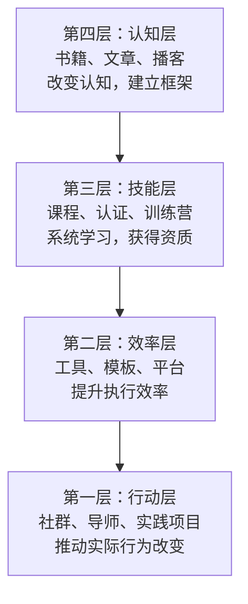
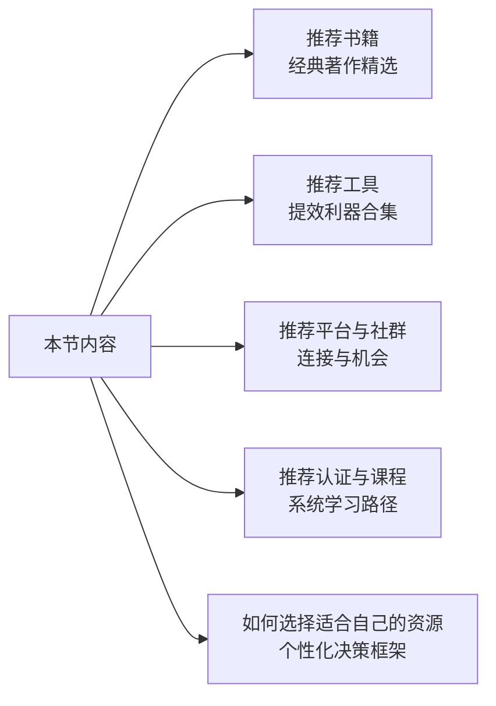

## 一、引言：用对工具，事半功倍

### 1.1 为什么资源选择本身就是一种能力

职业发展领域有一个反直觉的现象：信息越多，进步越慢。

过去，职场人的困境是"找不到好资源"。今天，困境变成了"资源太多，不知道该用哪个"。打开任何一个知识平台，搜索"职业规划"，你会得到上万条结果——书籍、课程、播客、社群、工具、模板，每一个都号称能帮你升职加薪。问题是，你的时间是有限的。一个普通职场人每天能用于自我提升的时间通常不超过 2 小时，如果把这些时间花在低质量资源上，不仅浪费时间，还会产生"我已经很努力了"的错觉。

这就是为什么**资源筛选能力**是职业发展的底层能力之一。它不是简单的"收藏好东西"，而是一套包含需求分析、质量判断、投入产出评估的系统能力。本节的目的，就是帮你建立这套能力。

### 1.2 职业发展资源的四层金字塔

理解职业发展资源，首先要建立分类框架。我们可以把所有资源按照"对行为改变的推动力"分为四层：

| 层级 | 资源类型 | 典型代表 | 投入周期 | 见效速度 | 核心作用 |
|------|----------|----------|----------|----------|----------|
| 第一层·行动层 | 社群、导师、实践项目 | 行业社群、导师制、实战训练 | 持续投入 | 1-4周 | 直接推动行为改变 |
| 第二层·效率层 | 工具、模板、平台 | 简历工具、项目管理、求职平台 | 短期使用 | 即时 | 提升执行效率和质量 |
| 第三层·技能层 | 课程、认证、训练营 | Coursera专项课、PMP认证 | 1-6个月 | 1-3个月 | 系统学习并获得资质证明 |
| 第四层·认知层 | 书籍、文章、播客 | 经典职业规划书籍 | 数周至数月 | 间接 | 建立底层认知框架 |

**关键洞察**：大多数人把 80% 的时间花在第四层（看书、听播客），却期望得到第一层的结果（升职、跳槽成功）。这不是说认知层不重要——恰恰相反，它是地基。但如果你只有地基没有上层建筑，就永远住不进房子里。

**正确的资源投入策略**是"自下而上驱动，自上而下优化"：先通过行动层获得真实反馈，再用认知层的知识去理解和优化你的行动模式。

### 1.3 "好资源"的五个判断标准

在具体推荐之前，你需要一套通用的筛选标准。面对任何职业发展资源，用以下五个维度评估：

**标准一：是否基于研究或实践，而非个人经验**

个人经验有参考价值，但它最大的问题是**样本量为1**。一个人说"我靠这个方法升职了"，不代表这个方法对其他人有效。真正有价值的资源，要么基于大规模研究数据（如对数千名职场人的追踪调查），要么基于经过反复验证的实践框架（如来自顶级咨询公司的方法论）。

判断方法：看作者/机构背景。学术研究者、大型咨询公司（麦肯锡、贝恩）、知名企业的高管教练，他们的输出通常比"自媒体大V"更可靠。

**标准二：是否有明确的方法论，而非空泛的道理**

"要努力""要坚持""要有格局"——这些都是正确的废话。好资源会告诉你**具体怎么做**。比如，同样是讲面试，低质量内容会说"要展示自信"，高质量内容会告诉你"用 STAR 法则（Situation-Task-Action-Result）结构化你的回答，并在 Result 阶段量化你的成果"。

判断方法：读完之后，你能否立即写下 3 个可以执行的行动步骤？如果不能，这个资源的价值存疑。

**标准三：是否适合你当前的阶段**

职业发展有明确的阶段特征。一个刚毕业的职场新人和一个工作十年的中层管理者，需要的资源完全不同。很多经典书籍之所以"读不进去"，不是书写得不好，而是你还没到需要它的阶段。

判断方法：看推荐的"适合人群"描述是否具体到你的职业阶段和场景。

**标准四：是否有时效性和适用性**

职业市场的规则在快速变化。一本 2010 年写的求职指南，可能还在教你"穿正装去面试"，但今天的互联网公司面试可能全程在线进行。尤其是工具和平台类资源，时效性更强。

判断方法：检查出版/更新日期，优先选择近 3 年内更新的内容。对于书籍，优先选择有修订版或新版的。

**标准五：是否有可验证的效果**

最好的资源会提供效果数据或可验证的案例。比如"使用此方法的用户平均面试通过率提升 40%"，或者附带了详细的案例研究。如果一个资源的宣传全靠"口碑"和"好评率"，你需要更谨慎。

### 1.4 本节内容导航

基于上述框架，本节将从以下五个维度为你提供经过筛选的高质量资源推荐：

每个推荐项都包含以下信息：

| 信息项 | 说明 |
|--------|------|
| 推荐指数 | 五星制评分，综合考虑内容质量、实用性、口碑 |
| 适合人群 | 明确标注适用的职业阶段和场景 |
| 核心价值 | 这个资源能帮你解决什么具体问题 |
| 使用建议 | 如何高效使用这个资源，避免浪费时间 |
| 注意事项 | 使用过程中需要警惕的陷阱或局限性 |

### 1.5 使用本节推荐的三条原则

**原则一：先诊断，再选药**

不要从头到尾把所有推荐都看一遍。先明确你当前最紧迫的职业问题是什么——是求职受阻？是晋升瓶颈？是想转行但没方向？还是感觉职业倦怠？找到问题后，直接跳到对应的推荐章节。

**原则二：少即是多，深度使用 3 个好过浅尝 30 个**

研究显示，深度使用少量高质量资源的效果，远好于大量浅层浏览。建议每个阶段聚焦 1-2 本书、1-2 个工具、1 个社群，把它们用透再换。

**原则三：输出倒逼输入**

读完一本书、学完一门课后，必须有输出。输出形式可以是：写一篇总结笔记、向同事讲解核心概念、在工作中应用一个具体方法、在社群里分享你的心得。没有输出的学习，遗忘率高达 75%（艾宾浩斯遗忘曲线）。

### 1.6 关于"推荐"本身的免责声明

最后需要说明：任何推荐都带有主观性。本书的推荐基于以下原则：

- **优先选择经过时间检验的资源**：出版超过 5 年且持续再版的书籍、运营超过 3 年的平台、被大量从业者验证过的工具
- **优先选择有独立研究支撑的资源**：基于学术研究或大型企业实践的方法论，而非个人经验分享
- **优先选择中文生态有良好支持的资源**：对于工具和平台类资源，优先推荐有中文界面或中文社区的选项
- **不接受任何商业推广**：本节所有推荐均为独立评估，不涉及付费推广或合作分成

资源会更新，工具会迭代，平台会兴衰。本节提供的不仅是具体的推荐列表，更是一套**筛选和评估资源的思维框架**。掌握了这套框架，即使本节的推荐过时了，你依然能自己找到优质的资源。

接下来，让我们进入第一个维度——书籍推荐。

***
