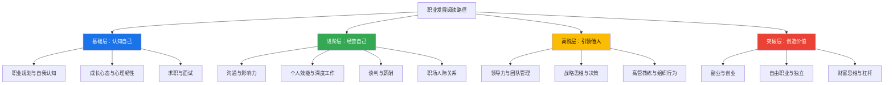
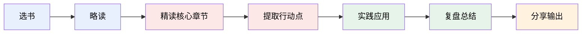

## 二、推荐书籍

职业发展不是读一本书就能顿悟的事，而是一个需要持续构建认知框架的过程。本章精选 30+ 本经过时间验证的职业发展书籍，按**职业阶段 × 能力维度**两个轴线组织，帮助你找到当下最需要的那一本。

### 为什么职业发展需要系统阅读

很多人在职场中遇到瓶颈时，第一反应是"学个新技能"或"跳个槽"，但真正的突破往往来自认知层面的升级。书籍的价值在于：它浓缩了作者十年甚至几十年的行业洞察、研究成果和实战经验，你花几个小时就能获得别人一辈子的智慧。

但问题在于——市面上职业发展类书籍汗牛充栋，质量参差不齐。有些书翻完目录就够了，有些书值得反复精读。本章的推荐标准是：

- **经典性**：出版超过 5 年，经过市场和读者验证
- **实操性**：不是纯理论，能直接用在工作中
- **系统性**：涵盖职业发展的关键知识节点
- **深度性**：不是成功学鸡汤，有扎实的方法论

### 阅读路径总览

在进入具体书单之前，先看这张阅读路径图，找到你当前最需要的切入点：

> **使用建议**：先从你当前所在层级开始，每个层级至少读 2-3 本。不要跳跃式阅读——基础不牢，上层建筑会塌。

---

### 2.1 职业规划与自我认知类

这一类书籍解决的是最根本的问题：**我是谁？我适合做什么？我要去哪里？** 如果这个问题没想清楚，后面的求职、谈判、跳槽都是盲目行动。

#### 《你的降落伞是什么颜色？》（What Color Is Your Parachute?）

- **作者**：理查德·鲍尔斯（Richard N. Bolles）
- **推荐指数**：⭐⭐⭐⭐⭐
- **适合人群**：所有职场人，尤其是正在求职或考虑转行的人
- **核心价值**：被誉为"求职圣经"，自 1970 年首版以来每年更新，全球销量超过 1000 万册。这本书真正的价值不在"求职技巧"，而在它提供了一套完整的**职业自我评估系统**。书中最有名的工具是"花图练习"（Flower Exercise），它从七个维度帮你定位理想工作：
  1. **我喜欢的知识领域**（什么话题我能聊一整天？）
  2. **我喜欢和什么样的人共事**（独立型/小团队/大组织？）
  3. **我能做的事情和技能**（可迁移技能清单）
  4. **我喜欢的工作条件**（远程/坐班/出差频率？）
  5. **我喜欢的责任层级**（执行者/管理者/独立决策者？）
  6. **我喜欢的地理位置和薪资范围**
  7. **我的人生目标和使命感**

  做完这个练习，你会发现"理想工作"不是靠投简历碰运气碰出来的，而是用系统方法推导出来的。

- **阅读建议**：不要"读"这本书，要"做"这本书。准备一个笔记本，按顺序完成花图练习的七个花瓣。建议用一周时间慢慢做完，每完成一个花瓣就和信任的朋友讨论一下。第三部分的自我评估练习是全书精华，至少做两遍。

- **适合的阅读场景**：职业迷茫期、毕业季、准备跳槽前、职业转型期

#### 《远见：如何规划职业生涯 3 大阶段》（The Long View）

- **作者**：布赖恩·费瑟斯通豪（Brian Fetherstonhaugh）
- **推荐指数**：⭐⭐⭐⭐⭐
- **适合人群**：25-45 岁的职场人
- **核心价值**：作者是奥美互动全球 CEO，他提出的职业三阶段模型是本书最大亮点：

| 阶段 | 时间跨度 | 核心任务 | 关键策略 |
|------|----------|----------|----------|
| 第一阶段 | 22-35 岁（约 15 年） | 加添燃料，强势开局 | 探索兴趣、积累可迁移技能、找到导师 |
| 第二阶段 | 35-50 岁（约 15 年） | 锚定甜蜜区，聚焦长板 | 找到能力、热情与市场需求的交集，成为专家 |
| 第三阶段 | 50-65+ 岁（约 15 年） | 优化长尾，发挥持续影响力 | 从执行者转型为导师/顾问/投资角色 |

  这个模型最大的价值是帮你建立**时间维度**的思考框架。很多人 30 岁焦虑，是因为用第一阶段的标准（收入增长、职位晋升）衡量一切，而没有意识到第一阶段的核心任务是"探索"和"积累可迁移技能"，而不是"赚最多的钱"。

- **阅读建议**：对照自己所处的职业阶段，重点学习对应章节。如果你在第一阶段，重点关注"可迁移技能清单"（包括学历、专业知识、行业经验、人际网络等 11 个类别）；如果你在第二阶段，重点理解"甜蜜区"的概念。

- **与《降落伞》的区别**：《降落伞》侧重"找到方向"，《远见》侧重"规划路径"。建议先读《降落伞》确定方向，再读《远见》规划路线。

#### 《转行：发现一个未知的自己》（Working Identity）

- **作者**：埃米尼亚·伊瓦拉（Herminia Ibarra）
- **推荐指数**：⭐⭐⭐⭐
- **适合人群**：考虑转行但不确定方向的人
- **核心价值**：基于对 39 位中高层管理者转行过程的深入研究，伊瓦拉教授提出了一个颠覆性的结论：**大多数人不是先想清楚再行动，而是先行动起来才想清楚**。传统的"先做自我评估，再确定目标，然后制定计划"的三步法，对转行几乎不起作用。原因是：当你还身处原来的行业和身份中时，你对自己能做什么、适合做什么的想象是被当前环境限制的。
- **三种有效的转行策略**：
  1. **平行实验**：在不辞职的情况下，同时尝试 2-3 个潜在方向（兼职、项目合作、志愿服务）
  2. **身份转换人脉**：和已经在目标行业的人建立深度联系，不是为了"找工作"，而是为了获得新的身份参照点
  3. **意义建构**：用新的叙事框架重新诠释自己的经历——"我不是'放弃了投行去画画'，而是'我把分析能力用在了创意产业'"

- **阅读建议**：如果你正在纠结是否转行，先把第一章读完。它会让你理解"纠结"本身就是正常的转行阶段，而不是你缺乏决断力。然后按顺序读，配合书中的案例做对照分析。

- **常见误区**：很多人以为转行就是"考个证"或"学个新技能"。伊瓦拉的研究表明，转行最核心的挑战是**身份认同的转换**——从"我是一个产品经理"到"我是一个创业者"，这个心理过程比学任何技能都难。

#### 《斯坦福大学人生设计课》（Designing Your Life）

- **作者**：比尔·博内特（Bill Burnett）、戴夫·伊万斯（Dave Evans）
- **推荐指数**：⭐⭐⭐⭐⭐
- **适合人群**：对职业和人生方向感到迷茫的人
- **核心价值**：将硅谷的设计思维（Design Thinking）应用于人生和职业规划。这不是一本空谈理想的书，而是一本实操工具书。核心方法论包括：
  - **人生仪表盘**：从工作（Work）、娱乐（Play）、爱（Love）、健康（Health）四个维度评估当前生活状态
  - **思维导图法**：围绕"我是谁"展开三层联想，发现隐藏的兴趣交叉点
  - **奥德赛计划**：设计三个完全不同的人生版本（方案 A = 当前路径的延续，方案 B = 如果 A 突然消失你会做什么，方案 C = 不考虑钱和面子你会做什么）
  - **原型体验**：在做出重大决定前，用最低成本的方式"试驾"新生活（访谈、实习、项目合作）

  "奥德赛计划"是全书最具冲击力的工具——当你发现人生可以有三个合理版本时，"我该怎么办"的焦虑会大幅减轻，因为你终于意识到：**没有唯一正确的选择，只有多种有趣的可能性**。

- **阅读建议**：配合书中的练习工具一起使用。建议用一个周末的时间专门做"奥德赛计划"的练习——找个安静的地方，拿出三张纸，分别写出三个版本的人生。然后找两个信任的人分别做"原型访谈"（不是问他们觉得你该怎么做，而是问他们"你怎么做到的"和"我怎样才能体验一下你的工作"）。

#### 《职业锚：发现你的真正价值》（Career Anchors）

- **作者**：埃德加·施恩（Edgar Schein）
- **推荐指数**：⭐⭐⭐⭐
- **适合人群**：想要深入了解自己职业驱动力的人
- **核心价值**：施恩是麻省理工学院斯隆管理学院的组织行为学教授，他提出的职业锚理论（Career Anchors Theory）是职业生涯规划领域最重要的学术框架之一。职业锚指的是一个人在面临职业选择时"无论如何都不会放弃"的核心价值观和能力组合。

  施恩通过 25 年的追踪研究，识别出八种职业锚：

| 职业锚 | 核心驱动力 | 典型职业 |
|--------|-----------|----------|
| 技术/职能能力 | 在专业领域达到卓越 | 工程师、医生、律师 |
| 管理能力 | 整合他人工作，承担责任 | 部门总监、VP、CEO |
| 自主/独立 | 按自己的方式工作，不受约束 | 自由顾问、创业者 |
| 安全/稳定 | 稳定的工作和可预测的未来 | 公务员、国企员工 |
| 创业/创造 | 创建新事物，从无到有 | 创业者、产品经理 |
| 服务/奉献 | 改善世界、帮助他人 | NGO、教育、医疗 |
| 挑战 | 解决看似不可能的问题 | 咨询顾问、投行分析 |
| 生活方式 | 工作与生活和谐统一 | 远程工作者、教师 |

  了解自己的职业锚，能帮你理解为什么有些工作即使薪水很高你也做不开心——**因为那些工作和你的职业锚不匹配**。

- **阅读建议**：书中有完整的职业锚自我评估问卷（约 40 题），认真做完并记录结果。但更重要的是：回忆你过去做过的三个最让你有成就感的决定，看看它们是否指向同一个职业锚。

#### 《发现你的优势》（Now, Discover Your Strengths）

- **作者**：马库斯·白金汉（Marcus Buckingham）、唐纳德·克利夫顿（Donald O. Clifton）
- **推荐指数**：⭐⭐⭐⭐
- **适合人群**：不确定自己核心优势的人
- **核心价值**：盖洛普公司基于对 200 万人的调查研究，提出了"优势理论"。核心观点：**大多数人花太多时间弥补弱点，却忽略了发展优势**。研究发现，在工作中每天发挥优势的人，其敬业度是不发挥优势的人的 6 倍。

  书中的"优势识别器"（StrengthsFinder）测试将人的天赋分为 34 个主题，包括成就、行动、适应、分析、统筹、信仰、统率、沟通、竞争、关联、公平、专注、前瞻、和谐、理念、包容、个别、搜集、思维、学习、完美、积极、交往、责任、排难、自信、追求、战略、体谅等。测试完成后会给出你的 Top 5 优势主题。

  **关键区分**：优势 ≠ 技能。优势 = 天赋（天然的思维/行为模式） × 投入（知识 + 练习）。天赋是与生俱来的，技能是可以后天学习的。最理想的状态是把天赋发展成优势，而不是试图变成一个"全面发展的人"。

- **阅读建议**：原版书附带一个在线测试的激活码（CliftonStrengths），做完测试再读书效果翻倍。如果买的是中文版没有激活码，可以去盖洛普官网单独购买（约 25 美元）。读完后，尝试用"优势语言"重新描述你的简历和面试自我介绍。

#### 《终身成长》（Mindset: The New Psychology of Success）

- **作者**：卡罗尔·德韦克（Carol Dweck）
- **推荐指数**：⭐⭐⭐⭐⭐
- **适合人群**：所有职场人
- **核心价值**：斯坦福大学心理学教授德韦克通过数十年研究，揭示了两种思维模式对职业发展的深远影响：

  **固定型思维**：认为能力是天生的，失败证明"我不行"。典型表现：回避挑战、害怕失败、把别人的成功看成威胁、遇到困难就放弃。

  **成长型思维**：认为能力是可以通过努力发展的，失败只是"还没学会"。典型表现：拥抱挑战、从失败中学习、向优秀的人学习、坚持面对困难。

  在职业发展中，思维模式几乎决定了你的天花板。固定型思维的人在 30 岁左右会遇到第一个真正的瓶颈——他们过去靠"聪明"就能搞定的事，现在需要靠"学习新技能"才能完成。如果此时他们仍然保持固定型思维（"我已经过了学习的年纪"），职业发展就会停滞。

- **阅读建议**：这本书的前半部分理论较多，如果你时间有限，直接从第四章"体育：冠军的思维模式"开始读——体育案例最直观，容易理解两种思维模式的差异。然后倒回去读前几章的理论框架。

- **实操练习**：记录你一周内遇到的三个"挫折时刻"（做错事、被批评、没通过面试等），分别用固定型思维和成长型思维重新解读它们，对比两种解读给你带来的情绪和行动差异。

---

### 2.2 求职与面试类

求职是一项可以系统学习的技能，而不是靠运气。以下书籍从简历撰写、面试准备到人脉经营，覆盖了求职的完整链条。

#### 《面试的艺术》（Knock 'em Dead Job Interview）

- **作者**：马丁·耶特（Martin Yate）
- **推荐指数**：⭐⭐⭐⭐
- **适合人群**：正在准备面试的求职者
- **核心价值**：系统讲解面试的各个环节，包括电话面试、行为面试、案例面试、压力面试等不同类型。最有价值的部分是**行为面试的 STAR 回答框架**：
  - **S（Situation）**：描述具体场景
  - **T（Task）**：你需要完成的任务
  - **A（Action）**：你采取的具体行动
  - **R（Result）**：行动带来的量化结果

  很多人面试失败不是因为能力不够，而是因为不会"讲故事"。STAR 框架帮你把经历转化成有说服力的叙事。

- **阅读建议**：读完后，针对你简历上的每段经历，都准备一个 STAR 故事。至少准备 10 个核心故事，覆盖：团队协作、解决冲突、领导力、创新、失败后恢复等主题。每个故事控制在 2 分钟以内。

- **实操模板**：准备面试时，用这个表格整理你的故事库：

| 面试考察维度 | STAR 故事标题 | 关键量化结果 |
|------------|-------------|------------|
| 团队协作 | 某项目跨部门协调 | 提前 2 周交付 |
| 解决冲突 | 某次客户投诉处理 | 客户满意度提升 30% |
| 领导力 | 某次带新人完成任务 | 新人 1 个月内独立上手 |
| 创新 | 某个流程优化 | 效率提升 50% |
| 抗压 | 某次紧急上线 | 零故障完成 |

#### 《别独自用餐》（Never Eat Alone）

- **作者**：基思·法拉奇（Keith Ferrazzi）
- **推荐指数**：⭐⭐⭐⭐⭐
- **适合人群**：希望拓展职业人脉的所有人
- **核心价值**：人脉经营不是"社交应酬"，而是**真诚地帮助他人**。法拉奇的核心理念可以浓缩为三句话：
  1. **先给予，再索取**：每次接触新人时，先想"我能为他做什么"，而不是"他能为我做什么"
  2. **维护关系是日常习惯，不是临时抱佛脚**：不要等到需要帮忙时才联系人
  3. **人脉的质量 > 数量**：你真正需要维护的核心人脉不超过 150 人（邓巴数）

  书中最有实操性的部分是**人脉管理的四个步骤**：
  - 第一步：列出你当前所有重要联系人（按关系亲疏分三圈：核心圈 5 人、关键圈 50 人、外圈 150 人）
  - 第二步：为每个人设定"联系频率"（核心圈每周、关键圈每月、外圈每季度）
  - 第三步：设定"给予方式"（分享有价值的信息、介绍人脉、提供帮助）
  - 第四步：用 CRM 工具或简单的 Excel 表格管理你的联系人

- **阅读建议**：不只是读，而是按照书中的方法去实践。读完后立刻做第一步——列出你当前的核心联系人名单，然后在一周内给其中三个人发一条有价值的信息（不是"最近怎么样"，而是"看到这篇文章想到了你"）。

- **中国读者特别注意**：书中案例以美国职场文化为主，在中国应用时需要调整——比如美国的"午餐社交"在中国对应的是"饭局"和"微信群互动"。核心原则不变，但形式要本土化。

#### 《精准求职》

- **作者**：七芊
- **推荐指数**：⭐⭐⭐⭐
- **适合人群**：国内求职者，尤其是互联网行业
- **核心价值**：少有的结合国内求职市场实际情况的求职指南。覆盖了从行业研究、公司筛选、简历优化到面试全流程的实操方法。特别有价值的是关于**"信息差"**的论述——大多数求职者败在信息不对称上（不知道哪些公司在招人、不知道目标岗位的真实要求、不知道行业薪资水平），而不是败在能力不够。

- **阅读建议**：重点读"简历"和"面试"两章。书中关于如何在简历中用**数字量化成果**的部分尤其值得学习——比如不要写"负责用户增长"，而要写"3 个月内通过 XX 渠道将用户量从 5 万提升到 20 万，获客成本降低 40%"。

#### 《用数据讲故事》（Storytelling with Data）

- **作者**：科尔·努斯鲍默·纳福利克（Cole Nussbaumer Knaflic）
- **推荐指数**：⭐⭐⭐⭐
- **适合人群**：需要用数据说服他人的职场人（汇报、提案、面试展示）
- **核心价值**：虽然不是传统意义上的"求职书"，但面试中的数据展示能力直接影响你的录用概率。书中教你如何把枯燥的数据转化成有说服力的视觉叙事——选择正确的图表类型、去除干扰元素、突出核心数据、引导观众关注重点。

- **阅读建议**：下次准备面试时，把你最亮眼的 2-3 个成果用本书的方法做成一页 PPT 或数据表格，在面试中展示。这比纯口述有效 10 倍。

---

### 2.3 谈判与薪酬类

很多职场人对"谈钱"有一种本能的回避，觉得谈钱伤感情、不好意思开口。但实际上，**一次成功的薪酬谈判可能比你跳槽两次带来的收入增长还要多**。以下是帮你补上这块短板的核心读物。

#### 《掌控谈话》（Never Split the Difference）

- **作者**：克里斯·沃斯（Chris Voss）
- **推荐指数**：⭐⭐⭐⭐⭐
- **适合人群**：所有需要谈判的人（谈薪、商务合作、客户沟通）
- **核心价值**：作者是 FBI 前首席国际人质谈判专家，他把高风险谈判中验证有效的方法提炼成了普通人也能用的技巧。核心方法论：
  1. **战略性同理心**：不是"同意对方"，而是"让对方感到被理解"。具体做法是用"标签"（Label）技术——"听起来你对这个方案有些顾虑"——来让对方打开话匣子。
  2. **镜像法（Mirroring）**：重复对方最后 1-3 个词，促使对方继续说下去。比如对方说"这个价格我们接受不了"，你回应"接受不了？"——对方往往会进一步解释原因，而这个原因才是谈判的关键信息。
  3. **校准式问题**：用"如何"和"什么"开头的问题来替代"为什么"——"这个方案怎么调整你才能接受？"比"你为什么不接受？"有效得多，因为前者让对方帮你解决问题，后者让对方为自己的立场辩护。
  4. **否定式提问（Accusation Audit）**：在对方开口前，先主动说出对方可能的顾虑——"我知道这个要求可能让你觉得我不知足"——这种"先发制人"反而能消除对方的敌意。

  在薪酬谈判中的具体应用：

  面试官：你期望薪资是多少？
  错误回答：XX 万（直接报价，过早亮底牌）
  正确流程：
    1. 先用"镜像法"获取信息："您这边这个岗位的薪资范围大概是？"
    2. 用"校准式问题"引导："考虑到我的经验和能带来的价值，
       这个数字怎样才能更合理一些？"
    3. 如果对方坚持，用"否定式提问"："我知道这个数字超出预算了，
       但我想找到一个双方都觉得公平的方案"

- **阅读建议**：第七章"创造突破的力量"和第九章"找出'黑天鹅'"是职场谈判最实用的章节。建议准备一次模拟谈判，找朋友练习"镜像法"和"标签"技术——听起来简单，但实际操作时你会发现需要大量练习才能自然运用。

#### 《沃顿商学院最受欢迎的谈判课》（Getting More）

- **作者**：斯图尔特·戴蒙德（Stuart Diamond）
- **推荐指数**：⭐⭐⭐⭐⭐
- **适合人群**：所有需要谈判的人，尤其是偏好温和风格的人
- **核心价值**：如果说沃斯的书是"谈判的艺术"，戴蒙德的书就是"谈判的科学"。他的核心框架是**"说服三角"**：
  1. **理解对方的感知**：每个人看待同一份工作的角度不同，你要理解对方（老板/HR）的真实诉求是什么——控制预算？完成招聘指标？维护团队稳定？
  2. **情感对齐**：在谈逻辑之前先处理情绪。"我理解这个决定对你来说也不容易"这句话比任何数据都有效。
  3. **循序渐进的策略**：不要一口吃个胖子，把大目标拆成小步骤——先谈工作范围，再谈薪资结构，最后谈福利细节。

  书中的"四象限谈判模型"特别适合薪酬谈判：

| | 对方关注你 | 对方不关注你 |
|--|----------|------------|
| **你关注对方** | 双赢区（最佳结果） | 你让步区（避免长时间停留） |
| **你不关注对方** | 对方让步区（短期可取） | 危险区（双方都不满） |

- **阅读建议**：先读第三章"目标优先级排序"——很多人谈判失败是因为没有提前明确"什么是必须拿到的，什么是可以放弃的"。在准备薪酬谈判前，列一张清单：薪资（底线/期望/理想）、股权/期权、职位级别、汇报关系、远程工作天数、年假天数、签字费……按重要性排序。

#### 《提问的力量》（The Power of Questions）

- **作者**：沃伦·伯杰（Warren Berger）
- **推荐指数**：⭐⭐⭐⭐
- **适合人群**：希望提升提问能力的人（面试、谈判、领导力）
- **核心价值**：好的提问比好的回答更有价值。在求职和谈判中，提问能力直接影响你获取信息的质量。书中介绍了"追问五层"（Five Whys）的方法——对一个问题连续追问五次"为什么"，就能触达问题的本质。

  在面试中的应用：
  - 面试官问完后，不要简单回答，先问一个澄清问题："您说的 XX 是指……？"
  - 在面试尾声的"你有什么问题"环节，不要问"公司文化怎么样"这种泛泛的问题，而是问有深度的问题："这个岗位面临的最大挑战是什么？""上一个做这个岗位的人为什么离开？""团队目前最需要解决的问题是什么？"

---

### 2.4 沟通与影响力类

职场中 80% 的问题，本质上都是沟通问题。以下书籍帮你从"会说话"升级到"会沟通"再到"有影响力"。

#### 《关键对话》（Crucial Conversations）

- **作者**：科里·帕特森、约瑟夫·格雷尼、罗恩·麦克米兰、艾尔·斯威茨勒
- **推荐指数**：⭐⭐⭐⭐⭐
- **适合人群**：需要在职场中进行高难度沟通的人
- **核心价值**：所谓"关键对话"，需要同时满足三个条件：**观点不同、情绪强烈、利害攸关**。职场中的典型关键对话包括：和老板谈加薪、向同事提出负面反馈、处理团队冲突、拒绝不合理的要求等。

  书中最有用的工具是**"STATE"模型**：
  - **S（Share your facts）**：从客观事实出发，不从主观判断开始。"这个月你迟到了 5 次"而不是"你总是迟到"
  - **T（Tell your story）**：说明你基于事实得出了什么结论。"我在想是不是有什么困难影响了你"
  - **A（Ask for others' paths）**：邀请对方分享他的视角。"你能告诉我实际情况是什么样的吗？"
  - **T（Talk tentatively）**：用"试探性"语言而非"绝对性"语言。"我可能是错的，但……"而不是"你就是……"
  - **E（Encourage testing）**：鼓励对方表达不同意见。"如果我哪里理解错了，请纠正我"

  **为什么关键对话如此重要**：研究表明，在关键对话中表现好的团队，其绩效比表现差的团队高 25-50%。而大多数人在面对关键对话时，要么选择沉默（回避冲突），要么选择暴力（情绪爆发），两种方式都无法解决问题。

- **阅读建议**：第四章"保证安全"是全书最核心的章节——它解释了为什么对话会失控（当对方感到不安全时），以及如何重建安全感。建议在下一次遇到关键对话前，先翻到这一章复习一下。

#### 《非暴力沟通》（Nonviolent Communication）

- **作者**：马歇尔·卢森堡（Marshall Rosenberg）
- **推荐指数**：⭐⭐⭐⭐⭐
- **适合人群**：需要改善职场人际关系的人
- **核心价值**：非暴力沟通（NVC）是一种基于同理心的沟通方法，它的四个步骤是：
  1. **观察**（Observation）：描述客观事实，不加评判。"你提交的报告中有三处数据错误"而不是"你做事太粗心了"
  2. **感受**（Feeling）：表达你的真实感受。"我感到担忧"而不是"你让我很失望"
  3. **需要**（Need）：说明你的需要。"因为我需要确保数据的准确性"而不是"你根本不负责任"
  4. **请求**（Request）：提出具体可执行的请求。"你能在提交前再检查一遍数据吗？"而不是"你以后注意点"

  NVC 的核心洞察是：**评判和指责（"你怎么这么不负责"）会触发对方的防御机制，而具体的观察和感受表达（"我看到数据有误，我感到担心"）会让对方更容易接受**。

  在职场中的典型应用场景：
  - 向下属反馈工作问题
  - 和同事讨论分歧
  - 处理客户的不满
  - 和老板讨论工作量过重的问题

- **阅读建议**：第四章和第五章是核心——第四章讲"如何区分观察和评判"，第五章讲"如何表达感受而非想法"。很多人说"我觉得你不尊重我"以为是在表达感受，其实"不尊重"是评判，不是感受。真正的感受是"我感到受伤/被忽视"。

- **练习方法**：接下来一周，每次你想说"你总是/你从来不"的时候，停下来，换成"观察+感受+需要+请求"的四步表达。一开始会觉得很别扭，但坚持一周你会发现沟通效果有质的飞跃。

#### 《影响力》（Influence: The Psychology of Persuasion）

- **作者**：罗伯特·西奥迪尼（Robert Cialdini）
- **推荐指数**：⭐⭐⭐⭐⭐
- **适合人群**：需要提升说服力和影响力的人
- **核心价值**：西奥迪尼通过数十年的实验研究，总结出影响人类行为的六大心理学原理（后来扩展为七大）：

| 原理 | 含义 | 职场应用 |
|------|------|----------|
| **互惠** | 给了别人东西，别人会觉得欠你 | 主动帮助同事，日后需要帮忙时更容易获得支持 |
| **承诺一致** | 人会努力保持和自己公开承诺一致 | 会议上先让对方同意一个小原则，再推进你的方案 |
| **社会认同** | 人会参考多数人的行为做决定 | "行业里 80% 的公司已经采用了这个方案" |
| **喜好** | 人更容易被自己喜欢的人说服 | 先建立个人联系，再谈正事 |
| **权威** | 人倾向于服从权威 | 引用行业专家/数据/案例来支撑你的观点 |
| **稀缺** | 越稀缺的东西越有吸引力 | "这个岗位只剩两个 HC 了" |
| **联盟** | 人更容易被"自己人"说服 | "我们团队的人都觉得……" |

- **阅读建议**：不要只读一遍。这本书最有趣的地方在于，你读完后会发现日常生活中到处都是影响力原理的运用——广告、销售话术、领导开会策略等。建议用"影响力日记"记录一周内你观察到的影响力实例，这比读书本身更有教育意义。

- **进阶**：西奥迪尼在 2021 年出版了《影响力》的续作《先发影响力》（Pre-Suasion），讲的是在正式说服之前如何"铺设"对方的心理状态。推荐读完《影响力》后再读。

#### 《金字塔原理》（The Minto Pyramid Principle）

- **作者**：芭芭拉·明托（Barbara Minto）
- **推荐指数**：⭐⭐⭐⭐⭐
- **适合人群**：需要提升结构化思维和表达能力的人
- **核心价值**：麦肯锡经典的思维和表达框架。核心原则非常简单：**结论先行，以上统下，归类分组，逻辑递进**。

  在职场中的直接应用：
  - **写邮件**：把结论放在第一句，而不是写了一大段背景信息后才说"所以我的建议是……"
  - **做汇报**：先说"我今天汇报三个要点"，然后逐一展开，最后总结
  - **做决策**：用 MECE 原则（Mutually Exclusive, Collectively Exhaustive，相互独立、完全穷尽）分解问题

  举个例子，假设你要向老板汇报一个项目问题：

  差的汇报方式：
  "最近项目遇到了一些困难，团队加班很多，
   客户那边又改了需求，技术方案也要调整……"
  （听了两分钟，老板还不知道你想说什么）

  好的汇报方式（金字塔结构）：
  "项目需要延期两周（结论）。
   原因有三个：
   1. 客户新增了 3 个需求点（需求变更）
   2. 核心技术人员下周转岗（人力缺口）
   3. 原方案存在性能瓶颈需重构（技术风险）
   我的建议是：优先砍掉需求 3，用外包补人力缺口，
   技术方案改为渐进式优化。"
  （30 秒讲清楚，老板可以立刻决策）

- **阅读建议**：第二章"金字塔内部的结构"和第四章"序言的具体写法"最实用。如果时间有限，只读前四章就够了。后面的内容偏咨询行业，对普通职场人来说价值不大。

- **练习方法**：把你下一封工作邮件重写一遍——用金字塔原理重构。把结论从最后一段移到第一段，把理由按逻辑分组排列。

---

### 2.5 个人效能与深度工作类

#### 《高效能人士的七个习惯》（The 7 Habits of Highly Effective People）

- **作者**：史蒂芬·柯维（Stephen R. Covey）
- **推荐指数**：⭐⭐⭐⭐⭐
- **适合人群**：所有职场人
- **核心价值**：这本 1989 年出版的书至今仍是个人管理领域的"圣经"级作品。七个习惯的底层逻辑是**从"依赖"到"独立"再到"互赖"的成长路径**：

  **独立期（个人领域的成功）**：
  1. **积极主动**：在刺激和回应之间有选择的自由。你无法控制老板发火，但你可以控制自己如何回应
  2. **以终为始**：先想清楚你的人生目标是什么，然后倒推当下的行动。如果你 60 岁时回头看，你希望自己此刻做了什么？
  3. **要事第一**：把时间花在"重要但不紧急"的事上（学习新技能、维护人脉、健康），而不是被"紧急但不重要"的事牵着走

  **互赖期（公众领域的成功）**：
  4. **双赢思维**：不是你赢我输，也不是我赢你输，而是找到双方都满意的方案
  5. **知彼解己**：先理解对方，再寻求被理解
  6. **统合综效**：1+1>2，通过创造性合作产生更好的方案

  **持续更新**：
  7. **不断更新**：从身体、精神、智力、社会/情感四个维度持续"磨刀"

- **阅读建议**：很多读这本书的人卡在第一章"积极主动"就放弃了，因为它太"理论化"了。建议跳过前三章的理论部分，直接从**第四章"以终为始"**开始——这一章有具体的人生使命宣言练习，非常实操。做完练习后，再回头读前面的理论，你会理解得更深。

- **最常见的误区**：很多人把"要事第一"简单理解为"先做重要的事"，但柯维真正的意思是——**对不重要的事说"不"**。如果你不学会拒绝，你永远没有时间做重要的事。

#### 《深度工作》（Deep Work）

- **作者**：卡尔·纽波特（Cal Newport）
- **推荐指数**：⭐⭐⭐⭐⭐
- **适合人群**：知识工作者
- **核心价值**：纽波特将工作分为两种：
  - **深度工作（Deep Work）**：在无干扰状态下进行的专业活动，能创造新价值、提升技能且难以复制。比如写代码、写方案、做研究。
  - **浅层工作（Shallow Work）**：不需要太多认知投入的事务性工作。比如回邮件、开会、填表格。

  他的核心论点是：**在知识经济时代，深度工作能力正在变得越来越稀缺，同时也越来越有价值**。能长时间保持专注的人，将在竞争中获得巨大优势。

  书中给出了四种深度工作的模式：
  1. **修道院模式**：几乎完全隔离，只做深度工作（适合作家、研究者）
  2. **双模式**：把时间分为"深度工作期"和"浅层工作期"（比如一周深度、一周浅层）
  3. **节奏模式**：每天固定时间段做深度工作（比如早上 7-10 点）
  4. **记者模式**：利用任何空闲时间做深度工作（需要训练，不建议新手尝试）

- **阅读建议**：大多数人适合"节奏模式"——在日历上固定一个每天 90 分钟的深度工作时段，关掉手机和所有通知，只做一件事。坚持一个月，你会惊讶于自己的产出质量。

- **实操建议**：
  - 安装一个网站屏蔽插件（如 Cold Turkey），在深度工作时段屏蔽社交媒体
  - 用"番茄钟"来计量深度工作时间，但不要机械地按 25 分钟休息——根据你的注意力周期调整（大多数人 60-90 分钟为一个周期）
  - 每天结束时记录当天的深度工作小时数，目标是逐步从 2 小时提升到 4 小时

#### 《原子习惯》（Atomic Habits）

- **作者**：詹姆斯·克利尔（James Clear）
- **推荐指数**：⭐⭐⭐⭐⭐
- **适合人群**：所有希望养成好习惯或戒掉坏习惯的人
- **核心价值**：习惯是职业发展的基石——你的职业成就不是由偶尔的"大行动"决定的，而是由每天重复的小习惯决定的。克利尔提出的习惯养成四步模型：

  | 步骤 | 好习惯怎么做 | 坏习惯怎么破 |
  |------|------------|------------|
  | **提示** | 让它显而易见 | 让它看不见 |
  | **渴望** | 让它有吸引力 | 让它毫无吸引力 |
  | **反应** | 让它简单易行 | 让它难以执行 |
  | **奖励** | 让它令人愉悦 | 让它令人痛苦 |

  最有冲击力的概念是**"1% 法则"**：每天进步 1%，一年后你会比现在好 37 倍。反之，每天退步 1%，一年后你会衰减到几乎为零。

- **阅读建议**：先读第五章"改变习惯的最好方法"——这是全书的精华。然后根据你最想养成（或戒掉）的一个习惯，用四步模型设计一个具体方案。

- **职场中的应用**：把"深度工作"变成习惯——每天早上到公司后，先做 60 分钟深度工作再开邮箱。用"提示"来强化：把手机放在抽屉里（减少干扰提示）、打开专注音乐（设置工作提示）。

#### 《心流》（Flow）

- **作者**：米哈里·契克森米哈赖（Mihaly Csikszentmihalyi）
- **推荐指数**：⭐⭐⭐⭐⭐
- **适合人群**：希望在工作中获得更多满足感的人
- **核心价值**：契克森米哈赖是积极心理学的奠基人之一，他通过数十年研究发现：人在"心流"状态下效率最高、满足感最强。心流状态的条件：
  - 任务有明确的目标
  - 任务有即时的反馈
  - 挑战与技能相匹配（太容易=无聊，太难=焦虑）
  - 注意力完全集中在当前任务上

  **心流与职业发展的关系**：研究表明，在工作中经常体验心流的人，不仅工作表现更好，职业满意度也更高。更重要的是，心流状态下的学习效率是普通状态的 2-5 倍。这意味着：如果你能经常在工作中进入心流，你的技能成长速度会远超同龄人。

- **阅读建议**：前五章讲理论（有些学术化），第六到第十章讲心流在不同领域的应用（工作、休闲、人际关系），选你最感兴趣的章节读。

- **实操**：画一个"挑战-技能"坐标图，把你的工作任务分别放进去。然后想办法：把"高挑战低技能"的任务先提升技能（减少焦虑），把"低挑战高技能"的任务升级难度（减少无聊）。

---

### 2.6 领导力与管理类

从"做事"到"带人"是职业发展中最关键的跃迁之一。以下书籍帮你完成这个转变。

#### 《可复制的领导力》

- **作者**：樊登
- **推荐指数**：⭐⭐⭐⭐
- **适合人群**：第一次带团队的新管理者
- **核心价值**：把领导力从"天赋"变成"可学习的技能"。核心概念包括：
  - **管理者角色转变**：从"自己做事"到"通过别人做事"
  - **目标管理**：用 OKR 替代 KPI，让团队成员理解目标而不仅是指标
  - **反馈文化**：正面反馈（表扬）和负面反馈（纠正）的比例应为 4:1

  作为一本中文原创的领导力入门书，它最大的优点是**接地气**——案例都来自中国企业的实际情况，不用做文化转换。

- **阅读建议**：第一章和第二章最核心——它们解释了"领导力不是当领导的能力，而是影响力"。如果你是新晋管理者，先读完这两章再做其他事。

#### 《高效能人士的第八个习惯》（The 8th Habit）

- **作者**：史蒂芬·柯维（Stephen R. Covey）
- **推荐指数**：⭐⭐⭐⭐
- **适合人群**：已经读过《七个习惯》、想要进阶的管理者
- **核心价值**：如果说《七个习惯》教你如何管理自己，那《第八个习惯》教你如何领导他人。柯维提出的核心理念是**"找到你自己的声音，并帮助他人找到他们的声音"**——领导力的本质不是控制和命令，而是**激发每个人内在的创造力和潜能**。

  书中关于"领导力的四种角色"的框架非常实用：
  1. **路径寻找者**（Pathfinder）：描绘愿景，指引方向
  2. **对齐者**（Aligner）：确保每个人的目标与组织目标一致
  3. **赋能者**（Empowerer）：移除障碍，让团队成员充分发挥
  4. **建模者**（Modeler）：以身作则，用自己的行为树立标准

- **阅读建议**：重点读第三部分"找到你自己的声音"——它帮你识别你的天赋、热情、需求和良心的交集，从而找到你独特的领导风格。

#### 《从优秀到卓越》（Good to Great）

- **作者**：吉姆·柯林斯（Jim Collins）
- **推荐指数**：⭐⭐⭐⭐⭐
- **适合人群**：管理者、创业者、对组织管理感兴趣的人
- **核心价值**：柯林斯团队花了 5 年时间研究了 1435 家公司，从中筛选出 11 家实现了"从优秀到卓越"跨越的公司，然后总结出它们的共同特征。最有名的概念：
  - **第五级领导力**：最高级别的领导者同时具备"极端的个人谦逊"和"极端的职业意志"——他们把功劳归于团队，把责任留给自己
  - **先人后事**：先找到对的人上车，再决定车开往哪里
  - **刺猬理念**：找到你（或你的公司）能做到世界最好的、能点燃你热情的、并且有经济引擎支撑的交集
  - **飞轮效应**：卓越不是一夜之间发生的，而是像推动一个沉重的飞轮——每一圈都很费力，但坚持下去，动量会越来越大

- **阅读建议**：第一章"优秀是卓越的敌人"是全书最有冲击力的一章——它解释了为什么大多数公司（和大多数人）止步于"还不错"。刺猬理念的框架可以直接用于个人职业规划：找到你的天赋、热情和市场需求的交集。

#### 《团队协作的五大障碍》（The Five Dysfunctions of a Team）

- **作者**：帕特里克·兰西奥尼（Patrick Lencioni）
- **推荐指数**：⭐⭐⭐⭐⭐
- **适合人群**：团队管理者、项目负责人
- **核心价值**：用"金字塔"模型揭示了团队协作失败的五层原因（从底部到顶部）：

  ┌───────────────────────────────┐
  │   5. 无视结果（关注个人利益）    │
  ├───────────────────────────────┤
  │   4. 逃避责任（不敢指出问题）    │
  ├───────────────────────────────┤
  │   3. 欠缺投入（犹豫不决）       │
  ├───────────────────────────────┤
  │   2. 惧怕冲突（回避建设性冲突）  │
  ├───────────────────────────────┤
  │   1. 缺乏信任（不敢暴露弱点）   │  ← 根源
  └───────────────────────────────┘

  最底层是**信任**——不是"我相信你不会害我"的基本信任，而是"我可以在你面前暴露我的弱点和错误"的深度信任。没有这种信任，上面四层都会坍塌。

- **阅读建议**：这是一本管理寓言，用故事形式写成，读起来很快（2-3 小时）。读完后，对照你的团队从底部开始检查——你的团队在第几层出了问题？

---

### 2.7 副业与创业类

#### 《纳瓦尔宝典》（The Almanack of Naval Ravikant）

- **作者**：埃里克·乔根森（Eric Jorgenson）
- **推荐指数**：⭐⭐⭐⭐⭐
- **适合人群**：希望建立长期财富和职业自由的人
- **核心价值**：硅谷天使投资人 Naval Ravikant 的智慧集锦，核心思想可以浓缩为几句话：
  - **财富的本质**：财富不是金钱，而是"在你睡觉时还能为你赚钱的资产"
  - **杠杆的四种形式**：劳动力（雇佣别人）、资本（用钱生钱）、代码（软件）、媒体（内容）。前两种需要别人许可，后两种不需要——这就是为什么程序员和创作者是新时代的"富人"
  - **专属知识**：找到你"像玩一样做"但别人觉得很难的事——这就是你的专属知识，它是不可培训的，只能被发现
  - **长期博弈**：选择和那些"想做长期博弈"的人合作，因为短期博弈者最终会互相伤害

  这本书对职业发展最大的启发是：**你的目标不应该是"找到一份好工作"，而是"打造一个能持续创造价值的系统"**。工作是出卖时间，系统是让时间复利。

- **阅读建议**：整本书很薄（不到 200 页），可以一口气读完。建议先读第二章"积累财富"——它关于杠杆和专属知识的论述，可能会改变你对"如何赚钱"的根本认知。

#### 《一人企业》（Company of One）

- **作者**：保罗·贾维斯（Paul Jarvis）
- **推荐指数**：⭐⭐⭐⭐
- **适合人群**：追求小而美创业模式的人
- **核心价值**：挑战了"越大越好"的传统商业思维。贾维斯认为，盲目扩张反而可能降低生活质量和利润。"一人企业"的核心理念是：**用最少的资源，实现最大的自主权和满足感**。

  书中列举了"一人企业"的四个特征：
  1. **简单性**：业务模型越简单越好，越简单越不容易出错
  2. **自主性**：你对工作时间和方式有完全的控制权
  3. **弹性**：能快速适应市场变化，不需要层层审批
  4. **可持续性**：追求长期稳定的收入，而不是"爆发式增长"

- **阅读建议**：第三章"对规模说不"最有冲击力——它用真实案例说明为什么有些企业主动选择"不长大"。如果你正在纠结"要不要融资做大"或"能不能一个人做好"，这一章会给你答案。

#### 《副业赚钱之道》

- **作者**：Angie
- **推荐指数**：⭐⭐⭐⭐
- **适合人群**：想发展副业但不知从何开始的人
- **核心价值**：系统讲解了副业的类型、选择方法和启动步骤。最有价值的框架是**"副业选择四象限"**：

  | | 低投入时间 | 高投入时间 |
  |--|----------|----------|
  | **高收入潜力** | 知识付费、线上课程 | 技术咨询、独立开发 |
  | **低收入潜力** | 写作投稿、设计接单 | 代运营、兼职辅导 |

  作者建议从"低投入高收入"象限开始，逐步积累后转向"高投入高收入"。

- **阅读建议**：重点读"如何找到适合自己的副业"那一章。不要一上来就选"最赚钱"的副业，而是选"你有明显优势"的副业——用已有的技能变现，比从零开始学新技能高效得多。

#### 《富爸爸穷爸爸》（Rich Dad Poor Dad）

- **作者**：罗伯特·清崎（Robert Kiyosaki）
- **推荐指数**：⭐⭐⭐⭐
- **适合人群**：希望建立财务思维的职场人
- **核心价值**：关于资产与负债、被动收入与主动收入的经典启蒙书。最核心的概念是**"现金流象限"**：
  - **E（Employee）**：雇员——用时间换钱
  - **S（Self-employed）**：自雇——自己给自己打工，还是用时间换钱
  - **B（Business owner）**：企业主——建立系统，让别人帮你赚钱
  - **I（Investor）**：投资者——让钱帮你赚钱

  大多数人的职业路径是 E→S（从打工到自由职业），但真正实现财务自由的路径是 E→B 或 E→I。

  **争议点**：书中的房地产投资建议过于简化，且部分"案例"被质疑真实性。核心理念（让钱为你工作）是对的，但具体的投资方法论需要结合其他更专业的书籍学习。

- **阅读建议**：读前三章就够了——"资产 vs 负债"的定义、"现金流象限"的概念、"老鼠赛跑"的比喻。这三个概念理解透了，这本书 80% 的价值就拿到了。

---

### 2.8 自由职业与独立工作者类

越来越多的人选择成为自由职业者、独立顾问或数字游民。这条路充满自由，但也充满不确定性。以下书籍帮你少走弯路。

#### 《自由职业的生存指南》（The Moneyless Man / Born for This）

- **作者**：克里斯·吉尔博（Chris Guillebeau）——《Born for This》
- **推荐指数**：⭐⭐⭐⭐
- **适合人群**：考虑全职自由职业或独立创业的人
- **核心价值**：吉尔博提出了一个实用的**"职业幸福公式"**：

  职业幸福 = 工作内容你喜欢 + 你擅长 + 有人愿意付钱

  三个条件缺一不可。很多人自由职业失败，是因为只满足了前两个条件（"我喜欢画画，画得也不错"），但忽略了第三个条件（"但没人愿意付足够的钱让我活下去"）。

  书中关于"如何过渡到自由职业"的四步计划特别实操：
  1. **在职期间就开始建立客户基础**（不要裸辞）
  2. **存够 6-12 个月的生活费**作为安全垫
  3. **设定一个"最晚回头日"**——如果到某个日期还没达到收支平衡，就重新找工作
  4. **多元化收入来源**——不要把所有鸡蛋放在一个客户身上

- **阅读建议**：重点读第四章"副业转正的时机判断"和第八章"如何给自己的服务定价"。定价是自由职业者最容易犯的错误——大多数人定价太低，因为他们在用"雇员思维"（我值多少月薪）而不是"价值思维"（我能为客户创造多少价值）来定价。

#### 《专家型创业者》（The Expert Enough Manifesto / Expert）

- **作者**：布莱恩·克拉克（Brian Clark）——Copyblogger 创始人
- **推荐指数**：⭐⭐⭐⭐
- **适合人群**：想通过个人品牌变现专业技能的人
- **核心价值**：自由职业和独立创业的核心竞争力不是"全能"，而是**在某个细分领域做到"足够专家"**。你不需要成为世界级专家，你只需要比你的目标客户更懂这个领域就够了。

  "专家型创业者"的三个核心步骤：
  1. **选定细分领域**：越窄越好。不是"营销"，而是"B2B SaaS 公司的 SEO 策略"
  2. **建立内容权威**：通过博客、播客、社交媒体持续输出专业内容
  3. **设计变现路径**：内容引流→免费工具/资源→付费课程/咨询→高端服务/企业客户

- **阅读建议**：结合自己的专业背景，先确定你的"细分领域"——什么是你比 90% 的人都懂的事情？然后用书中的"内容营销漏斗"框架设计你的第一个内容产品。

---

### 2.9 商业思维与战略类

即使你不是创业者，商业思维也能帮你在职场中看得更远、走得更稳。

#### 《从零到一》（Zero to One）

- **作者**：彼得·蒂尔（Peter Thiel）
- **推荐指数**：⭐⭐⭐⭐⭐
- **适合人群**：创业者、产品经理、对商业创新感兴趣的人
- **核心价值**：PayPal 联合创始人蒂尔的核心观点：**真正的创新是"从 0 到 1"（创造全新事物），而不是"从 1 到 N"（复制已有模式）**。

  对职业发展的启发：
  - **竞争 vs 垄断**：不要在一个红海市场里和所有人竞争，而要找到一个你能"垄断"的细分领域
  - **逆向思考**：所有人都认为对的事，往往是错的。"有哪些是你不同意的、大多数人认为对的真理？"
  - **幂律法则**：少数关键决策决定绝大多数结果。职业中也是如此——你一生中最重要的 3-5 个决定（选行业、选公司、跟谁学、何时创业）决定了 80% 的职业结果

- **阅读建议**：第一章"未来的挑战"和第三章"所有幸福的公司都不同"最值得精读。第一章提出了一个面试中绝佳的问题："有什么是你认为对的、但大多数人不同意的观点？"——这个问题能帮你识别有独立思考能力的人。

#### 《思考，快与慢》（Thinking, Fast and Slow）

- **作者**：丹尼尔·卡尼曼（Daniel Kahneman）
- **推荐指数**：⭐⭐⭐⭐⭐
- **适合人群**：需要做出重要决策的职场人
- **核心价值**：诺贝尔经济学奖得主卡尼曼揭示了人类思维的两种系统：
  - **系统 1**：快速、直觉、自动。日常 90% 的决策由它处理
  - **系统 2**：缓慢、理性、费力。只有在遇到复杂问题时才会启动

  在职业发展中的应用：
  - **求职决策**：你可能因为"面试官很友善"（系统 1 的光环效应）就对一家公司产生好感，而忽略了薪酬、发展空间等客观因素（系统 2 的评估）
  - **投资决策**：恐惧和贪婪都是系统 1 的产物。在做职业投资（学习什么技能、进入什么行业）时，要刻意启动系统 2
  - **谈判**：了解对方可能受到的思维偏差（锚定效应、损失厌恶等），可以帮你设计更有说服力的策略

- **阅读建议**：这本书比较厚（约 400 页），建议先读前五章（介绍两种系统）和第二十八章"两个自我"（关于体验自我和记忆自我的区分，对理解"什么工作让你幸福"非常有帮助）。其余章节可选读。

---

### 2.10 分阶段阅读指南

以下为不同职业阶段的推荐阅读清单，帮助你快速找到当前最需要的书：

#### 应届生 / 职场新人（0-3 年）

| 优先级 | 书名 | 读完能获得什么 |
|--------|------|-------------|
| 1 | 《终身成长》 | 建立成长型思维，不再害怕犯错 |
| 2 | 《高效能人士的七个习惯》 | 养成正确的个人管理习惯 |
| 3 | 《你的降落伞是什么颜色？》 | 了解自己的兴趣和优势 |
| 4 | 《精准求职》 | 掌握国内求职的实操方法 |
| 5 | 《深度工作》 | 培养在职场中脱颖而出的核心能力 |

#### 中期职业人（3-10 年）

| 优先级 | 书名 | 读完能获得什么 |
|--------|------|-------------|
| 1 | 《远见》 | 建立长期职业规划的框架 |
| 2 | 《掌控谈话》 | 掌握谈判技巧（谈薪、合作、客户） |
| 3 | 《关键对话》 | 处理高难度职场沟通 |
| 4 | 《金字塔原理》 | 提升结构化思维和表达 |
| 5 | 《原子习惯》 | 用习惯系统支撑长期成长 |

#### 资深 / 管理者（10+ 年）

| 优先级 | 书名 | 读完能获得什么 |
|--------|------|-------------|
| 1 | 《从优秀到卓越》 | 理解卓越领导者的特质 |
| 2 | 《团队协作的五大障碍》 | 诊断和解决团队协作问题 |
| 3 | 《影响力》 | 系统提升说服力 |
| 4 | 《纳瓦尔宝典》 | 构建长期财富和独立性 |
| 5 | 《思考，快与慢》 | 提升决策质量 |

#### 考虑转型 / 自由职业者

| 优先级 | 书名 | 读完能获得什么 |
|--------|------|-------------|
| 1 | 《转行》 | 理解转行的真实过程和方法 |
| 2 | 《斯坦福大学人生设计课》 | 用设计思维探索新方向 |
| 3 | 《一人企业》 | 理解小而美的独立创业模式 |
| 4 | 《副业赚钱之道》 | 找到适合自己的副业方向 |
| 5 | 《职业锚》 | 识别你的核心职业驱动力 |

---

### 2.11 主题式阅读组合

如果你有特定的职业发展主题需要深入，可以按以下组合阅读：

#### 主题一：提升沟通影响力

《非暴力沟通》 → 《关键对话》 → 《影响力》 → 《金字塔原理》
  ↓                  ↓               ↓              ↓
同理心表达        高难度沟通       心理学说服      结构化表达

**阅读节奏**：每本 2 周，配合实际工作场景练习。8 周完成整个主题。

#### 主题二：打造个人效能系统

《高效能人士的七个习惯》 → 《原子习惯》 → 《深度工作》 → 《心流》
  ↓                        ↓              ↓              ↓
个人管理框架             习惯养成       专注力提升      最佳状态

**阅读节奏**：每本 2 周，边读边建立自己的效能系统。8 周完成。

#### 主题三：从员工到管理者

《可复制的领导力》 → 《团队协作的五大障碍》 → 《高效能人士的第八个习惯》 → 《从优秀到卓越》
  ↓                   ↓                      ↓                         ↓
领导力入门          团队诊断               进阶领导力               卓越组织

**阅读节奏**：每本 3 周，结合实际管理问题边学边用。12 周完成。

#### 主题四：副业与财务独立

《富爸爸穷爸爸》 → 《纳瓦尔宝典》 → 《副业赚钱之道》 → 《一人企业》
  ↓                  ↓                 ↓                 ↓
财务启蒙          财富思维           副业实操          独立创业

**阅读节奏**：每本 2 周，第一本建立思维框架，后面边读边行动。8 周完成。

---

### 2.12 常见阅读误区

#### 误区一：只读不练

读书最大的误区就是"读完了就算学会了"。职业发展类书籍的价值在于**实践**——读完后必须立刻应用到工作中。每读完一本书，至少提取 3 个可执行的行动点，在接下来一周内实践。

#### 误区二：追求读完所有书

你不需要读完这个书单里的所有书。找到你当前阶段最需要的 3-5 本，读透、练透，比读 20 本翻翻就放下有用 100 倍。质量 > 数量。

#### 误区三：只读"方法论"，不读"认知论"

很多人只愿意读《高效能人士的七个习惯》这种"怎么做"的书，不愿意读《终身成长》这种"怎么想"的书。但事实上，**认知的升级比方法的学习更重要**——如果你的思维模式没变，再好的方法你也用不出来。

#### 误区四：认为读书是万能的

读书能给你框架和方向，但**真正的成长发生在行动中**。如果你读完《掌控谈话》后不去练习谈判，你永远学不会谈判。如果你读完《影响力》后不去观察生活中的影响力实例，你永远无法掌握说服力。

#### 误区五：中文 vs 英文原版

大部分推荐书籍都有优秀的中文译本。如果你英文阅读有障碍，读中文版完全没问题——80% 的价值在中文版中都能获得。但如果你英文没问题，建议读原版——翻译总会丢失一些细微的意思和作者的个人风格。

---

### 2.13 如何从一本书中获得最大价值

最后，分享一套**"深度阅读法"**，帮你把每本书的价值榨干：

1. **选书**（5 分钟）：翻目录、看序言、读几段正文，判断这本书是否适合你当前的需要
2. **略读**（30 分钟）：快速翻完全书，标记重点章节和段落
3. **精读核心章节**（2-3 小时）：只精读那些对你当前最有用的章节。一本书 200 页，可能只有 50 页是你真正需要的
4. **提取行动点**（15 分钟）：合上书，写下 3 个你接下来一周可以立刻实践的行动点
5. **实践应用**（1 周）：把行动点融入日常工作
6. **复盘总结**（30 分钟）：一周后回顾——哪些做法有效？哪些需要调整？
7. **分享输出**（30 分钟）：把你的学习心得写成笔记或分享给同事——"教是最好的学"

> **记住**：一本书如果让你改变了一个行为习惯，就已经值回了书价和阅读时间。不要追求"全记住"，而是追求"用起来"。

---

### 2.14 拓展资源

除了书籍，以下资源也可以辅助你的职业发展学习：

| 资源类型 | 推荐 | 适用场景 |
|---------|------|---------|
| 播客 | 《得到·宁向东的管理学课》 | 通勤时学习管理知识 |
| 在线课程 | Coursera「Learning How to Learn」 | 学习如何高效学习 |
| 社区 | 知乎「职场」话题 | 看真实案例和讨论 |
| 工具 | Notion/Obsidian 做读书笔记 | 系统化记录学习心得 |
| 播客 | 《How I Built This》(NPR) | 听创业者的真实故事 |
| 播客 | 《The Tim Ferriss Show》 | 学习顶尖人士的方法论 |
| 工具 | Anki 间隔重复 | 把书中的关键概念变成长期记忆 |

**最后一个建议**：不要等到"有空了"再读书。每天通勤、午休、睡前，哪怕只读 15 分钟，一年也能读完 20+ 本。关键不是一次读多久，而是**每天都读一点**。

---

*本章推荐的所有书籍均经过时间验证和读者口碑检验，但每个人的阅读体验和收获因个人情况而异。建议根据自身需求选择阅读，而非盲目跟从书单。*
