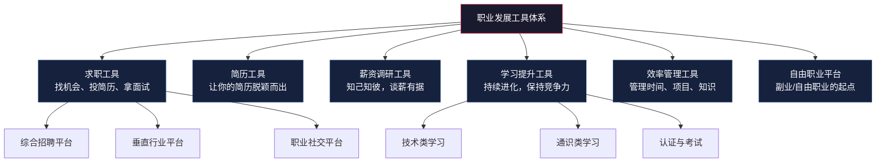
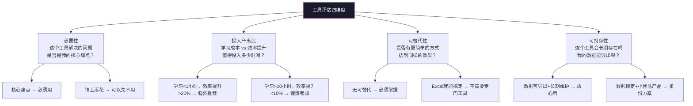

## 三、推荐工具

工具是职业发展的"效率层"——它们不直接教你知识，但能让你的求职、学习、自我管理效率提升数倍。一个用对工具的求职者，可能用别人投递 10 份简历的时间投出 50 份，且每一份都经过精准匹配；一个善用效率工具的职场人，每天多出 1-2 小时的深度工作时间，一年下来就是 300+ 小时的领先优势。

本章将职业发展工具分为六大类：求职工具、简历工具、薪资调研工具、学习提升工具、效率管理工具、自由职业平台。每类工具不仅列出"有什么"，更告诉你"怎么选"和"怎么用到极致"。

### 3.1 求职工具

求职不是"海投简历然后等电话"。高效的求职是一套系统工程：定位目标岗位 → 调研公司 → 精准投递 → 跟踪进度 → 面试准备。工具在这个流程中的作用是降低每个环节的摩擦成本。

#### 3.1.1 综合招聘平台

| 工具名称 | 定位 | 核心功能 | 适用场景 | 推荐指数 | 费用 |
|---------|------|---------|---------|---------|------|
| Boss直聘 | 互联网招聘首选 | 直接与HR/老板在线沟通，响应速度快，支持即时聊天 | 互联网、新兴行业求职 | ★★★★★ | 免费 |
| 智联招聘 | 综合性招聘平台 | 覆盖行业广，职位数量大，支持简历置顶和精准推荐 | 各行业求职，尤其是非互联网行业 | ★★★★ | 免费/付费 |
| 前程无忧 | 传统招聘平台 | 制造业、零售、金融等传统行业覆盖好，校招资源丰富 | 传统行业求职、应届生校招 | ★★★★ | 免费/付费 |

**Boss直聘**是当前互联网行业求职的第一选择。它的核心优势是"直聊模式"——你可以直接和招聘方的HR甚至部门负责人对话，省去了传统招聘平台"投简历→等筛选→等电话"的漫长周期。根据平台数据，Boss直聘上平均的简历回复时间在24小时以内，远快于传统平台的3-7天。

使用技巧：
- **主动出击不要等**：不要只投递已发布的职位，主动搜索目标公司并发起沟通。很多岗位在正式发布前，HR已经通过直聊找到了合适的人
- **优化你的在线状态**：设置"在职-暂不考虑"会大幅减少曝光，建议设置为"在职-看看机会"以获得更多推荐
- **聊天开场白决定回复率**：不要只发"你好，我对这个岗位感兴趣"。好的开场白应该包含：你的核心优势（1-2句话）、为什么对这个岗位感兴趣、一个具体的问题。例如："您好，我有5年B端产品经验，主导过XX项目DAU从10万到100万的增长。看到贵司正在招聘高级产品经理，想了解一下这个岗位目前负责的产品线和团队规模？"
- **善用"牛人"功能**：HR端可以看到"牛人"标签的候选人，完善个人主页、获得前同事评价可以提升曝光

**智联招聘**的优势在于覆盖面。如果你在非一线城市、非互联网行业求职，智联的职位数量通常多于Boss直聘。它的"简历诊断"功能可以给出基础的优化建议，但深度有限。

**前程无忧**在传统制造业、快消、金融等行业有深厚的积累。如果你的目标是宝洁、联合利华、四大会计师事务所这类企业，前程无忧是必看的渠道。它的校招板块也是应届生的重要入口。

#### 3.1.2 垂直与中高端平台

| 工具名称 | 定位 | 核心功能 | 适用场景 | 推荐指数 | 费用 |
|---------|------|---------|---------|---------|------|
| 猎聘 | 中高端招聘 | 猎头资源丰富，年薪20万+岗位占比高 | 资深职场人、管理层、技术专家 | ★★★★ | 免费/付费 |
| 拉勾网 | 互联网垂直 | 互联网行业职位集中度高，薪资透明 | 互联网行业求职 | ★★★★ | 免费 |
| 牛客网 | 技术求职社区 | 笔试题库、面经分享、内推信息 | 程序员、算法工程师求职 | ★★★★★ | 免费/付费 |

**猎聘**的核心价值是猎头生态。当你的年薪达到20万以上，很多好机会不会出现在公开招聘平台上——它们通过猎头渠道流转。猎聘上有超过20万名认证猎头，你可以主动联系他们，也可以设置简历对猎头可见。关键技巧：不要等猎头来找你，主动搜索目标公司的猎头职位并投递，或者直接联系发布该职位的猎头。

**拉勾网**曾经是互联网求职的首选，近年来市场份额有所下降，但在技术岗位的集中度上仍有优势。它的"公司评价"功能可以帮助你了解目标公司的真实工作体验。

**牛客网**是程序员求职的必备工具。它提供的不只是招聘信息，更是一套完整的技术求职准备体系：
- **笔试题库**：覆盖各公司历年笔试真题，支持在线编程
- **面经分享**：用户自发分享的面试经历，包含具体题目和答案
- **内推信息**：大量公司员工发布内推码，内推的简历通过率通常高于海投3-5倍
- **薪资爆料**：用户匿名分享的offer详情，包括base、股票、签字费等

#### 3.1.3 职业社交平台

| 工具名称 | 定位 | 核心功能 | 适用场景 | 推荐指数 | 费用 |
|---------|------|---------|---------|---------|------|
| LinkedIn（领英） | 全球职业社交 | 建立国际职业网络、个人品牌展示、外企招聘 | 外企求职、国际化发展 | ★★★★★ | 免费/付费 |
| 脉脉 | 国内职场社交 | 公司点评、匿名爆料、职场人脉、行业圈子 | 了解公司内部信息、职场社交 | ★★★★ | 免费 |

**LinkedIn**不只是一个招聘平台，它是一个**职业品牌的建设工具**。在欧美企业（包括在中国的外企），LinkedIn是招聘的第一渠道。很多中高端岗位甚至只在LinkedIn上发布，不走传统招聘平台。

LinkedIn的核心使用策略：
- **完善个人主页**：标题不只是你的职位，应该写成你的价值主张。例如"帮助B端企业实现用户增长的产品经理 | 主导过3个从0到1的SaaS产品"
- **定期发布内容**：每周至少发1篇专业相关内容（行业观察、项目复盘、技术分享），这是建立"思想领导力"的最有效方式
- **主动连接**：不要只加认识的人。主动连接目标公司的员工、行业KOL、猎头。发送连接请求时附上简短的自我介绍和连接理由
- **善用"Creator Mode"**：开启后你的主页会变成内容创作者风格，增加内容曝光

**脉脉**是国内版的"LinkedIn+Glassdoor"，它的独特价值在于**匿名信息**。在脉脉的"职言"板块，你可以看到员工对公司的真实评价、薪资爆料、裁员信息等。这些信息在其他平台上几乎不可能获得。使用脉脉调研目标公司时，重点关注：最近半年的评价趋势（而不是单条评价）、离职员工的反馈（比在职员工更坦诚）、薪资爆料的中位数（而不是极端值）。

#### 3.1.4 求职工具的组合策略

单独使用任何一个平台都不够。高效的求职者通常采用"1主+2辅+1社交"的组合策略：

| 角色 | 工具选择 | 作用 |
|------|---------|------|
| 主力平台 | Boss直聘（互联网）或智联/前程无忧（传统行业） | 日常投递、获取面试机会 |
| 辅助平台1 | 猎聘或拉勾 | 补充中高端或垂直岗位 |
| 辅助平台2 | 牛客网或行业垂直社区 | 面试准备、内推信息、面经 |
| 社交平台 | LinkedIn + 脉脉 | 个人品牌、公司调研、人脉拓展 |

### 3.2 简历工具

简历是求职的"入场券"。HR平均花6秒扫描一份简历，你的简历工具需要帮你在6秒内传递最大价值。简历工具的选择取决于你的岗位类型和设计能力。

#### 3.2.1 简历工具对比

| 工具名称 | 定位 | 核心功能 | 适合人群 | 推荐指数 | 费用 |
|---------|------|---------|---------|---------|------|
| 超级简历 | AI简历优化 | AI改写、JD匹配分析、模板丰富、一键排版 | 国内求职者，尤其是不擅长写简历的人 | ★★★★★ | 免费/付费 |
| 木及简历 | AI简历优化 | AI简历润色、JD智能匹配、多模板导出 | 国内求职者，注重简历内容优化 | ★★★★ | 免费/付费 |
| Canva | 设计类简历 | 海量设计模板、拖拽式编辑、导出PDF | 设计师、创意类岗位、需要视觉冲击力的简历 | ★★★★ | 免费/付费 |
| LaTeX（Overleaf） | 专业排版 | 精确的排版控制、学术风格、代码友好 | 学术研究者、程序员、算法工程师 | ★★★★ | 免费 |
| FlowCV | 简历生成器 | 界面简洁、实时预览、多格式导出 | 追求简洁高效的求职者 | ★★★★ | 免费 |
| Reactive Resume | 开源简历工具 | 完全免费开源、隐私友好、模板丰富 | 注重隐私、不想上传简历到第三方的用户 | ★★★★ | 免费 |

#### 3.2.2 如何选择简历工具

选择简历工具的关键不是"哪个最好"，而是"哪个最适合你的场景"：

**场景一：你是非设计类岗位的普通求职者**

推荐使用**超级简历**或**木及简历**。这两款工具的AI功能可以帮你：
- 分析目标岗位的JD（Job Description），提取关键词
- 对比你的简历与JD的匹配度，指出缺失的关键词
- 智能改写简历中的项目描述，用更专业的语言表达
- 自动排版，确保格式规范

使用建议：不要完全依赖AI改写。AI生成的内容可能过于模板化，你需要在此基础上加入个人特色和具体数据。一个好的项目描述应该包含：背景（为什么做）、行动（你做了什么）、结果（产生了什么影响，用数据量化）。

**场景二：你是设计师、创意类岗位**

推荐使用**Canva**。创意类岗位的简历本身就是你的作品集的一部分。Canva提供了大量视觉冲击力强的模板，你可以根据目标公司的风格选择合适的模板。

使用建议：
- 不要过度设计。简历的核心是内容，设计是加分项。确保排版清晰、层次分明
- 导出为PDF格式，避免格式在不同设备上变形
- 文件名用"姓名-目标岗位-简历.pdf"的格式，方便HR管理

**场景三：你是程序员、学术研究者**

推荐使用**LaTeX**（通过Overleaf在线编辑）。LaTeX的优势在于：
- 精确的排版控制，代码和公式显示效果极佳
- 版本管理方便，可以追踪简历的修改历史
- 学术圈和技术圈认可度高

使用建议：Overleaf上有大量简历模板，直接搜索"CV"或"Resume"即可。推荐使用"Awesome CV"或"Deedy Resume"模板。如果你不熟悉LaTeX语法，可以先用其他工具写好内容，再复制到LaTeX模板中。

#### 3.2.3 简历优化的核心原则

无论使用哪个工具，简历优化都遵循以下核心原则：

| 原则 | 说明 | 错误示例 | 正确示例 |
|------|------|---------|---------|
| 量化成果 | 用数据而非形容词描述成就 | "负责用户增长工作" | "主导用户增长策略，6个月内DAU从5万提升至15万，增长200%" |
| 关键词匹配 | 简历中包含JD的核心关键词 | "做了很多数据分析" | "使用SQL+Python进行用户行为分析，输出AB测试方案，转化率提升15%" |
| STAR法则 | 用Situation-Task-Action-Result结构描述项目 | "参与了XX项目" | "在XX项目中（S），负责用户增长模块（T），设计了裂变活动方案（A），实现新增用户50万，获客成本降低60%（R）" |
| 一页原则 | 应届生/初级岗位简历控制在一页 | 3页简历，事无巨细 | 一页精华，突出核心优势和关键成果 |
| 针对性投递 | 每份简历针对目标岗位定制 | 一份简历投所有岗位 | 根据不同岗位调整项目顺序和关键词 |

#### 3.2.4 常见简历工具使用误区

**误区一：过度依赖AI生成**

AI工具可以帮你优化语言和排版，但不能替你思考。很多求职者把JD粘贴进AI工具，让AI"生成"一份匹配的简历——这种简历千篇一律，HR一眼就能看出来。正确做法是：先自己梳理项目经历和成果，再用AI工具优化表达方式。

**误区二：模板越花哨越好**

除非你是设计师，否则简历模板应该简洁、专业、易读。花哨的模板不仅分散HR注意力，还可能在ATS（简历筛选系统）中被解析失败，导致你的简历直接被过滤掉。

**误区三：一份简历用到底**

不同公司、不同岗位看重的能力不同。你应该准备3-5个版本的简历，针对不同类型的岗位进行调整。至少，针对"技术岗"和"管理岗"应该有不同版本。

### 3.3 薪资调研工具

薪资谈判的前提是"信息对称"。如果你不知道目标岗位的市场薪资范围，你就在谈判中处于绝对劣势。薪资调研工具帮你建立这个信息基础。

#### 3.3.1 薪资调研工具对比

| 工具名称 | 数据来源 | 核心功能 | 适用场景 | 推荐指数 |
|---------|---------|---------|---------|---------|
| 看准网 | 员工匿名提交 | 公司薪资透明度查询、面试经验、公司评价 | 了解目标公司的真实薪资水平和面试流程 | ★★★★★ |
| Levels.fyi | 员工匿名提交 | 科技公司薪资数据库，含base/股票/奖金拆分 | 科技行业（尤其是大厂）薪资对标 | ★★★★★ |
| 职友集 | 招聘数据聚合 | 行业薪资报告、岗位薪资分布、城市对比 | 了解行业整体薪资趋势和岗位薪资区间 | ★★★★ |
| 薪酬网 | 专业薪酬调研 | 各职位薪资参考、薪酬结构分析 | 传统行业、国企、事业单位薪资参考 | ★★★★ |
| 猎聘薪资报告 | 猎头数据 | 年度薪资报告、行业薪资趋势 | 了解中高端岗位的市场薪资水平 | ★★★★ |
| offershow | 用户提交 | 大厂offer详情汇总 | 校招offer对比、了解大厂薪资包结构 | ★★★★★ |

#### 3.3.2 如何使用薪资调研工具

薪资调研不是简单地"搜一下看看多少钱"。你需要一个系统性的调研方法：

**第一步：确定基准岗位**

明确你要对标的具体岗位。"产品经理"和"B端SaaS产品经理"的薪资差异可能达到30-50%。越具体，数据越有参考价值。

**第二步：多平台交叉验证**

不要只看一个平台的数据。不同平台的数据来源和统计口径不同，交叉验证可以得到更准确的区间。建议至少查看3个平台的数据。

**第三步：关注薪资结构而非总数**

同样年薪50万，薪资结构可能完全不同：

| 结构类型 | 月base | 年终奖 | 股票/期权 | 签字费 | 特点 |
|---------|--------|--------|----------|-------|------|
| 高base型 | 3.5万×12 | 2个月 | 无 | 无 | 现金流稳定，风险低 |
| 高年终型 | 2.5万×12 | 10个月 | 无 | 无 | 年终奖不确定性高 |
| 高股票型 | 2万×12 | 2个月 | 40万/4年 | 10万 | 短期现金流低，长期收益取决于公司发展 |
| 综合型 | 2.8万×12 | 3个月 | 20万/4年 | 5万 | 各项均衡 |

**第四步：考虑城市和行业差异**

同一岗位在不同城市的薪资差异巨大。以高级Java开发为例：
- 北京/上海：40-70万
- 杭州/深圳：35-60万
- 成都/武汉：25-40万
- 二线城市：18-30万

**第五步：了解薪资谈判的锚点**

薪资调研的最终目的是为谈判提供锚点。一般来说，合理的期望涨幅：
- 跳槽涨幅：20-40%（正常市场环境）
- 内部晋升涨幅：15-25%
- 同级跳槽涨幅：10-20%
- 跨行业跳槽：可能需要接受一定降薪

#### 3.3.3 薪资调研的常见误区

**误区一：只看base，忽略总包**

很多公司的股票和奖金占总薪资的30-50%。只看月薪会严重低估实际收入。

**误区二：用极端数据做锚点**

网上流传的"某大厂P7年薪200万"通常是极端案例（包含多年积累的股票、签字费等）。你应该参考中位数而不是极端值。

**误区三：忽略隐性成本**

高薪岗位可能伴随着更高的工作强度、更长的通勤时间、更频繁的出差。计算"时薪"（年收入÷年工作小时数）比看年薪更有意义。

### 3.4 学习与技能提升工具

职业发展的本质是能力的持续增长。学习工具帮你更高效地获取新知识、新技能。选择学习工具时，关键不是"哪个平台最好"，而是"哪个平台最适合你当前的学习目标和学习方式"。

#### 3.4.1 技术类学习平台

| 平台名称 | 定位 | 核心内容 | 适合人群 | 推荐指数 | 费用 |
|---------|------|---------|---------|---------|------|
| 极客时间 | 技术专栏 | 深度技术专栏，由行业专家撰写，更新周期数月 | 中高级技术从业者 | ★★★★★ | 付费（专栏约99-199元） |
| B站 | 免费视频 | 海量免费技术教程，覆盖前端/后端/算法/运维 | 入门到中级技术学习者 | ★★★★★ | 免费 |
| 慕课网 | 技术实战 | 实战项目驱动的技术课程 | 希望通过项目练手的学习者 | ★★★★ | 免费/付费 |
| LeetCode | 算法练习 | 算法题库，面试刷题必备 | 程序员求职面试准备 | ★★★★★ | 免费/付费 |
| Kaggle | 数据科学 | 数据竞赛、数据集、学习课程 | 数据科学/机器学习从业者 | ★★★★★ | 免费 |

**极客时间**是中文技术学习的标杆平台。它的核心优势是"专栏制"——每篇文章由资深从业者撰写，持续更新数月，涵盖从原理到实践的完整知识体系。推荐策略：不要一次订阅太多专栏，选择1-2个与你当前工作最相关的专栏深度学习。典型的学习节奏是每天30分钟，一个专栏2-3个月完成。

**B站**已经从娱乐平台变成了中国最大的免费学习平台。它的技术内容质量参差不齐，但优秀的内容非常多。推荐的学习UP主类型：
- 高校教师的系统课程（如浙大翁恺的C语言、哈工大的操作系统）
- 一线工程师的实战分享（如技术架构设计、项目复盘）
- 面试准备类（算法讲解、系统设计面试）

**LeetCode**是程序员面试的"必修课"。建议的学习路径：
1. 先做Hot 100题（平台精选的100道高频题）
2. 按数据结构分类练习（数组→链表→树→图→动态规划）
3. 每天保持1-2题的手感，面试前集中刷目标公司的题库
4. 重点理解解题思路，而不是背诵答案

#### 3.4.2 通识类学习平台

| 平台名称 | 定位 | 核心内容 | 适合人群 | 推荐指数 | 费用 |
|---------|------|---------|---------|---------|------|
| 得到App | 通识知识 | 商业、管理、心理学、经济学等专栏和课程 | 希望拓宽知识面的职场人 | ★★★★ | 付费 |
| Coursera | 全球在线课程 | 名校课程，可获认证证书 | 希望系统学习或获得认证的人 | ★★★★★ | 免费旁听/付费认证 |
| 中国大学MOOC | 国内高校课程 | 国内名校课程，免费学习，可获认证 | 国内学习者，尤其是大学生 | ★★★★ | 免费 |
| MasterClass | 大师课程 | 各领域顶尖专家授课 | 对特定领域有深入兴趣的人 | ★★★ | 付费（偏贵） |
| 喜马拉雅/小宇宙 | 播客 | 商业、职场、心理学类播客 | 通勤时间学习 | ★★★★ | 免费/付费 |

**Coursera**是全球最优质的在线学习平台之一。它的核心价值在于课程质量——由斯坦福、MIT、耶鲁等顶级高校教授授课，课程体系完整。推荐策略：
- **旁听免费**：大部分课程可以免费旁听，只是不能获得证书和提交作业
- **认证值得投入的场景**：转行需要资质证明、公司报销培训费用、课程与你的职业目标直接相关
- **推荐专项课程（Specialization）**：比单门课程更系统，通常包含4-6门课+一个实战项目

**得到App**的优势在于内容的"提纯"——它把复杂的知识浓缩成易于消化的形式。适合的使用场景：通勤时间、碎片化学习、快速了解一个新领域的基础知识。但要注意：得到的内容偏"知识快餐"，对于需要深度掌握的技能，还是需要系统课程+实践。

#### 3.4.3 学习工具的组合策略

高效的学习不是"选一个平台从头学到底"，而是根据学习目标组合不同工具：

| 学习目标 | 推荐组合 | 说明 |
|---------|---------|------|
| 转行学习新技术 | B站入门 → 极客时间/慕课网进阶 → LeetCode刷题 | 从免费入门建立基础，再付费深入，最后刷题备战面试 |
| 提升管理能力 | 得到App通识 → Coursera系统课 → HBR阅读 | 碎片时间听通识，系统时间学课程，深度时间读文章 |
| 获得行业认证 | Coursera/中国大学MOOC → 认证考试官方资料 | 先系统学习，再针对性备考 |
| 保持技术敏感度 | 技术博客（InfoQ/掘金）→ GitHub Trending → 技术播客 | 每天30分钟追踪技术趋势 |

### 3.5 效率与管理工具

效率工具是职业发展的"基础设施"。它们不直接帮你找到工作或学到技能，但能让你在同样的时间内做更多、更好的事情。选择效率工具的原则是：**少而精**——深度使用1-2个工具，远好于浅尝辄止地使用10个。

#### 3.5.1 效率工具对比

| 工具名称 | 定位 | 核心功能 | 适合人群 | 推荐指数 | 费用 |
|---------|------|---------|---------|---------|------|
| Notion | 全能工作空间 | 笔记、数据库、看板、日历、Wiki一体化 | 需要"第二大脑"管理一切信息的人 | ★★★★★ | 免费/付费 |
| Obsidian | 双链笔记 | 本地Markdown笔记，双向链接，知识图谱 | 注重隐私、喜欢构建知识网络的人 | ★★★★★ | 免费 |
| 飞书 | 协作平台 | 文档、表格、日历、会议、OKR一体化 | 团队协作、个人知识管理 | ★★★★ | 免费/付费 |
| 滴答清单 | 任务管理 | 待办管理、日历、番茄钟、习惯打卡 | 需要简洁高效的任务管理工具的人 | ★★★★ | 免费/付费 |
| Forest | 专注力管理 | 番茄工作法，种树激励机制 | 容易被手机干扰、需要提升专注力的人 | ★★★★ | 付费（约12元） |
| Trello | 看板管理 | 拖拽式看板，适合项目进度管理 | 管理求职进度、副业项目、多线程任务 | ★★★★ | 免费/付费 |

#### 3.5.2 Notion vs Obsidian 深度对比

这是职场人最常纠结的选择。两者定位不同，适合不同需求：

| 对比维度 | Notion | Obsidian |
|---------|--------|----------|
| **数据存储** | 云端（Notion服务器） | 本地（你的电脑） |
| **隐私性** | 数据在第三方服务器 | 数据完全在本地，隐私性极强 |
| **协作能力** | 原生支持多人协作 | 主要用于个人，协作需要付费插件 |
| **功能范围** | 笔记+数据库+看板+日历+Wiki | 纯笔记+知识图谱 |
| **学习曲线** | 中等，功能多需要时间摸索 | 中等偏高，插件生态需要探索 |
| **离线使用** | 有限（需要网络） | 完全支持（本地文件） |
| **长期风险** | 平台可能关闭或涨价 | 文件是标准Markdown，无平台依赖 |
| **最佳场景** | 团队协作、项目管理、需要数据库功能 | 个人知识管理、构建第二大脑、注重隐私 |

**建议**：如果你需要团队协作或项目管理，选Notion。如果你注重隐私、长期积累个人知识，选Obsidian。两者也可以并行使用——Notion管协作和项目，Obsidian管个人知识。

#### 3.5.3 用效率工具管理求职过程

求职本身就是一个需要项目管理的复杂过程。推荐用Trello或Notion建立一个求职看板：

求职看板示例（Trello/Notion看板视图）：

[目标公司]  →  [已投递]  →  [笔试中]  →  [面试中]  →  [已拿offer]  →  [已拒绝/已放弃]
  字节跳动      阿里巴巴      腾讯         美团          拼多多
  小红书        快手                              网易
  理想汽车      蔚来

每个卡片中记录：投递日期、岗位链接、简历版本、面试官信息、面试问题记录、薪资谈判进展。这样做的好处是：
1. 一目了然地看到求职全局进展
2. 不会遗漏任何一家公司的后续跟进
3. 面试后及时复盘记录，为下一轮面试做准备
4. 当多个offer同时来时，有完整的信息做决策

#### 3.5.4 专注力管理的科学方法

**Forest**的底层逻辑是"番茄工作法"——25分钟专注+5分钟休息的循环。研究表明，这种方法对需要深度思考的工作（写代码、写方案、数据分析）特别有效。

使用建议：
- **25分钟不是铁律**：如果你进入了"心流"状态，不要因为番茄钟响了就中断。可以调整为50分钟+10分钟的节奏
- **配合环境管理**：Forest帮你抵御手机干扰，但你还需要管理电脑上的干扰（关闭微信通知、使用浏览器插件屏蔽社交媒体）
- **建立仪式感**：每次开始专注前，花1分钟明确"这25分钟我要完成什么"，结束后花1分钟记录"完成了什么"

### 3.6 自由职业平台

自由职业和远程工作正在成为越来越多人的选择。如果你有可变现的技能（编程、设计、写作、翻译、营销），自由职业平台可以帮你找到客户。

#### 3.6.1 自由职业平台对比

| 平台名称 | 定位 | 核心优势 | 适合人群 | 推荐指数 | 费用模式 |
|---------|------|---------|---------|---------|---------|
| Upwork | 全球最大自由职业平台 | 客户质量高、项目金额大、支付有保障 | 有英语能力的技术/设计/写作人才 | ★★★★★ | 平台抽成10-20% |
| Fiverr | 服务交易平台 | 以"服务包"形式销售，起步门槛低 | 创意类、设计类、营销类人才 | ★★★★ | 平台抽成20% |
| 猪八戒网 | 国内自由职业平台 | 国内客户多，无需英语 | 设计、开发、营销等 | ★★★ | 平台抽成 |
| 电鸭社区 | 远程工作社区 | 国内远程工作信息聚合，社区氛围好 | 互联网行业远程工作者 | ★★★★ | 免费 |
| 程序员客栈 | 技术外包平台 | 程序员专属，项目匹配度高 | 程序员、设计师 | ★★★ | 平台抽成 |
| Toptal | 高端自由职业 | 只接受Top 3%的自由职业者，时薪高 | 资深技术人才 | ★★★★★ | 平台抽成 |

#### 3.6.2 自由职业平台使用策略

**新手入门路径（Upwork为例）**：

1. **完善个人资料**：这是你的"简历"。重点展示：专业技能、过往作品集（Portfolio）、客户评价。新手没有评价很正常，可以通过降低初期报价来获取第一批客户
2. **精准投标**：不要海投。每个项目花10-15分钟定制投标信，说明你对这个项目的理解、你的相关经验、你的执行计划。数据表明，定制化的投标信的中标率是模板化投标信的5倍以上
3. **从小项目做起**：先接一些$100-500的小项目，积累5星评价。有了10+个5星评价后，你就可以开始接大项目了
4. **建立长期关系**：优质客户比优质项目更重要。完成项目后主动跟进，提供后续支持，争取成为客户的长期合作者
5. **逐步提价**：每完成5-10个项目，适当提高报价。Upwork的算法会根据你的评价和完成率提升你的搜索排名

**国内平台 vs 国际平台的选择**：

| 考虑因素 | 国际平台（Upwork/Fiverr） | 国内平台（猪八戒/程序员客栈） |
|---------|------------------------|--------------------------|
| 收入水平 | 时薪$20-100+，明显高于国内 | 项目制为主，单价偏低 |
| 语言要求 | 需要英语沟通能力 | 中文无障碍 |
| 支付方式 | 美元结算，需要PayPal/Payoneer | 人民币直接结算 |
| 竞争程度 | 全球竞争，但优质客户多 | 国内竞争激烈，价格战严重 |
| 适合阶段 | 有一定经验和英语能力后 | 刚开始自由职业时的起步平台 |

#### 3.6.3 自由职业的注意事项

**收入波动管理**：自由职业的收入不是线性的，可能某个月接3个项目赚3万，下个月只有1个项目赚8千。建议在收入高的月份存下至少30%作为缓冲基金，目标是覆盖6个月的基本生活开支。

**合同和付款保障**：在国际平台上，使用平台的托管支付（Escrow）功能保护自己。在国内平台或私下接单时，一定要签合同，并约定分期付款（如30%预付+40%中期+30%尾款）。

**税务合规**：自由职业收入需要自行申报个税。国际平台的美元收入需要关注外汇管制和税务合规问题。建议咨询专业税务顾问。

**持续学习和技能更新**：自由职业者的竞争力完全取决于技能水平。你需要持续投资学习，保持技能的市场竞争力。建议每年至少投入收入的5-10%用于学习和技能提升。

### 3.7 工具选择的元框架

最后，分享一个选择任何职业发展工具的通用框架。面对一个新工具时，用以下四个维度评估：

**黄金法则**：工具是手段，不是目的。最好的工具是你真正会用、持续在用的那个。不要陷入"工具焦虑"——总觉得有更好的工具、一直在换工具、花在选工具上的时间比用工具还多。选定1-2个核心工具，深度使用，形成习惯，这才是效率的真正来源。

***
