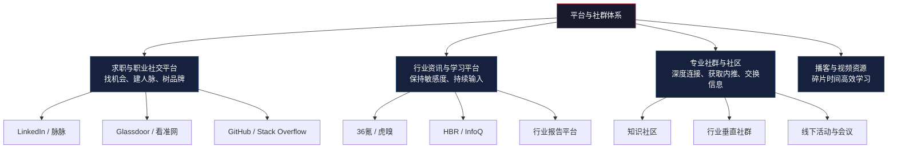
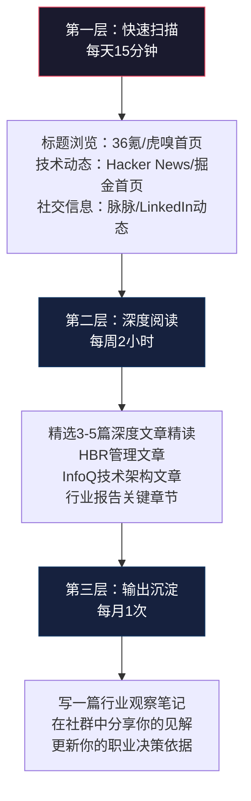
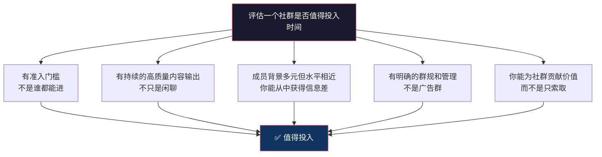
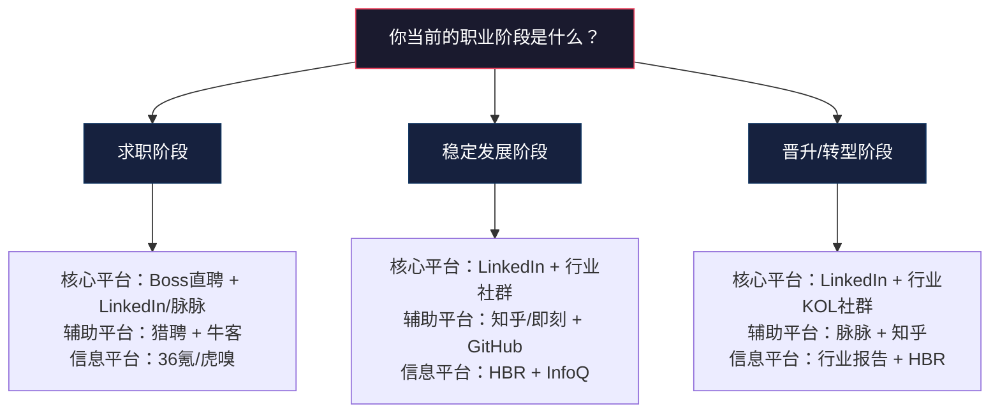

## 四、推荐平台与社群

平台和社群在职业发展资源金字塔中横跨两个层级：它们既是**效率层**（求职平台帮你高效获取机会），也是**行动层**（社群推动你真正改变行为）。工具帮你做事更快，书籍帮你认知更深，但只有平台和社群能帮你**连接到人**——而职业发展的本质，归根结底是人与人的连接。

本章将平台与社群分为四大类：求职与职业社交平台、行业资讯与学习平台、专业社群与社区、播客与视频资源。每一类不仅告诉你"有什么"，更告诉你"怎么用到极致"和"怎么避坑"。

---

### 4.1 求职与职业社交平台

求职平台解决的是"信息不对称"问题——你不知道哪里有好机会，平台不知道你是谁。职业社交平台解决的是"关系不对称"问题——好机会往往通过人脉流动，而不是公开招聘。两者互补，缺一不可。

#### 4.1.1 LinkedIn（领英）

**平台定位**：全球最大的职业社交平台，注册用户超过10亿，覆盖200多个国家和地区。在中国市场，LinkedIn主要服务外企求职者和有国际化需求的职场人。

**核心价值矩阵**：

| 价值维度 | 具体功能 | 适用场景 |
|---------|---------|---------|
| 人脉建设 | 连接行业人士、猎头、HR | 拓展职业网络，获取内推机会 |
| 个人品牌 | 发布专业内容、建立思想领导力 | 吸引猎头关注，建立行业影响力 |
| 求职投递 | 在线申请职位、查看公司信息 | 外企和跨国公司求职 |
| 行业洞察 | 关注行业领袖、阅读专业文章 | 了解行业趋势和最佳实践 |
| 学习成长 | LinkedIn Learning课程 | 系统学习职业技能 |

**详细使用策略**：

**第一步：打造高转化率的个人主页**

LinkedIn的个人主页是你的"数字名片"。HR和猎头平均花7秒决定是否继续看你的主页。你需要在这7秒内传递最大价值。

- **标题（Headline）**：不要只写职位名称。好的标题 = 你的角色 + 你的核心价值 + 你的差异化。对比：
  - 差：`Product Manager at XX Company`
  - 好：`Senior Product Manager | B2B SaaS Growth Expert | Scaled DAU from 100K to 2M in 18 months`

- **头像**：专业照，不是自拍，不是旅游照。背景简洁，面部占画面60%以上，穿职业装或商务休闲装。

- **摘要（About）**：用第一人称写，300-500字。结构：你做什么（1句）→ 你擅长什么（2-3句）→ 你的成就亮点（用数据量化）→ 你的职业目标/兴趣方向 → CTA（联系方式或合作意向）。

- **经历描述**：每个职位用3-5个要点，每个要点遵循"Action Verb + What + Result"格式。例如：`Spearheaded the redesign of the onboarding flow, reducing time-to-value by 40% and increasing 30-day retention from 62% to 78%.`

- **技能与推荐**：至少列出10项核心技能，请同事和前领导为你写推荐信（Recommendations）。互惠原则：你先给别人写，别人更可能回写。

**第二步：建立内容发布节奏**

LinkedIn的算法偏好"持续输出者"。每周发布2-3条内容，比一次发10条然后沉默一个月效果好10倍。

内容类型推荐：

| 内容类型 | 发布频率 | 示例 | 互动率 |
|---------|---------|------|--------|
| 行业观察/趋势分析 | 每周1条 | "我观察到XX行业正在发生三个变化..." | 高 |
| 项目复盘/经验分享 | 每两周1条 | "我主导的XX项目踩了这三个坑..." | 很高 |
| 原创观点/思辨 | 每周1条 | "为什么我认为XX是一个误区..." | 极高 |
| 转发+评论 | 随时 | 转发行业文章并加上自己的见解 | 中 |
| 职业里程碑 | 适时 | 新工作、晋升、项目上线 | 高 |

关键技巧：LinkedIn的内容传播遵循"弱关系扩散"——你的一度连接看到你的内容后点赞/评论，他们的二度连接也会看到。因此，引发评论比引发点赞更重要。在内容末尾提一个开放性问题，是提升评论率的有效方法。

**第三步：主动构建人脉网络**

不要等别人来加你。每周花30分钟主动拓展人脉：

1. **连接目标公司的人**：搜索你想去的公司的员工，发送连接请求时附上个性化说明
2. **连接行业KOL**：关注并连接你所在领域的意见领袖，定期与他们的内容互动
3. **连接猎头**：搜索你所在行业的猎头，建立关系。不要等需要找工作时才联系猎头
4. **参加LinkedIn活动**：LinkedIn定期举办线上活动和直播，是认识同行的好机会

连接请求模板：
Hi [Name], I'm a [your role] with [X years] of experience in [industry/field]. 
I noticed your impressive work on [specific project/article], and I'd love to 
connect and learn from your insights on [specific topic]. 
Looking forward to staying in touch!

**第四步：善用Creator Mode**

开启Creator Mode后，你的主页会从"求职者"风格转变为"内容创作者"风格：关注按钮取代连接按钮，你的内容获得更高的算法权重，可以使用LinkedIn Newsletter功能积累订阅者。适合有稳定内容输出能力的用户开启。

**注意事项**：

- LinkedIn Premium的付费功能（InMail、查看谁浏览了你的主页）对于主动求职者有价值，但如果你只是维护人脉，免费版足够
- 在中国使用LinkedIn需要科学上网，且国内活跃度不如脉脉。如果你的目标是外企或海外市场，LinkedIn是首选；如果是国内企业，脉脉更实用
- 不要在LinkedIn上频繁发送推销信息，这会被标记为垃圾信息，影响你的账号信誉

#### 4.1.2 脉脉

**平台定位**：中国最大的职场社交平台，注册用户超过1.2亿。核心价值是**匿名信息**——在脉脉的"职言"板块，你可以看到员工对公司的真实评价、薪资爆料、裁员信息、组织架构变动等在其他平台上几乎不可能获得的信息。

**核心价值矩阵**：

| 价值维度 | 具体功能 | 适用场景 |
|---------|---------|---------|
| 公司调研 | 职言匿名评价、公司点评 | 求职前了解目标公司真实情况 |
| 薪资透明 | 薪资爆料、offer详情分享 | 薪资谈判前的信息收集 |
| 人脉拓展 | 行业圈子、同事圈 | 拓展职场人脉、获取内推 |
| 行业动态 | 行业热搜、话题讨论 | 了解行业最新动向和八卦 |
| 求职投递 | 在线投递、直聊HR | 国内互联网和新兴行业求职 |

**详细使用策略**：

**策略一：用脉脉做公司尽职调查**

脉脉的公司评价系统是国内最接近Glassdoor的工具。在决定是否接一个offer之前，你应该在脉脉上做以下调研：

1. **搜索目标公司，查看最近6个月的评价趋势**：不要只看单条评价，要看整体趋势。如果最近3个月负面评价突然增多，可能是组织架构调整或裁员的信号
2. **重点关注离职员工的评价**：在职员工的评价往往偏正面（有顾虑），离职员工更坦诚
3. **看薪资爆料的中位数而非极端值**：单条"某P7年薪200万"的爆料可能是极端案例或虚假信息，取多条爆料的中位数更有参考价值
4. **关注"面试"板块**：了解目标公司的面试流程、面试难度、常见问题

**策略二：建立有效的职场人脉**

脉脉的人脉拓展逻辑和LinkedIn不同——它更依赖"同事关系"和"行业圈子"。

- **同事圈**：脉脉会自动识别你的同事关系（通过公司认证）。加入前同事的圈子，保持联系。前同事是内推的最佳来源
- **行业圈子**：加入你所在行业的圈子，定期参与讨论。在圈子里有质量的发言会吸引同行主动连接
- **主动私信**：脉脉的私信功能比LinkedIn更轻量。对于想深入了解的公司或行业人士，可以直接私信请教

**策略三：利用匿名板块获取信息**

脉脉的"职言"板块是信息金矿，但需要辨别能力：

| 信息类型 | 可信度 | 辨别方法 |
|---------|--------|---------|
| 薪资爆料 | 中等 | 多条交叉验证，关注评论区的补充信息 |
| 裁员信息 | 较高 | 通常很快被其他员工证实或否认 |
| 公司评价 | 中等 | 关注具体描述而非情绪化表达 |
| 行业内幕 | 较低 | 需要多方验证，匿名信息可能带有个人偏见 |
| 面试经验 | 较高 | 具体题目和流程描述通常可靠 |

**注意事项**：

- 脉脉的匿名性是双刃剑。你在上面发布的内容（即使是非匿名的）也可能被同事看到，注意职业形象管理
- 不要过度沉迷于脉脉的"职场八卦"，它很容易变成时间黑洞。建议每天浏览不超过15分钟
- 脉脉的求职功能（直聊）不如Boss直聘活跃，建议将脉脉定位为"信息收集工具"而非"求职投递工具"

#### 4.1.3 Glassdoor

**平台定位**：全球最大的职场点评网站，覆盖全球190多个国家。核心价值是员工匿名评价和薪资透明。在中国市场使用较少，但在外企求职和海外求职中是必备工具。

**核心功能**：

- **公司评价**：员工对公司文化、管理层、工作生活平衡的匿名评分（1-5分制）
- **薪资数据**：按公司、职位、地区分类的薪资数据库，数据来自员工匿名提交
- **面试经验**：用户分享的面试流程、面试问题、面试难度
- **职位搜索**：整合了公司评价和薪资数据的求职功能

**使用策略**：

1. **看评价时关注"Broad Approval Rating"（总体认可率）**：这个指标比单条评价更有参考价值
2. **利用"Interviews"板块准备面试**：搜索目标公司的面试经验，了解常见问题和面试流程
3. **薪资数据用于跨区域对标**：如果你考虑去海外工作，Glassdoor的薪资数据是最权威的参考之一
4. **对比同行业公司的评分**：不要只看绝对分数，要看与同行业公司的相对排名

#### 4.1.4 其他求职平台速查表

| 平台名称 | 定位 | 核心优势 | 适用场景 | 推荐指数 |
|---------|------|---------|---------|---------|
| Boss直聘 | 互联网招聘首选 | 直聊模式、响应速度快 | 互联网/新兴行业求职 | ★★★★★ |
| 智联招聘 | 综合招聘平台 | 覆盖行业广、职位数量大 | 非互联网行业、非一线城市 | ★★★★ |
| 前程无忧 | 传统招聘平台 | 制造业/零售/金融覆盖好 | 传统行业、应届生校招 | ★★★★ |
| 猎聘 | 中高端招聘 | 猎头资源丰富 | 年薪20万+岗位 | ★★★★ |
| 拉勾网 | 互联网垂直 | 技术岗位集中度高 | 技术岗求职 | ★★★★ |
| 牛客网 | 技术求职社区 | 笔试题库、面经、内推 | 程序员求职准备 | ★★★★★ |
| Indeed | 全球综合招聘 | 覆盖面广、职位数量大 | 海外求职 | ★★★★ |

**求职平台组合策略**：高效求职者通常采用"1主+2辅+1社交"的组合策略，详见推荐工具章节的3.1.4节。

---

### 4.2 行业资讯与学习平台

行业资讯平台的作用不是让你"什么都知道"，而是让你**比同行更快地知道关键变化**。在信息爆炸时代，获取信息不是能力，筛选信息才是。你需要的不是每天刷30分钟新闻，而是每周花2小时深度阅读3-5篇高质量文章。

#### 4.2.1 科技与商业资讯平台

**36氪**

- **定位**：中国领先的科技商业媒体，成立于2010年
- **核心价值**：深度报道科技行业趋势、商业模式创新、创业动态、投融资信息
- **适用人群**：互联网/科技行业从业者、创业者、投资人
- **推荐指数**：★★★★

使用策略：
- **每日快讯**：浏览首页标题，5分钟了解当天行业大事
- **深度报道**：每周精读2-3篇深度文章，重点关注与你所在领域相关的报道
- **"36氪Pro"**：付费会员，提供更深度的行业分析报告和投融资数据。如果你在投资、战略、BD等需要行业洞察的岗位，值得订阅
- **关注专栏作者**：36氪有一些高质量的专栏作者，关注他们比刷首页更高效

**虎嗅**

- **定位**：商业分析与评论平台，以深度、犀利的商业评论著称
- **核心价值**：深度商业分析、行业洞察、商业案例拆解
- **适用人群**：关注商业趋势的职场人、企业管理者
- **推荐指数**：★★★★

使用策略：
- **与36氪形成互补**：36氪偏"资讯+报道"，虎嗅偏"分析+评论"。两者结合使用效果最佳
- **关注"虎嗅Pro"**：深度行业报告和分析文章，适合需要做行业研究的岗位
- **参与评论互动**：虎嗅的评论区质量较高，参与讨论可以拓展视野

**晚点LatePost**

- **定位**：深度科技商业报道，聚焦中国科技巨头和独角兽
- **核心价值**：独家深度报道，对中国科技公司的战略分析质量极高
- **适用人群**：科技行业从业者、关注中国科技格局的职场人
- **推荐指数**：★★★★★

使用策略：
- 晚点的报道频率不高，但每篇都是精品。建议每篇都读
- 关注其对大厂组织架构调整、战略方向变化的报道，这些信息对求职和职业决策有直接价值

#### 4.2.2 管理与领导力平台

**哈佛商业评论（HBR）**

- **定位**：全球顶级商业管理媒体，由哈佛商学院出版
- **核心价值**：基于研究的管理思想、领导力发展、组织管理最佳实践
- **适用人群**：中高层管理者、MBA学生、管理咨询从业者
- **推荐指数**：★★★★★

使用策略：
- **HBR中文版**：微信公众号"哈佛商业评论"提供精选文章的中文翻译，免费阅读
- **英文原版**：hbr.org提供更全面的内容。付费订阅（$12/月起）可以解锁所有文章
- **精读策略**：HBR的文章偏学术和深度，不适合快速浏览。建议每周选1-2篇与你当前管理挑战相关的文章，深度阅读并做笔记
- **推荐关注领域**：领导力、团队管理、组织变革、战略决策、职业发展

**中欧商业评论 / 长江商学院案例**

- **定位**：中国本土商学院的商业分析平台
- **核心价值**：结合中国商业环境的管理案例和分析
- **适用人群**：中国企业管理者、关注本土商业实践的职场人
- **推荐指数**：★★★★

#### 4.2.3 技术资讯与学习平台

**InfoQ**

- **定位**：全球技术社区，聚焦软件开发、架构设计、DevOps等领域
- **核心价值**：前沿技术资讯、架构设计最佳实践、技术大会演讲
- **适用人群**：技术从业者（尤其是中高级工程师、架构师）
- **推荐指数**：★★★★★

使用策略：
- **InfoQ中文站**（infoq.cn）：提供中文翻译内容和国内技术大会信息
- **关注技术趋势报告**：每年发布的"技术趋势报告"是了解行业技术发展方向的权威参考
- **技术大会演讲**：QCon、ArchSummit等大会的演讲视频和PPT在InfoQ上免费观看
- **写作投稿**：InfoQ接受社区投稿，发表技术文章可以提升你在技术圈的影响力

**掘金 / CSDN / 博客园**

- **定位**：中文技术博客社区
- **核心价值**：一线工程师的技术实践分享、问题解决方案
- **适用人群**：技术从业者
- **推荐指数**：★★★★（掘金）/ ★★★（CSDN、博客园）

使用策略：
- **掘金**：内容质量相对较高，社区氛围好。建议关注你所在技术栈的优质作者
- **CSDN**：内容量大但质量参差不齐。适合搜索具体技术问题的解决方案
- **写作价值**：在技术社区持续写作是建立技术影响力的有效方式。很多技术专家的职业机会来自于他们在社区的影响力

**Hacker News**

- **定位**：由Y Combinator运营的科技新闻社区
- **核心价值**：全球技术圈的风向标，高质量的技术讨论
- **适用人群**：关注全球技术趋势的从业者
- **推荐指数**：★★★★

使用策略：
- 每天花10分钟浏览首页标题，了解全球技术圈在讨论什么
- 评论区的讨论质量极高，很多硅谷工程师和创业者参与讨论
- 适合英语能力较好的技术从业者

#### 4.2.4 行业报告平台

行业报告是做行业研究、公司分析、职业决策的重要参考。以下是获取高质量行业报告的渠道：

| 平台/渠道 | 报告类型 | 获取方式 | 适用场景 |
|----------|---------|---------|---------|
| 艾瑞咨询 | 互联网行业报告 | 官网免费下载部分报告 | 了解互联网行业趋势 |
| 易观分析 | 数字化行业分析 | 官网免费/付费 | 数字化转型、行业数字化程度 |
| 麦肯锡中国 | 管理咨询报告 | 官网免费下载 | 宏观经济、行业战略分析 |
| 贝恩公司 | 行业洞察报告 | 官网免费下载 | 消费、零售、科技行业分析 |
| 德勤/普华永道 | 行业研究报告 | 官网免费下载 | 金融、科技、消费行业 |
| CB Insights | 科技创投报告 | 官网免费/付费 | 科技创业、投融资趋势 |
| 36氪Pro | 中国创投报告 | 付费订阅 | 中国创投市场分析 |

**使用策略**：不要试图读完所有报告。根据你所在的行业和关注的问题，选择2-3个来源，定期阅读。建议建立一个"行业洞察笔记"系统，把读到的关键数据和洞察记录下来，在做职业决策时调用。

#### 4.2.5 资讯平台的组合策略

高效获取行业信息不是"每天刷遍所有平台"，而是建立一套"信息漏斗"：

**关键原则**：信息获取的目的是**支撑决策**，不是**消磨时间**。如果你发现自己每天花1小时刷资讯但从中获得的信息从未影响过你的任何决策，说明你的信息获取方式出了问题——要么来源不对，要么没有做筛选和沉淀。

---

### 4.3 专业社群与社区

社群是职业发展"行动层"的核心资源。书籍改变认知，工具提升效率，但只有社群能推动你**真正行动**。一个好的职业社群能给你带来：行业信息差、内推机会、同行反馈、情感支持、合作机会。

但社群也是最容易浪费时间的资源。90%的人加入社群后的轨迹是：刚加入时活跃几天 → 逐渐变成"潜水员" → 最终屏蔽群消息。问题不在社群，在于你没有建立正确的社群使用策略。

#### 4.3.1 知识型社区

**知乎**

- **定位**：中国最大的问答社区，用户超过5亿
- **核心价值**：高质量的职业问答、行业内部视角、专业知识分享
- **适用人群**：所有职场人
- **推荐指数**：★★★★

使用策略：

1. **搜索式使用，而非浏览式使用**：知乎的信息流容易变成时间黑洞。正确用法是带着问题搜索，而不是无目的地刷首页
2. **关注行业大V**：每个行业都有一些高质量的知乎创作者，关注他们比刷热门问题更高效
3. **回答问题建立影响力**：在你擅长的领域回答问题，是建立个人品牌的低成本方式。高质量回答会持续被推荐，带来长期曝光
4. **知乎盐选会员**：付费内容质量参差不齐，建议先试读再决定是否订阅
5. **警惕"知乎体"思维**：知乎上很多回答带有"先问是不是，再问为什么"的杠精文化，以及过度理性化的倾向。职业发展需要行动，不要陷入"想太多做太少"的陷阱

**即刻**

- **定位**：年轻人的兴趣社交平台，创业和科技氛围浓厚
- **核心价值**：创业动态、产品灵感、年轻人的职业思考、副业探索
- **适用人群**：互联网/科技行业从业者、创业者、对副业感兴趣的人
- **推荐指数**：★★★★

使用策略：
- **关注"圈子"**：即刻的圈子功能类似于主题社群。推荐关注：产品/运营/设计/技术相关圈子、创业/副业讨论圈、行业观察圈
- **轻量社交**：即刻的社交氛围比LinkedIn轻松，适合与同龄同行建立非正式联系
- **信息获取**：即刻上的信息更新速度快，很多行业动态在即刻上比在新闻媒体上更早出现

**小红书**

- **定位**：生活方式分享平台，近年成为职场内容的重要渠道
- **核心价值**：真实的职场经验分享、求职攻略、行业科普、简历/面试技巧
- **适用人群**：年轻职场人（尤其是应届生和初入职场者）
- **推荐指数**：★★★

使用策略：
- 搜索具体的职场问题（如"互联网面试技巧""产品经理简历"），小红书上有大量真实经验分享
- 注意辨别内容质量：小红书上的职场内容质量参差不齐，优先看有数据支撑和具体案例的内容
- 不要被"精致的职场生活"内容误导，小红书上的很多职场内容偏"包装"而非实质

#### 4.3.2 技术社区

**GitHub**

- **定位**：全球最大的代码托管平台，也是技术人的"作品集"
- **核心价值**：展示技术能力、参与开源项目、学习优秀代码
- **适用人群**：技术从业者
- **推荐指数**：★★★★★

使用策略：

GitHub对技术从业者的价值远不止"存代码"。它是你的**技术品牌**的核心载体。

1. **维护一个高质量的个人项目**：不需要很大，但要完整、有文档、有测试。一个有README、有CI/CD、有清晰commit history的项目，比10个半成品更有说服力
2. **参与开源项目**：为知名开源项目贡献代码是建立技术影响力的最佳方式。从小的issue开始（修复文档错误、修复typo），逐步参与核心功能开发
3. **GitHub Profile README**：GitHub支持个人主页的Profile README，用它来展示你的技术栈、重点项目、近期活动
4. **GitHub Sponsors / Star History**：关注项目的Star趋势可以了解技术社区的关注方向
5. **GitHub Actions**：用GitHub Actions构建CI/CD pipeline，展示你的DevOps能力

**Stack Overflow**

- **定位**：全球最大的程序员问答社区
- **核心价值**：技术问题解答、编程最佳实践、技术社区声誉
- **适用人群**：技术从业者
- **推荐指数**：★★★★

使用策略：
- 遇到技术问题时优先搜索Stack Overflow，90%的常见编程问题都有高质量解答
- 如果你回答了别人的问题并被采纳，会获得声誉积分。高声誉积分在技术社区是有价值的信号
- Stack Overflow的年度开发者调查报告是了解全球开发者生态的权威来源

**SegmentFault思否 / V2EX**

- **定位**：中文技术社区
- **核心价值**：中文技术问答、技术讨论、求职信息
- **适用人群**：中文技术从业者
- **推荐指数**：★★★

#### 4.3.3 行业垂直社群

行业垂直社群的价值在于**信息密度高**——群里的人都是同行，讨论的内容都与你的工作直接相关。但这类社群的质量差异极大，选择比努力更重要。

**如何找到高质量的行业社群**：

| 渠道 | 方法 | 判断标准 |
|------|------|---------|
| 行业KOL的付费社群 | 关注行业大V的公众号/即刻，看是否有付费社群 | 群主是否有持续输出能力，社群是否有准入门槛 |
| 行业会议/沙龙 | 参加行业活动后加入活动群 | 活动质量决定群质量，看参与者背景 |
| 公司内部社群 | 前同事群、公司校友群 | 前同事是最高质量的人脉来源 |
| 付费知识星球 | 搜索你所在行业的知识星球 | 看星主的更新频率和内容质量，看用户评价 |
| 行业协会/学会 | 加入行业协会的会员群 | 协会的权威性和历史决定群质量 |

**高质量社群的判断标准**：

**社群使用的"3-3-3法则"**：

- **3个核心社群**：深度参与，每周至少互动3次。这是你的"职业支持网络"
- **3个信息社群**：主要用来获取信息，每天浏览10分钟，不需要频繁发言
- **3个月评估周期**：每3个月评估一次每个社群对你是否有实际价值。如果一个社群3个月内没有给你带来任何有用的信息、人脉或机会，果断退出

#### 4.3.4 线下活动与行业会议

线下活动是建立深度人脉的最佳方式。一次30分钟的面对面交流，胜过3个月的线上互动。

**行业会议类型**：

| 会议类型 | 代表活动 | 适合人群 | 参加价值 |
|---------|---------|---------|---------|
| 技术大会 | QCon、ArchSummit、GopherChina | 技术从业者 | 学习前沿技术、认识同行 |
| 产品/设计大会 | IXDC、ProductCon | 产品/设计从业者 | 学习方法论、拓展人脉 |
| 创业/投资大会 | 36氪WISE、创业邦DEMO | 创业者、投资人 | 获取融资信息、认识合作伙伴 |
| 行业峰会 | 各行业协会年会 | 各行业从业者 | 了解行业趋势、建立行业人脉 |
| 本地Meetup | 各城市技术/行业Meetup | 所有职场人 | 低成本认识本地同行 |

**参加线下活动的策略**：

1. **提前准备**：查看活动议程和嘉宾名单，列出你想认识的人，准备简短的自我介绍
2. **主动社交**：不要只坐在座位上听演讲。茶歇和午餐时间是社交的黄金时段
3. **会后跟进**：活动结束后24小时内，给新认识的人发一条消息（微信/LinkedIn），提到你们聊过的话题。这是90%的人不会做的事情，但也是最重要的一步
4. **成为演讲者**：当你在某个领域有足够的积累时，申请成为活动的演讲者。这是建立行业影响力的最佳方式

#### 4.3.5 行业微信群/QQ群

微信群和QQ群是最"接地气"的行业社群，但也是最容易浪费时间的。大多数行业群的命运是：建群时热闹几天 → 变成广告群/沉默群 → 被群主解散或被成员屏蔽。

**如何找到高质量的行业群**：

- 通过行业KOL的公众号/社群入口加入
- 通过行业会议/活动的参会群加入
- 通过同事或朋友推荐加入
- 通过付费知识星球的配套群加入

**微信群的正确使用姿势**：

| 行为 | 效果 | 建议 |
|------|------|------|
| 只潜水不发言 | 几乎为零 | 至少每周参与1次有价值的讨论 |
| 频繁发广告 | 被踢/被屏蔽 | 永远不要在群里发广告 |
| 主动分享有价值的信息 | 高 | 分享行业报告、好文章、实用工具 |
| 回答别人的问题 | 高 | 帮助别人是建立信任的最佳方式 |
| 私加群友 | 中等 | 先在群里互动建立信任，再私加 |

---

### 4.4 播客与视频资源

播客和视频是"被动学习"的最佳载体——通勤、做家务、运动时都可以听。但被动学习的效率远低于主动学习，所以不要把播客/视频当作主要学习方式，而应该当作"补充输入"。

**核心原则**：听播客的目的是**拓宽视野**和**保持对行业的敏感度**，而不是系统学习某个技能。系统学习需要课程+实践+反馈，播客做不到这一点。

#### 4.4.1 职业发展类播客

| 播客名称 | 主播 | 核心主题 | 适合人群 | 推荐指数 |
|---------|------|---------|---------|---------|
| 《无人知晓》 | 孟岩 | 投资思考、职业选择、人生哲学 | 对职业和人生有深度思考的职场人 | ★★★★★ |
| 《组织进化论》 | 飞书团队 | 职场和组织管理的深度讨论 | 管理者、对组织管理感兴趣的人 | ★★★★ |
| 《Steve说》 | Steve | 职业发展、个人成长、心理学 | 年轻职场人 | ★★★★ |
| 《得意忘形》 | 张潇雨 | 人生和职业选择的哲学思考 | 对自我认知和职业方向有困惑的人 | ★★★★ |
| 《温柔一刀》 | 刀姐doris | 消费品牌、营销、创业 | 消费/营销行业从业者 | ★★★★ |
| 《三五环》 | 刘飞 | 互联网产品、创业、职场 | 产品经理、创业者 | ★★★★ |
| 《商业就是这样》 | 商业周刊 | 商业现象深度解读 | 关注商业趋势的职场人 | ★★★★ |
| 《疯投圈》 | 黄海/Rio | 消费投资、商业模式分析 | 消费行业、投资从业者 | ★★★★ |

**播客的高效使用方法**：

1. **建立"播客清单"**：把值得听的播客按主题分类（职业发展、行业洞察、管理、投资等），根据当前需求选择
2. **1.5倍速播放**：大多数播客的语速偏慢，1.5倍速不影响理解但节省33%的时间
3. **听完后记录1个关键洞察**：不需要做完整笔记，只记一个对你最有启发的点
4. **定期清理订阅**：每3个月清理一次播客订阅，取消那些连续5期以上没有给你带来新启发的播客

#### 4.4.2 视频学习资源

**TED Talks**

- **定位**：全球顶级的短演讲平台，单个视频通常15-20分钟
- **核心价值**：关于职业发展、领导力、创新、心理学的优质演讲
- **适用人群**：所有职场人
- **推荐指数**：★★★★★

推荐观看清单（职业发展相关）：

| 演讲标题 | 演讲者 | 核心观点 | 观看场景 |
|---------|--------|---------|---------|
| *The Power of Vulnerability* | Brené Brown | 脆弱是领导力的核心 | 想提升领导力时 |
| *How Great Leaders Inspire Action* | Simon Sinek | 从"为什么"开始思考 | 需要激励团队时 |
| *The Puzzle of Motivation* | Daniel Pink | 内在驱动力的科学 | 理解什么是真正的动力 |
| *Your Body Language May Shape Who You Are* | Amy Cuddy | 身体语言影响自信 | 面试/演讲前 |
| *The Surprising Habits of Original Thinkers* | Adam Grant | 创新者的思维方式 | 需要突破思维定式时 |
| *Why Work Doesn't Happen at Work* | Jason Fried | 办公室是最差的工作环境 | 想提升工作效率时 |

**混沌学园**

- **定位**：商业思维和创新能力培养平台
- **核心价值**：系统化的商业思维课程、创新方法论、知名企业案例拆解
- **适用人群**：企业管理者、创业者、对商业思维感兴趣的人
- **推荐指数**：★★★★

使用策略：
- 混沌学园的核心课程是"创新思维"系列，适合系统学习商业创新方法论
- 每年有几次免费公开课，可以先体验再决定是否付费
- 课程内容偏宏观和思维层面，适合中高层管理者

**得到大学 / 得到App**

- **定位**：系统化的知识学习平台
- **核心价值**：浓缩的通识知识、行业专家的课程、听书服务
- **适用人群**：希望拓宽知识面的职场人
- **推荐指数**：★★★★

使用策略：
- **听书**：适合通勤时间快速了解一本书的核心观点。但听书不能替代阅读，对于真正重要的书，还是要读原文
- **大师课**：各领域专家的系统课程，质量较高
- **注意**：得到的内容偏"知识快餐"，适合拓宽视野，不适合深度学习

#### 4.4.3 视频/播客资源的组合策略

| 时间场景 | 推荐资源 | 学习方式 |
|---------|---------|---------|
| 通勤（30-60分钟） | 职业发展播客 | 1.5倍速播放，记录1个关键洞察 |
| 午休（15-30分钟） | TED演讲 | 选1个与当前问题相关的演讲观看 |
| 周末（1-2小时） | 混沌学园/得到课程 | 系统学习一个主题 |
| 运动/做家务（30-60分钟） | 行业播客/商业分析 | 被动接收行业信息 |
| 睡前（15分钟） | 轻松的职场/成长类播客 | 放松式学习，不做笔记 |

---

### 4.5 平台与社群的系统化使用框架

有了平台和社群不等于会用。大多数人的问题不是"不知道有什么平台"，而是"知道太多平台但每个都浅尝辄止"。你需要一套系统化的使用框架。

#### 4.5.1 平台选择的"二八法则"

不要试图成为所有平台的深度用户。你的精力有限，应该把80%的时间花在2-3个核心平台上，其余平台只做最低限度的维护。

**平台选择矩阵**：

#### 4.5.2 每周时间分配建议

| 平台/活动 | 每周时间 | 具体行为 | 产出 |
|----------|---------|---------|------|
| 求职平台（求职期） | 5-8小时 | 投递、沟通、面试准备 | 面试机会 |
| LinkedIn/脉脉 | 30分钟 | 发布1条内容，浏览动态 | 个人品牌曝光 |
| 行业资讯平台 | 1-2小时 | 深度阅读3-5篇文章 | 行业洞察笔记 |
| 社群互动 | 30分钟 | 在2-3个核心社群中互动 | 人脉维护 |
| 播客/视频 | 2-3小时 | 通勤时间听播客 | 视野拓宽 |
| 线下活动 | 每月1-2次 | 参加行业会议/Meetup | 深度人脉 |

#### 4.5.3 个人品牌建设的平台组合

个人品牌不是"在所有平台上都发内容"，而是在1-2个核心平台上持续输出高质量内容，建立专业形象。

**个人品牌建设的"1+1+N"策略**：

- **1个核心内容平台**：选择一个最适合你专业领域的平台，持续输出深度内容
  - 技术人：GitHub + 掘金/知乎
  - 产品/运营人：即刻 + 知乎
  - 管理者：LinkedIn + 公众号
  - 通用：LinkedIn/脉脉 + 知乎

- **1个社交平台**：维护1个社交平台的人脉网络（LinkedIn或脉脉）

- **N个信息平台**：浏览式获取信息，不需要输出

**内容输出的"最小可行频率"**：

| 平台 | 最低频率 | 内容类型 | 目标 |
|------|---------|---------|------|
| LinkedIn | 每周1条 | 行业观察/项目复盘 | 思想领导力 |
| 知乎 | 每月2个回答 | 专业领域问答 | 专业影响力 |
| GitHub | 每月1次有意义的提交 | 代码/开源贡献 | 技术品牌 |
| 公众号/博客 | 每月1篇长文 | 深度分析/经验总结 | 内容资产 |
| 即刻 | 每周2-3条 | 短想法/行业观察 | 轻量社交 |

#### 4.5.4 常见误区与纠正

**误区一：加入越多社群越好**

事实：社群的边际效用递减。加入第1个高质量社群的价值远大于加入第10个。人的精力有限，与其在10个社群中潜水，不如在3个社群中深度参与。

纠正：执行"3-3-3法则"——3个核心社群（深度参与）+ 3个信息社群（浏览为主）+ 每3个月清理一次。

**误区二：把"刷平台"当作"学习"**

事实：无目的地刷知乎/即刻/LinkedIn不是学习，是消遣。真正的学习需要：明确的学习目标 → 系统的内容输入 → 实践和反馈 → 知识内化。

纠正：每次打开平台前先问自己"我这次要获取什么信息/完成什么动作"，设定时间限制（如15分钟），完成目标后立即关闭。

**误区三：只看不输出**

事实：消费内容的效率远低于创造内容。写一篇知乎回答的收获，比读10篇知乎回答大得多。输出迫使你整理思路、深化理解、发现知识盲区。

纠正：建立"输入-输出"的闭环。每读3篇深度文章，写1篇总结或分享。每参加1次行业活动，写1篇参会感悟。

**误区四：在线上社交取代线下交流**

事实：线上社交建立的是"弱关系"，线下交流建立的是"强关系"。弱关系帮你获取信息，强关系帮你获取机会。只做线上社交，你的人脉网络会很宽但很浅。

纠正：每月至少参加1次线下活动（行业会议、Meetup、朋友聚会）。在活动中专注于建立2-3个深度连接，而不是和20个人交换名片。

**误区五：忽略平台的"社交礼仪"**

事实：每个平台都有自己的社交规范。在LinkedIn上发微信风格的消息，在脉脉上发LinkedIn风格的内容，都会让人觉得不专业。

纠正：
- LinkedIn：专业、正式、用数据说话
- 脉脉：轻松但不随意、有观点但不偏激
- 知乎：理性、有论据、尊重不同观点
- 微信群：简洁、有价值、不刷屏

---

### 4.6 不同职业阶段的平台使用策略

不同职业阶段对平台和社群的需求完全不同。以下是分阶段的推荐策略：

#### 4.6.1 应届生/初入职场（0-2年）

**核心需求**：找到第一份好工作、快速学习行业知识、建立初始人脉

| 平台类型 | 推荐平台 | 使用重点 | 每周时间 |
|---------|---------|---------|---------|
| 求职平台 | Boss直聘 + 牛客网 | 投递简历、刷题准备 | 5-8小时 |
| 学习平台 | B站 + 极客时间 | 系统学习岗位技能 | 3-5小时 |
| 社交平台 | 脉脉 + 知乎 | 了解行业、建立初始人脉 | 1小时 |
| 信息平台 | 36氪 | 了解行业趋势 | 30分钟 |

**关键动作**：
1. 在牛客网上刷至少100道面试题
2. 在脉脉上了解目标公司的真实评价
3. 找到1-2个行业社群加入，主动参与讨论
4. 开始维护LinkedIn/脉脉个人主页

#### 4.6.2 成长期（3-5年）

**核心需求**：提升专业能力、争取晋升、建立行业人脉

| 平台类型 | 推荐平台 | 使用重点 | 每周时间 |
|---------|---------|---------|---------|
| 专业社区 | GitHub/掘金/知乎 | 输出内容、建立专业影响力 | 2-3小时 |
| 社交平台 | LinkedIn + 脉脉 | 拓展人脉、维护个人品牌 | 1小时 |
| 学习平台 | 极客时间/Coursera | 系统学习进阶技能 | 2-3小时 |
| 信息平台 | InfoQ/HBR | 保持行业敏感度 | 1小时 |
| 行业社群 | 2-3个核心社群 | 深度参与、获取信息差 | 1小时 |

**关键动作**：
1. 开始在专业社区持续输出内容（技术博客、知乎回答）
2. 在GitHub上维护至少1个高质量项目
3. 参加2-3次行业会议/Meetup
4. 加入1-2个付费的高质量行业社群

#### 4.6.3 资深期（5-10年）

**核心需求**：建立行业影响力、拓展管理能力、探索新机会

| 平台类型 | 推荐平台 | 使用重点 | 每周时间 |
|---------|---------|---------|---------|
| 社交平台 | LinkedIn + 脉脉 | 建立思想领导力、与猎头保持联系 | 1-2小时 |
| 管理学习 | HBR + 混沌学园 | 提升管理和战略思维 | 2小时 |
| 行业社群 | 3-5个高质量社群 | 战略级人脉、行业洞察 | 1-2小时 |
| 线下活动 | 行业大会/演讲 | 建立行业影响力 | 每月1-2次 |
| 内容输出 | 公众号/LinkedIn | 持续输出深度内容 | 2-3小时 |

**关键动作**：
1. 成为行业会议的演讲者或嘉宾
2. 在LinkedIn/公众号上建立稳定的读者群
3. 与3-5个猎头保持长期关系
4. 考虑创建自己的知识星球或付费社群

#### 4.6.4 管理者/企业经营者（10年+）

**核心需求**：战略视野、组织管理、行业资源整合

| 平台类型 | 推荐平台 | 使用重点 | 每周时间 |
|---------|---------|---------|---------|
| 战略资讯 | HBR + 麦肯锡报告 + 晚点 | 宏观趋势、战略洞察 | 2-3小时 |
| 高端社群 | CEO/高管社群 | 战略级人脉、资源整合 | 2小时 |
| 线下活动 | 高端行业峰会 | 行业影响力、合作机会 | 每月1-2次 |
| 内容输出 | 个人品牌 | 行业思想领导力 | 1-2小时 |

---

### 4.7 本节小结

平台和社群是职业发展的"连接层"——它们帮你连接到机会、连接到人、连接到信息。但连接本身不产生价值，**深度使用**才产生价值。

**核心行动清单**：

1. 根据你的职业阶段，从本节推荐中选出你的"1主+2辅+1社交"平台组合
2. 为每个平台设定明确的使用目标和时间限制
3. 加入2-3个高质量行业社群，执行"3-3-3法则"
4. 建立"输入-输出"闭环：每消费3份内容，产出1份内容
5. 每月至少参加1次线下活动，每次建立2-3个深度连接
6. 每3个月评估一次平台和社群的投入产出比，果断淘汰低价值的

记住：**平台是工具，社群是杠杆，但真正推动职业发展的是你在这些平台和社群中持续输出的价值。** 与其问"哪个平台最好"，不如问"我能在哪个平台上持续提供有价值的内容"。

***
