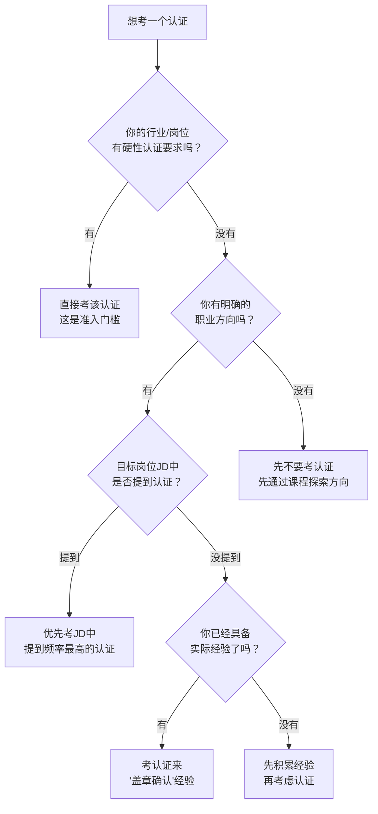
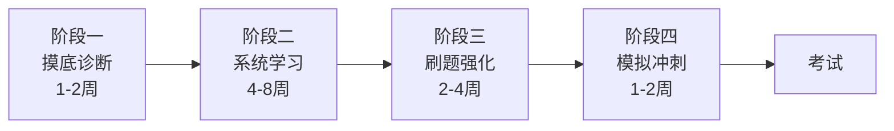

## 五、推荐认证与课程

认证和课程是职业发展资源金字塔中**第三层·技能层**的核心构成。与书籍改变认知不同，认证和课程的目标更直接——**系统化学习并获得可验证的资质证明**。一个高含金量的认证可以在简历筛选阶段直接加分；一门优质课程可以在 1-3 个月内帮你掌握一项新技能。

但认证和课程的陷阱也最多：学费动辄数千上万，时间投入以月计算，选错了不仅浪费金钱，更浪费最宝贵的精力。本节将帮你建立一套完整的评估和选择框架，从认证的含金量判断到课程的高效学习方法，覆盖全链条。

### 5.1 认证的本质：为什么企业看重它

在进入具体推荐之前，先理解认证在职场中的真实作用机制。

**认证的三重价值信号**：

| 价值维度 | 机制说明 | 典型场景 |
|----------|----------|----------|
| 能力信号 | 向雇主证明你掌握了特定领域的系统知识 | 简历筛选、岗位竞聘 |
| 门槛信号 | 某些岗位的硬性准入条件 | 财务岗位要求 CPA、项目管理要求 PMP |
| 自律信号 | 通过考试本身说明你的学习能力和毅力 | 跨行业求职、晋升答辩 |

**认证不等于能力，但认证是能力的放大器**。一个有 5 年项目管理经验的人，拿到 PMP 认证后在市场上能获得 15%-30% 的薪资溢价（据 PMI 2023 年薪酬调查报告）。但如果只有认证没有实际经验，面试中几句话就会露馅。

**什么时候应该考认证**：

- 你所在的行业/岗位有明确的认证准入要求（如审计师必须有 CPA）
- 你已经具备了实际经验，需要认证来"盖章确认"
- 你想转行进入一个新领域，认证可以降低企业的信任成本
- 你的目标公司/岗位在招聘 JD 中明确提到该认证是加分项

**什么时候不应该考认证**：

- 你对这个领域还没有基础认知，想通过考证来入门（应该先学课程再考）
- 你只是因为焦虑而"先考一个再说"
- 你所在行业不看重认证（如创意设计、内容创作等领域）
- 认证的维护成本（继续教育学分、年费）远超其带来的收益

### 5.2 高含金量认证全景图

以下按行业领域分类，列出经过市场验证的高含金量认证。每个认证都包含关键决策信息。

#### 5.2.1 项目管理领域

**PMP（Project Management Professional）**

| 维度 | 详情 |
|------|------|
| 颁发机构 | PMI（美国项目管理协会） |
| 报考条件 | 本科 3 年项目管理经验 + 35 小时培训，或专科 5 年经验 + 35 小时培训 |
| 考试形式 | 180 道选择题，230 分钟，中英文对照 |
| 费用 | 考试费 ¥3,900（PMI 会员 ¥2,575），培训费 ¥2,000-¥6,000 |
| 通过率 | 全球约 60%，国内培训后约 85%-90% |
| 维护要求 | 每 3 年积累 60 个 PDU（专业发展单元） |
| 薪资溢价 | 持证者比非持证者平均高 20%-25%（PMI 薪资调查） |

**核心价值**：PMP 是项目管理领域的"通用语言"。它不绑定特定行业——IT、建筑、制造、金融的项目管理都可以用。如果你是项目经理或想转项目管理，PMP 几乎是必考项。

**备考建议**：重点关注第七版 PMBOK 的"人员-过程-业务环境"三域框架和敏捷混合方法。2024 年起考试中敏捷内容占比提升到约 50%，不要只看传统瀑布流方法论。

**PRINCE2（Projects IN Controlled Environments）**

| 维度 | 详情 |
|------|------|
| 颁发机构 | Axelos（英国） |
| 级别 | Foundation（基础级）+ Practitioner（实践级） |
| 费用 | Foundation ¥2,500 左右，Practician ¥3,500 左右 |
| 适合场景 | 英联邦体系企业、外企、欧洲市场项目 |

**与 PMP 的区别**：PMP 偏知识体系和方法论，PRINCE2 偏流程和阶段控制。如果你在英系企业或面向欧洲市场，PRINCE2 认可度更高。两者可以互补，不必二选一。

**ACP（Agile Certified Practitioner）**

| 维度 | 详情 |
|------|------|
| 颁发机构 | PMI |
| 报考条件 | 2000 小时项目经验 + 1500 小时敏捷经验 |
| 考试形式 | 120 道题，180 分钟 |
| 适合人群 | Scrum Master、敏捷教练、敏捷转型团队负责人 |

**建议**：如果你所在的团队已经在用 Scrum/Kanban/SAFe 等敏捷框架，ACP 比 PMP 更贴合实际工作场景。但 PMP 的通用认可度更高，两者可以先后考取。

#### 5.2.2 信息技术领域

**AWS 认证体系**

AWS 认证是云计算领域最被广泛认可的认证体系，分为四级：

| 级别 | 认证名称 | 适合人群 | 费用 | 有效期 |
|------|----------|----------|------|--------|
| 入门级 | Cloud Practitioner | 非技术岗、销售、管理者 | $100 | 3 年 |
| 助理级 | Solutions Architect / Developer / SysOps Admin | 1-3 年经验的技术人员 | $150 | 3 年 |
| 专业级 | Solutions Architect Pro / DevOps Pro / Security 等 | 5 年以上资深工程师 | $300 | 3 年 |
| 专项级 | Advanced Networking / Data Analytics / Machine Learning 等 | 特定领域专家 | $300 | 3 年 |

**核心价值**：AWS 占全球云市场约 31% 份额（Synergy Research 2024），AWS 认证是云计算岗位的硬通货。持证者平均薪资比非持证者高 26%（AWS 官方调查）。

**备考路线**：建议从 Cloud Practitioner 入门 → Solutions Architect Associate（最受欢迎的认证）→ 根据职业方向选择专业级认证。AWS 官方提供免费的 digital training，配合 hands-on labs 效果最佳。

**其他云计算认证对比**：

| 认证 | 云厂商 | 市场定位 | 国内认可度 |
|------|--------|----------|-----------|
| AWS 认证 | Amazon | 全球市场领导者 | 外企/出海企业 |
| Azure 认证 | Microsoft | 企业级市场，与微软生态绑定 | 大型企业、国企 |
| GCP 认证 | Google | AI/ML 和大数据优势 | 数据方向企业 |
| 阿里云 ACA/ACP | 阿里巴巴 | 国内公有云第一 | 国内企业首选 |
| 华为 HCIE | 华为 | 政企、运营商市场 | 政企、通信行业 |

**选择建议**：如果面向国际市场选 AWS，面向国内企业选阿里云 ACA/ACP，面向政企选华为 HCIE。不要贪多，深入一个云平台比浅尝三个更有价值。

**CKA（Certified Kubernetes Administrator）**

| 维度 | 详情 |
|------|------|
| 颁发机构 | CNCF（云原生计算基金会） |
| 考试形式 | 实操考试，17 道题，120 分钟，在命令行完成 |
| 费用 | $395（含一次补考机会） |
| 适合人群 | 运维工程师、DevOps 工程师、SRE |
| 核心价值 | 容器编排领域的权威认证，实操性质，含金量极高 |

**备考建议**：CKA 是纯实操考试，没有任何选择题。你必须在真实的 Kubernetes 集群中完成各种运维任务。推荐使用 Killer.sh（官方练习环境）和 "Kubernetes the Hard Way" 项目反复练习。建议至少准备 2-3 个月。

**CISSP（Certified Information Systems Security Professional）**

| 维度 | 详情 |
|------|------|
| 颁发机构 | (ISC)² |
| 报考条件 | 5 年以上信息安全相关工作经验 |
| 考试形式 | CAT 自适应考试，125-175 道题，最多 4 小时 |
| 费用 | $749 |
| 核心价值 | 信息安全领域的"黄金标准"认证，全球通用 |

#### 5.2.3 数据与人工智能领域

**数据分析师认证**

| 认证 | 颁发机构 | 适合人群 | 费用 | 特点 |
|------|----------|----------|------|------|
| Google Data Analytics Certificate | Google | 入门级数据分析师 | Coursera 订阅费 ~$49/月 | 6 个月完成，零基础友好 |
| Microsoft Certified: Data Analyst Associate | Microsoft | Power BI 用户 | $165 | 侧重微软生态 |
| SAS Certified Specialist | SAS | 统计分析师 | $180 | 传统统计分析领域权威 |
| CDA 数据分析师 | 中国商业联合会 | 国内数据岗 | ¥1,000-¥3,000 | 国内行业认可 |

**机器学习/人工智能方向**：

| 认证 | 颁发机构 | 适合人群 | 费用 | 特点 |
|------|----------|----------|------|------|
| AWS Machine Learning Specialty | Amazon | ML 工程师 | $300 | 云上 ML 全流程 |
| TensorFlow Developer Certificate | Google | 深度学习开发者 | $100 | 实操考核，含编程 |
| DeepLearning.AI 系列 | DeepLearning.ai | ML 从业者 | Coursera 订阅费 | Andrew Ng 课程配套 |

#### 5.2.4 财务与会计领域

**CPA（注册会计师）**

| 维度 | 详情 |
|------|------|
| 颁发机构 | 中国注册会计师协会 |
| 报考条件 | 大专及以上学历 |
| 考试科目 | 专业阶段 6 科 + 综合阶段 1 科 |
| 费用 | 报名费每科 ¥60-¥100，培训费 ¥3,000-¥20,000 |
| 通过率 | 专业阶段单科 20%-30%，综合阶段 60%-70% |
| 核心价值 | 中国审计签字权的唯一凭证，财会领域最高含金量认证 |

**备考策略**：CPA 专业阶段 6 科（会计、审计、税法、经济法、财务成本管理、公司战略与风险管理），建议 2-3 年内通过。推荐搭配：第一年"会计+税法+经济法"，第二年"审计+财管+战略"。

**CFA（特许金融分析师）**

| 维度 | 详情 |
|------|------|
| 颁发机构 | CFA Institute（美国） |
| 考试级别 | 三级考试（逐级通过） |
| 费用 | 注册费 $350 + 每级考试费 $940-$1,250 |
| 通过率 | Level I 约 40%，Level II 约 45%，Level III 约 50% |
| 平均通过时间 | 3-4 年 |
| 核心价值 | 全球金融分析领域最受认可的认证，被称为"金融界的MBA" |

**适合人群**：投行分析师、基金经理、证券研究员、财富管理顾问。如果你的职业方向是做二级市场研究或资产管理，CFA 几乎是必备的。

**其他财务认证**：

| 认证 | 领域 | 适合人群 | 特点 |
|------|------|----------|------|
| ACCA（特许公认会计师） | 国际会计 | 外企财务、国际业务 | 全球通用，14 科，难度低于 CPA |
| CMA（管理会计师） | 管理会计 | 企业财务管理者 | 侧重决策支持和战略管理 |
| FRM（金融风险管理师） | 风险管理 | 风控、合规岗 | 两级考试，风险管理领域权威 |
| 税务师 | 税务 | 税务从业者 | 国内税务领域核心认证 |

#### 5.2.5 产品与设计领域

**NPDP（新产品开发专家）**

| 维度 | 详情 |
|------|------|
| 颁发机构 | PDMA（美国产品开发管理协会） |
| 报考条件 | 本科 + 2 年新产品开发经验，或专科 + 5 年经验 |
| 考试形式 | 200 道选择题，3.5 小时 |
| 费用 | 考试费 $250-350，培训费 ¥3,000-¥8,000 |
| 核心价值 | 国际公认的产品管理认证，覆盖产品全生命周期 |

**PMP vs NPDP 选择**：PMP 侧重"怎么把项目做完"，NPDP 侧重"做什么产品、为什么做这个产品"。如果你是偏执行的项目经理，考 PMP；如果你是偏策略的产品经理，考 NPDP。两者可以互补。

**其他产品/设计认证**：

| 认证 | 领域 | 特点 |
|------|------|------|
| CSPO（Certified Scrum Product Owner） | 敏捷产品管理 | Scrum Alliance 颁发，2 天培训即获证，门槛低 |
| SAFe Product Owner/Product Manager | 大规模敏捷 | 适合企业级敏捷转型场景 |
| Google UX Design Certificate | UX 设计 | Coursera 平台，零基础友好，6 个月完成 |
| Nielsen Norman Group UX Certification | UX 设计 | 行业权威，需完成多门课程 + 考试 |

#### 5.2.6 人力资源领域

| 认证 | 颁发机构 | 适合人群 | 特点 |
|------|----------|----------|------|
| SHRM-CP/SCP | SHRM | HR 从业者 | 全球最权威的 HR 认证之一 |
| PHR/SPHR | HRCI | HR 从业者 | 侧重美国劳动法规，外企 HR |
| 一级人力资源管理师 | 人社部 | 国内 HR | 国内 HR 领域最高认证 |
| CIPD | CIPD（英国） | HR 从业者 | 英联邦体系企业首选 |

### 5.3 认证选择决策框架

面对众多认证，如何做出理性选择？以下是一个系统化的决策流程。

**认证投资回报率评估表**：

| 评估维度 | 评估问题 | 权重 |
|----------|----------|------|
| 市场需求 | 目标岗位/行业中，该认证被提及的频率？ | 30% |
| 薪资溢价 | 持证者相比非持证者的薪资差距？ | 25% |
| 时间成本 | 从零开始到通过考试需要多长时间？ | 20% |
| 金钱成本 | 考试费 + 培训费 + 教材费 + 补考费？ | 15% |
| 维护成本 | 是否需要继续教育学分？年费？续证周期？ | 10% |

**快速计算公式**：

> 认证 ROI = （预期年薪增长 × 持证年限 - 总投入成本）/ 总投入成本

举例：PMP 认证总投入约 ¥10,000（培训 + 考试 + 教材），持证后年薪预期增长 ¥30,000，持证 5 年不续证则 ROI = (30,000 × 5 - 10,000) / 10,000 = 14，即 14 倍回报。这个投资是值得的。

### 5.4 优质在线课程平台深度评测

认证是"盖章"，课程是"学习"。选择课程平台时，核心不是"哪个平台最好"，而是"哪个平台最适合你当前的学习目标和学习风格"。

#### 5.4.1 国际平台

**Coursera**

| 维度 | 详情 |
|------|------|
| 课程数量 | 7,000+ 门课程，来自 300+ 大学和企业 |
| 费用模式 | 免费旁听（无证书），单课 $49-$79，专项课 $39-$79/月，Plus 会员 $59/月 |
| 核心优势 | 名校课程质量高，学位项目受认可，中文字幕覆盖广 |
| 适合人群 | 想系统学习、追求学历/认证的职场人 |
| 推荐项目 | Google Career Certificates、IBM Data Science、DeepLearning.AI 系列 |

**使用建议**：Coursera 的专项课程（Specialization）比单课更有价值，因为它提供系统化的学习路径。免费旁听可以先试听 1-2 周，觉得好再付费。Google Career Certificates 系列是目前性价比最高的入门级职业认证之一，涵盖数据分析、UX 设计、项目管理、IT 支持、网络安全、数字营销六个方向，每项 6 个月以内可以完成。

**edX**

| 维度 | 详情 |
|------|------|
| 课程数量 | 4,000+ 门课程 |
| 费用模式 | 免费旁听，验证证书 $50-$300，MicroMasters $600-$1,500 |
| 核心优势 | 哈佛、MIT、伯克利等顶级名校课程，MicroMasters 可抵学分 |
| 适合人群 | 追求学术深度、考虑后续读研的职场人 |
| 推荐项目 | MIT MicroMasters in Statistics and Data Science、HarX 系列 |

**Udacity**

| 维度 | 详情 |
|------|------|
| 课程形式 | 纳米学位（Nanodegree），项目驱动 |
| 费用模式 | 每个纳米学位 $249-$399/月，通常 3-6 个月完成 |
| 核心优势 | 真实项目实战，一对一代码审查，企业合作项目 |
| 适合人群 | 技术岗位转行者，需要项目作品集的人 |
| 注意事项 | 费用较高，建议先评估是否能坚持完成 |

**LinkedIn Learning**

| 维度 | 详情 |
|------|------|
| 课程数量 | 21,000+ 门课程 |
| 费用模式 | LinkedIn Premium 会员含订阅（~$30/月） |
| 核心优势 | 完成课程后自动显示在 LinkedIn 个人资料上，偏软技能和商业技能 |
| 适合人群 | 已有 LinkedIn Premium 的职场人，学习软技能 |

**Pluralsight**

| 维度 | 详情 |
|------|------|
| 课程数量 | 7,000+ 技术课程 |
| 费用模式 | Standard $29/月，Premium $45/月 |
| 核心优势 | 技术深度高，Skill IQ 测试评估你的水平，学习路径清晰 |
| 适合人群 | 中高级技术人员，特别是 .NET、云计算、数据方向 |

#### 5.4.2 国内平台

**极客时间**

| 维度 | 详情 |
|------|------|
| 定位 | 技术类深度课程，专栏形式 |
| 费用模式 | 单课 ¥68-¥399，每日免费专栏 |
| 核心优势 | 国内技术社区口碑最好，讲师多为一线大厂技术专家 |
| 适合人群 | 有 1 年以上经验的技术人员 |
| 推荐专栏 | 根据你的技术栈选择，优先选择"已完结"的专栏 |

**三节课**

| 维度 | 详情 |
|------|------|
| 定位 | 互联网职业技能课程 |
| 费用模式 | 单课 ¥299-¥5,999，训练营形式 |
| 核心优势 | 课程体系化，有作业批改和社群辅导 |
| 适合人群 | 产品经理、运营、市场等互联网非技术岗 |

**混沌学园**

| 维度 | 详情 |
|------|------|
| 定位 | 商业认知和管理课程 |
| 费用模式 | 年费会员 ¥1,198-¥5,998 |
| 核心优势 | 讲师多为知名企业家和学者，侧重商业思维和战略 |
| 适合人群 | 中高层管理者、创业者 |

**中国大学 MOOC（学堂在线）**

| 维度 | 详情 |
|------|------|
| 定位 | 国内高校课程的免费开放平台 |
| 费用模式 | 大部分课程免费，认证证书收费 |
| 核心优势 | 国内 985/211 高校课程，质量有保障 |
| 适合人群 | 想学习高校系统课程但没时间考研的职场人 |

**得到**

| 维度 | 详情 |
|------|------|
| 定位 | 知识服务和终身学习 |
| 费用模式 | 单课 ¥9.9-¥399，听书 VIP ¥365/年 |
| 核心优势 | 内容精炼、适合碎片化学习，"每天听本书"效率高 |
| 适合人群 | 忙碌的中层管理者，快速获取跨领域知识 |
| 注意事项 | 深度不足，适合拓宽视野而非系统学习 |

#### 5.4.3 免费高质量学习资源

很多人不知道，大量高质量的学习资源完全免费。以下是经过验证的免费资源：

| 资源 | 内容 | 网址 | 特点 |
|------|------|------|------|
| freeCodeCamp | Web 开发全栈 | freecodecamp.org | 完全免费，项目驱动，社区活跃 |
| MIT OpenCourseWare | MIT 全部课程资料 | ocw.mit.edu | 学术深度最高，无中文字幕 |
| Khan Academy | 数学、编程、经济 | khanacademy.org | 零基础友好，讲解通俗 |
| CS50（哈佛） | 计算机科学入门 | cs50.harvard.edu | 全球最受欢迎的 CS 入门课 |
| fast.ai | 深度学习实践 | fast.ai | top-down 教学法，先上手再理论 |
| The Odin Project | Web 开发 | theodinproject.com | 全栈路径，完全免费开源 |
| AWS Skill Builder | AWS 官方培训 | skillbuilder.aws | 大量免费课程，含动手实验 |

### 5.5 课程学习的高效方法论

选对了课程只是开始，如何高效完成学习才是关键。大量学员买了课程却从未完成——Coursera 的课程完成率平均仅约 15%。以下是经过验证的高效学习方法。

#### 5.5.1 学习前：做好三件事

**第一件：设定明确的"学完标准"**

不要说"我要学完这门课"，而要说"我要在 8 周内完成这门课的 12 个项目，每个项目得分 80% 以上"。模糊的目标导致拖延，具体的标准驱动执行。

**第二件：时间预算**

根据课程说明中的每周建议学习时间，计算总投入：

> 总投入 = 每周学习小时数 × 课程周数
>
> 例：每周 10 小时 × 6 周 = 60 小时 → 每天约 1.5 小时（含周末）

如果当前日程无法腾出这个时间量，先不要开始。买了不学比不买更浪费。

**第三件：建立学习环境**

- 固定学习时间段（如每天早上 6:30-7:30）
- 准备好学习工具（笔记本、代码环境、参考书）
- 告诉家人/室友你的学习计划，减少干扰

#### 5.5.2 学习中：四个提效策略

**策略一：1.5x-2x 速播放视频**

研究表明，1.5 倍速播放对学习效果的影响几乎可以忽略不计，但能节省 33% 的时间。对于你已经有一定基础的章节，直接用 2 倍速。对于核心难点章节，回到正常速度。

**策略二：费曼笔记法**

每学完一个知识点，用以下模板写下笔记：

知识点：[名称]
用一句话解释：[像给外行人讲解一样写]
关键概念：[列出 2-3 个核心概念]
与我的工作关联：[这个知识点如何应用到我的实际工作中]
一个疑问：[学完后仍然不理解的地方]

**策略三：项目先行，理论跟上**

对于技术类课程，不要从头到尾看视频再做作业。正确的方式是：

1. 先看项目/作业要求
2. 尝试自己做（做不出来没关系）
3. 带着问题去看对应章节的视频
4. 做完项目后，再补看理论讲解

这种"逆向学习法"的记忆效果比顺序学习高 40% 以上。

**策略四：学习小组/社区**

加入课程的官方论坛或学习群。当你卡在一个问题上超过 30 分钟，直接去社区提问。同时，回答别人的问题是巩固知识最有效的方式——你要把一个概念解释清楚，就必须真正理解它。

#### 5.5.3 学习后：输出闭环

| 输出形式 | 适用场景 | 效果 |
|----------|----------|------|
| 写总结博客 | 所有课程 | 教是最好的学，同时建立个人品牌 |
| 做一个项目 | 技术/设计课程 | 形成作品集，面试时可展示 |
| 向同事分享 | 与工作相关的课程 | 团队学习，同时加深理解 |
| 考取相关认证 | 有配套认证的课程 | 学以致用，获得资质证明 |
| 整理知识卡片 | 理论类课程 | 建立个人知识库，长期复用 |

### 5.6 认证备考的实战策略

#### 5.6.1 通用备考框架

无论考什么认证，以下框架都适用：

**阶段一·摸底诊断（1-2 周）**：做一套官方样题或模拟题，不计时间，做完后对照答案分析。目的是知道哪些章节你已经掌握，哪些需要重点学习。

**阶段二·系统学习（4-8 周）**：根据摸底结果，优先学习薄弱章节。不要从头到尾通读教材，80/20 法则——80% 的考试内容来自 20% 的核心知识点。

**阶段三·刷题强化（2-4 周）**：大量做题，但不是盲目刷题。每做完一套题，分析错题原因，归类为"知识盲点""审题失误""时间不够"三类，针对性解决。

**阶段四·模拟冲刺（1-2 周）**：严格按考试时间和环境做 2-3 套完整模拟题。模拟的目的不仅是检验知识，更是训练考试节奏和心态。

#### 5.6.2 备考常见误区

| 误区 | 为什么是错的 | 正确做法 |
|------|------------|----------|
| 只看教材不做题 | 教材讲的是知识，考的是应用。"看懂了"不等于"会做了" | 每学完一章立即做对应的练习题 |
| 背答案而不是理解原理 | 题目稍有变化就不会了 | 理解每个选项为什么对、为什么错 |
| 一次报多科 | 精力分散，每科都学不透 | 每次专注 1-2 科，通过后再报下一科 |
| 只做题不总结 | 同样的错误反复犯 | 建立错题本，定期回顾 |
| 考前临时抱佛脚 | 认证考试的知识量大，短期记忆无法覆盖 | 至少提前 2 个月开始准备 |
| 忽视考试技巧 | 很多人知识掌握够了，但因为时间管理不当没通过 | 模拟考试时严格计时 |

#### 5.6.3 主要认证备考时间参考

| 认证 | 建议备考时间 | 学习资源推荐 |
|------|------------|-------------|
| PMP | 2-3 个月 | PMBOK + 汪博士解读 + 培训机构题库 |
| CPA 单科 | 2-4 个月 | 官方教材 + 东奥/中华网校 + 真题 |
| CFA Level I | 4-6 个月 | CFA 官方教材 + Kaplan Schweser Notes |
| AWS SAA | 2-3 个月 | Stephane Maarek 课程 + AWS 官方白皮书 + Tutorials Dojo 题库 |
| CKA | 2-3 个月 | Mumshad Mannambeth 课程 + Killer.sh 练习 |
| 软考（中级） | 2-3 个月 | 官方教程 + 历年真题 |

### 5.7 认证与课程的费用优化策略

认证和课程的费用从几百到几万不等，以下策略可以帮你节省 30%-70% 的投入。

**策略一：善用企业培训预算**

超过 60% 的中大型企业有培训经费或认证报销政策。在考证之前，先和 HR 确认公司的培训政策。很多企业不仅报销考试费，还报销培训费和教材费。这是你应得的福利，不要浪费。

**策略二：利用平台优惠期**

| 平台 | 常见优惠 | 时间 |
|------|----------|------|
| Coursera | Plus 会员 7 折 | 黑色星期五、开学季 |
| Udemy | 课程折扣到 $9.9-$14.9 | 每月都有促销 |
| edX | 部分课程证书 5 折 | 年末促销 |
| 极客时间 | 专栏 5-7 折 | 双十一、春节、开学季 |

**策略三：选择性价比最高的学习路径**

不要一上来就报最贵的培训课程。先用免费资源入门，确定方向后再投入付费资源。以下是一个典型的费用递进路径：

免费资源入门 → 低价课程深入 → 付费培训冲刺 → 考试认证
（$0）         （$50-200）     （$500-2000）   （$200-1000）

**策略四：善用开源学习社区**

很多认证考试有活跃的开源学习社区，提供免费的学习资料和经验分享：

- Reddit 的 r/AWSCertifications、r/pmp 等子版块
- GitHub 上的认证备考仓库（如 "CKA-exercises"）
- 微信公众号和知乎上的认证备考经验帖

### 5.8 警惕认证和课程的常见陷阱

#### 陷阱一：认证焦虑——"大家都在考，我也得考一个"

不是所有认证都值得考。如果你所在的行业不看重认证（如创意设计、内容创作），把时间花在作品集和项目经验上比考认证更有价值。认证的价值取决于你所在行业和目标岗位的"认证敏感度"。

**判断方法**：在招聘网站搜索你目标岗位的 JD，统计提到各认证的频率。如果 80% 的 JD 都没有提到任何认证要求，说明认证在这个领域不是必要条件。

#### 陷阱二：培训陷阱——"包过""保就业""0 元入学"

以下话术需要高度警惕：

- **"包过"**：没有任何培训机构能保证通过率。所谓"包过"要么是让你反复免费重考直到过（浪费时间），要么是题库泄题（违反考试规定，取消成绩）。
- **"保就业"**：就业取决于你的能力和市场环境，不是一张证书。很多"保就业"机构的所谓就业数据是把学员安排到关联公司做低薪实习。
- **"0 元入学/先学后付"**：本质是分期贷款。即使你没学完、没就业，贷款依然要还。仔细阅读合同条款。

**选择培训机构的标准**：

| 评估维度 | 好的信号 | 坏的信号 |
|----------|---------|---------|
| 师资 | 讲师有行业实战经验，可查证 | 讲师只有教学经验，没有行业背景 |
| 口碑 | 学员真实评价，可在多平台验证 | 只有官网好评，第三方平台无法验证 |
| 退款 | 有明确的退款政策和时间窗口 | "一经售出，概不退换" |
| 价格 | 价格透明，无隐藏费用 | 要"咨询才知道价格"，价格因人而异 |
| 合同 | 合同清晰，权利义务对等 | 合同模糊，大量免责条款 |

#### 陷阱三：课程囤积——"先买了再说"

"知识焦虑"驱动的课程囤积是一种常见现象。买了 20 门课程，一门都没学完，不仅浪费钱，还会产生"我在学习"的虚假安全感。

**解药**：执行"一进一出"原则——不完成一门课程，不买下一门。买了就必须在规定时间内完成，否则强制退款（Coursera、edX 等平台支持）。

#### 陷阱四：证书崇拜——"证书越多越好"

简历上列 10 个低含金量的证书，不如 1-2 个高含金量的证书加上丰富的项目经验。企业招聘看的是"你能做什么"，而不是"你考过什么"。

**正确的证书策略**：聚焦 1-2 个核心认证深耕，其他的用课程学习替代。认证是为了证明能力，不是为了收集徽章。

#### 陷阱五：过期不续——认证的有效期管理

很多认证有有效期（如 AWS 3 年、PMP 3 年），过期不续等于白考。在考证之前，把续证成本（继续教育学分、年费、再考试费）也纳入总成本计算。

**认证有效期管理表**：

| 认证 | 有效期 | 续证方式 | 续证成本 |
|------|--------|---------|---------|
| PMP | 3 年 | 60 PDU + 续证费 $60/$150 | 低（PDU 可通过免费活动获取） |
| AWS | 3 年 | 重新考试 | 中（$150-$300） |
| CPA | 长期有效 | 继续教育 40 学时/年 | 低 |
| CFA | 长期有效 | 会费 $275/年 | 低 |
| CKA | 3 年 | 重新考试 | 中（$395） |
| CISSP | 3 年 | 120 CPE + 年费 $125 | 低-中 |

### 5.9 不同职业阶段的认证与课程推荐

#### 应届生 / 职场新人（0-2 年）

**核心目标**：建立基础能力，降低求职门槛

| 优先级 | 推荐 | 理由 |
|--------|------|------|
| ★★★★★ | Google Career Certificates | 零基础友好，6 个月内完成，简历加分明显 |
| ★★★★ | 技术方向：AWS Cloud Practitioner | 云计算入门，为后续深入打基础 |
| ★★★★ | 产品方向：CSPO 或 NPDP | 产品管理入门认证 |
| ★★★ | freeCodeCamp / The Odin Project | 免费，项目驱动，形成作品集 |

#### 中级从业者（3-5 年）

**核心目标**：深化专业能力，形成差异化竞争优势

| 优先级 | 推荐 | 理由 |
|--------|------|------|
| ★★★★★ | 行业核心认证（PMP/CPA/AWS SAA 等） | 专业资质验证，薪资溢价明显 |
| ★★★★ | 极客时间深度专栏 | 国内技术社区最优质的深度内容 |
| ★★★ | Coursera 专项课程 | 系统化补充跨领域知识 |

#### 高级从业者 / 管理者（5 年以上）

**核心目标**：拓展视野，建立跨领域能力

| 优先级 | 推荐 | 理由 |
|--------|------|------|
| ★★★★★ | EMBA / 高管教育项目 | 系统化商业思维，高质量人脉网络 |
| ★★★★ | 混沌学园 / 长江商学院线上课程 | 商业认知和战略思维提升 |
| ★★★ | 顶级认证（CFA/CFA Level II+、CISSP 等） | 行业顶尖认证，建立行业影响力 |

### 5.10 学习路径规划模板

以下是一个通用的认证与课程学习路径规划模板，你可以根据自身情况填写和调整：

┌──────────────────────────────────────────────────────┐
│              我的学习路径规划（示例）                    │
├──────────────────────────────────────────────────────┤
│ 当前阶段：[中级数据分析师，3年经验]                      │
│ 职业目标：[3年内成为数据科学团队负责人]                   │
│                                                      │
│ 时间线规划：                                           │
│                                                      │
│ 第1-6个月（短期）：                                     │
│   □ 完成 Coursera "IBM Data Science" 专项课程           │
│   □ 掌握 Python 数据分析全栈工具链                       │
│   □ 产出：GitHub 上 3 个数据分析项目                     │
│                                                      │
│ 第7-12个月（中期）：                                    │
│   □ 考取 AWS Machine Learning Specialty 认证            │
│   □ 完成 DeepLearning.AI 深度学习专项课程                │
│   □ 产出：1 个端到端 ML 项目上线                         │
│                                                      │
│ 第13-24个月（长期）：                                   │
│   □ 学习 MLOps 和数据工程基础                           │
│   □ 完成团队管理和项目管理培训                           │
│   □ 考取 PMP 认证（补充管理能力）                        │
│                                                      │
│ 预算规划：                                             │
│   □ 在线课程：¥5,000/年                                │
│   □ 认证考试：¥5,000-10,000（含培训费）                  │
│   □ 书籍和资料：¥1,000/年                              │
│   □ 合计：约 ¥15,000-20,000（2年总投入）                │
│                                                      │
│ 检查点：每季度回顾一次进度，根据实际情况调整计划           │
└──────────────────────────────────────────────────────┘

### 5.11 本节核心要点回顾

| 要点 | 说明 |
|------|------|
| 认证是能力的放大器，不是能力本身 | 有经验再考认证，效果翻倍；没经验先考认证，效果减半 |
| 聚焦 1-2 个核心认证 | 深度远比广度重要 |
| 课程完成率比课程数量重要 | 一门学透的课胜过十门浏览过的课 |
| 先免费后付费 | 先用免费资源确认方向，再投入付费学习 |
| 警惕培训陷阱 | "包过""保就业""0 元入学"是三大红旗 |
| 输出倒逼输入 | 学完必须有产出，否则遗忘率 75% |
| 企业培训预算别浪费 | 60% 的企业有培训报销政策，先问 HR |

***

