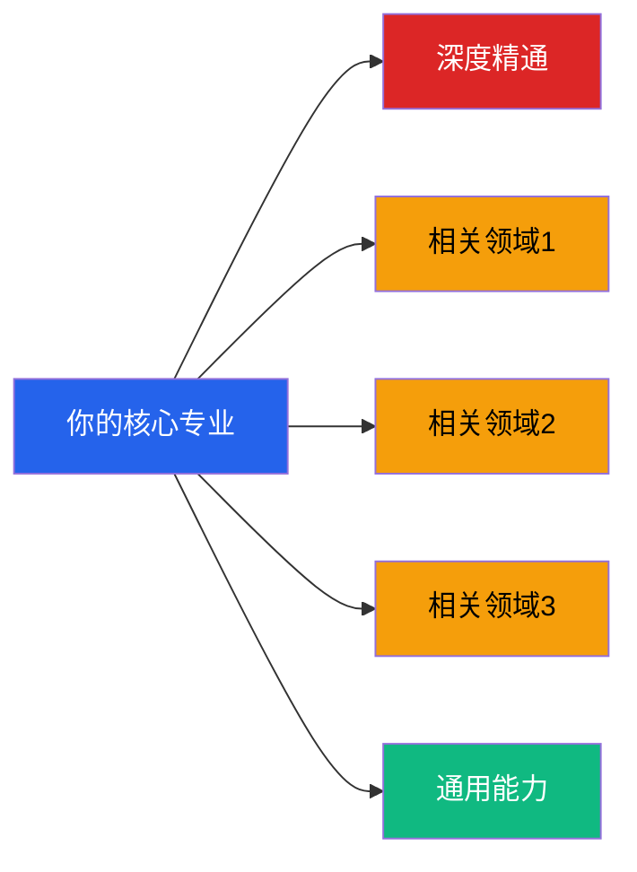
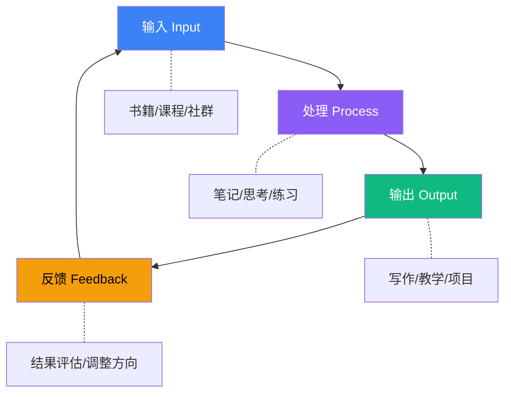

## 六、如何选择适合自己的资源

前面五节推荐了大量书籍、工具、平台、社群和课程。面对这份清单，很多人的第一反应是"全都要"——然后开始疯狂收藏、注册、购买，最后发现一个都没用完。

这不是意志力的问题，而是**选择策略**的问题。

哈佛商学院教授克莱顿·克里斯坦森（Clayton Christensen）在《创新者的窘境》中提出了一个核心洞察：人们购买的不是产品本身，而是产品能帮他们完成的"任务"（Jobs to Be Done）。选择学习资源也一样——你不是在选书或选课，而是在**选择一种解决当前职业困境的方式**。

本节提供一套系统化的资源选择方法论，帮助你从"什么都想学"进化到"精准投资自己"。

---

### 一、为什么大多数人选错了资源

#### 1.1 信息过载陷阱

2024年中国在线教育市场规模超过4000亿元，知识付费用户超过5亿。仅LinkedIn Learning一个平台就有超过21000门课程，Coursera有7000+课程，得到App有超过300门专栏。加上每年出版的20万+中文新书，一个职场人面对的选择量级是**数万种**。

在这种环境下，大脑会启动两种失效模式：

- **选择瘫痪（Analysis Paralysis）**：选项太多导致无法决策，最终什么都不选
- **虚假满足（Collector's Fallacy）**：收藏/购买本身带来满足感，让人误以为自己已经在学习了

德国心理学家格尔德·吉仁泽（Gerd Gigerenzer）的研究表明，当选项超过7个时，决策质量开始显著下降。而大多数人在选择学习资源时面对的选项是**几百到几千个**。

#### 1.2 营销噪音干扰

知识付费行业存在严重的"过度承诺"现象：

- "21天精通Python"——实际上，精通任何编程语言都需要数千小时的实践
- "三个月实现财务自由"——如果真这么简单，营销者自己早就财务自由了
- "跟XX学，少走十年弯路"——弯路无法量化，这是一句无法验证的话

识别这些噪音的关键方法是**要求具体数据**。任何无法提供可验证成果的承诺，都应被视为营销话术而非事实陈述。

#### 1.3 从众心理

"这本书豆瓣评分9.2""这个课有10万人购买"——高评分和高销量是必要条件，但不是充分条件。一本面向初学者的畅销书对资深从业者毫无价值。一个面向应届生的求职课程对想跳槽的中层管理者帮助有限。

**真正的问题不是"这个资源好不好"，而是"这个资源适不适合此刻的我"。**

---

### 二、资源选择的底层逻辑

#### 2.1 成人学习的"70-20-10"法则

组织行为学家迈克尔·隆巴尔多（Michael Lombardo）和罗伯特·艾辛格（Robert Eichinger）在1996年为创意领导力中心（CCL）做的研究发现，成人学习的来源分布为：

| 学习来源 | 占比 | 说明 |
|---------|------|------|
| 在职实践 | 70% | 工作中的挑战、项目、试错 |
| 人际互动 | 20% | 导师、同事、社群中的反馈与交流 |
| 正式学习 | 10% | 书籍、课程、培训等结构化内容 |

这意味着，你花在选择书籍和课程上的时间，只影响了**10%的学习效果**。更重要的是确保你选择的资源能**被转化为实践（70%）和交流（20%）**。

**选择资源时的第一个筛选标准：这个资源能否指导我立即行动？**

如果一本书的推荐语是"提升认知""打开格局""颠覆思维"，但读完后你说不出三个可以立即执行的行动项，那它的实际学习转化率可能接近零。

#### 2.2 学习投资的 ROI 框架

将学习视为投资而非消费。每一项学习投入都有明确的成本和预期回报：

**成本构成：**

| 成本类型 | 说明 | 计算方式 |
|---------|------|---------|
| 时间成本 | 投入的小时数 × 时薪 | 最核心的成本 |
| 金钱成本 | 购买费用、平台订阅费 | 通常可以忽略 |
| 机会成本 | 用这段时间做其他事的收益 | 最容易被忽视 |
| 注意力成本 | 学习过程中消耗的认知资源 | 影响其他工作产出 |

**回报类型：**

- **短期回报**：立即可用的技能（如Excel函数、面试话术）
- **中期回报**：3-12个月内见效的能力提升（如项目管理、行业认知）
- **长期回报**：底层思维模型和认知升级（如系统思维、决策框架）

**一个简单的ROI计算公式：**

学习ROI = (预期收入增长 + 节省的时间价值 + 机会价值) / (学习时间 × 时薪 + 金钱投入)

举例：你花20小时学习Excel高级函数（课程费用200元），之后每周能节省2小时重复工作，持续一年。假设时薪100元：

- 投入：20 × 100 + 200 = 2,200元
- 回报：2 × 52 × 100 = 10,400元
- ROI = 10,400 / 2,200 = 473%

而一本"提升格局"的畅销书，花10小时读完（1,000元时间成本），如果没有转化为任何可衡量的行为改变，ROI = 0。

#### 2.3 T型能力模型

选择资源时，要同时考虑两个维度：

- **纵向深度**：在你的核心专业领域持续深耕（T的竖线）
- **横向广度**：在相关领域建立基础认知（T的横线）



选择资源时的优先级排序：

1. **核心专业深度**（70%的投入）：直接影响你的职业价值
2. **通用能力**（20%的投入）：沟通、项目管理、数据分析等跨行业通用技能
3. **相关领域广度**（10%的投入）：拓宽视野，为转型做储备

---

### 三、五维资源评估体系

面对任何学习资源，用以下五个维度进行评估，每个维度1-5分，总分25分。

#### 3.1 维度一：相关度（Relevance）

**核心问题**：这个资源解决的是不是我**当前最紧迫**的问题？

评估要点：
- 资源的核心主题与你的职业目标是否直接相关
- 内容难度是否匹配你当前的水平（太简单浪费时间，太难打击信心）
- 内容的时效性——技术领域资源超过2年需要谨慎，经典理论类则不受限

**评分标准：**

| 分数 | 定义 |
|------|------|
| 5分 | 直接解决当前最紧迫的职业问题 |
| 4分 | 与当前目标高度相关，但不是最直接的 |
| 3分 | 与长期发展相关，但短期收益有限 |
| 2分 | 有一定关联，但优先级很低 |
| 1分 | 基本无关，只是"看起来有用" |

#### 3.2 维度二：可操作性（Actionability）

**核心问题**：学完后我能立即做什么？

评估要点：
- 是否提供具体的方法、模板、工具或流程
- 理论与实践的比例——实操内容占比越高越好
- 是否有配套的练习、作业或项目
- 是否有明确的"下一步行动"指引

**高可操作性资源的特征：**
- 每章末尾有练习题或行动清单
- 提供可下载的模板、工作表或代码示例
- 有配套的社群可以实操和获得反馈
- 作者自己用这套方法取得了可验证的成果

**低可操作性资源的特征：**
- 通篇都是"要重视""要提升""要培养"之类的空话
- 案例都是名人轶事，与普通职场人的距离太远
- 读完觉得"说得都对"，但说不出一个具体行动

#### 3.3 维度三：投入产出比（Efficiency）

**核心问题**：我需要投入多少，能获得多少？

评估要点：
- **时间投入**：完成全部学习需要多少小时？能否碎片化学习？
- **金钱投入**：费用是否在可承受范围内？是否有免费替代品？
- **前置条件**：是否需要先学习其他内容？（降低效率）
- **学习曲线**：上手难度如何？

| 资源类型 | 典型时间投入 | 金钱投入 | 适合人群 |
|---------|------------|---------|---------|
| 单篇长文/指南 | 0.5-1小时 | 免费 | 碎片时间学习者 |
| 单本书籍 | 5-15小时 | 30-80元 | 有连续阅读时间的人 |
| 短期课程 | 10-30小时 | 0-500元 | 有明确学习目标的人 |
| 系统课程 | 50-200小时 | 500-5000元 | 需要系统提升的人 |
| 认证项目 | 100-500小时 | 3000-30000元 | 需要证书背书的人 |
| 学位项目 | 1000+小时 | 10000+元/年 | 需要学历门槛的人 |

#### 3.4 维度四：可信度（Credibility）

**核心问题**：这个资源的作者/机构值得信赖吗？

评估要点：
- **作者背景**：是否有相关领域的实战经验？（不仅是学术头衔）
- **成果验证**：作者是否用这套方法取得了可量化的成果？
- **口碑验证**：真实用户评价如何？（注意筛选营销性评价）
- **更新维护**：内容是否定期更新？（工具类和技术类尤其重要）

**可信度红旗信号（出现任意一条需警惕）：**
- 作者无法提供自己在该领域的具体成就数据
- 大量使用"知名""顶级""权威"等无法验证的修饰词
- 课程推广中过度强调"限时优惠""仅剩XX名额"等紧迫感话术
- 用户评价全是五星且措辞高度相似（可能是刷评）
- 承诺"包就业""保涨薪"等无法兑现的结果

#### 3.5 维度五：生态价值（Ecosystem）

**核心问题**：这个资源是否能带我进入一个有价值的学习生态？

评估要点：
- 是否有配套社群（微信群、论坛、Discord等）
- 社群中是否有高质量的互动（而非纯广告）
- 是否有进阶路径（学完初级后有中级、高级课程）
- 是否能与其他学习者建立有价值的连接

**生态价值的长期收益：**
- 遇到问题时有人可以讨论
- 获得行业信息和机会的渠道
- 建立长期的职业人脉
- 获得同伴压力和动力

---

### 四、四步选择法：从清单到行动

#### 4.1 第一步：明确你的"职业待办任务"

不要从"我想学什么"出发，而要从**"我需要完成什么"**出发。

使用以下模板梳理你的职业待办任务：

```markdown
## 我的职业待办任务清单

### 紧急且重要（本月必须解决的）
1. [具体任务]：_____________
   - 完成这个任务需要什么能力？_____________
   - 我目前缺什么？_____________

### 重要但不紧急（本季度应该推进的）
1. [具体任务]：_____________
   - 完成这个任务需要什么能力？_____________
   - 我目前缺什么？_____________

### 锦上添花（有余力再考虑的）
1. [具体任务]：_____________
```

**示例：**

```markdown
### 紧急且重要
1. 三个月内跳槽到互联网大厂
   - 需要：算法能力、系统设计、面试表达
   - 缺：刷题量不够，系统设计知识空白

### 重要但不紧急
1. 一年内晋升为技术主管
   - 需要：项目管理、向上管理、团队协作
   - 缺：没有带团队经验，不会做技术方案评审
```

#### 4.2 第二步：匹配资源并做减法

将你的待办任务与前面推荐的资源清单进行匹配。关键原则是**先减后选**：

**减法规则：**

1. **一个任务只选一个核心资源**——贪多嚼不烂，一个资源用透胜过十个资源浏览
2. **砍掉"以后可能用得上"的资源**——如果3个月内不会用到，就不要列入当前计划
3. **砍掉与核心目标无关的资源**——"提升认知"类的资源在目标不明确时才有价值
4. **砍掉重复性资源**——同一主题的书不需要读三本

**决策矩阵示例：**

| 职业任务 | 候选资源 | 相关度 | 可操作性 | 投入产出比 | 可信度 | 生态价值 | 总分 | 决策 |
|---------|---------|--------|---------|-----------|--------|---------|------|------|
| 跳槽面试 | 《剑指Offer》 | 5 | 5 | 4 | 5 | 3 | 22 | ✅ 选择 |
| 跳槽面试 | LeetCode会员 | 5 | 5 | 4 | 5 | 4 | 23 | ✅ 选择 |
| 跳槽面试 | 算法导论 | 4 | 3 | 2 | 5 | 2 | 16 | ❌ 优先级低 |
| 学习项目管理 | PMP认证课程 | 5 | 4 | 3 | 5 | 4 | 21 | ✅ 选择 |
| 学习项目管理 | 《PMBOK指南》 | 5 | 3 | 3 | 5 | 2 | 18 | ❌ 有课程后可省略 |

#### 4.3 第三步：制定学习执行计划

选好资源后，需要将"我要学这个"转化为**具体的日程安排**。

**学习计划模板：**

```markdown
## [资源名称] 学习计划

- 总投入预估：XX小时
- 学习周期：XX周（每周XX小时）
- 开始日期：YYYY-MM-DD
- 预计完成：YYYY-MM-DD

### 阶段拆解
| 阶段 | 内容范围 | 预计时间 | 里程碑 |
|------|---------|---------|--------|
| 第1周 | 基础概念（第1-3章） | 5小时 | 完成课后练习 |
| 第2周 | 核心方法（第4-6章） | 6小时 | 完成一个实战项目 |
| 第3周 | 进阶应用（第7-9章） | 5小时 | 教给别人/写总结 |
| 第4周 | 复盘整合 | 3小时 | 输出一份个人方法论 |

### 行动检查点
- [ ] 第1周结束：能用自己的话解释核心概念
- [ ] 第2周结束：独立完成一个实操项目
- [ ] 第3周结束：能教给同事或朋友
- [ ] 第4周结束：输出一份可复用的方法论文档
```

#### 4.4 第四步：设置止损点

不是所有资源都值得读完。设置止损点可以避免"沉没成本谬误"让你在一本不适合的书上浪费更多时间。

**止损规则：**

| 资源类型 | 止损点 | 判断标准 |
|---------|--------|---------|
| 书籍 | 读完前20% | 20%后仍无法说出3个有价值的收获，弃读 |
| 视频课程 | 完成前25% | 25%后仍觉得内容太浅或太深，换课 |
| 认证课程 | 第一个模块结束 | 第一个模块的学习体验和预期不符，退课 |
| 社群 | 加入2周后 | 2周内没有获得任何有价值的信息或连接，退出 |

**弃读不是失败，是高效的止损。** 亚马逊创始人杰夫·贝佐斯说过："我要快速翻完一本书的前几章，如果不喜欢就放下。我已经读了很多书，所以不需要强迫自己读完每一本。"

---

### 五、不同职业阶段的资源选择策略

#### 5.1 职场新人（0-3年）：重基础，重证书

**核心目标**：建立专业基础，获取行业入场券

**资源选择原则：**
- 优先选择**有明确学习路径**的资源（认证课程 > 零散书籍）
- 优先选择**有行业认可度**的资源（知名证书 > 小众课程）
- 优先选择**有社群支持**的资源（自学编程不如加入训练营）

**典型资源组合：**
- 1本行业入门书 + 1个系统课程 + 1个行业社群
- 例如：互联网产品岗 = 《启示录》+ 网易云课堂产品经理课程 + 人人都是产品经理社区

#### 5.2 职场中层（3-8年）：重深度，重实战

**核心目标**：建立专业壁垒，形成个人方法论

**资源选择原则：**
- 优先选择**有深度案例**的资源（案例分析 > 理论综述）
- 优先选择**可以立即应用**的资源（项目实战 > 纯知识学习）
- 优先选择**进入高阶圈子**的资源（行业峰会 > 公开课）

**典型资源组合：**
- 1本深度专业书 + 1个进阶认证 + 1个行业圈子
- 例如：技术管理者 = 《技术领导之路》+ 高级PMP认证 + 技术管理者社群

#### 5.3 职场高层（8年+）：重视野，重连接

**核心目标**：突破认知边界，建立战略思维

**资源选择原则：**
- 优先选择**跨领域**的资源（商业、心理学、历史 > 单一技术领域）
- 优先选择**有高质量人脉**的资源（EMBA、私董会 > 在线课程）
- 优先选择**信息密度高**的资源（前沿报告、顶级期刊 > 入门书籍）

**典型资源组合：**
- 1个高管教育项目 + 1个私董会/行业协会 + 定期阅读顶级期刊
- 例如：CEO = 长江商学院EMBA + YPO青年总裁组织 + 《哈佛商业评论》

#### 5.4 转型期：重调研，重验证

**核心目标**：用最小成本验证新方向的可行性

**资源选择原则：**
- **先调研再投入**——花1-2周做行业调研，不要一上来就报课
- **先免费再付费**——先用免费资源验证兴趣和能力，再投入金钱
- **先最小再最大**——先做一个小项目（副业、兼职），再决定是否全职转型

**典型资源组合：**
- 3-5篇深度行业分析 + 1本转行指南 + 1个目标行业的社群 + 1个试水项目
- 例如：从程序员转产品经理 = 行业报告 + 《转行》+ 产品社群 + 周末做一个小产品

---

### 六、资源选择的常见误区

#### 误区一：疯狂囤积，从不开始

**表现**：收藏夹里有几百篇文章，网盘里有几十G的课程，书架上有几十本未拆封的书。

**本质原因**：收藏和购买本身会触发多巴胺释放，产生"已经拥有知识"的错觉。

**纠正方法**：
- 实施"一进一出"原则——买一本新书前，必须先读完一本旧书
- 清理收藏夹——超过3个月没有打开的收藏，直接删除（如果真的重要，你会再找到的）
- 设置"学习日"——每周固定一天只学习已有的资源，不新增

#### 误区二：只学不做，知识无法转化

**表现**：读了100本书，但工作中没有任何行为改变。

**本质原因**：知识分为三个层次——了解（知道概念）、理解（能解释原理）、应用（能解决问题）。大多数人的学习停留在"了解"层。

**纠正方法**：
- 每读完一章，写下3个可以立即执行的行动
- 每学完一个课程，在72小时内找一个实际场景应用
- 用"费曼学习法"——能把内容教给别人，才算真正理解

#### 误区三：迷信权威，忽视适配性

**表现**：因为某知名CEO推荐就读某本书，因为某大V推荐就报某门课。

**本质原因**：名人推荐的信息量为零——他们推荐的可能是出于商业合作，也可能那本书确实适合他们但不适合你。

**纠正方法**：
- 看推荐理由而非推荐人——"这本书帮我解决了XX问题"比"强烈推荐"有价值
- 看差评而非好评——差评更能反映资源的真实短板
- 试读/试看——大多数平台都有免费试看，花30分钟试看比花30小时后悔强

#### 误区四：追求最新，忽视经典

**表现**：只看2024年出版的新书，不读2010年的经典著作。

**本质原因**：新书有话题性，但经典书经过了时间检验。在职业发展领域，底层原理的变化速度远慢于工具和方法。

**纠正方法**：
- 底层原理类（沟通、领导力、决策）：优先读经典（10年以上的口碑书）
- 工具方法类（具体软件、行业知识）：优先读最新的
- 每年至少重读一本经典——你会发现自己每次读都有不同的收获

#### 误区五：免费的就是好的

**表现**：只用免费资源，从不付费购买课程或加入社群。

**本质原因**：免费资源确实质量不错，但免费资源的筛选成本极高——你需要花大量时间从海量免费内容中找到真正有价值的。

**纠正方法**：
- 计算你的时间价值——如果你的时薪是100元，花10小时筛选免费资源（1000元）不如花200元买一个系统课程
- 付费的本质是购买**结构化**和**筛选服务**——好的付费课程帮你省去了筛选和组织的时间
- 但不要为焦虑付费——"限时特惠""仅剩10个名额"是营销手段，不是决策依据

---

### 七、构建你的个人学习系统

选择资源只是第一步。真正重要的是建立一个可持续运转的学习系统，让资源选择成为系统的一个环节而非一次性行为。

#### 7.1 个人学习系统的四要素



**输入**：有策略地选择学习资源（本节的核心内容）

**处理**：将输入转化为自己的知识
- 做笔记不是抄书，而是用自己的话重新组织
- 使用卡片笔记法（Zettelkasten）建立知识之间的连接
- 每周花30分钟回顾本周学到的内容

**输出**：将知识转化为可分享的成果
- 写博客/文章——迫使你将模糊的理解清晰化
- 教别人——最高级的学习方式
- 做项目——将理论转化为实践

**反馈**：基于输出的结果调整学习方向
- 文章的阅读量和反馈——检验你的表达是否清晰
- 项目的成果——检验你的方法是否有效
- 职业指标的变化——检验你的学习是否有实际价值

#### 7.2 季度学习审计

每季度花1小时做一次学习审计：

```markdown
## 2025年Q1 学习审计

### 本季度投入
- 学习时间总计：_____小时
- 金钱投入总计：_____元
- 完成的资源：___________________
- 未完成的资源：_________________

### 本季度产出
- 学到的最重要技能：_______________
- 输出的成果（文章/项目/证书）：______
- 可衡量的职业进展：_______________

### ROI评估
- 最值得的投入：_______________（原因：_____）
- 最浪费的投入：_______________（原因：_____）
- 下季度应该增加/减少的：___________

### 下季度计划
1. 职业目标：_________________
2. 需要的能力：_______________
3. 选择的资源：_______________
4. 投入预算：____小时 + ____元
```

---

### 八、特别提醒：避开"学习焦虑"的深渊

在信息爆炸的时代，"学习焦虑"已经成为一种普遍的心理状态。它的症状包括：

- 觉得自己永远不够好，需要不断学习
- 看到别人在学什么就焦虑，觉得自己落后了
- 收藏了大量资源但从来不看，越积越多越焦虑
- 学了新东西却没有成就感，因为"还有更多没学"

**真正的成长不是学了多少，而是用了多少。**

一个人读了100本书但没有转化为任何行动，不如一个人读了10本书并用它们改变了工作方式。

一个收藏了50门课程但一门都没学完的人，不如一个学完了一门课程并用它拿到了晋升的人。

**选择资源的终极判断标准只有一个：这个资源能否帮助我在可预见的未来，解决一个真实存在的问题？**

如果答案是"也许将来有用"，那就放下它。如果答案是"是的，我现在就需要"，那就全力以赴地学完、用起来、内化为自己的能力。

少即是多，学一个、用一个、内化一个——这才是最高效的学习策略。
