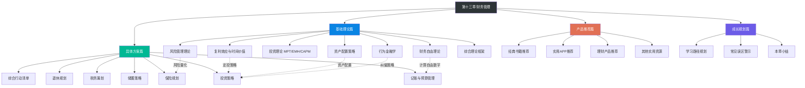
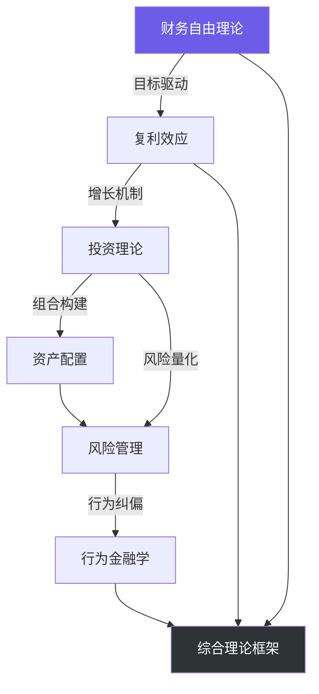
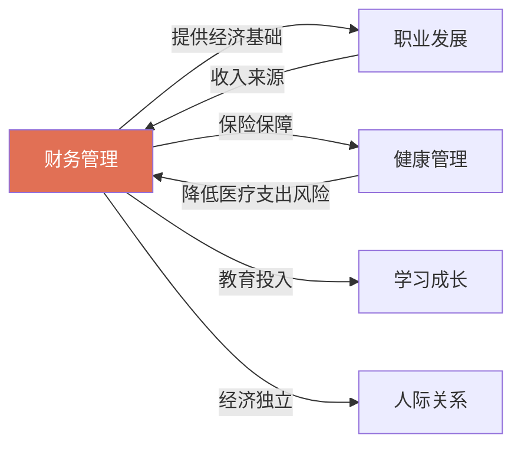

# 第十三章 财务管理：掌控金钱，掌控人生

## 一个关于选择的故事

张伟、李明和赵磊是大学同班同学，2015年毕业后进入同一家互联网公司，起薪都是月薪8000元。十年后，三人的财务状况呈现出三种截然不同的图景：

**张伟——高收入的脆弱者。** 月入3万，但信用卡负债12万，房贷月供1.2万，没有任何投资和保险。他每天焦虑地刷着手机，担心被裁员——因为他知道，一旦失去收入，他的现金流会在两个月内断裂。他的生活看起来光鲜：开着贷款买的车，每年出国旅行两次，衣柜里挂满了名牌。但深夜打开银行APP时，他看到的是一个负数的净资产。他不是没有赚钱的能力，而是从未建立过管理系统——钱进来多少花多少，甚至花得比进来更多。

**赵磊——谨慎但低效的储蓄者。** 月入2.8万，银行存款45万，没有负债，但也没有任何投资。他每月把工资的40%存入银行定期，觉得"钱放在银行最安全"。十年来，他的45万存款的实际购买力（扣除通胀后）大约只相当于十年前的32万。他不知道什么是资产配置，也不理解为什么"安全"的银行存款其实在悄悄贬值。他不焦虑，但也从未从容——因为他隐约感觉到，仅靠存款永远无法实现真正的财务自由。

**李明——系统化的管理者。** 月入2.5万（比张伟略低），但拥有180万的投资组合，6个月的紧急备用金，完整的保险保障体系，房贷已提前还清。他刚从上一家公司主动离职，因为想换一个更感兴趣的赛道——他有两年的"跑道"来从容选择。他的秘密不是高薪或运气，而是一套从25岁就开始建立的财务管理系统：自动记账、定期储蓄、科学投资、合理保险、合法节税。这套系统每天只占用他10分钟，但十年累积下来，效果惊人。

十年前的同一起点，十年后的天壤之别。区别不在于谁赚得更多，而在于**谁更早开始系统化地管理自己的财务**。

这三个人代表了三种最常见的财务状态：**负债型**（收入高但支出更高，净资产为负）、**储蓄型**（有积累但效率低下，跑不赢通胀）、**系统型**（有完整的管理框架，让每一分钱都发挥最大价值）。本章的目标，就是帮你从任何起点出发，走向第三种状态。

---

## 为什么财务管理是一切个人提升的基石

这不是一个极端案例。根据中国人民银行2024年的调查数据，中国家庭的金融资产配置中，现金和存款占比超过50%，而股票、基金等权益类资产占比不足15%。与此同时，中国家庭债务收入比从2010年的30%飙升至2024年的超过62%。更扎心的数据来自《中国养老金融调查报告》：在35岁以下的年轻人中，超过68%的人没有进行过任何系统的财务规划，超过45%的人不清楚自己每月的具体支出构成，超过72%的人无法准确说出自己的净资产数字。

这些数字背后是一个残酷的现实：**绝大多数人并不是赚得不够多，而是管理得太差。**

**你可以拥有卓越的专业技能、强健的体魄和丰富的知识储备，但如果无法妥善管理自己的财务，这些优势终将被经济压力所侵蚀。** 一个背负高额债务的人无法从容地选择自己热爱的事业；一个没有任何保险的家庭可能因一场大病而返贫；一个从未规划过退休的人将在晚年面临尊严的丧失。

财务管理不是关于"如何一夜暴富"——那种想法本身就是财务认知不成熟的表现。财务管理是关于**如何让你的每一分钱都为你工作，如何建立抵御风险的经济壁垒，如何通过系统化的规划实现人生的长期目标**。

正如沃伦·巴菲特所言："如果你找不到一种在睡觉时赚钱的方法，你将工作到死。"这句话不是鸡汤，而是一个数学事实——你的时间是有限的，只有让资本替你工作，才能突破时间的天花板。

---

## 财务急救：如果你正处于危机中

在正式进入系统化学习之前，如果你正处于以下任何一种财务危机中，请先执行对应的"急救措施"，稳住局面后再回来系统学习：

### 危机一：信用卡/消费贷债务螺旋

**症状**：每月只还最低还款额，多张信用卡来回倒，债务总额持续增长。

**急救步骤**：

1. **立刻停止新增负债**——剪掉多余的信用卡（保留一张用于紧急情况），删除所有消费贷APP
2. **列出所有债务清单**——每张卡的欠款金额、利率、最低还款额，按利率从高到低排序
3. **执行"雪崩法"**——所有卡都还最低还款额，但把所有额外资金集中还利率最高的那张卡
4. **拨打银行客服协商**——说明还款困难，申请减免利息或延长还款期（银行通常愿意协商，因为坏账对它们更不利）
5. **建立"债务还清倒计时"**——在手机桌面放置一个倒计时小组件，每天提醒自己目标

### 危机二：现金流即将断裂

**症状**：失业或即将失业，存款不足以支撑3个月生活开支。

**急救步骤**：

1. **立即削减所有非必要支出**——取消所有订阅服务（视频会员、音乐会员、健身房），暂停外食，改用公共交通
2. **计算你的"生存预算"**——只保留房租/房贷、水电、基础饮食、交通、通讯这五项，算出每月最低开支
3. **盘点所有可变现资产**——闲置物品（闲鱼/转转出售）、可提前赎回的理财产品、可提取的公积金
4. **启动"生存模式"收入**——兼职（外卖/网约车/家教）、自由职业（写作/设计/编程）、出售技能（在行/知乎咨询）
5. **申请失业保险金**——如果你缴纳过失业保险，离职后可申领（通常为当地最低工资的70-90%，最长24个月）

### 危机三：突发大额支出（医疗/事故）

**症状**：家庭成员突发疾病或事故，需要大额医疗费用。

**急救步骤**：

1. **确认医保报销范围**——社保医保通常可报销50-70%的住院费用，先走医保结算
2. **申请大病医疗救助**——向当地民政部门申请，低收入家庭可获得额外补助
3. **利用"水滴筹/轻松筹"等平台**——在正规平台发起众筹，注意保留所有医疗票据
4. **与医院协商分期付款**——大多数公立医院接受分期付款方案
5. **事后复盘保险缺口**——这是最痛苦的教训，但也是最重要的：危机过后，立即配置好医疗险和重疾险

> **重要提示**：以上急救措施只能稳住局面，不能解决根本问题。危机过后，请务必回到本章，系统学习财务管理知识，建立长期的财务安全体系。

---

## 本章知识地图

本章构建了一个完整的个人财务管理知识体系，从认知底层到实操落地，从理论框架到工具推荐，层层递进。全章约20万字，分为四大板块，共17个核心模块：

> **阅读提示**：虚线箭头表示理论与方案之间的直接指导关系。基础理论篇的每个模块都对应具体方案篇中的实操环节——理论不是孤立的知识，而是行动的底层操作系统。

### 各模块速览

| 板块 | 模块 | 难度 | 预计阅读 | 核心收获 |
|------|------|------|---------|---------|
| 基础理论 | 财务自由理论 | ★★☆ | 1.5h | 算出你的自由数字，知道离目标多远 |
| 基础理论 | 复利效应与时间价值 | ★★☆ | 1h | 理解时间如何成为你最大的盟友 |
| 基础理论 | 投资理论 | ★★★☆ | 2h | 掌握诺贝尔奖级别的投资原理 |
| 基础理论 | 资产配置策略 | ★★★ | 1.5h | 学会科学分配资产的方法 |
| 基础理论 | 风险管理理论 | ★★★ | 1.5h | 量化风险，建立防御体系 |
| 基础理论 | 行为金融学 | ★★☆ | 1.5h | 识别并纠正常见的认知偏差 |
| 基础理论 | 综合理论框架 | ★★★☆ | 1h | 将所有理论整合为统一体系 |
| 具体方案 | 记账与预算管理 | ★☆ | 1h | 建立可执行的记账系统 |
| 具体方案 | 储蓄策略 | ★☆ | 1h | 找到适合自己的储蓄方法 |
| 具体方案 | 投资策略 | ★★★ | 2h | 从零开始构建投资组合 |
| 具体方案 | 保险规划 | ★★☆ | 1.5h | 配置适合自己的保险方案 |
| 具体方案 | 税务筹划 | ★★★ | 1.5h | 合法节税，到手收入更多 |
| 具体方案 | 退休规划 | ★★★ | 1.5h | 为未来的自己负责 |
| 具体方案 | 综合行动清单 | ★★ | 0.5h | 一份按优先级排列的待办清单 |
| 产品推荐 | 书籍/APP/理财/资源 | ★☆ | 1.5h | 精选工具和资源清单 |
| 成长规划 | 学习路径 | ★☆ | 0.5h | 分阶段成长路线图 |
| 成长规划 | 常见误区 | ★★ | 1h | 避开最具破坏力的财务陷阱 |

**总计阅读时间**：约25-30小时（精读）/ 约12-15小时（按自测结果选择性阅读）

---

## 自我诊断：你目前处于哪个阶段？

在开始阅读之前，请花3分钟完成以下自测。这不是考试，而是帮你定位起点，让你在阅读时能更有针对性地获取所需知识。请诚实回答——你的答案只对你自己有意义。

### 财务健康度自测表

| 序号 | 问题 | 选项A（0分） | 选项B（1分） | 选项C（2分） | 选项D（3分） |
|------|------|-------------|-------------|-------------|-------------|
| 1 | 你知道自己上个月花了多少钱吗？ | 完全不知道 | 大概有个数 | 误差在20%以内 | 精确到分类 |
| 2 | 你有紧急备用金吗？ | 没有 | 不到1个月支出 | 3-6个月支出 | 6个月以上支出 |
| 3 | 你是否有高息负债（信用卡分期/消费贷）？ | 有多笔 | 有1-2笔 | 已还清但曾有过 | 从未有过 |
| 4 | 你了解复利效应吗？ | 没听过 | 听说过但不懂 | 能解释原理 | 已在投资中应用 |
| 5 | 你有投资经验吗？ | 从未投资 | 只有银行存款 | 买过基金/理财 | 有完整的投资组合 |
| 6 | 你购买过商业保险吗？ | 完全没有 | 只有社保 | 有1-2份商业险 | 有完整的保障体系 |
| 7 | 你知道自己的财务自由数字吗？ | 从未想过 | 有个模糊目标 | 计算过但没规划 | 有明确计划在执行 |
| 8 | 你了解资产配置的概念吗？ | 完全不懂 | 听说过 | 理解原理 | 已应用到实际投资 |

### 多维度评估

除了总分，还可以根据以下三个维度进一步定位自己的薄弱环节：

| 维度 | 对应题号 | 低分（0-2分）意味着 | 你需要重点阅读 |
|------|---------|-------------------|--------------|
| **认知层**（你知道多少） | 4, 7, 8 | 缺乏基础财务知识框架 | 基础理论篇全部 |
| **执行层**（你在做什么） | 1, 2, 5 | 有认知但没有行动 | 具体方案篇（记账、储蓄、投资） |
| **保障层**（你防住了吗） | 3, 6 | 风险敞口大，缺乏安全网 | 具体方案篇（保险、债务管理） |

### 评分解读与个性化阅读路径

**0-6分 · 财务启蒙期**

你处于财务管理的起点，这完全没问题——绝大多数人都在这个阶段。你最大的优势是**时间**。从今天开始，你每早一天建立正确的财务习惯，未来就多一份从容。

- **必读**：基础理论篇全部 → 具体方案篇（记账 → 储蓄 → 保险）→ 产品推荐篇（书籍）
- **跳读**：投资理论中的高级部分（CAPM数学推导、MPT公式）可以先跳过
- **第一个行动**：下载一个记账APP，今天就开始记录每一笔支出
- **预计达到下一阶段时间**：3-6个月（如果坚持执行本章建议）

**7-12分 · 财务成长期**

你已经有了基础意识，但缺乏系统化的方法和工具。你可能有一些零散的理财行为，但没有形成完整的体系。这个阶段的关键是**整合**——把零散的知识和行为串联成一个系统。

- **必读**：基础理论篇（重点：资产配置 + 风险管理 + 行为金融学）→ 具体方案篇全部 → 产品推荐篇
- **跳读**：财务自由理论和复利效应可以快速浏览
- **第一个行动**：计算你的净资产和储蓄率，建立家庭财务报表
- **预计达到下一阶段时间**：6-12个月

**13-18分 · 财务进阶期**

你已经具备不错的财务基础，有记账习惯，有投资经验，有保险配置。这个阶段的重点是**优化**——在细节上精进，在认知偏差上纠偏。

- **必读**：行为金融学 → 资产配置中的全天候策略和再平衡方法 → 税务筹划 → 退休规划
- **跳读**：基础理论篇可以快速浏览，重点关注行为金融学和风险管理
- **第一个行动**：审查你的投资组合，计算夏普比率和最大回撤
- **预计达到下一阶段时间**：1-2年

**19-24分 · 财务精通期**

你已经相当成熟，有完整的财务管理系统。这个阶段的重点是**持续迭代**和**认知升级**。

- **必读**：行为金融学中的认知偏差修正 → 产品推荐篇中的高级工具和资源 → 综合理论框架
- **跳读**：具体方案篇可以作为检查清单使用
- **第一个行动**：用行为金融学的"决策清单"审视你过去一年的财务决策
- **保持状态**：每季度复盘一次，每年做一次全面财务健康检查

---

## 本章内容全景

### 第一层：认知重塑——基础理论篇

理论是指南针。没有理论指导的实践是盲目的——你可能在错误的道路上越跑越远却浑然不知。基础理论篇包含七大核心模块，它们构成了你理解一切财务决策的认知底层。

这七个模块的逻辑关系如下：

**一、财务自由：从梦想走向现实**

财务自由不是一个遥不可及的幻想，而是一个可以通过数学公式精确计算的目标。本节将完整覆盖：

- **4%法则**的数学原理、历史回测依据及其在中国市场的适用性调整（保守建议采用3%-3.5%的提取率）
- **财务自由的五个阶段**：从财务保障到财务丰盛，每个阶段的量化标准和达成路径
- **FIRE运动**的四种变体（精益FIRE、肥厚FIRE、咖啡师FIRE、海岸FIRE），以及它们对中国读者的实际参考价值
- 不同收入水平下的财务自由路径对照表，让你找到自己的坐标
- **关键洞察**：储蓄率比收入更关键——月薪1万储蓄率50%的人，比月薪3万储蓄率10%的人更快实现财务自由

**二、复利效应：世界第八大奇迹**

爱因斯坦称之为"世界第八大奇迹"。但大多数人对复利的理解停留在表面。本节将深入到：

- **72法则**及其精确版本（69.3法则），让你快速心算资产翻倍时间
- **定投复利公式**的实际应用——每月定投2000元，30年后将积累约298万元（投入72万，收益226万）
- **复利的反面**：负债的复利如何在不知不觉中吞噬你的财富（信用卡1万元债务，只还最低还款额，5年后将膨胀到2.4万元）
- **通胀的侵蚀效应**：中国近20年的CPI数据，以及为什么投资不是可选项而是必需品
- **货币的时间价值**：为什么今天的100元比明天的100元更值钱（10年后的100万，按8%折现率计算，今天只值46.3万）

**三、投资理论：现代投资组合理论与有效市场假说**

诺贝尔奖级别的金融理论，但我们将用普通人能理解的方式讲解：

- **现代投资组合理论（MPT）**：为什么"不要把所有鸡蛋放在一个篮子里"这句话背后有严谨的数学支撑，以及相关系数如何决定你的分散化效果（两个风险各20%的资产，相关系数为0时组合风险降至14.14%）
- **有效市场假说（EMH）**：三种形式的市场效率，为什么超过90%的主动型大盘基金在15年期跑输标普500指数，以及指数基金为何是最优选择
- **资本资产定价模型（CAPM）**：系统性风险与非系统性风险的区别，Beta系数的含义
- **适应性市场假说**：作为EMH和行为金融学的调和方案，解释为什么市场效率是动态变化的

**四、资产配置：投资的基石**

诺贝尔经济学奖得主马科维茨的研究表明，资产配置决定了投资组合90%以上的收益差异。本节覆盖：

- **战略资产配置与战术资产配置**的区别和适用场景
- **不同人生阶段的配置模型**：从25岁的进取型（股票80%/债券20%）到55岁的保守型（股票30%/债券50%/现金20%）
- **全天候策略**：桥水基金达利欧的全天候投资组合原理——如何在任何经济环境下都能获得正收益
- **再平衡策略**：何时、如何调整你的资产比例（阈值法 vs 定期法）

**五、风险管理理论**

投资的首要原则不是赚钱，而是控制风险。本节将系统讲解：

- **风险的量化工具**：标准差、最大回撤、VaR（在险价值）、夏普比率——每个指标的含义、计算方法和应用场景
- **系统性风险与非系统性风险**的本质区别及各自应对策略
- **黑天鹅事件**的特征和防御方法——塔勒布的"杠铃策略"（将90%资产放在极度安全的地方，10%放在高风险高回报的地方）
- **风险承受能力评估**：如何科学地评估自己能承受多大的波动——包括财务承受能力和心理承受能力两个维度

**六、行为金融学：理解你的投资心理**

这是本章最具颠覆性的内容。传统金融学假设人是理性的，但行为金融学揭示了人类在财务决策中的系统性偏差。研究表明，普通投资者的实际收益率比市场低3-5个百分点，其中大部分损失来自行为偏差而非市场本身：

- **损失厌恶**：为什么亏损1万元的痛苦是赚到1万元快乐的2.5倍——以及这如何导致你在应该加仓时割肉
- **锚定效应**：为什么你会执着于股票的买入价——"等回本了再卖"是最常见的投资陷阱
- **过度自信偏差**：为什么90%的司机认为自己的驾驶水平高于平均——以及为什么80%的散户认为自己能跑赢市场
- **羊群效应**：为什么你在股市高点时最想买入，在低点时最想卖出
- **心理账户**：为什么你会对不同来源的钱有不同的消费态度（年终奖花起来比工资"爽"）
- **具体的纠偏策略**：如何建立"决策清单"来对抗认知偏差——每笔投资前对照检查

**七、综合应用：建立个人财务理论框架**

将前六个模块整合为一个统一的分析框架，让你能用理论指导每一个财务决策。这个框架包含五个步骤：目标设定 → 风险评估 → 资产配置 → 执行监控 → 定期复盘。

### 第二层：行动落地——具体方案篇

理论的价值在于指导实践。具体方案篇提供七个维度的操作指南，每一个都有具体的步骤、工具推荐和执行模板。

**一、记账与预算管理：掌握你的资金流向**

你无法改善你无法衡量的东西。本节从零开始教你建立记账系统：

- **三种记账方法**的对比：手动记账（适合刚起步）、半自动记账（推荐大多数人）、全自动记账（适合技术型用户）
- **预算编制方法**：50/30/20法则（需求/想要/储蓄）、信封法（物理隔离消费预算）、零基预算法（每一分钱都有归属）
- **支出分析框架**：如何从记账数据中发现消费盲区——"拿铁因子"效应揭示的小额高频消费陷阱
- **家庭财务报表**：像管理公司一样管理家庭财务——资产负债表、现金流量表的个人版

**二、储蓄策略：积少成多的艺术**

储蓄是投资的起点，但"少花钱"不等于有效的储蓄策略：

- **先储蓄后消费法**：如何通过自动化实现"无痛储蓄"——工资到账日自动转出20%到专用账户
- **阶梯储蓄法**：兼顾流动性和收益的存款策略——将存款分为1年、2年、3年期，每年到期一笔
- **目标储蓄法**：为不同目标设立不同的储蓄账户——旅行基金、应急基金、购房基金各自独立
- **高息负债优先偿还策略**：雪球法（先还最小的债，获得心理激励）与雪崩法（先还利率最高的债，节省利息）的对比

**三、投资策略**

为不同风险偏好的投资者提供分层策略：

- **投资工具全景图**：银行理财、货币基金、债券基金、指数基金、主动基金、个股、REITs、黄金——按风险收益特征排列
- **定投策略详解**：普通定投（傻瓜式）、价值平均定投（目标市值法）、估值定投（低估多买、高估少买）
- **基金筛选方法**：如何用量化指标筛选优质基金——夏普比率、最大回撤、基金经理任职年限、费率比较
- **仓位管理**：金字塔加仓法（越跌越买但递减）、网格交易法（设定价格区间自动买卖）

**四、保险规划：为人生系上安全带**

保险是风险管理的核心工具，但大多数人要么"裸奔"要么"过度投保"：

- **保险配置的"双十原则"**：保费不超过年收入10%，保额不低于年收入10倍
- **四大必备险种**详解：医疗险（报销型，解决大额医疗费）、重疾险（给付型，弥补收入损失）、意外险（杠杆最高的险种）、定期寿险（家庭经济支柱必备）
- **不同人生阶段的保险方案**：单身期（医疗+意外为主）→ 家庭形成期（加定期寿险+重疾）→ 家庭成熟期（加教育金规划）→ 退休期（医疗+护理为主）
- **保险产品对比方法**：如何看懂保险条款中的"坑"，如何避免被销售误导

**五、税务筹划：合法节税的艺术**

税务筹划不是偷税漏税，而是在法律框架内合理优化税务负担：

- **个人所得税计算**：综合所得税率表、七项专项附加扣除详解（子女教育、继续教育、大病医疗、住房贷款利息、住房租金、赡养老人、3岁以下婴幼儿照护）
- **合法节税工具**：个人养老金账户（年缴12000元，抵扣个税）、商业健康险税优（每年2400元限额）、公积金策略（充分利用税前扣除上限）
- **年终奖计税方式选择**：单独计税与合并计税的临界点分析——在什么收入水平下选择哪种方式更划算
- **投资收益的税务处理**：股票转让免征个税、基金分红的税务规则、房产交易的税费全景

**六、退休规划：为未来的自己负责**

退休规划不是"等到快退休时再说"，而是越早开始越轻松。30岁开始每月存2000元，比40岁开始每月存5000元，退休时的积累可能更多——这就是复利在退休规划中的威力：

- **养老金三支柱体系**：社保养老金（替代率约40-60%）、企业年金/职业年金（覆盖人群有限）、个人养老金（2024年全面推开，年缴上限12000元）
- **退休金缺口计算**：你需要多少钱才能体面退休——考虑通胀、医疗、生活品质三个维度
- **个人养老金账户**：2024年全面推开后的开户、投资、领取全流程——哪些人最值得开通
- **退休后的资产提取策略**：如何让退休金花一辈子——动态提取法、桶策略、年金化策略

**七、综合行动清单**

将前六个方案整合为一份可执行的行动清单，按优先级排列，让你知道"今天该做什么"。从"立刻做"（设置自动转账）到"本月做"（建立记账系统）到"本季度做"（配置保险和开始定投）。

### 第三层：资源整合——产品推荐篇

在海量的金融产品和学习资源中，选择适合自己的并不容易。本章精心筛选并推荐：

**一、经典书籍**

从入门到进阶的精选财务书籍，每本书附有阅读建议、核心收获和适合人群标注，帮你避免"买了不读"或"读了不适合"的浪费。覆盖从《小狗钱钱》这样的启蒙读物到《聪明的投资者》这样的经典巨著。

**二、实用APP**

涵盖记账、投资、保险比价、信用管理等场景的优质应用程序，附有功能对比和使用建议。针对不同手机系统（iOS/Android）和不同需求场景给出推荐。

**三、理财产品**

按照风险等级（R1-R5）分类，介绍适合不同风险偏好的理财产品，包括预期收益、流动性、门槛和注意事项。重点标注哪些产品适合新手，哪些需要专业知识。

**四、其他实用资源**

在线课程、播客、社区、专业工具等补充资源的精选推荐。包括中文和英文资源，满足不同语言偏好的读者。

### 第四层：成长规划——学习路径与常见误区

**一、学习路径**

从财务小白到理财达人的分阶段成长路线图：

| 阶段 | 时间跨度 | 核心目标 | 关键行动 | 里程碑标志 |
|------|---------|---------|---------|-----------|
| 第一阶段 | 0-3个月 | 建立基础认知和习惯 | 开始记账，学习基础概念，清理高息负债 | 能说出自己每月支出的精确数字 |
| 第二阶段 | 3-6个月 | 建立安全网 | 建立储蓄系统，配置基础保险，开始定投 | 拥有1个月的紧急备用金 |
| 第三阶段 | 6-12个月 | 形成投资体系 | 优化资产配置，学习税务筹划，建立投资体系 | 拥有3-6个月备用金+基础保险+定投在运行 |
| 第四阶段 | 1-3年 | 深化和优化 | 深化投资知识，优化财务结构，开始退休规划 | 能独立分析投资组合的风险收益特征 |
| 第五阶段 | 3年以上 | 持续迭代 | 建立完整的财务管理系统，持续优化迭代 | 拥有完整的个人财务管理系统并定期复盘 |

**二、常见误区**

揭示最具破坏力的财务误区，每个误区都会给出真实的危害案例和纠正方法：

- **"我还年轻，不需要理财"**——时间是复利最大的盟友，每晚一年开始代价巨大。25岁开始每月投2000元（年化8%），到60岁有约700万；35岁才开始，同样条件只有约300万。差10年，差了400万。
- **"理财是有钱人的事"**——理财的核心是习惯和系统，而非起点金额。月入5000元就开始记账和储蓄的人，比月入5万但从不理财的人，在10年后的财务状况往往更好。
- **"高收益等于好投资"**——风险调整后的收益才是真正的衡量标准。年化收益20%但最大回撤50%的策略，不如年化10%但最大回撤10%的策略。
- **"房产是最好的投资"**——资产集中度风险和流动性风险的深度分析。中国一线城市的房产租售比已降至1.5%以下，远低于房贷利率。
- **"保险是骗人的"**——产品设计与销售误导的区别，以及如何正确配置保险。保险是用确定的小额支出对冲不确定的大额风险，是理性人的选择。

---

## 本章的学习目标

通过本章的学习，你将能够：

1. **计算你的财务自由数字**：明确自己需要多少钱才能实现财务自由，并制定可行的达成路径
2. **建立完整的记账系统**：掌握自己的资金流向，识别消费盲区，优化支出结构
3. **制定合理的储蓄计划**：找到适合自己的储蓄方法和节奏，并开始系统性执行
4. **理解主流投资理论**：掌握MPT、EMH、CAPM的核心原理，建立科学的投资决策框架
5. **构建投资组合**：了解各类投资工具的风险收益特征，根据自身情况配置资产
6. **识别并纠正常见的认知偏差**：运用行为金融学知识，避免情绪化决策
7. **设计保险保障方案**：为不同人生阶段配置合适的保险产品
8. **掌握合法节税方法**：合理利用税收优惠政策，优化税务负担
9. **启动退休规划**：计算退休金缺口，选择合适的养老金融工具
10. **规避常见的财务决策陷阱**：识别并避开十个最具破坏力的财务误区

---

## 阅读建议与学习策略

### 分层阅读策略

本章内容丰富（全章约20万字），不必一次性全部读完。根据你的自测分数，选择适合的阅读策略：

**入门读者（0-6分）——四周渐进式阅读：**

| 周次 | 阅读内容 | 实践任务 | 预计时间 |
|------|---------|---------|---------|
| 第一周 | 基础理论篇（财务自由 + 复利效应） | 开始记账，下载一个记账APP | 6-8小时 |
| 第二周 | 基础理论篇（投资理论 + 资产配置 + 风险管理） | 计算自己的财务自由数字，设定储蓄目标 | 8-10小时 |
| 第三周 | 具体方案篇（记账 + 储蓄 + 投资入门 + 保险） | 建立储蓄自动化，开始基金定投 | 8-10小时 |
| 第四周 | 行为金融学 + 学习路径 + 常见误区 + 产品推荐 | 制定个人财务提升计划 | 6-8小时 |

**进阶读者（7-12分）——两周重点突破：**

| 周次 | 阅读重点 | 实践任务 |
|------|---------|---------|
| 第一周 | 基础理论篇（重点：资产配置 + 风险管理 + 行为金融学） + 投资策略 + 保险规划 | 优化资产配置，审查保险方案 |
| 第二周 | 税务筹划 + 退休规划 + 产品推荐 + 常见误区 | 启动税务筹划，开设个人养老金账户 |

**高阶读者（13分以上）——针对性查阅：**

- 快速浏览基础理论篇，重点阅读行为金融学中的认知偏差部分
- 深入研究资产配置中的全天候策略和再平衡方法
- 重点关注税务筹划和退休规划中的进阶内容
- 用产品推荐篇更新自己的工具箱

### 三个核心实践建议

**1. 读完就做，不要等"准备好了"再行动**

财务管理最大的敌人是拖延。你不需要学完所有理论才开始行动。读完第一章就开始记账，读完储蓄策略就开始设置自动转账，读完投资入门就开始定投。行动本身就是最好的学习方式。

**2. 用"最小可行系统"起步**

不要追求一步到位的完美财务系统。先用一个最小可行系统（Minimum Viable System）运转起来，再逐步升级：

| 步骤 | 具体行动 | 耗时 | 升级方向 |
|------|---------|------|---------|
| 第一步 | 下载记账APP，今天就开始记录每笔支出 | 2分钟/天 | → 半自动记账 → 家庭财务报表 |
| 第二步 | 设置工资到账日自动转账20%到储蓄账户 | 一次性设置5分钟 | → 多账户目标储蓄 → 阶梯储蓄法 |
| 第三步 | 开通基金定投，每月固定金额买入指数基金 | 一次性设置10分钟 | → 估值定投 → 完整资产配置 |

这个系统虽然只有三步，但它会让你的财务状况立即开始改善。根据行为经济学的研究，自动化是克服人性弱点最有效的手段——当你不需要"决定"是否储蓄时，储蓄率会显著提高。

**3. 定期回顾和调整**

财务管理不是一劳永逸的事情。建议建立以下复盘节奏：

| 频率 | 内容 | 预计时间 | 关注重点 |
|------|------|---------|---------|
| 每周 | 检查记账数据，确保没有异常支出 | 10分钟 | 是否有冲动消费？分类是否准确？ |
| 每月 | 回顾预算执行情况，调整下月计划 | 30分钟 | 储蓄率是否达标？哪些类别超支？ |
| 每季度 | 审视投资组合，检查是否需要再平衡 | 1小时 | 资产配置偏离目标多少？是否需要调仓？ |
| 每年 | 全面财务健康检查，更新财务目标 | 半天 | 净资产变化？保险是否需要调整？税务筹划是否到位？ |

---

## 本章的知识体系定位

在个人提升的完整框架中，财务管理是"器"的层面——它是实现其他目标的工具和杠杆：

与其他章节的深度联动：

| 关联章节 | 财务管理的作用 | 关联章节的反向作用 | 联动案例 |
|---------|--------------|------------------|---------|
| **职业发展** | 为职业选择提供经济底气，让你敢于拒绝不合适的工作 | 职业晋升带来的收入增长是投资本金的最大来源 | 有6个月备用金的人，在跳槽谈判中更有底气，平均薪资涨幅比"裸跳"者高15-20% |
| **健康管理** | 通过保险和储蓄覆盖医疗支出风险 | 健康的身体降低医疗开支，减少因病致贫风险 | 一份年缴2000元的医疗险，可以在大病时覆盖100万+的医疗费用 |
| **学习成长** | 为教育投入（深造、培训、子女教育）提供财务规划 | 持续学习提升赚钱能力，形成正向循环 | 一个MBA学位的投入约30-50万，但平均薪资提升在5年内可覆盖成本 |
| **人际关系** | 经济独立是健康关系的基础，避免因金钱问题产生的关系矛盾 | 良好的人脉带来商业机会和职业发展 | 财务自由的人在社交中更从容，不会因为经济压力而被迫维持不健康的社交关系 |
| **时间管理** | 财务自动化节省日常决策时间 | 高效的时间管理创造更多学习和创收机会 | 自动记账+自动储蓄+自动定投，每天只占用10分钟，但节省了数小时的焦虑和纠结 |
| **心理建设** | 经济安全是心理安全感的重要来源 | 良好的心理状态帮助做出更理性的财务决策 | 有完整保险体系的人，在面对不确定性时的焦虑水平显著更低 |

> **核心洞察**：财务管理不是孤立的技能，而是个人提升体系的"操作系统"。它为其他所有维度提供资源支持，同时也从其他维度获得输入。忽视财务管理，就像盖楼不打地基——楼越高，风险越大。

---

## 本章不覆盖什么

为了让你对本章内容有准确的预期，以下是一些**本章不会深入覆盖**的领域：

| 不覆盖的内容 | 原因 | 建议去处 |
|------------|------|---------|
| 炒股技术分析（K线、MACD等） | 技术分析的有效性在学术界存在重大争议，且本章聚焦个人财务管理而非投机交易 | 《日本蜡烛图技术》《技术分析实战》 |
| 加密货币投资 | 高度投机性资产，不适合作为个人财务管理的核心组成部分 | 独立研究，仅用"输得起"的钱参与 |
| 房地产投资的具体操作 | 涉及大量地域性因素和政策变量，需要专门的房地产投资知识 | 当地房产中介+专业房产投资书籍 |
| 企业财务管理 | 本章聚焦个人/家庭财务管理，企业财务管理是另一个专业领域 | 《财务管理学》（高校教材） |
| 遗产规划和信托 | 涉及法律专业知识，建议咨询专业律师 | 专业遗产律师+《遗产规划实务》 |
| 海外资产配置 | 涉及外汇管制、海外税务等复杂问题 | 专业海外资产配置顾问 |

---

## 关键术语速查

在阅读本章之前，建议先熟悉以下核心术语，它们将贯穿全章：

| 术语 | 英文 | 一句话解释 | 首次出现 |
|------|------|-----------|---------|
| 财务自由 | Financial Independence | 被动收入 ≥ 生活支出的状态 | 基础理论篇 第一章 |
| 4%法则 | 4% Rule | 每年提取初始组合的4%可支撑30年以上 | 基础理论篇 第一章 |
| FIRE | Financial Independence, Retire Early | 通过高储蓄率和投资实现提前退休 | 基础理论篇 第一章 |
| 复利 | Compound Interest | 利息产生利息的滚雪球效应 | 基础理论篇 第二章 |
| 72法则 | Rule of 72 | 72÷收益率=资产翻倍年数 | 基础理论篇 第二章 |
| 现值 | Present Value | 未来某笔钱在今天的价值 | 基础理论篇 第二章 |
| MPT | Modern Portfolio Theory | 通过资产组合优化风险收益比 | 基础理论篇 第三章 |
| 有效市场假说 | EMH | 价格已反映所有可获得信息的理论 | 基础理论篇 第三章 |
| CAPM | Capital Asset Pricing Model | 资产预期收益与其系统性风险的关系模型 | 基础理论篇 第三章 |
| Beta系数 | Beta | 衡量资产相对于市场整体波动性的指标 | 基础理论篇 第三章 |
| 资产配置 | Asset Allocation | 将资金分配到不同资产类别的策略 | 基础理论篇 第四章 |
| 再平衡 | Rebalancing | 定期调整资产比例回到目标配置 | 基础理论篇 第四章 |
| 标准差 | Standard Deviation | 衡量投资回报波动性的统计指标 | 基础理论篇 第五章 |
| 夏普比率 | Sharpe Ratio | 每承担一单位风险获得的超额收益 | 基础理论篇 第五章 |
| 最大回撤 | Maximum Drawdown | 投资组合从最高点到最低点的最大跌幅 | 基础理论篇 第五章 |
| 在险价值 | VaR | 一定置信水平下的最大可能损失 | 基础理论篇 第五章 |
| 损失厌恶 | Loss Aversion | 亏损的痛苦约为等额收益快乐的2.5倍 | 基础理论篇 第六章 |
| 锚定效应 | Anchoring Effect | 过度依赖第一个接触到的信息做决策 | 基础理论篇 第六章 |
| 50/30/20法则 | 50/30/20 Rule | 需求50%/想要30%/储蓄20%的预算分配 | 具体方案篇 第一章 |
| 双十原则 | Double-Ten Rule | 保费≤年收入10%，保额≥年收入10倍 | 具体方案篇 第四章 |
| 专项附加扣除 | Special Additional Deductions | 个税计算中可额外扣除的七项支出 | 具体方案篇 第五章 |
| 养老金三支柱 | Three Pillars of Pension | 社保+企业年金+个人养老金的养老体系 | 具体方案篇 第六章 |

---

## 本章关键词

`财务自由` · `复利效应` · `资产配置` · `投资组合理论` · `有效市场假说` · `行为金融学` · `风险管理` · `记账` · `储蓄策略` · `基金定投` · `保险规划` · `税务筹划` · `退休规划` · `认知偏差` · `夏普比率` · `FIRE运动` · `再平衡` · `紧急备用金` · `个人养老金` · `杠铃策略`

---

> **预计阅读时间**：25-30小时（全章精读）/ 12-15小时（按自测结果选择性阅读）
>
> **实践周期**：持续终身——财务管理是一项终身技能，而非一次性学习任务
>
> **前置知识**：基础数学运算能力（加减乘除即可），无需金融或经济学背景
>
> **适合人群**：所有希望改善财务状况的成年人，无论收入水平、年龄或当前财务状态
>
> **更新频率**：本章中的政策法规、税率、产品信息等内容会随时间变化，建议每6-12个月关注相关更新
