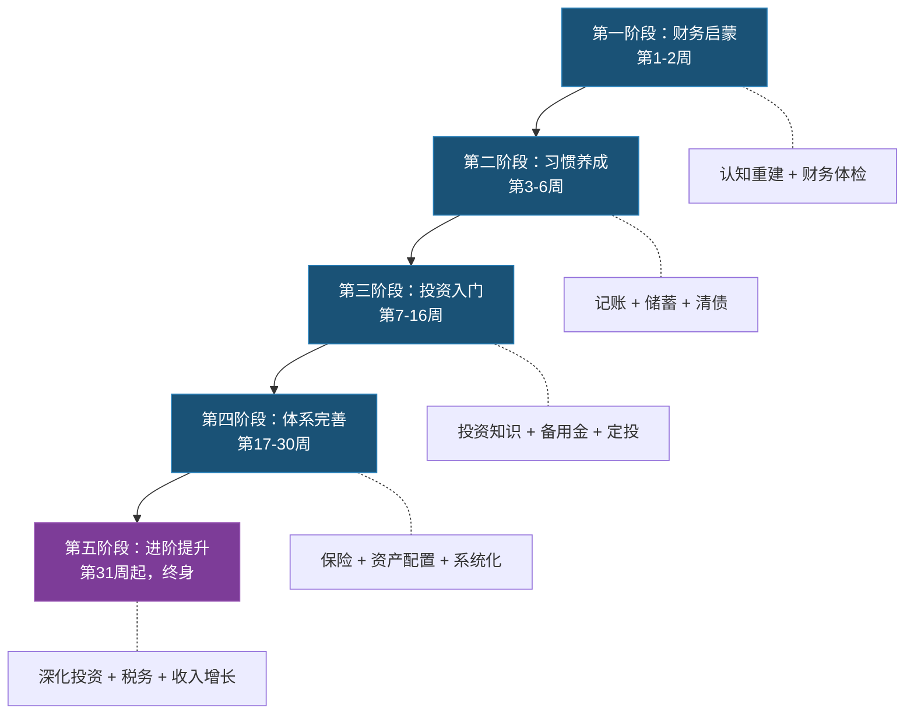
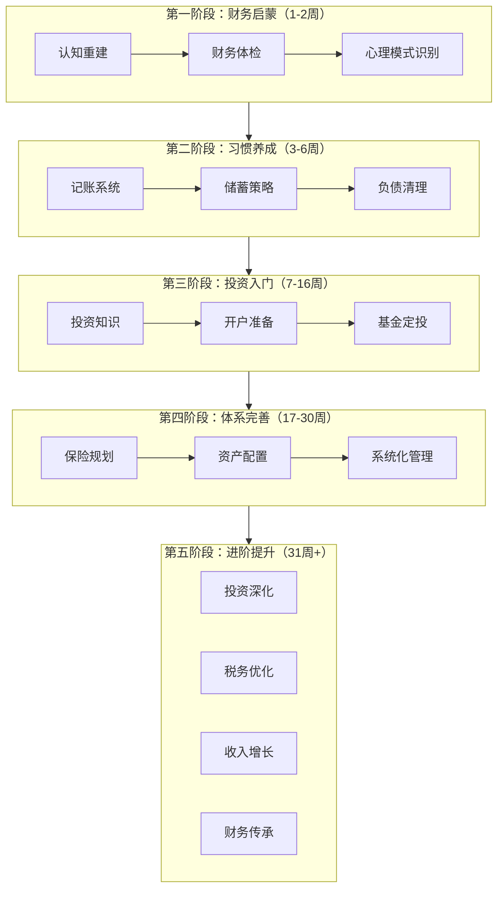

# 第四节 财务管理学习路径

## 概述

财务管理是一项可以系统学习、分阶段提升的复合技能。它融合了数学思维、心理学认知、经济学原理和法律常识，但并不需要你先成为这些领域的专家——正确的学习路径能让你在实践中同步建立这些能力。

本节为你规划了一条从零基础到具备独立财务决策能力的完整路径，分为五个阶段，每个阶段都有明确的学习目标、核心知识点、推荐资源、实操任务和验收标准。整个路径遵循以下设计原则：

1. **循序渐进**：从最基础的记账开始，逐步深入到投资组合和税务优化，每个阶段的知识都建立在前一阶段的基础上
2. **知行合一**：每个阶段都配套具体的实践任务和验收标准，确保学完就能用，用了就有反馈
3. **因人而异**：根据年龄、收入、风险偏好和人生阶段，提供差异化的学习建议
4. **反馈驱动**：每个阶段都设置了可量化的成果指标，让你清楚知道自己走到了哪里

---

## 第一阶段：财务启蒙（第1-2周）

### 阶段定位

这是整个学习路径的起点。很多人跳过这个阶段直接学投资，结果要么因为基础不牢而半途而废，要么因为对自己财务状况缺乏了解而做出错误决策。这个阶段的核心任务只有两个：**认清自己的钱**和**建立正确的金钱观**。

这个阶段不需要你买任何理财产品，不需要开任何投资账户，甚至不需要花一分钱。你只需要做两件事：诚实地面对自己的财务现状，以及修正那些阻碍你前进的错误认知。

### 学习目标

- 建立对财务管理的基本认知框架，理解"理财"不是"炒股"
- 完成个人财务全面体检，量化自己的财务起点
- 识别自己的金钱心理模式，发现潜在的认知偏差
- 激发持续学习理财的内在动力

### 核心知识点

#### 1.1 认知重建：打破关于钱的错误信念

大多数人对金钱的认知来自家庭环境和周围人的影响，这些认知往往是不完整甚至错误的。学习理财的第一步，是识别并纠正这些错误信念。

**常见的错误金钱信念及纠正：**

| 错误信念 | 为什么是错的 | 正确认知 |
|---------|------------|---------|
| "钱是省出来的" | 过度节流会降低生活质量，且储蓄率有上限（100%）。更重要的是，单纯节流存在"地板效应"——你最多只能省到零，但收入没有天花板 | 钱是"管"出来的——开源和节流同样重要，但长期来看，提升收入的能力远比压缩支出的潜力大 |
| "理财是有钱人的事" | 复利效应在小额资金上同样生效，且越早开始优势越大。假设年化8%，25岁每月投500元，60岁时约有127万；35岁才开始同样每月500元，60岁时只有约53万——差了74万 | 月入3000和月入3万面临的核心问题相同：如何管理现金流。金额不同，但比例和习惯是通用的 |
| "投资就是炒股" | 股票只是众多投资品种之一，且主动炒股长期跑赢指数的人不到20%（标普SPIVA报告持续证实这一点）。中国A股市场散户中，长期盈利的比例不足10% | 投资是对未来购买力的保值行为，方式远不止股票。指数基金定投、债券、REITs、甚至提升自己的技能都是一种"投资" |
| "我还年轻不着急" | 假设年化8%收益，25岁投入10万到60岁变成约148万；35岁投入则只有68万。晚10年开始，你需要多投入近一倍的本金才能追平 | 时间是复利最大的杠杆，年轻人最大的资本就是时间。越早开始，即使金额很小，时间也会帮你放大 |
| "负债是不好的" | 低息负债（如3%的房贷）如果能撬动更高回报的资产，反而是杠杆工具。全世界最富有的人群几乎都善用杠杆 | 区分"好负债"（能产生收益的，如房贷、经营贷）和"坏负债"（消费性高息贷款，如信用卡分期、花呗分期） |
| "跟着大佬买就行" | 别人的风险承受能力、资金量、投资期限和你完全不同。况且很多"大佬"本身就是靠卖课/卖策略赚钱，而非靠投资本身 | 建立自己的判断体系。可以学习别人的方法论，但决策必须基于自己的情况 |
| "存银行最安全" | 如果通胀率3%，100万存银行活期（利率约0.2%），10年后实际购买力缩水约25%。"安全"的存款实际上在稳定地亏损 | 安全性不只是"本金不减少"，还包括"购买力不缩水"。真正的安全是让资产增速至少跑赢通胀 |

**核心概念理解：**

你需要在这个阶段理解以下四个概念，它们是后续所有学习的基础：

- **财务自由**：被动收入（投资收益、租金、版税等不需要你持续劳动的收入）覆盖日常支出的状态。注意，这不是"有很多钱"，而是一个具体的数学关系——当"被动收入 ≥ 生活支出"时，你就实现了财务自由。假设你每月基本支出5000元，当你的投资组合每年产生6万元以上的被动收入时（按4%安全提取率计算，需要150万本金），你就实现了基础的财务自由
- **复利效应**：爱因斯坦称其为"世界第八大奇迹"。假设每月定投1000元，年化收益8%，30年后你投入的36万会变成约150万。理解复利的关键在于：时间比金额重要。复利公式为：终值 = 本金 × (1 + 收益率)^年数。用"72法则"快速估算：72 ÷ 年化收益率 = 资产翻倍所需年数。例如8%年化收益，约9年翻一倍
- **机会成本**：每一笔钱都有"没花在别处"的代价。买了最新款手机的5000元，如果投入指数基金10年，可能变成1万+。学会计算机会成本能帮你做出更理性的消费决策。具体方法：将消费金额乘以"投资回报倍数"（可查复利表），就是这笔钱的机会成本
- **通货膨胀**：如果通胀率是3%，你手里的100万在10年后购买力只相当于现在的74万。这就是为什么"把钱全部存银行"实际上是在亏钱。近20年中国平均通胀率约2-3%，但教育、医疗、住房等特定领域的涨幅远高于此。你的投资收益率至少需要跑赢通胀，否则就是在"隐性亏损"

#### 1.2 财务体检：量化你的起点

在做任何财务决策之前，你必须先搞清楚自己"在哪里"。这就像去医院体检——不知道当前指标，医生无法给出治疗方案。

**资产负债表（个人版）：**

| 资产项目 | 金额（元） | 说明 |
|---------|-----------|------|
| 现金及银行存款 | ___ | 活期+定期+通知存款 |
| 货币基金（余额宝等） | ___ | 随时可取的现金等价物 |
| 基金投资 | ___ | 按当前市值计算 |
| 股票投资 | ___ | 按当前市值计算 |
| 房产市值 | ___ | 参考同小区近期成交价 |
| 车辆残值 | ___ | 参考二手车平台估价 |
| 公积金余额 | ___ | 登录公积金APP查询 |
| 养老金账户 | ___ | 如有个人养老金账户 |
| 其他资产 | ___ | 贵金属、收藏品等 |
| **资产合计** | **___** | |

| 负债项目 | 金额（元） | 利率 | 说明 |
|---------|-----------|------|------|
| 房贷余额 | ___ | ___% | 剩余本金，非月供总额 |
| 车贷余额 | ___ | ___% | |
| 信用卡欠款 | ___ | 约18%年化 | 如分期则列出分期利率 |
| 消费贷/花呗/借呗 | ___ | ___% | 注意实际年化利率 |
| 亲友借款 | ___ | 0% | 虽无利息但影响信用关系 |
| 其他负债 | ___ | ___% | |
| **负债合计** | **___** | | |

**净资产 = 资产合计 − 负债合计 = ___元**

> 关键指标：净资产为正且持续增长，说明财务状况健康。如果净资产为负，优先还债是第一要务。净资产是衡量个人财务健康最核心的单一指标——比收入更能说明问题。一个年薪50万但净资产为负的人，不如年薪15万但净资产100万的人财务状况好。

**月度收支表（建议用最近3个月的平均值）：**

| 收入项目 | 月均金额（元） | 占比 |
|---------|---------------|------|
| 工资收入（税后） | ___ | ___% |
| 副业/兼职收入 | ___ | ___% |
| 投资收益 | ___ | ___% |
| 其他收入 | ___ | ___% |
| **收入合计** | **___** | **100%** |

| 支出项目 | 月均金额（元） | 占比 | 类型 |
|---------|---------------|------|------|
| 房租/房贷 | ___ | ___% | 固定必需 |
| 餐饮/食品 | ___ | ___% | 弹性必需 |
| 交通出行 | ___ | ___% | 弹性必需 |
| 通讯/网络 | ___ | ___% | 固定必需 |
| 水电燃气 | ___ | ___% | 弹性必需 |
| 医疗/保险 | ___ | ___% | 固定必需 |
| 服饰/日用品 | ___ | ___% | 弹性可选 |
| 社交/娱乐 | ___ | ___% | 弹性可选 |
| 学习/教育 | ___ | ___% | 弹性投资 |
| 其他支出 | ___ | ___% | |
| **支出合计** | **___** | **100%** | |

**月结余 = 收入合计 − 支出合计 = ___元**

**储蓄率 = 月结余 ÷ 收入合计 × 100% = ___%**

> 储蓄率参考标准：10%以下=危险区（需立即调整），10-20%=及格线，20-30%=良好，30-50%=优秀，50%以上=极佳（通常需要较高收入或极低消费）

**财务健康评分卡：**

完成上述数据填写后，用以下评分卡快速评估自己的财务健康状况（满分100分）：

| 指标 | 评分标准 | 得分 |
|------|---------|------|
| 储蓄率 | <10%: 0分, 10-20%: 10分, 20-30%: 15分, >30%: 20分 | /20 |
| 负债收入比 | 月还款>收入50%: 0分, 30-50%: 5分, <30%: 10分, 无负债: 15分 | /15 |
| 紧急备用金 | 无: 0分, <1月: 5分, 1-3月: 10分, >3月: 15分 | /15 |
| 保险保障 | 无: 0分, 只有社保: 5分, 有商业保险: 10分, 配置完整: 15分 | /15 |
| 投资状态 | 无投资: 0分, 只有存款: 5分, 有基金定投: 10分, 资产配置完整: 15分 | /15 |
| 记账习惯 | 从不记账: 0分, 偶尔记账: 5分, 坚持记账: 10分, 记账+定期分析: 15分 | /15 |
| 财务目标 | 无目标: 0分, 有模糊目标: 3分, 有具体目标和计划: 5分 | /5 |

评分解读：0-30分=高危（需要立即行动）、31-60分=起步期（按照本文路径逐步改善）、61-80分=良好（在第四阶段的水平）、81-100分=优秀（已具备独立财务管理能力）。

#### 1.3 金钱心理模式识别

行为金融学研究表明，人类在金钱决策上存在系统性的认知偏差。诺贝尔经济学奖得主丹尼尔·卡尼曼的研究表明，人类在面对金钱决策时，情绪系统（系统1）往往先于理性系统（系统2）做出反应。提前了解这些偏差，能帮助你在后续学习和投资中保持理性。

**常见的金钱心理偏差：**

- **损失厌恶**：亏100元的痛苦是赚100元快乐的2-2.5倍（卡尼曼和特沃斯基的前景理论）。这导致人们倾向于持有亏损的投资（期待回本）而过早卖出盈利的投资（落袋为安）。这就是为什么很多散户的股票账户里总是"一堆绿的，几只红的"——赚的早早卖了，亏的死拿不放。对策：建立预设的止盈止损规则并严格执行，将投资决策自动化
- **锚定效应**：你会以某个参考价格（如买入价）来判断当前价格是否"便宜"。股票从100元跌到50元你觉得"便宜了"，但从10元涨到50元你觉得"太贵了"——但50元就是50元，与历史价格无关。对策：评估资产时看基本面（公司盈利、估值水平），不看历史价格。问自己："如果我今天第一次看到这个价格，我会买吗？"
- **从众心理**：别人买什么你也想买，别人恐慌时你也恐慌。市场泡沫和踩踏往往源于此。2015年A股牛市中，大量新股民在5000点冲入市场，最终在暴跌中亏损严重。对策：制定独立的投资计划，不在市场情绪极端时做决策。当身边不炒股的人都在讨论股票时，往往意味着市场已接近顶部
- **确认偏差**：你倾向于只关注支持自己观点的信息，忽略反对意见。买了一只股票后只看好消息，自动过滤利空。对策：在做重大财务决策前，主动搜索反对意见。写投资日志时，专门开辟一栏记录"反方观点"
- **心理账户**：你把工资和年终奖当成"不同的钱"，工资精打细算，年终奖大手大脚。实际上钱就是钱，每一元的机会成本相同。一个经典实验：你花200元买了演唱会门票，到了现场发现票丢了，你会再花200元买一张吗？大多数人说不会。但如果改成"你到了现场发现需要花200元买票"，大多数人愿意。两种情况在经济上完全等价，但"心理账户"让你觉得前者更贵。对策：所有收入统一管理，按统一标准分配
- **沉没成本谬误**：已经在亏损的投资上投入了大量资金和时间，不甘心卖出，结果越亏越多。"已经亏了这么多，现在卖就太亏了"是经典的沉没成本思维。对策：定期问自己："如果我现在手里是现金，我还会买这只股票吗？"如果答案是否定的，就应该卖出
- **过度自信**：高估自己的投资能力和判断力。调查显示，约74%的基金经理认为自己的业绩高于平均水平——这在统计上是不可能的。对策：坚持记录投资决策和结果，用数据而非感觉来评估自己的表现

**认知偏差的对抗工具箱：**

了解偏差只是第一步，你需要具体的工具来对抗它们。行为经济学研究发现，以下"承诺机制"（Commitment Devices）能有效减少冲动决策：

1. **预承诺策略**：在情绪平稳时制定规则，绑住未来冲动的自己。例如：设定基金定投自动扣款，让自己在市场暴跌时"无法"停止投资——因为钱已经自动扣了。诺贝尔奖得主理查德·塞勒的"明天多存一点"（Save More Tomorrow）计划就是这一原理的经典应用：员工同意在每次加薪时自动提高储蓄率，结果储蓄率平均从3.5%提升到13.6%
2. **决策冷却期**：任何超过月收入10%的非必需消费，强制等待48小时。研究显示，冲动消费的欲望在48小时后平均衰减60-70%。具体操作：把想买的东西加入购物车，设一个48小时后的闹钟，闹钟响了再决定
3. **环境设计**：把储蓄账户的APP从手机首页移到第三页，把消费类APP从首页移走。行为经济学称之为"选择架构"——通过增加不良行为的摩擦力、减少良好行为的摩擦力来改变行为。删除手机上的购物APP，只在电脑上购物，能减少约30%的冲动消费
4. **社交承诺**：把你的储蓄目标告诉一个你信任的朋友或家人，约定每月汇报进度。社会压力是强大的行为驱动力——哈佛大学的研究表明，有社交承诺的目标完成率比独自坚持高出65%
5. **自动化一切**：把好的财务行为变成"默认选项"——自动转账储蓄、自动定投、自动还信用卡全额。理性的你做一次设置，之后就不再需要消耗意志力。这是对抗"当下偏差"（Present Bias，即高估即时满足、低估未来收益的倾向）最有效的手段

#### 1.4 推荐学习资源

这个阶段的学习资源要满足两个条件：零门槛、易理解。以下按优先级排列：

| 资源 | 类型 | 耗时 | 核心收获 | 获取方式 |
|------|------|------|---------|---------|
| 《小狗钱钱》 | 书籍 | 3-4小时 | 建立正确的金钱观，理解储蓄和投资的基本概念 | 书店/图书馆/电子书 |
| 《富爸爸穷爸爸》 | 书籍 | 5-6小时 | 理解资产和负债的区别，建立"让钱为你工作"的思维 | 书店/图书馆/电子书 |
| 知行小酒馆（播客） | 播客 | 每期30-60分钟 | 听真实的投资故事和经验，建立感性认知 | 各大播客平台 |
| 《有钱人和你想的不一样》 | 书籍 | 4-5小时 | 识别和修正金钱心理模式 | 书店/图书馆/电子书 |
| B站"三折人生"频道 | 视频 | 每期5-15分钟 | 用动画解释金融概念，轻松易懂 | B站免费 |

> 阅读建议：不要追求"读完所有书"，先读《小狗钱钱》一本，完成第一阶段的所有实践任务后，再考虑下一本书。行动比阅读更重要。

### 实践任务清单

| 任务 | 预计耗时 | 验收标准 |
|------|---------|---------|
| 填写完整的资产负债表 | 30分钟 | 所有项目都有具体数字，不含"未知" |
| 填写近3个月平均收支表 | 1小时 | 尽量使用银行/支付宝账单数据，非估算 |
| 计算储蓄率和财务健康评分 | 15分钟 | 得出具体百分比和分数 |
| 阅读《小狗钱钱》 | 3小时 | 完成阅读并写下3条核心收获 |
| 写下自己的3个财务目标 | 30分钟 | 目标需满足SMART原则（具体、可衡量、可达成、相关、有时限） |
| 记录自己的3个金钱信念 | 20分钟 | 对照上文的错误信念表，识别自己的认知偏差 |
| 写下"金钱自传" | 30分钟 | 回顾自己从小到大对钱的认知是如何形成的，父母的金钱观如何影响了自己 |

### 阶段成果验收

完成这个阶段后，你应该能够：
- 准确说出自己的净资产、月结余和储蓄率
- 知道自己的财务健康评分处于哪个区间
- 理解复利、通货膨胀、机会成本这三个核心概念
- 能识别至少2个自己的金钱认知偏差
- 有明确的、分时间维度的财务目标
- 能用自己的话解释"为什么理财不是炒股"

> **阶段小结**：第一阶段的核心成果是"看见自己"——你知道了自己有多少钱、钱花在哪里、对钱有什么错误认知。这些信息就像GPS定位——没有定位，任何导航都毫无意义。接下来的第二阶段，你将开始用行动改变这些数字。

---

## 第二阶段：习惯养成（第3-6周）

### 阶段定位

如果说第一阶段是"看地图"，第二阶段就是"迈开腿"。这个阶段的核心是建立三个关键习惯：**记账**、**储蓄**和**控债**。这三个习惯是所有后续投资和财务规划的地基——没有清晰的现金流管理，任何投资计划都是空中楼阁。

这个阶段的本质是**行为改变**。知道怎么做和真正去做之间有一道巨大的鸿沟。你需要借助工具和系统设计来降低执行阻力，让好习惯变成"默认行为"。

### 学习目标

- 建立持续记账的习惯（目标：连续记账30天不中断）
- 实施"先储蓄后消费"策略，储蓄率达到15%以上
- 清除所有年化利率超过8%的高息负债
- 建立基本的消费预算体系

### 核心知识点

#### 2.1 记账系统搭建：从"记流水"到"管财务"

很多人试过记账，但坚持不下来。原因通常不是"懒"，而是方法不对——把记账当成"记每一笔流水"的苦差事。正确的记账是一个**财务数据系统**，目的是帮你发现消费模式、找到优化空间。

**记账工具选择指南：**

| 工具 | 优势 | 劣势 | 适合人群 |
|------|------|------|---------|
| 鲨鱼记账 | 界面简洁，上手快，分类清晰 | 深度分析功能较弱 | 纯新手，怕麻烦的人 |
| 随手记 | 功能全面，支持多账本、预算、报表 | 界面较复杂，学习成本高 | 有一定基础，需要深度分析 |
| MoneyWiz | 跨平台同步，支持多币种，报表强大 | 付费软件（约98元/年） | 有海外资产或多账户需求 |
| 钱迹 | 纯记账，无广告，支持自动记账（短信解析） | 社交功能弱 | 只想安静记账的人 |
| Excel/Notion | 完全自定义，数据在自己手中 | 需要自己搭建，移动端不便 | 喜欢折腾、数据控 |
| 银行APP自带 | 自动记录银行卡交易 | 只能追踪银行卡消费，现金和第三方支付遗漏 | 作为辅助工具，不单独使用 |

**高效记账的三步法：**

**第1步：设计分类体系（不超过20个分类）**

分类过多会增加记账负担，过少则无法发现消费模式。推荐使用两级分类：

| 一级分类 | 二级分类示例 | 类型 |
|---------|------------|------|
| 餐饮 | 早餐/午餐/晚餐/外卖/零食饮品 | 弹性必需 |
| 交通 | 公交地铁/打车/加油停车 | 弹性必需 |
| 居住 | 房租或房贷/水电燃气/物业维修 | 固定必需 |
| 日用 | 服饰/日用品/电子产品 | 弹性可选 |
| 社交 | 聚餐/礼物/红包 | 弹性可选 |
| 娱乐 | 影音/旅行/游戏 | 弹性可选 |
| 学习 | 课程/书籍/工具 | 弹性投资 |
| 医疗 | 门诊/药品/保险 | 固定必需 |
| 其他 | 无法归类的支出 | — |

**第2步：建立记录规则**

- **即时记录**：每笔消费后立即在APP中记录，设置手机桌面小组件缩短操作路径。如果觉得逐笔记录太麻烦，可以使用"拍照记录法"——每笔消费拍下小票或支付截图，每天晚上统一录入
- **每日核对**：晚上睡前花2分钟扫一遍当日记录，补充遗漏。利用支付宝/微信的账单导出功能作为核对依据
- **每周复盘**：周日晚上花15分钟看本周消费分布，对比预算。重点关注三个数字：本周总支出、各项占比最大的支出、是否有超预算项
- **每月分析**：月末生成月度报告，重点看各项占比变化趋势。与上月和去年同期对比

**第3步：从记录到分析**

记账不是目的，分析才是。每个周末问自己以下三个问题：

1. 本周最大的一笔非必要支出是什么？如果重来还会花吗？
2. 有没有重复/订阅类的支出是自己已经不需要的？（如不再看的视频会员、不再用的健身房会员）
3. 下周有没有可以提前规划的支出？（避免临时决策导致多花钱）

**记账常见误区：**

| 误区 | 问题 | 正确做法 |
|------|------|---------|
| 过度细分 | 分了50个分类，每笔记账要纠结归类 | 保持在15-20个分类，记不清就归"其他" |
| 追求完美 | 漏记一笔就焦虑，干脆放弃 | 允许5%的遗漏率，重点看大趋势 |
| 只记不分析 | 记了一堆数据从不回头看 | 每周必须花15分钟做一次分析 |
| 记账目标模糊 | 不知道记账是为了什么 | 每月设定一个优化目标（如"餐饮支出减少10%"） |
| 夫妻各记各的 | 数据分散，无法反映家庭全貌 | 建立共享账本，或指定一个人统一记录 |

> 21天法则：连续记账21天后，记账会从"需要刻意做的事"变成"自然习惯"。如果你中途断了，不要放弃——重新开始计数即可，大多数人需要2-3次才能真正养成习惯。关键是降低阻力：把记账APP放在手机首页最显眼的位置，设为每天睡前最后一个习惯。

**个人财务数据安全：**

数字化记账和投资带来便利的同时，也带来了安全风险。一旦你的金融账户被盗，多年积累可能毁于一旦。以下是必须遵守的安全准则：

| 安全措施 | 具体操作 | 重要性 |
|---------|---------|--------|
| 密码管理 | 使用密码管理器（如1Password、Bitwarden），每个金融账户用不同的强密码（16位以上，含大小写字母+数字+特殊字符） | ★★★★★ |
| 双因素认证(2FA) | 所有银行、证券、支付宝、微信支付账户都开启2FA，优先使用TOTP（如Google Authenticator），短信验证码作为备选 | ★★★★★ |
| 设备安全 | 手机设置锁屏密码/生物识别，开启"查找我的设备"功能，不在公共WiFi下登录金融APP | ★★★★ |
| 钓鱼防范 | 不点击短信/邮件中的链接登录银行账户，始终手动输入官网地址或使用官方APP。银行不会通过短信要求你"验证账户"或"升级安全" | ★★★★ |
| 信息隔离 | 不在社交平台透露自己的收入、投资金额、持仓情况。不在非正规渠道分享身份证、银行卡照片 | ★★★★ |
| 定期检查 | 每月检查一次银行和支付宝的交易记录，发现异常立即冻结账户并报警 | ★★★★ |

> 核心原则：金融安全不是"麻烦"，而是保护你所有财务努力的底线。花1小时设置好密码管理器和2FA，可能在未来避免数十万元的损失。

#### 2.2 储蓄策略：让存钱变成自动行为

"先消费后储蓄"是大多数人的默认模式——月底看剩下多少就存多少。问题是：几乎永远剩不下多少。解决方法是反过来：**先储蓄后消费**。

这不是意志力的问题，而是系统设计的问题。行为经济学研究表明，"默认选项"对人的行为有巨大影响——把储蓄设为默认（自动扣款），把消费设为需要主动选择（看到余额后决定怎么花），就能从根本上改变结果。

**储蓄执行方案（渐进式）：**

| 时间 | 储蓄率 | 目标金额（假设月入8000） | 调整方法 |
|------|--------|------------------------|---------|
| 第1个月 | 10% | 800元 | 减少外卖频次、取消不必要订阅 |
| 第2个月 | 15% | 1200元 | 优化交通方式、控制社交开支 |
| 第3个月 | 20% | 1600元 | 寻找更优惠的居住方案、自炊比例提升 |
| 第4个月起 | 维持20%+ | 根据收入调整 | 固化为习惯，逐步寻找开源机会 |

**自动化储蓄的设置方法：**

1. 在银行APP设置"自动转账"：发薪日+1天自动将储蓄部分转入专用储蓄账户
2. 储蓄账户与日常消费账户分开，降低随意动用的可能。最好选择一个不同银行的账户，增加取款的"摩擦成本"
3. 货币基金（如余额宝）可作为过渡存放地，兼顾流动性。但建议用"余额自动转入"功能，而非手动操作

**无痛省钱的30个具体技巧：**

省钱不是"不花钱"，而是"花得更聪明"。以下技巧按生活场景分类，每一条都能立竿见影地减少支出：

**餐饮（通常占月支出的30-40%）：**
1. 每周做一次meal prep（批量备餐），工作日带饭。一顿外卖25元，带饭成本约8元，每月省约400元
2. 超市购物前写清单，避免冲动购买。研究显示无清单购物平均多花20-30%
3. 晚上8点后去超市买打折熟食和面包
4. 学会看单位价格（元/克），而非只看总价。大包装不一定比小包装便宜
5. 减少奶茶/咖啡频率，从每天一杯改为每周两杯，每月可省300-500元
6. 善用外卖平台的会员红包和满减，但不要为了凑满减而多点

**交通：**
7. 短途出行（3公里内）改骑共享单车而非打车，每月可省200-500元
8. 通勤选地铁而非开车（算上油费、停车费、折旧，地铁通常更便宜）
9. 拼车上下班，与同事分摊油费
10. 出行前用比价APP对比不同平台的打车价格

**居住：**
11. 合租分摊房租，选择地铁沿线而非市中心
12. 空调温度设为26度，每降低1度多耗电约7%
13. 换用LED灯泡，虽然单价高但寿命长、耗电低
14. 使用峰谷电价，大功率电器（洗衣机、洗碗机）安排在夜间运行

**日用消费：**
15. 建立"冷静期"规则：非必需品超过200元，强制等24小时再决定。冲动消费的欲望通常在24小时后会大幅减弱
16. 取消所有不常用的订阅服务（视频会员、音乐会员、云存储等），只保留真正高频使用的
17. 购物前先搜优惠券和返利平台（如什么值得买、返利网）
18. 服装等季节性商品在换季打折时购买，通常能省30-50%
19. 电子产品考虑买翻新机或上一代产品，性价比远高于最新款
20. 加入小区闲置群，二手物品（家具、小家电、儿童用品）往往只有新品1-3折

**社交娱乐：**
21. 和朋友聚会选在家做饭而非去餐厅，人均成本从150元降到50元
22. 用图书馆、免费展览、户外运动替代高消费娱乐
23. 旅行选淡季、错峰出行，机票和酒店价格通常降40-60%
24. 学会说"不"——不必参加每一个社交邀约，选择真正重要的

**金融费用：**
25. 信用卡选免年费的，取消所有不常用的信用卡
26. 转账用免费渠道（同行转账、支付宝/微信转账），避免跨行手续费
27. 房贷可以考虑转公积金贷款（利率通常比商贷低1-2个百分点）
28. 购买保险时直接在互联网平台投保（如慧择、蚂蚁保），通常比线下代理人便宜30-50%

**心理层面：**
29. 用"小时工资"衡量消费——如果月薪8000元（时薪约45元），一双800元的鞋等于工作17.8小时。你愿意用近两天的劳动换这双鞋吗？
30. 设立"财务自由基金"专用账户——把省下的钱转进去，看着余额增长本身就是最大的奖励

> 警惕"省过了头"：省钱的目的是为了更好地生活，不是为了苦行。如果某项开支能显著提升你的生活质量和幸福感，它就是值得的。关键在于区分"想要"和"需要"——而不是把所有消费都砍掉。

**紧急备用金的初步构建：**

在养成储蓄习惯的同时，同步开始构建紧急备用金。紧急备用金是整个财务体系的安全网——没有它，任何意外（失业、疾病、设备损坏）都可能让你被迫借债或中断投资计划。

- **目标金额**：3个月基本生活支出（注意是"基本生活"，不是当前消费水平。基本生活=房租+餐饮+交通+水电+通讯，不含社交、娱乐、购物）
- **存放位置**：货币基金或银行活期+，确保随时可取。不要为了多赚一点利息而放在定期存款里——备用金的核心是流动性，不是收益
- **构建时间**：通常需要6-12个月，不必急于求成
- **第一里程碑**：先存够1个月支出，这已经能覆盖大部分小意外

#### 2.3 负债清理：制定科学的还债计划

如果你有高息负债（信用卡分期年化约15-18%、消费贷年化约8-24%、花呗分期年化约13-16%），在开始投资之前必须优先处理这些负债。

原因很简单：如果负债利率是15%，你投资的年化收益率很难稳定超过15%。还清15%利率的负债，等效于获得了15%的无风险收益——这在任何投资市场上都是不可能的。

**第一步：搞清楚你的真实负债成本**

很多负债的实际利率比你想象的高。以下是常见负债的真实年化利率：

| 负债类型 | 表面利率 | 实际年化利率 | 说明 |
|---------|---------|------------|------|
| 信用卡分期 | "月费率0.6%" | 约13-15% | 分期的费率≠利率，因为本金在逐月减少但手续费不变 |
| 花呗分期 | "月费率0.75%" | 约15-16% | 同上 |
| 借呗/微粒贷 | "日利率0.03-0.05%" | 约11-18% | 日利率×365才是年化 |
| 银行消费贷 | 年利率4-8% | 4-8% | 相对透明，但注意是否有手续费 |
| 房贷 | 年利率3-5% | 3-5% | 低息负债，不需要急于还清 |

**负债清理的两种策略：**

| 策略 | 方法 | 优点 | 缺点 | 适合场景 |
|------|------|------|------|---------|
| 雪崩法 | 按利率从高到低还，所有额外资金投向最高利率负债 | 数学上最优，总利息最少 | 高利率负债金额可能较大，短期看不到"消灭"效果 | 理性型、能坚持长期计划的人 |
| 雪球法 | 按金额从小到大还，先消灭最小的负债 | 快速获得成就感和正反馈 | 总利息可能稍多 | 需要激励、容易半途而废的人 |

**具体操作步骤：**

1. 列出所有负债：本金余额、年化利率、最低月供
2. 按选定策略排序
3. 每月所有负债只还最低还款额，除了排第一的那笔——把所有剩余资金都投向它
4. 第一笔还清后，释放出的资金全部投入下一笔（滚雪球效应）
5. 在所有高息负债（年化>8%）还清之前，暂停非紧急的投资计划

**负债清理实操示例：**

假设你有以下三笔负债：

| 负债 | 本金余额 | 年化利率 | 最低月供 |
|------|---------|---------|---------|
| 信用卡分期 | 8,000元 | 15% | 800元 |
| 花呗分期 | 3,000元 | 14% | 600元 |
| 消费贷 | 20,000元 | 7% | 1,800元 |

你每月有5,000元可用于还债（超出最低还款额的部分）。

**雪崩法**：先集中火力还信用卡（利率最高15%），每月还800+5000-600-1800=3400元，约2.4个月还清。然后集中还花呗，约1个月还清。最后全部资金还消费贷，约5个月还清。总计约8.4个月，总利息约1,700元。

**雪球法**：先集中火力还花呗（金额最小3000元），每月还600+5000-800-1800=3000元，1个月还清。然后还信用卡，约2.5个月还清。最后还消费贷，约5个月还清。总计约8.5个月，总利息约1,900元。

两种方法总时间接近，但雪崩法省了约200元利息。雪球法的优势在于快速消灭一笔负债带来的心理激励。选择适合自己的就好。

> 注意：房贷通常利率较低（3-5%），不需要急于还清。如果房贷利率低于5%，将多余资金投入指数基金长期来看收益更高。但信用卡、消费贷等高息负债必须优先清除。

#### 2.4 消费预算体系

没有预算的记账只是事后统计，有了预算的记账才是主动管理。

**50-30-20预算法则（改良版）：**

| 类别 | 占收入比例 | 内容 | 说明 |
|------|----------|------|------|
| 必需支出 | 50% | 房租/房贷、餐饮、交通、水电、通讯、医疗 | 不可削减的基本生活开支 |
| 自主支出 | 30% | 社交、娱乐、服饰、旅行、学习 | 可根据优先级灵活调整 |
| 储蓄投资 | 20% | 储蓄、投资、还债 | "付给未来的自己" |

这个比例是起点，不是定论。如果你的目标是加速积累财富，可以将储蓄投资比例提高到30%甚至40%。关键是：**先确定储蓄投资的金额，剩下的才是可以花的**。

### 实践任务清单

| 任务 | 预计耗时 | 验收标准 |
|------|---------|---------|
| 选择并安装记账工具 | 15分钟 | 完成分类体系设置 |
| 连续记账21天 | 每天5分钟 | 记录率达到95%以上（允许偶尔遗漏1-2笔） |
| 设置自动储蓄转账 | 10分钟 | 发薪日后自动扣款 |
| 制定高息负债还款计划 | 30分钟 | 书面计划，含每月还款金额和预计还清时间 |
| 完成第一个月消费分析 | 45分钟 | 找到至少2个可优化的消费项 |
| 建立消费预算 | 30分钟 | 每个一级分类都有预算上限 |
| 清点所有订阅服务 | 15分钟 | 取消至少1个不常用的订阅 |

### 阶段成果验收

完成这个阶段后，你应该能够：
- 连续记账30天以上，形成稳定习惯
- 储蓄率达到15%以上，且有自动化执行机制
- 所有年化利率>8%的负债有明确的还清计划并已开始执行
- 紧急备用金已开始构建，至少达到半个月支出
- 能清楚说出每月的钱花在了哪里，各项占比是多少
- 有明确的月度消费预算且正在执行

> **阶段小结**：第二阶段的核心成果是"建立系统"——记账系统让你看见现金流，储蓄系统让你积累本金，还债系统让你清除负担。这三个系统运行良好后，你就有了投资的"弹药"和"纪律"。第三阶段，你将用这些弹药开始真正的投资之旅。

---

## 第三阶段：投资入门（第7-16周）

### 阶段定位

前两个阶段建立了"节流"的基础，第三阶段开始学习"开源"的核心工具——投资。注意这里的"投资"不是"炒"——短线交易、追涨杀跌、听消息买卖，这些是投机不是投资。真正的投资是基于对资产内在价值的分析，进行长期持有以获取合理回报的行为。

这个阶段的目标不是赚大钱，而是**建立正确的投资心智模型**和**养成定投习惯**。你投入的金额可以很小，但你学到的经验和建立的纪律将价值连城。

### 学习目标

- 建立完整的投资知识框架，理解风险-收益关系
- 完成投资账户开通和风险评估
- 紧急备用金达到3个月支出
- 建立稳定的基金定投系统并运行至少3个月

### 核心知识点

#### 3.1 投资基础认知（第7-10周）

在投入真金白银之前，你需要理解以下核心概念。这些概念决定了你的投资策略、心态和最终收益。

**风险与收益的关系：**

投资世界有一条铁律：**风险和收益正相关**。高收益必然伴随高风险，低风险必然对应低收益。如果有人告诉你"高收益、低风险、稳赚不赔"，那只有两种可能：他在骗你，或者他不懂投资。

| 资产类别 | 预期年化收益 | 风险等级 | 波动性 | 适合持有期 |
|---------|------------|---------|--------|-----------|
| 银行定期存款 | 1.5-2.5% | 极低 | 几乎无波动 | 随时（提前支取损失利息） |
| 货币基金 | 1.5-2.5% | 极低 | 极小 | 随时可取 |
| 国债 | 2-3% | 低 | 小 | 持有到期最优 |
| 债券基金 | 3-6% | 中低 | 较小 | 1年以上 |
| 指数基金（宽基） | 7-12%（长期） | 中等 | 年波动±20-30% | 3年以上，建议5年+ |
| 主动管理基金 | 差异极大 | 中等 | 取决于策略 | 3年以上 |
| 个股 | 差异极大 | 高 | 年波动±50%以上 | 不确定 |
| 期货/期权 | 差异极大 | 极高 | 可能归零 | 不适合普通投资者 |

> 新手核心建议：前两年只碰指数基金和货币基金。个股、期货等高风险品种在你有足够经验和知识后再考虑。

**为什么指数基金是新手最佳起点：**

指数基金追踪某个指数（如沪深300、中证500），买入指数基金相当于一次性买入指数中的所有成分股。它有以下优势：

1. **不需要选股能力**：你不需要研究个股，只需要看好一个市场或板块的整体方向
2. **费率低**：管理费通常0.5%/年，远低于主动基金的1.5%。长期来看，每年1%的费率差异在30年后会导致最终资产相差20-30%
3. **分散风险**：一只基金包含几十到几百只股票，单只股票暴雷影响有限
4. **长期表现优异**：巴菲特多次推荐，美国市场约80%的主动基金长期跑不赢标普500指数。中国A股市场也呈现类似规律——长期跑赢沪深300的主动基金不足20%
5. **透明度高**：持仓完全公开，不存在基金经理风格漂移的问题

**核心指数基金一览：**

| 指数 | 代码 | 代表含义 | 适合场景 |
|------|------|---------|---------|
| 沪深300 | 000300 | A股最大的300家公司，相当于"中国经济的晴雨表" | 新手首选，核心配置 |
| 中证500 | 000905 | 排除沪深300后最大的500家中型企业 | 补充中小盘暴露 |
| 创业板指 | 399006 | 创业板100家代表企业，偏科技成长 | 进取型投资者 |
| 中证红利 | 000922 | 高股息率的100只股票 | 偏好分红收益的投资者 |
| 纳斯达克100 | NDX | 美国科技龙头100家 | 全球资产配置 |

**基金定投的原理和优势：**

定投是"定期定额投资"的简称——每周或每月在固定日期投入固定金额。它的核心优势是**摊平成本**：

假设某基金净值变化：1月10元→2月5元→3月8元→4月10元

| 方式 | 1月 | 2月 | 3月 | 4月 | 总投入 | 持有份额 | 市值 | 收益 |
|------|-----|-----|-----|-----|--------|---------|------|------|
| 一次性投入4000 | 400份 | - | - | - | 4000元 | 400份 | 4000元 | 0% |
| 每月定投1000 | 100份 | 200份 | 125份 | 100份 | 4000元 | 525份 | 5250元 | +31% |

定投在下跌时买入了更多份额，上涨时买入较少份额，自动实现了"低买多、高买少"。这就是为什么定投不需要择时——波动越大，定投的摊平效果越明显。

#### 3.2 投资准备（第11-12周）

**第1步：开通投资账户**

选择基金销售平台的对比：

| 平台 | 费率 | 产品种类 | 体验 | 推荐理由 |
|------|------|---------|------|---------|
| 支付宝（蚂蚁财富） | 大部分1折 | 非常全面 | 界面友好 | 最方便，适合新手入门 |
| 天天基金 | 1折 | 最全面 | 功能丰富 | 品种最全，适合后期扩展 |
| 蛋卷基金 | 1折 | 全面 | 组合功能好 | 擅长策略组合，适合进阶 |
| 且慢 | 1折 | 全面 | 策略跟投好 | 适合想跟投策略组合的人 |
| 银行APP | 通常4-8折 | 较少 | 一般 | 不推荐（费率高、选择少） |

开户流程（以支付宝为例）：
1. 打开支付宝→搜索"基金"→进入蚂蚁财富
2. 完成实名认证（通常已有支付宝实名即可）
3. 完成风险评估问卷（约5分钟，根据你的回答评估风险承受等级）
4. 开通基金交易账户

> 重要提醒：风险评估结果会影响你能购买的产品范围。如实填写即可，不要为了买某只基金而刻意调高风险等级。

**第2步：完成紧急备用金**

到这个阶段，你的紧急备用金应该达到3个月基本生活支出。假设月支出5000元，备用金目标就是1.5万元。

| 用途 | 金额 | 存放位置 |
|------|------|---------|
| 即时可用（当天到账） | 1个月支出 | 银行活期或T+0货币基金 |
| 快速可用（1-2天到账） | 2个月支出 | T+1货币基金或短债基金 |

**第3步：选择并买入第一只指数基金**

**指数基金的筛选方法：**

面对跟踪同一指数的几十只基金，你需要按以下标准筛选：

| 筛选标准 | 优选条件 | 原因 |
|---------|---------|------|
| 基金规模 | 2-100亿元 | 太小有清盘风险，太大船大难调头 |
| 跟踪误差 | 越小越好（<0.5%） | 误差越小，越忠实复制指数表现 |
| 管理费率 | 越低越好（<0.5%） | 费率每年都在扣，长期影响大 |
| 成立时间 | >3年 | 有足够的历史数据验证跟踪效果 |
| 基金公司 | 大型基金公司 | 管理能力更有保障 |

具体操作示例（在支付宝中）：
1. 搜索"沪深300"
2. 筛选规模2亿以上、费率1折、跟踪误差最小的基金
3. 查看基金详情页的"跟踪误差"和"费率"信息
4. 确认后买入，金额设为月收入的10-20%

| 要素 | 新手推荐方案 |
|------|------------|
| 投资金额 | 月收入的10-20%（扣除储蓄后） |
| 投资品种 | 沪深300指数基金（初期只选这一只） |
| 投资方式 | 每月定投 |
| 定投日期 | 发薪日后2-3天（确保工资已到账） |
| 费率选择 | 持有>1年选A类份额，<1年选C类份额 |

**A类份额vs C类份额的区别：**

| 对比项 | A类份额 | C类份额 |
|--------|---------|---------|
| 申购费 | 有（通常0.1-0.15%，1折后） | 无 |
| 销售服务费 | 无 | 有（约0.4%/年） |
| 赎回费 | 持有越久越低，>2年通常免 | 持有>30天通常免 |
| 适合持有期 | >1年 | <1年 |
| 建议 | 定投长期持有选A | 短期波段操作选C |

为什么初期只选一只基金？

新手最常见的错误是"分散投资"——同时买入5-8只基金。但如果你选的都是A股相关基金，其实并没有真正分散风险，反而增加了管理复杂度。初期专注一只沪深300指数基金，把精力放在"养成定投习惯"和"学习市场波动"上，比同时管理多只基金更重要。

#### 3.3 开始定投并建立投资心智（第13-16周）

**执行定投的正确姿势：**

1. 设置自动定投：在平台设置每月自动扣款，避免人为犹豫。大多数平台支持"智能定投"（估值低时多投、高时少投），初期可以不开，先用普通定投建立习惯
2. 不看盘：新手最容易犯的错就是天天看净值。设置每月看1次即可，最多不超过每周1次。频繁查看只会增加焦虑，不会改变收益
3. 记录投资日志：每月底记录当月定投金额、当前持仓市值、自己的心态变化。这份日志在未来市场大跌时会成为你坚持下去的"定心丸"
4. 应对下跌：定投过程中基金净值下跌20-30%是正常的，这恰恰是定投积累便宜份额的好时机。如果下跌时停止定投，你就失去了定投最大的优势
5. 应对上涨：净值上涨时不要得意忘形地追加投入。保持纪律，按原计划执行

**新手投资必须牢记的五条铁律：**

1. **只用闲钱投资**：3年内要用的钱（买房首付、结婚费用等）绝不投入股市类资产
2. **不借钱投资**：杠杆会放大收益，但也会放大亏损。对新手来说，杠杆就是自杀工具
3. **不追热点**：当你听到"某个投资很赚钱"的时候，通常已经晚了。别人贪婪时恐惧
4. **坚持定投**：定投的最大敌人不是下跌，而是你自己在下跌时停止定投
5. **长期持有**：以3-5年为最低持有期。在A股市场，持有沪深300超过5年，历史上从未亏损（当然过去不代表未来，但长期投资的优势是统计学上高度显著的）

**A股市场历史数据——用数据建立信心：**

很多新手在市场下跌时恐慌，是因为不了解历史。以下是沪深300指数自2005年以来的关键数据，这些数据能帮助你在市场波动时保持理性：

| 时间段 | 事件 | 沪深300跌幅 | 后续恢复时间 | 事后看是否是买入机会 |
|--------|------|-----------|------------|-------------------|
| 2008年 | 全球金融危机 | -72%（从5891跌到1627） | 约7年回到前高 | 是（从低点持有5年收益+100%） |
| 2015年 | A股股灾 | -47%（从5380跌到2821） | 约3年部分恢复 | 是（但需要耐心） |
| 2018年 | 贸易摩擦+去杠杆 | -32%（从4403跌到2935） | 约1年恢复 | 绝佳买入机会 |
| 2020年 | 新冠疫情初期 | -16%（短期急跌） | 3个月即创新高 | 经典V型反转 |
| 2022年 | 多重因素叠加 | -33% | 持续修复中 | 定投积累份额的好时机 |

**关键洞察：**
- A股历史上每一轮大跌后都恢复了——问题只是时间长短
- 最大的亏损往往发生在"忍不了了终于卖出"的那一刻——卖出后市场就开始反弹
- 定投在下跌期间积累的便宜份额，会在恢复期带来超额收益
- 如果你在2008年最低点一次性投入10万，到2025年大约变成50万以上

**A股主要指数长期收益（含分红再投资）：**

| 指数 | 2005-2025年化收益 | 任意持有10年最低收益 | 任意持有5年最低收益 |
|------|-----------------|-------------------|-------------------|
| 沪深300全收益 | 约10-12% | 约4%（年化） | 约-2%（年化，仅出现过一次） |
| 中证500全收益 | 约12-15% | 约5% | 约0% |

> 这些数据的含义：即使你在"最差的时机"买入并持有10年，大概率也能获得正收益。这就是长期投资和定投的信心来源——不是靠预测市场，而是靠时间和纪律。

**定投常见误区：**

| 误区 | 错误原因 | 正确做法 |
|------|---------|---------|
| 下跌时停止定投 | 恐慌心理。看着账户亏损不忍心继续投 | 下跌恰恰是定投积累便宜份额的好时机，应该坚持甚至加码 |
| 上涨时加大投入 | 贪婪心理。觉得"再不买就晚了" | 保持纪律，按原计划投入固定金额 |
| 频繁看净值 | 焦虑心理。每天看只会增加情绪波动 | 设置每月看1次，把注意力放在长期趋势上 |
| 基金分红后急于取出 | 以为分红是"额外收益" | 基金分红只是把你的钱从左口袋换到右口袋，选择"红利再投资"更优 |
| 盈利一点就全部卖出 | "落袋为安"心理 | 定投是长期策略，至少坚持3-5年。盈利可以部分止盈，但不要全部清仓 |
| 同时定投太多基金 | 以为这就是"分散风险" | 初期专注1-2只，后期逐步扩展到3-5只不同类别的基金 |

### 实践任务清单

| 任务 | 预计耗时 | 验收标准 |
|------|---------|---------|
| 读完《指数基金投资指南》 | 8-10小时 | 完成阅读并整理核心笔记 |
| 开通基金投资账户 | 30分钟 | 完成开户和风险评估 |
| 紧急备用金达到3个月支出 | 持续积累 | 账户余额≥3个月基本支出 |
| 选择并买入第一只指数基金 | 20分钟 | 完成第一笔定投 |
| 连续定投3个月 | 3个月 | 3个月不间断，每月有定投记录 |
| 建立投资日志 | 每月15分钟 | 记录定投金额、市值、心态 |
| 了解A类/C类份额区别 | 30分钟 | 能解释何时选A何时选C |

### 阶段成果验收

完成这个阶段后，你应该能够：
- 理解风险-收益关系，能解释为什么指数基金适合新手
- 能用自己的话解释指数基金的筛选标准
- 理解定投原理，能向别人解释"为什么下跌时不应该停止定投"
- 拥有一个运行3个月以上的定投系统
- 紧急备用金达到3个月支出
- 心态上能接受基金净值短期20-30%的波动而不恐慌
- 知道A类和C类份额的区别，以及何时选择哪种

> **阶段小结**：第三阶段的核心成果是"开始投资"——你不再只是存钱，而是让钱开始为你工作。经过3个月的定投，你已经亲身体验了市场的波动，这是任何书本都无法替代的经验。第四阶段，你将为这个投资系统加上"保险杠"和"优化器"——保险保障安全，资产配置优化回报。

---

## 第四阶段：体系完善（第17-30周）

### 阶段定位

前三阶段你已经建立了储蓄习惯、清除了高息负债、开始了基金定投。第四阶段的任务是把零散的财务行为整合成一个完整的**系统**——保险保障你的资产安全，资产配置优化你的投资回报，系统化的财务管理让一切自动运转。

这个阶段的核心转变是：从"做单个正确的事情"到"建立一个自动运行正确的系统"。

### 学习目标

- 完成基础保险配置，建立风险保障体系
- 制定并执行个人资产配置方案
- 建立系统化的财务管理流程和复盘机制

### 核心知识点

#### 4.1 保险规划（第17-20周）

**第一步：搞清楚你已有的社保保障**

在购买任何商业保险之前，先了解你已经拥有的社会保障——五险一金。很多人不知道自己已经有什么保障，就急着买商业保险，结果要么重复投保浪费钱，要么忽略了社保已经覆盖的风险。

| 社保险种 | 缴费比例（个人） | 覆盖内容 | 关键限制 |
|---------|---------------|---------|---------|
| 养老保险 | 8% | 退休后按月领取养老金，缴满15年可领 | 领取金额与缴费年限和基数挂钩，替代率约40-60% |
| 医疗保险 | 2% | 门诊和住院费用按比例报销 | 有起付线和封顶线，自费药/进口药不报，报销比例50-90%不等 |
| 失业保险 | 0.5% | 失业后按月领取失业金（最长24个月） | 需缴满1年且非自愿离职，领取金额通常为当地最低工资的70-90% |
| 工伤保险 | 0%（企业全额） | 工作中受伤的医疗和补偿 | 需认定为工伤，上下班途中也算 |
| 生育保险 | 0%（企业全额） | 产假工资和生育医疗费用 | 需缴满一定月数（各地不同，通常6-12个月） |
| 住房公积金 | 5-12% | 购房贷款（利率约3.1%）、租房提取 | 贷款额度有上限（各地不同，通常60-120万） |

> 社保是"保基本"——它能覆盖一部分风险，但远不足以应对重大疾病、严重意外或身故后家人的生活保障。这就是商业保险存在的意义：补足社保的缺口。

**社保报销的实际计算示例：**

假设一次住院总费用15万元，其中医保目录内费用12万元，自费药/进口材料3万元：
- 社保报销 = (12万 - 起付线1500元) × 85% ≈ 10.07万元
- 自己承担 = 15万 - 10.07万 = 4.93万元（含自费药3万 + 社保不报的部分1.93万）
- 如果有百万医疗险（1万免赔额）：保险公司再赔 4.93万 - 1万免赔 = 3.93万
- 最终自费 = 1万元

这就是为什么"社保 + 百万医疗险"的组合被称为"黄金搭档"——社保先报，百万医疗兜底，最终自费通常只有1万元免赔额。

保险是财务体系的"防火墙"——它不能帮你赚钱，但能防止你因为意外而失去已经积累的财富。一场大病可能花费几十万，如果没有保险，多年积蓄可能一夜归零。

**四大基础保险及其作用：**

| 保险类型 | 保什么 | 建议保额 | 年保费参考 | 优先级 |
|---------|--------|---------|-----------|--------|
| 意外险 | 意外身故/伤残/医疗 | 100万+ | 100-300元 | ★★★★★ |
| 百万医疗险 | 大额医疗费用（住院手术等） | 200-400万 | 200-800元 | ★★★★★ |
| 重疾险 | 确诊重大疾病一次性赔付 | 年收入×3-5倍 | 3000-8000元 | ★★★★ |
| 定期寿险 | 身故赔付（保障家人） | 房贷余额+3年家庭支出 | 500-2000元 | ★★★★（有房贷/家庭责任者必买） |

**每种保险的详细解读：**

**意外险**：杠杆最高的保险品种。100万保额年保费仅100-300元。核心保障包括意外身故、意外伤残和意外医疗。购买时注意：选择包含"意外伤残"（而非仅"意外全残"）的产品，因为大多数意外导致的是部分残疾而非完全残疾；意外医疗最好选0免赔、100%报销、不限社保的。

**百万医疗险**：解决"看不起病"的问题。年报销额度200-400万，覆盖住院、手术、特殊门诊等大额医疗费用。关键条款：免赔额（通常1万元，即1万以下不赔）、报销比例（有社保100%，无社保60%）、续保条件（选择"保证续保20年"的产品，避免理赔后被拒续保）。百万医疗险不覆盖门诊和小额住院——这就是为什么需要意外险来补充。

**重疾险**：确诊即赔，一次性给付保额。核心用途不是"治病"（治病有百万医疗），而是"养病"——弥补治疗期间的收入损失、康复费用、营养费等。保额建议为年收入的3-5倍（通常30-50万）。购买时注意：选择包含"轻症/中症"赔付的产品（赔付比例通常为保额的30-60%）；保障期选择"保至70岁"或"保终身"，不建议选"保20年"（到期后年龄大了可能无法再买）。

**定期寿险**：保障家庭经济支柱身故后家人的生活。适合有房贷、有孩子、有赡养责任的人。保额=房贷余额+3-5年家庭支出。保障期选择覆盖"房贷剩余期限"或"到孩子成年"。保费比终身寿险便宜很多（通常便宜70-80%），是高杠杆保障。

**保险配置的优先级和顺序：**

1. 先保障后理财：先把保障型保险配齐，再考虑储蓄型/分红型保险
2. 先大人后小孩：家庭经济支柱的保障优先于孩子。大人才是孩子最大的保障
3. 先保额后保费：保额够不够比保费便不便宜更重要。保额不足等于没买
4. 先看条款后看品牌：条款决定了理赔范围，品牌只是营销。小公司的理赔和大公司一样受法律保护（中国所有保险公司都受银保监会监管，理赔由合同条款决定，不由公司大小决定）

**投保实操要点：**

- **如实告知**：投保时的健康告知必须如实回答。隐瞒病史是拒赔的第一大原因。如果有健康异常（如结节、乙肝携带等），可以尝试多家公司的智能核保，不同公司的核保标准不同
- **等待期**：重疾险通常有90-180天等待期，等待期内确诊不赔。尽早投保
- **免赔额**：百万医疗险通常有1万元免赔额，这意味着1万元以下的住院费用不赔（这也是为什么需要意外险来覆盖小额医疗）
- **续保条件**：百万医疗险选择"保证续保"的产品，避免理赔后无法续保。目前市场上有保证续保6年、10年、15年、20年的产品，建议选最长的
- **受益人**：定期寿险和意外险一定要指定受益人（而非选"法定"），避免理赔时家人需要走复杂的继承程序

**保险理赔实操流程：**

1. 出险后第一时间报案（拨打保险公司客服电话或在APP上报案），保留所有医疗单据和诊断证明
2. 收集理赔材料：身份证、保单、诊断证明、医疗发票、费用清单、病历
3. 提交理赔申请（通过APP或邮寄）
4. 保险公司审核（通常5-30个工作日）
5. 赔付到账

> 理赔Tips：保留所有原始单据（发票原件、病历原件）；住院前确认是否需要"预授权"（百万医疗险中部分产品需要）；如果理赔被拒，先仔细阅读拒赔理由，确认是否有条款支持，必要时可向银保监会投诉（投诉热线12378）。

> 警惕保险销售的常见套路：①"返还型保险更划算"——实际是多交了很多保费，到期返还的钱跑不赢通胀，本质上是你自己的钱被保险公司免费用了几十年；②"给孩子买教育金"——先给大人买够保障型保险再说，孩子最大的保障是父母健康；③"这个产品要停售了"——经典营销话术，好产品不会只卖一次；④"万能险收益高"——万能险的实际收益扣完各种费用后往往远低于演示利率。

#### 4.2 资产配置优化（第21-26周）

资产配置是投资中最重要的决策，没有之一。研究表明（Brinson等人1986年的经典研究），投资回报的90%以上由资产配置决定，而非选股或择时。

**资产配置的核心原则——相关性：**

不同资产在不同市场环境下表现不同。合理的配置是在涨的时候不会全涨（虽然看着爽），但在跌的时候也不会全跌（这才是关键）。

| 资产类别 | 经济好 | 经济差 | 通胀高 | 通胀低 |
|---------|--------|--------|--------|--------|
| 股票 | 涨 | 跌 | 不确定 | 涨 |
| 债券 | 小涨 | 涨 | 跌 | 涨 |
| 黄金 | 不确定 | 涨 | 涨 | 跌 |
| 货币基金 | 稳定 | 稳定 | 稳定 | 稳定 |

**经典配置方案参考：**

| 配置方案 | 股票类 | 债券类 | 货币类 | 预期年化 | 最大回撤 | 适合人群 |
|---------|--------|--------|--------|---------|---------|---------|
| 保守型 | 20% | 50% | 30% | 4-6% | -5%左右 | 退休人士、极低风险偏好 |
| 稳健型 | 40% | 40% | 20% | 6-8% | -10%左右 | 新手投资者、有中期目标 |
| 平衡型 | 60% | 30% | 10% | 8-10% | -15%左右 | 有一定经验、5年以上投资期 |
| 进取型 | 80% | 15% | 5% | 10-12% | -25%左右 | 经验丰富、10年以上投资期 |

> 选择哪个方案取决于你的风险承受能力评估结果。不确定的话，从稳健型开始，观察自己在市场下跌时的心理反应后再调整。

**生命周期资产配置模型：**

资产配置不是一成不变的——随着年龄增长和人生阶段变化，风险承受能力会下降，配置比例需要相应调整。经典的"100法则"：股票类资产占比 = 100 - 你的年龄。

| 年龄段 | 股票类 | 债券类 | 货币类 | 配置逻辑 |
|--------|--------|--------|--------|---------|
| 25-35岁 | 70-80% | 15-20% | 5-10% | 时间是最大的朋友，可以承受更大波动 |
| 35-45岁 | 55-65% | 25-30% | 10-15% | 家庭责任增加，需要更多稳定性 |
| 45-55岁 | 40-50% | 35-40% | 10-15% | 退休临近，降低波动 |
| 55岁+ | 20-30% | 40-50% | 20-30% | 保值为主，需要稳定现金流 |

**再平衡的执行方法：**

资产配置不是设定一次就不管了——由于不同资产涨跌速度不同，实际占比会偏离目标。再平衡就是定期将占比拉回目标。

- **时间触发**：每季度或每半年检查一次
- **偏离触发**：任何一类资产偏离目标占比超过5个百分点时
- **操作方法**：卖出超配的资产，买入低配的资产。或者通过新增投资资金来调整（避免卖出产生税费）。例如目标股票60%债券30%，一年后股票涨到70%、债券降到25%，就卖出部分股票买入债券，拉回到目标比例

**具体产品选择示例（稳健型配置）：**

| 资产类别 | 推荐产品类型 | 示例产品 |
|---------|------------|---------|
| 股票类40% | 沪深300指数基金（20%）+ 中证500指数基金（10%）+ 海外指数基金（10%） | 易方达沪深300ETF联接A、南方中证500ETF联接A、广发纳斯达克100指数A |
| 债券类40% | 纯债基金（25%）+ 短债基金（15%） | 易方达增强回报债券A、招商产业债券A |
| 货币类20% | 货币基金 | 天弘余额宝、易方达易理财 |

#### 4.3 财务管理系统化（第27-30周）

到这个阶段，你需要把记账、储蓄、投资、保险整合成一个可以长期自动运转的系统。

**月度财务管理流程：**

**月度复盘清单：**

| 复盘项目 | 检查内容 | 频率 |
|---------|---------|------|
| 收支检查 | 实际支出vs预算，储蓄率是否达标 | 每月 |
| 投资检查 | 定投执行情况，持仓市值变化 | 每月 |
| 负债检查 | 还款进度，剩余负债金额 | 每月 |
| 保险检查 | 保单状态，是否有需要调整的 | 每季度 |
| 资产配置检查 | 各类资产占比是否偏离目标 | 每季度 |
| 净资产追踪 | 与上月/去年同期对比 | 每月 |
| 财务目标追踪 | 年度目标完成进度 | 每季度 |

**月度复盘报告模板：**

每月花30分钟填写以下报告，长期坚持后你会拥有一个极有价值的个人财务数据库：

=== 月度财务报告 ===
报告月份：____年____月

一、收支概况
- 本月收入：____元（vs预算：____，差异：____%）
- 本月支出：____元（vs预算：____，差异：____%）
- 本月储蓄率：____%（目标：____%）

二、投资状况
- 定投执行：已投____元，持仓市值____元
- 持仓收益：____元（____%）
- 本月市场波动：沪深300涨跌幅____%，我的心态：____

三、负债状况
- 剩余负债总额：____元（上月：____元）
- 本月还款：____元

四、净资产
- 本月净资产：____元（上月：____元，增长____%）
- 年初至今增长：____%

五、本月反思
- 做得好的：____
- 需要改进的：____
- 下月重点：____

**年度财务计划模板：**

每年年初（或年末制定下一年计划），花2-3小时制定年度财务计划：

1. **回顾去年**：去年净资产增长了多少？储蓄率平均是多少？投资收益如何？有哪些意外支出？
2. **设定年度目标**：净资产目标、储蓄率目标、投资目标
3. **规划大额支出**：旅行、家电更换、教育培训等可预见的大额支出
4. **保险续保检查**：是否有保单到期需要续保？保障需求是否有变化？（如结婚、生子、买房后需要调整保额）
5. **投资策略调整**：是否需要调整配置比例？是否有新增的投资品种学习计划？

**财务自由的数学框架——FIRE运动：**

FIRE（Financial Independence, Retire Early，财务自由/提前退休）是一套系统化的财务自由实现方法论。它不是一个遥不可及的梦想，而是一个可以精确计算和规划的数学问题。

**核心公式：财务自由数字 = 年支出 × 25**

这个公式来自"4%安全提取率"（Safe Withdrawal Rate）——源自1998年Trinity大学的研究，分析了美国1926-1995年的历史数据后发现：如果每年从投资组合中提取不超过4%的金额，那么无论你退休时遇到什么样的市场环境，你的钱基本可以支撑30年以上。

| 每月支出 | 年支出 | 财务自由数字（×25） | 说明 |
|---------|--------|-------------------|------|
| 3,000元 | 3.6万 | 90万 | 极简生活 |
| 5,000元 | 6万 | 150万 | 基本舒适 |
| 8,000元 | 9.6万 | 240万 | 中等生活 |
| 15,000元 | 18万 | 450万 | 较高品质 |
| 30,000元 | 36万 | 900万 | 高品质生活 |

**FIRE的三种变体：**

| 类型 | 特点 | 适合人群 | 达成难度 |
|------|------|---------|---------|
| 肥FIRE | 财务自由后维持当前生活水平 | 高收入人群 | 较高（需要更多本金） |
| 瘦FIRE | 财务自由后降低生活水平 | 愿意极简生活的人 | 中等 |
| Coast FIRE | 已有投资足够增长到退休时的财务自由数字，当前只需覆盖日常开支即可 | 年轻时积累了足够本金的人 | 分阶段实现，压力更小 |

**加速达成财务自由的三个杠杆：**

1. **提高储蓄率**：储蓄率从20%提升到50%，达成财务自由的时间从约35年缩短到约17年。储蓄率是影响达成时间最显著的单一变量
2. **提高投资收益率**：在风险可控前提下，通过资产配置优化提升长期年化收益1-2个百分点
3. **降低支出基数**：年支出越低，财务自由数字越小——同时储蓄率也越高，双重加速。每月支出从1万降到7千，财务自由数字从300万降到210万，储蓄率同时提升

> FIRE的核心不是"不工作"，而是"有选择地工作"——当你不再为钱而工作时，你可以选择自己真正热爱的事业、花更多时间陪伴家人、或者投身公益。这才是财务自由的真正意义。

### 实践任务清单

| 任务 | 预计耗时 | 验收标准 |
|------|---------|---------|
| 学习基础保险知识 | 5小时 | 能说清四大保险的用途和区别 |
| 完成保险需求分析 | 2小时 | 确定各类保险的保额需求 |
| 配置基础保险（意外+百万医疗+重疾） | 2小时 | 保单生效 |
| 制定资产配置方案 | 3小时 | 书面方案，含具体比例和产品 |
| 执行资产配置 | 1小时 | 各类资产按方案到位 |
| 建立月度复盘机制 | 持续 | 每月执行一次 |
| 制定年度财务计划 | 3小时 | 书面计划 |

### 阶段成果验收

完成这个阶段后，你应该能够：
- 拥有意外险、百万医疗险、重疾险三份基础保障
- 有书面的资产配置方案且已执行
- 紧急备用金达到3个月支出
- 有固定的月度/季度/年度财务复盘机制
- 净资产持续增长，储蓄率稳定在20%以上
- 能向别人解释"为什么资产配置比选股更重要"

> **阶段小结**：第四阶段的核心成果是"系统化"——你的财务体系不再是零散的好习惯，而是一个有机运转的系统：记账自动化、储蓄自动化、投资自动化、保险全覆盖、定期复盘。这个系统会在你睡觉时也在为你工作。第五阶段，你将在这个系统的基础上追求更高的目标——财务自由。

---

## 第五阶段：进阶提升（第31周起，持续终身）

### 阶段定位

恭喜你走到这里。此时你已经有了扎实的财务基础——记账习惯已经自动化，储蓄率稳定，定投运行良好，保险配置到位，资产配置合理。第五阶段没有终点，它是你财务能力持续精进的开始。

这个阶段的核心转变是：从"管理自己的钱"到"让钱为你创造更多价值"。

### 学习目标

- 深化投资知识，从"指数基金投资者"进阶为"有独立判断力的投资者"
- 掌握合法的税务优化方法
- 探索多元收入来源
- 建立长期的财务愿景和传承规划

### 核心知识点

#### 5.1 投资深化：三个可选方向

到这个阶段，你可以根据自己的兴趣和能力选择一到两个方向深入学习。每个方向都可以花数年时间钻研，不必急于求成。

**方向一：价值投资（基本面分析）**

价值投资的核心理念是：买入价格低于内在价值的资产，等待市场修正定价。这一理念由本杰明·格雷厄姆在1934年提出，后经沃伦·巴菲特发扬光大，是被历史验证最持久的投资方法论。

学习路线：
1. **入门**：阅读《聪明的投资者》（格雷厄姆）——价值投资的奠基之作，重点读第8章（市场先生）和第20章（安全边际）
2. **进阶**：阅读《投资最重要的事》（霍华德·马克斯）——关于风险、周期和逆向思维
3. **实操**：学习阅读财报三表（资产负债表、利润表、现金流量表），从分析你熟悉的公司开始
4. **练习**：选择3-5家你了解的公司，尝试独立估值，与当前市场价格对比。前6个月只做分析，不投入真金白银
5. **验证**：记录你的分析和预测，半年后回顾准确率

**价值投资的核心分析框架：**

价值投资不是"看PE低就买"——它是一套系统的分析方法论。以下是核心框架：

**第一步：理解商业模式**
- 这家公司靠什么赚钱？收入来源是否稳定？
- 它的客户是谁？客户粘性如何？（转换成本高的公司更有护城河）
- 它所在的行业是在增长、成熟还是衰退？

**第二步：评估竞争优势（护城河）**
- **品牌优势**：消费者是否愿意为品牌溢价？（如茅台、苹果）
- **网络效应**：用户越多产品越有价值？（如微信、淘宝）
- **成本优势**：是否有竞争对手无法复制的低成本结构？（如规模经济、独特资源）
- **转换成本**：客户换供应商的成本有多高？（如企业ERP系统、银行账户）
- **专利/牌照**：是否有法律保护的排他性优势？

**第三步：财务分析**

关键财务指标速查：

| 指标 | 含义 | 参考标准 |
|------|------|---------|
| 市盈率(PE) | 股价÷每股收益 | <15偏低，15-25合理，>25偏高（行业差异大） |
| 市净率(PB) | 股价÷每股净资产 | <1可能被低估，>3需谨慎 |
| 净资产收益率(ROE) | 净利润÷净资产 | >15%为优秀，>20%为卓越 |
| 资产负债率 | 总负债÷总资产 | <60%较健康，>70%风险较高 |
| 自由现金流 | 经营现金流−资本支出 | 持续为正说明公司真赚钱 |
| 毛利率 | (营收-营业成本)÷营收 | 同行业对比，越高说明竞争壁垒越强 |
| 营收增长率 | 本期营收÷上期营收-1 | 持续>10%说明成长性好 |
| 应收账款周转天数 | 应收账款÷日均营收 | 越短越好，突然变长可能是财务造假信号 |

**第四步：估值与安全边际**

价值投资的精髓在于"安全边际"——以显著低于内在价值的价格买入，为判断错误留出缓冲空间。

常用估值方法：
- **PE估值法**：合理股价 = 每股收益 × 行业合理PE。例如某公司每股收益2元，行业合理PE为20倍，则合理股价为40元，如果当前股价30元，安全边际为25%
- **PB估值法**：适用于重资产行业（银行、地产）。合理股价 = 每股净资产 × 合理PB
- **DCF估值法**（现金流折现）：将公司未来所有自由现金流折现到今天。理论上最严谨，但对假设参数极其敏感，适合有经验的投资者
- **PEG估值法**：PEG = PE ÷ 净利润增长率。PEG<1说明估值相对增长速度偏低

> 价值投资的常见误区：①"低PE就是便宜"——周期股在PE最低时往往是利润顶点，买入后PE反而会变高；②"好公司就是好投资"——再好的公司买贵了也会亏钱；③"价值投资等于长期持有"——如果基本面恶化，应该果断卖出，长期持有不是目的，价值回归才是

**方向二：量化投资入门**

量化投资是用数据和模型来指导投资决策，减少人为情绪干扰。

学习路线：
1. **编程基础**：学习Python基础语法（约40小时），重点掌握pandas和matplotlib库
2. **数据分析**：学习用Python获取和分析股票数据（tushare、akshare等数据源）
3. **策略学习**：了解常见量化策略——均线策略、动量策略、价值因子策略
4. **回测实践**：用历史数据回测策略，理解策略在不同市场环境下的表现
5. **模拟运行**：先用模拟账户运行策略3-6个月，验证实际效果

**常见量化策略简介：**

| 策略 | 原理 | 适合市场 | 难度 |
|------|------|---------|------|
| 均线策略 | 短期均线上穿长期均线买入，下穿卖出 | 趋势明显的市场 | 低 |
| 动量策略 | 买入过去3-12个月表现最好的股票，卖出最差的 | 成长型市场 | 中 |
| 价值因子 | 买入低PE/PB股票，卖出高PE/PB股票 | 价值回归市场 | 中 |
| 网格交易 | 在预设价格区间内低买高卖，机械执行 | 震荡市场 | 低 |
| 多因子模型 | 综合价值、动量、质量、波动率等多个因子选股 | 通用 | 高 |

> 注意：量化投资的门槛不在编程，而在金融认知。没有扎实的投资基础就去做量化，大概率是在"用技术手段亏钱"。建议先完成方向一的基础学习。

**方向三：全球资产配置**

通过投资不同国家和地区的资产，进一步分散风险、获取全球经济增长的收益。

| 投资渠道 | 门槛 | 说明 |
|---------|------|------|
| QDII基金 | 10元起 | 通过国内基金投资海外市场，最简单 |
| 港股通 | 50万门槛 | 直接投资港股，标的更丰富 |
| 美股账户 | 需境外账户 | 可投资全球任何市场，但涉及换汇和税务 |

新手建议从QDII基金起步——门槛最低，操作与国内基金完全一样，品种已经足够丰富（纳斯达克100、标普500、德国DAX、日经225等都有对应的QDII基金）。

**全球配置的核心价值——降低"单一市场风险"：**

| 时期 | 沪深300表现 | 标普500表现 | 如果只投A股 | 如果A股+美股各50% |
|------|-----------|-----------|-----------|-----------------|
| 2018年 | -25.3% | -6.2% | -25.3% | -15.8% |
| 2020年 | +27.2% | +16.2% | +27.2% | +21.7% |
| 2022年 | -21.6% | -19.4% | -21.6% | -20.5% |

全球配置不会让你在牛市赚得更多，但会在熊市亏得更少——而"少亏"对长期复利的保护作用远超多数人的想象（亏50%需要涨100%才能回本）。

**关于数字货币的理性认知：**

比特币等数字货币是近年来争议最大的资产类别。作为一个已经走到第五阶段的投资者，你需要建立自己的判断框架，而非盲目追随或全盘否定：

- **支持者的论点**：去中心化、总量有限（2100万枚）、全球流通、被称为"数字黄金"
- **反对者的论点**：无内在价值、波动极大（单日涨跌20%常见）、监管不确定、能耗问题
- **理性立场**：如果要配置，建议控制在总资产的1-5%——这个比例即使归零也不影响整体财务状况，但如果有大幅上涨则能贡献可观收益
- **具体操作**：在国内合规渠道（如香港持牌交易所）购买，不参与任何ICO、合约杠杆交易，只做现货长期持有

#### 5.2 税务优化：合法省税的实用策略

税务优化不是逃税，而是在法律框架内，通过合理安排收入和支出来降低税负。

**个人所得税核心知识点：**

中国个人所得税采用超额累进税率：

| 全年应纳税所得额 | 税率 | 速算扣除数 |
|-----------------|------|-----------|
| ≤36,000元 | 3% | 0 |
| 36,000-144,000元 | 10% | 2,520 |
| 144,000-300,000元 | 20% | 16,920 |
| 300,000-420,000元 | 25% | 31,920 |
| 420,000-660,000元 | 30% | 52,920 |
| 660,000-960,000元 | 35% | 85,920 |
| >960,000元 | 45% | 181,920 |

**应纳税所得额 = 年收入 − 60000元（起征点） − 五险一金 − 专项附加扣除 − 其他扣除**

**实用税务优化策略及计算案例：**

**策略一：个人养老金**

每年存入上限12,000元，存入金额可在税前扣除。提取时按3%税率征税。

计算案例：假设你的年应纳税所得额为20万元（对应20%税率档）
- 存入12,000元个人养老金，当年节税 = 12,000 × 20% = 2,400元
- 提取时（假设30年后，税率仍为3%）：12,000 × 3% = 360元
- 净节税 = 2,400 - 360 = 2,040元

不同税率档的节税效果：

| 边际税率 | 年存入 | 当年节税 | 提取时税(3%) | 净节税 |
|---------|--------|---------|-------------|--------|
| 3% | 12,000元 | 360元 | 360元 | 0元 |
| 10% | 12,000元 | 1,200元 | 360元 | 840元 |
| 20% | 12,000元 | 2,400元 | 360元 | 2,040元 |
| 25% | 12,000元 | 3,000元 | 360元 | 2,640元 |
| 30% | 12,000元 | 3,600元 | 360元 | 3,240元 |
| 35% | 12,000元 | 4,200元 | 360元 | 3,840元 |
| 45% | 12,000元 | 5,400元 | 360元 | 5,040元 |

> 注意：边际税率在3%的人存个人养老金不划算（提取时还要交3%），但10%以上的人就值得考虑了。

**策略二：专项附加扣除**

确保所有符合条件的扣除都已申报，以下是完整清单（2024年标准）：

| 扣除项目 | 每月扣除标准 | 年扣除 | 条件 |
|---------|------------|--------|------|
| 子女教育 | 2,000元/每个子女 | 24,000元/每个子女 | 满3岁至博士毕业 |
| 继续教育 | 400元（学历）或3,600元/年（职业资格） | 4,800元或3,600元 | 在学或当年取得证书 |
| 大病医疗 | 超1.5万部分，限额8万 | 最高80,000元 | 医保目录内自付部分 |
| 住房贷款利息 | 1,000元 | 12,000元 | 首套房贷，最长240个月 |
| 住房租金 | 800-1,500元 | 9,600-18,000元 | 无自有住房，按城市分档 |
| 赡养老人 | 3,000元 | 36,000元 | 父母年满60岁 |
| 3岁以下婴幼儿照护 | 2,000元/每个婴幼儿 | 24,000元/每个婴幼儿 | 0-3岁 |

计算案例：一个有1个孩子、有首套房贷、父母年满60岁的纳税人
- 子女教育：2,000元/月
- 住房贷款利息：1,000元/月
- 赡养老人：3,000元/月
- 合计专项附加扣除：6,000元/月 = 72,000元/年

如果边际税率20%，每年节税 = 72,000 × 20% = 14,400元。这是一笔相当可观的"隐形收入"。

**策略三：年终奖计税方式选择**

年终奖有两种计税方式：①单独计税（年终奖单独按月度税率表计算）②并入综合所得（与工资合并计算）。两种方式的税负可能相差数千元。

一般规律：
- 年终奖较低（如1-3万）且工资较高：选择"并入综合所得"可能更优
- 年终奖较高（如10万+）且工资正常：选择"单独计税"通常更优
- 存在"临界点陷阱"：如36,000元年终奖税率为3%（税1,080元），但36,001元税率跳到10%（税3,390元），多1元反而多交2,310元税

> 建议：在每年3-6月的个税汇算清缴期间，用个人所得税APP分别试算两种方式，选择税负更低的那个。

**策略四：公积金最大化**

在政策允许范围内提高公积金缴存比例（通常5-12%）。公积金缴存部分免个税，且公积金账户余额可提取用于购房、租房等。相当于"免费"获得了一笔免税储蓄。

**策略五：商业健康保险**

税优健康险每年可抵扣2,400元（每月200元）。购买时注意选择有"税优识别码"的产品。

**年度税务优化总收益估算：**

以年收入30万、边际税率20%为例：

| 策略 | 年节税金额 |
|------|----------|
| 个人养老金 | 2,040元 |
| 专项附加扣除 | 14,400元（假设3项全用） |
| 年终奖优化 | 1,000-5,000元 |
| 公积金最大化 | 视具体情况 |
| 合计 | 17,440-21,440元 |

> 每年3-6月的个税汇算清缴是优化税务的关键时间节点。建议在汇算期间花1小时仔细核对各项扣除和计税方式，这1小时可能帮你省下数千元——时薪远超任何副业。

#### 5.3 收入增长：从"省钱"到"赚钱"

当你的财务管理已经系统化运转后，最大的财务杠杆不再是"多省100块"，而是"多赚1000块"。

**被动收入的构建路径：**

| 被动收入类型 | 前期投入 | 持续性 | 难度 | 示例 | 风险提示 |
|------------|---------|--------|------|------|---------|
| 投资分红/利息 | 资金 | 长期稳定 | 低 | 指数基金分红、债券利息 | 受市场波动影响，分红不保证 |
| 租金收入 | 大额资金+管理精力 | 长期稳定 | 中 | 房产出租 | 空置风险、维修成本、租金下行 |
| 知识产品 | 时间+技能 | 一次创作持续收益 | 中 | 在线课程、电子书、付费专栏 | 需要持续更新维护，竞争激烈 |
| 数字产品 | 时间+技能 | 一次创作持续收益 | 中 | 模板、工具、素材包 | 市场变化快，需要持续迭代 |
| 知识产权 | 专业能力 | 长期 | 高 | 专利授权、版权收入 | 申请周期长，变现不确定 |

**副业发展的正确方法：**

1. **基于主业技能延伸**：程序员做技术咨询，设计师接私单，写作者做自媒体——利用已有能力边际成本最低
2. **验证需求再投入**：先用最小成本验证是否有市场需求，再投入大量时间和资金。比如先发5篇文章看阅读量，而非先花3个月搭建一个网站
3. **时间投资回报率**：副业初期时薪可能远低于主业，但要关注成长性——副业应该有"越做越轻松、越赚越多"的可能
4. **避免影响主业**：副业不能影响主业的工作质量和收入。对大多数人来说，提升主业收入的确定性远高于副业
5. **警惕副业陷阱**：不需要囤货的"代购"、需要先交费的"兼职"、承诺高回报的"创业项目"——这些大多是骗局或割韭菜

**收入增长的优先级矩阵：**

| 优先级 | 策略 | 难度 | 确定性 | 回报上限 |
|--------|------|------|--------|---------|
| 1 | 提升主业技能，争取加薪/升职 | 中 | 高 | 中高 |
| 2 | 基于主业技能的副业（咨询/培训） | 中 | 中高 | 中 |
| 3 | 投资能力提升（从指数基金到资产配置） | 中 | 中 | 高 |
| 4 | 全新领域的副业/创业 | 高 | 低 | 极高 |
| 5 | 被动收入系统建设 | 高 | 低初期 | 高 |

> 核心原则：先稳后进。对大多数人来说，提升主业收入是最可靠的"投资"——它不需要本金，确定性最高，且可以为其他投资提供资金来源。

#### 5.4 财务传承与长期规划

当你积累了相当的财富后，需要开始思考财富的长期管理和传承。

**遗产规划基础概念：**

- **遗嘱**：明确资产分配意愿，减少继承纠纷。在中国，公证遗嘱的效力最强。2021年《民法典》实施后，公证遗嘱不再具有优先效力，以最后一份遗嘱为准——这使得定期更新遗嘱更加重要
- **保险的传承功能**：寿险赔付金不属于遗产，不需要走继承程序，可以定向给付给指定受益人。这是保险在传承中最大的优势
- **信托**：高净值人群的传承工具，可以实现资产隔离、分期给付、条件给付等功能。家族信托通常门槛100万起
- **赠与与继承的税务差异**：目前中国暂未开征遗产税，但直系亲属间的房产赠与和继承在税费上有显著差异，需要根据具体情况计算。房产继承通常比赠与税费更低

#### 5.5 持续学习体系

财务管理是一门终身实践的学问。以下是可持续运转的学习体系：

| 学习活动 | 频率 | 具体建议 |
|---------|------|---------|
| 投资阅读 | 每年2-3本 | 经典书目：《漫步华尔街》《穷查理宝典》《周期》 |
| 财经播客 | 每周1-2期 | 推荐：《知行小酒馆》《半拿铁》《起朱楼宴宾客》 |
| 投资复盘 | 每季度 | 记录投资决策、结果、教训。重点分析亏损交易 |
| 财务年度总结 | 每年底 | 全面回顾净资产变化、储蓄率、投资表现、保险状态 |
| 学习社群 | 持续 | 加入投资学习社群，与同好交流。但警惕"信息噪音"——社群中大部分"消息"都是噪音 |
| 新工具/产品研究 | 每半年 | 关注新出的理财产品、税收优惠政策、投资工具 |

### 不同人生阶段的财务重点

| 人生阶段 | 年龄参考 | 财务重点 | 投资侧重 | 保险侧重 |
|---------|---------|---------|---------|---------|
| 职场新人 | 22-28岁 | 建立记账和储蓄习惯，开始定投 | 激进型（股多债少），时间是最大优势 | 意外险+百万医疗（预算有限先保基础） |
| 成家立业 | 28-35岁 | 买房规划、保险完善、开源增收 | 平衡型，开始配置债券 | 加配重疾险+定期寿险 |
| 家庭成长期 | 35-45岁 | 子女教育金、房贷管理、职业突破 | 稳健偏平衡 | 保额充足，考虑教育金规划 |
| 财富积累期 | 45-55岁 | 退休准备、资产传承、健康投资 | 稳健型，增加债券比例 | 关注养老和重疾保障 |
| 退休规划期 | 55岁+ | 养老金管理、医疗保障、财富传承 | 保守型，以保值为主 | 医疗险+养老社区规划 |

### 实践任务清单

| 任务 | 预计耗时 | 验收标准 |
|------|---------|---------|
| 选择1-2个投资深入方向并开始学习 | 持续 | 制定具体的学习计划 |
| 学习税务优化知识 | 5小时 | 能说清3种以上合法节税方法 |
| 完成个税汇算清缴的优化 | 1小时 | 确认所有扣除已申报 |
| 制定被动收入探索计划 | 2小时 | 至少有1个具体的被动收入项目在推进 |
| 年度财务总结 | 3小时 | 完成书面年度总结报告 |
| 更新资产配置方案 | 2小时 | 根据人生阶段变化调整配置 |
| 开通个人养老金账户 | 30分钟 | 账户开通并首次存入 |

### 阶段成果验收

完成这个阶段后（持续检验），你应该能够：
- 具备独立的投资分析和决策能力，不再依赖"别人推荐"
- 每年通过税务优化节省至少2000元以上
- 拥有至少1个正在运转的被动收入渠道
- 持续向财务自由目标推进，净资产年增长率稳定在15%以上
- 有清晰的长期财务愿景和传承规划
- 能根据不同人生阶段调整财务策略

---

## 学习路径总览

---

## 常见问题解答

### Q1：学习财务管理需要多长时间才能见效？

"见效"取决于你对"效果"的定义：

| 效果 | 预期时间 | 具体表现 |
|------|---------|---------|
| 知道钱花在哪儿了 | 第1个月 | 记账习惯建立，能准确说出各项支出占比 |
| 每月有结余 | 第2-3个月 | 储蓄率达到15%以上，不再月光 |
| 第一笔投资收益 | 第3-6个月 | 定投开始运行，开始积累投资经验 |
| 财务安全感提升 | 第6-12个月 | 紧急备用金到位，保险配置完成，不再为突发状况焦虑 |
| 投资收益超越存款 | 第2-3年 | 定投在完整经历一轮市场波动后，大概率跑赢银行存款 |
| 实现初步财务自由 | 因人而异 | 被动收入覆盖基本支出。通常需要5-15年持续积累 |

### Q2：完全没有数学基础可以学理财吗？

完全可以。现代理财需要的数学知识不超过小学水平：

- **加减法**：记账、算收支
- **乘除法**：算百分比、收益率
- **复利公式**：可以用在线计算器，不需要手算

真正困难的不是数学，而是**纪律**——坚持记账、坚持定投、不在恐慌时卖出，这些行为层面的挑战远大于任何计算。

### Q3：收入很低也需要理财吗？

越是收入低，越需要理财。举个例子：

| 场景 | 月入5000元不理财 | 月入5000元理财 |
|------|-----------------|---------------|
| 5年后 | 可能月光，净资产≈0 | 储蓄率20%，定投5年，净资产约8-10万 |
| 10年后 | 可能略有存款，但被通胀侵蚀 | 净资产约20-25万，已建立被动收入 |
| 20年后 | 仍在为退休焦虑 | 净资产约60-80万，退休有基本保障 |

差距不在起点，在于是否开始。

### Q4：学习过程中遇到问题怎么办？

- **书籍和课程**：遇到概念不理解，先回去看书或搜索相关课程
- **理财社区**：知乎、雪球、集思录上有大量讨论，善用搜索功能
- **实操验证**：有些问题只有做了才知道，用小额资金实践
- **专业咨询**：涉及保险、税务等专业领域，咨询持牌专业人士
- **回到本章**：本章各节覆盖了从记账到投资的完整内容，随时回顾

### Q5：如何保持学习动力不衰退？

1. **可视化进步**：每月画一张净资产增长曲线图，看到数字增长是最直接的激励
2. **阶段性奖励**：每达成一个里程碑（如备用金到位、第一年定投完成），给自己一个小奖励
3. **社群陪伴**：找一个志同道合的学习伙伴，互相监督和分享
4. **回顾初心**：每季度重读一次自己的财务目标，想象实现后的生活场景
5. **接受波动**：投资过程中短期亏损是正常的。如果你在下跌时焦虑，回看本文中关于"心理偏差"的部分

### Q6：学完这五个阶段后，还需要继续学什么？

五个阶段提供的是一个"框架"，而不是"全部知识"。以下是每个阶段完成后可以继续深入的方向：

| 阶段完成后 | 可深入方向 |
|-----------|-----------|
| 第二阶段 | 极简主义消费、FIRE运动（财务自由提前退休） |
| 第三阶段 | 行为金融学、不同市场（港股/美股）的投资规则 |
| 第四阶段 | 家庭财务规划、子女教育金规划、养老规划 |
| 第五阶段 | 高净值财富管理、家族信托、另类投资（REITs、大宗商品） |

### Q7：常见的财务管理失败模式有哪些？

了解失败模式比学习成功经验更重要——因为避开陷阱是生存的前提。

| 失败模式 | 典型表现 | 根本原因 | 预防方法 |
|---------|---------|---------|---------|
| 起步失败 | 学了很多但从不行动 | 完美主义，总想"准备好了"再开始 | 从最小行动开始——今天就记一笔账 |
| 记账放弃 | 坚持了2-3周就停了 | 方法太繁琐，没有分析和反馈 | 简化分类，每周做一次分析找正反馈 |
| 投资追高 | 看到别人赚钱就跟风买入 | FOMO（错失恐惧），缺乏独立判断 | 制定投资计划，只在计划范围内操作 |
| 恐慌卖出 | 市场下跌20%就全部清仓 | 没有经历过完整牛熊周期 | 回顾历史数据，理解波动是正常的 |
| 过度自信 | 赚了点钱就觉得自己是股神 | 幸存者偏差，归因错误 | 记录每笔交易的决策逻辑和结果，用数据验证 |
| 预算崩塌 | 坚持了3个月预算就放弃了 | 预算太紧、太理想化 | 预算留10-15%的弹性空间，允许偶尔超标 |
| 保险缺位 | 觉得自己年轻不需要保险 | 幸存者偏差，低估风险 | 记住：保险买的就是"万一"，而万一来临时没有后悔药 |
| 孤军奋战 | 伴侣不支持，家庭财务冲突 | 没有与家人沟通财务目标 | 第一阶段就邀请伴侣一起参与，共同制定目标 |

### Q8：夫妻/情侣如何共同管理财务？

这个问题在实践中非常常见，但很少有指南专门讨论它。

**三种常见的家庭财务管理模式：**

| 模式 | 描述 | 优点 | 缺点 | 适合场景 |
|------|------|------|------|---------|
| 完全共管 | 所有收入进一个共同账户，统一管理 | 透明度最高，便于资产配置 | 个人自由度低，可能引发矛盾 | 信任度高、消费观一致的夫妻 |
| 部分共管 | 各自保留一定比例的个人资金，其余进入共同账户 | 兼顾透明和自由 | 需要协商比例 | 大多数家庭的最佳选择 |
| 完全独立 | 各管各的，共同支出AA | 自由度最高，互不干涉 | 无法形成合力，大额支出协调困难 | 各自收入差距大、消费观差异大的情况 |

**建议的执行方案：**

1. 建立共同的"家庭财务目标"——买房、旅行、子女教育等
2. 按收入比例分摊共同支出（如收入比6:4，支出也按6:4分摊）
3. 共同账户用于固定支出（房贷、保险等），个人账户用于自由支配
4. 每月做一次"家庭财务会议"（30分钟即可），同步信息、讨论计划
5. 尊重对方的消费习惯，不要试图控制对方的每一笔支出

### Q9：自由职业者/斜杠青年如何管理财务？

自由职业者的财务挑战与上班族截然不同——收入不稳定、没有五险一金、没有自动扣税。以下是专门针对自由职业者的财务管理要点：

**社保解决方案：**
- 以"灵活就业人员"身份缴纳社保（养老+医疗），通常在户籍所在地社保局办理，每月费用约800-2000元（各地不同）
- 也可以挂靠社保代缴公司，但注意法律风险——代缴社保在严格意义上属于违规行为
- 无论如何，至少要有居民医保（每年约380元），这是最基本的医疗保障

**税务管理：**
- 自由职业收入通常按"劳务报酬"预扣税（20-40%），年度汇算清缴时可能退税
- 如果收入稳定且较高（年收入超过50万），考虑注册个体工商户或个人独资企业，适用更低税率
- 保留所有业务相关的发票和凭证，合理列支成本费用

**收入波动管理：**
- 建立"收入平滑"机制：在收入高的月份多储蓄，在收入低的月份从储蓄中补充
- 紧急备用金标准提高到6个月支出（上班族3个月即可），因为找新项目的时间通常比找新工作更长
- 建立"最低生存成本"清单——剥离所有非必需支出后，每月维持生活需要多少？这个数字是你的"安全底线"

**保险配置优先级更高：**
- 没有公司的团体保险，所有保障都需要自己购买
- 优先级：百万医疗险 > 意外险 > 重疾险 > 定期寿险
- 考虑购买"失能收入保险"——如果因病无法工作，保险按月赔付替代收入

### Q10：如何识别和防范金融诈骗？

金融诈骗是财务安全最大的威胁之一。以下是常见的诈骗模式和识别方法：

| 诈骗类型 | 典型话术 | 识别特征 | 防范方法 |
|---------|---------|---------|---------|
| 庞氏骗局 | "保本保息，年化20%+" | 用后来者的钱付前人的利息，无法解释收益来源 | 年化超过8%且承诺"保本"的，几乎100%是骗局 |
| 荐股诈骗 | "老师带你炒股，保证赚钱" | 先免费推荐几只涨的股票建立信任，再收费或要求入金 | 真正能稳定赚钱的人不需要卖课 |
| 虚假理财APP | "XX银行理财，收益比柜台高" | 非官方渠道下载，无法在应用商店查到 | 只从官方应用商店下载金融APP |
| 杀猪盘 | 通过社交/恋爱建立信任后推荐投资 | 对方主动找你，急切推荐"好项目" | 任何主动推荐的投资机会都要保持警惕 |
| 数字货币骗局 | "新币即将上线，百倍回报" | 要求你转USDT到某个钱包地址 | 不参与任何需要转账到个人钱包的"投资" |

**核心原则：** 任何合法的投资都不会承诺"保本保息"，也不会要求你"先转钱到个人账户"。如果一个投资机会听起来好得不真实，那它几乎肯定不是真的。

### Q11：人生重大事件的财务应对策略？

人生中的重大事件往往伴随着重大的财务决策。提前了解这些场景的财务处理方法，能避免在情绪激动时做出错误决定。

| 事件 | 关键财务动作 | 常见错误 |
|------|------------|---------|
| 结婚 | 婚前财产公证（保护双方）、合并财务计划、调整保险受益人、制定家庭预算 | 婚礼过度消费（婚礼花费不应超过家庭年收入的30%） |
| 买房 | 计算真实购房成本（首付+税费+装修+月供不超过家庭收入40%）、优先公积金贷款 | 只看房价忽略装修和维护成本，月供压力过大 |
| 生子 | 增加紧急备用金到6个月、加配定期寿险、开始教育金规划 | 先给孩子买教育金保险再给自己买保障（正确顺序相反） |
| 失业 | 立即缩减非必需支出、确认失业保险金资格、暂停投资计划 | 恐慌性卖出投资、借债维持原有生活水平 |
| 离婚 | 财产分割的税务影响、保险受益人变更、重新制定财务计划 | 情绪化决策导致财产损失、忽视长期财务规划 |
| 继承 | 了解遗产税费、评估是否需要卖出继承资产、更新自己的遗嘱 | 冲动消费继承的现金或变卖资产 |

> 重要提醒：在任何重大人生事件中，给自己至少1-2周的"冷静期"再做重大财务决策。情绪激动时做的财务决定，事后后悔的概率超过70%。

---

> **核心理念**：最好的开始时间是十年前，其次是现在。不要等到"准备好了"才开始，因为完美的准备期永远不会到来。从今天开始，从记账开始，迈出第一步。你未来的自己会感谢今天的决定。

**全文回顾——五阶段路线图：**

| 阶段 | 时间 | 核心任务 | 关键成果 | 里程碑 |
|------|------|---------|---------|--------|
| 第一阶段：财务启蒙 | 1-2周 | 认知重建+财务体检 | 知道自己的净资产、储蓄率和认知偏差 | 完成财务体检报告 |
| 第二阶段：习惯养成 | 3-6周 | 记账+储蓄+控债 | 储蓄率15%+，清除高息负债 | 连续记账30天 |
| 第三阶段：投资入门 | 7-16周 | 投资知识+定投 | 紧急备用金3个月，定投运行3个月 | 第一笔基金定投 |
| 第四阶段：体系完善 | 17-30周 | 保险+资产配置+系统化 | 保险齐全，资产配置到位，月度复盘机制运行 | 完整的财务管理系统 |
| 第五阶段：进阶提升 | 31周起 | 投资深化+税务优化+收入增长 | 独立投资能力，多元收入来源 | 被动收入>0 |

**你的第一步行动清单（今天就可以做的3件事）：**

1. **打开支付宝/银行APP**，查一下自己目前的总资产和负债，计算净资产（10分钟）
2. **下载一个记账APP**（推荐鲨鱼记账或钱迹），记录今天的每一笔支出（5分钟）
3. **在手机上设一个每周日晚上8点的闹钟**，提醒自己做15分钟的财务复盘（1分钟）

这三件事加起来只需要16分钟，但它们是你财务自由之路的第一步。不要等到明天，不要等到下个月，不要等到"准备好了"——**现在就开始**。
